# 【双语字幕+资料下载】哈佛CS50-CS ｜ 计算机科学导论(2020·完整版) - P1：L0- 计算机科学基础知识 - ShowMeAI - BV1Hh411W7Up

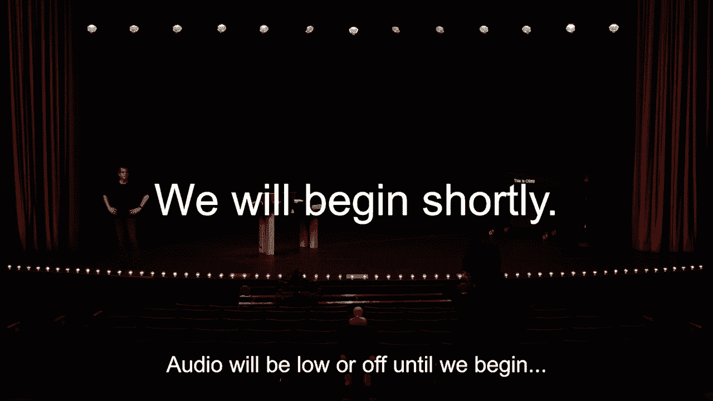

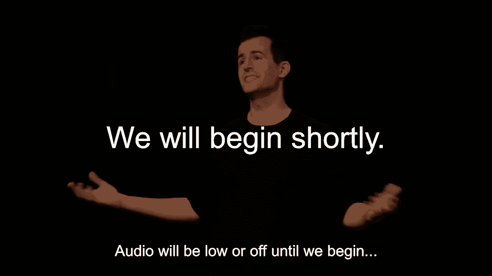

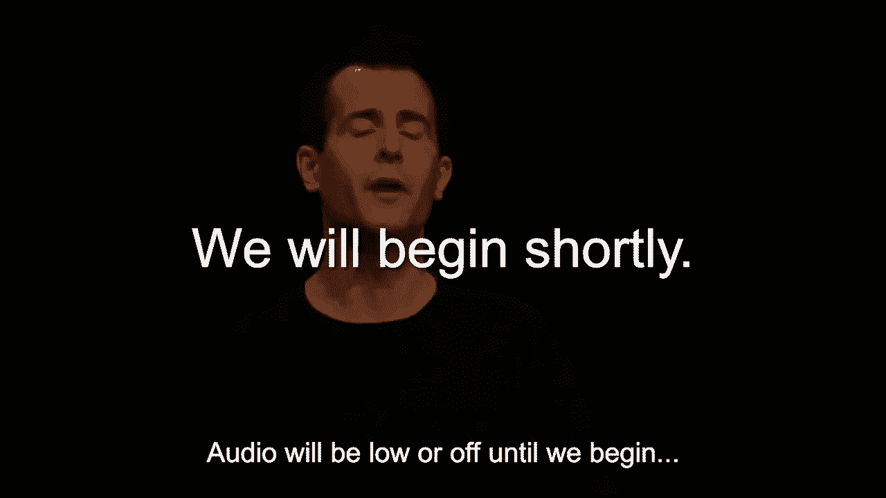

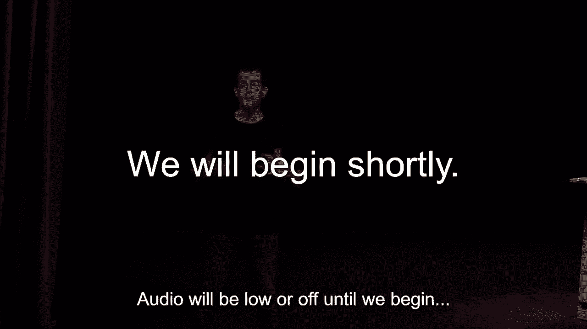

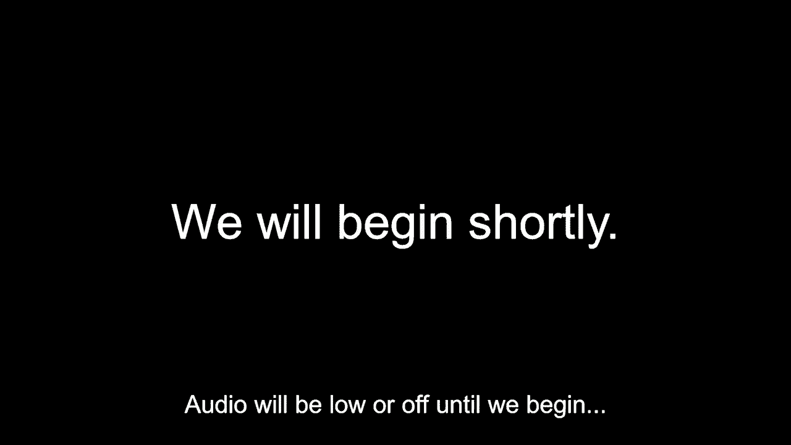

all right，this is cs50 harvard university's，introduction to the intellectual。

enterprises of computer science，and the art of programming and。

campus in，beautiful sanders theater together this。

of course is a little bit different this，year for，more than one reason but we're here。

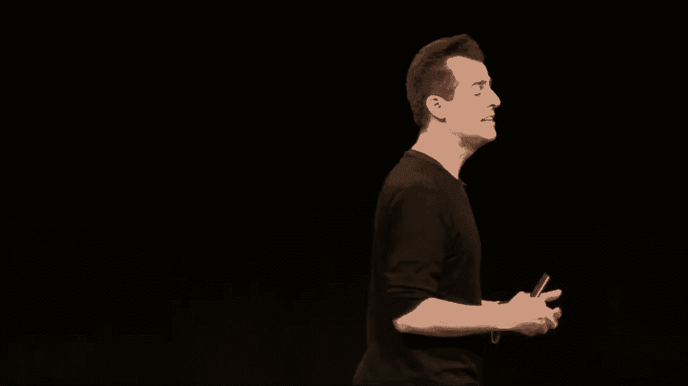

instead in the loeb drama center，at harvard university thanks to our。

friends in collaboration with the，american repertory theater。

we have this new space including uh even。

where we've been working with an，amazingly talented team over the course。

semester，and cs50 and so i dare say we'll have，some new and improved demonstrations。

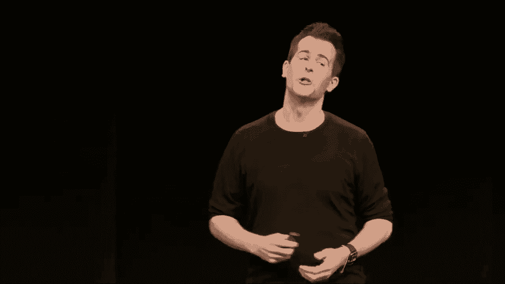

along the way so our thanks to our host，the american repertory theater。

now we wanted to evoke memories at least，or some imagery of，the campus itself particularly for the。

many of you who could not be here in，person this semester，and so we went into the harvard archives。

where among their collections was this，watercolor painting painted by a harvard。

graduate student over 200 years ago，jonathan jonathan fisher who sat in what。

jonathan jonathan fisher who sat in what，is now harvard square，looking in on some of the earliest。

buildings of harvard's campus，and thanks to technology we took what is。

a relatively small watercolor that，this graduate student painted some 200，years ago。

and now adorns the stage here in the，loeb drama center so if，left。

hollis hall to its right which is one of，yard，harvard hall which is one of the。

classroom buildings on campus，first years，and harvard's president uh live and work。

respectively so welcome then to cs50，and i can say that um not quite as long，ago。

some 20 years ago did i take the same，class but as you know，uh as as you know i i myself had some uh。

trepidation when it came to studying，cs50 when it came to studying computer，field。

i had followed a path when i got to，college of sticking within my comfort。

zone studying government early on，government，uh to，shop that is sit in on this class cs50。

that i realized that，homework can actually be fun and i found，about。

programming per se even though that's，how many of us perceive it in。

high school whether it's us or our，really is about，problem solving and as such it's so very。

applicable not only to computer science，and the engineering fields。

but really to the arts humanity social，sciences sciences，and beyond and so if you're feeling a。

little uncomfortable with the idea of，taking a class like cs50，know that most every year nearly。

two-thirds of the students，who take cs50 have never taken a，computer science course before，now。

odds are more than many of uh this，classmates joining you here today。

are in a very similar position you're，indeed in very good，company and what's ultimately important。

in cs52 we emphasize，as in the syllabus that what ultimately，matters in this course is not so much。

where you end up relative to your，to yourself，when you began indeed taking into。

account where you currently are perhaps，with no prior background and considering，months。

is ultimately meant to be the measure of，your own success and so toward that end。

we'll start off this class programming，a little something from yesteryear of。

image here of super mario brothers and，ascend，we'll recreate a portion of this game，albeit using。

text otherwise known as ascii art but，we'll do that in just the courses。

second or so week so this will be among，the first programs you write and then。

fast forward just several problem sets，or programming assignments later。

or several weeks later too and you'll be，building what we call cs50 finance。

a web application of your very own that，runs on the internet，and that interfaces with yahoo finance。

or a similar api，or application programming interface，quotes。

from a third-party service allowing your，own users to log in and register。

to buy and sell stocks so to speak using，virtual currency，several months。

will you go truly from building a，own，web application and more followed by the。

course's capstone experience，which will be your very own final，project but what exactly is。

computer science what we thought we，would do in this week zero the very，first week of the class。

is consider exactly what it means to，this is，computer science this is problem solving。

you have some input which is the problem，you care about that you want to solve。

and you care about the solution to that，problem which is the so-called output。

and in between that input and output is，this black box，of sorts inside of which is sort of the。

magic that happens the magic that you'll，eventually be able to harness。

and compel computers to solve problems，for you inside of that black box。

ultimately is going to be the code，that，we all kind of need to agree on how。

we're going to represent these inputs，and outputs we all kind of have to speak。

a common language so to speak，and so we need to agree how these inputs。

are going to be represented so how might，we typically represent information。

well maybe the simplest thing to do with，the very first class whether we're，online or in person。

number of people，in the room and so you might do this old，represent。

every person in a room with just a，finger raised on your hands so how we，to。

very simple digits on your hand of，course you can't count very high。

with just this hand but there's actually，school here，and that's unary notation uno implying。

one or one finger being up or down，and so you can count it would seem as。

high as five and of course if i bring in，a second hand i can go as high as ten。

and then things get a little more，difficult but it's a system for。

representing information and it's fairly，universal certainly when we're all quite。

young but you and i，just，digits on the hand but other sorts of，digits namely the decimal。

digits that you and i know so the，numbers that are otherwise more。

technically called base 10 and that's，just a fancy way of describing the fact，humans。

really tend to use typically those，digits of course are 0，through 9 and using these several digits。

can we compose，numbers like 0 through 9 but also 10 and，11 and 12 and。

as high up as we want to go by using，multiple digits still，but computers don't really speak the。

same language，as us they're in some sense much simpler，than we humans。

even though they seem so complicated or，at the end of the day，these are all human-made devices and。

they're relatively simple，at their core in fact even if you don't，quite know what you're。

saying but you've at least heard this to，be the case what language。

do you understand computers to speak，what language do computers speak。

if not the system that you and i use of，0s through 9s or decimal。

brian could we see who might answer this，what system do computers use so far as。

you've heard whether or not you've，taken a cs class before keith can we go。

yeah the uh computers use binary binary，yeah the uh computers use binary binary。

and can you elaborate a little bit what，do you mean by binary。

uh it's zeros and ones so like while we，use zero through nine for base ten it。

uses zero through one for base two，yeah exactly so computers use the。

so-called binary system by implying two，and they indeed only use as keep notes。

zero and one two digits so on the one，because wow，this is actually a pretty simple system。

if we're only using two of these digits，digits，how are we going to represent the number。

two or three or four or，any much larger number it would almost，seem like a step backwards。

but it isn't actually and it turns out，that this so-called system or base two。

two because there's two digits in the，as binary，uses just zeros and ones and it turns。

out there's other nomenclature here we，otherwise known as，two words，possibilities。

digits just being symbols on the screen，so binary digits are otherwise known as，bits and computers。

speak binary using these things called，bits but what does that mean and why is。

it the case like why didn't they invent，computers decades ago that just use zero，whole new system。

for us to think about let alone talk，about well at the end of the day，computers are using。

what is their input really just，thing，all of us do every day or every couple，phone。

is either make sure it's still plugged，in or to plug it in so as to charge it，devices these days。

is electricity in some form and we don't，have to get into the nuances of what。

electricity is but i think it's about，electrons flowing into the device so as，to charge it so。

it suffices for our purposes to know，device，these computers and phones that we use。

but that's it and so，if we harness this electricity maybe we，can start to represent information with。

old，ghost light in the theater here that's，currently off but it has the ability to。

turn on we just need to，plug it in or throw on a switch and，compelling。

about the metaphor of using lights is，that right now this light bulb is。

currently off but as soon as i allow，electricity to flow，switch。

now it's of course on and if i unplug it，or throw the switch again。

it's off or if i plug it back in it's on。

and the implication of this very simple，idea is that we can take a physical。

device like a single light bulb，and by plugging it in or unplugging it，just do。

i represented the light bulb being off，or on but we can just call off and on。

something else we can call them，zeros and ones and so this really is the。

germ of an idea that gave us，computers and with it their use of the。

binary system if at the end of the day，electricity，well let's just use that to harness and。

keep track of information let's store a，little bit of electricity。

when we want to represent a one and，let's let go of that electricity in some。

sense when we want to represent，a zero instead and so because the input，to computers is so simple。

thus gives us uh these zeros and ones，that we now use but we seem to have。

created a problem for ourselves，switch，if it's off it might be zero if it's on，it might be a one。

but how do i count higher than one that，problem still fundamentally remains。

well i could of course use more light，use，three light bulbs how high could we，count。

from zero to one two possibilities but，with three light bulbs how high could we。

count well let me go ahead and ask this，question here on the screen。

in just a moment you'll see on your side，this particular question。

by which you can respond on your device，bulbs，so instead of one i give you three each。

of which can be on or，off how high can we perhaps count。

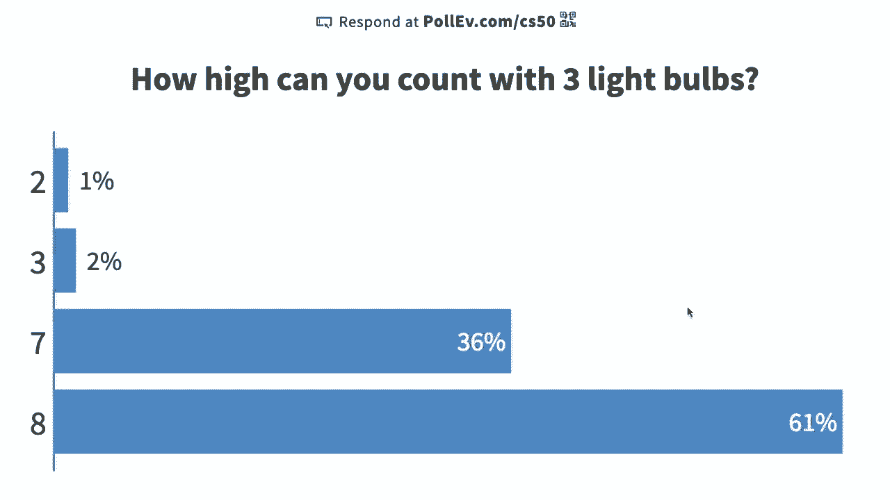

so you'll see on the screen here the，answer is coming in，we have a lot of folks thinking 60 plus。

percent that it's eight，is the highest you can count a lot of，you think it's seven and some of you。

also think it might be three，or two so that's actually an interesting，range of answers and。

let's see what might actually be the，case well let me cut back over to，which are off。

and most naively i think if we were to，turn these light bulbs on if they，currently represent zero。

obviously i could turn one on and we，second one on，and call it two turn on the third one。

and now with all three on we could say，now we're representing three but we're。

not really being clever enough just yet，if we're only counting as high as。

three because i'm just turning them on，in this story left to right。

but what if we were a little more clever，maybe we turned them on right to left or。

maybe we kind of permuted them，in different directions that is we took，on。

or how many fingers are in the air but，rather the pattern，created。

so let's just count this up so let me，somewhat systematically turn some of，these bulbs on here。

albeit virtually here might be one here，might be two，here might be three but then we're kind。

of done with that story so how might we，do it a little better well let's start，again at zero，two。

call this，4 call this 5 this 6，and this 7。 now it's fine if you didn't，but。

take my word for it that that was a，unique pattern，started it。

off off off and i ended it on on on but，along the way they were indeed eight but。

how high can i count，well it kind of depends on what number，you start counting from and just as we。

thus far，have been doing computer scientists do，all the time computer scientists and。

intern computer programs，typically start counting from zero just，everything is off。

you might as well call that zero so if，we start counting at zero。

and we have eight possible patterns that，we just saw pictorially。

well that would allow us to count as，high as seven so from zero to。

seven so seven is the highest we can，count with three light bulbs。

so those of you who propose that seven，was the answer 36 percent of you were，indeed correct，correct。

if you assume we start counting at one，and that's fine but at least in the，computing world now。

we'll generally by convention start，to say，that there's eight such possibilities。

all right well this is all fine and good，to represent things with patterns of。

light bulbs but how do we actually now，get to the zeros and ones，that a computer is actually using。

because what's inside of a computer at，the end of the day，switches。

millions of little switches that can，either be on or one，or off or zero those switches happen to。

be called transistors，and these days computers do have，millions of these things that can be on。

and off in different patterns so if you，have the ability to turn。

on and off all of these switches well，what can we all agree，on uh representation when it comes to。

using those switches，how will we represent information with，them well wonderfully。

we don't really need to think very hard，kids，if we consider for a moment not just。

zero and one but the whole decimal，system zero through nine that you and i。

all started our day with today how does，that system work well，here on the screen is one two three so。

yes you're probably thinking that's 123，but not quite，all i've shown on the screen is a。

pattern of symbols one，two three or three digits and all of us。

probably are instinctively just saying，obviously it's 123。 but it's probably。

been years since you considered why it，is 123。well let's consider what each of these。

digits or symbols represents，if you're like me you grew up learning，place。

the middle is the tens place the left，one is the hundreds place。

and so how do we get from these three，symbols or digits one two three，well all of us，1。

plus 10 times 2 plus 1 times 3 which of，course is just 100，plus 20 plus 3 or the mathematical value。

we all know is 123。 so，a bit of a circular argument but just to，remind us how we got。

from 123 to 123 well it turns out，that in the world of computers the，system they use。

is exactly fundamentally the same，the only difference is that computers。

only have access to zeros and ones not，zeros through nines，so if we consider now in the abstract。

just three possible digits，represented here let's consider for a，1。

10 and 100 and so forth well why was，that the case well there was a pattern。

in fact and it just has to do with，exponents or powers，so the rightmost column technically if。

we really get into the weeds，is 10 to the zeroth power which if you，recall just means one。

10 to the first power which is just 10，and 10 to the second power or 10 squared。

is 100 but what's interesting about，jumps out，that 10 is involved there's 10 digits 0。

through 9 so the columns are using this，base of 10。 so you can perhaps now get，even ahead of me here。

by considering well if in the binary，system the computer is used you only。

have two digits zeros and ones，odds are the only thing that's going to。

change is the meaning of these columns，now we have the ones place。

still because two to the 0 is 1 but then，we have 2 to the first，2 to the second and so forth and of。

course if we just do out the math，in the world of binary that computers，use we have the ones place。

two's place four's place and so forth，and now we're good to go even though we。

have to now think in a different，base system now we can start counting，of。

from the metaphor of light bulbs and，consider that if all of those light。

bulbs are off we're again just going to，start thinking of those things as。

zeros so that would be a pattern of，symbols or digits that's 0，0 0 in binary but in our human world。

the mental math you would probably do，now instantaneously after today。

would be well that's obviously 4 times 0，plus 2 times 0，plus 1 times 0 or of course 0 in decimal。

but how does a computer represent the，number 1，for instance well it's just going to。

change that right most，bit from a 0 to a 1 or more，switch on。

and illuminate that rightmost light bulb，just like i did earlier，1 0。

in binary how do i represent 3 this is，where we're about to differ。

now i'm putting on two of those switches，because i need something in the two's。

place and the ones place to give me，mathematically，three next if we go ahead and choose。

uh count up to four that's going to be，one zero zero，if i want to count up to five that's。

going to be one zero one six，is going to be one one zero and finally，the number seven。

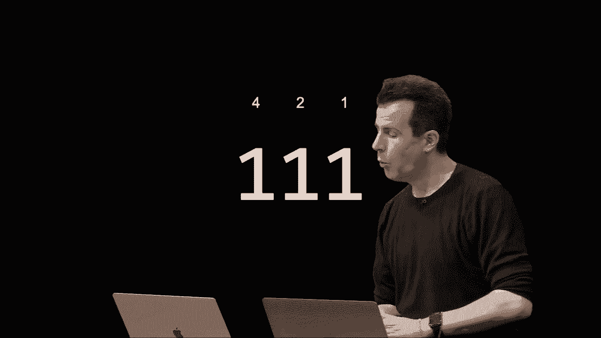

is going to be one one one，so it would seem that using three bits，each of which can be a zero or one。

yes you can permute them in eight，first，times two for the second times two for。

the third gives us eight but as per this，math and the intuition of starting，counting from zero。

we can only count up as high as seven，in total well let's go ahead and，we don't have。

just say uh let's say，one light bulb or three light bulbs we。

have actually the fortune of having like，light bulbs，a jar a door in the stage here and you。

know what sumner could we go ahead and，put up a random number，on the screen here all right so if you。

perspective，we have eight light bulbs plus another，off，off。

off on on so off on。

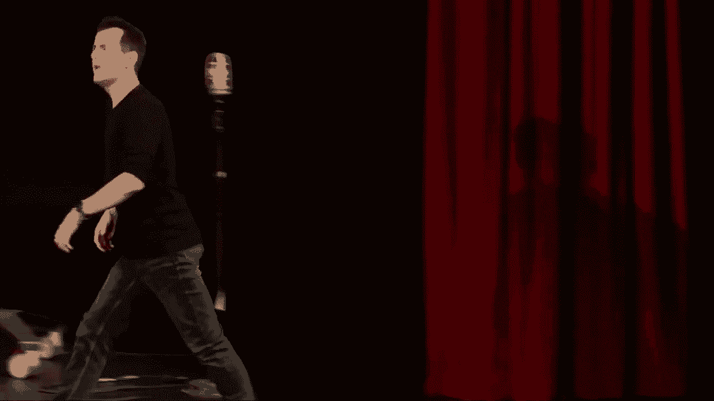

off off on on so let's go ahead and ask，a question then，just，one light bulb or two or three but。

several more in this case at least，six light bulbs what value do we。

actually get well let me go ahead and，put a question on the screen here。

which should pop up on yours in just a，end，this same question put in binary terms，number。

one one zero zero one，zero represents oh and，yes and realize that i have to clarify，reading it out。

virtually here what decimal number does。

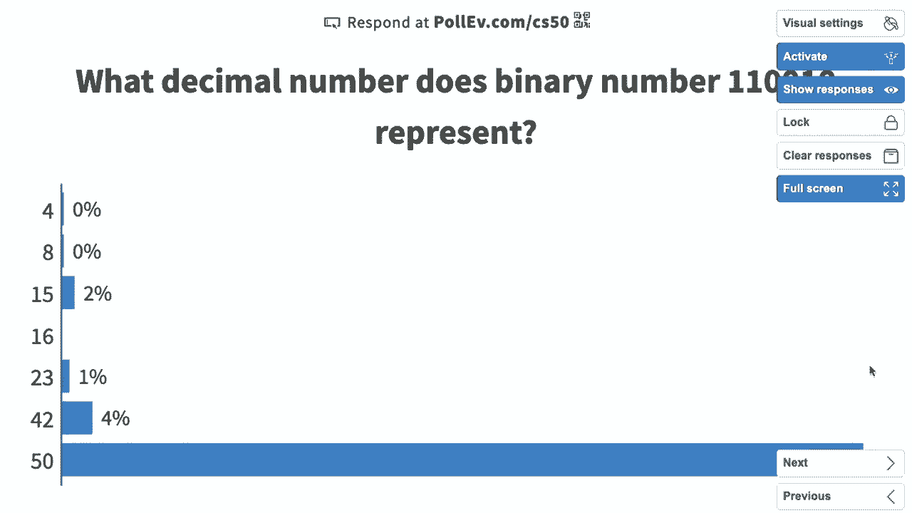

binary number 1 1，zero zero one zero represent from left，to right。

i unfortunately read it from my left to，my right but yours is the opposite。

so here we have uh an overwhelming，response 50，is indeed the correct answer now why is。

that well if i go over to the physical，light bulbs here let's just consider for。

a moment what the pattern actually is，place，4 8 16 32，and we could keep going but it's not。

going to matter because they're all off，so we have 32，plus 16 plus 2 which indeed gives us the。

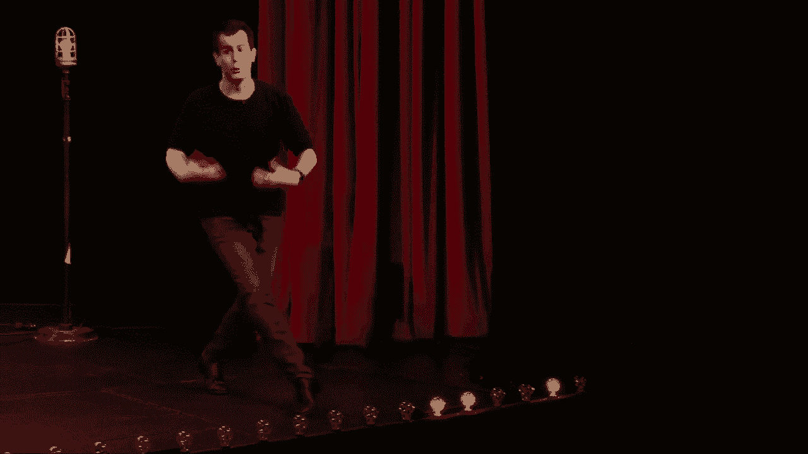

number you and i know in decimal，as 50。 and just imagine how high we。

could count with all of the other light，bulbs as well，all right so we started with the story。

with electricity we then moved on to，numbers and representing things either。

in decimal or in binary but we've kind，of painted ourselves into a corner。

because if we only have at our disposal，switches or the metaphorical light bulbs。

which we can think of，as zeros and ones it would seem that the，only things computers can do。

is compute that is behave as calculators，and in fact early on，that's exactly what computers were。

designed to do was really facilitate，mathematical calculations that were，for humans。

but of course what you and i are using，right now what we use every day on our。

phones and our laptops and desktops，is much more sophisticated so let's。

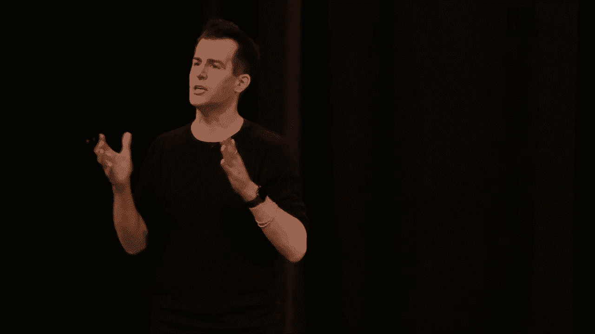

consider how could a computer represent，not just numbers，but letters of the alphabet brian could。

we call on someone for this one if you'd，like to raise your，virtual hand how could a computer go。

about representing letters of an，alphabet like english，if again all we have at our disposal is。

what do you think let's see sophia could，what do you think let's see sophia could。

oh we can assign the numbers that we're，getting from，alphabet。

yeah we can assign the specific numbers，in binary to letters of the alphabet。

that's pretty much our only option it，would seem if we only have the ability。

to permute these switches or light bulbs，or bits well we just all have。

to agree how to represent letters in the，same way now maybe the simplest way for。

us to do this would be you know what，let's just all agree that a capital a。

is going to be the number one so you，binary number，one uh well how about for b we could use。

the number two，number three，d could be four and so forth we all just，have to agree to number。

out humans did，exactly that but a little bit，differently years ago they decided。

for reasons that we won't get into just，now that actually the capital letter a。

is actually going to be represented by，the decimal number you and i，know as 65。

 now in bitwise form that's，going to look like this so this is the，pattern of bits。

that a computer would use to represent，the decimal number we now know。

as 65 and now what the computer is going，to do is just be mindful of what type of。

program you're using，so yes if you're using a calculator or，maybe using something like。

excel to crunch numbers well in that，context when running，software like a calculator or，analysis。

the program is going to see inside of，the computer's，represents。

the decimal number 65 and because it's，in the context of a calculator or，on the screen。

is literally the decimal number 65 but，if you and i are using text messaging or，numerically。

but in letters say english letters in，that context your pro，your computer is going to be smart，bits。

that represent 65 in the context of a，text message，or in an email or the like actually。

represents the capital，letter a so the pattern is the same the，representation is the same but the。

context is what differs，and the system that humans came up with，years ago that maps 65 to。

a 66 to b 67 to c，is called ascii the american standard，code for information。

interchange and that just means that，there is a well-defined mapping。

that a bunch of humans decades ago，decided on in order to map。

letters of the alphabet english in this，case to numbers starting with 65 and，punctuation。

for lowercase letters and the like so，given that，given that suppose that you did receive。

a text message containing a pattern，of bits or really just a sequence of，decimal numbers。

that happen to be this 72 73，33 suppose that you received a text，message containing these。

patterns of numbers 72 73，33 what message might you have just，received let me go ahead and pull up。

the abbreviated chart here to consider，exactly what message you've received。

72 73 33 and sumner could we go ahead，and throw this，same three-letter word on this on the，lights。

if you'd like to see it in bit wise form，so to speak，that same pattern 72 73 33，now。

as well what pattern does this represent，uh lanham can we go to you。

uh that would be high with an excellent，exclamation point correct yeah so it's。

indeed high with an exclamation point，and it's probably pretty easy now in。

retrospect to glean that yes the 72 and，the 73 were h and i respectively。

um but lanham also noted the exclamation，per the dot，dots there is a well-defined mapping for。

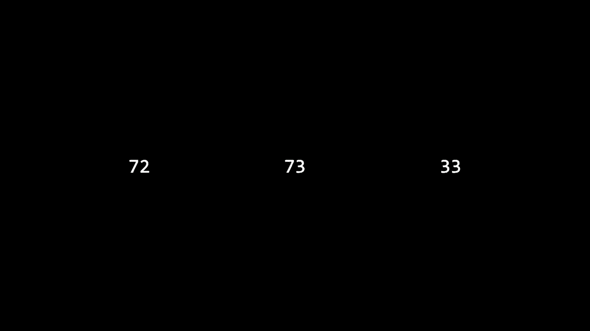

we might care about，and so high is perhaps more obvious than。

the other that 33 we need a bigger chart，and so if you actually go on your，computers now to ascii。

ascii chart。com you'll see a little，something like this though you can also。

just google ascii in general and get，copies of the same chart。

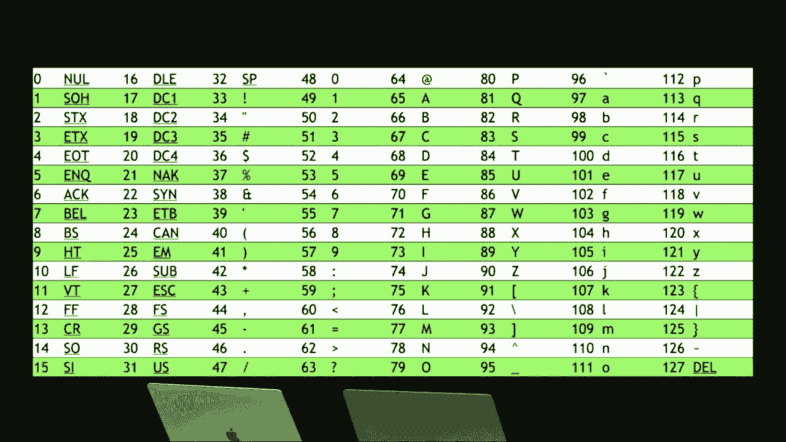

you'll see here that h is indeed 72 i is，indeed 73 but if we look to the left。

33 is apparently an exclamation mark and，you would only know that by having。

looked it up or just having committed it，to memory but the computers you and i。

use and the phones you and i use，just know this intrinsically that's，indeed how they're programmed。

but it turns out too that we should，consider just how many zeros and ones，we're using now。

to represent the 72 the 73 and the 33，so let's look for one last time at the，light bulbs。

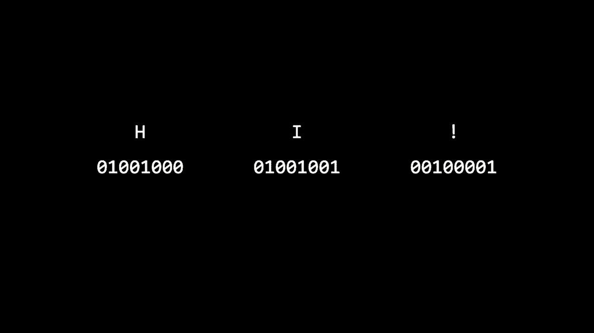

are these patterns of bits here so when，you receive a text message from a friend，saying hi。

hi exclamation point in all caps you're，technically receiving a pattern of bits。

some kind of frequency if it's wireless，that represents，this pattern of bits and typically。

computers these days，use eight bits to represent each of，those characters when ascii first came。

out they typically used seven for，efficiency reasons，because space was expensive back then。

but here we used eight，and indeed that's now the norm when it，comes to representing characters in。

multiples of eight so we have，eight bits here eight bits here eight，message high，total。

now frankly bits are not a very useful，unit of measure typically because。

they're so small just a zero or a one，actually have，a vocabulary word if you will which is，this。

term in some context but generally in，the context of megabytes or even。

gigabytes indeed when you talk about the，speaking，in bytes in some form either million or。

billion bytes，but each of those bytes quite simply is，a pattern of eight。

zeros and ones so in fact if we have as，many as 64，bulbs at our disposal that's 64 divided。

by eight that's eight characters so it，would seem we could spell on this stage。

even an eight letter word if sumner we，could put up a random eight letter word，that will keep up now。

um can you now spell from left to right，your left to your right an eight-letter。

word using the system，known as ascii but of course we're being，a little bit biased here as ascii。

is the american standard code for，information interchange and on a typical，u。s english keyboard。

there's more character certainly than，uppercase letters like a，through h and i there's also some。

punctuation and some numbers，but there's also quite a bit missing as，the world。

odds are would find using a keyboard，like this especially eliminating。

uh especially limiting or frustrating，why is that what seems to be missing，from ascii。

what seems to be missing from asking，well let me let me ask this one，and we therefore give。

ourselves eight bits or one byte，how much how many different characters，could we potentially。

actually display actually represent so，on your screen you should see this。

question now how many symbols can you，represent with eight，with eight，bits and this speaks to。

really at the end of the day how many，letters of the alphabet，plus punctuation plus uppercase and。

lowercase can ascii or really can，computers support，well it looks like 72 percent or so of。

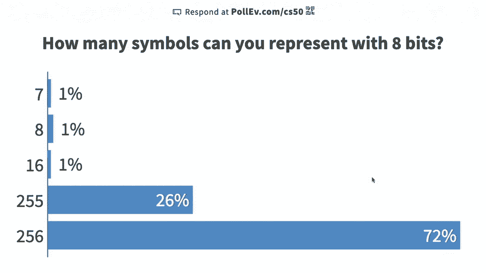

you think that the answer is 256 and it，is indeed the case，why，you can actually do out the math if。

be a zero，or a one that means you have two，possibilities for the first。

times two possibilities for the second，times two times two times two。

that happens to be two to the eighth or，two hundred fifty six it's fine if。

that's not immediately obvious，but if you do have eight bits each of，which can be one of two values。

you can come up with 256 possibilities，those of you who chimed in to say that，the answer is 255。

in this case are wrong only because now，we're talking about the total number of。

patterns which is indeed 256，with，eight bits or eight light bulbs it would，seem to be indeed。

255 and that's because of all of the，different patterns we can permute。

but let me open the question to the，audience now why might a u。s english，keyboard be especially。

limiting and in turn why is ascii，really not quite appropriate when it。

comes to representing human language，even though this is what computers began，with years ago。

what is missing from ascii，why might 256 total possibilities not be。

sure um i mean for one thing missing a，sure um i mean for one thing missing a。

lot of the accents that are not other，languages but if you just consider like。

asian languages there are a lot more，than 256 characters，exactly so not only are we missing，necess。

that you might need in some languages，we're also missing the characters that。

you might need in asian languages in，languages like arabic and the like there，are way more。

symbols that we humans use to，communicate in print and electronically，than 256。

 english we can get away with，fitting into this keyboard but not once，characters。

let alone other symbols as well and it，turns out there's other things we humans。

like to say these days，come into vogue，which is namely these things odds are。

probably sometime today you have sent，or received one of these things here。

otherwise known as an emoji，now even though these emojis look like。

pictures they look like images and they，are technically，the way they're implemented in computers。

is actually as，patterns of zeros and ones these are，actually just characters。

in an alphabet the emoji alphabet which，is to say there's some pattern of zeros。

and ones that represents each one of，these faces and the many other emojis。

that nowadays exist and this is because，years，from ascii which only used seven and。

even in some sense eight bits，total to represent all possible，characters two using。

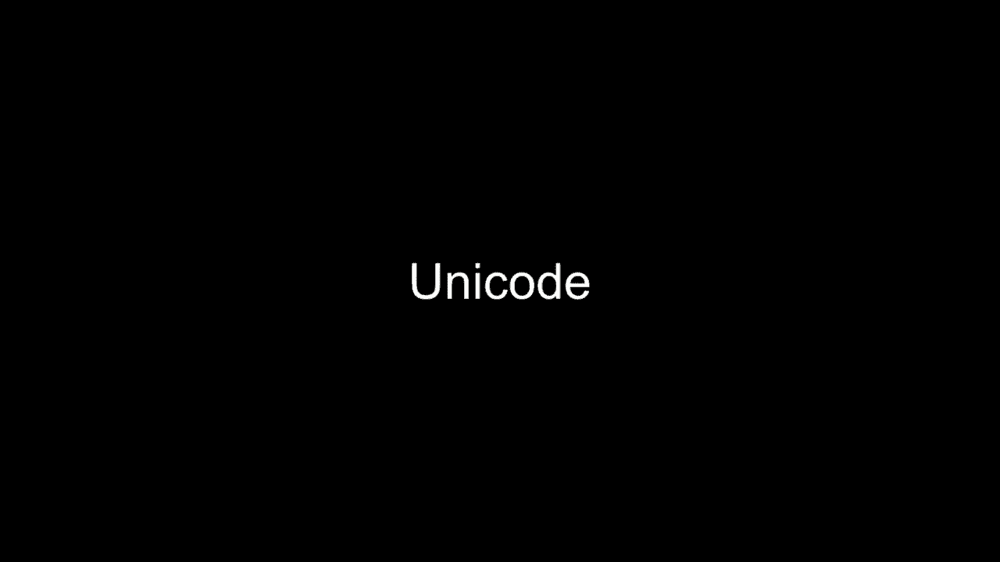

either 8 or 16 or 24 or even 32 bits，nowadays there's a system called unicode。

which humans have come up with that，support not only english，but also all of the english all of the。

human languages，is the aspirational goal both written，and spoke。

written in print or electronically is，the goal and in addition to that。

this is to say we can represent things，like this so this is the so-called face，with tears of joy。

and this face of tears of joy as of last，year was the most popular emoji。

sent via text messages emails social，media and the like，but at the end of the day all you're。

receiving is like a key on a keyboard so，in fact you wouldn't know it to look at，it but in fact。

the decimal number representing this，face with tears of joy happens to be。

128 514 so to kevin's point，to represent not only certain human，need，way more than 256 characters。

so we can use not just 8 bits but 16 or，24 or 32，that's a huge amount of possibilities。

out of these things，if you receive that face with tears of，joy or send it。

you're technically just sending a，pattern of bits that looks，like this that's all that's going on。

these things，all right so we started again with，electricity we then represented numbers。

now we have the ability to represent，letters and even emotions in the form of，emojis what else。

is there out there well the emojis，we've looked at，are pictorial in nature and so that。

invites the question well how does a，computer represent things like color。

like that that face with tears of joy。

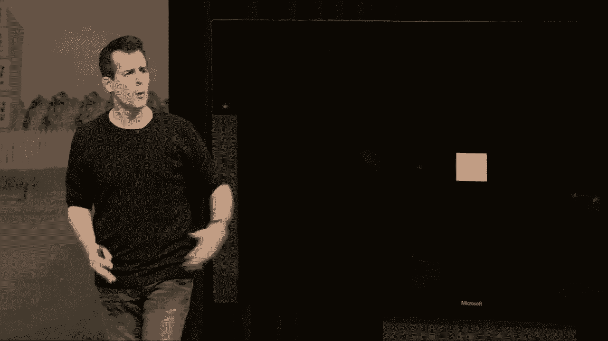

had a lot of yellow in it so how is，yellow or any color for that matter，represented in a computer。

well let me ask the audience again if，all you have at your disposal is。

bits zeros and ones and we just as，humans need to agree how to represent。

colors what might be one possibility，it doesn't need to be the answer but，what might your own。

instinct be if designing this for the，first time yourself，how might a computer represent colors，now。

uh you would like assign numbers to，uh you would like assign numbers to。

different colors and shades and，just use the same system yeah exactly。

perfect instincts you would just assign，numbers to the different colors。

and we all just have to agree on what，that that mapping is actually going to。

be so it turns out there's different，ways to do this and if any of you are。

artistic and use photoshop or the like，acronyms like，rgb red green blue but there are other。

acronyms and other ways，to implement yasmin's idea where we just，somehow map uh。

zeros and ones to actual colors well rgb，just happens to represent red green and。

blue and this is a system humans came up，with years ago that says you know what。

we can actually get every color of the，of red，and green and blue light essentially so。

that just invites the question well how，do we represent the amount of red。

how do we represent the amount of green，and how do we represent the number the，amount of blue。

and we have as yasmin says bits at our，to do this，so suppose we receive a pattern of bits。

that's 72 73 33 again，but this time it's not in an email it's，not in a text message。

it's in the context of a file that i've，opened in photoshop，so it's as though i've opened a。

photograph that someone sent me and i，want to do some editing，turn bits。

well what is that representing in this，message，it's still high but in the context of。

is oriented around，images it's actually going to represent，some amount of red some amount of green。

some amount of blue，and as you we discovered earlier the，total number of possibilities you can。

represent with eight bits happens to be，256，the highest value you can represent is。

255 if we start counting from zero，so this is to say that each of these。

three numbers is a number between 0 and，255。so 72 feels like a medium amount of red。

73 is like a medium amount of green 33，is like a little bit of blue。

and if you combine those three amounts，of color，eight bits plus eight bits plus eight。

bits using 24 bits total，using the first third to represent，redness the second third greenness and。

the third third，blueness you get it turns out a dot，that looks like this a yellow dot and so。

indeed that emoji when it's being。

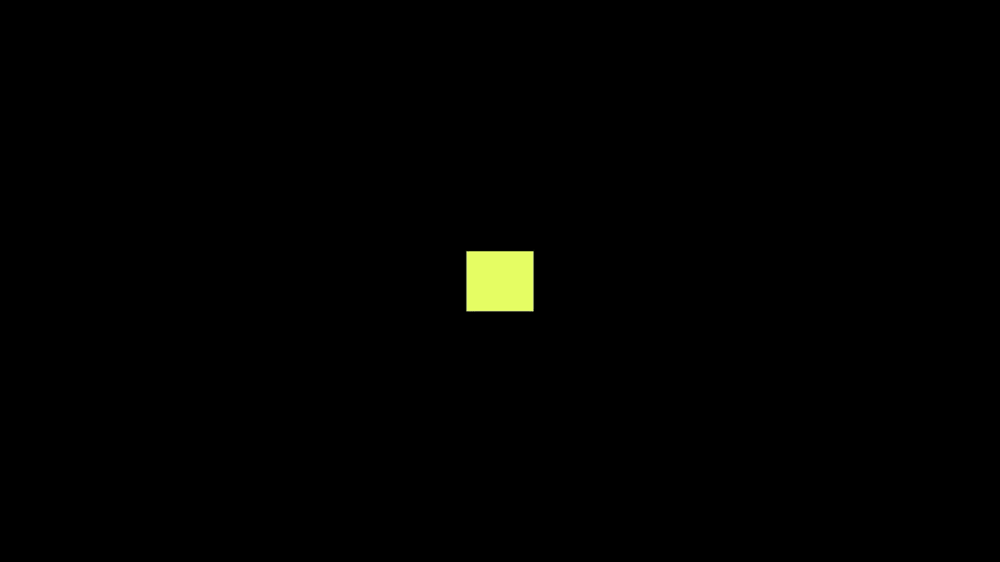

displayed on the screen，is the result of the computer，interpreting the 128。

514 value is knowing oh that's the emoji，for with the face of tears of joy。

but when it comes to displaying the，computer，is going to be using different patterns。

of bits to control the colors of the，might already know，the dots you and i see on our computer。

screens or even tvs these days，are called pixels they're tiny little，squares that represent。

some color such as this yellow one here，and you can actually see them in some。

context if i go ahead and pull up，the same face with tears of joy and zoom。

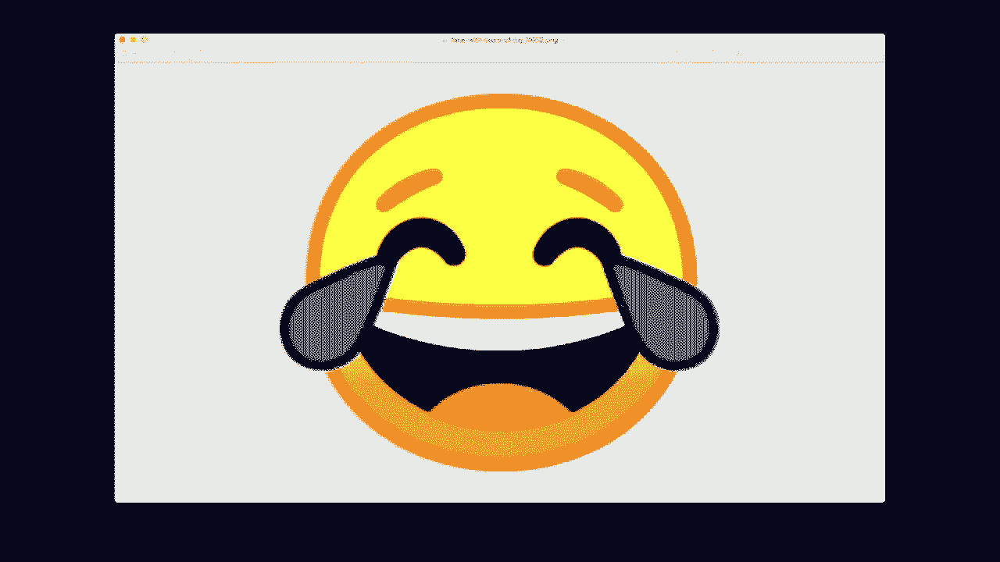

in a bit zoom in a bit more，and really zoom in a bit more now you，can actually see what we call。

pixelation and odds are you have seen，this on facebook instagram wherever。

you might be resizing or editing photos，that don't quite have enough resolution。

the resolution of an image，is just how many pixels or dots there，are horizontally。

and vertically so if you really zoom in，on an image you'll eventually see，even in this。

zoomed in happy face there's a huge，number of yellow dots and a whole bunch，well。

that compose this very colorful image，and so you can see them in that case and。

every one of those dots now，a pixel is using i claim like 24 bits or。

three bytes now you can imagine there's，probably what hundreds maybe thousands。

of dots in that image if we zoom out and，look at all of them again。

so if every one of those dots or pixels，is three bytes，this is why the photographs you and i。

from the internet，are typically measured not even in bytes，bytes。

or megabytes for millions of bytes or if，bigger，billions or gigabytes but that's all。

that is happening underneath the hood，we're just representing。

information in this way well let me ask，a follow-up question now，if we've now thanks to yasmin。

represented uh，all in，images is a grid of pixels you take the。

same principle asmin proposed where you，represent each color，of a dot and you have a whole bunch of。

dots that gives us images，how would you propose computers，represent video files。

again even if you don't know the answer，how might a computer represent，video files now using again。

only bits at their disposal，who might like to field this one how，might a computer represent。

um i'm maybe just like rapidly changing，um i'm maybe just like rapidly changing，the bytes。

just rapidly changing the bytes and i i，i hear can you elaborate a little bit。

what do you mean by changing the bytes，um like rapidly changing the the，rgb of individual pixels。

exactly to match the image，of the of that second of the video or，portion of the video。

perfect so if you think about like the，rectangular screen that is your phone or。

your laptop or your desktop monitor，if you just keep changing the colors of，those dots。

once per second or a whole bunch of，times per second we'll get the。

illusion that there's actually motion on，the screen ergo video so really a video。

in some sense it's just a whole bunch of，images to yasmin's definition flying，across the screen。

really quickly and so you can see this，even old school style for instance let。

me go ahead and open up on my screen，uh a short video that represents a flip。

book so you might have made one of these，as a kid or maybe your teacher did or，you saw them at least。

in person somewhere where if you take a，whole bunch of pieces of paper。

and staple or clip them together in some，way draw a whole lot of pictures。

all of which are similar but slightly，different on each，page you can create an animation or。

really a video and this is all a video，is in the purely electronic world even，paper。

uh what happens in the computer world is，indeed just a whole sequence of images。

flying across the screen，at some rate and that's what actually。

gives us the video files that you and i，know today and there's even more rabbit。

holes we can go down for instance how，might you represent music。

well music could be represented gosh in，different ways like if you played the。

piano for instance you might know that，there are notes like a through g but，forth。

but you know what maybe we just need a，number to represent each of those，possible notes，number。

just like images use multiple numbers to，represent dots we could use a number to，represent the note。

in a song but also another number to，represent the duration of that node how。

many seconds or milliseconds or beats，should you hear that note for so you can。

come up with other formulations too but，music really，can be quantized in the world of。

computers into just small pieces of，information and so long as you and i。

agree on how to represent it，that's how these things all work and if，you've ever wondered。

why there are jpegs and pings and gifs，all of these different，computers。

those file extensions or formats just，represent a whole bunch of humans，agreeing how to store。

patterns of zeros and ones in a file so，that when those zeros and ones are。

loaded into a computer for display，or for interpretation it knows what，those patterns represent。

images are represented slightly，differently sound and video are，represented slightly differently but。

it's all zeros and ones，at the end of the day so this is all to，say so long as we all agree。

ideally around the world how to，represent information，now we can represent inputs to problems。

and hopefully solve problems，and get outputs so all that remains in，problem solving or really。

computer science broadly is to look，inside of this black box and to consider，letters。

images video sound and convert them，into actual solutions and so inside of。

this black box is what we would，typically describe as，instructions。

for solving problems they don't even，have to involve computers we humans can，execute algorithms。

just by following someone else's，instructions if you've ever，prepared something from a cookbook。

following a recipe you are executing an，algorithm step by step but unlike a lot，of recipes。

or unlike a lot of instructions that we，humans give to each other，there's no room for ambiguity in。

computers computers algorithms when，implemented by machines，they really have to be not only correct。

so that you get the right outputs that，precise，you need to be ever so precise because。

unlike we humans who can kind of like，what you mean，computers are going to take you，computer。

that is translating an algorithm，step-by-step instructions into some。

language the computer understands，the onus is on you to make sure that the。

computer cannot misinterpret，what you want so let's consider one such。

algorithm so on all of our phones，whether ios or android or the like。

you have some contacts application and，that contacts applications probably。

storing all of your friends and family，members and colleagues，probably alphabetically maybe by first。

name maybe by last name or，however you've organized that device，well the old school。

version of this happens to be in paper，form which looks a little something。

like this a phone book and inside of an，old school phone book really is that，much more。

much more printed but it's the same，thing there's a whole bunch of names and。

numbers in a typical phone book，android phone，or ios phone might be as well so suppose。

we want to solve a problem and the input，book，but also the name of someone to look up。

the number for so my own name for，instance if i want to look up。

my phone number or you do you might open，up this book and start looking for for。

david for instance if we assume that，it's sorted by first name。

i don't see david on the first page so i，move on to the second。

i don't see myself there so i move on to，the third i don't see myself there so i。

move on to the fourth，for my name，and in turn my number well if，correctness is important，algorithm。

turning the pages step by step looking，for david，correct what do you think within。

zoom you should see some icons under the，participants window，labeled yes and no if you'd like to go。

ahead and vote，virtually yes or no，time，looking for myself never mind the fact。

that this is yellow pages and so，i'm not going to be anywhere in the。

phone book but indeed we'll assume it，contains humans，as well all right so it looks like。

the algorithm is indeed correct，but it's terribly terribly slow and，we're，computer science。

is not only the correctness of an，algorithm but also the efficiency how，well designed。

is the algorithm this is correct it's，slow，but i will find myself but of course we。

can do better instead of find looking，for myself one page at a time，four。

six eight ten i it sounds faster and it，through the phone book，looking for myself is this algorithm。

correct let me go to someone in the，audience this time，is this algorithm of searching for。

someone's name two pages at a time，correct because i claim it's more。

efficient i claim it's better designed，because i'll solve the problem twice as。

no because you might um skip your name，no because you might um skip your name，on the page yeah。

i might skip my name on page and let me，ask a follow-up question can i fix this。

do i have to throw out the whole，algorithm or can we at least fix this，problem do you think i think。

it would have like whatever page you，flip to it would help to select what。

name is there and maybe see if your name，would come before or after，nice so that's exactly the right。

intuition i don't think we have to，completely sacrifice the idea of，twice as fast，i get to the。

e section which is one letter too late i，should at least double back。

one page because i could get unlucky and，maybe david is kind of sandwiched in，between two pages。

at which point i might fly by get to the，end of the phone book say no there's no。

david and i just got unlucky with like，50 probability but as you propose i can，at least recover。

and sort of conditionally ask myself，wait a minute maybe i just missed it and。

double back so i can get the overall，speed improvement，but then at least fix that kind of。

mistake or bug，and bug a term of art in programming a，bug is just a mistake in a program or a。

mistake more generally in an algorithm，that，when we actually go to search for，phones do。

they typically don't start at the top，and go to the bottom，and computers do exactly what you might。

do more intuitively they'll probably go，roughly to the middle maybe they'll skew。

a little to the left if you know d，is toward the start of an alphabet but。

no i open to the middle sort of sloppily，and i'm in the m section。

so what do i know when i'm in the m，on one，one more person i'm in the m section。

what would you do as a human now taking，this as input to solve this problem。

what do i know about the location of，course，my name in the phone book what can i。

what decision can i make here，what decision can i make a kyle what do。

yeah um so from the m onwards you know，yeah um so from the m onwards you know。

that your name won't be there for sure，yeah so my name's not going to be in the。

m section but thanks to the，alphabetization of the phone book i at，least know you know what。

i can take a huge bite out of this，both，both metaphorically and also literally。

in the case of a phone book and i can，literally throw，half of the problem away and so if i。

started with some like a thousand pages，in this phone book or a thousand，contacts in my phone。

just by going to the middle roughly and，taking a look to the left and the right。

i can decide as you note，well it's not right on the page i'm。

looking for but i can decide it's to the，left or to the right。

i know d comes before m and so now i can，go to the left and you know what's，interesting here。

is that i can use that exact same，differently，i can apply the same logic open to the。

middle of this half of the phone book，and now i see him in the g section so，can tear。

half the problem away throw it down and，now i've gone from like a thousand pages。

to 500 pages to 250 pages，if i do this again i might find myself，oh i made it to the c。

section now i can tear the problem in，half again throw the left half away。

and now i'm down to just 125 pages now，that's still a lot，but my god i've gone from a thousand to。

500 to 250 to 125，that is way faster than going from a，faster。

than going from a thousand to 998 to 996，to 994，both of those algorithms are going to。

take me much longer as well，so it turns out when you actually look，949-468-2750，949-468-2750。

feel free to text hello or call to say，hi but，the point being that i found myself much。

more quickly with that，that third algorithm so what then is the，takeaway well we can consider this。

actually a bit visually，let me go ahead and rather than tear the。

whole phone book in half again and again，we have this visualization made by brian。

wonderfully that depicts a thousand，twenty four page phone book。

with one page being flipped at a time，and now we're down to nine ninety six，nine ninety five。

i mean honestly this isn't all that，enlightening it's going to take forever。

to find david or any name in a phone，book when starting，at that kind of pace with that algorithm。

but what if instead i'm a little smarter，and i'm a little more intuitive and i，had。

and i start with a thousand 24 pages，again and this time，divide and conquer half at a time。

splitting the problem in half tearing，the phone book in half。

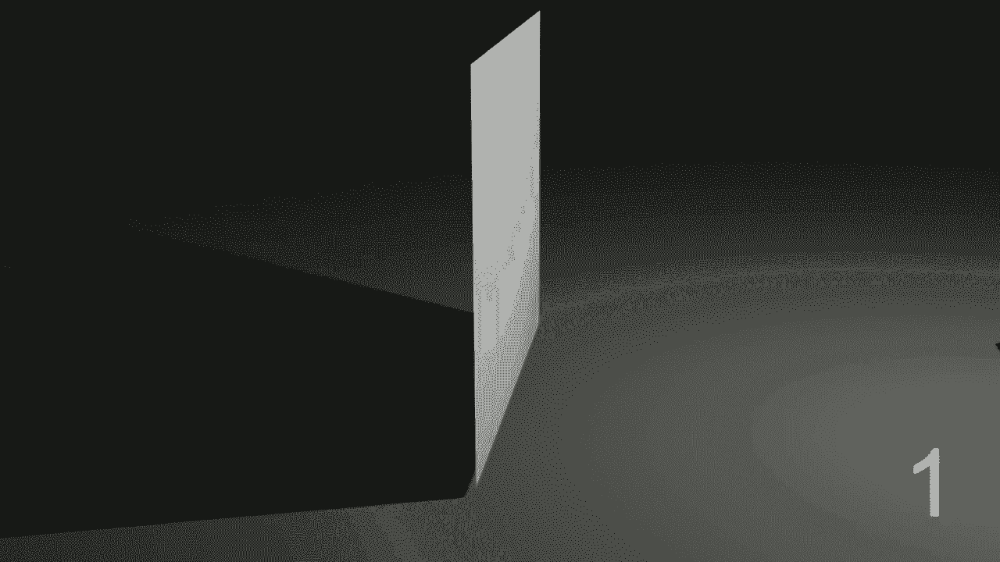

i get down to just one page and if we，actually do out the math if you start it。

like a thousand plus pages，that phone book，468-2750 so，468-2750 so。

that just is to say that the third，algorithm is not only correct just as。

the first one definitely was and the，second one could be，with that bug fix but it's also much。

better designed it's much more efficient，and so we can see this a little，graphically as well。

let me go ahead and propose not a，numerical analysis or anything like that。

but just something that's a little，visual，like this so if i have an x-axis here。

that represents horizontally，the size of the problem the number of。

pages in a phone book and vertically on，the y-axis the amount of time required。

to solve a problem what do these，algorithms look like if we just kind of。

chart them well the first algorithm，depicted here in red，is just a straight line it's a slope of。

one because there is this one to one，relationship between number of pages and，it。

for every new page of that phone book，grows，it's going to take me one more step to，potentially。

in that phone book unless i get lucky，and they're early in the phone book，turn。

the second algorithm is actually better，it's still a straight line。

so it's still a linear relationship，but for every two pages in the phone。

book it takes me one more step，two pages one turn two pages one turn so。

it's strictly better than the first，algorithm why well if we consider this，for instance so。

if we assume for the sake of discussion，maybe the phone book has this many pages，depicted with this。

dotted line well how much time is it，going to take the second algorithm。

to find someone in that phone book it's，going to take this amount of time right。

where those two lines intersect，if you're using the first algorithm，actually going to take，as much。

so they're both correct assuming we，double back as needed if i go too far。

past a name but both of those are sort，of fundamentally the same they're the。

same shape and honestly they both felt，slow to say and to act，out the third algorithm if we were to。

graph it has a fundamentally different，relationship，between the size of the problem and the。

time required to solve the problem，the line goes up up up up as it should。

because the more pages there are the，more time it's going to take to solve，but notice how much more。

slowly it goes up this thing barely，starts to rise，as the size of the problem gets bigger。

intuitively，well here what's powerful is suppose，reason，doubled in size maybe cambridge and，into one。

big phone book so there's 2 000 some odd，pages now instead，how many more steps would it take next。

book，one one more step and so if you look way，out here along this green line。

doubling the size of the phone book the，line itself is only going to rise ever。

so slightly because no big deal，with that third algorithm you're taking，much bigger bytes。

out of the problem and so this too，programming，are ultimately like harnessing ideas。

that you come into the class with and，that you might use in your everyday life。

but you don't necessarily think about，how you might represent。

problems using those algorithms and how，you might translate them to，start to think about。

algorithms is not only their correctness，for instance here，i've deliberately labeled these three。

lines n n over 2，that if we use n，as number so computer scientists tend to，use n as a variable。

uh when much like a mathematician might，say x or y or z and for number。

and so the first red line is the running，time the number of steps it might take，case n。

if there's n pages in the phone book，maybe i'm looking for someone way at the。

end of the phone book and it's going to，take me all n steps to find them。

the second algorithm is going to take，half as many steps so we express that as，n divided by 2。

because if we're doing two pages at a，time we'll get to the end of the phone，name。

starts with z for instance twice as fast，but the third algorithm if you're a。

little rusty on the mathematics，is represented as a logarithm with a，base of two，green line。

describes how much time it takes to，solve a problem，when on each pass on each step。

you are dividing the problem in this，case by half，the other two algorithms are taking one。

or two bytes out of the problem the，third algorithm was taking half of the，whole problem。

at a time and that's what made it all，the more powerful，so when it comes to programming now we。

algorithms，to code or in this case let's call it，pseudocode and in just a bit。

we'll focus on an actual programming，language albeit a graphical one but for，now let's just consider。

some of the constructs or sort of，fundamental ideas that are going to be。

useful to leverage here on out，in this class so let me propose that。

what i really just did verbally can be，translated into pseudocode。

which is like an algorithm implemented，in english or whatever your spoken or。

written language is but the key is that，it's got to be correct。

and ideally it had better be precise so，that there's no ambiguity。

step one was indeed what i did pick up，phone book step two，open to middle of phone book step three。

look at page and indeed i did that，and now things got interesting step four，page。

what do i want to do well i should，probably call that person the problem is。

solved i've gotten my output the，person's number，but there's another possibility not if。

the person's on the page but rather if，the person is earlier in the book and，ended up on m。

but i'm looking for david that's to the，left i should then，do what open to the middle of the left。

half of the book，and that's indeed what i did and i sort，of gratuitously tore the problem in half。

but algorithmically i just looked at the，left half，of the book next what do i do next well。

really that's the point at which i，propose that the algorithm is now just。

repeatable again and again and so we'll，say go back to line three why。

well starting at line three i have an，algorithm for looking up someone in a，book now。

is half as large but there's another，case what if the person is later in the，starts with d。

but someone else's name that's toward，the end of the alphabet。

well then if that person is later in the，book same idea open to the middle of the，back to step。

three but lastly there's a fourth，possibility，there's a fourth possibility either the，the left。

are just，not there at all and this last point，though somewhat subtle is so important，even phones。

have had that very frustrating，experience where like your phone，your your computer hangs you get the。

stupid spinning beach ball or hourglass，the thing freezes or just reboots you。

know something goes wrong and it's sort，of inexplicable，and you might think it's your fault but。

really it's usually，the programmer's fault who wrote the，software that you're using on your。

computer or your device，why very often that programmer for，whatever reason。

did not anticipate a possible scenario，in this case there's four scenarios but。

you could imagine kind of forgetting the，fact that oh well maybe david's not even。

in this phone book but you'd better，handle that scenario and when you have a。

computer that freezes or hangs or，reboots or just something goes awry。

that is quite often quite simply because，a human did not，code for some possible scenario so。

what are the fundamental concepts we've，seeing，in class well highlighted in yellow now。

are really some verbs or，actions that we exercised with that，phone book these are in general in。

programming called，functions a function is an action or a，verb it's a statement that gets the。

computer to do something，next highlighted here are what we'll，call conditions or branches。

these are sort of the proverbial forks，in the road you could either do this。

or this or maybe this other thing and，you can have one decision to make or two。

or three or four however many conditions，conditions，but how do you decide which fork in the。

road to take，whether to do this or that or this other，boolean，expressions a boolean expression。

is just a question whose answer is yes，or no or，true or false or frankly one or zero。

all of those would be equivalent for our，or no question，person earlier in book that two is a。

question person later in book，is a third question as well so if you，answer。

a one zero answer that is what gives us，these things called boolean expressions。

and then lastly in yellow here are these，things go back to line three。

this will induce what we'll call a loop，or a cycle，which is just a programming construct or。

principle of an algorithm that gets you，to do something again and again。

so you don't have to write a hundred，line algorithm you can write a thirteen。

line algorithm and reuse parts of it，and we'll begin，cs50 with a look at an actual，have used more。

recently or as younger kids known as，language which，while it's all um well it might be very。

familiar to some of you，it actually represents a lot of these，as this ground。

for transitioning in just one week to a，more traditional，more old school language known as c，based。

but we'll see in all of the languages we，look at in cs50，these things called functions and。

conditions boolean expressions and loops，and today in just a moment we'll also。

see some other features that we describe，as variables not unlike。

x y and z and math threads which allow a，computer to do，it would see multiple things at once。

events and yet other，features as well and so from，here we transition from pseudocode to，actual code。

and what you see on the screen here is，an example of a language called。

c where we'll spend a good amount of，time this semester this is the older，language。

to which i referred earlier but this，language is a bit cryptic and certainly，at first glance。

you might wonder why is the hash symbol，there the angled brackets the，parentheses the。

curly braces the semicolon the quotes i，mean my god there is so much。

syntax to what is on the screen now and，you can probably guess what this program。

does let me just go quickly to the，audience what anyone，does this program probably do even if。

you've never programmed a computer，let's take a quick answer from anyone。

let's take a quick answer from anyone，what does this program do。

um it just prints out hello comma world，um it just prints out hello comma world。

exactly it just prints hello world and，my god like look at all of the syntax。

and all the keystrokes we had type，just to command the computer to do that，and so by contrast today。

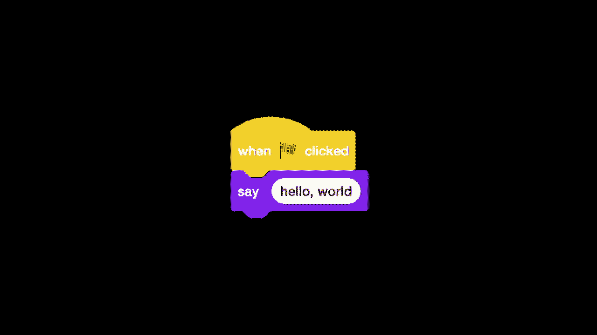

is scratch we'll allow ourselves for，just a day to look at something much。

more friendly much more graphical，that will allow us to explore these very。

ideas and set the stage for more，sophisticated，and beyond，but in the context where we don't have。

to worry about parentheses semicolons，are，on the keyboard so allow me to introduce。

you then to scratch developed by some of，cambridge at，mit's media lab you can play along at。

home here on out if you would like at，scratch。mit。edu，it's web-based but there's also an。

offline version if you tend not to have。

the best of internet，but the user interface would typically，look like this and a quick tour。

so here on scratch。mit。edu when you go，to create，a project via the button on the。

interface you'll see first，scratch the the namesake of the program。

of this cat who lives in this little，rectangular world in which you can move，up down left or right。

but the cat can be transformed into any，call，sprites visual representations thereof。

on the left here now，are all of the building blocks that come，with scratch。

all of the programming constructs，and you'll notice that they're，categorized according to color and。

description and there's a whole bunch of，do，and today the goal is not to go into the。

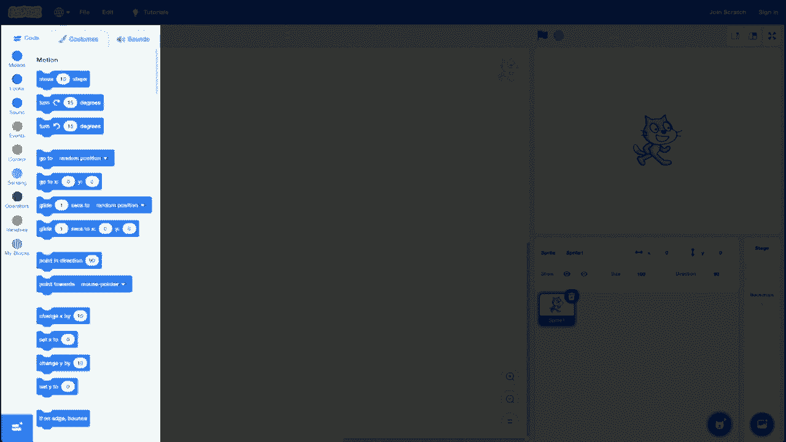

weeds of all of these various puzzle，pieces but to highlight，some of the fundamental ideas that are。

possible and we'll explore those ideas，by the middle of the screen here。

we'll be able in just a moment to start，dragging and dropping these puzzle，pieces onto this。

this larger screen and interlock them，together if it makes logical sense to do。

so finally for the most sophisticated，programs we can actually create。

yet more characters or sprites and，actually have a lot of interactions。

on the screen as well but let's go ahead，and dive in with just an example quite，screen。

and go indeed to scratch。mit。edu，and you're welcome to play along at home。

as well and i'm going to click，create in order to get into exactly that，account。

from the get go unless you would like，and let me go ahead and start creating。

a program the very first program that，was once written by lore。

was quite simply what iris proposed as，hello world a program that prints on the，screen hello world。

well how can we do that well i can，probably do this quite quickly because。

i've used the interface before but the，goal for you at hand if you've never，problem set。

or programming assignment really is just，to get your hands dirty and。

explore and poke around and odds are the，ideas you are looking for。

you'll find eventually pop out and the，first one i'm going to try out。

is this one here this puzzle piece，color，called when green，flag clicked this is of interest because。

if i go to scratch's stage over here，flag，stop，sign that's going to signify stop so if。

i want something to happen，when i click that green flag i'm going。

to start with this puzzle piece here，now i'm going to go over into the looks。

category and in the looks category，there's a whole bunch of blocks but。

we're going to keep it simple here，i'm going to go ahead and just say the，canonical as iris noted。

hello comma world i'll zoom back out，i'll move over to scratch here and i'm。

going to click now the green flag and，voila，hello world so that is my and perhaps。

soon your very first program，course this isn't，terribly interesting might be gratifying。

for the very first time but it's not，again，but we can make this thing much more。

interactive and we can start to layer，these building blocks and have。

an algorithm more like searching that，phone book that has multiple steps so。

let me go ahead and stop that program，and let me explore a little bit instead。

let me go under sensing this time，this blue category and you'll see this，block here。

ask what's your name and wait but notice，that what's your name is in this white。

oval and that implies that i can change，what the question is if i want but i'm。

fine with that question for now，and let me go ahead and first get rid of，these blocks，and this time。

start under sensing with ask what's your，name and wait，but notice that this is kind of a，block。

this ask，puzzle piece is literally going to ask，the human who's playing this game。

a question and it's going to store the，answer to that question in a variable。

depicted here is this blue oval called，answer just like in math an，that。

well let me again go to looks let me go，to say，hello but this time you know what let me。

go ahead and say，hello comma and then all right let me，give myself a second say block but i。

don't want to say hello again so i'm，going to delete that，but i'm going to go back to sensing and。

i'm going to drag and drop answer now it，get close to it，it sort of magnetically wants to connect。

and indeed scratch will grow，to fill the puzzle piece for me so now i，have a program it would seem。

a program written in scratch a piece of，software written in scratch。

that's going to when the green flag is，clicked ask what's your name and wait。

that's our function say hello that's，say，answer whatever the human typed in well。

let me go over to scratch's world here，and click the green flag。

notice the cat is asking me what's your，name i type in david and。

enter huh i only see david well maybe i，green flag，what's going on this seems to be a bug。

what's going on this seems to be a bug，because i'm pretty sure i have three，functions ask。

say and say but i feel like i'm missing，the second instruction any thoughts on，what bug i have made。

uh natalie is it，what do you think hi um can you hear me，what do you think hi um can you hear me。

yes yes we can so um you，replace the output to the same function。

yeah i replaced the output with the same，function and honestly。

even though we're using a fairly simple，program scratch my mac。

is actually pretty fast and your pc or，your mac or your phone is pretty fast。

and even though scratch is saying hello，and saying answer，as natalie notes the answer is sort of。

overwhelming to say because i didn't so，much as pause，so i could go in and find a block。

there's a weight block that could allow，me to insert an arbitrary。

pause but i really want this to be one，all at once，so how can i do that well let me go。

under operations and it turns out，there's a whole bunch of math related，things here but also some。

down here，join apple banana now this has nothing，to do with apples and bananas those are。

just placeholders but there's this，drop，and you know what let me go ahead and do。

this let me replace the first，input to say and let me join hello comma。

and then not banana but let me drag the，answer and notice that will drop。

in place let me throw this other block，away to delete things you can just drag。

them over to the left and let go，and now notice that i have a program，that's asking what's your name。

and then i'm going to say the result of，joining hello，and answer and let me go ahead and play。

this now after stopping the old one。

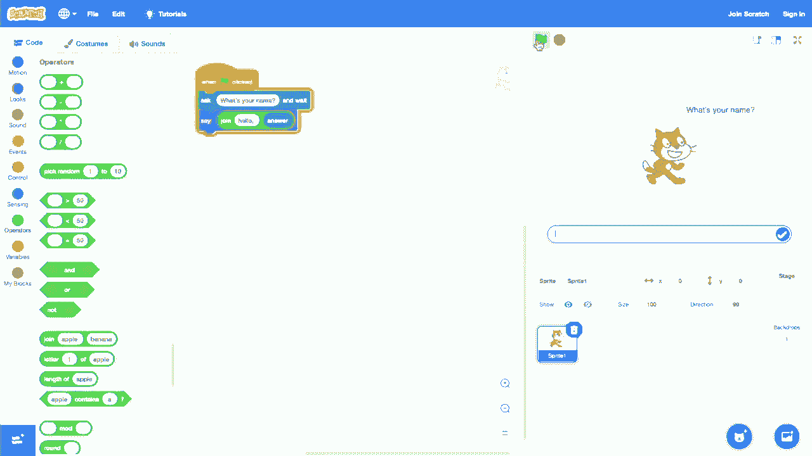

what's your name i type in david enter，and voila，as natalie notes now it's not it's。

tripping over itself，clobbering what was previously there now，i'm getting it all in one breath。

now the program is getting a little more，interesting but the paradigm is no。

different from before in fact，let me propose that everything we've，just done。

is fitting perfectly into this whole，mental model of what it means to solve。

problems and what computer science，itself is so for instance。

if this is the problems to be solved and，i've got inputs and outputs are my goal。

and algorithm in between let's consider，model，my input to the very first program that。

we wrote a moment ago was literally，hello world in its own oval，function。

in scratch called say so an algorithm，step-by-step instructions a function is，algorithm。

in this case a function called say the，hello world，but things got more interesting just now。

after natalie's remark，whereby when i introduce something like，ask your what's your name。

and then wait notice what happens this，time in the model，now the input to the problem is what's。

your name that's the string that comes，didn't，and the ask，block's purpose in life is to get the。

cat to give me，an answer like this now that answer is，interesting because，as a prefix so。

this block is interesting because notice，the input the white oval。

to the say block actually has another，puzzle piece and then two more puzzle。

pieces on top of it and what's cool here，is that when programming，one function。

become the input to another function and，so the flow here is quite simply this。

now i have two inputs to the function，both hello which i wrote。

and answer which came from the ask block，the algorithm in question now is the，join function。

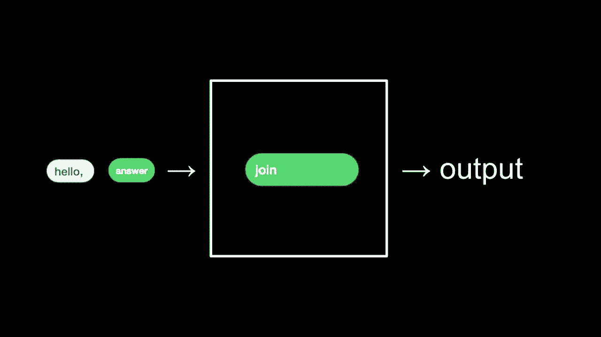

which i just used and its output is，hopefully going to be hello comma david。

but i don't want to see a white oval on，the screen saying hello，comma david。

so let me go ahead and focus only on the，output make it become the input。

to a final function which is that say，block and voila，now the cat says what i want it to so。

again even as you start to nest，that is place these puzzle pieces one on，top of the other。

all we're doing is passing in inputs and，getting outputs doing something with，so forth。

that really is the paradigm ultimately，of what it means to program，but we can make the cat do more。

interesting things and just to have a，little bit of fun with this，let me go ahead and dig in to this。

screen，scratch has these so-called extensions，things as well，and let me go to text to speech at the。

top right so this is using a cloud-based，service that is some，internet-based service that's going to。

send the words that i type，out on the internet the internet some。

server there is going to respond with a，verbalization now，of what it is i just typed so let me go。

ahead and try this let me get rid of the，purple save function。

and replace it with this speak block and，let me go ahead and drag。

in the join puzzle piece here notice，it's going to grow to fill，and i'm not going to use this one。

anymore this time i'm going to hit stop，and i'm going to go ahead and hit play。

once more and type in my name，and hello david okay not a very natural。

cat sound but notice we can set the，voice differently，so notice i can drag this puzzle piece。

and you can even squeeze blocks inside，of others notice that it can go wherever。

you want i'll put it at the very top，here though i could put it in a couple，of different places。

squeak，sounds appropriate let's try that typing，in my name david。

hello david all right still not very，voice，which if i change it to kitten will now，hear this。

type in my name and enter meow meow，okay so it doesn't really matter at that。

point what i type in but now this is，amazing like we've gone from just saying。

hello world to hello david which is，dynamically changing if you were to type，name instead。

and now thanks to the cloud that is，servers on the internet，we're converting automatically text that。

file，notes and durations and all of that into，something my computer can now play。

well let's actually make this cat sound，a little more like a cat let me go ahead。

and get rid of those blocks here，and let me go and give myself now from，the sound。

category how about this play sound meow，until done，now this is a simple program when the。

green flag is clicked play sound meow，until done，here we go i'm going to go ahead and hit，play。

all right that's it if i want to hear，the cat meow again i got to do it again。

okay that's great i could kind of amuse，myself for a while by just clicking。

play but surely we can do better than，this you can imagine this uh。

getting tedious quickly so how might i，get the cat to do this again and again。

well you know what let me go ahead and，meow，meow meow three times so now that's two。

all right it doesn't seem like the，all right it doesn't seem like the，control。

and let me give him a second break in，between wait one second in between。

okay slightly happier cat but this seems，okay slightly happier cat but this seems。

a little messy now this，this is correct it is meowing three，times but let me go to the audience。

let's now consider design recall that we，phone book，the third algorithm was better designed。

in that it was，faster it was more efficient but there's，another element to design。

which is that you shouldn't repeat，yourself if possible，so those of you who have programmed。

might be well，it turns out that go to go back to line，three we called a loop。

turns out scratch supports these things，called loops and in fact there's one。

staring at me right here，if i zoom in on the left notice that，under the control blocks these orange。

blocks there's a repeat block，and even though it says 10 by default i。

bet we can change that so let me drag，that over here，let me throw away a lot of this。

redundancy this copy paste，let me move these puzzle pieces inside。

of the repeat block and it too will grow，to fit them not a problem。

let me change the repeat to three and，now let me reconnect everything。

and now the program is just tighter it's，using fewer，puzzle pieces or fewer lines of code。

fewer steps if you will，to achieve the same result so now if i。

it's still working so you could imagine，it's still working so you could imagine。

changing this to any number you want，there's even a forever block where we，could do it forever。

if the cat's going to do this in，perpetuity but it's a better program now，now it is better designed。

because if i want to change the amount，of time the cat is waiting。

or if i want to change the total number，of times the cat meows i can change，those details in one。

place not in one or two or three as by，copying and pasting those same puzzle。

pieces well what about that forever，loop what if you do want to do something。

forever what might i want to do well，let's get the cat up and moving。

let me go under the motion category now，let me go to，point towards mouse pointer so let me。

zoom in on this，and every time the cat points toward the，step，so i'm going to grab the move some。

number of steps and i'm going to change，the 10 to a 1，and now i'm going to hit play and now we。

kind of，responding to my max cursor and i can，move it around and i can kind of get a，literally。

it's pointing at the mouse cursor and，it's then moving one step，now i can make it move faster let me。

not，one step at a time but two steps at a，time and we'll see that now the cat is。

moving a little faster，not quite super fast let's do 20 steps。

at a time and see what happens and this，is really the essence of animation。

the more you adjust the number of steps，or the number of changes happening to，time。

the more that's going to happen visually，on the screen well what more can we do。

from just following well you know what，cat，follow me let me try something else。

altogether let me go ahead and，open up another extension let me go into。

the pen tool which is going to allow me，now to draw with like a pencil or，and。

still have the cat uh follow me i think，actually know what let's change this。

let's just have him go to where i am so，there's another block that says go to。

random position i don't want that，so i'm going to change it by the little。

triangle menu here to go to，mouse pointer so now forever the cat's，pointer is。

it's not going to glide or do it slowly，or quickly it's just going to go to，wherever the cursor is。

and let me go now to this new pen，category down below，and how might i do this you know what i，for me。

when i move the cursor up down left，with ink，on the screen but i only want to draw。

something when the pen，is down notice on the left the two of，the two puzzle pieces，pen down。

and pen up but there's a mis a piece of，missing logic here let me ask the，audience。

how might we go about enhancing this，program so not only does the cat follow，my cursor。

but i also draw on the screen nicholas，what kinds of solutions would you。

uh so what you could do is uh take，uh so what you could do is uh take。

like an if statement so you can control，when the pen is up or when the pen is，down depending on like。

some condition that you have like i know，a lot of things like you draw with the。

mouse click if the mouse is on，then you can like say pen is down and，is up。

and then while it follows it forever it，is on or off，i don't really know no you really do。

know that was like perfect，because you took this principle of。

having the forever block not only go to，the mouse pointer but you proposed。

asking a question by a condition，so let me actually go under control，is。

and notice similar to our phonebook，if else，well here there's only two questions i。

think as you're proposing is the pen，uh is the as the mouse button down or up。

so i think we can get away with just an，if else so let me go ahead and drag this。

below the go to mouse pointer，and then notice this little，trapezoid-like shape in the middle here。

let me go to sensing here and notice，if i scroll down yep there it is on the，left notice this one。

mouse down question mark these are our，boolean expressions，let me drag that boolean expression into。

fit it，and then what do i want to do if the，pen，down else if the mouse is implicitly，like this。

well let me go ahead and full screen，this just so we can see a little better，let me hit play。

and now the cat is following me as，promised but this is now a drawing cat。

if i click the mouse button，i can say something like very poorly。

in cursive like hello sort of been a，long time since i've，done cursive so we now have the cat。

actually drawing something and honestly，it's a little ridiculous that it's a cat。

drawing but you know what，scratch has these costumes we could go。

at top left here and even though scratch，change it to be a pen。

or a marker or really anything we want，sprite，is really just a character on the screen。

that can take any form，that we might want well how can we take。

this further i like this introduction of，of conditions and loops but there's some。

other principles we can introduce here，let me go ahead and start a new program，here altogether。

and let's see if we can't start counting，up and start keeping，track of information so for this time。

let's do this when the green，flag is clicked this time let's go under。

variables and let's give ourselves a new，pieces，this one being a variable and i'm going。

to call this a counter，just something that's going to keep，count from one on up now this has given。

me some custom puzzle pieces over here，called counter and then the default my。

variable which was there already，and i'm going to go ahead and do this。

i'm going to set the counter initially，something forever，let me grab one of those forever blocks。

forever，current count，is so i don't want it to say hello for，two seconds i want it to say。

something for one second let's say so，i'm gonna go back to variables。

and i'm gonna grab this new circular，shape counter that i created。

and drag it right there so you can read，to one，then forever say the counter for one，second but。

if we don't want the cat to say the same，number again and again and again，one。

and that's implicitly gonna add one to，play，two，to three and it's going to count up。

ideally all the way to infinity the，feature，of actually using a variable a variable，information。

in this case a number that's constantly，redrawn，again and again well now let me go ahead。

and just start opening a few programs，that i wrote in advance just so that we。

can get a tour of some of those，i've got this program called bounce that，this too。

is part of programming not only writing，your own code but reading your own code。

and let me go ahead and zoom in on this，which i've already created。

and consider what it says first set，rotation style left right this is just。

to fix what would otherwise be a bug，where the cat accidentally ends up。

upside down but let me wave my hand at，forever，have the cat move 10 steps and then if。

it's touching the edge，then turn around 180 degrees，so now we can reintroduce the idea of。

animation but not that's driven by me，the human with my cursor。

i can now make a game uh an interactive，piece of art or anything now where the。

cat is self-driven because when i hit，play now，notice that it's moving back and forth，edge and the。

answer to that boolean question is，actually。

uh yes or true or one then it's going to，turn 180 degrees，but this looks kind of stupid admittedly。

you know one the cat yes is bouncing off，the screen which is maybe a little。

unrealistic but he's not really walking，he's gliding but this is the thing about。

animation just as we noted before that，videos at the end of the day，screen。

you know what i bet we can create our，real video，by taking not just one costume cat the。

cat with his feet like this，what if we gave ourselves a second。

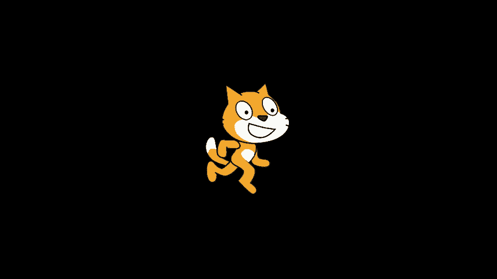

costume where it's almost the same，but his feet are slightly differently，flip book。

that we looked at earlier and you know，what i bet if i toggle between these two，costumes。

changing the condition of the cat again，and again i bet we can create the，illusion of。

actual movement and that's what we have，here in this other bounce example。

in this other bounce example we have the，cat now moving，not only back and forth but notice this。

purple puzzle piece，after it bounces off the edge or，considers bouncing off the edge。

it constantly changes its costume to the，next one to the next one to the next one，so now。

it's not quite perfect like it has what，we call a very low frame rate this is。

like watching a really bad，animated gif online that only has two，different。

frames in it but it looks more like he's，walking and much less like。

he's gliding back and forth on the，with this too，scratch support sounds so for instance。

here's the meow we've heard before，i can record my own though if i click。

this little plus icon down here，click record and allow scratch to access，my microphone。

click ok a couple times here we go let，me record my own voice。

ouch all right that's what the word ouch。

i can，trim off the beginning here let me save，name，ouch and now let me go back to my code。

and under the sound block you know what，let me go ahead and say。

this if i'm touching the edge not only，do i want to turn 180 degrees。

now i can kind of make this a little，more uh playful，ouch ouch ouch。

all right still not very cat-like but，again we're just layering and layering。

and the k the takeaway here really is，as these programs get more and more。

complicated the goal should never be，scratch or c，or eventually python in this class or。

others to just start and try to，implement your entire vision，notice with every one of these programs。

intended，that i start small and add one or two or，three puzzle pieces。

building up from something simple to，something more complex，and you know what i bet if we synthesize。

things too，here's another example that involves，perhaps petting a cats let me go ahead。

and see inside this program，this one's relatively simple but it's，not doing anything just yet。

i already hit the green flag let me zoom，in on the code and you can perhaps now，read my own code。

that i wrote in advance the cat is，forever asking the question，if touching mouse pointer then place。

that sound meow，until done well it would seem that even，though the program's running it's not。

doing anything but it is it's waiting，for something to happen so let me move，my cursor over the cat。

so it would seem and if i leave it on，so it would seem and if i leave it on。

there he'll keep meowing and it's kind，a cat，and so you can imagine now having。

conditions inside of loops that are，exactly，what you want something to do and even。

more powerfully even in a language like，scratch can we do this，let me open up this sea lion here who。

has a very distinct bark，but he's demonstrative now of a program。

that has multiple scripts so inside of，this scratch project now we're not just，one program but two。

notice both of which start with when a，green flag is clicked and then you put。

them both onto the screen，and it looks longer but that's just，fit each other。

notice that every second or so the sea，notice that every second or so the sea，lion is barking。

and frankly this gets annoying quickly，but how can i stop it well let me go。

ahead and look over here on the left，while it's still barking notice the sea。

lion is forever asking a question，if muted equals false start sound c。

lines think hi hi hi for two seconds so，what is muted well the shape of it，recall represents。

a variable like x or y or z which is，just some way of retaining information。

so this is like saying is the value of，the muted variable，it's。

false muted if it's not muted go ahead，and play the sea lion sound but my god。

let's on the right here，notice there's another program when the，green flag is clicked，bar is pressed。

then if muted is true set muted to false，else set muted to true so the program on，of muted。

from false to true or true to false my，god，it's over the program is still running。

it's over the program is still running，is now，do things can get。

pretty fancy pretty quickly let me go，ahead and create one other program here。

and i'll go ahead and do one with just，two blocks this one，let me go into the extensions again。

video sensing this time，and notice there's different types of，ways to start programs。

not every program has to start when you，click the green flag，there's a similar shape here but this。

one in green that says when video motion，the screen is moving，let me increase that to 50 percent and。

let me go ahead and do this，puzzle piece，a two，than 50，out，and you'll notice that i'm actually in。

the screen here let me move off stage，and now nothing is happening，let me go and pet the cat though。

[Music]，let me do it again and again so it's，using my computer's camera。

detecting motion and then executing that，these simple，building blocks can we get more and more。

interesting things to happen and you，know what we can even have，multiple sprites let me go ahead and。

open up an old school game that you，might have played in like a swimming。

pool perhaps growing up where one person，yells out marco and the other people are。

supposed to yell out polo，notice here we have a program with two。

sprites so two puppets an orange puppet，and a blue puppet，and down here at the bottom for the very。

first time we have two different sprites，abilities to write programs so right now。

the orange puppet is selected which，means the program at top left here。

up here belongs to the orange puppet and，say，forever if the keyboard space key is。

pressed then say marco for two seconds，and then here's the new feature there's，a way in programming。

to have like one program talk to another，or in this case one sprite。

talk to another sort of passing a secret，message that you don't see on the screen。

but one program can hear from another，and that's called broadcasting an event。

and that's what the orange puppet is，icon here，he's not going to do very much at all。

but instead of doing anything when the，green flag is clicked，instead of doing something when the。

camera sees motion he instead，is going to when he receives the event。

say polo for two seconds and so in this，case if i hit play now，nothing happens yet but when i do hit。

the space bar，orange says marco blue says polo，but they are written independently i've。

program for blue，and they're somehow intercommunicating，and speaking of communicating。

there's even more things you can do，these days thanks to the internet and。

the cloud let me go ahead and open up，one other new canvas here very quickly。

give myself a when green flag clicked，let me go ahead and ask that same，weight。

but now let me go into these extensions，and let me find the translate extension。

which is again going to use the cloud，to send whatever i type in out on the。

internet get back a response，and then say it on the screen here so，screen。

like say hello but i don't want to say，category，and i want to go ahead and translate you。

know what i like this block translates，something to another language。

but let me get one of those join blocks，again and let me go ahead and join。

the word hello and then the name that，the person has typed in so to get that i。

need the answer block again so i'm just，earlier，and notice before i just did this i said。

the result of joining hello and answer，albeit with a comma last time。

but now let's do this let me take the，output of join，make it the input to translate let me。

translate say to arabic here，let me drag and drop into the say block，so now we have。

two inputs going into join joins output，going into the input of translate and。

the output of translate going into say，but the net result is going to be i'll。

type in my name david and hit enter，hello david now in arabic all thanks to。

these principles of functions conditions，and loops and now even adding。

in the internet but let's consider，games，in conclusion there's a way to even，we've done in fact。

let me go back just a moment to where we，left off with that meowing and in one of。

our meowing examples，we had code that looked like this where，i repeated three times recall，again。

and again and i argued at the time that，this was better designed why because i。

didn't just drag and drop the same，puzzle piece again and again and again。

i used a repeat block i threw away all，of the redundancy and i've arguably kept。

it simple i'm using some fancier ideas，but the code is simpler and it's fewer，puzzle pieces now。

but it turns out that there's a missed。

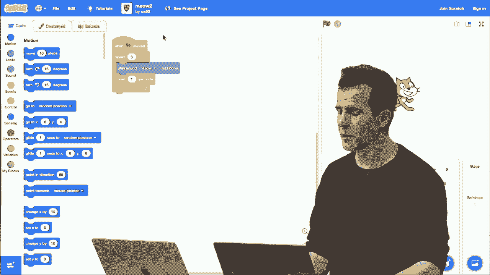

opportunity here to apply another，principle of computer science，and this is what we would generally。

describe as abstraction，abstraction is this amazing like，problem-solving technique that's really。

just a fancy way of saying let's take a，very complicated idea or，it，can。

implement it the complicated way but，let's now just simply uh stipulate。

let's now just stipulate that we're，going to think about it，over to，scratch。

curiously did not anticipate having a，meow block，like there is a say block uh and there's。

a there's a think block but there's no，meow block and that seems appropriate，for a program where it。

comes with a cap built in so we can do，this just as you can create your own。

variables notice at bottom left here，you can create your own blocks with this，pink category。

and if i go here i'm going to make a，meow，and quite simply i'm going to click ok。

now notice i get this new puzzle piece，that says define meow and it's ready to。

have other pieces connected to it，how am i going to define meow i'm just。

going to go ahead and drag this over，before，and now notice what i have on the left。

hand side because i've just made this，custom block or puzzle piece。

i now have a pink piece called meow just，as though it came with scratch。

and now what's compelling about this is，that i can sort of think of this as out，of sight out of mind。

who cares how meow is implemented we，just stipulate，that we can take for granted it exists。

and if i zoom in now on the new program，now it's more readable in some sense。

it's a little shorter it has a fewer，puzzle piece，but it also is more self-descriptive i。

can read my code i can look at this code，and say okay it's obviously going to，repeat three times。

a meow block but let's play that，but i bet we can simplify this one step。

but i bet we can simplify this one step，flexible，let me go ahead and right click or。

control click on the meow custom block，that we'll call，n and let me just add a label that says。

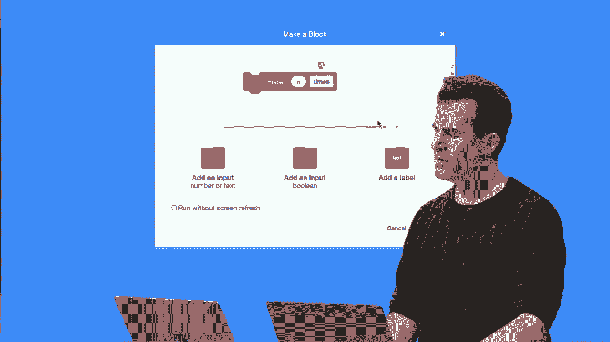

times and let me go ahead and click ok，and notice that my puzzle piece now。

looks different it looks more like some，of mit's blocks that take input with。

these little white ovals，and in fact now notice what i can do i，can change the definition of meow。

as scratch already has for me such that，i can now do more inside。

let me actually disconnect all of this，stuff let me move the repeat block。

to the definition of meow itself let me，go ahead and play the sound and wait。

inside of that repeat block but notice，this little circle around the end。

let me just repeat an arbitrary number，of times now i don't have to worry about。

hard coding 3 or 10 or anything else，and now out of sight out of mind don't。

have to worry about that anymore，let's now just whittle down that，wrote earlier。

into really just two puzzle pieces when，the green flag is clicked meow。

sure three times i don't have to know or，care anymore how meow is implemented。

i just need to know that someone did it，for me whether mit，play again，[Music]，two and three。

and so now we have an implementation of，abstraction taking a。

somewhat complicated idea like getting a，cat to meow not worrying about the。

so-called implementation details and，just defining a puzzle piece or function。

called meow well now let's take all of，this together，and see some of the creations of some of。

your predecessors，sort of，story that one of your classmates years，ago made。

involving a gingerbread tale let me go，play，and you'll see now that we have multiple。

sprites already each of which have，different costumes，and i'm being asked a question would you。

like an apple yes or no so i'm no longer，being asked my name i'm being asked，and have an apple。

i type in yes and hit enter notice the，okay unfortunately that was the wrong。

okay unfortunately that was the wrong，decision to make in this story so。

that's okay let's start it again red，stop sign，green flag hello deary would you like an。

apple no let's learn from that lesson，this time，notice again the motion so there's some。

animation there，it's touching the other sprite that too，was unfortunate。

let's try one last time with this art，and now we have an apple no learned the。

lesson cupcake no learned a lesson，okay now let's see what happens with。

okay surprise ending but this is all to，okay surprise ending but this is all to。

say that by taking these，building blocks of loops conditions and。

functions can you start to make things，that are a little more interactive。

in fact i myself did something years ago，the very first thing i myself wrote in。

scratch was actually when i was in，graduate school and cross registered for，a class at mit。

the professor for which had was the，author of and the originator of scratch，screen this。

and propose how i thought about solving，now a fairly large problem。

back in the day drag as much falling，trash into the can as you can。

so what's happening now a piece of trash，is falling on the screen。

you'll see that it's moving from the top，like that，but watch this i bet using a condition。

and a forever loop，we can make it possible to pick this up，notice now the trash is following my。

cursor just like the cat was and notice，if touching this other trash can sprite。

maybe we can even get，oscar to pop out of the can and he then，starts counting up my score thereby。

using a variable，and indeed as more sprites or more trash，falls i can continue to play a game。

in this way but here too even though，things are starting to happen more。

quickly there's more on the screen the，song is playing in the background。

it all reduces to basic building blocks，wrote that first，what you just saw。

i think the very first thing i did was i，googled around and found。

sesame street's street lamp and i put，that on the screen and that was sort of。

version one it didn't do anything but it，looked like what i want。

then i added the trash can then i think，i programmed one piece of trash or one。

sprite to fall so i changed the cat to a，piece of trash and then i had it animate，from top to bottom。

then version four or five i then added a，forever loop and a condition。

that checks if the mouse button is down，and if so i have it follow，the mouse pointer so i took a big。

problem and broke it down，bit by bit into much smaller steps and，this was the same approach。

that cs50's own andrew berry took years，ago one of our teaching fellows the very，very own。

first scratch project that i thought i'd，leave us with here today，this is a program that he called。

tune，when watching，this our final scratch program today how，it is that andrew went about。

programming everything that you see now，andrew went off into the real world and。

didn't pursue computer science per se，he's actually now the general manager。

for the cleveland browns which is an，american football team but this too。

speaks to just what kind of foundation，you can form irrespective of your。

intended major your possible major，considering after all that a lot of the。

ideas we're going to focus on in this，class are ultimately about。

problem solving programming being just，one tool for the trade，and indeed even within the world of。

nowadays，for algorithms for analysis for video uh，simulations thereof and so many of。

andrew's worlds and your worlds were，invariably，uh start to collide as you begin to。

build up your own toolkit，and your own understanding thereof so in。

conclusion we'll take a look at this，andrew's program，in the meantime this was cs50 and now，[Music]。

[Music]，hi hi we're your weather girls，hi hi we're your weather girls，listen。

get ready for your lonely girls and，leave those umbrellas at home，all right，we better hurry up。

we better hurry up。

[Applause]。

