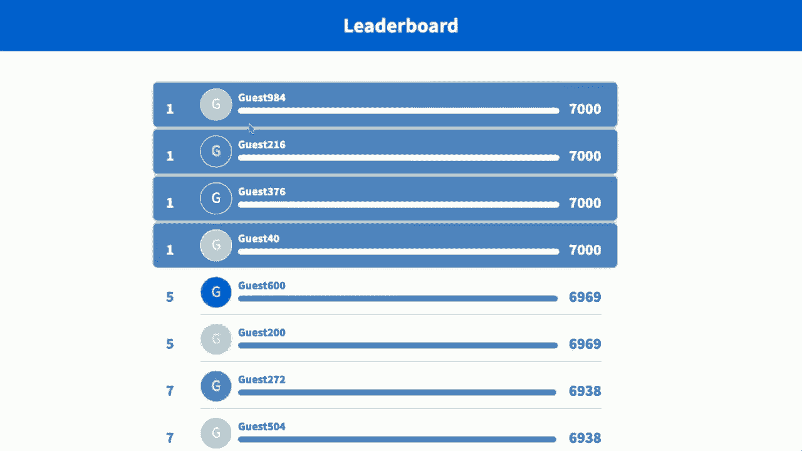

# 【双语字幕+资料下载】哈佛CS50-CS ｜ 计算机科学导论(2020·完整版) - P20：L10- 计算机与道德话题 - ShowMeAI - BV1Hh411W7Up

all right，this is cs50 and this is the end。

all that remains here on out is really，your final projects and we cannot wait。to see what you create today what we，thought we would do is take a bit of a。look back but also a look forward so，can do，thanks，we are of course here in the loeb drama。center with the american repertory，theater who have been our amazing hosts，this whole semester。

and truly they have breathed new life，new new lights new animation new sounds。into cs50 and we are so grateful to have，had such a privilege to work with the。amazingly talented team here，to indeed bring this whole stage to life，semester。and then of course there's cs50s team，and though i'm the only one here。

on stage with everyone else spread quite，far apart this semester，we have。the videos that we have the technology，that we have and all of the visuals that，supplement hopefully。everything that you yourselves have been，doing hands-on so thank you truly，semester。all possible these are suffice it to say，um among the more unusual and difficult。

times and we hope whether you're，watching this now live，or in some time from now that this finds。everyone healthy and well，and that indeed we have helped you find，your way along this。this path of learning something new of，course there's more folks even than that。behind the scenes cs50s whole team and，when i look out on the。

the crowd here really there is no crowd，what it looks like，behind the scenes pictured here is a。photograph of exactly what it is i am，seeing when we hold each of these，classes and indeed。if we zoom in when we're having these，questions，it really is just us and some tv screens。here this year but we do look forward，to all reuniting before long now behind，team。

in fact pictured here are just most of，but not even all，cs50s teaching fellows teaching，harvard。and at yale without whom uh this，because they are indeed，the backbone of and the support。structure for getting everyone，ultimately to the finish line with，problem sets labs and more。but it's worth noting uh that we are all，fallible and indeed i'm told it's fairly。

instructive when i do something，completely wrong or get a little，befuddled here on stage and。can't quite figure out why my own code，question，off the top of my head this all happens。certainly to all of us，so even if you are feeling here toward，the end of the semester that not。everything quite clicked，and you're still struggling sometimes to。

find that bug in your code you're still，googling or searching for some answer。to some smaller technical problem rest，that is never，really going to go away and in fa in。fact to reinforce that besides all of，the mistakes i hear have made。on stage we thought we would share a，you will，from when the teaching staff some weeks。

ago prepared that passing of tcpip，packets on video which worked out。wonderfully well where folks were，of which was to get，three tcpip packets from the bottom。right hand corner of zoom，to the top left-hand corner of zoom but。we thought we would give you a glimpse，of what actually went on behind the，us。

to get even that demonstration right i，[Music]，that was amazing josh，[Music]，um sophie，[Music]。amazing that was perfect，i think，[Music]，that was amazing thank you all oh god，[Music]。so suffice it to say computer science is，hard for all of us and so some of these。feelings some of these frustrations are，have，indeed all the more tools in your。

toolkit all the more of a foundation now，in being，a little uncomfortable as you forge，languages。and ultimately pick up new ideas and，skills but remember for cs50 alone。what ultimately matters in this course，is not so much where you end up relative。to your classmates but where you end up。

relative to yourself when you began and，consider it wasn't all that long ago，ago。was this perhaps the biggest of your，problems in cs50 just trying to figure。right whether you did the less，comfortable version，figuring out how to print spaces how to。shift the pyramid over and the like，figuring out how to nest，loops let alone getting all of the。

semicolons and compilation steps right，and then fast forward to just a week or。two ago when you built your very own web，application，one that used a third-party api and。pulled in nearly real-time data and，controller，governing with the model exactly all of。the data you were reading，and writing and the like like that is a，huge way to have gone。

over the course of just a few months so，take comfort in that too especially as，might，two will you。ultimately uh push through so what have，we focused on over the course of the。semester a lot of the times we've spent，time talking about and doing programming。but really it's we'd like to think at，takeaways，that are what last you uh far longer。

than the particulars of these languages，whether it's scratch or c，the other。practical tools that we looked at like。

all of those are eventually in some form，gonna be out of date or they might，remain with us as。as older languages but newer and better，things will come along and what we hope。then is that over the past few months，you've walked away with，the fundamentals and sort of a。foundation on which you can bootstrap，come out，and really reduce new things to their。

with which we began，first principles from which you can，infer how some new system。some new piece of hardware some now how，some new language must surely work。because underneath the hood at the end，some time，just zeros and ones and so we introduced。in week zero recall，computational thinking encouraging you，to think more methodically more。

algorithmically，but really computational thinking is，just a computer scientist incarnation of。what we might otherwise think of as just，critical thinking this process is taking，as input。information and producing its output，some solution and in between there。of course are our algorithms the black，box that's doing something interesting，and perhaps difficult。

but at the end of the day this is，problem solving and this isn't going，anywhere irrespective。of the languages that you use or pick up，or even forget somewhere，along the way and indeed today too。binary form，or it's just information and decisions，or facts and conclusions this process，correct。answers correct conclusions correct，you far，longer than the particulars of c or，python or any。

of the more hands-on skills that we've，spent time on this term。and recall too that at least within cs50，the the，tools with which we propose that you。evaluate the quality，of your approach to problem solving or，these three axes the first。and foremost of which is surely。

correctness because if it doesn't work，what's the point of it all in the first，algorithm。your process from input to output to be，correct is certainly paramount。but after that comes questions of design，if you actually want to build more。

complex systems or solve more，sophisticated problems you really do，problems。cleanly you don't want them to be slow，a mess，in real terms you don't want your code。to be completely undecipherable because，that's just going to hamper you。longer term to using those same tools，those same libraries to solve more。

interesting more sophisticated，problems and it's surely going to make。it harder to interface with other people。

other collaborators and other systems，and indeed along those lines is style。

still important it's perhaps the third，in this trio for us，but it's the aesthetics of your code and。all that，much like you might convey uh in our，human language。

put your best foot forward with，other people，understand you and indeed even though we。spent a lot of our time，interacting with computers in a course，like this at the end of the day。you're really just communicating and，machine。

or to another human doing that cleanly，and in a way that helps your ideas your。solutions become adopted，is surely no less important than some of，these other ideas as well。but what about other basic building，blocks that transcend the particular。languages and psets that we did，well abstraction this idea of taking，them。

so you don't have to worry about the，lower level implementation details you。can focus only on the solution，that that puzzle piece or that building，is。everywhere around us certainly in code，abstraction，i don't know i don't really remember。exactly how getstring is implemented，that comes with c，like printf but i know that it works and。

i know that it takes input i know that，it proves its output and i can therefore。build my own ideas my own software，on top of that building block。abstracting away those particulars and，in the real world too we abstract things，time，assume that。that will be done someone else might do，output，no expert，in the underlying implementation details。

thereof but then there's，precision this other idea where it's，super important certainly when writing。human，to be precise and make super clear what，you mean，and to consider the corner cases to。consider the inputs that you might not，happen，so that you don't air and have some。unexpected behavior as we certainly did，more than once in actual code and。

sometimes abstractions and precisions，are kind of at odds with one another。because abstraction would sort of have，you think at and，and talk at a fairly high level whereas。should get，into the weeds and really go step by，step by step，when it comes to giving someone else or。we would，bring this to life perhaps with with a，couple of examples and we thought we。

would try to involve as many people as，we can in this，you can take out。a piece of paper and a pen or pencil，it's okay if you don't quite have that。available you can do this on a computer，too if you'd rather draw on a notepad or，fine。but ideally taking out now something，on，we're going to go ahead and try to apply。

some principles of computational，hurtful it is，to use abstraction or precision at one。level or another so i think to do this，brian we're gonna need a helping hand，from the audience。i think we're gonna need uh for one，person out there to volunteer，to write instructions verbally for。everyone else we're going to treat，everyone in the audience or really n。

minus one people in the audience as the，computers today who are going to be。programmed and we need one human，volunteer to be，going to be，daniel so daniel thank you for。volunteering uh brian could we go ahead，and share with daniel and，only daniel a picture of something。that we want everyone else to draw so，daniel what you should see on your。

screen in a moment if you haven't，already is a picture don't tell anyone。else what it is you may use any words in，a moment that you want，you should not use your hands or any。gestures like that but the goal is going，to be to write an algorithm verbally for。everyone else in the room step by step，so that ideally，they draw what it is you see and you can。

say anything you want but just no，physical gestures，does that make sense got it and you want。to say a little bit about yourself first，to the group before we begin um my name，is daniel i'm from。ezra styles college at yale university，and i really enjoyed cs50 this semester。oh wonderful thank you for volunteering，and let's go ahead and have everyone，ready。

daniel what should be the first thing，everyone does step one，okay so the the first thing we're gonna。draw is a hexagon，um so it's it's a regular hexagon，and we're gonna make sure that we draw。it so that，um the the vertices，bottom，of the hexagon and one of the vertices。on the very top of the hexagon so，you're doing it with，that no hand gestures no hands no hands。

right um，one vertices at the very top one vertice，is at the very bottom。and you got your other four vertices um，on the sides，um so once you've got your hexagon your。next step is going to be，find your your midpoint of the hexagon，um and so so once you found your。midpoint you're going to draw，three lines from uh from a vertice。

to that midpoint the the vertices that，you're going to choose to draw。from are the very bottom uh to the，midpoint，and then from the midpoint to the，of the，of the tops。all right any final instructions um，i think hopefully that should be it it。did those were very long steps one and，two but yes，all right well let's go ahead and reveal。

if anyone，everyone is comfortable picking up their，piece of paper or their tablet，camera。steadily for five or ten seconds，we'll see exactly what everyone has，be able to see。everyone else daniel hopefully you're，seeing some familiar pictures。i think we definitely have range are you，seeing one or more that match what you，had in mind。

yeah they all look pretty good they all，all right so good let me go ahead then。and share on my screen in just a moment，what it is daniel was describing so what。brian had shared with daniel in advance，was this picture here。

which i dare say is a a cube but indeed，it's composed of a hexagon and then the，and。daniel i did happen to see maybe on，pages two and three of the zoom window，weren't quite。cubes uh what was going through your，mind as to how you approached，the the uh the algorithm that you。provided，yeah so i i wanted to um i i to me like，my the first thing that went through my。

head was a cube but，i knew that there's like so many ways to，draw a cube i。i didn't want to describe it as a cube，because if i said just draw a cube i，knew that we would get。tons of different results so i wanted to，that，if i could describe it in sort of a，mathematical way。um describing it with a hexagon and，midpoint，able to draw，a precise shape yeah really well said。

now if we had everyone's volume on our，you'd hear a bit of chuckling now。perhaps or maybe a little bit of，awkwardness and so i dare say not all of。the pictures quite turned out that way，but that's a perfect example of where。

maybe abstractions can kind of get us，into trouble because if daniel。had just said draw a cube right some of，you might start drawing immediately a。cube but many of you would have a，question well what should the。orientation be what should the size be，precision，becomes increasingly important but the，you。

just kind of got overwhelmed with the，amount of detail and sort of lost track，be at one point。because you were operating much at a，then，but i think we did get some of you to，now take。the pressure off of all of you and thank，you to daniel in particular let's see if，collectively。program me if you will so i'm going to，go ahead and pull up my screen here。

where i have the ability to draw with my，mouse and cursor on my screen here and，with。everyone else a picture，that i promise i have not seen in，advance so we will see how this goes so。i'm the only one right now，in the resume room that has not seen，this picture but brian has gone and。provided only you all with the url so，pull that up on your screen，and then brian if we could perhaps。

iteratively call on some volunteers why，don't i try to draw what people。tell me to do step by step all right so，i have just sent you all the photo david。has not seen this i just picked this out，like five minutes ago。uh and you're all gonna raise your hand，if you want to give him like one，instruction。

for what to do next and let's start with，um okay so you're gonna start by。like drawing a circle near the top of，the screen，okay circle near the top of the screen。and let me make clear i have no，delete abilities on the computer so once。i commit we're in so drawing a circle，okay thank you george brian step two all。

right let's go to sophia next，and then in the very center of the，screen draw。a black like a black filled in circle，which is approximately like uh a tenth。of the size of the circle at the top，okay a black filled in circle i heard。that's a tenth of the size，so i'm going to do something like this，and then just kind of。

shade it in all right thank you sophia，yeah so you're going to，um draw another circle but。it's not actually going to be a circle，it's uh more of an ellipse。so it's going to be bigger than the，first one，um so it's going to be in the middle and。it's going to enclose that filled，building circle，and leave some room in the bottom okay。

so it's an ellipse it's bigger than the，first circle but it encloses。the the smaller one all right so i heard，kind of this，okay let's go to ryan next，step four all right。to want to，[Music]，draw a bigger circle underneath it and，that ellipse。but don't actually show the lines going，through the ellipse，so as we draw a bigger circle underneath。

but without having the lines go through，it looks like it will kind of be going。through the edge of it，okay i'm a little worried here but what，i heard。yeah um so in that kind of middle，ellipse，very so you know like when kids like you。know act like they're an airplane and，then like they like make like airplane。

noise and they do that weird thing with，their arms，so draw those kind of like arms and like。that middle lips coming out of the uh，the big middle lips in the middle，ellipse this this。lower one the the the one outside of it，oh this bigger this big ellipse yeah the。one on the out yeah the outer um，bound yeah all right so i should draw。

some hands like a kid would have when，okay i'm not sure this is gonna end well。all right we need some more volunteers，to to help david finish this let's go to，gabrielle。okay um try to draw，a try is the operative word，um you've got a bigger list at the very。bottom that's bigger than，both the top and middle one but show no。

overlapping lines between the middle one，and one that you're drawing。okay so oh no overlapping lines so i，heard an even bigger ellipse so like。oops sorry this okay good job，good job thank you okay good keep the，positive reinforcement coming。would have to do，is draw a small filled in circle，slightly smaller than the one you，first。

circle you drew right at the top okay，right in the center of the first circle。okay and i think this is starting to，take shape for me，and i regret some of my earlier，decisions uh。some of it you want to provide an，another circle in between the last one。you just drew and in between，the edge of the circle um so，to the left of that circle you're going。

to draw another circle，to the left to the left of this circle，[Music]，okay。underneath you're going to want to do，repeat the same process except draw a，circle on the right side。okay loop i think we've got maybe，one or two more steps left let's go back，to sophia。uh underneath the felden circle um，draw，two replicas of that circle below the，original one。

uh in the middle ellipse in the middle，ellipse，so here okay i think i know what this，instruction。all right，so underneath in the top most circle，draw，lines。

a wide v with two straight lines，okay that part i think i nailed shall i，switch over。and reveal so this is the url i believe，all of you were given i have not visited。yet but if i go and visit this，now hey that's not all that bad all，way through。but here's another example had you just，started with draw a snowman。

as follows like that might have helped，orient me truthfully similar in spirit。to daniel's design that would have given，you a mental model，of what i or given me a mental model of。what it is i should have been drawing so，here too like abstraction is hard and，the right。level of detail to operate at is kind of，part of the process of problem solving。

though now that i look at it that's，actually not half bad，like i definitely did the wrong thing。over here but um very well done to all，of our volunteers online so。remember these kinds of details when，you're trying to explain，some process to someone when you're。giving someone instructions even if it's，for something mundane in the real。

world like going to run errands or pick，up supplies at the market。being precise is certainly important but，the more precision you provide。the much easier it is for the person to，sort of get lost in those weeds and so。sometimes a higher level list of details，is all that someone，might need so beyond today。

too one of the ideas that we want folks，to consider in taking a course in，computer science。is also not only what you can do with，code but also，should you do something with code and if。you should how should you do it and，indeed we thought we would introduce。into this our final time together，a discussion of ethics and technology in，you all。

know how to do now and frankly there are，even more things that you all could。certainly figure out how to do now even，if you haven't seen it，in lecture or problem set or lab for。instance consider that you already have，the ability now to send emails with code。frankly there's not much stopping you，from sending emails as someone else。

using code and thus was born the world，of spam which we all now know。and suffer from in some way you have the，ability certainly to store passwords in。a database and what we showed you for，cs50 finance，them，frankly there's nothing stopping you if。you were making your own website just，clear，that is as plain text so that even you。

could see them and of course we humans，passwords，so if your users then are using the same。password on your website in another，other account，so that's something you can do but。should you and so you have the ability，to frankly with code，at the level of python or javascript or。other thing or other languages，to log for instance every keystroke。

someone types every click that they make，on your website or app you can monitor。with an incredible amount of detail what，it is users are doing，and frankly this has been the norm in。the tech world for some time using a，database to store，every keystroke and every link that a。their shopping cart，and there's undoubtedly value to some of，useful。

if you can remind me what i've bought，from your website before or even what，necessarily，clues。but all of that requires remembering，that information and it's been the，some time。to really just save everything and it's，only in recent years that there have，level。uh in europe in particular somewhat to，back，in the interest of people's privacy and。

so i would urge you to consider when，building something even if it's the most。innocuous of command line applications，or chrome extension or a web application，or a mobile app。just because you can do something，doesn't necessarily mean that you should。and there's just so many examples of，of，face mash which was a website some 15，plus years ago。

made by harvard student and this harvard，student knew a bit of programming and，they knew how to。

write code that scraped all of harvard's，facebook so to speak so before there was，facebook。com there was the vernacular at，harvard of facebook which was literally，a printed book of photos。containing faces hence facebook of，course over the years harvard like a lot。of schools yale and the like，started moving those physical facebooks。

to an online format but of course every，once you put something online means it's。now subject to scraping screen scraping，by code and you've seen how。you can write code in javascript or，python that essentially pretends to be a。browser and if you can pretend to be a，browser you can pretend to。

down or you can actually download all of，the images from a site so。this particular student did exactly that，downloading hundreds if not thousands of。photographs of other harvard students，and at the time，thought it would be or maybe didn't even。think about，it being a good or bad idea to then，display to users at harvard。

two students at a time and inviting，those students to click on one of them，to say they are hot。or not and that same student went on to，found exactly that same tool，mark zuckerberg's facebook。com and so，that now has，not only campus implications or，implications for equity locally，decisions。that someone has made that similar，our，privacy um and information uh today。

and so we thought then we would invite，some of our colleagues from the。philosophy department here at harvard to，join us for 20 or so minutes。and give us not only uh further，tech，but to provide us not just with。instincts that you might have surely，most of us might now cringe and might。

have then cringed and said no，you should not implement something like。face smash but why beyond your own，instincts and sort of sense of，righteousness what might you。do in terms of a more formal thought，process to decide，what it is you should do when you can do。something，formal framework，how you should go about making those。

decisions so without further ado allow，me to introduce a couple of our friends。uh mika mignoni and also susan kennedy，from the philosophy department who have。joined us here to talk about exactly，this to provide us ultimately with a。more philosophical framework by which，you can evaluate those kinds of。

decisions and decide for yourself，whether or not you or someone else，so hi i'm mika mignani i am。a philosophy postdoc with the embedded，ethics program here at harvard。hi i'm susan kennedy and i'm also a，philosophy postdoc with the embedded。ethics program at harvard and before we，get started i'll just say a few things。

about the embedded ethics program，so we are an interdisciplinary team of。philosophers and computer scientists，working together to integrate ethics。into the computer science curriculum，the idea behind this approach is to。embed tools of ethical reasoning，into computer science courses themselves。

the reason for this is that when making，decisions about the design，technology。one is whether or not one realizes it，making ethical decisions。that is making decisions which stand to，have social political or human impact。at harvard we think it's important for，computer scientists to be equipped with。

tools for thinking through these，implications，technology holds a lot of power and，influence over us。and that means by extension that the，people who design technology。do too now that you're starting to think，about what responsibilities you might。have as computer scientists，so you can avoid notable mishaps like，face mash for instance。

we're going to turn your attention to，how they affect，the distribution of and engagement with。news and information，it would seem that this topic is，u。s，presidential election where political。content has been dominating the internet，and television broadcasts。and controversy has played out on social，media garnering attention from around，the world。

undoubtedly technology has completely，revolutionized the way information。and news is both disseminated and，consumed instead of paperboy shouting，get your news here。on the street corner just about everyone，uses the internet to stay up to date，with what's happening。not just locally but around the world，and in the past few years，social media platforms in particular。

have started to play a huge role in how，people access share and engage with，information。for instance research shows that 44，of us adults report getting the news，from facebook。it's safe to say a lot has changed in，recent years owing to developments and，technology。and this matters when we consider what's，at stake namely，the ability for the public to engage in。

discourse that supports a，well-functioning democracy，so i'll first present to you a brief。overview of where we came from，and where we are now owing to，technological developments。and then consider what challenges we're，faced with today，before the internet news and information。was almost entirely in the hands of a，few major broadcast stations and print。

media outlets otherwise known as the，mass media sphere，since a few organizations were，news。information was essentially essentially，aperture，from organizations to a wide public，audience。the journalists who are responsible for，researching and writing the content for，these organizations。all shared a professional ethos they，were concerned with truth，a forum for。

criticism clarifying public values，notably，since the aim was to produce content。that appealed to a wide audience，there was less polarization and。extremist commentary than we see today，but the journalists responsible for news，ways，educated。mostly white male and so forth，and it's had effects on the coverage of。

racial politics economic policy，and views about the role of the us in，the world。moreover there are seldom opportunities，for the audience to respond。to develop new themes or topics or level，criticism against the mass media sphere。there weren't any likes and comment，sections for the newspaper，like it well。

tough luck this all started to change，in recent years as news coverage not，only moved online。but onto social media platforms we now，live in a digitally networked public，sphere。so instead of having a narrow aperture，of communications，we're just a few organizations。disseminate information to the public，we now have a digital sphere with a wide。

aperture where lots of people can share，news and information。more specifically the sources of content，are not just organizations and the。professional journalists they employed，but the public and particularly social，media users。anyone can tweet or post on facebook and，anyone can read those tweets and posts。

this not only resulted in greater，diversity of content，but greater access to information as。well if you want to follow the news，there are a ton of options and free。places online you can access with just a，few mouse clicks，these prospects have increased diversity。and access or will led many people to，believe that the digital sphere。

held great promise for improving the，public discourse that supports a，well-functioning democracy。example，thanks to twitter and facebook we saw，the mobilization of social justice。movements like me too，and black lives matter and the increased，diversity of perspectives。made it possible for individual，researchers and scientists，to weigh in on the cdc's claims about。

coronavirus，so while the cdc did not initially say，coronavirus was characterized。by airborne transmission leading to，community spread，they ended up revising their stance。after scientists took to twitter，with evidence proving that this was the，case。while the digital sphere has brought，about some improvements it's also。

exacerbated some problems and created，new challenges，for example since anyone can create。content fact checking and monitoring，have become much more difficult。people are left to fend for themselves，when it comes to figuring out whether。something they read online is，trustworthy，we've also seen increased。

personalization with respect to news and，information，where specific content could be targeted。to specific users，by the means of curated news feeds on，social media。and cable news stations cropping up that，take a particular angle，significant。because we end up with a somewhat，paradoxical effect，despite a greater diversity in the。

content that's available，there's less diversity in the news and，information people actually end up。consuming，with the personalization of information，having a tendency to reinforce a。person's viewpoints，additionally，in the absence of centralized sources of。news we've also seen different aims，expressed by those creating and sharing，content。

some have bypassed a concern for truth，likes，with extremist content or fake news。and fake news became a huge issue around，election，as there were concerns that the massive。spread of misinformation on social media，could influence or sway individuals，political views。while the spread of misinformation has，always been an issue it's surely been。

exacerbated by the digital public sphere，with social media platforms essentially。pouring gasoline on the fire，the dissemination of fake news explodes，on social media。because the structure of digital，environments from likes to retweets，viral。reaching the screens of millions around，the world and there are serious worries，about how fake news。

has played a role in amplifying，political polarization，so while technology has made possible。unique advantages，it's also brought on unique challenges，now，is figuring out how content should be。regulated on social media platforms，if at all given the scale of the problem。some might be skeptical believing that，any form of content regulation would be，impossible。

there's just too many people posting，online to fact check them all。and fake news spread so quickly it's，hard to stop before it's already reached，a huge audience。there's also worries that attempts to，regulate content could end up becoming a。form of censorship that violates the，right to freedom of speech，but some people are more optimistic。

about the possibilities of designing，social media platforms，in a way that promotes and preserves。democracy，in particular there's a possibility that，with responsibly designed algorithms and。user interface choices，we might be able to slow the spread of，fake news and more generally。improve the ways information is，disseminated and engaged with on social，media。

for example some people believe that，companies like facebook，twitter and youtube have a。responsibility to regulate content，because of the enormous influence they，have over us。in particular it's thought that social，media platforms have a responsibility to，police fake news。and reduce the power of data-driven，algorithms that personalize the user，experience。

even if doing these things would come at，the cost of user engagement。resulting in less time spent on the，platform and less advertising revenue。it's clear that the path going forward，in terms of content regulation on social。media platforms is going to be tricky，whether or not we promote democratic，ideals or undermine them。

we'll come down to the particular design，choices we make，in order to use technology to create，today。we'll need to make informed decisions，about design choices and this requires。some critical thinking about ethics and，philosophy to figure out the best way to，do this。but we're hoping that students like you，taking cs50 can harness your creativity。

technical knowledge and ethical，reasoning design，now going to pass。things over to mika who will tell you，about some philosophical concepts。that'll help you think proactively about，particular design choices and，algorithmic tools。that can be implemented to structure，promotes，democratic public discourse in democracy。

and the digital public sphere，an article which offers a fantastic，diagnosis of our situation。and from which susan and i are drawing，heavily upon for this lecture。the authors joshua cohen and arkhan fung，tell us that the bloom is off the，digital rose。as susan was describing we had such high，hopes for the democratizing potential of。

social media and the internet，but now we face an environment in which，fake news runs rampant。citizens appear to be dramatically，polarized information swirls in its own。isolated bubbles and hate speech reaches，appalling levels of vitriol。all of which stand to threaten or so，people speculate，the conditions required for an effective。

democracy so the following questions，arise，in what ways are the conditions of，democracy threatened。what can or should be done about it is，the structure of our technology，responsible or is it just us。as human beings creating these problems，in this module we're focusing。specifically on the issue of content，regulation，social media companies like twitter。

facebook and youtube are now all in the，game of trying to address these problems。through platform design and features，from one angle then they are acting in。the service of protecting democracy，by trying to get control over the spread，of misinformation。the amplification of hate speech and the，deepening of polarization。

however from another angle they're，stepping in to shape the distribution of，information。and depending on the particular design，choices might be said to be regulating，or silencing speech。which of course is at odds with，democratic commitments to free speech，and discourse。the point of this module then is to give，you some tools to think through，problem。

diagnosing the sources of the problem，and brainstorming solutions。in the remaining 10 or 15 minutes i'm，going to provide an overview of the main。tools which will you will find detailed，in the readings，they are also the tools you will be。asked to analyze in this week's lab，so first then we need to think clearly。

about what is required for a healthy，democracy，if we're going to be making claims about。how tech threatens democracy，is，and b what sort of conditions support，could come，fung。who is a professor in political science，here at harvard，and joshua cohen who is a political。philosopher now working with the faculty，at apple university，provide us with these tools so behind。

the idea of democracy is an ideal of，what political society should be。fung and cohen reduce this ideal to，three elements，first the idea of a democratic society。a society in which the political culture，views individuals，as free and equal even though it is。interests，identities and systems of belief as，at，through reflection and discourse。

principles that will enable them to work，together while respecting，their freedom and equality second。is the idea of a democratic political，regime which is characterized by regular，elections。rights of participation along with，associative and expressive rights that。make participation both informed and，effective，third and lastly is the idea of a。

deliberative democracy，according to which political discussion，should appeal to reasons that are。and people，free and equal persons so in justifying，a policy you cannot appeal to say。your own religion given that others do，not necessarily hold those same beliefs。you can appeal to the notion of say，religious freedom but not the particular。

beliefs contained within the religion，itself，so democracy then is basically an ideal，decision-making。decision-making that respects our，freedom and equality，this making consists not only of the。formal procedures of voting elections，and legislation，it is also informed by the informal。public sphere that is，citizens identifying problems and，problems，expressing opinions challenging。

viewpoints and organizing around causes，this is an absolutely critical part of。the democratic decision making process，it is where we as the public form。test disperse exchange challenge and，revise our views，the flow of information along with user。twitter，are all a part of this informal public，sphere，in order that individuals can。

participate as free and equal citizens，in this arena of public discourse。cohen and fung lay out a set of rights，and opportunities that a。well-functioning democracy will require，and these are the tools of analysis on，offer so first。rights as citizens of a democracy we，have rights to basic liberties。

liberties of expression and association，the right to express of liberty。is important not only for the freedom of，the individual so that he or she will，not be censored。citizens，to bring their ideas into conversation，with one another and to criticize and。hold accountable those who exercise，power，second is the opportunity for expression。

not only should we be free of censorship，but we should have fair。opportunity to participate in public，discussion，it shouldn't be the case that because，powerful。that they have more opportunity to，participate，third is access each person should have。good and equal access，to quality and reliable information on，public matters。

that is if we make the effort we should，be able to acquire this information。effective participation in decision，making，requires being informed fourth。is diversity each person should have，good and equal chances to hear a wide，range of views。we need access to competing views in，order to have a more informed and，reasoned position。

and lastly number five communicative，power，citizens should have good and equal。chances to explore interests and ideas，in association with others and through，these associations。to develop new concerns that might，challenge the mainstream view。these rights and opportunities together，provide critical conditions for enabling。

participation in public discussion，they might seem like a lot to keep track。of initially but if we're going to think，democracy，and more concretely how platform design。might promote or hinder democracy，these are valuable tools we can use say，the access condition。the idea that we should all have access，to reliable information。

as a lens of analysis does our platform，prevent certain groups or users from。accessing reliable information，or we can use the diversity condition。the idea that we should all have access，to a plurality of conflicting views as a，lens of analysis。so for example we might ask ourselves，does our platform create a filter bubble。

in which individuals are no longer，confronted with opposing views，in addition to understanding what。conditions support democratic society，we also need to understand the purported。problems before we can propose effective，interventions，consider fake news why are people so。gullible when it comes to fake news，why do they often repost without proper，critical assessment。

in order to，understand the phenomenon of fake news，we should think about it as a form of，testimony。when another person shares information，with you you typically take it to be，true。this is because of the norms governing，our practice of testimony。when you assert something passing it on，to others you typically take，responsibility for its truth。

it is assumed that you have either，acquired evidence for it yourself。or if you've received this information，from a source that you deem reliable。most of our knowledge about the world，comes through this practice。we could not possibly acquire evidence，for all the beliefs we hold。

so we often have to rely on sources we，deem and hope to be credible。but social media rini points out has，unsettled testimonial norms。when someone posts a piece of news we，seem to hold two conflicting views。on the one hand we see it as an active，endorsement the person test，posting is taking some degree of。

post，the same way one would before passing on，information in a conversation。on the other hand though it's just a，share we see this attitude coming，through when donald trump。called out on one of his questionable，tweets retorts with uh it's just a tweet。to fight fake news then rini argues that，we need to stabilize social media's，norms of testimony。

so that as she says the same norms that，keep us honest over cocktails will keep。us honest in our posts，we need people to be held accountable。for or to have a sense of responsibility，for the information that they share with，others。her concrete proposal give users a，credibility score，so in practice this would be an。

amendment to facebook system，using independent fact-checking，news。and warns universe users before they，repost it，when a user tries to post something that，misleading。a pop-up appears that explains the，source，it then asks the user to confirm that。they would like to continue with their，repost，a user's credibility score for reni。

would depend on how often they choose to，ignore these warnings and pass on，misleading information。quote a green dot by the user's name，could indicate that the user hasn't。chosen to share much disputed news，a yellow dot could indicate that they do。it sometimes and a red dot could，indicate that they do it often，unquote the idea then is that a。

credibility score would incentivize，they share，and would also give others a sense of。their reliability as sources，so rini comes up with this solution。through a careful analysis of why we are，so global to fake news。i will leave it up to you to consider，this proposal in light of the various。

rights and opportunities required for a，democratic public sphere。does rini's proposal violate or threaten，freedom of expression。does it promote or hinder our access to，reliable information。our access to diversity of views or does，it promote or hinder our communicative，power。

it is these sorts of questions that we，hope that you will start to ask yourself。when thinking through the following，sorts of issues，polarization，etcetera opposed to democracy how。companies like twitter，youtube and facebook to address these，problems。and how might particular design features，of social media platforms promote or。

hinder these particular rights and，opportunities，whether as a future computer scientist a。tech industry leader，or just as a user of these technologies，we hope asking these sorts of questions。issues，with a more critical eye we're really，looking forward to the sorts of design。choices that you'll be，making in the future great thanks so，much for having us here today and。

well thank you so much to susan and mika，for joining us indeed in this coming。week's lab we have an opportunity to，consider some of these issues in the。context of some very specific，real world scenarios so we now thought。we would take a look forward at what you，when it comes to，the more practical side of things beyond。

computational thinking alone，so programming of course for many of you。this will be by design the only computer，science or programming course that you。take and that's certainly okay，indeed we hope that you'll be able now，interest in the arts。humanities social sciences or sciences，and actually be able to have a。

concrete set of practical skills be it，in python or c or any of the other。technical languages we looked at，and can actually solve problems in your，own preferred domain。and if you're interested in learning，more about computer science itself and。moving on in that world we hope，that you'll walk away with a solid。

foundation for further theoretical and，systematic，explorations of this particular field。but very practically speaking we hope，now that you can not only program。but also ask questions better whether，just the real world，odds are if you've ever asked a question。on cs50s discussion forum the teaching，fellows or i might have very well，responded with。

questions asking you to clarify or，better yet you would have provided us，the questions。that we might have and if you've noticed，template，via which you're coaxed to answer well，seeing。what's the error message that you're，struggling with what steps have you。tried to resolve the problem，because if you imagine in the real world。

even just reaching out to some random，company's customer service line。those are exactly the kinds of questions，that someone else is going to have to。ask you to better understand，a problem from your own perspective and。so we would encourage you to think about，as you emerge from cs50 itself just how。

to ask better questions of people if，you've got more information than they。how can you succinctly but correctly，they，can help you more efficiently but also。finding answers like we，absolutely understand that many of cs50s，weeks all of cs50s weeks maybe。have been quite the frustration because，cover，that in lecture or i didn't see that in。

section and i see some，noddings of the head so this seems to be，the case and much as i would love to。to reassure otherwise like that was very，much the intent because the last of the。training wheels of any course like this，now really do officially come off and in，with you。to lend a hand with final projects and，answer questions along those lines。

there's of course no specification，for the final project telling you，to do it or what。libraries to use undoubtedly in the，coming weeks you will run into error，and frankly。maybe i maybe brian maybe the teaching，assistants and his course assistants。haven't even seen those errors before，but the goal of course is to get you。

over those hurdles in a way，that you can figure out how to do those，to just using。the internet be it google or stack，humans，just finding answers when it comes to。the world of programming，or really just the the world of problem，solving more generally。like we hope that is actually a lasting，scale and we hope that you've been able，to do that with。

admittedly frustration but with the，safety net of the course underneath you。all these months but here on out，we hope you'll be more comfortable again。being uncomfortable as you figure out，new things and part of that is just。reading documentation and here too，this is a frustration that may very well。

never go away like some documentation，libraries，just isn't good it was written with。written by people，that just don't think like you or i do，don't think with the same form of。empathy as you might hope and therefore，it's written at a very。low level of technical detail and they，function，do or conversely it's written at such a。

high level that my god you have to start，library，to even figure out how to use it and you。will see both extremes，but getting comfortable with reading，things like python's documentation like。some apis documentation，is just going to empower you we hope all。the more to just do much cooler things，and solve more powerful problems。

on your own ultimately and then lastly，and this is perhaps the biggest one。teaching you how to teach yourself new，languages like there is a reason we。didn't spend that much time，on python and we spent even less time on。on javascript and about an equal amount，of time on on sql we spent。

a number of weeks on c not because c is，more important than any of those。languages but because along the way，many of you most of you were just。learning programming itself and even as，the languages changed and evolved。as the course went on the ideas didn't，conditions and，loops and even events by terms and again。

and so we hope that you walk away from a，class like this not thinking that oh。i learned how to program and see or oh i，learned how to program in python because，things yet。but you certainly are now more expert at，just being a programmer and figuring out。what holes you need to fill in in your，knowledge what gaps you need to fill in。

in order to figure out oh what is the，syntax for this same approach in this。language as i've already seen，in another and that's indeed why we。compared so many of these languages side，by side to just，reinforce that the ideas are no。different even though，the syntax is going to require a bunch，of googling a bunch of asking。

and that too is something we hope you'll，be able to do on your own as the next。and best thing comes along well after，these languages，well speaking of training wheels you're。welcome and encouraged to keep using，cs50 ide for your final project and heck。you can use it even after that for other，courses or projects，but at the end of the day this too is。

should take，off for yourself the ide is designed to，be representative of a real world。programming environment but we，definitely did a lot of things，for you we can installed all the。libraries you might need over the course，of the semester for you we've got these。nice commands that end in the number 50。real world，when you're at your first job or you're。

going back to your own department and，solving some problem in code。there's not going to be a help 50 longer，term and so what we thought we would do，you a sense。of what are some of the more industry，standard tools that you should consider。using playing with perhaps over break or，in the months to come。

so that you know exactly how to do the，same kinds of things you did this term，device。so for instance if you would like to，your mac，or pc turns out some of them are already。there indeed i mentioned at one point，that mac os has，under its applications folder utilities。terminal a terminal window and windows，has an analog as well，but there's other commands that don't。

necessarily come with your mac or pc，other tools，and so we would encourage you to visit。urls like these on your mac，or pc respectively if you'd like to just。install more of the command line tools，that you saw and used in cs50。on in your own environment another tool，we would recommend that you read up on，is git。

git is an example of version control a，fundamental building block of。any good software practice these days we，kind of use git in cs50 but we hide this。detail from you anytime you have run，check 50 or submit 50 we underneath the，hood have been running。an open source command called git which，pushes your code，in this case from cs50 ide to github。com。

which is just one of several，popular websites by which you can host。code share code collaborate on code run，automated tests and the like。but git itself can be used to put an end，to the convention that you probably have，google docs。where when you want to save something or，another copy of a file maybe you just。

change the end of the file name to，two and then the next time to three or，to four or maybe you do。dash sunday night dash monday morning i，mean i'm still guilty of this sometimes。when i want to version my files，there are better ways to do that and so。if you find yourself in the future，doing something that you think there's，got to be a better way git。

is an example of one of those better，video，read up a bit more it will help you not。only maintain multiple versions in，essence backups of your own code。it will also empower you ultimately to，collaborate with others，as for text editors the tool that you。one of the，latest and greatest and most popular out，there these days is something called vs。

code this is an open source tool，that you can download on your own mac，the web。as well but this is one of the most，popular tools certainly out there today。but it's just a text editor and there，are absolutely alternatives to each and，certainly welcome。to take a look at as well well if you're，interested in the website of things and。

you want to host a website like a static，website just your own personal home page。github pages is a thing netlify is a，thing and dot dot there are so many，other web hosts out there。level accounts，so that they don't necessarily need to，even cost anything。but static is different from dynamic and，if you actually want to host a web，application。

that actually takes user input stores，things in a database does more。interesting things than a static website，you might want to use something called，party service。that also has a free entry level account，that you can use to start playing with，final projects。and then there's other providers out，there bigger cloud providers so to speak。

like amazon and microsoft and google，for which the learning curves are，really good，free counts。abreast of，in a class like this，really on fundamentals but you're not。going to be able to pick up the news in，any form down the road。and not see something that's technology，related and if you just like to keep。

your fingers on the pulse of things in，the tech world more generally。here's just a few places that you might，enjoy staying abreast of so，reddit has a couple of different。communities or subreddits specifically，about programming both for experienced。programmers and those of us，who are still learning stack overflow of。

course you've probably used to solve，past term，server fault is similar in spirit to，administration。linux type stuff as well techcrunch is a，popular place not just for consumer。focus news but just really anything，that's trending in tech，and then a site called uh new hacker。news on y combinator's site，that also is a place to just glance at。

once in a while because you'll see the，latest and greatest libraries or。something that's quite nascent，so if in general you just want to get a。sense of what's new and what's trending，out there in the tech world things that。you should just be aware of even if you，don't care to get into the weeds of。

doing those things hands-on，these are all and good sites and surely，others out there as well。and then cs50 of course has its own，online community some of which some of。you have been part for some time in high，school or even prior，um please feel free to keep in touch。with us in some way or give back a，little something to your successors who，the road。

and participate not only in asking，questions in these communities here。but also in answering others questions，as well，so we thought we would do a little less。of the talking now and turn things，around for a sort of final，community activity together thanks to。many of you who have contributed，questions over the past couple of weeks。

thanks to brian we thought we'd put，together a cs50 quiz show。on which to end this final lecture these，staff，by brian and it'll be an opportunity for。everyone to buzz in，with their answers to some 20 questions，that we have prepared in advance。time is of the essence so your score，will be higher if you buzz。

in more quickly so it's important not，only to be correct，but also to be fast for this particular。one as well，brian would you like to go ahead and，share the url in the chat where everyone。should now head yes i just shared it，with everyone so you can all click on，that link。and that is where you can answer these，questions all right and in just a moment。

i'm going to go ahead and share，my screen and again we'll have some 20，questions here。all of them drawn from inspired by cs50，in some form the url is again on the。screen that you can visit，and after each question depending on how。many people get it right or wrong we'll，take a moment to at least explain。

where it is you went right or where it，is you went wrong，are ready to go。all right well let's go ahead and take a，look with the first question here。

what are the steps for compiling source，code into machine code。pre-processing compiling assembling and，testing，or，make go ahead and buzz in on your。phone or laptop or desktop using that，same url that brian provided you've got。20 seconds for each question，two of which now remain that's it for。

time let's go ahead and take a look at，the results here，it looks like 70 of you said，linking。brian would you like to tell us if，that's right yes that is the correct。answer pre-processing first compiling，assembling and linking all that。is sort of behind the scenes that you，you compile，but those are indeed the steps and to be。

fair make is arguably an abstraction for，all of that insofar as it just kicks off。that whole process but，i think a little more precisely and，answer two steps would be indeed those。four things there all right let's take a，look at the scoreboard here we have a。whole number of guest accounts guest，number 200 is in the lead but tied with。

several other guests here，so those of you with a thousand points。buzzed in really quickly so again time，is of the essence next question what is，the run time，n。

o of n or o of n squared 15 seconds，remain，the runtime of binary search。recall this was one of the first，algorithms we looked at it was first。incarnated with a phone book even if we，didn't call it，and，looks like。61 percent of you say login brian，log n is the correct answer uh if you。

remember that phone book the question，really came down to how many times can。we divide that phone book in half again，and again and again，until we get down to just one page and。that turns out to be log of n，if there are n pages in the phone book，in life。anytime you see something happening in，half and half and half and half。

odds are there's going to be an，algorithm involved somewhere，in the analysis thereof all right next。leaderboard here guess 200 slipped down，a little bit but we have a whole bunch，of people tied。in first place we're 2 000 points now，next question，which of these animals was the first to。

be mentioned in a cs50 lecture，llama python duck cat，lama python duck or cat which was，mentioned。first in a cs50 lecture，all right one second and let's see the，results。looks like cat just barely eeked out，duck with 51 percent brian。and cat is in fact the correct answer，llamas showed up in lab one but they。

were not mentioned in lecture，uh the duck didn't show up until a，debugging。and python was briefly mentioned at the，end of the lecture，but it was after we introduced ourselves。to scratch and the main character in，scratch is of course the cat。all right we're probably going to see a，bit of spread here soon we have。

a whole bunch of people with 3 000，though but the names are starting to。vary let's move on to the next question，every time you malloc memory you must，also be sure to。reallock return free，or exit every time you malloc memory you，should also be sure to。reallock return free，or exit about five seconds remain，that malloc was the source of a lot of。

segmentation faults mid-semester，the responses now are 78，said free brian do you concur and they。are all correct whenever you malloc，dynamically，when you're done with it you should give。it back to the computer by calling free，indeed and brian as a teachable moment。why is it that we never had a call free，for get string which we now know。

underneath the hood is using something，like malloc to allocate memory。so getstring was a function in cs50's，library and cs50's library takes care of。that memory management process for you，so you didn't have to worry about。freeing all that memory yourself indeed，but anytime you call malloc you must。

call free all right the leaderboard here，looks like we have guest，question。what is a race condition when conditions，are nice out for racing。when two things happen at the same time，and produce an unexpected result。when a line of code is executed too，quickly when a line of code is executed。

too slowly what is a race condition，things just escalated quickly but you'll。recall this came up in the context of。

sql and databases 0 seconds let's see，85 percent said when two things happen。at the same time and produce an，unexpected result brian that is the。correct answer i appreciate that at，least one percent of people said when。conditions outside are nice for racing，but in the context of computer science。

at least uh when two things happen at，the same time and could produce an，unexpected result。that is what we would refer to as a race，condition indeed recall that's how brian。and i ended up with too much milk in the，refrigerator because we both inspected。the state of that variable，at essentially the same time all right。

the leaderboard here now we have a whole，move on。

does zooming in on a photo let you，enhance it to generate more detail。yes just like in csi no a photo only has，a certain amount of detail。you have 15 seconds to decide between，these two choices，does zooming in on a photo let you。enhance it to generate more detail，and i will admit i was watching some，you all when they。

literally said enhance all right zero，seconds，looks like 93 percent of you said no a。photo only has a certain amount of，detail seven percent of you said yes。just like in csa brian can you help us，reconcile the two，uh the 93 in this case are correct uh。photo only has a certain number of，pixel，uh you're not going to be able to，there before。

and to be fair that's kind of sort of，changing or at least the answer is，machine。learning or artificial intelligence，where algorithms sort of figure out what。level of detail could or should be there，but that really is just statistical。inference that is not actually，stored，on the camera or some other device all。

right the leaderboard now，is at 6 000 points with these folks tied，which of the following is not a。characteristic of a good hash function，deterministic output randomness uniform，distribution。efficiency things just got real again，which of the following is not a。characteristic of a good hash function，recall we used hash functions in the，context of。

hash tables when talking about data，structures，all right one second the answers are。more spread this time，should they，and that is the correct answer。randomness is not a characteristic of a，good hash function you want your hash。function to always give you，the same output given the same input。

that way you can rely on whatever the，output of it is，if it's random it's going to be hard to。use indeed consider a spell checker that，randomly says yes or no this is a word。probably not a property you want all，right the leaderboard now we're eating。our way up to 7000 points but finally，starting to see some spread。

so a few of you haven't been quite quick，or correct enough next question。

what does fifo stand for f-i-f-o，score，first in first out function input file。output what does fifo stand for，let's see，eighty percent of you said first in。first out brian that is correct，and that was what we were using uh to。describe what would be called like a，queue where the first thing in the queue，queue。

so it obeys that fifo ordering indeed，let's see the leaderboard here。all right we have some eight thousands。

but more in the 7000 range next up is a，more colorful question which of the。following would represent。

pink using rgb values and i'll let you，read these on your own，and surely there's some googling。happening behind the scenes now，but that's okay in fact google's pretty。smart if you type in a hexadecimal code，wheel，or swatch five seconds which of the。following represents pink using rgb，all right let's take a look at the，said ffd。

0e zero brian and that is correct so，those rgb values are like six different，values where each two。correspond to one color two uh for red，two for green two for blue this is all，in hexadecimal。and pink would be a lot of each of them，because it's very close to white which。is like all red all green and all blue，but it's more red than it is green and，blue and so。

uh that one ffd0 e0 is a lot of red，a little bit less green and a little bit。less blue indeed all right let's see，where we're at here，we're now up to interesting no one has a。perfect score anymore but guess 200 is。

points，in c which of the following lines of。

code allocates enough memory for a copy，of the string，s i'll let you read these。in c which of the following lines of，code allocates enough memory for a。about five seconds remains a bunch of，viable choices here it would seem and。time let's take a look at the results，looks like 46 percent said malloc of，size s but brian 33。

said malloc of sterling of s plus one，who is right，uh and in this case the minority the 33。percent are correct here，malloc remember takes as its argument，want to allocate。and if you have a string and you want to，thing you need to，know is figure out how long is that。characters，are in that string but you do need one，every string。

we have that null terminating character，and we need one byte of memory for that。so stir line of s will give you the，length of the string plus one，that's how many bytes you need for。memory indeed and c you get nothing，for free anything you want you need to。do yourself and indeed the plus one，uh is a problem for you to solve the，distribution now guess。

200 still in the lead with just shy of，10 000 points，that was question 10 we're in the second。

half of the game how should you organize，your clothes to be，cool this is number 11 stack。cue dictionary binary tree，how should you organize your clothes to，be cool。stack cue dictionary or binary tree，us this one，two seconds remain and。the results looks like 48 said q brian，and that is correct so from that video，with jack and lou。

there were different ways of organizing，the clothes but the conclusion of that，in a queue。so that after you're done with one you，put it at the end of the queue and you。use something else before you go back to，the one you already wore。indeed all right and the leaderboard now，looks like guest 10 broke 10 000 but so。

did a bunch of other people，next question what is the segmentation。fault when a computer runs out of memory，when a program tries to read an empty。file when a program tries to access，memory that it shouldn't when an，earthquake happens。a lot of these，could be pretty close two seconds，and let's see looks like 80 said when a。

program tries to access memory that it，shouldn't brian，that is the correct answer segmentation。fall can happen if you're trying to，touch memory that you're not supposed to。have access to inside of a program，and for the 13 of people who said when a。computer runs out of memory why is that，not quite the answer here。

so the computer could run out of memory，where when you like call malloc malloc。might return null because there's no，available memory to allocate。but as long as you check for that and we，try and encourage you whenever you're，mallocking memory。to check to see if that uh the value you，avoid，those types of errors all right so let's。

take a look at the board now。

11 000 something for guess 200 let's now，proceed with this，question which of the following types of。

overflow can result from recursion，without a base case heap overflow，integer overflow。stack overflow buffer overflow，and all forms of overflow indeed came up。one of them is also of course the name，of a popular website，but all of these are actual things but。which is correct，for recursion without a base case two，seconds，all right let's see the results looks。

like 61，60 went with stack overflow brian，and that is correct every time you call。a function uh you end up getting a，little bit of memory on the stack for。that function and if you keep calling，that function recursively over and over，and never stop。because there's no base case then you，can run out of stock space and we call。

indeed all right let's see the，leaderboard now guess 200 still the one。

behind，next question in the town of 50ville。

what were the names of the three people，who witnessed the rubber duck robbery，fiftyville。what were the names of the three people，who witnessed the rubber duck robbery。a new problem this year so fun familiar，not to worry but three names who，witnessed the rubber duck。robbery recall that he disappeared all，together from the ide for that week。

all right let's see the results brian，this one is close，33 said ruth eugene and raymond and ruth。got more，more responses than any of the others it，correct answer，there wasn't a whole lot of reason。behind the names i put a lot of thought，into the story itself but not a lot of。thought to the names those were kind of，just randomly selected，but those were the names of the。

witnesses indeed in the leaderboard now。

we still have guest 200 is the one to，beat this is question 15 so we are，ahead。

which of these command line programs，checks your code for memory leaks，valgrind clang maker。make which of these command line，programs checks your code for memory。leaks notice that none of these have 50，on it which means these are all。real world commands that you would，continue to see on your own mac or pc or，some future。

linux system three seconds。

and let's see the results here we have，valgrind a clear winner 78。brian and that's the correct answer，that's the program you can use in order。to check your program to see if you've，have any memory leaks to see if you're。touching memory you shouldn't if you're，forgetting to free something。

valgrind is useful for all of that and，if i may i feel like five percent of you，but we shall see。all right last five questions to go，now。

the following，exists in c but not python boolean，expressions do while loops。recursive functions floating point，numbers，which of the following exists in c but，between，all right。68，correct，uh python has four loops python has，while loops but it doesn't have do。while loops in the same way that c does，you'd have to find some other way of，trying to achieve。

that same kind of logical idea indeed，and brian what was the approach that we，weeks ago。yeah so one approach to it is having an，always，repeat and then when you reach a point。where you can exit the loop you can use，the command break to get out of the loop。and move on to the rest of the program，indeed all right let's take a look at。

the board guess 200 still now at 15。

938 but still a few close folks behind。

what http request method should you use，when sending private information。like a password get post select，or text which http request method should，you use when sending。take a look at the results all right and，the distribution is，a lot of people said post brian 74 and。they are correct yeah if it was a get，request then you would end up with，sensitive information。

inside the url that might show up in，your browsing history for example。so to be secure you want to be sure to，use the post request method for that。type of stuff and to be clear，don't do this get is possible and we saw。how to do that but of course that then，ends up in your history in other。

exposed places select and text were not，http verbs，so post is indeed spot on all right only。three questions remain。

guest 200 is still the one to be，followed by guest 216，what data structure allows for constant。

time lookup for words，search tree，dictionary was an，abstract data type insofar as you could。implement it in different ways，but to get constant time lookup you，might want to use one of these。over the others a few seconds，and let's see the results interesting，brian 32。said try can you help us out here yeah，the try is the correct answer for all of。

the others the linked list the binary，search tree in the array。as you have more and more words in the，dictionary it's going to take longer and，either。linear search through it or you have to，go down through various nodes in the，binary search tree。the try on the other hand it only，you're looking up，doesn't matter how many words are in the。

dictionary you just follow one node for，each letter in the word you're looking，up and you'll find。that word in constant time and brian if，constant time big o of one is so good。why not use tries then for everything，well there are trade-offs for everything，time。but one of the big trade-offs is memory，that tries end up using much more memory，to be able to store。

a dictionary than many of those other，data structures would，guess 200。still at the lead but guess 752 is now。

nipping at their heels we have two，final questions and speed again does。

matter，what is a cookie data used to identify，your computer to websites。a delicious snack both of the above，this is a tough one brian especially if。there's only one right answer，we might see a bit more of a split five，seconds to make your。choice which of these is a cookie all，right let's see the results。

data used to identify your computer to，websites was sixty percent both of the。above was thirty five percent only two，percent of you like cookies alone brian。uh both of the above was the correct，answer i'll remind that all of these。questions were written originally by，students and the answer choice the。

student selected as the correct one，was both of the above all right and now，is still。in the lead but there's been some，variance toward the bottom there，very last question of cs50 itself。what's your comfort level now，answers，all right answers are all in let's take。a look at the distribution，looks like 43 of you said you're among。

more of those more comfortable，24 of you went with the second 19 very，bottom but。the the point is that you are all indeed，now officially inducted into。those more comfortable thank you so much，for joining us in cs50 we cannot wait to。see your final projects。

