# 【双语字幕+资料下载】哈佛CS50-CS ｜ 计算机科学导论(2020·完整版) - P21：人工智能（决策树、广度深度优先搜索、A＊搜索、强化学习、遗传算法、神经网络） - ShowMeAI - BV1Hh411W7Up

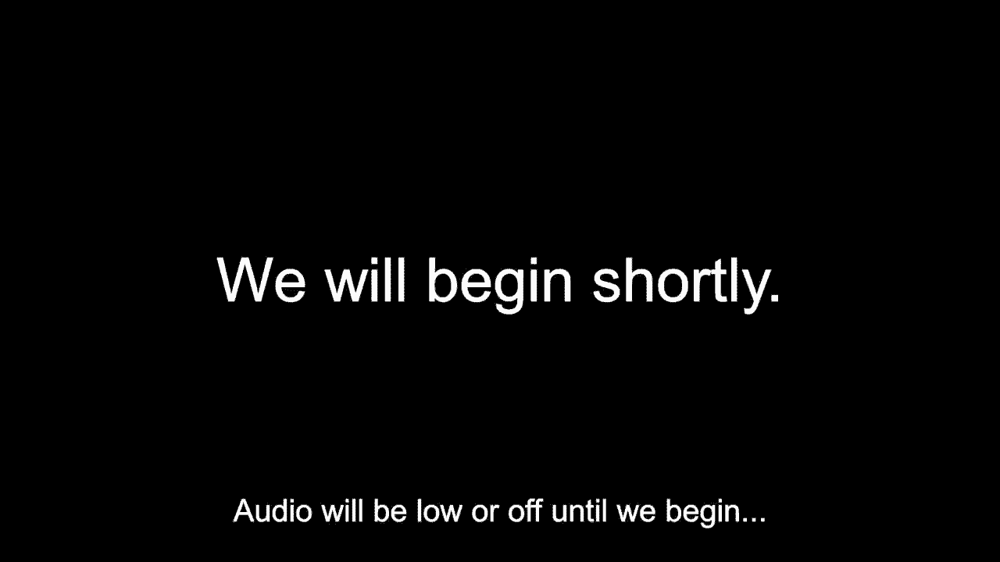

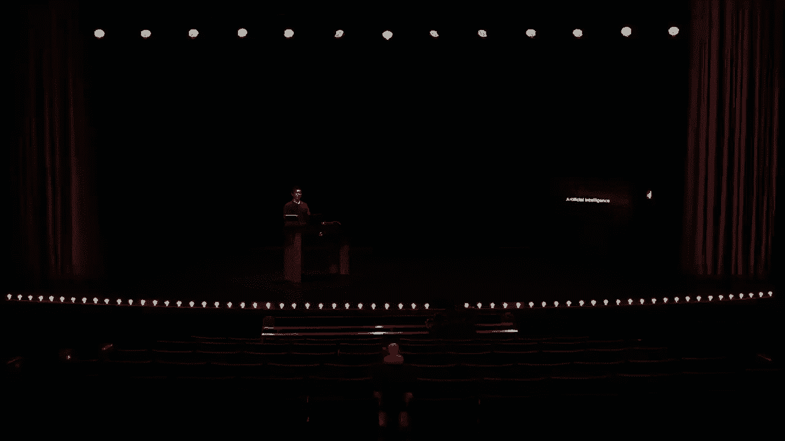

This is CS 50 Harvard University's introduction to the Intellectual enterprises。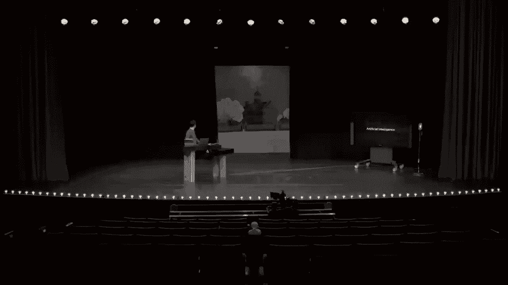

of Computer Science Over here。Computer science eso Today we're joined with by C s with his own。This is an unusual week。A look at artificial intelligence or AI。You might recall that some weeks ago。when we first introduced Python，we talked about writing programs that answered you by saying hello if you said。hello or by saying goodbye if you said goodbye。But those programs were all implemented with。

if conditions and else ifs and else it's and so that really wasn't artificial intelligence。If you wanted to have a whole conversation with a computer program like that。that would be a huge number of ifs and else ifs just to anticipate all of the things the。human might say so we could do better。humans have been doing better in this field of artificial intelligence。

And I'm so pleased to say that Brian's here to lead us along that way。Now CS 50 zone Brian。you thanks very much。Welcome everyone to see us 50。as David alluded to the topic of discussion。is artificial intelligence，which is all about taking our computers and trying to make them intelligence。somehow trying to get them to be able to act in a way that somewhat rational。

and that could take a number of different forms。One example of artificial intelligence。might be game playing。You might be familiar with the game of tic tac toe。where you've got this three by three Grid and X and O take turns trying to get three in a row。X started the game and played in the middle Square of this grid，and then it was always turn and oh。

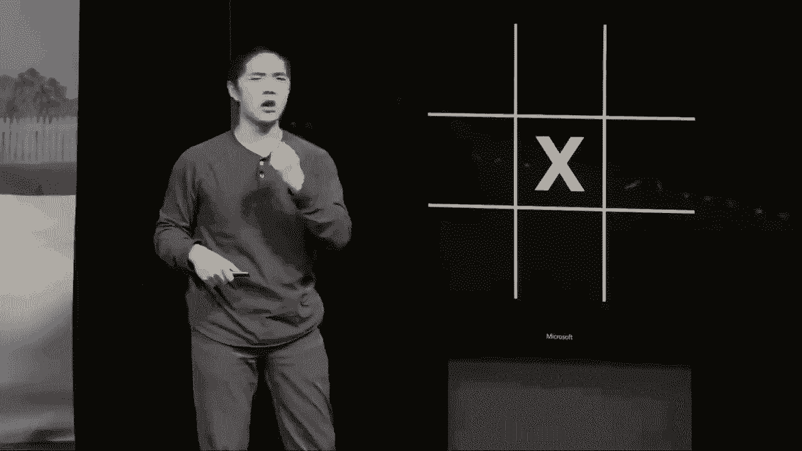

played in the top。It turns out that at this point in the Game。X has a very strategic move and a human that's very good at the game or a computer。They could maybe try and figure out how to play this game。might make an intelligent move like playing in the top right corner。

And if X plays in the top right corner，then oh is going to need to play in the bottom left corner in order to block X from getting three in a。And here Maybe you can see one of a couple possible good moves that X has no。But X could play a move like moving in the right square over there and。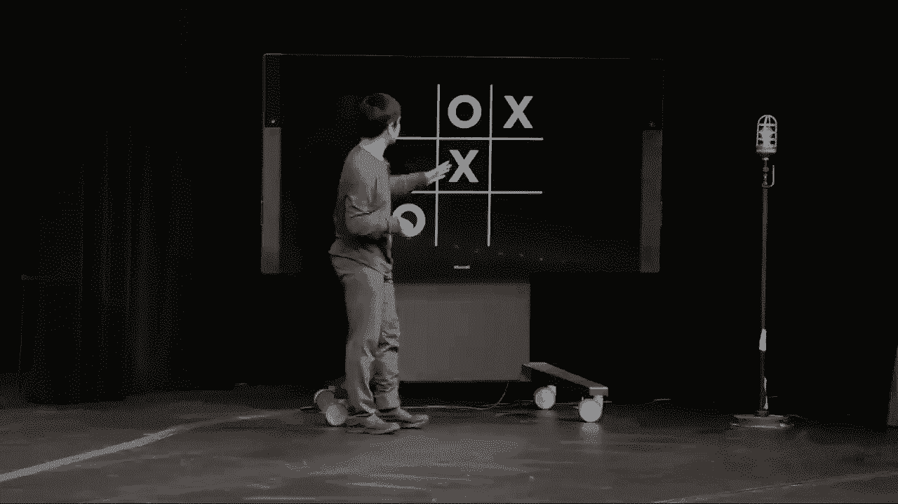

always in a tricky position。X has one way that could potentially win the game horizontally on another way。That could potentially win the game vertically and so is going to have to block one of those ways。and maybe they go to block horizontally。But then X is going to win no matter what。just by playing in that bottom right corner。And so a human playing this game could reason through the game thinking about how the opponent might。

respond and how X would respond in turn。And a computer might try to do the same thing for a game。a simplistic tac toe or a game even more complex。But AI goes beyond just game plan。You might see examples like handwriting recognition。where nowadays computers are pretty good at taking human hand written text。

which is different from person to person and somehow figuring out with pretty high accuracy。exactly what characters the human was actually writing。AI comes up in areas like spam detection。Maybe in your email inbox，and your spam email usually gets sorted into a separate folder。where you might get a whole bunch of emails coming into your email inbox。

And somehow your computer is able to figure out with reasonable accuracy which emails air。good and which emails or spam。the computer is not perfect at this。There are false positives where the computer thinks that an email might be spam when it isn't actually。And there are false negatives to where a spam email might accidentally end up in your inbox because the。

computer doesn't catch it。But those sorts of false positives and false negatives are the types of things that AI researchers air。working on trying to reduce to make these systems more and more accurate。You see these kinds of systems show Oppa's well。If you've ever been on a video watching website like YouTube or Netflix。where you have watched a whole bunch of videos or TV shows or movies and then。

software behind Netflix or behind YouTube is able to give you recommendations。suggest other videos that you might be interested in watching based on the things that you've。watched already and in more recent years，AI has gotten pretty good at doing even more sophisticated things。Things like generating data。Take a look at these two images，for example of people。

and see if you notice anything strange。See if either of these people look strange to you。can you figure out which of these two images is not a real person？

a computer generated person that looks like it's human。but it's not actually a photo of a real persons。You can look at these two images carefully。Maybe look at the eyes and hair and the mouth and the nose and see if you can figure out which one it。It turns out neither of these two images or images of real people。They're both computer generated。

not photos of real people。But a computer has been trained to generate images of people that look like real people。That could fool someone into thinking that it's a real person。but it's all just a I generated information。So today we'll take a look at all of those ideas how it is that artificial intelligence works。and ultimately one of the big takeaways is that a I is not just one algorithm or one。

It's really a collection，a category of approaches to problem solving that can all be used to try and solve some of。these problems of trying to make computers intelligent。So let's begin with one of the first areas where we might want to make our way。and that's in the area of decision making。The very frequently we want to train a computer to be able to make a decision。

that decision might be deciding if an email is spam or not spam or deciding whether or。not to recommend a video to you。Or it could be deciding what action to take in a game。So let's take a simple game。Maybe you've played a game like this before。where you control this paddle along the bottom and you're tryingto bounce this ball in order to hit all of the。

bricks along the top。Imagine if you were trying to program a computer to be able to play this game strategically to play。and the computer observed the ball move that way，so the ball is moving that way。What should you program the computer to Dio？it makes logical sense that if the ball is moving to the left。then you should program the computer to move the paddle to the left as well。

to try and catch that ball before it falls through the ground。And so you could take that kind of logic and encode it into a computer program。using what we might call a decision tree decision。Trees are just a way of representing a decision that a computer might make by asking questions。And depending on the answers to those questions，we might ask another question or make some sort of decision。

So for this game of the paddle，we could create a decision tree by asking a question like this。Is the ball to the left of the paddle？If the answer to that question is。then the action we should take is we should move the paddle to the left because the ball is moving left。The paddle should move left as well。If the answer to the question is no。

well then we need to maybe ask another question。We might ask a question like Is the ball to the right of the paddle？

And if the answer to that question is yes，then we'll go ahead and move the paddle to the right。And if the answer to the question is no，that means the balls not to the left of the paddle。and it's not to the right of the paddle，so we may as well just not move the paddle at all in that case。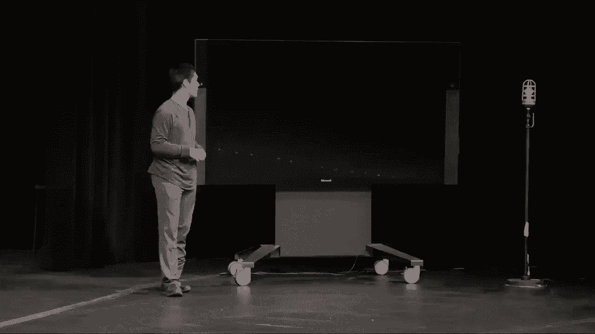

again is that decision tree that can allow us to make these choices about what it is that our A I。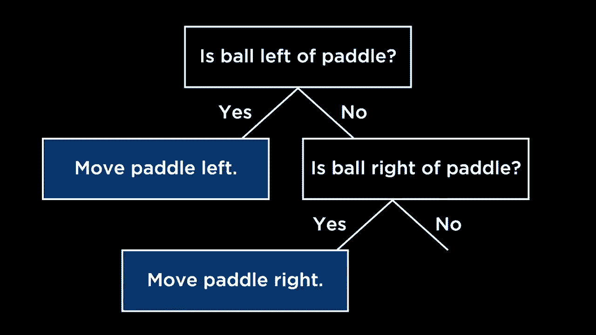

should do in this situation。And we could take that decision tree and turn it into a kind of pseudo code。something that might look like something you would write in C or in Python，while the game is ongoing。if the ball is to the left of the paddle。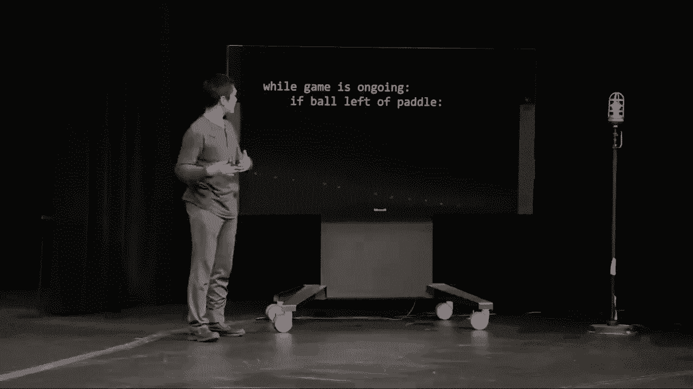

go ahead and move the panel to the left else。If the ball is to the right of the paddle。move the paddle to the right and else if neither of those air true。then don't move the paddle it all So one of the advantages of this decision tree is that it translates quite。nicely to the conditions that you're familiar with from the world of programming。

So let's give this a try with something a little more complex。Let's take the game of tic tac toe。and imagine you were trying to program an AI to strategically play the game of tic tac。What questions might you ask in your decision Tree？Yes or no questions。But you want to ask to create an AI that can play this game well。

that can play this game strategically，and maybe I'll take a volunteer。If anyone wants to suggest one possible question，I might want to ask of my AI as I'm trying to teach this AI how to。play this game。Any thoughts for questions that I might ask in this situation。and let's go to Let's see，um，what is the probability of winning，given a certain mood。

How could you detect what it would mean to win like，what are you gonna look for on the board？

three consecutive。excess or circles。You're looking for some opportunity for。three consecutive exes or three consecutive votes。you might ask is checking to see whether or not you could get three in a row。maybe on the next turn。If you already have two in a row and there's an empty space。that could be an opportunity for something that we might want to try。

Any other questions that we might want to ask is part of our strategic decision making。If we're trying to play this game of tic tac toe，any thoughts about other things。we could try other types of things we should be looking for。We're asking as we're training。our artificial intelligence is we're trying to program it to play this game strategically。

you can comment in the chat as well。If you have thought about what we might want to dio or an approach we might want to take while。let's go to Santiago。If there is any possibility toe win，the other player for the other player。so you might want to check the other player to see if they have some possibility to win。and if they have some possibility to win，So those are great questions you could ask。

and we could start to formulate a decision tree for tic tac toe。Based on those questions。I might start by asking，Can I get three in a row on this turn？And if the answer is yes。then my action is pretty straightforward。I should play in the square that will get me to three in a row。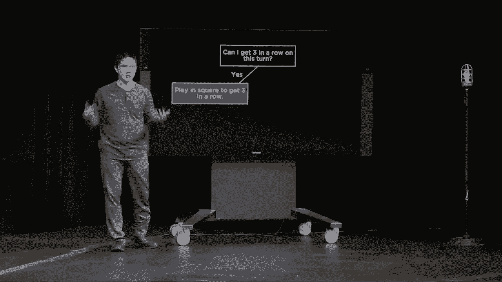

If the answer to the question is no。then I might ask Santiago's question。Can my opponent get three in a row on their next turn？And if the answer to that is yes。then we better play in the square to block them from getting three in a row。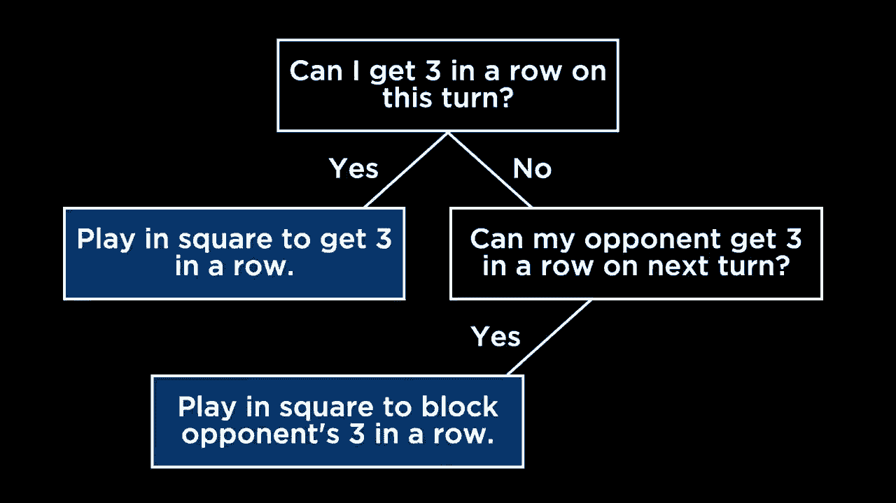

they're gonna win the game if we don't block them Now。If the answer to this question is no。if I can't get three in a row on this turn and my opponent can't get three in a row on the next turn。now it's a little bit less clear。You could maybe try and come up with additional questions。but these two questions air very clear and the rest or maybe a little bit less obvious。

But ultimately we don't want to be doing any of this is we're starting to make our AI more and more。as David was alluding to earlier。rather than us have to program every condition into the computer。telling it what to dio in every situation，we'd like for the computer to be smart enough to just figure out on its own。analyze on its own all of the possibilities and figure out what move it should make。

we want our computer to make the optimal decision in the best possible decision when playing。we can introduce our first algorithm in artificial intelligence that will look at today on that algorithm。is called Mini Max Min。Imax is a game playing algorithm that's useful anytime you have two competing players。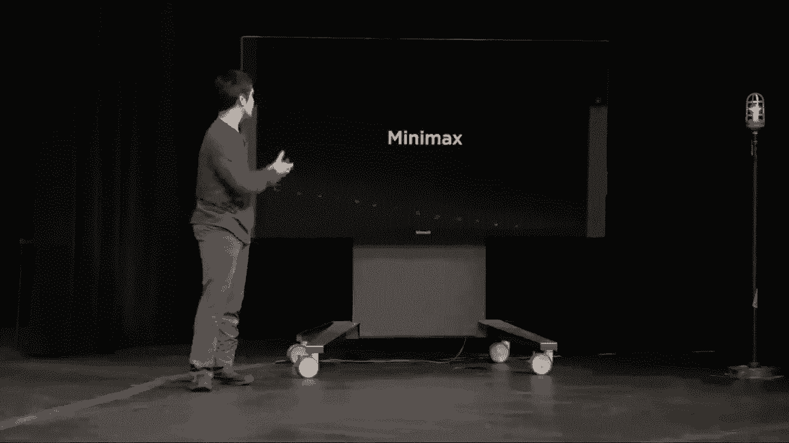

that air trying to play some sort of competitive game like tic tac toe。But it'll work for other games as well。as with we've seen all throughout CS 50 we need some way of representing this game。inside of the computer and ultimately you'll recall way back from the beginning of CS 50。We've been trying to take everything and represented just with numbers and we can do the same thing with。

As far as our AI is concerned，there are only three possible outcomes of the game that our AI is going to care about。Either oh wins or ex wins and executes three in a row。Or it's possible that neither side winds that it ends up being a tie。And so what we're going to Dio is take each of these three possible outcomes and assign a number。

to each of those outcomes will say，Let's call that negative one x winning。We'll call that one and a tie。that's somewhere in between the two。so we'll go ahead and call that zero。Nobody wins that game and now each player has a goal。some objective that we can quantify using these numbers。

The ex player who we might also call the Max Player aims to maximize the。What's best for X is a score of one，meaning X is going to win。But if X can't win well。then tying the game a zero，that's better than losing the game。We're going to call the min player the minimizing player。Their goal is to minimize the score。

Negative one is the best outcome for the O Player。But if negative one can't happen。if oh can't win well，then tying the game is still better than X。Winning because X winning would mean are minimizing player player。Oh is ultimately going to lose the game and so we can take every board in。

tic tac toe and a sign of score to it。It's either one or zero or negative one。this game is over。X has already won the game，and because X has won the game。we're going to give that a value of 11 corresponds to X winning negative one toe。winning zero for a tie。Eso Let's now consider this game board。This game board isn't over yet。

but we can still assign a score to it。Let's assume that it's X's turn。What score would you give this board？when we're giving each board a score。we're considering what would happen if both players were playing optimally。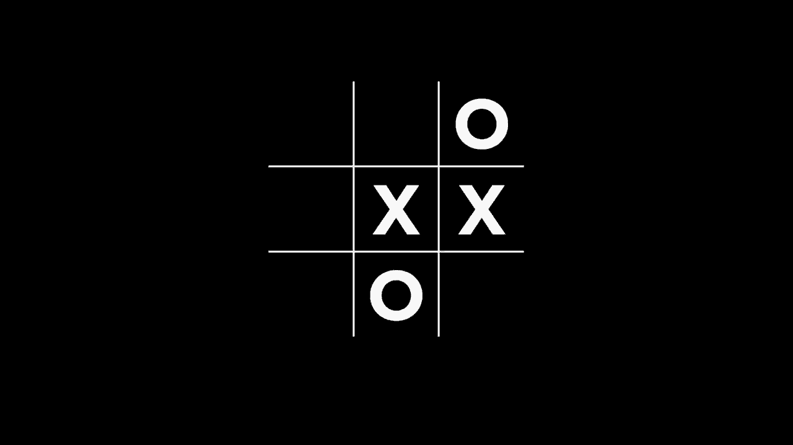

if both players are playing the best possible moves and in this case of X is playing the best。then X is going Thio play in this square to get three in a row。And so this board also has a value of one because of exe plays。X is going to win the game that has a value of one。So let's take a look at another board。

maybe one that's a little bit trickier now in this board。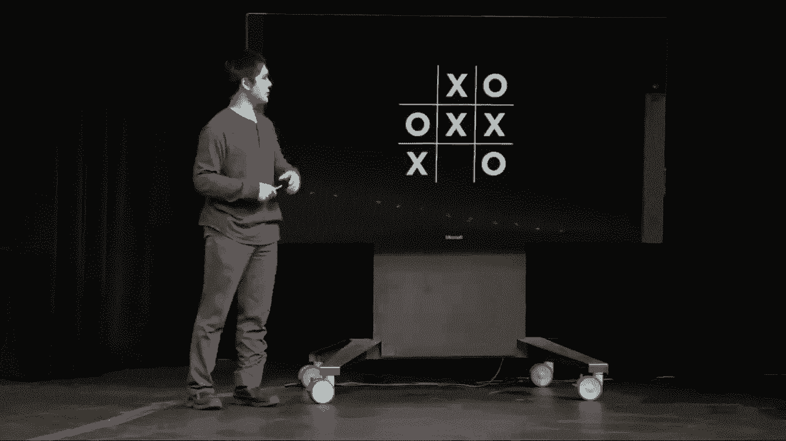

Let's assume it's owes turn。And then because there's one empty Square X will get to make a move after that。what value would you give to this board？Maybe we'll ask for a volunteer。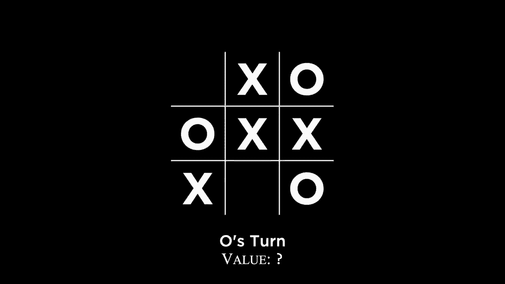

the possibilities are one。If X is going to win，negative one is always going to win and a zero if it's going to be a tie。If both players play the best moves and it's O's turn right now。What value would you give to this board and why？

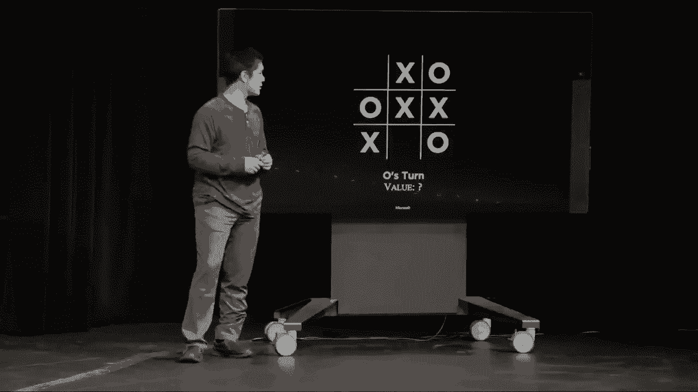

Let's go to Santiago。I would say that the value would be zero because both players play their best。No one in the end will win because Old Block X and then there would be nothing，but yeah。absolutely correct。It's certainly possible that X could win because X has two in a row。They could get three in a row。But if both players play their best moves。

then oh is going to block here and then X is going to play in the upper left。And it's going to be a tie，which means this board is gonna have a value of zero。And the way a computer might figure that out is by reasoning it through exactly the same way we did by。considering both of the possible options。If I want to know the value for this board where it's always turn well。

then I'm going to consider both of the possible options。Oh has two choices。could play in the top left。Oro could block X by playing in the bottom there。and the computer would consider both of those possible choices and try and figure out what。value each of those boards has。So what happens if a place in the top left？

then X is going to play in the bottom and X is going to win the Game X。winning the game that has a value of one。which means this board also is going to have a value of one X wins。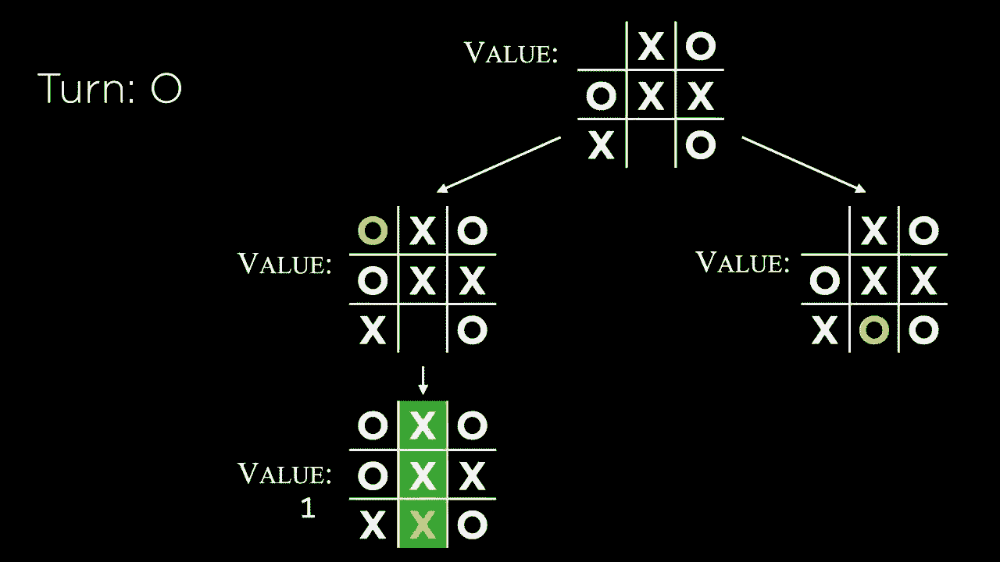

So let's consider the other possible choice。could also have blocked X by playing in the bottom here。and in that case，that's going to lead to explain in the upper left。It's the only other possible option。That board has a value of zero。which means this board also has a value of zero。And now the minimizing player is going to look at these two options。

If I play in the top left，that's going to be a value of one that's not good for me。If I play in the bottom，that's going to be a value of zero。So that's better。we can conclude that this board up top at Santiago correctly stated Eyes also going to。have a value of zero。If both players play their best moves，it's ultimately going to be a tie。

And this is what we might call a game tree，where you're exploring all of the possible branches all of the ways this game could go。we're too moves away from the end of the game。But you could back up and consider what would it look like？

Three moves away from the end of the game and you end up with a bigger tree because you now need to explore。Possibilities is you're trying to figure out what the value of any particular game board。And so that's the way the minute Max algorithm works。Consider all of the possible moves you could make and then recursive Lee。

consider if I make my best move，what's my opponent going to do in response？

And then what could I do in response to that？And we could formulate that as a little bit of pseudo code by saying if the player is X。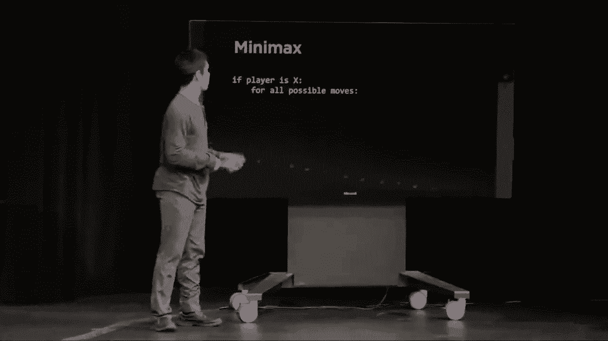

for all of the possible moves，let's go ahead and calculate a score for that board the same way we were just doing by recursive Lee。Following all the possible moves，let's get a score for that board and let's choose the move with the highest score。if the player is oh，then we'll do the same thing for all the possible moves will calculate a score for that board。but then we'll choose the move with the lowest score。

So the ex player is picking the move that maximizes the score。The old player is picking the move that minimizes the score。And using this approach。you can create an AI that can play a game like tic tac toe perfectly。It will never lose the game if you've programmed it correctly。

and this works not only for tic tac toe but for other games as well。But do you see any problems with this approach，this approach of considering all of my possible moves。then all of my opponents，possible responses to those moves and then all of my possible responses to those moves。Until we get down to the end of the game，any possible problems that might arise？

Maybe you can take a really long time to，like explore all the branches and actually come to a conclusion。the amount of time it's going to take to explore all of those possible moves。It could be quite large。depending on how complex the game is for a game like tic tac toe。Maybe think about how many possible games of tic tac toe there are。It turns out there about 255。

000 possible games of tic tac，which seems like a lot，but computers it pretty fast。And computers could make it through all 255，000 of these possible tic tac toe games。usually in a matter of seconds on most modern computers。But if you imagine a game like chess。known for being a fairly complex game，how maney possible games of chess are there？If there are 255。

000 possible games of tic tac toe，how maney possible games of chess are there？

it turns out that on Lee after the first four moves。If you only look at the first four moves of chess，there are 288 billion possible chess games。which is a lot for any computer to try to deal with。And that's only the first four moves If you consider the entire game of chess。

Nobody knows the answer exactly，but people estimate that 10 to the 29，000 is probably a lower。bound on the number of possible chess games。The actual number is probably higher than that。That is far too many for any computer to be able to reasonably get through in any amount of。are not going to be able to consider all of the possible moves going all the way to the end of the。

game in order to figure out what the score for any board is。Which is why a game like chess is much harder for an AI to play than a game like tic tac toe。But it's not impossible。the best computer chess players air far better than the best human chess players at this point。So what could we do？What maybe improvement could we make？

Or what change could we make to the algorithm so that our A I can still play a game like。Even though there are so many additional possible moves，there are a lot of possible answers。Anyone want to offer a thought or a suggestion as Thio？How we might address this problem？

There's so many moves to consider too many for a computer to ever reasonably try to。attempt any thoughts on something we could try。Just if there was some way along the way。to maybe assigned some point values where you could below some threshold。Maybe you could discard those paths。we want some way to be able to more intelligently not explore all of the paths。

discard some of the paths or not，or stop ourselves somewhere so that rather than consider all of the 10 to the 29。000，possible games of chess，we just consider fewer of them。Exploring fewer possible games and exploring fewer possible level is。um and so there are many variants on the minute max algorithm。

one of the most common being what's called depth limited。limited min imax。We consider what's called an evaluation function rather than follow the game until the very。We followed the game some number of moves and chest。Maybe you're going 15 16 moves。but not all the way to the end of the game。

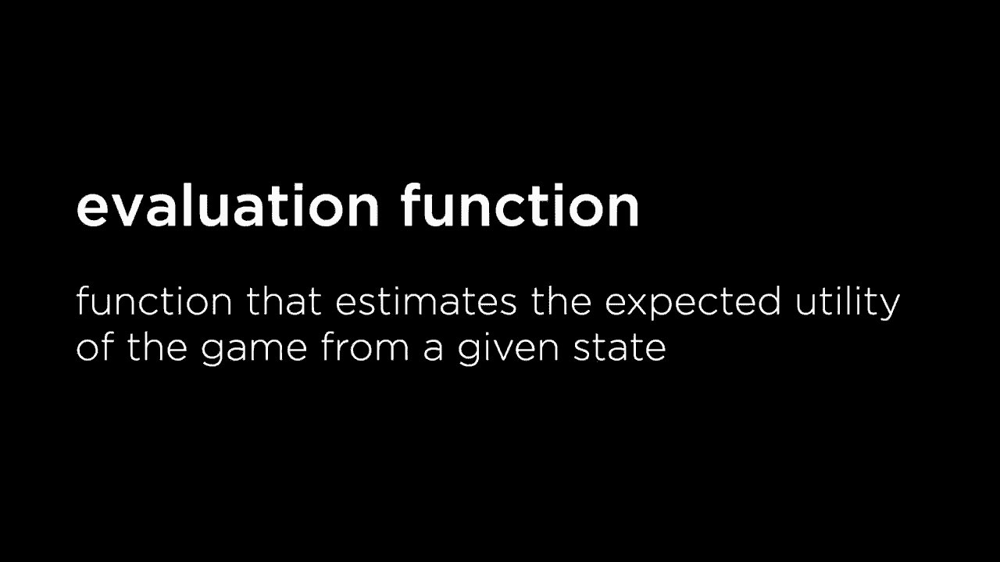

And then you're just asking a question like All right，at this point in the game。who seems likely to win，even if we're not gonna calculate it all the way。You could maybe make some judgment by counting up how many pieces of what value each side happens toe。and you might come up with other strategies for different games。

But this now is where we need to start。Being even more intelligent is thinking about how can we come up with a good evaluation function。that's able to take a complex game and estimate who's potentially likely to。is Min Imax an example of an algorithm that could be used to play games。and I'll pause here for any questions about Min imax or game playing artificial。

intelligence before we move on to an entirely different type of artificial intelligence。Any questions coming in in the chat？I just have a question or like。this algorithm is kind of following，like how we would think about the game。But are there any other algorithms that，don't necessarily look like at step by step evaluations？

they're definitely other algorithms and other approaches。what we've given an example of is really just an example of an exhaustive search searching for all of。the possible different moves and then making a judgment。we'll see some examples of mawr intelligent algorithms，algorithms that can learn later today。

we'll take a look at some of those other possibilities and how we might apply them。then is really an example of what we might call a search algorithm。A search algorithm is just a type of algorithm where we're looking for some solution。It could be looking for the best move to make in a game。

Or you might imagine a search problem or abstract Lee of something like finding your way through a。You're tryingto get from one point in a maze to another point in a maze。and you have to make decisions about which way to turn and how to go。application of this might be something like driving directions。If you go into Google maps。

and you type where you are and where you're trying to get to Google maps pretty quickly can give。you a fairly optimal route，which way to turn and when。When to make which decision that will get you from one point to another。This is an example of a search problem。Google Maps needs to somehow search through all of the possible routes you can take to figure。

out how to get you to the place that you're going。And so we could come up with an algorithm for trying to do that。Imagine we have a maze like this we're trying to get from Point A to point B。But of course we have some walls here，these great out squares or walls that we can't cross the room。but we'd still like to try and find some path that will get us from point A to point B。

There are a number of algorithms that you might try and you could think about if you were solving this maze is a。How would you decide what decision to make，whether to go left or whether to go right？

But as far as the computer is concerned，we need to give it a very precise algorithm。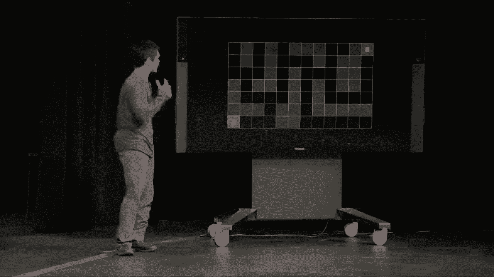

And one of the simplest algorithms we might come up with is one called depth First search。and the way the depth first search would navigate its way through。Amazing is to say the AI is going to just follow a path。And if ever the AI needs to make a choice。it reaches a fork in the road，where it could go left or it could go right。

It's just going to choose one randomly。It doesn't know which way is better。so it's going to pick one path and it's going to try it。And if ever it hits a dead end。it reaches some wall where it can't make any more progress。Then our AI is just going to back up and it's going to try another path instead so I can show。

We're starting at point A。We're trying to get to point B。and the way our AI might work is that we might start by just following one square after another。we don't have much choice in the matter。We haven't reached any branching points or any forks in the road。But at this point right here。

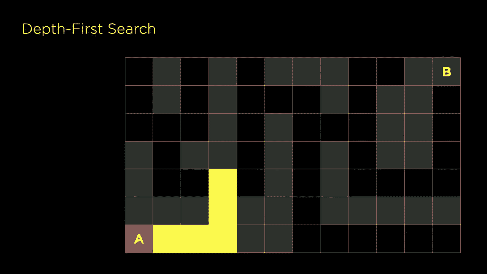

We could go left or we could go right。And as faras Depth First Search，otherwise known as D efs。D efs doesn't know which way to go。It doesn't know whether to go left。It doesn't know whether to go right。So we pick one randomly。We might choose to go left。So we're gonna go left and we're going to keep following the path until we get to another fork in the road。

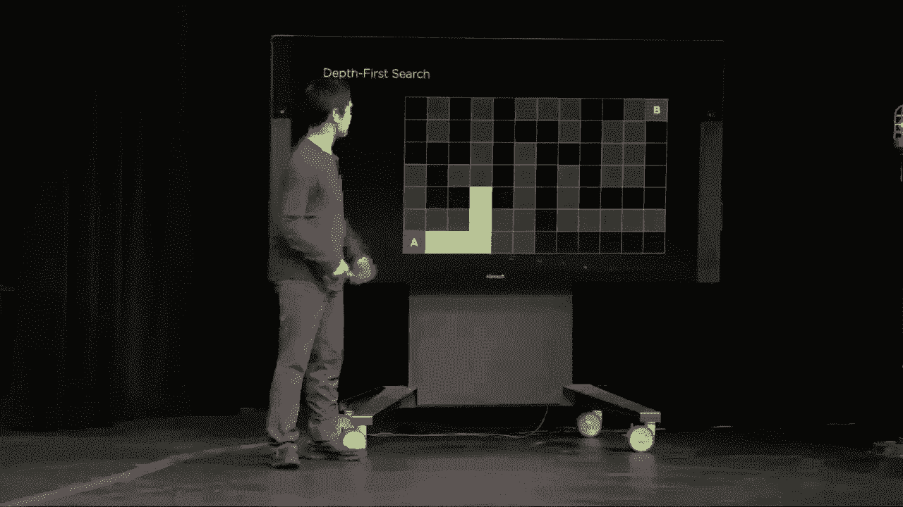

We could go left or right。D efs doesn't know which to pick。So we're gonna choose randomly。And now we hit a dead end。our algorithm knows this was not a good path to take。so it's going to back up to the latest decision point and make a different choice。So it's going to back up to right here and say，I tried going lest it didn't work。

Let's try going right instead，this was not a good path to take。So instead of going left。let's try going right，So we'll try this path。Maybe we'll try going up but hit a dead end So we'll try going to the right here again。We're gonna make some choice。we're just gonna repeatedly hit dead ends and try new path until eventually we。make our way to the destination。

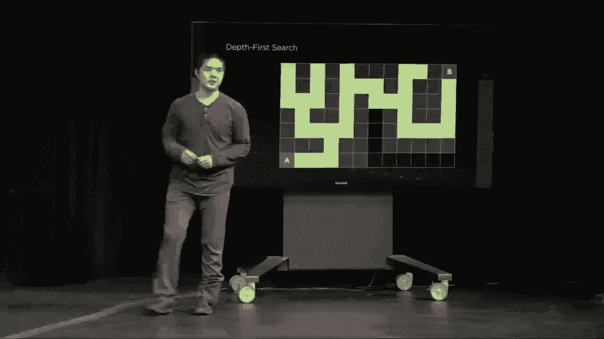

And so that is depth First search。And as long as they're like a finite number of squares。this algorithm is eventually going to find a path to the destination。If such a path exists。If there is a way to get from point A to point B，then this algorithm will eventually find it because it tries something。and we keep doing that until eventually we find our way to the destination。

But this algorithm isn't great。There's certainly some problems and maybe room for improvement。So maybe I'll ask all of you。What problems do you see with this approach？

Maybe reasons why this algorithm might not be ideal areas where we might be able to improve。upon this algorithm。As it stands right now，Thio Joy。I think it is very time consuming。it's very time consuming，and it's time consuming in a number of ways。were exploring a lot of paths that really don't lead anywhere in the sense that you know we did。

We explored all of this area，but ultimately that didn't help us towards trying to find the goal。And it's also time consuming in the route that it ultimately finds。Like if you imagine using Google maps，Thio navigate our way from one place to another。It's likely going to be the case that you want to find an efficient route you want。

like the fastest way to get from where you are to where you want to go。And if Google maps were to give you a like a long and winding route with lots of detours。that got you to the destination but took much longer than it needed Thio。That's probably not the best user experience for you。And depth for a search。

could run into just that situation。Imagine amazed like this。Where from point A。we could go up or we could go to the right。We don't know which to take so depth。First search will just randomly choose。We might choose to go up。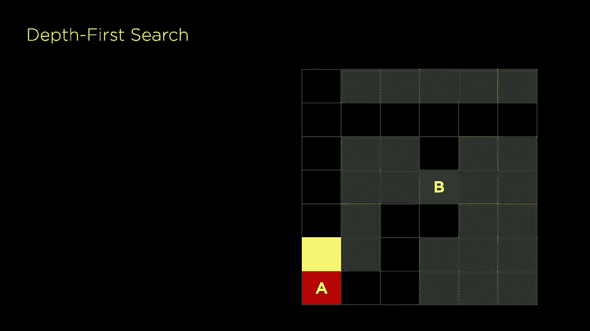

and maybe we'll go right，and we'll find our way to the destination。depth First search was able to find us a path from a to B。but remember that often what we want to do is we want to make the optimal decision。This is a correct path for getting from a to B，but it's not the best path。

If we're looking for the shortest path from a to B。It's going to be this path here that goes from a to be there，so we'd like some way to fix that。We'd like an algorithm that is able to find us the shortest path，not just finding us any path。And so for that we can use an algorithm called Breadth First Search，otherwise known as B。

And the way this algorithm works is that instead of whenever we reach a fork in the road。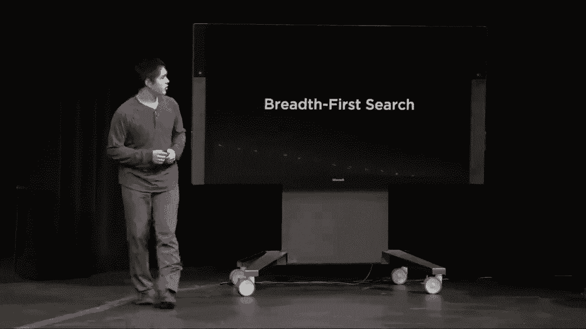

pick one until we hit a dead end and then pick the other。What breadth first search is going to do is whenever we hit a fork in the road，let's take both paths。Let's take one step on the left and then one step on the right。and then another step on the left and another step on the right and effectively just search outwards from the。

We're going to start from the beginning and look for all of the places we could get to by taking one。step away from a and then everywhere we can get to taking two steps away from a and then three。steps away from a so on and so forth。So we're always looking at the things that are nearby before we look at the things that are further。So the way this might work is that from a we're going to take one step up and then we're going to search。

and then we'll look a second square on this direction and then a second square along the path to the right and then a。third square in the third square。And we're going to repeat that process effectively。alternating between all of the different options that we have until eventually。we find this optimal path from A to B。And because we're looking for the shorter path before we look for those longer path。

eventually we're going to find that shortest possible path，There are still problems with this。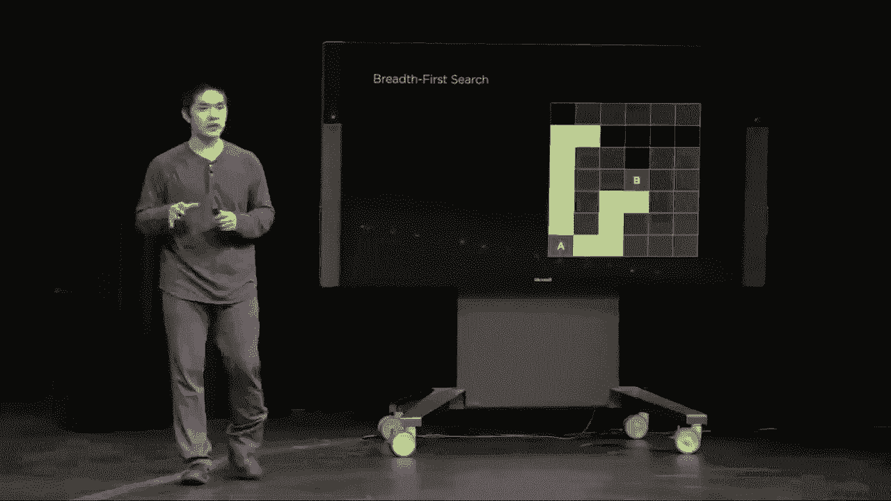

As joy pointed out，these algorithms have a tendency to explore a lot of passes unnecessarily。Let's go back to that original maze，and consider what would breadth first search do？

If I presented it with this maze will consider what might happen。We might go until we reach the first decision point right here。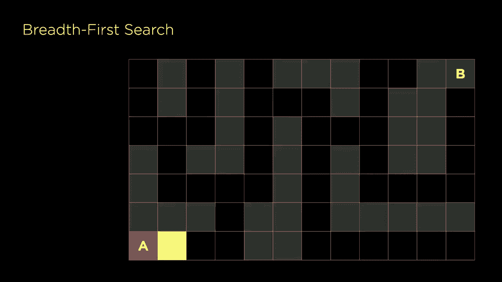

We could go left or right and remember depth。First search picked one and just followed it until a dead end。What breadth first search is going to Dio is it's going to pick both。That's going to go to the left and to the right and then to the left and to the right and basically alternate between all of。those until we reach another decision point and then it's going to consider all of those。

Let's go left or left here and right and consider these possibilities to。and it's going to keep exploring。Any time we reach any decision point。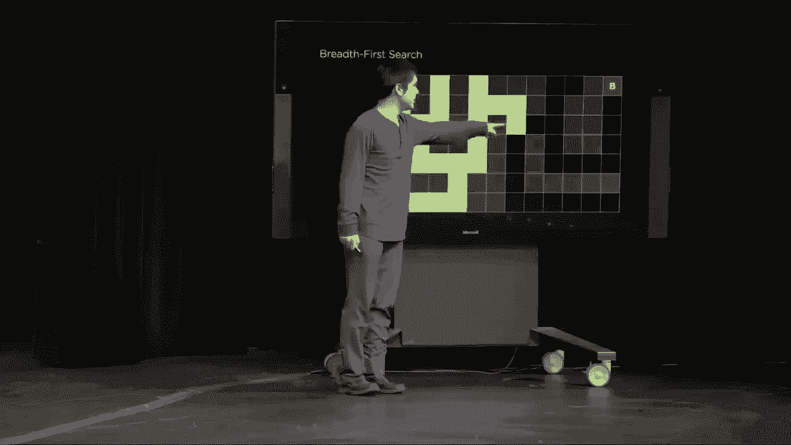

it's going to explore this way and that way，this way and that way，over and over again。if we repeat this process and consider what breadth first search is looking for。it's going to find me the shortest and in this case，the Onley possible path to get from A to B。But it took such a long time to be able to do so。

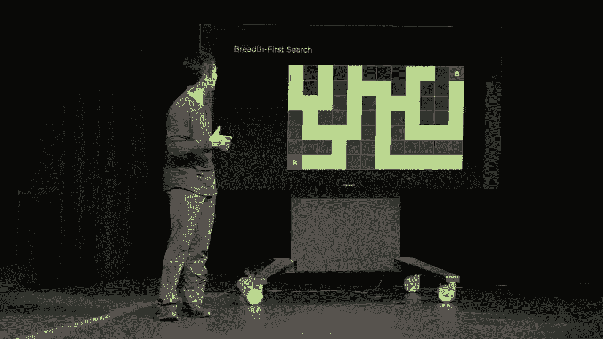

It looked at so many different squares。it looked at all of the squares in order to do something as simple as find the shortest。path to get from one point to another。And so here we can try to start to be a little bit mawr intelligent。What we'd ideally like to dio is that when we reach this first decision point go left or go。Most humans，if you gave them this maze and told you to try to solve it at this decision point。

you wouldn't just pick randomly，you would choose toe go to the right because。the goal is somewhere to the right。And so it's probably the case that we should follow that direction if we're trying to find our way。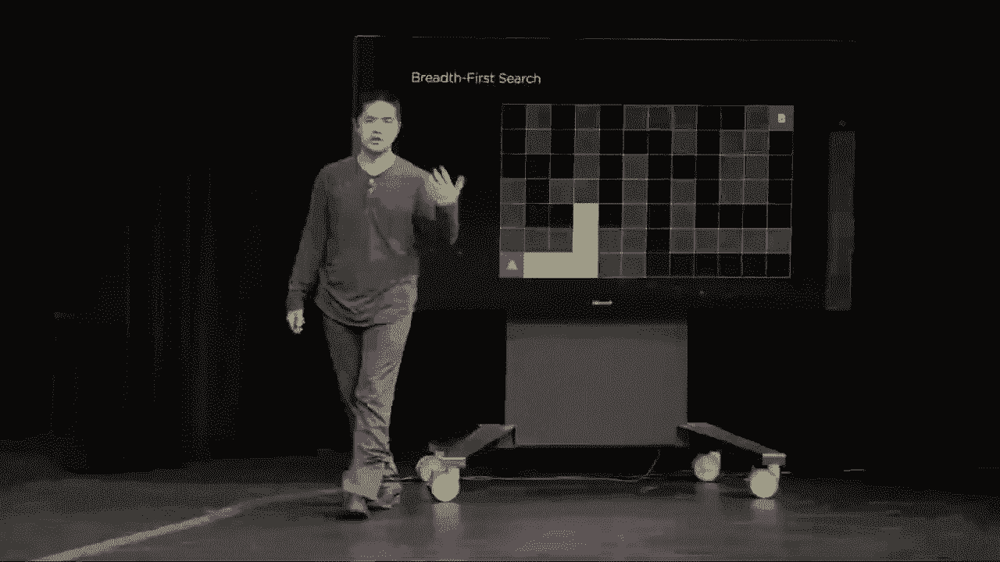

to the end of the maze。And so these algorithms we've looked at so far depth first search and breadth first search。are examples of what we might call uninformed search。They're not using any specialized knowledge about the problem。They don't really know anything about the maze。

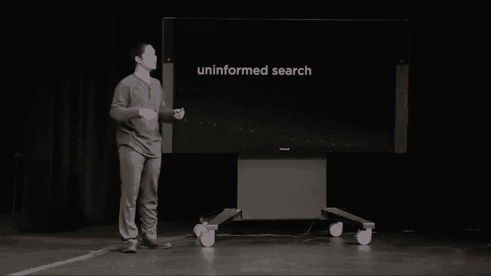

They're just basically blindly guessing and hoping that eventually we make our way to the。But in a I we can improve upon this by using an informed search，An informed search。Use is something that we know about the problem to try and improve the way we search to allow。us to search Ah little bit mawr effectively and to do so we're often going to make use of。

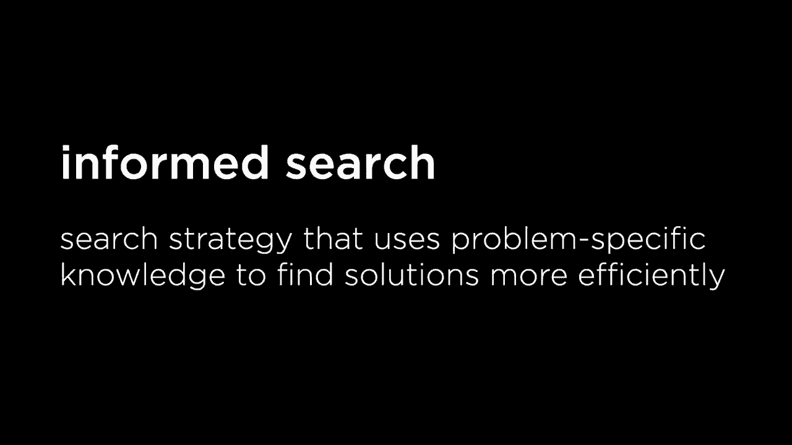

what's known as a heuristic，some way of estimating how good Ah。particular state is going to be so in this maze，if I'm trying to get from a to B。ah heuristic would allow me to answer a question like。If I see point see over here and point d over there。Which one of those points would I rather be at Which one is better for trying to find our。way to the destination and between C and D breath for research in depth。They have no knowledge of which one of those is going to be better。As far as it's concerned。every square is just a square。But if you're looking at this is a maze most people would intuitively tell you。

even if I don't know exactly how to get to the destination。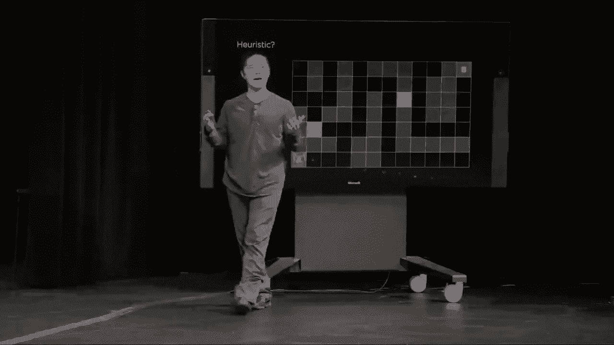

If I could be it either C or D，I'd probably pick D because it just looks like it's closer to that。And so the heuristic we could use is one that's often known as the Manhattan Distance。The Manhattan distance between any two squares effectively says，Ignore the walls。ignore all the boundaries。Just consider how Maney Squares like in this case，up and to the right。

what I have to go to get from where I am to the destination。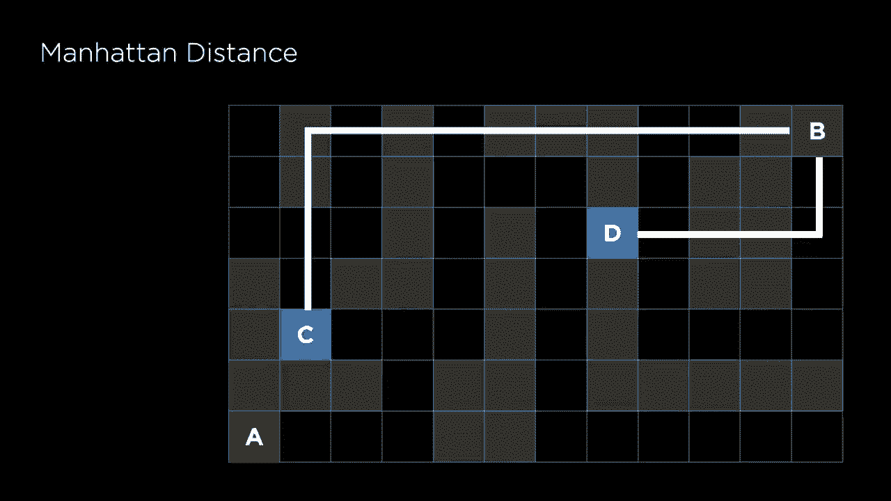

we would go up this many squares and then all the way to the right。whereas from D it doesn't matter whether you go up to the right first。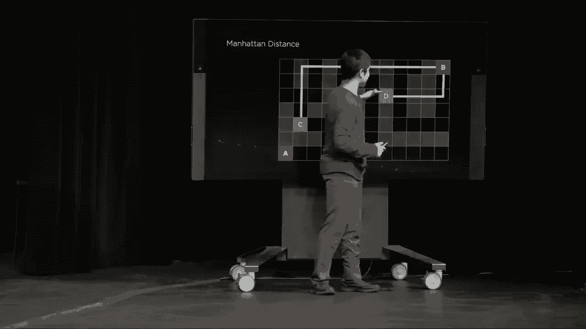

but I would go right four squares and then up to D，as faras Manhattan Distance is concerned。is much closer to the gold than C。And so I would rather be a D than it see。And as soon as we have that notion of between any two choices。which one of those would I rather be at？That gives us a way to improve upon the random guessing that the other algorithms dio remember。

the depth first search when it reached a fork in the road and it could go left or right。It didn't know which to pick，so we're just randomly picked one。Now that we have a heuristic like this，we can make an informed choice。We can say I don't know whether left or right is the correct solution。

But right is probably going to be better than left because of this heuristic。And so I could make the sorts of judgments。we'll take a look at another algorithm known as greedy Best First search。So in greedy Best first Search，what we're going to dio is considered for each of the squares。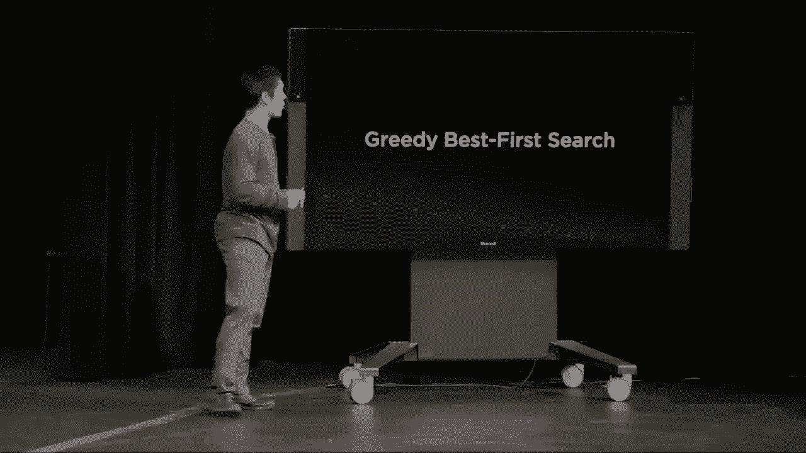

What it's heuristic value is according to the Manhattan distance，So this square。is one away from the goals we've labeled it with the number one。is too away from our goals。and we labeling it with the number two。This is three away。that we're ignoring any of the walls any of the boundaries。

because those they're going to be difficult to compute。We want something efficient，this square here。even though in order to get to the goal，we have to follow this winding path to go around。All the boundaries were still giving it a score of two。We want something efficient right now。It just looks like it's two away，so it's not a perfect heuristic。The heuristic is just an estimate。

but we're using it as an approximation that's going to help us as we go about this search process。And so what we'll do is we'll start the same way，starting from point A and looking at all of the squares。we could get Thio until we reach our first decision point。So here we could choose to go left。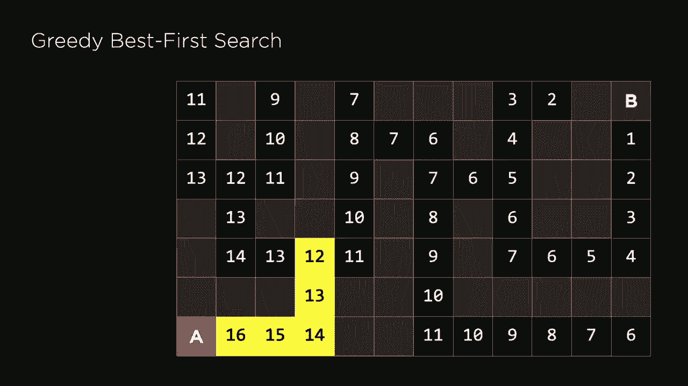

or we could choose to go right and in this case，According to the heuristic。this squared is 13 away from the gold，and this one over here is 11 away from the goal。So between those two being 11 away from the goal，that sounds a whole lot better。So greedy。Best for research is going to make the choice to go to the right。

We'll keep following until we reach the next decision point here。we have two choices up or to the right。As Faras the heuristic is concerned。Both of these air equivalent going up where seven squares away going to the right，were six plus one。That's a total of seven squares away。even greedy best first search sometimes needs to pick randomly。

If both squares have the same heuristic value，we just have to make a choice。And maybe we make a bad choice and hit it at end。But then we can just try the other one。So 76 we're going to keep following here。We have another decision point。We could go down or we could go to the right。But the one of the right has a smaller heuristic value。

It's a six instead of an eight，so we're always going to try and pick the one that looks like it's going to be closer。The six will go to the five。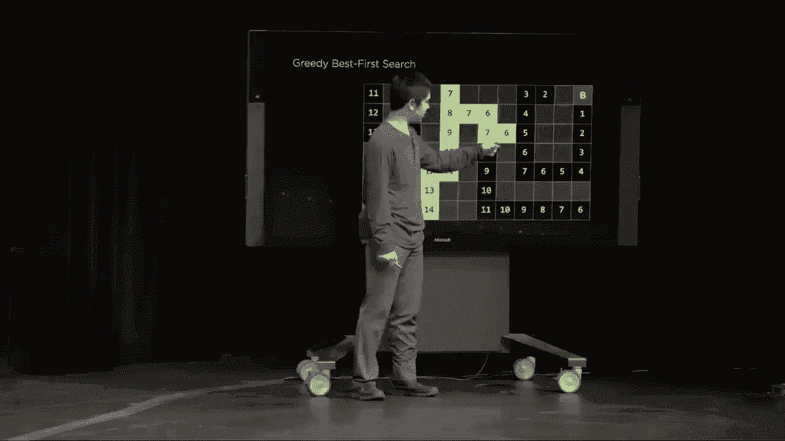

and here we reach one more decision point。which has a heuristic of four，which has a heuristic of six。So even here，because the four is the smaller value。we're going to go up even though you the human conceit，we're ultimately going to run into a dead end。The computer doesn't know that yet。The computer just has to judge based on the heuristic what it thinks is the best thing to Dio。

but eventually it's going to run into that wall，realize that it can't make any progress and then go back down here and we'll follow that path。until ultimately we arrive at the solution。And so here we arrived at the same solution。That breadth first search did。But we didn't need to consider all of the squares。We could ignore all of these off to the left。

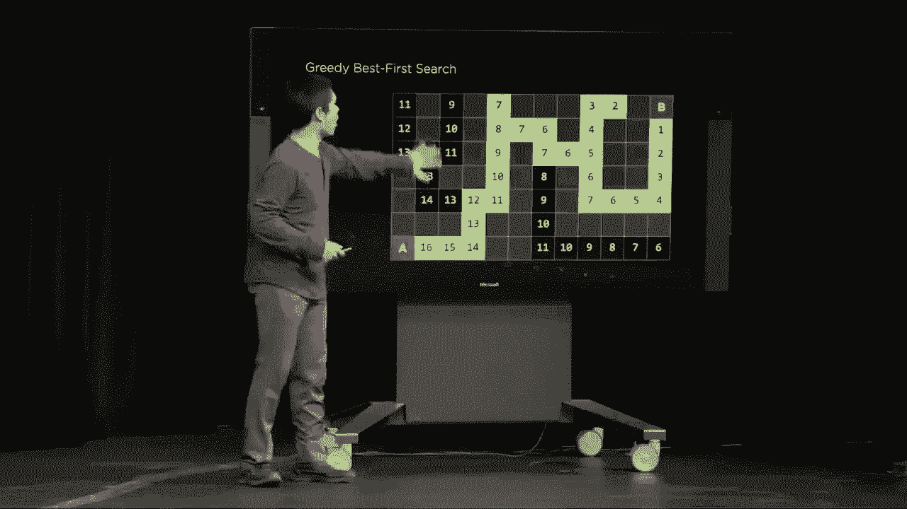

We could ignore all of these down below just by being a little bit smarter about what。Instead of just choosing randomly，we make an informed choice based on that heuristic。A pause here for any questions，then about the algorithms we've looked at so far。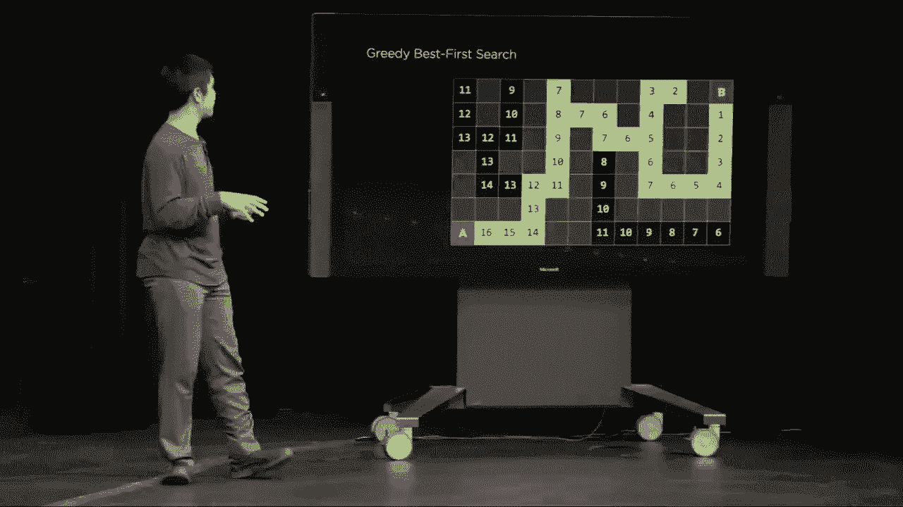

Depth first search，breath for search and now informed algorithm。Greedy best for search。Any questions about these algorithms？let's go Thio。Let's see Sophia in the like the。decision to go randomly。Is it possible to go further and see if they're short like West？

You certainly could like，maybe try and look ahead a couple of steps and look at what might be following it on。That might offer numbers that would improve upon the situation。but even this algorithm is not perfect。when you're just looking at these heuristic values and following the heuristic values of sometimes the。heuristic values will lead you in a good direction。

Like sometimes in this case that we ultimately we made a couple of wrong turns。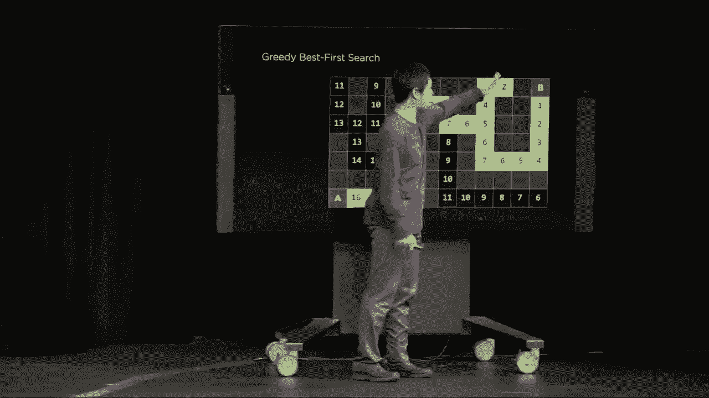

but ultimately we kind of found our way。But that's not always going to be the case。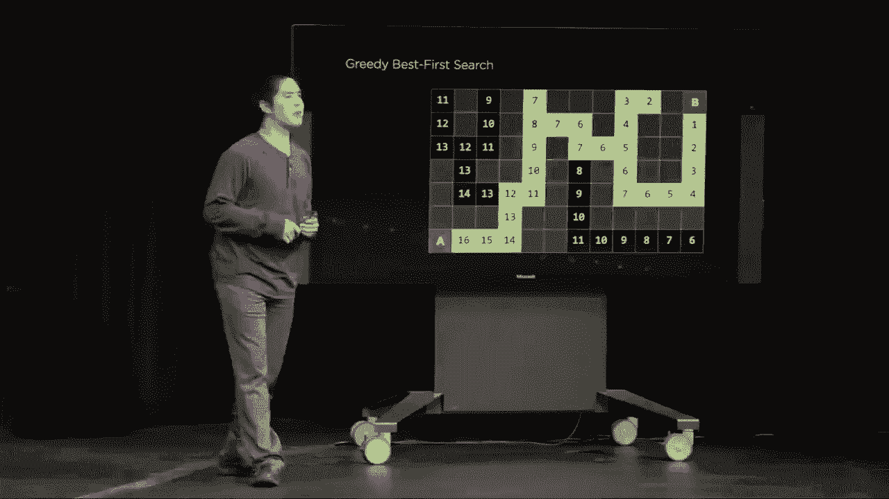

There are some cases where，because the heuristic is really just an estimate。the heuristic and sometimes be wrong。if you were to follow greedy best for search，13 12。you could decide either the 11 or the 13 and greedy Best for research would look ahead and say。This path looks pretty good，and it's none of these values or any bigger than this 12。

And so it would find this path that takes you from A to B。But even that path isn't actually the optimal path to take the optimal path to take the。shortest path between A and B and is actually this one here，which looks a little counterintuitive。and the reason we didn't catch it is because it involves。

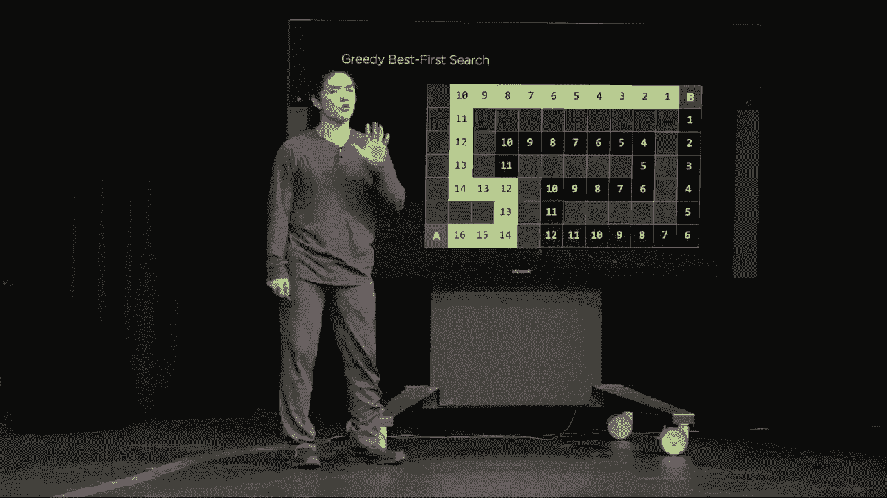

like going to the left first and then winding around。according to this heuristic。we usually don't want to be going to the left because we know that our goal point b where we're trying to get to。So even if you're looking at these heuristic values and looking ahead。this algorithm might not be perfect。And so we might try to improve upon this algorithm。

for one final search algorithm that I'll show you the most complex one that we've seen yet is an algorithm。known as a star search。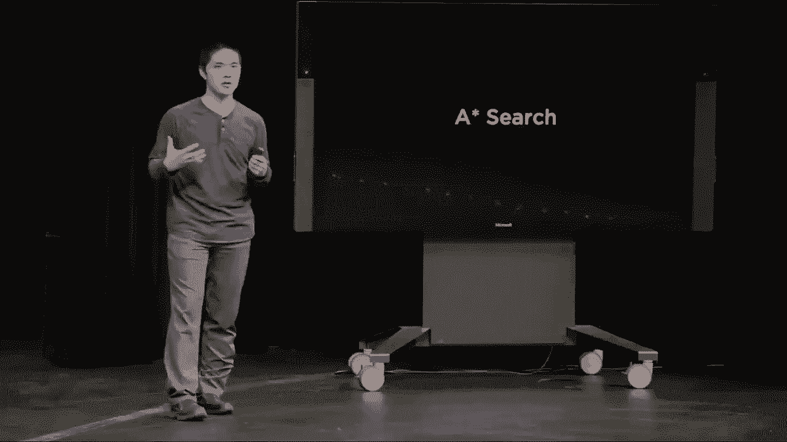

A star search tries to build upon the ideas of greedy best first search。we're going to use a heuristic to try and intelligently make choices。but we're going to try and solve the problem we just saw。which is a greedy best for search isn't always optimal when it just takes into account the。

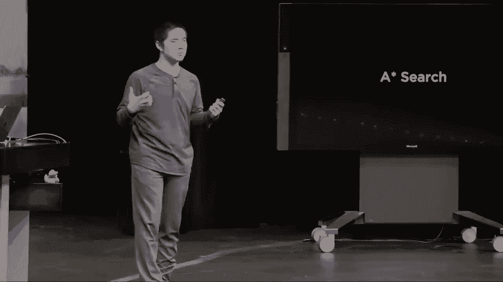

It's not always going to make the best choice because we might end up choosing a path that's。What a star search is going to try to realize is that if we've made it all the way down。here and now we're at a spot where we could be like 11 squares away from the goal。That's okay。being 13 squares away from the goal much sooner is probably better。

So we can't just take into account the heuristic value we should also take into account。How far have we gone already？If I've already traveled many squares and I find myself pretty close to the goal。I would rather have traveled fewer squares and find myself close to the goal。And so a star search is going to try to combine these two pieces of information。

combine the heuristic information that we have seen here。and also combine how Maney steps have I taken so far。Because that factors into the ultimate optimal solution to and so here's how a。star search is going to work。It's going to be the exact same ideas before just looking at the heuristic value。

But instead of Onley considering the heuristic value。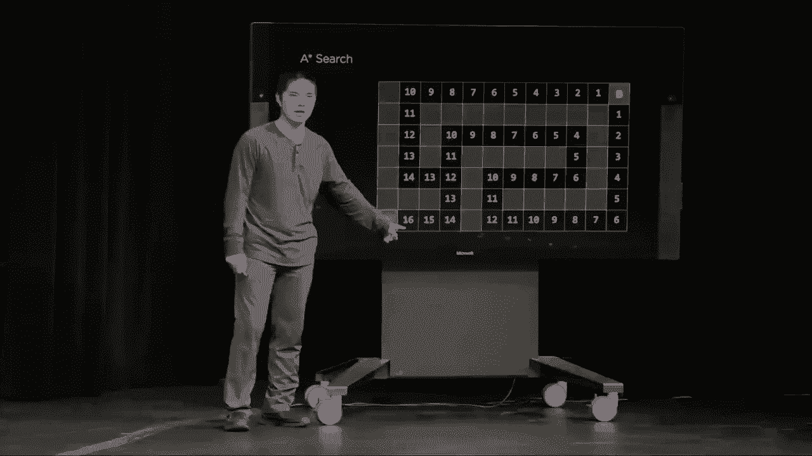

we're going to consider taking the heuristic value and adding to it how many steps we've。So we take our first step，and now we've taken one step and we're 16 squares away from the goal。for a total of 17。And then we take our second step and we're 15 squares away from the goal and we take our third。step and we're 14 squares away from the goal and we keep going until we reach a decision point。

after five squares were now 12 away from the goal and now we have a choice。We could go six squares and be 11 away from the goal or we could go six。squares and be 13 away from the goal，So we're going to make us the decision to go up。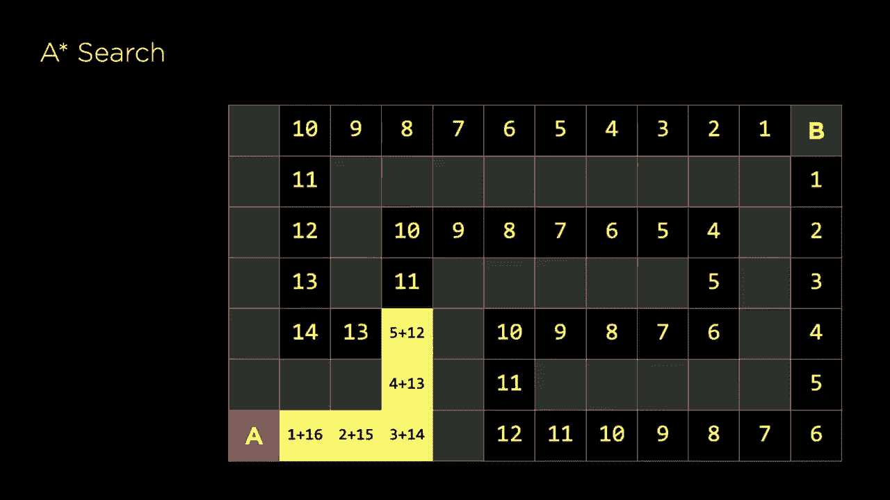

So for now it doesn't seem like we've done any better。We haven't found the optimal solution just yet。but notice what will happen eventually。If we follow this path for long enough。we'll end up at a point where we've made 14 steps and were estimated to be。five away from the goal 12345 ignoring the walls and now we have a。

We could be six squares away from the goal after having walked 15。so 15 plus six that's a total of 21 or this，option is still available to us。We could be six squares away from the start，but be 13 away from the goal six plus 13。That's a total of 19，and that 19 is a smaller number than this 21。So this 19 is ultimately ah。

a star is concerned。So by combining information about how far we've traveled and how far is left to go。we can make a more intelligent choice。Let's go ahead and try this path and a star than will ultimately be able to find its way。to get from the starting point，ultimately to the gold。And this algorithm then relies upon having a good heuristic function。

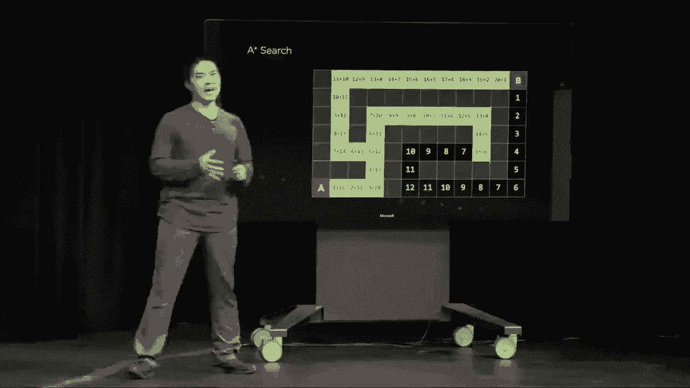

And it just so happens that you can prove that if you pick a good heuristic function。this algorithm will be optimal。It will always find the shortest path from Point A to point B。and it's not going to get stuck like greedy best research might on a path that isn't actually。And so there are many of these sorts of search algorithms that are designed to try and find intelligent。

ways to find a solution to some problem，to navigate its way through some landscape。And so I'll pause here for any questions，then about search algorithms。we've taken a look at what we call classical search。Navigating our way through a maze。are finding driving directions as well as what we might call adversarial search。

where there's an opponent and you're trying to search for the best move in a game of tic tac toe or a game of。One question from the chat。Does the assignment of these heuristic values also take a lot of time for the computer？

Or is that automatic？you want to find a heuristic that's going to be efficient to calculate。So if the time it takes to calculate the heuristic takes a long time。it could be the case that this would be even worse。you want to look for a heuristic that's going to be very quick to calculate。

And this is why sometimes when we're looking at heuristics。we're going to ignore some of the details that make this more complex。Like when we're calculating these heuristics。We're ignoring the walls because having to deal with the walls is going to make it even。It's going to make it take longer and longer amount of time to be able to figure out these values。

we can pretty quickly calculate just like X y coordinate wise how maney coordinate squares。Are we away from that destination？I've been labeling all of the squares in this grid with their heuristic value just so you can。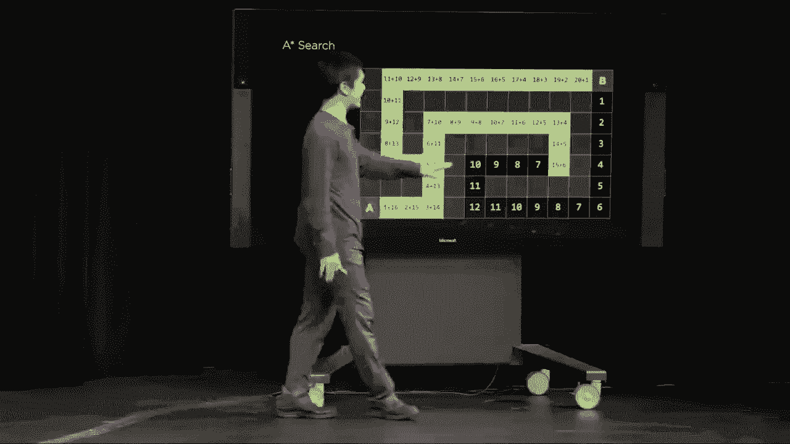

see what those heuristic values are in practice。If our search algorithm never touches a square like it never touches any of these squares。it's not going to bother computing heuristic values for them because it's not relevant to the search process。So it'll never actually calculate the heuristic values for all of these squares。which will save time to I have just shown them to you visually so that you can see all of the。

squares and what numbers would be assigned to them。I was just wondering if I mean three example that you showed its。we're using like a map to actually search through a map。So it kind of like maps directly onto the。textual search or other kinds of searches through different kinds of problems。

This could be used for a lot of different problems。Spaces for text They're usually different approaches in the world of natural language processing。But you can use these kinds of search algorithms any time you have some。which will usually call like an agent something that's making decisions that has thio make certain。

decisions at certain points。Even if those decisions aren't like geographic decisions about which way toe walk。as long as it's making some decision that moves it into，like a different position。you can often apply these types of algorithms in order to in order to solve problems。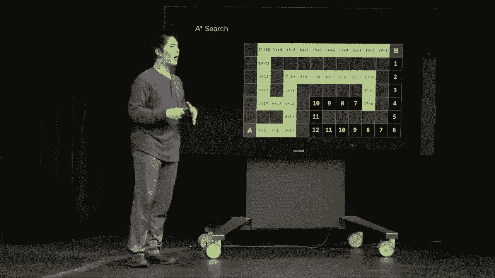

And so these algorithms，they're not just good for may solving that could be used in other domains to eso。what I want to move on to now is less about just coming up with these algorithms that let the A I figure out。exactly what to do right away。But looking at a type of artificial intelligence you've probably heard of called machine learning。and machine learning is all about trying to take our AI and trying to get it to。

learn somehow from data or learn from experience much the same way that humans might。learn that we learn from looking at our environment。We learn from our surroundings。We learn from our experiences，and we get something out of those experiences。And so one type of machine learning is known as reinforcement learning where you learn from。

positive or negative rewards you do。The computer does something well，and it gets a reward。The computer does something poorly。It gets some sort of punishment。and the computer tries to learn from that。a very simple game that we might want our computer to play。The computer is going to try to navigate its way through these tiles。

and it's going to try and get to the goal much similar to what we've seen before。But this time the computer doesn't know where the obstacles are。Let's imagine that there is some obstacles in its way，highlighted in red here。And if our computer agent this yellow dot here ever hits one of those obstacles。

the computer loses this game，but the computer doesn't know where the obstacles are。I'm showing them to you visually，but the computer has no idea。How would the computer try to solve this problem？How would you try to solve the problem？

all it can do it first is randomly make a choice。Randomly guess like let's choose to go to the right。But the computer now can learn from experience as long as it knows once it hits the obstacle。That was a bad outcome。the computer can learn。I better not do that anymore。Rather than go to the right，Let me try making another action and let's try another one。

Maybe I'll go down this time。That led to an obstacle。So the computer learns from that to it learns that was a bad thing to try。So Let's try something else。Maybe we try going up。This time that two leads to an obstacle that was no good。So maybe we'll try going to the right。Maybe we'll go to the right again。That led to another obstacle。

And so over and over。It's just making mistakes，and we let the computer make those mistakes。But every time it makes a mistake，the computer is learning something from that。It's learning what to do or what not to dio the next time it goes through the same。and so in the future it can navigate its way around，with enough trial and error。

it confined its way to the goal。And once it's found its way to the goal。it will remember that to it will know。I now know exactly what sequence of actions will take me from the starting point。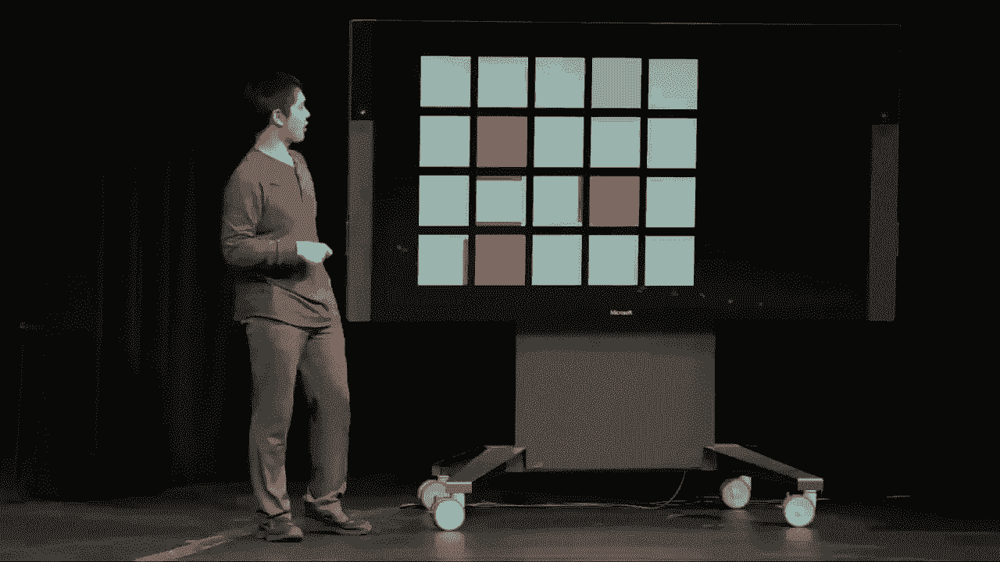

And so in the future I could just keep doing that again and again and again。so that that is an example of reinforcement learning。But even with this example here。do you see any potential problems with this approach。limitations or downsides to what we've just done here。

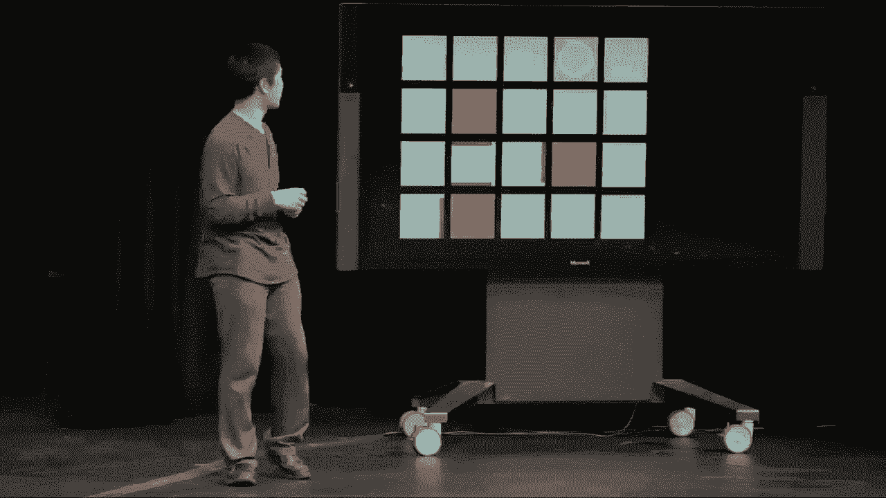

I might not be perfect。Any thought？Let's go to looks lean。or it might not be taking the most efficient path。Because it's randomly trying。Eventually it will find its way to the goal。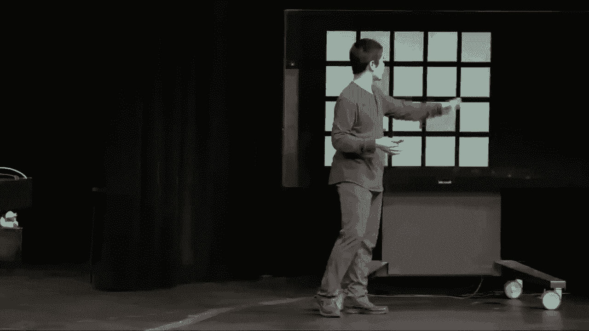

But it might not necessarily find the best path，because here there was a faster path。There was a faster way to to get to the goal。And that was to say，Once you get here。go up instead and that will lead to a more efficient path。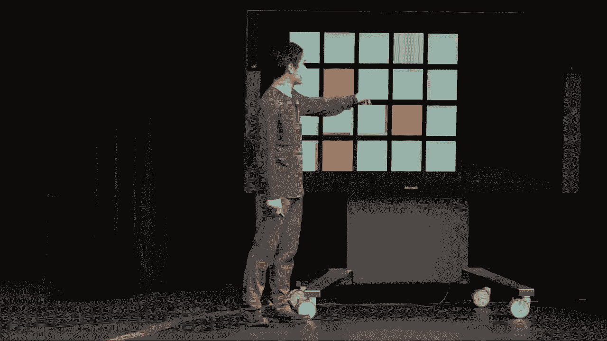

But because our AI is learning like whenever it reaches the goal。it learns to do that when it doesn't reach the goal，it learns not to do that。Our AI doesn't have that ability。Thio find that better path in the future。And so we could improve upon this。And this is what we call a trade off between exploring and exploiting in artificial。

We want our AI to do both of these things。We want a I to exploit the knowledge that already has。We wanted to use that information，but we also wanted to explore a little bit。We wanted to sometimes try some new action that it hasn't tried before because。maybe that'll be even better than the things I've already tried in the past。

Our AI and the example just now was only ever exploiting The knowledge had already has。But it was never exploring something new。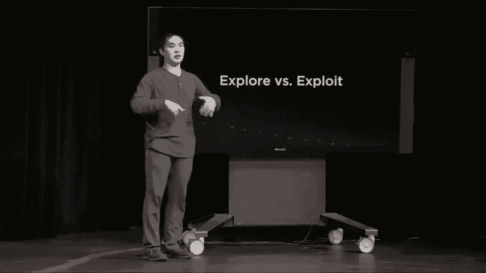

I we wanted to find some sort of nice balance between the two。We wanted to make good choices。but occasionally take a risk。see if maybe we can find a better solution。And so one strategy for doing this is known as the Epsilon greedy approached。trying to solve these problems where we assign a value epsilon。

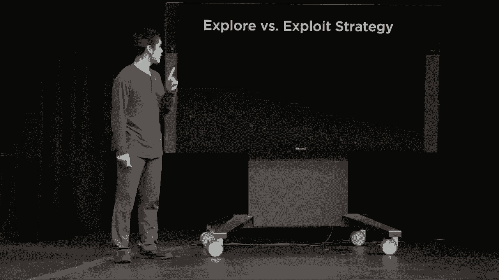

which is equal to some proportion，some probability that our computer is just going to make a random choice。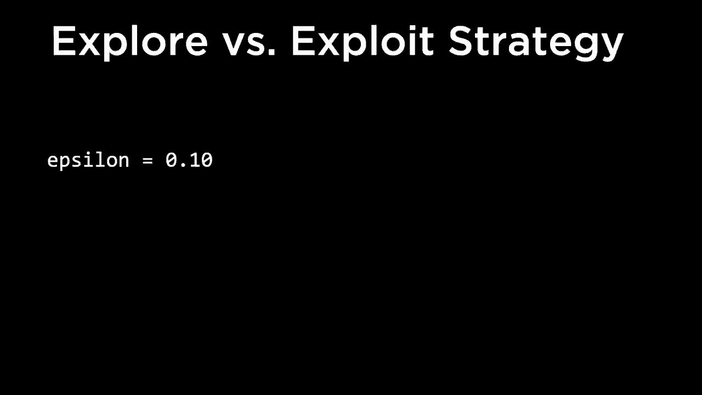

And so we might say，If we generate a random number and it's less than Epsilon。which in this case happens like 10% of the time。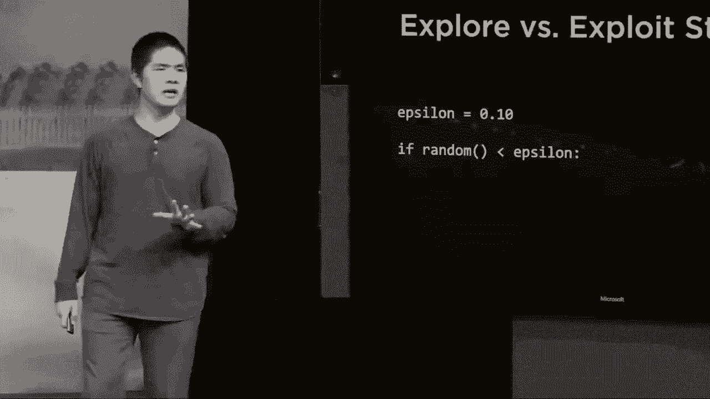

then let's go ahead and make a random move rather than make an intelligent。Just pick a move randomly and the rest of the time，90% of the time。make the move that we know to be the best，the one with the highest value we know of so far。And this will often result in a nice balance。90% of the time。

Our AI will make good choices that it knows to be good choices。But 10% of the time。And maybe it'll stumble across something bad and no tow。Avoid that in the future。But maybe it'll come across something better on No，to do that better in the future as well。And so I'll show you a realized demo of this。years back。

the Italian Institute of Technology was working through an example of trying to do something just like。But before we move on，I think there's a question from the chat Brian。Is this related to genetic algorithms？This approach genetic algorithms are another type of this type of learning。We're gonna actually gonna talk about genetic algorithms in just a moment。

so we'll get there very shortly。definitely something related。the Italian Institute of Technology a couple of years back。tried to teach a robot how to flip pancakes，something that you might have done before seeing someone else do before。But in practice，it's difficult to encode in a robot exactly how to do that。

exactly what moves to make exactly how to move its robotic muscle to be able to flip a pancake。So rather than try to program every last movement into the computer。they just let the robot learned via reinforcement，learning every time it flip the pancake incorrectly。It learned what not to do in the future，and every time it flip the pancake correctly。

it learned what to do in the future。And so I go ahead and pull up an example of this now。And so what we're going to take a look at here is a artificial pancake。and initially the human researcher shows the robot what success looks。The robot needs to know what is success and what is failure。So the human demonstrates。

Here is what it looks like to actually do the pancake flipping by demonstrating exactly what motion to。make and what it feels like to successfully flip a pancake。And then we let the robot try it all right。That was his first try not to successful。Here's after three tries。Every time it does something wrong，it learns what not to do in the future。

after 15 tries or so，I guess we'll see what happens。It takes a while to learn these kinds of techniques to learn。Here's 15 tries。after enough tries。once you do enough practice with this，here's after 50 tries。We now actually have a robot that is learning to successfully performed this task。

not because human programmers told it exactly how to do so。but because it learned from that failure and learned from experience。And once it knows how it knows exactly what to do in the future。it can continually replicate that behavior over and over again once it's trained to。

be able to perform that task。is how you might take advantage of this idea of reinforcement learning。But someone in the chat brought up another approach。This type of thing known as genetic algorithms or genetic learning。And this is where a lot of machine learning has taken inspiration from the。

how humans learn and how nature works。And because nature has managed to evolve intelligent beings。why couldn't we try to do the same thing in a computer as well？

you have generations of populations that evolved over time。where the most fit organisms survive and are able toe evolve and mutate and change。over time to become better and better at adapting to their environment。And so one strategy。One approach to trying to build intelligent machines and is。

rather than program one algorithm that is really good at performing a task。Let's just create a lot of algorithms that are really bad at performing the task。because that's much easier to dio。But we'll let them evolve。We'll let them try some task。and after they do it，they won't do very well。But we'll take the ones that did the best and replicate them and mutate them and let them try again。

and then repeat this generation after generation，eliminating all of the computer programs that don't perform well but duplicating and mutating。the ones that do the pseudo code for which might look a little something like this。We're going to start by making an initial generation of candidates randomly where each。candidate is some program designed to try and solve some task。

But rather than program it intelligently the way you've been doing all semester。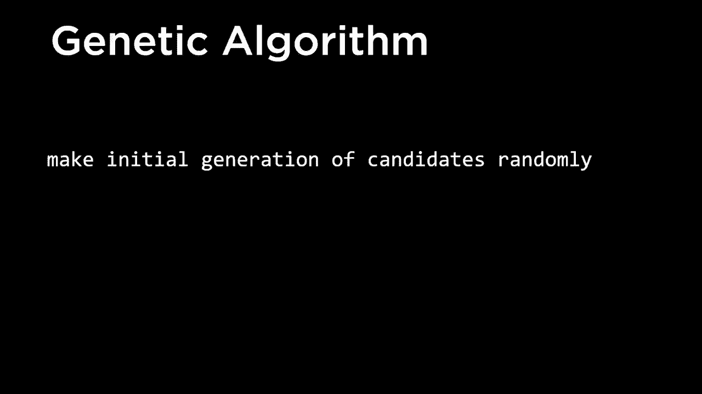

we're just going to program them randomly to just make random choices。And we're going to repeat this process until eventually they're successful。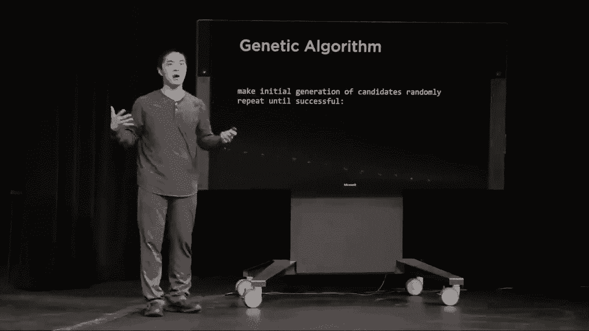

We're going to for each one of these candidates，calculate its fitness calculate。How good is it at performing the task that is designed to dio？

And then we're going to remove the least fit candidates。That didn't do very well。but take the ones that did do well and make a new generation from the remaining。candidates duplicate them，make a few mutations to them randomly just to change things up to see how things work in order to try to。create Ah，better generation and overtime is we repeat this process in much the same way that。

evolution is able to continually produce better and better organisms that are more and more fit。We can do the same thing with our algorithms to producing better and better。algorithms over time and have another demo to show you of this。Here is a simulation of some self driving cars that have。

not been programmed how to drive but are starting out driving entirely randomly。Each of these rectangles you see is one example of a virtual self driving car。Each of the little crosshairs you see，the little X is our sensors that the car has access to。So the car has access to data about how far away in any given direction，particular obstacles are。

And what these cars they're trying to learn is how to drive through some sort of。environment while not crashing into anything。And initially they didn't do very well。You noticed they were crashing almost immediately，but now we're about six generations in seven generations in They're starting to do a little bit better。They're starting to get a sense for like turning when you run into a wall。

even when they get to new environments they haven't necessarily seen before。They're starting to do a little bit better，They're still crashing quite frequently。Sometimes a generation does even worse than the generation before it。because it's not always going to be the case that when you make random mutations those mutations。

they're not necessarily going to be better。Sometimes the mutations actually end up being a little bit worse。and so they might move backwards a little bit。generation after generation。you're hopefully seeing that now 10 generations in these cars in general are doing a whole。lot better than they were before。And every generation we're taking。

whichever cars made it the furthest duplicating those eliminating the rest，and moving forward。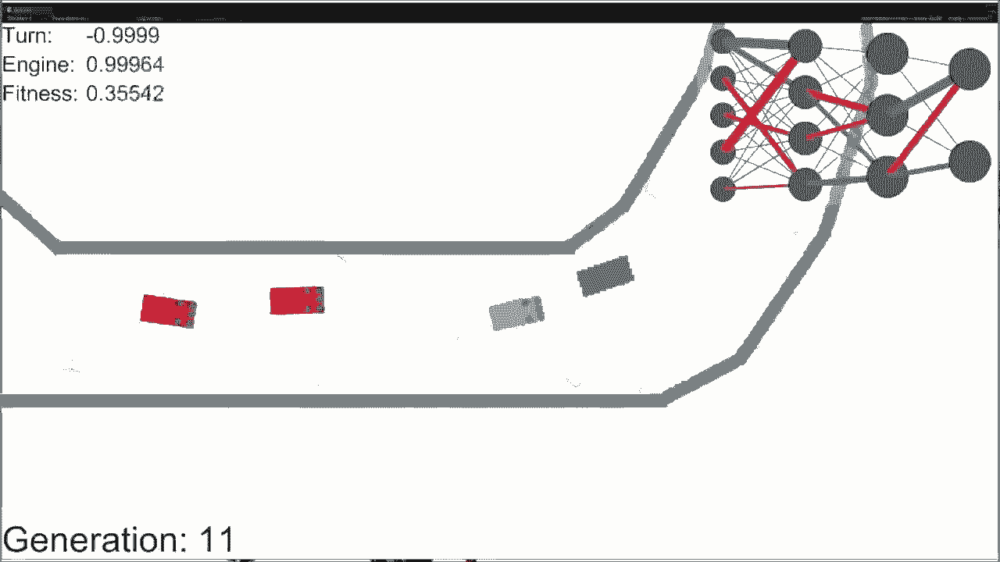

Is there a question in the chat？with regard to the pancakes。how did the robot know what was wrong with the previous pancake flips？In the case of the cars。how does the car know that it aired？So whenever you're doing anything with reinforcement。learning whether it's the pancakes or these robots here，the program are still needs to tell the AI。

What does success look like？And what does failure look like？

the pancake example we trained the pancake flipper to be able to know。that when you're flipping this pancake？when it's first taught。what does it look like when it's successful？So it gets a feel for that？

And it was probably also told that if the pancake falls。and that's not something that the A I should try to dio。I assume these cars have been programmed to be told that if you crash into something that that is not。that the car presumably can detect after its crashed into something。

And so it probably also had some sense of like how far it was able to drive him such that we could。duplicate the ones that did drive the furthest and not the ones that didn't。And let's see how this card does。It was so close to the end。Maybe give it one more generation and we'll see how this generation does。

so it's navigating these turns。Looks like a whole bunch didn't make it。But as long as we get one successful one，we can learn from that successful one in the future。Here's the ending。but and all right，it looks like one car was finally able to make it to the end。It was able to successfully learn that task。I've had to navigate through this environment of mazes。

So I'll pause here for questions，then about reinforcement learning on how these ideas might have worked。Yes，s o with the genetic algorithm，the car one specifically。So all the car。the cars are learning from each other as each one crashes。It's not so much that the car's air learning from each other that then that we're generating new cars。

based on the cars that were previously successful The idea being that if we run。10 cars and see how far they go，we take the five that went the furthest we eliminate the other five。That didn't make it very far。But then we duplicate and repeat the ones that did do well such that in the future。Hopefully this new generation of cars will make it ah。

little bit further and generation after generation。the hope is that we're able to make it a little further along the road until eventually as you saw。15 generations in，we were able to get some cars that could perform the task successfully。Let's go now to Josiah。Is the cars specifically，learning just from the track？

when you change the track，do we need another？do we need to start from zero again or Yeah。So if there was a track were different，Hopefully not。Hopefully what the cars were learning was in this case。was learning based on sensor data like how far away a wall is in any direction，which way to turn。

And the goal is for this type of approach to generalize。hopefully actual self driving cars in the real world are not trained this way。But you would hope that as they're trained on sample environments that when you put them in a different。they would be able to generalize their knowledge to be able to apply similar techniques that if in a real world。

you take a car and put it on a road that it's never seen before。Hopefully it's seen enough examples of things that are like it sensor data that it recognizes。that it's able to make on intelligent decision based on that。the hope is And the goal。is to be able to generalize this knowledge beyond just ah，Any other questions？

Let's go to Yagan Church。So can these algorithms ever reached like a bottle neck？Just like in。riel life evolution。There are branches and some branches just reach a bottleneck。So is that possible here as well？it's definitely possible that there might be that。The algorithms might end up converging to something that seems pretty good。

and it doesn't seem like any mutations are doing any better。but it turns out a totally different algorithm might actually do better than that。That's what we will often call a local maximum。In the context of artificial intelligence。where there is some better approach，there is some better algorithm，but we can't necessarily find it。

There are other strategies for trying to deal with that problem。but it is definitely ah challenge we're thinking about on one more question。The question about how the fitness is calculated，like in both of these cases。Is it like the certain motors that are running or here，like the distance？In the case of the pancake。

it was probably like a binary of just like did the pancake end up landing in the pan or not。was our way of calculating the fitness of that particular example。In the case of the cars。we would probably calculate fitness based on distance traveled。Whichever cars ended up traveling the furthest。That would be our definition of fitness。

And that's really the part the programmer needs to be involved in。The programmer needs to decide。What does it mean to be most fit？What does a bad example look like？

And using that once the computer knows what success looks like and what failure looks like。then it's able to learn from that to be able to do better in the future。so that was genetic algorithms，which is one example of computers that are able thio learn from。the way that humans learn learning from the way that nature works。

But computer scientists didn't really stop there。There are other examples that we could do to add to this is well on DSO。One other example of using this idea of reinforcement learning and using genetic algorithms。might be in video recommendations，where you could have some watch history and the way that an algorithm like Youtuber。Netflix might suggest videos for you to watch is via this reinforcement process that。

it will just try suggesting videos to you and learn from experience。If it suggests a video to you that you like that，you watch all the way through。then the algorithm learns in the future，let's recommend mawr of those sorts of things that's like the car traveling very far。So we learned to do more of that in the future。If they recommend a video to you and you don't click on it。

you don't ever watch it。then it's probably not going to recommend that to you in the future。and it's probably going to learn from that experience as well。And so this is one example of computer science learning from nature。learning from the way that humans are。Another place that's happened to is by looking at the human brain that the human brain consists of。

and those neurons are connected to one another，and they pass information from one to another。Electrical signals flow through one neuron to another neuron。and that's how brains were able to make these very sophisticated kinds of computations。This is what we might call the neural network，a collection of these neurons。

And one place that I've been looking into，especially recently gaining in popularity。has been trying to develop artificial neural networks instead of using ah biological。we just use what we might call an artificial neuron or a unit。And you can think of this unit as just storing some value like some electrical signal。

like you might find in the human brain。just in a digital format。And these artificial neurons。thes units can be connected to each other in sort of an input。That translates into an output sort of format where this arrow represents some sort。some calculation that is taking this value on the left and transforming it into。

that value on the right and neural networks。They're usually not just one input unit and one output unit。but they could be more complex。You might have a neural network with two different inputs。each of which connects to an output or even more sophisticated neural networks like this one。where you have multiple layers of these units that are all connected to each other。

each of these arrows performing some sort of calculation。And if you've ever heard the term deep learning，this is often what that's referring to。This idea of deep neural networks with many layers。each of which is performing calculations and ultimately using some linear algebra。

they're able to figure out exactly how to to in these calculations to translate。input into some output。If you give a neural network enough data，it can learn from that data。It can learn exactly how to set these various different arrows to be able to calculate some。task to be able to translate some input into some output。

that might take the form of handwriting recognition。How exactly do we train computers to be able to learn how to recognize handwriting。given all the different types of handwriting？one way to try to do that is by using a neural network setting up a network of all of these neurons and all。of these connections。And then you give to that neural network。

whole bunch of data I give to the neural network a whole bunch of already existing handwritten。each of which is labeled。So the computer knows which image corresponds to which digit this data set you're looking at here is a very。famous data set of handwritten digits called the M NIST data set。And given all of this data。the computer can start to train the neural network and start to figure out exactly what calculations。

to run at each layer of the neural network to be able to translate the input into the。To be able to translate like a screenshot of what looks like a hand written number。eight that we all could tell us the number eight but might be difficult for us to describe exactly how a。computer could figure that out。But via the neural network。

By training the neural network on all of the sample data。it's ableto learn some sort of function that can translate this input This。handwritten digit into the output what the actual digit happens to be。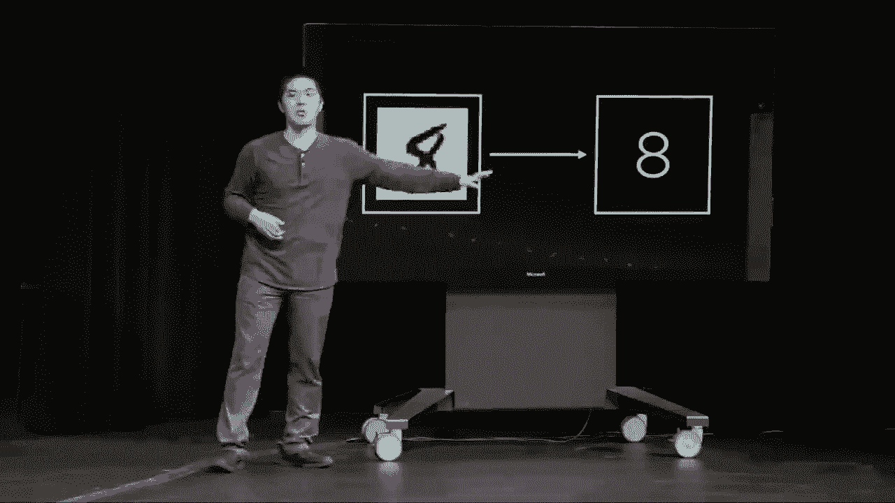

and these neural networks have proved to be incredibly versatile。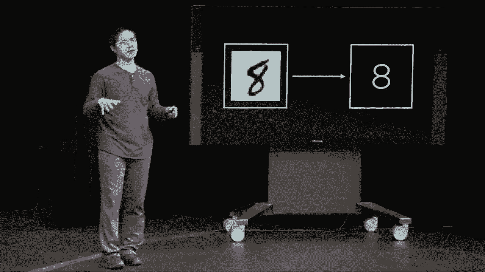

and we won't get into all the math here because it does get a little bit more complex。but it's used all over the place。It could be used for email spam detection。where if you give the computer a whole bunch of data a whole bunch of emails。some of which are labeled spam and some of which are not it can learn a function。

You can learn exactly how to tune that neural network to be able to predict for any given email。whether it's spam or not。the key factor here to making these networks work is having access to large amounts of data。And this is why，lot of companies now we're doing a lot of work and trying to get a lot of data and use that data in training their machine。It's because the mawr data that you have，the better you can make these algorithms because the better you can tune them to all the different types。

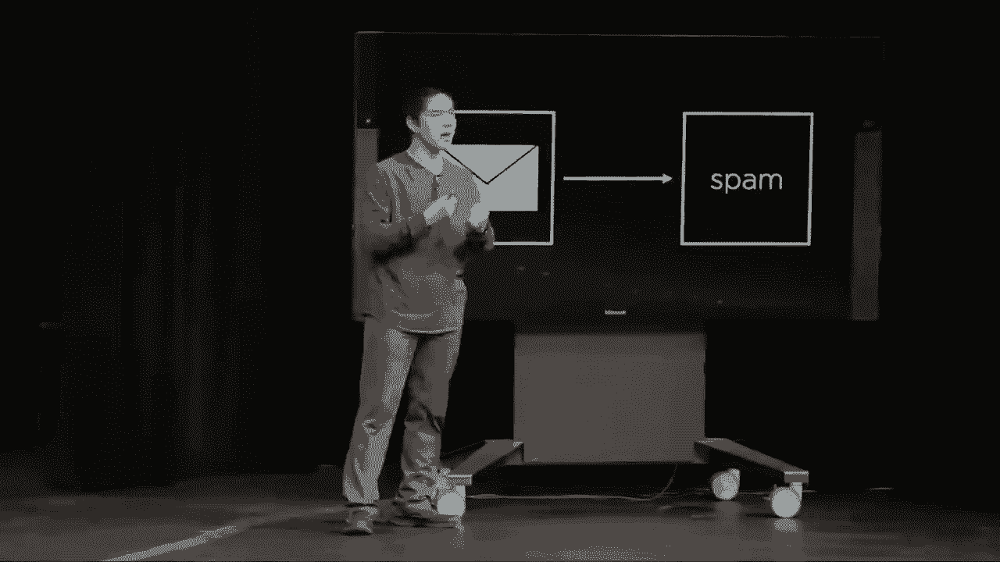

There might be help to make them even more accurate in the future to be able to test these networks to。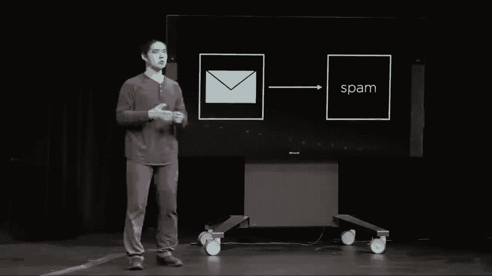

see how well they work。And every time you're interacting with websites online。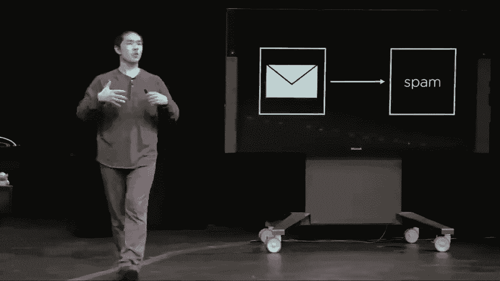

you're often helping to provide some of that data every time you go to your email app。and you mark an email is spam that email app might be learning from that learning？

this type of email that's an example of a spam email。And so it learns in the future to do a better job of trying to do that classification。every time an email is marked as spam and you have to tell the computer。The computer is learning from that，It's more data that the computer can use them to help to inform its algorithm in the。

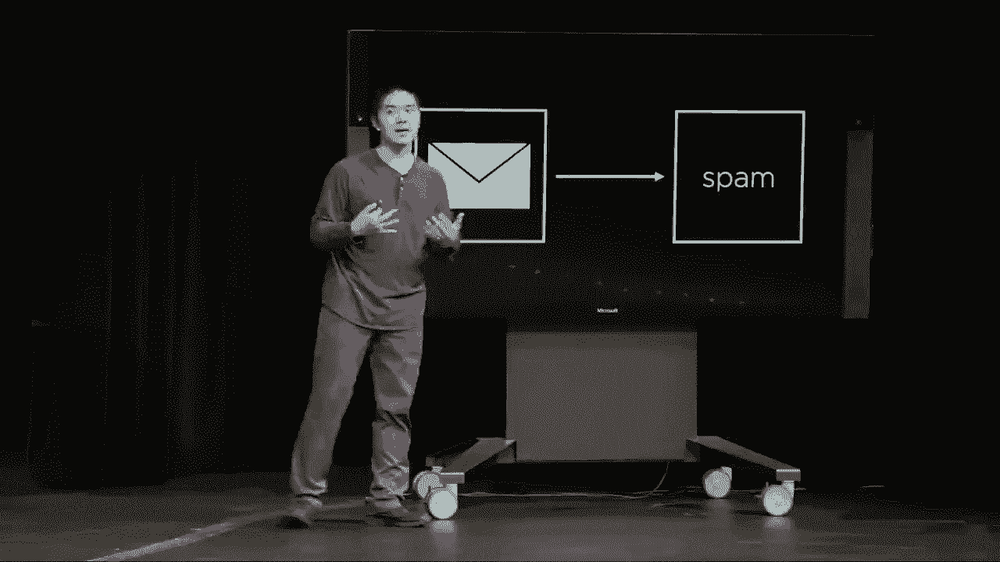

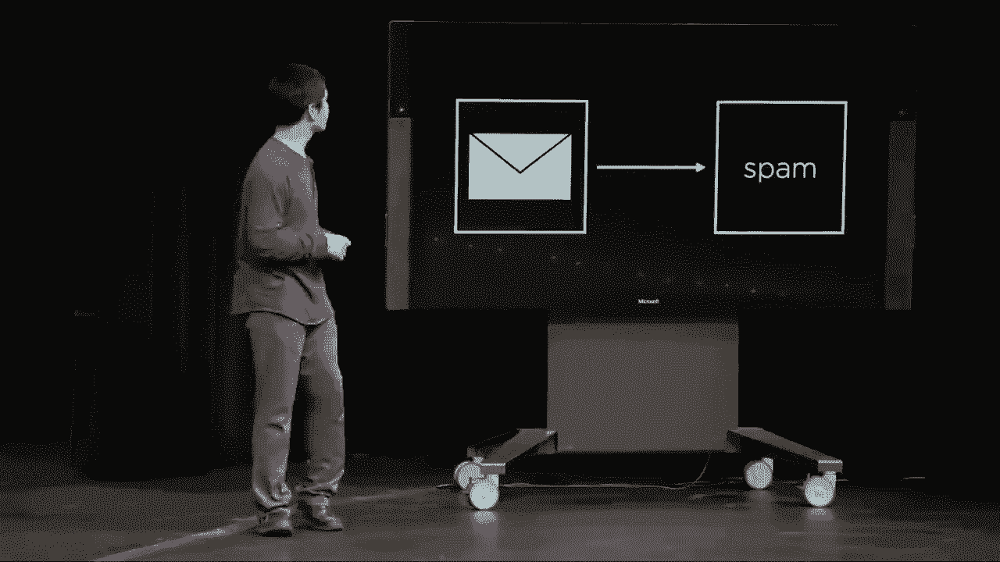

for one final example，we can take a look at how images like this were actually generated。How could a computer possibly get an image like this and generate it on？

Make something that looks very much like a real person，even though it's not actually a real person？

it's done using the exact same technique using a neural network that learns how to translate。inputs into outputs but having access to a large amount of data in this case having access to。many photos of real people。So the computer can start to get a sense for what a real person looks like。It could start to train the network in that way，rather than build the entire person all at once。

build it up step by step。computer generating a photo like this，this is a pretty complicated task。It's pretty difficult to do。But you know what's easier is generating that that is 16 pixels。It doesn't look like a person at all，but this a computer could do pretty readily just generate what seems to be a whole bunch of kind of random。But then you would train the computer to add a little bit of detail to this image，to be ableto learn。

If this were a real image，how would add a little more detail to it to make it look a little bit mawr like what a person would look。And it does so again by having access to large amounts of data。many photos of people so they can begin to learn from that experience。So the computer learns and how to take this image and turn it into this。

still doesn't really look like a person，but it looks a little more like a person。It's got a higher resolution。You can maybe make out that there's some hair here in a face here。and then the algorithm learns。How do you take an image like this？

An eight by eight grid and turn it into a 16 by 16 grid。it still doesn't look like a person。but it looks a little more accurate。And over time we can follow these steps one after another。adding more and more detail until eventually。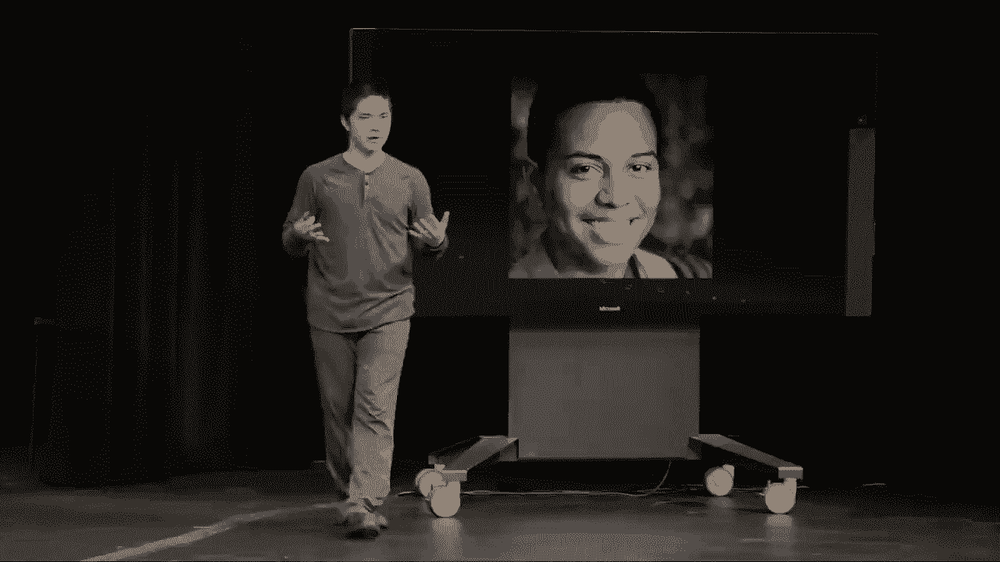

the computer is able to generate an entire image that really looks like a person。That's very hard to distinguish just by this input to output process。learning some mapping from inputs。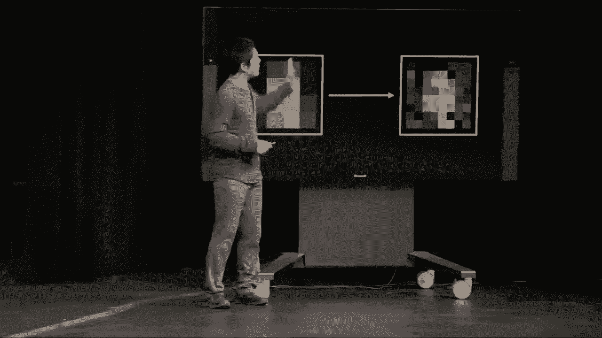

outputs by having access to a whole lot of data。So before we wrap up here。a pause for any final questions about artificial intelligence。any of the algorithms we looked at for searching for learning or anything like that。I had a question about，like with the fitness。How is all the guest like data you mentioned？

They get regenerated like the successful ones。how is that all that data？

Sort of like what the success was exactly，because the fitness is just like a score。like exactly what decisions it made such，that it was successful。and that's actually one of the trickier things about machine learning that we can train these machine learning。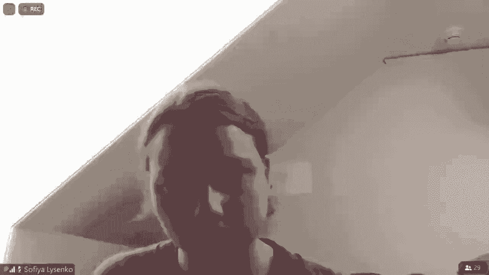

But it's not always immediately apparent to us like what it was doing in order to be successful。And this is an active area of research within machine learning，including some faculty at Harvard。which is the interpret ability of machine learning。Results like the algorithm becomes very。very good at recommending a video to you or generating an image of a person。

But it's hard for a person to look at that machine learning model and understand how it arrived。people just throw their hands up and say，we don't really care how the algorithms doing it as long as the algorithms doing it successfully and eventually。produces good results。we'll just take the ones that are doing the best and use those。even if we don't necessarily understand exactly how those algorithms air working。

And that's definitely an area of concern for some people in an area of research for others that are looking。into these types of tools and technologies。maybe final question from the chat Brian。Every time I choose the parts of a picture that contained traffic lights or crosswalks to prove I am。not a robot robot and my training Google's driverless car，maybe not Google's necessarily。

But certainly a lot of times when you're doing that type of thing，it's to verify that you are。That is one of the purposes of those things，to make sure that robots are signing up for websites。But certainly it could be just giving more examples of labeled data that oftentimes what machine。learning models rely on is labeled data where you have like a a digit handwritten digit。

and you have a label of this is the number two or this is the number eight。And so the computer can then use those digits along with those numbers in order to figure out。how to learn how to take handwritten digits and convert it to individual。And so having access to that kind of label data ultimately ends up being really。

so that's it for artificial intelligence for today。Thank you all so much。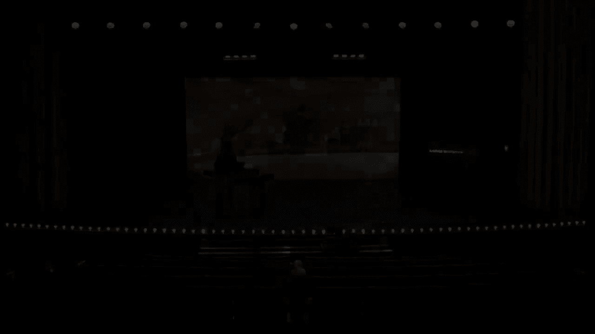

