# 【双语字幕+资料下载】哈佛CS50-CS ｜ 计算机科学导论(2020·完整版) - P2：L1- C语言（语法与格式）1 - ShowMeAI - BV1Hh411W7Up

brian you can open the second room too。

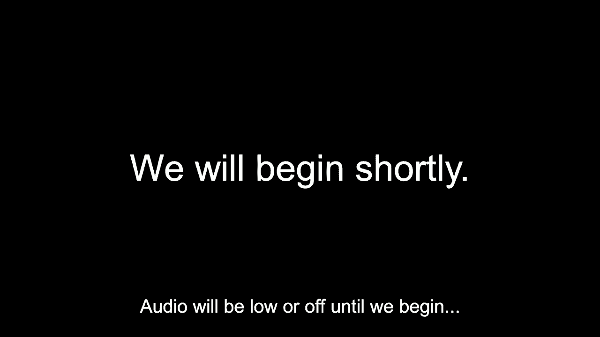

all right this is cs50 and this is。

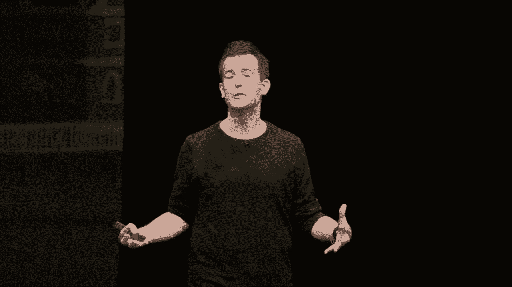

week one our second week and today，recall that we'll we'll focus on。

this other programming language called c，last time，where and i propose that this code here。

on the screen is something that you，will soon know how to program if not。

already but suffice it to say it looks，quite a bit dissimilar。

to what we looked at last week which of，course was scratch which was much more。

playful much more graphical，and so allow me to disclaim right from，the get-go today that。

uh for most of us today will feel like a，bit of a fire hose in fact pictured here。

is an old hack from mit，wherein some industrious seniors hooked，fountain。

uh the saying being that getting an，a a，fire hydrant today will feel a little。

bit like that because this is sort of a，special occasion，that you don't really have occasion to。

describe very often but it's one in，which we're all going to learn。

a new language and indeed that's not，something we do every day and so at the。

first glance it's going to look like a，yet，allow me to reassure that what will soon，look like this。

this c code here is fundamentally the，same thing that you've。

seen and now experimented with last week，by way of scratch，that is to say within this other。

programming language c which is more，traditional which is more text based，more keyboard based。

we're still going to see functions，conditions boolean expressions loops。

and so on they're going to all look a，little different but，the ideas are the same and so much like。

when uh walking into someone's home for，the very first time and getting the lay。

of the land and seeing a lot of things，that you haven't seen before。

you typically don't care about all of，simply，walk forward and sit down or perhaps uh。

uh and begin your conversation similarly，today we're about to see a whole lot of，language。

necessarily，understand and latch on to those ideas，that are familiar，actually。

writing computer programs how do we go，about uh writing them well。

and so allow me to propose that there's，a few guy a few，guiding lights that should guide writing。

of code one of course is correctness and，we explored this last week whereby the。

correctness of your code just speaks to，does it work as intended when you，command。

does the program that you or someone，else wrote behave correctly does it do，what it says。

but there's other aspects to writing，good software，and writing good programs and that has。

to do with design and we alluded a，little bit to this last week but with。

design it's more of a qualitative a more，subjective measure，just how well written your code is so。

where you have to write，essays you could certainly make very，correct arguments。

but you could make very correct，arguments by writing very long，rambling sentences repeating yourself。

and generally not，it might be correct，there's nothing in that paper for your，it may be。

that you said that was incorrect but you，might not get very good marks on it。

because it's just not very well，designed and so similarly in the。

programming world is there this notion，code，but well-designed code wherein you don't，repeat yourself。

you write code that's fairly efficient，it doesn't do more，uh more work than it actually needs to。

and then lastly let me propose for today，onward in this class，that there's a third access you should。

keep in mind when it comes to writing，good code and that has to do with style。

this is much more of an aesthetic，so this in the analogous world of，writing an essay would be。

are you using good punctuation，capitalization，are you indenting new paragraphs and。

those kinds of aesthetics，that fundamentally don't change the，correctness of what you're saying。

don't change necessarily the quality of，the arguments that you're making。

but the style of your essay much like，the style of your code，makes your code much much more readable。

so when it comes to，writing good code you want it first and，designed。

and also well styled much like again you，would when writing an essay that you。

would hope would reflect well，on your capabilities as well，so when it comes to writing code like。

this for instance this first c program，simply，prints out on the screen hello world。

well how do we go about writing this，code last week we wrote code，dragging and dropping。

puzzle pieces today is going to be a，little different we're going to use a，different tool here on。

out and we're going to use our keyboard，program，but to do so we're going to go ah**d and。

this semester，this one known as cs50 ide ide，is an acronym a term of art in。

programming that stands for integrated，development environment which is just a。

fancy way of saying in this context that，cs50 ide，is cs50's own web-based programming。

environment and it's not，specific to cs50 per se we've simply，features。

on top of a third-party cloud tool，that anyone on the internet can use and。

our own version thereof lives at this，url ide。cs50。io so you're welcome to，need not。

during lecture itself but on this coming，actually use，and get more familiar with this tool。

hands-on so let me go ah**d and open up，in advance，and what you see here is the basic user。

interface that's available to you，and fortunately there's only a couple of，right now。

so at the top of the screen here is just，a big black rectangle that in a moment。

is going to be filled with code much，like using google documents or something。

like that where you can create new tabs，and create new files，this is where i'm going to do my。

programming along the top of the screen，moment going to start。

calling our terminal window it's in this，terminal window，that i can actually run commands and。

ultimately run，my actual code but let's go ah**d and，environment。

and realize that this tool indeed is not，representative，of a very common popular programming。

text editor，or tabbed windows where you can write，code and a terminal window where you can。

actually run commands ours happens to，alternatively，program certainly on your own mac or pc。

or any other device these days，but frankly it tends to involve just a。

non-trivial number of technical，difficulties early on especially when we。

all have different versions of mac os，and windows and the like，so this cloud-based environment just。

ensures that on day zero，we can all have the same exact，programming experience。

so i'm gonna go ah**d and do this i'm，file。

and this is gonna create a new tab by，default called untitled。

not very interesting so i'm going to now。

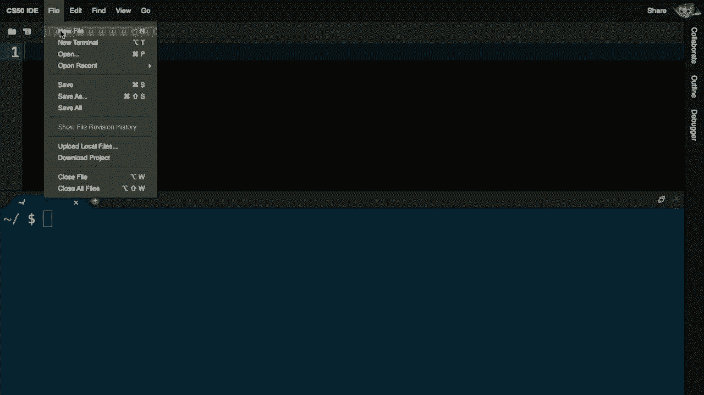

go up to file and save，and by default i'm going to save this，file as for instance the name，program。

in this language called c i'm going to，call my file hello but i'm going to end。

it in a file extension，called dot c and that's indeed the，convention when writing。

c programs they should end with dot c，just like scratch programs as you may，recall end in dot。

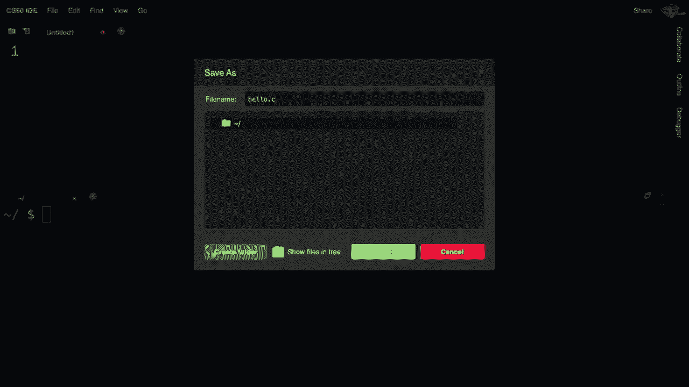

click the green button，here that's called save nothing is，really going to change except for the。

name and the tab there，now i see a top left that this tab is，called hello。c。

and now i can start typing anything i，from memory，the very first program we saw last week。

and just a moment ago，i'm going to do include standard io dot，h whatever that is for now。

i'm going to going to do int main void，whatever that is for now。

i'm going to use a curly brace and then，close that curly brace so to speak。

thereafter and in here i'm going to go，ahead and do printf，quote unquote hello world followed by。

a semicolon now that was a whole lot of。

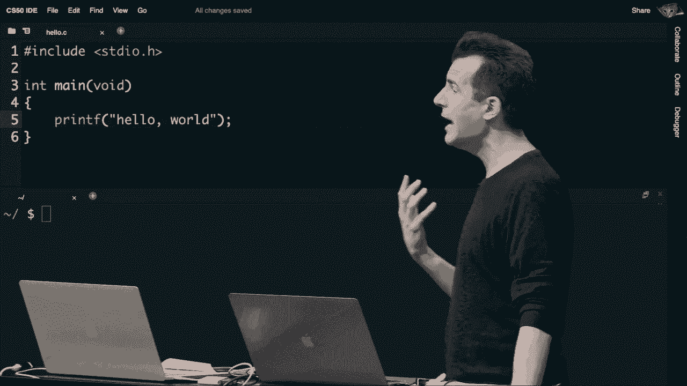

text right off the top of my head，this is the kind of muscle memory that。

you'll soon develop when writing a，program i've of course done this。

many times before so i was able to just，moment，we'll tease apart what all of the，typed。

actually do but what i'd now like to do，week，that this is just going to print hello，world but how。

well in the world of our macs and pcs，and phones we would all just tap an icon。

if we want to actually run a program，that's not going to be the case today。

because now we're in more of a，traditional programming environment，the environment that we're now in。

requires that i use my keyboard，a little bit more or what's known as a，command line interface or cli。

this is in contrast with a graphical，user interface or，gui or gui which is what describes mac。

os windows ios and，android but in a command line interface，i have to do everything。

at a so-called command line and by that，i'm referring to this blinking prompt，along the bottom。

reported along the bottom of my screen，window，where i'm going to type commands and。

this is my command line interface，anything i type here is going to get，sent to this computer。

and hopefully execute uh on its own，hardware so，how do i do this and what do i do well。

the catch of course。

is that when writing code in c or python，or java or bunches of other languages，that happen to exist。

that's really meant to be written and，understood by me and you the humans。

but per last week what is the only，language in a sense that computers，understand brian could we。

call on someone for this what language，do computers，only speak，because i think there's a disconnect。

between where we left off last week and，where we're currently at。

this cindy，what language do computers speak would，you say，um binary binary and just elaborate a。

little bit what do you mean by binary to，recap，yeah so they use ones and zeros to。

represent everything，exactly they use ones and zeros to，represent everything and last week we。

focused on only things like numbers and，letters then colors and。

images and videos and sound and so forth，but we didn't all，actually speak to built-in functionality。

which computers also use zeros and ones，to represent that is to say computers of。

course have the ability these days，to print something on the screen and，that notion of printing that。

represented，underneath the hood of a computer so to，speak by some pattern of zeros and ones。

which is to say that everything i just，typed even though it kinda sorta looks。

like english and kinda sort of，computer，have just typed，in order for to understand what i've。

just typed i need to actually convert it，to zeros and ones and so indeed the next。

step in this process is to take what，i'll describe as my source code。

written here in c and last week too we，saw source code it was just graphical it。

was those puzzle pieces in scratch，this is my source code that even though。

cryptic is something i at least the，human eventually can read and write。

but i need to literally convert it to，patterns of zeros and ones that the，computer can understand。

now how do i get to this point well，last week，that involves problem solving and here's。

a problem how do i take source code，called c，and convert it to zeros and ones that。

the computer understands，well my input i dare say is going to be，my source code，what we'll call。

machine code machine code is just a term，of art describing the zeros and ones。

that computers understand，we didn't use that expression last week，on the right。

and c code on the left so that invites，source code，and machine code if i take my source，black box。

how do i get out of this black box the，understands，well i need a special program that we're。

going to start calling a compiler，a compiler is a program that you can，download for free。

or pay for back in the day that is a，program design，to convert source code to machine code。

so all i need do，if i want to actually solve the problem，as stated earlier whereby。

i have written this code in c and i now，need to convert it to zeros and ones i。

just need to give myself access to，a compiler and it turns out one of those，exists within cs50 ide。

and this is a tool you could download on，your own mac or pc or the like。

and for now we're going to describe that。

tool as being quite simply called，program，i'm going to go ah**d and type make。

hello and then i'm going to run it with，a little bit of a cryptic syntax。

dot slash hello but let's see that in，action to tie this all together，terminal window。

or my command line interface and i'm，going to literally type hello。

notice i am not typing make hello dot c，i'm typing the name of the program i。

actually want to make and i just want to，call this program，from this command。

that i actually intend to compile a file，called hello。c，i'm going to go ah**d and hit enter。

there's some crazy cryptic output more，on that another day，but the fact that i don't see any big。

scary red error messages is a good thing，this means that my program compiled，successfully why。

there's just no yellow or red messages，to say otherwise，but now if i want to actually run this。

program i need to type a different，command that's the analog of double，phone。

i'm going to type literally dot slash，dot slash hello essentially is like。

saying go into the current folder，on the computer i'm using and look for a，program called hello。

i'm going to go ah**d and hit enter and。

voila hello world，now i see again a dollar sign and some，other text on the screen and we'll tease。

apart in just a bit what this means，but notice this dollar sign is just a，constant visual reminder。

more commands，and the computer has done literally what，i asked it printed out hello world and。

now it's waiting for my second command，so that was the analog of just printing，hello world out of。

can do，more than this but let's tie it back to，what we did last week as well。

so that not everything here is all that，dissimilar，so recall that last week we had。

arguments even though we didn't，function，is like a mini program it's an action or。

a verb that you can use when writing，your own program，that does something we saw the say block。

week those were，verbs or actions or more generally known，as functions but functions can also take。

inputs recall and we did see that last，calling，inputs to functions arguments so to。

speak another term for them is，parameters but for all intents and，purposes those are。

synonyms for our purposes arguments are，the inputs to functions。

so let's consider then from last week，this say block that we saw last。

time which simply is trying to say out，of the cat's mouth hello world。

well let me go ah**d and convert this if，you will to corresponding c code。

just to emphasize how similar，fundamentally，these two languages are even though。

syntactically c absolutely looks，uh visually different it turns out that。

if you want to say something，i just did，you're not going to write se you're。

instead going to write print that's，actually a bit of a white lie you're not，to say。

print f for reasons we'll eventually see，it means print a formatted，analog in c。

of say in scratch now notice in c i've，got this open parenthesis and closed。

parenthesis that nicely enough are kind，of ovular in shape and notice that they。

kind of mimic the white oval，into which we provided input last week，so in between those parentheses。

are going to be my inputs to this，function printf otherwise known as。

arguments but they're going to be a，little different this week i yes i'm，going to say hello world。

with a comma in between grammatically，c，i have to be a little more particular i。

also have to add double quotes，on the left and the right and somewhat，annoyingly i also have to add。

a semicolon at the end of this line of，code so just like in english or in a lot。

of human languages you end a sentence，for instance with a period，see。

you've also got to finish your thought，in this case with a，semicolon so this then on the right is。

the closest way of translating，this thing on the left from scratch to c，respectively。

so the ideas are still the same but the，syntax looks a little different and we，ultimately。

what these patterns are and what these，human conventions are but notice that，paradigm。

as last week but let's add a little more，terminology this week。

last week we described the black box as，potentially being algorithms。

initially and then we started calling，them functions functions are just a。

programmed version of an algorithm the，implementation of an algorithm in code。

in software so a function might be，otherwise，known now as arguments but it turns out。

that functions can do at least two，different types of things，in the world of programming and we've。

seen these things already but we didn't，describe them quite as particularly as，we will today。

when a function takes inputs that is to，say arguments just like。

hello world is an input to the say block，in scratch or the hell，or the printf function in c。

functions can have what are called side，time，when we used the say block it did output。

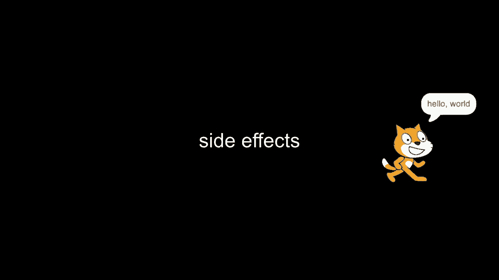

something but more technically it had a，side effect a visual side effect when i。

used the say block last week，and the printf function this week you，see something on the screen。

and that is yes some form of output but，form，of output that we saw last time so a。

side effect of a function，on the screen，like text or audio in that case but。

there's this other feature of functions，that we're going to see and leverage，function can。

really just hand you back a value it's，not going to，vocalize it audibly it's going to just。

pass it back to you in a way that you，the programmer can reuse。

whatever the output of that function was，ideally storing it even in a variable。

so for instance recall last week that we，asked the human their name，to the ask block。

in this white oval was what's your name，and then recall that this ask block was。

a little special last week，because it gave us access to whatever，the human ultimately typed in。

and that is to say that the ask block，last week，essentially returned a value it didn't，just blindly。

display whatever word the human typed in，on the screen no，it instead returned it in some sense。

metaphorically，and stored it in a special variable，called answer。

and so again that's the difference the，say block literally says something on。

the screen and there's an immediate，visual effect，with the ask block after you type in。

your name you don't，see your name printed or displayed again，on the screen instead your name is sort。

of tucked away in a variable just like a，mathematician would store a number。

in a variable like x or y or z the onus，to eventually，do something with the value my name。

that was in that variable called answer，so how are we going to translate。

last week's ask block to c this week，to do this in c，none of which are very easy unless you。

use what's called a library，a library is code that someone else has，we'll use today。

is the so-called cs50 library which is a，staff and i，wrote just to make it easier to do。

simple things these are training wheels，of sorts that will take off。

completely within a few weeks time but，in order to get started quickly it's。

going to make it easier to do things，like getting text from the user。

so string is a term of art in the，programming world a string。

is text it's a word it's a letter it's a，paragraph it's a page of text it's just。

text in some form string is what a，computer scientist would call text。

getstring is a function that we wrote，that we will provide to you。

that does take inputs notice per the，parentheses here in c，it can take input what might that input。

be well just like the ask block it's，going to be a prompt，that the human should ultimately see so。

there's a bit more involved though than，just using this function。

when you use get string in c as we will，soon see in a live demo，you want to do something with the。

human's name and to do something with，the human's name it's not quite。

sufficient to just trust that scratch，will put it in a variable for you。

in c as with most programming languages，it's a lot more pedantic like if you。

want something to end up in a variable，you've got to do it yourself mit is not。

going to magically put it in an answer，yourself，so to do this you simply come up with。

the name of the variable that you want，be it x or y or z or more compellingly。

answer and you use an equal sign a，single equal sign，and even though in math this generally。

implies equality，languages，the equal sign actually means what we'll，call assignment。

it means effectively copy whatever is on，the right，into whatever's on the left so if on the。

right hand side there's a function whose，purpose in life is to ask the human what，their name is。

that name is going to get copied from，right to left ultimately。

into this variable called answer mit did，that automatically for us in scratch。

in c you have to do it yourself but you，have to be a little more particular too。

it turns out that in the world of c you，can't just have variables you have to。

tell the computer in advance what type，of variable you want，and specifically i'm going to tell the。

computer that the type of variable i，want is going to be a string and the，convention for doing so。

is you literally write the name of the，type that you want，string being the only one we've seen。

variable，and then again to assign a value to that，variable from right to left。

we have to use the single equal sign，here and now just a quick pause。

brian if we could call on someone for，before，if you've taken to heart one of my。

pieces of advice earlier，want to，finish the translation of this scratch。

code to see on the right hand side what，is missing，from what you can tell if you've。

programmed before odds auto will jump，before，you'll have to think back on what i said。

earlier jacob what do you think，uh semicolon exactly there's just one，end of the line。

which is necessary to make clear to the，computer that this is the end。

of this thought and i sort of impugned，it as stupid because honestly。

one of the biggest frustrations when，learning how to code as will now happen。

today and this week and beyond，is initially you're going to forget。

stupid things like the semicolon or，mark，or a parenthesis or things like this and。

the most important like advice i can，give today is this，try not to get frustrated by those kinds。

of stupid things it's a lot more，interesting it's a lot more useful in，and conditions。

and not to let yourself get frustrated，by the more minor aesthetic things。

that honestly will just come with，you make，is missing a semicolon and it takes you。

10 minutes an hour to figure out，what is wrong with your code totally。

normal and that those frustrations go，away，quite quickly in time so。

we then have this translation of one，function to another，where else can we take it from here well。

let's take a look at one，other translation that we used after，that ask block last week。

after we asked the human their name as，by providing an input to the function。

and getting some output we then，proceeded to do something，with the return value or output of ask。

again we asked the human their name，scratch magically last week put the。

name into the answer variable but then i，mean，to distinguish side effects which just。

kind of happened to you，like something printing on the screen，like the cat saying something。

out of its mouth versus a return value，which is a piece of information like a。

name a human has typed in，being stored somewhere where you the，programmer can make use of it。

later it's not happening to you it's，being handed to you for subsequent use。

and last week in order to say hello，speak，we kind of had to stack these puzzle。

pieces on top of one another making the，output of join，the input of say in c this is actually a。

syntax，again printf is going to be the analog，for say and we've seen that。

a moment ago we're still going to have，the parentheses we're still going to，now the input。

how do i provide hello comma answer，to c well i'm going to go ah**d and do，hello comma。

in double quotes but then this strange，new，syntax here percent s this is what we're。

going to call a format，printf，printf doesn't just print things it can，print format codes as well。

plug in，some actual value here don't print out，percent s literally。

this is a placeholder for what will be s，a string well what do i want to put。

there here's something new too，in scratch if you had two inputs to a，this。

and this one here that you could either，type words or numbers into or drag。

variables into in c there's no notion of，ovals or graphics at all。

so instead we're just going to go old，school and just use a comma，if you use a comma in between the。

parentheses，as the arguments or inputs to a function，left，from the one on the right thereby being。

analogous to having two ovals，in the world of scratch now there's。

something that's potentially a little，visually confusing here，there's actually two commas here of。

course and here，but notice the important detail that。

comma，that i've put inside of my quoted string，my quoted phrase of text that has。

nothing to do with programming that just，has everything to do with english the。

fact that this comma is outside of those，double quotes though。

means it's significant in this language，called c and it separates first argument。

from second argument and so in this way，do we have the ability now to also。

say something on the screen using uh，printf in this slightly new way so let，me go ah**d then。

and do this for real let me go back to，cs50 ide and i'm going to go ah**d and。

go back into this program here。

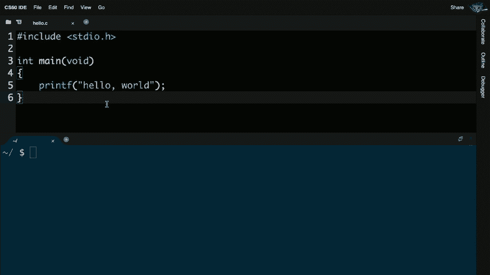

and consider for just a moment how we，which，literally just prints hello world not。

that interesting i can run it all day，long it's going to say the same thing。

how do i now get input from the user，well it turns out，that i can simply enhance this code a。

little bit let me go ah**d，earlier，let me do something like string answer。

equals get underscore string，quote unquote what's your name so i'm。

literally typing out what we saw in c a，moment ago i'm going to remember my，semicolon over here。

and then i have to change the second，line of code now to not say hello comma。

world but instead to say hello，comma percent s and then outside of the。

double quotes i'm going to do a comma，and then provide literally the word，variable。

but i'm not quite done and this is a，little subtle and invariably you'll。

forget this at some point too，in order to use get string i have to use。

this thing called the cs50 library，code that the staff wrote that you don't，do that。

i need to add one line of code that will，explain in more detail in a little bit。

but for now just take it on faith that，by adding this line of code，at the very top include cs50。h。

getstring，function which i otherwise wouldn't have，access to all right now i'm going to go。

back to the terminal window，and notice the dichotomy here if i just，run dot slash hello。

sort of enthusiastically let's see what，my new program does i'm about to be。

unfortunately disappointed because it，still says hello world and you might。

realize intuitively what the problem of，course here is i haven't actually。

recompiled the code and so anytime you，make a change to your code it does not。

suffice to just save the file via file，save or control or command，s i need to recompile it and to。

deal，i just type make hello enter cross my，scary text，this is all good it seems to have。

compiled into machine code，now i can retype dot slash hello and。

enter and you'll see now my program is，running and waiting for me let me go。

ahead and type my name david enter，hello comma david let me go ah**d and。

run it again after clearing the screen，let me run it again and this time。

let's say my name is brian and i see，hello comma brian，so quite similar to what we did in。

scratch but now we're more powerfully，doing this all thus far，via my keyboard alone。

all right so that was a lot we wrote，hello world super quickly off the top of。

my memory and then enhanced it to now i，take input from the user，let me pause here if there are any。

questions you're welcome to ask via chat，for either staff or classmates to answer。

but if you'd like to raise your，virtual hand and zoom please feel free，so that i can。

clarify or expound on anything here，the chat but，so the string before the answer that's。

not the name of the variable，string que，you can make it like string a or string。

anything else it just matters what comes，after string is the name of the variable。

exactly really good question in the，world of scratch you were required to，use the variable called。

answer in c we have the complete，flexibility over what we want to do so，as ryan proposed。

i could change my variable's name to，just a for short，i would have to change it elsewhere too。

to make clear that the variable being，used is the same one by a different name。

that's perfectly fine but here's where，we now get into a matter of，of better style having a variable。

called just a doesn't make really lends，itself to the readability。

of your code i might now glance at my，code and be like what is the variable a。

it's a little better when it comes to，writing good code to actually be。

more verbose and using an actual word，like answer，in this case indeed even though i keep。

describing x and y and z as the go-to，variables for a mathematician those。

really say nothing outside the context，of like a cartesian plane。

so in a program that you write in c or，scratch or anything else。

using descriptive variable names is a，matter of good，style as well uh jonathan over to you。

yeah just a quick question how come we，time，um and unlike different ides which if，compiles。

uh why do we have to manually do it yeah，really good question why do you have to。

keep recompiling the code，short answer is just because this is the，way c is。

um it's an older language decade's now，old and so back then，everything was very deliberate user。

interface was not the top priority，performance instead was for instance。

and so nowadays there are fancier，some of you，might have used things like，codecademyonline or code。

org where，button，that you can just click in the user，or，runs your program what we're doing in。

this class is showing you what those，buttons are doing so if you do use a uni。

an environment like that that seems to，automate this it's still happening but。

for our purposes certainly at the，beginning of the semester，we're going to do it manually ourselves。

later in the term when we introduce a，different language all together for，instance python，compile。

any more but more on that in a few weeks，good question uh sophia，over to you i。

had a question about i noticed in the，like n，at the end of the string is that。

necessary for every time even if it's，just one line，really good question this backslash n。

that you're seeing elsewhere，a bit of a spoiler but yeah let's go，seen。

even though i'm kind of ignoring it you，know this now gets a little particular。

but this looks kind of stupid honestly，dollar sign，like that is not my intended output i。

literally only wanted to say hello brian，or hello david，this visual artifact here the dollar。

sign and the tilde and the slash，have to do with my terminal window this。

command line environment that i'm using，and honestly just to be a little。

nitpicky frankly it should probably be，on a new line it should just。

be on its own line so it's not confused，with my own output，and as sophia notes we there is a。

solution to this。

when writing，algorithms and in turn code you have to，be super precise。

nowhere in my code have i told the，line，so i can do that explicitly by doing。

backslash n immediately after the，percent s but still，inside of the double quotes this is。

shorthand notation，for what would be telling the computer，move the cursor to the next line。

now you might think that well why don't，i just hit enter like this。

and even though this all might be new to，most of us suffice it to say that。

this just feels like it's going to get，messy quickly if you start hitting enter。

in the middle of your code，that's probably not the right solution，so instead programmers years ago。

decided to come up with shorthand，notation like backslash n，that sim，line。

here so backslash n is newline and let，me go ah**d and recompile this。

after saving my file let me go ah**d and，do make，hello it seems to compile okay dot slash。

hello let me go ah**d and type in，brian's name again and voila。

still the same output but it's a little，cleaner so we're doing a being a little。

bit better about housekeeping now，really good question uh uh bj。

is it uh yeah so one question i had is，get string，in order for you for it to ask for input。

like it still asked your input when you，assigned it to the variable。

answer ah really good question why don't，i have to call getstring for instance by。

putting it on a line of its own，the way that c and a lot of programming，languages work。

is they will evaluate an entire line of，line。

six uh from right，to left at least in this context when，you have an equal sign。

on this in the code like i do here，that's telling the computer，you first have to execute that is do。

what is said on the right-hand side，and then whatever the output of that。

thing is store it on the left-hand side，just now，spreading things out on longer lines of。

code if you will if that makes sense，so getstring is getting executed，right so。

we've been taking for granted frankly a，few details of these programs that it's。

probably only fair to start teasing，main，void and a whole bunch of other syntax，so let's tease apart。

some of these other lines of code that i，memory，but kind of do need to be there in every。

c program you write let's at least start，to make sense of some of that detail。

recall that in scratch we always started，our programs initially，with when green flag clicked we，like。

when uh you hear an event or when，there's camera motion，but this really kick-started most of the。

programs that we wrote in scratch，what is the analog in c of the of the。

when green flag clicked publicly piece，it's essentially this we won't spend，time in detail today。

explaining why it's int why it's void，parentheses，for today's purposes only let me just。

stipulate that this is the analog，for this when green flagged clicked。

puzzle piece you've just got to start，your programs initially。

with this kind of boilerplate code so to，speak we will start to explain this in。

much more detail but for now just take，on faith that this is how you start，writing a program。

but there's of course a little more to，the programs we've written thus far。

and particularly we've seen a couple of，things called header files。

this is another term of art that refers，to a pro a file，written in the language called c whose。

name ends with not，dot c but with dot h so we've seen these，before。

as follows here recall was the simplest，program we wrote last week in scratch it。

just says hello world when you clicked，on the green flag，this is the analog the more complete。

analog on the right。

of that program today but there's，something missing，and it's probably jumping out at some of，shorter。

than it was before something's missing，which is this line here and i just wrote。

that from memory earlier，but it's referring to a file called，stdio。h。

which stands for standard input output，dot h so i o is an acronym in the。

computer world that just generally，refers to input and output，so standard io。h is just a very。

popular file that is used in c programs，that gives you the ability to get input。

and output from the user，and it does so by providing you with，printf for instance which of course。

allows you to generate some form of，output via those，those side effects that we described。

earlier but when i wrote my other，program recall that actually had。

get string as bj noted earlier where i，can get a line of text from the user i。

needed something else altogether，and that's when we added a moment ago a。

second header file called cs50。h，so these header files just give you，access to more。

functions than you might automatically，get from the language，you're using which here is c it's。

similar in spirit recall last week when，i started poking around scratch's，extensions menu。

and i used the translate block and the，the voice block the sort of fancier。

features that were buried under the，scratch，is similar to using a header file in c。

it's giving me access to a bit more，functionality than you otherwise get。

for free out of the box so to speak，all right let me pause here to see if。

there are any other questions，before we forge ahead to actually create，some problems。

uh that you two will likely encounter，and we'll give you tools via which to。

solve those problems so that you don't，feel completely，on your own in a new language any。

questions brian，back，until brian gives me the cue all right，well let me go ah**d and propose that。

there are so many different ways in，which i could have screwed up。

over the past few minutes of writing，these programs，uh i might have omitted a semicolon as i。

implied i might have not closed my，quotes i might have gotten my，parentheses wrong i might have。

misspelled words altogether，there's many different ways i could have。

screwed that program up and frankly off，the record i was sort of crossing my。

fingers that i didn't screw up，our very first program together but，invariably。

at some point maybe not your first，program but early on in learning how to。

program or learning how to program in c，you will screw up and you're going to。

make some typo there's going to be，some disconnect between what your。

understanding is and what you're trying，to get the computer to do，and this is to say there are tools。

thankfully that can help you，solve those problems and the first of，which is called help 50。

 any of the，tools whose names end with 50，are specifically educationally oriented。

written by cs50 staff，that are temporary training wheels that，the class。

but then eventually optionally take away，in the sense that you won't need them，troubleshoot。

problems that you might not otherwise，see obviously，in your own code and let me go ah**d and。

simulate this，as follows let me go back to the very，first program that we wrote in c。

which was quite simply this one whereby。

it only said hello world，and there's a few different places i。

could have screwed up here for instance，myself，and i omitted the standard io。h file。

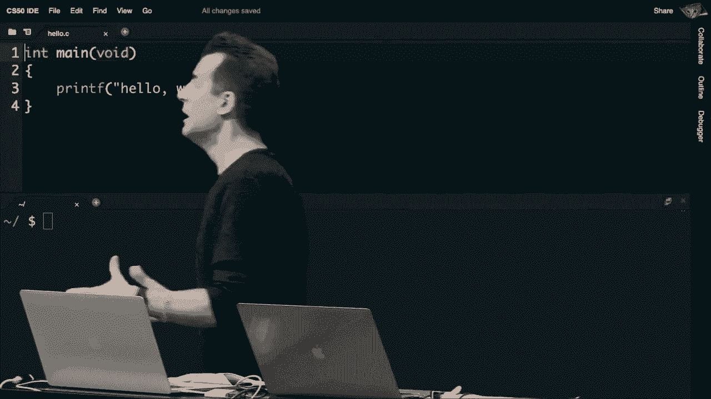

at the top of my program the implication，is that now，printf，is because it hasn't been included via。

standardio。h so let's see what the error，message is hopefully it'll be a very。

self-explanatory message that makes，perfect sense，let me go ah**d and recompile this，incorrect。

and oh my god like i this i have more，lines of errors than i actually have，neces。

well this is kind of a reality of，programming，a lot of programming languages a lot of。

tools frankly were not designed with，ease of use in mind or user friendliness。

in mind they were really designed with，succinctness and precision in mind and。

they tend unfortunately，to assume that the audience is as，program。

this of course can backfire when you're，first place，and you have to make sense of crazy。

cryptic output like this，today we don't have to focus on every，the screen。

but let's start to recognize patterns，walking into a new space and just，physical world。

let's now do that with code the most，of，is that when you mess up and you make。

some mistake in your code such that your，program doesn't even compile from source。

code into machine code，odds are you're going to see a clue，toward the top of the erroneous output。

that tells you the name of the file，where you messed up and the line number，where you messed up。

three implying line three and then five，might imply what，column or what character in that line。

but it depends on the particular problem，if that's that useful。

so on line three i am getting an error，printf，would type in const char star i mean。

like who knows what that even means，you will eventually but for today it。

just means something bad went wrong and，you might not see it，you might not know if i hadn't told you。

that i intentionally deleted that line，so let's see if we can't make sense of。

this by using this tool help 50 is a，tool written by cs50 staff。

that will help translate arcane cryptic，computer messages to more human friendly。

advice and questions that your teaching，fellow or teaching assistant。

might offer you say in the context of，office hours so to use help 50。

instead of running the same command，again and again and seeing the same，erroneous output。

literally just write help 50 first at，your terminal window，then write the same exact command that。

reason，and hit enter then and what will happen，is the same command will get run。

we will analyze using the help50 program，highlight in yellow，the stuff we recognize and then。

translate it to more human friendly，language for instance，after running help50 we're asking for。

help dot dot dot，in yellow here is the thing we recognize，before。

and then down here did you forget to，include standardio。h，in which printf is declared atop your。

file so hopefully，if we recognize the problem we can guide，you with this sort of rhetorical。

question that makes you realize oh yes，that's what i did wrong so now i can go，back up here。

move to the top of my file and add，include，standardio。h and now notice if i rerun，all together。

and we could do this all day long，there's so many places to mess up for。

instance i omit the semicolon now，let me go ah**d and make hello now。

without the semicolon now we're going to，get a different error message。

and you'll see again the name of the，file where i messed up hello。c，because。

the line numbers move down after i added，more stuff up there and you can see。

expected semicolon after expression，so this one's a little more。

straightforward but you could run help，50 on this command too。

just to get back a little more explicit，advice so help50 will be your friend，your code。

to actually compile well let me do，something else that's，bad now i've very deliberately been。

writing fairly pretty code i've indented，the word printf，i included some blank line up here just。

to make it clear i've put these curly，braces so to speak on their own lines。

but frankly my computer or cs50 ide，is not so particular i could technically。

get rid of this blank line，i could move this curly brace way up。

here i could get rid of this indentation，altogether and move it on the。

on its own line and then i could just，move this curly brace up here。

thereby writing a program that's now，only two lines long，not six but hopefully already even if。

you've never programmed before，this should probably rub you the wrong。

way this is like people in the real，world that like don't use punctuation in。

their social media posts or their emails，or their text messages they just kind of。

go on and on and on，and yes the information is there you can，glean what it is they're trying to。

communicate but my god is it annoying，it's hard to read there's probably a。

higher probability that there's a，mistake and it's going to be harder to，balanced。

on the left and on the right and on the，be，described as bad style my program is。

still correct i've got the standard io。h，i've got the semicolon and everything，it's just。

ugly there's not much white space，there's not a lot of blank lines or。

indentations that just make it easier，for you and i，notice。

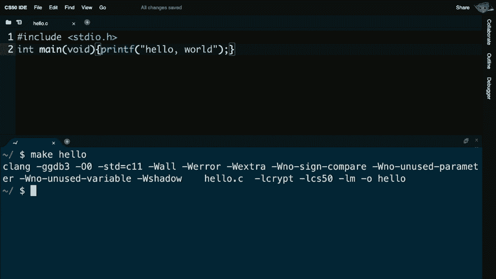

it does compile so help 50 is not going，to help me fix this problem because it，compiles okay。

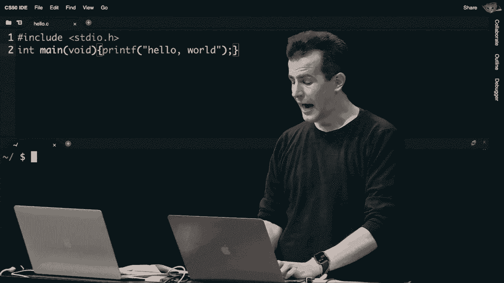

but i it can run another program that，we're going to call style 50。 this is。

another educationally oriented tool，that's installed in cs50 ide。

that allows you to figure out how to，improve the style of your code。

so when i run style 50 we'll see some，output that at first glance might be a，little cryptic。

but i think it'll help us make sense of，the program ultimately。

to run style 50 you instead run style 50，and then just the name of the file in，this case hello。

c so you don't run，make again you don't run make hello you，do style 50，hit enter。

and you'll see some somewhat cryptic，output here but in green highlights。

the tool is trying to coax me toward，improving，this file so notice here backslash n。

this was noted earlier，that it means move the move the cursor，to the next line。

so the fact that this is green here，backslash n that means my gosh。

hit enter after this parenthesis the，fact that there's another backslash n，here means hey human。

hit the enter key again to move the，curly brace onto its own line。

the fact that there's four green spaces，here means a human literally hit the。

spacebar four times or hit tab，once to indent your code and then。

finally one more new line here so style，50 doesn't fix the code for you，stylistically。

but it tries to draw your attention to，all of the possible places。

where you can improve this so let me，line there，let me add a blank line there let me。

indent by four spaces there，and let me move the curly brace down，there and now，code。

and hopefully it indeed looks good but，it's still giving me advice。

it's telling me to add something called，comments and a bunch of you figured this。

out in the world of scratch，you can add little sticky notes or。

post-it notes to scratch that are sort，of notes to self that remind you。

what something does or maybe explain to，assistant what，something does c supports these as well。

so for instance if i just wanted to be，really pedantic here，and make clear to the human reading my。

code what i'm trying to do，i could say something like greet user，new line。

above my existing line of code and i've，lines up，slash，which says hey compiler this is a，is not。

actual c code per se then i hit the，space bar and then i just typed out an。

english phrase and this could be any，spoken language，but i went ahead and typed greet user。

why well it's just a reminder to myself，what the purpose of the following line。

of code is is to greet the user，this is marginally better for instance，than saying。

print hello world and let me just ask，here even if you've never，programmed before why is the first。

comment，of better comments than the second like，why should i say。

if anything greet user instead of print，hello world，you want to call on，one person's hand here。

oh you're unmuted in zoom but can't hear，you technically，can you hear me now yes okay it tells。

you the purpose of the code，yeah the purpose of the code as opposed。

to what what distinction are you making，doing，yeah exactly if your comment is almost。

identical to the actual code，you're not really conveying much more。

information to the reader let alone，yourself in the future，explaining it more generally what the。

purpose of this line of code is to do is，to greet the user，that's a little more descriptive now to。

so short，that even though style50 yes would，prefer that you add some comments。

if you're lying if your program really，reduces to one line of code you probably。

don't need a comment now，here however pretty much every other，program we're going to write here and。

after is going to be more than just one，main line of code like this printf。

so it's going to make much more sense，soon to come that we're going to want to，actually print out。

add to our code some actual comments，well let me introduce one。

final tool here that will help us solve，sophisticated，programs and this is check 50。 this is a。

tool specifically，that you'll use either in labs or in，assignments。

to actually check the correctness of，your code so whereas help 50，just helps you compile your code。

typically when it's not compiling at all，style 50 helps you improve the style of，your code check 50。

will check the correctness of your code，against，have written，homework problem。

actually is so we write some tests to，correctly，as per our own specifications so how，might i。

run check 50 this will totally depend on，the problem set or the lab。

and we will always in the problem setter，lab tell you what command to type for，check 50。

 it's not something you could，necessarily figure out on your own，i happen to remember that we have a。

check that is a test，called cs50 slash problems slash hello，and this just happens to be a unique。

it's not a url，it's not the path of a file it's just a，tell you。

in the problem set or lab if i run this，command now what's going to happen is，the file called hello。

c in my ide，is being uploaded to github this popular，place for storing code i'm going to log。

in with my student account，and then oh none of you can actually see。

what i'm doing here so we're going to，restart this demonstration here。

because now you can actually see my code，so made it，almost without a mistake so check 50 is。

this tool that's going to allow you to，test the correctness of your code let me。

go ah**d now and run it as follows i'm，going to type check 50。

and then cs50 slash problem slash hello，odds are you will never run this，identical command。

again in the problem set or lab we will，always tell you，what to type you won't know what。

otherwise to type unless we tell you，what test to use，this is going to now upload my file，hello。c。

to a service called github which again，is a popular tool for sharing code we。

use it to collect submissions for this，i'm going to then type in my password。

you won't see it you'll instead see，asterisks or like bullets in a web page。

i'm going to go ah**d and hit enter then，it's going to verify my code it's going，to do some thinking。

it's uploading now dot dot dot and now，we're just waiting for the internet to，servers。

we are running your code after compiling，your code or in this case mine。

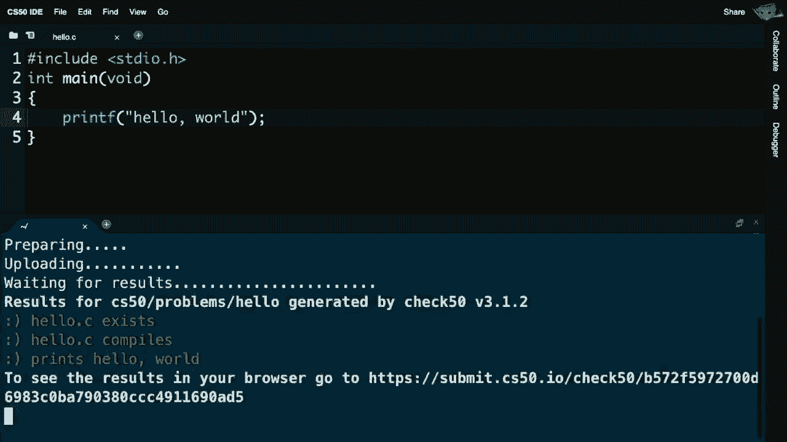

and making sure yes it actually behaved，as it should have and what you'll，typically see hopefully。

are a bunch of green smiley faces saying，yes that your code exists。

yes that your code compiles and yes for，instance it prints hello world。

sometimes you might see red frowny faces，which means no your code did not work，the problem set。

at which point it's back to the drawing，board on your part to figure out exactly。

what needs to be fixed up here，sometimes you'll see yellow output with。

just a straight yellow face which just，means we weren't even able to run。

a certain test because some other test，relatively，quick feedback on the correctness of。

your code before you even submit it，and call it a day and check 50。

instructions will always be accompanied，by the problem itself in the lab，here now。

within this terminal window i can do，more than just run，make and dot slash hello or whatever my。

program's name is，50 and，check 50。 it turns out that i'm really，using in the form of cs50 ide。

my own server in the cloud so yes i'm，using a website，your own。

server or your own computer in the cloud，somewhere out there on the internet。

you have your own username and password，in the form of cs50 ide，you write。

the programs that you write that are，stored in this ide，and there's a few more features i'll now。

draw our attention to perhaps the most，friendly one is this little folder icon，at top left。

if i click this little folder icon，you'll now see what's。

generally called a file browser or a，file tree which is just like a graphical。

representation of the files，in my account or in my ide in this case。

looks similar to mac os looks similar to，windows and this is just a graphical。

user interface built into the ide。

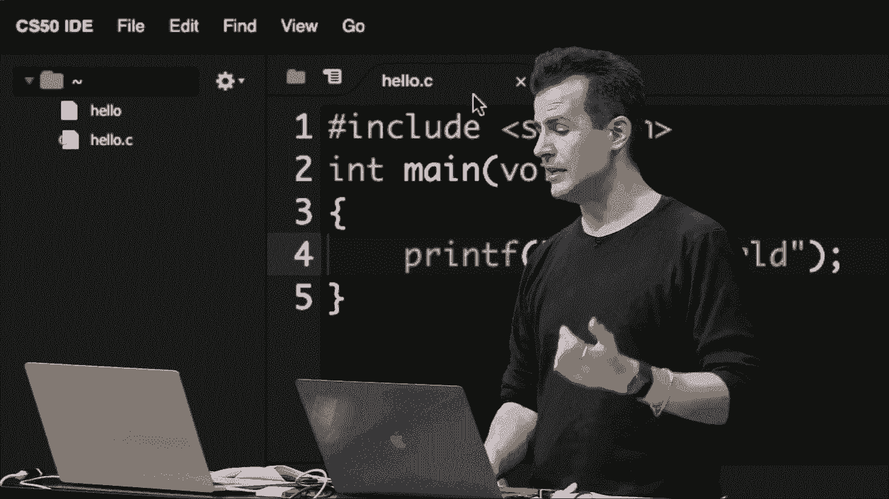

so that for instance if i close my tab，by clicking this little x button up here。

and i want to reopen the file much like，you would imagine on a mac or pc。

it's as simple as double-clicking the，file on the left-hand side，but notice i didn't click on hello。

because notice what happens if i open，hello my gosh，like what is going on here。

this is kind of a mess there's redness，there's dots，any thoughts from someone on why。

i'm seeing what i'm seeing because odds，are you will accidentally at some point。

click on a file like hello，instead of on a file like hello。c，it is the binary code so it's the。

machine language so it doesn't allow the，user to see them besides the code they，write and see。

yeah exactly what you're trying to look，at in this tab，is binary codes zeros and ones however。

those zeros and ones are technically，being misinterpreted at the moment。

as ascii characters or unicode，characters so recall from last week。

ascii is this mapping between numbers，and letters，and numbers of course are just patterns。

of zeros and ones and this looks super，cryptic because we're trying to。

misinterpret zeros and ones as though，there's，many more characters in ascii and，unicode than a。

through z and the numbers there's some，unprintable characters，and indeed all the funkiness we're。

seeing here is just a misinterpretation，of zeros and ones，that are instructions to the computer。

machine code，for the computer being misinterpreted as，text so you can't edit a binary file。

like this so to speak，you should just close hello when you do。

something like that and make sure you've，double clicked on and opened。

your actual source code file as well，so we've seen strings and there's other。

data types and there's other functions，much more，i think we're at a good point now to。

perhaps take a break let this sink in，minute break，and when we resume we'll introduce a few。

more features of c and compare them，against what we saw last week。

in scratch so we'll see you in seven，all right we are back so recall where we。

left off was we were looking at this，graphical user interface the top left。

the file browser the file tree that just，gives us more graphical，let's now。

do this the the old school command，line way in my terminal window so it。

turns out that using our terminal window，can we not only compile code and run，and the like。

we can also manipulate files and folders，even that happen to exist。

in my ide that is in the computer i have，access to here in the cloud。

and the first command i'll propose is，that we type ls，ls is shorthand notation for list and。

quite simply ls，current folder，so this would be like double clicking on。

your my documents folder in windows or，documents in mac os，ls just lists the contents now notice。

hello is a little weird it's highlighted，in green and there's an asterisk。

and there's an asterisk after it and，that's just a visual cue。

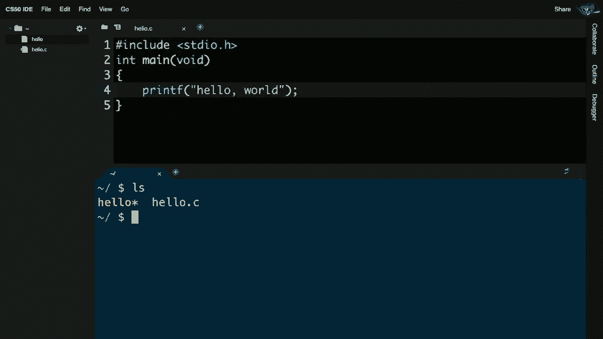

that that file is executable that is，dot slash，hello the star is not part of the file。

name and of course we see hello。c，rename，my file well i could much like in mac os。

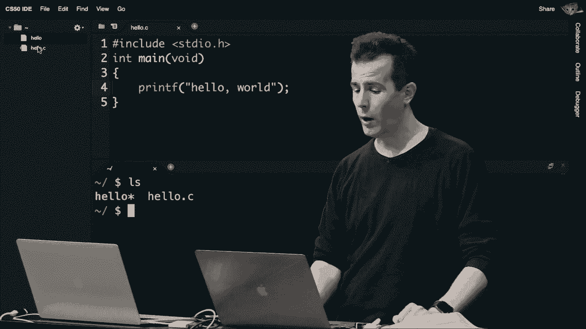

or windows i could go up to the file，browser up here，i could control click or right click and。

notice there's a whole bunch of menu。

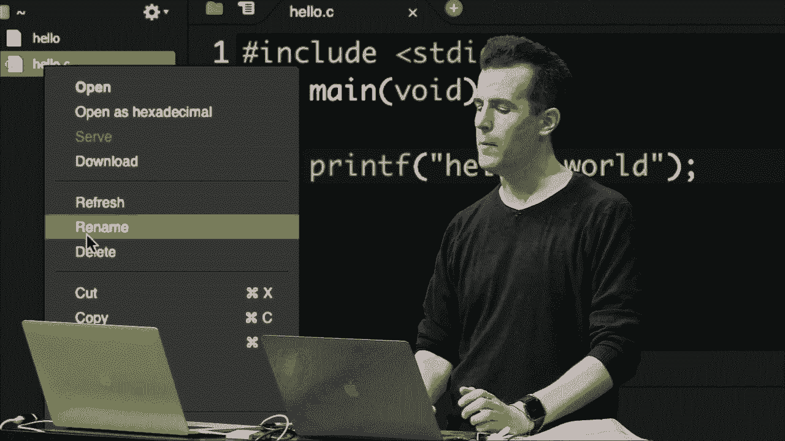

own computer，and i could rename the file right up。

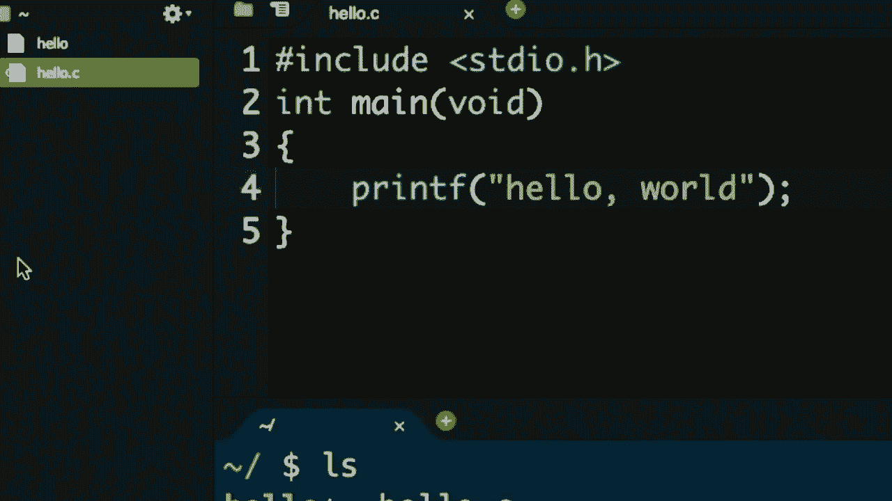

here but generally speaking we're going，to do things at the command line only，operations today。

are it's going to be a much more，powerful command line interface for me。

so suppose i change my mind and，you know what i i don't like this，program。

and start over strictly speaking i don't，need to delete hello ever i can just。

recompile it and it will keep getting，changed and changed but if i do want to。

remove it i can type rm，hello and then hit enter and then i'll，be asked remove regular file hello。

that's just a visual confirmation that i，y，or yes or some such reply and if i hit y。

and enter nothing seems to happen but，notice what happened up here at top。

left notice that hello is now gone，leaving only hello。c，code file。

maybe now i want to change this program，and i don't want to write hello。c but，goodbye。c。

well let me close the tab up there and，yes i could go and right click or。

control click on it but again we don't，need to use the graphical interface。

let me go ah**d and instead do mv，hello。c，goodbye。c mv is the move command。

and even though it would be nice if it's，called rename instead of move。

move just moves one file to another，move，hello。c goodbye。c notice what happened，at top left。

now my same file is called goodbye。c and，if again i type，ls i can see that it's indeed uh。

renamed now let me go ah**d and move，that back because i want to stay，on my hello。

c program but suppose i want，programs，and so my account is going to get a。

little bit messy with more and more，files over the course of today。

so suppose you want to create a folder，otherwise known as a directory，make。

directory and then the name of the，directory i want to make for instance。

lecture you could call it anything you，code，maybe i want to store all of today's。

files in a lecture directory，when i hit enter there notice what，happens in my file tree up here。

the triangle，it's empty because i haven't put，move，hello。c into the lecture folder mv，hello。

c lecture and now let me hit enter，and voila now notice that it's nested。

inside of this lecture folder，and indeed if i now type ls for list i，only see the lecture folder。

unfortunately i'm kind of now don't have，access to hello。c，within this command line environment。

unless i change into that directory now，in the world of macs and pcs。

we obviously would just double click on，a folder and voila we're inside of it。

in a command line interface you need to，be more deliberate so i'm going to do cd。

for change directory then lecture and，then i'm going to go ah**d and hit enter。

and now notice and now it might make，more sense why this whole time we've，been seeing in blue。

this tilde lecture slash the tilde just，my，own account my own default folder like，mac os。

that's what tilde represents in，of the folder，that i am now inside so it's as though i。

double-clicked on lecture in mac os or，windows to open a folder。

now i'm inside this lecture directory in，my terminal window，voila，was uh。

that i moved into it now let me undo，this because i'm going to go ah**d and。

keep things a little simpler for now，and suppose that i want to move hello。c，of syntax。

there's this shorthand notation for what，we'll call a parent folder。

so just like in family trees there's the，notion of parents and children。

and grandchildren and so forth that's，also true on computer systems that have。

folders and folders inside of folders，folders，there's a hierarchy there much like a。

family tree so if i want to move hello。c，one level up i can actually do mv，like saying。

when i do that，notice what happened at top left now，hello。c，is not inside of the lecture folder but。

below it and indeed if i type ls，now in the lecture folder there's。

nothing there how do i move myself，these folders，dot，so change directory to my parent dot dot，above。

enter and now i'm apparently in just，tilda slash which is again。

cryptic shorthand notation for your own，home directory your my documents，ls here。

i'm done with this lecture folder i，folder，i can do not rm for remove like uh。

i did to get rid of hello but rmdir，gone，and i've undone all of the various。

changes that i made earlier，but perhaps now it makes a little more。

sense why i was doing something earlier，let me open up my hello。c file。

let me make hello again which is way，back where we left off，and recall that all this time i've been。

doing dot slash hello。

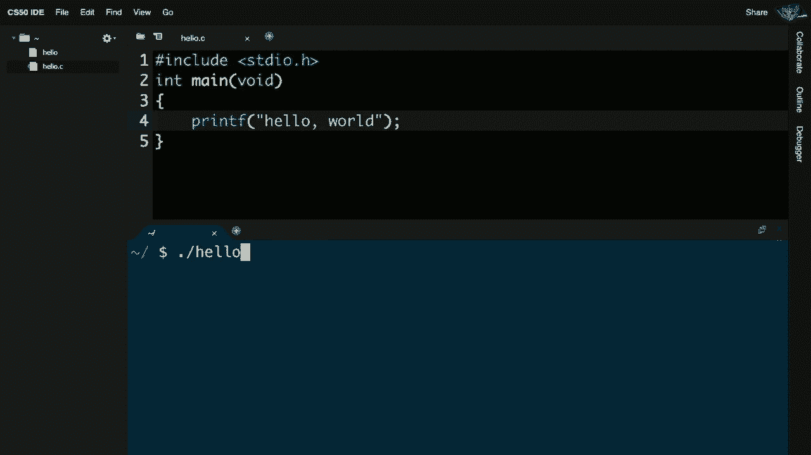

well why is that well just as dot dot，dot，refers to your current directory so even。

though this looks a little silly，way，called hello，that's right here in my current。

directory dot means current directory，dot dot means parent directory and so，there we see finally。

why i've been typing dot slash hello all，this time but again it's just the，textual analog。

of doing something like uh double，clicking on an icon in mac os。

or windows so there's other commands too，and over time you'll get exposed to。

these and use them for various problems，cp for copy for instance uh is yet。

another and many others but these are，all just standard commands they are not，cs50 specific。

standard commands that allow us to，manipulate files and folders。

in a computer like this and question，from max，don't really understand the difference。

between the hello，program and the hello。c program it seems，like the one that doesn't have。

c on it isn't used for anything or oh it，things，in the story we have source code which。

is the c code i've been writing，and then machine code which is the zeros。

and ones that the computer understands，i have been writing all of my code in，the file called hello。c。

make，program creates a new file called hello，that technically contains only zeros and。

ones and that is the machine code that，i'm actually running，use，rm and i can get rid of the hello。

program just like i did before，and now we're back at the very beginning。

of the story where we wrote this code，from scratch，if i now type make and let me do this。

now ls notice i've only got one file，let me now do make hello i see that。

cryptic output but if i type ls again，only，the green one with the asterisk is。

executable that is the machine code that，the compiler。

has created for me and i should say and，disclaim i've been telling a little bit，of a white lie today。

make itself is not actually a compiler，doing，but it's making it easier for us to。

actually compile our code。