# 【双语字幕+资料下载】哈佛CS50-CS ｜ 计算机科学导论(2020·完整版) - P3：L1- C语言（语法与格式）2 - ShowMeAI - BV1Hh411W7Up

but more on that next time all right，so we've seen only strings thus far but。it turns out in c and in a lot of，languages there's other things known as。types or data types that is to say you，can have variables and values。that aren't just strings of text but，two three four，or maybe floating point values like，3。

14159 or other such values，you can have boolean values which are，only true，chars。which are single characters this is to，say within a language。like c there's actually a whole bunch of，data types that are available to you。string is only one of them and there's，even more than are on this list here。

but this is just a list of some of the，most common ones that we'll see today。and will use this coming week in the，first problem set，that allow you to tell the computer not。only to store a value in a variable，but what type of value to store in a，variable moreover。we have in the cs50 library a whole，bunch more functions we've seen，getstring already。

but similarly have we created functions，and beyond，that allow you to get a single character。by a getchar，that can allow you to get an integer via，getint that can allow you to get a。floating point value which is a fancy，way of describing a real number with a，decimal point。using get float but it turns out that，each of these data types，like int and float only have a finite。

number of bits，and recall from last week that we played，around with light bulbs and we played。around with bits and zeros and ones more，generally it turns out that，double。uh float int long string and so forth，all use a specific number of bits and it，turns out，use。32 bits and that's great until such time，as you want to count higher than roughly。

4 billion at which point you can't we'll，see later today that，if you're only using a specific number。of bits you can only count so high and，so there exist other data types for，instance a long。a long is another type of number in c，that just uses sixty-four bits so it gives you。way more expressiveness way more，higher，similarly a double is like a floating。

point value a real number with a decimal，point and some number of digits after it，digits。after it then a float would so we'll see，and use some of these data types。in just a bit printf similarly has the，we saw，but also using different format codes。other data types as well these are a，little more cryptic and it's fine to，you'll。

eventually ingrain them for common use，cases，percent c is going to be the placeholder。for printing a single character percent，c for a char，so to speak percent f is going to be for。a floating point value so if you want to，print out a real number with a decimal。point you're going to use percent f，if you want to print an integer using，integer。

if you want to print a string we've，already seen percent s and if you want，to print a long。integer aka long you're going to use，percent li，and there's even others but these are。perhaps some of the most common and it，just means that again，c really needs you the programmer to be。precise you can't just say print this，you have to tell printf how to print the，variable or the value。

that you're passing into it and then，lastly it turns out that in c。there's a whole bunch of operators，certainly mathematical ones and bunches。of others as well just like scratch had，a whole toolkit，of operators and suffice it to say for。now that c，also supports addition subtraction，multiplication division。

and even the remainder operator which a，little cryptically is represented with a，percent sign。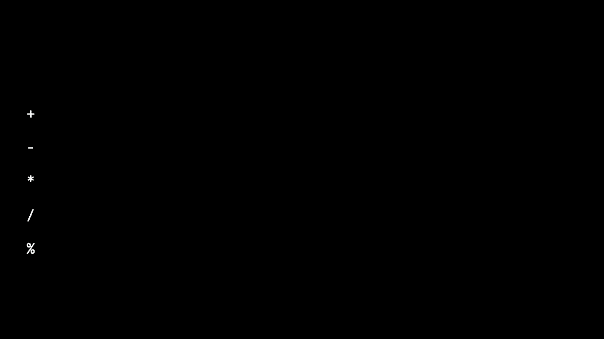

not to be confused with printf's format，codes but this is to say that some of。the earliest uses of computers of course，were all mathematically oriented in。spreadsheet programs programs like visit，calc and the like，back before there was excel in google。spreadsheets and they certainly，computers are very good，at supporting math and so these are just。

some of the operators that we'll now see，are available to us so let me go ah**d。and do this let me go back to，my ide after cleaning things up。and starting fresh with just nothing in，my terminal window and no tabs open。and let me go ah**d and write my next，these functions。

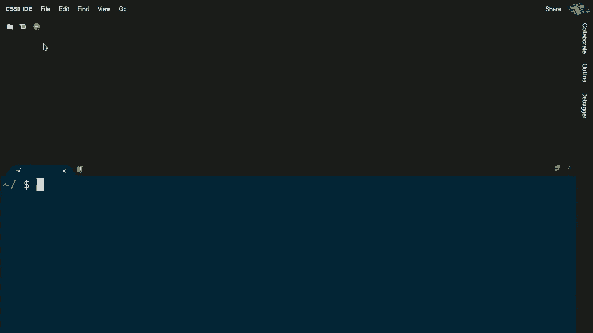

i'm going to go ah**d and create a file，up here called，edition。c so edition。c but i could call。this anything i want but it's important，to add the dot c。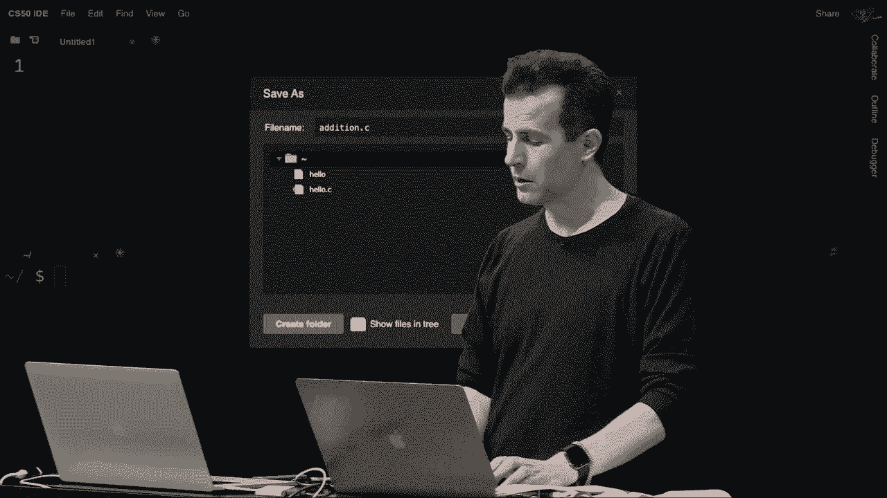

otherwise the computer will not know，that it's actual source code as opposed，to machine code。and let me go ah**d and make use of the，cs50 library so let me include cs50。h。let me include standardio。h so that i，can use things like，getint and printf and then again for。today's purposes i'm just going to do in，main intmane void and then the。

curly braces and again for today just，take on faith this is necessary but。we'll explain within a week or two，exactly why we keep writing int main。void but for now it's like the when，green flag clicked，puzzle piece let me go ah**d now and get。an integer from the user suppose my goal，now is not to write a program that gets。

a string of text and prints out hello，brian or hello david，let me go ah**d and write a program that。maybe asks for two integers two numbers，and then just adds them together so let。me make the simplest of calculators，using code，variable，called x just like a mathematician would。and i'm gonna assign it the value，something like，x colon i could say anything i want what。

is x question mark but i'm going to keep，it simple and just say x colon。semicolon to end my thought so again，string before，but now i'm using get int to get a。number or an integer from the user，the quoted parameter here or argument。is the input to print to getint which is，sees，the equal sign recall is the assignment。

operator which says，copy the return value on the right，the integer that the human hopefully。will type in over to the left，and the left says give me a variable，called x。and let me store integers in it，so before we used string on the left and，difference now is。int on the left because i want a number，and get int on the right。

then let me go ah**d and do this again，and get another number，get int and i'll just say y colon but。again i could say what is y，question mark or anything in english but。the last line is going to be the，interesting one，now i'm going to go ah**d and print out。for instance the sum of these two，numbers，tells it，what to print out exactly so i can't。

really type a number here yet because i，type in，so i'm going to put a placeholder i'm。going to put percent i，which says put a number here i just，don't know yet what it is。and then just to keep things clean i'm，going to do backslash n which just says。give me a new line also that's just an，aesthetic detail to move the cursor to。

the next line just to keep things，clean but now printf is going to take a，second argument。and whether you've programmed or not。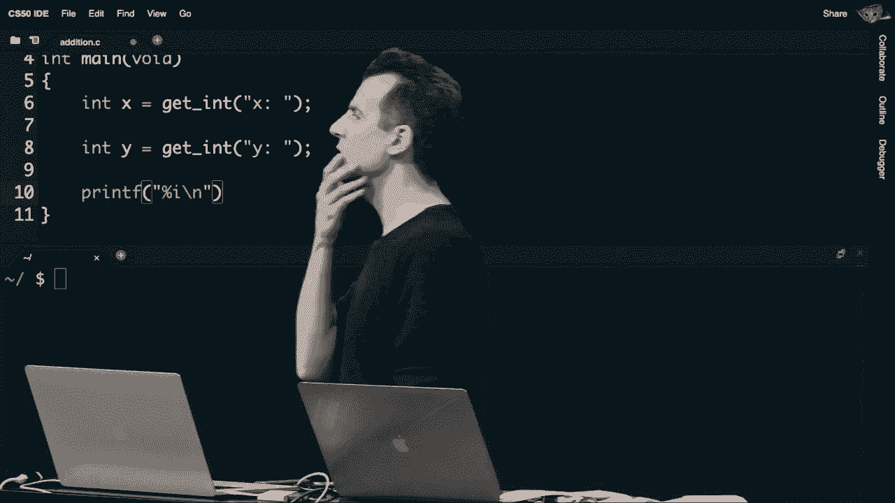

before brian let's go to someone in the，audience if we could，what should i type after the comma if。the purpose of this program is quite，simply，to add two numbers together even if。you've never programmed before，based on the operators that exist and。some of the syntax we've seen thus far，what would your instincts have you type。

here even if you've never，done this before santiago what do you。um i would say to just write x plus y，yeah it is as simple and as。straightforward as that x plus y is the，right intuition i'm going to add a。semicolon at the very end just to finish，my thought but indeed computers。

and c in this case absolutely understand，*****，*****，i'm going to go ah**d now and save the。file and go down below and i'm not going，type，make addition because that is the name。of my file implicitly，edition。c i want to compile into a，program called edition。hopefully this is where i cross my，fingers i didn't make any mistakes。

and i'm going to go ah**d and run make，addition，all is well no error messages if i had。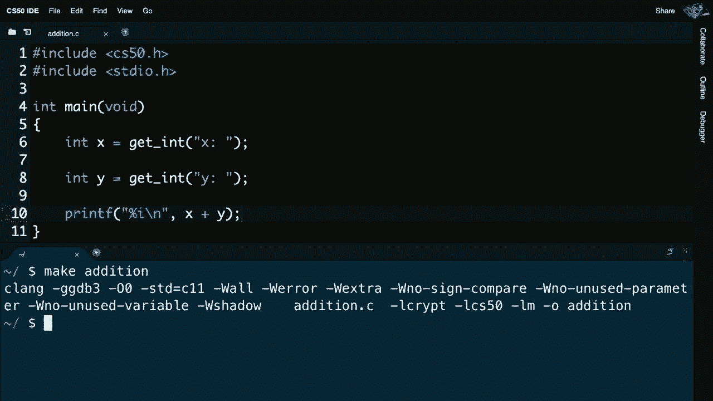

compile，help 50 might have been my next instinct。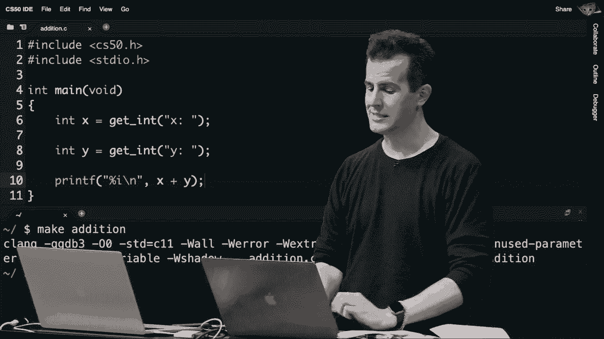

slash edition，and notice i'm first prompted for x i'm，going to go ah**d and do one。i'm next prompted for y i'm going to go，ahead and do one again。and voila santiago proposed i indeed see，on the screen，x plus y or the value 2。and i didn't。hard code 2，i substitute it in using percent i，whatever the result of。

x plus y actually is now notice，some of the features of the get in。function for you suppose that you're not，being very cooperative and you type in。cat for x notice that get in just，ignores you and prompts you again，prompts me，again if i type in 1。23 it ignores me，and prompts me again because it wants an，integer in this case a number like one。

four or zero，or anything above or below so fine i'll，cooperate now and give it the number one。same for y it's going to ignore any，non-integer input so if i give it a。number like 2 this time i'll hopefully，get the answer of，3。all right so we have a basic。calculator in c，we're using some basic building blocks，as before we've got these header files。

which just give me access，to getint and printf respectively but，suppose now i want to count up even。higher you know what let me try，something like this let me run this，program once more。and let me get a little greedy how about，four zero zero zero。zero zero zero zero zero zero so roughly，four well exactly，four billion uh that's the number i want。

to type in，notice that x does not like that so get，in does not accept four billion well let。uh-huh didn't like that how about 2，billion。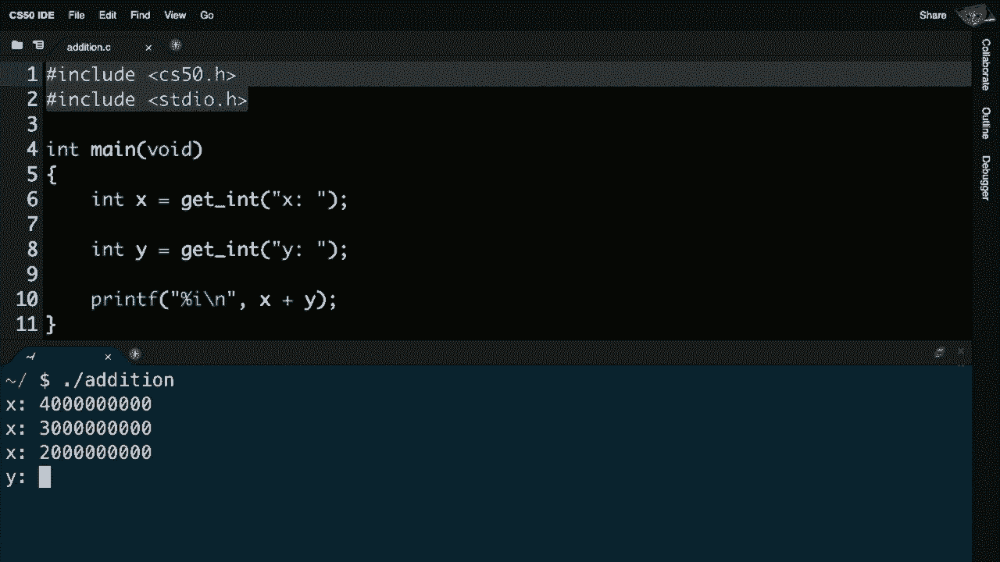

okay that one worked let me pause here，what's going on perhaps now again we。the staff wrote get in so we are the，ones that are rejecting，cats and rejecting dogs and rejecting 4。billion and even 3 billion，but in this case it's a little less。clear why did we reject 4 billion in 3，billion do you think，based on some of the definitions thus。

far today，why might this be nathaniel what do you，hi um i just got unmuted uh there's like。a cap on like the size of the number，since um it would take too many bits and。bytes uh after the size of two billion，perfect so integers again are，ants。ants only use it turns out 32 bits total，and you you would only know that by。

having been taught it or looked it up，for a particular computer system。but they on cs50 ide and most modern，systems an integer。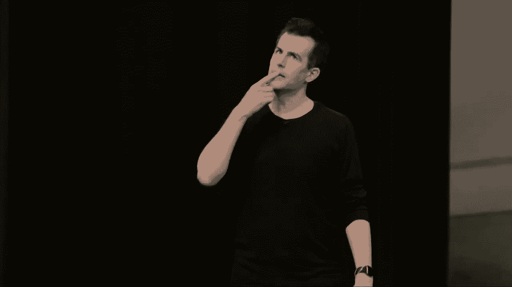

is only 32 bits and that then invites，the question well if you've got 32 bits。or light bulbs how high can you count，well it turns out with 32 light bulbs or，bits you can count。roughly as high as 4 billion you can，absolutely count as high as 3 billion。and yet get into still rejecting it but，that's because the get in function，includes not only，numbers。

and zero and the catch is that if you，want to support both positive numbers，and negative numbers。you can represent four billion or so，total possible values，but if you want to go as far to the left。and as far to the right on the number，line that i'm describing。you can only really count as high as 2，billion in the positive direction。

and negative 2 billion in the negative，direction because that still gives you a，total of 4 billion。but not nearly as high as 3 billion or 4，be，well i recall earlier noting that。there's other data types not just ins，and strings but also，longs which literally are longer。integers namely sixty-four bits so let me go，ahead and try this。

let me go ah**d and change get in to get，long this get in，long，and this into a long so same program。same calculator but i'm now using a，different data type，that's just going to use more bits to。store values let me run，make addition again to recompile my，program and oh。damn it i screwed up so let's see if we，can't glean what's wrong here。

let me scroll up and i can't emphasize，this enough sometimes i got lucky here。and i only have one mistake，apparently in the error messages it is，not going to be，errors。in like two lines of code this is，in your code，the compiler sometimes just gets。confused and if it gets sufficiently，confused it starts thinking。

everything is an error in your actual，code so the most important takeaway is，to have。always scroll up to the top of the，output and address the first error first。so that's why i scrolled up in my window，to look immediately below what i typed。make addition and here's the first error，edition。c on line 10。 all right i can't。

see line 10 so let me scroll my code up，and it saying something about format，specifies type int。but the argument has type long we，haven't seen this error before but i。think i can infer from this it's not，super cryptic even though it's，that。percent i recall was for integers i，think what i need，is a different format code for long。

integers which is going to be，l i instead and that was from my little，cheat sheet earlier。so let me go ah**d and try this again，li，whoops typo，now let me do dot slash addition and now。i'll type in four，zero zero zero zero zero zero zero zero，zero four billion，such a long。integer because it has enough bits，all right questions on types，int，yeah uh when i typed uh。

two billion and both were integers uh，wrong answer，some negative number is that because of。the bits and bytes indeed it's the same，answer so i didn't demonstrate that but。if you inputted both 2 billion for x，and 2 billion for y and then you tried，to add those together。that would require that would give you，mathematically 4 billion but again，billion。

if we want to also be able to represent，seeing，is that you can't fit the result。in the data type allowed and we'll see，in a moment uh in a little bit today。actually what the ramifications of that，exactly that，you tried to cram too big of a number。into finitely many bits，32 you can avoid that problem though of，course by switching over。

to long let me try one other thing，that's a bit curious let me go ah**d and。write a slightly different program now，and i'm going to describe this as，truncation。c fancy term but we'll see，what this means in just a moment，i'm going to give myself at the top，cs50。h and i'm going to give myself，standardio。h，and it's certainly fine once you get。

started with the first lab or problem，set if it takes you much longer to type。some of these things out，i'm just doing it for muscle memory int，main void。and now we're good to go with a new，program in a file called truncation。c。i'm going to go ah**d and prompt the，user for an int again so。

just like before i'm going to prompt the，user for another int，go ah**d and。do this i want to do division this time，so not just addition that was a little。too easy let me do division so，equals，x divided by y and let me pause here for。a moment and just ask the question，z，this line of code is not yet correct。

because recall that anytime you create a，new variable，on the left here i'm going to need to。put something，to the left of that variable's name so，that c knows what type of variable i。want and thus far we've seen string and，and long so would you propose we use one。what should the data type be for z would，data type for z how about jack what do。

uh would it be a float yeah so float so，value，which is the programmer's way of。describing a real number let me go ah**d，and do that a float and。uh i'm guessing uh your instincts for，float were that well if you。add in type in one number for x and，another for y and the result is a，fraction of some sort。

so something with a decimal point we，need to store it in a float so that we，can actually。uh store whatever the numbers are after，do this，percent f，backslash n because i'm printing a float。print out，the value of z and you know what just，for good measure let me start practicing。good style here too，so get a number from user let me give，myself another comment get。

another number from user or you know，what this seems a little silly。i can combine these lines and why don't，i just say get for instance numbers from，your code，x。by y but even this is getting a little，pedantic because you can kind of read。that from the code so at some point we，might not even need a comment for that。

so let's just simplify as such let's go，ahead now and compile this，make come on make truncation。all right it compiles okay and i like，how we used a float here that does feel。correct so let me run truncation，and let me go ah**d and type in for，instance 4 for x。and 2 for y okay i like that it's 2。000，so that's the correct math，x is 1，y is 2 and it's 0。0000。

all right well maybe that was just a，about，uh how about two thirds two divided by。three huh that's not right，either all right how about four thirds，for the x so。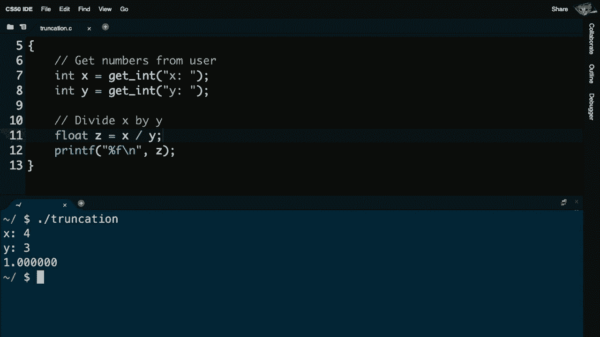

four thirds okay it's closer，of a，it's fine，but this is a logical bug like i've。somehow used c code improperly so what，might be going on，here y is one divided by two and two。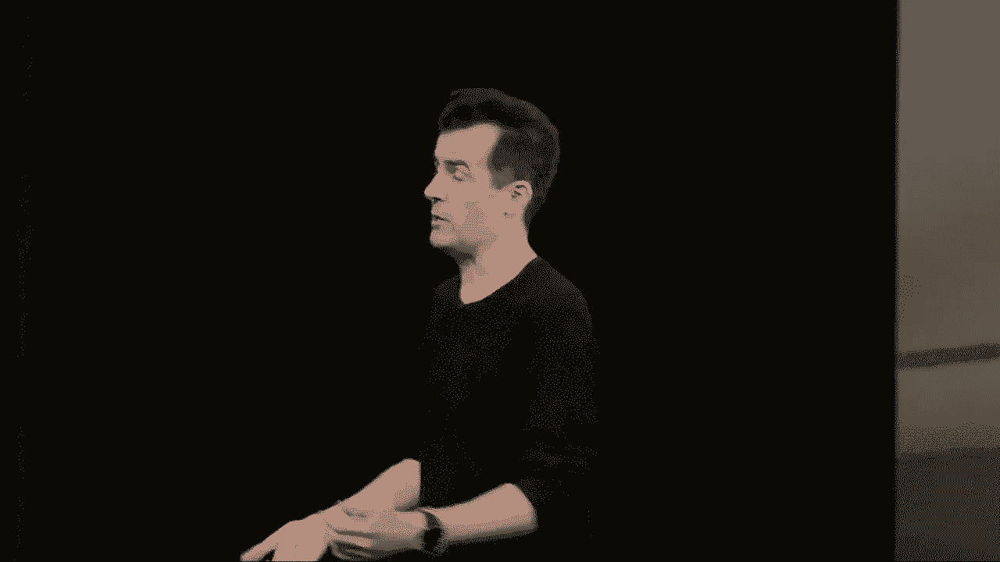

divided by three both apparently，zero followed by zero six zeroes after。the decimal point and even four，thirds gives me 1。00000，instead of 1。33333。because with and they don't like，recognize like decimals so，like so fourth four thirds question。three only goes into four one，use like，a double，if you want like the actual decimal yeah。

exactly this one's more subtle than the，mistakes i've made before but。c like most programming languages is，going to take you literally。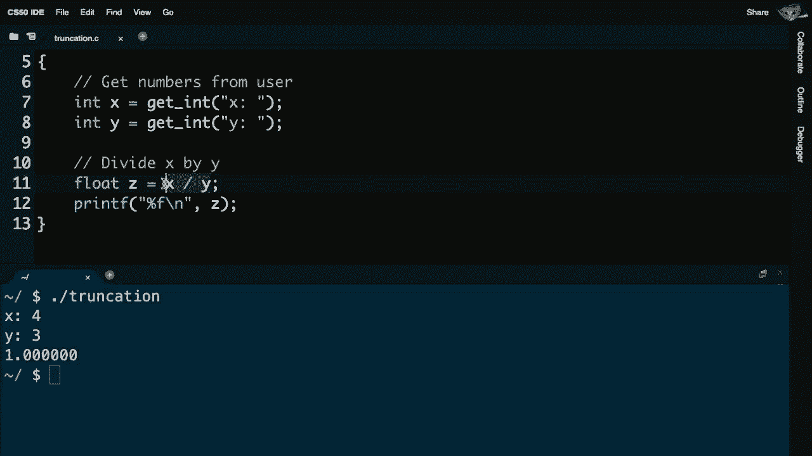

so if on the right hand side of this，expression on line 11。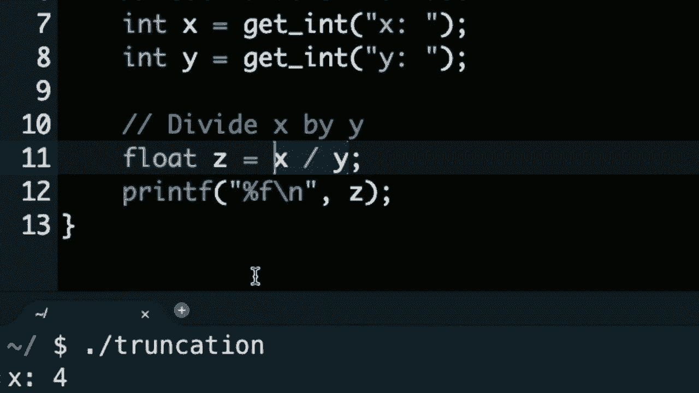

i am literally doing x divided by y，you first have to ask yourself well what，is the type of x，ants。going to get back，an integer as your answer so if you do 1，divided by 2，yes mathematically that's 0。5，an，works，is it truncates everything after the，correctly，but because you cannot fit floating，points。and numbers thereafter in an integer you，get you lose，all of those digits after the decimal。

point because you can only fit，integer，it's not relevant that i'm saving the，that's too late。the math has already been done on the，right hand side and so yes i'm storing。an integer in a float so i can print it，as a float but it's too late everything，thrown。away so what are the implications of，this or how could i fix well。

i could go through and just change all，of this right like well if the problem。is that x and y are ints well let me，just change them to floats and change，this up here，and so forth。that would fix the problem but that's，kind of a heavy-handed solution to this，your code。you can instead be a little more clever，and you can convince，float。

by something known as casting so i can，actually go in here，and using a new syntax i can say float y。and i can even for good measure but it's，not strictly necessary also do it to x。you can and c cast or type，cast one data type to another by，literally in parentheses just putting。the new data type that you want，and if it makes mathematical sense for，one to be converted。

into the other the computer will do it，for you so in this way。i'm telling the computer convert x to a，float convert，y to a float then do the math and so。before when i typed in 1，and 2 respectively for x and y now it's，kind of like i typed in 1。0，and 2。0 and 1。0 divided by 2。0，is going to be mathematically 0。5，but because x and y now were converted。

in advanced to floats，the answer is going to remain a float，0。5。and that's what's going to get stored in，z and ultimately printed。so if i rerun truncation having now，fixed this problem，let me do dot slash truncation type in 1。type in 2。i don't have to type the，point 0 myself the computer is doing，that for me but via these。

casts in parentheses now i see that the，answer is indeed。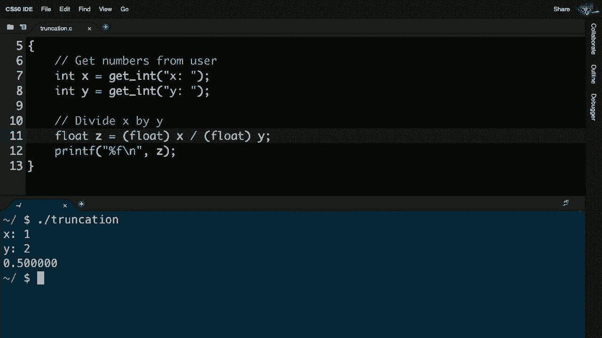

0。5 all right，so we seem to have now some very basic，low-level control。over what you can do with the program，let's now add back all of the fancy。features that we had from scratch last，week so we can start making。more interesting programs so variables，sugar，is also amongst these features here so。

recall from last week，when we wanted to have a variable called，counter set equal to zero。we can go ah**d and define it like this，in c starting today，we're going to instead say something。like counter equals zero，but we additionally need to specify the，data type of that variable。and we need to end our thought with a，semicolon so whereas we said set counter。

to zero like this last week，now it's going to translate quite simply，to this on the right hand side。well what comes after that well if we，wanted to increment a counter variable，last week by one。adding one to it we used quite simply，this puzzle piece this week we need to，be a little more。explicit and say something like this，counter equals counter plus one。

and semicolon to finish the thought now，this might seem very，counter，doesn't。work logically but that's not the equal，sign in this case，in c as with other languages we'll。encounter the equal sign is the，assignment operator from right，plus 1，the left，result。in counter thereafter effectively，increasing its total by one，now this is a very common operation in。

programs we'll see over the term where，you just want to add something up。because you want to keep track，of the count of something so it turns，out there's some syntactic。sugar which means there's a different，way of doing this syntactically，that doesn't give you any new。capabilities that you didn't already，have in c，it just makes it marginally more。

pleasant or quicker to type，so this line of code in c is identical，to saying this，one。semicolon means take the variable on the，left and just add one to it。and it's slightly more succinct and it，just makes your code a little more，readable because it's just。fewer things for us humans to have to，further，additional syntactic sugar exists。

whereby you don't even need to type this，you can instead just do counter plus。plus counter plus plus is the shortest，hand notation in c，for just adding one to a variable。all right besides variables what else do，we have in our toolkit as of last week，week。the notion of course of conditions a，condition was like a fork in the road。

that could allow you to do this thing，altogether，in scratch for instance if we wanted。last week to compare two variables，x and y for inequality is x less than y。and if so say x is less than y how can，we translate this to c，well the syntax is going to be quite。simply this a little new，some new stuff some more parentheses，some more curly braces。

but it kind of visually looks the same，albeit in text form，i literally say if a space then in。expression，recall those from last week x less than，y is my boolean expression。then notice i use an open curly brace，just leaving a blank，like i might have。last week and in fact let's put the，equivalent line of code here。

print out using printf x is less than y，backslash n so we've already done that，translation before。say is just like printf just like if now，is like if，strictly speaking especially if you've。programmed before you do not need，these two curly braces if you only have，one line of code。inside of the condition however，stylistically for cs50，and for style 50 sake always include。

these curly braces nonetheless，and on their own lines all right what，can do if。else and we can go either one way in the，fork or the other way。in the fork in c the corresponding code，is going to look like this so it's，almost the same as before。i've just added else and then another，curly brace and a closed curly brace。

and let me just add in the printfs and，you can see that in c this is really，version of。what was very graphical last week but，the idea is the same you just got to。start to recognize where the parentheses，go where the curly braces go the，semicolons and all that。sort of visual stuff all right let's，make one more，scratch and uh comparison here was one。

where i said if x is less than y，say x is less than y else if x is，greater than y，y，scratch and c。diverge because scratch is meant to be，very user friendly and not require long。explanations of assignment operators，for，assignment c uses the equals on，uh no sorry rewind mit，c。uses the equal sign for assignment from，left to right but this means equality，difference here。

everything is a line-by-line translation，although we can put elsif on the same。line and else if on the same line，except here's kind of a stupid work。around right in some sense humans，point，we've already used the equal sign for。assignment what do we use now for，equality，well mit ignored that problem and just。

used a single equal sign for equality，computer scientists inventing c and，subsequent languages。when comparing two values on the left，and right for equality，use two equal signs just because one。left，two equal signs is equality comparisons，are these two values equal。but you know what this is not，necessarily well designed，it is correct logically both my scratch。

code and my c code is correct，but can anyone make an observation as to，why。the code is not necessarily well，designed i'm doing，a little more work than i need to i。could tighten this code up a little bit，i could type slightly fewer characters。and accomplish the same，correct decision making，is not，perfectly designed uh great。

yes so you used elsif，two times you could have used else in，the end。without the condition really good，observation i'm using elsif twice which。logically is fine this code is correct，questions，but consider this if x is less than y is，the road。else if x greater than y is the second，what's the only other possibility。

logically in the world of math，equal to，there's no reason to belabor the point。and ask that third question，explicitly let's simplify the code and，marginally better design it as。propose。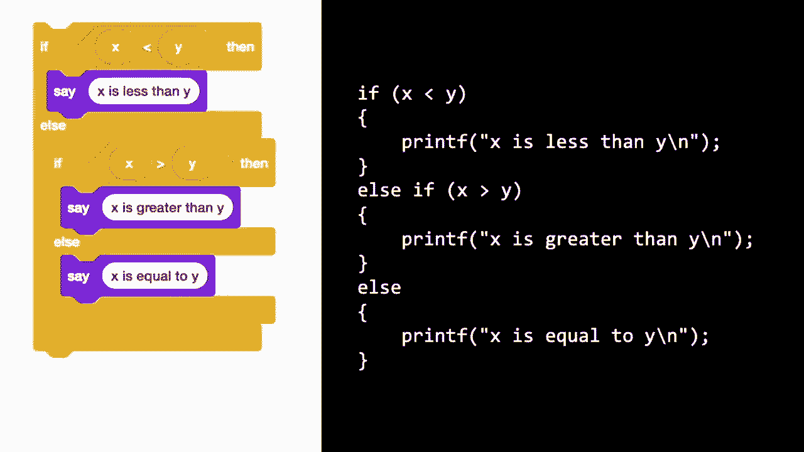

which isn't that much cleaner isn't that，much shorter but it does avoid asking an。additional question so instead，of maybe three questions being asked now。there's only two and frankly if you're，writing a lot of code or doing this，again and again and again。that kind of difference might very well，add up and indeed give us，the ability to。

use these conditions let's actually try，converting this into a program let me go，in advance。let me go ah**d and copy a file that i，came with today，called conditions。c and this is one of。the files available on the course's，website let me just open this if only，because it's kind of an。uh literal translation translation of，the scratch code to see，top here。

i've and now let me show you what i've，actually done over here。so i've opened up a file that i wrote in，advance called conditions。c。and i have at the top of the file my two，includes as usual，and then down here i have pretty much。what we just saw on the slide plus，two calls or uses of get ins。

and then i'm just asking this question，down here if x less than y。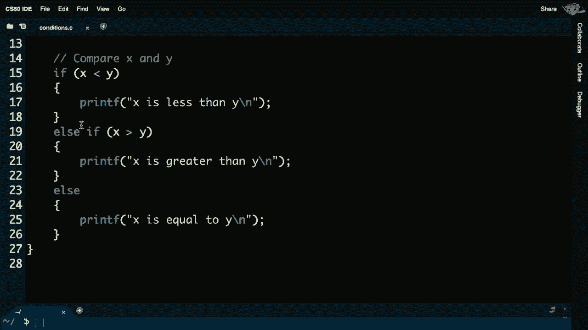

else if x greater than y else go ah**d，and do the following，the scratch。translation let me go ah**d and make，conditions which again conditions。c is，the name of the file。no apparent mistakes so let me go ah**d，and run dot slash conditions。enter and x will be 1 y is 2 and indeed，x is less than y if i go ah**d and run。

this this time for instance with，how about 10 and 5 x is greater than y。and then lastly if i go ah**d and run，this with 4 and 4。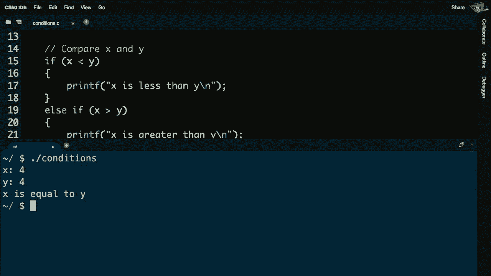

x is equal to y so i now have a c，program that is actually adding，conditions for me。which is uh adding conditions for me，make，decisions and print out one thing，potentially。or the other but let me do something，slightly fancier，let me go ah**d and open up another pro。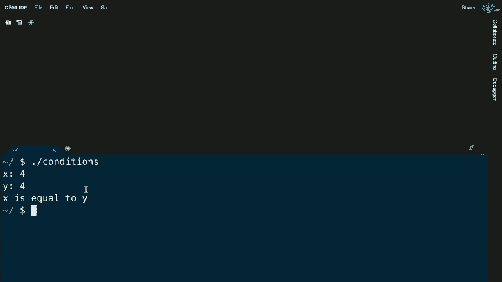

scratch，suppose i want to write a program called，agree。c，that simulates the idea of like these。when signing into，when using a piece of software for the，first time or the like or even when i。deleted a file before i had to type in，yes or why，in order to proceed let me go ah**d and。include cs50。h at the top，let me go ah**d and include standardio。h。

at the top and then my int main void，which is copy paste from before。and now let me do this let me go ah**d，and get not an int from the user and not。even a word let's keep it simple and，just ask the user for，y or n for yes or no let me go ah**d and。give myself a char，and i'll call it c but i could call it，anything like answer。

but c seems reasonable if i only have，function，getchar and let me just ask do you agree。question mark and then let me go ah**d，and compare this so if c，equals y then。let me go ah**d and print out agreed，backslash n，else if c equals n，instance。not agreed now unfortunately i've made a，couple of mistakes here that one at。

least one of which might be a little，more obvious than the other，might have introduced。anyone at all yeah how about uh olivia，the，for the boolean you did you used a。single equal sign instead of the double，for both good so i use the single equal，that。and this is because c，data types，all this time i've been using double。

quotes for strings but it turns out，in c you have to use single quotes when。you're comparing individual characters，so i'm going to go in here。and change only the quotes around why，and n to be single quotes why。because i'm now dealing with the world，of chars chars are，when you are。

talking about characters you need to，quote them literally like this。the variable name c doesn't need to be，quoted but y and n do need to be quoted。but i don't need to change any of my，other quotes in the file。because those are still strings of text，that is actual phrases or。

sentences so let me go ah**d and try，running make agree，it compiles okay let me go ah**d and run。dot slash agree，do i agree let me go ah**d and type in y，agreed i like that so let me try。n no not agreed oh and i left off，a backslash n so let me fix that real，quick just for consistency。let me recompile my program and pretend，that never happened but let me very，reasonably now do this。

dot slash agree i want to agree and yes，capital y，huh nothing happened what about n，capital n。nothing happened but the program still，works if i do lower case it works。and if i do lower case there it works so，what's going on well again the computer。is only going to take you literally and，even though we humans might be oh it's。

fine it's uppercase or a lowercase，ask，two questions as follows we could do，something like else if c。equals equals capital y in single quotes，you could imagine again saying agreed，like this。but just like last week when i started，copying and pasting scratch blocks like。that's probably not very good design，similarly this block of code lines 11。

through 14 is almost identical，one of them，and let's see if we can't combine these。thoughts let me express if c，equals equals y or c equals equals，capital y。and indeed you can use this vertical bar，operator，which is the logical or operator and，actually say。two questions at once it turns out you，can do this with the notion of and。

a logical and by using ampersand，ampersand more on those another time。but two vertical bars is the equivalent，of just saying if this。on the left or this on the right and now，if i save and recompile。the program with make agree and do dot，slash agree，you'll see that i can type in y in，lowercase。

or y in uppercase and now it works，so again it would have been correct to，if but again。not necessary because i can combine，these thoughts and make my program。better designed and notice too all this，time i've been very，religiously indenting every time i'm。inside of curly braces，indenting every time i have an if，condition or an elf。

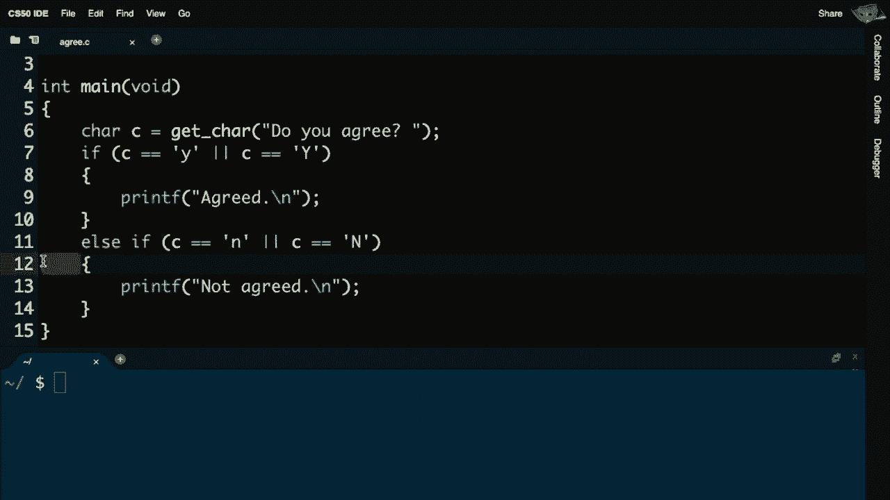

style，aesthetics as well all right well now，let's consider，that we have the ability not only to。express conditions but how about also，these things called loops well turns out。in scratch we had very straightforward，loops do the following forever。c is a little clunkier there's no，forever keyword in c，but we can mimic this idea as follows，c。

is actually to say while which kind of，has the right semantics in english like。while something is the case do this，but you have to be even more explicit，you can't just say while。out in c that，while similar to a condition is，constantly asking a question to decide。whether or not to continue very similar，again to a condition with its own，boolean expression。

so with while in c you have to have，parentheses after the word while。and you have to ask a question in those，like，like，but this is a bit of a corner case in。the sense that if you want to do，something forever who cares what the。question is you just want the answer，always to be yes or in computer terms。

always to be true and the most blunt way，to express，word true。so even though this looks a little weird，this in c is how you deliberately induce。what we'll call an infinite loop that，never stops，true，you don't even have to ask a more。complicated question you could put a，the like，but if you just want something to happen。

forever this is the most canonical way，to express something forever well what。if you want to do something，finitely many times well we can do that，in c as well。using what's going to be called a for，loop uh or a，while loop well let's consider both of。these uh in turn，the most like，mechanical manual way i can think of is。

like just count on my fingers right like，somehow or 10，minimally on my or maximally on my hands。so how can i do something finitely many，times in c，well i have at my disposal variable so，counter。initialize it to zero semicolon and the，data type will be int because i just。need to count much like on my fingers，but you know what counter is a little。

verbose programmers whenever they're，counting frequently，just counting up from zero on up they'll。often just use i，string，you don't want to do that always in your，code it's sometimes better for your。variables to be more descriptively named，but for a stupid variable that's just。going to count from 0 on up let's just，keep it simple and call it i，i have to ask。

a question because i don't want this，running forever i want it running 50。times what question could i ask，well why don't i just check well i is，less than 50。so it's like counting up on 50 fingers，through，than 50，do the following what do i want to do i。want to keep printing out hello world，hello world hello world，iteration。

of this loop on every cycle of this loop，i need to do one more thing。mathematically i need to add another，finger add another finger。or in other words i need to add one to i，so let me go ah**d and set i。equal to whatever it is now plus one but，again we have some syntactic sugar just，tighter。

i could do i plus equals one or even，more succinctly，i plus plus so even though this is way。more annoying to implement than in，you want，in c we have all of the building blocks。now with variables，notion，of repeating some finite number of times。but there's another way to do this，and as you might have discovered with。

problems at zero there's different ways，to achieve the same，do this。i could just start counting at one and，count up through，50。so there's no greater than or equal。sign key on your keyboard most likely or，less than or equal to so in c。as with other languages you just use two，characters you do less than sign。

followed by the equal sign and that，expresses less than or equal to。so this is also correct if i start，counting at one i need to count，through 50。you can do this don't do，this this is unconventional，and like programmers will conventionally。per last week when we started always，bulbs off，they'll instead start at zero and count，up 250。

which gives you 0 through 49 implicitly，so do this，not that but this does speak to the fact。that you can solve problems in so many，different ways there's another way，counting，being。we have to do i minus minus instead of i，plus plus so again that's three。different ways to solve the same problem，and again you'll start to have the right。

instincts and muscle memory and you'll，also start to see，common patterns in lecture code your tf。or teaching assistance code，books and references online there just，tend to be the ways to do things。all right，one more approach to loops here it turns，out there's another loop construct。that's a little more cryptic and it's，called a for loop，and it allows you to automate or rather。

a little more，concisely so for printf，hello world is going to get us one step。closer to printing hello world 50 times，but the for statement just like the。while statement comes with necessary，parentheses after it，but this time you can put more stuff in。the parentheses it's not just a boolean，expression，first the first thing in the parentheses。

is you can initialize，any variable you want to some value i，might say in counter equals zero or more。succinctly int，i equals zero semicolon but the way the，for loop looks it's a little funky you。can do multiple things on one line，the second thing inside of the，parentheses to a for loop。is a condition that you want to check，thing，in the parentheses of a for loop is an。

update or an incrementation or，decrementation，or rather，let's just do i plus equals one or even。more succinctly，i plus plus this is perhaps the most，conventional way。in c and in other programming languages，to do something，50 times or a finite number of times。it's different looking from the things，we've seen thus far there's semicolons，in weirder places。

there's more stuff in parentheses so，overall。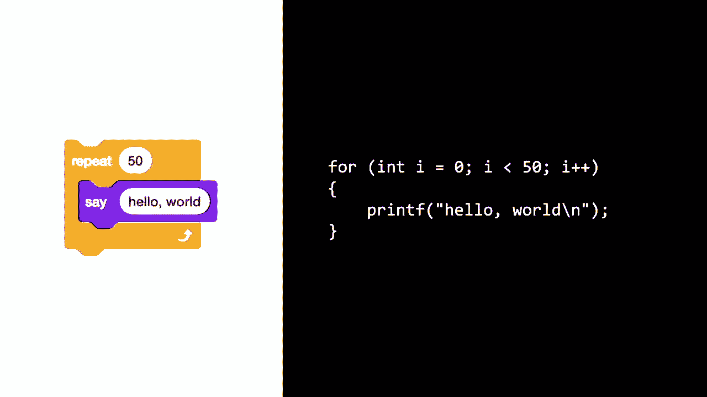

but for now just realize this says，initialize i to zero，check the condition and if i is less。than 50 print hello world，then update i then check the condition，then，then。if it's less than print hello world so，the initialization of the variable，happens once。everything else happens again and again，and again until you've done this。

some 50 times all right so with those，building blocks that's kind of it for。our translation of scratch into c，let's now start to build up some more。interesting programs and practice for，instance abstraction，so abstraction recall was this。problem-solving principle，whereby you can simplify otherwise more，complicated。

details an abstraction is a，simplification on top of，more complicated details or，might say。so for instance let me go ah**d and，write a program here called meow。similar to last week but this time in c，and in order to，make a cat meow textually let me give。myself standard io。h at the top，in int main void down here，again i'm in a file called meow。c and。

i've included standardio。h，and int main void and now i'm going to。go ah**d and just do something like this，printf quote unquote meow backslash n，three times。let me save that file make meow，all right now dot slash meow and meow。meow meow all in text so not nearly as，last week，but it's it's correct but it's not very。

well designed，right because i'm repeating myself i，are bad，instincts but now we have the ability to。do things with loops，so let me actually delete this part of，the function and let me try to remember。from the example before if i want to do，something three times i could use a，lines of code。let me do this int i equals zero i，less than three i plus plus。

so cryptic but this again is sort of the，de facto way。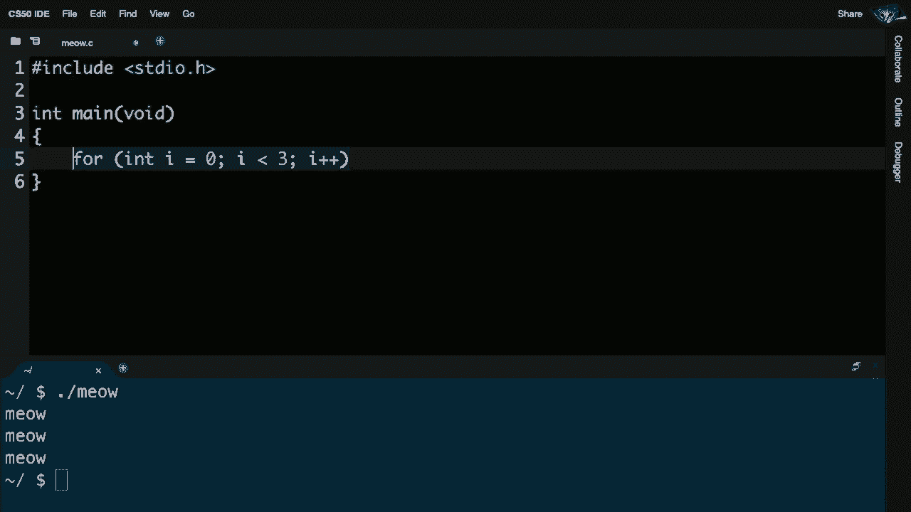

of doing something a finite number of，times initialize some variable，keep。incrementing your variable again and，again so that it executes a total of，that many times。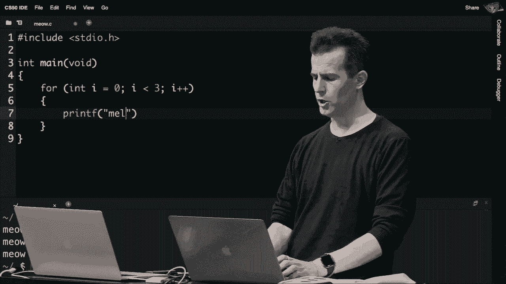

melo，recompile，meow by make meow let me do dot slash，meow and voila。now the program is arguably better，designed but let me take this one step。further recall that the trajectory last，week was to not only implement meow。more uh with better design without，repeating yourself thereby using a loop。

but remember we introduced the，abstraction that was a custom puzzle，piece called meow，make our own。functions as well and the syntax is，going to take a little getting used to。but let me go ah**d and do this let me，get rid of my printf here。and at the bottom of my file actually at，the top of my file，void，meow void which is very cryptic for。

today but again this is fine to be，boilerplate copy pasted for now。let me go ah**d and just print f meow，here even though we haven't explained。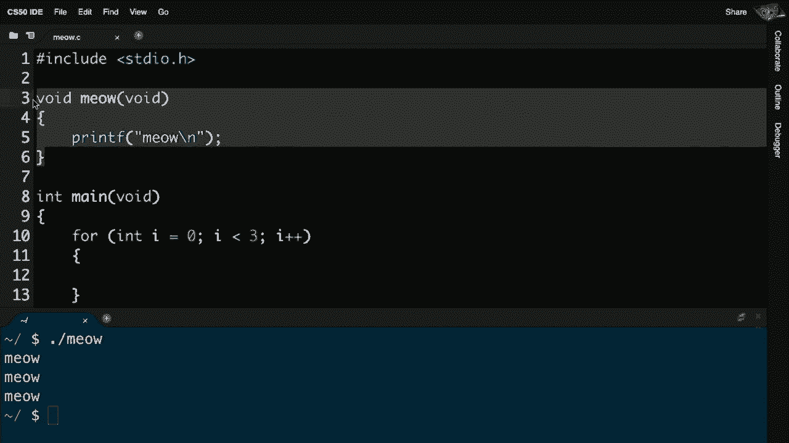

and won't explain today，what this keyword void means what i've，done in lines three through six is。create my own custom function，c does not come with a function called。meow cs50 is library does not come with，a function called meow，but now thanks to me there exists a。in life，is just to print out meow but what's。

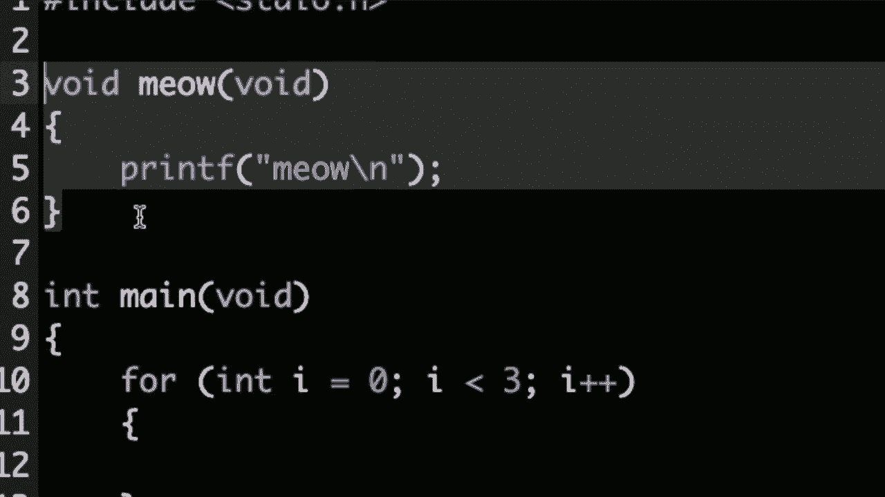

cool about this now，is that down here just like with scratch，last week i can now。call a function called meow and my，rather，says what it does by just by way of the，function's name。and let me go ah**d now and compile this，make meow，so far so good dot slash meow and it。seems to work okay，but i don't love the fact that i've，implemented meow at the top of the file。

it's not a big deal，functions，at the bottom of the file why only，a teaching fellow。wants to understand your code from top，to bottom it's just human convention to，put the main program。the main function rather at the top of，your file，the problem is when i do this i'm going。to have created a problem for myself，when i run make meow，now darn it two errors generated。

and so there's a couple of bugs to be，solved but first brian，a question from the group there was a。question that came in from the chat，about，why it is that on like line five for。example right here you don't have a，semicolon at the end of the for loop and。on line 11 you don't have a semicolon at，the end of the function name。

so why do some lines need semicolons at，the end of them but other lines don't。really good question why do some of，these lines not have semicolons but，others do。the short answer not to be glib is，honestly just because，the way the language was designed was。that you should generally，finish your thoughts when expressing，verbs or actions or functions。

with semicolons and we've seen that，after printf for instance we've just，seen that after meow。however when you're using other，programming constructs like，loops or like custom functions you don't。have semicolons there，why some humans years ago just decided，that we don't need semicolons in those。places and this is one of those things，that it will take a while to develop the。

muscle memory and the，sort of mental model for recognizing，where those things go and don't。but thus far the only places we've seen，semicolons are at the ends of functions。like meow and printf here and now，parentheses，problem said，one and the first lab and so forth。you'll often want to refer back to，examples like these and the slides and。

the references in your section，so that you can wrap your mind around，these patterns。so let me go ah**d now and solve the two，problems i seem to have created here。it's a little non-obvious but it's，reminiscent of what we've seen before。implicit declaration of function meow is，invalid in c99，c，the language we're using but it's just。

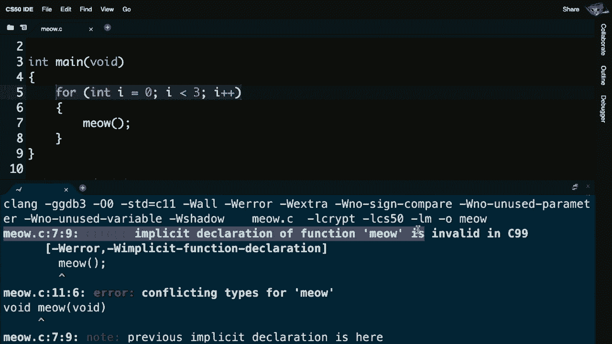

getting confused，c is right now well why is that well let，me scroll up here。and let me make the point that frankly c，and in turn my compiler。they're not that bright like they're，explicitly，and the problem at the moment is that。when the compiler reads my code from，top to bottom left to right it is not，until line。

11 that the meow function even exists，moment，frankly，just doesn't know what meow is because。it hasn't gotten to meow later and the，compiler is not smart enough。or not user friendly enough to read，everything first and then decide if。there's a problem it's only going to，read it once through top to bottom。

and it's going to yell at you the moment，it encounters the problem so the。solution to this is quite simply，move the function to the top of your。file but again that just gets annoying，eventually because then you have to go。fishing for your main function which，file，or there's another way and we'll explain。

this in due time too but you can also，copy the very first line only of your，custom function，main。and then to brian's question and that，with a semicolon so this is weird。this is what's generally known as a，prototype which is a hint，only it's sort of a clever way of。telling the compiler，there will exist a function called meow，but just not yet。

but know that it will and it's just kind，of a work around a common work around。for that particular problem all right so，let me go ah**d and make one more change。one more change here，suppose that i want to really finish off。this meowing example just like we did in，scratch whereby we，also allow meow to take some number。

of meows as input so i don't want to，function。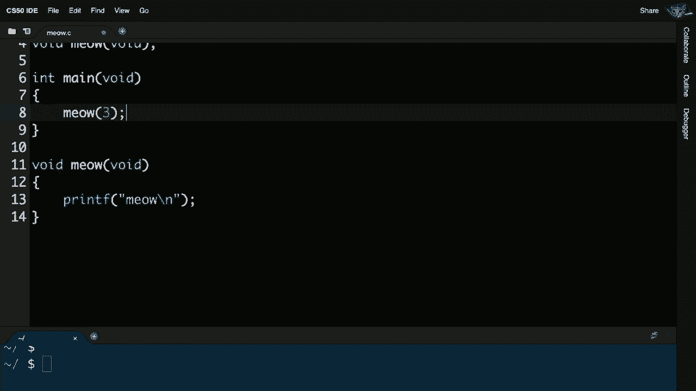

meow，3 inside of my main function 3 there by，being the input to the meow function。i now need to change my custom function。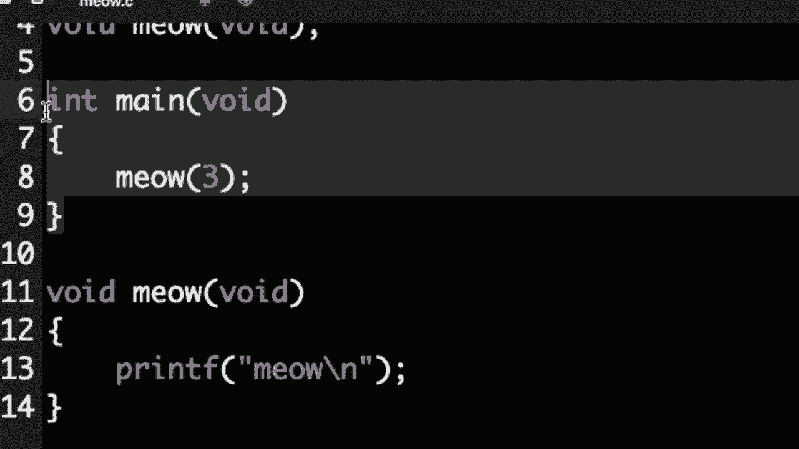

just like i did last week，as follows it turns out and more on this，in the weeks to come，11。this function，long story short my custom meow function，today has no。return value it doesn't output anything，per se it instead only has a side effect。of printing visually on the screen but，it does have an input，input or。

arguments you can literally do something，like the name of the type you want。and the name of the variable that you，want so suppose i want meow to take as。input some number we'll call it n，and i want to use that number in a loop。i could then do something like this，for int i gets 0 i is less than，printf。

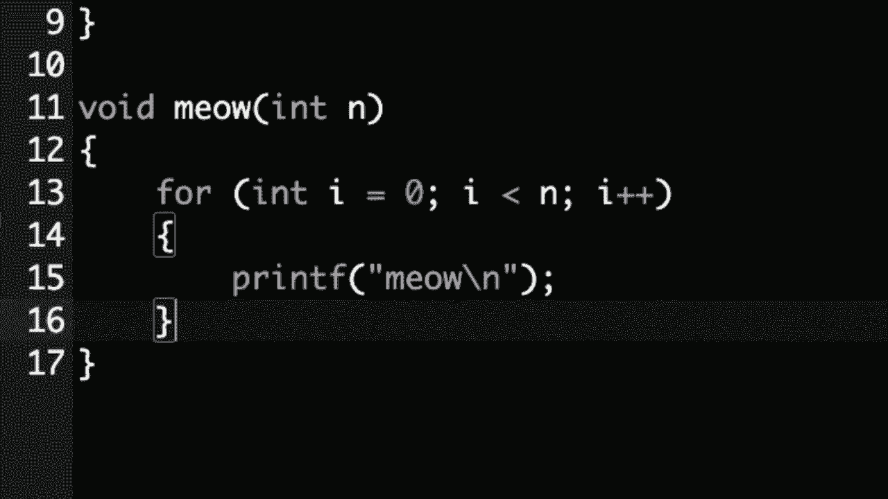

with curly braces and now notice just，like last week with my final，implementation of now。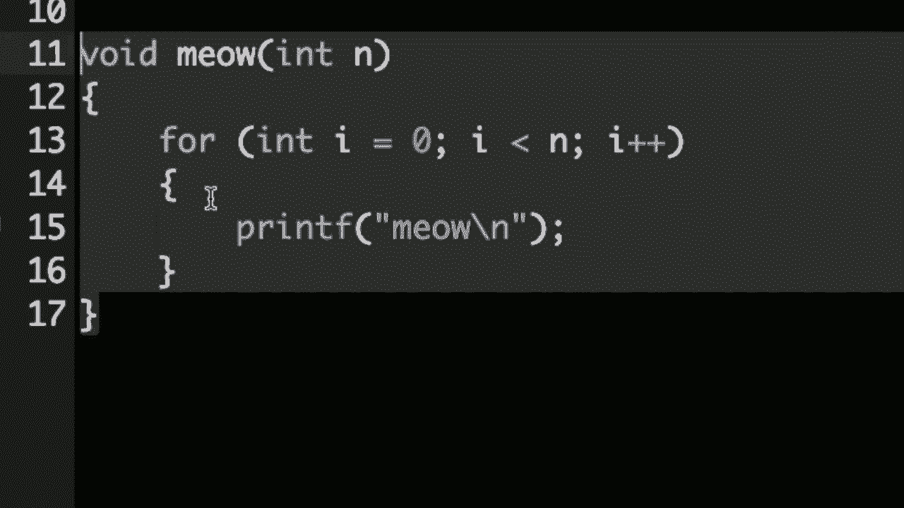

my custom function can take input as，denoted by the parentheses。it doesn't have output per se that's why，i'm leaving void here but again we'll，explain void more。in detail down the road but now i'm，using that input，this is a new。implementation in c i'm using the same，building blocks i'm using a for loop。

i've like before but instead of hard，coding three or 50 like i did earlier。now i'm actually going to go ah**d and，just plug in that variable。just like scratch allowed me to do as，well，what if i want to do something even。fancier you know what let me go ah**d，and do this suppose that we want to get，input from the user。

but we really want them to provide a，specific type of input，let me go ah**d and introduce one other。type of loop and this one i'm going to，go ah**d and grab for my archives the，code that i brought。with me today and i'm going to go ah**d，and copy over a file。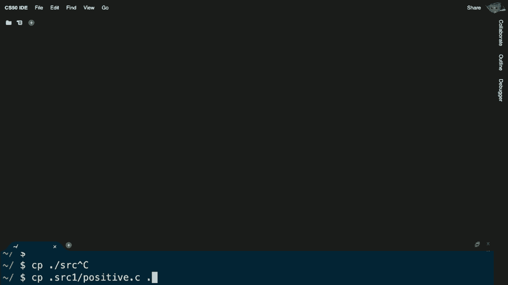

called positive。c which is going to，value，so this too is on the course's website。let me just walk us through code that i，already wrote，here at the top of my file i'm including。some now familiar header files，and down here i'm including a prototype，that is a hint。for a function that's going to be called，quite simply get positive int。

so this is a function that's only going，to get a positive integer then in my，main function。notice i'm going to use this i'm going，to get a variable called i，on line 10 and i'm going to get a。positive in from the user，and then i'm just going to print it out，but what's interesting now is。i have this additional abstraction the，cs50 library does not come with a。

function called getpositiveint，but it does come with a function called。getint and notice what i've done down，here between lines 15 and 24。down here i've declared a function，called getpositiveint，and notice that's my own custom function。name it doesn't take any inputs it just，gets a positive integer from the human，but now notice。

it does have a return value previously i，used the word void to say the absence of。input or the absence of output here i'm，using it still to say。no inputs it just always gets a positive，end but i'm saying，int on the left hand side of this custom。does have，output what is the output going to be，well notice here on line。

17 i give myself a variable and i call，it n then i have one final new feature，of c today this loop。which is called not a while loop but a，do while loop，while loop，first。before checking a condition so notice，here i'm going to do the following。call getint with this prompt positive，integer and then store the return value。

into the variable called n then down，here notice i'm saying，while n less than one so this is kind of。a weird syntax，but if mathematically i want the user to，give me a positive integer。that's technically the same thing as，wanting the user to give me an integer。and just make sure that it is not，less than one because if it's less than。

one it's zero or negative one or，negative two that's obviously not a，this in code。the only new thing at the moment now is，the fact that there exists this thing，do while，and then。check a condition a while loop checks，the condition first，and then does something instead this is。what i want in this case though i want，to do this，get a positive get an integer from the，integer。

then while n is less than one，so if the human typed in zero or，wanna do。the same thing again and again and again，so it reads rather grammatically。do the following while n is less than，one，and then lastly and the only other new，line here is return。n this is the way that a program can，actually return，some value to you it can hand you back a。

value not by printing it on the screen，not by saying it audibly or visually，from a cat's mouth。it returns it in the sense that what's，being returned here is n，which is an integer that matches the。output of this function，why is this useful well let's scroll，back up let's now take for granted。that the get positive in function exists，and now notice，how we can use it in main i call get。

positive int on the right，type integer，i'm storing that return value on the。left in this variable called i，and then i'm printing out i and just，scratch。now that i have implemented get positive，in it's sort of out of sight out of mind。i know that it can be done and i can，abstract away，just，weird thing。

i do want to point out about these，implementation details，why did i declare n out here。every other time i've created a variable，i've done this，does anyone want to conjecture why。this approach where i declare n on line，27 to be an int，would actually not work correctly。why might this not be correct this is，subtle，and if you have programmed before you。

might have the instincts for this or，if you haven't perhaps just a bit of。why might this not work as is，abigail why does this not work are we，um。i'm not certain i think we've already，assigned that，it is an integer a good good thinking。not the correct answer in this case，it's not going to work for a more subtle，reason here。

and that actually in some sense has to，do with these curly braces it turns out。we've been getting lucky this whole time，and any time i've declared variables。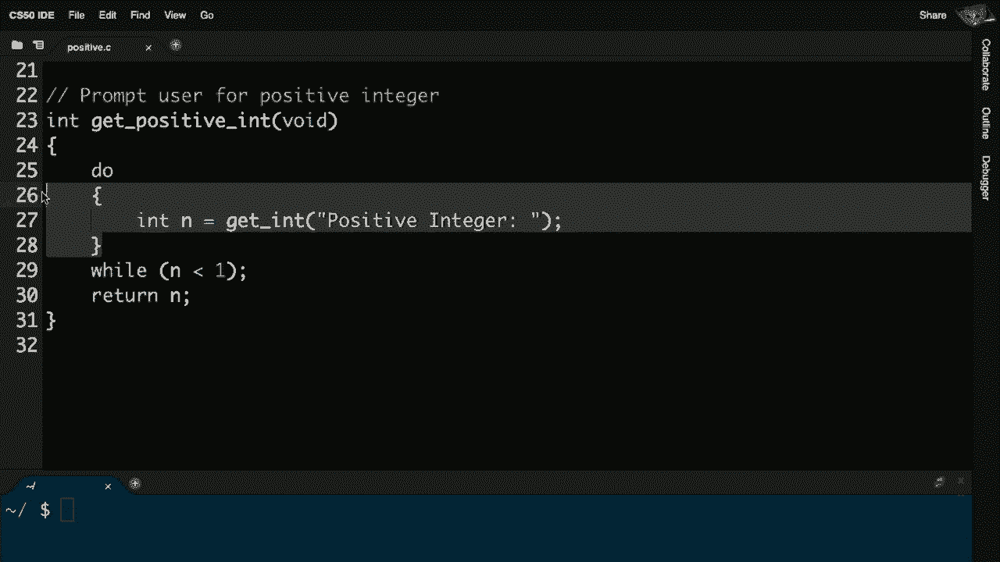

they've technically been in between，curly braces the curly braces belonging，to the main function。or my other functions that i've written，thus far，but in this case the problem is when you。declare a variable，inside of curly braces you run into what。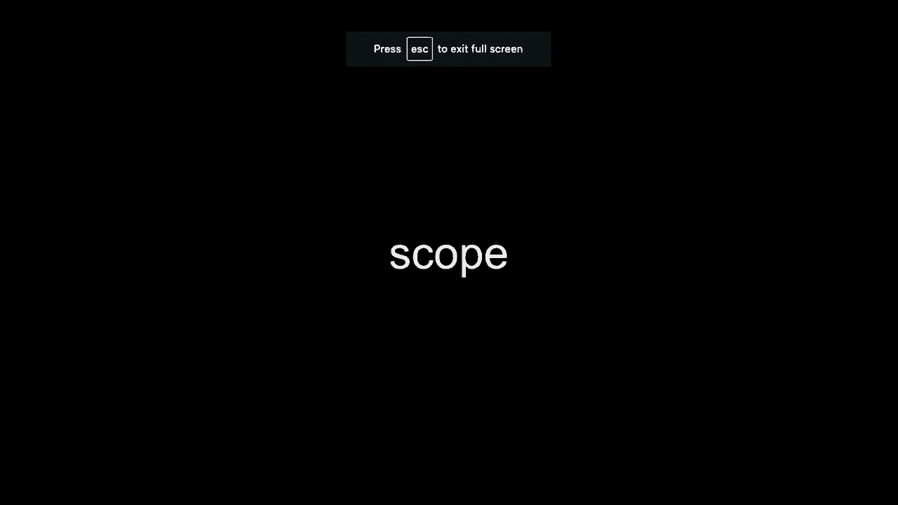

we'll call an issue of scope，the scope of a variable is the lines of，code in which it exists。the scope of a variable are the lines of，code where you can use，today。is that if you declare a variable inside，of curly braces like those here on line。26 and 28 which you must do，for a do while loop that variable n only。

exists inside of those curly braces，against，one in line 29 which means you cannot，return it。in line 30 it just no longer exists so，you're doing all of this work getting，the variable n and then。boom it's gone once you exit，top to bottom these curly braces so the，work around for that。stupid though it is frankly is that you，can declare an initially on its own line，25。

you don't need to assign it a value even，because you're going to assign it a，value eventually。but again to create a variable as i keep，saying is to declare a variable。you don't need to define it as having a，value necessarily，right away so this is a way to work。around what's otherwise known as，an issue of scope all right with all of。

speak，let me go ah**d and propose that we。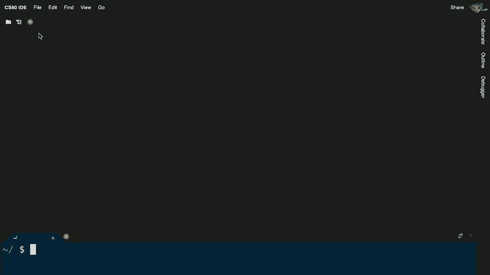

solve something a little more graphical，so you'll recall of course。super mario brothers is we uh one of the，first problem sets that we alluded to。last week and within this game there's a，whole bunch of visuals。for instance there's this visual early，the sky，and these question marks if you jump up。

and underneath them give you coins for，that and let me ask，well how could i write a program in c。that just prints out for question marks，well let me go ah**d and do this let me。go ah**d and write a program called，mario。c，let me go ah**d and include uh，standardio。h。in a file called mario。c give myself a，main function in main void i'm going to，keep this simple。

printf1234 backslash n semicolon this is，not nearly as cool or pretty as the。old school game but if i run make mario，and then do dot slash mario voila i get，a very。uh poor approximation of these，or，really what is called ascii art but i。can do a little better than that，recall that now we have the ability to，use loop so i could say for。

int i gets 0 i is less than 4，out，one question mark at a time and then at，out a new line。just to move the cursor at the very last，moment i don't want to do that。every question mark because then it，at the end，now，same exact result but a little better in。the sense that it，is um now uh more dynam，now it's uh using a loop instead of a，hard-coded value。

but let me be a little more clever now，and let me do this instead。let me borrow the logic of that positive，integer example and do something like，called。n for a number and let me do the，following just like before，let me get an integer from the user and。ask the user for the width，of the bricks that i want to print so，it's not always four maybe it's a。

variable number，and then let me go ah**d and do this，while n is less than one so identical。to my logic before and then you know，what once i have a value of。n so let me go ah**d up here and give，myself a comment，get positive integer from user that。rather says what all of these lines of，single line，you can comment every few if it makes。

logical sense to do so，let me go ah**d now and print out that，many，int。i gets 0 i is less than n this time i，plus plus and now i can print out a。single question mark without a new line，and then at the very end of my program i。can print out a single new line，semicolon let me go ah**d now and。

increase the size of my terminal window，let me do make mario and now oh，get int。here's where help50 might be my friend，so let me go ah**d and run help50 make，mario。it's going to ask for help ah you seem，to have an error in mario。c。on line 9 by implicit declaration of，function getint clang means which is the，next week。

means that it doesn't recognize getint，did you forget to include cs50。h。in which inkgetint is declared i type，this，so include cs50。h，save the file recompile with make mario。and now let me go ah**d and may and do，dot slash mario，and i'll give myself a width of four。it's the same let me give myself，a width of 40。 now i get that dynamism。

let me give myself a width of 50，and so forth so now we have a program，that's much more dynamic。but you know what let's go ah**d and，enhance this a little further。later on in super mario brothers there's，like a lot of this underworld here where。you see these grids of bricks and let me，draw our attention to this。

this looks like multiple bricks both，horizontally and，vertically so there's like a width and a。height so how can i go about printing，out maybe maybe that's three by three。three bricks across by three bricks down，let me actually go into my program here。and get rid of all the question mark，stuff from before，and consider how i could print out a。

three by three grid well，my code，then maybe，three more whoops maybe three more and，then three more。but of course this copy paste is not，going to fly long term but that's fine。let me do make mario dot slash mario，all right i kinda sort of have a grid。that looks like this thing here it's not，exactly but at least it's the right idea。

but this is not necessarily the best way，to do this i really want to go，turns out。using c we can actually express that，as well let me go ah**d and do this let。me go ah**d and print out for instance，the following let me go ah**d and print，out not just。hash again and again and again let me go，ahead and do this，for int。

i gets 0 i less than 3 i plus plus，i don't know what i'm about to do yet，times。what do i want to do three times well i，want three rows and on every row i want。three hashes so you know what you can do，you can nest loops let me do four int j，gets zero。j is less than three and j plus plus i，don't know what i'm going to do yet but。

i do know i'm going to do this，three times and you can perhaps see。where this is going three things three，bricks，so long as inside of this inner loop。so to speak this nested loop i print one，of those hashes，new line。over here so to be clear even if it's，on，we already know that this is the type of，syntax you use。

for doing something finitely many times，three this is the same syntax but i'm。using a different variable name so i can，keep track of two different values。essentially rows and columns，and then i'm just printing a single，brick each time but after i'm done。printing a whole row，new line，so let me try this let me go ah**d and，do make mario on my code。

dot slash mario and voila now i'm using，a nested loop to print out bricks like。this and i can change this if i want to，do a 10 by 10，all i have to do is change that in one。place or if i really wanted to be fancy，i could go use get int again。i could get the width and the height，from the user and do it completely。

dynamically but now if i do 10 by 10，for instance i can at least see an even。bigger grid so if you wonder how things，like super mario bros or frankly any，game nowadays on a pc。or console or phone or made it's with，this kind of generation of maps maybe。back in the day they were hard-coded，maybe they were generated，using code you can absolutely imagine。

like that，so that ultimately your game even your，world is partly dynamically generated。and we already have the building blocks，haven't，really spoken to the limitations of what。computers can do，and in our final minutes we thought we'd，set the stage for things that computers。aren't very good at and in fact problems，that are exist，that are latent in pretty much。

everything we've done today but i've，over，this picture here is a picture of a。typical computer's memory or ram，random access memory it's just one of，in your phone。your desktop your laptop these days and，it's where programs are stored。when they're running so on a mac or pc，if you double click a program。

it's ultimately stored in a piece of，do，dot slash mario and hit enter in a。program like this you're using cs50，ide's ram，but same idea albeit somewhere else in，the cloud。so it turns out though that if you only，have a finite amount of memory like this。you can only do so much with it you，can't solve all of the world's problems，memory。

and what do i mean by that well let me，go ah**d and create，another program here called，imprecision。c。and we'll see why i've named it that in，include，standardio。h again in in main void just。to give myself some setup here，and then let me go ah**d and very。reasonably very simply ask the user for，a variable called x as a type float let，me ask for the。

value just like before let me ask for，another one in the form of y，and。let me go ah**d and print out with，percent f，the value of x divided by y so i'm，division。with values this time i'm using floats，but let's go ah**d and just run this，implicit。keep doing it implicit declaration of，function get flow，i didn't practice what i've been。

preaching i also need to include，defined，now let me recompile now it works now。let me go ah**d and run imprecision，10th，okay so 1 10th it turns out according to。my very simple calculator here，but i'm getting a little curious now it，turns out that printf。is even more powerful than we've seen，and you can actually print out more than，just single digits。

suppose i want to print out not six，significant digits but maybe 10。it's a。little funky the syntax but instead of，saying percent f，dot，the number of digits you want to see and。then the f，so let me go ah**d and recompile this，make imprecision。now let me do dot slash imprecision and，one tenth，ha ha well that's a little curious。

i don't recall knowing that there's a，one five at the end of one tenth。well let's get a little more curious，let's print out 50 decimal points to。really dig into what's going on here，let me recompile my code and let me。rerun dot slash imprecision and do 1，divided by 10 and oh my god like i am。

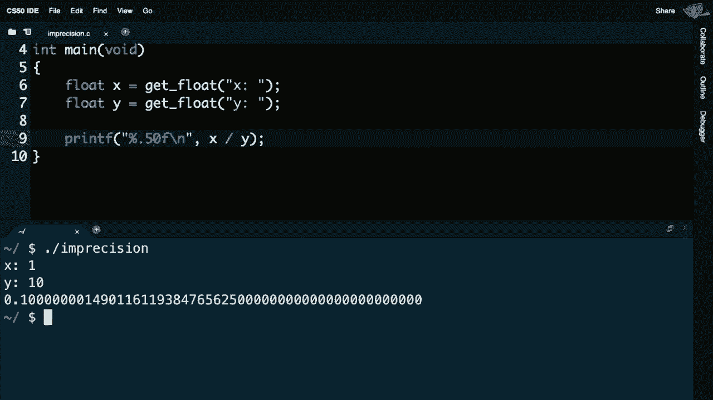

quite sure in grade school when we all，learned 1 divided by，10 the teacher did tell us 1 10 or 0。1。and they never mentioned the fact that，it's 0。1000001490116，and so forth so what is going on well it。and is，as sophisticated as all of the syntax，we've been looking at today is。my god a computer you can't even，calculate one-tenth，correctly and so we're bumping up。

against a fundamental limitation here，which is that if computers are，so much。ram so much hardware so many bits well，it stands to reason that if you only are。using a finite number of bits，32 for instance or sixty-four yes you can count。pretty high or pretty precisely you，cannot count，infinitely high or infinitely precisely。

at some point，you have to start to approximate values，doing，32。via which to represent a float there's a，infinite number of floating point。real numbers in the world unfortunately，if you have a finite number of bits you。got to start cutting some corners and，that's what the computer is doing。

it's representing one tenth as closely，as it can，and this is what you then see when you，for most。problems that's probably not a big deal，but it could very well be a big deal if。you're doing math you're dealing with，finance，or monetary values or military。operations where a lot of small numbers，uh scientifically really start to add up。

and indeed there have been many examples，happen，and there's another。issue that computers run into not only，this floating point in precision。even integers have their limitations，recall that integers of course。can be represented in decimal or in，binary and if we have three light bulbs。

or three bits let's consider how we，might count in binary，zero zero zero is where we began last。week zero zero one，zero one zero zero one one one zero zero，and now。this recall from last week is the number，we know is seven in decimal，just。carry the one so to speak but if i only，bits，carry，disappears and so there's this problem。

with integers too，and someone noted it earlier when we，tried to do two billion or when you。tried to do two billion plus two billion，it couldn't fit in the result that's，because integers two。if they're only 32 bits or a long in c，if it's only sixty-four bits those are big。numbers but they're not，infinitely large and we humans have，tripped over this again and again。

you might recall hearing about if not，living through the y2k problem。where a lot of stuff in the world broke，or was worried to be broken，made the。reasonable but not very long-sighted，decision to store，years using just two digits so 1995。would be represented as 9。5，96 97 98 99 then，around the change of the year from 1999，to 2000。

any computer program or system that was，still using two digits。would of course add one at the stroke of，third digit，available it disappears and the entire。world confuses the year 2000，assumed，as being the prefix and if you can。believe it we humans are about to do，this again，in the year 2038 which is not that far，off from now。

we are going to run out of bits，by which to keep track of time because，the time。they are going to use 32 bits to，represent numbers，up，date，january 1st 1970。so that's when time。began computing wise in some sense and，since，unfortunately with 32 bits you can only。count as high as 4 billion give or take，and unfortunately we are going to hit。

the 4 billionth second on，january 19th in the year 2038 so unless。all of us upgrade our macs and pcs and，worse embedded systems and satellites，and any hardware。baked into various devices that we now，use we're about to run into this problem。again where all of a sudden it's going，to be like january 1st，problem。

so with all the power we've seen and see，in c，and in scratch there are still these。fundamental limitations so when it comes，to solving your own problems in。c and in turn cs50 it's going to be ever，so important to be mindful of these。constraints and to ultimately find，now，we'll adjourn here and leave you for。

your first problem set in c。