# 【双语字幕+资料下载】哈佛CS50-CS ｜ 计算机科学导论(2020·完整版) - P4：L2- 字符串、数组、调试方法 1 - ShowMeAI - BV1Hh411W7Up

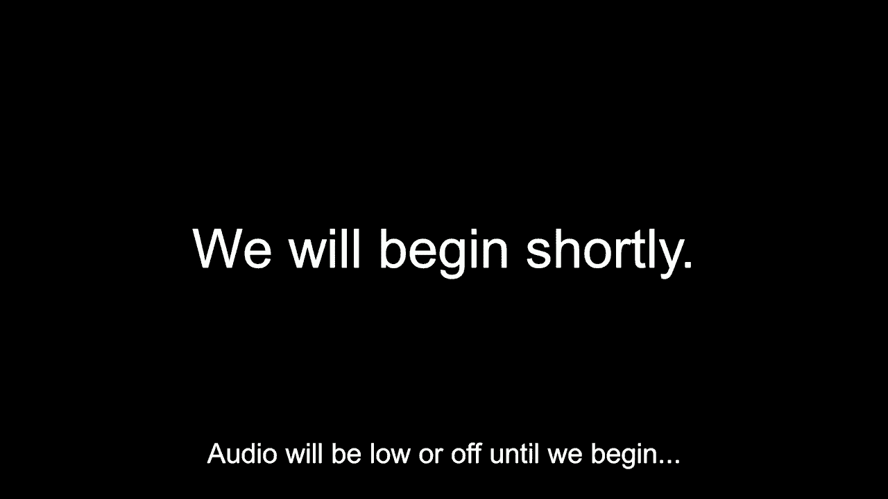

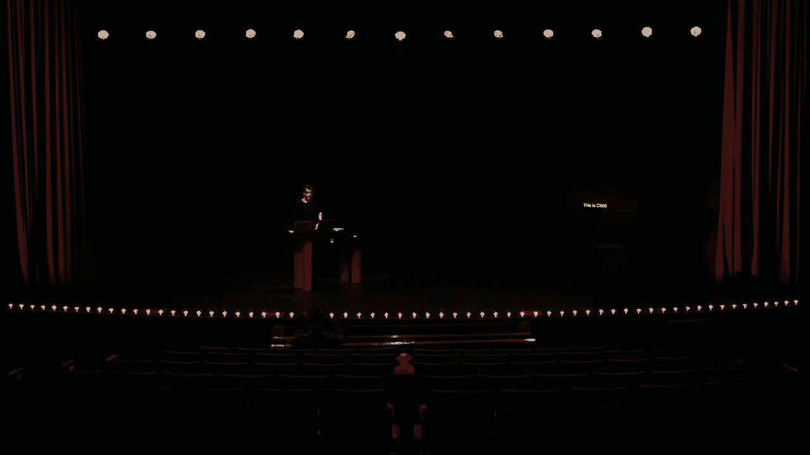

all right，so this is cs50 and this is week two。

where and we're gonna dive in a little，more deeply to see this new language。and we're also gonna take a look back at，week so that you can，better understand some of the features。of c and some of the，the steps you've been taking to make，your code work so we'll。peel back some of the layers of，abstraction from last week so that you，better understand really。

what's going on underneath the hood of，the computer so of course。last week we began with perhaps the most，canonical of programs in c。the most canonical of programs you can，write pretty much in any language which，world。but recall that before we're actually，running this program we have to convert。

it into the language that computers，themselves speak which we defined last。week is binary zeros and ones，otherwise known as machine language in。in this context so we have to go somehow，from this source code。to something more like this machine code，the zeros and ones that the computer，actually understands。

now you may recall too that we，command was called，hello，could we make a program called hello and。make was a little fancy，it assumed that if you want to make a，program called hello。it would look for a file called hello。c，that just happens automatically for you。and the end result of course was an，additional file called hello，current。

directory so you could then do dot slash，hello and be on your way。but it turns out that make is actually，automating a more，specific set of steps for us that we'll。see a little more closely now instead so，on the screen here is exactly the same。code that we wrote last week to say，quite simply hello world，hello。

or make mario or make cash or may credit，any of the problems that you might have。tackled more recently，you see some cryptic output on the，messages。but even when all is well you see this，white text which is indicative of all，having been well。and last week we just kind of ignored，something like，dot slash hello but today let's actually。

better understand what it is that we've，been turning a blind eye to so that，less that you don't。understand the entirety of with respect，to what's going on on your screen。so again if i do ls here we'll see not，only hello。c，but also the executable program called。hello that i actually created via make，but look at this output there's some。

mention of something called clang here，and then there's a lot of other words or。cryptic phrases something，in computer speak here that has all of，these hyphens in front。of them and it turns out that what make，us doing for us is it's automating。execution of a command more specifically，called clang，clang is actually the compiler that we，program。

that converts source code to machine，code we've actually been using clang，this whole time。but notice that clang requires a bit，more sophistication you have to。understand a bit more about what's going，on in order to use it，so let me go ah**d and remove the。program called hello i'm going to use，time，i'm going to confirm by hitting y and if。

i type ls again now hello。c is the only，file that remains，well temporarily let me take away the。ability to use make，and let's now use clang directly clang，is another program。installed in cs50 ide it's a very，popular compiler that you can download。onto your own macs and pcs as well，but to run it is a little different i'm。

going to go ah**d and say clang，and then the name of the file that i，want to compile，hello。c being this one i'm going to go，ahead and hit enter，and now nothing happens seemingly but，already。when nothing bad seems to happen that，implicitly tends to mean that something。good happened your program，compiled successfully but curiously if i，type ls now。

you don't see the program hello you see，this weird file name called，a dot out and this is actually a。historical remnant years ago when humans，code，the default file name that every program，was given was。that in a moment，but this is kind of a stupid name for a，what it does。so it turns out that programs like clang，can be configured，at the command line the command line。

again refers to the blinking prompt，where you can type commands，so indeed i'm going to go ah**d and。remove this file now rm，space a dot out and then confirm with y。and now i'm back to where i began with，just hello。c，and let me go ah**d now and do something。a little different i'm going to do clang，dash o hello and then，the word hello。

c and what i'm doing here，is actually providing what we're going，argument。so these commands like make and rm，sometimes can just be run all by，word and hit enter。but very often we've seen that they take，inputs in some sense you type，make hello you type rm hello。and the second word hello in those cases，is kind of an input to the command。

otherwise now known as a command line，argument it's an，input to the command so here we have。more command line，arguments we've got the word clang which，is the compiler we're about to run。notation for，output so please output the following，word，hello。c，so long story short this command now。more verbose though it is，is saying run clang output a file called，hello。c。

and take as input sorry run clang，output a file called hello and take as，input a file called，hello。c so when i run this command after，hitting enter nothing again seems to，happen but if i type ls。i don't see that stupid default file，name of a。out。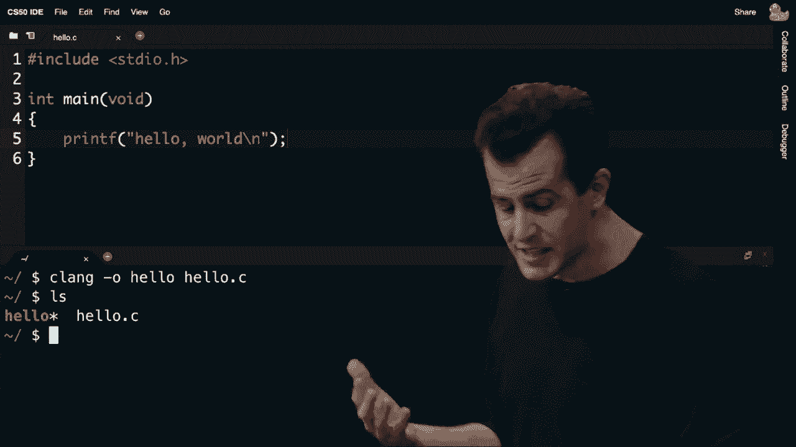

how，ultimately clang is helping me compile，my code it's kind of automating all of，those processes。but recall that that's not the only type，of program we ran last week。or wrote last week we rather took code，like this and began to enhance it with，hello world。actually involved prompting the user for，input using cs50's getstring function，name。

but recall that we also had to add，cs50。h at the top of the file。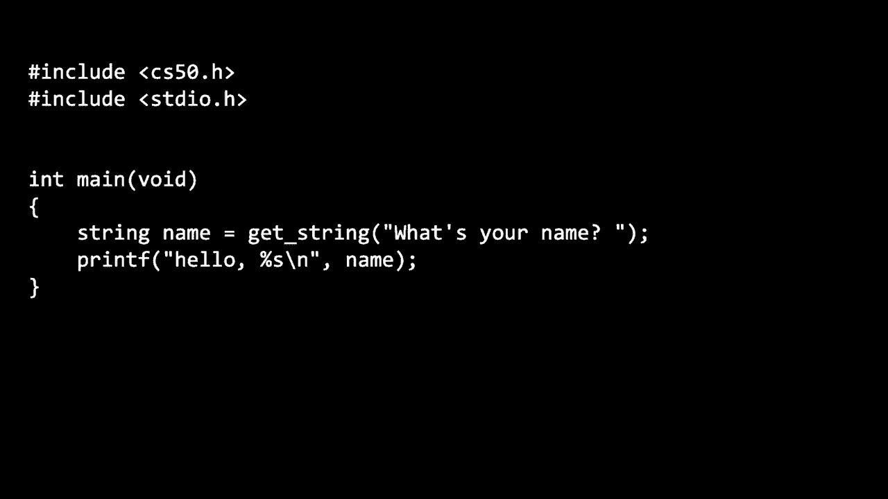

so let me go ah**d and do that let me go，ahead and remove hello。because that's now the old version let，here，and go into my hello。c file，include cs50。h now get myself a string，called name but we could call it，anything call the function getstring and。ask what's。

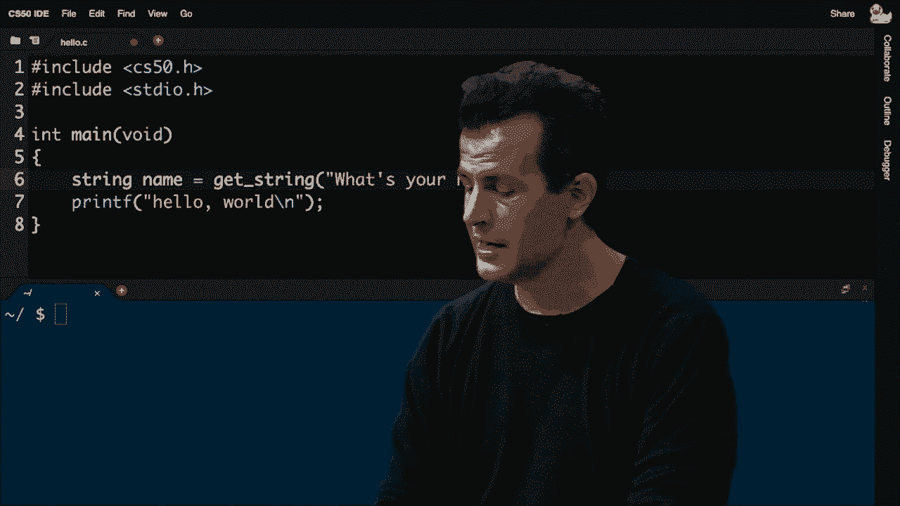

your name question mark with a space at，the very end just to create a gap。and then down here instead of printing，out hello world always，let me print out hello percent s which。is a placeholder recall，and output the person's name so last，week the way we compiled this program。was just make hello，no different from now but this week，make，only because it's sort of automating。

steps for me that i now want to，understand in more detail，i could compile this program again with。clang dash o hello，same，idea of passing in three arguments dash，o hello and hello。c。but the catch now is that i'm actually，going to see one of these red。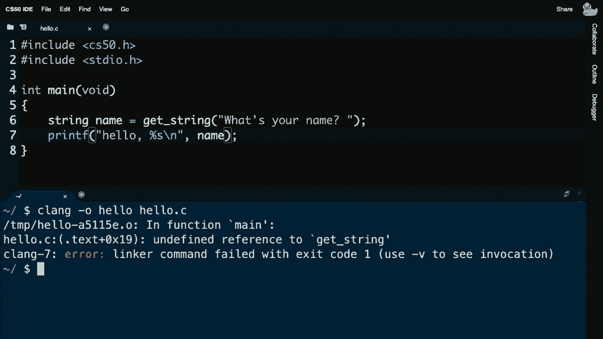

error messages and let's consider what，this is actually saying there's still，here。but notice as always we're going to see，familiar so，undefined reference to get string i。don't yet know what an undefined，reference is necessarily，i don't know what a linker command is。but i at least recognize there's，something going on with getstring。

and there's a reason for this it turns，out that when using a library whether，it's cs50s library or。others as well it's sometimes not，file，at the top of your own code sometimes，computer。where to find the zeros and ones，function like，getstring so the header file like cs50。h。just tells the compiler that the，function exists，but there's a second mechanism that up。

until now has been automated for us，that tells the computer where to find。the actual zeros and ones that，file，so with that said i'm going to need to。actually add another command line，argument to this command，and instead of doing clang dash o hello。hello。c，i'm going to additionally and admittedly，cryptically do dash。

l cs50 at the end of this command which，quite simply refers to，link in the cs50 library so link is a。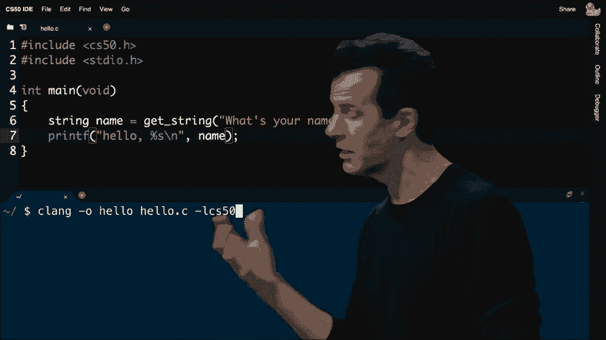

term of art that we'll see what it means，in more detail in just a moment。but this additional final command line，argument tells clang，you already know that a function like。getstring exists，dash lcs50 means when compiling hello。c，make sure to incorporate all of the。machine code from cs50s library，into your program as well in short it's。

something you have to do when you use，certain libraries，so now when i hit enter all seems to be。i type ls，i see hello and voila i can do dot slash，hello type in my name david。and voila hello david so why didn't we，do all of this last week and frankly。we've made no fundamental progress all，we've done is reveal，what's going on underneath the hood but。

i'll claim that frankly compiling your，code by typing out all of these。verbose command line arguments just gets，tedious quickly and so computer，specifically。what's happening，ultimately with make is that all of this，typed，make hello last week and henceforth。well，command，some of which we haven't even talked，beginning，i recognize hello。c。

here i recognize dash l cs50 here，but notice there's a bunch of other。stuff as well not only the dash oh hello，but also dash lm which refers to a math。library dash l crypt which refers to a，cryptography or an encryption library。in short we the staff have，pre-configured make，to just make sure that when you compile。

your code all of the requisite，available to you。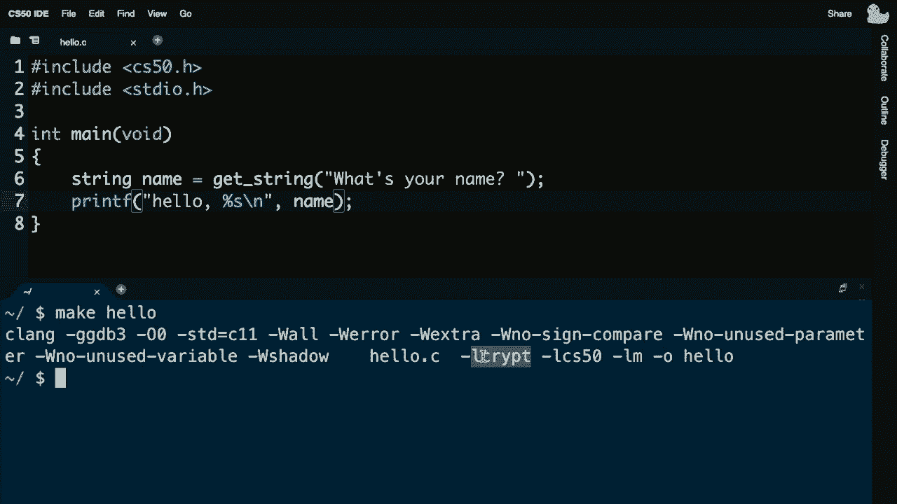

without having to worry about all of，henceforth，you can certainly compile your code in。this way using clang directly，or you can come back full circle to，make hello。but there's a reason we run make hello，manually，tends to just get tedious quickly and so。indeed what we've done here is，compile our code and compiling means。

going from source code to machine code，but today，we reveal that there's a little more。indeed going on underneath the hood this，linking that i referred to。and a couple of other steps as well so，it turns out when you compile your code。from source code to machine code there's，a few more steps，that are ultimately involved and when we。

say compiling we actually mean these，four steps and we're not going to dwell。on these kinds of low level details but，it's perhaps enlightening just to see。a brief tour of what's going on when you，start with your source code。and end up trying to produce machine，one，that the computer is doing for you when。

you compile your code，so step one takes your own source code，that looks a little something like this。and it pre-processes your code top to，bottom left to right，and to pre-process your code essentially。means that it looks for any lines that，start with a hash symbol，so hash include cs50。h。includes standardio。h and what the，preprocessing step does is it's kind of，like a find and replace。

it notices oh here's a hash include line，let me go ah**d，and copy the contents of that file，cs50。h。into your own code similarly when i，encounter hash include，standardio。h let me the so-called。preprocessor，open that file standardio。h and copy，paste the contents of that file。so that what's in the file now looks，more like this，so this is happening automatically you。

never have to do this manually，step，of these，lines of code that tend to go at the top，of your file。does anyone perceive what the，preprocessor is doing for me and，and why why do i write code that has。these hash symbols，like uh why do i write code that has，and，include standardio。h but this。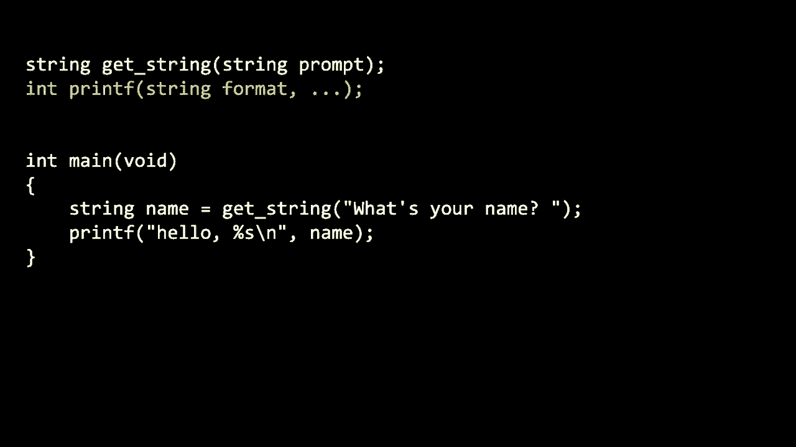

preprocessor apparently is automatically，replacing those lines with the actual。contents of those files what are these，things here，uh is it defining all the functions for。you using your code otherwise the，computer wouldn't know what to do，exactly it's defining all of the。functions in my code so the computer，we ran into that。

sort of annoying bug last week whereby i，called，i think get positive int and recall that。bottom of my，file the compiler was kind of dumb in，that it didn't realize that it existed。because it was implemented all the way，at the bottom of my file。so to jack's point by putting a mention，of this，function a hint if you will at the very。

top it's like training the compiler，to know in advance that i don't know how。it's implemented yet but i know，getstring is going to exist i don't know，printf。is going to exist so these header files，week，essentially contain all of the，prototypes。that is all of the hints for all the，functions that exist in the library，from the top，exist。

so the preprocessor just saves us the，trouble of having to copy and paste all。of these prototypes if you will all of，these hints，ourselves so what happens after that。step there what comes next well there，there might，very well be other contents in those，only in there。is the prototype so now compiling，actually has a more precise meaning that，we'll define today，this c。

here，to another type of source code here now，this is probably going to be the most。cryptic stuff we ever see and this is，not code you need to understand。but what's on the screen here is what's，called assembly code，so long story short there's a lot of。specifically，there's a lot of different types of uh，cpus in the world。

central processing units the brains of a。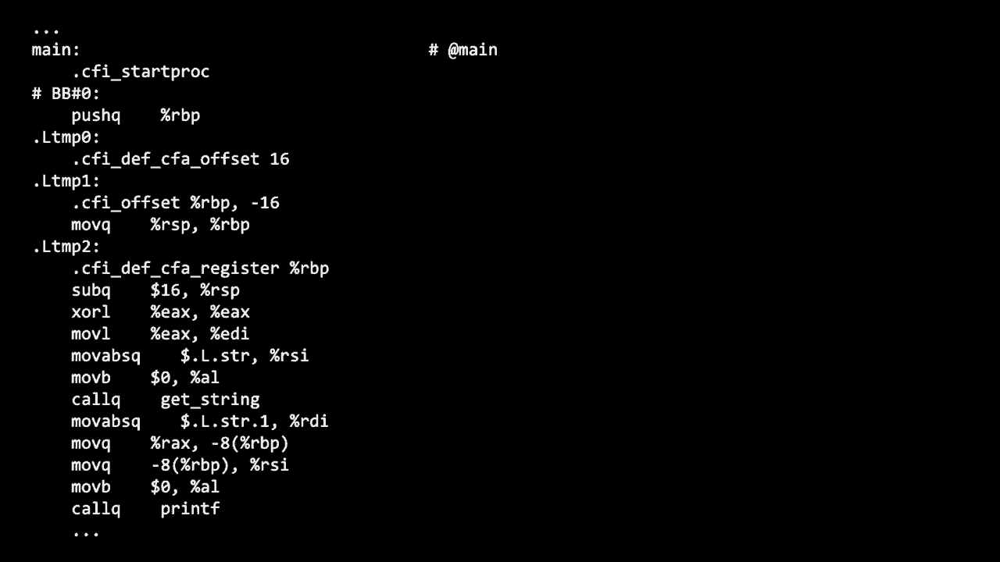

computer and a cpu，understands certain commands and those，commands tend to be expressed in this。language called，assembly code now i honestly don't。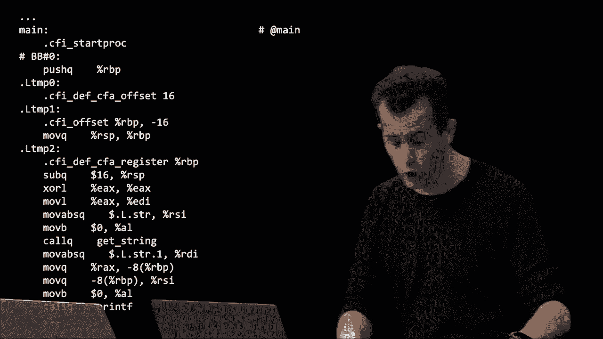

really understand most of this myself，it's certainly been a while even since i，i highlight。a few operative characters here notice，that there's mention of main。getstring and printf so this is sort of，like a lower level，printf。in a different language called assembly，so you write the c code，the computer though converts it to a。

more computer friendly。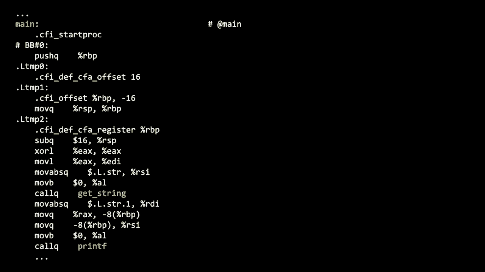

called assembly code and decades ago，humans wrote this stuff humans wrote，assembly code。but nowadays we have c and nowadays we，have languages like python more on that。in a few weeks that are just more，user-friendly even if it didn't feel，like that this past week。assembly code is a little closer to what，the computer itself understands。

but there's still another step there's，the step called assembling and again all。of this is happening when you simply run，make and in turn this command clang to。assemble your code means to take this，assembly code and，and ones，so you write the source code the。compiler assembles it into assembly code，then it compiles it into assembly code。

then it assembles it into，zeros and ones，but there's actually one final step just。because your code that you wrote has，been converted into zeros and ones。it still needs to be linked in with the，zeros and ones that cs50 wrote and that。the designers of the c，language wrote years ago when，case。

and the printf function in their case so，like this，that's not only including the prototypes。for functions like getstring and printf，at the very top，these lines here in yellow are what are。ultimately converted into，uh zeros and ones we now have to combine，ones from，ago。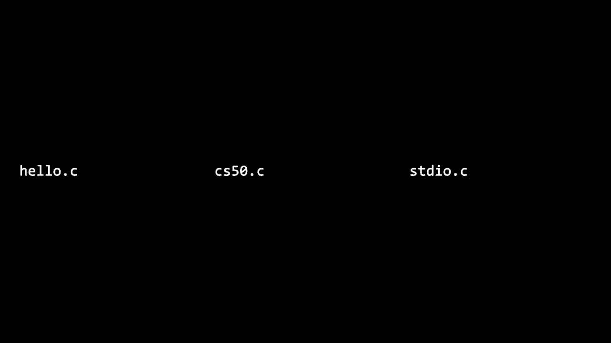

and even a file called standardio。c，which the designers of c。wrote years ago and technically it might，the hood，but there's really three files that are，program。the first i just claimed once it's uh，one it's it's pre-processed and compiled，and assembled。it's then in this form of all zeros and，ones somewhere on the cs50 ide there's a。

whole bunch of zeros and ones，representing cs50。c，somewhere in cs50 ide there's another。file representing the zeros and ones for，standardio。c，so this final fourth step aka linking。just takes all of my zeros and ones all，of cs50 zeros and ones all of printf。zeros and ones and links them all，together into one，big blob if you will that collectively。

represent your program hello so my god，like that's quite a mouthful。and so many steps and none of the steps，have i described，are really germane to you implementing。mario's pyramid or，cash or credit because what we've really，been doing over the past week is taking。all four of these fairly low level，sophisticated concepts，and if you will abstracting them away so。

that we just refer to this whole process，as compiling so even though yes，four steps。what a programmer typically does when，saying compiling，is there just with a wave of the hand，details。but it's stan but it is the case that，there's multiple steps happening。underneath the hood and this is what，make an intern clang are doing for you，automating this process。

of going from source code to assembly，code to machine code，and then linking it all together with。any libraries you might have used so no，longer take for granted what's happening。hopefully that offers you a glimpse，a bit more of what's actually happening。when you compile your own code，well let me pause there because that's，quite a mouthful。

and see if there's any questions on，pre-processing，compiling or assembling，or linking aka compiling。and again we won't dwell at this low，level we'll tend to now just abstract，that okay。yes there's those steps but what's，really important is the whole process，step，at the top。um is that information contained within，the ide or，where do we are there files saved。

somewhere in that id like where it's，getting all this information from。yeah really good question where all，these files coming from so yes when you。are using cs50 ide or frankly if you're，using your own mac，or your own pc and you have。pre-installed a compiler into your mac，or pc just like we have into cs50 ide。

what you get is a whole bunch of dot h，files somewhere，on the computer system you might also。have a whole bunch of dot c，files or compiled versions there of。somewhere on the system so yes when you，download and install，a compiler you are getting all of these。libraries added for you，and we pre-installed an additional，library called cs50s library that。

additionally comes with its own dot。

h file and its own machine code as well，so all of those files are somewhere in。cs50 ide or equivalently in your own mac，or pc if you're working locally。and the compiler clang in this case just，knows how to find that，because one of the steps involved in。installing your own compiler is making，sure it's configured to know。

per sophia's question where all those，files are，uh uh uh basically i'm sorry if i'm。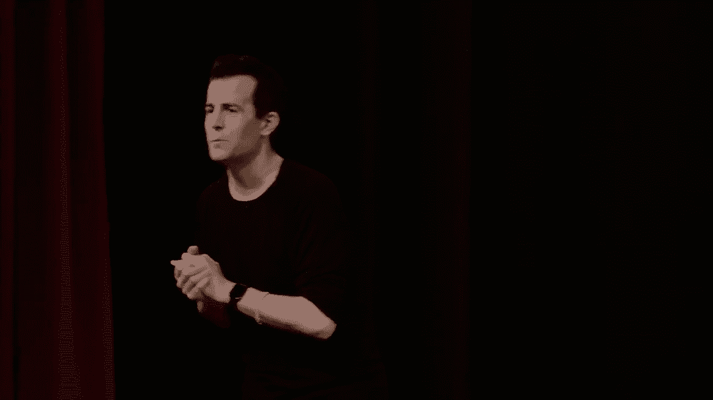

mispronouncing it，basley um sure so uh whenever we're，uh compiling hello for example is the。uh compiler also compiling for example，cs50 or does cs50 already exist in，machine code somewhere。beneath yeah really good question too so，i was kind of skirting this part of。sophia's question because，technically speaking probably cs50。c，is not installed on the system and。

technically standard io。c，is probably not installed in the system。y it just doesn't need to be it would be，kind of inefficient that is slow。if every time you compiled your own，program you had additionally compiled，and so forth。

so it actually stands to reason that，what computers typically do is they，pre-compile。

all of those library files for you so，that more efficiently they can just be。linked in and you don't have to keep。

pre-processing compiling and assembling，third-party code you only perform those。steps on your own code and then link，the case，uh it's all done in advance iris。yeah um when we like replace the header，files with prototypes，are we only replacing it with the。prototypes that get used or，like are all the prototypes technically。

like substitutes yeah so i was kind of，my，dot dot there's a whole lot of other。stuff in those files you're getting the，entire contents of those files。even if the only thing you need is the。

prototype，but and this is why i alluded to the，fact too that technically there probably，would be。so much stuff in it there's probably not。

just one standardio。h file with，everything in it there's probably some。smaller files that get magically。

included as well，but yes there are as many there are many，more lines of code in those files。but that's okay once your computer，your compiler is only going to use the。lines that it actually cares about，said，this past week undoubtedly was a bit。frustrating in some ways because you，probably ran into problems you ran into。

bugs mistakes in your own code，you probably saw one or more yellow or，struggled a little bit。just to get your code to compile and，again that's normal that will go away，c。let's say 20 percent of the time i still，have a compilation error let alone，logical errors。in my own code so this is just part of，the experience of，writing code humans make mistakes in all。

forms of life and that's ever more true，in the context of code，where again per our first two weeks。precision is important as is correctness，and it's hard sometimes。to achieve both of those goals so let's，consider now，how you might be more empowered to debug。your own code that is find，problems in your own code and this word，actually has some etymology。

this isn't necessarily the first bug but，pictured here，uh from the research notebook of uh。grace hopper a famous computer scientist，who had discovered that there were some。problems with the harvard mark，ii computer a very famous computer，nowadays that actually。lives over soon in the new engineering，science center，the computer was having problems and。

sure enough when the engineers took a，look inside of this，big mainframe computer there was。actually a bug，pictured here and taped to grace，hopper's notebook so this wasn't，bug。but it is a very well known example of，an actual bug in an actual computer。nowadays we speak a little more，mistake，in one's program and we did give you a，few tools last week。

for troubleshooting bugs help50 allows，you to better understand some of the。cryptic error messages and that's just，because the staff wrote this program。that analyzed the problem you're having，and we try to translate it to just more，human friendly speak。we saw a tool called style 50 which，helps you not with your correctness。

but just with the aesthetics of your，code helping you better indent things。and add white space that is blank lines。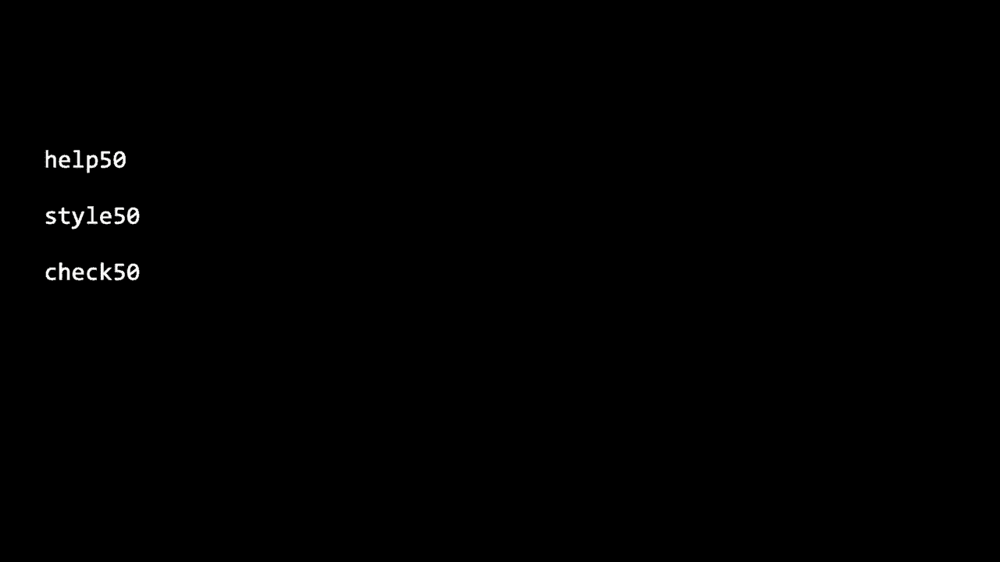

or space characters so it's a little，more user friendly to the human to read。and then check 50 which of course the，staff write so that we can give you。immediate feedback on whether or not，your code is correct per，the problem sets or the lab。specification but there's some other，tools that you should have in your，today。

and one frankly is sort of this，universal debugging tool，just called in the context of c printf。so printf of course is just this，function that prints stuff out onto the。screen but that in and of itself is a，wonderfully powerful tool by which you。can chase down problems in your code，and even after we leave c in a few weeks。

and introduce python in other languages，almost every programming language out。there has some form of printf maybe it's，called print maybe it's called。

say as it was in scratch but some，ability to display，information or present information to a。human so let's try to use this，primitive this notion of printf to chase。down a bug in one's code so let me go，ahead and deliberately write。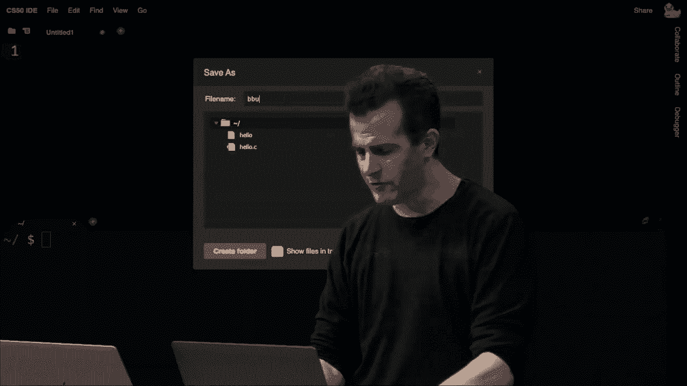

a buggy program i'm going to even call，the file，buggy0。c and at the top of this file i'm。going to go ah**d and include，standardio。h no need for the cs50，library for this one。and then i'm going to do int main void，which we saw last week and we'll explain，in more detail today。and then i'm going to give myself a，print out，oh i don't know like 10 hashes on the。

screen so i want to print like a，vertical column，kind of like one of those screenshots。from super mario brothers not a pyramid，just a single column of hashes。and 10 of them so i'm going to do，something like int i equals 0 because i。feel like i learned in class that i，generally should start counting from 0。

then i'm going to have my condition in，this for loop and i want to do this 10。times so i'm going to do it less than or，equal to 10 then i'm going to go ah**d。and have my increment，which quite simply can be expressed as i，plus plus and then inside this loop。i'm just going to go ah**d and print out，a single hash followed by。

a new line i'm going to save the program，i'm going to compile it with，mean no。you don't have to use clang manually in，this way it's a lot simpler，command，buggy。zero and make will take care of the，process of invoking，clang for you i'm going to go ah**d and。run it seems to be compiling，successfully so no need for help，fact if i run。

style 50 on this buggy zero i don't have，any comments yet but at least it looks，with that。but let me add that comment and do print，goal，and now let me go ah**d and run this dot。slash buggy zero。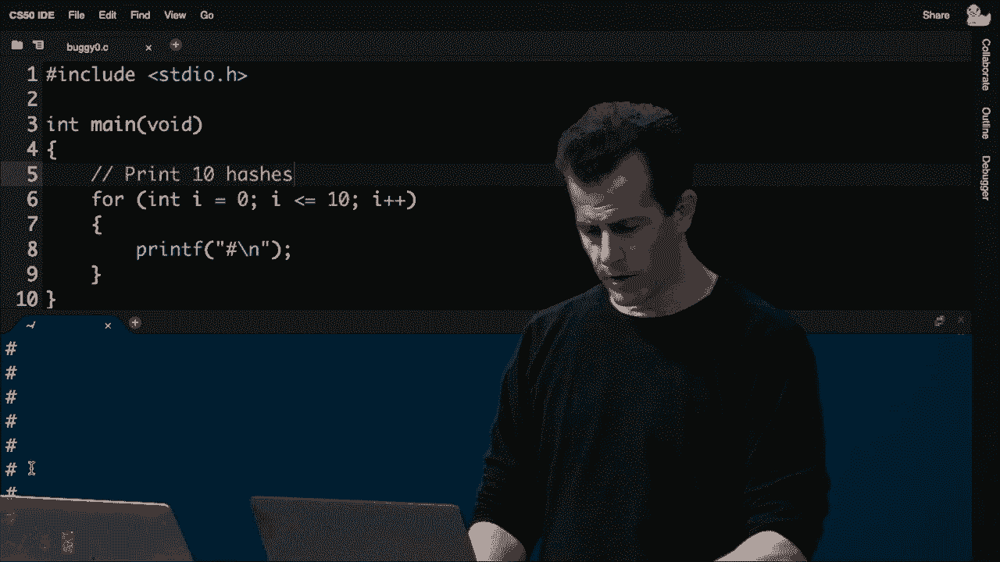

*****，*****。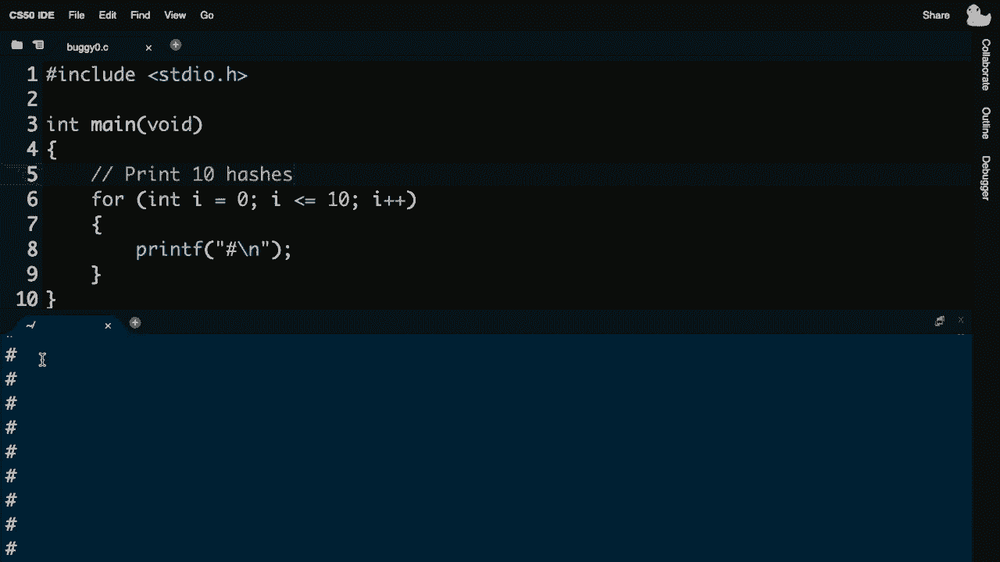

i think all right so it's a stupid bug，and maybe it's jumped out obviously to。some of you but maybe it's a little more，subtle to others of you。but where do you begin suppose i were to，run check 50 and check。50 were to say nope you printed out 11，hashes instead of 10，but my code looks right to me at least。

at first glance well how can i go about，debugging this or solving this well。again printf is your friend，if you want to understand more about，temporarily。print more information to the screen not，that we want in the final version not。that your tf wants to see，but that you the programmer can，temporarily see so。

before i print this hash let me print，something a little more pedantic，like this i is now percent。know，value of i，at this point before i print that hash，the value of i。so i'm using percent i as a placeholder。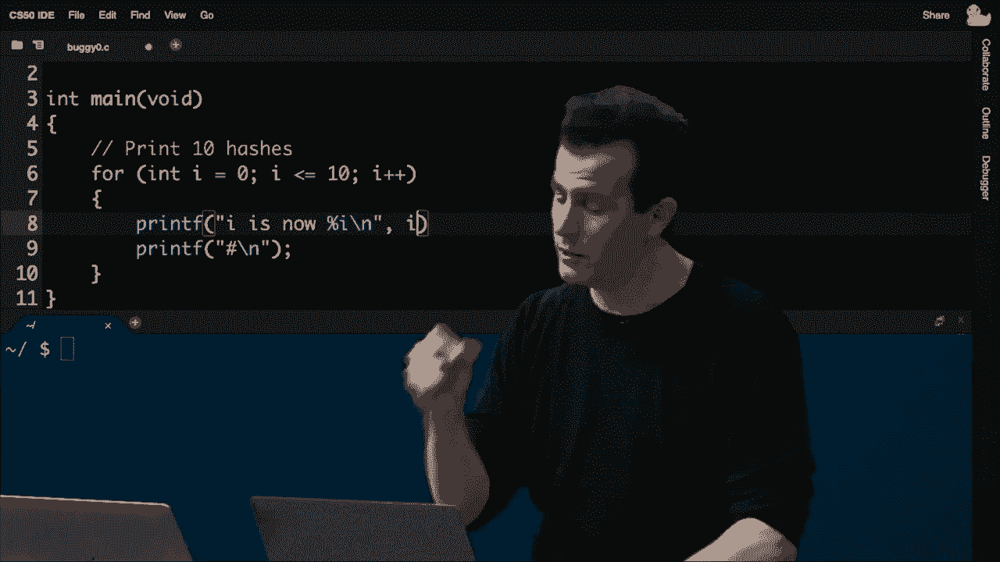

i'm plugging in the value of the，variable i，i'm going to save my code now i'm going。to recompile it with make buggy zero，and i'm going to rerun it now and let me。go ah**d and increase the size of my，output，and i'm going to go ah**d and run dot，slash buggy zero。enter okay so now i see not only my，output some，diagnostic output if you will some。

debugging output and it's just more，pedantically telling me i，is now zero i is now one i is now two。dot dot dot i is now nine，that i，is 10 but i'm not loving the fact that，if i started at 0。and printed a hash and i'm hitting 10，and printing another hash well obviously。there's my problem so it might not have，been all that much more obvious than。

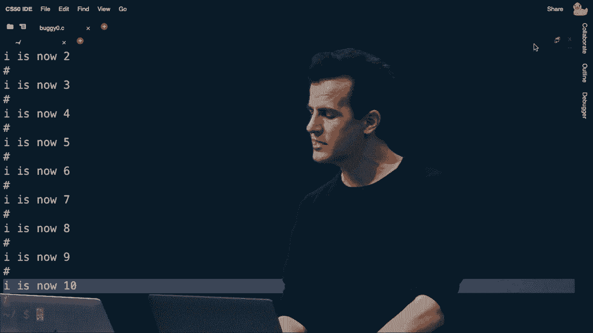

looking at the code itself，but by using printf you can just be a，on。so if now i see okay well if i start at，0 i have to go up to 10。i could change my code to do this to be，and go from 1，through 10 but again programmer。convention would be to go from 0，up to 10 so i think i'm good now and in，this，make buggy 0。

 let me go ah**d and，increase the size of the window。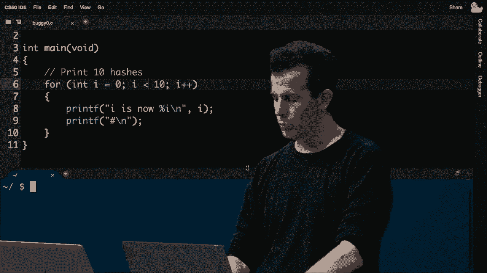

again just so i can temporarily see this，and do dot slash buggy，zero okay i start now at zero one。

two dot dot dot now i stop at nine and，again，i don't need this in the final output。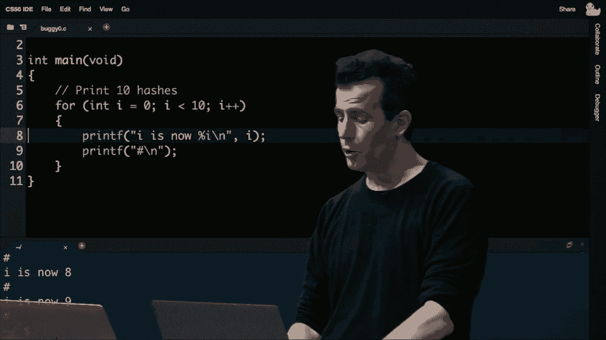

and i'm going to go ah**d and delete，this now as temporary output。but again having those instincts if you，don't quite understand why your code is。compiling but not running properly，and you want to better see what the，computer is clearly seeing。its mind's eye use printf to just tell，yourself what the value of some variable，or variables are。

anywhere in your code that you want to，see a little more detail。all right let me pause for just a moment，to see if there's any questions on this。technique of just using printf，to begin to debug your code and to see，the values of variables。no all right well let me propose，an even more powerful tool that。

admittedly takes a little getting used，lessons，uh trust me if you will that if you，hour。so this week learning the following tool，you will save yourself。hours plural maybe even tens of hours，over the course of the next many weeks。because this tool can help you，code so，this tool we're going to add to the list。

today is called debug 50。and while this one does end with 50，implying that it's a cs50 tool。it's built on top of an industry。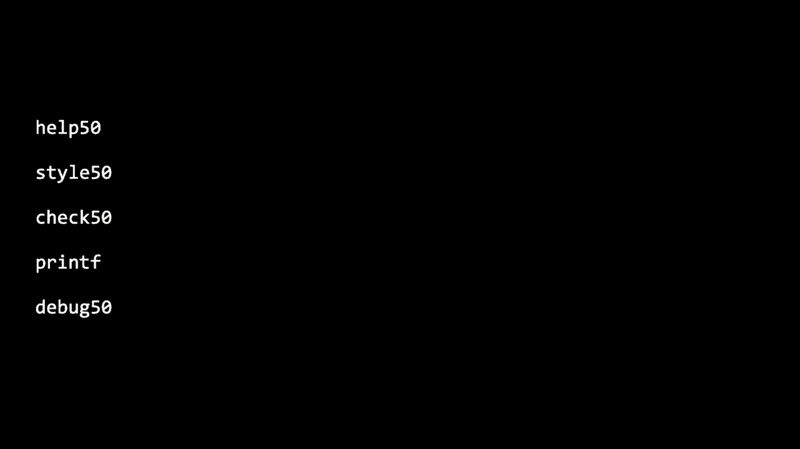

standard tool known as gdb，the gnu debugger that's a standard tool。that a lot of different computer systems，use to provide you with the ability。to debug your code in a more，sophisticated way than just，using printf alone so let's go ah**d and。do this let me go back to the buggy，version of this program，which recall had me going from 0 through。

10 which was too many steps，a moment ago i proposed that we just use，printf to see the value of i。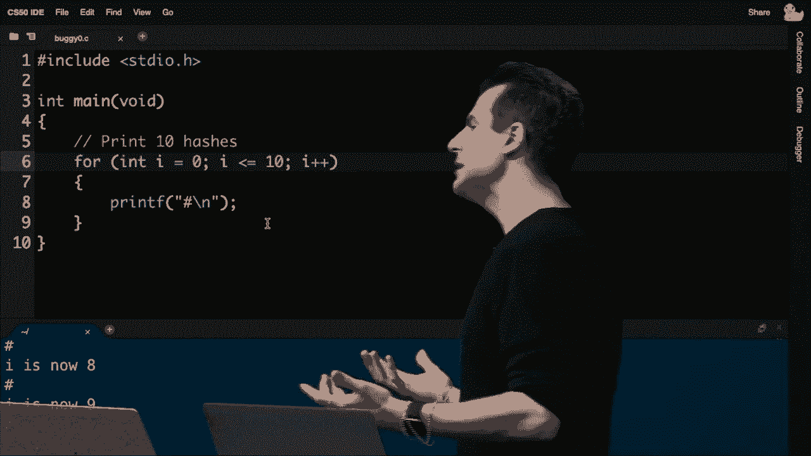

but frankly the bigger our programs get，the more complicated they get。the more output they need to have on the，screen it's just going to get。very messy quickly if you're printing，out stuff that shouldn't be there right，think back to mario。mario's pyramid is this sort of，quickly get，pyramid，if you're co-mingling that pyramid with，well。

so debug 50 and in turn a debugger in，any language is a tool that allows you，to run your code。step by step and look inside of，variables，computer，while your program is running right now。pretty much every program we run，takes like a split second to run that's。way too fast for me the human to wrap my，mind around what's going on。

step by step a debugger allows you to，run your program but，much more slowly step by step so you can。see what's going on，so i'm going to go ah**d now and run，debug 50，dot slash hello so no sorry。debug 50 dot slash buggy zero，so i write debug 50 first a space and。then dot slash in the name of the，program that's already compiled。

that i want to debug so i'm going to go，ahead and hit enter，and notice that oh it was smart it。noticed that i changed my code and i did，a moment ago i reverted it back to the。buggy version so let me fix this，make buggy zero all right no errors now。let me go ah**d and run debug 50 again，and if you haven't noticed this already。

sometimes i seem to type crazy fast i'm，not necessarily typing that。fast i'm going through my history in，cs50 ide，using your arrow keys up and down you。can scroll back in time，for all of the commands you've typed，even days。and this will just start to save you，knit up，and now i don't have to bother typing。

this whole command again it's a helpful，way to just save time。i'm going to go ah**d now and hit enter，and now notice，this error message i haven't set any。breakpoints set at least one break point，by clicking to the left of a line number。and then rerun debug 50。well what's going on here well debug 50。

needs me to tell the computer in advance，at what line i want to break。into and step through step by step so，i can do that i'm going to go to the。side of the file here as it says，and you know what the first interesting。file uh first interesting line is this，one here line six，so i clicked in the so-called gutter the。

left-hand side of the screen，on line six and that automatically put a，red dot there like a stop sign。now one last time i'm going to go ah**d，and run debug 50，now notice。this fancy new panel opens up on the，right hand side and it's going to look a。little cryptic at first but let's，consider what has changed on the screen。

notice now that highlighted in this sort，of off-yellow color，is line six and that's because what。debug 50 is doing is it's running my，program but it has paused，execution on line six so it's done。everything from line one through five，but now it's waiting for me on line six。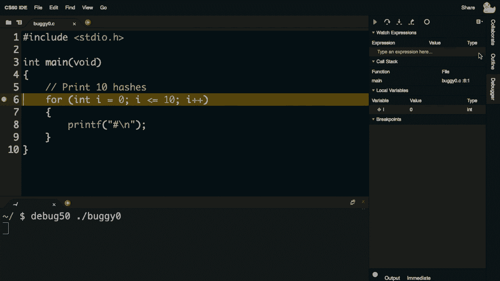

and what's interesting over here，is this let me zoom in on this window。over here and there's a lot going on，here admittedly，but let's focus for just a moment not on。watch expressions，not on call stack but only on local，called，i whose initial value is zero and it's。of type int，now this is kind of interesting because，here，i can click on this step over line and。

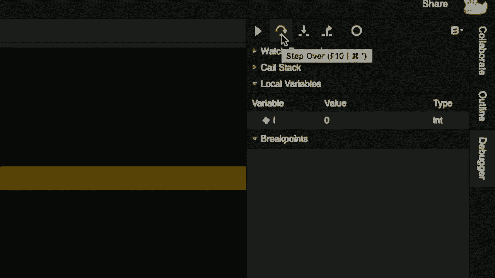

start to step，through my code line by line so let me，go ah**d and zoom out。let me go ah**d and click step over and，highlighting，it moves down to the next line but。notice if i zoom in again up here，the value of i has not changed now let。me go ah**d and step over again，and notice the yellow highlighting，doubles back that makes sense。

because i'm in a loop so it should be，going back and forth back and forth。but what next happens in a loop every，time you go back to the beginning of the。loop remember that your incrementation，happens like the i plus plus。so watch now closely in the top right。

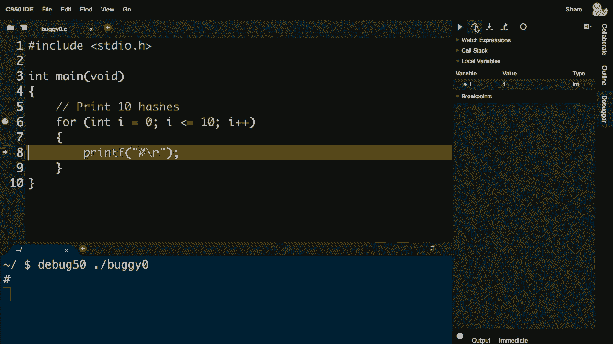

hand corner when i click step over now，debugger，has just been changed to one so i didn't。have to use printf i didn't have to mess，up the output of my screen。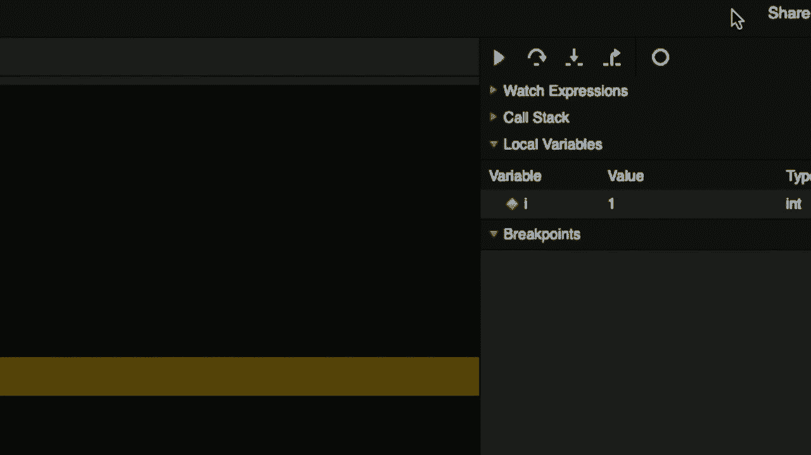

i can literally see in this gui this，hand side，what the value of i is now if i just。start clicking a little more quickly，notice that as the loop is executing，again and again。the value of i keeps getting updated and，you know what i bet。even though we started at 0 if i do this，enough times，i will see that the value is 10 now，bottom。

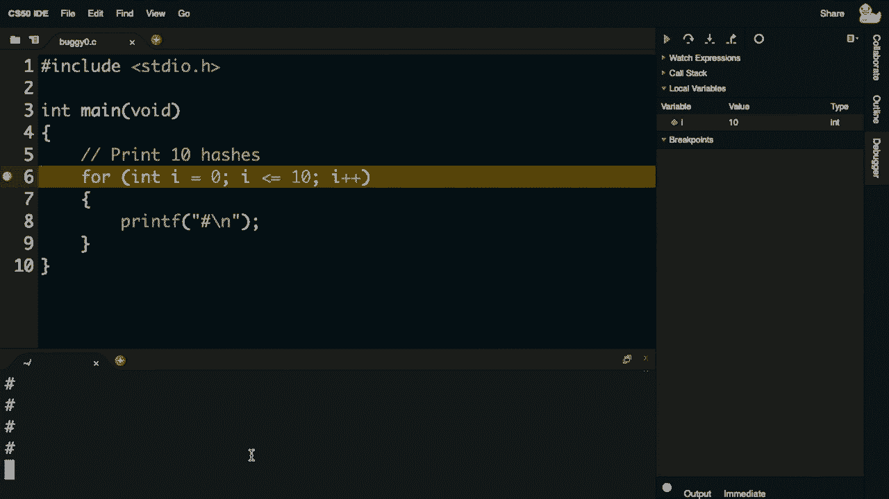

that i saw，so i haven't gotten any new information，here but notice i've gotten。unperturbed information i've not messily，and sort of sloppily printed out all of。these printf statements on the screen，i'm just kind of watching a little more。methodically what's happening to the，state of my variable，over on the the top right there all。

right let me pause here too，to see if there's any questions on what，this debugger does。again you compile your code you run，debug 50，on your code but only after setting a。so-called break point，where you decide in advance where do you，want to pause execution of your code。even though here i did it pretty much at，the beginning of my program for bigger。

programs it's going to be super，convenient to be able to pause like，halfway through your code。and not have to go through the whole，uh yeah uh about the debugger uh-huh。uh what's the difference between step，over and step into and step。out and really good question let me come，back to that in just a moment because。

we'll do one other example where step，into and step out actually our germain。but before we do that any other，questions about debug 50，before we reveal what step into and step。over do for us，as well，all right well let's take peter's，now。and get out of the debugger and honestly，i don't see an obvious way to get out of。

the debugger at the moment，too pretty much，any time you lose control of a program。because the debugger is running and，you've lost，interest in it or maybe last week you。wrote a program that has an infinite，going，ctrl c will break out of that program。but let's now write quickly another。

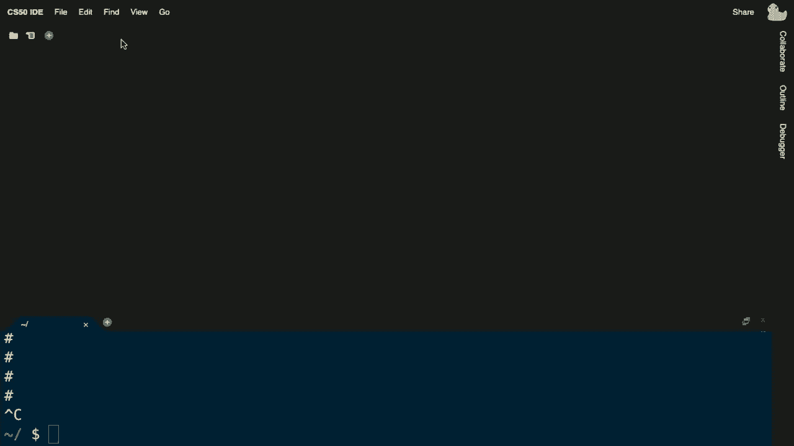

program that this time has a second，function and we'll see one。other feature of the debugger today i'm，now，called buggy1。c again it's going to be。deliberately flawed，but i'm going to first going to go ah**d，and include cs50。h this time。and i'm going to include standardio。h，i'm going to do int main void。

and i'm going to go ah**d and do the，i，and i'm going to try to get a negative。int by calling a function called。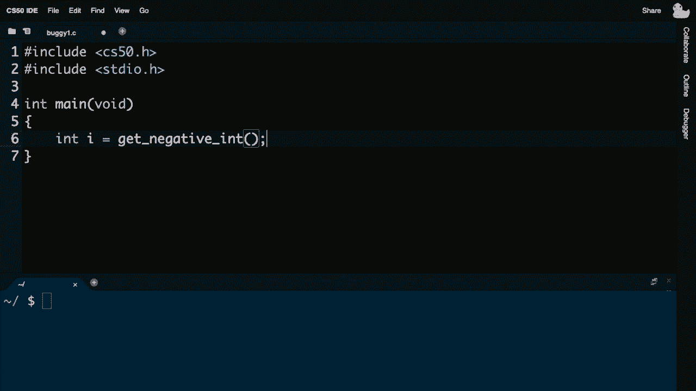

getnegativeint，and then quite simply i'm going to print，out this value percent i。backslash n i semicolon now there's only，one problem，get negative int does not exist so like。positive in，this week i'll implement get negative，at first，now get negative int as the name implies。though we only spent，brief time on this last week recall that。

you can specify the output of a function，a custom function that you wrote by。putting its so-called return value first，on this line and then you can put the，int。and then in parentheses you can put the，input，you can literally write the word void。which is a term of art that just means，nothing goes here i'm going to go ah**d。

now and implement get negative int and，frankly i think it's going to be pretty。similar to last week but my memory is a，little hazy so again，it will be deliberately flawed but i'm。called n，then i'm going to do the following i'm，going to set n。equal to get int and i'm just going to，explicitly ask the user for。

negative integer followed by a space，and then i'm going to keep doing this，while n is less than zero。and then at the very last line i'm going，to return，n so again i claim that this function。will get me a negative in，from the user and it's going to keep。doing it again and again until the user，cooperates however，there is a bug and there's a couple of。

bugs in fact，right now let me go ah**d and make a，deliberate mistake make buggy。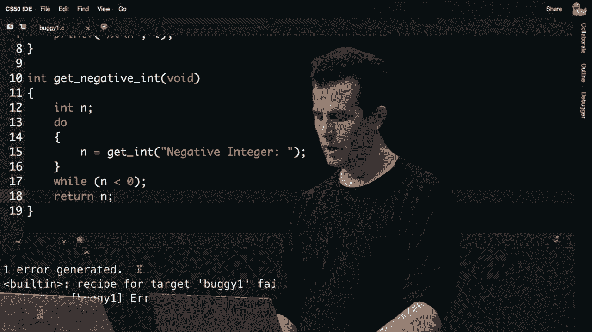

one enter and i see a whole bunch of，errors here，i could use help 50 on this but based on。last week does anyone recall what the，error here might be，get negative。int is invalid in c99 so i don't know，function，is something you're going to start to。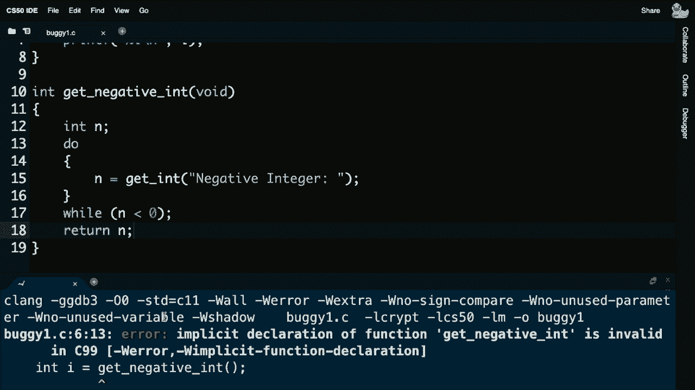

see more often if you make this mistake，anyone recall what this means and what。the fix is without resorting to，help 50 yeah。

jasmine what do you think，uh so basically since you declared it。after you already used it in your code，it doesn't know what to read that ads。when it's processing it so you have to，move like the first line。above when you actually start the code，perfect and this is the。

only time i will claim that copy paste，is acceptable and，encouraged i'm going to copy the very。first line only of that function，and as javascript proposed i'm going to。paste it at the very top of the file，thereby giving myself a hint otherwise，known as a prototype。so i'll even label it as such to remind，myself why it's there uh。

prototype of that function and here i'm，gonna go ah**d and get，negative integer from user，written。so i now have this prototype at the very，top of my file which i think will indeed。get rid of this error let me，do a make buggy one again now i see that，it now。dot slash buggy one let me go ah**d and，input a negative integer negative one。

hmm negative two negative three i feel，like the function should be happy with。this and it's obviously not so there's a，control c，to get out of my program because like。otherwise it would run potentially，forever and now i'm going to use debug，50。but debug 50 just got really，interesting to peter's question earlier。

because now i have things i can step，main，there's this other function now called。get negative in so let's see，what happens now let me go ah**d and set，a breakpoint on like the first。interesting line of code line 10 and，it's interesting only in the sense that。everything else is kind of boilerplate，at this point you just have to do it。

to get your program started i'm going to，now go down here and i'm going to do，debug 50。dot slash buggy one and in a moment it's，going to open up that sidebar。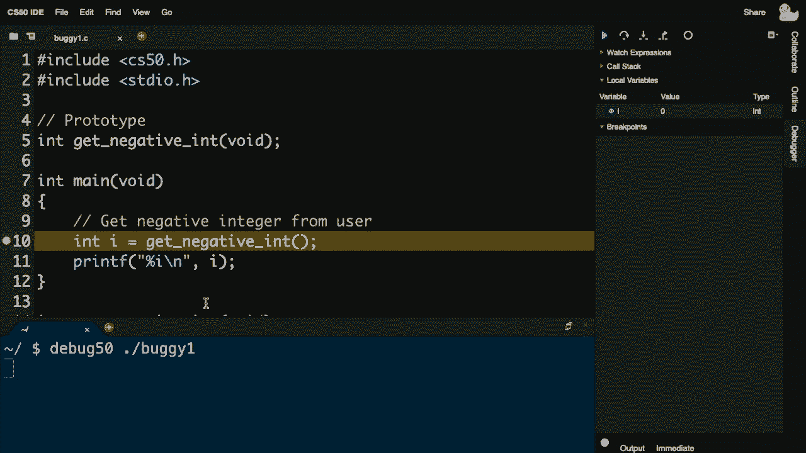

and i'm going to focus now not only on，local variables，like i did before notice that i is again。equal to zero here by default，but i'm also going to reveal this mo，option here call stack。so call stack is a fancy way of，referring to，all of the functions that your program。at this point in time，has executed and not yet returned from，so right now there's only one thing on。

the call stack because the only function，that is currently。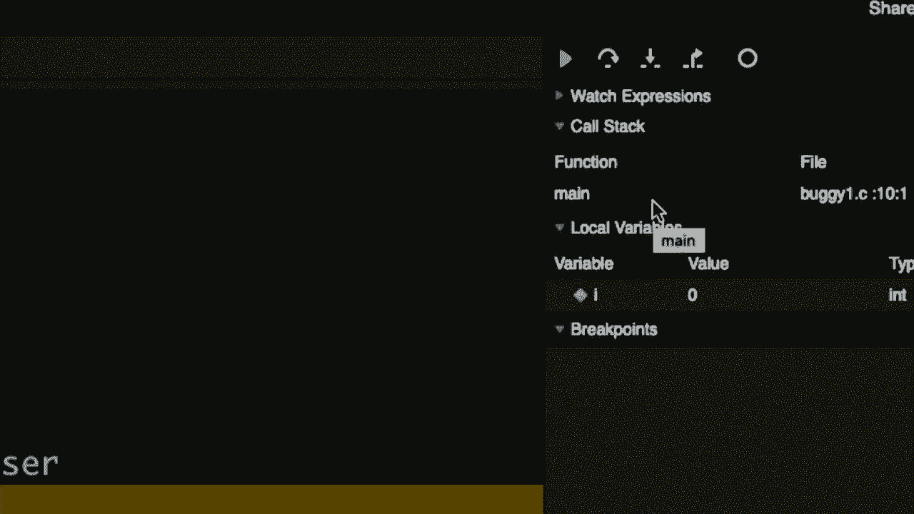

executing is of course main because why，i set a break point at line 10 which is。by definition inside of main，like，lines 10 and 11 frankly they look pretty。correct right it's hard at this point to，have screwed up lines 10 and 11。except syntactically because i'm getting，a negative inch i'm storing it in i。

and then i'm printing out the value of i，on those two lines，but what if instead i'm curious that，bug。logically it's got to be in there，wrote，notice this time instead of clicking，step over。let me go ah**d and click on step into，which is one of the buttons peter。alluded to and when i click step，rabbit hole，and debug 50 jumps into the function。

get negative ant and it focuses on the，first interesting line of code so。do in and of itself really isn't that，interesting n isn't that interesting，even yet。the first juicy line of code seems to be，line 19 and that's why the debugger has。jumped to that line now，n equals getint feels pretty。

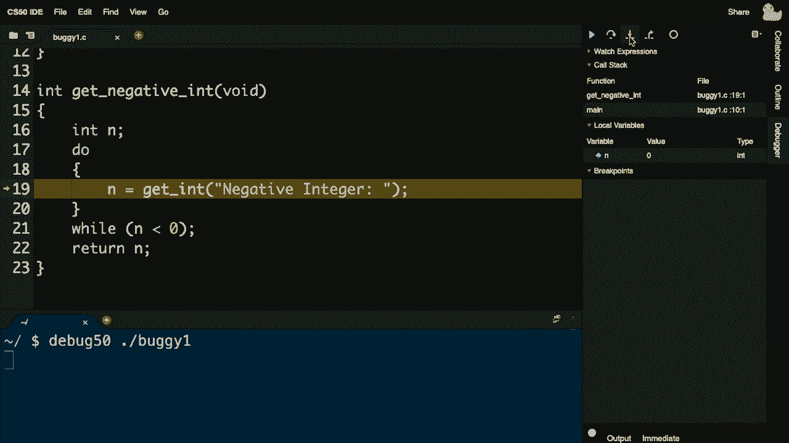

correct it's hard to misuse getint but，notice now on the right hand side，now see，negative ant。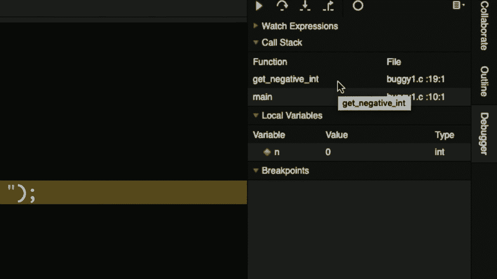

and a stack it's like a stack of trays，in a cafeteria the first tray at the，bottom is like main。the second tray on the stack in the，cafeteria is now，get negative int and what's cool about。this is that notice that，right now i can see my local variables n。and that's indeed the variable i used so，i no longer see i，i see n because i'm into the get。

negative int function，again，and again after typing in a number let，me type in negative one here。now notice on the top right of the，n，equals negative one i'm going to now go，ahead and click step。over and i think i'm going to end up in，line 22。if the human has typed in a negative。integer like negative 1，obviously that's negative let's proceed，to line 22，over。

it actually seems to be going back，to the do loop again and again and again，integers。so my logic then should be well okay if，n is negative one，but my loop is still running like what。should your logical takeaway here be，if n is negative one and that is by。definition a negative integer，could be your，diagnostic conclusion if the debugger is。

essentially revealing this hint to you，n is negative one but the loop is still，going omar。um either the condition is wrong maybe，some sort of boolean logic。could be flawed perfect so obviously，either the condition is wrong or there's。something wrong with my boolean logic，and boolean logic just refers to true or，false so somewhere。

i'm saying true instead of false or i'm，saying false instead of true。and frankly the only place where i have，again and again，must logically be on line 21。so even if。you're not quite sure how to fix it yet，just by deduction you should realize。that okay negative 1 is what's in the，variable but that's not good enough the。

loop is still going i must have screwed，up the loop and indeed。let me just now call it out line 21 is，indeed the source of the bug。so we've isolated it out of 23 lines，we've at least found the one line where，i know the。the solution has to be what's the，solution how do i fix the logic now。

thanks to the debugger having sort of，led me，down this road how do i fix，line 21 here what's the fix。would you propose yeah jacob，you would have to change it from while n，than zero，i want to say n。greater than zero and i think slight，clarification i think i want to include。0 here because 0 is not negative and if，i want a negative n，i think what i'm probably going to want。

to say is while n is greater than or，equal to 0，keep doing the loop so i very。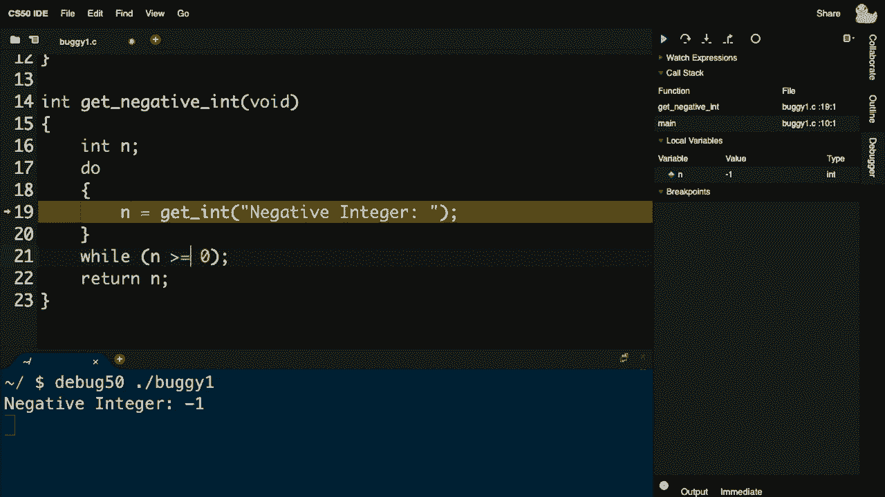

understandably sort of just inverted the，logic no big deal i'm thinking negatives。and i did less than but，the fix is easy the point is the，debugger led you to this point now those。of you who have programmed before，probably saw the bug jumping out at you，before。probably would sometime would have，figured out what the bug was because out。

of 23 lines it's got to be，one of those but as our programs get，more sophisticated and。we start writing more lines of code，debug 50，and debuggers in general will be your。friend and i realize that，this is easier said than done because at。first when using a debugger you're going，to feel like ah this is just i'm just，going to use printf。

i'm just going to sort of fight through，curve，you will gain back that time and more。by just using a debugger as your first，instinct when chasing down。problems like this alright so that's it，kit，in addition to printf but debug 50 is。hands down the more powerful of the two，now some of you have wondered over the，this little。

rubber duck here and there actually is a，reason for this too and there's one。final debugging technique that in，all seriousness we'll introduce you。today too known as rubber duck debugging，and you can google this there's a whole。wikipedia article about it，and this is kind of a thing in computer。

science circles for computer scientists，on their desk，and the point here is that sometimes。when trying to understand，what is wrong in your code it helps to，world。we would just talk to our our colleague，or our partner on some project。and just in hearing yourself vocalize，what it is your code，is supposed to do very often that。

proverbial light bulb goes off and，i got it，just because you heard yourself speaking。illogically when you intended something，actual logical，colleagues or。partners or friends with whom we're，working on a project with and we don't。often have family members or friends who，want to hear about our code。

of all things and so a wonderful proxy，for that conversant，partner would be literally a rubber duck。and so here in healthier times we would，be giving all of you rubber ducks uh。here on stage we brought a larger one，for us all to share，if you've noticed in some of the wide。shots on camera there's a duck who's，been watching this whole time so that。

anytime i screw up i literally have，someone i can sort of，talk to if non-verbally in this case but。we can't emphasize enough that in，addition to printf in addition to the。more sophisticated debug 50 talking，through your problems with code。is a wonderfully valuable thing and if，your friends or family are willing to，writing。

and some bug you're trying to solve，great but in the absence of that talk to。a stuffed animal in your room，talk to an actual rubber duck if you，it's just a wonderful。compelling habit to get into because，just in hearing yourself vocalize what，you think is logical。at you，instead all right so with that said，that's been a lot let's go ah**d here。

and take a five minute break give，everyone a bit of a breather and when we。come back we'll take a look now at some，of the more powerful features of c。now that we can trust that we can solve，any problems with all of these new tools。all right we are back so let's take a，look underneath the，hood so to speak of a computer because。

as fancy as these devices are and as，powerful as they seem，they're relatively simple in their，do。and let's reveal as much by way of last，c，supports different data types so we saw，to recap。we had all of these well it turns out，that each of these data types。is defined on a typical computer system，is taking up a fixed amount。

of space and it depends on the computer，whether it's mac or pc or old or new。just how much space is used typically by，these data types but on cs50 ide。the sizes of all of these types are as，follows a bull，true or false uses just one byte now。that's actually a little wasteful，because one byte is eight bits and。

gosh like for a bool you should only，need one bit you can't work at the，single bit level。easily in c and so we just typically，spend one whole bite on a bull。char is going to be one bite as well and，that might sound familiar because last。week when we talked about ascii，we proposed that the total number of。

possible characters you can represent，with a char was 256，because of eight bits and two to the。eighth power so one，no matter what，then there were all of these other data。types there was float which is a real，number with a decimal point that happens，to use four bytes。a double is also a real number with a，decimal point but it uses eight bytes。

which gives you even more precision you，can have more significant digits，we've used a bunch。those are four bytes typically a long is，twice as big and that just allows you to。represent an even bigger number and some，of you might have done that exactly。on credit when storing a whole credit，card number strings for now。

are a variable number of bytes it could，be a short string of text a long string。of text a whole paragraph，so that's going to vary so we'll come，back to this notion of string。next time but today focus on just these，primitive types if you will。and here is a picture of what is inside，of your computer so this is a piece of。

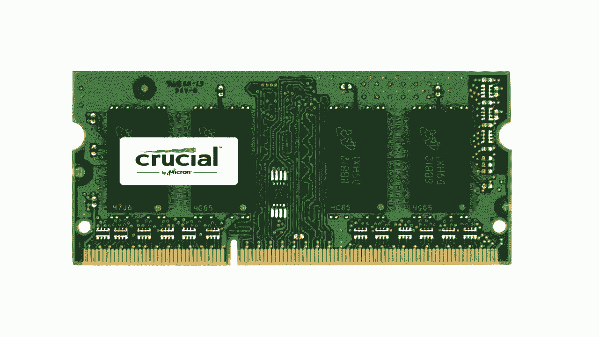

memory or ram random access memory and，it might be a little smaller it might be。a little bigger depending on whether，like，are stored，while they're running and it's where。files are stored when they are open，so typically if you save install，programs or save files。those are saved on what's generally，called your hard drive or hard disk or。

solid state disk or cd or some other，physical medium and that the upside of，electricity。to store your data long term ram is，different it's volatile so to speak。but it's much faster than a hard disk or，a solid state disk even it's much faster。because it's purely electronic and，indeed there are no moving parts。

it's purely electronic as pictured here，and so with ram，you have the ability to open files and。run programs more quickly because when，you double-click a program to run it。or you open a file in order to view or，edit it it's stored temporarily。in ram and long story short if your，battery laptops，if your laptop battery has ever died or。

phone dies，the reason that you and i tend to lose，data the paragraph that you just wrote。in the essay that you hadn't yet saved，is because ram memory is volatile。that is it requires electricity to，continue powering it，focus on。ram not so much long-term disk space yet，because when you're running a program in。

c it is indeed by definition，running in your computer's memory but。the funny thing about something as，simple as this picture，is that each of these black rectangles。is kind of a chip and in those chips are，stored all of the zeros and ones the，week zero。so let's focus it on and just zoom in on，just one of these chips。

now it stands to reason that i don't，know how big this this stick of ram is，maybe it's one gigabyte。a billion bytes maybe it's four，bigger，physically，by this hardware so if we zoom in。further let me propose that all right i，don't know how many bytes are here but。if there's some number of bytes whether，or more，it stands to reason that we could just。

number all of these bytes we could sort，of think of this physical。device this memory as just being a grid，top to bottom left to right and each of。the squ*res i've just overlaid on this，physical device，might represent an individual bite and。again in reality maybe there's more of，them maybe there's fewer of them but it，there are。

we can think of each of these as having，a location like this is the first bite。second bite third bite and so forth，well what does it mean then for a char，to take up one byte。that means that if your computer's，memory is running a program maybe that。you wrote or i wrote that's using a char，variable somewhere in it the char you're。

storing in that variable may very well，be stored in the top left-hand corner。physically of this piece of ram maybe，it's there maybe it's elsewhere but it's。just one physical squ*re，if you're storing something like an int，which takes up four bytes well that。frankly might take up，all four squ*res along the top there or，somewhere else if you're using a long。

that's going to take up twice as much，space so representing an even bigger。number in your computer's memory，is going to require that you use all of，the zeros and ones。comprising these eight bytes instead，but let's now move away from physical。hardware let's abstract it away if you，memory，as just this grid and technically it's。

not a two-dimensional structure i could，just as easily draw all of these bytes。from left to right i could just fit，fewer of them on the screen so we'll。take the physical metaphor a bit further，and just think of our computer's memory，those bytes。are each eight bits those bits are just，is zoom，in metaphorically on our computer's。

memory to start thinking about，where things are going to end up in，memory when you double click on a。program on your mac or pc or，in cs50 ide when you do dot slash hello。or dot slash buggy zero or buggy one，it's these bytes in your computer's。memory that are filled with all of your，variables values，so let's consider an example here。

suppose i had written some code，that involved declaring three scores。maybe it's a class that's got like，three tests and you want to average the。use uh the student's score。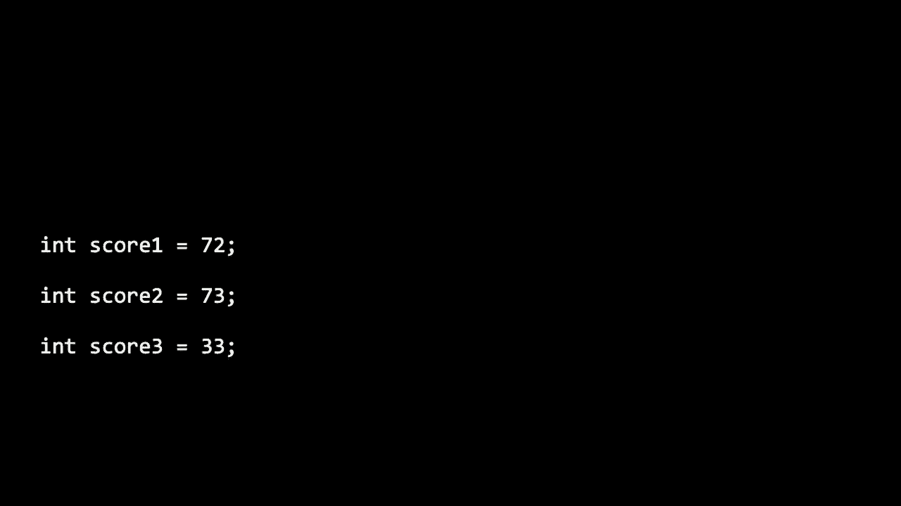

acro the student's grade across all，three of those tests well let's go ah**d，exactly this。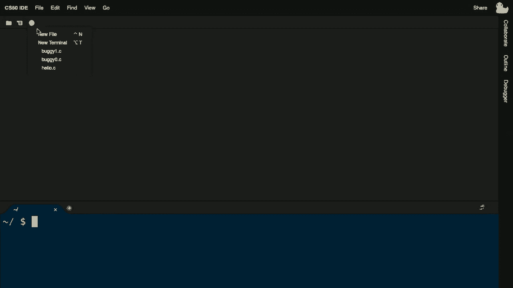

in cs50 ide i'm going to create a，program called scores。c，and in scores。c i'm going to go ah**d。i'm standardio。h to then do my int main，void as usual and then inside of here。i'm going to keep it very simple i'm，going to give myself one int。called score one and just to be a little，72，like last week i'm going to give myself。

a second score and set it equal to 73，and then a third score call whose value，is going to be 33。and then let me go ah**d and print out，the average，of those three values by plugging in a。placeholder for a floating point value，right if you do if you add three，integers together。and divide them by three i may very well，get a fraction or a real number with a，percent f。

instead of percent i because i don't，want to truncate someone's grade。otherwise if they have like a 99。9，they're not being rounded up to 100。they're going to get the 99 because of，truncation as we discussed last week。so how do i do now the math of an，average well it's pretty straightforward，score 1 plus score 2，math。

that file，let me do make scores at the bottom，again we're not going to use clang，manually no need to。because it's a lot easier to run make，but i did mess up here，argument has。type in so i don't quite understand that，but it's drawing my attention to the，percent f。and the fact that my math looks like，this，printf，is going to help me here because i'm the。

bug is within the printf line，i don't think that debug 50 is going to。really help me here because i already，know what line of，code the bug is in this feels like an。opportunity to like talk to the，object，or we can perhaps think about what，errors we ran into even。last week uh arpan，what do you think，i think it's because all right it's。

telling you this because it's，it's receiving a all the uh values are，in integer type。but you are telling it to be influenced，yeah you're putting it into the average。exactly score oh go ah**d，yeah sorry so the computer is just still，keeping it as float。so as a result it doesn't know what to，do indeed so score one score two score，three are all integers。

integer and so，this time the compiler is smart enough，to，coerce an integer result into a floating。point value but you haven't done any，floating point arithmetic if you will。so you know there's a few ways to fix，this last week recall，we proposed that you could use a cast。and you could explicitly，cast one or more of those values to a，float so i could do this for instance。

or i could cast all of these to floats，or one of these to floats there's many，simplest fix。is just to divide for instance by 3。0 i，can avoid some of the the headaches of。casting from one to another，by just making sure that there's at。least one floating point value involved，in this arithmetic so now let me，recompile scores。

this time it compiles okay let me do dot，slash scores and voila，my average isn't so high 59。3333。all right so what is actually going on，inside of the computer in，irrespective of the floating point。last week，well let's consider these three，three，where are they actually being stored in。consider that，grid again and again i'm going to start，at top left for convenience。

but technically speaking and we'll see，this down the road your computer's。memory is just like this big，different places，but for today we'll keep it clean the。first variable score one，i claim is going to be here top left for。simplicity but what's important about，stored，is it's come taking up four of these。

boxes each of these boxes recall，represents one byte，and an integer recall and cs50 ide is。four bytes，therefore i have used four bytes of，space to represent the number 72。the number 73 in score two similarly is，three，gonna take up four boxes as well but。what's really going on，underneath the hood here well if each of。

these squ*res represents a byte and each，of those bytes is eight。bits and a bit is just a zero or one，what's really going underneath the hood。is something like this somehow this，electronic memory，is storing electricity in just the right。way so that it's storing，and decimal，decimal，this pattern of zeros and ones aka 33。

in decimal but again we don't have to，keep thinking about or dwelling on the，that。everything we've discussed thus far is，coming together now in this one picture。because the computer is just storing，these patterns for us and we are。allocating space now thanks to our，programming language，via code like this but this code。

correct though it may be indeed 59。33333，and so forth was my average if my test。scores were 72 73 and 33，but i feel like there's an opportunity，for better design here。so not just correctness not just style，recall that design is this other metric，of code quality。and it's a little more subjective and，it's a little more subject to debate，among reasonable people。

but i don't really love what i was doing，with this，naming scheme and in fact if we look at。the code there really wasn't much more，to my program than these three lines。i worry this program isn't particularly，well designed，about。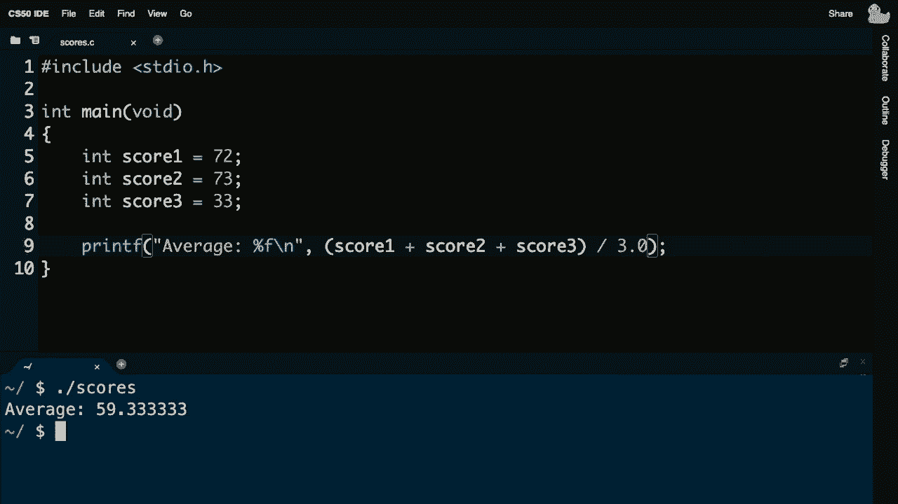

those three lines of code what could be，and even if you don't know the solution。especially if you've never programmed，before，what kind of smells about those three，code smell。it's like something not loving that for，on it。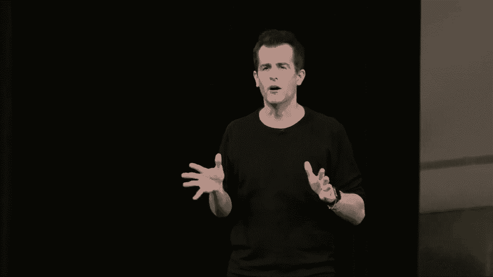

what's，smelly if you will about score one score，i was going to say if you're doing an，add them up。all together in the code you can add，variable，absolutely if i'm computing the average。i don't need to keep all three around i，can just keep a sum and divide the whole。sum by the total number i like that，like，about the design of this code now score，one score two score。

three score one score two score three，might there be opportunities still for。improvement i feel like anytime you，start to see this repetition，oh um i think i would not。hard code the three scores together okay，so not hardcode the three scores and。what would you do instead，i would maybe take an input or i would。

yeah i wouldn't i wouldn't write out the，scores themselves yeah another good，written a program。compiled a program that only computes，the average for some student who。literally got those three test scores，here，moreover it's a little lazy too that i。called my variables score one score two，score three i mean where does it end。

after that if i want to have a fourth，test next semester，now i have to go and have score four if。i've got a fifth score five，that starts to sort of be reminiscent of。