# 【双语字幕+资料下载】哈佛CS50-CS ｜ 计算机科学导论(2020·完整版) - P5：L2- 字符串、数组、调试方法 2 - ShowMeAI - BV1Hh411W7Up

wasn't the best practice，and so let me propose that we clean this，up。by way of another topic another feature，languages，known as arrays and if you happen to use。something called a list in scratch，very similar in spirit to scratches，lists but we didn't see，array。in c as in other languages is，a sequence of values stored in memory。

back to back to back a sequence of，contiguous values so to speak。back to back to back so in that sense，right，if we use the metaphor of the picture。we've been drawing so how might this be，germaine here well it turns out that if。you want to store a whole bunch of，values but they're all kind of。

interrelated like they're all scores，you don't have to resort to this sort of。lazy score one score two score three，score four score five，at the score 99 depending on how many。scores there are why don't you just call，all of those numbers scores but use a，syntax。gives you access to what are called，arrays so the syntax here on the screen。

is an example of declaring space for，three integers all at once and。collectively referring to all of them，as the word scores so there's no more，scores one two and three。all three of those scores are in a，here，is a number，that literally connotes how many。integers do you want to store，under the name scores so what does this，allow me to do，integers。

in that array so this array is going to，back，that i can put values in and the way i。put those values is going to look，syntactically like this，i still use numbers but now i'm using a。new notation，and it's similar to what i resorted to，before but it's a little more。generalized now on dynamic，now if i want to update the very first，score in that array。

i literally write the name of the，variable scores bracket 0，close bracket and then assign it the。value if i want to get at the second，score i do scores bracket one。if i want the third score it scores，bracket two and the only thing that's a。little weird and a little，uh takes some getting used to is the。

fact that we are zero，indexing our arrays so in past examples，of said。it's a convention in programming to，start counting from zero，when it comes to arrays which are。contiguous sequences of values in a，computer's memory，they have to start at zero otherwise if。you don't start counting at zero you're，literally going to be wasting space。

by overlooking one value so now if we，were to rename things on the screen。instead of calling these four these，three rectangles，score one score two score three they're。all called scores but if you want to，refer specifically to the first one。you use this fancy bracket notation and，the third one，this bracket notation but notice the。

dichotomy when，array saying，give me three ins you use bracket three。where bracket three is the total number，of values，when you index into the array that is。when you go to a specific location，use numbers，but now those are referring to their。relative positions position，zero position one position two this is，the total number，first。

second and third all right so，pictorially nothing has changed just our，nomenclature really has。so let me go ah**d and start to improve，this program taking in the advice。um that was offered too on how we can，sort of，the smelliness of it let me take the，first let me take。the easiest easiest of these approaches，first by just getting rid of these three。

separate variables and instead giving me，one variable called scores，then，two again that's all。going away that's all going away that's，all going away now if i want to。initialize that array with these three，values i say scores bracket zero。and down here i say scores bracket one，and down here i say scores bracket two。

so i've added one line of code but，have a fourth one，i can just allocate here and then put in。the value with another line of code or，five or six or seven or eight i don't。have to start copying and pasting all，convention，but i think if we take some of the。advice that was offered a moment ago we，can also clean this up by way of a loop。

or such as well so let's do that let me，go ah**d and give myself，actually first the cs50 library。so that i can use getint and let's take，this first piece of advice which is。let's start asking for a score，using get int and i'm going to do this，three times。and i don't yeah i'm getting a little，lazy i'm getting a little bored already。

so i'm going to copy paste and again，that does not bode well in general when。copying and pasting we can probably do，better still，but now i think i need to change just。one more thing here when doing the math，i want score zero plus scores one，problem here。the logic is still the same but i'm now，taking in dynamically three integers。

there's still a smell to it as well it's，to，make clear what could i do be doing，better now。how could i clean up this code and make，but，better designed what remains here nina。um the code is like specific for only，three scores so you could like ask an，input toward like。how many scores it wants at the very，beginning，and then so like having score bracket，for loop。

that goes through from zero to，um n minus one or like less than n。that will like ask and it should be like，one line of code instead。yeah really good it's the fact that we，have get in get in get in that's like，doing something sub。optimally it might be correct but it's，probably not well designed because i did。

literally resort to copy paste，there's sort of a pattern here that i，like a loop so。let me do that let me actually get rid，of two of these lines of code let me go。up here and do something like for，int i get zero i less than three for now。i plus plus let me open up this for loop，code，and instead of scores bracket zero this。

is where arrays get really powerful，array，that is to go to a specific location。what do i want to use for my variable，well i would think i here so now i've。whittled my lines of code down from all，three triplicate three nearly identical。lines into just one really inside of a，loop that's gonna do the same thing for，too。

i don't have to hard code these threes，all over the place maybe i could do，something like this，get。scores，and i could literally ask the human from，there，variable。total in multiple places so that now i'm，though，going to be，a little more i need to exert a little。more effort here on line 14 because now，i can't hard code，score 0 1 and 2 because if the number，that。

i need to do more addition if it's fewer，than that i need to do less addition。so i think we've introduced a bug but we，can fix that but let me propose for just。a moment let's not make it dynamic，harder，let's at least introduce one other，features here first。i'm going to go ah**d up here and define，a new feature of c today。

which is known as a constant if i know，in advance that i want to declare。a number that i want to use again and，again and again，without copying and pasting literally，constant。int via const int。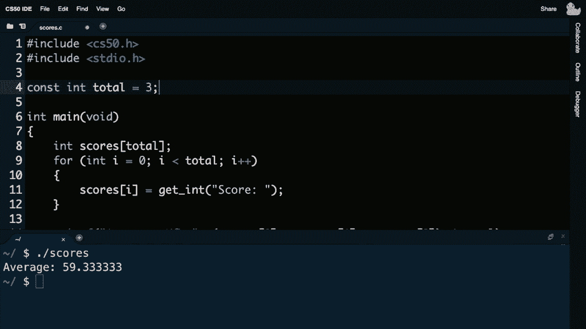

total equals three this declares what's，called a constant in programming。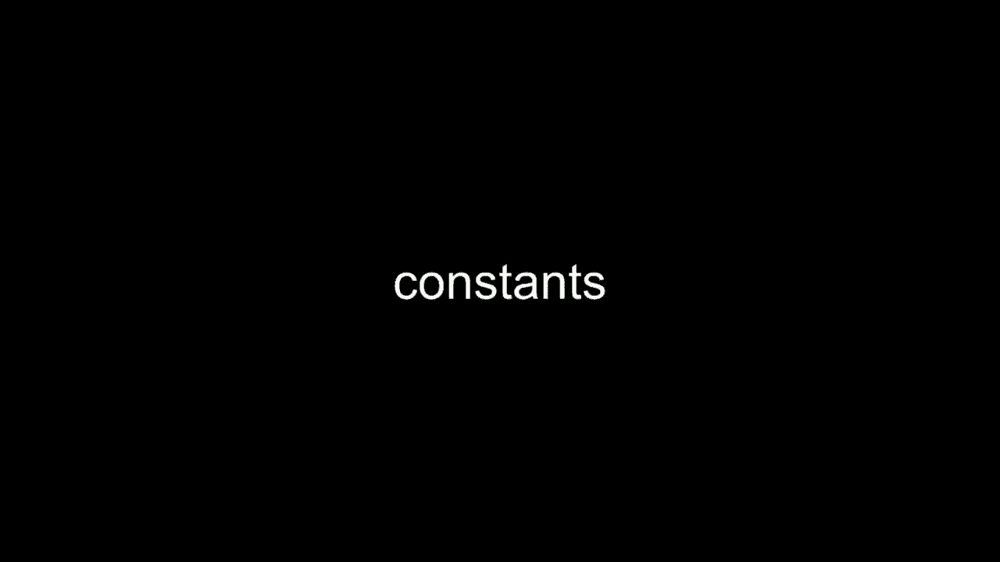

which is a feature of many languages，whereby you declare a variable of sorts。whose value can never change once you，set it you cannot change it and that's a。good thing because one，it shouldn't change in the context of，this program and two just in case you。the human are fallible，you don't want to accidentally change it，when you don't intend so this is a。

feature of a programming language that，sort of protects you，from yourself so now i can sort of take。an amalgam of my instincts and neenas，and use this variable total and actually。another convention when declaring，constants is to capitalize them。just to make visually clear that there's，this variable，i'm going to use total here and here。

and here you didn't see that，turns out it's a convention when you。want to draw attention to a constant，to capitalize it in all caps so i'm。going to change this to total and i'm，going to use that value，here and here and also down here。but i'm afraid both nina and i have a，little bit of cleanup here to do in that，scores one。

and scores two and i want to add a，changing number of values together so。you know what i've got an idea，let me go ah**d and create a function。that's going to compute an average，for me so if i want to create my own。function that computes an average i want，it to return a floating point value just。

so that we don't re a truncate，any math i'm going to call this average，and the input。to this function is going to be the，length of an array，and the actual array and this is the。last piece of funky syntax for now，it turns out that when you want to pass，an array。as input to a custom function，you literally use those squ*re brackets。

again but you don't specify the size and，the upside of this，is that your function then can support。an array that's got，one space in it two spaces three a，hundred it's more dynamic this way。so how do i compute an average here i，think，what was suggested earlier makes sense，let me do。int sum equals 0 because how do you，compute the average of a bunch of。

numbers well you add them all together，and you divide by the total。well let's see how i might do that let，me do for int i get 0，i'm。being passed as this custom function the，length of the array，iterate from i。up to length and then i plus plus on，each iteration，and then on each iteration i think i。

want to do sum，plus whatever is in the arrays，ith location so to speak so again this。is shorthand notation per last week，for this sum equals whatever sum is。plus whatever is in location i，of the array and once i've done all of。that i think what i can do is return，the total sum divided by the length of，the array。

and what i like about this whole，approach assuming my code is correct and。i don't think it is just yet，notice what i can do back up in main now。i can abstract away the notion of，calculating an average。

with this line of code here so what did，i just do a lot's going on but let's。focus for a moment on line 14，here on line 14 i'm still just printing，the average of some floating。point placeholder but what i'm passing，as input now，is this function average whose inputs。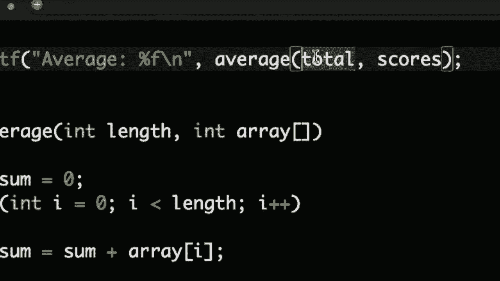

are going to be total，which again is just this constant at the。very top oh sorry i goofed i should have，capitalized it，which is just that constant at the very。again，is just this array of all of those，scores，meanwhile in the custom function in the。context of the，custom function notice that the names of，the inputs to a function。

do not need to match the names of the，variables being passed into that。function so even though in main，they're called total and scores in the。context of my custom function average i，can call them x and y，array。i don't know what the array is but it's，an array of ints and i don't know how。

long it is but that value，that answer is going to be in length but，there's still a bug here。there's still a bug and if we ignore，maine for a moment this is a subtle one。does anyone see a mistake that i've made，past，two weeks what mistake subtle have i。made here with my code，this one's a little more subtle but the，goal is to compute the average of a。

whole bunch of integers，and return the answer nicholas，within the。function i've declared the variable，within the，function that's okay because i've，you mean，function。and i'm using some inside of the，outermost curly braces that it that was。defined and so that's okay that's okay，let's take another thought here uh，olivia。

uh the return types of flow but you're，returning an n divided by an end。perfect so i again made that same stupid，mistake that's just going to get more。obvious as time goes on，that if i want to do floating point，arithmetic just like the aryan rocket。discussion the patriot missile like，these kinds of details matter in a。

program now it's correct because i'm，actually going to ensure，is much less。important than those real world contexts，just computing some average of scores。i'm not going to accidentally truncate，any of my values，so again in the context here of this。function average is just applying some，variable，i've got a loop and i'm doing some。

floating point arithmetic ultimately，takes two，inputs one is length and one is the。length one is the array itself，float，so that my output is also well defined。but what's nice about this，again you can think of these functions，as abstractions now。i don't need to worry about how i，calculate an average because i now have，this helper function。

a custom function i wrote that can help，me answer that question。and here notice that the output of this，average function，will become an input into printf。and the only other feature i've added to，the mix here now are not only arrays。which allow us to create，multiple variables a variable number of，variables if you will。

but also this notion of a constant if i，find myself using the same number again，and again and again。this constant can help me keep my code，clean and notice this if next year maybe，four tests，boom。i'm done a well-designed program does，not require that you go reading through，and numbers there。changing it in one place can allow me to，improve this program make it support，four tests next year。

uh instead of just the three but better，still would be，uh to take i think nina's advice before。which was to maybe just use get int and，ask the human，for how many tests they actually have，that too。would work well let me pause here to see，if there's any questions then。about arrays or about constants，outputs，in this way uh yeah，i had a question about um the use of a。

float and why，like the use of one flow um causes like，the whole output to be afloat。why does that yeah really good question，there is，one or more floating point values。involved in a mathematical formula，it is going to use that data type。which is the more powerful one if you，will rather than risk，truncating anything so you just need one。

float to be participating in the，the formula in question good question，other questions on arrays or。constants or this passing around，i had a question about the declaring of，the。the array scores when you declared it in，main，uh you said int scores and。in the brackets you have total can you，declare it without，the total。

really good question brackets short，answer no so the way i did it is the way。you do have to do it and in fact if i，highlight what i did here。now it currently says total if i get rid，version，where i said something like three and。three and three，uh three over here uh you cannot do this，proposing。

the computer needs to know how big the，array is when you are creating it。the exception to that is that when，you're passing an array from one，function to another。you do not need to tell that custom，function how big the array is because。again you don't know in advance you're，function，whose purpose in life is to take any uh，length，that。

matches the size of that thing and those，of you as an aside who have programmed。before especially in java，unlike in java and certain other，languages the length of an array is not。built into the array，itself if you do not pass in the length，of an array to another function。there is no way to determine how big the，array is this is different。

from java and other languages where you。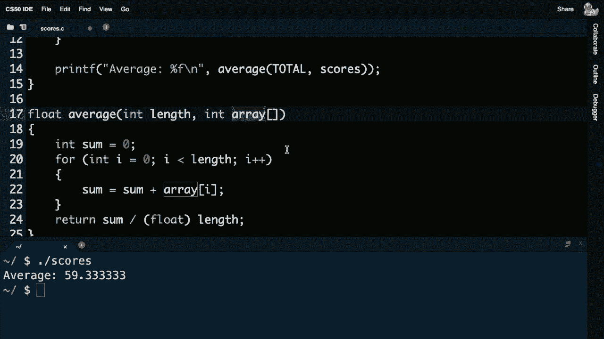

can ask the array in some sense，what is its length in c you have to pass，both the array itself。

and its length around separately cena，oh uh hello i just i'm still a little，bit confused about。when does it go，when is it when does it void in the，parentheses and。when do we uh define the ends because，like as i remember when we did the get a。negative number or get a positive number，an input，i'm just not completely sold on that。

sure good question let me go ah**d and，open up that previous example which was。a little buggy but it has the right，in function，from before and as cena you know it was。void as input，so there was one comment you made where，it still took input that was not so so。get negative in did not take any input，and case in point if we scroll。

up to main notice that when i called it，on line 10，i said get a negative in open。parenthesis close parenthesis with no，inputs inside of those parentheses so。this keyword void which we've seen a few，times now last week and this week。is just an explicit keyword in c that，says do not put anything here。

which is to say it would be incorrect，for me up here，to do something like this like to pass。in a number or to pass in a prompt or，anything inside of those parentheses the。fact that this function get negative，in takes void as its input means it does。not take any inputs whatsoever，that's fine forget negative in the name。

of the function says it all like there's，no need to parameterize，or customize the behavior of get。negative into itself you just want to，get a negative int，just wrote，average this function does make。you can't just say，give me the average like average of what，like it needs to take input so it's to。answer that question for you and the，of numbers，and the length of that array so you can。

do the arithmetic，and so cena hopefully that helps make，the distinction you use void when you。don't want to take，input and you actually specify a comma，separated list。of arguments when you do want to take，input，all right so we focused up until now on。integers really but let's let's simplify，a little bit because it turns out。

that arrays and memory actually，intersect to create some very familiar，namely，suppose we。we simplify further no more integers no，for a moment，with a single character and write a。program that just creates，like a single brick from like that mario，game let me go ah**d and create a。program here。

called brick dot c and in brick dot c，i'm just going to include standard io。h。int main void and more on this void a，little later today，char c gets quote unquote hash。and then down here let me just go ah**d，and print very simply，a placeholder percent c backslash n。and then output c so this is a pretty，stupid program its sole purpose in life。

is to print a single hash as you might，have in a mario pyramid。of height one so very simple let me go，ahead and make brick，it seems to compile okay let me run it。with dot slash brick and voila we get a，a moment，exactly what just happened here。and what actually was going on，underneath the hood well you know what。

i'm kind of curious i remember from last，week we could cast values from one thing，to another。what if i got a little curious and i，didn't print out c，which is this hash character as percent。c which is a placeholder for，a character what if i got a little crazy，and said percent i。i think i could probably coerce this，char，decimal，equivalent i could see its actual ascii。

code so let me rebuild this，brick，and what number might we see last week，we saw 72 a lot。73 and 33 for high this week，you can see 35。it turns out is the code。for an uh an ascii hash and you can see。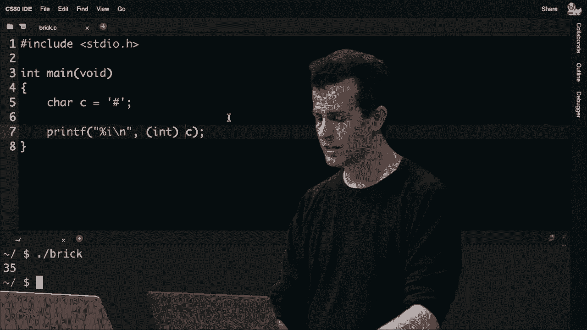

this for instance，if i go to a website like let's go to，ascii，chart。com and sure enough if i go to the。

same chart from last week，and i look for the hash symbol here its，ascii code is 35。and it turns out in c，if it's pretty straightforward to the。computer that yes if this is a character，i know i can convert it to an，you can instead。implicitly cast one data type to another，just from context here so printf and c。

are smart enough here to know okay，you you're giving me a character in the，form of variable c。percent i。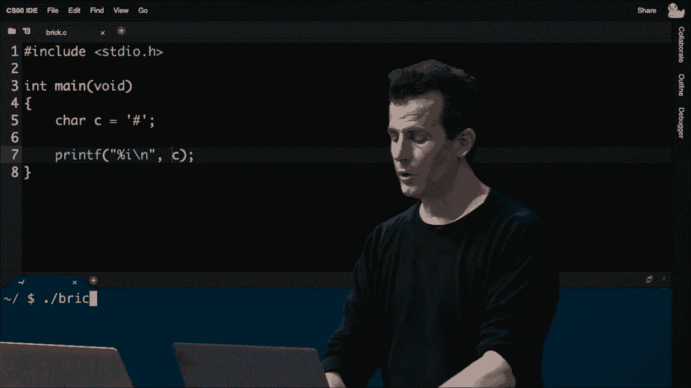

an integer that's going to be okay and，indeed i still see the number 35。so。that's just simple casting，but let's now put this into the context。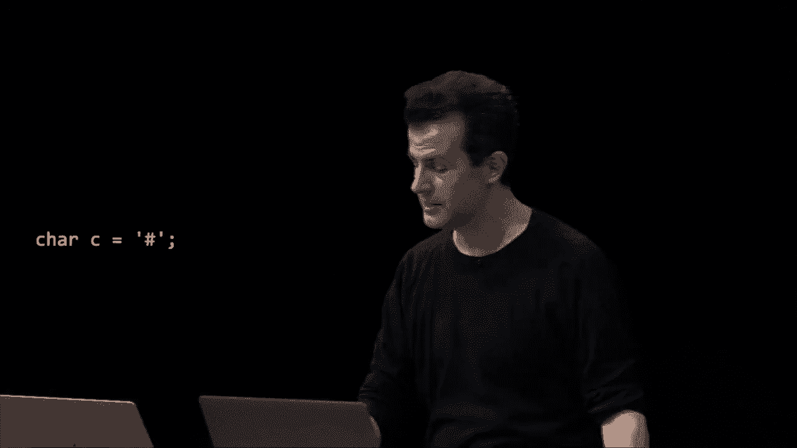

laid out，well quite simply if this is my memory，numbers，storing。uh is just being stored in one of these，because again，a char is a single byte。but equivalently 35 is the number that's，actually being stored there。but i wonder i wonder last week we spent，quite a bit of time storing not just，hi。

and other expressions and so what if i，were to do something like this let me go，back to my code。and let me not quite yet practice what i，just preached and let me give myself。three variables this time，c1 c2 and c3 and let me deliberately，store in those three variables。h i in all caps followed by an，exclamation point and per，last week when you're dealing with。

individual characters，you're dealing with，multiple characters otherwise known last，week as strings。use double quotes but that's why i'm，using single quotes because we're only，playing at the moment。with single characters now let me go，ahead and print these，percent c，percent c and output c1 c2 c3。so this is perhaps the stupidest way you，could print out a full word，storing。

every single character in its own，variable but so be it，i'm just using these first primitive。percent c，as my placeholder i'm printing out these，characters so let me do make brick now。compile is okay and if i do dot slash，you know i really should have renamed。this file but we'll rename it in a。

moment dot slash brick hi，and let me go ah**d and do this let me，go ah**d now and actually。close the file and recall from last week，if i want to rename my file from brick，brick。c。let's say to high。c i can use the move，command mv。

and now if i open up this file sure，enough there's high。c，and i've fixed my renaming mistake。all right so again if i now do make high，and i do dot slash high。voila i see the high but again this is，kind of a stupid way of，implementing a string but let's still。look underneath the hood let me go ah**d，and get curious let me print out。

percent i percent i and percent i and，let me include spaces this time just so，i can see。uh separation between the numbers let me，make high again，dot slash high okay there's that 72。there's that 73。

and there's that 33 from last week so，that's interesting too so what's going。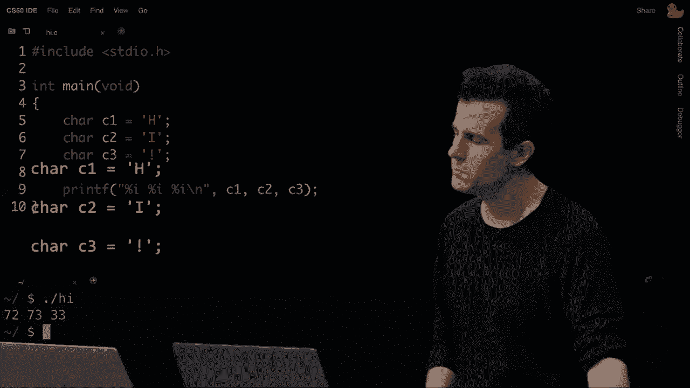

memory，well when i'm storing these three，characters now i'm just storing them。in three different boxes so c1 c2 c3，and when you look at it collectively it。kind of looks like a whole word，even though it's of course just these。individual characters so what's，underneath the hood of course though is。

72 73 33 or equivalently in binary，just this so the story is the same even。though we're now talking about chars，instead of integers but what happens，when i do this。what happens when i do string s gets。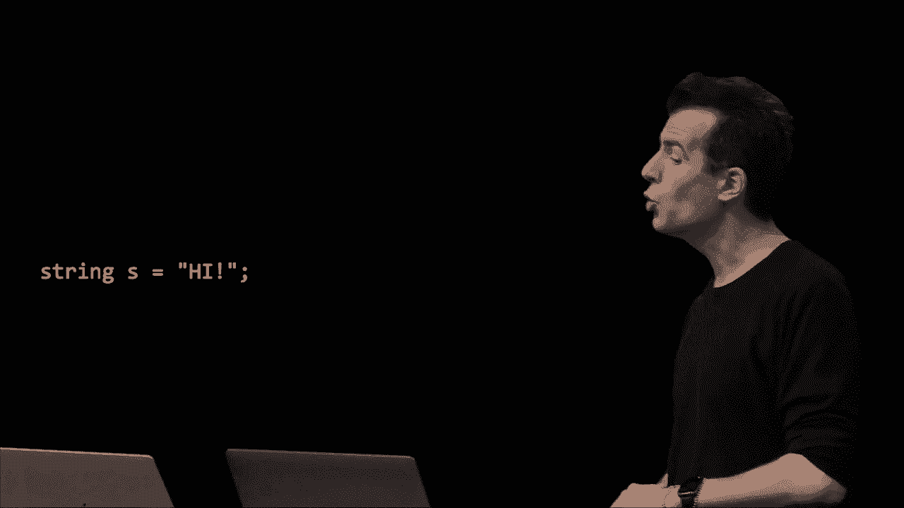

quote unquote high，using double quotes well let's change，this program accordingly。let me go ah**d and do what we would，have done last week string i'll call it。s just for s for string high in all caps，i can simplify this next line let me use。percent s as a placeholder，for a string s let me go ah**d and，recompile this，this make。

hi and huh five errors my god like eight，lines of code and five errors that's not，week。always scroll up to the very first error，because it might just be some annoying。cascading effect where，the compiler got confused use of。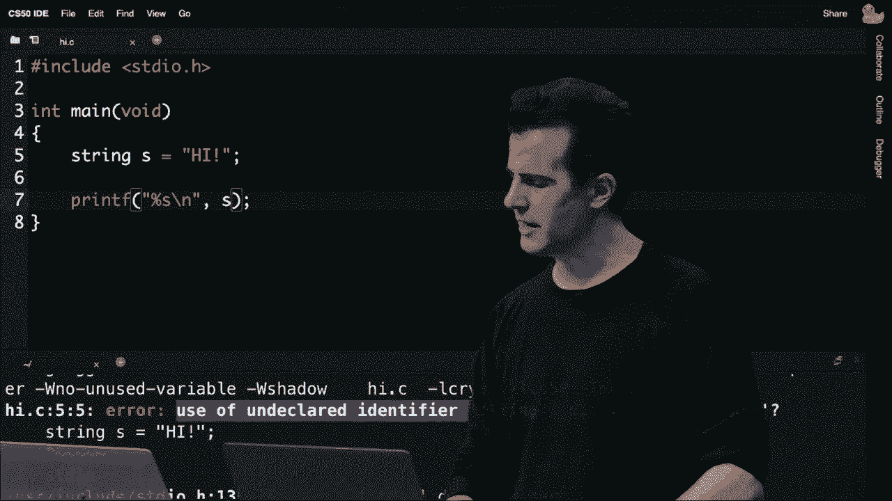

standard，in i didn't but this is because string，it turns out does not technically exist。it turns out that this word string that，one，doesn't actually exist in c it's a bit。of a white lie or a bit of a feature if，you will of cs50s library。and we'll take this training wheel off，next week but let's for now reveal what。

a string really is because string is a，term of art every programming language，has strings。even if it doesn't technically have a，data type called string，called string。we have added this type to c by way of，cs50s library but now if i do make high。notice that my code compiles okay and if，i do dot slash hi，enter voila i still see hi which is what。

i would have seen last week as well，and if we depict this in the computer's，memory because。hi is three letters it's kind of like，saying well give me three boxes。and let me call this string s so this，feels like a reasonable，artist rendition of what s is if it's。storing a three-letter word like hi，but any time we have sequences of，characters like this。

i feel like we're now seeing the，capability of a proper programming。language we introduced a little bit ago，the notion of a string。so maybe could someone redefine string，of today's，nomenclature like what is a string。there's an example of one，high taking up three boxes，but how did we cs50 maybe implement。

string underneath the hood，uh well it's an array of characters and。integers well if integers are used in，basically，single characters perfect if we now have。the ability to express，very nicely done tucker if we now have，the ability to represent。sequences of things integers for，instance like scores，well it stands to reason that we can。

take another primitive a very basic，data type like a char and if we want to，english words。well let's just think of a string really，as an array，of characters an array of chars and。indeed that's exactly what，a string actually is so this thing here，high exclamation point。technically speaking is an array called，s and this is s bracket zero this is s。

bracket one this is s bracket，two it's just an array called s now we。didn't use the word array last week，because it's not as familiar as the，instance。but a string is apparently just an array，and if it's an array that means we can，access if we want。array，from today，but it turns out there's something a，little special。

about strings as they're implemented，recall in our example，involving scores the only way we knew。how long that array was was because i，had a second variable called，total。number of integers in that array，that is to say in our scores example not，also kept，array。with two variables however up until now，every time you and i have used the，printf function。

and we have passed to that printf，function a string like，s we have only provided printf。with the string itself or logically we，have only provided printf with，somehow。printf is magically figuring out，how long the string is after all when。printf prints the value of s it is，printing h i，exclamation point and that's it it's not。

going and printing four characters or，five or twenty right it stands to reason。that there's other stuff in your，computer's memory if you've got other。variables or other programs running，yet printf seems to be smart enough to，know given an array。how long the array is because quite，simply it only prints，out that single word so how then。

in memory if，all a string is as a sequence of，characters well it turns out，is this one h。i exclamation point technically a string，implemented underneath the hood uses。four bytes it uses four bytes it uses a，fourth byte，to be initialized to what we would。describe as backslash zero which is a，weird way of describing it，but this just represents a special。

character otherwise known as the null，that，represents the end of a string so that。is to say when you still create a string，quote unquote with double quotes h i，exclamation point。yes the string is length three but，you're wasting or spending。four total bytes on it why because this，is a clue to the computer，string。

maybe begins it is not sufficient to，just start printing characters。inside of printf one at a time left to，right there needs to be the sort of。equivalent of a stop sign at the end of，the string saying，that's it for this string well what are。back to decimal，72 73 33 that fancy backslash zero was，just the way of saying in。

character form it's zero more，specifically，squ*re，so to store a string the computer，extra byte。all zero bits otherwise written as，literally，the value zero so this thing otherwise。colloquially known as，null is just a special character and we，to，in just a moment if i go back to my。ascii chart。com from before notice，number zero is known as null n-u-l in，all caps。

all right so with that said what is，powerful then about strings once we have，this capability well。let me go ah**d and do this let me go，back into my code from a moment ago。and let me go ah**d and enhance this，little，curious as to what's going on you know。what i can do i bet what i can do here，in this version here is this you know。

what if i want to print out all of these，characters of s，i can get a little curious again and。print out percent c，array，per today's syntax i can technically do，s bracket 0。s bracket 1 s bracket 2，and then if i save this recompile my，code with make hi。okay dot slash high i still see high，but you know what let me get a little。

more curious let me use percent i，so i can actually see those ascii codes，high。dot slash high there's the 7273，33 now let me get even more curious let，me print a fourth value。like this here s bracket 3，which is the fourth location mind you so，if i now do make hi。and dot slash hi voila now you see zero，and what this hints at is actually a。

very dangerous feature of，c you know suppose i'm curious at seeing，what's beyond that。

i could technically do s bracket four，to my picture。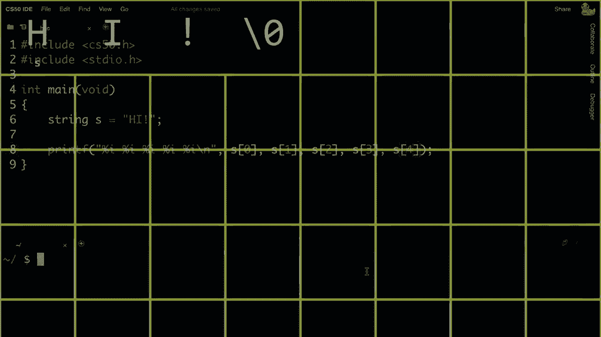

there really shouldn't be anything at，the fifth location at least not that i，know about just yet。but i can do it in c nothing's stopping，me so let me do make high。dot slash high and that's interesting，apparently there's the number 37 what is。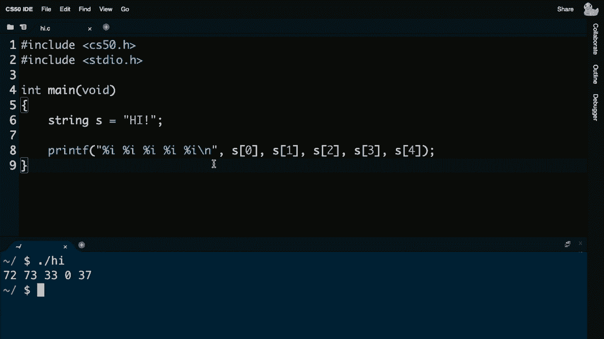

the number 37 well let me go back to my，ascii chart。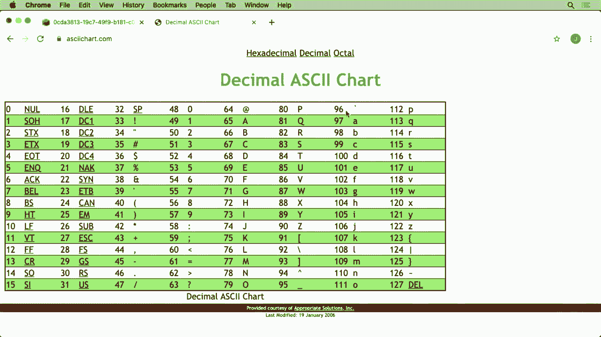

and let me conclude that number 37 is a，percent sign so that's kind of weird，percent。now i'm kind of poking around the，computer's memory in places i shouldn't，be looking in some sense。in fact if i get really curious let's，look not at location 4 how about，location 40 like。way off into that picture make high，look at location，400 recompile my code make，hi dot slash hi。

and now it's zero again so this is，about c，you want，you're essentially just on the honor。system not to touch memory that doesn't，next week，are we going to start accidentally，you。and you'll see that it actually can，including，programs on your own mac and pc yet，another source。of common bugs but now that we have this，ability to store，strings as。

arrays well let's go ah**d and consider，how you might have multiple strings in a，store。two strings in a program let's call them，s and t respectively，another programmer convention if you。need two strings call the first one s，then the second one t，maybe i'm storing high then buy well。look like，well let's go let's do some digging high，as before is going to be stored here so。

this whole thing refers to s and it's，taking four bytes because the last one，is that special null。character that just is the stop sign，that demarcates the end of the string，b y e。exclamation point five bytes because i，need a fifth byte，to represent another null character and。this one deliberately wraps around，though again this is just an artist，rendition。

there's not necessarily a grid in，reality bye exclamation point，backslash zero now represents t。so this is to say if i had a program，like this，started，poking around the computer's memory just。using the squ*re bracket notation，of b，or y or e just by looking a little past，the string s。so again as complicated as our programs，get all that's going on underneath the。

hood is to just plop things down in，memory，in locations like these and so。now that we have this ability or maybe，this mental model for what's going on。inside of a computer we can consider，some of the features that you might want。to now use in programs that you write，so let me go ah**d here and whip up a。

quick program for instance，that goes ahead and let's say，prints out the total length of a string。let me go ah**d and do this i'm going to，go ah**d and create a new program here。

in cs50s ide and i'm going to call this，one string，dot c and i'm going to very quickly at。the top include as usual，cs50。h and i'm going to go ah**d and，include standardio。h。and i'm going to give myself int main，void and then in here i'm going to get，myself a string so。string s equals getstring and let me，just ask the human for some input，whatever it is。

then let me go ah**d and print out，literally the word output。

just so that i can actually see the，result and then down here whoops。

whoops sorry。

down here let me go ah**d and print out，that string for，int i gets 0 i is less than。huh i don't know what the length of the，string is yet so let me just put a。question mark there which is not valid，code but we'll come back to this。i plus plus and then inside of the loop，i'm going to go ah**d and print out，every character。

one at a time by using my new array，notation and then at the very end of，line。just to make sure the cursor is on its，own line so this is a complete program。that is now as of this week going to，treat a string as an array。ergo my syntax in line 10 that's using，my new fancy squ*re bracket notation。

but the only question i haven't answered，yet is this，string，how do i know when to stop well it turns。out thus far when we're using for loops，we've typically done something like just，count from。zero on up to some number this condition，though is any boolean expression i just。need to have a yes no，or a true false answer so you know what，i could do keep looping。

so long as character at location i。

and s does not equal backslash zero，so this is now definitely some new，syntax let me zoom in here。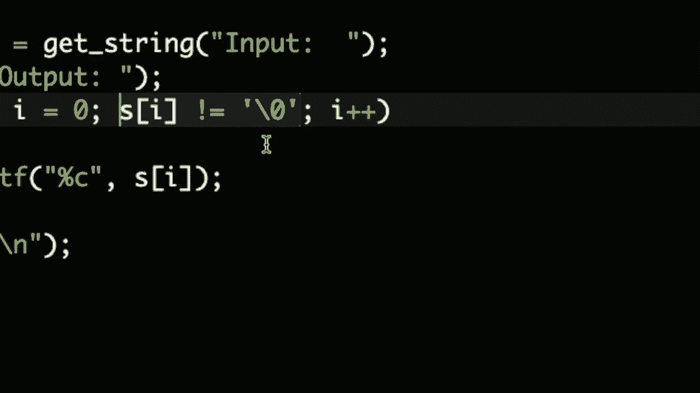

character in s，position i，in s bang equals so bang is how a，programmer pronounces exclamation point。because it's a little faster bang，equals means does not equal so this is。how you would do an equal sign with a，slash through it in math it's in code。uh exclamation point equal sign and then，notice this funkiness，character。

but it's in single quotes because again，it is by definition a character。and for reasons we'll get into another，time backslash zero，is how you express it just like。backslash n is kind of a weird escape，character for the new line，all zeros。so this is kind of a different for loop，i'm still starting at zero oh for i。

i'm still incrementing i as always but。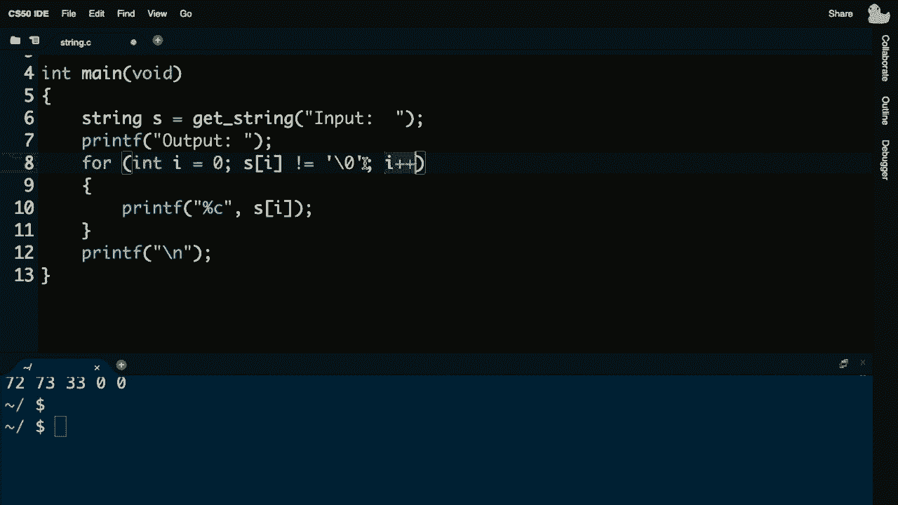

i'm now not checking for some，computer。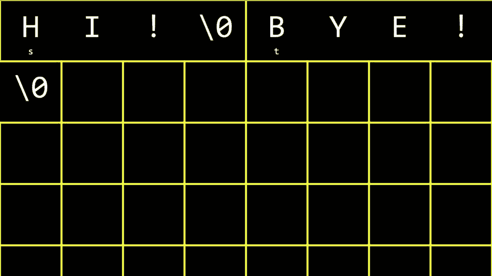

strings end，i only know that they end once i see，backslash zero。so when i now go down here and do make，string，it compiles okay dot slash string let me。type in something like，hello again，let me do it again buy in all caps and。the output is by so it's kind of a，useless program in that it's just。

printing the same thing that i typed in，but i'm conditionally using this boolean。expression to decide whether or not to，keep printing characters now thankfully，this for me。it turns out there is a function called，stur lang，so i can literally just say well figure。out what the length of the string is，the function is called stir lang for。

string length and it exists in a file，called not surprisingly perhaps string。h，string。h so now let me go ah**d down，here and do make，string compiles okay dot slash string，function。sterling that does exist in a library，via the header file string。h。already exists someone else wrote it but，how did they write it odds are they。

wrote the first version that i did，let me ask，a subtle question here this program is。correct it iterates over the whole，length of the string and it prints out，every character they're in。can anyone observe a poor，design decision in this function this，one's subtle。but there's something i don't like about，my for loop in particular and i'll，isolate it to line nine。

i've not done something optimally on，line nine there's an opportunity，for better design any thoughts。any thoughts here on what i might do，better，uh yeah jonathan yeah，yeah to create basically another。variable for the stream length and to，sort of remember it，um，if you want to use like a different。value for the stream length or if it，might fluctuate or change，you want to just have a different。

variable as like a sort of placeholder，value for it，okay potentially but i will claim in。this case that because the human has，typed in the word，once you type in the word it's not going。to change but i think you're on the，right direction you're going down the，right direction because。in this boolean expression here i less，than the string length of s。

recall that this expression gets，evaluated again and again and again。every time through a for loop recall，condition，the condition in this case it does i is。i less than the length of s，the problem is that sterling in this，case is a function。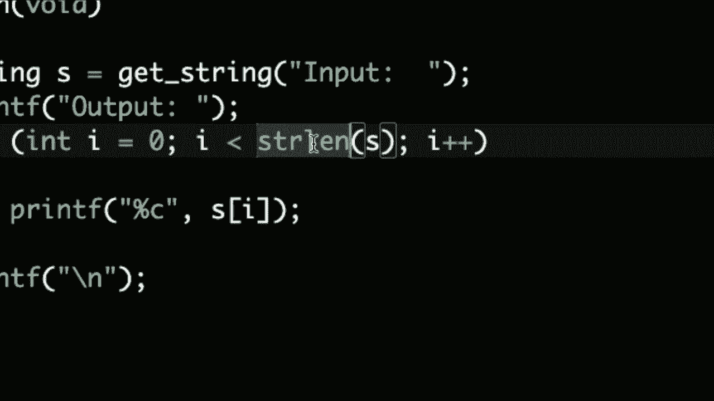

which means there's some piece of code，someone wrote probably similar to what i。wrote a few minutes ago，that you're constantly asking what's the，of the string。and recall from our picture the way you，figure out the length of a string is you。start at the beginning of the string and，you keep checking am i at backslash zero。

okay am i at backslash zero okay，so to figure out the length of high it's。going to take me like one two three，four steps right because i have to start。at the beginning and i iterate，out the length of bi，it's going to take me like five steps。because that's how long it's going to，take me from left to right。

to find that backslash zero so what i，don't like about this line of code is。why are you asking for the string length，of s again and again，and again and again it's not going to。change in this context，so jonathan's point is taken if we keep，asking the user for more input but in。this case we've only asked the human，once so you know what，let's take jonathan's advice and do like。

int n equals，this let's take jonathan's advice and do，int n equals the string length of，do。put n in this condition instead，so now i'm asking the same question but。

i'm not foolishly inefficiently asking，the same question。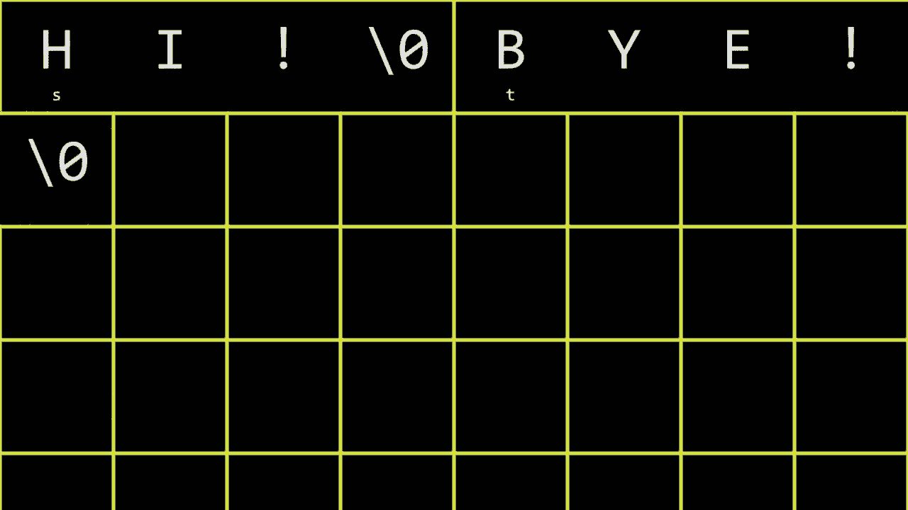

again and again whereby the same，question requires，a good amount of work to find the。backslash zero again，and again and again now there's some，cleanly cleaning up we can do here too。it turns out there's this other subtle，feature of for loops if you want to。initialize another variable，to a value you can actually do this all，at once and you can do so。

before the semicolon you can do comma，n equals sterling of s，and then you can use n just as i have。here so it's not，all that much better but it's a little，cleaner in that now i've taken two lines。of code and collapsed them，into one they both have to be of the，same data types but that's okay here。because both i，and n are so again the inefficiency here，is that it was foolish before that i。

kept asking the same question，again and again and again but now i'm，asking the question once。remembering it in a variable called n，and only comparing i，against that integer which does not。actually change，all right i know that too was a lot，let's go ah**d here and take a three，whatnot。in three minutes we'll come back and，start to see applications now。

of all of these features ultimately so，some problems that are going to。lie ahead this week on the readability，of language and also on cryptography so。

alright so we are back and this has been，a whole bunch of，low-level details admittedly and where。we're going with this ultimately this，week and beyond is applications of some。of these building blocks and one of，the next problem set，is going to be that of cryptography the。information，and if you're trying to encrypt，information like messages well those。

messages might very well be written in，english or in ascii if you will。and you might want to convert some of，another，so that if your message is intercepted。by some third party，they can't actually decipher or figure，out what it is that you've sent。so i feel like we're almost toward we're，almost at the ability we're in code we，can start to convert。

one word to another or to scramble our，text but we do need a couple of more，building blocks。so recall that we left off with this，picture here where we had two words in。the computer's memory high and bi，both with exclamation points but also。both with these backslash zeros that you，and i do not put there explicitly。

they just happen for you anytime you use，the double quotes and anytime you use，the getstring。function so once we have those in memory，you can think of them as s and t，respectively but a string。s or t is just an array so again you can，also refer to all of these individual。characters or chars via the new squ*re，bracket notation of today s bracket 0。

s1 s2 s3 and then t bracket 0 t，bracket 1 2 3 and 4 and then whatever。else is in the computer's memory，but you know what you can even do is，this suppose that instead。we wanted to have an array of words so，before we had an array of scores an，array of integers。but now suppose we it in the context of，some other program to have an array of。

words you can totally do that there's，nothing stopping you from having an，array of words。and the syntax is going to be identical，notice if i want an array，strings，bracket two。this means hey computer give me an array，of size two each of whose members is，that array。same as before with the scores words，bracket zero gets quote-unquote high。

words bracket one gets quote-unquote by，so that is to say with this code。could we create a picture similar to the，one previously，but i'm not calling these strings s and。t now i'm calling them both，words at two different locations zero，and one respectively。so we could redraw that same picture，like this now，bracket zero，and this one is referred to by words。

bracket one but again，what is a string a string is an array，and yet here we have an array of strings。arrays，so we've got an array of words but a，word is just a string and a string。is an array of characters so what i，really have on the board，is an array of arrays。and so here and this will be the last，weird syntax for today，you can actually have multiple squ*re。

brackets back to back，so if your variable is called words and，that is an array。if you want to get the first word in the，array you do words bracket zero。once you're at that word hi and you want，to get the first character in that word。you can similarly do bracket zero so the，first bracket refers to what。

word do you want in the array the second，bracket refers to what character，the i。is at words bracket zero bracket one the，zero，bracket two and the null characters at。words bracket zero bracket three，meanwhile the b is at words bracket，one bracket zero one one one。two one three one four so it's almost，kind of like a coordinate system if you。

will it's a two dimensional，only to say，that if we wanted to think of arrays。of strings as individual，characters we can we have that，expressiveness now too。in code so what more can i do now that i，can manipulate things at this level。let me do a program that'll be pretty，applicable i think with some of our。

upcoming programs as well let me call。

this one uppercase，let me quickly write a program whose，purpose in life is just to convert an。

input word to uppercase and let's see，and，include cs50。h let me go ah**d and，include，standardio。h let me also include this，string dot h which is going to give us，functions like string length。and then let me do int main void and，then let me go ah**d here and get a。string from the user like before so i'm，just going to ask the user for。

a string and i want them to give me，whatever the string should be before，literally，after。i capitalize everything in the string，and now let me go ah**d and do this，4 int i gets 0 i less than。string length of s i plus plus wait a，minute i made that mistake before。let's not repeat this question let's，give myself a second variable。

n gets string length of s i less than，n i plus plus so again this is now。becoming boilerplate anytime you want to，the string，this probably is a reasonable place to。start and then let me ask the question i，want to iterate over every character in。the string that the human has typed in，and i want to ask myself a question just。

as we've done with any algorithm，specifically i want to ask if the，current letter is lowercase。let me somehow convert it to uppercase，else let me just print it out unchanged。so how can i express that using last，week and this week's building blocks。well let me say something like this if，the character at a location i。

in s or if the ith character in s。

is greater than or equal to a lowercase，a，and the ith character，in s is less than or equal to a。lowercase z，what do i want to do let me go ah**d and，print out，what，here yet。but let me come back to that else let me，go ah**d and just print out that，character。unchanged s bracket i so minus，the placeholder the question marks i've。

put i'm kind of all the way there，line 10 initializes i to 0 it's going to，count all the way up to n。where n is the length of the string and，it's going to keep incrementing i so，going to become。muscle memory before long line 12 is a，from，last week in this this week we have the。new squ*re bracket notation to get the i，character in the string s greater than。

or equal to less than or equal to we saw，at least one of those last week。that just means greater than or equal to，less than or equal to，i mentioned ampersand ampersand last。week which is the logical，and operator which means you can check，one condition and another。and the whole thing is true if both of，those are true，want to express。

is the current character between，lowercase a and capital and lowercase z。totally fine to implicitly treat，a and z as numbers which they really are。because again if we come back to our，favorite ascii chart，and go to ascii chart。com here you'll。see again，with it，with it，pedantic，i could go back into my code and do。

something like well if this is greater，than or equal to 97，and it's less than or equal to 122 but。like bad design，like i'm never going to remember that，lowercase z is 122。like no one's gonna。know that it makes the code less obvious，go ah**d and write it in a way that's a。little more friendly to humans。

like this but notice this question mark，how do i fill in this blank。well let me go back to the ascii chart，this is subtle，but this is kind of cool and humans were。definitely thinking ahead，notice that capital lowercase a is 97，capital a is 65。lowercase b。is 98 capital b is，and notice these two numbers 67 to 90 65，to 97 66 to 98。

67 to 99 it would seem that，no matter what letters we compare，lowercase and uppercase。they're always 32 apart and that's，consistent we could do it all for all 26。english letters so if they're always 32，apart you know what i could do。if i want to take a lowercase letter，14，case，it's not the cleanest because again i'm，some point。

but at least mathematically i think that，will do the trick because 97。will become 65 98 will become 66 which，is forcing those characters to lower，numbers。i'm still using percent c to coerce it，to be a char，so if i didn't mess any syntax up here。let me make uppercase，ok dot slash uppercase and let me go，ahead and type in for instance uh。

my name in all lowercase and voila，uppercase now it's a little ugly i。forgot my backslash n so let me go ah**d，and add one of those real quick。just to fix the cursor let me recompile，the code with make uppercase let me。rerun the program with dot slash，uppercase and now type in my name david。

let me do it again with brian and notice，that it's capitalizing everything。character by character using，only today's building blocks this is。correct it's pretty well styled because，everything's nicely indented it's very。readable even though it might look a，little cryptic at first glance。

but i think i can do better and i can do，better by using yet another library and。here's where c and really programming in，general gets powerful，the whole point of using popular。languages is because so many other，people before you have solved problems。that you don't need to solve again and，i'm sure over the past like 50 years。

someone has probably written a function，that capitalizes letters for me i don't。have to do this myself，and indeed there is another library，that i'm going to include by way of its。header file in ctype。h which is the，things，function，called there's a couple of functions。specifically，let me get rid of all of this code and，let me call a function called。

is lower and past is lower s bracket i，and is lower as you might guess its。purpose in life is to return essentially，a boolean value true or false if that，character is lower。and if so well let me go ah**d and print，out a placeholder，followed by the capitalization of that。letter now before i had to do that，annoying math with minus 32 and figure，it out，to upper bracket of。

parenthesis s bracket i and now，i can otherwise just print out that。character unchanged just as before，s bracket i but now notice my program。honestly it's definitely a little，shorter it's a little simpler in that。there's just less code and hopefully if，the person that wrote is lower and two，upper did a good job。

i know it's correct i'm just standing on，their shoulders and frankly my code's。more readable because i understand what，is lower means，whereas that crazy ampersand ampersand。syntax and all of the additional code，that was just a lot harder to wrap your，mind around arguably。so now if i go ah**d and compile this，make uppercase，okay that seemed to work well and now。

i'm going to go ah**d and do dot slash，uppercase and type in my name and all，lowercase again。david seems to work brian seems to work，and i could do this all day long。it seems to still work but you know what，explicit，you know what i bet if the human who。wrote two upper was smart，i bet i can just blindly pass in，any character to two upper and it's only。

going to uppercase it，if it can be converted to uppercase，otherwise it'll pass it through。unchanged so you know what，let me get rid of all of this stuff and，out。a placeholder for c and then two upper，of s bracket i and sure enough if you。read the documentation for this function，it will handle the case where it's，either lowercase。

right thing，so now if i recompile my code make，uppercase，so far so good dot slash uppercase david。again voila it still works and notice。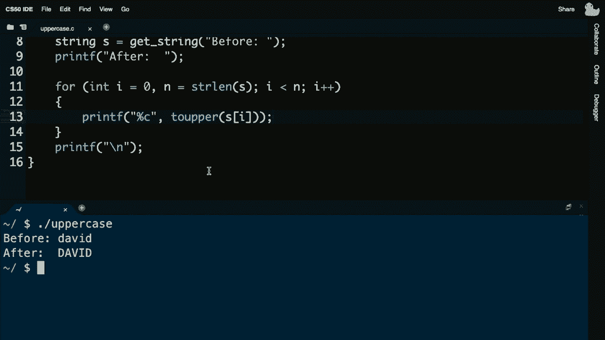

truly just how much tighter how much，cleaner how much shorter my code is。and it's more readable in the sense that，this function is pretty well named。to upper is what it's indeed called but，there is an important detail here。two upper expects as input a character，you cannot pass a whole word to it。

it is still necessary at this point for，me to be using this loop。and doing it character by character now，multiple。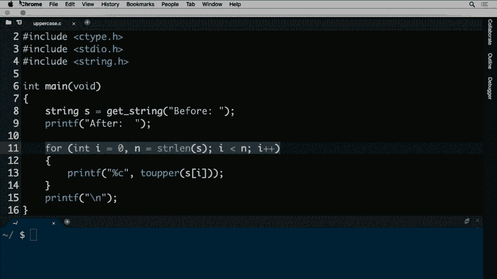

examples of this over the weeks to come，but if i go to，what's called the manual pages for the。language c we have our own web-based，version of them and we'll link this。for you in the courses labs and problem，sets as needed you can see a list of all。of the available functions in c at least，that are frequently used in cs50。

and if we uncheck a box at the top we，can see even more functions there's。dozens maybe hundreds of functions，most of which we will not need or use in，language。you sort of pick up the building blocks，that you need over time，function in here。it's going to look a little cryptic at，first glance these manual pages are。

written really for experienced，programmers but will help you understand。them over time so that they're useful to，you and indeed if i scroll down to the。description here's the beginning of some，documentation these，functions convert lowercase letters to。uppercase and vice versa。

and so forth so we'll refer you to these，kinds of resources so that you don't，lecture。but you have at your disposal these，other functions，and toolkits as well and we'll do the。same with python in sql，and other languages as well and so those，are what we call，feature。before we even think about cryptography，and scrambling information as for。

problem set two so a command line，argument i mentioned by name before it's，like a word you can type。after a program's name in order to，provide an input at the command line so，make hello。hello is a command line argument to the，program hello，r m space a dot out a dot。out was an argument a command line，argument to the program rm when i wanted。

to remove it so we've already，seen command line arguments in action。but we haven't actually written any，programs，that allow you to accept words or。other inputs from the so-called command，line up until now，all of the input you and i have gotten。in our programs comes from getstring，getint and so forth，we have never been able to look at words。

that the human might very well have，typed at the prompt，when running your program but that's all。about to change now，let me go ah**d and create a program，called argv dot c and this。i'm going to go ah**d and，include shall we say uh standard io dot。h and then i'm going to give myself int，main void，and then i'm just going to very simply，go back。

and change the void so just as our own，custom functions can take inputs and we。saw that with get negative int，main，potentially take inputs up till now，though we've been saying。void and we told you to say void last，week and we told you to say void，that c。does allow you to put other inputs into，main you can either say nope main does。

not take any command line arguments but，if it does，you can say literally int arg c。and string argv with squ*re brackets，so it's a little cryptic and technically。you don't have to type it precisely this，way but human convention would you have。you do it at least for now in this way，this says that main your function main。

takes an integer as one input，and not a string but an array of strings。as input and arg c is shorthand notation，for argument count，argument count is an integer that's。

going to represent the number of words，that your users type at the prompt。after your program's name arg v is short，for argument vector，vector is a fancy way of saying list it。is a variable that's going to store，human types，name，so we can use this for instance as。follows suppose that i want to let the，user type their own name at the command。

prompt i don't wanna use getstring i，don't wanna have to prompt the human，later for their name。i want them to be able to run my program，and give me their name all at once just，like make just like。rm and clang and other programs we've，seen so i'm gonna do this。if argc equals equals 2 so if the number，of arguments to my program is 2。

go ah**d and print out hello percent s，and plug in whatever is at arg v1。so more on this in just a moment else if，argc is not equal to two let's just go。with last week's default，hello world so what is this program's，purpose in life。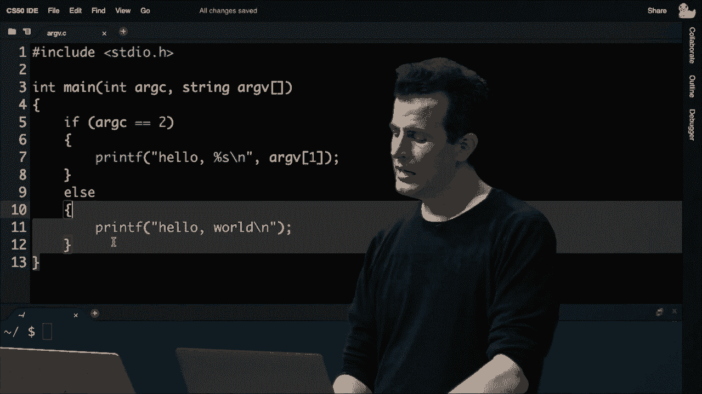

if the human types two words at the，brian，hello so and so otherwise if they don't。type two words at the prompt，they're i'm just going to say the，default hello world so let me compile。this make arg v。

type，string unknown type string all right i，goofed if i'm using string。recall that now i need to start using，the cs50 library and again we'll see all。the more why in the coming weeks as we，take those training wheels off。but now i'm going to do this again make，argv there we go now it works。

dot slash arg v enter hello world，that's pretty much equivalent to what we，did last week but notice。if i type in for instance rv1 david，rv，brian it says that if i type in brian u。it says hello world so what's going，on well the way you write programs in c。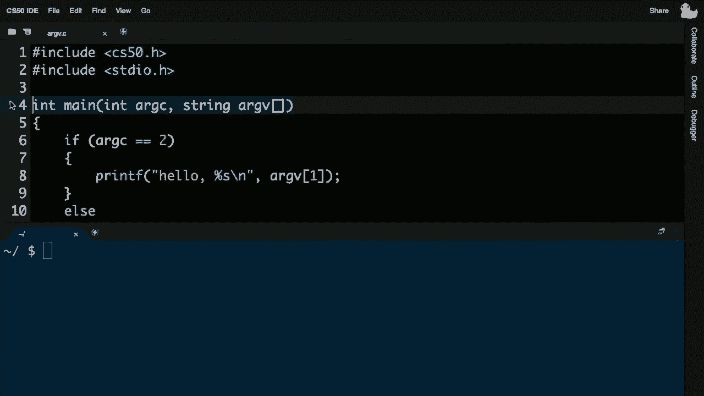

arguments that is，words at the prompt after your program's，name is you change what we have been。doing all this time，from void to be this into argc，string argv with squ*re brackets and。what the computer is going to do for you，automatically is going to store in。c a number of the total number of words，that the human typed in not just the。

arguments technically all of the words，including your own program's name。it's then going to fill this array of，strings aka，argv with all of the words the human。typed at the prompt，so not just the arguments like brian or，david but also。the name of your program so if the human，typed in two total words which they did，print out。

hello followed by a placeholder and then。

whatever value is at r v one and i'm，deliberately not doing zero，if i did zero based on the verbal。this program，i don't wanna see this hello argv，so the program's own name is。automatically always stored for you，if you want the first，useful piece of information you actually。would after recompiling the code here，way，do we see an arg v that we can actually，too。

suppose i want to print out all of the，individual characters。in someone's input you know what i bet i，could even do this，let me go ah**d and do this instead of。just printing out hello let me do for，length，of r v whoops arg v one。and then over here i'm going to do i is，less than n i plus plus。

all right so i'm going to iterate over，all of the characters，in the first real word in argv。and what am i going to do well let me go，ahead and print out，a character that's at argv 1。but at location i so i said a moment ago，with our picture。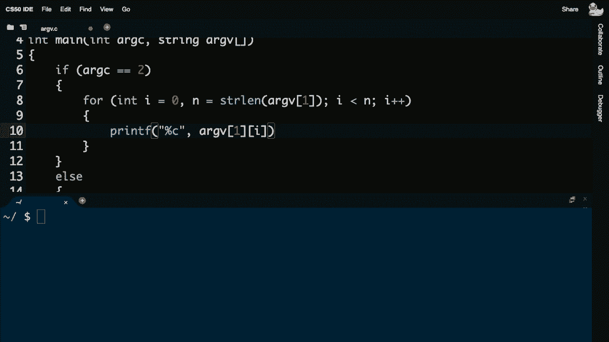

that we could think of an array of。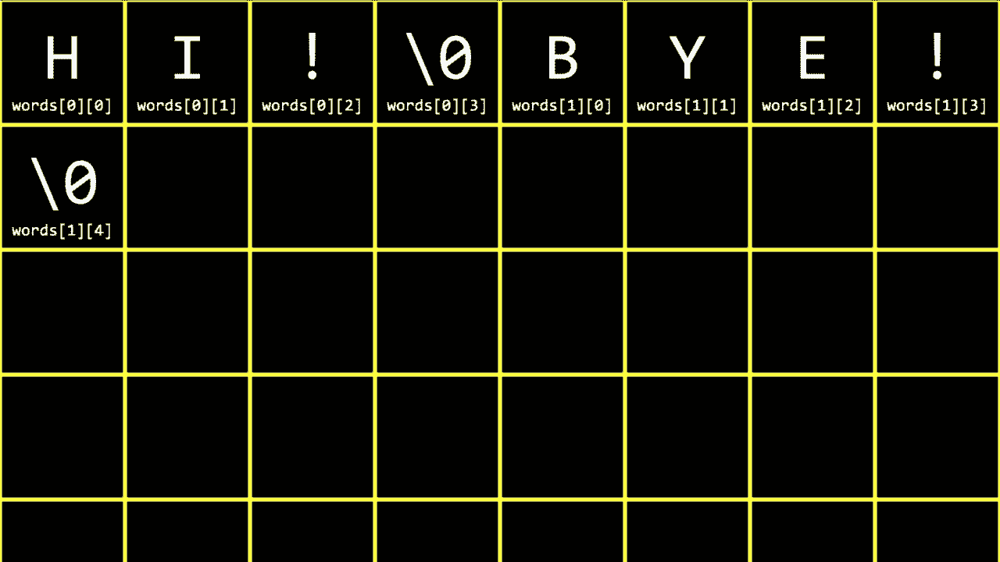

arrays，and so i can employ that syntax here，by going into argv one to get me the。word like david or brian or so forth，and then further index into it with more。squ*re brackets that get me the d，the a the v the i the d and so forth and。just to be super clear let me put a new，line character there，just so we can see explicitly what's。

going on and let me go ah**d now and，just delete this hello world because i。don't want to see any hellos i just want，to see the word the human typed in，make argv whoops。uh what did i do wrong oh i use sterling，when i shouldn't have because i haven't，included。string dot h at the top okay，now if i recompile this code and，recompile make our v there we go dot。

slash argv，david you'll see one character per line，and if i do the same with brian's name。or anyone's name，and change it to brian i'm printing one，character at a time so again i'm not。sure why you would want to do that but，in this case my goal simply。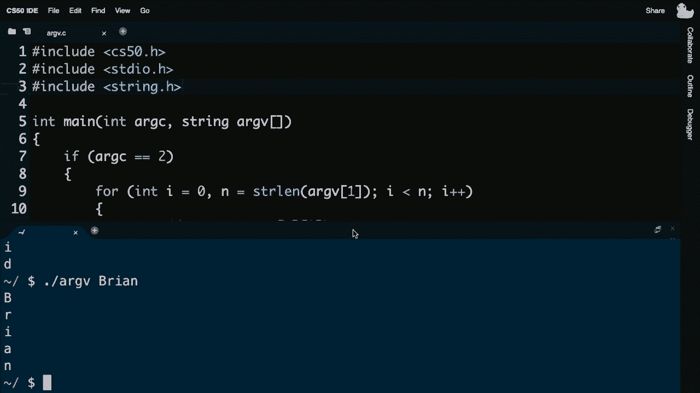

was to not only iterate over the，characters in，that first word but print them out so。again just by applying。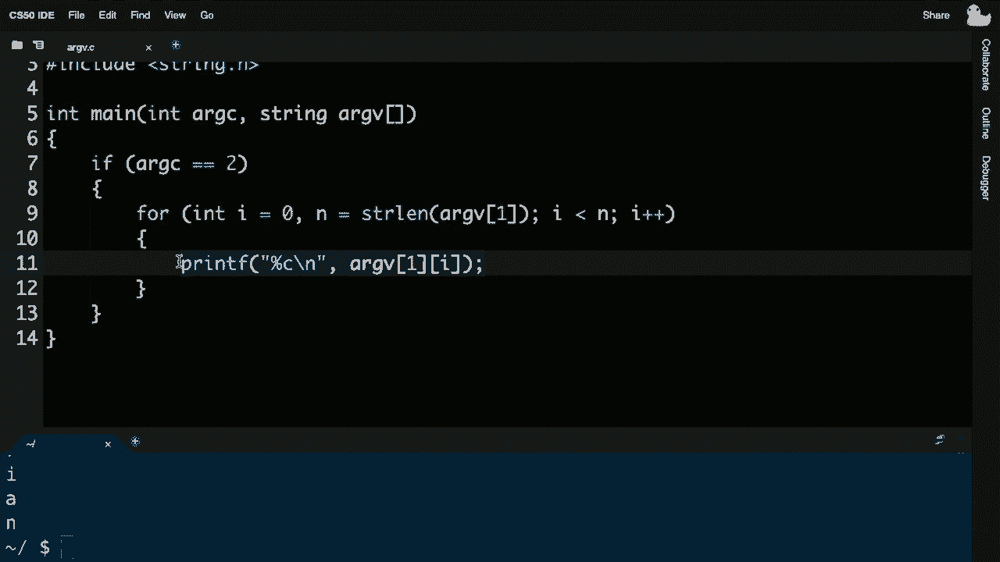

we actually，see that a program has access to the，individual characters in each of these，strings。all right and one last explanation，before we introduce the crypto and，application thereof。this thing here this thing here does，anyone have any idea as to why。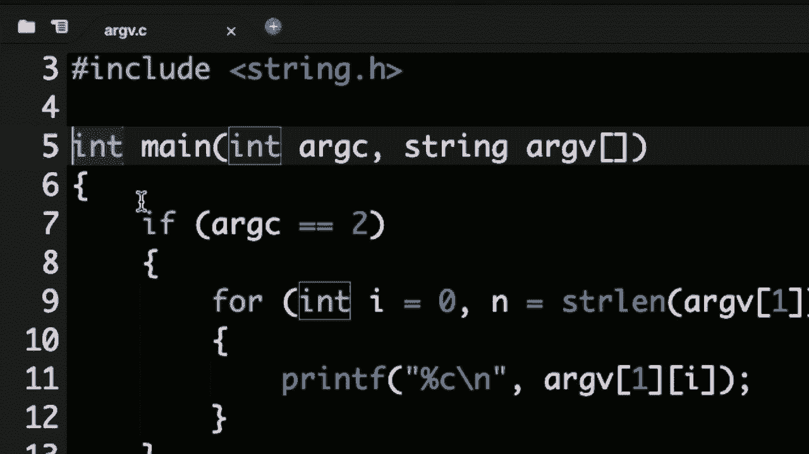

return an，int even though it's not an average，function it's not a get positive in。function it's not get negative in，somehow for some reason main keeps，never，mean。this is the one last piece that we，promised last week we would eventually。what might this mean and this one's a，tough one，brian who do we have how about。

yes so usually the functions，in the end uh have returned zero and，that means that the function stops。and that zeros is like is the integer，that pops out of the main function yeah，that。if you had programmed before odds are，and i'm guessing you have grad you've，seen this in use before。we humans though in the real world of，like using macs and pcs。

you've actually seen numbers integers in，weird places frankly。almost any time your computer freezes or，you see an error message。odds are you see in english or some，spoken language in the error message。but you very often see a numeric code，for instance if you're having zoom。

trouble you'll often see the number five，in the error window in zooms program and，issues so。programmers often associate integers，with things that can go wrong in a，program and it's great。grid notes they use zero to connote that，so let me write，one final program here just called。

exit。c that puts this to the test，file called。

exit dot c that's going to introduce，what we're going to call。

exit codes these are a subtlety uh，an exit status this is a subtlety that。will be useful as our programs get a，here and do，and include，standardio。h and i'm going to give。myself the longer version of main so，int argc string argv，with the squ*re brackets and in here i'm。going to say if，argc does not equal to，the human is not doing what i want them。

to and i'm going to yell at them in some，line，argument so any kind of error message，screen。i'm just going to tell them with that，message but i'm going to very subtly。return the number one i'm going to，return an error code and the human is。not necessarily going to see this code，but if we were to have a graphical user，program。

that would be the number they see in the，error window that pops up just like zoom，something has gone。wrong similarly if you've ever visited a，web page frankly，and you the web page doesn't exist you。see the integer 404，that's not technically the exact same，incarnation of this but it is。representative of programmers using，numbers to represent，errors so that one you probably have。

seen here i'm going to go ah**d though，and by default say，hello percent s just like before passing。as before，but i'm not going to do any of this lame，type，in their name as i expect instead。i am going to check did the human give，me two words at the command line。if not i'm going to print missing，this，exit code otherwise if all is well i'm。

gonna go ah**d and return，explicitly zero this is another number，see。but we could have access to it and，frankly for course purposes。uh check 50 can have access to this and，those，great notes，is just all as well but one would mean。ahead and make，exit which is kind of appropriate as，we're wrapping up here and let me go。

ahead and do dot slash，exit missing command line argument is，what's displayed。if i go ah**d and say exit david now i，see hello david or，exits brian i'll see exit brian。now this is not a technique you'll need，to use often but you can，want。if i run exit and i see this error，message i can very weirdly say echo。

dollar sign question mark which is a，very admittedly cryptic way of saying。what was my exit status and if you hit，enter you'll see one，by contrast if i run exit of david and i。actually see hello david，now i。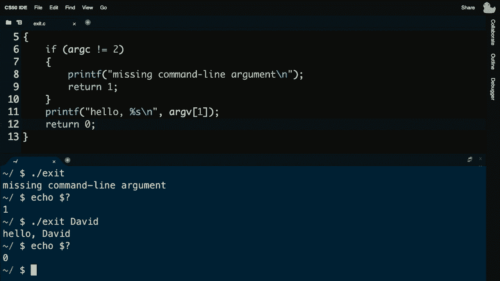

will see zero so again this is not a，technique you and i will use very。frequently but it's a capability of a，program and it's a capability of c。that you do now have access to and so in，writing programs moving forward。what we will often do in labs and in，problem sets and the like，is ask you to return from maine。

either 0 or 1 or maybe 2 or 3 or 4，based on the problems that might have。gone wrong in your program that you have，detected，and responded to appropriately so it's a。very effective way of handling errors，in a standard way so that you know that。you are being proactive about detecting，mistakes，so what kinds of mistakes might we。

handle this week and what kinds of，problems might we solve well today was，entirely about。deconstructing what a string is last，week it was just a sequence of text。a chunk of text today it's now an array，c，for accessing those characters we also。today have access to more libraries more，header files the documentation therefore。

so that we can actually solve problems，without writing as much code ourselves。we can use other people's code，in the form of these libraries so one。problem we will solve this coming week，readability，like when you're reading a book or an。essay or a paper or anything，what is it that makes it like a third。

grade reading level or a 12th grade，reading level or university reading。level well all of us probably have an，intuitive sense right like if it's big。font and short words it's probably，young for younger kids and if it's。really complicated words with big，vocabulary and things we don't know。

maybe it's meant but for university，little，more formulaically not necessarily the。only way but we'll give you a few，famous sentence，mr and mrs dursley of number four privet。drive we're proud to say that they were，perfectly normal thank you very much。and so forth well what is it about this，text that puts harry potter at grade。

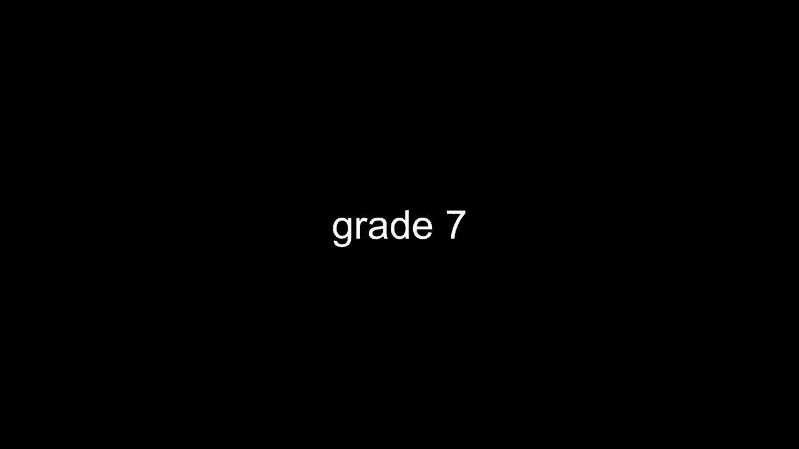

7 reading level well it probably has to，do with the vocabulary words but it。probably has to do with the lengths of，the sentences，the amount of punctuation perhaps the，total。number of characters that you might，count up you can imagine quantifying it，just based generically。on the look and the aesthetics of the，text what about this in computational。

linguistics authorship attribution is，the task of predicting the author of。document of unknown authorship this task，is generally performed by the analysis。of stylometric features particular，this is brian's senior thesis so this is。not a seventh grade reading level this，was actually rated at grade。

16 so o'brien's pretty sophisticated，there too，you could perhaps glean from the。sophistication of the sentences the，length thereof and the words they're in。there's something we could perhaps，indeed that's，one way you could assess the readability。of a text even if you don't have access，to a dictionary，with which to figure out which are the。

actual big or small words，and what about cryptography so it's，incredibly。common these days and so important these，days for you and i to use cryptography。not necessarily uh using algorithms we，ourselves come up with but rather using。software like whatsapp and signal and，telegram and messenger and others。

that support encryption between you and，the third party your friend or family。or at least minimally the website with，which you're interacting so cryptography，hiding。information and if that information is，text well frankly as of this third week。of cs50 we already have the requisite，building blocks for not only。

representing text but we saw today，manipulating it even just uppercasing，text。well what does it mean to encrypt，from last week，you have some input you want some output，plain text。the message you want to send from，yourself to someone else，ciphertext is the output that you want。and so in between there there's going to，be what we're going to call a cipher，or，output。

that a third party can't understand and，hopefully that cipher that algorithm。is a reversible process so that when you，figure out，what it was that the the person sent to，you。intended，is to also have a secret key so if you，think back to grade school maybe you。were flirting with someone in class，and you sent them a note on a piece of。

paper well hopefully you didn't just say，like i love you on the piece of paper。and then pass it through all of your，friends or let alone the teacher to。to the ultimate recipient maybe you did，something like an，becomes a d。like you kind of apply an algorithm to，like add one to all of the letters so，and look。

at it they probably don't have enough，care in the world to figure out what，nonsense。but if your friend knows that you，changed a to b b，to c by adding one to every letter they。could reverse that process，and decrypt it so the key for instance。might be literally the number one the，message literally might be i love you。

but what would the ciphertext be or the，output well let's consider。i love you is a string which as of today，is an array of characters。so what useful what use is that well，let's consider exactly that phrase as，though it's an array。it's an array of characters we know from，last week characters，are just integers decimal integers。

thanks to ascii and in turn unicode，so it turns out i we already know is 73，chart，l is *****。easily and see，you might have to check your notes and，check my sample code and so forth but。relatively easily in c，convert i love you to the corresponding，integers by just casting so to speak。chars to integers，i could very easily mathematically using，the plus operator in c。

start to add one to every one of these，characters thereby encrypting。my message but i could send my friend，these numbers but i might as well make。it a little more user friendly，so now，it would seem that the ciphertext for i。love you if using a key，of one and one just means change a to b，not a to c。

just move it by one place this is the，ciphertext for an encrypted。message of i love you and so the whole，process becomes one is the input is the，text。and the output ultimately is this，teacher，or some friend intercepts they probably。don't know what's going on，and indeed this is the essence of，cryptography the algorithms that you。

protect are emails and texts and，financial information and health，sophisticated。than that particular algorithm and it is，but it reduces to the same process，by some。output the so-called cipher text and，some form，sometimes even mechanical form back in。the day you could actually get，these little circular devices that have。

letters on the alphabet on one side，other letters on the alphabet on the，other。a might line up with b b might line up，with c so you can have even a physical。incarnation of cryptography，just as was popular in a movie that，seems to play endlessly。on tv at least here in the us around，christmas time，and you might recognize if you've seen a。

christmas story，one such look so we'll use just a couple，of minutes of our final moments together。to take a look at this real world，incarnation of cryptography that。undoubtedly you can probably see on tv，be it known to all on sunday that ralph。parker is hereby appointed a member of，the little orphanage，secret circle and is entitled to all the。

honors and benefits occurring there too。

signed，pierre andre in inc honors and benefits，come on let's get on with it i don't。need all that jazz about smugglers and，listen tomorrow night for the concluding。adventure of the black，message，for you members of the secret circle，circle。can decode any secret message remember，annie is depending on you，set your pins to be too here。

is the message 12 11。i am in my first secret meeting，voice tonight。i could tell that tonight's message was，really important。

3 25 that's a message from annie herself，remember don't tell anyone，[Music]。90 seconds later i'm in the only room in，the house where a boy of nine could sit。in privacy and decode，aha b i went to the next，e the first word is b，s it was coming easier now。oh be sure to be sure to what，what was little orphanage trying to say，be sure to watch。

randy have got to go will you please，come out all right ma，now。the tension was terrible what was it the。

balance，[Music]。

sheet almost there my fingers flew my，mind was a steel trap。

every pore vibrated it was almost clear，yes yes yes yes be sure，to drink your ovalt。a crummy commercial，[Music]，son of a [ __ ] all right。