# 【双语字幕+资料下载】哈佛CS50-CS ｜ 计算机科学导论(2020·完整版) - P6：L3- 算法（结构体、搜索与排序）1 - ShowMeAI - BV1Hh411W7Up

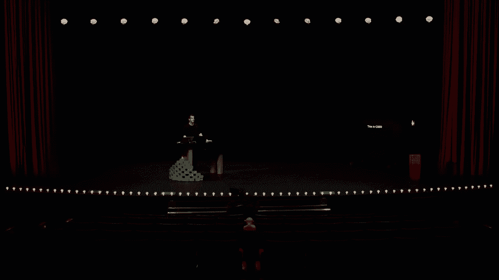

three。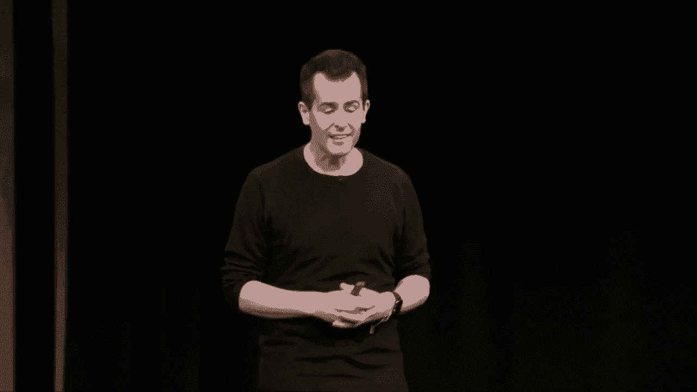

and you'll recall that last week we，which to solve，problems not only problems that we had。proposed but problems in your own code，that is to say bugs and recall that，those tools involve。help with，cryptic error messages that the compiler，might spit out style 50 which gives you。a bit of feedback on the stylization of，your code the aesthetics thereof。

check 50 which checks the correctness of，your code against，the specifications in a given problem。set or lab printf，which is a function that exists in some，form in almost any programming language。that you might ultimately，learn and this is simply a way of，printing out anything you might want。screen，then perhaps the most powerful of these，tools was debug 50 which was this。

interactive debugger and even though，this command debug 50，is a little specific to cs50 what it。triggers to happen that little side，window where you can see，have called。uh during some break point and you can，see the local variables that you might。have defined at some point，during the execution of your code that's，a very common conventional。

feature of any debugger with most any，language and then lastly recall there，was this ddb。duck debugger which of course takes this，physical form if you happen to have a，can talk。but i'm so pleased to say that if you，lack that currently，while at home cs50 zone kareem and。brenda and sophie have wonderfully added，if you haven't noticed already。

that same virtual duck to cs50 ide so if，you click in the top corner。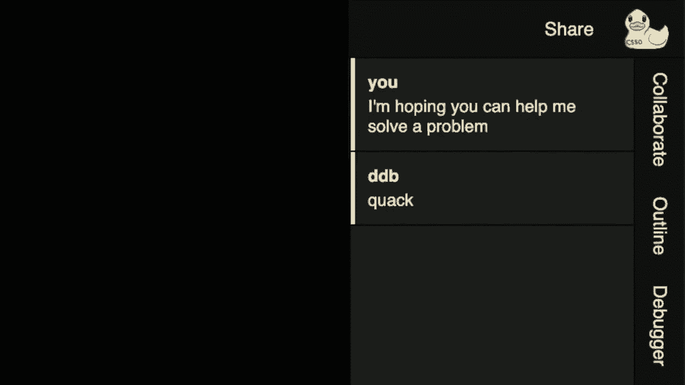

you can actually begin to have a chat of，sorts with the rubber duck and while。this is certainly a more playful，incarnation of that same idea we really。can't emphasize enough the value，of talking through problems when you're，experiencing them in code。with someone else or with something else，this particular duck，not all that large of a vocabulary but。

it's not so much what the other person，says but what you say and what you hear，yourself saying。that is undoubtedly the most valuable，part of the process so our thanks to。kareem and brenda and sophie on that，recall last week too，that we took a look underneath the hood。literally in some sense，at the computer's memory in your laptop，to。

think about this more artistically as，just a grid of，bytes so within that chip there's a。whole bunch of bits and if you，look at eight of them at a time there's。a whole bunch of bytes and it stands for，reason that we could think of this as，third byte。and so forth and sort of chop this up，pictorially into just a whole，memory。

and recall that if we zoom in on that，and focus on just one contiguous，array。we can do things within this array like，storing a bunch of different values so，recall last week。we started by defining a little uh，goofily，multiple variables that were almost。identically named like uh scores one，scores two scores three and then we。

began to clean up the design of our code，by introducing an array so we can have。just one variable called scores，that is of size three and has room for，multiple values，feature。of many programming languages being able，to store things contiguously back to。back to back to back in a computer's，memory because this very，simple layout this very simple feature。

of the language is going to open up all，sorts of powerful features and in fact。we can even revisit some of the some of，the problems we tried to solve，with the raise，last week。and that's because even though you and i，can glance at this picture on the screen。and see immediately that though there's，seven boxes on the screen there's seven。

locations in which you can store values，you and i can sort of have this bird's。eye view of everything and just see，what's inside that entire array，much more。methodical more algorithmic if you will，and so a computer，as powerful as they are can technically。only look at one location in an array，at a time so whereas you and i can。

glance at this and sort of take it all，in at once a computer just can't glance。at its memory and take in，all at once all of the values they're in，instance。from left to right maybe right to left，maybe middle，onward but it has to be an algorithm and，really。kind of hide the fact that this array，cannot be seen all at once you can only。

look at one location in an array，at a given time and this is going to。have very real implications for instance，if we consider that very first problem。in the very first week where we tried to，find my phone number in a phone book the，beginning。and search from left to right and we，tried a couple of variants thereafter，but the problem。

quite simply is that of searching and，science，super common certainly for you and i as。users on google and the like to search，for things all day long，and so certainly searching well。designing a search algorithm well，is certainly a compelling feature of so。many of today's tools that you and i use，so if we think of this really as a。

problem to solve we've got some input，which for instance might be an array of。numbers or maybe an array of web pages，in the case of google。and the goal is to get some output so if，the input to the problem is an array。of values the output hopefully is going，to be something as simple really。

as a bool yes or no is the value you're，looking for，that value。yes or no true or false now within this，black box recall，is going to be some algorithm and that's。where today we'll spend most of our time，indeed we won't really introduce that。many more features of c we won't，focus again on，ideas just taking for granted now that。

you have some more tools in your toolkit，beyond loops and conditions and boolean。expressions we now have this other tool，known as arrays but let's first，introduce some。some other terms of art some jargon if，you will related to what we'll call。running time so we've alluded to this a，few times when we're thinking about just。

how good or bad an algorithm is，we describe how long it takes to run。that is it's running time the running，takes，how many steps it takes how many seconds。it takes how many iterations it takes it，doesn't really matter。what your unit of measure is maybe it's，else，but running time just refers to how long。

does an algorithm take，and there are ways that we can think，about this a little more formally and we。week，but we didn't give it this name this，italicized，o this capital o on the screen is。otherwise known as big，o notation and computer scientists and，use。literally this symbol to describe the，running times of algorithms or，mathematically like a function。

so recall this picture in fact when we，were searching that phone book。we did it sort of good better best we，did it linearly，that is searching one page at a time we。did it twice as fast，by doing two pages at a time and then we，did it logarithmically。by dividing and conquering in half and，half and half and at the time i proposed，having n。

pages where n is just a number uh in，computer science vernacular。we might describe the running time or，the number of steps involved for that。first algorithm as being maybe in the，worst case，n steps if the person you're looking for。in a phone book maybe alphabetically has，a last name starting with z。

in english well the z might be all the，way at the end of the phone book so at。the worst case you might be taking，that phone book，the second algorithm though was twice as。fast because we went two pages at a time，so we might describe its running time as。n divided by two and then the third，algorithm where we divided the problem。

in half and half and a half，literally throwing half of the problem，away again and again，of n。which again is just a mathematical，formula that refers to having something。again and again and again and you start，with of course n pages in that scenario。well it turns out that a computer，hands，at some of these mathematical details。

indeed we're not going to get into the，habit of writing very。precise mathematical formulas what we're，instead going to do is try to get a，sense of the。algorithm is，just roughly how fast or how slow it is，but still using some symbology like n as。a placeholder and so a computer，scientist would describe the running，time of all three。

of those algorithms from week zero as，being big o，of n or big o of n over two or big o of。log base two，of n so big o just means on the order of，it's sort of a wave of the hand maybe。it's n minus one，maybe it's n plus one maybe it's even，two n but it's on the order of n，notice。this chart there's something kind of，curious like these first two algorithms，from week zero。

kind of pictorially look pretty much the，same like undoubtedly the yellow line is。a little lower and therefore a little，better and a little faster than the red。line but they have the same shape and in，fact i bet if we zoomed way out。these two straight lines would pretty，axis，to be big enough and tall enough these，the green line。

is fundamentally different and so this，tendency，to not really quibble over these details，zero。was better yes this yellow line is，algorithms，running times on the order of n that is。to say a computer scientist tends to，throw away，constant factors like the one-half or。the divided by two and they tend to，focus only on the dominant factor like。

which value in that mathematical，expression is going to，grow the most grow the fastest and n。divided by 2，n is going to dominate over time the，bigger the phone book gets the more，pages you have。it's really n that's going to matter，less so than that divided by two and。same thing over here if you're familiar，with and remember your logarithms。

we don't really have to even care about，2 but，we can just multiply that logarithm by。some other number to convert it to any，base we want base 10 base 3 base 7。anything so let's just say it's on the，order of log n so this is good because。it means we're not really going to waste，time getting really into the weeds。

mathematically when we talk about the，efficiency of algorithms，terms of。the variable n in this case if you will，let's zoom out，if i zoom out on this picture boom you。begin to see that yeah，these are really starting to look almost。identical and if we kept zooming out you，would see that，they're essentially one and the same but。

the green one stands out，so that's indeed on the order of log of，n as opposed to n itself。so here's a little cheat sheet it turns，within，alg the analysis of algorithms we're。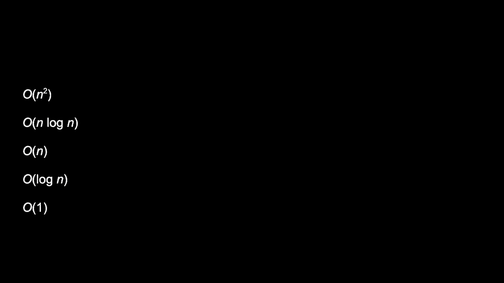

going to tend to see some common，formulas like this so we've just seen on，the order of n。we've seen on the order of log n it，turns out that very common two，n squ*red。and then even big o of one and the last，takes，wonderfully one step or maybe two steps。maybe even 10 steps，but a constant number of steps so that's，sort of the best case scenario。

at least among these options whereas n，squ*red is going to start to take a long。time it's going to start to feel slow，because if you take any value of n and。squ*re it that's going to imply，more and more steps so just a bit of，jargon then to start off today。whereby we now have this sort of，vocabulary with which to describe。

the running times of an algorithm in，terms of this big o notation，as。big o refers to an upper bound on，running times like uh like how many。steps maximally how much time maximally，might an algorithm take，opposite。what's a lower bound on the running tom，of an algorithm and we don't need。

another picture or other formulas we can，here，just proposes that when describing the，algorithm。and you want to come up with a lower，bound like minimally how many steps does，my algorithm take。we can use the same mathematical，formulas but we connote that with。omega instead of big o so again looks，fancy but it really just refers to a。

wave of the hand trying to sort of，ballpark exactly what，thankfully。we've seen a few algorithms already，including in that week zero。and now we're going to give it a more，formal name linear search is what we did。with that phone book first off by，searching it page by page by page。

looking for my phone number in that，particular example，and so the difference today is that。unlike us humans can who can sort of，look down at a phone book page and see a。whole bunch of names and numbers at once，unlike a human who can look at an array，see。everything at once we need to be more，methodical more deliberate today so that，we can translate。

pseudo code，but actual c code and so wonderfully，as we are，on harvard's campus this semester we've。been collaborating with，uh the whole team here who are much more，could be。on my own here and we have these seven，wonderful doors that were previously，took place here。in this theater and we've even，shop，who in back have wonderfully，manufactured some delightful。

numbers and brought them to life which，is to say that behind each of these，seven doors。is a number and this is going to be an，opportunity now to really hammer home。the point that when we want to search，for some number in an array。it's pretty equivalent to having to，search for a number，door，you and i can't just look at all of。

number is，we have to be more methodical we have to，start searching these doors maybe from。left to right maybe from right to left，maybe from the middle on，out but we need to come up with an。to code，so for instance suppose i were to search，for the number zero，how could we go about searching。methodically these seven，wooden doors for the number zero let me，take a suggestion from the。

audience what approach might you take，here，on my own with these doors any，recommendations。how do i begin to find myself the number，zero florence what do you propose。um i would propose starting from the，left since zero is one a smaller。number okay good and hang in there for，with me for just a moment let me go，proposes。

go ah**d and open the door and hopefully，voila no，it's a number four so it's not a zero so。florence what would you propose i do，next，um i would probably，start in the middle somewhere if like。one so，okay so maybe it's going down so let me，go ah**d and try that so you propose。middle i could go over here and voila，nope that's the number two and。

i wonder where else should i should i，look let me i'm a little curious i'm a。little nervous that i ignore these doors，ahead and look here，and nope that's the number six it seems。uh let's go ah**d and check in here the，number，down，so florence how might i finish searching。for this number what remains，to be done would you say probably start，from the right。

okay so i could start from the right now，and maybe just go over here。and voila and there it is so we found，the number zero so let me ask florence。what was your algorithm how did you go，about so successfully finding the number，zero for us，like。by going down by one so uh，like if uh the number was not at the，like，don't know。

and playfully how did how did that work，out for you going to the middle。better worse no different i mean i，i guess uh maybe it helped a little bit。to then go all the way to the right，okay yeah we might have gleaned some。information but let's go ah**d and take，a look at all of the doors for a moment。

there's that four and the six again，here's that eight again over in the，middle we had the two。again over here we have a seven uh，for the first time over here we have a。five and then of course we have a zero，and if you took all of that in honestly。florence you and i we couldn't really，have done any better because these door。

these numbers it turns out，are just randomly arranged behind these。doors so it wasn't bad at all that you，kind of hopped around，although the downside is if you hop。around you know you and i as humans can，pretty easily remember where we've been。before but if you think about how we，would translate that to code。

i feel like we're starting to accumulate，a bunch of variables maybe because you。have to keep track of that，so frankly maybe the simplest solution，have been。where we started in week 0 where we just，take a very simple if naive approach。of starting with our array this time of，size seven，behind which are some numbers and if you。

don't know anything，about those numbers honestly the best，you can do。is just that same linear search from，week zero，and just check one at a time the values。behind each of these doors and just，hope that eventually you will find it。so this is already sort of taking a lot，of time right if i do this linear。

search approach like i did in week 0 i'm，behind，all of those doors i'm going to have to。search behind all of those doors so，let's consider a little more formally。exactly how i could at least implement，that algorithm because i could take the。approach that florence proposed i'm just，kind of jumping around and maybe using a，bit of intuition。

but again that's not really an algorithm，we really need to do something more step。by step and in the meantime，let's go ah**d joe and let's close the。curtain and see if we can't clean those，up with another problem in a moment，while we consider now，so。with linear search i would propose that。

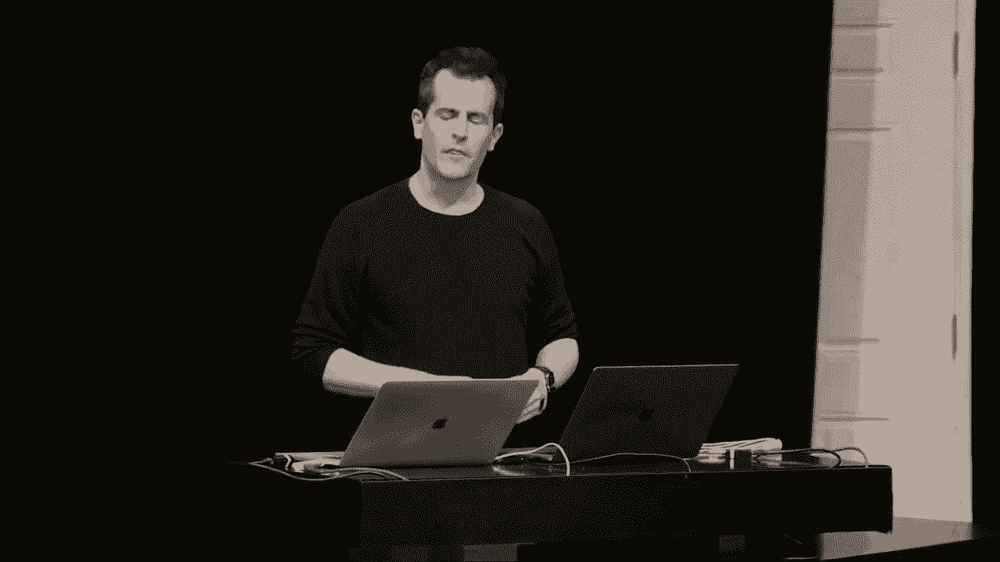

we could implement it in in pseudocode，first if you will like this。for i from zero to n minus one all right，we'll see where we're going with this if。the number is behind the ith door，return true otherwise at the very end，translation。into pseudocode much like we did with。

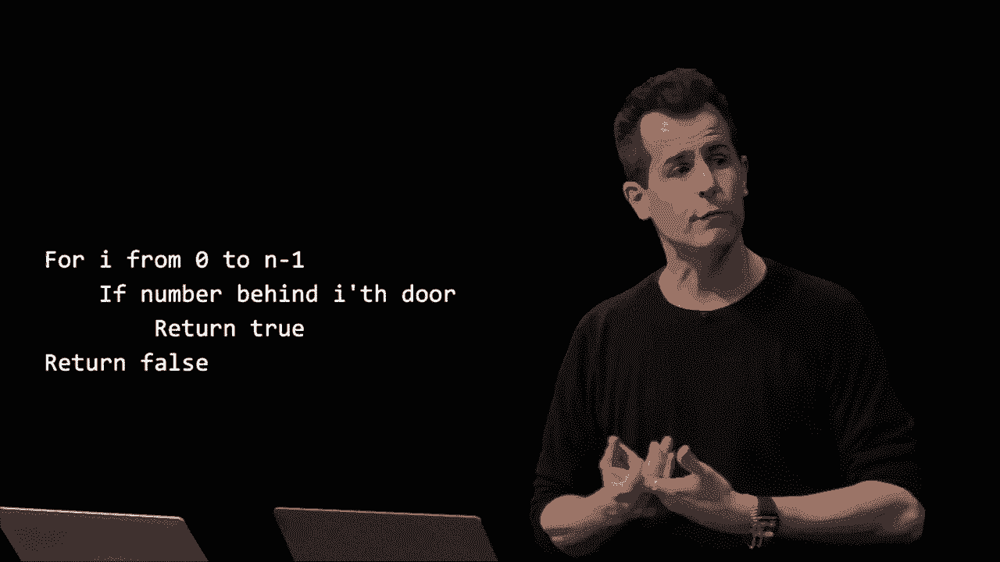

the phone book some time ago，and why though these values because i'm，more like c。even though it's still pseudo code so，for i from zero to n，minus one so computer scientists tend to。start counting from zero。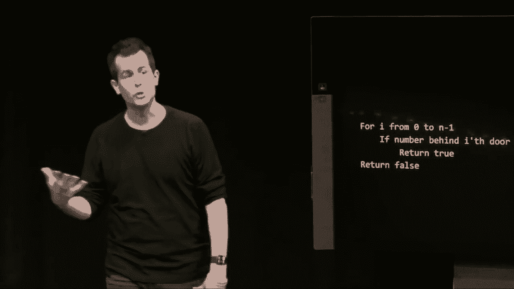

this case，from zero，on up to n minus one so this is just a，very common way。of setting yourself up with a for loop，maybe in c maybe in pseudocode in this，right，condition。number is behind the ith door i just，being a colloquial way of saying。what is behind the door at location i go，ahead and return true i have found。

myself the number i want for instance，the number zero，and then notice that this return false。is not part of an，else because i don't want to abort this。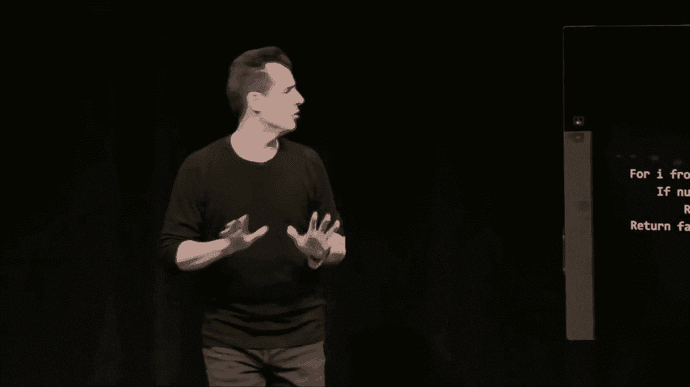

algorithm prematurely and，abort simply because a number is not，behind the current door。i essentially want to wait all the way，to the end of the algorithm。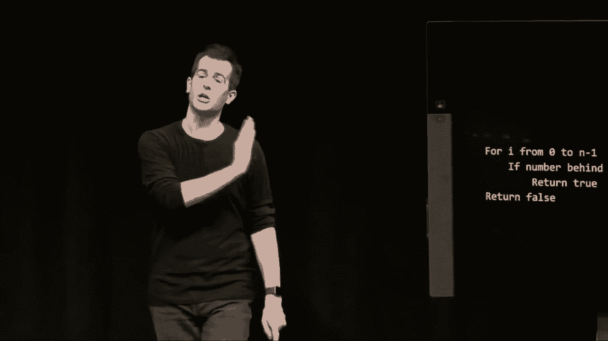

after i've checked all n doors and if i，have still not，only then。am i going to return false so a very，common programming mistake might be to。nest this internally and think about，things in terms of ifs and，else's but you don't need to have an。else this is kind of a catch-all here，at the very end but now let's consider。

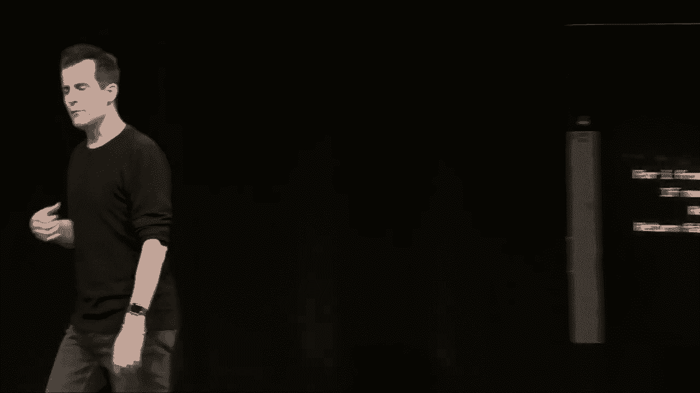

search，search，what is the efficiency of leading your。

search which is to say how well designed，is this algorithm and we we put i gave。ourselves a framework a moment ago，big o notation which is an upper bound。which we can think of for now as meaning，like a worst case，in the worst case how many steps might。it take me to find，the number zero or any number for that。

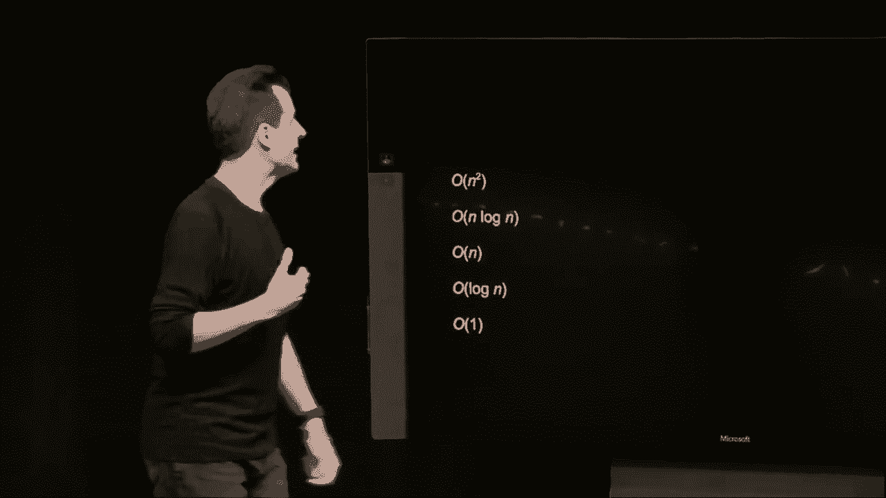

matter among，of n。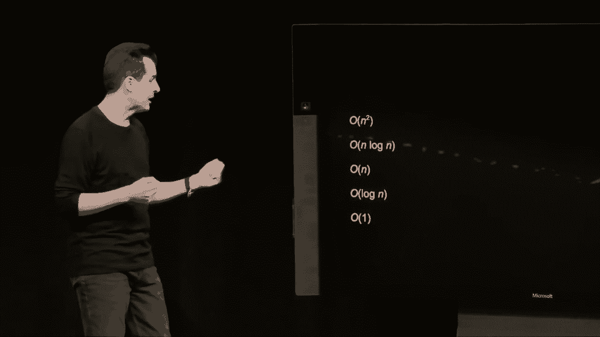

times log n big o of n big o of log n。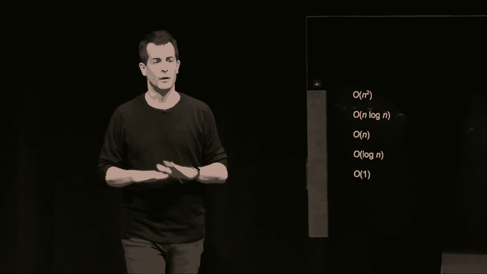

constant，fixed number of steps um brian could we，go ah**d and pull up this question。let me go ah**d and pull it up on my，screen as well if you go to our usual，a moment。the question now looks，if you go ah**d to polev。com cs50，you will soon see the results let me go。ahead and give you a few seconds for。

what you think an，upper bound is on the running time of，linear search implemented with this。pseudocode here，and in the meantime，i'm going to go ah**d and log in here as。technical difficulties if you if you，don't mind forgive me，let me pause for just a moment while i。can fix something here real fast，this isn't so much technical difficulty。

as it is user error on my part for not，having done this in advance so，myself。on the internet almost fixed though and，boy won't it be，interesting to see the result in just a。all right almost there，we will excise all of this awkwardness，let me go ah**d and okay。give me just one second for this to come。

all right my apologies all right so，what's an upper bound on the running，time of linear。search so it looks like almost all of，you answered big o of，n so 86 percent of you and that's indeed。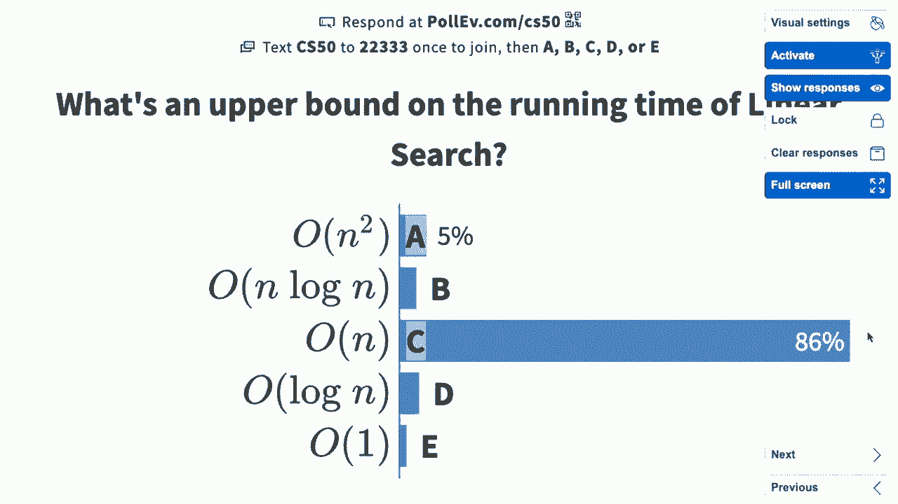

the case and we can see this in fact in，the context of our whole chart there。whereby if we consider the running times，that were，sorry i'm new here，all right fix this there we go。okay indeed if we consider now the，to be big o of n，why is that so in the worst case the。number i'm looking for 0，might very well be at the end of that。

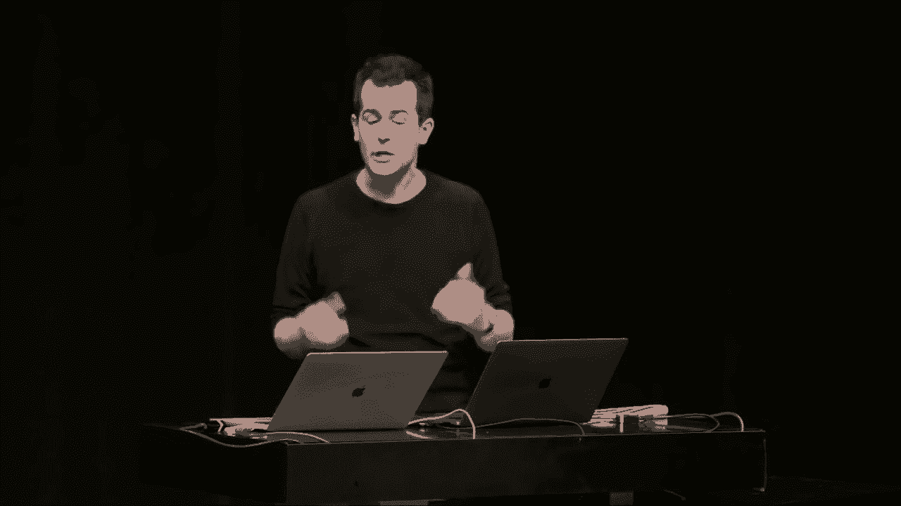

list which is going to be on the order，of n steps or in this case precisely。n steps so that's one way to think about。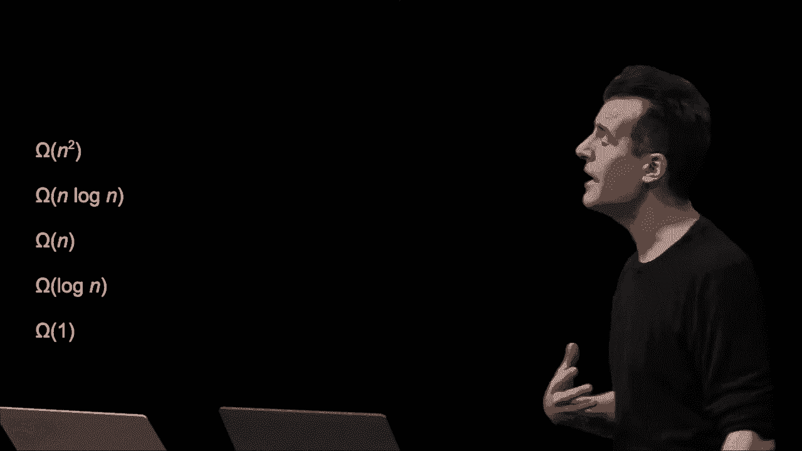

question，notation。

which is a lower bound on the running，time of an algorithm，brian could we go ah**d and ask this。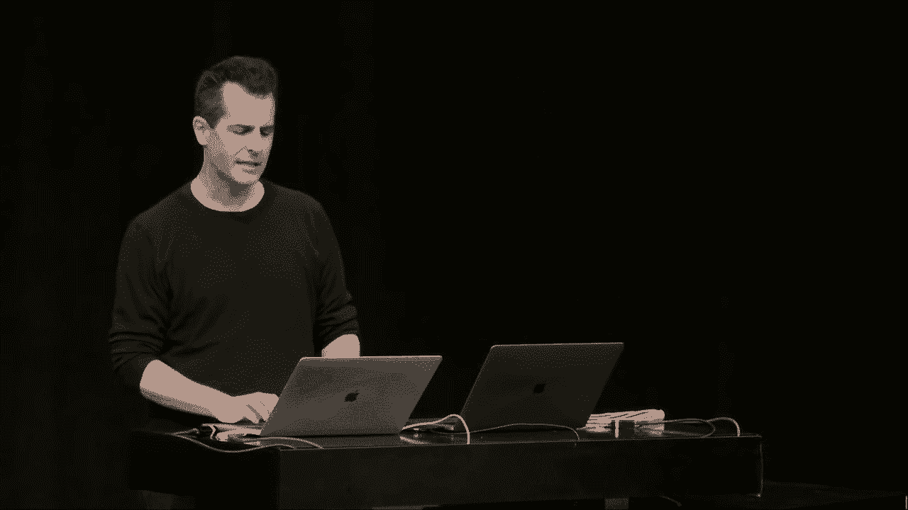

question next at that same url，we'll see a question asking now for。possible answers for the running time，for a lower bound on the running time of。linear search so let's go ah**d and take，a look at this one here。and in just a moment we'll see as the。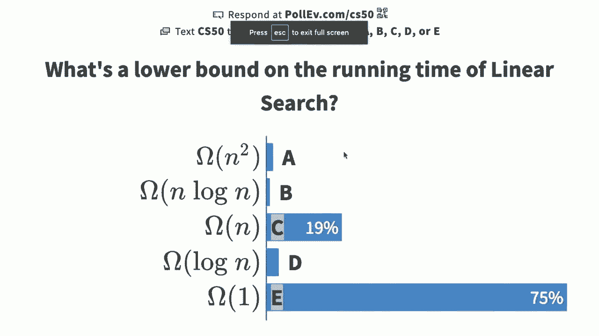

responses come in about 75 plus percent，of you are proposing。that it's actually omega of one so omega，is a lower bound，one refers to constant time and why is。this point。

step，or a constant number of steps why is，that how do you think about this，from。uh yeah you can just open it and be，lucky and find it in the first door。yeah so it really speaks to just that，you might just get lucky and the number。you're looking for might be at the very，first door so the lower bound in the，best case if you will。

of this algorithm linear search might，very well be omega of one。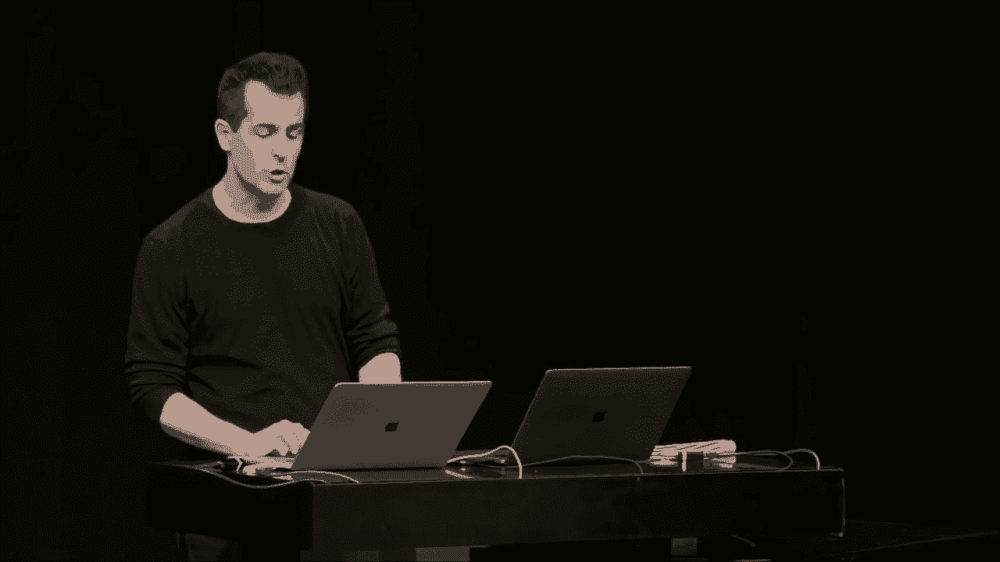

for exactly that reason that you have to，get lucky and the element might be。there at the beginning so that's pretty。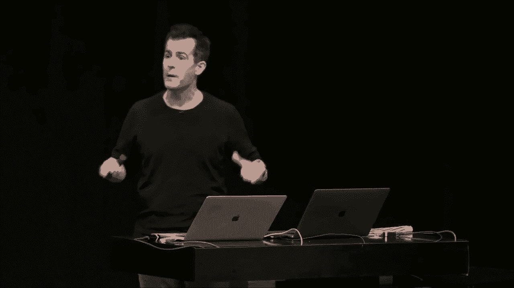

good we really can't do any better than，that so we have this range now of a。lower bound from omega of one。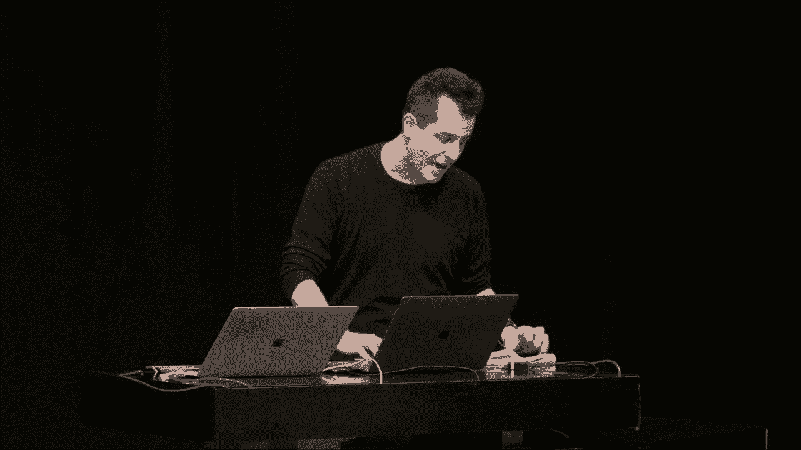

on up to big o of n being an upper bound，on the running time，of linear search but of course we have。this other algorithm in our toolkit and，recall from week zero。that we looked at binary search although。

not necessarily by name it was that，divide and conquer，third algorithm where we took the phone，half。again now while i fumbled there joe。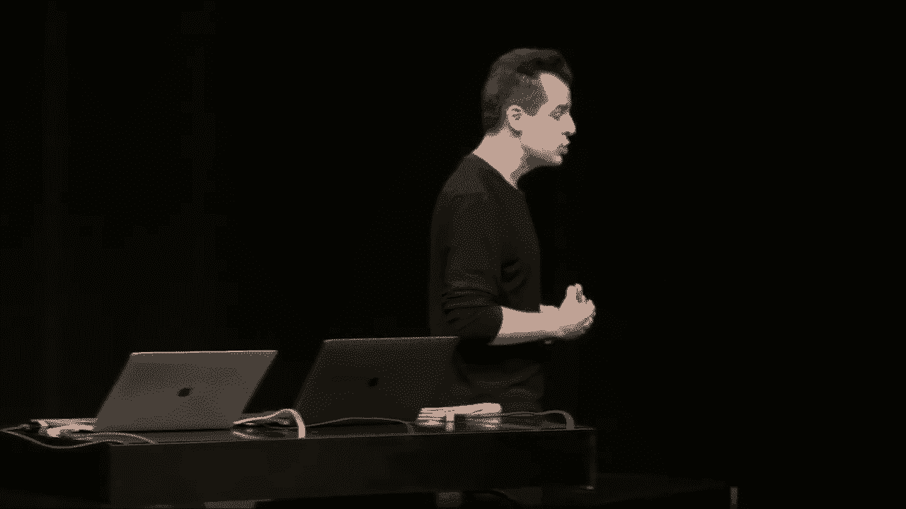

kindly uh has，uh given us a new set of doors if joe we，doors again。behind which we still have some numbers，but i think this time i'm going to be，door's。behind there we go so we have our same，seven doors but behind those doors now。is a different arrangement of numbers，and suppose this time，i want to find myself the number six。

so the number six will change the，problem slightly but i'm going to give。you one other ingredient this time，which is going to be key to this working，why were florence and i。able to do no better than linear search，before why were florence and i able to，do no better than。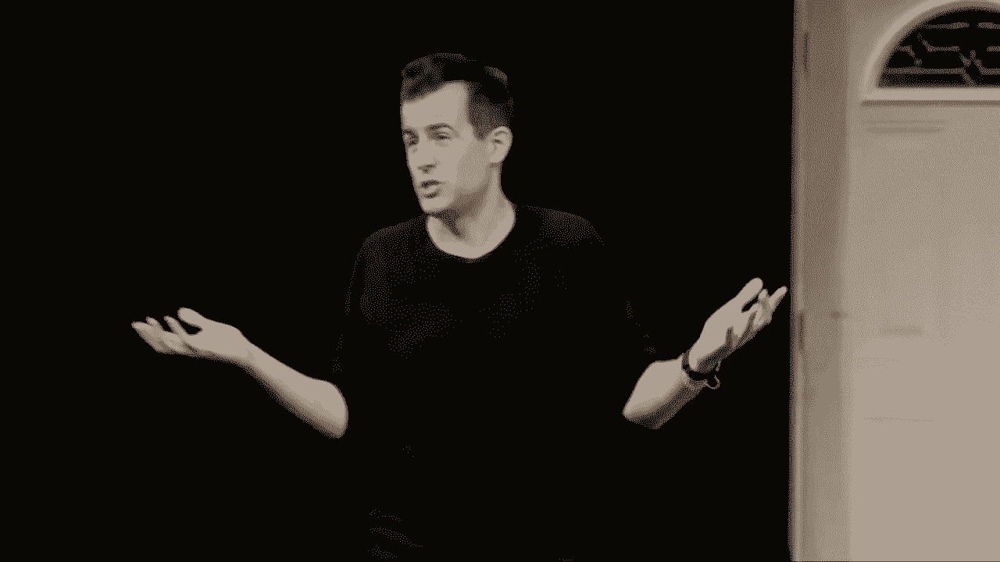

randomly searching even last time。

what was it about the array of numbers，or the array of doors，that didn't not allow me previously to。use，um it's because the we didn't know if，the numbers were sorted or not。yeah we didn't know if the numbers were，sorted or not and indeed，barring that detail florence and i。than say，linear search so this time though joe，has kindly sorted。

some numbers behind these doors for us，and so if i want to search for the，number six。now i can begin to use a bit of that，information so you know what i'm going。to start just like we did with the phone，book and start roughly in the middle and，voila。number five all right so we're pretty，close we're pretty close but the thing。

about binary search recall is that this，is now useful information。if the numbers are sorted behind these，doors all of the doors to the left，all of the doors to the。right should presumably be larger than，5。now i might kind of，cut a corner here and be like well if。this is 5 6 is probably right，next door literally but again，algorithmically how might we do this we。

don't want to necessarily，consider these special cases so more，array。of size three so let me go ah**d and，apply that same algorithm voila。to the middle now i have the number，seven and now it's becoming pretty clear。that if the number six is present it's，probably behind this door and indeed，size one，number six。

doors，instead of all seven potentially or，maybe all six doors to find my way。to that number because i was given this，additional ingredient of all of those，numbers being sorted。so it would seem then that you can apply，the better more efficient better，search。if only someone like joe would sort the，numbers for you，in advance so let's consider now a。

little more algorithmically how we might，implement this so with binary search let。me propose this pseudocode，return true，we found it so if we got lucky then we。might very well have found the number，have been done，but that didn't happen and in the。general case that probably won't happen，so if the number is less than。

that behind the middle door then just，like with the phone book i'm going to go，left half。of the remaining doors in the array else，if the number is greater than that，behind the middle door。then like the phone book i'm going to go，phone book，but there might still be one final case。potentially，whereby if there's no doors left at all，or no doors in the first place。

i should at least have this one special，case where i do say，return false for instance if six for。whatever reason weren't be，among those doors and i were searching。for it i still need to be able to handle，definitively，return false if i'm left with no further。doors to search，so here then might be the pseudo code，for this algorithm a bit more formally。

now let's consider the analysis thereof，before where we left off，linear search was big o of n linear。search was big o of。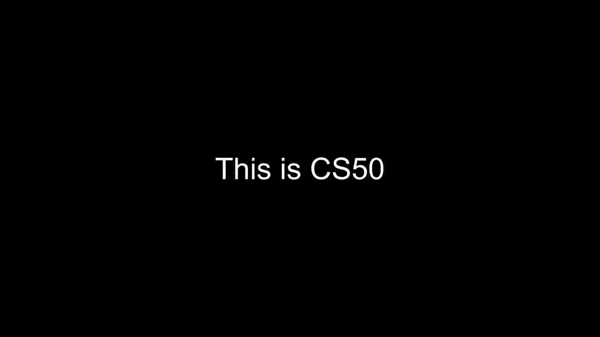

n this time let's consider where binary，search actually falls，into place by asking a different。question i'm going to go ah**d and go，back and ask this question now。what's an upper bound on the running，time of，binary search an upper bound on the。running time of binary search，and go ah**d and buzz in if you'd like，similarly to before。

what's an upper bound on the running，time of binary search，and you can see here answers are getting。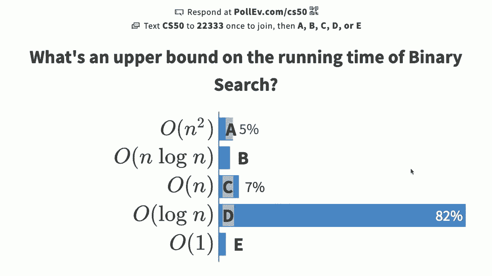

pretty dominant around log n and indeed，that jives with exactly what we did in，of n。because that's going to be the maximum，or an array，of a given size and split it in half and。you're looking for，at all，meanwhile if we consider now not just，the upper bound on this algorithm。so in the worst case binary search takes，big o of log n，now let's consider a related question。

which is what's a lower bound on the，what's a lower bound，on the running time i'll go ah**d and。to some of the，the suggestions thus far in the best，case maybe two。you do get lucky and the number you're，looking for six or some other number is。smack dab in the middle of the array and，so maybe indeed you can get away with。

just one step and indeed a lower bound，on binary search now。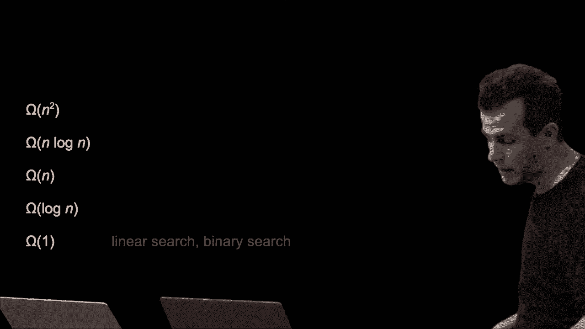

might very well just be an omega of one，because in that best case。you just get lucky and it's right where，you happen to start，in this case in the middle so we seem to。have a range there but strictly speaking，it would seem that binary search。is better binary search is better than，linear search because as n gets big，difference in fact。

recall from week zero we played a little，bit with these light bulbs and right now。all sixty-four of these light bulbs are on，and let's consider for a moment just to。put this into perspective how long it，would take to use linear search。to find one light bulb among these sixty-four 。the light bulb。

or the number that we're looking for is，way down there at the end but we don't，know it in advance。and so sumner if you wouldn't mind，executing linear search on these light。bulbs let's just get a feel for，the efficiency or inefficiency of this，algorithm，you'll notice。that one light bulb at a time is going，out implying that i've，searched that door searched that door。

searched that door，but we've only gotten through ten or so，bulbs and we've got another 50 plus。to go and you can see that if we look，inside of these doors one per second or，second。it's going to take a long time in fact i，it doesn't seem worthwhile to even wait。until the very end so somewhere if you，won mine let's bring all the lights back，algorithm。

this one binary search just to get again，a feel of，what the running time is of an algorithm。like binary search that runs in，logarithmic time so in just a moment。we'll go ah**d and execute binary search，on these light bulbs the idea being that。there's one bulb we care about let's see，how fast we can get down to just one。

bulb out of sixty-four 。so sumner on your marks，get set go，and we're done just a few steps later。and then we have this soul light bulb，that was so much faster and in fact we，did this deliberately。one iteration at a time the algorithm，that we just executed with sumners and，matt's help。algorithmically was operating what's，called one hertz，one hertz and if you're unfamiliar hertz。

is just one something per second it's，very often used in physics。or just in discussions of electricity，more generally and indeed in this case，that。first algorithm linear search might have，way，to that final light bulb but that second。algorithm was logarithmic，and so by going from sixty-four to 32。

to 16 to a to four to two to one we get。

to the final result much faster even，going at the same，pace so in fact if you think of your。computer cpu。

cpus are also measured in hertz，h-e-r-t-z，probably measured in gigahertz which is。billions of hertz per second，so your cpu the brain of your computer，literally do。one billion things at a time and here we，have this sort of simpler setup of just。light bulbs doing one thing，per second your computer can do one。

billion of these kinds of operations at，once so just imagine therefore how much。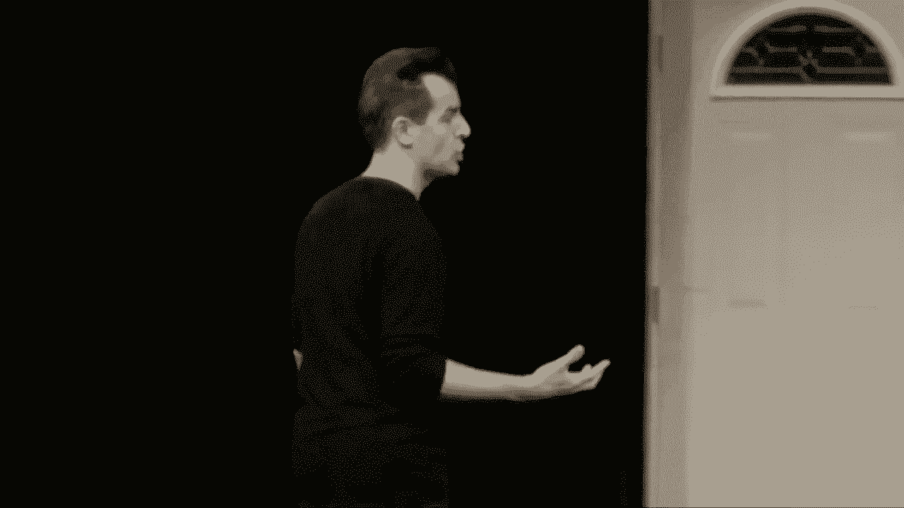

these savings tend to add up over time，problems at once，as opposed to doing things like we did。in week zero just one single，step at a time all right well let's now。go ah**d and start to translate this to，code we have enough tools in our toolkit。in c that i think based on our，discussion of arrays last week we can。

now actually start to build something，in code on our own so i'm going to go。ahead and create a file here in just a，moment in cs50 ide，called for instance numbers。c let me go。ahead and translate this to a file，in c code called numbers。c and the goal。at hand is just to implement linear，search in code just so that we're no，pseudocode。

but doing things a little more，concretely so i'm going to go ah**d and，include cs50。h。i'm going to go ah**d and include，standardio。h and i'm going to start with，no command line arguments。like we left off last week but just with，and i'm going to go ah**d and give。myself an array of numbers seven numbers，ahead and say，int numbers and then this is a little。

it's handy，for creating an array when you know in，advance what numbers you want which i do。because i'm going to mimic the doors，that joe kindly set up for us here。i'm going to go ah**d and say give me an，array that is equal to，4 6 8 2，7 5 0。and this is the feature we didn't，see last week if you know in advance the，array。

you actually don't have to bother，explicitly，the compiler can figure that out，intelligently for you。commas，inside to enumerate from left to right，the values that you want to put。into that array so after this line 6 has，executed in my computer i'm going to be。left with an array called numbers，inside of which are seven integers，listed from left。

to right in the computer's memory so to，speak in this way now what do i want to。do with these numbers well let's，implement linear search，linear search as we latched on to。earlier is a searching from left to，convention，tends to go left to right so i'm going。to do a standard for loop，for int i get 0 i is less than i'm going。

to keep it simple for now and hard code，want，and i'm going to do i plus plus on each。iteration so i'm pretty sure，that my line eight will induce a for。loop that iterates eight total times，and what question do i wanna ask on each，iteration well。if the numbers array at location i，equals equals for instance the number i。

was searching for initially let's go，ahead and search for zero，then what do i want to do let me go。but useful，knows，and then let me go ah**d and just for，good measure let me go ah**d and return。zero and we'll come back to that in just，a moment but at the end of this program。i'm also going to do this printf，not found with a backslash n and then。

i'm going to go ah**d and return，one but before we tease apart those，aggregate。here's my entire main function and on，line six to recap i initialize the array。just as we did very at the very，beginning with a seemingly random。list of numbers behind the doors then on，line eight i'm going to iterate with。

this for loop seven total times，incrementing i in each turn，and then line ten just like i was。opening the doors one at a time i'm，going to check if the ith，number in this array equals equals the。number i care about，0 with that first demo i'm going to，print found。otherwise not else per se but otherwise，if i go through this entire loop，checking if if。

if and i never actually find zero i'm，going to have this sort of catch-all at。the end that just says no matter what if，you reach line 16，print not found and then return one。now this is a bit of a subtlety but，could someone remind us，what's going on with the return 0 on。line 13，and the return 1 on line 17。why 0 and 1 and why am i returning it。

all what problem is this solving for me，even though most of our programs thus，this uh to me，return。or it found it，um and it kind of exits that loop saying，one，is like the return false um and it。exited as well exactly and exit really，is the operative word in maine。when you are done ready to quit the，program as we've done with the word quit。

in some of our pseudo code in the past，you can literally return a value and。recall at the end of last week we，introduced the fact，that maine always returns an ants you。and i have ignored that，for at least a week or two but sometimes。it's useful to return an explicit value，whether it's for auto grading purposes。

whether it's for automated testing of，your code in the real world or just so。it's a signal to the user that something，indeed went wrong，so you can return a value from main and。as uh demi proposed，zero means all is well and it's a little，counterintuitive because thus far。true tends to be a good thing but in，this case zero is a good thing all is，well it's success。

and if you return any other value for，instance one，that indicates that something went wrong。so the reason i'm printing out，after the word found i'm returning zero。is so that effectively the program，exits at that point i don't want to keep。going again and again if i already found，the number i care about。

and down here this one admittedly isn't，16，and maybe deleted line 17 the program is。going to end anyway but there wouldn't，be that so-called，exit status that we discussed last week。briefly whereby you can kind of signal，successful，or unsuccessful and the reason that zero。is a good thing，and one or any other number is not，programs that you。

write or that companies in the real，world right when you get those error，error codes。there are hundreds thousands of problems，that might happen in a computer program。that could be that many error codes that，you see on the screen reasons explaining，like，just。one value that the world has decided，means success，so there's only one way to get your，many。

millions of ways in which things can go，wrong and that's why，uh humans have adopted that particular。now，not just numbers but let's make things，more interesting besides the door。suppose that we actually had people's，names behind them well let's go ah**d。and write a program this time，that not only searches for numbers but。

instead searches for name so i'm going，here，called names。c and i'm going to start a。little similarly i'm going to include，cs50。h，at the top i'm going to include standard，io at the top。but i'm also this time going to include，string。h which we introduced briefly，sturlang。for getting the length of a string and，it turns out some other functions。

let me go ah**d and declare int main，void as usual and then，inside here i need some arbitrary names。let's come up with seven names here，and here too i can declare an array just。as i did before but it doesn't have to，store only ins it can store。strings instead so i've changed the data，type from into string and i've changed。

the variable name from numbers to names，notation，and maybe。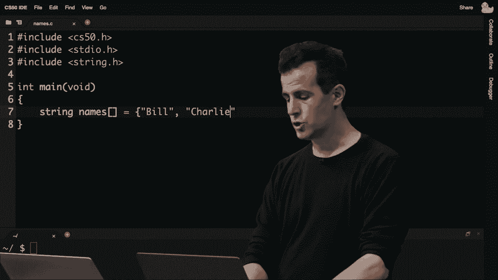

charlie and maybe fred and maybe，george and maybe ginny and maybe，percy and lastly maybe a name like。ron and it just barely fits on my screen，so with that said i now have this array，of names。and beyond there being an perhaps。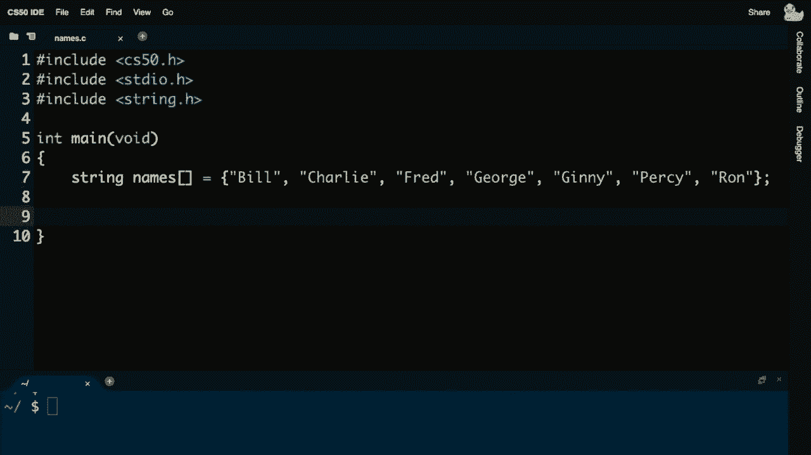

obvious pattern to them there's a second，less obvious or maybe obvious pattern to。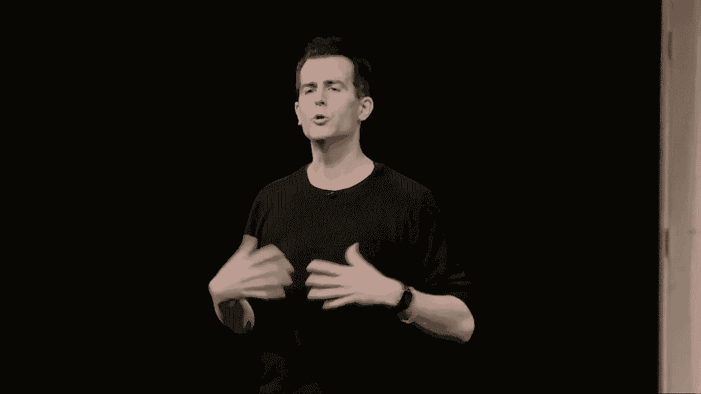

them how would you describe the list of，names i arbitrarily just came up。with what's a useful characteristic of，them what do you notice about these，names。and there's at least two right answers，to this question i think。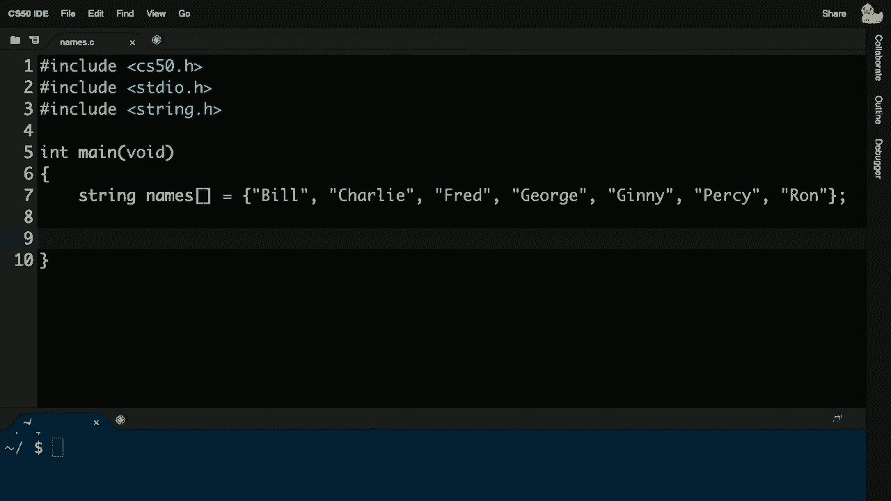

what do you notice about these names，uh they're in alphabetical order yes so。beyond being the names of the weasley，children in harry potter they're also in。

alphabetical order and that's the more，salient detail for our purposes。i've had the forethought this time to，sort these names in advance。and if i've sorted these names that，means implicitly i can use a better，algorithm。than linear search i can use for，instance our old binary search。

but let's go ah**d first and just search，them naively for now let's still apply。linear search because you know what we，haven't yet done，is necessarily compare strings against。one another we've done a lot of，comparisons of numbers like integers。but what about names so let me go ah**d，and do this so for int。

i gets 0 just like before i less than 7，i plus plus and i'm doing this only，seven names。i think we could probably improve the，design of this code too by having。a variable or a constant storing that，value but i'm going to keep it simple，now。and it turns out for reasons we'll，explore in more detail next week。

it is not sufficient to do what we did，before and do something like this if i'm，searching for ron。it turns out that in c you can't use，equals equals，int，you can for a char we've done both of。those in the past but there's a subtlety，that we'll dive into。in more detail next week that means you，can't actually do，this and this is curious because if you。

have prior programming experience in，languages like python or the like。you can do this so in c you can't，but we'll see next time why but for now。it turns out that c can solve this，problem and historically the way you do，this is with a function。so inside of the string。h header file，there is not only，a declaration for sterling the length of。

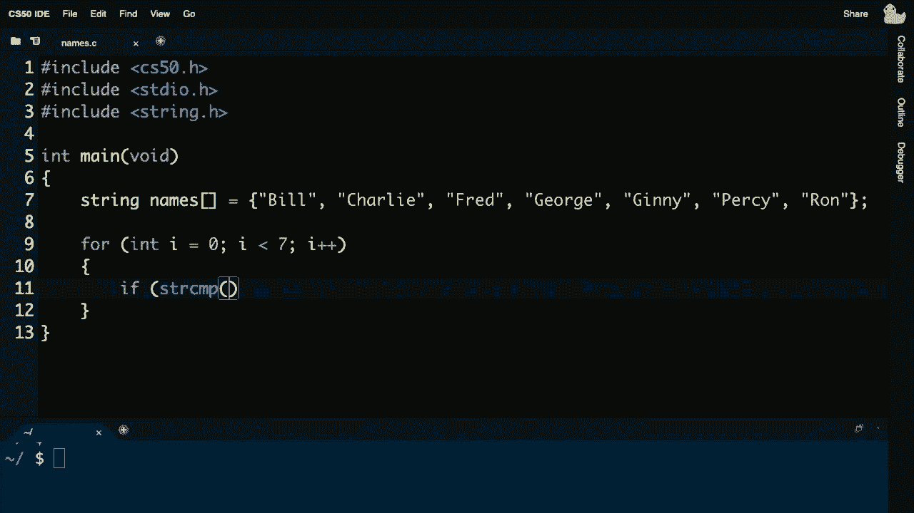

a string like last week，there's another function called stir，compare and stir。compare for short strcmp allows me to，pass in two strings，one string that i want to compare。against another string，so it's not quite the same syntax indeed。it's a little harder to read it's not，quite as simple as equals equals。

but string compare if we read the，documentation for it will tell us。that this compares two strings and it。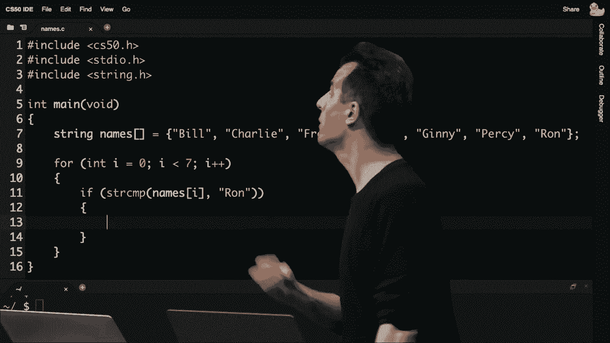

returns one of three possible values，if those two strings are equal that is，identically the same。letter for letter then this function is，going to return，zero it turns out if the first string，string。alphabetically in some sense then this，value，if the first string is supposed to come。

after the second string，alphabetically if you will then it's，going to return a positive value so。

there's three possible outcomes either，equal to zero，and in fact if you look at the，specify。

what value less than zero or what value，greater than zero。

you have to just check for any negative，value or any positive value。and i also told a bit of a white lie a，moment ago this does not check things。alphabetically even though it，coincidentally does sometimes。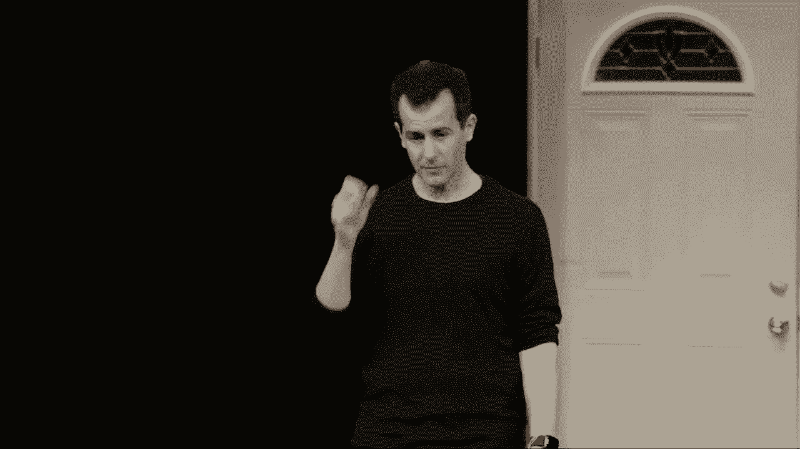

it actually compares strings in what's，called ascii order，or asciibetically which is kind of a。goofy way of describing。

this function looks at every character，in the two strings from left to right。it checks the ascii values of them and，then it compares those ascii values，character by character。and if the ascii value is less than the，other then it returns a negative value。or vice versa so if you have for，instance the letter a，capital a in the string that gets。

converted first to 65，and then if you have an a in the other，to 65。and those would be equal but of course，character，proceeds，left to right so that stir compare。checks every character，in the names for you and it stops when，it hits that terminating null。character recall that strings underneath，the hood always，end in c with this backslash zero or。

eight zero bits，so that's how stir comp knows when to，stop comparing values。but if i go ah**d and find someone like，unquote，found and like before i'll go ah**d and。return like demi-proposed，successful，otherwise if we get all the way to the。bottom of my code i'm gonna print out，not found to tell the story that we did，not find ron。

in this array even though he does happen，to be there and i'm going to go ah**d，and return one。so even though i've hard coded，everything to hard code something in a。program means to type it out explicitly，you could imagine using a command line。argument like last week to get users，input who would you like to search for。

you could imagine using getstring to get，users input and ask them who would you，like to search for。but for now just for demonstration's，sake i've used only ron's name。and if i haven't made any typos let me，go ah**d and type in，make names enter so far so good。dot slash names and i'll hopefully we'll，see indeed found，because ron is very much in this array。

of seven，are new here，are again the fact that when we declare，an array of some fixed size we don't。strictly need to put a number here，and we have this curly brace notation，advance。but perhaps lastly and most powerfully，we do have this function in c。called stir compare that will allow us，to actually，store and compare strings in this way。

so let me pause here and just ask if，there's any questions，about how we translated these ideas to。code for numbers，and how we translated these ideas to，code for。now names each time using linear search，not binary caleb question，i meet myself uh yeah。so if would that program still work if，ron for example was like all caps。

like if you're trying to like search，like if like the cases are different。in terms of like uppercase lowercase，really good question and let me propose，general。when in doubt try it so i'm gonna do，exactly that i do happen to know the。answer but suppose i didn't，let me go ah**d and change ron to all，caps just because maybe the human。

the caps lock key was on and they typed，it in a little sloppily let me go ah**d。and make no other changes，notice that i'm in leaving the original，array alone with only a capital r。let me remake this this program make，names dot slash，names and voila he's still in fact，oh okay um。uh uh caleb you have just helped me，previous，example none of you who should have uh，program。

worked with ron because i didn't，practice literally what i'm preaching so。caleb hold that thought for just a，moment so i can rewind a little bit。and fix my apparent bug so ron was，indeed found，but he wasn't found because ron was。found i did something stupid here，and it's uh perhaps all the more，pedagogically appropriate now to。

program，it also says，ron was found in all caps and you know，what let me get a little。curious here let me go ah**d and search，for not even ron how about we search for。ron's mom molly make names，all right and now just to reveal that i，really did do something stupid。dot slash names okay now something's，clearly wrong right，i can even search for the father arthur。

make names dot slash names it seems that，i wrote you a program that just。literally always says found so we，shouldn't have accepted this as correct。can anyone spot the bug based on my，definition thus far，meantime this。isn't uh really a bad time to open up，the duck and say，uh hello duck i am having a problem。

whereby my program is always，printing found even when，someone is not in the array。and i could proceed to explain my logic，to the duck but hopefully sophia。can point me at the solution even faster，than the duck，we received from。stir comp with something so we need to，that，perfect，so i said the right thing but i，i want to check。

for equality i literally need to check。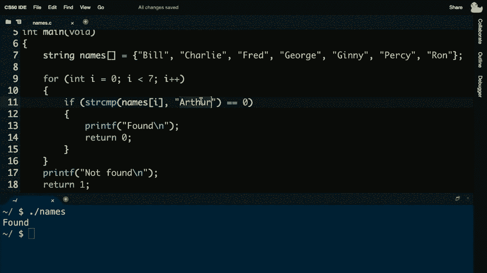

the return value，when comparing names bracket i against，ron to equal zero because。only in the case when the return value，of stir comp is zero，do i actually have a match。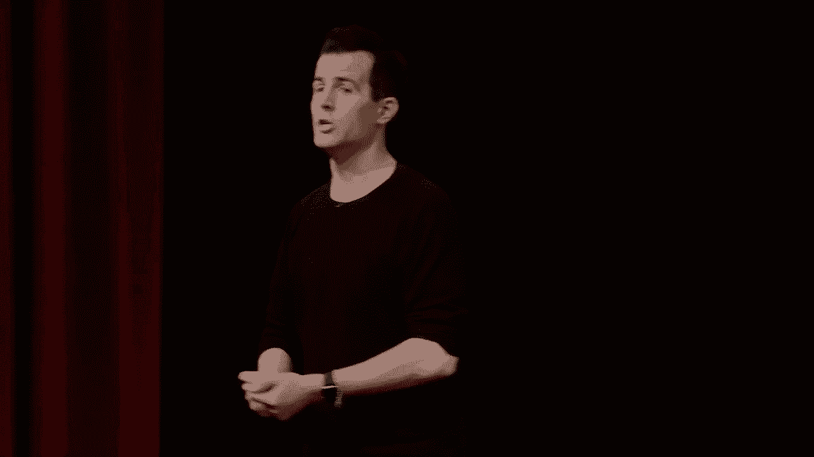

by contrast if the function returns a，negative value，or the function returns a positive value。that means it's not a match that means，the other，or lay after the other but the catch，not。always an incorrect syntax to use，whenever you have a boolean expression。inside of which is a function call，like this notice that the entirety of my，speak。

to stir comp i'm passing in two inputs，names bracket i，and quote unquote ron and therefore i'm。expecting stir comp to return，output a so-called return value that。return value is going to be negative。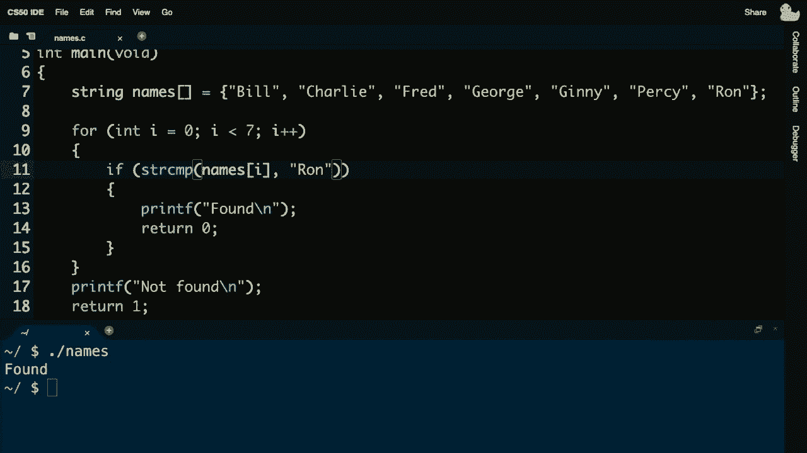

clear，bill，and name's bracket i or names bracket，zero is bill，bill comma ron is effectively what my。input is on the first iteration。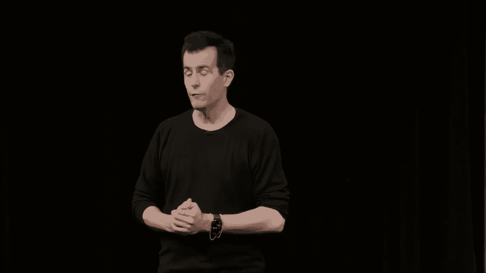

bill alphabetically and asciibetically，comes before ron which means it should。be returning a negative value to me，and the problem with boolean expressions。is as implemented in this context，is that only zero is false，any other return value is by definition。true or a yes answer whether it's，negative one or positive one，negative one million or positive one。

million any non-zero value in a computer，language like c，is considered true also known as *****。

false but，only that value is considered false so，really i was getting。lucky at first because my program was，for ron，then when i did it again for caleb and i。capitalized ron，i was getting unlucky because suddenly i，knew ron capitalized wasn't in the array。and yet i'm still saying he's found but，that's because i didn't practice what i。

preach per sophia is fine，and so if i actually compare this，against zero and now caleb we come full。circle to your question，i rebuild this program with make names i。now do dot slash names and search for，all caps ron i should now see thankfully。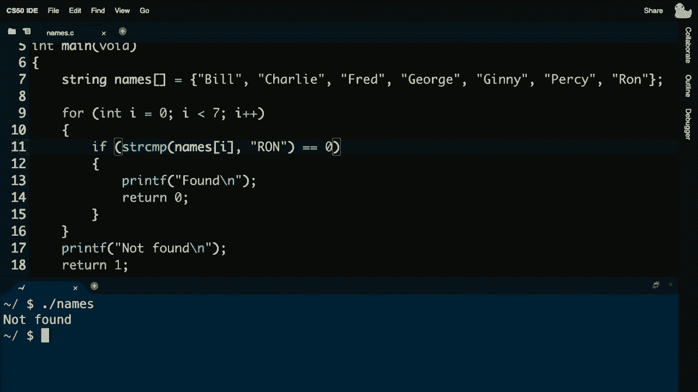

not found so i wish i could say that was，deliberate but，thus is uh the common case of bugs so。here i am 20 years later making bugs in，my code so if you run up to a similar，problem this week。rest assured that it never gets，it never ends but hopefully you won't。have several hundred people watching you，while you do your problem set this week。

all right any questions then beyond，answer is no it。

is case sensitive so it does not find，rob，any questions on linear search using，strings。no all right well let's go ah**d and do，one final example i think with searching。but let's introduce just one other，feature and this one's actually pretty，cool and powerful。up until now we've been using data types，like int，and char and float and the like and，you'll see now。

that there's actually sometimes reasons，own，custom data types our own types that。didn't exist when c itself was invented，so for instance suppose that i want to。represent not just a whole bunch of，numbers and not just a whole bunch of。names but suppose i want to implement，book of course，contains both names and numbers and。

suppose i want to combine these two，ideas together，wouldn't it be nice if i could have a。data structure，that is a data type that has some，structure to it。that can actually store both at once and，in fact wouldn't it be nice if c，i want to represent。

a person like in a phone book who has，both a name and a number。i can actually implement that end code，by calling that，variable of type person now of course。the designers of c did not have the，force site to，create a data type called person and。indeed that would be a slippery slope if，they had a data type for every。

real world entity you can think of but，this，of phone books，has both a name and a number we might。think of it as follows，a name and a number both of type string，but a quick check here。why have i now decided somewhat，presumptuously to call phone numbers。strings as well we've been talking about，ins behind these doors we've been，searching for ins in code。

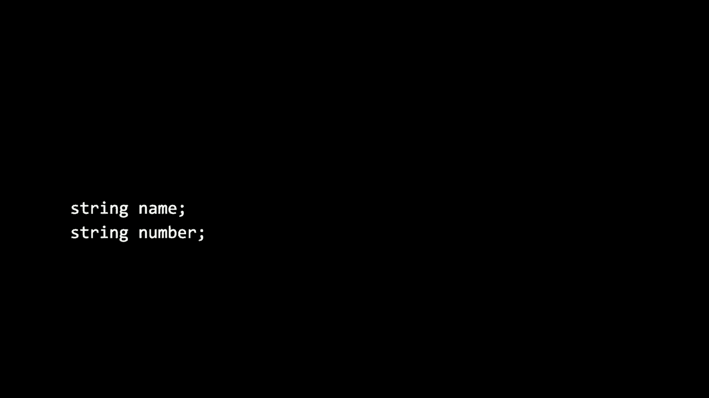

but why did i just presume to propose，that we instead implement a，numbers。uh yeah because because we're not doing，math on it it's like，like a phone number could be like。letters for all we care and in fact i，mean like sometimes you see like。1-800 contacts or something like that，and maybe we want to allow that。

yeah absolutely a phone number despite，its name isn't necessarily just a number。

it might be 1 800，contacts which is an english word it，might have hyphens in it or dashes it。might have parentheses in it it might，there's a lot of，characters that we absolutely can。represent and see using strings that we，couldn't represent。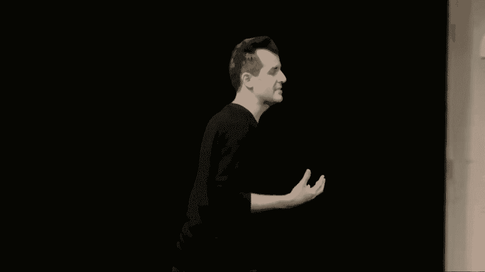

in c using ants and so indeed even，though in the real world there are these。numbers that you and i talk about，once in a while like phone numbers maybe，in the u。s social security numbers，credit card numbers those aren't，necessarily values that you want to。treat as actual integers and in fact，those of you who did the credit problem。

and tried to validate credit card，challenges，card number，it probably in retrospect might very。well have been easier for you to treat，credit card numbers as strings the catch。of course by design is that you didn't，least，in c yet so suppose i want to create my。own custom data type that，encapsulates if you will two different，types of values a person shall be。

henceforth a name，and a number it turns out that c gives，us this syntax here。this is the only juicy piece of new，syntax besides those curly braces a。moment ago that we'll see today and see，type def and as the name rather。succinctly suggests this allows you to，define a type，and the type will be a structure of some。

sort so a data structure in a，programming language，is typically a data type that has some，structure。it typically has one or more values，inside of it so using，typedef and in turn using the struct。keyword we can create our own custom，of，multiple other data types so if we want，to keep persons。together as their own custom data type，the syntax is a little cryptic here you。

literally do type def struct，open curly brace then one per line you。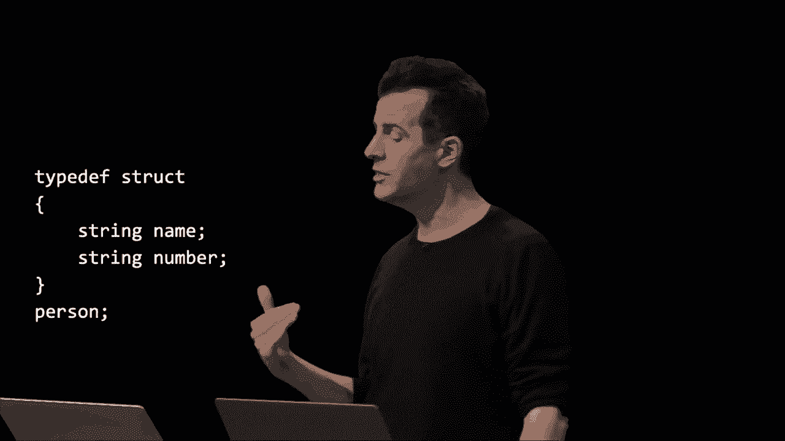

specify the data types that you want and，the names that you want to give to those。data types for instance name and number，and then outside of the closing curly。brace you literally put，data type。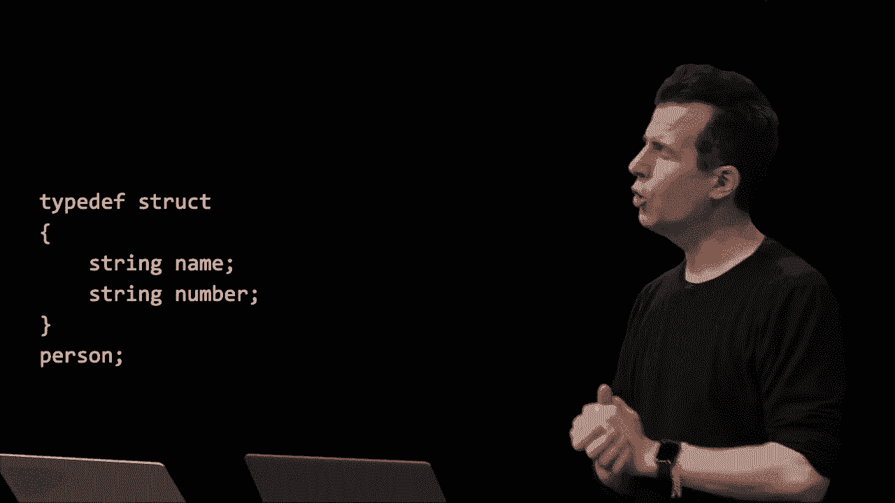

that you want to invent so how can we，use this more powerfully well let's go，ahead and do things。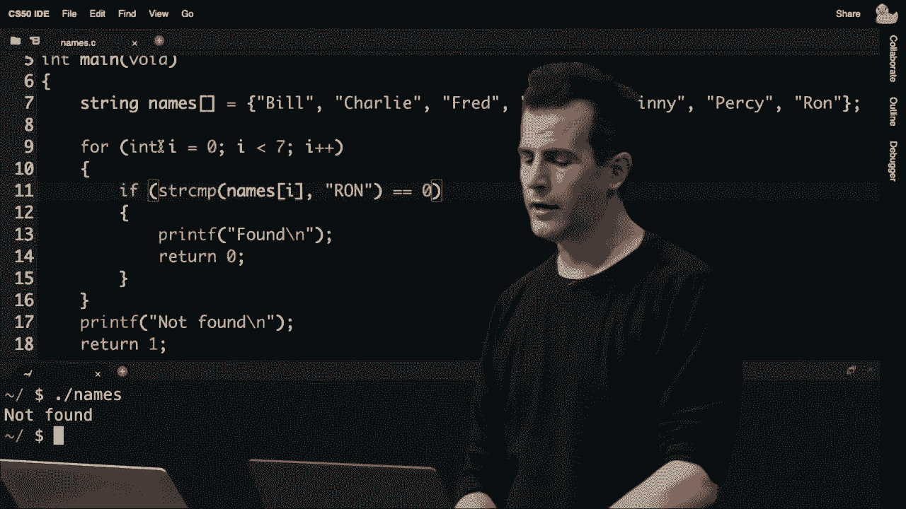

the wrong way without this feature first，so as to motivate its existence。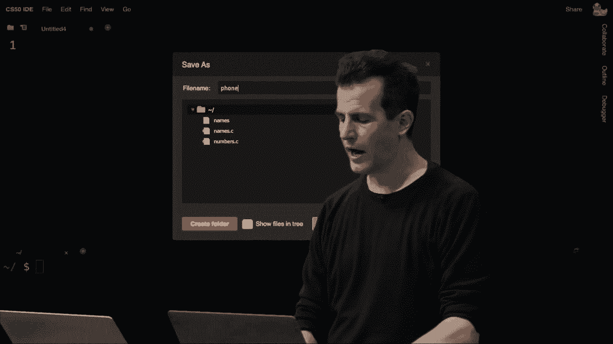

let me go ah**d and save this file as，phonebook。c，and let me start as always with include，cs50。h。and then let me go ah**d and include，standardio。h and then lastly let me also，include string。h because i know i'm，a moment，pro function，let me go ah**d and give myself。initially for the first version of this，program a whole bunch of names。

specifically how about brian comma，david we'll keep it short uh just so as，data they're in。then brian and i each have phone numbers，array，before and，uh plus 1 617 four nine。four nine five one thousand and indeed，there's already motivation per kurtz，comment to use。strings because we've got a plus and a，couple of dashes in there。

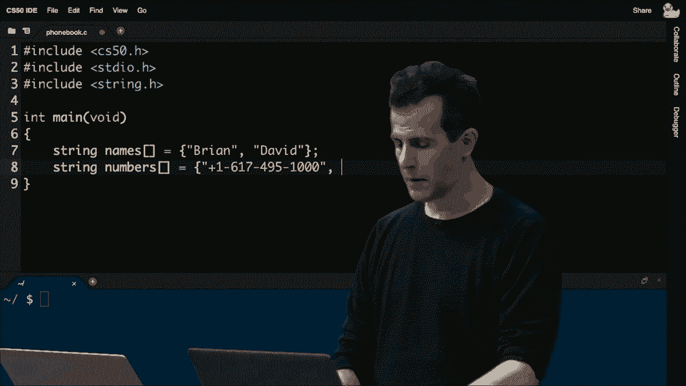

and then my number here so we'll do plus，*****，*****，curly brace semicolon。so i've gone ahead and declared two，numbers，and i'm just gonna have a sort of uh。um handshake agreement that the first，name and names corresponds to the first，number and numbers。the second name and names corresponds to，the second number，in numbers you can imagine that working。

well so long as you don't make any，mistakes and you have，just the right number in each now let me。than，two i'm going to keep that hard-coded，for now just to do the demonstration。and then inside of this loop let me go，ahead and search for my phone number for，the end。so if stir compare of names bracket i，equals rather comma，david equals equals zero so i'm not。

going to make that mistake again，let me go ah**d inside of this loop，inside of this condition here。and i'm going to go ah**d and do the，following print out，that i found for instance my。number and i'm going to plug that in so，numbers bracket i，and then as before i'm going to go ah**d。and return zero and if none of this，array，i'll go ah**d and print out as before，not found。

with a semicolon and then i'll return，one i could，return a million negative million but。you go from one，zero to one to two to three on up if you，have that many possible error conditions。all right so i essentially have，implemented in c a phone book of sorts，zero。now i'm doing it in code it's a limited，phone book it's only got two names and。

two numbers but i could certainly，implement this phone book by just using，will。by just using the honor system that the，first element in names lines up with the。first element in numbers，and so forth now hopefully if i didn't。make any typos let me go ah**d and make，phone book all right it compiled okay，dot slash phone book。

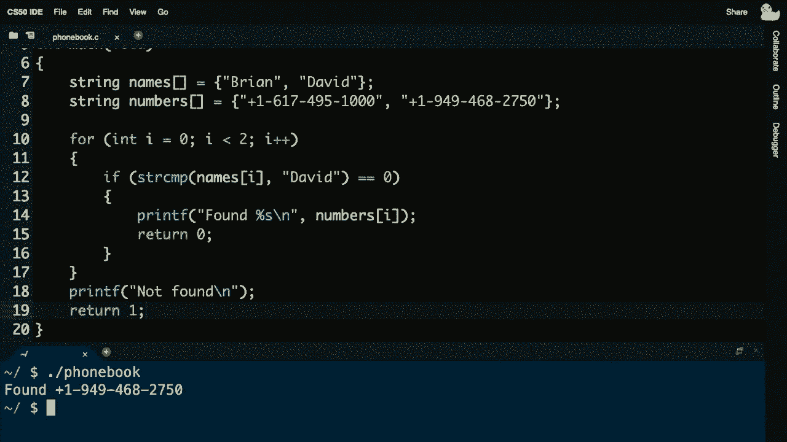

and it found what seems to be my number，there so it seems to work correctly。though i've tried to pull that one over，you before but i'm pretty sure this one。actually works correctly。

and so we found my name and intern，number，but why is the design of this code not。necessarily the best，this is starting to get more subtle，admittedly。and we've seen that we can do this，differently but what，rubs you the wrong way about here this。is another example of what we might call，code smell like something's a little，funky here like。

ah this might not be the best solution，yeah so what i'm guessing is that uh。like you know how you made the data，frame before like the new data structure，together。in this case we're just banking on the，fact that like we don't screw something。them from like the same，linked，yeah which might not be like that's。

exactly the right instinct in general as，great as a programmer as you're maybe。aspiring to be you're not all that and，like you're going to make mistakes。and the more you can write code that's，yourself，the better off you're going to be the。more correct your code is going to be，and the more，more easily you're going to be able to。

collaborate successfully if you so，choose in the real world，on real world programming projects。whether it's for a research project a，like，generally speaking you should not trust，yourself or。other people that with whom you're，writing code you should have as many，defense mechanisms in place。exactly along these lines so yes there's，the sense that this，is correct but as noted if you screw up。

and maybe you get an off by one error，maybe you transpose two names or two。numbers i mean imagine if you've got，dozens of names and numbers hundreds of。names and numbers thousands of them，the odds that you you or someone messes。the order up at some point，is just probably going to be too too，could sort of。

keep related data together this is kind，say，my arrays line up i'm just going to make。sure to keep them the same length，we can do better let's keep related data，together and design。this a little more cleanly and i can do，this by defining my own type。that i'll call for instance a person so，at this top of this file。

before main i'm going to go ah**d and，type def a structure，inside of which are the two types of。data that i care about，before，notice though here that what i have done。here is not give myself an array i've，given myself one name and one number。outside of this curly brace i'm going to，give this data type a name which i could。

call person i could call it anything i，in this case，and now down here i'm going to go ah**d。and change this code，a little bit i'm going to go ah**d and，give myself an array still。but this time i'm going to give myself，an array of persons，and i'm going to call that array。somewhat playfully people，people，in this program me and brian now i want。

to go ah**d and populate this array that，is i want to fill it with values and，just。to enable us to actually store values，inside of a structure，if i want to index into this array，i do。people bracket zero that's going to give，me the first person，variable inside so probably where brian。is supposed to go，the one last piece of syntax i need is，how do i go inside of that。

structure that person data structure and，access the person's name。i literally just do a dot so people，bracket zero gives me the first。person in the people array and then the，dot means go inside of it and grab。the person variable i'm going to go，ahead and set that name equal to，quote-unquote brian。

the syntax now for his name is almost，identical people bracket zero，six one seven。four nine five one thousand semicolon，meanwhile if i want to access a location。for myself i'm going to go ah**d and put，location，name will be quote unquote david and。then over here i'm going to do，peoplebracket1。number，equals quote unquote plus four nine four。

six eight two seven，bit verbose，admittedly but you could imagine if we，just let our thoughts run。run ahead of ourselves here if you used，getstring you could sort of。automatically do this if you used，command line arguments maybe you could，populate some of this。we don't just have to hard code that is，into this program，you can imagine doing this more。

dynamically using some of our techniques，using getstring and so forth。from week one but for now it's just for，demonstrations sake so now if i want to。search this new array，this new single array of people，i think my for loop can stay the same。and i think i can still use stir compare，but now i need to go inside of not names。

but people and look for the dot name，field so data structures have fields or。variables inside of them，so i'm going to use the dot notation，there too go into the ith。person in the people array and compare，unquote david，and then if i have found david in this。case myself，go ah**d and access the people array，again but print out using printf。

the number so again the dot operator is，the only new piece of syntax that's，letting us go inside of。this new feature known as a data，structure if i go ah**d and make phone。book again after making those changes，all is well it compiled okay and if i，run dot slash phone book。again，so here is sort of a seemingly useless，exercise and that all i really did was。

re-implement the same program using more。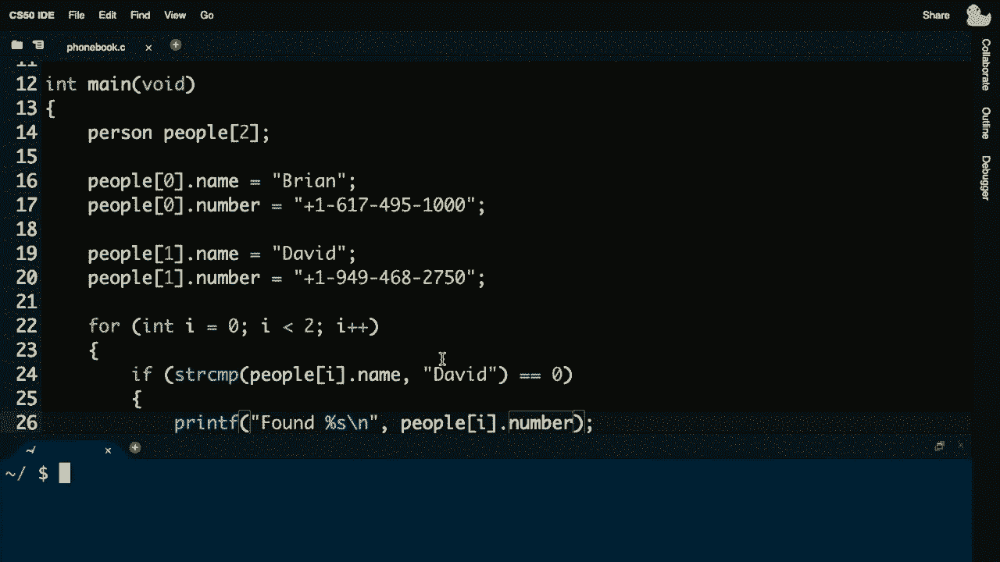

complicated，but it's now better designed or it's a，step toward being better designed。because now i've encapsulated all inside，of one variable。

for instance people bracket zero people，bracket one all of the information we。care about with respect to brian，or me or anyone else we might put into。this program and indeed this is how。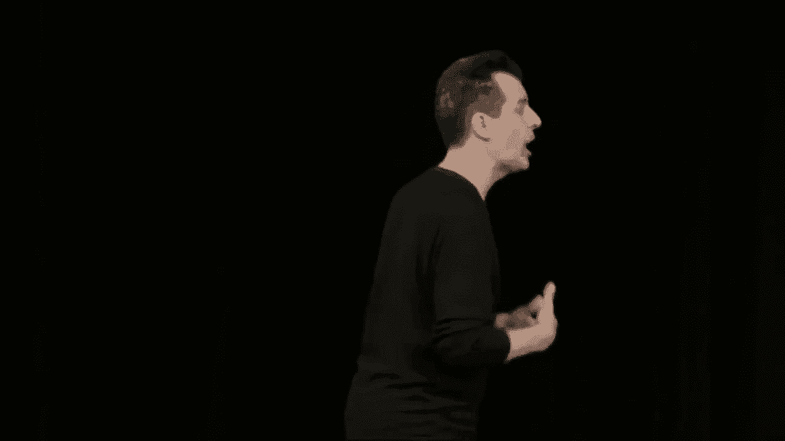

programs this is how googles of the，world facebooks of the world store lots。of information together consider any of，your social media accounts like。instagram or facebook or snapchat and，data，associated with you on all of those。platforms not just your username，of posts，also your friends and followers and the。

like so there's a lot of information，that these companies were better for。worse or collecting on all of us，big array。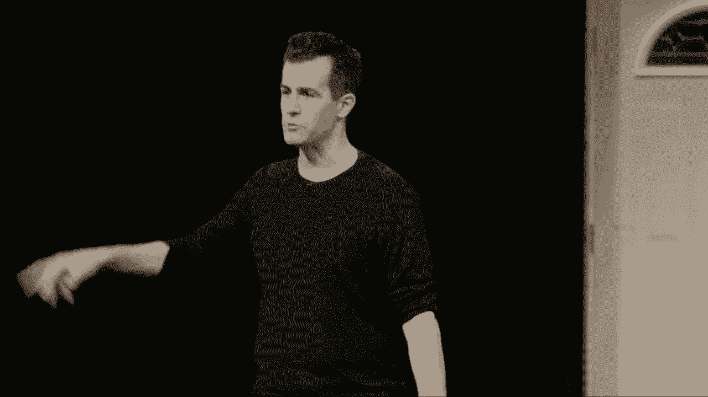

with all of our usernames one big array，with all of our passwords one big array。with all of our friends，like you can imagine certainly at scale，that's gotta be a bad。design to just trust that you're gonna，get the ordering of all of these things。right they don't do that，they instead write code in some language，that somehow encapsulates。

all the information related to me and，brian and you，inside of some kind of data structure。and that's what they put in their，database or some other server。on their back end so this encapsulation，is a feature we now have in terms of c。and it allows us to create our own data，structures that we can then use。

in order to keep related data，together all right any questions then on。data structures or more specifically，type def，and struct the c keywords with which you，can create。your own custom types that themselves，uh hi so is it typical to define the new，data structure。outside of main like in the header，really good question is it typical to，main，immaterial。

because i only have one function in this，program maine but as we'll see。this week and next week and onward our，programs are going to start to get a，little more complicated。by nature of just having more features，and once you have more features you。probably have more functions，and when you have more functions you，to。

all of those functions and we'll so，we'll begin to see，definition of some of these structures。being indeed outside of our own，functions，classes and，header files later or will we keep。defining them outside of main，really good question might we define our，own uh types。and our own data structures in header，files yes eventually we'll do that too。

thus far you and i have only been using，header files that other people wrote。we've been using standardio。h string。h，that the authors of c created you've，been using cs50。h with wii，the staff wrote it turns out you can，also create your own header files your，own。h files。inside of which are pieces of code that。

you want to share，across multiple files of your own we're，not quite there yet but yes peter。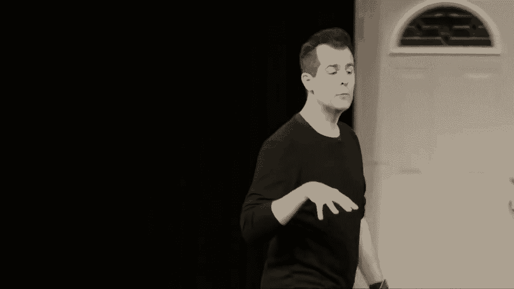

that would be a solution too to this，problem by putting it in one，i was i was thinking。takes enough information to solve the，upsets，because i feel there's，misinformation i。am a freshman and，i was taking i was so，concentrated and i can't go on go ah**d。on the upsets is there anything that i'm，missing，it's a really good question and quite，so。

um indeed recall from week zero this the，the fire hose，uh metaphor that i i borrowed from mit's。the case，um there's a lot of new syntax a lot of，new ideas all at once but。when it comes to the individual problems，and the problem sets，do realize that you should take those。work。

complicated，and throughout each of the lectures and，live，or via the examples that are pre-made on。the course's website for your review，there's always little clues or hints or。examples that you can then do，like，labs and the like will you see。additional building blocks as well so，feel free to reach out more individually。

afterwards happy to point you at some of，those resources in fact。most recently two will you notice on the，course's website what we call。

shorts which are shorter videos made by，lloyd。

which are literally short videos on very，specific topics so after today。you'll see short videos by doug with a，different perspective on linear search，on binary search。and on a number of other algorithms as，um i was wondering what the return，values that we have。that be，like what's an example of what we would，there are like。

several different cases and we want to，somehow keep track of them。exactly the latter so right now honestly。

bothering to，spend time returning zero or returning。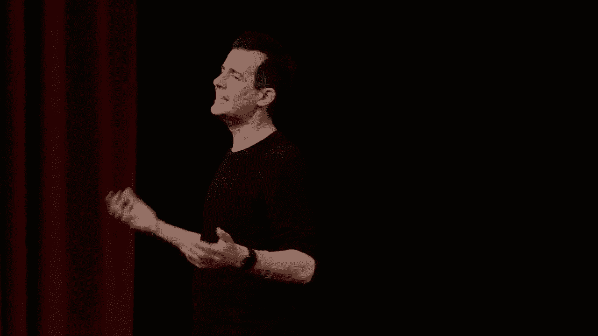

because we're not，using the information but what we're，trying to do is sort of lay the。

foundation for more complicated programs，and indeed this week and next week and。

longer，and as we the course start providing you。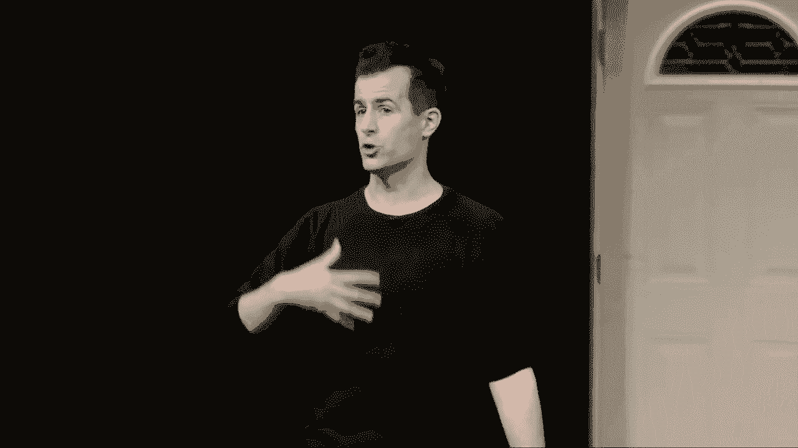

with starter code or distribution code，that is lines of code that the staff and。

i write that you then have to build upon，it's going to be a very useful mechanism。to be able to signal that this went。

wrong or this other thing went wrong，so all we're doing is sort of preparing。for that inevitability even。

if right now it doesn't really seem to，be scratching an itch，i was just going to ask really quickly。obviously in this code we have，people，so let's say we had 10 or 20 or even 30。people i know it was a question of the，chat but i just wanted to clarify for，myself too。and the the what if being what what，would change or what what's the end of，that question。

yeah what would change the code or what，problem，ah okay good question so if we were to。have more names like a third name or a，tenth name or the like，the only things that we would have to。change in this version of the program，is first on line 14 the size of the，people。we need to decide in advance that we're，going to have 10 people better still。

i could for instance allocate myself a，constant up here so let me actually go。up here just like we did，in a previous class where we did，something like this const inst，to 10。and recall that const means constant，that means this variable can't change。int of course means it's an integer the，fact that i've capitalized it is just a。

human convention to make a little，visually clear that this，is a constant just so you don't forget。but it has no functional role and then，this of course is just a value to assign，to number。then i could go down here on line 16 and，plug in that variable so that i don't。have to hard code what people would call，a magic number，which is just a number that appears。

seemingly out of nowhere now i've put，all of my special numbers，of my file。and now i'm using this variable here and，then what i could do and i alluded to。this only verbally before，i could absolutely start hard coding in。for instance montague's name and number，others，but honestly this seems kind of stupid。

if you're just hard-coding all of these，names and numbers and in a few weeks，of the same。information in like a spreadsheet or，what's called a csv file comma separated。values or even in a proper，database which the the facebooks and，googles of the world would use。but what i could do for now is something，like this for int i gets 0，plus。

and maybe i could do something like this，people bracket i，dot name equals get string。what's the name question mark and then，here i could do people bracket i dot，number equals get string。what's their number and i can ask that，question too。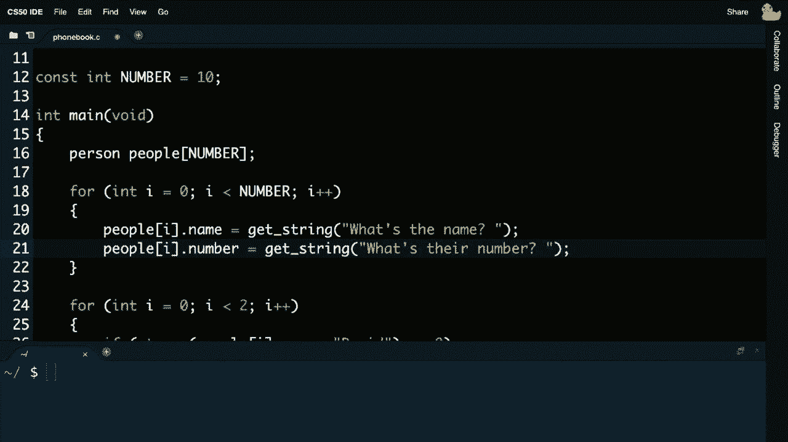

so now the program is getting to be a，little better designed i'm not，brian。now it's dynamic and technically the，the moment，but i could make that dynamic too i。could also call getint，or like you did this past week use a，command line argument。and parameterize the code so that it can，actually be for two people 10 people。

whatever you want the program can，dynamically adapt to it for you。other questions on structs on types，or the like，no all right so how did we get here，of。searching whereby we just want to find，someone in the doors we just want to。find someone in the array，we've sort of escalated things pretty。

quickly to finding not just numbers or，names but now，names with numbers in the form of these。data structures，but to do this efficiently really，requires a smarter algorithm like binary。search up until now we've only used，in c code linear search even though。

recall that we did have at our disposal，this pseudocode for。

binary search but with binary search，sorted，and so if you want to get the speed。benefits of searching more quickly，by having sorted numbers somehow someone。

is going to have to do that for us，joe for instance sorted behind the。curtain all of these numbers for us，but what algorithm did he use is going，how we can。

sort numbers efficiently and indeed if，you're the googles and the facebooks and。the instagrams of the world。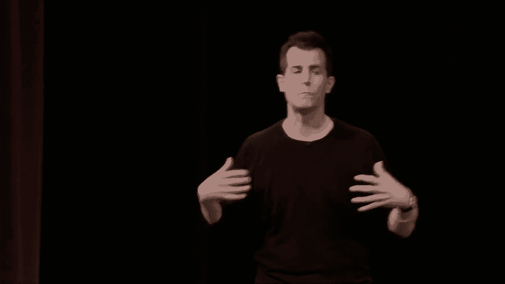

in users，you surely want to keep that data sorted。

presumably so that you can use，algorithms like binary search to find，information quickly when you're。let's go ah**d，here take a five minute break and when，algorithms。for sorting that's going to enable us to。