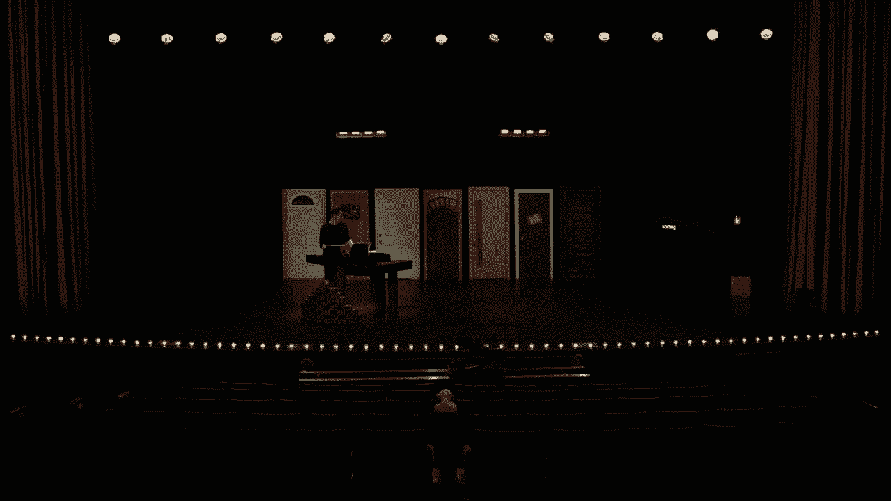
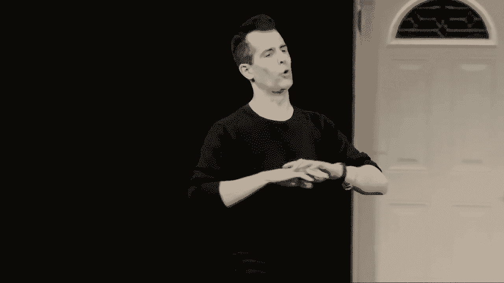
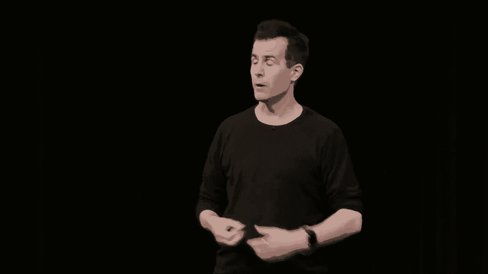
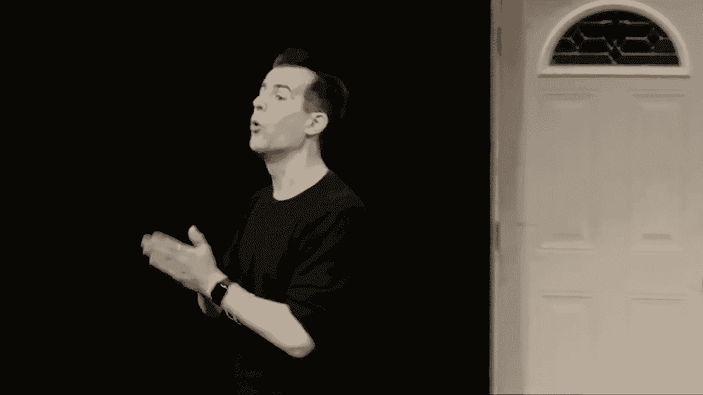
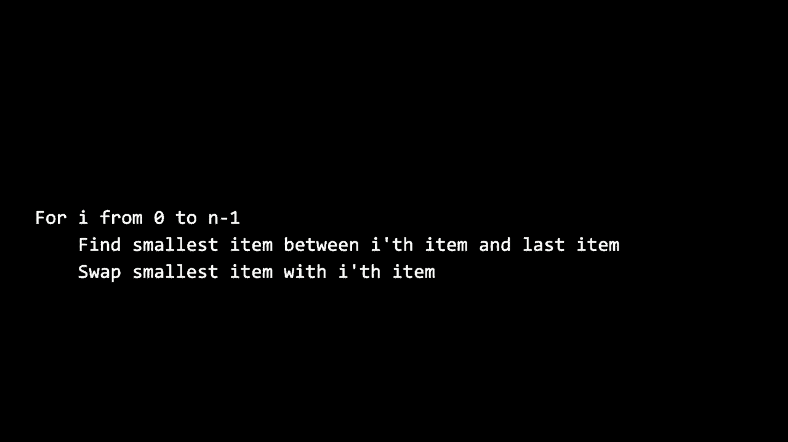
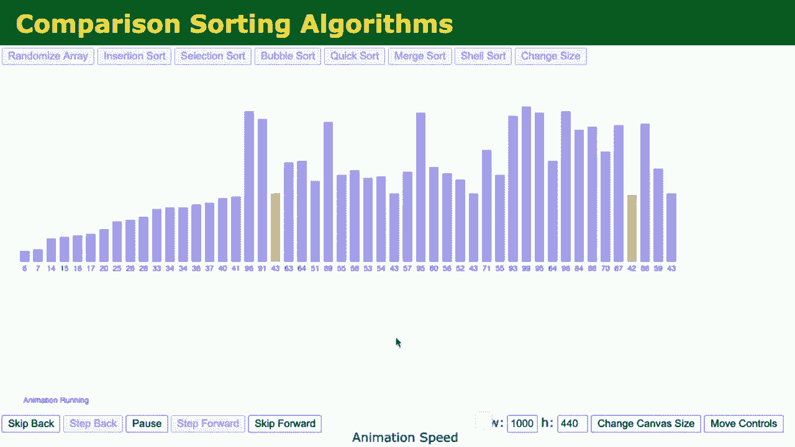
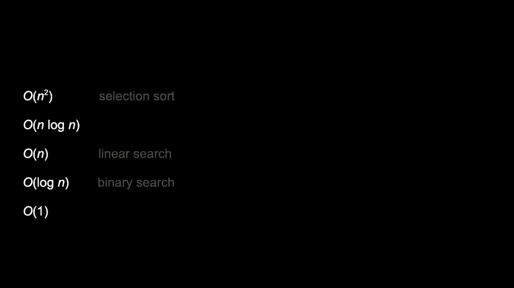
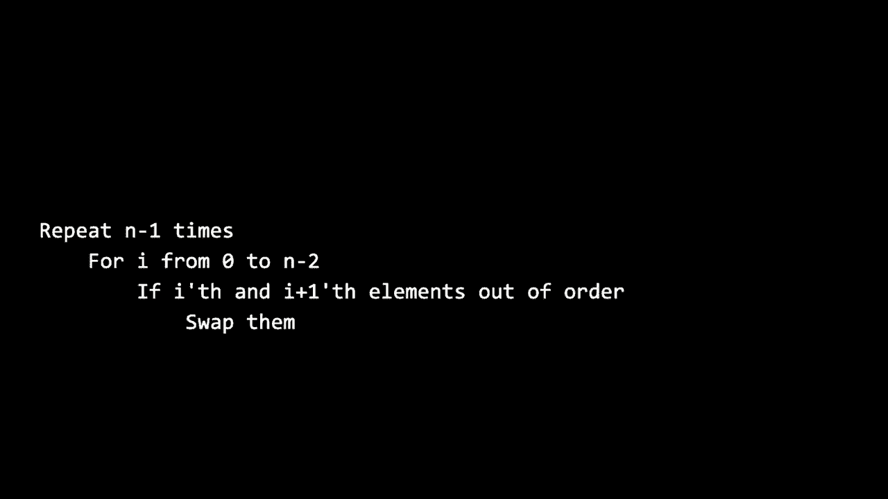
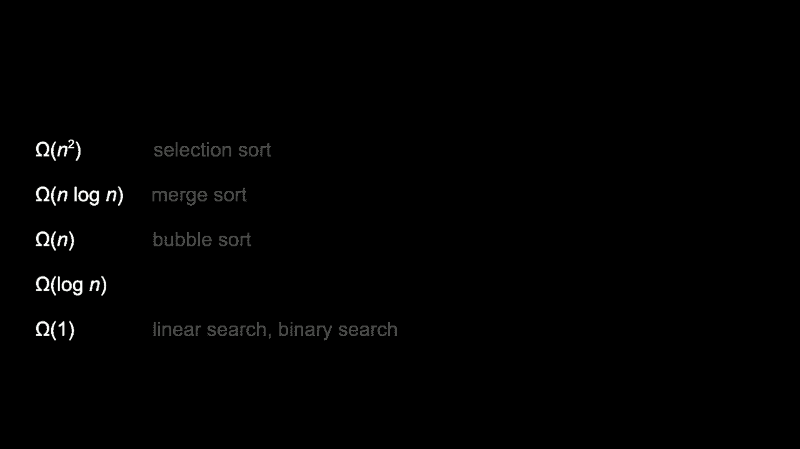
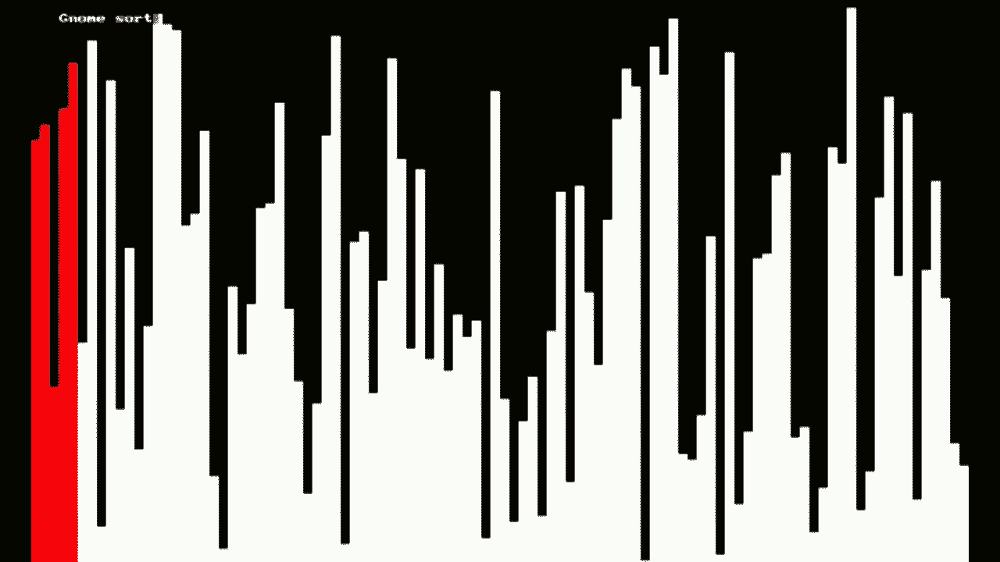

# 【双语字幕+资料下载】哈佛CS50-CS ｜ 计算机科学导论(2020·完整版) - P7：L3- 算法（结构体、搜索与排序）2 - ShowMeAI - BV1Hh411W7Up

do everything。

all right we are back so to recap，we have a couple different algorithms，search。

binary search is clearly the winner from，all measures we've seen thus far。

the catch is that the data needs to be，sorted in advance to order to。

in order to apply that algorithm so，let's just give ourselves a working。

model for what it means to sort，something well as always if you think of，solved。

it's got input and output and the goal，is to take that input and produce that。

output well what's the input it's going，to be a whole bunch of unsorted values。

and the goal of course is to get sorted，values so the interesting part of the，in the middle。

but just to be even more concrete if we，think now in terms of this。

unsorted input as being an array of，input because after all that's perhaps，thus far。

to pass around a bunch of values at once，using just one variable name。

we might have an array like this，63852741，which seems to be indeed randomly，ordered that is unsorted。

and we want to turn that into an，three four five，six seven eight so eight numbers this。

time instead of seven，but the goal this time is not to search，them per se but to sort them。

but before i get ahead of myself could，someone push back，on this whole intellectual exercise。

we're about to do，with sorting in the first place like，could someone make an argument as to。

why we might not want to bother using，bother，sorting the elements and heck let's just。

use linear search，to find some element whether it's a，number behind a door。

a name in an array like when might we，want to just use linear search。

and not bother sorting uh sophia what do。

that might，terms of，like if we can find something versus，linear search we know we can find it。

okay quite fair i will concede that，implementing binary search not in pseudo，code。

is actually more difficult because you，have to deal with rounding especially if，an odd number。

of doors versus an even number of doors，or an array of those lengths。

honestly you've got to deal with these，rounding up，because any time you divide something by。

two you might get a fractional value or，you might get a whole number so we've。

got to make some decisions so it's，totally solvable，and humans for decades have been writing。

code that implements binary search it's。

totally possible，there's libraries you can use but it's，definitely more challenging and you open。

yourselves up to risk，but let me stipulate that that's okay i，i am good enough。

at this point in my progression where i，pretty sure i could implement it。

correctly so correctness is not my，concern。

sorting，an array of elements and what might，motivate me to ah。

just use linear search it's so simple，can anyone propose why olivia what do。

if the name of the game is efficiency，then，you might as well just uh just search it。

versus sort it which would be，extra expense yeah really well said if。

you've got a relatively small data set，and your computer operates at a billion。

operations per second for instance，my god who cares if your code sucks and，it's a little bit slow。

just do it the inefficient way why，because it's going to take you maybe a。

few minutes to implement the simpler，algorithm like linear search。

even though it's going to take longer to，run whereas it might take you tens of。

minutes maybe an hour or so to not only，write but debug something like the，fancier algorithm。

like binary search at which point you，might have spent more time。

writing the code the faster code than，you would have just，running the slower code and i can speak。

to this personally back in grad school，some of the research i was doing。

involved analysis of very large data。

sets and i had to write code in order to，analyze this data，and i could have spent hours days even。

writing the best designed，algorithm i could to analyze the data as，efficiently as possible。

or frankly i could write the crappy，version of the code go to sleep for。

eight hours and my code will just，produce the output i want by morning。

and that is a very real world reasonable，trade-off to make and indeed this is。

going to be thematic in the weeks，that proceed in the course where there's。

going to be this trade-off and quite，often the trade-off is going to be time。

or complexity or the amount of space or，memory that you're using。

and part of the um the art of being a，programmer，is trying to decide where the line is do。

you exert more effort up front to make a，better faster more efficient algorithm。

or do maybe cut some corners there so，resource。

challenging，problems so we for the course's problem，sets and labs will always prescribe。

what's most important but in a few weeks，time with one of our problem sets will。

you implement your very own spell，checker and among the goals of that，minimize。

the amount of time your code is taking，to run and also to minimize the amount，of space or memory。

running，and so we'll begin to appreciate those，trade-offs ever more。

but indeed it's the case and i really，like olivia's formulation of it。

if your data set is pretty small it's，probably not worth writing the fastest。

best designed algorithm as possible just，write it the simple way the correct way。

and get the answer quickly and move on。

but that's not going to be the case for，a lot of problems they're saying most，problems in life。

if you're building facebook or instagram，or whatsapp or any of today's most，popular services。

that are getting thousands millions of，new pieces of data at a time。

you can't just linearly search all of，your friends or connections on linkedin。

efficiently you can't just。

linearly search the billions of web，pages that google，and microsoft index in their search。

it and，undoubtedly the more successful your，programs are and your code are。

your websites your apps whatever the，case may be the more important design，does come into play so。

is not to search，these doors once the goal is not to，search these light bulbs once the goal。

is not to search the phone book once，but rather again and again and again and。

if that's going to be the case，then we probably should spend a little。

more time and a little more complexity，up front getting our code not only right，but also efficient。

so that we can benefit from that，efficiency again and again and again。

over time so how might we go about，sorting some numbers so，in fact let me see to do this if we can。

maybe get a hand from brian，in back brian do you mind helping with，sorting。

yeah absolutely so i've got eight，be，you go ah**d，and uh could you sort these eight，order。

so we'll take these，sorted order yeah，indeed i agree and now let's take some。

critique from the audience some，observations would someone mind，explaining how brian just sorted。

those eight numbers what did brian，just do step by step in order to get to，that end result，sorted。

so what did he do peter what'd you see，happen，uh he went through them step by step and。

if they weren't in，ended up doing it，until they were all in the correct yeah。

he kept step by step kind of looking for，small values and moving them to the left。

and looking for big values and moving，them to the right so effectively。

selecting numbers one at a time and，let's see this，maybe in more slow motion if you will。

brian and if you could be a little more，doing，i see you've already reset the numbers。

to their original，unsorted order why don't we go ah**d and，start a little more methodically and。

could you go ah**d and for us，more slowly this time select the，smallest value。

because i do think per peter it's going，to need to end up at the far left。

uh yeah sure so i'm looking at the，numbers and the one is the smallest。

so i now have the smallest value all，right so you did that really quickly but。

i feel like you took the liberty of，being a human who can kind of have this，once。

but be a little more computer-like if，you could and if these eight numbers are，technically an array。

kind of like my seven doors out here，such that you can only look at one，number at a time。

can you be even more methodical and，deliberate this time in telling us how。

you found the smallest number to put，into place，sure i guess since the computer can only。

look at one number at a time i would，start at the left side of this array。

and work my way through the right，looking at each number one at a time。

so i might start with the six and say，okay this right now is the。

smallest number i've looked at so far，but then i look at the next number and，six so。

now the three that's the smallest number，keep looking，the eight is bigger than the three so i。

don't need to worry about that the five，is bigger than three，the two is smaller than the three so。

that now is the smallest number i found，so far，but i'm not done yet so i'll keep。

looking the seven is bigger than the two，the four is bigger than the two。

but the one is smaller than the two so，now i've made my way all the way to the，end of the array。

and one i can say is the smallest number，that i've found okay so what i'm hearing。

is you're doing all of these comparisons，also similar to what peter implied。

and you keep checking is this smaller is，this smaller is this smaller and you're。

keeping track of the currently smallest，number you've seen，yeah that sounds about right all right。

so you found it and i think it belongs，at the beginning so how do we put this，into place now。

yeah so i want to put it at the，beginning there's not really space for。

it so i could make space for it just by，like shifting these numbers over。

okay wait wait but i feel like you're，just now you're doubling the amount of，work i i feel like。

don't don't do all that that feels like，you're going to do more steps than we。

need what else could we do here，okay so the other option is it needs to。

go in this spot like this first spot in，the array so i could just put it there。

but if i do that i'm going to have to，take the six which is there right now，and pull the six out。

all right place but the six isn't yeah i，agree but i think that's okay right。

because this these numbers started，randomly and so the six is in the wrong。

place anyway i don't think we're making，the problem any worse by just moving it。

elsewhere and indeed it's a lot faster i，would think to just swap two numbers，move one to the other。

and vice versa then shift all of those，numbers in between，yeah so i took the one out of the。

position at the very end of the array，all the way on the right hand side so i。

guess i could take the six，and just put it there because that's，number。

yeah and it's not exactly in the right，space but again it's no worse off so i。

like that all right but now the fact，that the one is in the right place and。

indeed you've illuminated it to，indicate as much i feel like we can。

pretty much ignore the one henceforth，and now just select the next smallest。

element so can you walk us through that，yeah so i guess i'd repeat the same。

process i start with the three that's，the smallest number i've found so far。

and i'd keep looking the eight is bigger，the three，the two is smaller than the three so。

i'll remember that two that's the，smallest thing i've seen so far。

and then i just need to check to see if，there's anything smaller than the two。

and i look at the seven the four and the，six none of those are smaller than the。

two so the two i can say，is the next smallest number for the，then。

that needs to go in the second spot so，i'll need to pull the three out。

and i guess i can take the three and，just put it into this open spot where，there's available space。

yeah and i feel like it's it's starting，to become clear that we're inside some。

kind of loop because you pretty much，told the same story again but with a。

different number do you mind just，continuing the algorithm to the end and。

select the next smallest next smallest，next smallest and get this sorted。

sure so we got the eight five is smaller，than that three is smaller than that。

and then the rest of the number is seven，***** those are all bigger。

so the three that's going to go into，sorted position here and i'll take the，eight and swap it。

now i'm going to look at the 5 8 and 7，the 5，but the 6 is bigger so the 4 that's the。

smallest number i've seen so far，so the 4 that's going to go into place，and i'll swap it with the 5。

and now i've got the 8 the seven is，smaller than the eight so i'll remember。

that five is smaller than that，but the six is bigger so the five that's，going to be the next number。

and now i'm left with seven eight is，bigger so seven is still the smallest。

i've seen but six is smaller，last，two and between the last two the eight。

and the seven the seven is smaller，so the seven is going to go in this spot。

and at this point i've only got one，number left，so that number must be in sorted。

position and now i would say that，this is a sorted array of numbers nice，so it it。

seems definitely seems to be correct it，felt a little slow but of course the，we。

using an actual array and if if you，don't mind making an observation it，looks like if we have eight。

numbers to begin with or n more，did，n minus one comparisons because you。

you kept comparing numbers again，actually you did n comparisons。

you looked at the first number and then，you compared it again and again and。

again at all of the other possible，values in order to find the smallest，element。

yeah because for each of the numbers in，see，is it smaller than the smallest thing，smaller。

then i needed to remember that yeah so，in each pass you considered。

every number so a total of n numbers，first until you found the number one you，be clear with n。

minus one numbers thereafter and then，after that n minus two numbers n。

minus three numbers dot dot dot all the，way down to one final number。

so i think this is correct and i think，that's a pretty deliberate way。

of sorting these elements a little more，deliberately than your first approach。

brian which i might describe as a little，more organic you kind of did it like。

more like a human just kind of，eyeballing things and moving things。

around but if we were to translate this，into code recall that we have to be ever，so precise。

and so let me consider altogether how，exactly we might translate what brian，did ultimately to。

again pseudo code so what he did is，actually an algorithm that has a name，it's called selection。

sort why well it's sorting the elements，ultimately and it's doing so by having。

brian or really the computer，again and again，and once you found each such small，just ignoring it。

indeed every time brian lit up a number，he didn't need to keep comparing it。

so the amount of work we he was doing，was decreasing each iteration。

n numbers then n minus 1 then n minus 2，n minus 3 and so forth，and so we can think about the running。

time of this algorithm，as uh being manifest in its actual，pseudo code so how might we define the。

pseudo code well let me propose that we，think of it like this，for i from 0 to n minus 1。 now。

undoubtedly this is。

probably the most cryptic looking line，screen，but again this is the kind of thing that，just。

instincts with code we've seen and see，how you can write a for loop。

for loops typically by convention start，counting at zero，but if you have n elements you don't。

want to count up through，n you want to count up 2 n or，equivalently up through n minus 1。 so。

from 0 to n minus 1。all right now what do i want to do on，the next on the first iteration，item。

and the last item so this is not quite，obvious i think at first glance but i do。

think it's a fair characterization of，what brian did，because if i is initialized to zero that。

the first，number on the very left of the the shelf，and what he then did was she found the。

smallest element，between the ith item the first item zero，and the last item so that's kind of a。

very fancy way of saying brian find the，smallest element among，all n elements then what he did。

was small swap the smallest item with，the ith item so we just did that，switcheroo，everything。

over he instead just made room for it by，swapping it with the，value that was in its wrong place but。

now in the next iteration of this loop，consider how a for loop works you do an，i plus plus。

implicitly in pseudocode that's what's，happening here so now i equals one，item。

item one zero indexed and the last item，so this is a fancy way of saying brian，check all of the。

n elements again except for the first，because now you're starting at location。

one instead of location zero，and now the algorithm proceeds so you。

could write this code in different ways，in english like pseudocode but this。

seems to be a reasonable formulation of，exactly that algorithm。

but let's see it a little more visually，the，humans moving around the numbers let me。

go ah**d and use this visualization and，we'll put a link on the course's website。

if you'd like to play with this as well，this is just someone's visualization of。

an array of numbers but this time rather，than represent the numbers as symbols，decimal digits。

now this person is using vertical bars，like a bar chart and what this means is。

that a small bar is like a small number，and a big bar is a big number so the。

goal here is to sort these bars，which equivalently might as well be，numbers from short bars。

over to tall bars left to right and i'm，going to go ah**d and along the top of。

the menu here i can choose my sorting，algorithm and the one we just described。

recall was selection sort，notice，it takes a moment i think to wrap your。

mind around what's happening here，but notice that this pink line is going，from left to right。

because that's essentially what brian，was doing he was walking back and forth。

back and forth back and forth through，that shelf of numbers，looking for the next smallest number and。

he kept putting the smallest number，over on the left where it belongs and。

indeed that's why in this visualization，you see the small numbers beginning to。

be put into place on the left，as we keep swooping through but notice，the colored bar。

keeps starting later and later more，rightward and more right where just like，brian was not re。

tracing his steps as soon as he lit up，the numbers he left them alone。

and voila all of these numbers are now，sorted so that's just a graphical way of。

thinking about the same algorithm but，how efficient or inefficient was that。

well let's see if we can apply some，numbers here but there's also ways to do，which will do。

too so if the first time through the，shelf of numbers，he had eight numbers at his disposal he。

had a look at all eight numbers in order，so that's，end steps initially the next time he did。

a pass through the shelf，he ignored the brightly lit number one，because it was already in place by。

definition of what he had already done，so now he had n minus one steps to go。

then he did another n minus two steps，then n minus three n minus four n minus。

five dot dot dot all the way down to the，final step，where he just had to find and leave。

alone the number eight，because that was the biggest number so，one single step so this。

is uh some kind of series here，mathematically you might recall。

something like this at like the back of，your math book or in high school or back。

at your physics textbook or the like，it turns out that this actually sums up，to this formula here。

n times n plus 1 divided by 2。 and if，that's not familiar you don't remember。

that no big deal just let me stipulate，we began，where we had the series of n plus n。

minus one plus n minus two plus n minus，three dot dot dot，simply sums up ultimately to the more。

succinct n，times n plus one divided by two this of，squ*red plus，propose。

gives us yes this n squ*red divided by 2，plus n over 2。 so if we really wanted to，be nitpicky。

this is the total number of steps or，operations or，seconds however we want to measure。

brian's running time，this seems to be the precise，mathematical formula therefore。

but at the beginning of this week we，considered again the sort of big o。

notation with a wave of the hand we care，more about the order of magnitude on。

which an algorithm operates i really，don't care about these，these uh divided by 2 and n over 2。

because which of these factors is going，to matter as n gets big。

the bigger the phone book gets the more，doors we have，the more light bulbs we have the more。

numbers we have on the shelf，n is going to keep getting bigger and。

bigger and bigger and given that which，is the dominant factor，rung shin if we could call in someone。

here which of these factors，n squ*red divided by 2 or n divided by 2，problems。

get bigger and bigger as n gets bigger，and bigger，dominates，the，no problem it would be the n squ*red。

yeah n squ*red right if you take，any number for n and you squ*re it，that's going to be bigger。

certainly in the long run than just，doing n divided by two and so with our。

big o notation we could describe the，running time of brian's，on the order of n。

squ*red yes i'm ignoring some numbers，and yes if we really wanted to be。

nitpicky and count up every single step，that brian took，yes it's n squ*red divided by two plus n。

over two but again，if you think about the problem over time，and n getting really large sort of。

facebook size twitter size google size，what's really going to dominate，mathematically is this。

this bigger factor here that's what's，going to make the total number of steps。

way bigger than just those smaller，ordered terms so in big o notation。

selection sort would seem to be on the，order of n squ*red so if we consider our，chart from before。

where we had the upper bounds on our，searching algorithms，both linear and binary this one。

unfortunately is that really the tip。

top of this particular list of running，times and there's infinitely many more。

these are just a subset of the more，common formulas that a computer。

scientist might use and think about，selection sort is kind of a top the list。

and being number one on this list is bad，n squ*red is certainly much slower than，constant time。

or one step so i wonder if we could be，if we could do a little better i wonder。

if we could do a little better，and peter actually did say something。

else earlier which was about like，comparing two numbers and fixing，that。

let me propose that we brian return to，you for a look at an algorithm that，might be called instead。

bubble sort bubble sort being a，different algorithm this one that。

tries to fix problems more locally so in，fact brian if you look at the numbers。

that are in front of you which you've，location，i feel like this really if we focus on，small。

numbers like last time we tried to solve，thing，what if we just look at pairs of numbers。

that are adjacent to one another，can we maybe make some little tweaks and，for instance。

brian six and three what can you what，observation can you make there for us。

yeah sure so six and three that's the，first pair of numbers in the array。

and if i want the array to be sorted i，want the smaller numbers to be on the，right。

so just looking at this pair i can tell，you that the six and three are out of。

order the three should be on the left，and the six should be on the right。

all right so let's go ah**d and do that，those two，and just fix a small little problem and。

now let's repeat this process right，our algorithms so，six and eight is the next such pair what，those。

that particular pair seems okay because，the six is smaller and it's already on。

the left side so i think i can leave，this pair alone all right how about，eight and five。

uh the eight is bigger than the five so，i'm going to swap these two the five。

should be on the left of the eight，all right and eight and two same thing。

here the eight is bigger so the eight's，gonna be swapped with the two。

all right eight and seven the eight is，bigger than the seven so the eight i。

should switch with the seven，all right eight and four eight and four。

same thing eights bigger than the four，and eight and one i can do it one last。

time the eight's bigger than the one，and i've made that swap and with a nice。

dramatic flourish if you step off to the，side voila，not sorted in fact it doesn't really。

look all that much better but，i do think brian's done something smart。

here brian can you speak to at least，some of the marginal improvements。

that you've made yeah so there are some，improvements at least the one originally，moved back。

one spot and the other improvement i，think is that the 8 originally was way，somewhere。

but because the 8 is the biggest number，i kept switching it over and over again。

until it made it all the way to the end，and so now actually i think this 8 is in，number。

and it ended up moving its way all the，way to the right side of the array。

yeah and this is where this algorithm，that we'll see the rest of in just a，moment gets its name。

bubble sort alludes to the fact that the，biggest numbers start。

bubbling their way up to the top of or，the end of the list at the at the right，but notice。

as brian does too the number one only，moved over one position so there's。

clearly more work to be done and that's，misordered，as well but we have improved things the。

eight is in place，and one is closer to being in place so，how might we proceed next well brian。

let's continue to solve some small bite，size problems let's start at the。

beginning again three and six，sure the three and the six those seem to。

be in order so i'll leave those alone，six and five，six and five are out of the order so。

it to the right，six and two those are out of order as，well so i'll swap the two and the six。

six and seven six and seven are okay，they're in order seven and four。

those are out of order so i'll switch，the four and the seven seven and one。

and those two are out of order as well，seven，has made its way to the sorted position。

as well indeed so now we're making some，progress seven has bubbled its way up to。

the top of the list stopping，just before the eight whereas the one，location。

so i bet brian if we keep doing this，again and again，and again so long as the list remains in。

part unsorted i think we'll probably get，to the finish line do you want to take。

it from here and sort the rest，yeah sure so i just repeat the process。

again the three and the five are okay，and the two and the five are out of。

order so i'll swap them the five and the，six those are fine as a pair。

the *** and the *** are out of order，those and，the six and the one those are out of。

order as well so i'll swap those and now，the six，that i can say is in its correct。

position and i'll repeat it again the，three and the two are out of order。

so those get switched the three and the，five are okay the five and the four are。

out of order so those get switched，and then the five and the one need to be，switched as well。

so there's the five in sorted position，and now i'm left with these four the two。

and the three are okay the three and the，four are okay but the four and the one，are out of order。

so those get switched and now the four，that's in its place，the two and the three are okay but the。

those，and now the three goes into its sorted，place and then finally the last pair to。

consider is just the two and the one，uh those are out of order so i'll swap。

those now the two's in place，and one is the only remaining number so。

i can say that that one's in place two，and now i think we have a sorted array。

again nice so it felt like this was a，fundamentally different approach but we。

still got to the same end point，so that really now invites the question。

as to whether bubble sort was better or，worse or maybe no different。

but notice too that we've solved the，same problem fundamentally differently。

the first time we took the more human，natural intuition of just。

find the smallest element all right do，it again do it again do it again this。

time we sort of viewed the problem，about，it would seem what does it mean for the。

list to be unsorted and as peter noted，it's when things are out of order like。

that very basic primitive，where something is out of order suggests，way。

just fix all of the tiny bite-sized，loop，if we repeat that intuition it's going。

to pay off eventually，by fixing fixing fixing fixing all of，the little problems。

until the big one itself would seem to，go away well let me return to the，visualization from before。

re-randomize the bars short bar is small，number big bar is big number。

and let me go ah**d and run the bubble，sort algorithm this time with this。

visualization and you'll notice now，colored，two，again，and you'll see this time that the bars。

are being a little smart and they're not，going all the way to the end every time。

just like brian illuminated the numbers，and stopped looking at the eight and the，place。

but he and this visualization do indeed，keep returning to the beginning。

doing another pass another pass and，another pass，so if we think ahead to the analysis of，consider。

well how many total comparisons are。

there this time，it would seem that the very first time，through the bars or equivalently the。

very first time through the shelf，brian in this visualization did like n。

minus 1 comparison so n minus 1，comparisons from left to right out of n。

elements you can compare n minus 1，adjacencies，three，n minus four and minus five until just。

two or one remains，and at that point you're done so even，though this algorithm fundamentally took。

same goal，it sorted the elements successfully，let's consider how。

it was implemented in code and whether，it's actually a little faster。

or a little slower and let's set one，final bar in fact two，bound。

on selection sort just so that we have，something to compare this against let's。

also consider for a moment，sort，in terms of a lower bound best case，scenario with selection。

sort if you have n elements and you keep，looking for the next smallest element。

again and again and again，really，our friend here's for instance the chart。

of where we left off in terms of omega，and notation before，linear search and binary search could。

very well get lucky，and take just one step if you happen to，looking for，as we've。

implemented it both with brian and with，the visualization。

unfortunately it's none so good with the，naively，every time he searched for a number。

started the left，and went all the way to the right，started the left one all the way to the。

right to be fair，he did ignore the numbers that were，already in place so we didn't keep。

looking at the one he didn't keep，place，and again，touching those numbers multiple times。

each so again even though you and i the，humans could look at those numbers and。

be like obviously there's the one，obviously there's the two，obviously there's the three brian had to。

do it much more methodically，and in fact even if that list of numbers。

were perfectly sorted he would have，wasted just as much time in fact brian，if you don't mind，again。

brian if we start with a sorted list，this is kind of a nice，perversion to consider if you will。

algorithmically when analyzing an，algorithm sometimes you want to consider。

best cases and worst cases，and there would seem to be nothing，better than heck the list is already。

sorted you got lucky there's really no，work to be done，the worst case is the list is maybe。

completely backwards and that's a huge，amount of work to be done。

unfortunately selection sort doesn't，really optimize for that lucky case。

where they're already sorted so brian i，see you've resorted the numbers for us，from left to right。

if we were to re-execute selection sort，as before，how would you go about finding the。

smallest number so we decided earlier，that to find the smallest number i need。

to look at all the numbers from left to，right in the array，and each time check to see if i found。

something smaller so i would start with，seen so far，but i would have to keep looking because。

maybe there's a zero or a negative，number later on i need to check to see。

if there's anything smaller，so i would check the two is bigger the，all bigger。

so it turns out i was right all along，the one was the smallest number。

and it's already in place so now that，number is in place，and then to find the next smallest。

number what would you have done i would，do the same thing two is the smallest，number i found so far。

and then i would look through all the，than the two，and i would look at three four five six。

seven eight nothing smaller than the two，so i'd go back to the two and say okay。

that number must now be，in its sorted position indeed and that，story would be the same for the three。

for the four the for the five like，nowhere in selection sort，pseudo code or actual code is there any。

sort of intelligence of，if the numbers are already sorted quit。

like there was no opportunity to short，circuit and abort that algorithm earlier。

brian would literally be doing the same，work whether they're all sorted from the。

get-go or completely，unsorted and even backwards and so，very，highly so now we're hoping bubble sort。

indeed does so toward that end let's，take a look at some proposed pseudo code，for bubble sort。

assuming that the input is is anything，whether sorted or unsorted the pseudo。

code's always going to look like this，to n。

minus 1，goes from the first element to the last，so 0 to n minus 2，goes from the first element to the。

second to last，why am i doing that we'll see in just a，is if the i，order，clever。

if you think about all of these numbers，as being in an array or behind doors。

if you iterate from zero to n minus two，that's like going from the first door to。

the second to last door but that's good，because my condition is checking door i，and i plus one。

so if i start at the beginning here and，i only iterate，up to this door that's a good thing。

because when i compare door，to compare door，is compare，this door i against door i plus one。

which doesn't even exist and indeed，that's going to be an error that。

probably all of you make at some point，touching，memory that is going one or more spaces。

too far in the array，even though you didn't allocate memory，possibility。

so this would seem to be a pretty smart，actually，as performant as might be ideal。

with bubble sort suppose the list，you uh，uh sort and restart numbers too many。

times do you mind giving us a sorted，list one more time real quick。

in a moment i want to see if we consider，that same sorted list as before this，time with bubble sort。

can we do fundamentally better i have，this code saying repeat until。

sorted so how might this change so brian，you've got the sorted numbers again。

this should be a good case but selection，sort did not benefit from this。

input even though we could have gotten，lucky bubble sort what would your，thought process be here。

so the thought process for bubble sort，was to go through each of the pairs one。

at a time and see if i need to make a，swap for that particular pair。

so i'd look at the one and the two if，them，the two and the three are okay i don't。

need to make a swap there the three and，are okay，same with the five and the six and the，eight。

so i made it with my way through all the，any swap because，every pair that i looked at they were。

each other，indeed and so it would be foolish and so，obvious this time if brian。

literally retraced those steps and did，it again with n minus one elements and。

then did it again with n minus two，elements i mean if he didn't do。

any work any swaps the first pass he's，literally wasting his own time by even。

doing another pass or another pass and，code，this repeat until sorted even though it。

doesn't translate perfectly into a for，loop or a while loop in c，it kind of says intuitively what he。

should do repeat until sorted brian has，already identified the fact。

by nature of him not having made any，swaps that this list is sorted。

therefore he can just stop and this loop，again，we can map this to c light code a little。

more explicitly，we can by default say do the following n，minus 1 times。

because among n elements you can look at，n minus 1 total pairs，but notice。

i can add an additional line of code，here which might say。

this i can say an additional line of，code whereby，if no swaps quit。

from the algorithm altogether so so long，as brian is keeping track of how many。

swaps he made or didn't make，through one pass as with a variable，called counter or whatever。

he can simply abort this algorithm early，and certainly then，save us some time so with that said。

let's consider for just a moment what，the running time of bubble sort might be。

in terms of an upper bound in the worst，case if you will，well in the case of bubble sort notice。

something，doing something，n minus 1 time so again repeat n minus 1，times literally says。

do the following n minus 1 times the for，loop here which is just a different way。

in pseudocode of expressing a similar，idea but giving us a variable this time。

for i from 0 to n minus 1 n minus 2，is a total number of n minus 1。

comparisons so this is an n minus 1，thing inside the repeat and an n minus 1。

outside the repeat so i think what that，gives me is n minus 1 things。

times n minus 1 times so now if i just，kind of foil this sort of in high school。

or middle school math，n squ*red minus 1n minus 1n plus 1。 we，can combine like terms n。

squ*red minus 2n plus 1。 but per our，discussion earlier，this is really getting into the weeds。

who cares about the 2n or the 1，the dominant factor as n gets large is，definitely going to be the n。

squ*red so it would seem that bubble，and the formulas，is going to have an upper bound of n。

squ*red steps，so in that sense it is equivalent to，selection sort it is no better，fundamentally。

it's what we would say asymptotically，large，this formula is for all intents and，sort。

formula even though they differ slightly，in in terms of their lower order terms。

for all intents and purposes ah they're，on the order of n squ*red both。

but if we consider a lower bound perhaps，even though bubble sort has the same。

upper bound running time，if we consider a lower bound as with，this smarter code。

where brian might actually have the，wherewithal to notice wait a minute i，didn't do any swaps。

i'm just going to exit out of this，looping prema，early not even prematurely but early。

because it would be fruitless to keep，doing more and more work，we can then whittle down this running。

time i think，not quite as good as omega of one which，was constant time。

like you cannot conclude definitively，that an array is sorted。

unless you minimally look at all of the，elements once so constant time is。

completely naive and unrealistic，you can't look at one element or two or。

three and say yes this is sorted you've，elements，at least once so this would seem to。

suggest that the omega notation for that，is the lower bound on bubble sorts，running time。

if we're clever and don't retrace our，steps unnecessarily is in。

omega of n or technically it's n minus，one steps right because if you've got n。

elements and you compare，these two these two these two these two。

that's n minus one total comparisons but，who cares about the minus one it's on，the order of。

n or omega of n notation here，so to recap selection sort selects the，and again。

unfortunately based on how it's，code，it's in big o of n squ*red but it's also，always going to。

take the same amount of time，asymptotically that is as n gets large，better。

it would seem in terms of the upper，bound it's going to take as many as n。

squ*red steps too but it's at least，marginally better when it comes to using，something like uh。

an input that's already sorted it can，self uh short circuit，squ*red is bad。

like n squ*red is really going to add up，quickly if you've got。

n squ*red and n is a million or n is a，billion i mean my god that's a lot of。

zeros that's a lot of steps，in the total running time of your，algorithm can we do better。

can we do better and it turns out we can，and we'll consider one final algorithm。

today that does fundamentally better，just like in week zero，we sort of latched on to binary search。

and again today，is just fundamentally better than linear，speak its。

different i，think we can do fundamentally better，than bubble sort and selection sort and，sort。

might be the sort of thing that i was，using in grad school just to rip up the。

code quickly and then go to sleep，it's not going to work well for very。

large data sets and frankly it wouldn't，have worked well if i didn't want to。

just sleep through the problem，rather we want to do things as，efficiently as we can from the get-go。

and let me propose that we leverage a，technique，and this is a technique that you can use。

in almost any programming language，recursion，quite simply is the ability for a，function。

to call itself up until now we have not，seen any examples of this，we've seen functions calling other。

functions main，keeps calling printf main has started to，call sterling main。

called stir comp compare earlier today，but we've never seen main called main。

and people don't do that so that's not，going to solve a problem。

but we can implement our own functions。

and have our own functions，call themselves now this would seem to。

be a bad idea in principle if a function，calls itself my god where does it end。

it would seem to just do something，forever and then something bad probably。

happens and it could and that's the，danger of using recursion you can screw，it up easily。

but it's also a very powerful technique，because it allows us to think about。

potential solutions to problems in a，very interesting and dare say。

elegant way so we're not only going to，be able to achieve correctness but also。

better design because of better，efficiency it would seem here。

so let me propose this recall this code，from week zero which was the pseudo code。

for finding someone in a phone book，and recall that among the features of，this pseudocode。

were these lines here go back to line，three and we describe those in week zero。

as being representative of loops uh a，happen again，and again but you know what there's a，code。

to use a technique known as recursion，call，iterative it is purely loop-based it。

tells me literally go back to this line，go back to this line go back to this。

line there's no calling yourself，but what if i changed week 0 pseudo code。

to be a little more like this，let me go ah**d and get rid of not just，that one line。

but two lines in both of those，conditions，and let me quite simply say instead of。

open to the middle of the left half of，the book and then go back。

to line three or open to the middle of，the right half of the book and then go，back to line three。

why don't i just more elegantly say，search left half of book search right，half of book。

now immediately i can shorten the code a，little bit，but i claim that by just saying search，of book i。

claim that this is enough information to，implement the very same algorithm but，it's not using a loop。

per se it's going to induce me the human，and again，but there's other ways to do things。

again and again not by way of a for loop，or a while loop or a do while loop。

or a repeat block or a forever block you，can actually use recursion。

and recursion again is this technique，where a function can call itself。

and if we consider after all the pseudo，code we are looking at is the pseudo，code for searching。

and on lines seven and nine now i am，literally saying，search left half of book and search。

right half of book，this is already even in pseudocode form，an example of recursion。

here i have in 11 lines of code an，algorithm or a function，and nine。

i have a lines of code that literally，specifically，search half of the phone book and that's。

where recursion really works its magic，it would be foolish and incorrect and。

completely counterproductive，to just have a function call itself with。

the same input with the same input with，the same input because you'd have to be。

kind of crazy to expect different output，if the input is constantly the same but。

that's not what we did in week zero and，that's not what we're doing now。

if you use the same function or，equivalently algorithm，smaller，and smaller it's probably okay that a。

function is calling itself，code in there，that very intelligently says if you're，pages。

quit you need to have a so-called base，case you need some line of code。

that's going to notice wait a minute，there's no more problem to be solved。

quit now and so how can we map this to，actual code，well let's consider something very。

familiar from week one recall when you，reconstructed one of mario's pyramids。

looked a little something，like this and let's consider that this，is a pyramid of blocks of bricks。

that's of height four y4 well there's uh，one then two then three。

then four bricks from top to bottom so，the total height here is four。

but let me ask the question a little，how do you go，about printing a pyramid of height four。

well it turns out that this simple mario，rid of the，unnecessary background is a recursive。

structure of some sort it's a recursive，physical structure why，well notice that this structure this。

brick this pyramid，is kind of defined in terms of itself，why well how do you make a pyramid of。

height four，i would argue a little obnoxiously a，little circularly well you create a。

pyramid of height three，and then you add an additional row of，bricks all right。

well let's continue that logic all right，fine how do you build。

a pyramid of height three well you sort，of smile and say well you build a，pyramid of height two。

and then you add one more layer all，right fine how do you build a pyramid of，height two well。

you build a pyramid of height one and，then you add one more layer，well how do you build a pyramid of。

height one well you just put the stupid，like brick down you have a base case。

where you sort of state the obvious and，just do something，once you hard code the logic but notice。

what's kind of，mind-bending or kind of obnoxious in a，human interaction。

like you're just defining the answer in，thing，but that's okay because the pyramid，smaller。

until i can handle that one special case，and so we can do this just for fun with，instance。

if i want to build a pyramid of height，four how do i do it well i can build a。

pyramid of height three，all right let me go ah**d and build a，pyramid of height three uh。

how do i build a pyramid of height three，all right well i build a pyramid of，okay。

how do i build a pyramid of height two，height，one how do i do that well you just put。

the brick down and so here's where，things kind of bottom out and it's no，longer a cyclical argument。

you eventually just do some actual work，but in my mind i have to remember。

all of the instructions you just gave me，or i gave myself，i had to build a pyramid of height four。

no three nope two nope one，now i'm actually doing that so here's，the pyramid of height one。

how do i now build the pyramid of height，two well rewind in the story。

to build a pyramid of height two you，build a pyramid of height one。

and then you add one more layer so i，think to add one more layer。

i essentially need to do this all right，now i have a pyramid of height two。

but wait a minute the story began with，how do i build a pyramid of height three。

well you take a pyramid of pipe two，which i have here and you add an。

additional layer so i've gotta build，this additional layer，i'm gonna go ah**d and give myself the。

layer the layer，the layer and then i'm gonna put the，it，and voila it's a pyramid of height 3 now。

well how did i get here well let me keep，rewinding in the story the very first。

question i asked myself was how do you，build a pyramid of height 4。

well the answer was build a pyramid of，height 3 great that's done。

then add one additional layer and if i，had more hands i could do this a little。

more elegantly but let me go ah**d and，just lay this out，here's the new level of height three。

and now i'm going to go of with four，now i'm gonna go and put the pyramid of。

height three on top of it，until voila i have this form here，cyclical。

in that every time i ask myself to build，a pyramid of a certain height。

i kind of punted and said no build a，pyramid of this height no build a。

pyramid of this height no build a，pyramid of this height，but the magic of that algorithm。

little more work，build a layer do a little more work，building of。

layer after layer after layer that the，pyramid itself the end goal。

actually emerges so you could implement，the same thing with a for loop or a。

while loop and frankly you did it was a，slightly different shape。

for problem set one but you did the same，thing using a loop and you kind of had。

to do it that way at least，as we prescribed it because with printf，you have to print。

from the top of the screen to the bottom，yet，to sort of print a layer and then go。

back on top so i'm kind of taking some，real world liberties here by lifting。

these things up and moving them around，you would have to be a little。

more clever in code but the idea is the，same and so even physical objects like，this can have some。

recursive definition to them and so we，present this sort of goofy example。

because this notion of recursion is sort，of a fundamental programming technique。

that you can leverage now to solve，way，and i think for this we need one final。

visualization of merge sort with both，brian's help and the computers。

and merge sort is going to be an，algorithm whose pseudocode is dare say。

the simplest we've seen thus far but，deceptively simple，the pseudocode for merge sort quite。

simply is this，sort the left half of numbers sort the，right half of numbers。

merge the sorted halves and notice even，unfair，like here's an algorithm for sorting and。

yet i'm literally using the word sort，in my algorithm for sorting it's like in。

english if you're asked to define a word，and you literally use the word in the。

definition like that rarely flies，because you're just sort of making a。

circular argument but in code it's okay，that's doing something a little。

differently and so long as the problem，indeed it is，this pseudo code is not saying sort the。

numbers sort the numbers，sort the numbers no it's dividing the，problem in half。

and then solving the other half as well，iteration，now i will disclaim we're going to need。

that so-called base case again，i'm going to have to do something stupid，but necessary and say。

if there's only one number quit it's，sorted that's the so-called。

base case the recursive case is where，the function calls itself。

but this is indeed our third and final，sorting algorithm called merge sort。

and we'll focus here really on the，juiciest pieces，one this notion of merging so in fact。

brian can we cut over to you，just so we can define before we look at，the merge sort algorithm itself。

what do we even mean when we say merge，sorted have so for instance brian has on，his shelf here。

two arrays of size four in the first，array on the left are four，right side，four numbers two。

is sorted，and the right is sorted but now brian i，would like you to merge。

these sorted halves tell us what that，means sure so if i have a。

left half that's sorted from smallest to，largest and have a right half that's。

also sorted from smallest to largest，i want to merge them into a new list。

that has all of the same numbers，also from smallest to largest and i，guess where i could start here。

is that the smallest number of the，combined array，needs to begin with either the smallest。

number of the left half，or the smallest number of the right half。

because on the left the smallest number，is the three，and on the right the smallest number is。

the one one of those two has got to be，the smallest number for the entire array。

and between the three and the one the，one is smaller so i would take that one。

and that's going to be the first number，the smallest number，of the merged two halves and then i。

guess i would repeat the process again，the three，on on the right side the smallest number。

is the two and between the three and the，two the two is smaller。

so i would take the two and that's going，to be the next number，so i'm slowly building up this sorted。

array that is the result of combining，the left，to the four on the right between the。

three and the four the three is smaller，so we'll take the three and we'll put，that one into position。

now i'm comparing the five on the left，with the four on the right。

between the five and the four the four，is smaller so that one goes into，position。

and now i'm comparing the five on the，left with the seven on the right。

the five is smaller so the five goes，next next i'm comparing，the six on the left with the seven on。

the right the six is still smaller，so that one is going to go next now i'm。

comparing the eight and the seven the，only two numbers left，the seven is the smaller between the two。

so i'll take the seven，and put that into place and now i'm only，put。

into the merging of the two halves and，that's the number eight。

so that number is going to take up the，final position and now i've taken these。

two halves each of which was originally，sorted and made one complete array that。

has all of those numbers in sorted order，indeed and consider what we've done，physically。

kind of defined a helper function our，own custom function if you will，mean to。

merge two arrays specifically merge to，sorted arrays because why well that's a。

building block that i think we're going，to want in this merge sort algorithm so。

just like in actual c code you might，have defined a function。

that does some small task so have we now，verbally and physically define the，notion of merging。

the mind bending part here is that sort，left half of numbers and sort right。

half of numbers is kind of already，implemented there's nothing more for，brian or me to define。

all that remains is for us to execute，this algorithm focusing especially on。

these three highlighted lines of code，and let me disclaim that of the。

algorithms we've looked at thus far，odds are this will be the one that。

doesn't really sink in as quickly as the，others even if the others might have。

taken you a moment a day a week，to settle in or maybe you're still not。

quite there yet that's fine merge sort，is a bit of a mind-bending one because。

it seems to sort of work magically，but it really just works more。

intelligently and you'll begin to get，kinds of primitives，so that we can ultimately indeed solve。

kindly，put the numbers again on the top shelf，and he has put them into their original。

unsorted order just like for selection，sort and bubble sore，and brian i'd like to propose now that。

we execute this merge sort algorithm and，if you don't mind all recite allowed at。

first the few steps so here is one array，of size 8 with unsorted numbers the goal，sort。

and recall that merge sort essentially，is just three steps，sort left half sort right half merge。

sorted halves so brian，looking at those numbers there could you，numbers。

all right so there are eight numbers the，left half would be these four numbers so，i will sort those。

except i'm not really sure how do i now，sort these four numbers，yeah so granted we've seen selection。

to regress，to those older slower algorithms brian i，can kind of be a little clever here。

well i'm giving you a sorting algorithm，so now you effectively have a smaller。

problem an array of size 4，and i'm pretty sure we can use the same。

algorithm merge sort by sorting left，the sorting，sorted halves so could you go ah**d and。

sort the left half of these four numbers，all right so i have these four numbers i。

want to sort the left half that's，these two numbers so now i need to，right now。

us with human intuition might obviously，know what we have to do here but again。

let's apply the algorithm sort left half，sort right half merge sorted halves。

brian could you sort the right half of，this array of size two。

so i got the array of two so i'll first，sort the left half of the array of two，which is the six。

and this is where the base case in white，on the slide comes into play。

if only one number quit so brian i can，let you off the hook，that list of size one with the number。

six is sorted，so that's step one of three done brian，could you sort the right half of that。

array of size two，the right half is the number three，is done，good so think about where we are in the。

story we've sorted the left half，and we've sorted the right half even，have done。

any useful work yet but now the magic，happens brian，you now have two arrays of size one。

could you merge them together all right，so i'm going to merge these two together。

between the six and the three the three，first，and then i'll take the six and that one，of size。

two that is now done all right and this，is where you now need to start，brain as。

is the things pile up how did we get to，this point we started with a list of，size eight。

we then looked at the left half which，was an array of size four。

we then looked at the left half of that，which was an array of size two。

then two arrays of size one then we，think，now if i rewind in that story brian you。

need to sort the right half，of the left half of the original numbers，four。

the right half of the left half is now，going to be these two numbers。

and so now to sort those two i guess i，would repeat the process again look at。

numbers individually i would look at the，left half of these two。

which is the eight that one's done and，the five that one's done as well。

all right so step three of three then is，merge those two sorted halves。

all right so between the eight and the，five the five is smaller so that one，will go in first。

and then the eight will go after that，and now i have a second array。

of size two that is also now sorted，remind，just now，the left。

half and the right half of the left half，so i think the third and final step at。

this part of the story is brian，which now，is of size two all right i have two。

arrays of size two each of which is，sorted that i need to merge，so i'm gonna compare the smallest。

numbers from each i'm gonna compare the，three and the five，the three is smaller so that one will go。

in first now between these two arrays i，have a six and a five to compare。

the five is smaller so that one i go，next between the six and the eight the，six is smaller。

and i'm left with just the eight so if，we go back to the original story of。

eight numbers that i was sorting i think，i have now sorted the left half of the。

left four numbers from that original，array indeed so if you're playing along。

at home think about you've got all these，thoughts probably kind of piling up in。

your mind that's indeed supposed to be，the case and admittedly it's hard to。

keep track of all of that，together，doing the same thing now by sorting the。

right half all the way to completion，brian if you could，all right so the right half we got four。

numbers i'm going to start by sorting，the left half of the right half。

which is these two numbers here to do，that i'll repeat the same process so。

it's the left half of these two numbers，which is just the two，that one's done it's only one number。

same thing with the right half the seven，is only one number so it's done。

and now i'll merge the sorted halves，together between the two and the seven，the two is smaller。

and then the seven so here now is the，left half of the right half。

an array of size two that is sorted and，i'll do the same thing with the right，half of the right half。

starting with the left half which is，four that's done the one is done。

and now to merge these two together i'll，compare them and say the one is smaller。

so we'll put the one down and then the，four，so now i have two sorted arrays each of，size two。

that i now need to backtrack and now，merge together to form an array of size。

four so i'll compare the two and the one，between those two the one is smaller。

then i'll compare the two with the four，the two is smaller，then i'll compare the seven with the。

four the four is smaller and then，last number，and put that in the final spot and so，numbers。

i've now sorted the left half and i've，sorted the right half，and now that's brings us to our third。

and very final step，could you brian merge the sordid halves，yeah and i think this is actually an。

example we've seen already and what i'm，going to do in order to sort these two。

halves is just take the smaller number，from each half and compare them again，one。

the one that's the smallest number so，that goes into place，then between the three and the two the。

two is smaller，so we'll take that and put that into，the four，comparing。

the five with the four the four is，smaller so the four goes into place。

next now i'm comparing the five with the，seven the five is smaller。

so that one goes into place i'm next，comparing the six with the seven。

so the six is smaller that goes next and，and the seven，the seven is the smaller of the two so。

that one goes next，and at this point i only have one number，left which is the eight。

and so that one's going to go into its，sorted position at the，end of the array indeed so even though。

it felt like we weren't really doing，it all sort of come，came together when we started merging。

and merging and merging these lists and，using，top to bottom，effectively。

dividing that list up we started with a，list of eight and we essentially took it。

to two lists of size four，size one，and while it wasn't exactly in that。

order if you rewind and analyze all of，went from eight，to two fours to four twos to eight ones。

and that's why he moved those numbers，from the top shelf，twos，the numbers。

he moved them three times total and on，each of those shelves，how many numbers did he have to merge。

together on each of those shelves he，first，inserted the smallest number then the。

second smallest then the third smallest，but unlike selection sort，halves。

so he was just plucking them off one at，back and forth，he was constantly taking from the。

beginning of each of those half，let's say，n steps because he was merging in all n。

elements of that shelf，but how many times did he merge n，elements together well he did that three。

total times，but if you think about binary search and，really the process of divide and conquer。

more generally any time you divide，something in half and half and half。

as he was doing from eights to fours to，twos to ones，that's a logarithm that's log base two。

and indeed that is wonderfully the，height of this shelf，if you have eight elements on the shelf。

the number of additional shelves brian，used three，is exactly what you get by doing the。

math log base two，of eight which is to say brian did n，things log n times and again with the。

wave of the hand computer scientists，don't bother mentioning the base uh with，log n。

brian did n things log n times and so if，we consider then，the asymptotic complexity of this。

algorithm that is to say the running，time of this algorithm，it performs。

strictly better than selection sort and，bubble sort，n times log n and even again if you're a。

little rusty on logarithms，log n we have seen as of week zero in，binary search is definitely，times。

n n log n is n times log n which is，indeed mathematically better than。

n squ*red as with merge sort though if，we consider the lower bound，low。

as omega of n turns out merge sort，is a little bit like selection sword in。

that it doesn't optimize itself，and get your out of the algorithm early，it's always。

n log n so it's lower bound omega，of n log n and that might not be。

acceptable sometimes you might have，certain data inputs where maybe。

it tends to be sorted and you don't want，with bubble sore。

but honestly as n gets large the，probability that the input，to your sorting algorithm is just by。

chance going to be sorted，is probably so so low that you're just。

better off in the general case using an，algorithm like merge sort that's n log n。

always we can see this visually using，our bars too，and notice just as brian was dividing。

and conquering the problem in half and，half and half and then，reconstituting the array by merging。

those halves you can kind of see that，visually here，there's a lot more going on and it's。

going to seem in a moment，that everything just kind of magically，worked but you can see in the faded。

purple bars，halves and then。

merging those halves together and this，visualization was a little different。

it did not have the luxury of three，shelves it just moved top to bottom top。

to bottom and honestly brian could have，been a little more optimal there。

we wanted to make clear how many total，no，reason he couldn't have just moved the。

numbers down then back up then back down，then back up，and indeed that's the price you pay with。

merge sort even though，n log n is better than n squ*red and，ergo merge sort is arguably better than。

selection sort and bubble sort，you pay a price and this speaks to the，trade-off i mentioned earlier。

almost always when you do something，better in code，or solve a problem more intelligently。

you have paid a price，maybe you spent more time as the human，writing the code because it was harder。

and took more sophistication，that is a cost maybe you had to use，actually more space，shelf。

in order to implement merge sort if，will need，at least a second array to temporarily。

put the numbers into，as you merge things back and forth if，three。

separate arrays or four separate arrays，but it suffices per the graphical。

representation of merge sort，to just use a second array now that。

might not seem like such a big deal but，implicitly you need twice as much space。

and that might be a big deal，if you've got a million things to sort，and you now need two arrays。

that's two million chunks of memory that，you need and maybe that's not tenable。

so there too there's going to be a，trade-off and maybe while slower。

selection sort of bubbles or maybe it's，better because it's a little more，efficient with space。

it's going to depend on what you care，about and what you want to optimize for。

and honestly money is sometimes a factor，in the real world，maybe it's better to write slightly，buy。

twice as many servers or twice as much，memory for your computer，it depends there on what resource is。

time，your your your wallet or some other，resource altogether so we'll continue to。

see these kinds of trade-offs，but perhaps the most mind-blowing thing，we can do。

as we wrap up here share a few，visualizations of，how these algorithms actually compare。

and one last piece of jargon is this one，final greek symbol theta it turns out。

that thanks to selection sort，more，term of art here this theta notation。

anytime an algorithm has both the same，time，you can actually describe it in just one。

sentence instead of two，in terms of theta notation so because，selection sort was in both big o of n。

squ*red and omega of n squ*red，you can actually just say ah it's in。

theta of n squ*red it's always n squ*red，either in the upper bound or in the。

lower bound same thing for merge sort，it's in theta of n log n，we cannot use theta for bubble sort。

or for binary search or for linear，search because they had different。

upper and lower bounds but let me go，ahead now，and prepare a final demonstration this。

time using some random inputs，so you'll see here a video comparing，sort。

all together all three of them start，with random data，but let's just see what it means for an。

algorithm to be an n，squ*red in the worst case or an n log n，close。

let's go ah**d and with a dramatic，flourish now，compare selection sort merge sort and。

selection sorts on the top bubble sorts，on the bottom merge sorts in the middle，already，[Music]。

done and meanwhile，we have some very trendy music we can，listen to which is really just there to。

distract us from the fact，at how slow n squ*red actually is，in practice and notice there's not that。

many bars here there's maybe like a，hundred or so bars like，n is a hundred that's not even a big。

value when we're talking about the，the world，these are trivial sizes and yet my god。

we're still waiting for selection sort，and bubble sort to finish and so you can。

see here that it really matters when you，exercise a little bit more。

cleverness and you leverage a more，efficient algorithm and finally，selection sort is done。

bubble sort's still taking a little，longer here and this is going to depend，or unlucky。

but i think it's convincing that merge，sort has won in this case，let's consider a more concrete case。

suppose that in the worst case the lists，the arrays are originally。

completely backwards let's consider how，these algorithms function instead。

now we want to go from smallest to，largest you can still see merge sort。

sort of taking half bytes out of this，problem again and again and，reconstituting the solution。

boom that's n log n even with just this，few bars and you can really see bubble。

sorts big elements are bubbling up，selection sorts small elements are。

percolating their way down to the left，but my god i don't have enough words to。

get us to the finish line with these，and even though we've only looked today。

at two searches linear and binary，and three sorts selection uh bubble。

and merge sort there are so many other，to searching，and generally speaking when sorting data。

you're not going to write the code，yourself you may very well do that in a，class in a lab。

but in the real world again you're going，other，humans correct implementations of。

commonly used functions，so that you can stand on their shoulders，so to speak and focus really on the。

problems you care about，and not on these more commodity type，problems that have surely been solved。

by other people before you and just to，give you a glimpse then。

we'll abort bubble sort there which is，going to take quite too long here is one。

final visualization this one more，acoustical in nature，that also associates sounds with each of。

these algorithms so if you're more of an，can you perhaps，hear now in closing the differences in。

that was an algorithm called insertion。

sort，and again in this pulsing you can kind，of hear the redundant work the redundant。

work the redundant work，which is why n squ*red really starts to，add up when you're doing so many。

superfluous comparisons again and again，this now is selection sort so notice，that the small elements。

are ending up at the left。

[Music]。

perhaps the most gratifying that then。