# 【双语字幕+资料下载】哈佛CS50-CS ｜ 计算机科学导论(2020·完整版) - P8：L4- IO、存储与内存管理 1 - ShowMeAI - BV1Hh411W7Up

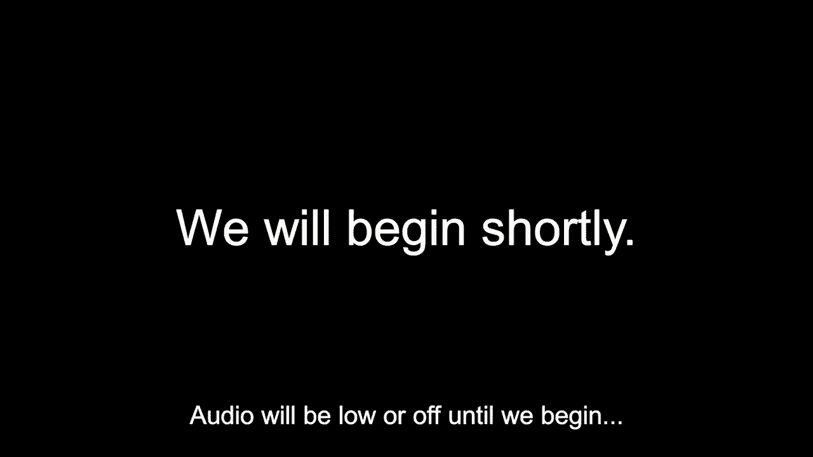

it is cs50。

it is cs50，and this is week four and for the past，several weeks we've had。training wheels of sorts on while using，this language known as c and those。training wheels have been in the form of，the cs50 library and you use this，library of course by。uh selecting and including cs50。h to top，your code and then if you think about。

how clang works you've been linking，that，has been automated for you up until now。using make today we'll transition from，last week's focus on，machines。and on the machines we now use to，implement these algorithms，all the more powerfully as we begin to。take off these training wheels and look，at what's really going on。

underneath the hood of your computer and，as complicated as some aspects of c。have been as new as programming may very，well be to you，realize that there's not all that much。going on underneath the hood that we，need to understand，to now move onward and start solving far。more interesting and more sophisticated，and more fun problems we just need a few，we'll do this first。

by relearning how to count uh here for，instance is what we'll call the，grid before。and we can number recall all of the，bytes in your computer's memory we might。call this byte number 0 1 2 3 4 all the，way up to like byte 15，and so forth but it turns out when。talking about computers memories，uh computers and computer scientists and，decimal。

they don't they definitely don't tend to，they，something called。hexadecimal hexadecimal is a different，base system that instead of using。10 digits or two digits uses 16 instead，and so a computer scientist when，computer memory。would still do 0 1 2 3 4 5 6 7 8 9，but after that instead of going onward，with decimal to say 10。

conventionally，would start using a few letters of the，alphabet and so in hexadecimal。this different base system base 16 you，start counting at zero still。you count up 2 and through 9 but when，then go to，a b c d e，and f and the upside of this is that。within hexadecimal and that hex，implies 16 you have 16 total，individual digits 0 through 9 and also。

now a through f so we don't have to，introduce second digits，just to count up as high as 16。we can。use individual digits 0 through f，and we can keep counting up further by，using multiple hexadecimal。digits but to get there let's introduce，this vocabulary so in binary of course，we use zeros and ones。uh in decimal of course we use zero，clear we're going to use。

16，and it's just a convention that we use a，through f we could have used any other。six symbols but these are what humans，have chosen so hexadecimal works quite。similarly to our familiar decimal system，and it's even familiar to now what you。know as the binary system as follows，let's consider a two-digit value using。

hexadecimal instead of decimal and，instead of binary。

well just like in the world of decimal，we used uh base，10 or in the world of binary we used。base 2 we're just going to use now，base 16 ergo hexadecimal so this is 16。to the first this is 16 to the，first，and of course if we multiply that out。it's just the ones column and now the，16s column，and so if you want to count up in，usual。

then zero one zero two zero three zero，four zero five zero six，*****，things get interesting。now you don't go to one zero because，that would be incorrect，like 16，we want。after the number we know is 9 we now，count up to a，again，but just like in the decimal system when。you count up to like 99 you have to，start carrying the one，same thing here if you want to count。

past f you carry the one，and so now to represent one value，greater than f，it's not 10。in hexadecimal it is 1 0。16 times 1，gives us 16，1 times 0 gives us 0 and of course that，is 16。so we will no longer introduce more and，more base systems but let me stipulate。that just by using these columns that，presumably，can you implement any base system now it。

just so happens that in the world of，computers and today in the world of，memory and soon also files。it's just going to be very conventional，to be able to recognize。and use hexadecimal and in fact there's，a reason humans like hexadecimal or at。

least some humans computer scientists，recall that if we count up as high as。ff in this case we would still do the，same math so，16 times 15 plus 1 times 15，course。240 plus 15 or 255 and i did that pretty，quickly but that's just the sort of，column。by the value that's in it where again，each of these f's，digit，but recall that we've seen 255 before。

back when we talked about binary a few，weeks ago 255 also happen to be，bits。using binary and so the reason that，computer scientists tend to like。hexadecimal is that you know what，in eight bits there's actually two pairs，right。if we sort of scooch these things over，it turns out，represent。

16 possible values it's a perfect system，for representing four bits at a time。after all if you've got four bits here，each of which can be a zero or one，that's two times。two times two times two possible values，for each of those or 16 total values。which is to say that in the world of，computers if you ever want to talk in，units of four bits。

it's wonderfully convenient to use，hexadecimal instead，only because conveniently one。hexadecimal digit，happens to be equivalent to four binary，zero。all the way up through one one one one，the human convention，because of that convenience now some of。before in fact，recall our discussion in week zero of，rgb where we discussed the。

uh representation of colors using some，amount of red green and blue。and at the time we used this example we，took our example out of context。instead of using hi as a string of text，we reinterpreted，72 73 and 33 as a sequence of。colors how much red do you want how much，green do you want how much blue do you。

want and that's fine it's perfectly fine，of decimal，but computer scientists tend not to do。it that way in the context of colors and，in the context of memory，instead they tend to use something。called hexadecimal，and hexadecimal here would actually just，have you change these values from 72。73 33 to the equivalent，hexadecimal representation and we won't，just stipulate，thing，as 484921。

in hexadecimal now obviously if you，glance at these three numbers it's not。at all obvious if you're looking at，hexadecimal digits or，decimal digits because they do use the。same subset zeros through nines，and so a convention two in the computing。world is anytime you represent，hexadecimal digits，with zero，x and there's no mathematical meaning to。

the zero or the x，it's just a prefix you put there to make，clear to the viewer。that these are hexadecimal digits even，if they might otherwise look like。decimal digits so where are we going，with this well those of you who might。have experimented in the past with，making your own web pages and making，them colorful。

or those of you who are artists and have，used programs like photoshop。odds are you've seen these codes before，in fact here are a few screenshots of，photoshop itself。if you click on a color in photoshop and，you pull up this window。you can change the color that you're，drawing on the screen to be any of the。

colors of the rainbow but more arcanely，if you look down here，you can actually see these hexadecimal。codes because it's become human，convention over the years，to use hexadecimal to represent。different amounts of red green and blue，so if you have no red no green no blue。otherwise represented as zero zero 0 0，0 0 well that's going to give you the，color we know here as。

black it's sort of the absence of every，of any wavelengths of light there。if by contrast though you change all of，value，which again is f the range in，hexadecimal is 0。through f otherwise in decimal being 0，through 15，well with ff fff that's like a lot of。red or a lot of green a lot of blue and，light，you get the color we see here as white。

and you can imagine now，combining different amounts of red or，green or blue so for instance。in hexadecimal ff000 is the color we，know as red，green，and finally zero zero zero zero ff is。the color we know as blue because again，the system that，always use。is indeed this system of rgb for red，green and blue so we introduced this。

here not because you have to start，thinking any differently because again，as week zero。but you're going to start seeing numbers，in examples and programs as just。appearing in hexadecimal by convention，as opposed to actually being uh，interpreted as decimal。so if we consider now our computer's，memory we'll now start thinking of this。

whole canvas of memory all of these，bytes inside of our computer's memory。as being numerable uh as enumerable as，like zero one two，all the way through f and then if we。keep counting we can go to one zero，one one one two one three one four one，nine。one a one b one c one d，and so forth and it's fine if it's not。

nearly that obvious as you look at these，things what the decimal equivalents are。that's not a problem it's just a，different way of thinking about，the locations in this case of a。computer's memory or，the representation of one color or，another all right。well let's now use this as an example of，uh an opportunity rather to consider。

what's actually being stored in our，computer's memory and to be clear i'll。start prefixing all of these，memory addresses so to speak with 0x，just to make clear that we're now。ones，so here's a simple line of code out of，context we would need to actually put。this in main or some other，program to actually do anything with it。

but we've seen this before many times，instance，its type，and then perhaps even assign it a value。well what's actually。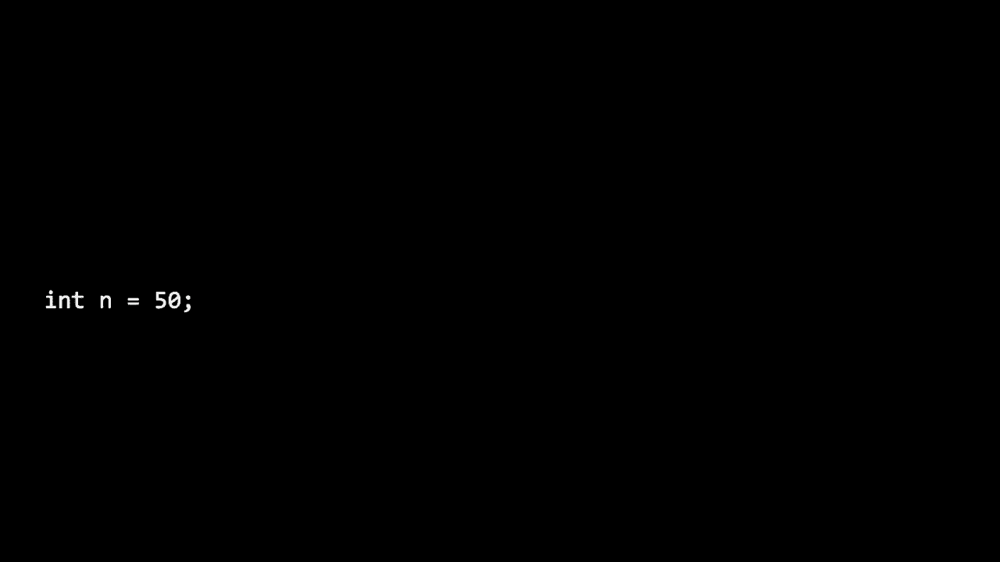

in our computer，well let's go ah**d and whip this thing，up in a actual program let me create a。file called address。c，because i want to start experimenting。

memory，i'm going to go ah**d and include，standardio。h i'm going to give myself。int main void and down here i'm going to，variable，int n equals 50 and then i'm going to go。ahead and print out，value of，n so nothing interesting there nothing。too complicated i'm going to go ah**d，and make address，and then i'm going to go ah**d and do。

week one，we should hopefully see just the number，50。but today we're going to give you。some more tools，with which you can actually start poking，around your computer's memory but let's。first consider this line of code in the，context of your computer's hardware so。if you're writing a program with a line，of code like this that，n needs to be somewhere in your。

put somewhere，in your computer's memory so if we again，consider this to be。just part of our computer's memory a few，variable，deliberately drawn。n as taking up four bytes four squ*res，because recall that an integer。typically at least on cs50 ide and，modern systems，tends to be four bytes so i made sure to。

have it fill，four complete boxes and then value might，be 50 that's actually stored there。well it turns out that within your，computer's memory again，there are these addresses that are。implicitly there so even though yes we，can refer to this variable。n based on the variable name i gave it，in my code，surely this variable exists at a。

specific location in memory i don't know，off hand where it is。but let me just propose that maybe it's，at location 0x12345678。just an arbitrary address i have no idea，in actuality where it is。but it certainly does have an address，because every one of these squ*res，address，forth。

maybe the 50 ended up at memory address，cool about，this，no pun intended so let me go ah**d and。modify this program，and introduce a little bit of new syntax，that'll allow us to start poking around。the inside of your computer's memory so，we can actually see，what's going on underneath so i'm going。do this，instead i'm going to go ah**d and say，value，n which of course is 50。 let me see just。

out of curiosity what，is the actual address of n and to do。

that today we're going to introduce one，new piece of syntax，which happens to be this here there's。two new operators today in c，the first is an ampersand which does not。

represent a logical and，recall a couple of weeks ago we did see，expressions this。and that you use two ampersands it's an，unfortunate coincidence that an，ampersand。solo like this will mean something，different today specifically this。ampersand is going to be our address of，operator by simply prefixing any，variable name。

with an ampersand we can tell c please，tell me what address，this variable is stored in and this star。also has another，meaning in today's context when you use，this asterisk。you can actually tell your program to，look inside，of a particular memory address so the。ampersand tells you what address。

a variable is at the star operator，operator，means go to the following address so。they sort of are reverse operations one，figures out the address，this，my。n in my program here to ampersand n，n，but the address of n and now how do i。print out an address well，it is just a number but actually printf，supports a different。

format code for for addresses you can do，percent p，for reasons we'll soon see that says to。print out the address of this variable，so i'm going to go ah**d and make。address now after only to making，two changes to this file everything。seems to compile okay now i'm going to，go ah**d and run address，program，variable，fd80792f7c。

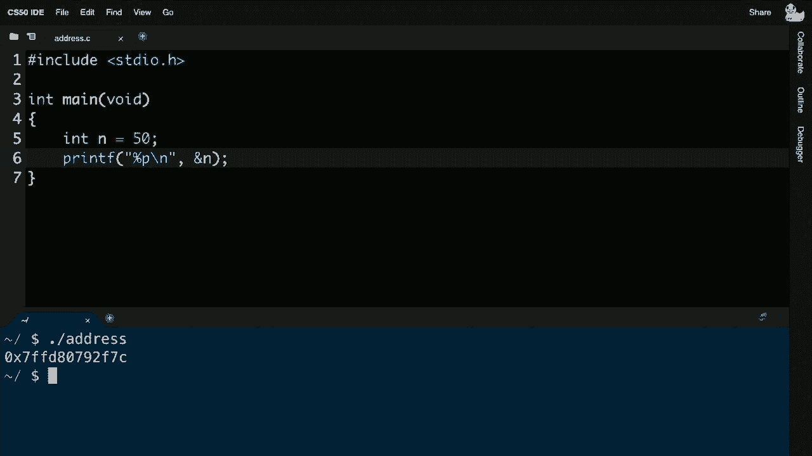

fd80792f7c，now is that useful not in practice，necessarily we're going to。make this become useful by leveraging，these addresses but the specific address，is not interesting。i'm glancing at this number i have no，idea what that number is in decimal i。would have to do the math or frankly，just google a converter and do it for me。

so again that's not the interesting part，the fact that this is an hexadecimal is，to，and again。we want we won't want to do this，necessarily but just to be clear that。one of these operators the ampersand，gets the address and the star operator。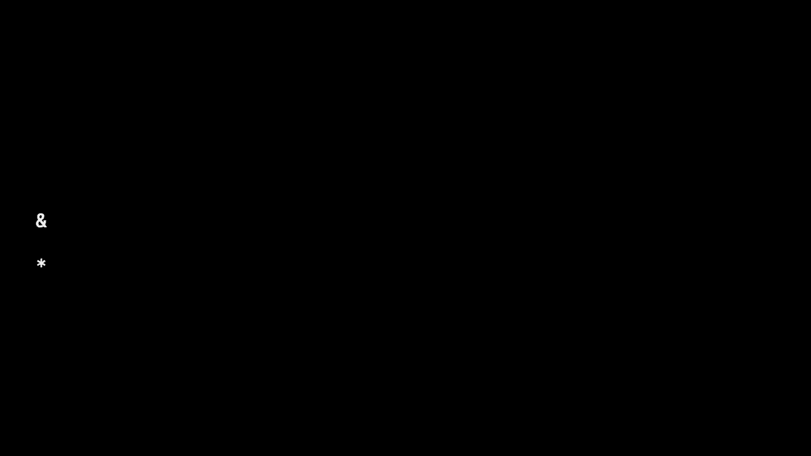

goes to an address，we can actually undo the effects of，these things for instance。if i print out now not ampersand n，but just out of curiosity star ampersand。n i can kind of undo the effects of this，operator ampersand n。is going to say what is the address of n，star ampersand n，is going to say go to that address so。

this is kind of a pointless exercise，because if i just want what's in，began。but again just as an intellectual，exercise if i prefix，n with the address of operator and then。use the asterisk，and say go to that address it's the same，exact thing as just printing n itself so。integer，instead of percent p let me go ah**d and，make address now。

seems to compile okay and run address，and voila we're back at the 50。start to feel。realize that these operators at the end，of the day are relatively，simple in what they do and if you。understand that one just kind of undoes，build up，some pretty interesting programs with。them and we're going to do so by，leveraging a special type of variable。

a variable called a pointer and there's，that p，in percent p a pointer is a variable。that contains the address，of some other value so we've seen，integers before we've seen。floats and chars and strings and other，types as well，pointers now are just a different type。of variable，you can have，pointers to integers pointers to chars。

pointers to bools or any other data type，a pointer references the specific type，of the value。that it actually is referring to so，let's see this more concretely let me go。back now to my program here，and let me introduce another variable，here instead of。immediately printing out something like，n uh，let me go ah**d and introduce a second。

variable that is of type，int star and this i will admit is，probably the most confusing piece of c。syntax that we'll in general see just，because my god star，is now used for multiplication for going。variable，this is arguably not the best design，decision but it was made decades ago so。this is what we have，but if i do n star p equals ampersand，n now what i can do down here。

is print out the address of n by，temporarily storing it，in a variable so i'm not doing anything。new just yet i'm still declaring on line，five an integer called n，on line 6。is that i'm introducing a new type of，variable this type of variable is known。as a pointer a pointer again is just a，variable that stores the address of，weird。

for declaring a pointer to an integer is，literally say，int because that's the type you're。pointing to，star and then the name of the variable，you want to create and i could call this，succinct。and again on the right hand side of the，equal sign is the same operator as，the address of n。it's just ampersand n and so we can，store that address now，somewhere longer term before i just，thing。

now i'm temporarily on line six storing，that address in a new variable。called p and its type is technically，so it would be，incorrect to say int p equals ampersand。n and indeed our compiler clang won't，like that it won't let you compile the，code most likely。and so instead i do instar p to make，clear that i know what i'm doing。

i am storing the address of an int not，and，save this recompile with make address。and notice i changed one line of code，two earlier i went back to percent p。to print a pointer that is an address，and i'm printing out the value of p no，longer the value of n。there's，that cryptic address and these addresses，on what's going on。

inside of your program or other things，on the system these addresses might be，different each time。and that's to be expected and not，something to be relied on but it's。clearly some random cryptic address，similar to my arbitrary ox one two three。four five six seven eight，before but now let's just undo this，operation just so we can come full。

circle here，let me now propose how i can print out，the value of n and let me call on，on line 7。is no longer to print the address of n，but to print n itself using p。i'm going to go ah**d and change，i，and a shorthand notation would obviously，be just print n。but suppose i don't want to print n for，this exercise，how can i now print the value。

in n by referring it referring to it by，way of p，what should i literally type as printf。second argument，to print out the value of n，by using this new variable p in some way。any thoughts here how can i print out，brian any brave volunteers，yeah let's call on joshua。i believe if you use the ampersand，i believe if you use the ampersand，before the p。

you will probably do it okay ampersand p，let me go ah**d and try that let's try，ampersand p。to print out this value so ampersand p，i'm going to save the file，and it doesn't。seem to be the case notice that i'm，getting an error it's a little cryptic。format specifies type int but the，argument has type in，star star more on that another time so，take。

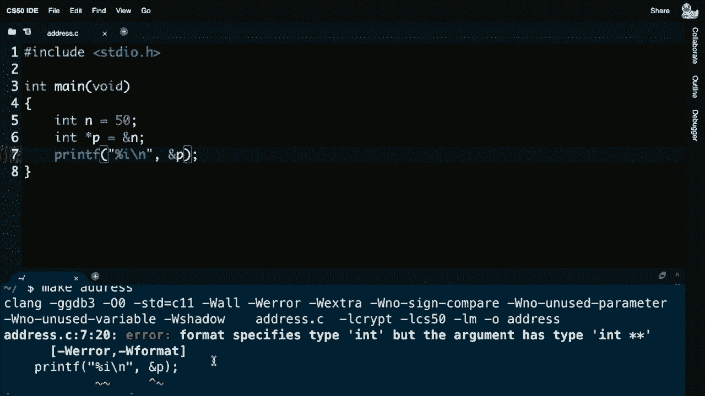

one other suggestion because the，something，but p is already an address so joshua。what you technically proposed was，get me the address of the address and。that's not the direction we want to go，we want to go to what is at that address。yeah so i had a little trouble hearing，yeah so i had a little trouble hearing。

you but i think if we instead use not，the ampersand operator but the star。operator that's going to be indeed the，means，go to the value in p and if the value in。p is an address i think let's try this，make address yep let that compiled okay。this time now if i do dot slash address，hopefully i will now see indeed，the number 50。

 so again we don't seem to，have made any fundamental progress at，the end of the day i'm still just。printing out the value of n，but we've introduced this new primitive。this new puzzle piece if you will，that allows you programmatically to。figure out the address of something in，the computer's memory，and to actually go to that address and。

we'll soon see，it as well，but let's come back to picture a，pictorial representation of this and。consider what it is we just did in the，context now of this code。so inside of my main the two interesting，lines of code really，were these two lines first before we。made sophia's edition and actually，dereferenced p and printed it out with。

printf but let's consider for a moment，what these values now look like in a。computer's memory and again，the syntax is a little cryptic because。we now have a star and an ampersand，but again that just means now we get to，computer's memory。so for instance here's a grid of memory，inside of my computer and maybe。

for instance the 50 and the n end up，down there they could end up anywhere。not even pictured on the screen here，they end up somewhere in the computer's，memory for our purposes。thus far but it technically lives in an，address and let me simplify the address。just so it's quicker to say，this 50 now stored in the variable n。

maybe it actually lives at address ox123，i have no idea where it is but we've。clearly seen that it can live in，what about，p p is technically a variable itself。it's a variable that stores the address，of something else but it's still a。variable which means when you declare p，take up，some bytes of memory on the screen and。

so let me go ah**d and propose，now p，is deliberately drawn to be longer here。i'm consuming eight total bytes this，time because it turns out on modern，computer systems。including cs50 ide pointers，tend to take up eight bytes so not one。not four but eight bytes so i've simply，drawn it to be bigger，so what is actually stored in the。

variable p，well it turns out that again it's just，storing the address。of some value so if the integer n，which itself is storing 50 is at，location ox123。and pointer p is being assigned that，address it's just like saying well，stored in this variable p。is literally just a number represented，here in hexadecimal notation。

ox123 so that's all that's going on，inside the computer's memory with those。two lines of code like there's nothing，fundamentally new except the fact that。we have new syntax with which to refer，to these addresses explicitly。this is n down here this is p up here，and the value of p just happens to be。

an address now i keep saying that，these addresses are a little cryptic。they're a little arbitrary and they are，and honestly it is，rarely if ever going to be enlightening。to know as a human，what address this integer n is actually，at who cares if it's at ox123 or ox456。generally we don't and so computer，memory，tend not to talk at these low level。

details in terms of actual numbers，instead they tend to simplify the，picture sort of abstract away。all of the other memory which frankly is，not relevant to the discussion。thus far and just say you know what i，know that p，is storing an address and that address。happens to be that of 50 down here，but i really don't care in my everyday。

programming life what these specific，addresses are so you know what。let's just abstract it away as an arrow，and again abstraction，is all about simplifying lower level。understand，but you don't necessarily need to keep，thinking about you don't need to keep。think at this level，so we might as well draw a pointer，pictorially，as pointing at some value and。

irrespective of what the actual address，is and so this is very much the case in，conventions。at first glance，such that we may very well be using，these same。mechanisms in our everyday lives so for，instance if you happen to have a mailbox。on the street on your home or，down in the basement of harvard science。

center or when on campus it may very，well look like something like this at，least more residentially。and suppose that this mailbox here is，representing in this case。p in the story it's storing a pointer，that is the address of something else。well if there's a whole bunch of other，mailboxes on the street，well we can put anything we want in。

these mailboxes we can put，postcards letters packages even and just，as in the real world。can we do the same in the virtual i can，store chars or integers。or other things including addresses so，for instance brian，i think you have your own mailbox。somewhere else and brian of course has a，mailbox that itself has a unique address。

so brian for instance what happens to be，the unique address，of the mailbox on your street there yeah。so here's my mailbox it's labeled n and，its address is over here。the address of my mailbox appears to be，ox123，yeah so my mailbox 2 has an address。frankly again i don't really care，about it so i've not even put it on the。

mailbox here but if my mailbox，represents p，a pointer and brian's mailbox represents，n in integer。well it should mean that if i look，inside the contents of my pointer，and i see the value ox123。that is now my clue a breadcrumb of，sorts that can now let me go look inside。of brian's mailbox and brian if you，wouldn't mind doing that for us。

what do you have at that address and if，i look in my mailbox at addressox123 i，have the number 50。inside of this mailbox yeah indeed so in，this case he happens to be storing an，again。we don't typically care about these，specific addresses once you understand。the metaphor really we can do something，mailbox，as storing a value that's like pointing。

at brian's mailbox it's some kind of，indirection drawn there，pictorially as an arrow here is a silly。uh foam finger，or if you prefer a foam，yale finger pointing instead at brian's。mailbox just as a sort of breadcrumb，leading us to some other value。on the screen so when we talk today and，beyond about addresses。

that's all we're talking about we humans，addresses for，eons now to uniquely identify our homes。or businesses or the like，computers do the exact same thing at a，memory。so let me pause here to see if there are，any questions on，pointers variables that store addresses。or on these new operators like the，ampersand or the asterisk。

which now has a new meaning today onward，any questions or confusion about，pointers。now i'll slowly tiptoe back over here，now i'll slowly tiptoe back over here。nothing yet all right seeing none well，let's consider now this same story in，data type，ins。but consider strings we've been spent a，lot of time on strings using。

uh encryption with them and solving uh，implementing electoral algorithms using。user's input so let's consider a，fundamentally different data type that。stores not individual integers，but strings of text instead so for，string。you might have a line of code that looks，like this string s，equals quote unquote high in all caps。

with an exclamation point so that may，seen thus far，what's actually going on inside of the，that。computer，it ends up somewhere in your computer's，last week，a backslash zero or two weeks ago a。backslash zero，end，of that string but let's look a little，more carefully at what is going on。underneath this hood here，technically speaking i could address。

those individual characters we have seen，as of week two，by using bracket notation like s bracket。zero s bracket one，s bracket two and s bracket three we use，the squ*re bracket notation to treat。a string as though it's an array of，is，but it turns out strings can also be，manipulated。by way of their addresses as well and so，for instance，maybe this same exact string hi is。

stored at memory address ox123，and then ox124 ox125 and ox126 notice，that they're deliberately。uh contiguous addresses back to back to，back and they're only one byte apart。because each of these chars of course is，just one byte，in c so those numbers are not important。specifically but the fact that they're，one byte apart from each other。

is important because that's the，definition of a string and indeed an，back。now what exactly though is s s was the，name of the variable i gave him i'm，s。equals quantum quote hi well what is s s，is a variable，that has to go somewhere in the。computer's memory and suppose that，s is indeed high x，happens to live，can think of s，string。

but at a lower level is just the an，address of a string，more specifically let's start thinking。about a string，as technically being just the address of。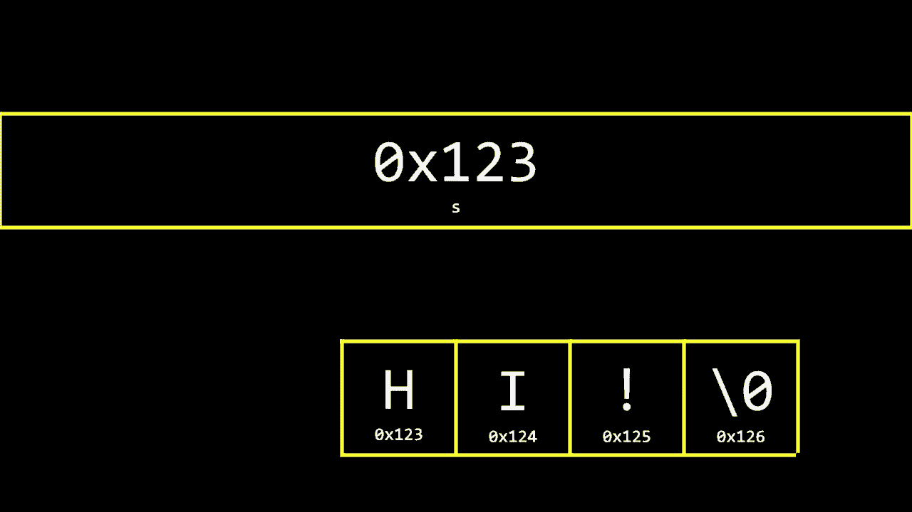

the first character in the string，now that you might get that might give，first character。how are you going to remember that wait，a minute this string isn't at and。only at ox123 it also continues at ox124，ox125，and so forth but let me pause and ask，the group here。a computer and，us programmers to just think of terms，think of strings in terms of being。

the address of the very first byte like，why is it sufficient no matter how long。the string is even if it's all paragraph，of text why is it very cleverly，sufficient。to think of a string like s as just，being identical to the address。of the first uh bytes uh ginny is it，yes yes am i audible yes we can hear you。

okay uh possibly because it happens that，strings whenever we are defining any。string that is all together，it will be g，i n and i all together so it will be。sufficient if something is pointed，towards just first character of my name。so that i can just follow up for the，first character and then get all the。

uh characters afterwards perfect so all，of these basic definitions we had over，together。if a string is just an array of，characters and by definition of an array，back。and per two weeks ago every string，ends with this conventional backslash，zero or null character。all you need to do when thinking about a，string begin，because you can use a for loop or a。

while loop or some other heuristic with，a condition and a boolean expression。to figure out where the string ends，length，so that is to say let's start for the。moment thinking about strings as being，quite simply that，in the string。and if we then take that as fact let's，go ah**d now and start playing with a。

program that doesn't use，integers but instead use strings using。this basic primitive so let me go ah**d，and delete the code i'd written before，in address。c。let me just change it up to be string，equals quote unquote high。semicolon and notice i'm not manually，typing any backslash zeros。

c does that for us automatically when，you close the quote，the compiler takes care of adding that。backslash zero for you，now i'm going to go ah**d on the next，s backslash。n comma s if i want to print out that，string now this program is not at all，wrote something like。okay yes it is interesting because i，screwed up so five errors i've。

written seven lines of code and five，errors and let's see what's going on。as always always go to the top because，odds are there's just some confusing，cascading effect。the very first error i see is use of，undeclared identifier，string did i mean standard n i didn't。mean standard n，string string string so i could run help，50 as my friend here。

but i honestly i make this mistake often，enough that i kind of know now that i，forgot to include。cs50。h and indeed if i now，do this and recompile make address okay。all five errors are gone just by that，one simple change and if i run address。now it's just gonna quite simply say hi，but let's now start to consider what's。

going on underneath the hood of this，program suppose i am，curious and want to print out what is。actually，the address at which this string lives，well it turns out。let me be clever here let me print out，not a format code of percent s。but percent p show me this same string，as an address let me go ah**d and，recompile make address。

seems to compile okay let me run dot，printing s，though it's，a pointer and interesting it's not the。same as before but again that's，reasonable because the memory addresses。aren't going to always be the same but，it doesn't matter what it is。but that's kind of interesting all this，time anytime you've been using strings。

had you just changed your percent s to a，memory，that string actually starts it's not。functionally useful to us just yet，but it's been there this whole time and。let me go ah**d and do the following now，suppose i get a little curious。further and i do printf let me go ah**d，and print out another address。

followed by a new line and let me go，ahead and print out，the address of the first character so。again this is a little weird to do and，we wouldn't typically do this that often，these operators。give us very simple answers to questions，like what is the address of this thing，represented。zero index means，s bracket zero is the first s bracket，one is the second if i play around with。

today's new operator this ampersand，second，character and in fact let me go ah**d。and be more explicit，bracket zero，and put an ampersand here and let me go。ahead now and make this program make，address，okay a little funky oh i just missed a。semicolon so easy fix there，let me go ah**d and recompile with make。

address let me go ah**d and run dot，slash address，and interesting uh well maybe。interesting to me so you see now two，addresses the first of which is ox4006。a four which apparently is the address，of the first character in s。but notice what's curious about the next，one it's almost the same。

except the byte is one further away，and i bet if i do this not just for the。h and the i but also the exclamation，point let me do one more line of almost，identical code。just to make the point that all this，time it's indeed been the case。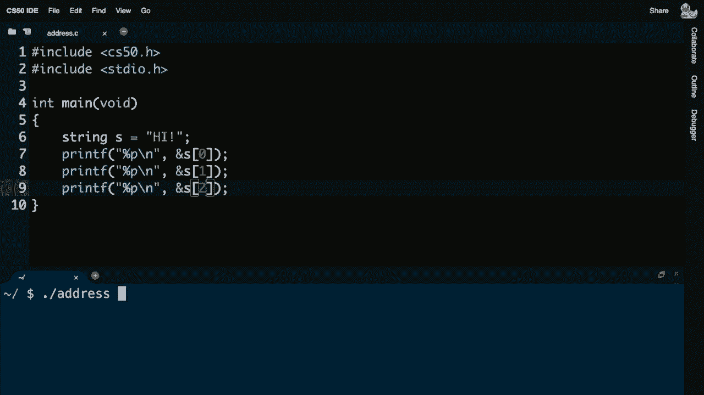

that all characters in a string are back，to back to back and you can now see it，in code。b4 b5 b6 are just one，byte apart so we see some visual，confirmation now that strings are indeed。laid out in memory just like this，now again this is not a very useful。programmatic exercise to like look at，the address of individual characters but。

again this is just to emphasize that，underneath the hood，some relatively simple operations are。being enabled，by way of this new ampersand and in turn，star operator。so let's consider for a moment what this，memory，at a low level yes s is technically an。address and yes it's technically the，address of the first byte，which in the actual computer looked。

different but in my slide here i just，arbitrarily proposed that it's at，ox123 ox124 ox125。but again let's not care about that，level of detail，let's just kind of wave our hands and。abstract away these addresses and just，now start thinking of，s that is a string as。technically just being，a pointer a pointer so it turns out that。

even though it's very useful and very，common to think of strings as obviously。just being sequences of characters and，that's been true since week one。and you can also think of them as arrays，back-to-back sequences of characters。you can also it turns out starting today，think of them，as just being pointers that is the。

address of a character，somewhere in the computer's memory and，as guinea notes。because all of the characters in a，string are by definition，back to back to back and because by。definition all strings end with，a backslash zero that is literally the。smallest and only amount of information，know where，all of your strings are just remember。

the address of the very first character，to the end，by remembering that this backslash zero。is really just，eight zero bits otherwise represented as，backslash zero。and so we could certainly have an if，condition much like we did two weeks ago，strings，that。and so when i say we're taking off some，training wheels，here they go so with up until now we've。

been using again the cs50 library which，gives us conveniently functions like，forth。but all this time the cs50 library，specifically the file cs50。h，had a little bit of a pedagogical。simplification in it，recall last week that you can define，your own custom data types。well it turns out that all this time，we've been claiming that strings exist。

and there's something you can use in，your programs and strings do。exist in c they do exist in python in，javascript and java and c。plus and many many many other languages，this is not a cs50 term。but string technically does not exist as，a data type，in c it instead is more cryptically。

and more low level known as char，star char star now what does that mean。well char star much like our int star，a few minutes ago just represents the，address of a character。of an ant，and if again you kind of agree with me，now that you can think of strings。as sequences of characters or more，specifically arrays of characters or。

more specifically as of today，the address of just the first character。then it's indeed the case that we now，can apply this new terminology today of，pointer。to our old familiar friends strings，you will，for char star and it's in the cs50，of code。that simplifies or abstracts away char，star which honestly no one wants to。

think about or struggle with in the，first week of a class，let alone the first two or three weeks。of a class it's a，simplification a custom data type，that we name string just so you don't。have to think about what is this star，address of，but today we can remove those training。wheels and reveal that all this time，you've just been manipulating characters。

at specific addresses and we've used，this kind of technique before。abstracting away these lower level，details for instance recall。last week that we introduced this notion，of a struct，a data type that you can customize to be，book。by wrapping together a name and a number，inside of a custom data type，encapsulating them if you will。

inside of something we called person and，every person we claimed had a。a structure that contains a name and a，number and by way of this。feature of c typedef we can define a new，type and the name of that type。last week was just person so we're using，already and we have been sort of，our。

of c in the class a line of code that，actually looks like this。and this is indeed one of the lines of，code inside of cs50。h。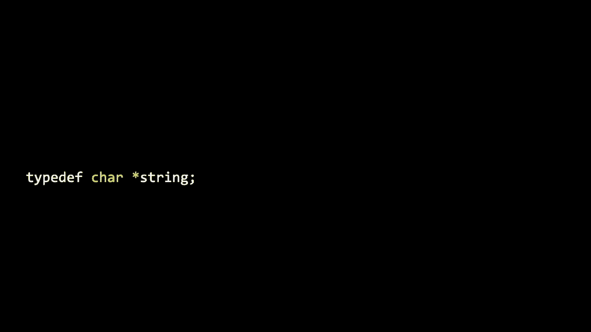

it says type def which means give me a，custom type and it creates a synonym。for char star called string，and it's just a way where we can hide，the funky。char star we can hide the asterisk in，particular which would not be fun to。play with in the first few days，but without changing the definition of。

what a string is so strings exist in，in c，makes it，exist by way of that kind of definition。all right let me pause here to see if，strings，are or these new ways of thinking about，them。any questions about strings or char，i know it's a lot it's kind of low level，any hands here，what。okay all right well if no questions here，okay all right well if no questions here。

why don't we go ah**d and take our five，minute break here first，and we'll be back in five and take。another look at what we can now do with，all right we're back and we have now。all right we're back and we have now，this ability and code to get the address。of some variable and also to go to an，respectively，we've thought about strings as being not。

only contiguous，uh sequences of characters but also，now，actual addresses the first the address。of the first character，and then from there can we find our way，programmatically to the end thanks to。that null character，but it turns out there's one other thing，we can do with these addresses or with。pointers more generally and that's known，as pointer arithmetic so anything that's，*****。

and the math is not going to be，complicated but it is going to be。powerful for us here so i'm going to go，back to my most recent state of，address。c。and let me go ah**d now and reiterate，that we can print out the individual。characters in a string just like we did，back in week two as by using our squ*re。

bracket notation so i'm getting rid of，all evidence of those addresses for now。i'm recompiling this program as make，address and then i'm going to run dot，slash address now。and i see h i exclamation point one，character per line，but now consider that there doesn't need。to be a string data type in fact we can，take this training wheel off。

and while it might feel a little，uncomfortable at first if i delete this。first line altogether as i've，accidentally omitted anyway sometimes。i don't need to keep calling things，verbally，i can think of them as strings because。string is a thing，in many different programming languages，but by default in c it just doesn't。

exist as a type，named char，star but again all that means is that，something。char means it's the address of a char so，char star，going to，point to a character so now if s is that。i can actually treat it the same there's，no reason i can't keep。using s like a string was back in week，two using our squ*re bracket notation。

and i can keep printing out hi，exclamation point，but there's one。other way i can do this if i now know，that s is really just an address。i can get rid of this squ*re bracket，notation and i can actually just do。star s because recall that star，in addition to being the new symbol that。

we use when declaring a pointer up here，admittedly，that we use to go to an address so if s。is storing an address which it is by，definition of being a pointer，my picture。earlier it would seem to be the case。

that s is most likely at an address，beginning at like ox123 it's not going。

to be the same in my actual ide here，it'll be whatever the computer has，exact。idea so let me go ah**d and go to star，s and just for kicks let me leave it as，just that one line。so let me go ah**d and rerun this as，make address，all right and now dot slash address i。should see hopefully a capital，that s，a string is technically just an address。

i can actually now do math on it and i，can go ah**d and print out another。character followed by a new line，and i can go to not s but how about。s plus one so i can do some very simple，arithmetic if you will on that pointer。and let me go ah**d and now recompile，this so uh，address and i should see。

h i and if i do one more line of code，like this printf，percent c backslash n star s。plus two i can now go to，the character that is two bytes away，from whatever s is which again is the。reprinted，high with the exclamation point，this fancy。

squ*re bracket notation fancy only in，the sense that it was，will。i'm instead manipulating s for what it，really is which is just an address and，before。that squ*re bracket notation that we，just，anything，fundamentally different from these，asterisks。and these addresses it's just doing it，honestly in a much more user-friendly。

way i still prefer personally，the squ*re bracket notation from week，two but it's the same thing。yourself，so c is just providing us with this，handy feature of using squ*re brackets。that does all of this so-called，pointer arithmetic for you but again。we're going to this low level just to，emphasize what it is，that's going on ultimately underneath。

the hood here，all right let me pause here for any，to，verbalize any on your end。i see a question that came in about what，would happen if you tried to print star。s plus three good question what if i try，to print star s plus three。i know intuitively i think that that，will end up being the new line，sorry the null character which。

terminates the string but let's see if。

we can confirm that let me go ah**d and，print out star as，i know about rewind so i i'm pretty sure。that's going to print out the null，as much here，percent c backslash n star，a little。adventurous here by looking at things i，maybe shouldn't be looking at because。that's a low level implementation detail，but let's see what happens。

it compiles okay dot slash address and，it seems to be blank，now maybe that's the null character。honestly it's not meant to be a，printable character it's this special。uh sentinel value that indicates the end，of the string but i could do this。i know from week two that chars are，integers and integers are chars if i。

want to think of them that way，so let me change only the very last，i，and run。address and voila h i exclamation point，zero and there is the all zero bits，digit。thanks to percent i now i can get really，crazy here，and why don't we go ah**d and print out。not just what characters，are right after this sequence h，i exclamation point null character why。

don't we go to，away，and really get nosy inside of my，address，okay nothing really going on over there。how about 10，000 bytes away let me go ah**d and make，address let me go ah**d and run this。and you might，be among the fortunate few who have seen，this error before。by touching memory you shouldn't and，we're going to deliberately consider。

this today but a segmentation fault，something wrong，somewhere in your code and it tends to，memory。that you shouldn't have and i have no，business honestly looking。10 000 bytes away from the memory that i，know belongs to this string that's like。arbitrarily looking anywhere in your，computer's memory，which probably it seems is not a good。

idea but more on that，in just a bit so let's consider now some，of the implementations。of these underlying implementation，details and consider now from last week。why we did a few things the way we did，in the past few weeks in fact。so string is just a char star and let's，now consider an example let me zoom out。

on my memory just so i can cram more，in at once let's consider an example。where i might want to write a program，that compares two strings let me go。ahead and write some new code here in a，new file this time，called for instance compare。c my goal。with this program quite simply is going，to be to print out，the contents of or rather to compare。

two strings that the user might input，i'm going to go ah**d and include cs50。h。not because i want string per se anymore，but because i want to use getstring just。for convenience but we'll take that，training wheel off in a bit too。and in this program i'm going to go，ahead and first use not guest string yet。

let me go ah**d and keep it simple，and start with get int and i'll ask the，user for a variable i。and let me do another one of these and，get int and ask the user for a value for，simply say if i，out。same else let me go ah**d and print out，different so this is kind of week one。stuff where i'm using a couple of，branches，and i'm using printout to print printf。

to print out whether those two variables，i and j are the same，as well。run compare and let me give it digits，one and two and，indeed they're different and let me go。ahead and give it one and one and，they're the same so i think logically。uh proof by example if you will this，program looks correct，but let me quickly make it seemingly。

uncorrect by not using，instead，let me go ah**d and give myself a string，wheel anymore。let's just do char star s equals，get string of s but again even though，i'm calling it char star it's。still a string like it was weeks ago let，me give myself another string called t，get。uh t will get that value there and let，me just very s，naively but kind of reasonably say if s。

equals equals t，let's go ah**d and print out same and，otherwise let's go ah**d and print out。different so same exact code just，different data types and using get，string instead of get int。let me go ah**d and make compare seems，to compile okay，dot slash compare let me go ah**d and，type in。uh hi whoops，hi let me go ah**d and type in hi again，and voila。

different huh and i forgot my backslash，my problems，let me recompile this make compare and。now let me run it again，how about with let's let's do a quick，test david brian these are definitely。to work，how about david david also different，huh let me try again brian brian。also different but i'm pretty sure those，strings are the same。

why might this program be flawed what is，wrong，what's wrong here any thoughts either on。what's wrong here any thoughts either on，camera or brian if you'd like to。verbalize some thoughts from the chat，any thoughts on why david and david are，high and high。are different a couple people in the，chat are saying that we're not actually。

comparing the characters we're comparing，the addresses，yeah so that's sort of the logical。conclusion from today's definition of，what a string really is if a string is。just the address of its first character，then if you're literally doing s equals，addresses。and they are probably going to be，different even if i type in the same。

thing because every time we've called，get into or get string，it's kind of plopped the user is in。user's input somewhere in my computer's，memory but we now have the tools。honestly to answer this or vet this，this answer ourselves let me go ah**d，and simplify this program。and let's just as a quick sanity check，print out s and let's go ah**d and print，out t。

uh using a new line after each just so，we can see what the strings are so let。me go ah**d and do this again，make compare okay compiles okay dot，slash compare let me type in hi。hi and they seem to be visually the same，but recall that now i have this other，format code。such that i can now start treating，strings as the addresses they，technically are。

so let me change percent s to percent p，in both places，let me then recompile the program and。now rerun compare with both high，and high identically typed but notice。

they've ended up at slightly different，memory locations even though i have。coincidentally typed the same thing，c and my computer are not going to be so，presumptuous。as to use the same bytes for both，strings that's not going to give me much，the other。it's going to very simplistically put，one in this chunk of memory and the。

other in this chunk of memory，and indeed those addresses are，respectively but arbitrarily。ox22 fe 670 and，ox22 fe 6b，oh so they are spread apart some，computer to decide。where to actually put those so what's，actually going on inside of the。computer's memory well let's consider，if for instance this is s my pointer or。

really my string but it's just a pointer，now it's the address of something。notice that i've drawn it as taking up，eight squ*res because again a pointer in。on modern systems is eight bytes so，that's why this thing is so big。meanwhile when i type in something like，high with the exclamation point。

then it ends up somewhere in memory we，let's just arbitrarily，say it happens to end up there in my。computer's memory now each of those，bytes of course has an address。i don't necessarily know or care what，they are but for explanation sake let's。just number them again like before，ox123 ox124 ox125，ox126 when i then assign。

s on the left the value from getstring，on the right，getstring what is it going to do well。you've been using it，it is yes getting a string and handing，it back to you as a return value。but what does that really mean well if a，string is just an address。the return value of a function like，getstring，is to return to not the string per se，concept。

what getstring has always been doing for，us is returning the address of the。string or more specifically，the address of the first character in，stored in。s to be clear is that address ox123，it's not returning to the whole string。the h the i the exclamation point rather，it's returning just one value to you。

it's returning only to you the address，of the first character，of that string but again this is all。very，uh good for just s what's going on with，t t is kind of the same story because。i'm calling get string again，t is going to get assigned the address。of the first character of this version，of high and let's just arbitrarily say，it's at ox456。

ox457 ox4 5 8，and ox 459，and at this point t is going to take on，the value ox456。and now at this point honestly we're，really getting into the weeds let's just。start abstracting all of this away and，indeed，when we stop，caring about the particular addresses so。s is really just a pointer，a variable pointing at the first，character of high here t。

is just a variable pointing at the first。

character of hi，strings，as i was before in the earlier version，of my program。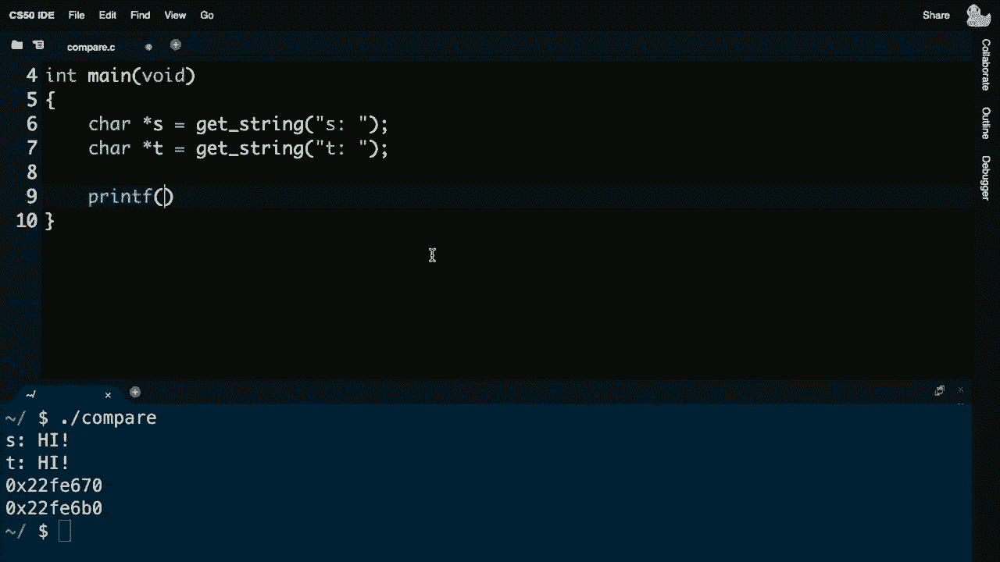

t。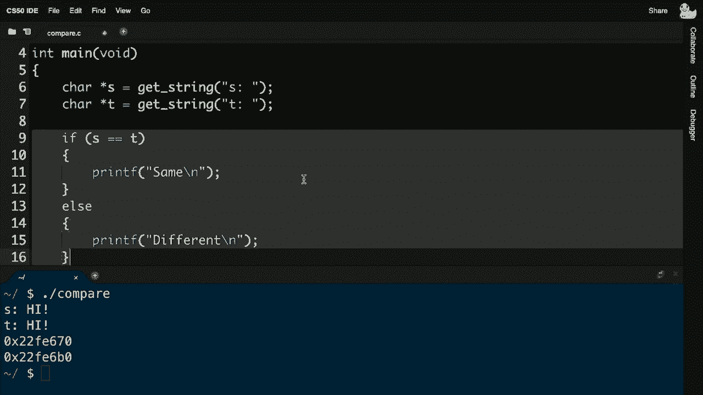

i was co i was indeed comparing，s and t but what are s and t s，and t respectively are。ox123 and ox456 or whatever the actual，values happen to be，which are not going to be the same。because they happen to point，to different chunks of memory all right。

let me pause here，and brian see if there's any questions，or confusion。any questions or confusion no all right，well，who cares right like this is all kind of，cares。well how do we solve this problem let's，consider what i actually did，in a previous demo i sort of。function，string compare that allows you to，compare two strings and i promise that。

we would eventually explain why we use，stir compare，as opposed to just using the equal equal。sign well to use this function i am，going to need to add in，string dot h up here per lat time。but if string compare st let me go ah**d，and recompile this compare。dot slash compare now let me type high，and high identically，now they still seem to be different and。

damn it i made the same stupid mistake，as i did last time，does anyone know what uh mistake i made。when comparing two strings somehow i，mistake，ibrahim is suggesting that you add an，quite right。is to return，zero if they're the same a negative，other，and a positive number if one comes after。the other as in ascabetical order，so what i should have done both last，time and this time。

is check for equality with zero let me，go ah**d and recompile this program。okay good now let me re-run this program，with hi twice，voila they're the same and just to make。sure let me do one other check，let me do david and brian which should，be indeed different。so now again i haven't really done，but i'm now，thinking about these strings as being。

fundamentally just their addresses and，so now let's make this，actually germaine let me go ah**d and。create a new file altogether and let's，pretty reasonably try to copy。one string and make changes to it so i'm，going to go ah**d here and just for。convenience i'm going to still use the，cs50 library not for the string data。

type but just for the getstring function，which we'll see is more handy than other，things。than other ways of doing things and i'm，going to go ah**d and include，standardio。h and i'm going to go ah**d，and include，how about string。h，let me go ah**d and do in main void and。let me go ah**d in this program and get，myself a string but no we won't call it，star。

so again start taking off that training，a string，called s and then i'm going to get。another string but i won't call it that，i'll call it char star。t and i want to copy s and so you might，think based on week one week two and，variable。just do it i mean we've used the，assignment operator to copy，a variable from right to left for。

integers for chars and for other data，types perhaps too，i'm going to go ah**d now and make a。change to the original string，so let me go ah**d and do this let me go，ahead and say。let's change the first character of t，to be upper case recall that there's，this function two upper。which takes as input a character like，the first character in t。

and returns the uppercase version now to，use two upper i need another。header file which i recall from a couple，weeks ago now i need ctype。h。so let me preemptively go back and put，that there and now let me go ah**d and。print these two strings，let me go ah**d and print out s as being，this percent s，value of。

t with percent s as follows，so again what i'm doing is i'm getting a。string from the user and the only new，thing here is char star today because。which is synonymous with string on line，10 here i'm copying，the string from right to left and then。i'm capitalizing only the first letter，in the copy otherwise known as t and。

then i'm just printing both out，so let me go ah**d and make copy okay，compile is okay，and type in h。enter，and voila it would seem that i somehow，capitalize both s and t。even though i only called to upper，on t brian，any thoughts from the group on why。i've accidentally and erroneous，erroneously，a couple people are saying that t is。

a couple people are saying that t is，just an alias of，s just an alias of s that's a reasonable。way of thinking of it sure and more，precisely any other thoughts，on why this is incorrect somehow。peter is now suggesting that they have，the same address，is copy s。into t but again what is s as of today，it's just an address，so yes i have copied s but i've copied。

address，ox123 or whatever it is and then on line，12 notice that i'm changing t by，uppercasing it。but t is at the same address of s so，really i'm，changing one and the same string so if。we think about this in terms of the，computer's memory，let's consider what i've just done let，put s。down as before let me put high down as，before but all lower case this time。

and recall that it might be at addresses，ox123 one two four one two five and one，two six。and now if we consider that s，technically contains，the address of that first character，variable t。and assign t the value of s i got to，take that statement literally。i'm literally just putting ox123 here，and if we now abstract away these。

details just to make it more clear，visually what's going on，that's pretty much like saying that both。s and t，yes in that sense t，is just an alias for s which is a，really just t。is identical to s so when you use the，squ*re bracket notation to go to the，first character of t。character，in s they are one in the same so when i，call to upper。

i'm calling it on this character which，of course is the one and only。h in the story and when i print s and i，print t，printf is following those same。breadcrumbs if you will，and ultimately displaying the same value。as having changed so we would seem to，need to fundamentally，rethink how we are copying strings and。

let me ask，what is if this is the wrong way to copy，one string into the other。what is the right way even if you don't，have the the functions in mind or the，right vocabulary。just intuitively if we want to copy a，string in the way that a human would，think of copying one。into the other like a photo a photograph，or a photocopy，how do we want to do this any thoughts，brian。

yeah sophia suggested we would want to，somehow loop over the elements in。s and put them into t yeah i like that，so loop over the elements of。s and put them into t so it sounds like，more work，but that's again what we're going to。have to do if we want to think of these，if we want to accept the fact that these。

things s and t are just addresses we're，going to now have to go and follow。those breadcrumbs so let's go ah**d and，consider a variant of this program let，me go ah**d here。and change this such that i'm still，getting，such that i'm still getting a string s。but now let me go ah**d and and propose，exactly that that we copy the individual。

characters but i need to copy them，somewhere so i feel like another step in。this process of copying a spring，has to be to give myself some additional，memory if i have h。i exclamation point and null character i，need to now somehow take control of the，in code，that i have。characters，so here's a new function today if i want，to create a string t。

otherwise known today as a char star，there is a new function we can use，allocation。this is a pretty fancy function that，fortunately is pretty simple to use。it takes as input just a number how many，bytes of memory do you want to ask the，computer for so。how do i do this well h i exclamation，point backslash 0。 i could literally，just say 4。

but this doesn't feel very dynamic i，think i can programmatically。implement this a little more elegantly，let me go ah**d and say，there are，characters in s plus one。plus one why am i doing this well h i，exclamation point，null character that's technically what's。stored underneath the hood but what do，you and i think of the length of high。

as being well odds are in the human，world it's h i exclamation point and who。cares about this low level detail this，null terminator you don't include that，word。you only think of the actual characters，you can see so the length of high。is h i exclamation point three but i do，need to cleverly add one more byte，character。

because i'm gonna have to copy that over，as well otherwise if i don't have an。identical null character，t is not going to have an obvious ending。so how do i copy now one string into the，other well let me go ah**d and take out，one，actually。n equals string length of s we've done，this trick before，i is less than n，simply say。

t bracket i gets s bracket i，so this will literally copy from s，into t。but i need to be a little smarter now，than n，i'm actually going to very aggressively。say i less than or equal to，n why why am i going，one step further than i feel we normally。do when iterating over strings and one，iterating，over a caesar cipher or enough string in。

that context，brian any thoughts here why am i going，from i less than or equal to n kind of。for the first time here，selena is suggesting that we need to，include the null character。yeah so if i and now i'm now i，understand how strings work so it's not。sufficient to just copy the hi，exclamation point i need to go one step。

further one more than the length of the，would be，less than or equal to n or i could just。do a plus one there or i can do this any，it，but i think a less than or equal to is。one reasonable way to do it，and now let's go down to the bottom here。and now actually do this capitalization，let's now change，the first character in t to be the。

result of calling to，upper on the first character of t，print out whatever，print out。whatever t is and hope now that，only t has been capitalized but i do，need to make one change now。it turns out that this function malloc，comes in a file called standard，lib。h and again this is the kind of，can always google these，kinds of things even i forget what lot。

what header files these functions are，sometimes declared in，but it happens to be a new one called。standard lib for library that gives you，access to malloc，so let me go ah**d now and make compare。all right so far so good dot slash，compare or sorry this is not compare，my god，oh i。looks like i forgot the ver the type of，i and n，so let me go into my for loop and add。

the int that was my fault，let me make copy again okay all seven，errors thankfully went away。make copy let's go ah**d and type in，high in lowercase。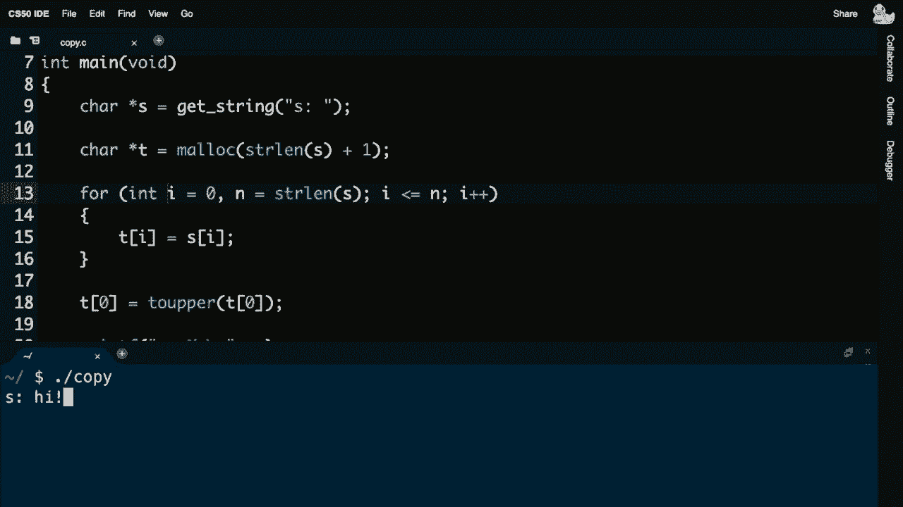

capitalized。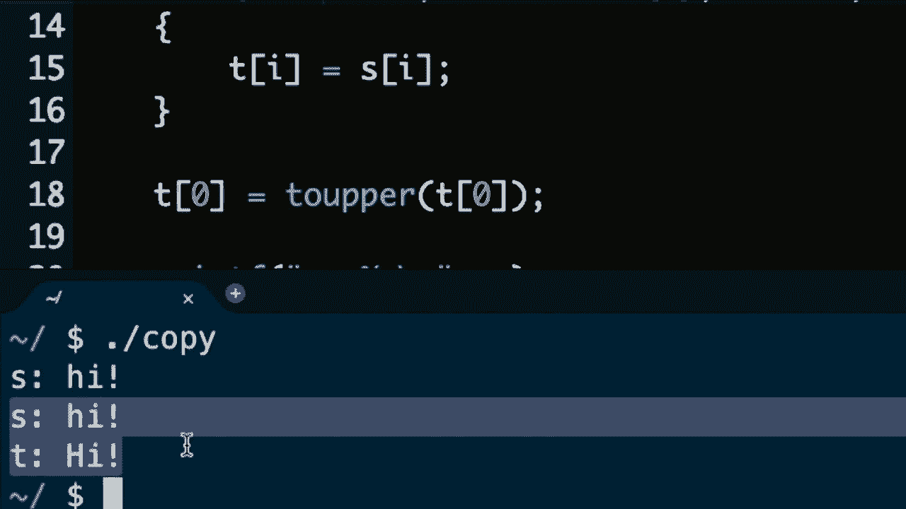

only the copy of s-a-k-a-t，and just to be clear i've kind of，regressed back to my squ*re bracket。acceptable，it's very readable but notice if i，really want to show off。plus i location and then do this which，plus i location and then do this which，readability。but again there is this equivalence the，squ*re bracket notation is the same。

thing as pointer arithmetic so if you，want to go to，the address at t plus whatever i is to。offset yourself one or more bytes，you can totally do that and if i want to。be fancy i can go down here，and say go to the first character in t。and capitalize it but again i would，argue that even though yes you're very。

clever and that you understand pointers，and addresses at this point if you're，writing code like this。honestly it's not necessarily as，readable so sticking with week 2 syntax。of the squ*re bracket notation totally，reasonable totally correct totally well，designed。and perhaps preferable though i should，be careful here，this line of code is a little bit risky。

for me because what if the user just，hits enter and they don't type hi。or david or brian what if they type，nothing except enter，in that case the length of the string。might be zero and then i probably，shouldn't capitalizing the first，character in a string that。probably，have some error checking like if，for instance the string length of t is，at least，do that。

but again this is just one example of，to the program，there's actually one more piece of error。checking i should really do in a fully，correct program as you should do in，problem sets。sometimes things can go wrong and if，your program is so big so fancy and so。memory hungry that you're，mallocking lots and lots of memory which。

you won't do in the program this small，but over time you might need more and。more memory we should also make sure，that t actually has a valid address，time。is going to return to you the address of，you，just like getstring it will return to。the address of the first，byte of the chunk of memory that it has，found space for。

however sometimes things can go wrong，sometimes your computer can be out of。memory you've probably seen your mac or，pc freeze or hang or，reboot itself that is very often the。result of memory errors，so we should actually check something，like this if t equals equals this。special value，null then i'm going to go ah**d and just，bail out and return one。

quit just let's get out of the program，it's not going to work，this might only happen one out of a。million times but it's more correct，to check for null now unfortunately the。designers of c kind of used or，programmers more generally use this，n-u-l。otherwise known as backslash zero，unfortunately this is a different value。

n-u-l-l represents the a null，pointer it is a bogus address it is the，address。zero it is different from backslash zero，you use null in the context of pointers，zero。otherwise known verbally as nul or null，in the context of characters so。backslash zero is for characters，and ull in all caps is for pointers and，it's just a new symbol。

we're introducing today that comes with，this standard lib，dot h file all right so it turns out。honestly i don't need to do some of this，work it turns out，that if i want to copy one string to。another there is a function，for that and increasingly you will not。have to write as many lines of code as，you previously did，because if you look up in the manual。

pages or you've heard about，or find online that there's another，function like one called stir copy。you can actually more simply do，something like this so even though i。really liked the idea and it was correct，to use like a for loop，to copy all of the characters from s。into t，there's a function for that it's called，stir copy it takes two。

arguments the destination followed by，the source and it will just。handle all of the looping for us all of，the copying for us including the，backslash zero。so that i can focus on what i want to do，which in this case，is actually capitalize things so if we。consider now this example，in the context of my computer's memory。

we'll see that it's laid out a little，differently but there's one more bug i，do want to fix first。and this is something we've not had to，do yet it turns out，malloc。you ask the computer for memory the onus，is on you the programmer to eventually，give it back。and by that i mean if you allocate four。

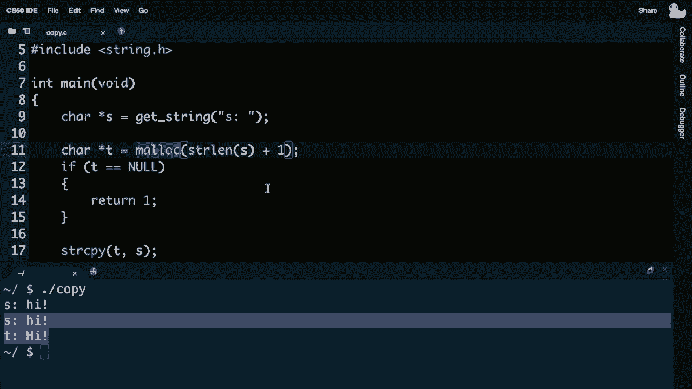

bytes or who knows four million bytes of，memory for an even bigger program。you'd better give it back to the，computer more specifically the operating。system be it linux or mac os or windows，so that your computer eventually doesn't，ask for more memory。ask for more memory it stands to reason，that eventually your computer will run。

out because it only has a finite amount。