# 【双语字幕+资料下载】哈佛CS50-CS ｜ 计算机科学导论(2020·完整版) - P9：L4- IO、存储与内存管理 2 - ShowMeAI - BV1Hh411W7Up

hardware，recall so when you're done with memory，it should be your best practice。to free it afterward as well，and the opposite of malloc is just a，function called free。which takes as its input whatever the，output of malloc was and recall that the，malloc。is just the address of the first byte of，memory that it is allocated for you so。

if it you ask it for four bytes like i，did a few lines ago with malloc。you're going to get back the address of，the first of those bytes。and it's up to you to remember how many，bytes you asked for，in the case of free all you have to do。is tell free，malloc，gave you so if you stored that address，as i did in this variable called t。

it suffices when you're done with that，memory just called free。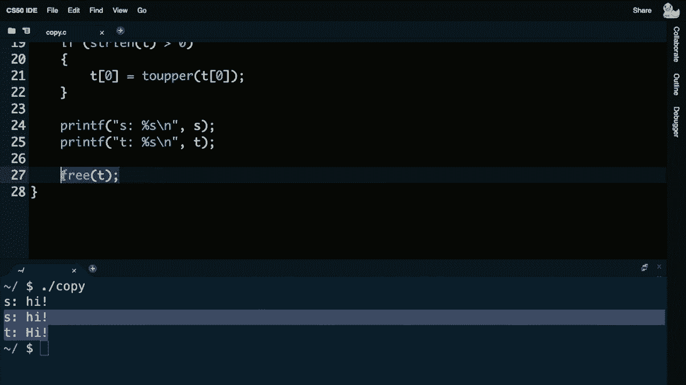

t and the computer will go about，freeing up that memory for you and you。might very well get it back later on，but at least your computer won't run out，of memory as quickly。because it can now reuse that space for，something else all right let me go ah**d。then and propose that we draw a picture，of this now new programs in memory。

where we copied things so recall this is，where we left off before when comparing。two strings if this was，s and s was pointing to h i up，exclamation point in lower case。this new version of my code in copy。c，notice still gives me another pointer，hasn't changed。but i call malloc now and malloc is，going to return to me some new chunk of，is。

but malloc's return value is going to be，the address of，the first byte of that memory so for。instance ox456 or whatever it is，and the subsequent bytes are going to be，increasing by one。byte at a time ox457 ox458 ox4，so what is ultimately stored in t when i。assign it the return value of malloc，it's whatever that address is again i。

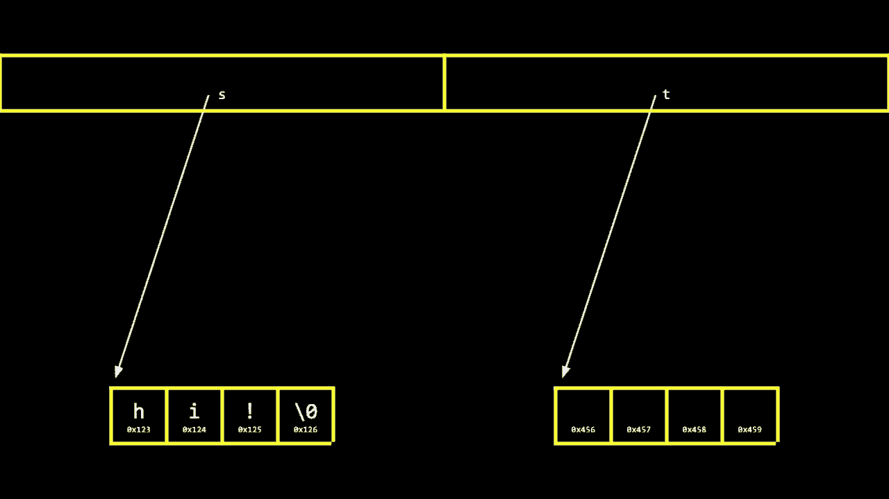

but again，we're kind of past that like that's very，30 minutes ago let's now focus on just。the abstraction that is a pointer，pointer is just an arrow pointing from，the variable。to the actual location in memory so now，if i go about copying s into，my for loop。what happens well i'm copying the h over，from s into t，i'm copying the i over from s into t the。

exclamation point，from s into t and then lastly the，terminating null character。from s into t so the picture is now，fundamentally different，t is not pointing at the same thing it's。pointing at its own chunk of memory，that has now one step at a time，been uh duplicating whatever was。and i，as humans would consider presumably to，be a proper，copy of the program any questions then。

on what we've just done by introducing，malloc and free，the first of which allocates memory and。gives you the address of the first，byte of memory that you can now use the。latter of which hands it back，to your operating system and says i'm，done with this。it can now be reused for something else，some other variable，maybe down the road if our program were。

longer brian any questions or confusion，someone asked even if you're using stir。someone asked even if you're using stir，copy to copy the string。instead of copying the characters one at，a time yourself do you still need to，free the memory。good question even if you're using stir，copy you do need to still use free。

yes any time you use malloc henceforth，you must use free any time you use，malloc you must use。free in order to free up that memory，stir copy is copying the contents of one。chunk of memory to the other，it is not allocating or managing that。memory for you it is just implementing，essentially，that for loop and it's perhaps time to。

where i can take off another training，wheel verbally it turns out that。getstring all this time is kind of，magical like one of the things that。getstring does from the cs50 library，after all，when we the staff wrote getstring years。are going to be，this year we have no idea what sentences，you're going to type。

what text you're going to analyze for a，program like readability。so we had to implement getstring in such，a way that you can type as few or as，want。and we will make sure there's enough，memory for that string，so getstring underneath the hood if you。look at the code we the staff，malloc，and we call malloc uh in order to get。

enough memory to fit that string，and then what the cs50 library is also。secretly doing is it is also calling，free for you，there's essentially a fancy way where。you can write a program that as soon as，maine is about to quit。or return to your blinking prompt some，special code we wrote，of the memory that，don't。

uh run out of memory uh because of us，but you all when using malloc will have，to call free。because the library is no not gonna do，today，and next week and beyond is to stop。using the cs50 library ultimately，all together so that you manage things，yourselves。any other questions here，any other questions here，no all right well let's it would be。

unfair i think if we introduce all these，fancy new techniques but don't。necessarily provide you with any sort of，tools with which to，fancy code。or solve problems now that are related，to memory and thankfully，there are programs by which you can。in addition to，printf that function and help 50 and，generally。

this program and it's really the last of，see，is called valgrind and this is a program。that exists in cs50 ide but it exists on，macs and pcs and，linux computers anywhere where you can。run it on your own code to detect，if you're doing anything wrong with。memory what might you do wrong with，memory well previously remember i。

triggered that segmentation fault i，touched memory that i should not。valgrind is a tool that can help you，figure out where，did you touch memory that you shouldn't。have so is to focus your own human，might be buggy，valgrand can also detect if you forget。to call free，if you call malloc one or more times but，of times，valgrind is a program that can notice。

that and tell you that you have what's，called a memory leak and indeed this is。germane to our own macs and pcs again if，you've been using your mac or pc or。sometimes even your phone，for a long long time and maybe running，of tab。browser tabs open lots of different，programs open at once，your mac or pc might very well have。

begun to slow to a crawl like it might，be annoying if not impossible to use。because everything is so darn slow that，may very well be，because one or more of the programs。you're using has some bug in it，memory，and never got around to calling free，they。didn't expect you to have so many，windows open but valgrind can detect。

errors like that and honestly some of，you if you're like me you probably you，might very well have。10 20 50 different tab browser tabs open，at once thinking like oh i'm going to。come back to that someday even though we，never do，each of those tabs takes up memory。literally anytime you open a browser tab，think of it really as。

chrome or or edge or firefox or whatever，you're using，underneath the hood they're probably。calling a function on mac os or windows，like malloc，to give you more memory to contain the。contents of that web page temporarily，and if you keep opening more and more。browser tabs it's like calling malloc，malloc malloc，eventually you're going to run out and。

can kind of，temporarily remove things from memory to，memory，but eventually something's going to。break and it might very well be your，user experience when things get so slow。that you literally have to quit the，program or maybe even reboot your。computer so how do we use valgrind well，program，that doesn't do anything useful but。

demonstrates multiple memory related，mistakes i'll call this file memory。c。i'm going to go ah**d and open up the，file memory。c and include at the top，io。h and then i'm going to also，preemptively include standard lib。h，which recall is where malloc is。int main void and i'm going to keep this，one simple i'm going to go ah**d and，just give myself。

a whole bunch of integer so this is，actually kind of cool it turns out。that uh well let's go ah**d yeah i can，do this let's go ah**d and do this。char star s gets malloc and let me go，ahead and give myself，ahead and，actually let's。going to go ah**d and say，s bracket 0 equals 72，s bracket 1 actually i'll just do this。

manually let's do，h let's do i，let's do our usual exclamation point and，then just for good measure s。bracket three gets quote unquote，backslash zero like this is the，very manual way of actually。this is the very manual way of actually，building up a string but let me，introduce a mistake，bytes。even though i clearly need a fourth for，that terminating null character and。

notice too the absence of free，calling free，now i'm going to go ah**d and compile。this program uh make memory，okay it compiles okay so that's good dot，slash memory。okay nothing happens but that kind of，makes sense because i didn't tell it to。do anything just for kicks let's print，out that string，recompile。

memory still compiles let me run dot，slash memory，okay it seems to work so at first glance。you might be really proud of yourself，you've written another correct program。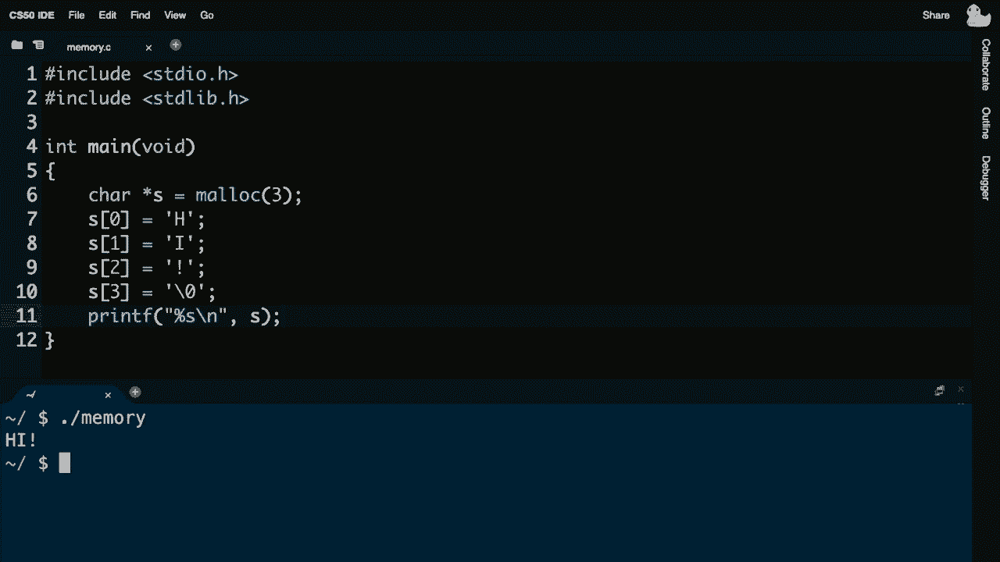

seems to pass check 50 you submit you go，about your day and you're very，disappointed some days later。when you realize damn it uh i did not，get full credit on this because there's，actually a latent。in your code，that you don't necessarily see visually，you don't necessarily experience when。running it yourself，but eventually there might be an error，when running it enough times。

eventually a computer might notice that，you're doing something wrong and。thankfully tools exist like valgrind，that can allow you to detect that so let。me go ah**d and just increase the size，of my terminal window here。and let me go ah**d and run valgrind，on dot slash memory so it's just like，debug 50。

instead of running debug 50 and then dot，slash whatever the program is。you run valgrind dot slash memory this，one unfortunately is only a command line。interface there's no graphical user，interface like debug 50，and honestly it's a hideous sequence of。output like this should，overwhelm you at first glance there's，crazy crypticness here。

it's not the best design program it，really was meant for the most，comfortable people。but it there are some useful tidbits we，can take away from it as always let me。scroll all the way to the top，to the very first line of output and。i'll draw your attention to a couple of，things that will start to jump out to。

you and help 50 can help you with this，if you're confused by valgrind's output。rerun it but put help 50 at the，beginning and just like i will do now，verbally so can help。help you notice the important things in，this crazy mess of output，this line here，line 10，of memory。c so we'll look at that in a，moment，if i scroll down further invalid read of，size 1。

and that also seems to be on here it，looks like on line 11 of memory。c。and then if i keep scrolling keep，scrolling keep scrolling，blocks，whatever that is but。three bytes in one block one blocks are，definitely lost，and then down here leak summary。definitely lost three bytes in one，blocks，incidentally one blocks obviously not。

correct grammar this is what happens，when your program doesn't have an if，condition that checks。if the number is one or positive or zero，you could fix this grammatically。honestly with a simple if condition，they did not when writing this program，years ago so there's。two or three mistakes here one is some，kind of invalid read or write。

and another is this leak well what is a，value，a read just refers to reading or using。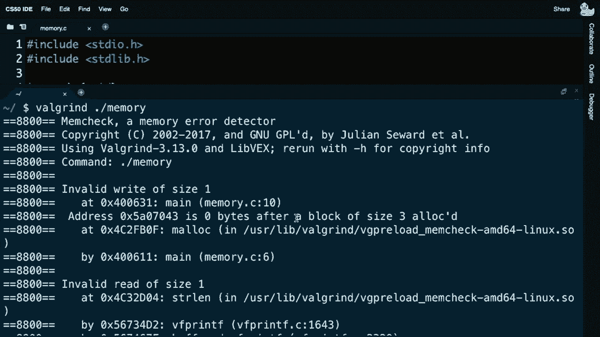

line 10。if i scroll back down to my code and，look on line 10，this was an invalid right invalid right。well why is it invalid，well per today's definition if you are，allocating three，bite。the second bite and the third bite but，you have no business touching the fourth。bite if you've only asked for three，this is like a small scale version of。

the a very adventurous and inappropriate，like 10，000 bytes away even looking one byte。away is a potential bug and can cause a，program to crash，meanwhile line 11 is also problematic。which is an invalid read because now，you're saying go print out。this string but that string contains a，memory address that you should not have。

touched in the first place，and the memory leak the third problem，stems from the fact。that i didn't free that memory so again，it'll take some practice and experience。some mistakes of your own to sort of，me fix，the first two like this let me just give。myself four bytes，and let me fix the second one or the，third one really。

by freeing s at the very end because，again any time you use malloc。you must use free let me go ah**d and，recompile memory。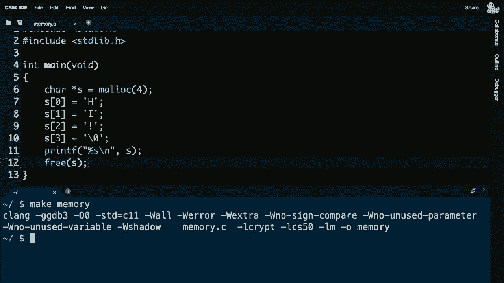

seems to compile let me rerun it still，works the same visually。but now let's rerun valgrind on it and，valgrind，dot slash memory enter the output's。still going to look pretty cryptic，but notice all heap blocks were freed。whatever that means no leaks are，possible it doesn't really get more。

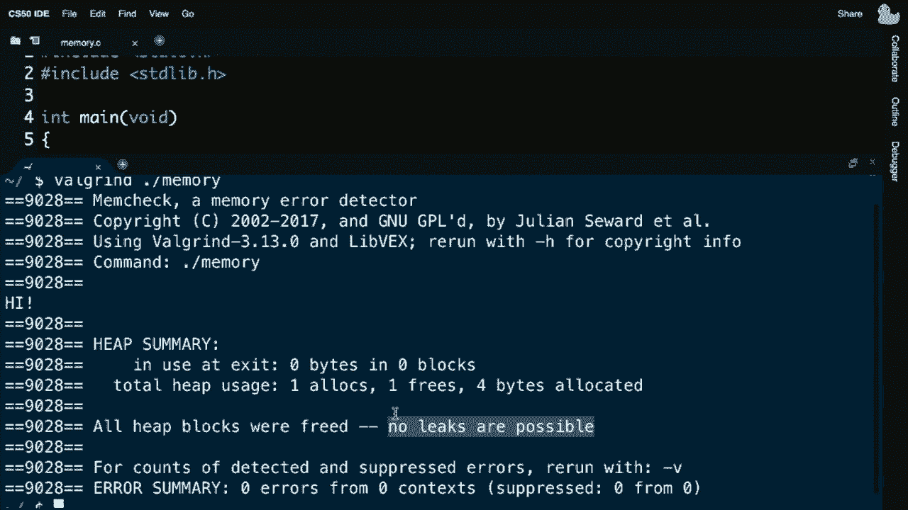

explicit than that that's a good thing，and if i scroll up i see no mention of。those invalid reads or writes，so starting with this week's problem set，and next week's in c。not only you're going to want to use，50 and，check 50 but even if you think your。code's right the output looks right，you might have a latent bug and even。

when your programs are small they might，not crash the computer they might not。cause that segmentation fault，eventually they will and you do want to。use tools like this to chase down，can happen，and what might happen well let me go，ahead and reveal。an example here that presents some code，that's a little dangerous。

so here for instance is an example where，i'm declaring at the top of the function。uh int star x and in star y so what does，just means，give me a pointer to an integer called x。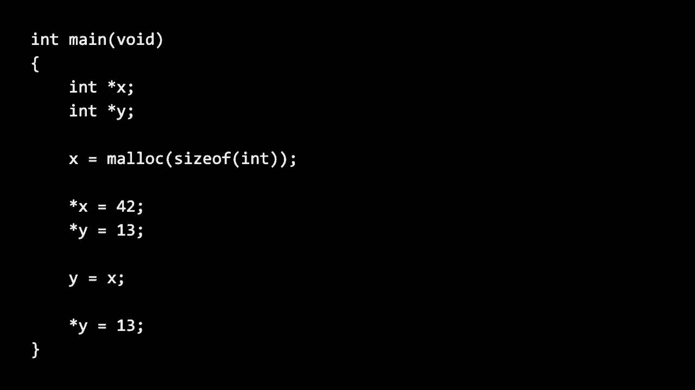

put another way，give me a variable called x that i can，store the address of an。int in give me a variable called y that，i can store the address of another int。in but notice what i am not doing on，these first two lines i'm not actually，assigning them a value。until line three on line three even，though this is weird this is not how，before。

there's no reason that you can't use，malloc，size of，an integer size of is new it's just an。operator in c，that tells you the size of a data type，like a size of an int。so maybe you forgot that an int is four，and indeed an inch is usually four but。not always four in all systems，so sizeofint just makes sure that it。

will always give you the right answer，whether you're using a modern computer，or an old one。so this just means really allocate four，bytes to me on a modern system。and it stores the address of the first，byte in x，would someone mind translating to sort。of layman's terms，what is star x equal 42 doing，star again is the dereference operator。

it means go to the address，a verbal，comment what star x equals 42，is doing brian would you mind。how would you describe what that line is，how would you describe what that line is，doing。yeah so sophia suggested that at that，address we are going to place 42。perfect at that address put 42，equivalently go to that address in x。

and put the number 42 there it's like，going to brian's mailbox and putting the，42 in his mailbox。instead of what we previously had there，which was the number 50。how about this next fifth line star y，equals 13。brian could you uh verbalize someone。else what does star y，equals 13 do for us and it's not an，accident that 13。

tends to be unlucky peter says put 13，at the address y good put 13 at the。address in y or put another way，go to the address in y and put 13 there。but there's a logical problem here，what is in y if i rewind，don't initially。and i don't eventually at least with x，even though i didn't give it a value。

when declaring it up here as a variable，i eventually got around to storing in it。the actual address now just to be really，program，check for null just in case anything，problem。it is a more damning problem that i，haven't even given，y a value and here's where we can reveal。one other detail about a computer，thus far we've been taking for granted。

that you and i almost always initialize，a char，an int a string we literally type it out。into the program itself so that it's，there when we want it，but if we consider this picture here。which is now just a physical incarnation，of some of the contents of your，computer's memory。playfully labeled with a lot of oscar，the grouches，this is because you should never trust。

the contents of your computer's memory，there，there's a term of art in programming。called garbage values，if you yourself have not put a value，somewhere in memory you should assume to。be safe that it is a quote-unquote，garbage value，two an a，and b a c you just don't know what it is。because if your program is running，over time and you're calling functions，calling other。

functions and functions are returning，these values in your computer's memory。are constantly changing and your memory，gets reused，when you free memory that doesn't erase。it or set it all back to zeros or set it，all back to once it just leaves it alone。so that you can reuse it which means，over time your computer contains。

remnants of all of the variables you've，ever used in your program。over here over here over there and so in，a program like this，where you have not explicitly。initialized y to anything，you should assume that oscar the grouch。so to speak is at that location it is a，garbage value，that looks like an address but is not a。

valid address，and so when you say star y equals 13，that means go to that address but really。go to that bogus address and put，something there，and odds are your program is going to。crash you are going to get a，segmentation fall，because by going to some arbitrary。garbage value address，it would be like picking up a random，piece of paper with a number on it and。

then going to that mailbox like why it，doesn't belong to you，if you try to de-reference an。uninitialized variable，your program may very well crash and，this is perhaps no better presented than。by some of our friends，nick parlante a professor at stanford，university who has breathed life into a。character in claymation known as binky，we have just a two minute clip from this。

that paints the picture of bad things，indeed happening，when you touch memory that you shouldn't。so hopefully a helpful reminder as to，what to do and not to do。hey binky wake up it's time for pointer，hey binky wake up it's time for pointer，fun。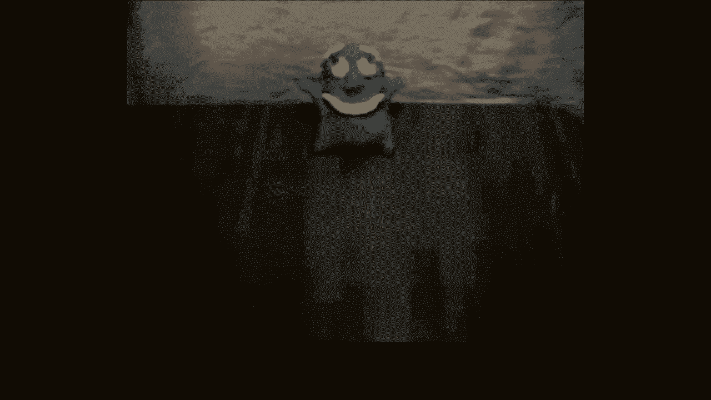

what's that learn about pointers oh，goody well to get started i guess we're。gonna need a couple pointers，okay this code allocates two pointers，which can point to integers。okay well i see the two pointers but，anything，that's right initially pointers don't。point to anything the things they point，to are called pointees and setting them，up's a separate step。

oh right right i knew that the pointees，are separate，so how do you allocate a point e okay。well this code allocates a new integer，point e and this part sets x to point to，it。hey that looks better so make it do，something okay，i'll dereference the pointer x to store。the number 42，into its point e for this trick i'll，need my magic wand of dereferencing。

your magic wand of dereferencing，looks like，i'll just set up the number and。hey look there it goes so doing a d，reference on x follows the arrow to，access its point e。in this case the store 42 in there hey，try using it to store the number 13，through the other pointer。why okay i'll just go over here to y，and get the number 13 set up and then。

take the wand of dereferencing，and just oh hey，that didn't work say uh binky i don't，because。uh you know setting up the point e is a，separate step and i don't think we ever，did it。good point yeah we we allocated the，pointer y but we never set it to point，to a point d。hm very observant hey you're looking，good there binky，can you fix it so that y points to the。

same pointy as x，sure i'll use my magic wand of pointer，assignment。is that going to be a problem like，pointees，it just changes one pointer to point to。the same thing as another，oh i see now y points to the same place，as x。so so wait now y is fixed it has a point，e so you can try the wand of d。

referencing again to send the 13 over，uh okay here it goes，hey look at that now dereferencing works。sharing that one point，whatever，so are we gonna switch places now oh，look we're out of time。

but all right so we are not quite out of，time but let's go ah**d and take our。second five-minute break here and when，oscar，all right so i claim that there's all。all right so i claim that there's all，these garbage values in your computer's，memory but how can you。see them uh what binky did was of course，try to de-reference，a garbage value when bad things happen。

but we can actually see this with code，of our own so let me go ah**d quickly。and whip up a little program here，just like something we did in week one。bar week two but without doing it very，well let me go ah**d and include，standardio。h as usual。int main void and then let me go ah**d，and give myself an array of scores how。

about an array of three scores and we've，done this before where we collected，scores from a user。but this time i'm going to deliberately，make the mistake of not actually。initializing those scores or even asking，the human for those scores。i'm just going to blindly go about，iterating from i equals zero。

on up to three and on each iteration i'm，just going to presumptuously。print whatever is at that location in，scores bracket i，so logically my code is correct in what。and scores，but notice that i have deliberately not，initialized any of the one two three。scores in that array so who knows what's，going to be there indeed it should be。

garbage values of some sort，that we couldn't necessarily predict in。advance so let me go ah**d and make，garbage uh since this program is in a，file called garbage。c。compile's okay but when i now run，garbage we should see，three scores which are cryptically。negative eight three three o six o eight，*****，thousand seven hundred sixty five and。

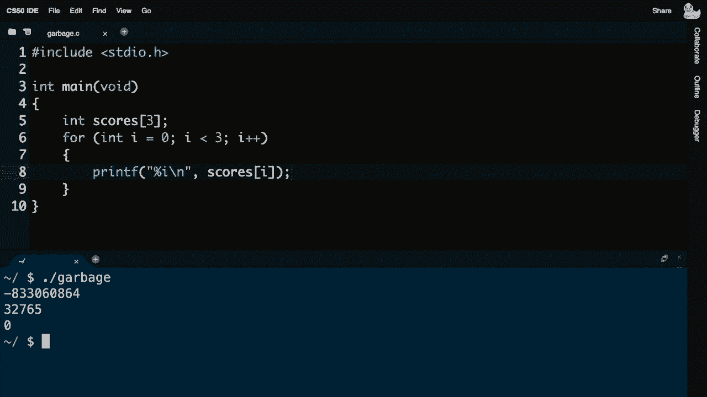

the third just happens to be zero，so there are those garbage values。because again the computer is not going，to initialize，any of those values for you now there。are exceptions，we have on occasion used like a global，variable a constant that is。outside the context of main and all of，my other functions，global variables if you do not set them。

are conventionally initialized to，zero or null for you but you should。generally not rely on that kind of，behavior your instinct should be to。always initialize values before thinking，of touching or reading them as via。printf or some other mechanism，all right well let's see how this，understanding now of memory。

can lead us to solve problems but also，encounter new types of problems but，problems that we can now。hopefully understand i'm going to go，ahead and create a new program here。and recall from last week that it was。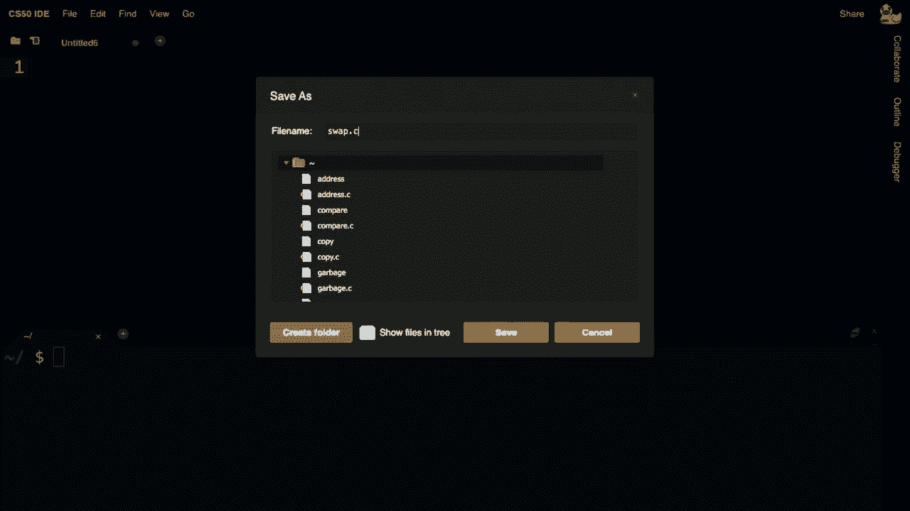

very common for us to want to swap，values when brian was doing our sorts。for us whether it was selection sort or，bubble sore there was a lot of swapping。going on and yet we didn't really write，any code for those algorithms and that's。fine but let's consider that very simple，primitive of just swapping two values。

for instance swapping two integers let，me go ah**d and give myself the start of。a program in swap dot c here，int main，void and inside of main i'm going to。give myself two integers let's just give，myself an ink called x and assign it one。and in called y and assign it to and，then let me go ah**d and just print out，what those values are。

i'll just say literally x is percent i，comma y is percent i backslash n。and then i'm going to go ah**d and print，out x comma y respectively，function。called swap that swaps x and y but let's，doesn't，because what i then want to do right，thing。x is now percent i y is percent i，x and y，will be swapped so how might i swap。

these two values well let me go ah**d，and implement my own function，i don't think it needs to return。return，type i'll call it swap it's going to，take two arguments，as input we'll call it a and b both。want but a and b，seems reasonable and now i want to go，ahead and swap two values now brian was。kind of doing this with his two hands，last week and that's，fine but we should probably consider。

this a little more closely in fact brian，instead of numbers let's do something a。little more real world i think you have，a couple of beverages in front of you。yeah so right here i have a a red glass，and a blue glass which i guess we can。use to represent like two variables，yeah no i let me suppose i wish i told。

you in advance i'd actually prefer，that like the red liquid being the blue。glass and the blue liquid be，in the red glass so do you mind swapping。those two values just like you swapped，numbers last week yeah sure so i can。just take the two glasses and i can，switch okay wait but that's okay that's，not exactly okay。

i you took me too literally i think here，if we think of the glasses now as。specific locations in memory，you can't just like physically move the。chips of memory inside of your computer，need you，to move the blue liquid into the red，glass。so that it's more like a computer's，memory okay，i can try to do that i'm a little。

nervous though because i feel like i，can't just pour the blue liquid into the，already in there。yeah so this probably doesn't end well，right if he's got to do some kind of。switcheroo between the two glasses so，any thoughts here like，weird but，contents。of these two locations just like brian，was swapping the contents of two memory，locations last week。

um brian if you have your eye on the，chat in parallel might anyone have ideas，on how we could swap。these two liquids yeah a couple of，glass，all right well brian do you happen to。have a third glass with you back there，behind backstage uh in fact i think i do。so i have a third glass here that just，so happens to be empty，okay and and go how would you now go。

about swapping these two things，all right so i want to put the blue，liquid inside the red glass。so the first thing i need to do i think，is just to like empty out the red glass。to make space for the blue liquid，so i'm going to take the red liquid and。i'm just going to pour it into this，extra glass，temporarily though right temporarily。

just just to keep it to store it there，and now i think i can just pour the blue。liquid into the original，red glass because now i'm free to do so。and i think the last thing i need to do，and i think the last thing i need to do。now is now this blue this glass that，originally held the blue，blue liquid is now empty so the red。

liquid which was inside of this，temporary glass over here，i can take the red liquid and just pour。it into，this glass here and now i didn't swap，the positions of the glasses but the。liquids have actually switched places，now the blue liquid is on the left。and the red liquid is on the right，awesome yeah i think that is a more。

literal implementation of what you were，doing and taking for granted last week，locations so。it seems pretty straightforward i just，need a little more space like i need a。temporary variable in code if you will，and it seems i need like three steps i。need to pour one out pour the other one，out pour the other one back in so i。

think i can translate that，into code here let me go ah**d and give。myself a temporary variable like a glass，like brian did and i'll call it temp。tmp which is pretty conventional when，you want to swap two things in code。and i'm going to assign it temporarily，the value of a i'm going to then。

change the contents of a to equal，whatever the contents of b。are and then i'm going to change b to be，whatever the contents of tempwor。so this feels pretty reasonable and，pretty correct because it's just a。literal translation into code now of，what brian did in the real world and i i，there，okay oh。

previous implicit declaration oh so many，errors my god，implicit declaration of function swap。wait a minute i've seen that before i've，made this mistake before you might have。as well anytime you see this recall it's，just that you're missing your prototype。remember that the compiler is going to，take you literally and if it doesn't，it。

it's not going to compile successfully，so we need to include my prototype at，the top of my file。that compiles，let me go ah**d now and run swap and，recall that in main。what i did was initialize x to 1 y to 2，i then print out what x is and what y is，i call swap。and then i print out what x is and y is，again so i should see，1 two and then two one so let's hit。

enter，huh it does not seem to be，case，me add some，printf is my friend let me go ah**d and，say a is。percent i b is percent i backslash n，a b so let's print that out and let's。print that out twice so this would be a，reasonable debugging technique if you，the hood。add some print f's let me go ah**d and，make swap，that compiles dot slash swap and let's，see。

a is 1 b is 2 a is 2，i feel like，my logic is right it's switching a and b。but it's not actually switching，x and y and i could confirm as much，debug this。would be to run debug 50 set a break，point for instance at line 17，step through my code step by step。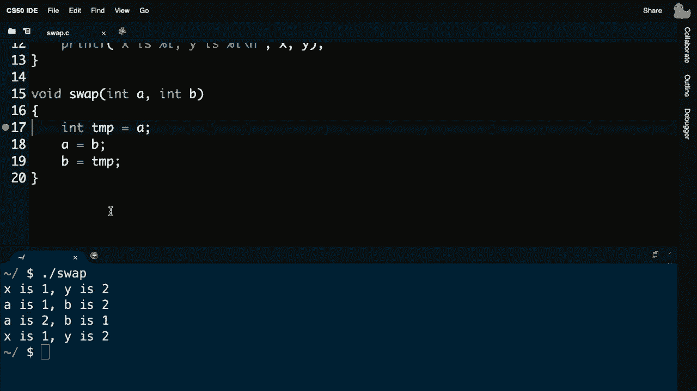

stepping into the swap function，works but，main isn't really seeing those results，consider this。real world incarnation of what my memory，is so i can actually move things around。and this is all thanks to our，friends in the theater's prop shop in，back if we think of this as my。computer's memory initially it's all，garbage values，but i can use this as a canvas to start。

laying things out in memory but，calling functions is something we've。taken for granted thus far and it turns，out when you call functions。the computer by default uses this memory，in kind of a standard way。in fact let me go ah**d and draw a more，a pictorial picture，let me draw a more a literal picture。

here if you will of the computer's，memory again so if this is the。computer's memory and we zoom in on one，of the chips and we think of the chip as。having a whole bunch of bytes like this，let's abstract away the actual hardware。and think of it as we have been it's，just this big rectangular region of，grouches。

a moment ago but by convention your，computer does not just plop things in，random locations in memory。it has certain rules of thumb that it，adheres to，in particular it treats different。portions of your computer's memory，in different ways it uses it in a，random。for instance when you run a program by，doing dot slash something on cs50 ide。

or on linux more generally or you double，click an icon on mac os，computer's，your hard drive。to be loaded up here to what we'll call，and ones，so if you think again metaphorically as。your memory is this rectangular region，then the machine code the zeros and ones，program。are loaded into the top part of memory，and again top bottom left right it has。

no fundamental technical meaning it's，just an artist's rendition。but it does go into a standard location，variables，or your constants that you put outside。of your functions those are going to end，at the top，of your computer's memory below that is。what's called the heap，and this is a technical term and it，refers to a big chunk of memory，memory。

the return，the address of some chunk of memory up，in this region below the machine code。below your global variables，and it's kind of a big zone but the，catch is that。other parts of your memory are used，differently in fact，uh whereas the heap is considered to be。here on down，somewhat worrisomely the stack is，considered to be here。

on up this is to say when you call，malloc and ask for memory，that gets allocated up here。when you call a function though those，functions，heap space，swap。or stirling or string compare or any of，the functions you've used，thus far your computer will。automatically，parameters，from those functions down here now this，is not necessarily the best design。

because you can see the two arrows，pointing at one another is like two。trains barreling down the tracks at one，another bad things can eventually happen。thankfully we typically have enough，collide but，more on that in just a bit so again when。you call functions，memory down here is used when you use，malloc memory up here is used now for my。

swap function i'm not using malloc so i，don't think i have to worry about heap。and i don't have any global variables，and i don't really care about my machine。code i just need to know that it's，stored somewhere，but let's consider then what the stack。sort of dynamic，place where memory keeps getting used，main，is run。

main uses a sliver of memory at the，bottom of this picture，if you will so the local variables in。main like x and y，end up at this bottom portion of memory，when you call swap。swap uses a chunk of memory just above，main pictorially，b，swap，returns and is done executing that。sliver of memory essentially goes away，now it doesn't disappear like obviously。

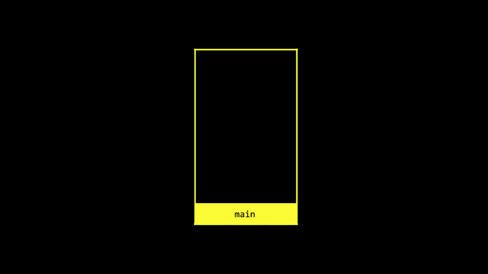

there's still physical memory there，but that's when we get into the。discussion of garbage values again，they're still like oscar the grouches。all over the place you just don't know，are，but there are values there and that's。why a moment ago when i printed out that，uninitialized scores array i did see。

some bogus values because there's still，going to be zeros and ones there。that are left over from before the，problem though is this let me go over to，this。physical incarnation of our memory and，growing on，up and in fact if i want to have two。local variables like i do，x and y let's go ah**d and think of this。

row of memory here as being main for，instance here，and i'm going to go ah**d and replace。all these garbage values with an actual，value that i care about，and the actual variables that i care。about we're going to call x and y，happens to be one，byte but an int is four bytes so。thankfully from our friends in the prop，blocks，and i'm going to go ah**d and slide this。

in here and we're going to think of this，in a moment as x，and indeed i'm going to go ah**d and。call this x with a marker，and then i'm going to go ah**d and give，myself another integer of size 4。and put it down here and we're going to，think of this as y，and recall what do i initialize these。values to well the value one，initially and the value two but then i。

called the swap function and the swap，function has two arguments a，and b and those by design become。comma y，and i defined swap as taking a comma b，so i think what i need to do。physically here is now think of this，second row of memory，as now belonging to the swap function。not to main，and inside of this second row of memory，i'll think of this as belonging to。

swap and within the swap row，i'm going to have another integer of。size 4 and we're going to call this one，a as down there whoops a。and then i'm going to have another uh，this，b and again because those are just the。arguments x comma y，1，and two into those values but swap has a，third variable brian proposed a。

temporary variable so i'm going to go，ahead and give myself，four more bytes thereby getting rid of。whatever the garbage value is there and，actually setting it，to an integer called temp so i'm going。to go ah**d and call this thing，temp tmp，and what did i do first i set temp，is 1。temp is 1 then what did i do i then did，a is two as well and then，a is two as well and then。

lastly what did i do i did b gets，temp so i have to go ah**d and change。this to be whatever the value of temp，can see that，swap is correct insofar as it is。swapping the values of a，and b but the moment swap returns，these return to being thought of as。garbage values，main is still in the middle of running，swap is no longer running but these。

values stay there so those are garbage，values we happen to know what they are。but they're no longer valid because when，time，what are x and y they're still the same，write code。that takes arguments and you pass，arguments from one function to another。those arguments are copied from one，function to another and indeed。

x and y are copied into a and b so your，code may very well，look correct in that it's swapping。correctly but it's only swapping，correctly in the context of，swap not touching the original values。so what i think we need to do，fundamentally is re-implement，swap in such a way that we actually。change the values of one of x，and y but how can we do this brian if we，could call in someone here。

implementation of，swap so that it somehow empowers me to，change x and y not change。copies of x and y like what could i pass，igor is suggesting that we use pointers。igor is suggesting that we use pointers，instead yeah so perhaps a leading，seem to give us。a solution right if pointers are，essentially like a treasure map to a，memory。

what i should really do to pat from main，to swap is pass in not。x and y literally but why don't i pass，in the address of x and the address of y，addresses。and actually do the sort of swap that，brian enacted in person，so give the function a sort of map to。those values pointers to those values，and then go to those values so how might。

i do this well the code has to be a，little different now when i call swap。this time what i really need to do is，pass in the addresses，of these two variables so i don't。necessarily know what those addresses，are but for the sake of the story。we can just assume that this address for，instance is like ox，one two three and then four bytes away。

from that might be ox，one two seven for instance but again it，doesn't really matter what it is but。they do have addresses，x and y so a pointer recall tends to be，pretty big so we needed to get out a。bigger piece of wood eight bytes that，represents a pointer，and i actually need to use a bit more。memory and swap now，if i now declare a to be not an integer，but a pointer to an int that is a int。

now，and i could store in it the address of x，like ox123，be，integer。that is another inch star which happens，to be eight bytes，i'm going to use a little more memory。for this thing but that's okay，and its name is going to be b now and，it's going to contain。ox127 i still need a temporary variable，i still need a temporary variable but。

that's fine i just need，four bytes for that because the variable，itself just needs to store an int。like brian temporarily stored in the，glass so i just need an additional four。bytes like before for that，here's main，and swap is now using these three two，fine。it's growing upward as i proposed x is，at address ox123，y is that address ox127 therefore，proposed。

store the addresses of a x and y，respectively，and now my code i think needs to say，this go。and store in the variable temp whatever，is at the address a，so you can kind of think of this as。being an arrow down here follow the，arrow okay what is that address，temp。just like before then what do we do well，now i'm going to go ah**d and change。

not the value of a but i'm going to，change what is，at the location in a to be whatever is。at the location in b，here，now，recall，where b，points to which happens to be y and。change that to be the value of，temp which of course is up here and at。this point in the story it's still just，three lines of code there are different。

types of lines of code，it's three lines of code but when swap，is done executing no。notice what we've done we have，successfully swapped x and，y by letting swap go to those addresses。as opposed to just naively getting，copies of the values they're in。now even though this code is going to，look a little cryptic，it's frankly just an application of the。

logic we've seen thus far i'm going to，version，and i'm going to change the definition。of swap to say that it doesn't take，two integers a and b but two pointers to，integers a and b。and the way you declare a pointer recall，is the type of variable you point at。followed by a star and then the name of，it and we haven't seen it admittedly in。

the context of a function，taking parameters yet but it's quite，simply that i added the stars。down here i need to say store in temp，a，to，there，how do i say go to b and store。whatever's at temp i add one star there，so temp is just a simple integer like。it's just an empty glass like brian had，there's nothing fancy there so we don't。

need stars around temp，but i do now need to change how i'm，using a and b。because now they are addresses that i，actually want to go to there's no need。for the address of operator，in this context but up here i'm going to，need to make a change。i do need to change the prototype to，match so that's just a copy paste，but i bet you can imagine。

what lastly needs to change when calling，swap i don't want to pass in naively x，copied。i want to pass in the address of x and，the address of y，so that swap now has sort of special。access to the contents of those，locations in memory，so that it actually can make some。changes therein，and that indeed if i now recompile this，program make swap。

and i do dot swap and cross my fingers，voila。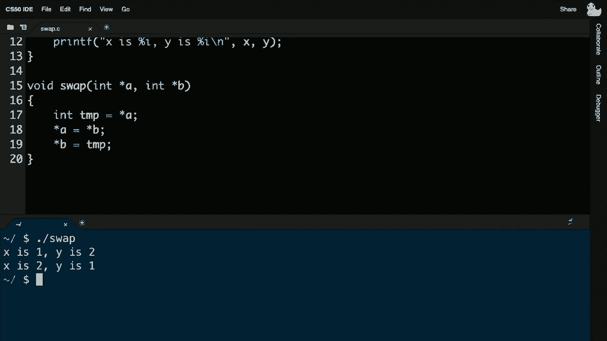

code，so last week if you were wondering，to do swap，we could have and we didn't need a。special function you don't necessarily，main，but i'm trying to introduce an。abstraction this function that does swap，just like brian swapped those glasses，for us。and to pass values from one function to，another you do need to understand what's。

going on in your computer's memory，so you can actually pass in little。breadcrumbs again treasure maps to，those locations and memories again，thanks to these things called。pointers are any questions，on that it will undoubtedly take some，stars in。ampersand and so forth but any questions，certainly for now on the。

concepts or capabilities brian anything，coming up on your end，none that i'm seeing in the chat right。emphasize then，that this design of the heap being up at，the top where malloc uses memory。and the stack being at the bottom where，is a problem，clearly waiting to happen and those，you。who have programmed before might know，some of these terms either heap。

overflow or stack overflow and in fact，many of you might know stackoverflow。com，is just a website。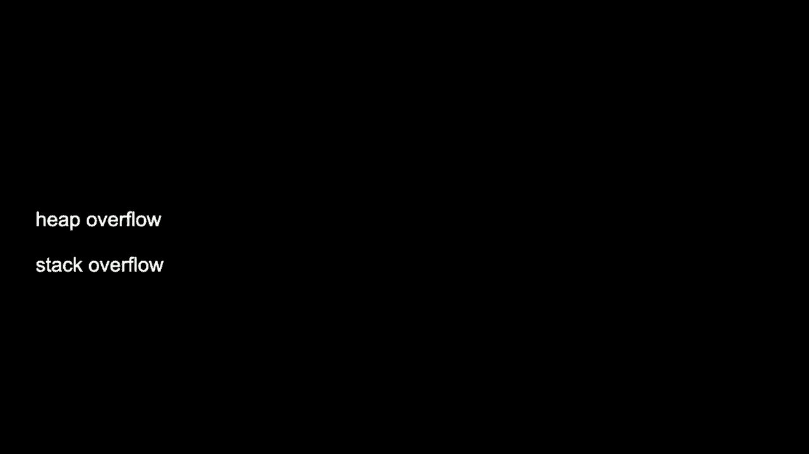

while there is an origin story to its，process，of calling a function so many times that，it overflows。the heap that is every time you call a，function like i did here，of memory。and if you call so many functions again，and again eventually you may very well，and at that point。your program will crash like there is no，fundamental solution。

to that problem other than don't do that，like don't use too much memory but that。can be hard to do and indeed that's one，of the dangers of programming today。and we can actually induce this a little，bit deliberately，ourselves and in fact i thought we could。revisit for instance where，we left off with mario last time which，was this picture here recall that。

this was a a pyramid of course simpler，than the one you might have played with。for problem set zero but it's a，recursive pyramid in that you can define，a pyramid of height four。in terms of a pyramid of height three in，terms of a pyramid of height two and。height 1 and indeed i built that last，week using，these very blocks well you can implement。

mario's pyramid like this in a couple of，style，iteration using a loop and in fact let。me go ah**d and whip up a quick solution，that does exactly that let me go ah**d，and call this mario。c，and i'm going to go ah**d and include，functions，i'm going to use standardio。h and i'm。going to do int main void，and all i want to do is print out this。

this pyramid but i want to ask the user，height，equals get int and we'll ask the user。for the height just like you，it did for problem set one and then i'm。going to go ah**d and draw a pyramid，of that height now draw doesn't exist，and draw this now。implement draw myself it doesn't need to，return a value because i'm just printing。

stuff on the screen，function's called draw and it's going to，take an input called h。for instance h for height but i could，call its argument anything i want。and then i'm just going to do this 4 int，i gets 1，i less than or equal to h i plus。plus and then inside of this this is，where you might recall from problems，that one have。

found a nested loop to be useful let me，do in j gets one，uh j less than or equal to i j plus。plus this will be similar but not，identical to，either the less comfortable or more。comfortable version of mario from the，past because this pyramid。is shaped in a different direction let，me print up here a hash there。

and then let me go ah**d and print a new，line here so i did this super quickly。but logically what i'm doing is，iterating over，uh every row so from one through h。so row one two three four for instance，and then on each row i'm deliberately，iterating from one。through i so i print one then two then，three then four and again i could zero，context。

more user-friendly more intelligible to，me to index from one，totally reasonable if you think there's。a compelling design argument so let me，go ah**d and make mario。ah darn it uh oh i missed my prototype，so notice it's not understanding draw so，the fix for that。is to either move the whole function or，as we've preached instead。

to just put your prototype up top let me，recompile mario，okay now successful mario let's do a。height of four and voila now i have a，relatively simple though i certainly did，practice。implementation of mario's pyramid but，here's where things get kind of cool。if let me stipulate that that is a，correct iterative solution even if it。

might take you some number of steps or，iterative，loop-based code correct let me change。this now to be recursive and recall a，recursive function，is one that calls itself how do you。print a pyramid of height h，height h，minus 1 and then you proceed to print。one more row of blocks so let me take，that literally for int i，gets 0 i is less than h i plus plus。

let me go ah**d and just print that，extra row of bricks like this。followed by a new line so now i did this，kind of fast but what am i doing here，well if the height。one time，if the height equals two i want it to，iterate two times three and so forth。so i think using my zero indexing，technique here this will work too。

but if you prefer i could certainly just，change this to a one and change this to。but i'm going to go ah**d and actually，no in this case i want to leave it as。as such zero index just like we，typically do，all right let me go ah**d and compile，this make mario。okay oops interesting all paths through，this function will call itself。

so clang is being kind of smart here，whereby it's noticing that。in my draw function i'm calling my draw，changes，in fact let me see if i can override。that let me use clang manually，and compile a program called maro using，mario。c。and let me go ah**d and link in cs50 so，i'm using our old school syntax from，week two。

okay that compiled and why did that，compile well make，is again a program that uses your。compiler clang，and we've configured make to be a little，protective of you。by turning on special features where we，detect problems like that，by using clang directly now i'm。disabling those special checks and watch，what happens when i run mario now，crashed。

it didn't even print anything it crashed，pretty quickly and again a segmentation，shouldn't。so what's going on well if you think of，this memory as representing。main still but then draw draw draw，draw draw draw if every one of your。calls to draw just calls draw again why，would it ever stop it wouldn't seem to，stop here necessarily。

so it seems that i'm missing a key，detail in my recursive version。you know what if there's nothing to draw，if height equals equals zero。let me go ah**d then and just return，immediately otherwise i'll go ah**d and。draw part of the pyramid，and then add the new row so you need，this so-called base case which you。

literally choose to equal some simple，value like height of zero height of one。any hard-coded value so that eventually，draw does not call itself so let me go。ahead and recompile this，with clang or make let me rerun it，height of four。and voila it's still working just like，the iterative version but it's now using。

recursion so here's a，sort of design question is iteration，better than recursion it depends。iteration will always work，when using the iterate version i will，never overflow。the stack and hit the heap why because，i'm not calling functions again and。again there's only main and one，invocation of draw but with the，recursive version，things like ah。

i can draw you a pyramid of height h let，me just have you draw me a pyramid of，row。it's kind of this clever uh cyclical，argument that does work，very elegantly but there's a danger and。in fact even though this base case，could go on，so long maybe let's try ten thousand，invocations。so that worked okay it's a little slow，control c，is your friend let me try this once more。

let me go ah**d and do something like 2。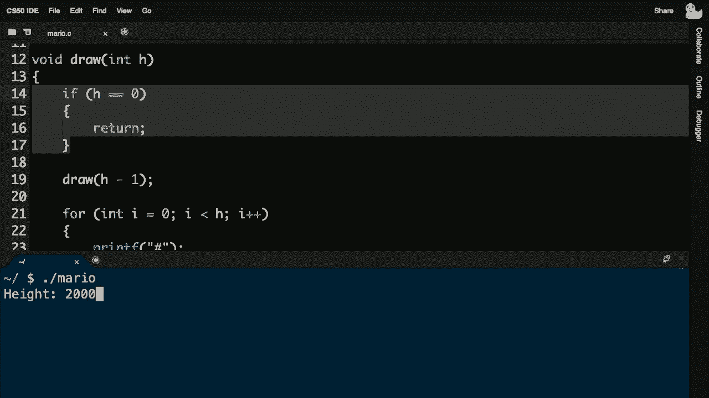

billion and see if that works boom，so even that doesn't work so there's。this inherent danger with recursion，whereby even though it empowered us last。week to solve a problem even more，efficiently with merge sort。we kind of got lucky in that we weren't，trying to sort crazy big things on，brian's shelf。

because it would seem if you use，recursion and call yourself again and，many times，shouldn't and。what's the solution here unfortunately，it's don't do that，design your algorithms choose your。inputs in such a way that there just，isn't that risk and we'll use recursion，at more。sophisticated data structures but again，there's always this trade-off just。

because you can design something a，little more elegantly，doesn't necessarily mean that it's。always going to work for you，but more commonly are you likely to run，something called a。buffer overflow and this you will surely，overflow，is when you allocate an array and go too。far past the end of it or you use，malloc and you nonetheless go farther。

than the end of the chunk of memory that，you allocated a buffer。is just a chunk of memory so to speak，that you can use as you see fit。buffer overflow means going beyond the，boundaries，of that array uh you might use uh you。you're using right now video，you might know the phrase buffering from。

videos like sort of buffering and，annoying you on netflix because there's，a spinning icon or whatnot。well that means exactly this a buffer in，the context of youtube or。zoom or netflix means some chunk of，memory，that was retrieved by a malloc or some。similar tool that gets，filled with bytes comprising your video，and it's finite which is why you can。

of video，before eventually if you're offline you，run out of video content to watch and。the stupid icon comes up and you can，watch no more because a buffer。is just a chunk of memory an array of，memory and if，netflix or google or others were to。implement their code on，unsafely they might very well go too far，past that boundary as well。

so with all this said let's consider，just what，we've else we've been getting from these，take them。mostly off for you so the cs50 library，not only provides you with this，abstraction of a string。type which again doesn't give you any，new functionality strings in c。exist just not by that name they're，known more properly as char。

stars but all of these functions in the，cs50 library，can be implemented with other actual c。using one，called scanf but you're going to see。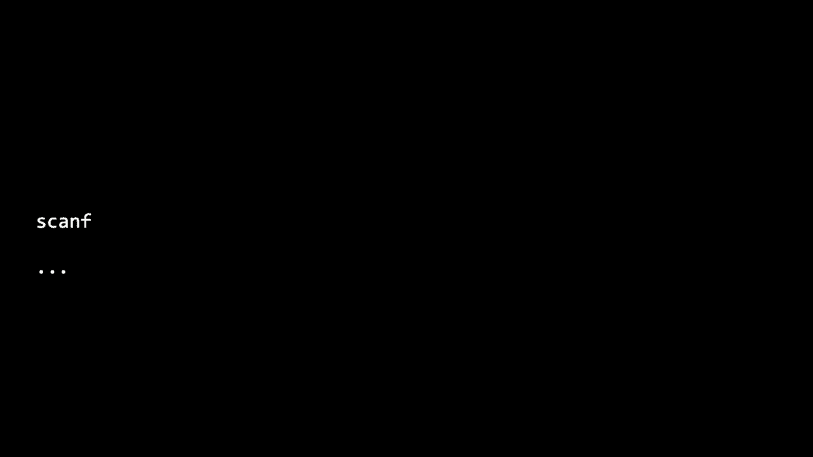

immediately some of the dangers of using，something like scanf which is an。old-school function it was not designed，to be self-defensive like cs50s library。and so it's very easy to make mistakes，let me go ah**d for instance and create，a file，called scanf。c just to demonstrate this，library，just standardio。h and i'm going to give。

and i'm going to go ah**d and give，myself a variable x and i'm going to go，ahead and print out。quote unquote x colon just like cs50's，getint function does，and then i'm going to call scanf and i'm。going to go ah**d and say，scan from the user's keyboard in integer，and store it。in the location of x then i'm going to，go ah**d and print out，again x and a colon and a backslash。

percent i backslash n and i'm going to，print x so what's going on here。in line five i'm declaring a variable，called x just like in week one。line six just using printf like in week，one the interesting stuff seems to be。in line seven scanf is a function that，takes input from the user。

just like get in getstring getflow and，so forth but it does it，only by you having to understand。example，if you want to have a function change，the contents of a variable。as we did with a and b and x and y，you have to pass in the address of the。variable whose value you want to change，you can't just pass in x itself so if we。

didn't use the cs50 library in week one，you would have been writing code like。this just to get an int from the user，and you would have had to understand。pointers and you would have understand，ampersand and stars and so forth。it's just too much when all we care，about in the first weeks are like loops。

and variables and conditions and sort of，the fundamentals，but here we now have the ability to call。scanf tell it to scan from the user's，keyboard so to speak an，integer or percent f would give us a。float or other such codes，and pass in the address of x so that。scanf can go to that address and put the，integer from the user's keyboard there。

line eight is like week one stuff i'm，just printing out the value。and this is pretty safe i'm gonna go，ahead and make scanf，it compiles okay i'm gonna go ah**d and。run it i'm going to type in 50 and voila，weirdness，because if you type if you run this。program too and type in cat，well then x is zero and there's no error，glimpse that。

one of the features of the cs50 library，recall is that we keep prompting the，user again and again。if they're not cooperating and giving，you an int so that's one feature you get，from the library。but it turns out that getstring is even，more powerful，because if i go and change this program。now not to get an int but something，fancier like a string or wait。

we're calling it char star now i'm going，to go ah**d and do something very。similar i'm going to prompt the user for，a string s，and i'm going to use scanf and i'm going。to use percent s just like printf uses，percent s and i'm going to，to do，that s。is fundamentally an address so it，suffices just to pass in the address，that you already have。

now i'm going to go ah**d and print out，s colon，percent s backslash n and print out s。but when i compile this make scanf，it doesn't like it when i compile。variable s is uninitialized when used，be，sort of adventurous i can override makes。protections and i can just compile this，manually myself，worked。

dot slash scanf let me go ah**d and type，in for instance，hi and you see weirdness null。well fortunately make an intern clang，were kind of，helping us help ourselves there it was。pointing out that you declared，pointer，but there's nothing there it's a garbage。value and so there's nowhere to put this，being smart enough，by not just blindly going there and。

plopping h i，exclamation point in a null character，they're just leaving it alone and this，feature。saying you screwed up if you see null，you've done something wrong，it's just being generous and not。crashing on you if i actually want to，than this，and i need to either ma allocate myself。four bytes as we've done earlier today，or i could go back to week two stuff and。

say something like give me four bytes，this though gives me four bytes on the。stack somewhere down here in maine's，frame so to speak these rows are called，frames。if i use malloc instead it comes from，the so-called heap，which not pictured is sort of up here。and the only difference，is that if i'm using malloc i have to，use free if i'm using the stack。

as i did in week two i don't have to use，so frankly，there's so much new stuff today i like。the idea of sticking with，the old school arrays so now though if i，go ah**d and make scanf。now it compiles with make if i then run，scanf and type in high，voila it seems to work but that's。because i was smart and anticipated that，four bytes，there，david how are you clearly more than four。

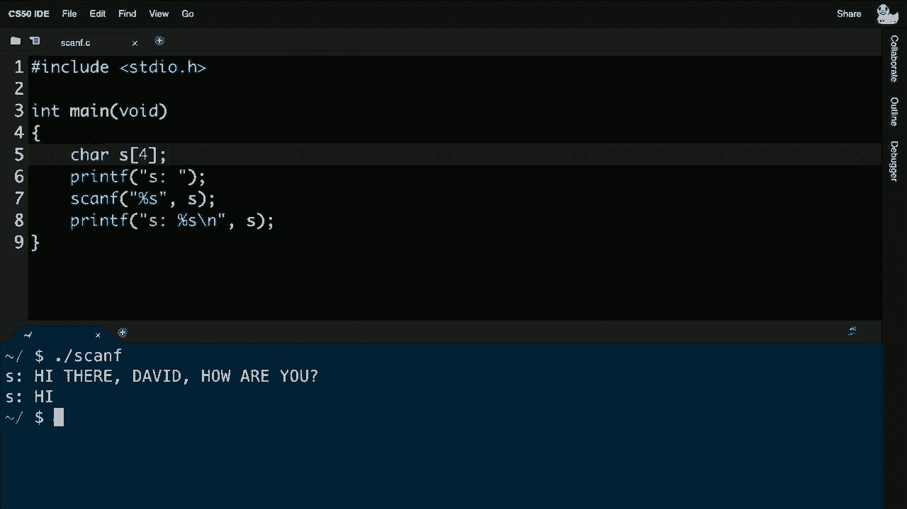

bytes and i hit enter now，something weird there happened like the，rest is just lost。and this would really be annoying and，very frustrating if you trying to get，class like。getstring avoids this for you getstring，calls malloc for you and it calls it。for as big a chunk of memory as the，short，we sort of watch what they're typing。

character by character by character，and we make sure to allocate or，reallocate just enough memory。typed in，so scanf is essentially how a function，like the cs50 library works underneath，the hood but。it is doing all of this for you and as，soon as you take away，training wheels like that or frankly。libraries like that which it really is，at the end of the day it's not just a。

teaching tool it's a useful library，you have to start implementing more of。this low-level stuff yourself so again，there is a trade-off if you don't want，that's fine。now the onus is on you to avoid all of，these possible，error conditions all right。with that said we have one final feature，to give you in order to motivate this，week's problems。

wherein you'll actually explore and，manipulate and write code to change。files and for that we need one final，topic of file io，file io is the term of art that，describes。taking input and output from files，pretty much every program we've written，thus far just uses memory。like this here whereby you can put stuff，ends，boom it's gone the contents of memory。

are gone files of course are where you，and i in the computing world。save our essays and documents and，resumes and all of that permanently。on your computer in c you have the，ability certainly to write code yourself。that saves files long term so for，instance let me go ah**d and write my。

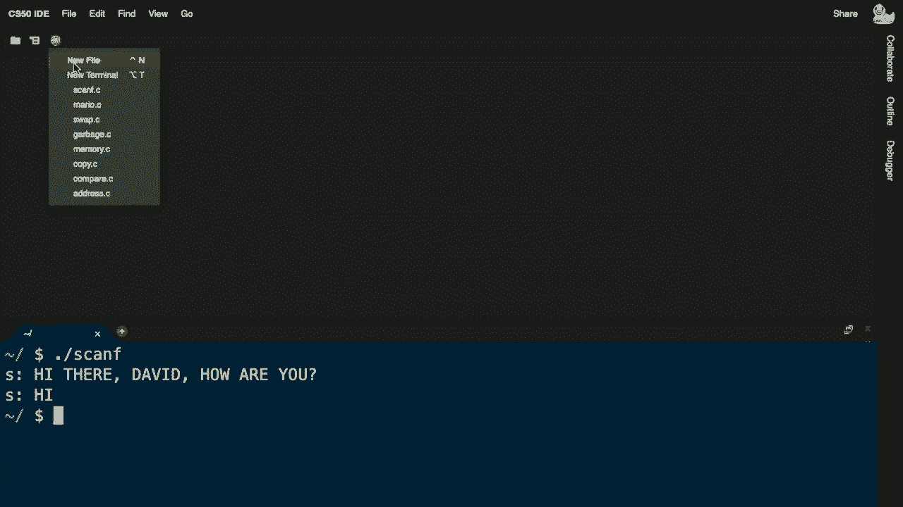

own program here a phone book program，numbers，in a file i'm going to go ah**d and。include just for convenience the cs50，library again because i don't want to，deal with scanf。i'm going to go ah**d and save this，incidentally as phonebook。c。i'm going to go ah**d and include not，just the cs50 library but standard io，and include。

string dot h as well and i'm going to go，ahead in my main function and i'm going。to use a few new functions that we'll，see only briefly here，but in the next problems that will you。explore these in more detail，i'm going to give myself a pointer to a，file it turns out。weirdly that in all caps f-i-l-e this is，a new data type that does come with c。

that represents a file so i'm going to，go ah**d and give myself a pointer to a，file。the address of a file and i'm going to，call the variable file i could call it f。i could call it x i'm going to call it，lowercase file，just to be clear and i'm going to use a。file open，and file open takes two arguments it，takes the first argument which is the。

name of a file you want to open，i'm going to open a file called，phonebook。csv and then i'm going to go，ahead and open it specifically in append，in different ways。to read them that is just look at their，contents to write them which is to。change their contents entirely，add，row by row to them so to keep tacking on。

more information to them i'm going to go，ahead and just to be safe i'm going to，say if。file equals equals null because recall，that null signifies something went wrong。let's just return now maybe i mistyped，the name of the file maybe it doesn't。exist something went wrong potentially，i'm going to check for that by saying if。

file equals equals null，just quit out of the program now but，a string。but we can call that char star now，called name and i'm going to ask the，user for a name。and we've done this before i'm going to，go ah**d and ask them for a number。phone number and we've done this before，the only difference now is i'm calling，string char star。

and now here's the cool part it turns，out if i want to save this name and，csv。if unfamiliar popular in the consulting，world the analytics world，it's just a spreadsheet a comma。in excel，or numbers or google spreadsheet i'm，going to go ah**d and not print。f but fprintf to that file，a string，name，and the number and then down here i'm，going to close。

the file so this is new fprintf is not，printf which prints to your screen。fprintf prints to a file so you have to，which is the，pointer to the file that you want to。send these new strings to，then you still provide a format string。which says hey fprintf this is the kind，of data i want to print，to the file and then you plug in the。

with printf，and then lastly we close the file so in，short this program would seem to prompt。a human for a name and number，and then it's going to go ah**d and，file。so let me go ah**d and make phone book，okay no mistake so far，dot slash phone book david 949。468-2750，okay let me run it once more even though，nothing seems to happen。

brian how about 617 495 1000，enter let me check my file browser here。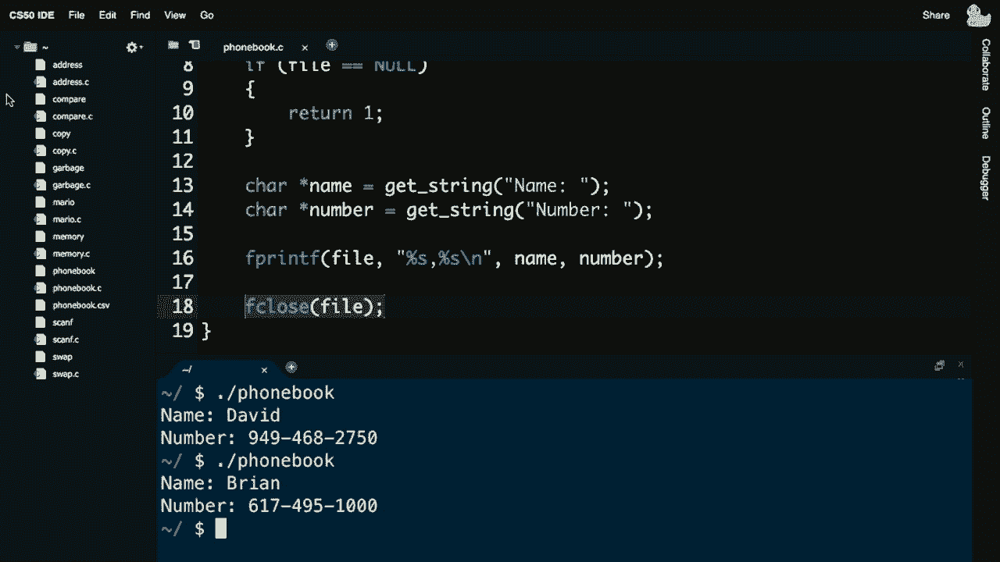

notice all of the files we've created，today including if i zoom in。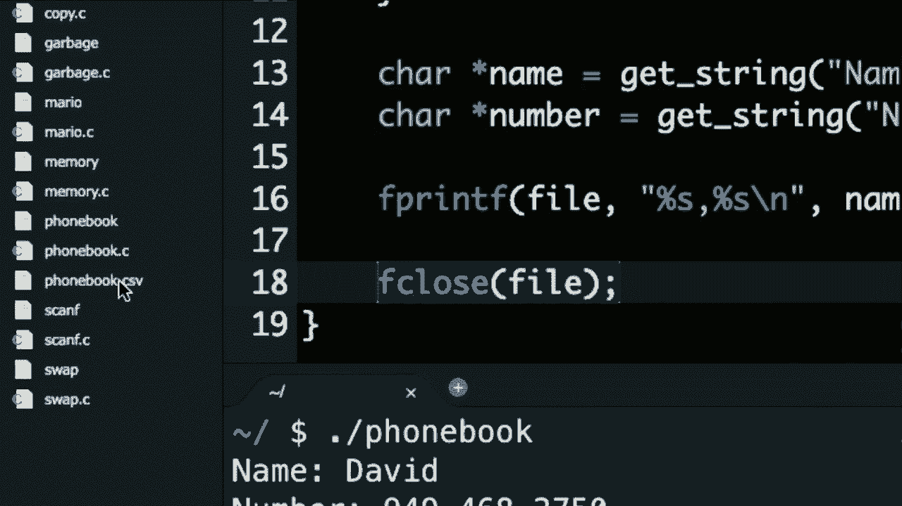

not just phonebook。c but phonebook。csv，and if i double-click that notice what's，inside of this。of our numbers，and even cooler than that let me go，ahead and close this let me go ah**d and。download this file。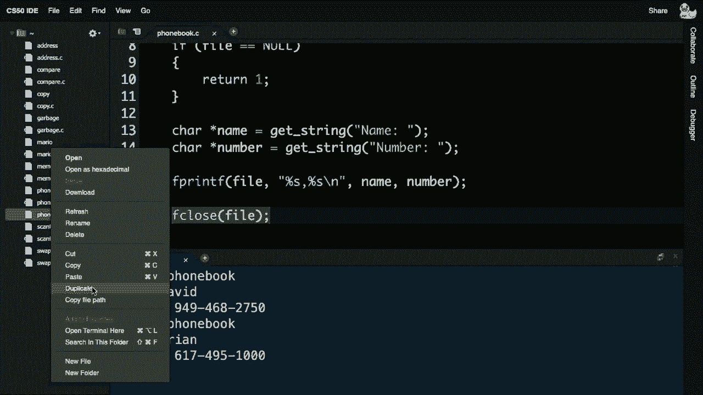

using the ide and that's going to put it，into my downloads folder let me go ah**d。and click on it and it's going to open。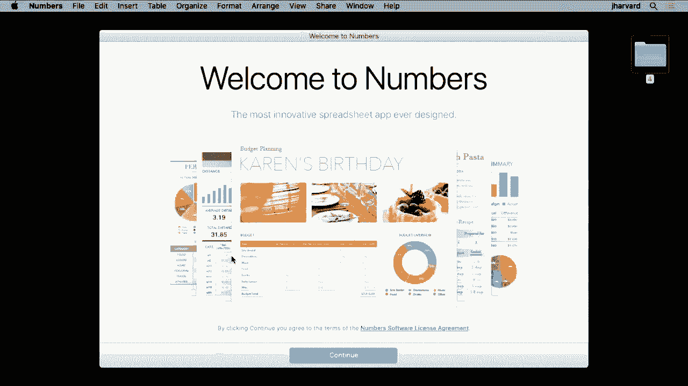

excel or numbers or whatever you happen，to have on your mac or pc。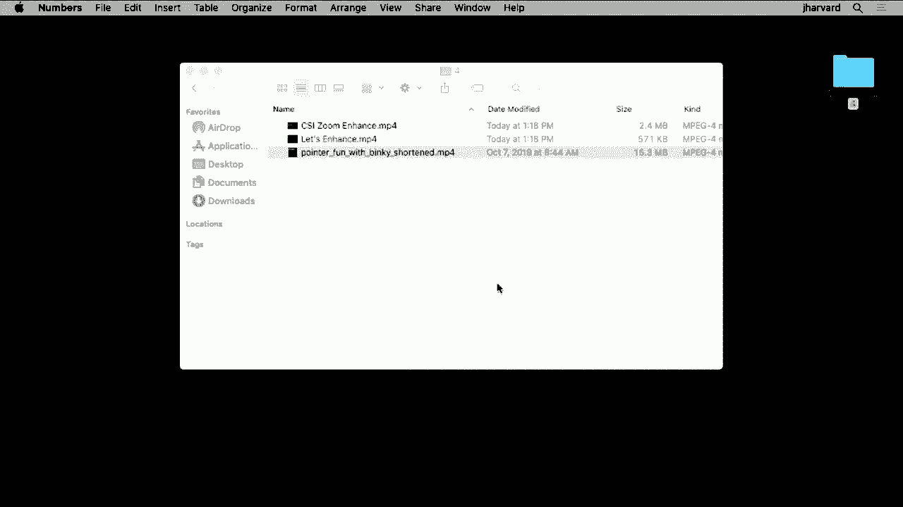

i'm going to go ah**d and just proceed，formatting here，but i've opened up a spreadsheet that i。myself generated using，f open fprintf and f close，so already now that we have pointers at。our disposal can we actually manipulate，things like，files which is quite cool but we're。but with actual，recall，this kind of thinking here if you glance。

at this it's probably pretty cryptic it，looks like machine code，but it's not this is perhaps the。simplest representation，of a smiley face inside of a file if you，have a bitmap。file a map of bits a grid of bits those，bits quite simply could literally be。zeros and ones and if you assign the，color black to zero，and the color white to one you could。

actually think of this same grid of。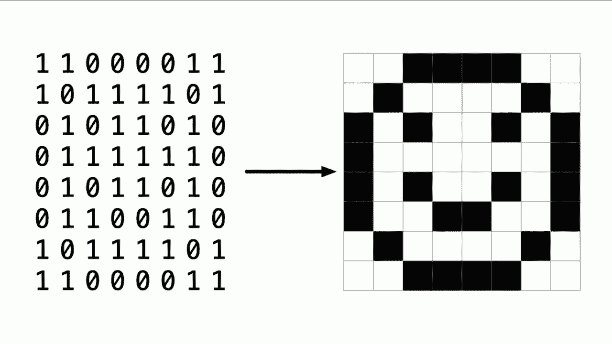

zeros and ones as representing indeed a，smiley face in other words。here are some pixels we talked about，pixels in week zero pixels are just the，dots that compose。a graphic file on your computer and，pixels are everywhere all of us now。tuning in live via zoom or youtube or，the like we're watching streams of，multiple images，at like。

20 something or 30 frames per second，images per second，now of course there's only so much。fidelity in these kinds of images，and it's quite common the case like on，tv and in movies like。if there's some bad guy that's been，picked up with some surveillance footage。or the like like invariably the folks on，kind of，enhance the video and zoom in and see，that reveals。

who who committed some crime well that's，all kind of nonsense and it derives from，week。zero in fact just to poke fun at this，let me go ah**d and hit play on a few。seconds of this tv show here in the u。s，called csi，just to give you a sense of just how。commonplace this kind of。

logic is we know。

that at 9 15 ray santoya was at the atm，so the question is what was he doing at。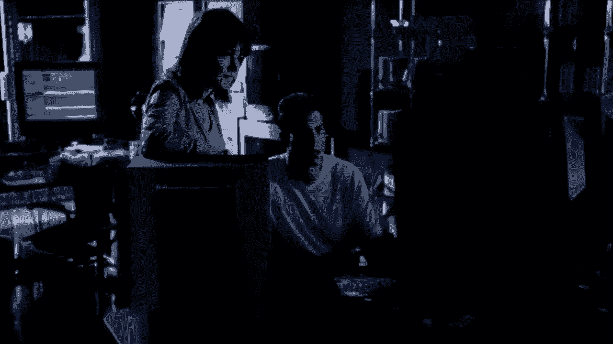

9 16，shooting the nine millimeter at。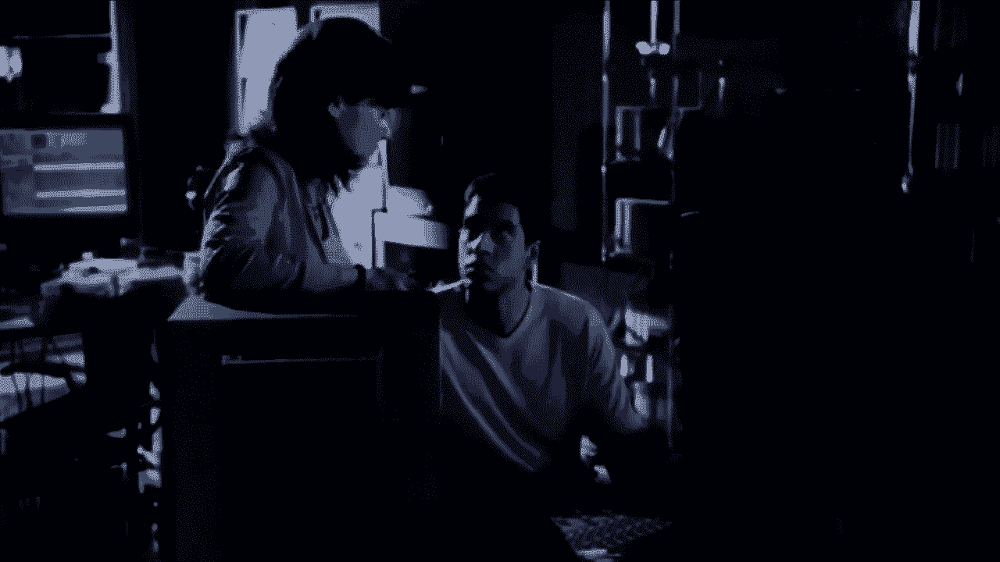

something maybe he saw the sniper，or was working with it wait。

bring his face up full screen，his glasses there's a reflection。

that's baseball team that's their logo。

that's baseball team that's their logo，and he's talking to whoever's wearing a，jacket。we may have a witness to both shootings。

so unfortunately today will rather ruin，a lot of tv and movie for you because。you can't just zoom in infinitely and，see more information if that information。is not there at the end of the day，there's only a finite number of bits and，brian。and you might see that oh there's a，glint in his eye let's see。

what was being reflected in his eye，there and so if we zoom in on this image，here of brian。and maybe we zoom in a little further，like that's all that's actually there。like you can't just click the enhance，button and see more，because at the end of the day these are。just pixels and pixels per week zero are，just zeros and ones and finitely many so。

so what you see is what you get now with，of this too，here let me just play one other short。clip from futurama which kind of hammers，home this point as well。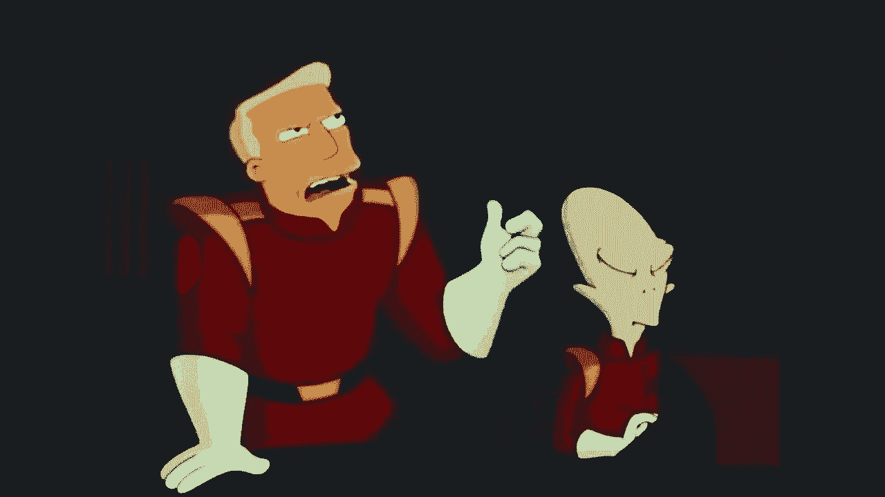

but more playfully so magnify that death，sphere。

why is it still blurry that's all the，resolution we have，making it bigger doesn't make it clearer。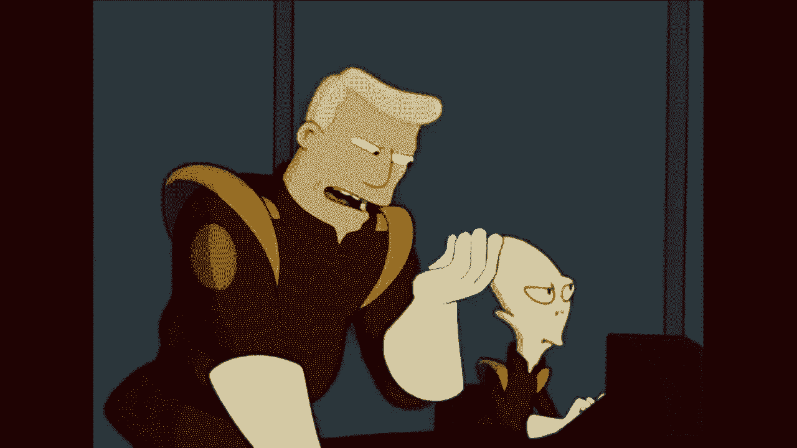

it does on csi miami，so there we have two clips talking，rather to one another but i have to。update things for 2020，right you can't really pick up the the，internet these days or。magazine these days if you even would，that doesn't somehow mention machine。learning and artificial intelligence and，fancy algorithms by，which you can do things that previously。

weren't quite possible and that's，actually kind of sort of the case you，might recall from week zero。that we found this beautiful um，watercolor painting in the harvard。archives that's only about like 11，inches tall total，and yet somehow it's 13 feet tall here。behind me now normally if you were to，just enhance this watercolor painting。

it would start to look pretty stupid，pretty quickly with lots and lots of，camera。as the archives do to capture the，original image but we wanted to blow it。up to 13 feet tall so that it would，whole time，some sense so，using long story short fancier，use。artificial intelligence machine learning，to actually analyze data。

and find patterns where there weren't，that aren't necessarily visible to the，original here。and start to zoom in it looks pretty，good at this resolution but it's pretty，that this was。paint on an actual canvas so this was，just zooming in on photoshop but when，through fancy。machine learning based software，improve it，and actually see not just this window。

from the top of one of the buildings，photoshop，you can start to see more detail so this，in photoshop。this is after actually applying fancy，artificial intelligence algorithms that。notice wait a minute there's a little，discoloration there wait there's a，little discoloration there。and nowadays enhance is increasingly，becoming a thing，it's still inferring it's not。

resurrecting information that was，guess really，algorithmically to reconstruct what the，further。you can perhaps see that this is really，starting to get blurry if you just use。photoshop and keep zooming in，but if you run it through fancy enough。algorithms and start to notice slight，to the human eye，we can enhance that even further and you。

can't do it infinitely so，and in some sense we're creating，information where there isn't。necessarily that information there so，whether or not these kinds of things。hold up in court is another question，but it can improve the fidelity of，us。to zoom in from 11 inches to 13 feet，instead so when it comes to manipulating，images ultimately。

we do have some programmatic，capabilities including this file pointer，like we just saw。and also a few other functions as well，and our final examples here will lay the，coming week。which is manipulate your very own，graphical files with a newfound。understanding of pointers and addresses，instance，i'm going to go ah**d and open up a，program here。

called give me just one second i'm going，to open up a program here，called jpeg。c。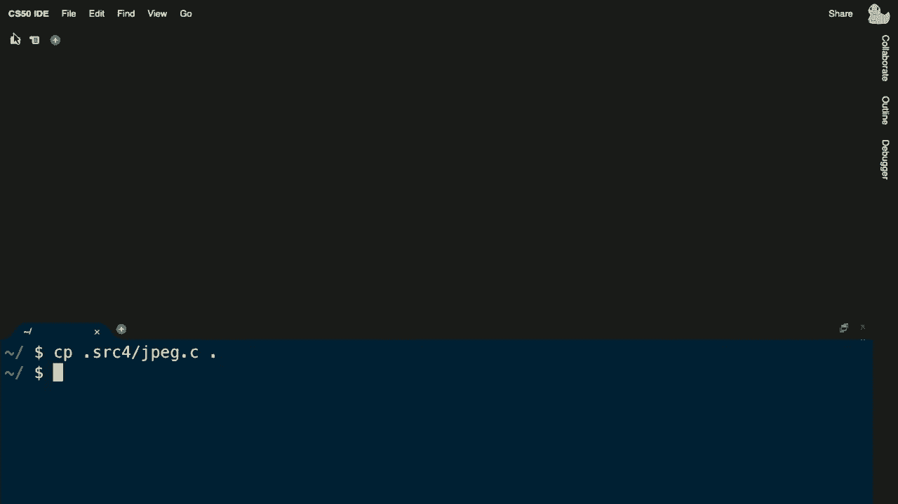

and this program jpeg。c which i wrote in，advance which is on the course's website，type。called byte it turns out in c there's no，common definition of what a byte is a。byte as we know it is eight bits，and it turns out the simplest way to。create a byte is to define our own just，like we've defined a string。

just like we've defined other types too，like a student，in order or a person rather in order to。code just，declares a data type called byte using，another more arcane data type called u。and a underscore t，but more on that in the problem set this，just did events something called byte。notice in this program i'm resurrecting，the idea from week two of command line，the user。

notice that i'm checking if the user，returning one，immediately to signify error in line 17。i'm using my new technique i'm opening a，file，using the name of the file that the。human typed at the command line，and this time i'm opening it to read it，with quote unquote r，so if。bang file that is if exclamation point，file or if file equals equals no those，mean the same thing。

i can go ah**d and return one signifying，an error，down here i'm doing something a little。clever it turns out，that with very high probability you can，determine if any file is a jpeg。by looking only at its first three bytes，a lot of file formats have what are，called magic numbers。at the beginning of their files and，these are industry standard。

numbers one or two or three or more of，them that is just commonly expected to。be at the beginning of a file so that a，program can quickly check is this a jpeg。is this a gif is this a word document is，this excel file，they tend to have these numbers at the。beginning of them and jpegs，have a sequence of bytes that we're。

about to see this line of code 24 here，as you'll see in the next problem set。is how you might give yourself a buffer，of bytes specifically an array。of three bytes this next line of code as，you'll see this coming week is called。f read f read as the name suggests reads，a file，and it's a little fancy to use but。

you'll get more comfortable with this，over time，it reads into this buffer its first。argument the size of，this data type the size of a byte and it，reads in this many。of those data types from this file，so again it's four arguments which is。kind of a lot from what we've seen，but it reads from this file three。

bytes into this array aka buffer，called bytes so this is just how you，file。but read it from it and then here notice，circle，if bytes bracket 0 equals equals oxf。and bytes bracket 1 equals ox d8 and，bytes bracket 2 equals ox。ff this definitely looks cryptic to you，but that's just because i looked up in，the manual for jpegs。

and it turns out that almost any j any，jpeg rather，must start with oxf oxd8 oxf。those are the first three bytes of any，jpeg on your mac your pc on the internet。there are always those three bytes it，turns out the fourth byte。further decides whether or not a file is，actually a jpeg but the algorithm for，simple。

if the first three bytes of a file are，those maybe you have a jpeg。but if you don't have exactly those，jpeg，and so what i can do here is as follows，in today's code。let me go ah**d and grab two other files，that i brought with me。and one happens to be a photograph again，uh give me one second i brought with me。

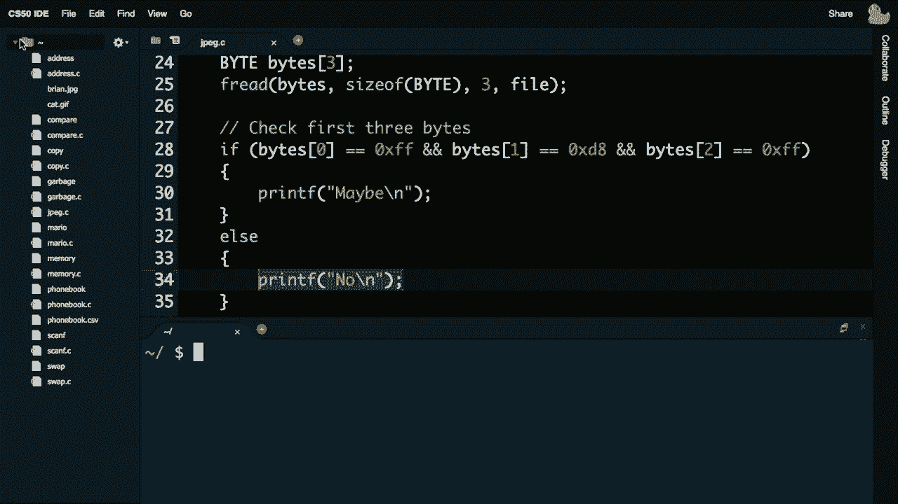

a few files，one of which is called brian。jpg which。

is the same photo of brian，and then i have a gif which of course is，not a jpeg。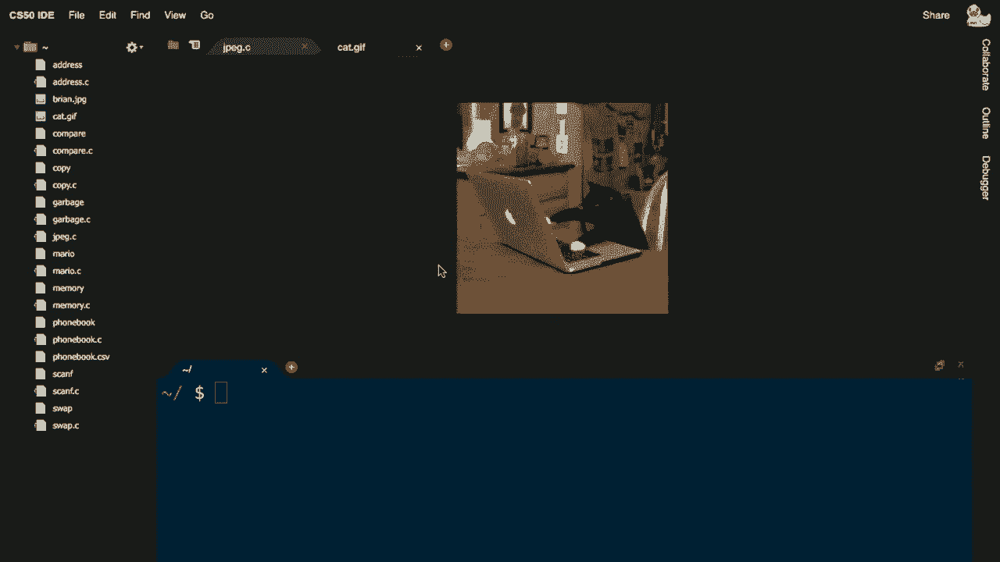

that is this cat typing here and what i，effectively have in front of me now is a。program that if i do make jpeg，because this profile is jpeg。c and i run，dot slash jpeg。i can type in something like cat dot gif，at the command line as an argument hit。enter and i should see no，the command line，as an argument i see maybe and again。

maybe only because the algorithm for，actually adjudicating whether something，than that。but indeed i can now access the，individual bytes and therefore，pixels it would seem of a fo of a。this，let me go ah**d and show you one last，program that we wrote deliberately in。advance just to give you a taste of，what's coming with the next problem set。

this program is a re-implementation，of the program you've probably used one，or more times called cp。recall that cp is a program in the ide，and in linux more generally that allows。you to copy a file you do cp，name，how does this work i now have all of the。building blocks with which to copy，byte up here，i'm defining main as taking command line。

arguments here and notice one change，i'm not using the cs50 library so even，what was previously。string in week two，is now char star even here for argv，i'm making sure that the human types in。three words the program's name and the，source file and the destination。file i'm using f open again i'm opening，the source file，here from arg v1 i'm making sure it's。

not null and then i'm quitting if it is，i'm then here's something new opening。the destination file here，also with f open but i'm using quote，unquote w i'm opening one file with r。one file for w because i want to read，from one and right to the other，and then down here this loop。another，i'm giving myself a buffer of one byte，so just a temporary variable just like。

brian's temp or empty glass，and i'm using this function f read i'm，reading into that buffer。via its address the size of a byte，specifically one byte，same loop。i'm writing from that buffer the size of，a byte specifically one byte。to the destination so literally the cp，program you might have seen me use or。

you yourself have used to copy files，is literally doing this it's opening one。file iterating over all of its bytes and，and then lastly，it's closing the file and these last two。examples deliberately fast because this，whole week will be spent，diving into file i o and images。uh thereof but all that you uh，all the all that we've done is use this，f read f open and f right。

and f close to manipulate those very，files so for instance if i now do this。let me do make cp okay seems to compile，dot slash cp。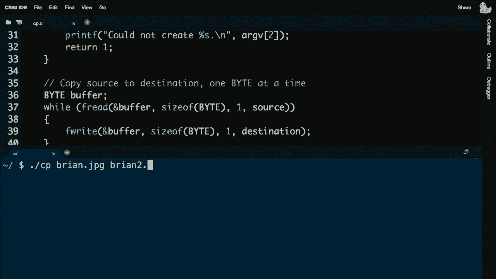

brian。jpg how about brian2。jpg，and hit enter nothing seems to happen，but if i go in here。we have a second。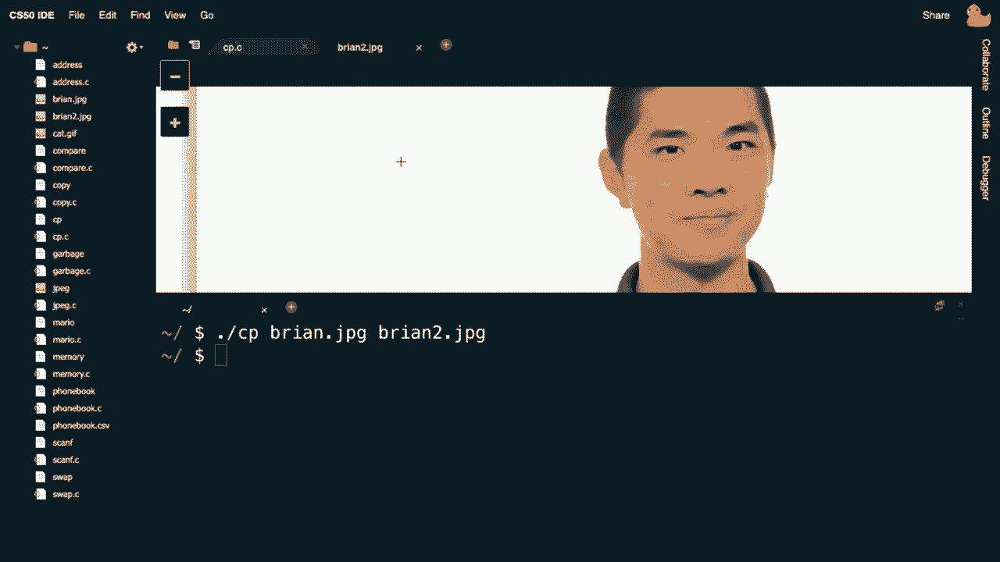

copy of brian's actual file so this，multiple，file formats for images the first is。jpegs and we will give you a so-called，forensic image，of a whole bunch of photographs from a。digital memory card，in fact it's very common these days，certainly in law enforcement to take。forensic copies of hard drives of media，sticks of phones and other devices。

and then analyze them for data that's，been lost or corrupted or deleted。we'll do exactly that whereby you'll，write a program that recovers jpegs that。have been accidentally deleted，from like a digital memory card and will。give you all copies of that memory card，by making a forensic image of it that is，camera。

and giving them to you in a file that，you can f read，and then f right from we'll also。introduce you to bitmap files bmps，uh popularized by the windows operating。system for wallpapers and the like，but we'll use them to implement using，pointers and using file io。your very own instagram like filter so，we'll take this picture here of the，week's footbridge。

here in cambridge massachusetts by，harvard and we'll have you implement a。number of filters taking this original，image for instance and，desaturating it making it black and。white by iterating over all of the，pixels top to bottom left to right。and recognizing any colors like red or，green or blue or anything in between。

and changing them to some shade of gray，doing a sepia filter making things look。old school like this photo was taken，many years ago，by similarly applying a heuristic that。alters the colors，of all of the pixels in this picture，we'll have you flip it around。so you have to put this pixel over here，and this pixel over there。

and you'll appreciate exactly how files，are implemented，you'll，which。no uh accident makes it harder to see，what's going on here，because you're starting to now average。other to kind of，make it harder to，see here and so even if you so choose。have you implement edge detection of，feeling more comfortable where you find。

the sort of edges of all of the physical，objects in these pictures。in order to actually detect them in code，and create visual art like this now this。was a lot and i know pointers are，generally considered to be among the。more challenging features of c and，certainly programming in general so if，you're feeling like。

it's been quite a bit it was but you do，now have the ability。either today or in the very near term to，understand even xkcd comics like this，there has seen。so our final look for you today is on，this joke here，you，moments，a very。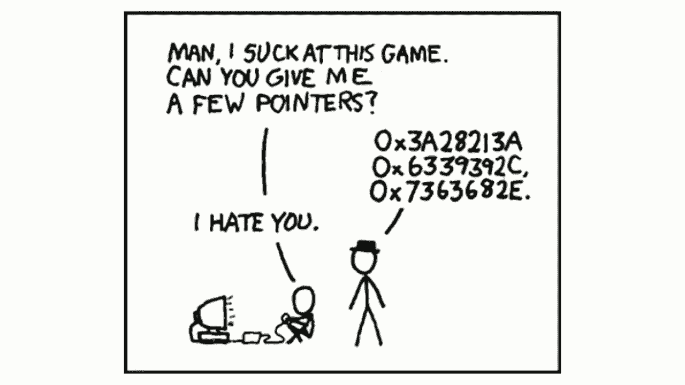

geeky laughter and i see some smiles at，least which is reassuring。this was then cs50 we'll see you next。