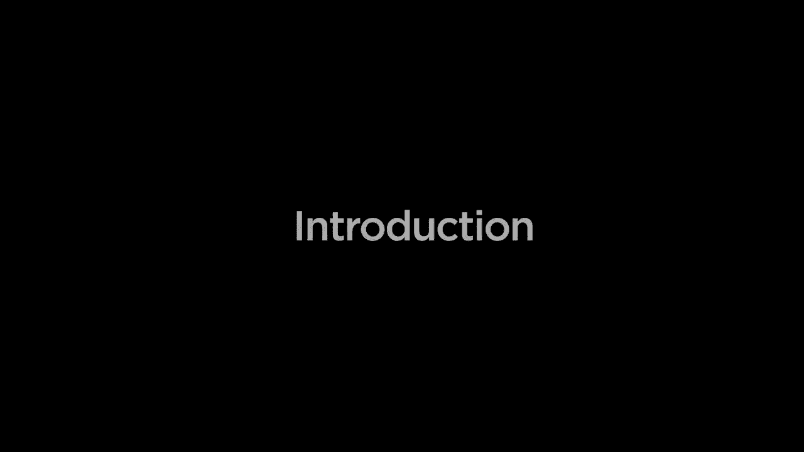
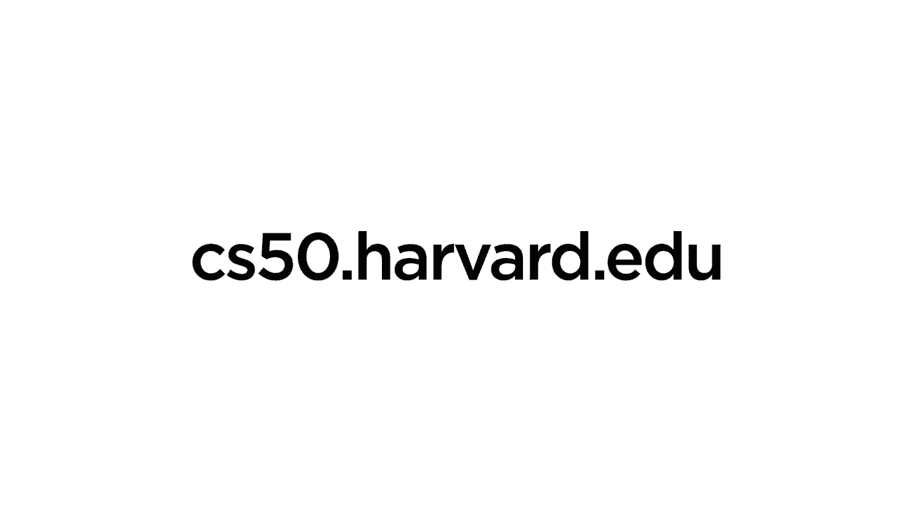

# 哈佛CS50-WEB ｜ 基于Python ／ JavaScript的Web编程(2020·完整版) - P1：介绍与入门 - ShowMeAI - BV1gL411x7NY

[音乐]。

你好，世界，这是CS50，这是使用Python和JavaScript的网络编程。与CS50区的布莱恩一起，这门课程将从CS50的基础上继续，深入探讨使用Python的网络应用的设计和实现，使用像Django、React和Bootstrap这样的框架。

首先，仔细查看HTML和CSS，这些语言可以用来描述网页的结构和样式，之后我们将介绍获取版本控制工具，以便跟踪我们对代码所做的更改，并允许多个人在同一项目中合作。

同时，之后我们将更深入地探索Python，探索这门编程语言的一些高级特性，特别是我们如何利用它创建动态网络应用，使用一种称为Django的网络框架，我们将充分利用Django，特别是它处理。

数据，与SQL模型和迁移一起，创建使用数据库的网络应用，以便创建交互式用户体验。之后，我们将更深入地探索另一种编程语言JavaScript，探索如何使用JavaScript创建动态和交互式用户。

界面，编写响应事件的代码，并根据某种用户交互操作网页，之后我们将探讨一些行业最佳实践，包括测试，以确保我们的代码按预期工作，以及持续集成和持续交付，以便我们能够。

快速进行更改，并在我们能够更新代码时部署这些更改，最后，我们将考虑可扩展性和安全性的问题，因为我们将我们的应用从个人电脑转移到网络上，让任何人都能访问，我们将讨论如何实现。

确保这些应用能够扩展，以及我们如何确保这些应用在安全方面的能力，沿着这条路，你将有机会通过构建你自己的网络应用来实践所有这些，这是CS50。
