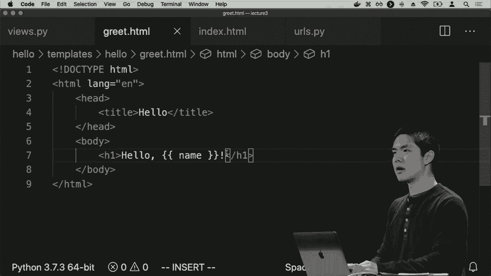
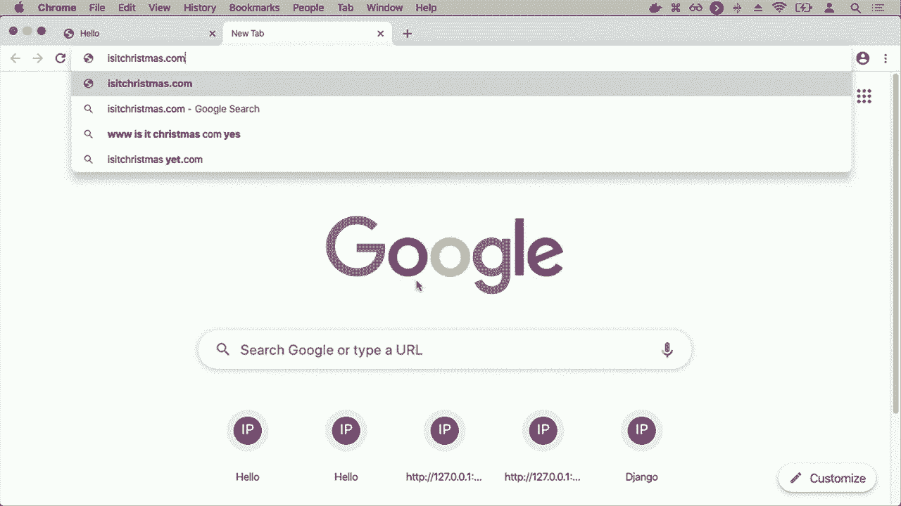
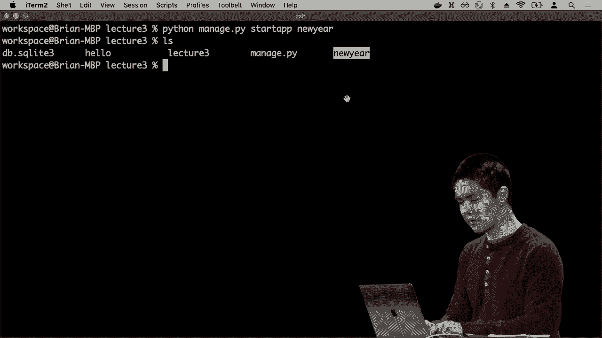
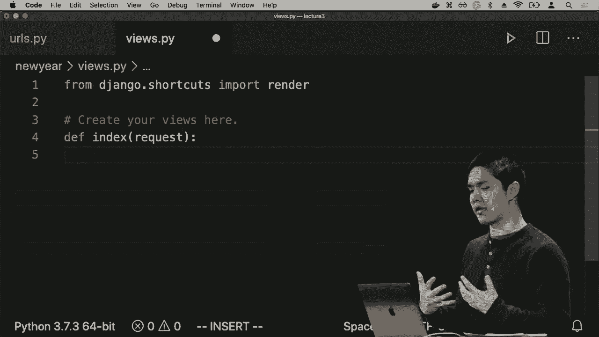
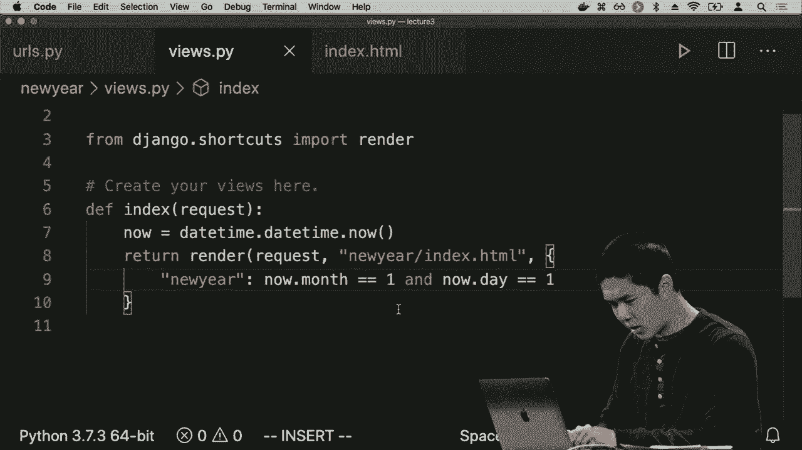
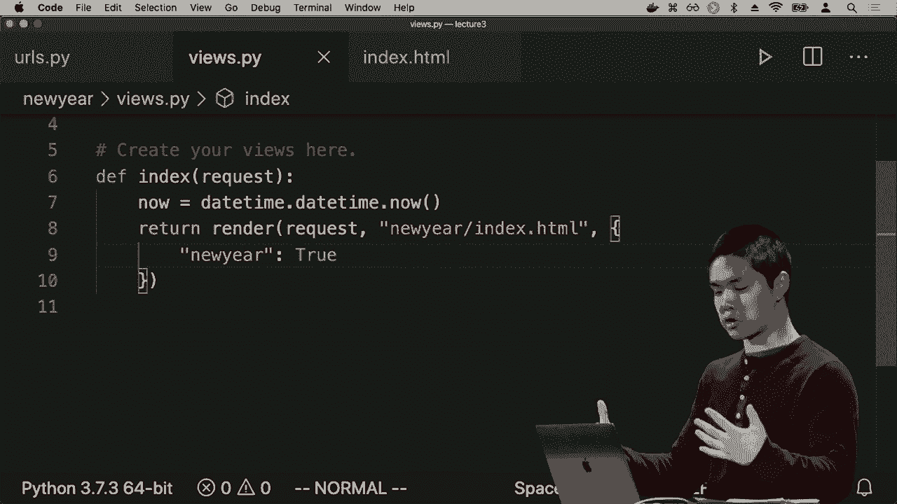
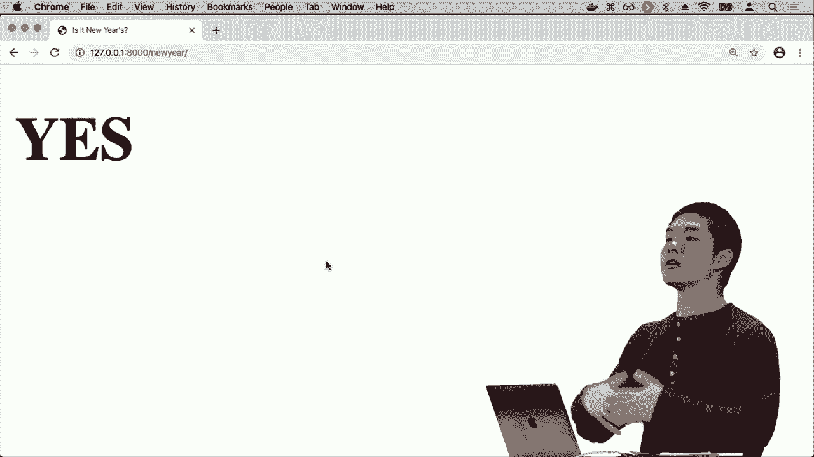
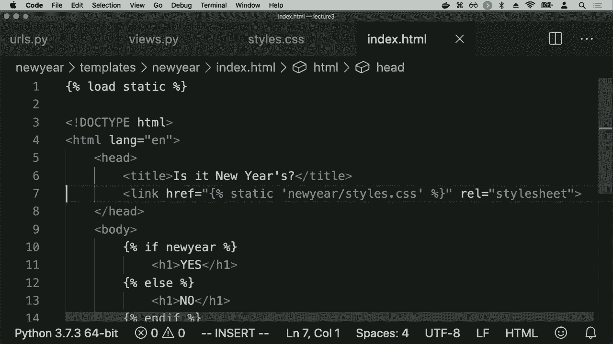

# 哈佛 CS50-WEB ｜ 基于Python ／ JavaScript的Web编程(2020·完整版) - P10：L3- Django网络编程 2 (模板) - ShowMeAI - BV1gL411x7NY

现在我需要做的就是创建那个模板，所以让我在hello目录内创建一个新文件夹，命名为templates。在这个文件夹内，我将创建一个名为hello的文件夹，因为模板名称是hello/index.html，所以我需要在里面创建一个名为hello的文件夹。

一个名为index的文件，HTML我可以简单称其为index而不加前缀。你好，但我们常常想要为模板添加目录名的前缀。这样做是为了给它们命名空间，以确保如果我们在多个不同的应用中有多个不同的index.html文件，可以确保它们不会互相冲突。

所以Django的最佳实践是使用hello/index.html或你的应用名称，并在那个hello目录内创建一个名为index.html的文件，这个index.html可以包含任何HTML内容，和我们之前看到的一样，所以我可以添加doctype，HTML标签，标题为hello，也许在body内我会。

有一个h1标签显示“你好，世界”，例如，所以我可以有一个完整的HTML。

就像这样，当我访问我的Web应用程序的默认路由时，通过返回到我的Web浏览器并访问/hello，例如。现在我看到的是我在hello/index.html中定义的HTML，它是一个大的h1标签，上面写着“你好，世界”，结果是这些HTML页面这些。

我可以使用Django渲染的模板也是参数化的，没错。也许我想实现hello/。

赫敏作为某种HTML页面，一个显示"你好，赫敏"的HTML页面。使用现成的HTML，你实际上无法做到这样的事情，HTML是一种标记语言，而不是编程语言，这意味着它默认不支持代表变量的功能。

某人的名字，但利用Django的能力将HTML页面视为模板，我们可以渲染，Django在现有HTML上添加了自己的模板语言，可以说，我可以利用这一点来渲染一个实际上包含变量或条件的HTML页面。

在其中或者在其中循环，就像我们稍后看到的那样。所以，让我们继续回到视图stop pie，我想更改的函数是这个greet函数，它现在只是返回一个HTTP响应，但我想渲染整个页面，例如，我可能会怎么做。

渲染，让我们渲染一个名为hello/greet.html的模板，然后这个render函数可以接受一个可选的第三个参数，称为context。context是我想提供给模板的所有信息，所有我希望模板拥有的变量。

访问和我可能想要的一个东西，我的模板可以访问的，例如名字，这里是一个Python字典，只是一系列键值对，这个名字可能与某个值相关联。因此，名字是键，我想要的值是名字的大写形式，那么。

现在，当我渲染这个模板`hello/greet HTML`时，我为这个模板提供了一些额外的上下文，一些额外的信息，由这个字典表示，我提供了一个键为名字的信息，实际上是给这个模板访问。

将一个变量名为名字，它的值是`name.capitalize()`。这个名字就是greet函数的参数，所以现在我可以返回这个模板，并在greet.html内部使用这个名为名字的变量。我该如何做到呢？好吧，首先让我们创建这个greet。

HTML文件，因此在模板的/hello目录下，我已经有了index.html，我将创建一个新的文件，名为greet.html。在greet.html内部，我将编写一些HTML，并在HTML的主体中，之前我可能说过“你好，世界”，我。

我不想说“你好，世界”，我只想说“你好”，无论名字是什么，包含在那个名为名字的变量中的内容。那我该如何做呢？

关于怎么做，我可以使用这对双大括号，双大括号是Django模板的一部分，这允许我说我想将一个变量的值插入到模板的特定位置。因此，如果我在这里包含单词名字，那么我想。

这里所说的是，当你在页面的主体中渲染这个greet.html模板时，我希望那里有一个h1，一个大标题，上面只写着“你好，{”。我在说在这里插入变量名字的值，他的名字是赫敏，如果是哈里，那么就是“你好，哈里”。

如果是大卫，那么就是“你好，大卫”。现在我们来试一下。现在当我访问 `/hello/Harry` 时，我看到一个大H1标签，上面写着“你好，哈里”。如果我访问 `/`。

你好 `/Ron`，我看到一个大的H1标签，上面写着“你好，罗恩”。所有这些发生的原因是，因为当我有一个URL，就像是某人的名字，我们会调用greet函数，greet函数内部的内容将名字作为一个。

参数渲染greet HTML模板，并将名字作为上下文的一部分传递，这样模板就能访问到。在`greet.html`内部，这里是实际的HTML文件，这里我们再插入。

变量名称的值，所以有很多不同的文件在运作，但这些不同文件的原因是为了帮助保持各自的独立性，有一个文件专门负责URL，并将人们引导到点击这些URL时应该发生的事情，然后我们有一个。

文件views.py完全负责决定这个特定视图应该渲染哪个模板，应该传递什么信息作为上下文，然后我会单独为每个HTML模板创建一个文件，说明页面的实际外观。

如果你开始考虑这个网络应用程序内部组件的分离，它可以帮助使Django应用程序的结构更清晰。因此，我们现在能够使用Django模板语言在HTML模板中放入变量，从而创建无限数量的。

不同的路由，我可以访问/hello/某个名字，以便向该人显示问候，但Django模板语言甚至比这更强大，还有很多附加功能，模板语言将为我们提供访问权限，我们将看一下。

现在开始，我将向你介绍一个你可能熟悉的网站。我认为它是互联网上最简单的网站之一，真实的网站叫做“现在是圣诞节吗.com”。

如果我访问“现在是圣诞节吗”，并按下回车，网站会说“不是圣诞节”，你必须相信我的话。如果你在圣诞节那天访问这个网站，它会说“是的”，所以这个网站非常简单。

你可能会想象，这其实只是一个HTML页面，可能包含一个大标题，这个标题在这种情况下仅仅说“否”，但在圣诞节那天则说“是”。那么，像这样的页面是如何实现的呢？一种可能的想法是，在圣诞节那天，维护网站的人会进入。

HTML将“否”改为“是”，然后之后再将“是”改回“否”。但如果我们意识到我们可以使用Python逻辑来做这一点，我们就可以更聪明一些，使用条件逻辑来决定网页最终将如何被渲染。

例如，条件可能是简单的逻辑，比如如果今天的日期是圣诞节，则渲染“是”，否则渲染“否”。因此，我们将使用Django，看看Django模板语法的一些特性，以便能够创建这样的一个网站。我们不会创建“现在是圣诞节吗”，而是。

我将创建的是一个新的应用，它检查当前日期是否是 1 月 1 日。这将是一个独立的应用，与我们的 Hello 应用有所不同。Hello 应用只是向人们打招呼，而新年应用则是检查是否恰好是新年。

现在继续创建一个新应用，我可以通过在 Python 管理中输入命令来做到这一点。`python manage.py startapp`，我将把这个应用称为新年，例如我想创建一个名为新年的新应用。我现在已经创建了这个新应用，如果我输入`ls`，你会看到我不仅有一个 Hello 目录，代表 Hello 应用。

我现在有这个新年的目录，表示这是一个新的。

名为新年的应用，与之前一样，我需要进入项目目录中的 `settings.py`，并将新年添加为一些已安装的应用。这现在是我网络应用中存在的一个新应用，所以它也需要成为一个新的已安装应用。对于新应用，我们还需要做什么呢？我需要进入 `urls.py`，为第 3 讲。

和之前一样，我有一个路径，表示当我访问 `/hello` 时，你应该去访问所有 Hello 应用的 URL。让我添加一个新的路径，表示如果我访问我的应用程序 `/newyear`，那么你应该去访问新年文件的所有 URL，转到 `newyear.urls`，代表新应用中的 `urls.py` 文件。

新年应用，现在这个文件默认没有给我们，所以我们需要创建它。我需要进入我的新年文件夹，创建一个名为 `urls.py` 的新文件。在这个文件中，我将从 `django.urls` 导入 `path`，从 `.` 导入 `views`，然后定义一些 URL 模式，与之前一样，我将有一个。

单一路径加载在 `views.py` 中的索引功能，并且它的名称是 `index`。再次反映我们在 Hello 应用中已经看到的结构，这个应用只会有一个路由，空路由加载索引功能，现在只剩下。

实际上要创建那个索引功能，所以我进入视图间谍，然后在这里。现在我将定义一个索引功能，它接受一个 HTTP 请求作为参数。在这个索引功能内部，我想添加一些逻辑来检查。是否是 1 月 1 日，那么我该如何做到这一点呢？

在 Python 中，事实证明有一个日期/时间模块，你可以通过阅读其文档了解它的工作原理。日期/时间模块。

让我访问关于日期和时间的内容，例如，我可以在 Django 之外玩弄日期/时间模块，以便感受它是如何工作的。如果我在命令行中输入 Python，实际上我得到的是 Python 解释器，它让我只需编写 Python 代码。

现在进行实验和测试，看看运行这段 Python 代码的结果是什么，我可以尝试像导入 datetime，例如，创建一个新变量叫 now，它是 datetime.datetime.now，恰好在 datetime 模块中有一个名为 datetime.now 的函数。

当前的日期和时间示例，因此在现在我可以访问像 now.dot year 这样的变量，举个例子，它告诉我年份，now.dot month 和 now.dot day 则提供关于当前***的信息，这些信息基于获取的当前时间。

你可以想象我们构造一个布尔条件来检查今天是否实际上是新年，这个条件可能看起来像 now.dot month 等于一，now.dot day 等于一。我可以按返回键，看到这个条件的结果是 false，它并不为真。

这意味着月份和日期都为 true 或者为一，因此通过使用这种条件，我现在可以将其适应到我的 Django 视图中。

用来尝试渲染是否是新年。那么我该如何做到呢？我希望我的索引函数返回渲染一个模板，这个模板将被称为新年斜杠索引点 HTML，然后我想给这个模板提供什么上下文呢？

那么，对于这个模板选项卡，我希望访问哪些变量呢？我想有一个变量，叫做 New Year，为了访问它，我需要获取当前日期，因此我会在文件的顶部导入 datetime，并在我的索引函数中给自己一个变量，叫做 now，等于 datetime.datetime.now。

我传递给模板的这个新年变量将等于 now.dot month 等于一，now.dot day 等于一，所以如果在运行 datetime.datetime.now 获取当前日期和时间后。

将结果保存到这个名为 now 的变量中，如果月份和日期都等于一，那么当模板访问它时，这个新年变量的值将为 true，否则像今天和大多数日子那样，该变量的值将为 false。

我们需要做的就是实际创建这个，但新年斜杠索引点 HTML，并以某种有趣或有意义的方式使用这个新年变量，那么我们该如何做到呢？如果你还记得我们在 hello 应用中所做的，当我们想要一个模板时，在我们的应用中，这个新年。

应用程序将需要一个新的文件夹，称为 templates，在其中我会创建一个名为 new year 的新文件夹，在里面我将创建一个名为 index.html 的新文件，这里将是此新年应用程序的 index.html 文件，结构将非常相似，我将给它一个标题，问它。

新年在主体内部，这里是有趣的逻辑，有时我可能想要一个大的 h1 说是，其他时候我可能想要一个大的 h1 说不，我需要做的是有条件地决定何时说是和何时说不，在 Django 的模板语言中，再次强调你只会。

我们可以通过阅读 Jana 的文档来了解这一点，就像我们使用双大括号插入变量值一样，Django 模板中的逻辑语法是大括号 %，所以我们使用大括号 % 一些逻辑语句，然后 % 大括号来包含任何类型。

逻辑，在这种情况下是一个 if 语句，这非常像 Python，我会说如果新年，New Year 是我传入这个模板的变量名，如果是新年，我想显示一个 h1 说是。

一个大的 h1 只是说不，所以如果是新年就说是，否则说不，并且 Django 还要求我给出一个 N 如果。

语句，不像 Python 本身使用缩进来表示 if 语句的开始和结束，在 Django 中模板中的缩进是可选的，但为了区分 if 语句发生的时间和 if 语句结束的时间，我们需要在最底部有这个 end if 标签。

所以这里是一个条件，在我们的 Django 模板中，我们说如果某个变量为真，则在 HTML 中渲染这个内容，否则渲染其他内容，如果是新年就说是新年，否则说不是新年，所以我们现在可以试一下。

路由 / hello / wrong 如果我不去 / hello，而是去 / new year 例如，这个站点无法访问，好吧，为什么会发生这种情况。

27001 拒绝连接，所以发生的情况是我的 Web 服务器出于某种原因没有运行，结果发现为了创建新应用程序我停止了 Web 服务器，因此如果发生这种情况，请重新启动它，我们可以重新运行 python manage。

pi run server 来说我想现在重新启动这个 Web 应用程序，好吧，看起来现在我又有一个错误，出现了一种语法错误，语法错误是 new year / views a dot PI，所以让我回去查看视图停止我和。

看看我能否找出语法错误在哪里，好的，似乎`render`是一个函数，函数参数需要用括号括起来，而我在这里有一个开始的括号，但忘记了结束的括号，所以我会继续添加它，现在这将完成`render`函数。

现在我应该能够加载`/new year`，事实上我看到的是，不，它不是新年，所以发生了什么呢，我们运行了一些Python逻辑，计算了当前的日期和时间，检查当前月份是否为一，当前日期是否为一，如果不是真的，那么我们在这里显示“没有”，如果我们看看。

这个页面的实际HTML，实际上构成了这个特定页面的HTML，我可以通过右键单击或控制单击，然后点击查看页面源代码来做到这一点，这将显示我这个页面的HTML，这是来自网络服务器的HTML，我的网页浏览器Chrome（在这种情况下）正在渲染。

你可以看到，它看起来与我们之前写的`index.html`模板非常相似，但它只包含“没有”，不包含任何if逻辑，也不包含“是”，它只包含我们想要返回给用户的HTML内容。

你可能基于此想象，Django实际上是在获取`index.html`模板，然后根据输入进行操作，我们基于是否是新年，那么在主体中我们应该做的就是显示一个h1标签，上面写着“没有”，而用户得到它时，他们并不会看到。

条件下他们看不到，还有另一条分支可以采取，他们只看到渲染模板的最终结果，无论是什么变量、逻辑和条件在这个渲染过程中，用户看到的只是“没有”，如果我们是。

在新年那天运行这个程序，它确实会说“是”，我们可以测试一下，只是看看如果那是这种情况会是什么样子，稍微作弊一点，而不是现在月份等于一和日期等于一，让我去替换这个条件为“新年等于true”，仅仅为了测试。

让我们尝试传入`true`作为新年的值，看看会发生什么，现在当我运行这个。

现在页面上确实显示“是”，正如我们在新年时可能期待的那样，这可以是一个很好的方法，仅仅测试一下如果你用特定的值替换特定变量会发生什么，我们可以在上下文中替换，仅仅出于开发目的，我们想要这个变量的什么值。

现在我们已经渲染了 HTML，但我们还没有为这个网站添加任何样式，实际上 Christmas.com 的文本是居中的，使用的是无衬线字体，而不是每个字符边缘的小衬线，所以我可能想要添加一些。

还可以向这个文件添加自定义 CSS，我们可以像之前看到的那样以传统方式进行，但只是简单地包含一个 CSS 文件，这就是我们仍然要做的，但 Django 有一个特殊的构建系统来处理所谓的静态文件，这些文件不会改变这个 HTML。

页面并不是一个静态文件，因为它会根据是否是新年而变化。如果我在新年访问，它会显示“是”，而在非新年时则显示“否”，所以这是一个动态页面，而静态文件则不会变化，比如我们的 CSS，无论是否是新年，CSS 都不会变化。

而且因为这些文件是不会变化的，Django 称之为静态文件，这意味着 Django 可以稍微聪明一些。如果你开始考虑项目和规模，你可能会把静态文件存放在一个单独的地方，这样可以方便访问并缓存以加快速度。

稍后我们将讨论得更深入一些，随着课程的进行，我们将开始探讨可扩展性等主题，当你开始在互联网上构建更大的 Web 应用程序时，但简单来说，Django 包含了很多让我们轻松处理静态文件的功能，这些文件不会变化，比如 CSS 文件。

通常我们添加静态文件的方式是在新年文件夹内，除了有 templates/New Year/index.html 之外，我们还会创建一个名为 static 的新文件夹，其中包含我们希望在此应用程序中包含的所有静态文件。

在 static 内，我将创建一个名为 New Year 的新文件夹，里面有一个名为 styles.css 的新文件，因此在 styles.css 内，我可以写下我希望之前编写的所有 CSS，也许我想要所有的 h1 使用无衬线字体，字体大小为 90 像素，并且文本对齐为居中。

一些 CSS 属性和值与我们之前看到的相同，只是我想给 h1 标签这个特定的样式，现在在 index.html 中剩下的工作是在页面的顶部添加一个命令，告诉它加载静态文件。

特定的 HTML 页面，现在我将链接一个样式表，你会记得在网页的 head 部分，这种命令是我想链接某个特定 URL 作为样式表的方法，这就是我如何将 CSS 添加到页面，而我将在这里包含的链接是。

与其硬编码一个 URL，我可以遵循 Django 的最佳实践，干脆说它将是一个静态文件，而这个静态文件名为 New Year/styles.css，所以我并没有具体指定 URL，但我说明这是一个在 New Year 文件夹内的静态文件，名为 styles。

CSS 和 Django 将会弄清楚这个 URL 应该是什么，这通常比硬编码一个特定的 URL 要好，因为你可能想象在大型 web 应用程序中，静态文件的位置可能会改变，你可能会将静态文件移动到不同的域或不同的路径，因此为了能够。

处理这个静态关键字仅意味着 Django 会找到你的静态文件的位置，并会在这里的花括号中替换这个命令。

用大括号和百分号符号替换此特定文件的实际 URL。所以现在我已经说明我想将这个特定的静态文件 styles.css 链接到这个网页上，我可能首先需要做的就是让 Django 加载静态文件，重启服务器，所以你可能需要控制+C，然后再去。

继续运行 python manage.py run。

服务器将重新运行服务器，现在如果我回到我的网页浏览器中的 /new year 路径，我会看到样式看起来更接近我实际想要的样子，居中，采用无衬线字体，字体更大，这里仅显示“没有”。如果我们查看这个页面的底层 HTML，我们可以看到。

Django 实际上为我们填充了这些特定静态文件的静态 URL，并且默认情况下。

Django 只使用 slash static slash，然后是任何文件，所以每当我们处理静态文件（例如 CSS 文件或后面课程中将要讨论的 JavaScript 文件）时，这通常就是它们的去处。

最终将链接到这个特定页面。所以现在我们已经看到了使用 Django 可以制作的一些 web 应用程序的例子，我们看到了 Django 中的 hello 应用，它可以根据访问的 URL 参数化 URLs，可以对布赖恩说你好，或者对大卫说你好，或者对其他人说。

我们已经看到使用 Django 添加一些条件的能力，可以有条件地判断如果某个条件为真则渲染此页面，如果另一个条件为真则渲染另一个页面。现在让我们使用这些功能加上一些额外功能，开始构建一个更复杂的 web 应用程序。

或者是类似待办事项列表的应用，我希望有一个 web 应用程序，可以给我一个任务列表，让我可以将新任务添加到我的待办事项列表中，并让我查看我当前列表中的所有任务，我希望逐步构建这个应用。所以我该从哪里开始呢，这又将是一个新的应用。

在我的 lecture 3 项目中，我目前有两个应用程序，一个是 Hello 应用，另一个是待办事项应用。还有一个我将称之为任务的第三个应用，这将是我的任务管理应用，所有这些都在这个 lecture three 项目下。所以我们将继续运行 Python men in shop I。

启动任务应用程序，我想创建一个名为 tasks 的新应用程序。每次我创建一个新应用程序时，都需要遵循几个步骤。请记住，我需要进入 lecture three 中的 settings.py，除了安装 hello 一个新年，我还想安装任务应用程序。

然后我需要进入 lecture three 中的 URLs.py，告诉它除了 hello 一个新年，我还想包括任务的 URLs。这个 URLs 再次是我整个 Web 应用程序的目录，其中如果我访问 slash hello，那么我们去任务的 URLs。

如果我进入任务的 URL，然后访问任务应用程序的 URL，这会告诉我所有不同的 URL，但我现在有访问权限。和以前一样，URL 文件没有在我的应用程序内为我创建，所以我需要进入任务目录，并在任务内。

我将继续在目录中创建一个新文件，我将称之为 URLs.py，这个格式将与我们已经从 Django 看到的非常相似。导入路径从点导入视图，现在我定义我的 URL 模式，我希望有一个路径，就是空字符串，空路径。

加载名为 index 的索引函数。例如，现在让我们实际编写这个 index 函数，在 used-up 内。我想定义一个名为 index 的函数，它接受一个请求，我想做的是渲染一个页面，显示我所有任务的列表，因此在我们开始之前。

添加任务的想法，让我们看看能否让程序显示一个任务列表。例如，我将在顶部创建一个全局变量，我会称之为 tasks，整个应用程序都能访问这个变量。现在我会先添加三个任务，我们将使用 foo、bar 和。

一些无意义的名称，仅仅是用于测试的有用字符串。将这些作为我可能想要在应用程序内的示例任务，现在我想做的是渲染一个模板，我想渲染的模板叫做 tasks/slash index.html，然后我将提供。

为它提供一些上下文信息，index.html 需要什么信息？index.html 需要访问我所有的任务，而我的所有任务就在这个变量内，而这个变量碰巧也叫 tasks。我们将在 Django 中经常看到这一点作为一种范式。

看一下键和值，它们看起来有相同的名称。键的区别在于冒号后面的内容，这就是值。这个是一个Python变量，像这个Python变量tasks。在左边，这个键字符串tasks就是变量的名称。

当Django渲染时，HTML模板将有访问权限，所以Django可以访问这个左侧的变量名，右侧有这个值。如果你看到这个范式，这最终意味着什么，而我现在需要做的就是创建这个indexed的HTML文件，并使其使用这个tasks。

变量怎么做，我该如何去做呢？我可以返回到我的tasks目录，创建一个新的文件夹用于我的模板，所以我将创建一个templates目录，其中有一个tasks目录，因为我正在渲染的模板是tasks/index.html，在tasks内部我将创建一个名为index的新文件。

html，里面将包括一些HTML，我将只包括标准的开始。HTML的标题将是任务，现在，我们将有HTML页面的主体。我想要在一个无序列表中显示所有任务，针对应用程序。如果你记得从HTML创建一个无序列表，它看起来有点像这样。

ul开始无序列表，每个列表项是一个li标签，像item 1，然后是item 2，再然后是item 3，类似的内容给我一个包含三个元素的无序列表，但我现在不想这样做，因为我不想硬编码或精确指定所有任务是什么。

我真正想做的是遍历这个任务变量，循环遍历其中所有任务，并为每个任务创建一个列表项。就像之前那样，我们可以在大括号内和百分号中使用if条件，同样我们可以使用for来表达某些内容。

像tasks中的任务一样，我想显示一个列表项，然后使用这些双大括号，我在说在这些列表项之间插入任务！

无论任务变量的值是什么，然后我将结束for循环。因此我在这里做的事情是，与之前看到的在模板中添加条件不同，我现在有能力在HTML模板中使用Django添加循环，表示对于tasks中的任务，我想循环遍历。

所有的元素在这个名为tasks的序列中，对于每一个单独的任务，我想在HTML中显示一个列表项，包含任务的值是什么，并且for像if一样在S语句中，for将结束for循环，因此这个语法现在。

与其每次给我完全相同数量的列表项，内容也完全相同，不如让它动态化，无论任务的值是什么，我们现在在这个页面上会看到每一个都是一个列表项，我们可以立即测试这一点。如果我通过运行`Python manage.py runserver`来运行这个应用程序，我将前往。

这个URL，默认的URL没有页面，但如果我去斜杠tasks，那么我看到的是一个无序列表，其中有foo。

bar和Baz每一个都是一个列表项，如果我查看页面源代码，看看实际的HTML是什么，以下是我看到的。我只在我的模板中写了一个Li标签，但因为我把它放在一个遍历每个任务的for循环中，所以最终返回给用户的HTML是一个。

列表项对应于原本在该列表中的每个元素。因此，我无法循环一个列表来生成任务列表，当然也没有办法修改这些任务。
