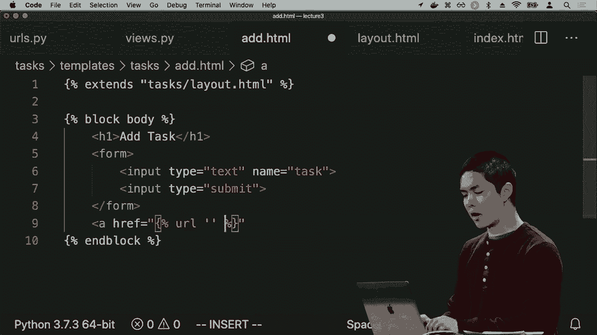
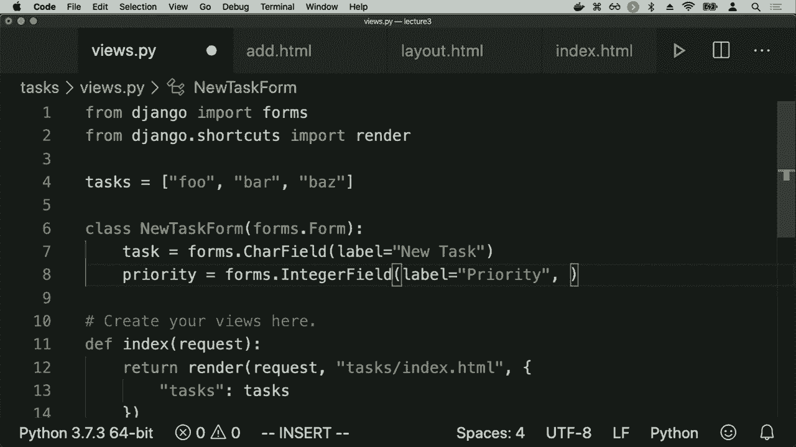
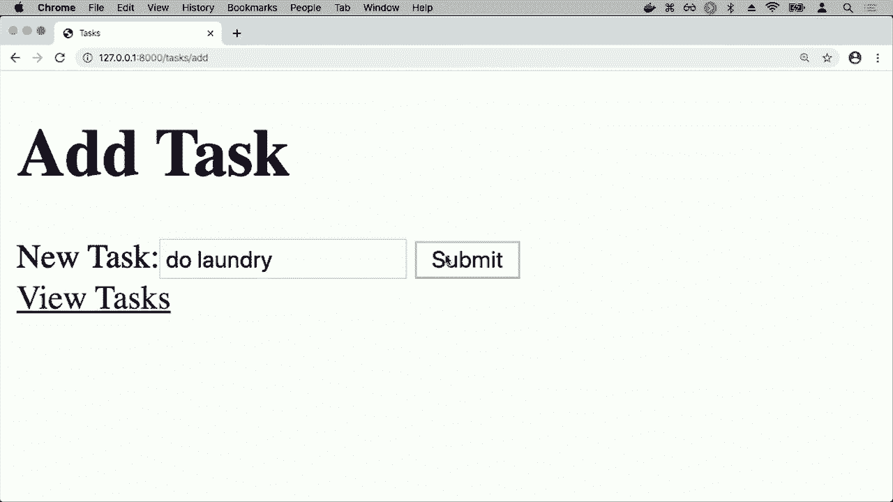

# 哈佛CS50-WEB ｜ 基于Python／JavaScript的Web编程（2020·完整版） - P11：L3-Django网络编程3（表单与session） - ShowMeAI - BV1gL411x7NY

这恰好是通过一个循环来渲染的，我可能希望有另一个页面，这样可以有效地让我添加新的任务，一个表单让我输入新任务并按添加以便添加新任务，所以我们在内部进行这项工作。

add函数将要做的是渲染tasks/add.html，以便知道何时运行，我需要给这个视图一个URL，所以我进入URL间谍并添加一个新路径，当我访问该路径时，我想去视图add函数，我将把这个函数称为add，例如，现在当我去。

斜杠任务/添加，将调用视图中的add函数，在这里将运行这个函数，渲染add.html，所以我们现在来写一个add.html，我们将进入templates，创建一个名为add.html的新文件，你知道add.html的语法。

与index.html的语法非常相似，就HTML内容而言，所以我将复制index.html的整个页面，粘贴到add.html中，唯一不同的是页面的主体，我们而不是无序列表。

列出所有任务的列表，而不是一个表单，这个表单有一个类型为文本的输入框，也许这个输入字段的名称叫做tasks，这样我就可以在后面访问这个输入数据，还有一个类型为提交的输入，例如，我可能会在顶部给它一个大的标题，比如添加。

例如，任务，所以现在我有一个新的路由来添加任务，我的默认斜杠任务路由只是显示所有任务的项目符号列表，如果我去斜杠任务斜杠添加，这里我可以输入任务，按提交，当前什么也不做，但我最终希望它能。

实际上添加一个新任务，当然，我刚刚做的事情应该让我们觉得不是最佳设计，特别是我做出的决定是因为这个HTML页面的总体结构是如此相似，它有HTML标签，有head，页面标题是任务，最终我只是复制了index的所有内容。

html并将其粘贴到这个新的HTML页面add.html中，每当你发现自己在复制粘贴时，这应该是另一个你开始思考的地方，可能有更好的方法来做到这一点，单纯用HTML时确实没有，如果我们想要多个不同的HTML页面显示。

我们需要在所有不同的页面上使用相同的HTML，但在Django的世界中，我们可以使用模板继承。现在我将定义一个名为layout的HTML文件，其他文件add.html和index.html将从这个文件继承。

它们将从我的布局中继承页面的所有结构，在这两个页面中都是相同的，而我需要写的只是页面之间的不同之处，正如我之前提到的，`add.html`和`index.html`之间唯一不同的就是页面主体的内容。

所以我现在能做什么呢？我将在我的`template/tasks`目录中创建一个新文件，叫做`layout.html`，布局将包含这两个页面共有的基本布局。我有一个标题，标题是tasks，我有页面的主体，也许这两个页面之间还有更多的共同点。

这些页面我也可以添加，但在这里，在body标签之间，这就是页面的主体，将在不同页面之间变化，所以在Django的新布局中，我将再次使用大括号和%来表示一个块，然后我会给这个块一个。

我会称它为body，因为它是页面的主体，但我可以给它任何名称，然后在底部添加一个end block，所以我在这个布局文件中所说的是，这个布局文件在页面的结构中有一个body，而在body内部有这个叫做body的块，我在这里说的是。

这个块可能会根据我们使用的文件而变化，比如`add.html`或`index.html`，结构的其余部分不会改变，但这个块的内容可能会改变，这个块称为body。

我可以去掉除了页面关键部分以外的所有内容，关于`index.html`，唯一不同的就是这个无序列表，而我现在在`index.html`顶部包含的是，我会说这个HTML页面扩展自`tasks/layout.html`。

现在这个模板继承的概念，我从`layout.html`模板中继承，基本上是说使用这个布局模板，除了在body块内部我想包含所有这些内容，也许我还会给它一个h1，标题就是tasks，所以现在`index.html`所说的是。

与其包含所有那些HTML，我只需要说这个HTML文件是基于`layout.html`文件，但不同之处在于在页面的主体中，它将是这个特定内容，而对于`add.html`我可以做完全相同的事情，我只需添加这一行扩展自`tasks`。

将`layout.html`放到`add.html`的顶部，然后我可以去掉所有这些模板代码。

只包含在页面主体内部不同的部分，所以看起来我们为这两个页面做了相当多的工作，但如果你想象更复杂的网站，它可能有几十个或上百个不同的页面，能够将HTML提取出页面间的共通之处。

这对于良好的设计肯定非常有帮助，以确保我们没有重复自己，如果我们需要更改结构，而不是在数十个或数百个不同的地方进行更改，我们只需在布局文件中的一个地方进行更改，其结果是，它将在每个继承该页面的页面中进行更改。

我们可以通过回到`/tasks/flush_atom`来测试这一点，外观良好，回到任务页面也看起来不错，这两个页面现在都继承了基本布局。现在有点烦人的是，每次我想在这个页面和另一个页面之间切换时。

添加页面，我必须访问URL，并知道我需要去`/tasks/ad`，以便来回切换。

在它们之间，我可能想添加一个链接，从一个页面跳转到另一个页面，反之亦然，如果我进入index.html，你可能想象我可以在这里添加一个链接，`a href`来创建一个链接，让我们去`/tasks/ad`，也许添加一个新任务，链接的名称除外。

问题在于，或者说原因在于，这种设计不一定好，因为Django的设计使得改变页面结构（在URL之间的关系）非常容易，而我在这里硬编码了，当你点击这个链接时，我们就去`/tasks/ad`。

每当我想更改那个URL，也许不是`/tasks/ad`，而是`/new`，那么我需要在两个地方进行更改。我需要返回到urls.py文件，更改实际的URL，说明不再是ad，而应该叫new，但然后我需要找到每个相关的地方。

如果我在其他地方使用那个URL，我也需要在那里进行更改。为了解决这个问题，Django有一个额外的功能，可以让Django自动判断应该使用什么URL，我们通过使用给每个路由的名称来实现这一点，所以这就是名称变得重要的地方。

我可以在这里直接说链接到特定的URL，链接到名为ad的URL，所以我只是说链接到名为ad的URL，Django是如何根据我的urls.py内容来判断的。

在我的urls.py文件中，我定义了多个不同的路径，并给每个路径起了个名字，这个叫index，那个叫ad，所以当我这样做时，我能够说，如果你链接到一个叫ad的URL，Django会找到一个名称为ad的URL，并直接链接到该路由。

将路由更改为其他内容，Django会自动判断新的URL应该是什么，我不必担心，Django会为我解决问题。现在如果我回到任务网站，我可以点击添加新任务按钮，这将带我到。

添加任务，也许现在我想添加一个可以返回的链接，以便我可以去 add.html，可能在底部添加一个链接，a href 等于，那个我想链接到的 URL 是什么。

我默认的页面仅名为 index，所以我会包含单词 index，我想链接到 URL index，然后可能将查看任务作为链接的名称，所以现在如果我只去默认的任务页面，我看到一个链接可以去创建一个新任务，现在我看到一个链接，将带我回到。

查看任务的能力，当我点击那个链接时，我看到了没有，这可能不是我想要的，我想回到我的任务应用的索引页面，但似乎当我点击查看任务时，我被带到了没有，并发生了什么。

如果你查看 URL，URL 是斜杠新年，不知怎么的，我在任务应用上，点击了一个链接，我又回到了新年应用，怎么会这样？原来这是一个命名空间冲突的例子，我有两个名称相同的东西，而在这种情况下，发生的事情是。

我有一个用于我的任务的 URL 间谍文件，应用程序中有一个名为 add 的路由和一个名为 index 的路由，但恰巧在新年文件夹内，如果我进入新年并查看新年的 URL 顶部，我的文件中的新年 URL DUP pi 文件也有一个路径，名称为 index，所以我所说的。

创建一个链接，我希望那个链接指向一个名为 index 的 URL，结果发现有多个名称为 index 的东西，因此 Jane Doe 不知道选择哪个，它只是选择了新年那个。你可以想象，在应用之间链接是。

有些事情你可能会合理地想要，想要 - 比如从亚马逊的购物页面能够点击一个链接，带你到亚马逊视频，或者从谷歌搜索能够点击一个按钮，带你到谷歌地图，但在这种情况下，这不是我想要的，有命名空间冲突。

有两个东西有相同的名称，我现在想修复它，修复的简单方法是在我的任务应用程序的 URL 中，让我给每个 URL 一个名为 tasks 的应用名称，这有助于唯一识别所有的 URL，因为现在在 .html 中，而不是仅仅。

关联到一个名为 index 的 URL，我在这里插入一张图片。

现在要改为链接到任务：索引，意味着从任务应用获取索引 URL，同样在 index.html 内部链接到任务：添加，以便从这个特定的应用名称获取特定的路由，所以现在如果我回到网站，回到我的任务页面，现在链接按预期工作。

我可以进入新任务，并且我可以返回我的所有任务列表，所以现在这部分工作正常。我知道有这两页，一页显示我的任务列表，一页显示我添加新任务的能力，但添加新任务的表单现在实际上并没有任何作用。我输入一个任务，比如 foo，如果我。

我想添加一个叫 foo 的任务，我按提交，但似乎什么也没有发生。

这个网站上没有什么有意义的变化，所以我希望这个表单能做点什么。我们已经看到可以为表单添加一个动作，以便将该表单提交到某个地方，这正是我在添加新任务时想要做的。我将为这个表单添加一个动作，当我提交表单时。

我希望将其提交到哪个 URL 呢？好吧，我会将其提交回任务的 URL：

我会将其发送回那个添加的 URL，当我提交表单时，我会给这个表单一个特定的请求方法，它的方法将是 POST。我们已经看到 GET 请求方法，每当你在 URL 中输入或点击链接以转到另一个页面时，如果与该请求隐式关联的请求方法被称为。

在任何时候你提交可能会改变应用程序内部某些状态的数据时，比如改变存储在应用程序中的任务列表状态，我们通常会使用一种不同的请求方法，称为 POST。

POST 通常用于提交表单数据，它不包含像 GET 请求那样在 URL 中的参数，正如我们在 Google 的例子中看到的。但这个 POST 的功能将让我们有能力通过不同的请求方法将数据发送到我的添加路由。所以现在我们来尝试一下。

我将去任务/添加，我看到可以添加任务，也许我会添加一个任务，比如检查邮件，然后按提交。好吧，我得到了一个错误。被禁止，这个 403 在括号中意味着，这是响应代码的返回。这是 Django 为我生成的错误，所以这个 403 如我们之前所见。

被禁止了，我出于某种原因没有权限去做这个，为什么我没有权限提交这个表单呢？

显示 CSRF 验证失败，所以 CSRF 代表跨站请求伪造。这意味着它是一种固有于某些表单的安全漏洞，如果它们没有以安全的方式设计，这意味着某人可能会使用自己独立的表单伪造对特定网站的请求。

例如在网站上，你可能会想象有人在另一个网站上可能会欺骗用户提交一个表单，将数据提交到我们的添加任务功能，这将新的任务添加到他们的任务列表中，也许这对任务来说不是大问题，但在更安全的上下文中可能会更敏感。

例如，银行可能在其网站上有一个用于用户之间转账的表单，如果他们易受这种攻击的影响，跨站请求伪造可能会使其他网站上的某人欺骗用户提交表单。

数据会发送到银行的网站，以请求从一个用户转账到另一个用户，因此我们希望设计出不易受到这种特定安全漏洞影响的表单，防止请求被其他网站伪造，那么我们该如何进行呢？

为了妥善处理这些攻击，可以采用一种策略，即在我们的表单中添加一个隐藏的跨站请求伪造令牌或 CSRF 令牌，这将是为每个会话生成的唯一令牌，因此每次不同用户访问时。

在特定的表单中，他们会看到不同的 CSRF 令牌，当用户提交表单时，他们将与表单一起提交该令牌，我们的 Web 应用程序将检查该令牌是否确实有效，如果有效，则允许表单提交。

这意味着对手无法伪造请求到我们的网站，因为对手并不知道生成的令牌是什么，因此他们会失败 CSRF 验证，而 Django 默认启用了 CSRF 验证。

Django 中间件指的是 Django 介入请求和响应处理的能力。如果我查看设置文件，如果你对这个特定的 Web 应用程序感兴趣，在设置文件中向下滚动，可以看到有一整套内容。

在 Django 应用程序中默认安装了一堆中间件，以确保我们有不同的功能挂钩到请求响应处理中，其中之一是 CSRF 视图中间件，这个 Django 的特性确保我们的请求是安全的。

每当我们通过 POST 提交数据时，这可能会更改应用程序的状态，因此我们需要进行 CSRF 验证，我们需要在表单中添加某种令牌，以确保 Django 能够验证此表单的有效性。

他们知道表单确实来自于 Web 应用程序本身，并且将这个令牌添加到我们的 HTML 页面中非常简单，Django 自带支持。

在花括号和 % 内，我们可以说，我想在这个页面中添加 CSRF 令牌，例如直接填充 CSRF 令牌。如果现在返回页面并刷新，我就可以看到广告任务，但如果我们好奇，可以查看页面源代码。

在这个页面内，现在有了表单，这与我们之前看到的表单相同，但你会注意到 Django 插入了这个额外的输入字段，这个输入字段的类型为隐藏，意味着我们通常看不到它，其名称为 CSRF 中间件令牌，这里是它的值，一串长字符。

Django 为我生成了这样的内容，当我提交这个表单时，它会检查以确保这个令牌是有效的，如果没有找到这个令牌，它将不会接受我的表单提交。如果其他人访问这个网站，他们也会看到一个不同的令牌。

这有助于确保没有人可以伪造这些请求。因此现在，如果我输入一个想要添加的任务，比如检查电子邮件并按下提交，现在论坛当然可以提交，而没有错误，但如果我返回我的任务列表，它仍然是空的，但至少我现在能够提交这个表单。

值得注意的是，在一个 HTML 文件中，我们几乎是从零开始创建这个表单。我创建了一个类型为文本的输入字段，其名称为任务，但创建表单在网页编程中是非常常见的，通常涉及许多不同的字段。

随着时间的推移，Django 添加了多种方式来简化创建表单和验证数据的过程，以便让我们在处理和交互时生活得更轻松。因此现在我们将探索一种替代的方法来完成相同的事情。

我们在这里所做的就是使用原始 HTML 创建一个表单，正如我们之前所见，但 Django 也有为我们创建表单的能力。因此为了做到这一点，我将进入 views.py 文件，并在顶部添加 `from Django import forms`，然后我要创建一个新的类来表示这个表单。

我将创建一个 Python 类，称之为 new_task_form，因为我们将用它来创建一个新任务。它将从 `forms.Form` 继承，而现在在这个类中，我需要定义我希望这个表单具有的所有字段，即我希望用户提供的所有输入。

因此，我希望他们提供一个任务名称，这将是一个字符字段，或者说是一个 char 字段，意味着我希望用户输入字符。我可以给这个字段一个标签，比如称之为新任务。现在，当我渲染 `add.html` 时，我可以添加一些上下文，并说让这个模板访问一个名为 `form` 的变量，这将是一个新任务表单。

我要创建一个新任务表单，将其传入这个 `add.html` 模板。现在在 `add.html` 中，不用手动编写类型为文本的输入字段，名称为任务，我可以只使用双大括号，并说在这里插入表单，这将自动处理，Django 会为我做好。

生成必要的HTML，使表单工作，所以如果我现在刷新这个页面，我看到这里是表单，Django。

为我创建了一个输入字段，给它一个“新任务”的标签，以便我知道这是新任务的输入位置，但现在不需要每次想更改表单数据时都去编辑HTML，我只需更改这个新任务表单，如果我想的话。

最终对我的应用程序进行升级，除了指定一个文本框让我输入新任务之外，也许我还想能够指定一个数字，表示这个任务应该具有的优先级。我可以额外给这个表单访问一个优先级变量，它是一个整数。

标签为优先级的字段，我可以。

甚至在这方面添加约束，以确保这是有效的数据。我可以给它一个最小值1和一个最大值10，例如，以添加所有这些。而现在不触碰我网页中的任何内容，我只改变了表单本身。

字段，我看到一个机会让我输入一个新任务，我看到一个机会让我指定一些优先级，当然你可以添加CSS来让这个看起来更好一点，但现在Django将自动进行客户端验证，如果我输入一个新任务，比如检查邮件，但。

我不指定优先级并提交，它会告诉我填写这个，如果我输入。

一个在无效范围内的数字，我只想要从0到10的两个数字。它填写了这个，这被称为客户端验证。服务器并没有收到任何这些数据，只是网页已经被编码以了解有效值，并将限制我。

确保我输入的内容符合这些值，但一般来说，当我们进行表单验证，确保表单是有效数据时，我们希望确保包含不仅是客户端有效，还有服务器端验证，我们还想在服务器上检查，以确保。

输入的值也是有效的，因为有很多原因我们可能想要这样做，一个原因是很容易禁用那种客户端验证，或者只是提交请求而不做任何客户端验证，也许如果用户查看的是旧版本的。

页面上，服务器进行的验证比这个客户端验证更新，Django的表单将使我们很容易同时处理这两种验证，客户端验证和服务器端验证。那么这怎么运作的呢？我们是如何做到的？

在 `add` 函数内部，这个 `add` 函数现在会根据请求方法以两种不同的方式被调用。如果我尝试通过点击添加新任务的链接或访问 `/add` 的 URL 来获取添加页面，我只想呈现一个新的空白表单，但如果我向其 `post` 数据。

这个页面通过使用 `post` 请求方法而不是 `get`，这意味着我正在提交表单，我现在想要提交一个新的任务以添加到我的任务列表中。因此，我想要添加一个检查条件，我将添加一个条件，说明如果 `request.method` 等于 `post`，那么这里是我想要做的。

这是请求结果的处理，在 Django 表单中实现这个的方法是创建一个新的变量叫 `form`，这将是一个新的任务表单。如果我像之前那样仅使用 `new task form` 及两个括号，那么它会创建一个空白表单，但你也可以用一些数据填充这个表单。

我用请求的 `post` 方法填充它，所要做的是请求停止 `post`。包含用户在提交表单时提交的所有数据。因此，我现在所做的是，我通过提取所有数据来创建一个表单变量，并将其填入这个新的任务表单中，这个表单现在将包含所有内容。

用户提交的数据，您可以想象手动检查这一点，但我可以直接调用 `if form.is_valid`，在这个 `if` 语句内使用一些逻辑，利用这个表单的清理数据。因此，在名为 `form.cleaned_data` 的变量中，这将让我访问到所有数据。

已提交的，因此如果我想获取他们提交的任务，因为我在一个新的任务表单中有一个名为 `tasks` 的变量，我只需访问 `form.cleaned_data`，然后 `task`，我会将其保存在一个名为 `tasks` 的变量中，现在我想做的事情是将这个任务添加到我的。

任务列表通过 `tasks.append` 方法添加这个新任务，所以如果表单有效，我们就这样做。如果表单有效，我们从表单中获取数据，获取任务，将其保存在一个名为 `tasks` 的变量中，并添加到我不断增长的列表中。但是如果表单无效，那又怎么办呢？

那我们应该怎么做呢？那么我应该再次返回 `add.html` 文件，但不是将表单提供回去，而是将新的表单提供给他们。我将把现有的表单数据返回给他们，以便我们可以显示可能出现的任何错误的信息。那么这是什么意思呢？

现在看看，让我们举个例子，然后我再回到代码中，你可以更详细地看到它是如何工作的。这里是任务/原子，记住如果我输入一个任务，比如检查电子邮件，优先级不在有效范围内，比如 11，并按下提交，它会说值必须小于或等于 10。但现在我们来想象一个情况。

客户端和服务器正在验证不同的内容，我可能已经决定，优先级从 1 到 10，现在只能从 1 到 5，这就是优先级的有效范围，但这个客户端仍然是页面的旧版本，所以它认为。

优先级为 8 仍然有效，它将通过客户端验证，但现在我按下提交，服务器将处理它，因为它无效，它会返回表单并给我一个错误，确保这是有效的。

值小于或等于 5，这就是为什么我们通常希望客户端和服务器端验证，以确保我们最终得到的数据将是准确的，并且将是干净的，符合我们在第一次创建表单时设定的任何规范。

因此，目前我们并不太担心优先级，因为我们真的只关心任务是什么，但请知道如果你想要一个包含多个字段的表单，你可以在这个表单输入中添加额外的字段。因此，我们为我们的应用程序逻辑添加了一些内容。

路由检查表单是否有效，如果我们看看 add 函数实际上在做什么，我们在检查请求方法是否为 post，意味着如果用户提交了一些表单数据，我们就会弄清楚他们提交的所有数据并将其保存在这个表单变量中，我们检查是否。

表单是否有效，他们是否实际提供了任务，或者他们可能提供了所有必要的数据，格式是否正确。如果是这样，我们就会获取任务并将其添加到任务列表中，否则如果表单无效，我们将继续并将相同的添加 HTML 文件呈现给他们，但我们传入他们的表单。

提交它，以便他们可以看到他们所犯的所有错误，他们可以对自己的表单提交进行修改，如果他们愿意的话。否则，也就是说，如果请求方法是。

如果用户只是尝试获取页面而不是提交数据，那么我们只会向他们呈现一个空表单，这种范式在处理请求和响应时其实是相当常见的，通常表单页面希望你首先。

能够通过 get 方法获取该表单，只是获取页面以显示内容，但这些路由通常也会支持 post 方法，你可以将数据发布到这些路由，以便说我现在想提交数据到特定路由以获得某种结果。

除了任务列表之外，转账，例如在银行中从一个账户到另一个账户，或者完全不同的事情，但看看如果我现在尝试在任务内部添加一个有效的新任务，比如检查邮件，会发生什么。

例如，我按下提交，好的。

并没有发生什么，因为我只是收到了这个新的任务表单，但是如果。

我回去查看任务，现在我看到检查邮件已被添加到我的任务列表中，原来的任务列表只包含fubar Baz，而现在我们添加了检查邮件，但这并不是我预期的行为。也许我希望在我提交任务表单后添加新任务。

喜欢被重定向回这个页面，对我们来说很简单，以便能够将用户从一个页面重定向到另一个页面。为此，在我们将新任务添加到我的任务列表后，我将返回一个HTTP响应重定向，并将用户重定向到一个特定的路由。我可以将他们重定向到类似于斜杠任务的地方。

例子，但我们通常尽量不在应用程序中硬编码URLs，因此更好的设计是让我给你路由的名称，并进行逆向工程得到路由的实际内容。因此，为此我们可以使用Jango内置的reverse函数，来获取tasks：

索引以找出任务应用的索引URL是什么，并将该URL作为我们最终重定向的URL，以便返回这个HTTP响应重定向。为此，我们需要导入这两个。因此，从顶部我会说从Jango HTTP导入HTTP响应重定向和。

Jango URLs 过去在一个导入反转，所以现在我已经导入了这两个，效果是，在我提交一个新任务并将其添加到我的任务列表后，我将被重定向回我的任务应用的索引页面，并且为了确保万无一失，我会先让我们从一个空的开始。

列表中去掉我们最初看到的foo bar Baz。因此，任务最开始是一个空列表，现在刷新页面，我看到这里没有任务。默认情况下，但如果我添加一个新任务，我输入类似检查邮件的内容，按下提交，现在我看到它被添加到任务列表中，我被重定向回。

在任务页面，我可以添加一个新任务，比如说做洗衣，按下提交。这将被添加到我的任务列表中，因此通过维护一个名为tasks的全局变量并在每次提交表单时更新它，我能够动态地增加这个任务列表，并展示所有内容。

这些任务在我的HTML页面中，但是应用程序仍然有一个大问题，那就是我将这些任务存储在一个全局变量中。这个变量是我和haier应用程序可以访问的，这意味着任何访问我网站的人。

将能够看到完全相同的任务列表，我们可以通过想象其他人访问来模拟。

我可以在Google Chrome中通过打开隐身窗口来模拟这个URL。

模拟一个不同的会话，一个与页面交互的不同人，访问相同的URL，在隐身窗口中访问相同的URL时，他们看到的就是完全相同的列表。

任务的显示使我和另一个人看到相同的列表，因为整个应用程序中只有一个任务变量，这个变量在所有进入该特定应用程序的请求中共享，这可能不是我在处理任务列表时想要的。

我想要的任务可能是按用户划分的，这样如果不同的用户访问页面，他们也会有自己的任务列表。因此，为了实现这一点，我们将在Django中引入会话的概念，或者更普遍地说，在网页上使用会话。

在后续访问中，它记住了你是谁，并知道你是谁。但更重要的是，它能够存储有关你特定会话的数据，能够存储你的用户ID或关于你的信息，或者在这个例子中，它能够存储你所有的任务。因此，为了利用这一点。

会话中，我们不再使用名为任务的全局变量，而是将任务存储在用户的会话中。因此，在索引路由中，我会包含这样一行，我会检查任务是否不在请求的会话中。

你可以将会话视为一个大字典，代表我们在会话中关于用户的所有数据。如果任务不在那个会话中，那我就来添加请求停止会话或会话任务，并将其设置为空列表。因此，我在这里做的是查看。

在会话中，我正在查看会话，看看该会话中是否已经有任务列表。如果没有，如果会话中还没有任务列表，那我想创建它。我想将请求会话的任务等于空列表，如果用户没有。

已经有一个任务列表，就给他们一个空的任务列表。

现在在任务中，不再渲染不再存在的变量任务，而是渲染请求会话的任务，以将任务列表传递给这个特定模板。现在在index.html中，我们仍然在循环访问任务列表，现在如果我返回任务。

我没有看到这样的表Jango_会话，所以这有点奇怪。这里发生了什么，没有这样的表Jango_会话？事实证明，正如我们将来看到的，Jango倾向于将数据存储在表中，而我们还没有了解这究竟意味着什么，或者如何进行操作。

如何与存储在表中的数据进行交互，但 Django 默认在一个表中存储关于会话的数据。现在你可以更改 Django 存储会话数据的位置，但最终 Django 保留关于你是谁和你的任务是什么的数据，这些数据需要被。 

存储在某处，默认情况下 Django 想要将其存储在一个表中，而现在这个表还不存在，因此我们需要创建它，而给 Django 访问该表的方法就是在终端中运行此命令。

Python 的 `pi migrate` 将学习更多关于迁移的意义以及将数据迁移到数据库中的含义，但目前要知道的是，Python 管理的 `pi migrate` 允许我们在 Django 的数据库中创建所有默认表格。下次我们将看看。

实际上，我们自己创建数据库，添加存储自定义数据的表格，但 Django 有一些初始默认表格需要创建，运行 Python 管理的 `pi migrate` 允许这些表格被创建。现在它们存在，我首先。

需要运行 Python 的服务器。

启动服务器后，我加载页面，现在这是我的任务列表，这里没有任何内容，因此当我循环遍历所有列表项时，它有点空，这可能不是最佳用户体验或用户设计，所以我可能想要添加一个额外的条件，结果在 `index.html` 中每当我有一个 for 循环。

在 Django 模板中，我也可以添加一个空条件，如果我运行 for 循环但根本不运行，因为序列是空的，那么我就说像“没有任务”这样的内容，这只是 Django 语言的一个附加特性，使我们能够更轻松地处理。

在迭代一个列表时，遇到该列表中没有任何内容的情况。所以现在我刷新页面，正如我预期的那样没有任务。

看，现在这个索引路由似乎工作正常，接下来需要改变的是什么。

添加新任务时，而不是将任务附加到我的任务列表中，让我直接说请求会话中的任务，因为那是我的任务列表。让我将这个新任务添加到请求的会话任务中，并将其添加到列表末尾，只包含这个新任务。

我从表单获得的，所以当表单提交时，我们检查表单是否有效，获取用户提交的任务，并将其附加到已存储在会话中的任务列表中，然后再将用户重定向回索引页面。让我们试试，回到之前的几步。

到任务我看到我最初没有任务，现在我可以继续添加新的任务类型，比如检查电子邮件，点击提交，现在已经添加了添加新任务，比如洗衣服。

提交，现在这两个任务都在那里，但现在重要的是，如果你想象一下，在隐身窗口或者在另一台计算机上访问相同的

web 网站回到此页面时，他们看到的是完全不同的任务列表，因为他们有不同的会话，这些会话是由 cookies 决定的，这些小手 *** 帮助浏览器能够向 Django 的 Web 服务器提供一些信息，告诉它这里是我是谁，这样 Django 就知道了。

要显示给你的数据是什么，在这种情况下，我的原始情况，Django 知道我是谁，知道要显示给我这些任务，在这种情况下是不同的用户在隐身窗口中，在这种情况下他们看到的是一个列表。

它根本没有任务，现在我们真的只是刮了一下表面，看看 Django 有什么可以提供的，但是我们现在看到它具有的能力是，能够创建动态的 Web 应用程序，而不仅仅是每次使用相同的 HTML 和 CSS 显示。

能够自动生成程序化的自定义 HTML 和 CSS，根据 URL 中提供的名称或者根据当前日期进行条件性显示，如果日期是一种而不是另一种，以及在会话中存储数据的能力。

基础是能够存储关于用户待办事项清单的信息，例如在后续访问中，他们可以看到他们需要做的事情清单，对于这些可能的用户，每个用户都有一个不同的列表，这里真的只是提供。当 Django 在存储数据方面变得非常强大时，这是它的一部分。

数据库并操作这些数据以及以各种不同的方式与这些数据进行交互，这最终是像这样的 Web 框架的许多强大之处，我们将在下次探讨更多内容，但现在这只是看一看 Django 以及我们如何使用它来能够。

构建这些类型的 Web 应用程序，这是使用 Python 进行 Web 编程和。
