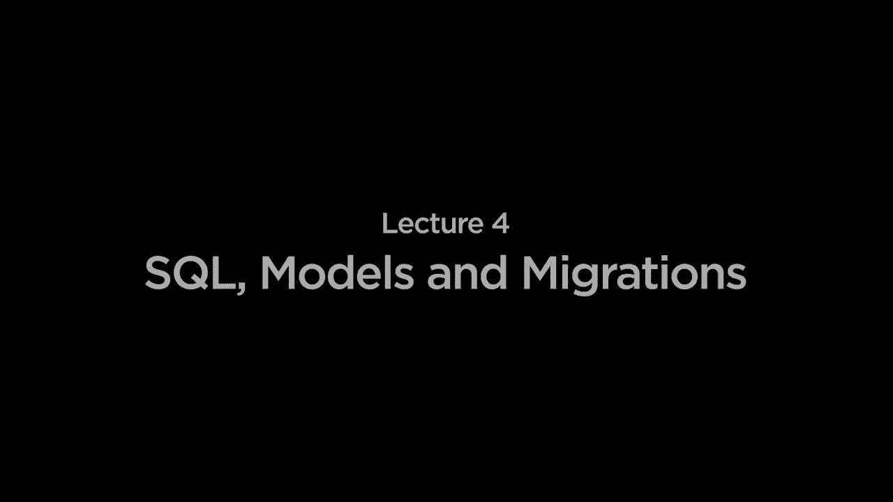

# 哈佛 CS50-WEB ｜ 基于 Python ／ JavaScript 的 Web 编程 (2020·完整版) - P12：L4- 数据库、SQL 与集成 1 (数据表与 SQL) - ShowMeAI - BV1gL411x7NY

[音乐]。

好的，欢迎大家回到 Python 和 JavaScript 的 Web 编程课程中。所以下一次我们看了一个用 Python 编写的新 Web 框架，叫做 Django，Django 使我们能够构建动态的 Web 应用程序，这些应用程序现在不仅能够展示。

每次向用户提供相同的 HTML 和 CSS，但要动态生成 HTML，以便用户能够与页面进行更动态的交互，例如在某个条件为真时仅渲染页面上的内容，我们正在循环遍历一个值的列表并显示一个 HTML。

对于每一个可能的值，Django 的强大之处在于，Web 应用程序会变得更加有趣，尤其是当我们开始深入数据的世界，尝试让 Web 应用程序将数据存储在数据库中。为此，我们将介绍一个。

今天我们特别要介绍几个主题，我们将引入 SQL 模型和迁移的概念，SQL 是一种数据库语言，我们可以用来与数据库进行交互，Django 将允许我们在 SQL 之上有一个抽象层，以便通过不直接编写 SQL 来进行交互。

通过与我们称之为模型的 Python 类和对象进行交互，迁移将是一种技术，使我们能够根据对基础模型所做的更改更新我们的数据库。因此，在深入更具体的 Django 内容之前。

让我们先讨论一下 SQL，更广泛地说，就是数据以及我们希望存储的数据类型。实际上，我们可以尝试通过多种方式在计算机系统中存储数据，但通常在数据库中，尤其是一种类型的。

被称为关系数据库的数据库，我们将在一个表中存储数据，每个表将有行和列。因此，今天我们将设想开始构建一个数据库和一个 Web 应用程序，例如航空公司可能使用的，用于跟踪各种。

不同航班的航空公司，并跟踪哪些乘客在这些航班上。因此，我们这里有一个示例表格，展示了你可能如何表示一系列航班相关的数据，这里我有三列，用于跟踪我可能希望记录的三条信息。

任何给定航班的特定航班，我可能想知道该航班的起点，哪个城市出发，目的地是哪个城市，以及持续时间，即从起点到目的地的时间，以分钟计的值。因此，这些列。

表示我可能想要跟踪的一个字段，每一行则代表一个个别航班。例如，这里有一行代表从纽约到伦敦的一次航班，这个航班恰好需要415分钟。因此，SQL将允许我们。

它将是一个数据库语言，旨在与关系数据库管理系统进行交互，这些数据库将数据组织到表中，每个表都有行和列，事实证明，有许多不同的数据库管理系统实现了部分功能。

SQL标准，这种语言的一些更流行的类型包括MySQL、PostgreSQL和SQLite，但还有其他的，每种都有不同的特性和适用场景，其中某些可能更适合MySQL和PostgreSQL，后者也称为Postgres。

更加复杂的数据库管理系统，换句话说，它们通常运行在其他地方的服务器上，许多大型公司会使用这样的服务器来存储数据并以某种方式在单独的数据库中表示它们的数据。这样做的目的是，您可能希望您的网络应用程序在一台服务器上运行，而希望您的数据库作为一个完全独立的进程运行。

使得它们可以独立运行，您可以独立调试和测试它们，如果一个崩溃，另一个不会崩溃。SQLite是一个更简单、更轻量的数据库实现。

SQL标准和SQLite将会做的是，不是一个完整的服务器，它将会监听请求并做出响应，而是SQLite将所有数据存储为一个单一的文件，因此我们将把SQL数据存储在一个SQLite文件中，这样会使得。

对我们来说稍微容易一点，因为我们刚开始写查询，向我们的数据库添加内容，并从数据库中检索内容。但请知道，许多相同类型的SQL语法在使用Django的默认SQLite时也会出现，这些语法同样适用于其他语言。

以及其他数据库管理系统。所以，当我们开始在SQL数据库中存储数据时，最终每个数据片段都有一个类型，就像在Python中，我们对各种不同类型的数据有类型，我们有整数、字符串、列表和元组等等。

SQL有类型，代表您可能想要存储在数据库中的不同类别的信息，每个数据库管理系统都有自己不同的类型集。例如，SQLite支持相对较短的基本类型列表，它支持文本类型。

像文本字符串，例如某个城市名称，可能是我们支持的文本，我们支持整数，只是0，1，2，3，4加上负数负1，负2，负3等，我们支持实数，实数不一定只是整数。

它们可以在小数点后有一些东西，比如2.8或其他可能包含小数的数字，然后数字是另一类数据，更一般地说是某种数字，像布尔值或日期。

例如，可能使用这种数字类型存储，它不是真正的整数或实数，虽然你可以将其表示为这样的其他数字类型数据，最后，blob表示二进制大对象，是你可能想要的任何类型的其他二进制数据，只是零和一。

将存储在数据库内部，因此，例如，如果你要存储文件，可能是音频文件或图像或其他类型的文件，你希望在数据库中跟踪这些文件，你可以在一个`sequel`数据库中存储纯二进制数据，所以这些现在是`sequel Lite`支持的基本类型。

但其他数据库管理系统，比如MySQL，支持更长的其他类型列表，除了支持任意长度文本的文本类型外，MySQL还有一种叫做char的类型，它接受一个大小参数，用于表示我想要的字符大小数据。

将存储在数据库中，你可能想象这在某些情况下会很有利，因为你知道你的数据将在某个字符数之内，因此，如果你在美国存储邮政编码，例如，美国的邮政编码可能只有5个字符。

因此，你可以为存储每个邮政编码分配5个字符的空间，为了效率的考虑，如果你知道最大长度，并且可以在数据库中固定该长度，那将是一个高效的选择，`varchar`的大小是相似的。

这是一个可变长度字符，如果某些内容不一定是确切的字符数，但可能达到某个字符数，你可以使用`varchar`来表示，你知道可能有时会少于字符，但最多可以达到一定数量的字符。

这也是一种权衡，还有各种不同类型的整数，因此不仅仅是单一的整数类型，而是small int、int和big int，每种都使用不同数量的字节来存储整数数据，因此如果你想能够存储更大或更小的数据。

对于数字，您可能需要一个更大的类型，比如`int`或`big int`，但如果您的数字相对较小，也许您只需一个小的`int`。同样，浮点数也有类似的权衡，就像在您熟悉的编程语言C中一样。

`float`和`double`类型，其中`double`使用更多的内存字节来存储信息。在这里，我们有`float`和`double`，它们允许我们存储可能是实际数值的浮点数，其中`double`允许我们以更高的精度表达一个数字。

比浮点数更高的类型可能是可以的，还有许多其他类型。但一般来说，即使在SQL中，就像在Python这样的语言中，我们为每种不同类型的数据都有类型，因此现在我们理解到每种数据都有类型后，我们想要。

我们要做的是能够在数据库中实际创建一个表，并且有各种不同的SQL命令可以在我们的数据库上运行，以执行各种不同的操作，而我们可能想要执行的第一个命令就是创建一个表。例如，我们该如何去做呢？

关于如何做这一点，事实证明创建表的语法大致如下。这是我们在SQLite中创建表示航班的表的语法。例如，我们以关键字`create table`开始，以表示我想创建一个新表。

在这个数据库中，接下来我给表命名。每个表都有一个名称，以便于引用，这里表的名称就是`flights`，接下来是括号中的以逗号分隔的所有列的列表，我还没有添加任何数据。

创建表的查询将决定表的结构，列有哪些，列的类型是什么。在这里我们看到，在每对用逗号分隔的子句的开头，我们有列的名称，所以我们有一个ID列，因为虽然我们之前没有看到这个。

在SQL中，通常会有某种方法来唯一引用表中的特定元素。您知道，也许从纽约到伦敦有多个航班，我想要一种区分它们的方法，一个简单的方法是给每个航班一个。

表中有一个唯一的条目，一个唯一的标识符或唯一ID，由这个ID列表示，这样我们就能确保始终唯一地访问某个特定航班，因此我们有一个ID列，一个起点列，一个目的地列和一个持续时间列。

列具有类型，因此这里的ID是一个整数，它只是表示航班的某个数字，从1、2、3、4等开始，而出发地和目的地则标记为文本。如果我们使用MySQL，我可能会将其设置为可变长度字符。

如果我知道某个城市的字符长度不会超过某个数量，我可以限制某列的字符数。此外，我有一个持续时间，这里是一个整数，表示航班所需的分钟数。

从出发地到目的地，在列的类型后，我可以为列添加额外的约束。因此，主键是整数，主键意味着ID将是我唯一识别航班的主要方式。

这里的优化使得通过航班ID查找航班变得非常快速，并且我不希望有一个约束，限制某一列始终为空。我不希望有航班没有出发地或目的地。

我可以为特定列添加约束，说明出发地、目的地和持续时间列不应允许为空。我希望始终有出发地和目的地以及持续时间，最后这个主键是自增的。

在后续中自动更新ID，每次添加新行到表中时。因此，如果我添加一个新的航班，我可以为航班指定出发地、目的地和持续时间，但我不需要担心给它设置ID，后续将自动处理这个问题。

新表中的下一个可用ID号将是新的行。因此，这里是通过给表命名，列出每列的名称和类型，然后是我们想要放置在这些列上的任何约束来创建表。

我可以为特定列添加多种不同类型的约束。我们之前见过的一个是默认值，它会为特定列添加默认值。主键我们也见过，唯一约束保证每个值都是唯一的。

如果要允许某列出现相同值两次，可以为特定列添加唯一约束。此外，检查约束可以用来确保某个值遵循特定条件，比如某个数字在特定范围内，例如电影评分。

例如，如果你在数据库中存储电影评分，你可能会关心确保这些评分在 1 到 5 或 1 到 10 的范围内，或你认为对数据库有效的任何范围，因此通过约束，你可以开始确保，当你向表中添加数据时，这些数据。

将在某种方式上有效，需要遵循特定的约束，否则如果你尝试将其添加到表中，根本不会被接受，因此自然引出了下一个问题，我现在有了所有这些不同的表，可以使用这些 create table。

命令，但是我实际上怎么将数据添加到这些表中，我们要用 insert 命令来插入数据到一个 SQL 表中，那么这个命令可能看起来像这样，通常我们会说 insert into，来说明我。

想要向一个表中添加新行，接下来我们提供表的名称，例如 flights。我要向 flights 表添加新行，并在表名后需要提供括号内用逗号分隔的所有列名。

我将提供值，所以在这里我说我想提供这次航班的 origin、destination 和 duration 的值，请注意我没有提到 ID 列，我不需要担心添加 ID 的值，因为我说过 ID 应该自增，它将自动分配。

下一个可用的 ID，以及我要提供什么值，好的，在值这个词后我再次在括号中提供一个用逗号分隔的所有值的列表，这些值将与那些列对应，顺序相同，因此 origin 是第一个，所以 origin 对应的是纽约，destination。

将对应于伦敦，duration 将对应于 415，因此这个查询让我可以从我已经创建的航班表中添加一些数据到该表中，所以你可以使用这些插入查询，一旦你有一个表，就可以在每次有新航班时向该表添加新行数据。

当航空公司出现时，航空公司可能在后台运行一个 insert into flights 命令，该命令将关于该航班的数据添加到表中，但当然一旦我们向表中添加了数据，我们理想情况下希望有某种方式来从该表中提取数据，但一旦我们在里面存储了数据。

我们想从数据库中检索数据，为此我们将使用一种特定类型的查询，称为 select 查询，select 的作用是从已经存在的表中获取数据，而不会修改表中的数据，它只是。

将检索可能在特定表中的数据，那么这些查询看起来像什么呢？最简单的查询可能看起来像这样，选择星号从航班中选择，从航班中选择意味着我想从航班表中选择数据，这个星号是一个通配符。

这意味着选择你可以的所有可能列，所以如果这是我的航班表，其中每个航班都有ID、**起点**、**终点**和持续时间，那么从航班中选择星号将选择所有的数据，所有的行和所有的列都会返回给我。

当我现在运行这样的查询时，可能会发生在我运行这些查询时，当我访问数据时，我并不**关心**所有这些列，尤其是如果我有一个列数远多于这个的表，也许我只关心特定的列，而这将是浪费。

查询数据库，请求返回比我**实际需要**的更多数据，因此我可以运行这样的查询，我选择而不是星号。我说选择**起点**，逗号，**终点**，从航班中选择，所以我再次从航班表中选择所有的行，但区别在于。

而不是选择星号，这意味着选择表中所有的列，选择**起点**，逗号，**终点**，意味着我只会选择这两列，**起点**列和**终点**列，所以这里以蓝色突出显示的是如果有人约束返回给你的列时，将返回的数据。

现在运行这个特定的SQL查询尤其重要，因为表开始变得更大，并且行数越来越多，这里我只有六行，但你可能想象一下一个有成千上万甚至数百万行的表，你可能不想每次都返回每一行，所以就像你可以。

同样，你也可以在执行查询时约束返回给你的行，因此我可以说类似于选择星号从航班中选择，条件是ID等于三，这再次读起来非常像英语。我说从航班表中选择所有的列，但不是所有的行，我只想选择。

只有当这是一个SQL关键字时，ID等于三，ID是一个列的名称，三是值，它将仅在这个表中查找，找到ID等于3的航班，结果我只会得到那一行，它找到那一行。

具有ID为3的航班，它将返回给我，如果我说选择星号从航班中选择，条件是**起点**等于纽约，我可以看到我不仅需要在主键ID上过滤，我还可以在任何其他列上过滤，我可以说给我所有起点是纽约的航班，所以所有离开的航班。

从New York，你可能想象在New York的机场，他们可能需要某种查询来查找所有从New York出发的航班，以便在某种屏幕上显示该机场的所有出发信息，因此你可以运行这样的查询。

只获取数据库中这个表里具有某个Origin的行，比如说New York。让我们看看如何在SQLite数据库中运行这些查询。为了创建一个SQLite数据库，这实际上只是一个文件，我可以开始。

通过创建文件，终端中有一个命令叫touch，可以为我创建一个全新文件。我将创建一个名为flights.sql的文件，它将是一个SQLite数据库文件，默认情况下什么都没有，但假设你已经安装了SQLite，我可以运行SQLite 3。

现在我在SQLite提示符中，我可以开始写将在SQLite数据库上执行的命令。我可能会做的一件事是创建一个名为航班的表，这个表我希望有一个ID列，它是一个整数，应该是主键，主要用来识别一个。

航班，我想自动递增它。我还希望航班表有一个Origin字段，这将是一个文本字段，它是未知的。我还会添加一个目的地字段，也是一个未知的文本字段，最后我将添加一个持续时间字段，它是一个整数，也应该是未知的。

我将以一个结束括号和一个分号结束，按回车键执行该命令，我现在已经创建了一个名为航班的表。要验证这一点，在SQLite提示符中我可以输入.dot tables，这将显示我数据库中当前存在的所有表。

恰好我有一个名为航班的表，当然这个表里什么都没有，我可以通过运行select star from flights来验证，意思是获取航班表中的所有数据。如果我按回车，好的，什么也没发生，我没有看到任何数据，这里没有数据，但现在我。

我可以说插入到航班中，然后我将提供括号内的列名。刚才的幻灯片上我展示了多行，这只是为了视觉效果，这些命令完全可以在一行中完成。因此我可以说origin、destination和duration。

然后提供值，我可以说添加从New York到London的航班，并且我希望这个航班的持续时间是四百一十五分钟。我输入那个命令并按回车，这会向我的航班表中添加一行新数据，我可以通过运行select star from flights来验证这一点，我看到现在我有了这个。

表的ID为1，这就是从纽约到伦敦的ID列，持续时间为415。因此，我可以再次执行一系列插入查询，以给我们提供更多的数据，每一个都是不同的插入查询。

我将向我们的数据库中添加一条新航班记录，所以我将复制这些，然后在数据库中粘贴所有这些插入命令，以将大量航班插入到这个数据库中。现在如果我运行“从航班中选择所有记录”，我得到的是所有的航班，而这并没有格式化。

SQLite特别好用，有一些额外的技巧，如果你想把它格式化得更好，我可以说将其放入列模式，并给我一些标题，是的，标题是的，现在如果我。

从航班中选择所有记录，数据被组织得更整齐。

事物被真正放入列中，并且每行都有它们的标题，我可以看到，好的，我有一个文本基础的表示，显示了我刚刚图形化展示的内容，在我的航班表中，我有四列，ID列、出发地、目的地和持续时间，每个航班都是。

这是这个表中一行，现在如果我想执行额外的选择查询，比如从航班中选择所有记录，其中出发地等于纽约，那么我只会得到出发地是纽约的航班，而不是所有航班。

因此，我可以非常快速地过滤这些数据，只获取我实际关心的信息，还有其他与SQLite交互的方式，但这个SQLite提示是一个非常直接的方式，可以快速编写查询并查看查询结果。

结果显示，我们可以运行其他类型的查询。因此我们会看看其他一些查询，我们不只是需要说某个东西等于另一个东西，其他类型的布尔表达式也是被允许的。

我可以说类似于“从航班中选择所有记录，其中持续时间大于500”，这里的想法是，我们来看一下持续时间列，它是一个整数，因此我们可以对这些值进行算术运算。我可以取一个值，看看它是否大于500。

我获取的是所有持续时间大于500的行，因此我可以开始查询，不仅仅是一个值等于另一个值，还可以进行其他类型的比较，就像在Python中，当我们有布尔表达式时，我可以将多个表达式结合在一起，使用类似的词。

和' 或者' 的续集在它自己的查询语法中也有相同的类型，我可以说类似于 `select star, from flights where duration is greater than 500 and destination equals Paris` 的话，正如你可能逻辑上直觉到的，这意味着获取所有前往巴黎的航班。

持续时间超过 500 分钟，结果发现这个表中只有一行满足这两个约束，当然，我可以使用 or 来获得不同的查询，现在我在寻找所有持续时间超过 15 分钟或超过 500 分钟的航班。

目的地是巴黎，所以只要满足其中任何一个条件，我将获得结果，因此当我得到结果时，有些行的目的地是巴黎，有些行的目的地在巴黎，但持续时间超过 500 分钟，当然任何满足条件的行。

这两个约束特别是航班 ID 编号 2，当我在这个表上运行这个特定查询时，会得到结果。此外，我还可以执行其他类型的查询，所以我可以说类似于 `select star from flights where origin is in`，然后在其中。

括号中的纽约，逗号，利马表示检查 origin 是否在这个可能值的序列中，即纽约和利马，只要它是这两个之一，我希望结果返回，所以你会得到来源于纽约的行，以及来源于利马的行。

因此，你可以开始构建更复杂的查询，能够检查一个 origin 是否在可能值的列表中，甚至是否匹配某个特定模式，可能你知道某一列看起来是某种方式，或是按照特定结构格式化的，你不知道。

我可以运行一个查询，如 `select star from flights where origin not equals`，但在 origin 是 like 的情况下，然后用引号括起来有一个奇怪的表达式百分比 a 百分比，这个百分比再次代表一个通配符，这次通配符是在查看特定值。

在这种情况下，origin 列的值意味着百分比代表零个或多个字符，无论那些字符是什么，我们正在寻找某个字符的数量，可能是零，也可能更多，后面跟着一个 a，后面跟着其他字符，可能是零，也可能更多，最终。

这个查询将查看 flights 表，返回所有结果，其中 origin 中有一个 A，只要 origin 列中有一个 A，无论前面或后面是否有字符，所有返回的行将是。

这恰好包含字母 A，因此我们可以开始运行选择查询，还有额外的函数可以添加到选择查询中，如果我不仅仅是选择列的值，而是想计算特定类别航班的平均持续时间，或者我想统计从纽约出发的航班数量，或者我想找出前往伦敦的最短航班。

或者我想加总一堆航班的持续时间，也许是彼此连接的航班，我想加总这些航班的持续时间。

总旅行时间可能需要的 SQL 具有一些内置函数，允许我们执行这些类型的计算。因此，我们现在已经看过的几条不同的 SQL 命令包括创建表，允许我们创建一个新表，插入命令让我们添加数据。

到一个表格，然后选择让我们能够获取表格内的数据并检索它，但当然，当我们处理数据库时，数据并不只是被添加，数据以某种方式发生变化，所以我们也需要一种方法来更新已经在数据库中的数据。

还有另一个查询，即我们可以在数据库上执行的更新命令，该命令看起来大致如此，尽管显示在多行上，但你也可以将其完全放在一行上。SQL 实际上并不在乎你是否添加换行符，它只知道在命令末尾看到分号时，该命令结束。

这里我所说的是使用更新关键字表示我想更新一个表，我想更新哪个表，我想更新航班表，然后我想做什么呢？我想将持续时间设置为 430。

不管当前持续时间的值是什么，改为 430，但我当然不想将其更改为 430 的每个航班，就像在选择子句中一样，我可以说“某个值等于某个值”或者使用其他条件来指定我想选择的行。

同样，对于更新，我可以说将持续时间设置为 430，条件是某个特定条件为真，因此在这里，我将查看航班表，找到所有出发地为纽约且目的地为伦敦的航班，对于这些行，我将更新持续时间的值。

列设置持续时间列等于 430，因此使用这种语法，我可以获取数据并更新它，将一个值更改为另一个值，通过准确定位我想要更改的行。如果我只想更改一行，我可能会执行像“更新航班设置持续时间等于某个值，条件是 ID 等于特定值”。

能够精确定位一个ID，然后对那一行进行一些修改，除了插入数据、选择数据和更新数据之外，我们最后要关注的主要命令是删除数据的能力，即能够从一行中删除，或者。

删除多行并去掉它们，所以像从航班中删除目的地为东京的命令，正如你想象的那样，会删除航班表中所有满足这个条件的行，即目的地等于东京。

从特定表中删除的能力，只在条件为真的情况下更新表，基于特定条件选择数据，并将数据插入表中，还有其他一些子句可以用来添加SQL查询。

添加额外的功能，如果我不想从某个特定的SQL查询中返回所有行，我可以限制返回的结果，通常从航班中选择所有航班会得到表中的所有航班，但我可以说从航班中选择，限制为五条，仅仅是说你知道吗。

我只想从中得到五个结果，这个表的排序让我可以决定结果的顺序，我可以说选择从航班中返回所有结果，按目的地排序或按持续时间排序，以便按时长对所有航班进行分组。

将一大堆行组合在一起，所以如果我想按起点将所有航班分组，我可以选择从航班中选择，按起点分组航班，并将其作为。

我可以在分组上施加约束，比如我想选择所有的航班，通过按其起点分组，但它们需要至少有三条航班记录，意味着至少需要有三条航班从那个特定城市出发，对于所有这些特定子句。

这些知识对你直接编写SQL很有帮助，但我们在这里不需要太过担心，尤其是因为很快我们不再自己编写SQL，而是将编写Python代码，Django会在后台操控数据库。

创建将要在底层数据库上运行的SQL命令，因此我们会看到我们其实不需要担心编写特定的语法，而是Django会为我们处理大部分内容，所以现在我们有了一个航班表，一个跟踪我们所有航班的表。

按其ID、起点和目的地及持续时间组织它们，但在处理数据时，尤其是在较大数据集时，常常需要这样做。
