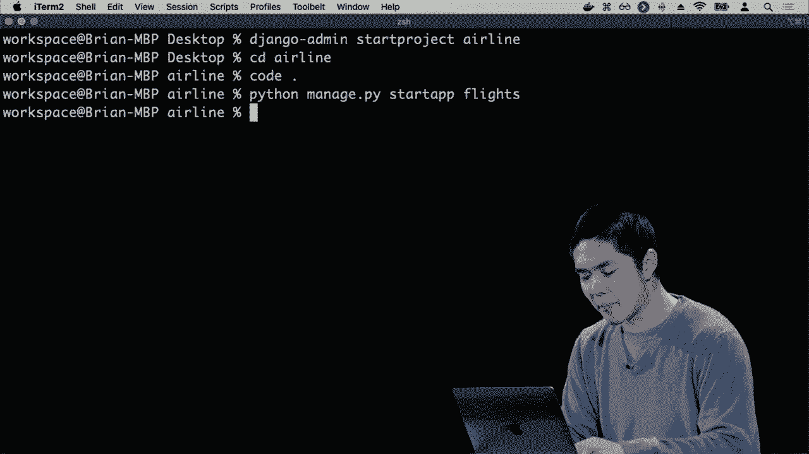
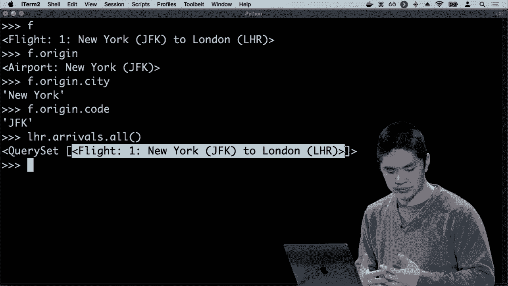
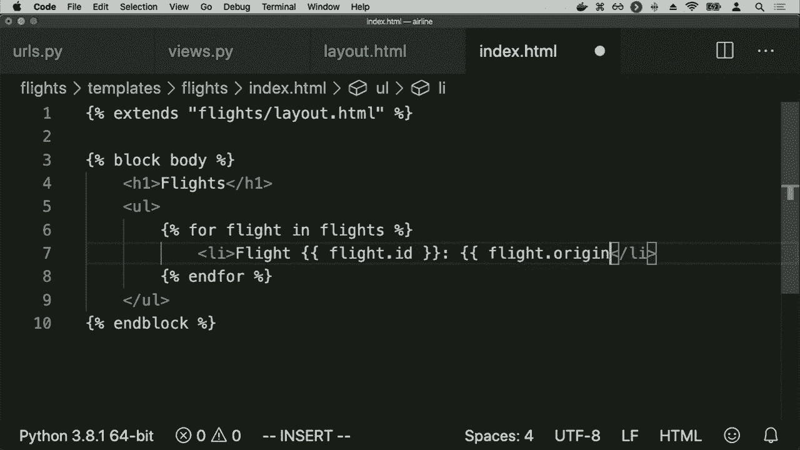
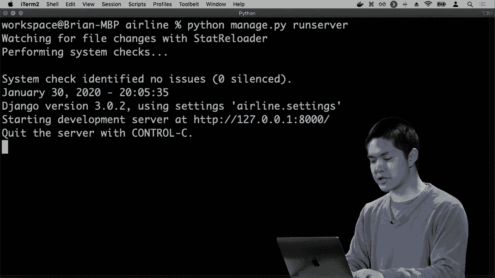
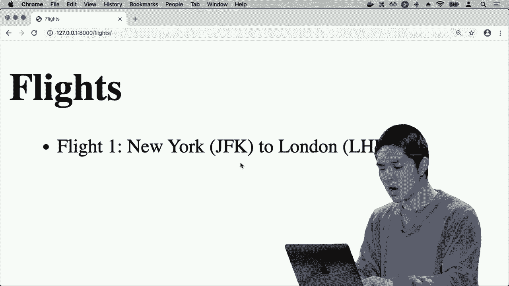
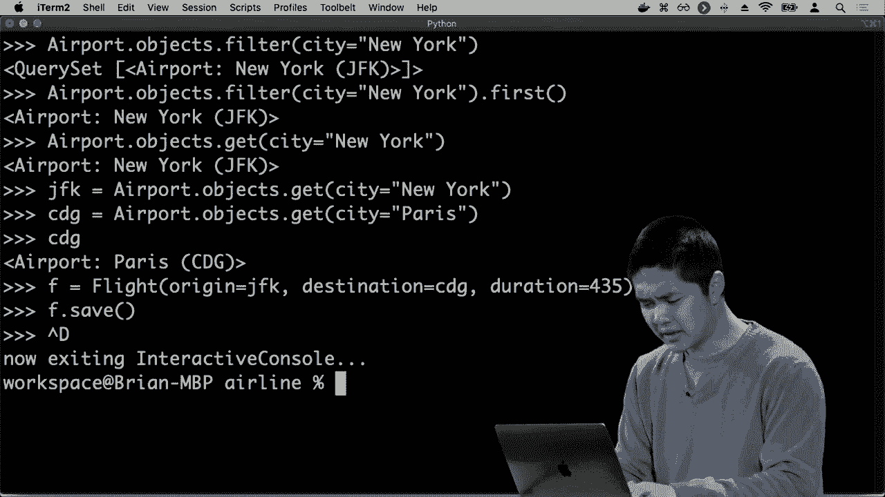
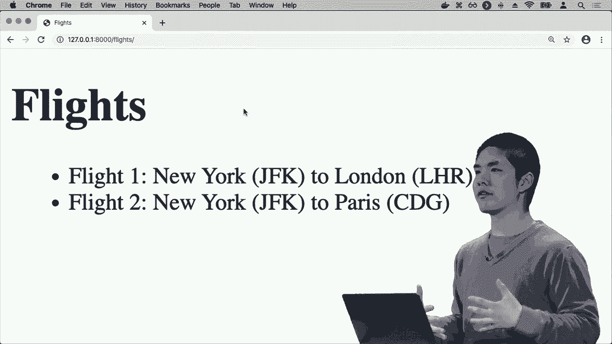

# 哈佛 CS50-WEB ｜ 基于Python ／ JavaScript的Web编程(2020·完整版) - P13：L4- 数据库、SQL与集成 2 (表关联，django模型，集成) - ShowMeAI - BV1gL411x7NY

数据中我们有多个数据表，这些多个表可能以某种方式相互关联，让我们看看一个示例，看看这可能是如何产生的，我们将介绍一个概念，我们称之为外键，我们稍后将看到它的含义。

这里再次是我们的航班表，航班表有四列：ID、起点、目的地和持续时间。但是在纽约，当然有多个机场，比如说，因此仅仅通过城市名称标记每个起点或目的地可能没有意义，可能我还想提供。

三个字母的机场代码对应我所提到的机场，那么我该如何在这个表中编码，不仅是起点，还有那个城市的机场代码，以及目的地城市的名称，还有那个机场的代码呢。

我可以添加更多的列，比如说，好吧，现在我们有这个表，包含一个ID，一个起点，起点代码，一个目的地，目的地代码和一个持续时间，但现在这个表开始变得相当宽，有很多列，尤其是我重复了一些冗余数据。

与此特定的三个字母代码相关联的*****，对于纽约和其他机场也是如此，这个数据的结构中存在一些混乱，因此，当我们开始处理数据和越来越大的数据集，拥有越来越多的列时，我们通常会想要。

我想要规范化这些数据，将它们分隔到多个不同的表中，这些表以某种方式相互引用，所以与其仅仅有一个航班表，我们可能考虑的是说，航班是一种对象，但还有另一种我关心的对象。

类似于机场，所以我可能只会有一个单独的机场表，这个表有三列，一列是机场的ID，一个唯一数字可以识别特定机场，一列是那个机场的三个字母代码，还有一列是城市名称。

关于那个机场所在的城市，现在这是一个更加直接、简单的所有机场的表示，问题变成了我的航班表会发生什么，我的航班表在这里有一个ID、起点、目的地和持续时间，而起点和目的地的类型。

在这种情况下，仅仅是文本数据，表示航班出发或到达的城市名称。现在我有了这个单独的机场表，其中每一行都有其独特的ID，那么在这种情况下，我可以做的是，避免存储冗余数据。

出发地和目的地以文本形式存储。我可以存储我们称之为外键的内容，即对另一个表中键的引用，并将这些列重命名为出发地ID和目的地ID，而不是存储文本，而是存储一个数字，其中出发地ID 1意味着航班1的出发地是机场1。

我可以查找机场表，找出哪个机场的ID是1，这将告诉我该航班的出发地。如果我去机场表，查找哪个机场的ID是4，这也会告诉我该航班的目的地。因此，通过结合两个不同的表。

用于表示机场的一个表和用于表示航班的一个表。我能够通过外键将这两个不同的表连接起来，我的航班表中的某些列，即出发地ID列和目的地ID列，使我能够引用存储在其他表中的信息。

另一个表，以及你可以想象这个航空公司数据库的增长和存储更多不同种类的数据，将表之间的关系变得非常强大。因此，你可能想象的是，除了存储机场和航班，航空公司可能还需要。

还需要存储有关乘客的信息，比如谁在哪个航班上。因此你可以想象，构建一个乘客表，其中有一个ID列来唯一标识每位乘客，一个名字列来存储每位乘客的名字，以及一个姓氏列来存储他们的姓氏。

姓名和航班ID列，以存储该乘客正在乘坐的航班。因此在这种情况下，我可以说，好的，哈利·波特在航班号1上。我可以在航班表中查找，以找出航班的出发地和目的地。

它的持续时间是什么。现在当我们开始设计这些表时，我们必须考虑这种设计的影响。在乘客表的情况下，确实似乎存在我创建的表设计的局限性，换句话说，如果你仔细考虑一下，你会发现。

这个表设计的局限性在于，任何特定行只能关联一个航班ID。哈利·波特只有一个航班ID列，并且只能存储一个值，这似乎使我们无法表示一个人可以有多个航班的情况。

可以在多个不同的航班上。因此，这开始涉及到表中行之间不同类型关系的想法。关系的一种类型是多对一关系或一对多关系，在这种情况下，我可以表达一个航班可以关联。

例如，有许多不同的乘客，但我们可能还想要一个多对多的关系，其中许多不同的乘客可以与许多不同的航班关联，一个乘客可能有多个航班，一个航班可能有多个乘客。为此，我们需要另一个表。

对于这种特定类型的表格有稍微不同的结构，一种方法是创建一个单独的表来存储人员，我可以有一个人员表，每个人都有一个ID，有一个名字和一个姓，与之前相同，但我不再在表中存储航班信息。

我创建的设置只存储人员在这个表中，航班信息不在此表中，然后我会有一个单独的表来处理航班上的乘客，并将人员与他们的航班关联起来，我们可以考虑这个表应该是什么样子的。

将人们与他们乘坐的航班关联起来。因此，我们很可能需要一列外键，引用这个人员表，另外一列外键，引用航班表，以便我能够将这些表关联在一起。

表格可以看起来像这样，现在这是简化后的乘客表。这个表只有两列，一个是人员ID列，另一个是航班ID列。这个表的想法现在是，它被称为关联表或连接表，旨在将一个表中的一个值与另一个表中的另一个值关联起来。

这里的这一行1和1意味着ID为1的人在航班1上，我可以在人员表中查找那个人。在航班表中查找该航班，弄清楚那个人是谁以及他们乘坐的航班，而这里的2 + 4意味着无论那个人是谁。

ID为2的人是在ID为4的航班上。因此，现在这使我们能够表示我们想要的关系类型。我们有一个机场表和一个航班表，任何航班都将映射到两个不同的机场，一个是目的地，一个是起点。

机场可能出现在多个不同的航班上，这是一种一对多的关系。然后在这里，当涉及到乘客时，我们将人们存储在一个单独的表中，并且在人员和航班之间有多对多的映射，任何人都可以乘坐多个不同的航班，就像这里。

例如，乘客编号二在航班1和4上，同样一个航班可以有多个乘客。因此，在这种情况下，航班编号六有乘客。我们能够表示这些关系，当然，做到这一点的副产品是，现在我们的表看起来有点杂乱。

这种情况有些混乱，因为当我查看这个表时，不明显我在看什么数据。我看到这些数字，但不知道它们的含义。我已经将所有这些表分开，现在更难判断谁在乘坐哪个航班。

要查看人员表中的人员，在航班表中查找航班，并以某种方式将所有信息关联起来，以得出任何结论，但幸运的是，SQL使我们能够轻松地从多个不同的表中提取数据并进行连接。

我们可以使用一个连接查询，将多个表结合在一起，因此连接查询的语法可能看起来像这样。这里我们将回到只有两个表的设置，我有航班和乘客，每个乘客都与一个航班相关联。

扩展这个，连接多个表来处理更复杂的示例。在这里，我想选择每个人的名字、出发地和目的地，并从航班表中选择，但我需要与乘客表连接，然后我会说出如何。

这两个表是相关的，在这种情况下我想说。它们之间的关系是，乘客表的航班ID列与航班表的ID列相关联。航班表有一个唯一标识每个航班的ID。

乘客表有一个航班ID列，唯一标识我们所指的特定乘客的航班。因此我可能得到的结果是这样的表，显示每个人的名字，以及他们的出发地和目的地。

我将从航班表中提取信息，名字将从乘客表中提取，但通过使用连接查询，我能够从两个不同的表中提取数据，并将它们结合在一起。我可以运行多种不同类型的绘制查询。

我看到的是默认的连接，也称为内连接。我们有效地进行内连接，将两个表交叉比较，基于我指定的条件，仅返回在两侧都有匹配的结果，即将乘客的航班ID与ID匹配。

在航班表中，有各种不同类型的外连接。如果我希望允许左侧表的某些内容与右侧表的任何内容不匹配，或者右侧表的某些内容与左侧表的不匹配，但请记住。

我也可以运行其他类型的连接查询，其他策略在处理序列表时可能会有帮助，我们可以进行优化，使查询更高效，因此，我们可以在特定表上创建一个索引，你可以将其视为。

索引有点像书籍最后的索引，例如，如果你想在教科书中搜索一个主题，你可以逐页翻阅教科书，寻找每个主题，试图找到你所寻找的主题，但通常情况下，如果表格有一个。

索引，你可以去书的索引，找到你正在寻找的主题，这将快速给你一个参考，告诉你如何到达相关页面，而表格上的索引运作方式非常相似，它是一个附加的数据结构，可以构建，确实需要时间。

需要内存来构建这个数据结构并维护它。每当你更新表中的数据时，但一旦它存在，它就会使在特定列上的查询变得更高效！

更高效地，你可以非常快速地在索引中查找某些内容并找到相应的行。因此，在这里我们可以有一个命令，例如创建一个索引，我们将其称为乘客表上的名称索引，特别是在姓氏列上，可能会说我期望。

当我查询这个表时，我会经常根据乘客的姓氏进行查找，所以我想在这个表上创建一个索引，以便能够更高效地根据姓氏搜索乘客。这只是关于序列语法的一个总体概述。

这是我们可以使用的一种语法，用于创建数据表，存储数据行，每行由一些列组成，每列都有一个类型。你可以创建表格，向它们添加数据，更新、删除以及从这些表中获取数据，但随着我们。

开始引入这些新技术，总是存在与这些技术相关的风险和潜在威胁，而在序列中，关键是要意识到所谓的序列注入攻击，这是一种安全漏洞，如果你不注意实际操作方式。

执行你的序列命令，可能会出现这种情况，例如，如果数据库中有一些用户信息，你可能会在数据库中存储这些用户，例如在一个用户表中，其中有一个用户名列和一个密码列，虽然在实践中你可能。

我们不希望以明文存储密码，假设你在一个表中存储用户名和密码，我们有一个看起来像这样的登录表单，你可以在其中输入你的用户名和密码。如果有人输入了他们的用户名。

可能发生的情况是，网络应用程序可能会执行类似于 `SELECT * FROM users WHERE username = '这个特定的用户名'` 的查询。我们只需将用户名替换到那里，然后将密码替换到另一边，如果有人尝试登录到我们的网站。

比如 Harry 使用密码 `1 2 3 4 5` 登录，我们可能会运行选择查询，执行 `SELECT * FROM users WHERE username = 'Harry' AND password = '1 2 3 4 5'`。我们的逻辑可能是，如果我们得到了结果，那么意味着存在一个用户名为 Harry，密码为 `1 2 3 4 5` 的用户。

我们可以继续为该用户签名，但想象一下，如果输入用户名的用户是一个黑客，可能会发生什么。似乎这个用户名有点奇怪，输入的密码无论是什么，结果可能就是他们输入的内容。

用户名是 `WHERE username = 'hacker'`，然后 `--` 后面会出现的情况是，`--` 在 SQL 中表示注释，这意味着忽略其后的一切，就像在 Python 中使用井号符号意味着这一行的其余部分是注释一样，编译器会处理它。

运行程序时应该忽略它，因此在 `--` 之后的所有内容都会被忽略，这样我们就有效地绕过了密码检查。某人可以绕过密码检查并登录到一个他们无权访问的账户，这里就是 SQL 语法中的漏洞，如果我们不注意。

当我们运行 SQL 语句时要小心，我们可能在运行一些不受信任的 SQL 命令，而这些命令是某个黑客能够注入到我们程序中的。那么，我们该如何解决这个问题呢？一种策略是转义这些字符，转义只是意味着添加一些反斜杠，使其变得安全。

确保 SQL 知道将这些视为字面上的引号和破折号，而不是任何特殊的 SQL 语法。另一种策略是使用一个抽象层在 SQL 之上，这样我们根本不需要编写 SQL 查询，这正是我们接下来要做的。

当我们过渡到 Django 的世界时，看看当我们开始使用像 Django 这样的网络框架时，我们现在能够不必担心 SQL 语法的细微差别，而是更高层次地处理我们的模型，处理我们正在使用的对象类型。

与这个应用程序内部交互的另一点需要注意的是关于SQL的潜在竞争条件，竞争条件是指在你有多个事件在并行线程中同时发生时，可能会发生的事情。

发生了一件事情，同时还有另一件事情发生，你可以想象在社交媒体网站的情况下，比如你可以在Instagram上点赞一条帖子或在Twitter上点赞一条推文。例如，如果两个人同时试图点赞同一条帖子，会发生什么？如果我们不小心处理这些特定的SQL查询，就可能出现竞争条件的问题。

我们最终可能会尝试查询一条帖子有多少个赞，而另一个人也试图做同样的事情，当我们尝试更新时就会发生冲突，结果可能不是我们所预期的，并且在处理与竞争条件相关的问题时，可能会出现许多意外结果。

当多个事情同时发生时，我们该如何解决这些问题？一个策略是对数据库进行锁定，表示所有。

好吧，我在处理这个数据库，其他人无法触碰这些数据，让我完成这个事务，完成对这个特定事务的操作并进行我需要进行的所有更改，只有在我完成后，我才能释放锁，让其他人去修改。

数据库也是如此，在我们开始处理SQL和与数据库打交道的过程中，有许多需要注意的问题。所以现在我们已经看过SQL的语法，理解这些表如何工作、如何结构化以及我们可以在这些表中添加什么，接下来我们就来继续。

特别关注Django模型，这是在Django应用程序中表示数据的一种方式，因为Django在设计我们的网络应用程序时，真正强大的地方就是能够通过这些模型表示数据，因此我们将继续。

并尝试创建一个网络应用程序，以代表航空公司可能希望在其自己的网络应用程序中存储的内容。好的，首先我想做的是创建一个Django项目，所以我将输入Django admin start project，项目的名称将是。

我创建的项目叫做航空公司，我为航空公司的网站创建一个项目。例如，我将进入航空公司目录，然后在我的代码编辑器中打开它。但在我实际开始编辑任何代码之前，请记住，每个Django项目都需要有一个或多个应用程序，因此我将为。

这家航空公司，我将启动一个应用程序来跟踪航班，因此跟踪航班相关的信息，比如出发地、目的地和持续时间。

还有哪些乘客在这些航班上，当我创建一个新应用时，我需要做的第一件事是进入 settings dot PI，在航空公司内部，将这个应用添加为已安装的应用，因此，flights 现在是我已安装的一个应用，然后我想要做的是说，进入 URLs PI。

这又是目录，对于我能获取的所有URL，这个特定的网络应用程序我将导入，包含因为我想做的是当某人访问 flights slash 的路径时，我想带他们到 flights dot 的 URL，将它们映射到我 flights 中的 URLs PI 文件。

当然现在我需要在我的 flights 应用中有一个 URL spy 文件，所以我进入 flights，创建一个新的文件，我将其命名为 url-step PI，然后我们可以从 Django 的 URLs 中导入 path，从 dot 导入 views，然后我的 URL 模式将放在这个列表中。

在我开始处理可处理的 URL 之前，我首先要做的是创建一些模型，模型将是创建一个 Python 类的方式，该类将表示我希望 Django 存储在数据库中的数据，因此当我创建一个模型时，Django 将会弄清楚。

找出需要使用的 SQL 语法，以创建该表，然后可以操纵该表，随时在我对这些模型做出更改时选择、更新和插入。因此，在这个名为 flights 的每个应用程序中，我可以做的是，每个应用程序都有一个 models dot PI 文件。

我们之前没有查阅过，但这是我们定义模型将存在于我们的应用程序中的地方，每个模型将是一个 Python 类，你可以将其视为每个我们关心存储信息的主表都有一个模型，因此让我定义一个。

新的类叫做 flight，将继承自 models model，因此我正在创建一个新的类叫做 flight，它将是一个模型，然后我需要在这个类中提供航班的所有参数，航班有什么属性是我可能想要跟踪的。

航班有一个起点，起点将是一个模型字符字段，这一切在 Django 的网站上都有文档，关于各种不同类型的字段，我可以包含在 Django 模型中，这里我说，好的，这里是一个最大长度的字符字段。

假设是 64，我假设大多数城市名称不会超过 64 个字符，这似乎是航班起点的合理最大长度。例如，每个航班还将有一个目的地，它将是一个最大长度为 64 的字符字段，每个航班将有一个持续时间。

这将只是一个整数字段，现在这是我非常第一个Django模型。它是一个名为flight的类，我定义了航班的所有属性，然后使用Django语法来确定它们应该有什么类型。每个航班都有一个起点、一个目的地和一个持续时间。

当然，这里实际上并没有修改Django正在使用的数据库在！。

为了存储关于我的网页应用的信息，我们可以查看是否确实能够返回航空公司，并输入`ls`，你看到的是还没有存在的数据库，我只有一个航空公司航班目录和一个管理的PI文件，所以我想要做的是以某种方式告诉Django。

应该更新数据库以包含我刚刚创建的模型的信息，这是我们在Django中称之为迁移的过程，我创建一个迁移，说明我想应用于数据库的一些更改，然后我迁移它们，告诉Django好吧，接受。

那些更改并实际应用到数据库中，因此这是一个两步过程。第一步是创建迁移，即如何实际操作数据库的指示；第二步是将那个迁移的步骤应用到基础。

我们可以通过命令进行迁移，再次我们将使用管理脚本，它有许多不同的命令，可以让我们控制应用程序的各个部分。我将使用Python管理的PI，然后进行迁移，现在我们看到的是，我们在0001_initial数据中创建了迁移。

我们！

在这个迁移中，它创建了一个名为flight的模型，所以如果我继续查看迁移目录，我会看到！。

这个文件是为我创建的，我不必自己创建它。这个文件是对Django的指示，如何操作数据库以反映我对模型所做的更改。这是对Django的一个构建，创建一个名为flight的新模型，具有这些特性。

特定字段在其中，它基于我对模型所做的更改，而我添加的模型现在在这个迁移中得到了反映。如果我想将迁移实际应用到Django的数据库中，我可以运行Python管理的PI迁移来继续应用这些更改。

迁移中有一堆默认的迁移也会被应用，但请注意，其中一个迁移是将flights.0001_initial应用，表示让我们继续应用那个迁移，创建将表示航班的表。

如果我现在输入 ls，你会看到我现在有一个 DB.sqlite3 文件，这是一个 SQLite 数据库，将包含一个存储我所有航班的表，那么我该如何实际开始操作这些数据呢？我该如何与这些模型进行交互？我可以使用直接的 SQL。

通过打开这个数据库文件并运行命令来进行语法操作，但 Django 提供了一些很好的抽象层，这样我就不需要自己执行这些命令，我可以开始更通用地使用 Python 类、变量和我熟悉的东西，在 Python 语言内部。

进入 jingoes shell，我可以通过运行 Python manage.py shell 来直接运行 Python 命令，这样做的目的是打开一个 shell 或控制台，我可以开始编写在这个 web 应用程序上执行的 Python 命令，首先我想从 flight 模型中导入 flight。

我应用的模型名称是我从中导入 flight 类的文件的名称，就是我刚创建的那个模型文件，现在我可以做的是创建一个新航班，我可以说类似 f 等于一个航班，起点是纽约，目的地是伦敦，持续时间是四百。

十五分钟后，我可以说 F.dot save 来保存我创建的新航班，这种语法，现在我会把它做得大一点，以便我们更容易看到，是我插入数据到这个表的方式，我不需要在 SQL 中使用插入查询，我只需写一个。

Python 命令和 Django 知道，当我创建一个新航班并保存时，应该在基础的 SQL 表上运行插入命令，在这里我创建了一个新航班，具有特定的出发地、目的地和持续时间，我也已经保存了这个航班，如果我想。

查询该航班，获取有关该航班的信息，我可以说类似 flight.objects.all 的内容，相当于选择所有的内容，获取我数据库中存在的所有航班，在这里我看到我得到了一组查询结果，其中有一个航班。

返回航班对象一，因此航班已经为我创建，现在航班对象一的名称可能没有太大帮助，如果这个模型有更干净的方式来看特定对象的名称，那就更好了。 

特定的航班，例如，结果证明我们可以这样做，任何模型，我会回到 model.py 中，任何模型都可以实现双下划线 str 方法，它返回该特定对象的字符串表示，这不仅适用于 Django 模型，还适用于 Python。

类更一般地说，如果这个函数返回对象的字符串表示，让我们返回一个格式化的字符串，那就是 self.dot ID。我会说 self.dot origin 到 self.dot。

destination 所以在这里，我所说的是任何航班的字符串表示将是一个字符串，提供它的 ID，然后说明从起点到目的地，这是一个干净的名称，用于表示这个特定的航班，所以现在如果我回到交互式解释器，我可以说从 flights.models 导入。

flight 我可以说好的，让我们将一个变量叫做 flight 等于 flight 对象的集合，现在 flight 将是这趟从纽约到伦敦的航班，它现在有了一个更漂亮的字符串表示，这使得与它交互稍微容易一些，如果我想获取。

那个航班，我可以说 flight 等于 flights.first，这是一个查询集。first 获取我第一个航班，所以现在我有了这个从纽约到伦敦的航班，就像在任何 Python 对象中，我可以开始访问那个对象的属性，我可以说好的，flight 你的 ID 是多少，flight 你的起点是什么。

flight 你的目的地是什么，flight 你的飞行时长是多少，我可以访问所有我最终关心的这个航班的属性值。如果我想删除这个航班，我可以说。

类似于 flight.dot delete 现在，最终虽然这并不是我实际想要表示的航班模型，因为在这里我再次使用字符字段来表示起点和目的地，而实际上我可能希望使用另一个表来表示机场。

每个航班和一个机场之间存在某种关系，所以让我们继续尝试实现这个想法，现在我可以回到模型中并创建一个新的类，我将创建一个名为 airport 的类，这也是一个模型，我希望这个机场类有一个代码，这是一个字符字段。

机场代码的最大长度为 3，城市则是一个最大长度为六十四的字符字段，我们还为这个机场提供一个字符串表示，字符串表示将是机场所在城市，然后在括号中是机场代码。

所以它会是像纽约这样的名称，然后在括号中是 JFK 来表示特定机场，现在我们的航班模型需要稍作更改，不再将起点和目的地作为仅存储文本的字符字段，而是起点将成为一个外键，一个外键。

引用另一个表，比如机场表，然后我可以提供一些额外的参数，这样单独这些就足够了，但我可以添加一些额外的参数，比如 on delete 等于 models.dot cascade，那么这意味着什么呢？当我有相互关联的表时。

SQL中以某种方式知道如果你删除某个东西时会发生什么，如果我有一趟从JFK到伦敦的航班，而我在稍后的时间决定从我的数据库中删除JFK机场，那么这趟航班会发生什么，就像当它引用的东西消失时航班会发生什么。

被删除时，`models dot cascade`的意思是如果我从机场表中删除一个机场，它也将删除任何相应的航班，还有其他在删除时的参数，你可以设置，例如，如果还有航班的话，甚至不让我删除一个机场。

从那个机场起飞或前往那个机场，这称为模型，不保护，但有其他方法可以实现类似类型的约束，而我将提供的另一个参数被称为相关名称，正如我们稍后将看到的，这将是我。

以反向顺序访问关系，从航班我可以使用航班的原点调用`dot origin`，但我想问的另一个问题是，如果我有一个机场，如何获取所有以该机场为出发地的航班，因此在这里如果。

我给这个外键一个相关名称，Django会自动设置相反方向的关系，因此在这里，如果我们有一个机场，我想知道所有以该机场作为出发地的航班，相关名称的合理名称类似于出发。

所以如果我有一个机场，我可以访问所有的出发，这样我就能获取所有从那个机场起飞的航班，我在目的地这里也会做同样的事情，取而代之的是，它将是一个外键，它将引用机场，当我们删除它时，它会继续进行。

和级联，相关名称将是到达，因为如果我有一个机场，我可能想访问所有的到达，所有与在特定目的地到达的航班对应的航班，因此现在我已经做了两件事，我添加了一个新类，称为机场，并且我在我的。

现有的航班模型，这是在我的Python代码中更改的，但还没有！

在我的数据库中进行更改，因此为了在数据库中进行更改，再次是一个两步过程，第一步，Python managed PI make migrations，说找出模型CI中进行的任何新更改，并继续创建如何对数据库进行这些更改的迁移指令，在这里。

我们看到我们创建了一个新的迁移文件，这个迁移将创建一个叫做机场的模型，并且它还会改变目的地字段和我航班模型中的出发地字段，因为我们知道我们已经将目的地和出发地不再是字符字段。

而是引用特定的机场。因此，这需要在数据库中进行更改，要进行更改，我可以运行类似Python managed PI migrate的命令，继续应用这些更改。我们已经应用了刚创建的迁移，我们的数据库也更新了。

现在是最新的，那么我们能做什么呢？我可以继续回到显示页面，我将导入航班模型，从中导入所有内容。我现在可以创建一个机场，可以说JFK是一个机场，代码为JFK，城市为纽约。

然后我可以创建一个伦敦的机场，代码为LHR，城市为伦敦，并保存。你知道的，你可以创建更多，我可以说CDG是一个机场，代码是CDG，城市是*****。或许我们再做一个，NRT是一个机场，代码是NRT。

例如，东京的城市，所以我创建并保存了机场，这些机场会被添加到我的机场表中，现在我可以添加一个航班F，航班的出发地为JFK，目的地为伦敦希思罗，持续时间为四百十五分钟，我会继续保存这个。

我已经创建了四个机场，创建了一个航班并保存了它。如果我输入F，代表我的航班，我看到这是一个从纽约到伦敦的航班，但我也可以说F的出发地是什么，写下F的出发地，现在这是一个机场对象，特别是JFK。我可以进行F的操作。

使用origin.city获取出发地的城市，也就是纽约，F的origin.code获取那个机场的代码，即JFK。如果我从出发地开始，比如JFK或伦敦希思罗，我可以说LHR的到达航班到*****，*****伦敦希思罗，看起来只有一个，就是这个。

我刚刚创建的航班从纽约出发。

纽约的航班前往伦敦。因此，这使我们能够仅通过使用这些Python模型来操控SQL，现在我有Python类来表示各种不同类型的数据，而不是运行SQL查询，比如从航班中选择所有。

我可以与这些类和类中的属性进行交互，Django为我处理确定底层SQL查询的过程，并将结果返回给我。现在我们可以围绕这个想法设计一个网络应用程序，我可以进入URL stop PI并保存。

让我们添加一个URL模式，说明默认路由将继续加载索引视图，给它一个名称为索引，这与我们上次看到的类似。那么我们该在索引视图中做什么呢？索引视图中，我想做的是显示所有航班的列表。

可能从点模型导入航班和机场，或者我只是需要航班。我只想要一个所有航班的列表，所以，我将从所有的模型中导入航班，现在我想做的是，返回让我们继续渲染一个。名为航班的模板，斜杠索引点，HTML，并给索引。html访问一个。

一个叫做航班的变量，这个变量将等于什么，它将等于航班对象的所有，以获取我想放在这里的所有航班，好吧，那么我现在可以做什么，我需要做的是实际创建那些，单独的模板，所以在。

我将创建一个名为模板的新文件夹，在其中创建一个名为航班的新文件夹，在其中继续创建一个布局。点HTML，就像我们之前做的那样，该布局将包含我们的HTML页面的基本结构，因此，头部分将标题设置为航班，并且。

正文部分将有一个块体和块的结束，就像之前一样，这是该页面的默认布局，然后我将添加一个新的模板叫索引。html，这将扩展航班斜杠布局点。HTML，然后在页面的主体部分，我将显示一个h1。

只是说航班，现在让我们创建一个无序列表，我可以在其中循环，航班中的航班，结束循环，但是在循环内让我创建一个列表项，我只是打印，像航班，也许我会打印一个。航班，然后航班ID打印出，像航班一航班二航班。

然后我将打印航班起点到航班目的地，所以我所做的是创建一个模板，我将给予一个变量的访问权限，叫航班，其中航班将是一个代表所有的。航班的变量，这些航班是我通过运行航班对象的所有查询得到的，这就是我的方式。

Django的API使用它所提供给我的功能来获取航班，并获取存储在Django数据库中的所有航班。然后在模板中，我对每一个航班进行循环，打印出一个列表项，让我可以访问该航班的属性。

航班这个ID从起点到特定目的地，现在我将进入我的终端，运行Python，管理pi运行服务器，这也是如何。

我们运行Django网络应用程序，现在如果我去那个URL斜杠航班。

这次因为这是URL，我看到的正是我所期望的。看到一个无序列表，正好有一个从纽约到伦敦的航班在显示，正在从我的数据库中获取数据，现在在这个模板中显示出来，如果我添加新的航班，它也会更新在。

这个页面也是如此，所以如果我继续，回到 Python 管理的 shell。我要从 flights models 导入 star，接下来我们继续，好吧，让我们*****。例如，我该如何获取*****的机场，在*****中呢？结果表明，如果我想获取像*****这样的内容，我可以说像*****等于 airport.dot。

objects.dot，然后我可以说如果我做 airport.objects 所有，那会获取到所有的机场。例如哦，似乎我并没有实际拥有一个*****。但是如果我想的话，可以添加一个，但如果我做 airport.objects.dot.all，那会再次给我所有的机场。如果我想要过滤我的机场列表，而不是获取所有的。

机场中的一些，但只获取其中的一部分，我可以说 airport.dot.objects.dot.filter，并且我可以说像获取所有城市是纽约的机场。例如，这将会给我一个查询集，只包含我关心的结果，所以再次 airport.object.stop.filter 让我们。

限制返回的结果，不获取所有的机场，而是只获取城市是纽约的机场，例如，这样只会返回一个，所以我可以说这个过滤条件是 City 等于纽约，然后取这个查询集的第一个，得到我只想要的查询集中的第一个和唯一的项。

这给我纽约机场，简化了同样的操作方法，如果你知道你只会得到一个结果的话，我可以说像 airport.objects.dot.get，这将只获取一个结果，如果它知道在纽约只有一个机场的话，这也会返回。

纽约JFK机场，但如果航班超过一个或没有航班时会抛出错误，例如，我们继续把它保存在JFK中。接着我们创建一个从纽约到*****的航班。例如，我可以设定 C DG 等于机场对象，获取城市等于*****，现在我。

我有这个变量 CDG，它代表机场*****，如果我想创建一个从纽约到*****的新航班，我可以说 F 将是一个航班，其起点是 JFK，目的地等于 C D G，持续时间等于 435，我也可以保存这个航班，所以我添加了一个新的。

航班，所以现在如果我运行服务器，Python 管理了一下，我刷新了页面，现在看到有两个航班，一个是从纽约出发的。

从纽约到伦敦的航班，是从纽约出发的*****，但当然每次我想更新数据时，添加新数据或操作数据时，必须进入 shell 以运行直接命令，这样才能添加新航班、新机场等等。

所以，我真正想要做的就是通过网络接口非常简单地添加它。通过网络，我能够说好，让我添加一个新的航班。这个航班从位置1到位置2，并且可以使用这些信息。
