# 哈佛 CS50-WEB ｜ 基于Python ／ JavaScript的Web编程(2020·完整版) - P14：L4- 数据库、SQL与集成 3 (用户管理) - ShowMeAI - BV1gL411x7NY

我们现在知道如何构建一个网页，只做这件事，但Django是基于。这个理念，即它不希望你，程序员必须重复其他人已经做过的工作，而这个，试图定义模型的过程，以及非常快速地创建和编辑，和操作模型是如此普遍，Django已经提供了所有。

已经为我们构建了一个专门用于操作。模型的完整应用程序，这被称为，Django管理应用程序，这个应用程序。我们已经看到了一些痕迹，如果我们，记得在我们的应用程序内部的URL配置文件，我们看到我们为自己的应用程序添加了，一个路径，但还有。

已经为我们默认提供了一个路径。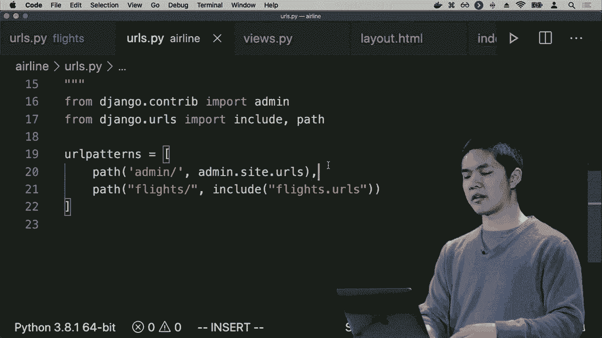

斜杠管理也将我们带到管理，应用程序，因此，为了使用这个。管理应用程序，我们需要在我们的Django网络应用程序内部创建一个，管理账户，方法是通过命令行。我可以运行Python manage.py create superuser，它会问我我的名字，我会继续。

我继续输入我的用户名和电子邮件，地址，它也会询问一个，密码，我可以随意设置一个我想使用的密码，再输入一遍。以确认现在Django为我在。这个网络应用程序中创建了一个超级用户账户，以便我使用，凭证拥有。

访问管理的网页界面。

应用程序并实际上操作这些，基础模型，因此为了。做到这一点，我需要做的第一件事是，获取我的模型并将这些模型添加到。管理应用程序，因此在模型的，`models.py`中，我有一个名为airport的类和一个名为flight的类，如果我们查看，我有的文件，还有另一个文件我们。

还没有真正查看过的，名为`admin.py`的文件，在我的应用程序内部，在`admin.py`中，我首先从我的模型，导入flight和airport，现在我要说admin.site.register。

我们的机场和管理网站点注册，航班和这个将要做的事情是。它将告诉Django的管理应用程序，我希望使用管理应用程序。来操作机场和航班。因此，让我们看看这个管理，应用程序，看看它实际上是如何工作的。

我可以运行Python manage.py runserver，这将启动网络服务器。我会访问这个网址，而不是去，斜杠航班，我会去斜杠管理。这将打开这个Django，管理应用程序，这不是我写的。Django写的，它要求我登录，我将继续。

使用刚才的凭证登录，我输入了我的用户名和密码，我得到的是 Django 的站点管理界面。这个界面是由 Jenga 构建的，我完全不需要设计这个界面，但重要的是，如果我们注意到这里，我现在有能力添加和管理机场。

通过这个网页接口的 Django 管理界面来管理航班，所以现在使用这个界面我可以操作底层数据库，修改模型，添加和修改已经存在的数据。所以如果我点击机场，我在这里可以看到我已经。

已经添加到我的数据库中，包括东京、巴黎、伦敦和纽约，我可以再添加一个新的机场，我可以说让我们添加 PVG，也就是上海，我可以选择保存、继续编辑或保存并添加另一个。我会添加几个，所以我将保存并添加另一个，让我们再添加伊斯坦布尔机场，再添加莫斯科。

这是一个机场记录，可能还会再添加一个利马机场，我将点击保存，现在我通过这个网页接口添加了很多机场。Django 最初是为新闻机构创建的，他们很快想要发布文章和新帖子。

网站通过这样的界面让我们很容易地快速添加新文章，并展示文章内容在页面上，现在我们也能很快地将新机场添加到我们的网站，所以如果我们想添加航班，我们可以继续进行。

继续回到主页，我点击航班，我看到我的数据库中已经有两个航班：从纽约到伦敦和从纽约到巴黎。我将添加一个新的航班，它让我选择出发地、目的地和时长。而且出发地必须是一个机场，所以它将给我提供。

我可以选择一个机场，比如说上海是出发地，目的地是巴黎，时长大约是 760 分钟。例如，使用 Django 的管理界面，我已经能够添加多个不同的航班和多个不同的。

如果我不回到管理应用程序，而是回到我自己编写的航班应用程序，回到 /flights，现在我可以看到通过 Django 的管理界面添加的所有新航班。我将它们添加到管理界面，现在我看到这个从上海到。

我看到从巴黎到纽约的航班，所以现在我想开始为这个网页应用程序添加更多页面，让这个网页应用程序更复杂，可能给我能力点击特定航班查看关于该航班的详细信息。

我希望每个航班都有自己的页面，不仅仅是 /flights 显示所有航班，而是 /flights/1 显示航班 ID 为 1 的航班。 

斜杠到 482，等等。我可以为此返回到 URL 间谍，创建一个新路径，我们将创建一个路径，我将在其中指定一个航班 ID，这将是一个整数。完成后，继续加载航班视图，其名称将为航班。现在我只需去视图间谍。

并添加一个叫航班的函数，所以我会返回到视图间谍，除了索引函数外，我们还将定义一个接受航班 ID 作为参数的航班函数。那么这个航班函数将要做什么呢？第一件事我实际上需要做的是，获取该航班。

航班等于航班，该对象获取我航班 ID 等于航班 ID 的航班，例如，或者说 PK，替代 ID，作为一种更通用的方式来引用主要键。无论主要键被称为什么，在这种情况下，PK 只是。

ID，但我能做的是渲染一个类似航班航班的 HTML 模板，并将航班作为输入传递给它，所以，我们把这个航班传递给航班 HTML。现在我可以创建一个模板，创建一个新的文件，叫做航班 HTML。这个文件也将扩展航班/布局 HTML，使用相同的 HTML。

页面布局和主体内部，我们可以简单地说一些类似于大的内容。我们会提到航班航班 ID，然后，也许是一个无序列表。可以说起点是航班起点，目的地是航班目的地。

目的地和持续时间是航班持续时间。所以现在我有一个页面，显示关于任何特定航班的航班信息。如果我继续在我的网页浏览器中加载，而不是加载斜杠航班，而是斜杠航班/一，比如说。现在我有关于航班编号一的信息，而斜杠航班/- 则让我得到。

关于航班编号二的信息，查询该特定航班，然后打印它的起点、目的地和持续时间。现在有一些错误检查，我们可能应该在这里做一下。如果我尝试访问一个不存在的航班，比如航班 28，我将会得到某种错误。

不存在与航班匹配的查询。

如果不存在，我可能想稍微控制一下这种情况会发生什么。你可能会想象添加一些额外的错误检查来处理这些情况，但现在我们就暂时先不管这一点。现在我们继续添加不仅仅是拥有机场的航班的功能。

与它们相关联，但我们也来为航班添加乘客，以便能够表示可能实际在这些航班上的乘客 - 所以我将继续回到模型间谍，在模型间谍中，除了机场类和航班类，我还要创建一个新类，叫做乘客。

成为一个模型，乘客有什么属性呢？乘客有一个名字，我们将创建一个最大长度为六十四的字符字段，姓氏的最大长度也为六十四。乘客也正如我们之前描述的，他们与航班之间有一个多对多的关系。

一个航班可以有多个乘客，乘客可以在多个航班上，最终我们需要一个额外的表来跟踪这一点。但我们可以在Django中更抽象地思考，只需说每个乘客都有与之相关的航班，这些航班都是模型。

多对多字段与航班相关，因此每个乘客可以与多个航班关联。我们将设置blank=True，以允许乘客没有航班的可能性，或许如果他们没有注册任何航班。我们还将为此提供一个相关名称，命名为乘客，意味着如果我有一个乘客。

乘客，我可以使用航班属性来访问他们的所有航班。同样，如果我有一个航班，我可以使用这个乘客的相关名称来访问所有在该航班上的乘客，我们稍后会看到这会有多有用。乘客的字符串表示，我们将只是。

接下来是他们的名字和姓氏，这似乎是一个合理的表示方式。

特定乘客，现在我需要应用这些更改，我需要说Python。Manish，运行迁移因为我对我的模型进行了新的更改。我创建了一个特定的乘客模型，现在如果我运行Python管理，

现在迁移，我已将这些更改应用到我的实际数据库中，如果我进入admin.py，我们将进入admin.py，并注册航班、机场和乘客管理。

注册乘客，现在通过管理界面，我可以操作。

我也可以说Python管理，运行服务器以运行我的网页服务器，通过访问斜杠admin进入我的网页服务器管理视图，进入乘客部分，让我们添加一个乘客，我可以说，好的，名字哈利，姓氏波特，我们将把他放在航班一上。

航班三，可能他在两个不同的航班上，例如，你可以按住命令或控制键，以便选择多个航班。我们将继续保存，哈利·波特已成功添加。让我们再添加几个其他乘客，将添加罗恩·韦斯利。

另一个将添加赫敏·格兰杰和。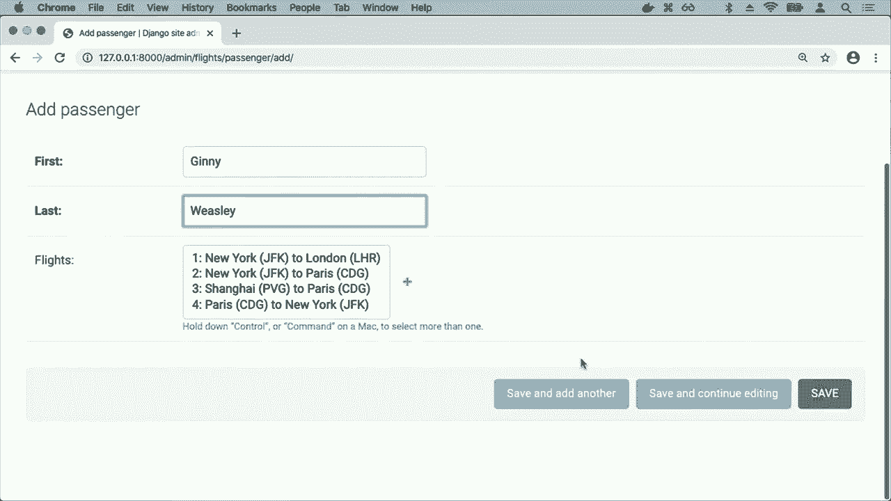

我们还会添加**金妮·韦斯利**，所以我们添加了许多不同的乘客，它们现在都存在于Django的管理界面中。现在我想做的是在航班页面上显示关于在任何给定航班上乘客的信息，所以我可能会这样做，通过进入视图文件并在。

航班页面除了提供给乘客访问权限外，这个模板将会获得乘客的信息，我们可以通过说flight.passengers.all来获取乘客，而我们之所以能够这样做，是因为乘客是相关名称，它是我们获取航班及其上所有乘客的方式。

因此现在在flight.html中，我可以添加一些东西，比如添加一个h2，叫做乘客，我们在这里，我将循环遍历乘客，显示该乘客。将该乘客打印在一个列表项中，在Django中我可以说如果。

列表为空，我们只需要一个列表项，写着没有乘客的意思。

目前没有人乘坐这趟航班，所以，现在我的网络服务器仍在运行。我可以返回到斜杠航班，这里是所有的航班，如果我去斜杠航班，斜杠一，我现在看到的是航班一，**哈利·波特**是这个航班的乘客。

但是如果我去航班2，好的，那个航班上也没有乘客。现在有点烦人的是，我不得不通过使用URL来来回回，这样才能在页面之间导航。如果我想的话，我可以链接到那些页面，我可能会这样做，让我们在航班页面上添加。

一个链接，指向一个URL索引，上面写着类似“返回航班列表”的内容。因此，现在这里有一个链接可以带我到索引视图，同样，我可以进入index.html，对于每一个列表项，这些列表项实际上都会是一个链接，指向一个特定航班的URL。

航班路线作为参数需要一个航班ID，因此在这个URL替换中，我可以指定使用航班ID作为我想使用的航班的ID，因此现在我把每一个航班都放在一个链接里，这个链接可以带我到航班路线，但因为航班路线需要一个。

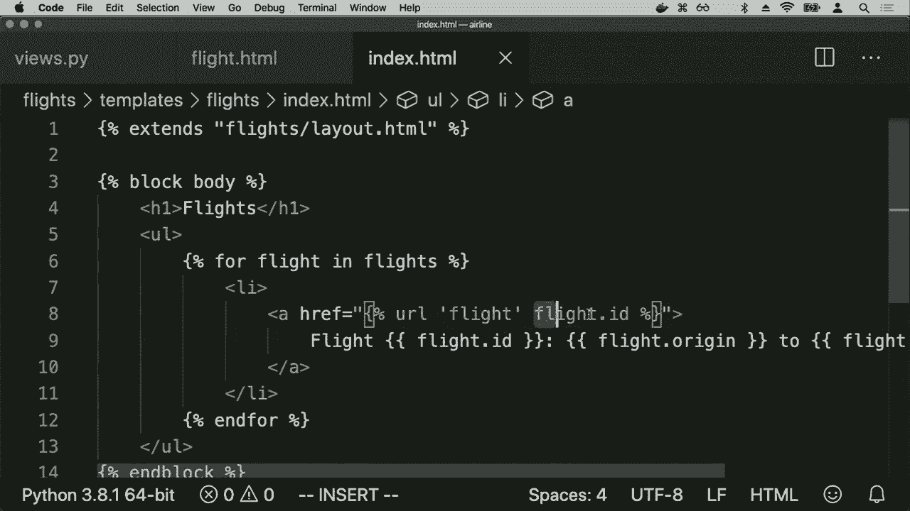

参数航班ID，我可以在这里指定航班ID，因此现在如果我返回到斜杠航班，我现在看到一份航班列表，每个航班实际上都是一个可以带我去其他地方的链接，因此现在我可以点击任何一个链接，比如从纽约到巴黎，这会带我到航班页面，我可以点击。

返回航班列表，这会带我返回航班列表，点击另一个航班并转到那个航班，所以我现在能够通过在各个页面中添加链接的方式，将这些页面连接在一起。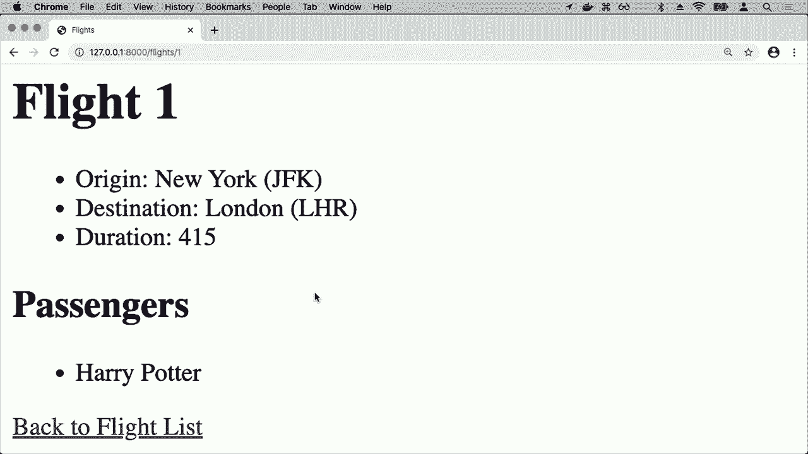

不同的页面也将带我到其他路由。因此，现在我可能想要做的是，除了显示任何特定航班上的所有乘客外，还给自己添加乘客到航班的能力，这似乎是我可能想在其中做的合理事情。

web 应用程序，所以我该如何进行呢？为了做到这一点，我需要一些新的路由，让我可以为特定乘客预定航班。因此，我将继续回到 URL，并在 URL 的 API 内添加一个新的路径，这将是航班 ID / 预订一个。

在航班 ID / 预订将让我为此特定航班 ID 预订航班，例如航班 1、航班 2 或航班 3，当我执行时，我们将继续转到预订视图，并将其命名为 book，因此现在我需要实现预订视图，这个视图将如何工作，我将定义一个。

函数，名为 book，它将不仅接受请求作为参数，还接受航班 ID。首先，如之前所述，我想获取航班 ID，但记住之前提到的，我可以通过多种方式请求网页，我可以通过 GET 请求方法请求网页。

这意味着我只是想获取此页面，或者我可以通过 POST 请求方法请求一个。这意味着我想将数据发送到页面，一般来说，每当你想要操作某个事物的状态，尤其是操作我们的数据库时，这应该在 POST 请求中，我提交一些表单。

数据以及对该 POST 提交的响应，你应该操作数据库中的内容。因此，当调用此预订路由时，我们会检查，如果请求方法是 POST，那么我们想执行某种操作，相关的航班将是 flight.objects.get，获取主键为该航班的航班。

航班 ID，然后我还想与表单关联，当有人提交此表单以预订新乘客时，他们应该告诉我乘客的 ID，也就是我应该在这趟航班上预订哪个乘客，因为这是你需要知道的两条信息。

为了实际预订航班，你需要航班和乘客的信息，所以现在假设信息将在 request.post 中，然后在方括号中是 passenger。这意味着关于我们想要在此航班上注册的乘客 ID 的数据是。

将通过一个输入字段传递，该字段的名称为 passenger。在任何特定的输入字段上的名称决定了我们收到的内容是什么。当像这样的预订路由能够处理来自用户的请求时，我们将继续获取该信息，因为默认情况下。

这可能是一个字符串，让我们继续并将其转换为整数，以确保我们在处理整数。让我说这个乘客将会是乘客对象，通过主键获取，这整个过程。现在我所做的是，如果请求方法是POST，意味着有人提交了。

通过POST请求方法，这里我首先说航班对象获取，获取特定航班，给我那个航班ID的航班。然后我获取一个乘客，我正在获取哪个乘客，他们的主键，也就是ID，等于通过这个提交的内容。

提交表单的名称是乘客，我们还没有创建那个表单，但我们马上就会做到。最终，我们希望在这方面添加更多的错误检查，比如说，如果有人请求一个不存在的乘客或者一个不存在的航班，这肯定会有一些问题。

我们可能应该在这里进行错误检查，但为了简单起见，暂时假设我们能够获取航班并获取乘客。那么我们如何访问乘客的航班呢？我可以直接说乘客的航班。为了向一些集合中添加新项，比如航班。

我可以直接说乘客的航班不添加航班，这将相当于向一个表中添加新行，以记录该乘客在该航班上。但Django的抽象优点在于我不必担心那些底层的细节。

表的结构我可以在更高的层面思考，只需说拿这个乘客，带上他们的航班集合，并继续向那个航班集合添加一个新航班。当这一切完成后，我可能想要做的是返回某种重定向，将用户重定向回。

航班页面，所以我们将继续并返回一个HTTP响应来重定向。那么，我希望把他们带到哪个URL呢？我希望把他们带到航班路由，而反转又获取了特定视图的名称，并告诉我这个URL是什么，我们上次看到过，航班路由接受一个参数。

需要作为参数传递航班ID，所以我需要将其提供给航班路由，航班ID被结构化为一个元组，这将把我重定向回航班路由，以便我可以再次查看航班页面。而我需要在顶部添加的是，从Django HTTP导入HTTP响应。

除了Django的URLs外，还需要从中导入反转，这些都需要添加，以便我可以在提交表单后将用户重定向回航班页面。反转接受在URLs中定义的特定视图的名称，比如index或flight或book，并给我这个视图。

实际的 URL 路径应该是什么，我们上次讨论过，这样我就不必在我的 Django Web 应用程序中硬编码 URL。我可以通过名称引用 URL，如果我需要更改 URL，我可以只在 URLs.py 中更改一次，而该更改将反映。

所以现在我需要做的下一件事是实际创建。这个表单到目前为止，我只有一个名为 book 的函数，等待发出 post 请求，当对它发出 post 请求时，我们将继续提交，这个表单并继续添加。

对于这个特定乘客的航班，但我现在想做的是实际添加。那个表单，所以我将回到模板，进入航班 HTML，我想在这里添加一个表单，我将其标记为一个 h2，称为添加乘客。我们将创建一个表单，其操作将是，预订的 URL，所以我们要。

转到预订路由，再次如果我们回忆 URL 中的预订路由，通过名称为 book 的路由，这个视图需要作为参数的一些航班 ID，所以我需要提供航班 ID，作为我为乘客预订的航班的参数，正好是 flight.ID，因为这个模板有。

访问一个名为 flight 的变量，此提交的方法同样是 post，回忆之前提到的，每当我在 Django 中有一个表单时，我需要。提供 CSRF 令牌，仅出于安全考虑，以确保 Django 知道，确实是这个应用程序在提交这个表单，我们将继续。

添加一个下拉列表，你可以使用选择字段在 HTML 中创建。这个选择字段的名称将是乘客，原因是。当我在请求的 post 数据中获取乘客时，我要寻找的是一个名为乘客的字段。

所以这就是我希望这个下拉框的名称，而在一个选择下拉框中，我们有一整堆，供我们选择的选项。而且将会有一个选项，供每一个不是航班乘客的人。那么我该如何获取所有不是航班乘客的人呢？

目前航班页面似乎只访问实际乘客，并且还没有访问不在航班上的人。因此，听起来我需要向 stemplot 添加一些额外的上下文。我们想要访问的附加信息，所以我将继续给这个。

航班访问额外的信息，我们将调用不在航班上的人，如何获取非乘客呢，只需过滤。仅获取与特定查询匹配的乘客对象，在 Jango 中也有一种方法，可以说乘客对象.exclude，以排除乘客。

满足特定查询，因此我想排除那些在他们的航班中包含这个航班的乘客，那么这实际上意味着什么呢？它意味着当我渲染flight dot HTML时，应该有几条信息，它需要知道正在进行的是哪个航班。

渲染时需要知道谁在航班上，谁是乘客，但如果我想要一个下拉菜单，可以从所有未在航班上的人中选择，比如我想为你注册这个航班，我也需要所有的非乘客，除了已经在航班上的人。

获取所有这些的点，最终就是在说的内容。因此，利用这个我现在有一个变量叫做非乘客，在构建此页面时可以使用。因此在航班HTML中，我可以说对于每个非乘客，允许我创建一个可供选择的选项。

选项的值将是乘客的ID，因为最终在我提交表单时，我关心的是我从下拉菜单中选择的这个乘客的ID，但当然，查看此页面的用户不想看到人们的ID，他们想看到。

人们的名字，因此在选项标签内部，我们将直接打印出乘客的名字，稍后我们会看到这一切在HTML中实际上是什么样子。现在我已经创建了这个表单，底部还需要添加一个类型为提交的输入，以便让我提交这个表单。

现在让我们尝试运行这个应用程序，似乎有一个小错误。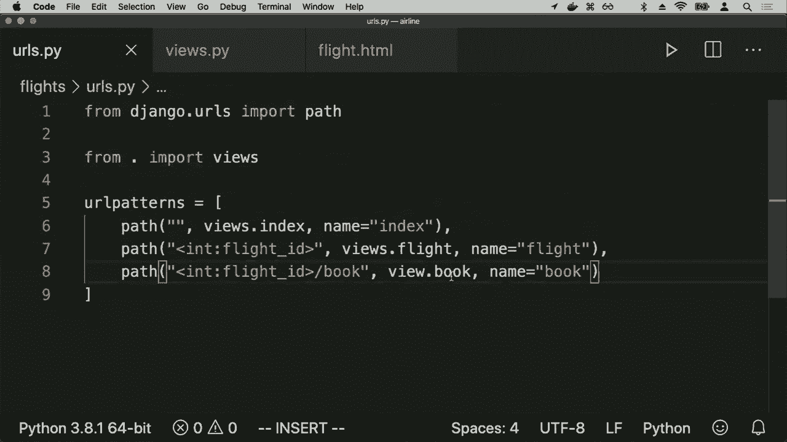

我说的是查看预订而不是查看，预订视图是模块的名称，因为它在一个叫做view spy的文件中，现在看起来我的服务器运行正常。我可以返回到斜杠航班，让我获取一个航班，比如从纽约到伦敦的航班号一和正确。

名称错误，命名的乘客未定义，这是Django呈现给我的。发生的错误以及我的Python代码看起来只是意味着。我在用完的pine内部引用。

乘客但我从未导入它，因此在顶部我会导入乘客，现在我的网络应用似乎运行正常，希望有信息。我看到乘客，而且我现在在底部看到一个添加乘客的部分，带有一个下拉列表，可以点击并查看这三个人。

人们如果不在此航班上，因此如果我想将像Ginny Weasley添加到此航班，我可以点击Ginny Weasley，点击提交，这样就提交了表单。我被重定向回同一航班页面，现在Harry和Ginny都在。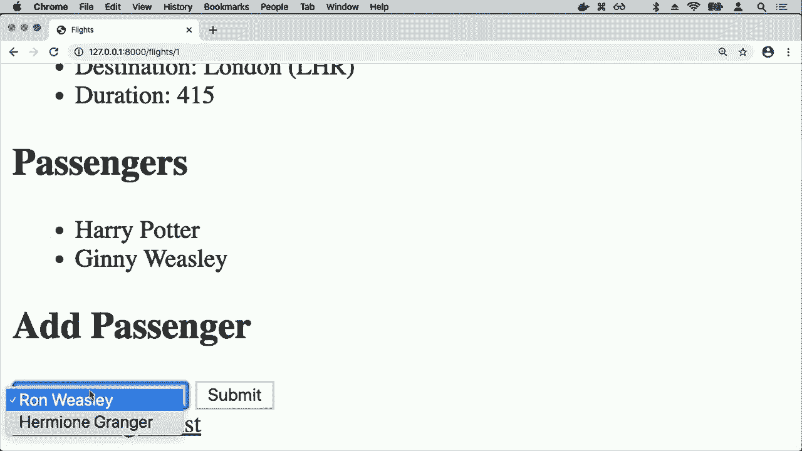

在航班上，然后在添加乘客列表中，我看到了Ron和Hermione，这就是我的选择，因此，利用Jano的模型，我已经能够非常快速地构建一个相对复杂的应用程序，一个能够向我展示这些信息并让我进行操作的应用程序。

这些数据最终存储在一个sequel数据库中，Jango的一个重要优势就是，它为我提供了这个管理界面，通常我可能需要花很多时间来设计一个。

这个网络界面让我能够做一些事情，比如更新某个人的信息，例如他们的姓名、他们搭乘的航班，快速添加、删除和编辑模型，这在一个网络应用程序中从头开始构建可能需要相当多的时间。

但幸运的是，Jango将这一切直接提供给我，尽管这个管理界面是由Jango设计的，但在我可以在这个管理界面上进行的操作方面是非常可定制的。

如果我进入admin.dot PI，这里是我为jenga的管理界面配置的内容，我可以说我想以特定的方式配置管理界面，例如在航班中，默认情况下我只看到航班的起点和终点。

想要查看更多关于航班的信息，我可以说继续，并给我一个名为flight admin的类，它将是model.admin的子类，在这里我可以指定任何特定的设置，以应用于航班ad.Paige的显示，这一切都记录在jenga的网站上。

只需要阅读就能知道有哪些配置选项可供你使用，但我可以在列表显示中，列出所有航班并显示给我，我应该访问哪些字段，像起点、终点和持续时间等信息。

也许还想让我看到ID，因此我想在加载航班时看到所有这些信息，当我注册航班时，我会说注册这个航班，但在这样做时使用flight admin的设置。

我希望在查看管理界面时使用这些特定的设置，因此现在如果我返回并继续点击航班，那么在这个列表显示中，以前我只看到ID和起点、终点，而现在我可以配置它以显示所有的ID和起点、终点。

我已经能够配置这个显示，以我想要的方式工作，还有其他的。

你可以进行的配置也有很多，我比较喜欢使用的一种是，如果我想更新我的乘客管理界面，当我编辑乘客时，可以以特殊的方式操纵多对多关系，使用一个名为filter horizontal的属性。如果我在航班上使用水平过滤器，这将。

只是让操作乘客所搭乘航班的界面变得更好看一些，再次提到具体的。

语法并不是最重要的，关键是这些都是Django记录的可配置设置，你可以查看如何配置管理界面，使其完全按照你想要的方式工作。所以现在如果我回到首页，去乘客那儿，或许点击一下。

乘客像哈利·波特，现在我看到这个水平过滤器，这是一种非常好的方式来操纵乘客所搭乘的航班，我在左侧看到他们可添加的航班列表，在右侧看到他们已经选择的航班。

我只需双击一个航班，就能轻松地将其从可用航班移到他们所搭乘的航班，反之亦然。能够快速控制。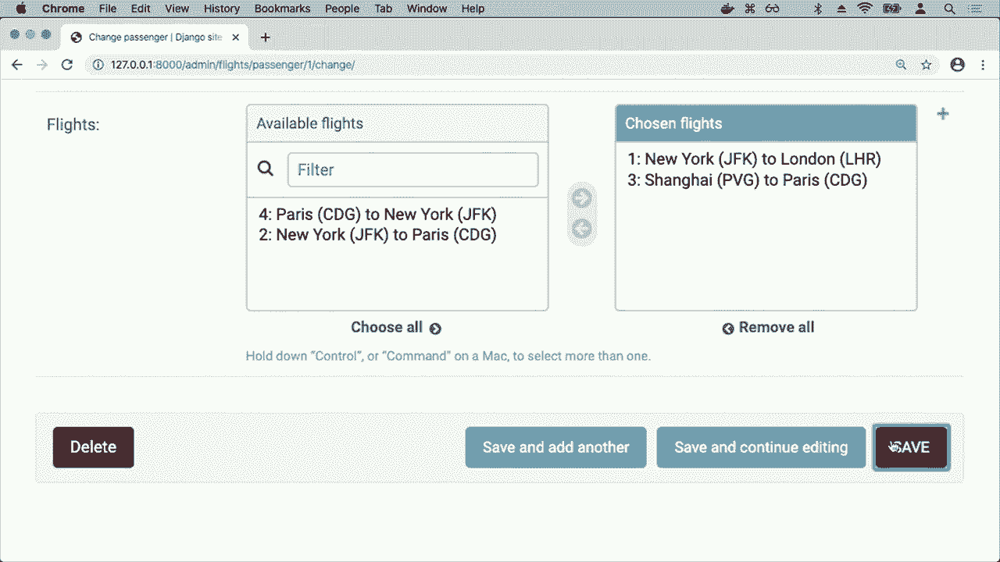

并且操纵这些模型，这些都是Django开箱即用提供的功能。所以，现在简·多给了我们很多特性，能够非常简洁地表示模型，迁移方法能够快速地将这些更改应用到我们的数据库，最后我们将关注的是。

这个认证的想法在许多网站上，我们需要某种认证方法，给用户提供登录和登出的能力，让Django记住特定用户的身份。我们现在要做的是引入一个可以与此互动的应用。

认证方法，因为Django框架内置了一系列认证功能，我们可以利用这些功能，这样就不需要重写登录逻辑，以及如何表示用户。Django为我们做了很多工作，所以我们将。

继续创建一个应用程序来实现这一点，好吧，所以让我们回到我的终端，现在我有这个航空公司项目，其中有一个名为flights的应用，我现在想创建另一个应用来维护用户。

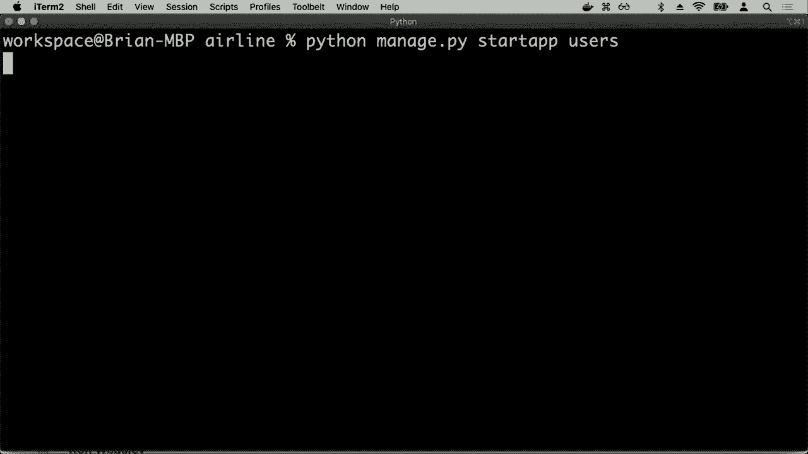

这将是一个允许我表示用户的应用，就像之前一样，当我创建一个新应用时，我需要进入设置，添加用户作为这个项目中已安装的应用之一，然后我会进入URLs.py，表示我还希望在访问用户时包含用户。

不是URL，所以所有与我的用户应用程序关联的URL，现在我需要实际创建这些URL，因此我会继续进入我的用户应用程序，创建一个新文件，名为URLs，其中的内容与我们通常在这些URLs文件中看到的相同，我需要导入。

路径导入我的视图并定义一些URL模式，这里我想做的是定义一个路径，将我带到视图index，我们将称之为index，然后我会创建另一个路径，将我带到login，称为login view，名称将是login，我们将有另一个路径称为logout。

对于一个名为logout view的函数，将与之关联，因此我们将有效地有三个不同的路由，一个主index路由将显示当前登录用户的信息，一个路由用于登录某人，一个表单将显示他们可以输入用户名和密码的地方。

用于登录，然后一个路由允许用户能够从此应用程序注销，所以现在让我们继续并实际编写这些函数。我们需要一个名为index的函数，一个名为login view的函数和一个名为log out view的函数，所以我将进入views.py并从index开始。

index函数需要做什么？它将显示有关当前登录用户的信息，我登录到这个网站后，就会呈现出index页面，因为我们从程序的角度考虑，我们首先需要考虑如果有人尝试访问这个。

页面但他们没有认证，我们如何才能发现这一点？在这种情况下我们该怎么办？假设，如果请求对象的`user.is_authenticated`为False，传入的请求对象在Django中每个用户自动都有一个与之关联的`user`属性。

该用户对象具有一个is_authenticated属性，告诉我们用户是否已登录。如果他们未登录，我们将通过HTTP响应重定向他们到登录视图。为了使这一切正常工作，我将需要从Django.http导入HTTP响应重定向，以及从。

Django.urls，让我们继续导入reverse，如果用户没有认证，那么我们将把他们重定向到登录视图，登录视图将做什么呢？暂时让我们渲染`users/login.html`，一个用户可以登录的某种形式。

自身，我们需要创建一些模板。我会创建一个模板文件夹，其中包含一个用户文件夹，在这个文件夹内我们将创建一个基本的布局，正如我们多次所做的，这将再次成为该应用程序中页面的通用结构，标题将是用户，正文将是。

只是有一个叫做 body 的块，我可以在稍后用其他内容填充，现在。既然我有这个 HTML 布局，我可以继续创建一个新的，名为 login dot HTML 的文件，其中 login。not HTML 将扩展用户斜杠布局，HTML，在 body 块内我可以。只需以 HTML 表单形式显示，所以我可以说，想要的内容是。

这将是一个表单，当我提交表单时，让我们继续前往。登录 URL，但我们使用 post 请求方法，我在登录，我。正在提交一个表单，通常在你，执行此操作时，你会想要通过 post 提交表单数据，尤其是在，用户名和密码的情况下，因为如果你这样做。

这种情况你不希望，用户名和密码以。get 参数的形式传递，因为这些会出现在，URL 中，我们的表单将会有我们的 CSRF。令牌以确保安全，与之前一样，一个类型为文本的输入，名称为。用户名，出于用户友好性，让我们给它一个占位符，还会有。

用户名，这样用户就知道在这里输入他们的用户名，我们还会有一个。输入框，其类型为密码，名称也是密码，当输入框类型为。密码时，这意味着我们的 HTML，在浏览器中，无论是 Chrome 还是。Safari 等等，我们将知道以点的形式显示密码，而不是。

字符，然后我们会给它一个占位符为密码，然后一个类型为提交的输入，其值为登录，这样我们就。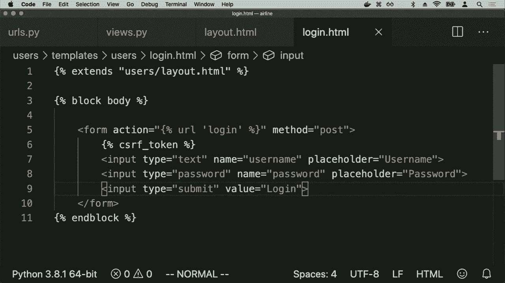

现在有了登录的能力，所以如果我们，继续运行这个程序。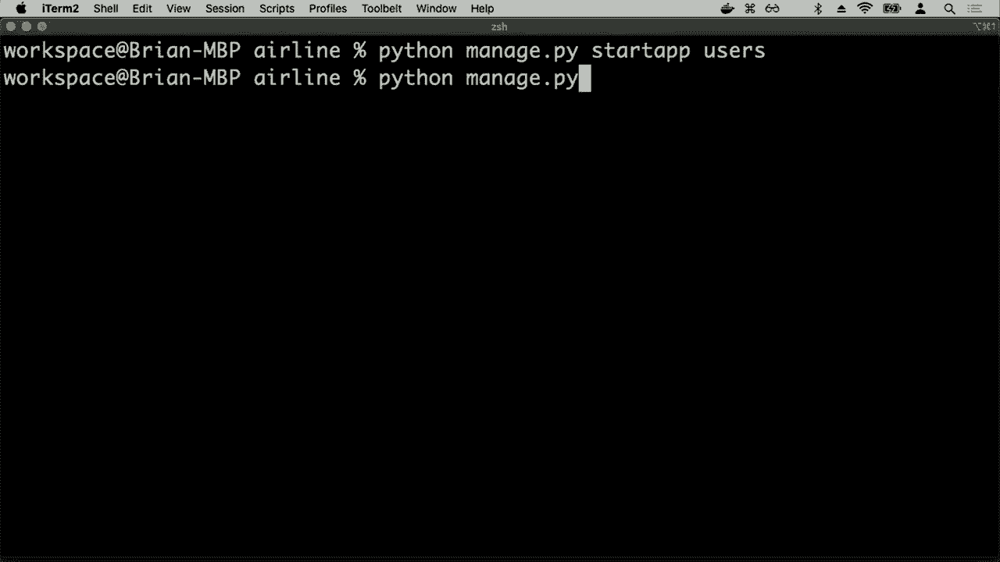

python managed by run server，我们应该，看到用户的东西使用没有属性。登录视图，好吧，看起来我，调用了这个函数登录请求，它。实际上应该叫登录视图，我还需要一个名为注销的函数。

视图，但我还没有实现，所以我就先说 pass。但我会在稍后回来，实现注销视图。好吧，所以看起来我的 Web 服务器现在在运行，在我实际上去登录。页面之前，先回到管理员，页面并实际创建一些用户。

我可以去用户，然后添加，让我们添加一个用户，用户名可以是，比如说，Harry，然后我们继续给 Harry 设置一个密码，并且我们继续。保存并添加另一个用户，也许再添加，Ron，继续添加他，我们会继续保存这些用户，他们可以有，附加的信息与之关联。

然后我可以给 Ron 起个名字，比如 Ron，Weasley Ron Weasley 在 example。com 的邮箱地址。这是他的电子邮件地址，还有一堆 Django 为你提供的默认字段，用于操作用户信息，如果我想的话，可以将这些用户添加到。那些字段中，给他一个，名字，姓氏，电子邮件地址和。

你也可以自定义这些字段，如果你想添加自定义字段以跟踪个别用户的情况。现在我将从Django管理员注销，因为我不再需要它，但如果我去/users，我没有经过认证，所以。

我看到的登录表单看起来像这样，有一个地方让我输入用户名和密码，当然现在你可以输入比如Harry的用户名和密码，但我还没有实现数据处理，所以让我们继续。

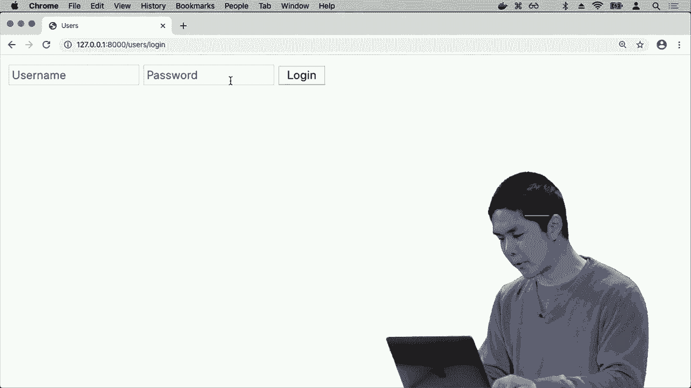

现在我们将返回到登录视图，登录视图函数可以通过两种方式被调用，一种是通过get请求方法，意味着只显示登录表单，另一种是通过post提交数据到登录表单，所以如果请求方法是post，那么让我。

首先获取用户名，它将在名为username的字段中，接下来获取密码，它将在请求的post数据中，名为password的字段中，现在我想做的是尝试认证该用户，如何做到这一点呢，结果表明这里。

有几个Django提供的功能，我可以导入，因此我将从Django的认证模块中导入三个功能，我们**最终**会使用的，一个是authenticate，用于检查用户名和密码是否正确，一个是login，另一个是logout，我。

在获取到用户名和密码后，我可以在这个登录视图中使用这些功能，我想验证用户，检查用户名和密码是否正确，因此我将说用户等于authenticate请求，用户名是username，密码等于password，所以。

authenticate函数仅接收请求、用户名和密码，如果用户名和密码有效，它会返回用户的身份，只要用户不是none，这意味着认证成功，我可以继续登录用户，如何登录用户呢，我使用login。

Django给我的函数是在此请求中登录用户，现在我可以进行HTTP响应重定向，将用户重定向回。索引路由，也就是用户最初开始的路由，如果用户不是none，且认证成功。

否则如果认证失败，我该怎么办呢，那么让我重新渲染相同的用户登录页面，但添加一些额外的上下文，上下文将是一个消息，提示凭据无效，现在在login.html中，我可以添加一些逻辑，如果有消息，则继续。

在一个div中显示该消息，然后结束IFTA，如果有的话。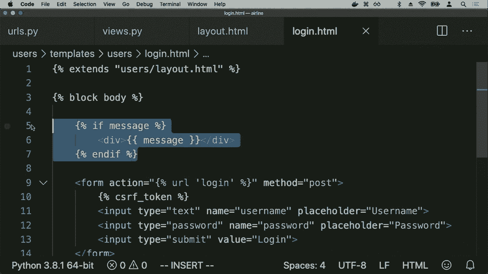

消息将会被打印出来，否则我们根本看不到它。因此，如果我继续刷新登录页面，似乎没有什么变化，但假设我输入一个不存在的用户名赫敏和某个密码，然后我登录，那么我会收到这个错误消息，凭证无效，我们没有。

能够登录用户，那么会发生什么。

如果我们成功登录，那么用户将被带到这个索引路由，现在看来我们需要完成这个索引的领域，索引路由做什么呢，让我们去返回渲染一个名为用户/用户.html 的模板，在用户.html 中，我们会继续使用用户。

我们仍然会扩展用户/布局，因为我们将使用相同的基本布局，但在这个页面的主体部分，我想展示的信息是，我想说欢迎，然后像哈利或欢迎罗恩，或者无论用户是谁，事实证明在 Django 模板内部，我可以访问到请求。

用来发出这个 HTTP 请求，这意味着我也可以访问请求.user，即与该请求关联的用户，如果用户有名字，我可以访问请求用户.first_name，除此之外，我还可以显示其他信息，也许像他们的用户名是请求用户.username。

也许他们的电子邮件地址是请求用户电子邮件，所以我可以展示给用户。

关于他们的信息，如果例如哈利登录，签名就是。哈利用哈利的凭证登录，点击登录。

那么哈利看到的页面上写着欢迎哈利，哈利已登录，他们是请求.user，利用这些信息我们可以访问名字、用户名和电子邮件，只需访问请求.user 的属性。现在最后一件我们需要添加的东西，仍然还不存在，就是一个方法。

实际上注销用户，事实证明，正如 Django 有登录功能，Django 也有注销功能来处理注销，因此我们不需要自己实现。所以我们注销视图需要做的就是调用这个注销功能，然后确定用户应该去哪里。

在他们注销后，你知道吗，让我们把他们带回登录页面，显示注销的消息，以指示用户现在已注销，然后在 user.html 中，我们会添加一个链接。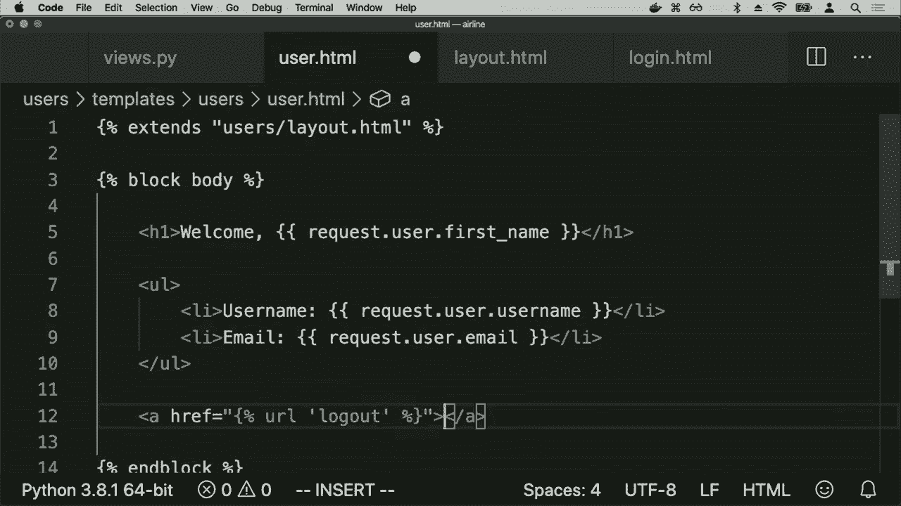

将会转到注销路由，仅仅说注销，例如，当哈利返回哈利的页面时，如果哈利看到一个说注销的 URL，哈利点击注销，哈利被注销并被带回这个页面，因为现在用户未经过身份验证，因此他们现在看到的只是默认的登录页面。

如果现在Ron使用他的用户名和密码登录，Ron将看到与他相关的信息，因此Django为我们提供了许多开箱即用的功能，让我们能够表示这些模型，并有一个管理界面来操作它们，以及一个迁移系统。

这个系统让我们可以非常快速地对模型进行更改并应用到数据库中，同时还有一个内置的用户身份验证系统，能够让用户快速登录和登出我们的网络应用程序。这些都是使我们能够轻松操作的功能。

很快利用一些东西，例如序列、模型和迁移，来构建动态有趣的网络应用程序，支持数据。这个就是用Python进行网页编程。
