# 哈佛CS50-WEB｜基于Python／JavaScript的Web编程(2020·完整版) - P15：L5- JavaScript编程全解 1 (事件，变量) - ShowMeAI - BV1gL411x7NY

[音乐]。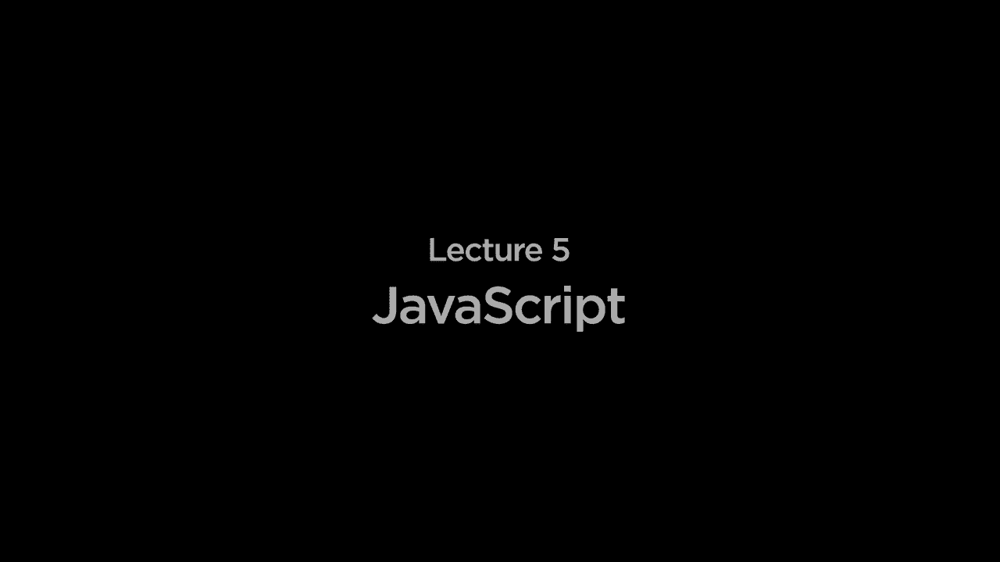

好的，欢迎大家回到Python和JavaScript的网络编程课程。今天我们将注意力转向第二种主要编程语言。

我们将重点关注这一类，特别是JavaScript，为了理解JavaScript实际上是如何有帮助的，我们回顾一下关于互联网通信的图示。

通常我们会有一个用户，也称为客户端，他们使用计算机上的网页浏览器，无论是Chrome还是Safari，或者其他网页浏览器，向某种网页服务器发送HTTP请求。该服务器处理请求，然后返回某种响应，返回给客户端。到目前为止，所有的代码。

我们编写了Python网络应用程序，代码在Django网络应用程序中运行。例如，所有代码都在某种服务器上运行，该服务器正在监听请求，进行一些计算以处理该请求，然后生成某种响应，通常以HTML的形式。

JavaScript将使我们能够开始编写客户端代码，JavaScript将允许我们编写实际在用户的网页浏览器中运行的代码。这对于多个原因都很有用，首先如果有。

我们想要进行的计算，但不需要去服务器进行计算，我们可以仅通过在客户端独立运行代码来更快地进行计算。此外，我们可以开始使我们的网页更具互动性，JavaScript将会。

HTML页面仅描述页面的结构，并在这方面提供了直接操作DOM的能力。DOM是文档对象模型，代表用户所查看的网页的树状层次结构，因此JavaScript将使我们能够编写代码，直接操作网页上的内容，我们将看到。

这很快就会变得非常强大。那么，我们如何在网页中使用JavaScript以添加一些代码，增加一些编程逻辑呢？到目前为止，我们已经看到了HTML，这是一种描述网页结构的语言。

嵌套标签，我们在页面顶部有那些头标签，描述页面结构的主体标签，以及可以嵌套其中的其他标签。为了将JavaScript添加到网页中，只需包含一些通常位于HTML页面内部的脚本标签。

我们使用这些脚本标签来告诉网页。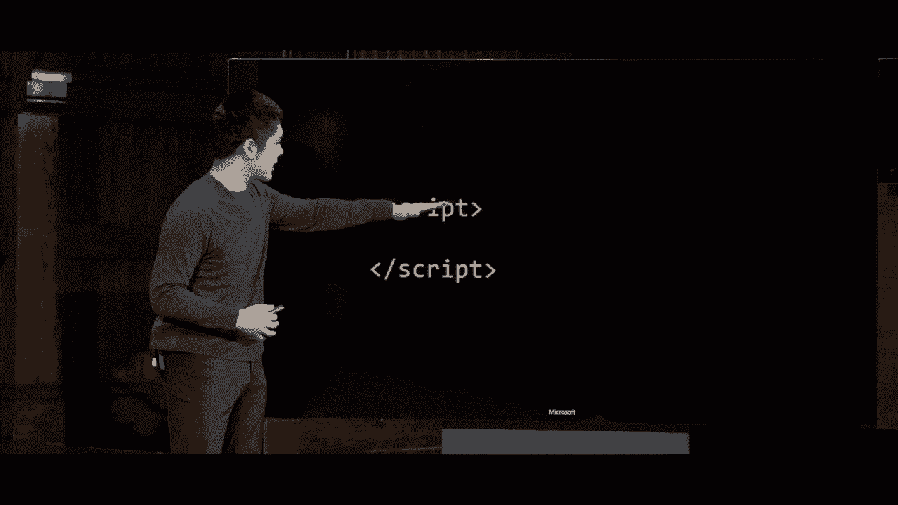

浏览器中，这些脚本标签之间的任何内容都应该被解释为JavaScript代码，网页浏览器将执行。因此，我们的第一个程序，例如，可能看起来像是脚本标签内部的一行代码，类似于这样，其中alert就是一个。

一个函数将会产生一个警报，和Python中的函数一样，JavaScript中的函数也可以接收参数，所以在这对括号之间，我们有一个参数，类似于字符串“你好，世界”，这是我们希望使用的文本。

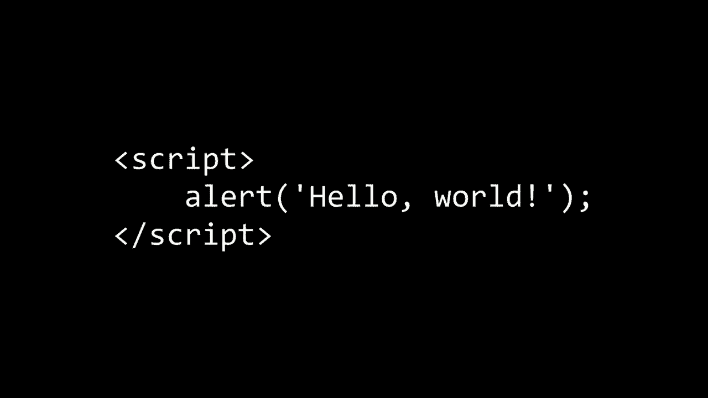

向用户显示，所以我们来试试看，看看我们如何实际上使用这段代码来编写将运行在用户网页浏览器中的JavaScript。我将创建一个新文件，称为hello.html，并在其中包含我们已经使用的基本HTML结构。

之前已经见过的地方，我有一个头部部分，其中有一个标题，然后一个主体，可能只说“你好”，例如，现在我想在这个网页中添加一点JavaScript，所以在我的网页头部部分，我要添加一个脚本标签，在这对脚本标签之间。

现在我可以编写JavaScript代码，这些代码将在用户实际打开这个页面时在网页浏览器中运行。现在我只需说alert，然后“你好，世界”，事实证明，在JavaScript中你可以使用单引号或双引号。

引号用于表示字符串，我通常在这里使用单引号，这只是一个惯例。所以在这里，我正在运行一个名为alert的函数，它将向用户显示一个类似于“你好，世界”的警报，这将在。

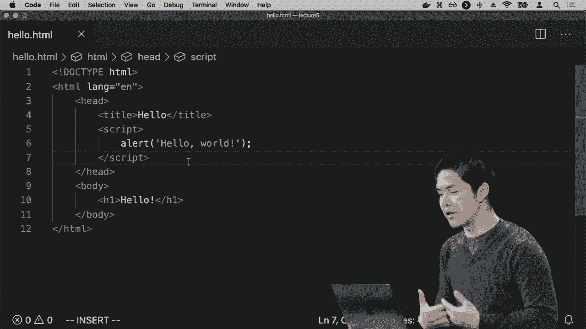

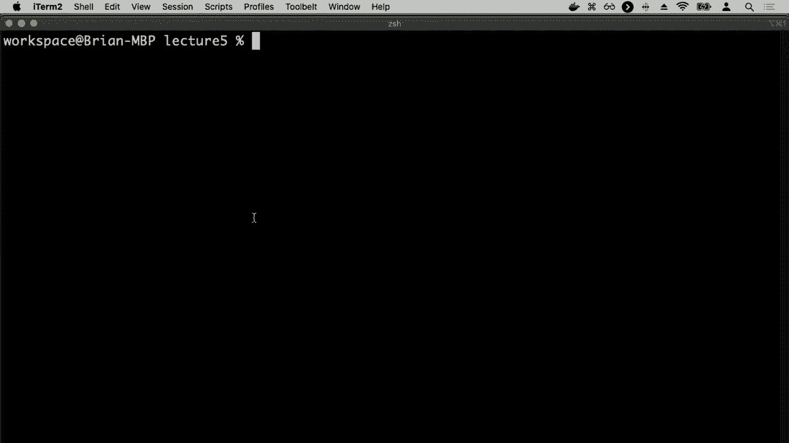

我想实际打开页面，我可以打开hello.html，或者你可以直接在你的网页浏览器中访问，无论是Chrome还是其他浏览器。而现在在页面顶部，你会注意到我得到了一个小警报，一些互动，显示这个页面说“你好，世界”。

让我选择一个选项，比如按下一个按钮，例如“你好，我想要”。确认按钮会显示“好的，关闭警报”，这是我们第一个**JavaScript**示例，我们有一个名为`alert`的内置函数在JavaScript中，用于我们的网页浏览器，并且我们的网页浏览器知道，当我们调用alert函数时。

浏览器应该显示一个看起来像这样的警报消息，如果我点击“确定”按钮以关闭。

警报，然后我们返回到最开始的原始页面，因此现在我们可以开始想象，利用这种能力来以编程方式显示警报，我们可以为我们的应用程序添加其他功能，而JavaScript可以非常强大。

是基于事件驱动的编程，而事件驱动编程的核心就是思考在网络上发生的事情是以事件的形式发生的。事件的一些例子包括用户点击按钮或用户从下拉列表中选择某项。

用户滚动列表或提交表单，用户的任何操作都可以一般视为事件，我们可以用JavaScript添加事件监听器或事件处理程序，这些操作会在事件发生时运行特定的代码块或函数。

我们可以开始让我们的JavaScript代码响应用户实际与网页的交互，比如当用户点击按钮时，我想运行这个特定的JavaScript函数。因此，让我们试一下，我现在要做的是。

警报hello world，让我把这个警报放在一个函数里面。在JavaScript中创建一个函数，只需使用关键字function后跟函数名称，我会称这个函数为hello，然后在括号内放入任何该函数接受的输入，这个hello函数将不会。

要接受任何输入，我将使用一个空的括号，然后在花括号内包含我想在此函数中运行的任何代码。因此，我现在所做的是创建一个名为hello的函数，然后在花括号内定义了函数体应该执行的代码。

运行hello函数，hello函数应该做的是显示一个警报，在这种情况下显示“hello world”。现在我想让这个函数在页面上发生某事时运行，例如当用户点击按钮时，为此我需要的第一步。

实际上要做的是创建一个按钮，添加一个仅显示“点击这里”的按钮。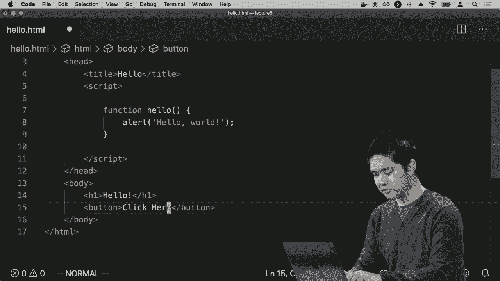

例如，现在如果我刷新此页面，我看到有hello，还有一个按钮显示“点击这里”，但当我点击时，没有任何反应。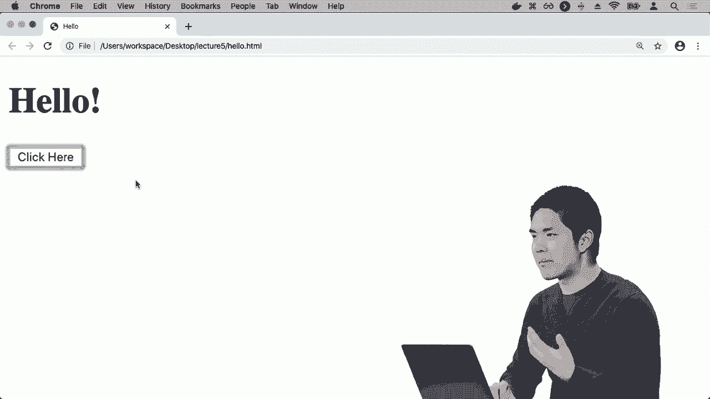

比如，当我点击“点击这里”按钮时，但它没有改变任何东西，因为我还没有说明当用户点击此按钮时应该发生什么。一种方法是向此HTML元素添加一个属性，称为onclick，这将添加一个事件。

这个按钮的点击处理程序将说明当用户点击这个按钮时应该发生什么，我将把 onclick 属性设置为运行 hello 函数。在 JavaScript 中运行函数的方法与在 Python 中运行函数的方法一样，你使用函数名后跟一个。

设置一对括号，表示去运行这个函数。使用这个括号调用函数，另一个表达运行函数的方式，括号之间没有内容意味着我们没有向 hello 函数提供任何输入，尽管如果 hello 函数确实接受。

我们当然可以在输入中添加这一点，在括号之间，所以现在我把这一页的两个部分结合在了一起。我有一个按钮，上面写着点击这里，并且我添加了一个 onclick 处理程序，说明当你点击按钮时，应该运行 hello 函数，然后在上面我定义了 hello 函数。

那么 hello 函数应该做什么呢？当函数被调用时，我们将显示一个提示，这个提示在这种情况下说 hello world。现在我们应该能够刷新页面，至少最初看到相同的内容，它只是显示 hello 和一个告诉我点击这里的按钮，但现在如果我去。

点击那个写着点击这里的按钮，那么我会收到一个提示，显示这个页面说 hello world。我可以按 OK，这个事件处理程序将始终有效。我再次点击按钮，我会第二次收到提示，因为每次我点击按钮，它都会调用 hello 函数。

再次，当我点击 hello，当 hello 函数运行时，它将显示这个特定的提示。所以这似乎给了我们相当大的能力，正如在其他编程语言中一样，例如 Python 或者你可能用过的其他语言，JavaScript 拥有所有这些相同类型的语言特性。

我们已经见过数据类型，比如字符串，但我们还有其他数据类型，我们也会很快查看。我们已经见过一些内置于 JavaScript 的函数，比如 alert 函数和我们自己可以编写的其他函数，比如 hello，但我们也可以包含。

比如在我们的代码中使用变量。我会创建一个新文件，它将被称为 counter.html，counter 将有一些类似于 hello 的代码，所以我现在就复制过来，但我会清除脚本部分，把标题从 hello 改为 counter，现在我会去掉。

我会保留这个按钮，但它不再说点击这里，而是会说计数。我想创建一个程序，简单地从零开始计数到一、二、三、四等等。为了做到这一点，我们需要某种重复计数的方法：零、一、二。

三、四、五，我需要在我的程序中有某种变量，跟踪数据，比如我当前计数到的数字。为了做到这一点，在JavaScript中我可以说，let counter等于0，这就是在JavaScript中我。

定义一个新变量时，我首先说let counter，意思是让有一个新的变量叫做counter，我将初始设置计数器的值为数字0。现在当我点击按钮时，不再运行hello函数，而是运行count函数。

还不存在，但我现在会写一个，我会定义一个名为count的函数，这个count函数首先会增加计数器的值。我可以用几种方式做到这一点，其中一种是说counter等于counter加1，表示继续重置计数器的值为。

如果计数器加1，并且还有几种简写方式。我可以等价地说counter加等于1，表示对计数器加1，或者在添加1的情况下，JavaScript与像C这样的语言类似，如果你以前见过它们，支持这样的写法，counter加加。

意思是取计数器的值，然后将其增加1，所以我会将1加到计数器的值上。接着我会显示一个警报，内容就是计数器当前的值。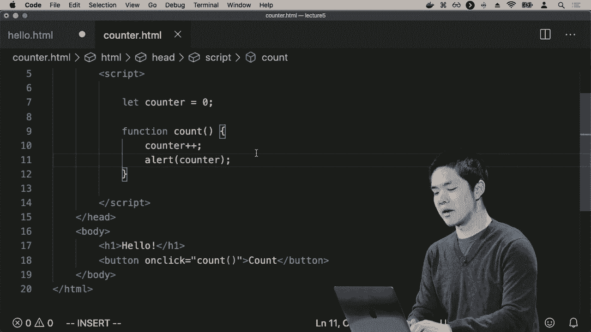

然后显示一个警报，告诉我计数器的内容。因此现在如果我继续访问counter.html而不是hello.html，我会看到仍然有一个按钮，上面写着“计数”，如果我点击这个按钮，我会得到一个警报，这次显示的是1，我们已经增加了计数器的值。

从0到1，警报现在显示1，我可以按确定，如果我再按一次“计数”，计数现在变成2，我按确定，再按一次“计数”，变成3，每次我点击“计数”，它都会增加我JavaScript网页中变量counter的值。

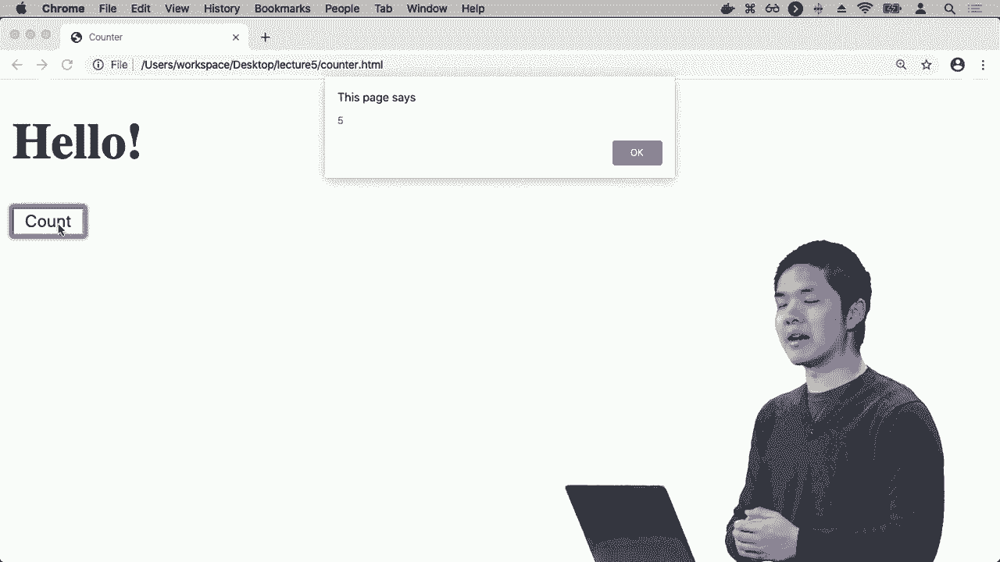

然后它会显示一个警报，里面包含那个变量的值。因此，现在使用警报，我们能够在函数内部操作变量的值，并显示显示这些变量的内容的警报。但是最终，当用户与页面交互时，它将会。

如果我们与用户交互的唯一方式是通过显示这些警报，那将非常烦人，相当于打印一些内容，只不过不是打印到终端，而是通过在屏幕上出现的警报打印出来。更有趣且更强大、更加。

在网页上下文中更有用的是，如果我们可以以编程方式更新。网站，改变用户实际看到的网页的某些内容。更改页面上发生的内容，结果是 JavaScript 将。使我们能够做到这一点，因为 JavaScript 允许我们。

操作 DOM，即文档对象模型，表示该页面上所有的。元素，所以为此，让我们回到 hello HTML，这又是这个 paté，网页，只是说你好，并给我一个按钮，如果我点击那个，按钮，它会显示一个警告。

说你好，世界现在我想要做的是，而不是让 hello 函数。显示一个警告，我想让它，操作页面上的某些东西。我可能想要操作的是什么呢，页面的主体中，我这里有。这个标题，这个只是说，您好，例如，它在一个。

h1 元素，我可能想要做的是实际更改，那个元素我该怎么做呢，结果是，在 JavaScript 中，我们可以，访问一个叫 document dot。query selector 的函数，document query，selector 将要做的是，它将。给我们提供能力，浏览一个 HTML 页面，提取出一个元素。

在页面上，这样我们就可以使用 JavaScript 代码操作这个 HTML 元素。如果我想选择一个 h1 元素，我可以说 document query。selector，然后作为参数，输入到 document 的 query selector。我将继续说每个一个意思，遍历页面，找到我一个 h1。

元素，query selector 只会返回一个元素，因此如果有多个，它将返回第一个，找到的东西，但在这里我们只有一个。h1 元素，所以没问题，我要说在这个文档中查找，h1 元素，当你找到时，我想要，操作它，我想要的方式是。

操作它的方法是通过说点 innerhtml，等于比如说再见。因此，好吧，这里发生了什么呢，现在，最初当我们第一次加载。页面时，我们有一个 h1，一个大的标题在。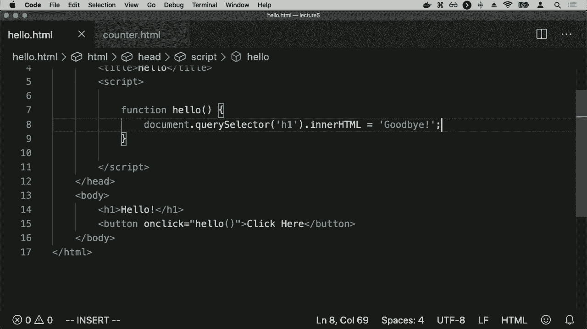

顶部只是说了你好，现在，当这个 hello 函数被调用时。它是在点击这个按钮时被调用的，因为它有一个 on-click 属性。这个属性等于 hello 调用 hello 函数，hello 函数将做的是，它会说，document query selector h1 找到我。

h1 元素将返回这个元素，右边是这个 HTML 元素的 JavaScript 表示。它只是一个 h1，其内部的 HTML 说你好。如果我想更改那个 HTML，我可以通过，修改 inner HTML。属性来做到这一点，更新任何东西的属性。

在 JavaScript 中，通常会使用 `this`，点表示法来访问某个特定对象的属性，因此我有这个元素，这个 h1，点 inner HTML 意味着获取该元素并访问其 inner HTML 属性，我想更新它的内部。

HTML 在这种情况下只是单词 goodbye，后面跟着一个感叹号，例如。所以现在我们看到的是，当我们运行这个页面，打开 hello HTML 时，我仍然看到一个 h1，上面写着 hello，仍然看到一个按钮，上面写着 click here，但现在当我点击按钮时，显示 goodbye。

我们已经运行了查找页面上 h1 元素并操纵它的 JavaScript 代码，将它更改为与最初不同的内容，现在每次我点击这里，没有其他事情发生，因为每次我点击这里，它都将找到相同的 h1，并将其 HTML 更新，从 hello 更改为 goodbye。

所以也许我真正想要的是切换回和切换去的能力，而不是每次点击按钮时只是将它从一种状态改为另一种状态，我希望它交替回去，有很多方法可以想象。

这可以通过利用条件来实现，类似于像 Python 这样的语言具有条件 if 和 else。JavaScript 也有 if、else if 和 else，允许我们描述条件，以便我们只能运行特定的代码块，当某个布尔表达式为真时。

在某些代码块中，当特定的布尔表达式为真时，比如说，好的，我们在这个 hello 函数中可以问一个问题，如果 document query selector H1 的 inner HTML 等于 hello，那就继续设置它为 goodbye，否则设置为 hello。

然后继续更新这个 h1 元素的 inner HTML，继续设置它为。

这个 hello 函数在做什么？现在它更复杂了，它有一个条件，我说 if，关键字 if 后面跟着我想要检查的条件，我想看看这个条件是否为真，我在检查的是让我运行 document query。

选择器 h1 通过页面查找 h1 标签并为我获取该元素，如果我查看该 inner HTML，如果它等于 hello，那么我想做某件事，而这个三重等号是 JavaScript 检查严格相等的方式，以确保这两个值是相等的，并且类型也是相同的。

它们的类型是相同的，如果这个是一个字符串，这也必须是一个字符串，结果表明在 JavaScript 中，还有一种较弱的检查相等的方法，只使用两个等号，这会检查值是否相同，但允许在类型上有一些差异。

可能有不同类型，但只要它们的基本值相同，双等号通常会返回 true。通常如果可以，你会想使用这个三重等号，严格相等，确保类型和数值都相同，而这个三重。

等号会检查这两件事。因此，如果我找到 h1 元素并且它的内部 HTML 是“你好”，那么请继续找到 h1 元素并更新它的内部 HTML，将其设置为“再见”，例如，否则继续找到同样的 h1 元素，更新内部 HTML 设置为。

你好，再次就像在函数中一样，我们使用这些花括号来包裹函数的主体，所有位于函数内部的代码行，JavaScript 在条件内部做了同样的事情，当我们想要表示这在 if 条件的主体内部时，我可以使用花括号。

花括号来表示这一行代码和那一行代码位于 if 表达式内部或位于 else 表达式内部。例如，让我们现在试一下，我可以打开 hello.dot HTML，刷新一下，当前显示“你好”和一个按钮，上面写着“点击这里”，现在，当我点击这里时，“你好”会变成。

“再见”，而当我再次点击这里时，“再见”又会变回“你好”，每次我点击这个按钮，它将会在“你好”和“再见”之间交替。因为我们要么在 if 中被捕获。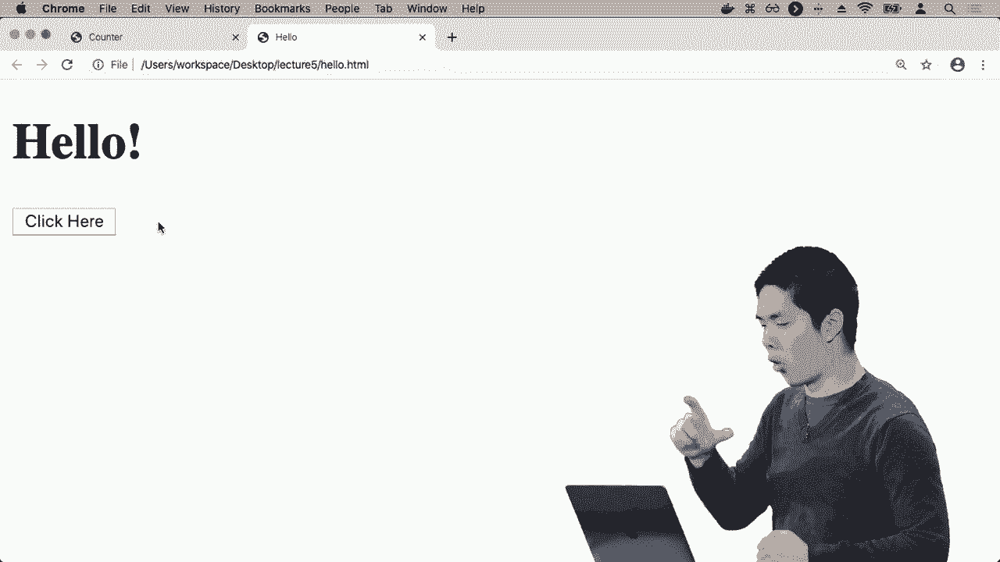

表达式，或者我们被捕获在 else 表达式中。现在有几个地方你可能会看到这一点，并注意到这段代码的效率可能没有那么高。请记住，每次我们运行 document.querySelector 时，都会说“去查找一个特定的 HTML”。

对我而言，它会在该页面上查找 h1 元素，结果现在我们有三次对 querySelector 的调用，尽管在任何给定的函数实例中，只有两个会运行。但我们 document.querySelector，然后在 if 表达式内部再次调用它。

可以通过提取出来来改善这个页面的设计，先查找一次 h1 元素，然后使用我们找到的元素进行操作和检查。为此，我们可以以变量存储一个元素，方式与变量存储数字相同。

计数器或像“你好，世界”这样的字符串，它还可以存储其他值，比如从 document.querySelector 获取的 HTML 元素。因此，我可以说一些类似于 let heading，heading 只是变量的名称，等于 document.querySelector h1，例如，找到 h1 元素并保存它。

在一个名为heading的变量内，现在不再每次都使用文档查询选择器。我可以简单地说，如果heading的inner HTML是你好，再见。否则，我将heading的inner HTML设置为你好，因此我提高了程序的效率，也减少了我必须写的代码字符数。

我的代码行现在短得多，更容易阅读，我们会认为这是设计上的改进，结果发现这里还有一个其他的改进，我们可以像让某物等于其他东西一样定义变量，但事实是JavaScript给了我们几个。

定义变量的方法，如果我们要创建一个值永远不会改变的变量，我们就不会将变量名重新分配给其他东西，那么我们可以通过将其称为常量来强制它永远不会改变，所以常量heading等于文档查询。

选择器h1意味着我将创建一个。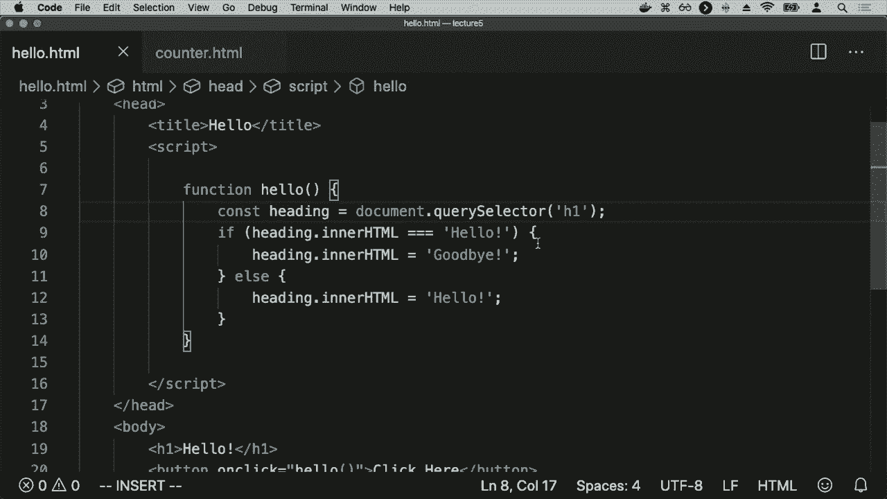

一个名为heading的变量，将其设置为文档查询选择器h1的结果，之后我将不再改变heading的值，我不会再有一行代码说heading等于其他东西，因为它是常量，JavaScript将强制这个变量不应该。

改变它，如果我真的尝试改变它，javascript会给我一个错误。这可以帮助防止潜在的意外行为。如果你知道一个变量是永远不会改变的，通常最好把它标记为一个常量，这样你的代码就知道它永远不会有变化。

之后改变的值，所以这将以相同的方式表现，它说你好，但我可以来回切换，将其改为再见并。

再次将其改回你好，因此现在利用这种能力。
