# 哈佛 CS50-WEB ｜ 基于 Python ／ JavaScript 的 Web 编程 (2020·完整版) - P16：L5- JavaScript 编程全解 2 (DOM 操作) - ShowMeAI - BV1gL411x7NY

我们的计数程序实际上正在改进，目前计数器的状态。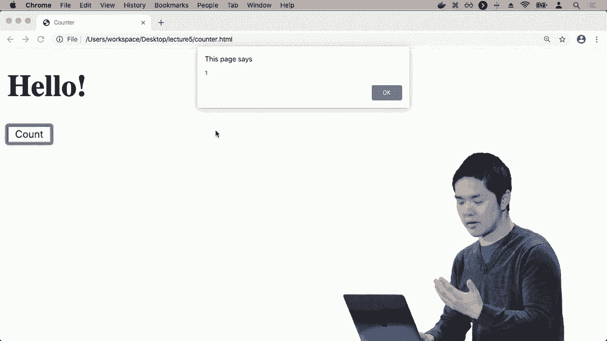

计数程序显示一个警报，显示“1”，我计数时显示一个警报，显示“2”。我可能可以做得更好，而不是显示警报，实际上以某种方式操作 DOM。我希望将这个 h1 大标题放在顶部，而不是从。

开始时说“你好”，比如说初始值为 0，现在当我增加计数器的值时，而不是显示一个仅告诉我计数器值的警报，我将改为使用 document.querySelector h1.innerHTML。

等于计数器，我在说找到 h1 元素并更新 innerhtml。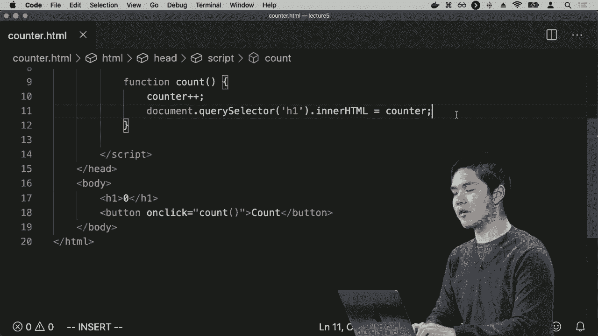

将其等于计数器变量的值，这样如果我刷新此页面，h1 的初始值就是 0。这是初始值，但每次我点击计数，我们将更新该 h1 元素的内容，这次设置为 1、2、3、4 等等，每次我。

点击计数按钮，它会增加变量的值，并操作 DOM。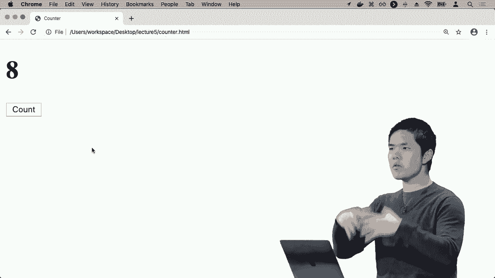

进行更改以产生我想在这个实际页面上看到的效果，我们可以开始添加额外的逻辑，也许我确实偶尔想要一个警报，但我不想每次都出现警报。我可以添加一个条件，比如说如果我只想显示一个警报。

每次我计数到 10 的倍数，比如 10、20、30、40、50 等等，我可以添加一个条件，判断如果计数器对 10 取模，取模运算只会在你除以 10 时得到余数。如果将计数器除以 10，如果余数为 0，当我除以 10 时，这意味着计数器是一个。

是 10 的倍数，所以我现在可以显示一个警报，显示像“计数器现在是 10”或“计数器现在是 20”这样的信息。为了做到这一点，我真正想做的是在 JavaScript 中将变量插入字符串中。

在 Python 中，我们会通过在字符串前添加 f4 来创建格式化字符串，然后我会说类似“计数现在是”之类的话，然后用花括号来打印出计数器的值，所以这个 f4 格式化字符串后面跟着。

在 Python 中，字符串是我们会使用这种方式的。事实证明，JavaScript 也做同样的事情，只是语法略有不同。它不使用 F，而是使用常规的引号，无论是单引号还是双引号，JavaScript 使用反引号。

通常位于标准美式键盘上的 tab 键上方。这将创建 JavaScript 所称的模板字面量，在这里我可以替换模板中的变量值。然后为了实际进行替换，Python 使用双。

大括号来表示在这里插入 counter 的值，JavaScript 做了类似的事情，它也使用双大括号，但前面需要有一个美元符号，美元符号和双大括号，我们可以直接插入一个变量的值。所以这样。

是一个模板字面量，每次我们到达十的倍数时，我们将显示一个警报，说明计数现在是，然后这个美元符号大括号意味着实际上插入任意。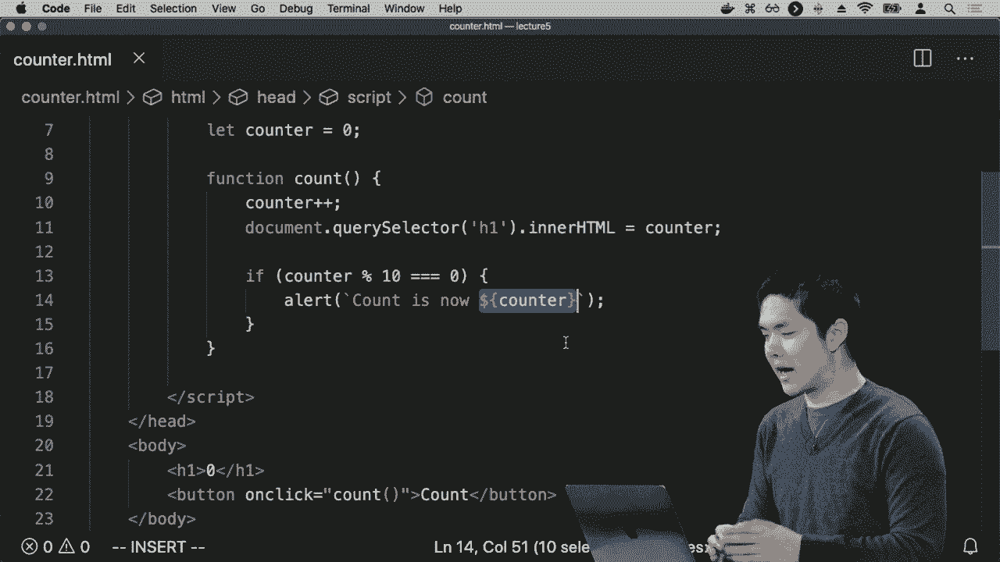

counter 的值正好在这里，所以现在如果我继续刷新。counter 从零开始，我可以计数 3，4 5 6 7 8 9，但当我到达 10 时，我就会收到一个警报，说计数现在是。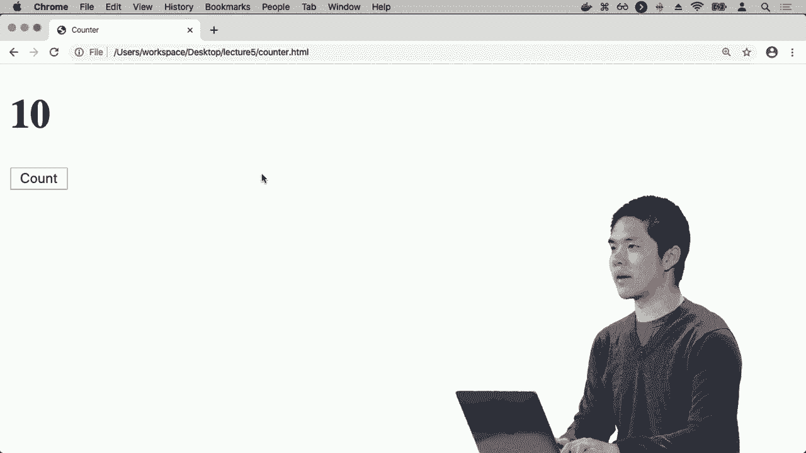

10 然后我看到结果在页面上更新，因此这个模板字面量。可以让我们结合变量和字符串，以生成新的字符串。它们能够代表内部的数据，因此现在我们可以开始做哪些改进？我们可以做哪些更改来改进这个。

设计它的方式，特别是当我们的程序变得更复杂一些，更复杂一些时，我们通常不想将 JavaScript 代码与 HTML 的内容交杂在一起。这里我们有按钮 on click 等于 count，这是这个函数的名称。

尤其是当我们的页面变得更复杂时，如果我们不断维护一点 JavaScript 代码，比如在 HTML 中调用一个函数，这会变得有点烦人。稍后我们会看到，还有其他范式实际上鼓励。

这种类型的做法，但现在如果我们真的想将所有 JavaScript 相关的代码与 HTML 的一般结构分开，它可以开始设计得稍微糟糕一些。因此，我们可以开始做到这一点，我可以在 JavaScript 中添加一个事件监听器，我可以说。

类似于 document dot query，selector button 然后我可以说 dot。on click 等于 count，那么这里发生了什么，我可以这样做而不是这个。on click 等于 count 我现在所说的是 document query selector button。找到页面上的按钮，结果发现这里只有一个按钮，所以。

不过，如果有更多，我可能需要稍微具体一些。但一旦我找到了那个按钮，我将访问它的 on click 属性。并将其设置为 count，count 是函数的名称，count 本身就是一个函数，所以我这里所说的是我会。

我希望将按钮的 onclick 属性的值设置为计数，计数是当按钮被点击时应运行的函数。注意，我实际上并没有调用该函数，而不是 "count" 然后加上括号，这样就不会运行计数函数并获取其返回值。

值并将其用作值。  

onclick 我只是将 onclick 设置为计数函数本身，而不是真正调用该函数，这样做的目的是在按钮被点击时，仅在那时才应该运行这个计数函数，而我们不会运行计数。

直到那个按钮被点击，函数才会被执行。在 JavaScript 中，函数可以被视为自己的值，就像你可以将一个变量设置为字符串一样，甚至可以将变量设置为整数，就像你可以将变量设置为 HTML 元素一样，例如 document 的结果。

使用 querySelector 你还可以将变量设置为函数，例如 count，并将其作为值传递，就像你可以使用任何其他值一样。这是我们通常称之为函数式编程的范例，在那里我们将函数视为自己的值，可以重新分配。

我们可以操作的事物就像我们可以拥有任何其他值一样，所以现在我可以尝试通过刷新页面来运行这个程序。我将其刷新，初始值为零，我按下计数，好的，似乎什么也没有发生，仍然是零，我希望它能计数，但它。

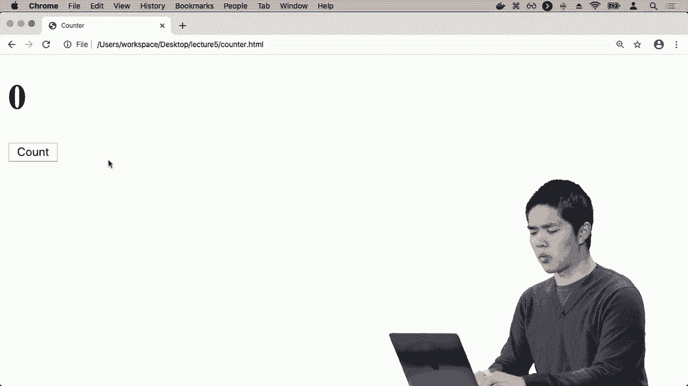

这似乎不工作，那为什么呢？每当你在 JavaScript 中遇到问题而未得到想要的行为时，查看 JavaScript 控制台通常是有帮助的，JavaScript 控制台相当于终端窗口，当你运行你的代码时。

Django 应用程序在 Python 中会显示任何错误消息，JavaScript 控制台也会显示任何 JavaScript 日志信息和错误消息。在 Chrome 中，我可以通过先点击检查，然后打开控制台标签来查看，一切正常。

这里似乎有某种错误，是一个未捕获的类型错误，表示我们无法在未遇到的情况下设置属性，HTML 第 18 行会告诉你错误来自哪里，确实是来自计数器 HTML 的第 18 行。问题似乎是我正在尝试访问 onclick 属性。

"no" 在 JavaScript 中表示“没有”，是表示不存在某个对象的方式，所以不知为何我正在尝试设置 "no" 的 onclick 属性。让我们看看第 18 行发生了什么，看看能否弄清楚那里发生了什么。好的，第 18 行是我说的 document.querySelector button。

设置它的onclick属性等于计数，现在看起来这里的问题是什么呢？错误信息是，我试图修改onclick属性为null。那么这里的onclick属性是什么呢？那么为什么这个document query selector按钮会返回或给我输出null呢？

结果发现如果document.querySelector无法找到某个元素，它将返回null。如果我试图查找一个按钮，但无法找到这个按钮，这似乎有点问题，我希望我的JavaScript代码能够在运行querySelector时找到按钮。

结果发现这是浏览器工作方式的一点怪癖，但如果浏览器从上到下运行我们的代码，从第一行开始不断读取，它将在第18行到达我说document.querySelector按钮onclick等于计数的地方，并试图找到一个。

按钮在第18行，但是按钮在我的HTML页面中直到页面更下方才显示，因此在这一点上，当我们到达这行JavaScript时，JavaScript正在寻找按钮，但文档的主体尚未加载完成，DOM的内容尚未加载。

结果是我们无法找到这个按钮。那么我们如何解决这个问题呢？我们如何才能让它能够询问按钮并真正获取到按钮呢？结果发现我们可以使用几种策略。一种是将脚本标签移动到底部。

这是文档的一部分，所以在我们已经定义了说“计数”的按钮之后，我们有了脚本标签，然后说好吧，继续，现在找到按钮，结果发现另一种方式，也许是更常见的方式，是再添加另一个事件监听器，我们将要。

将事件监听器添加到整个文档上，而不是按钮，其中document是一个内置于我们在网页上访问的JavaScript变量，指的是整个网页文档，我已经使用document.querySelector来查找整个网页文档，试图找到一个。

我正在尝试查找一个h1标签，例如，但我也可以将事件监听器添加到文档本身。为了做到这一点，我可以说document.addEventListener，当我调用addEventListener时，我可以在任何HTML元素上执行此操作，不仅仅是文档，我可以在一个按钮上运行这个函数。

在一个h1元素或任何其他HTML元素上，添加事件监听器通常需要两个参数，第一个是我想要监听的事件。这个事件可能是点击，当我点击文档时，它可能是类似于我滚动页面时的某个事件，但在这个事件上，我。

我将要监听的是一个特别的事件，称为DOM内容加载。DOM内容加载事件是在文档对象模型（DOM）页面结构完成加载时触发的事件，当页面上的所有元素都加载完成时，DOM内容就被加载了。

如果我为它附加一个事件监听器，你知道运行我想运行的代码，只有在DOM完全加载后，即页面上的所有内容都加载完成后，事件监听器的第二个参数是事件实际发生时应该运行的函数。

加载确实发生时，我可以传入一个函数的名字，如果我有想传入的函数名字，但另外JavaScript允许我直接在addEventListener的参数中写一个函数。我可以直接说function，然后是一对括号，表示这个函数不接收任何输入，然后在花括号中，我可以包括这个函数的主体。

这是一个有点棘手的语法，如果你以前没见过的话。但大体上可以理解为addEventListener接收两个参数。

第一个参数是事件，第二个是函数，这里第一个是事件DOM内容加载，第二个参数是一个函数，我声明的函数和之前一样，只是使用function，我没有给这个函数命名，因为严格来说它不需要名字，我也不会再引用它。

通过名称调用函数，这就是我们可能称之为匿名函数的函数，一个没有名字的函数，但我仍然将它作为参数传递给addEventListener函数，因为我想在DOM加载完成后运行函数内的代码。

函数的内容是DOM完成加载时应该运行的代码，然后在最后我再次使用这个结束括号，这个结束括号与这里的括号对齐，这包围了addEventListener的所有参数，其中第一个是DOM内容加载，第二个是整个内容。

可能跨越多行的函数，所以你会在JavaScript中看到这样的语法，但现在我想做的是为按钮添加事件监听器。我可以直接这样做，想要的只是替代说点点击等于计数，你可以使用相同的addEventListener语法。

eventlistener点击，然后计数，意味着当点击事件发生时，去执行计数函数，但你也可以简化这段代码，直接说点点击等于计数，这样也可以。所以现在我们所说的是，等到DOM加载完成，等到所有的内容都加载完成。

页面上的内容加载完成后，接着运行这个函数，这个函数将为这个按钮添加事件处理程序，这将有效，因为现在我们能够找到按钮，因为DOM的所有内容都已加载，所以现在如果我回去刷新。

在counter.html中，你会注意到JavaScript错误消失了，我似乎不再有那个错误，现在如果我按计数，我们能够看到计数像之前一样递增，因此这相较于我之前的情况是一个改进。

但是我代码的其余部分也如此，比如在CSS的情况下，我们能够将原本位于页面头部的CSS移动到单独的文件中，你也可以对JavaScript做同样的事情，这在有多个团队成员在不同文件上工作时是有帮助的。

有人在处理HTML，另一个人在处理JavaScript，如果你预计其中一个会比另一个更频繁地更改，这会很有帮助，因此你可能不需要那么频繁地加载另一个，所以将HTML代码与JavaScript分开会更有价值。

通过将我们的JavaScript移动到一个单独的文件中，为此我可以创建一个新文件，称为counter.js，它将包含我counter.html文件的所有JavaScript，因此为此我可以说，让我们继续复制所有的JavaScript代码并剪切它。

将这个页面中的内容复制到counter.js中，移除一些缩进，现在我有一个名为counter.js的文件，仅包含我想在counter.html页面上运行的所有JavaScript，而不是在这些script标签之间包含实际的JavaScript，我可以说，script src。

等于counter.js，例如如果我继续引用counter.js并使用。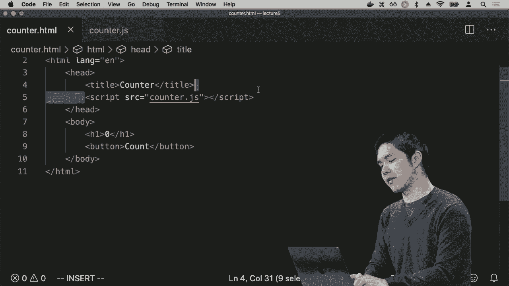

在页面的头部有JavaScript，这将会工作。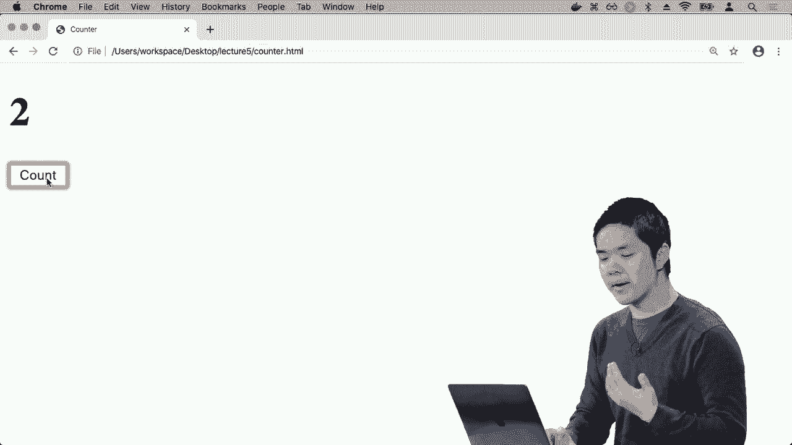

以完全相同的方式，我仍然可以计数到我想要的任何数，我仍然会在计数达到十的倍数时收到警报，但我的HTML现在更简单，它只是主体，只是h1和按钮，然后我的所有JavaScript现在都位于一个单独的文件中，这让我能够做到这一点。

这让我能够将HTML代码和JavaScript代码彼此分开，这在几个方面是有价值的，其中之一是如果我有在多个不同HTML页面中使用的常见JavaScript代码，多个HTML页面都可以包含相同的JavaScript源，而不需要重复自己。

我可以在多个不同的页面中使用相同的 JavaScript，只需在所有页面中使用相同的 JavaScript。这样也会很有帮助，因为我们稍后会看看一些由其他人编写的 JavaScript 库，我们可以直接在自己的代码中包含其他人的 JavaScript。

通过在页面顶部添加一个指定特定来源的脚本标签，可以让网页实现功能。你可能已经与 Bootstrap 进行过交互，它有自己的 JavaScript 代码。你可以通过在 HTML 页面的顶部包含一个脚本标签来包含 Bootstrap 的 JavaScript，从而实现这一点。

在我们的页面中也使用 JavaScript。那么，现在我们有什么其他可以做的呢？既然我们有能力获取 DOM 元素并实际操作它们的内容。我们可以开始让我们的页面变得更加互动，实际上响应用户在页面上的操作。

用户可能正在输入一些内容，或者填写表单。因此，让我们尝试一个例子，假设用户正在填写表单，我们希望我们的代码以某种方式响应他们输入的内容。我将返回到 hello.html，现在在里面。

在页面的主体部分，我在顶部说了“您好”。我将用一个表单代替按钮，这个 HTML 表单看起来像我们之前见过的 HTML 表单。我有一个输入字段，会添加自动聚焦属性，让用户能够立刻开始输入。

我将给这个输入字段一个 ID，比如名称，然后设置一个占位符，名称的首字母大写，类型为文本。所以，我在这里做了什么呢？我创建了一个输入字段，用户可以在其中输入一些文本，占位符是用户看到的东西，最初将仅为“名称”。

我告诉他们应该在这里输入他们的姓名，并且给这个输入字段赋了一个 ID，这是一个唯一标识符，以便我稍后能够引用并找到这个特定的输入字段。然后，我有输入类型为提交，这样我也可以提交这个表单。所以，如果我加载这个页面，加载 hello.html。

这是我所看到的，您好，一个可以输入我姓名的字段，占位符“名称”显示在那儿，然后是一个按钮，我可以提交这个表单。现在，我想在我的 JavaScript 中，替换掉这个“您好”函数，我要做的是，首先运行一些 JavaScript。

DOM 加载完成后，我会使用之前的那一行代码，你会看到它很多次。我们将说 document.addEventListener DOMContentLoaded，然后这个函数意味着当 DOM 加载完成时运行这段代码。我想运行的代码是，当我提交表单时，我希望。

当我提交表单时，可能我想显示一个警告，比如如果我输入 Brian，它会说 hello Brian，或者如果我输入 David，它会说 hello David，例如，那么我该怎么做呢？首先的问题是如何获取这个表单。

在 HTML 页面上，通常我们会使用 document dot query selector 来获取一个表单元素，并且页面上只有一个表单，所以我不必担心歧义，我只是说获取那个表单，然后我可以说 dot on submit，当你提交表单时，应该运行什么代码。

如果我有一个函数的名字，比如 f，我可以简单地说在表单提交时运行函数 f，或者，像以前一样，除了提供函数名，我还可以直接提供函数本身。我可以说函数，然后在这些大括号之间精确地指定。

当表单提交时，应该运行什么代码，通过提供这个匿名函数，而不是使用这个匿名函数作为这个表单的 on submit 属性的值。因此，现在我想做的是以某种方式访问用户在输入字段中输入的内容，无论用户的名字是什么。

我可以通过 document dot query selector input 来获取输入字段，这次是可行的，但我们需要开始稍微小心一点，因为在这个页面上有多个不同的输入元素，这里有一个输入元素用于输入姓名，还有第二个输入元素用于其他信息。

给我一个按钮，让我可以提交这个特定的 HTML 表单，所以我可能想做得更具体，结果是。

在 query selector 内部，我可以使用所有在 CSS 中标准的选择特定元素的方法，所以在 CSS 中，如果你还记得，我们可以运行 CSS 并简单地说样式所有的 h1，或者我们可以说样式所有的。

关于这个特定 ID 或这个特定类的内容，document 的 query selector 以相同的方式工作，我可以说 document query selector 并传入一个标签，比如说获取我 h1 元素，或者获取我按钮，或者获取我表单，但如果有多个 h1 元素或多个按钮的话。

如果一个元素有一个 ID，那么我可以说 document query selector，然后在引号中写上井号，再加上 ID 的名字来获取具有那个特定 ID 的元素，再次使用与 CSS 相同的语法，如果我想只应用一组特定的样式。

对于只有一个 ID 的元素，同样，对于两个元素，我可以说 document query selector，然后使用点跟着类名，如果有特定的元素类，我想仅获取其中一个，并且说让我获取具有这个特定类的元素，以便对其进行操作。

所以我们可以在 CSS 中使用的相同类型的语法来引用和获取特定的 HTML 元素，我们可以在这里用 document query 做同样的事情，因此去尝试基于标签名、ID 或类名获取特定元素，这就是在 HTML 中的原因。

对于我的输入框，我给输入框一个 ID 为 name，我想要某种方式来唯一引用它，我可以通过 ID 为 name 的元素唯一引用它，那就是我想在 JavaScript 代码中提取的元素。

一旦我有了那个 HTML 元素，我想要的是用户实际输入的内容，结果是，如果你在 HTML 中有一个输入字段，我可以通过访问它的值属性获取用户输入的内容。

所以我可以说点值，我将把它保存在一个变量中，可以说像 let name 等于用户输入的内容，但如果我不打算在这个函数内部重新赋值给名称，我只会获取名称一次。

我不打算在函数内部改变它，所以我可以使用常量，这样更好，我有一个名为名称的常量变量，它等于 document query，选择器获取 ID 为名称的元素并获取其值，现在我可以显示一个警报。

例如在反引号中使用 hello comma，然后使用美元符号的花括号语法，我可以插入名称，后面跟着感叹号。因此，我从表单中提取了名称，获取用户输入字段的值，并显示一个警报。

我要向那个人打招呼！ 

例如，现在我刷新页面，输入我的名字，按提交，我得到一个警报，显示 hello Brian，按确定，我可以再试一次，输入类似 David 的内容，按提交，现在页面显示 hello David。

所以这里我们能够结合事件监听器、函数和查询选择器，既可以读取页面的信息以获取特定 HTML 元素，又可以访问用户输入的内容，点值属性获取用户输入的内容。

这是输入字段中输入的内容，我们能够将其与事件监听器和警报结合，实际上对用户提交表单或页面内容加载完成时做出动态响应，从而产生一些有趣的效果。

不仅仅是改变元素内的 HTML，我们也可以改变 CSS，改变特定元素的样式属性。那么让我们先看一个例子，我将创建一个新的文件，叫做 colors.html，然后在 colors 中我将包含这。

这是我们通常从一个标准的 HTML 模板代码开始的，包含一个头部和一个主体部分，在这个页面的主体中，我将展示一个标题，仅仅写着你好，举个例子，也许我会给它一个 ID，以便我能通过名称引用它，也许它的 ID 是 hello，然后我将。

三个按钮，我会有一个叫做红色的按钮，一个叫做蓝色的按钮，还有一个。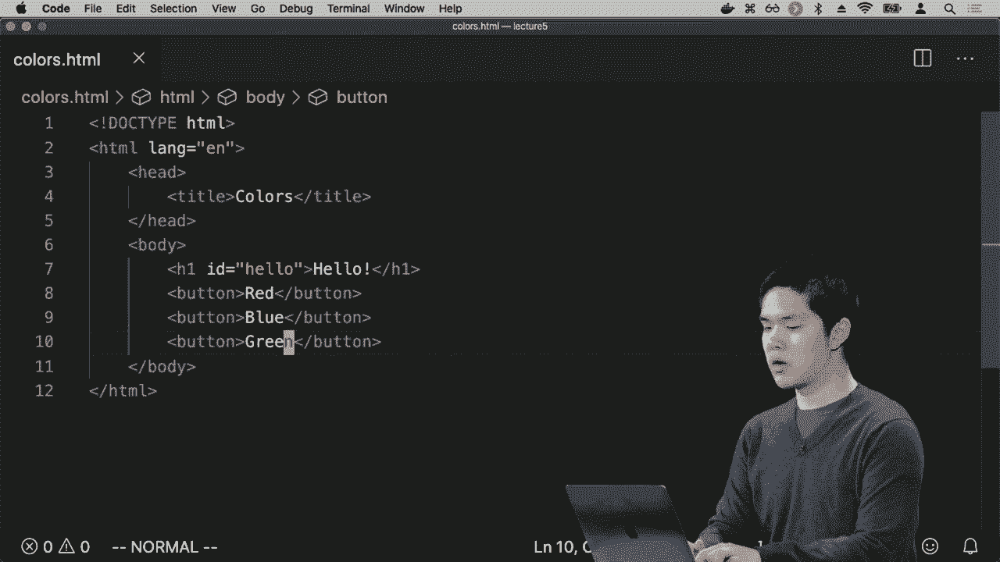

例如有一个叫做绿色的按钮，现在如果我打开 colors.html，看到的是一个大标题，写着你好，然后我看到三个按钮：红色、蓝色和绿色，但当然现在。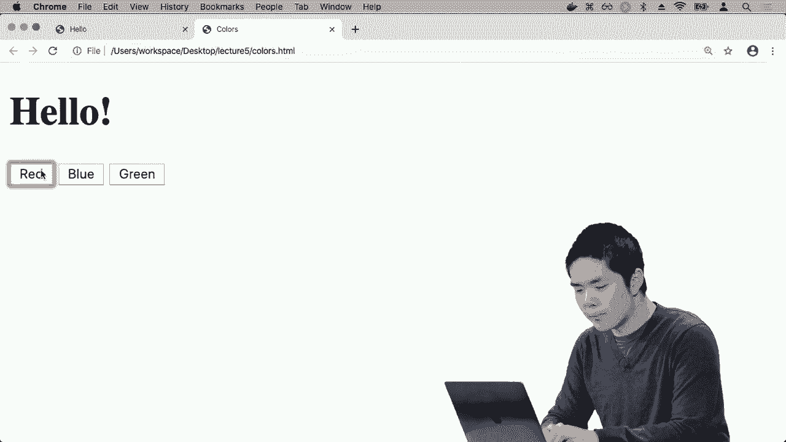

这些按钮实际上什么也不做，我该如何让按钮做点什么呢？这就是 JavaScript 将派上用场的地方，我将把一个脚本标签添加到页面的顶部，我只希望在 DOM 加载完成时运行这个 JavaScript。因此，我们将使用与之前相同的语法：document.addEventListener。

DOM 内容加载完成后，运行这个函数，表示在这两个花括号之间的所有代码将在页面加载完成后运行，我真正想做的是获取这三个按钮，并说当你点击每一个时，做不同的事情，比如改变。

特定 HTML 元素的颜色，为了做到这一点，我需要某种方式唯一引用这些按钮。为此，我将给它们所有的 ID。这个按钮将有一个 ID 为 red，这个按钮将有一个 ID 为 blue，这个按钮将有一个 ID 为 green，唯一的名称我可以给按钮。

在 HTML 中，以便在 JavaScript 中我能够稍后引用它们。那么我现在在我的 JavaScript 代码中应该包含什么呢？好吧，让我说 document.querySelector 选择器 hash read，获取 ID 为 read 的元素，当你被点击时，点击后运行这个函数，这个函数应该做什么呢？我想。

将这个 h1 元素的颜色改为红色，我想将字体颜色改为红色，并且我会在 JavaScript 中给自己留一个注释，方法是使用这两个斜杠。两个斜杠表示页面上之后的所有内容都将是一个。

注释浏览器会忽略它，但对程序员和阅读你代码的人来说，它可以是有用的，能够看到你在页面上描述的内容。现在我想做的是 document.querySelector hello，获取 ID 为 hello 的 HTML 元素，然后继续。

修改它的样式属性，现在在这个样式对象中，我可以修改任何CSS样式属性，例如颜色，所以我可以更新颜色属性并将其设置为红色。所以现在我在说，当你点击红色按钮时，运行这个函数，而这个函数。

我应该找到hello元素，更新它的样式，具体要更新哪个部分的样式呢？我们应该将颜色更新为红色，我会为其他两个按钮做同样的事情，代码非常相似，我会在这里复制粘贴。

点击蓝色按钮时，颜色应该变为蓝色；再做一次，当你点击绿色按钮时，字体颜色应该变为绿色！

将颜色改为绿色，所以当我刷新时，当前的颜色是黑色，标准的HTML字体颜色。我点击红色，hello变为红色；我点击蓝色，变为蓝色；我点击绿色，变为绿色！

绿色取决于我点击哪个按钮，这会触发某个事件监听器。点击按钮时，会运行这个函数，而这个函数的作用是抓取这个ID为hello的h1元素，修改它的样式，将颜色属性更新为红色或其他。

蓝色或绿色，这显示我们可以修改样式，而不仅仅是修改页面内容。但是，正如你看到我编写代码时，应该引起你注意的是，这种设计可能并不最佳。一般来说，每当你发现自己反复编写相同的代码时。

而且，特别是如果你在复制粘贴时，这通常是一个坏迹象，通常表明有更好的方法来修改或实现我试图创建的行为，事实证明确实存在，且有多种方式可以做到这一点。

我可能希望将这三个事件监听器合并为一个函数，来处理将颜色更改为按钮上所显示的颜色，但一个问题是，如果我将相同的事件监听器附加到三个按钮上，就不会。

为了明确，当我点击按钮时，按钮是如何知道我们应该将文本的颜色更改为什么的？为此，我们可以为特定的HTML元素添加一些特殊的属性，称为数据属性，数据属性是我表示希望。

将一些数据与这个特定的 h2 HTML 元素关联，我可以说数据 - 颜色等于红色，数据 - 颜色等于蓝色，数据 - 颜色等于绿色。数据属性总是以数据开头，后面跟一个短横线，然后我可以为想要存储的信息指定任何名称。

存储关于 HTML 元素的信息，我想存储的是当按钮被点击时，你应该将文本更改为什么颜色。因此我们现在要做的事情是，如果我有权限访问这个元素，这个按钮，我可以访问。

它的数据颜色属性用来判断我们应该将文本更改为红色、蓝色或绿色，通过为这些 HTML 元素添加这些数据属性。那么我现在想要的是某种方式来获取所有这些按钮。文档查询选择器正如你所记得的，只获取一个元素，它将只会。

为我获取一个单一元素，它会获取找到的第一个元素。如果我想获取多个元素，我可以做的是像 document.query selector all。查询选择器 all 将返回与查询选择器相同的东西，但。

匹配查询选择器的单个元素。查询选择器 all 将返回一个数组，包含所有与我特定查询匹配的元素。所以如果我想选择的不仅仅是找到的第一个按钮，而是所有找到的按钮，我可以在这里说查询选择器 all for button，这样就会。

给我返回一个 JavaScript 数组，等同于一个表示所有按钮的列表，我们实际上可以通过查看 JavaScript 控制台来测试这是什么样子。如果我继续刷新这个页面，我可以打开检查器，进入 JavaScript 控制台，就像。

你可以在这里看到错误信息，你也可以在这里实际编写 JavaScript 代码。所以我可以说类似 document query selector button 的东西，好的，当我试图在这个特定页面上选择按钮时，会发生什么，我得到的就是好的，我只得到这个第一个按钮。

找到数据 - 颜色等于红色的按钮，这正是我所期望的查询。选择器只会找到一个元素，并且它会找到我找到的第一个元素。同样我可以说，好的，别用查询选择器，我们来用查询选择器 all，我得到的是一个节点列表，你可以把它看作是一种数组或 Python 中的列表。

这是一个包含三个按钮的数组，按钮 0、1 和 2，正如在 Python 中的列表一样，你可以索引数组，而 JavaScript 中的数组也可以被索引。如果我有像常量 Eames 等于 Harry、Ron 和 Hermione 这样的东西，就像一个包含三个名字的数组，我可以说名称方*括号。

括号 0 获取第一个名称，name，方括号 1 获取第二个，举个例子，这样可以给我数组中的每个单独元素，如果我想获取数组的整体长度，我可以使用 names.length 来获取。好的，names 数组的长度恰好是三，所以只是一些。

我们可以访问的附加特性，如果你碰巧有一个东西的数组。结果表明，querySelectorAll 返回给我一个节点列表，这有点像数组，这将很有用，因为当我说 document.querySelectorAll button 时，我是在说获取页面上的所有按钮。

我想做的是有效地遍历所有这些按钮，并对每个返回的按钮列表添加事件处理器，当按钮被点击时，对于每个返回的按钮来说，继续说当你被点击时改变 h1 元素的颜色。

这有很多方法可以做到，但一种方法是使用一个叫 forEach 的特定属性，forEach 是一个接受另一个函数作为参数的函数，想法是我想为数组中的每个元素运行一个函数。

或者在节点列表内部，例如，在这里我可以说对每个按钮继续运行这个函数，这将是一个现在接受输入的函数，它将接收列表中的一个元素作为输入，像一个按钮这样的东西，现在对于每个按钮，我想对那个按钮做什么。

好吧，当按钮被点击时，button.onClick 然后继续运行一个将要文档的函数，querySelector 获取 ID 为 hello 的元素，改变它的样式，在样式中改变它的颜色，我想将它的颜色改为什么呢，我可以访问这个按钮，这个参数。

这个函数是我当前试图添加事件监听器的按钮，为了访问它的数据属性，我可以访问 HTML 元素的一个特殊属性，叫做 dataSet 属性，然后我可以说像 button.dataSet 这样的内容。

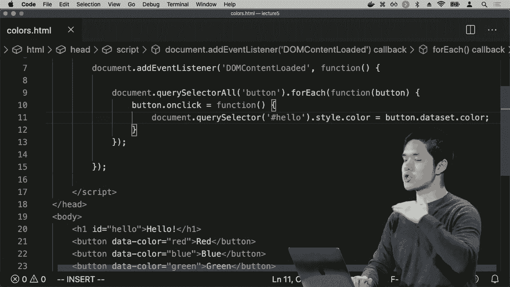

颜色以获取数据 - color 属性，所以这里发生了很多事情。让我们继续尝试阅读整个内容，感受一下发生了什么，因为我们有函数嵌套在其他函数中，嵌套在其他函数中。在最顶部，我说添加一个事件。

当文档的 DOM 内容加载时，意味着页面的所有内容都完成加载，继续运行这个函数。这是函数的主体，那么，当页面加载完成时，我想做什么呢，我将使用 document.querySelectorAll 查找所有的。

按钮，如果我想要的话，如果可能会有更多按钮，我可以给这些按钮添加一个类，然后只需查找特定类的东西，查询选择器all仅仅返回所有匹配特定查询的元素，然后我在对每个按钮说，对于这些按钮中的每一个。

我想在每个按钮上运行一个函数，我基本上是在说，如果我有三个返回的按钮，让我在第一个按钮上运行一个函数，然后在第二个按钮上运行同样的函数，接着在第三个按钮上运行同样的函数，这个函数是什么呢？它就是这个函数。

这个函数以按钮为输入，首先会把第一个按钮作为输入，然后是第二个按钮，接着是第三个按钮，这个函数的作用是为按钮添加一个onclick处理程序，它说当按钮被点击时，继续运行这个其他的函数，而这个函数就是。

将在按钮被点击时运行，来说明当按钮被点击时，获取hello元素并将其颜色更改为按钮的数据集颜色，按钮数据集的颜色获取一个按钮，像这里这个HTML元素，并访问它的数据集，所有的数据属性，特别是访问颜色数据。

这个属性在这种情况下等于红色，这就是我们想要设置颜色的值，所以稍微复杂一点，我们之前见过，但现在我们能够把三个不同的事件处理程序减少为一个，接下来这个将会以同样的方式工作，将其改为红色。

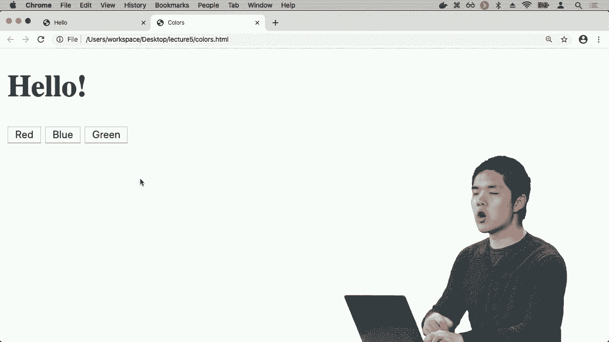

蓝色和绿色都是通过使用我们可以访问的数据属性。因此，当对这些事情的工作原理或查询选择器的返回结果感到疑惑时，JavaScript控制台可以是一个非常强大的工具，实际上可以操作事物，你可以运行查询。

你甚至可以修改它们的变量值，比如我回到counter.dot HTML或head，这个计数器在计数0 1 2 3 4。如果我想的话，我可以说像counter等于27这样的话，正如改变计数器的值一样，页面上似乎没有任何变化，我没有说。

更新页面上的任何内容，但现在下次我运行计数时，它将更新计数的值为28，因为我在JavaScript控制台中更新了值，它将增加那个值并在h1元素中显示这个值，因此你可以修改变量，可以运行。

你可以运行文档查询的函数，选择器来找出特定的元素将会返回所有，通过使用javascript控制台，这可以是一个非常强大的工具，尤其是在你开始调试这些程序并试图搞清楚是什么的时候。

可能有什么地方出错，事实证明，我们可以做其他更改，以进一步优化我们的代码，使其更加简洁。最近的JavaScript版本引入了一种特定的函数符号。

函数的箭头符号，我会给你展示，因为它会出现，但通常在引入函数之前，你会看到像按钮这样的东西，然后是箭头、大括号，严格来说，你甚至不需要在箭头周围加上括号。

输入按钮箭头，然后在这些大括号中写一些代码，这意味着这里将是一个接受名为按钮的变量作为输入的函数，并在该函数运行时执行这段特定代码。同样，如果一个函数没有输入，就像上面这个函数，你可以。

使用箭头符号来表达，只需括号、箭头和代码块。这种符号常在JavaScript中看到，如果你看到它，知道这只是创建函数的简写，箭头左侧的内容是函数的输入，而箭头右侧的内容则是输出。

箭头右侧是代码在函数体执行时应该实际运行的内容。！

当函数被调用时执行，那么我们可能想要做其他什么更改。为了使`colors.html`正常工作，如果我们回顾`colors.html`，现在的样子是：我们有一个标题，写着你好，然后为了将颜色改为红色、蓝色或绿色，例如，我们可能会想让用户从中选择一个。

决定用户界面的选项数量，选择使用下拉菜单而不是一堆按钮，例如，JavaScript对此也支持，我们将利用这个机会来探索一些其他的事件处理程序。

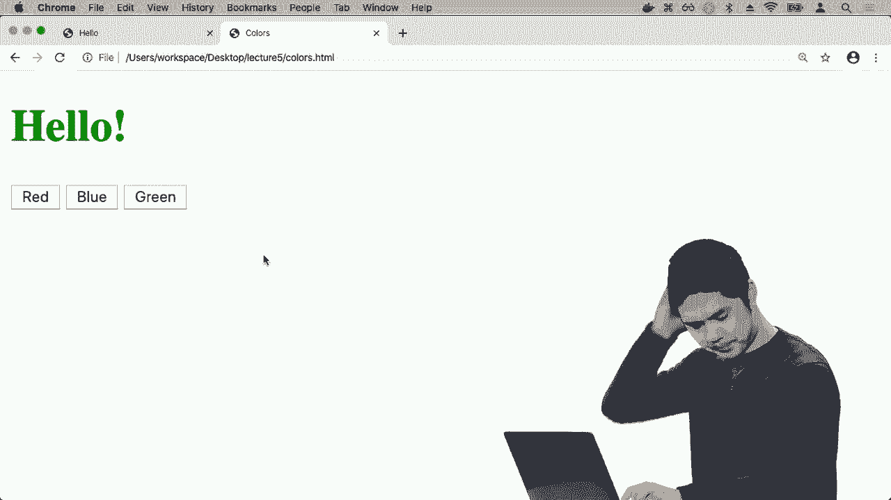

所以，例如，我可以把这些全部放在按钮里，使生活更轻松，制作一个下拉菜单，其中选择的默认选项是黑色，我会说黑色，然后添加另一个值为红色的选项。

然后我们说红色，值是我们在JavaScript中尝试提取特定下拉菜单值时会得到的。在选项标签之间，是用户在页面上实际看到的内容，因此我将其大写仅仅是为了他们，选项值为蓝色。

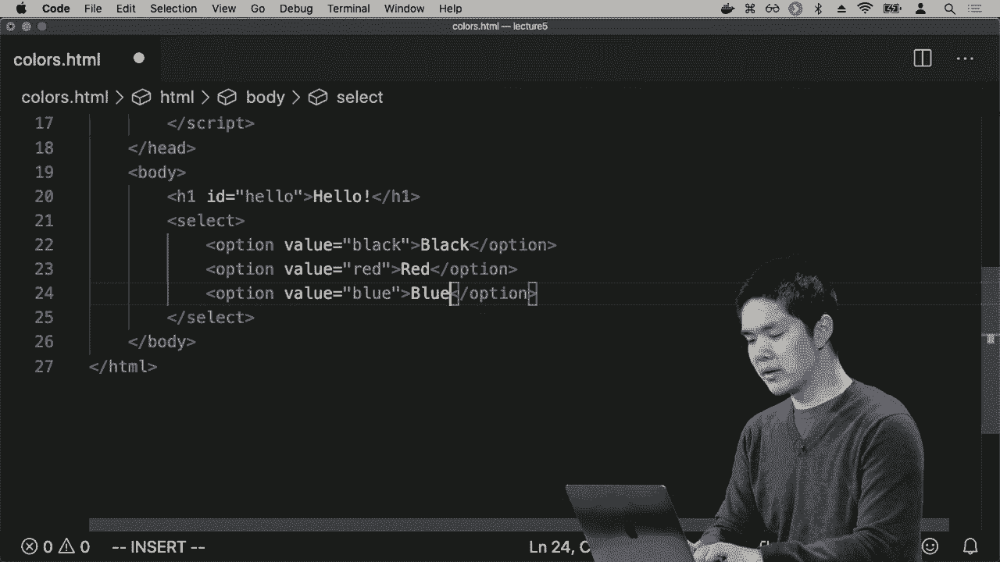

这将是蓝色，选项值为绿色，那将是绿色，因此现在用户看到的是他们看到你好，然后是一个下拉菜单，他们可以从颜色列表中选择，而不是点击按钮来做到这一点。当然，这个选择下拉菜单并不。

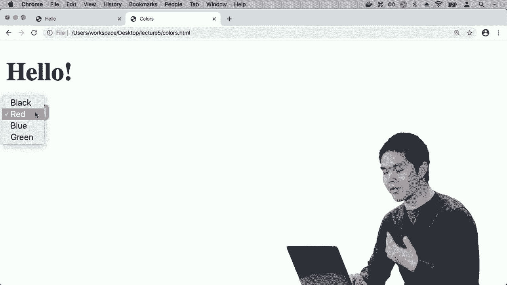

目前我不能做任何事情，但我可以修改它，使其现在可以这样做。与选择所有按钮并对其进行操作不同，我们不再有任何按钮，我现在有的是一个选择下拉菜单。

我们看到DOM内容加载作为一个事件，还有另一个事件叫做`on change`，适用于像选择下拉菜单这样的内容，当选择下拉菜单中的某项内容发生变化时，当用户选择不同的内容时，我可以运行一些代码，比如我可以运行一个函数，这种情况下是。

将使用文档查询选择器获取`hello`，意味着获取`hello`的HTML元素，改变它的样式，样式的哪个部分改变了颜色，我想将其改为我想要的下拉菜单的值，但我该如何访问这个特定的下拉菜单呢？在JavaScript中。

正如我们所看到的，在点击某个东西时，我们可以访问一个特殊的值，叫做`this`，在JavaScript中有特殊的意义，其含义基于上下文而变化，但在事件处理程序的上下文中，当特定事件发生时被调用的函数，这将是一个特殊的关键字，始终指向接收到事件的对象。

所以接收到事件的是选择下拉菜单，接收到事件的是正在变化的内容，因此这将是一个特殊的关键字，始终指向我所做的不同选择的下拉菜单。如果我想获取该下拉菜单的值。

用户实际选择的内容，我可以直接说`this.value`，意味着获取那个下拉菜单，并获取用户选择的值。

这个想法，现在比之前更简洁，我能够实现同样的想法，现在以黑色打招呼，但如果我从下拉菜单中选择将其颜色更改为红色，例如，颜色变为红色，如果我选择蓝色。

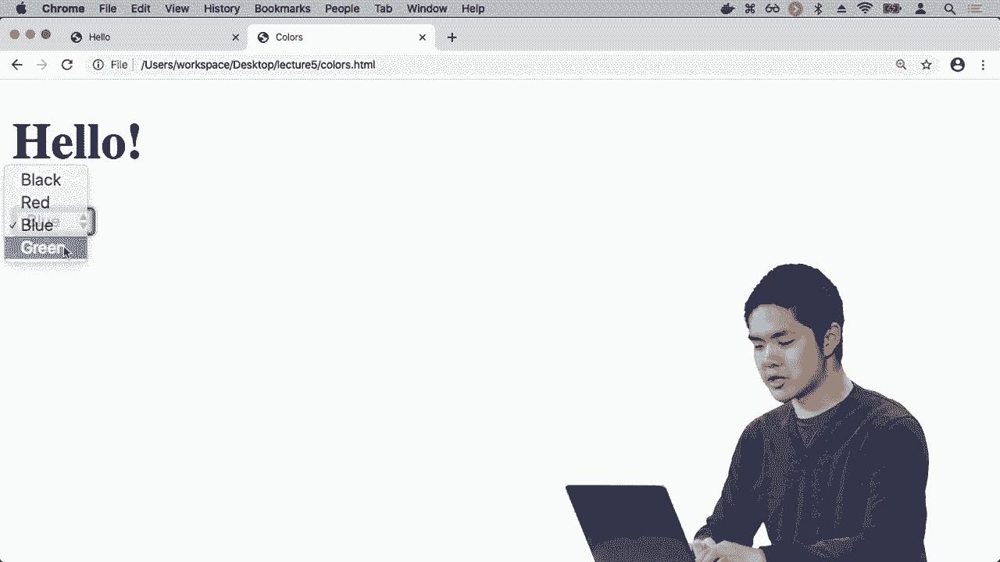

当它变成蓝色时，绿色变为绿色，我选择黑色时，它又变回黑色。因此，现在我有能力检测这些其他类型的事件并对此作出响应，而在JavaScript中存在许多不同的事件，比如我们已经看到的点击事件，鼠标悬停事件可以检测。

当你将鼠标悬停在某个特定元素上时，如果你曾经看到某些网站在鼠标移动时以某种方式响应，这可能是如何实现的。按下键和释放键可以响应键盘事件，比如当你按下键时。

当你按下键盘上的某个键时，这就是按键按下（key down），而当你抬起手指时，这就是按键抬起（key up），还有许多其他事件，这里列出了一些，你可以监听这些事件并做出响应。这样，你可以根据用户的操作进行真实的交互。

这样做，现在让我们看看如何使用这些事件的一个示例，以开始创建一个稍微有趣一点的应用程序。我们将继续构建一个待办事项列表应用程序，这次仅使用 JavaScript。我们之前见过待办事项列表，涉及与服务器的通信。

进行请求和响应将构建一个只使用 JavaScript 的待办事项列表。因此，我将创建一个名为 tasks.html 的新文件，并创建一个标题为“任务”的头部部分，以及一个主体部分，在页面主体内部，我会有一个标题，上面写着“任务”，然后在下面我想要一个。

所有任务的无序列表，所以我会有一个无序列表，我将其 ID 设置为任务，以便稍后引用，但最初这里不会有任何内容，而我将在无序列表下面放置一个表单，一个我可以提交新任务的表单。例如，我会给自己。

输入字段也会有一个 ID，这个 ID 将会是新任务的单数形式。我在占位符中输入的内容将是“新任务”，以便用户知道该输入什么，而输入字段的类型将是文本，因此我会有一个输入字段，用户可以在其中输入一些新任务，我还会添加一个输入。

为了确保准确，输入字段的类型是。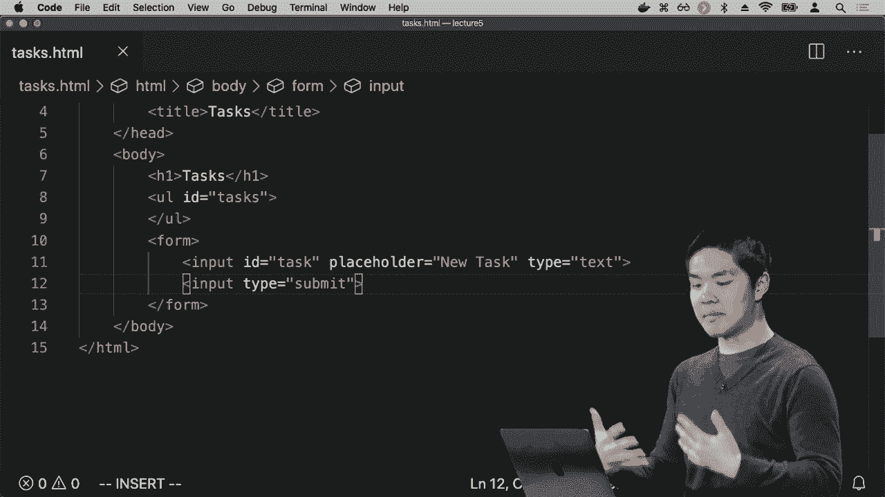

提交一个允许用户提交新任务的表单，一旦他们创建了它，所以如果我打开 tasks.html，这就是我看到的。大的标题，下面技术上有一个无序列表，但目前这个无序列表是空的，因此它只是显示为空，然后是一个我可以输入任务的文本字段。

然后是一个提交按钮，让我可以。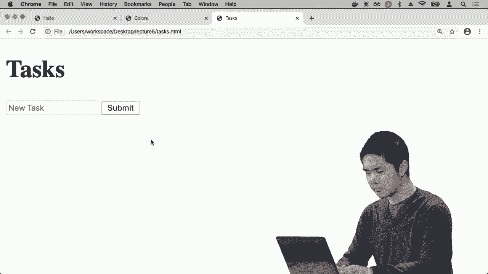

提交我的新任务，所以现在我希望一些 JavaScript，在我提交这个表单时，实际上可以做一些事情，因此添加一个脚本标签，我希望这个 JavaScript 在 DOM 内容加载后运行，所以我们继续添加通常的 DOM 内容加载。事件监听器，现在我想在表单提交时运行代码。

说 document query selector form.dot on，submit 等于，然后我想运行一个。函数，我可以再次使用关键字函数，但我可以直接使用一个箭头函数，这样输入会快一些。就说好吧，这就是我想在表单提交时运行的函数。

我想首先弄清楚用户实际上输入了什么，用户输入的内容是通过 document.querySelector(task).value 获取的，获取 ID 为 task 的元素，input 字段的值就是用户输入的内容。

实际上我输入了内容，可以将其保存为像 Const tasks 这样的变量，这是用户输入的内容。如果我对用户输入的内容感到好奇，可以将其打印到 JavaScript 控制台，方法是使用一个名为 console.log 的特殊函数，它会将某些内容记录到控制台。

控制台相当于在 Python 中打印某些内容，它会在 Python 终端中显示。在这里，这将显示在 JavaScript 控制台中，还有一点要补充的是，默认情况下，表单在按下提交按钮时会尝试提交，通常会带你到另一个页面，我们已经见过这种情况。

在 Django 的上下文中，提交表单时它会尝试并提交另一个网页请求。如果我想阻止这种行为，可以在我的表单提交处理程序的最后返回 false，以防止表单提交。

所有操作都在客户端进行。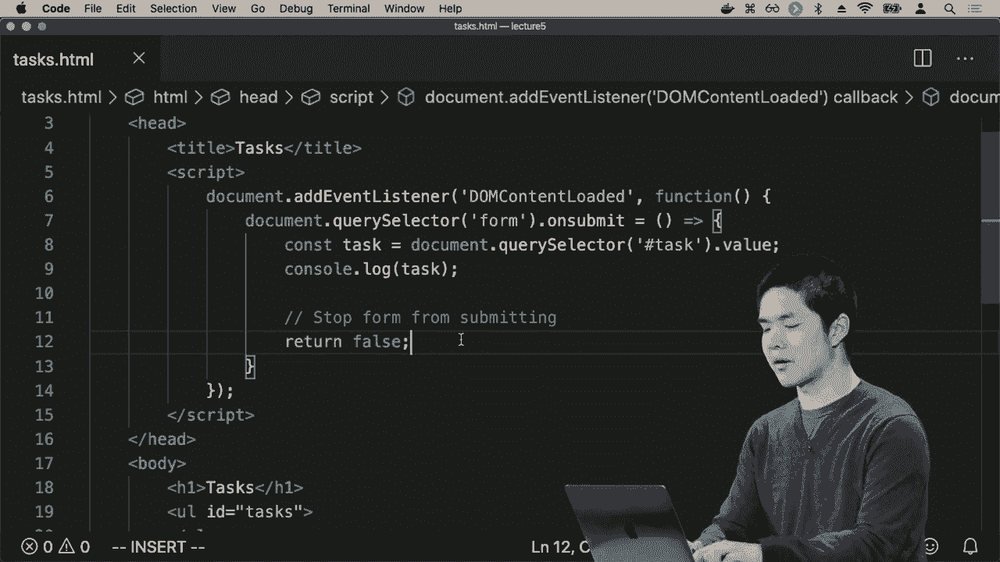

一切都在浏览器内部进行，所以现在这还不能完全工作，但这是进展。我刷新页面，打开 JavaScript 控制台，看看如果我添加任务会发生什么。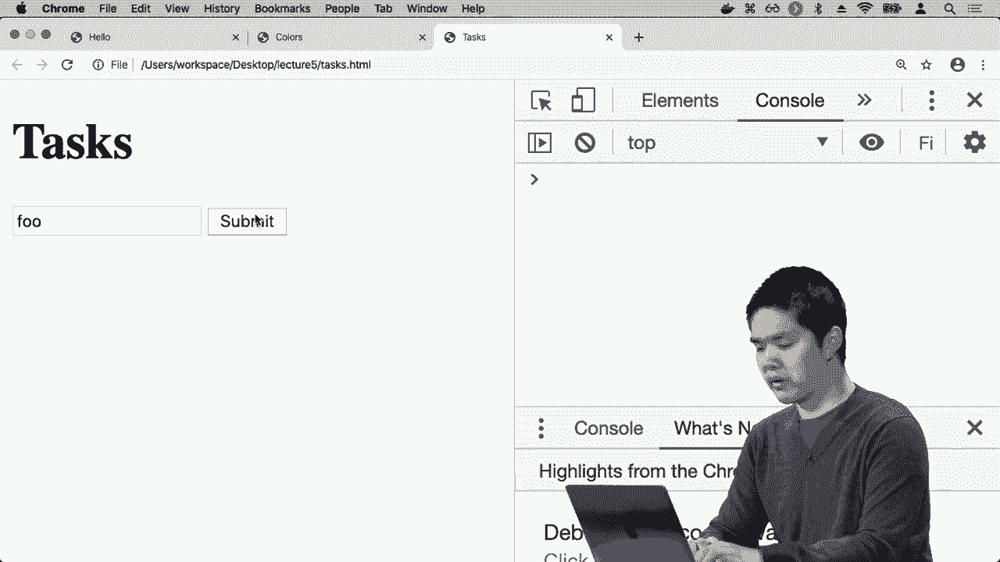

像 foo 这样的内容按下提交后，这将记录到 JavaScript 控制台中，这相当于提供调试信息，让我知道我现在可以访问这个值 foo，并且它还告诉我是哪行代码记录的，任务 HTML 的第 9 行。

记录 foo 的那行代码在调试程序时非常有用，可以查看变量的值，只需使用控制台日志打印出来，就可以弄清楚在任何特定时刻程序发生了什么。但是，我想做的是不使用控制台日志。

我想真正创建一个新的元素，然后将其添加到 HTML 的主体中。那么我该如何做到这一点呢？为了为我的文档创建一个新元素，我可以运行一个名为 document.createElement 的函数，后面跟着我想创建的元素类型，比如无序列表 ul。

无序列表中的每个项目都是一个 Li 列表项，所以我将创建一个 Li 元素，并将其保存为一个我称之为 Li 的变量。因此，我创建了一个新的列表项，这个列表项的内部 HTML 内容将是“任务”。

变量来自上面，正好是用户输入的内容，所以我现在创建了最新的项目，并指定 GML 应该放入列表项中，它应该是用户输入的任何任务，现在我要说 document dot query selector tasks，获取 ID 是 tasks 的元素，这将是这个。

无序列表在这里是无序列表，其 ID 是 tasks，如果我有一个 HTML 元素，我可以在里面添加一个新元素。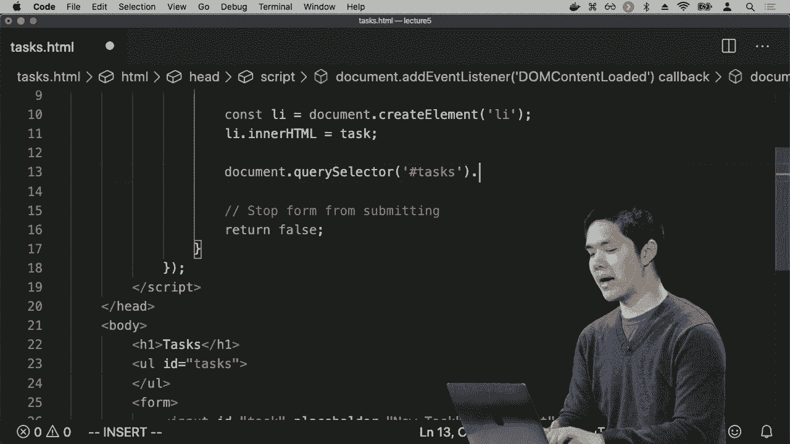

通过说 dot append Li，现在要做的事情是获取无序列表，其 ID 是 tasks，获取通过查询选择器得到的元素，一旦我有了那个元素，就将这个值 Li 附加到该元素内部的末尾，这个值正好是这个。

我创建了一个新的元素和一个新的列表项，因此我能够添加一个新的 HTML 元素，这行代码将会说把它添加到 DOM 中，添加到我现在正在构建的无序列表中，所以现在我重新运行它，我看到我输入了类似 foo 的任务，我按下提交，好的，foo 现在显示出来了。

我输入了类似右的内容，留下那条类型的 bar bar 现在显示出来。我曾经输入 Baz Baz 现在显示出来，现在一个小的用户界面烦恼是，每次我提交一个新任务时，这个输入字段保留了以前的值，这。

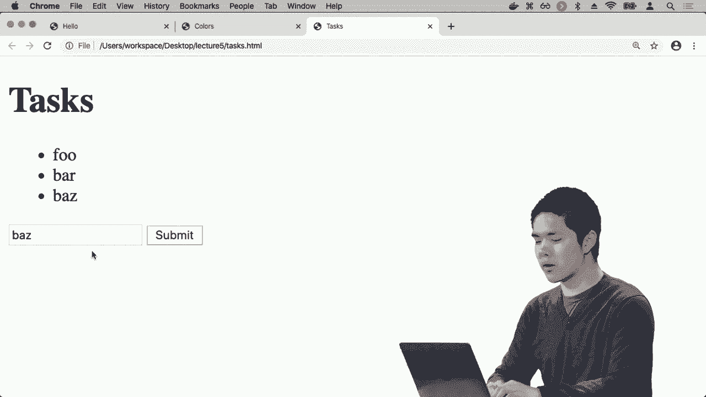

可能不是我想要的，因为我希望它能清空，我已经提交了任务，没有必要让它保留在那，但这在 JavaScript 中很容易处理，如果我想清空这个输入字段，ID 为 task 的输入字段，那么我只需要说 document dot query selector task 获取我。

这个输入字段将其值更改为等于空字符串，也就是等于无，仅仅是为了清除这个值。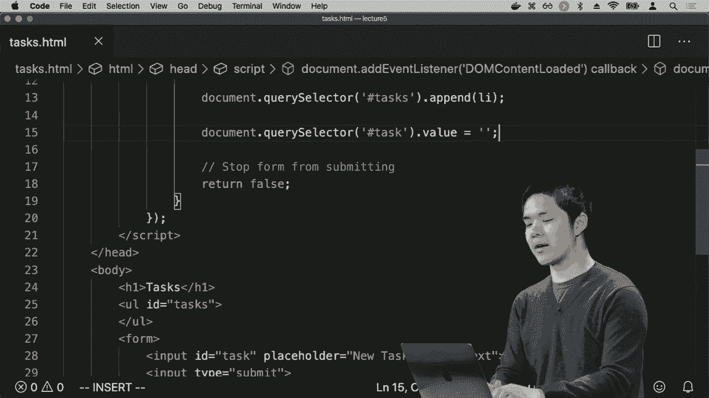

现在它正好在那个输入字段内，如果我刷新页面，输入 foo 按下提交，输入字段就会清空，现在我可以输入类似 bar 的内容，然后输入类似 Baz 的内容继续添加任务，现在一个可能稍微令人烦恼的事情是，如果我不小心按下提交，它。

提交了空字符串作为任务，因此我只得到一个空的项目符号在这里显示，按下提交后，我只得到所有这些空的项目符号，从用户体验的角度来看，如果我不允许用户这样做，不允许他们提交任务如果他们没有输入任何内容，那可能会更好。

针对新的任务字段，我们可以通过修改元素的属性来做到这一点，结果发现 HTML 元素有一个名为 disabled 的属性，可以。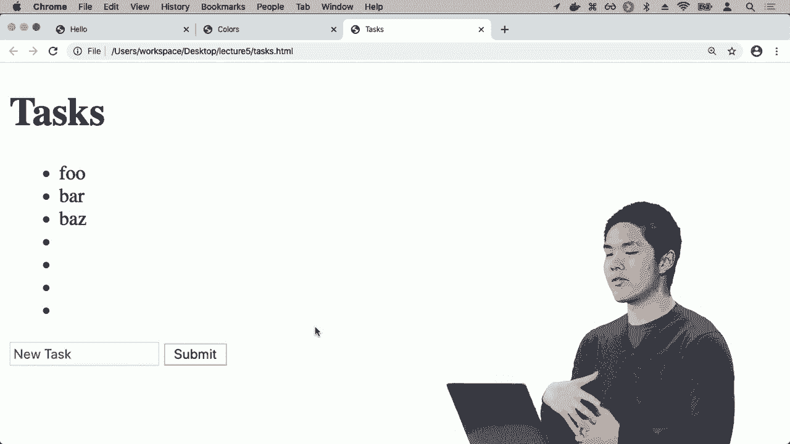

true 或 false 允许我们禁用某些东西，比如按钮。如果我想禁用 submit 按钮，我可能首先想给这个 submit 按钮一个 ID，我会给它一个 ID 为 submit，这样在我的 JavaScript 中我可以引用 submit 按钮，而现在在这个 JavaScript 代码中。

当 DOM 内容加载时，默认情况下，submit 按钮应该是禁用的，就像我第一次加载页面时，我不希望 submit 按钮被启用，因为我希望用户先输入一个任务，然后我再启用这个。submit 按钮，我该如何做到呢？我可以 document query selector 获取。

ID 为 submit 的元素让我获取一下，submit 按钮并且说它的。disabled 属性等于 true，javascript 有布尔值 true 和。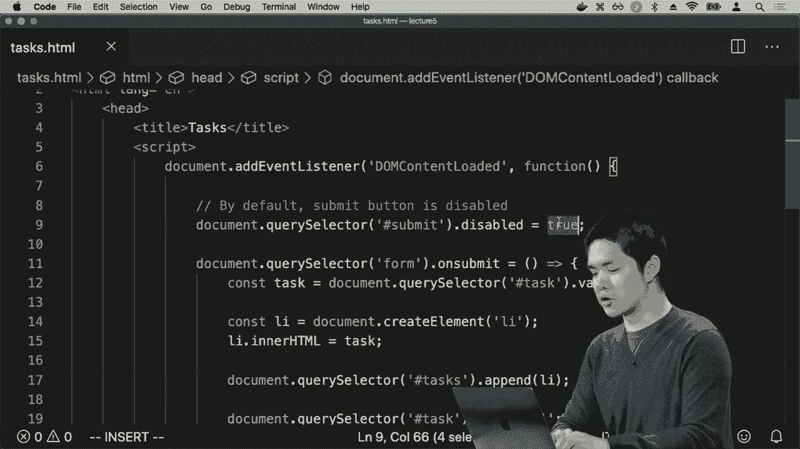

false，我将 disabled 值设为 true 来禁用 submit 按钮。现在如果我刷新页面，我可以输入一个新任务，但 submit 按钮是禁用的。它不做任何事情，现在显然我不想保持这种状态，我希望它是这样的，当我开始输入内容时，submit 按钮停止被。

disabled 将从 true 设置为 false，而我真正想要的是。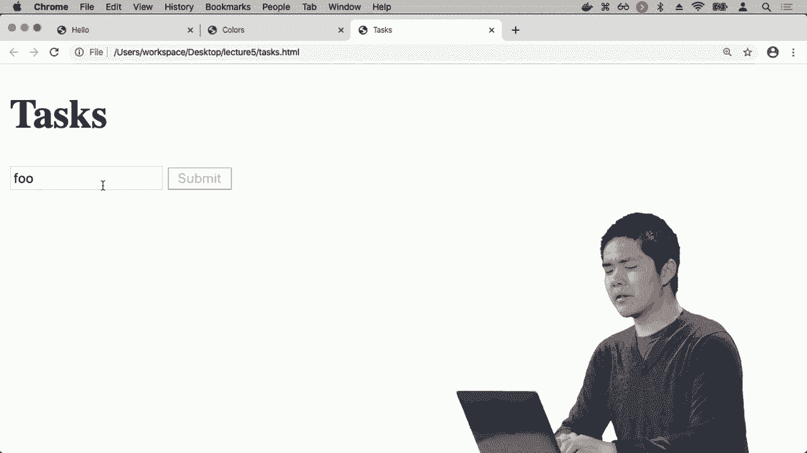

所要做的是监听我在键盘上按下的键，因此我可以通过添加另一个事件监听器，document query selector 来做到。我要将事件处理程序添加到什么上呢？我想在我输入内容到这个。

输入框，而这个输入框的 ID 是 tasks，所以让我去获取。ID 为 tasks 的元素，并添加一个 on key up 处理程序。key up 事件是当我抬起手指时，运行这个函数，而这个函数应该做什么呢？它将会说。

document query selector submit 设置 disabled 属性等于 false。所以现在我们所做的是，默认情况下，当我第一次加载页面时。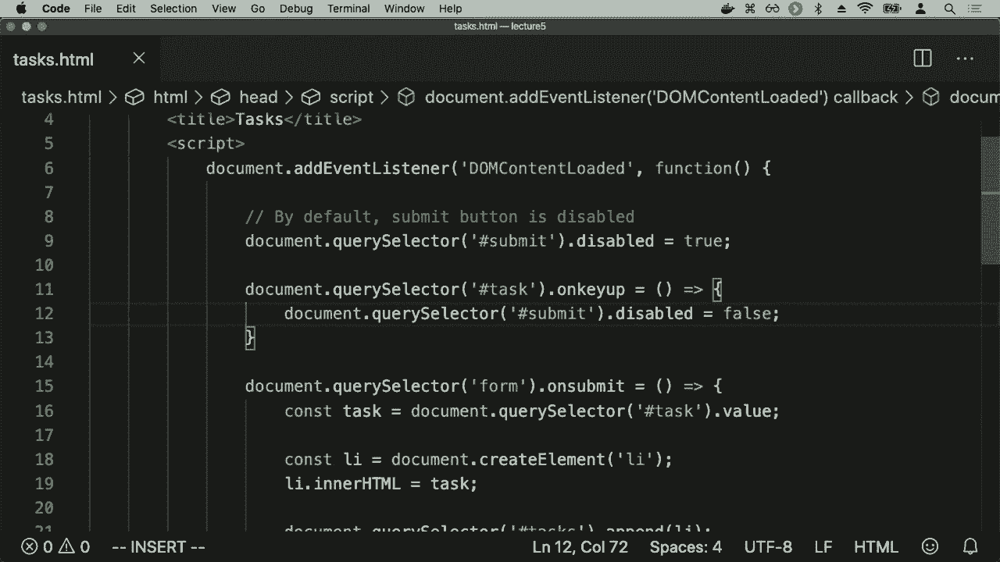

页面获取 submit 按钮并禁用，设置它的 disabled 属性等于 true。那么每当我按下一个键，手指离开键盘时，意味着在 key up 上是。触发事件运行这个，函数，而这个函数将做的是获取那个同样的 submit 按钮，并设置它的 disabled 属性等于。

false，所以现在不是禁用的，而是启用的。如果我回到页面，去这里，我现在输入内容，默认情况下 submit 按钮是禁用的。但一旦我开始输入内容，submit 按钮现在就变得活跃了，我实际上可以点击它。好的，这并不好，因为我点击了它。

但 submit 按钮仍然是启用的，所以我可能想做的是，好的。在我提交表单之后。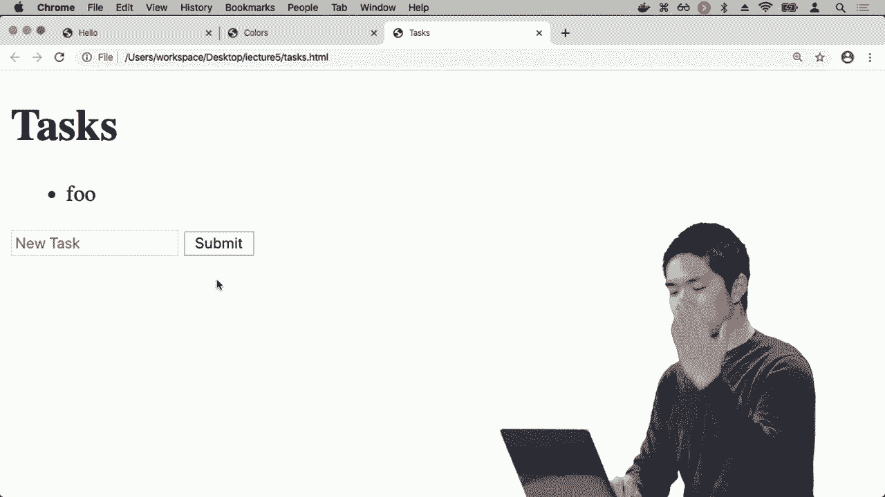

我添加了一个新任务，让我们回去禁用提交按钮，所以在我提交表单后，添加新任务到我的任务列表后，清空输入框的值，让我把提交按钮的禁用属性设置为true。

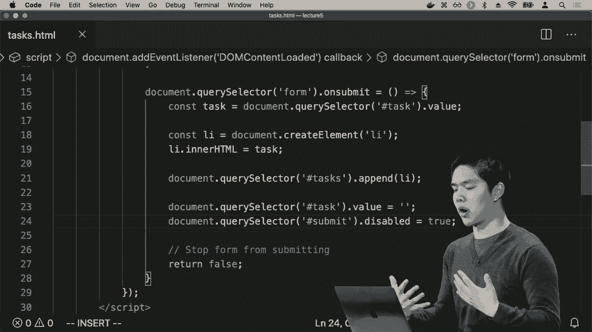

现在，即使在我提交表单后，提交按钮仍然会被禁用。我现在输入foo，提交是激活的，我按下它，但提交按钮又回到不活动状态。事实证明，即使现在仍然有一点小错误，如果我回到这里，输入。

类似于栏的东西，但我按了退格，返回到像什么都没有的状态，提交按钮仍然是活动的，所以从技术上讲，我仍然可以提交一个没有内容的任务。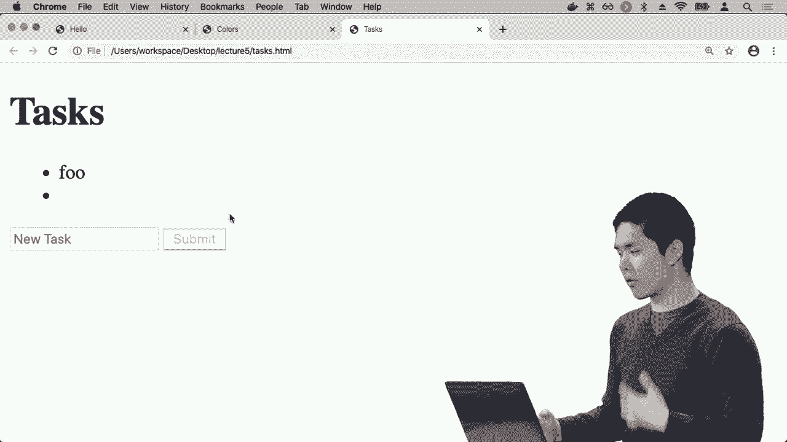

里面的内容，所以我可能想有某种方式来防止这种情况，这只是一种我们现在可以访问的额外逻辑。JavaScript有条件，有循环，有函数，所以如果我想做一些条件检查，我可以说如果文档查询。

选择器任务点值点长度大于0，意味着在任务字段中实际上输入了一些内容，那么就继续设置禁用为false。继续设置禁用为true，所以现在我们检查用户输入的长度是否大于零，他们实际上输入了一些内容。

然后，是的，给他们访问提交按钮，但否则不要给。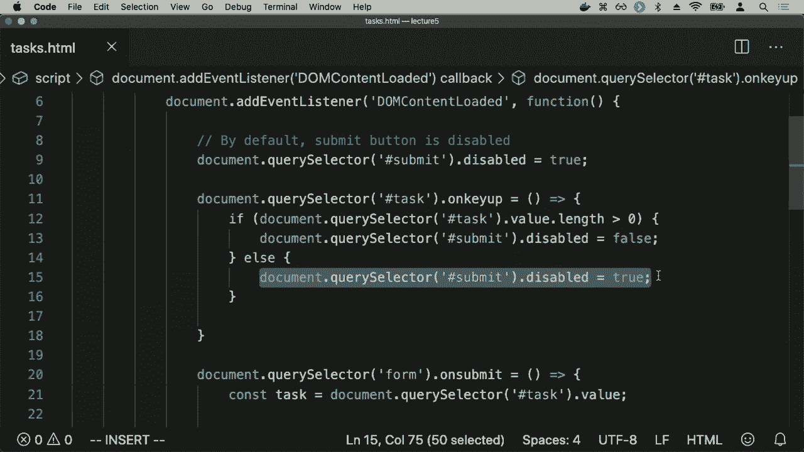

给他们访问那个按钮，现在我刷新页面，默认是禁用的。我输入了一些内容后，它被启用。我删除，删除，删除，然后它又回到禁用状态，所以JavaScript让我们真的能让页面变得更加互动，立即根据用户的互动进行响应。

随着用户开始输入内容，开始删除内容，按下按钮，我们能够让页面响应，要么通过向DOM添加内容，实际向HTML页面添加部分，或改变样式，改变元素的特定属性，这就是。

JavaScript的强大之处就在于不再仅仅让自己能做这些事情。到目前为止，我们只能在用户做某事时才让事件发生。
