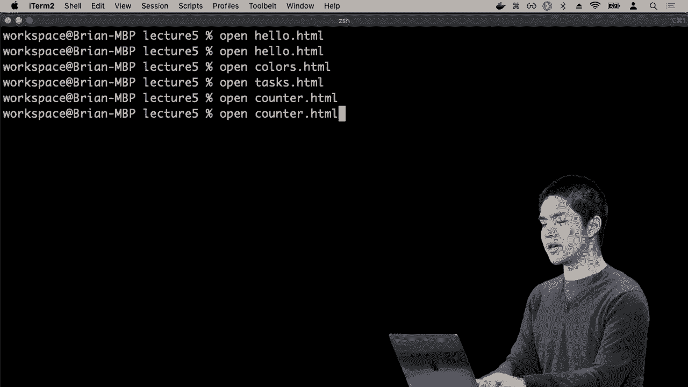
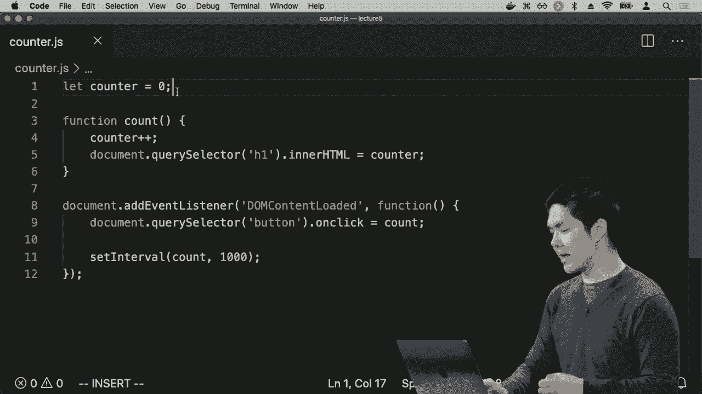
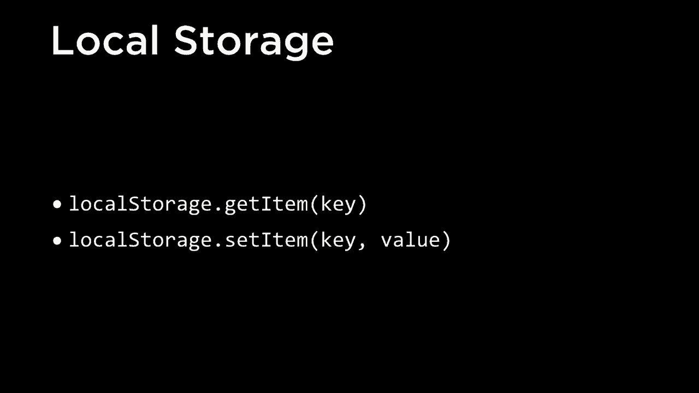
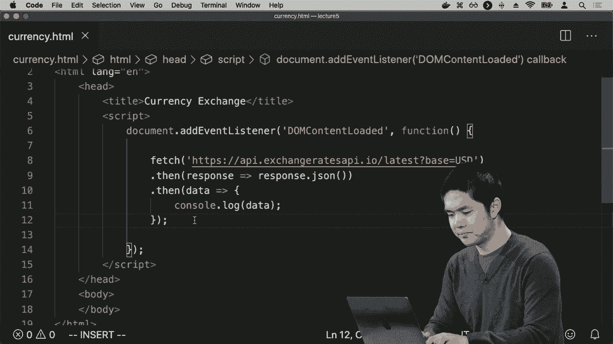
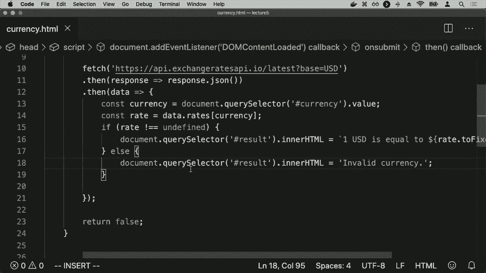

# 哈佛 CS50-WEB ｜ 基于Python ／ JavaScript的Web编程(2020·完整版) - P17：L5- JavaScript编程全解 3 (逻辑存储，API) - ShowMeAI - BV1gL411x7NY

用户按下一个键，比如说，但事实证明JavaScript还有其他方式。允许函数运行，实际上是独立运行的，我们可以设置所谓的。间隔，在某个时间间隔内，特定函数每隔一些毫秒。运行一次。所以如果我们回到之前的计数器示例。

现在在这个计数器示例中，我必须。自己按下计数按钮。这样就会增加。

每次都计数，但我可以把。这个放在间隔里面。所以让我回到counter，dot HTML，JavaScript在counter j/s里面，现在我想说的是，当DOM内容加载时，让我为count设置一个间隔，间隔为1000。那么这会做什么呢？设置。

interval是JavaScript内置的一个函数，在这里我说我。想要创建一个新的间隔，周期性地去运行一个。特定的函数，我想要运行计数函数，记得。计数函数将增加count的值，我会去掉这个。

目前只是为了简化，我只想让计数函数更新。h1标签，显示新的计数器值，并且。每1000毫秒去运行这个计数函数，换句话说。

每一秒都去运行计数函数，所以现在当我打开。

counter dot HTML现在是零，但每。秒现在它会每秒变化一次。每秒更新一次，我不需要点击按钮。当然，我可以点击，事件处理器仍然会工作，但这个间隔表示。现在每一秒去运行计数函数，并且有这个。

特定的结果。所以如果你曾经见过，一个网页像是显示当前的。时间（秒数）和倒计时器，或者显示当前时间。带秒数，它可能是在做某些事情，像这样：有某种。间隔每秒去计数和增加。

更新数字为更大的一个，比那个更大的一个。

当然，如果我关闭页面并返回，如果我关闭这些页面然后再回来。

再次打开counter dot HTML，我又回到了零，就像JavaScript并没有。保存关于我的页面的任何状态，每次我们运行页面都是。

将返回到counter j/s，它会说，好吧，我们在定义一个。

一个名为 `counter` 的变量，我们将那个变量设为零，所以每次加载页面时，它都会重置为零，这可能不太好，具体取决于你试图创建的页面类型，也许你希望页面能够存储信息。

在后续访问中，我们能够利用已经存储的信息。在后来的 JavaScript 版本和更现代的浏览器中，现在允许我们做一些类似的事情，这叫做本地存储，而本地存储就是我们能够。

能够在用户的网页浏览器内存储信息，页面可以请求在浏览器中存储特定的值，并且在后续访问该页面时，我们可以回来提取那些之前存储在本地存储中的值，本地存储会给。

我们可以访问两个关键功能。

我们将使用本地存储来操作这个，第一个是本地存储的 `getitem`。我们想根据某个名称从本地存储中获取一些东西，那个名称是我们给那个值的。

在本地存储中设置这个键等于一个特定的值，这样我们就可以使用本地存储，允许我们的网页使用 JavaScript 能够存储信息并从浏览器中检索信息。现在让我们尝试使用它来解决这个 `counter` 的问题。

这似乎总是重置为零，所以现在在 `counter` 的部分，我想知道的是本地存储中是否已经有 `counter` 的值，所以我可以问一个问题，比如 `if local.storage.get item counter`，意思是去本地存储尝试获取 `counter`。

这个 `if` 表达式中的任何内容将会发生，如果本地存储中有 `counter` 的值，但如果我想做反向操作，简单来说，我可以使用感叹号，和 C 语言一样。在 JavaScript 中，感叹号仅表示否，所以意思是如果没有。

在本地存储中有一个名为 `counter` 的东西，那么我们就设置本地存储中的值，使用 `local storage.set item counter` 并将其设为零。这在做什么呢？在其他任何事情发生之前，我们会检查本地存储，看看是否已经有 `counter` 的值。

如果本地存储中还没有 `counter` 的值，我们需要确保在本地存储中有一些东西用于 `counter`，所以我们将 `counter` 的值设为零，例如，现在需要改变的是什么。我将去掉间隔，这样它只在我。

点击它，但这个count函数到底应该做什么呢？首先让我获取计数器的值，计数器将是local storage中获取的item counter的值。我将从本地存储中获取计数器。我将增加计数器。

等于该计数器，但最后一步是我也会执行local storage dot set，item counter等于计数器的新值。所以我在这里做的是，点击按钮时，count函数将会运行。我们首先进入本地存储获取键counter的值。

counter的值恰好保存在一个叫做counter的变量中。我们继续增加该变量，将其设置为自身加一。更新h1的innerHTML和之前一样，只是更新我们实际在页面上看到的内容，然后继续将local storage的item counter设置。

计数器，例如，所以现在让我们去。

接下来看看如果我打开counter dot HTML会发生什么，我们看到0，我们数1 2 3 4 5，到目前为止一切正常。现在看看如果我刷新这个页面会发生什么，我刷新页面，好吧，这似乎有点奇怪，显示为0，让我试着计数看看会发生什么。我按下计数，好吧。

计数变为6，所以看起来它记住了我数到5（0 1 2 3 4 5），但当我刷新页面时，它仍然显示0，但让我数到6，我可以继续数7 8 9 10。如果我现在刷新页面，会发生什么呢？我可以试试，刷新页面后，我回到了0。

我数到11，所以不知怎么的，我仍然记得，但第一次它仍然给我0每次。

为什么会这样呢？如果你回头看看counter dot HTML，你会注意到，原因就在页面的主体中，h1的初始值总是0，所以如果我想修复这个问题，我需要在DOM内容加载时，获取document query selector h1。

并将innerHTML更新为local storage中获取的counter的值。因此，每次我打开页面，即使在点击按钮之前，甚至在事件监听器触发之前，我都想说，去替换这个标题，将其innerHTML更新为获取结果。

例如，从本地存储中获取计数器，所以现在刷新页面时，它的值是11。我可以更新更新更新，点击几次，比如说变成18，刷新页面后，它保持在数字18，无论我得到什么值，它都会存储在本地。

本地存储这样，当我刷新页面时，这个数字会保持在那里。我们实际上可以在本地存储中看到这个值，但再次进入Chrome的检查器。我进入Chrome，如果我去应用程序标签，进入本地存储，在左侧我可以看到，我有一个键为counter的值。

在这种情况下，其值恰好是28，你可以进入本地存储。你可以操作这个值，如果需要的话可以删除它，但这只是表明我们现在已经在浏览器中存储了这个值，以便在后续访问时，如果该页面再次加载，我们可以访问到这个值。

也可以从应用程序内部传输数据，因此我们现在可以看到我们的页面如何存储数据，以便使用户体验稍微好一些。如果我们希望用户能够记住上次访问某个特定页面时的信息，我们有时可以做到这一点。

事实上，这可能会非常有帮助。好吧，现在我们已经看到了JavaScript的许多特性，看到了一些不同的数据表示方式。我们将数据存储在变量中，这些变量有类型，比如整数。有些变量是字符串，有些时候是HTML元素。

有时这些变量是我们的项目的数组或列表，有时甚至是函数，因此我们可以将一个变量设为一个函数，但也许在JavaScript中最有用的数据类型是JavaScript对象。所以进入JavaScript控制台只是为了演示这个JavaScript。

对象实际上就像Python字典的等价物，是一组键和值的关联，可以通过键或属性查找某个东西，看看它的值是什么。如果我有一个变量叫做person，我可以将person设为一个JavaScript对象，像是名字为Harry。

而且他的姓是Potter，再次使用与Python中字典语法非常相似的语法，现在我有了这个变量person，名字是Harry，姓是Potter，我可以以多种方式访问person的特定属性。我可以说person.dot。

首先获取这个特定对象的first name属性，我看到它等于Harry。我也可以等效地使用方括号表示法，就像Python那样，方括号先出现，这样也会得到Harry。但这证明能够以这种方式表示数据是相当强大的。

以这样的结构化方式，我有一组键（也称为属性）与特定值的关联，然后我可以通过一个JavaScript对象访问某个特定的值，事实证明，这种方式最有用的之一是在数据交换中，移动数据。

从一个服务到另一个服务，所以在这里我们将介绍被称为API的内容，也就是应用程序编程接口，在网络上下文中，你可以将其视为互联网服务相互通信的一种定义明确的结构化方式。

如果你希望你的应用能够与某个其他服务进行交互，可能你希望你的应用能够与谷歌地图或亚马逊等天气服务互动，以获取当天的天气，那么你可能能够访问某个API，通过某种机制与其他服务进行通信。

通过发送请求并以某种结构化良好的格式接收数据，这种结构良好的格式通常是被称为Jason的特定类型数据，即JavaScript对象表示法，这是一种以JavaScript对象的形式传输数据的方式。

这些对象具有相关的属性和值，那么JavaScript对象表示法看起来是什么样子呢？如果我们回想一下我们创建的这些应用，这些能够表示航空公司和飞机动态的应用。

表示特定目的地的JavaScript对象可能看起来像这样，一个具有origin、destination和duration属性的JavaScript对象，这些都是我们之前见过的，但你可以想象，如果我们希望我们的航空公司能够。

使其数据可供其他服务使用，以便其他网络应用或其他程序可以以编程方式访问航班信息，我们可以以这种格式将数据传递给其他应用，以便它们可以将其视为JavaScript对象，从而获取有关航班的信息。

这个特定的表示法的好处在于，它既易于人类阅读，也易于机器阅读，我们作为人类可以查看这些内容，直观理解其中的含义，同时计算机也知道如何访问冒号前出现的特定属性。

并访问这些值是什么。

在冒号后面出现的内容也是如此，因此JavaScript对象表示法，也称为Jason，提供了一种非常方便的表示方式，而这并不完全是JavaScript对象语法中的内容，JavaScript对象中不需要严格地在键周围加引号，你可以直接写origin:。

origin用引号括起来，因此JavaScript对象表示法使用稍微不同的语法，但最终与我们在JavaScript对象中看到的非常相似，JavaScript知道如何以这种形式接收数据并将其转换为JavaScript对象，结果发现，在Python中也有实现这种功能的方法。

在其他编程语言中，能够解释JSON数据，以便以某种有意义的方式使用它，JSON表示的另一个优势是它非常适合表示事物的结构。因此，这些值不需要只是字符串或数字，它们可以是列表。

或者数组可能具有一系列可能的值，或者它们甚至可以是其他JavaScript对象，如果我们想表示的不仅仅是城市名称，而是例如城市名称和机场代码，如我们之前想做的那样，我可以将origin设置为一个字符串。

喜欢纽约的来源等于另一个包含城市属性和代码属性的JavaScript对象，其中城市是城市名称，代码是机场代码，重要的是，只要我和我沟通的人对这一点达成一致。

如果我们达成一致，确定这些键的名称以及这个JSON有效载荷（JSON对象）的结构是什么，那么接收方可以获取这些数据并编写一个能够解释它的程序，并以某种有意义的方式使用这些数据，因此我们将看到这个例子的一个例子。

现在使用JavaScript能够与另一个在线服务通信，特别是用于访问有关货币兑换率的信息。货币兑换率总是在变化，我们希望访问最新的货币兑换率数据，如果有一个在线服务的API。

以JSON格式提供该数据的访问权限，格式类似于这种机器可读的方式，那么我们可以使用这些数据来编写货币数据，以便进行转换。这些数据可能看起来像这样！

可能看起来像这样，我们请求访问什么是。

从美元转换的汇率是西纽顿的USD，我们得到的JSON对象看起来像这样，它有一个基础键USD，然后有一个汇率键，里面有一堆汇率。因此，转换为欧元和日元，以及英镑等。

澳大利亚元和各种不同的货币兑换率。例如，这些不同货币的汇率，并不一定要以这种方式构造数据，但这恰好是一种方便的方式，只要提供数据的人和我都。

一旦我们了解这个结构，就可以开始编写能够使用该数据的程序，因此我们现在将看到一个API的例子，即汇率API。我所欠的，如果我们访问API点汇率API点/最新，并提供一个参数base等于美元，那么我们得到的数据看起来像这样。

现在看起来有点杂乱，不像之前那么整洁，但它确实是完全相同的东西，只是没有空格。我们有一个JavaScript对象，里面有一个rates键，它告诉我，“好吧，这里是美元与加元、英镑、欧元之间的兑换率”。

还存在其他货币，下面我们有基本的货币，也就是我们转换的基础货币。如果我仅仅发起一个HTTP请求，这些数据就会返回给我。我向这个特定的URL发起网页请求，然后可以获取到所有这些货币兑换率的信息。

然后我将在我的应用程序中使用这些数据。那么，我该如何做呢？我现在如何开始在应用程序中使用这些信息？现在让我们创建一个新页面，我将其命名为currency HTML。在currency HTML中，我们将包含一个常规的HTML标题，标题为货币兑换，以及一个主体，主体内部我们就要开始。

暂时不包含任何内容，我真正关心的是能够进行网页请求的JavaScript，以便获取额外的数据。到目前为止，我们的JavaScript代码只是在我们的计算机上运行，运行在网页浏览器内，一切都在进行中。

在网页浏览器中，我们并没有与某个外部服务器进行通信。现在我们要看看的是Ajax，这与异步JavaScript有关，意思是即使页面已经加载，我们也可以使用JavaScript发起额外的网页请求以请求更多的信息。

信息来自我们自己的网络服务器或一些第三方网络服务器。如果我们想要在页面上获得额外的信息，这里我们想要的是让我们的页面发起一个异步请求，以请求当前货币兑换率的额外数据，例如。

我该怎么做呢？我想在DOM内容加载后再做这个。因此我们通常会在这里添加，接下来我们将利用一个内置于较新版本JavaScript中的功能，并且现在大多数主流浏览器都支持这个功能，那就是fetch。

这样做是发起一个网页请求，它将查询某个网站，可能是我们自己的，也可能是其他人的，然后从该页面返回一些HTTP响应，而我将要获取的页面是这个URL API，即exchange rates API dot io / latest base equals。

关于美元，我之所以知道这个API是怎么工作的，仅仅是因为我阅读了API的文档，它描述了URL参数是如何工作的，以及我获取的返回数据的结构是什么。因此我在这里要说的是，继续从这个URL获取，发起一个HTTP请求以请求额外的。

从这个URL获取信息并查看结果会是什么。而fetch给我们的结果是JavaScript中称为“promise”的东西，promise是一种表示某件事情将要回来但可能不会立即返回的方式，我们不会继续等待。

关于这些promise具体如何工作的细节，但事实证明有一种特定的语法来处理它们，我可以在fetch之后添加一行称为`.then()`，这表示当promise返回后我应该做什么。一旦我得到像响应这样的东西，

我想做的是将响应转换为JSON，将其视为JavaScript对象，以便我可以进行操作。因此，我可以使用这个函数来让程序返回`response.json()`，这意味着去获取最新的汇率，然后。

一旦完成，这是一个异步过程，可能需要一些时间，但一旦我得到这些结果，就运行这个函数，获取响应并返回响应的JSON版本，将响应转换为原始JSON数据，以便我可以使用这些数据来访问货币。

汇率结果显示，使用箭头函数时，如果你有一个非常简单的函数，它只是将某个东西作为输入并返回其他东西，我可以进一步简化这个函数，只需说我可以返回。我可以直接说`response => response.json()`，这是一种简化的方式。

这里我定义了一个函数，它以响应作为输入，并返回将响应转换为JSON的数据。所以在这里，我让程序去获取来自这个特定API的最新汇率，然后将响应转换为JSON数据。一旦你有了数据，这就是我希望你对这些数据所做的事情。

现在让我们先控制台打印一下这些数据，只是将它打印到终端上，所以我们现在还没有做其他任何事情，我所做的就是让程序获取汇率，将汇率数据转换为JSON，然后我们打印出这些信息。

数据，所以我会打开`currency.html`，这是一个空白页面，但如果我查看JavaScript检查器，我看到记录的是一个JavaScript对象，这里用单词“object”表示。如果我点击左侧的三角形，我可以展开，看到这个对象内部包含的所有汇率数据。

对于一大堆不同的汇率，从美元转换，我们这里的美元意味着一美元就是一美元！

例如，现在我得到了这些数据，让我们实际上尝试在程序内部使用它，也许假设我想要在美元和欧元之间进行转换，以确定美元和欧元之间的兑换率。好吧，如果我们回忆一下数据的样子，数据是一个JavaScript对象，其中有一个。

键名为rate，rates中有这个对象，在那个对象内部我可以访问EUR属性，以获取一美元等于一些欧元的汇率，例如，所以它在rates键内部，然后在EUR键内部，这就是我知道要访问什么。

在我的数据中，所以我真正想要做的是访问data.rates.EUR。它说获取我返回的所有数据，访问rates键，然后访问欧元键，我们将继续将其保存到一个名为rate的变量中。现在我将只需document.querySelector.body.innerHTML。

等于汇率，就像把那个汇率放入主体中。所以现在如果我刷新currency.html，我看到的只是这个值0.908843，这意味着现在一美元恰好等于。

关于零点九一欧元，例如，这很有用，我可以通过把它放在一个模板字符串中，使其更人性化。我可以说一个美元等于，然后再加上欧元汇率，例如等等。所以现在如果我刷新页面，我看到一美元等于这么多欧元。

即使这有点烦人，我可能不太在意这么多小数位，我真的很想精确到这些汇率。如果我只关心三位小数，例如，事实证明JavaScript有一些可以在数字上使用的函数，比如rate.toFixed。

传入三作为参数意味着我想把这个汇率四舍五入到三位小数，例如，所以现在我刷新页面，我看到一美元等于零点九零九欧元，而有趣的是，这一切都是由于异步请求的结果。

正在请求最新的汇率，当我收到汇率数据时，JavaScript会把这些信息插入到页面的主体中。我现在正在与一个API通信，获取该API的数据，以JSON格式返回，然后使用这些数据更新我的HTML页面。当然在实践中，如果。

我真的想要一个货币兑换网页，我可能不仅仅想显示美元和欧元之间的汇率，我可能想让用户选择他们想要兑换的货币。因此，我可能会在页面主体内这样做，而不是。

只有一个空的主体，让我们继续添加一个表单，这个表单将有一个ID为`currency`的输入，这样我就可以稍后引用它。占位符将只是`currency`，它的类型是文本，然后我会有一个类型为`submit`的输入，我们将其值设为`convert`。

按钮上写的内容是`convert`，然后我可以转换为特定的货币，然后我需要一个地方来放我的结果，所以我将添加一个ID为`result`的div，这就是在我完成所有货币转换后，我将放置那些结果的地方。

转换，所以现在而不是获取，立刻这里是我需要做的事情。我需要在表单提交时做一些事情，因此我可以通过说`document.querySelector`表单的`onSubmit`等于这个函数来获取表单，并且我会提前在函数的最后返回`false`，这样我们就不会实际尝试。

并将表单提交到另一个页面，我只想在同一页面上本地运行所有内容，但现在在这个表单内部，一旦你提交，这就是我想运行这个将要获取新数据的代码的时刻，所以我将从汇率API获取数据，将数据转换为JSON，和之前一样，然后。

我继续访问那些数据，但现在我想要做的是弄清楚用户在输入字段中实际输入了什么，而这将是我关心的货币，以便获取访问，因此我会创建一个名为`currency`的变量，它将等于`document.querySelector`，而我。

如果我向下滚动输入字段，它的ID为`currency`，所以如果我想要获取那个输入字段，我将说获取ID为`currency`的元素并获取它的值，因此现在这是用户希望我访问的货币，然后我可以说`data.rates[currency]`而不是`data.rates.currency`，而且重要的是我不能做`data.变量`被称为`undefined`，这意味着那里没有值。

`rates.currency`这将确实尝试访问一个名为`currency`的属性，如果我使用方括号替代，它允许我使用一个变量，比如在这里第13行定义的`currency`变量，即用户输入的货币，我想要访问它。

特定的货币在汇率中，因此我现在可以问一个问题，这里有两个可能性：用户输入的货币是有效的，或者不是。事实证明，如果你尝试访问一个不存在的对象的属性，返回的是一个特定的JavaScript。

例如，如果我有像`let person = { firstName: 'Harry', lastName: 'Potter' }`这样的东西，就像我们之前做的那样，我可以访问`person.first`并得到`Harry`，我可以访问`person.last`并得到`Potter`，但是如果我访问`person.`

中间将会是JavaScript中的一个特殊变量或特殊值称为undefined，意味着没有值，这与null略有不同，虽然它们的意思相似，但在略有不同的上下文中使用。所以在这里我可以说如果汇率不是。

undefined，那么我们来更新，而不是更新主体，而是更新结果，显示1美元等于这个汇率，不一定是欧元，而是货币所对应的汇率，否则，让我们把document.querySelector结果的innerHTML设为无效货币，以便让用户知道。

知道他们尝试提供的货币实际上并不是有效的货币。因此，我们需要尝试另一种货币以获得结果。

所以现在我们可以做的就是，如果我再次打开currency.html，我现在看到一个表单，可以输入货币，我可以输入一些像欧洲的东西，按下转换，我看到好的，1美元等于0.900多一点，像英镑，按下转换，1美元等于0.77。

我输入日元时，1美元等于109.852日元，所有这一切都在发生，每次我提交表单时，它都会发出另一个请求。因此，如果在我提交表单的过程中汇率发生变化，下次我提交表单时。

我们将根据汇率API获取最新的汇率，结果将返回到这里，当然，如果我输入一个不存在的货币，比如输入foo并按下转换，结果将是无效货币，它将告诉我无法。

找到那个货币，所以它告诉我我需要输入有效的东西。因此，我可以输入有效的东西，也许我尝试一下美元本身，它告诉我1美元等于1美元，正是我期望的样子。现在这里有一些优化和改进。

现在用欧元与欧盟的我们的按键转换，但如果我搜索小写的欧元，例如，结果是。

认为那是无效货币，原因是如果你查看API返回给我的数据，这是我从汇率API收到的数据。你会注意到所有货币都是全大写的。

这意味着我只能访问那些实际上具有大写字母的键，因为这些是API提供给我的唯一键。所以如果我想在美元和小写欧元之间转换，我可能想先获取货币的值。

用户输入并首先对其调用大写，这是一种JavaScript函数，它接受一个字符串并将其转换为驼峰式。我想把用户输入的内容先转换为大写，这样如果我回到这里，输入欧元小写并按下转换，我仍然。

能够获取正确的转换率，另外一件我们不会明显注意到的事情是，目前我假设这一切都会成功进行，我们将能够成功地发出网页请求，成功地将响应转换回Jason，但你永远不会。

我们知道API可能会宕机，API可能会发生变化并做出意外的事情，因此每当你处理这些类型的承诺时，获取某些内容并说接下来做这个，再做那个，添加一个最后的案例，基本上说明如果。

如果出了什么问题，我可以说捕获错误，我可以做的就是说。

比如控制台输出错误，然后在那记录错误，这实际上是说，如果上述任何内容在获取和处理响应时出现问题，它将捕获错误，然后我们只需像打印出控制台中出现了什么错误消息一样。

这可以是一个有用的附加功能，以确保当事情崩溃时，它们以可预测的方式崩溃，你能够准确看到错误是什么，只需查看JavaScript控制台，因此现在我们有一个完全工作的网页，能够与外部API进行通信。

能够向互联网的另一个服务请求信息，使用这些结果并将它们放回页面，实际上只是展示了我们通过利用JavaScript语言所获得的力量，我们现在不仅能够使用JavaScript在。

客户端，我们以前无法做到的，之前我们只有在web服务器上运行的Python代码，但使用JavaScript，现在强大的地方在于操控能力，使用JavaScript能够通过更新内容读取页面并更改页面的内容。

页面上发生的事情，无论它是在特定元素内，还是用户输入的内容，结合事件处理程序使用，我们可以监听用户点击某个东西、用户滚动某个内容或用户输入键时的情况。

响应，因此使我们的网页更加互动。下次我们将继续讨论JavaScript，看看我们如何利用JavaScript的功能，继续构建更加有趣和引人入胜的用户界面。
