# 哈佛 CS50-WEB ｜ 基于Python ／ JavaScript的Web编程(2020·完整版) - P18：L6- web用户接口与交互 1 (用户接口，单页面应用) - ShowMeAI - BV1gL411x7NY

大家欢迎回到使用Python和JavaScript的Web编程，上一节我们关注了在用户的Web浏览器中运行的JavaScript，这让我们能够做很多事情，使我们的网页更具互动性，JavaScript让我们能够显示警报，操纵DOM，调整网页结构。

添加内容或查看已有的内容，还能让我们响应用户事件。当用户点击按钮、提交表单或在输入字段中输入内容时，我们可以运行JavaScript函数，响应这些事件，以使我们的网页更具互动性。今天我们将继续这个话题。

特别是查看用户界面设计，关注一些常见的用户界面范式，以及我们如何利用JavaScript实现这些目标，创建与用户互动时有价值的互动用户界面，因此更常见的范式之一。

特别是在现代Web编程中，单页面应用的理念尤为重要。如果我们想创建一个有多个不同页面的Web应用，通常是通过在我们的Django Web应用中使用多个不同的路由来实现，例如你去某个地址可以获取一个页面，而去另一个地址则可以获取另一个页面。

为了获得另一个页面，常用JavaScript的方式，我们可以创建单页面应用，整个网页实际上就是一个单页面，然后我们使用JavaScript来操纵DOM，用我们想替换的内容替换页面的部分，这有很多优势。

其中一个是我们只需对实际变化的页面部分进行修改，例如如果你有五个不同的页面，但页面的一般布局和结构相似，当你在页面之间切换时，而不是加载一个全新的页面。

你可以只加载页面的一部分，这对于频繁变化的应用非常有帮助。那么现在我们来看看如何实现一个非常简单的单页面应用，假设我们想要一个只显示三个不同页面的单页面应用，但这些内容都是包含在一个页面中。

在同一页面上，我将创建一个新的文件，称为singlepage.html。在这个文件中，我们将包含我们的常规内容，并在这个页面的主体中，我将包括三个不同的部分，以代表我可能希望向用户展示的三个不同页面，因此我将有一个id为page one的div，里面可能只是包含一些内容。

有一个标题，写着这是页面一，你可以想象这些页面上还有更多内容。同样有一个 id 为页面二的 div，我们称之为页面二，然后是一个 id 为页面三的最终 div。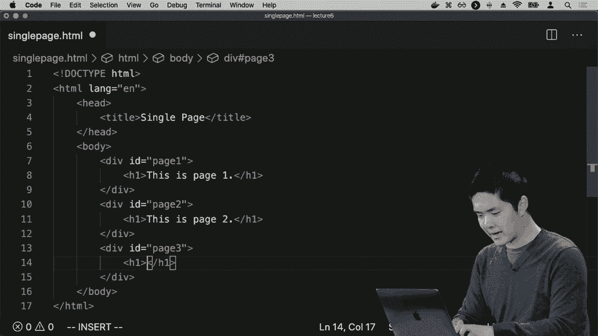

它有一个标题，写着这是页面三，例如，现在如果我打开。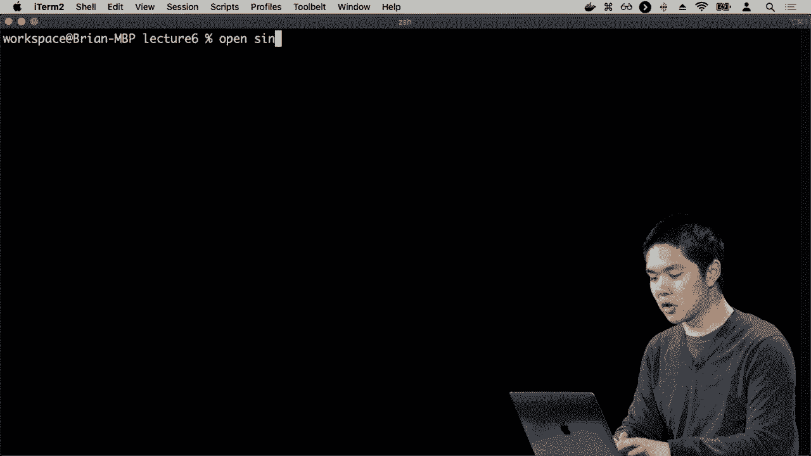

single page.html，我们看到的是同时显示所有三个页面，这可能不是我们想要的。我们真正想要的是默认情况下。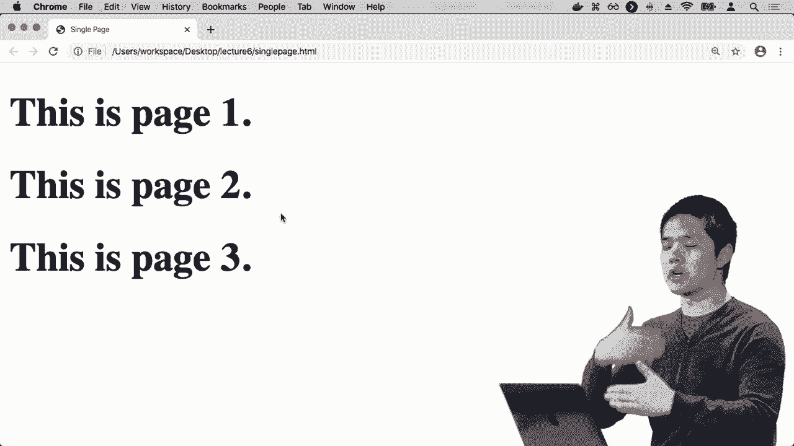

将这些页面隐藏，直到我们想要查看它们，例如一次查看一个页面。所以我可以做的一件事是使用 CSS 来切换，某个内容是否可见。添加一些样式标签到我的页面，默认情况下，我的所有 div 都是不可见的。

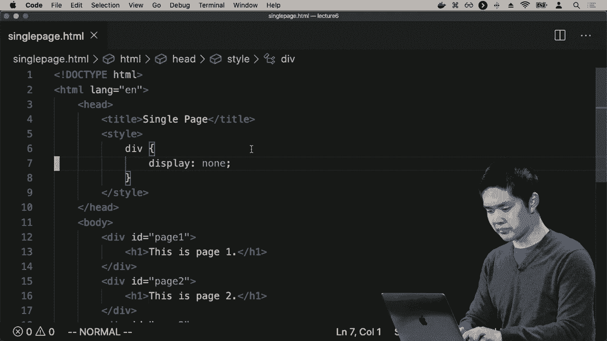

现在在屏幕上显示，如果我刷新页面，我实际上看不到三个标题中的任何一个。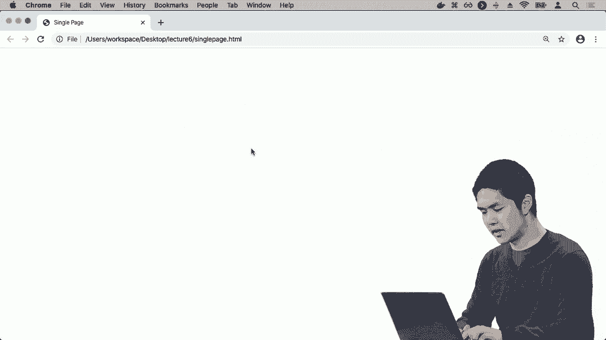

我之前有的，但是我真的希望现在有一些按钮，让我在这三页之间切换。所以我会给自己三个按钮，一个按钮写着页面一，一个按钮写着页面二，一个按钮写着页面三。例如，我需要某种机制，让这些按钮知道当你点击这个。

按钮应该显示哪个页面，因此我将继续使用数据属性，我们上次在 JavaScript 中看到过，给这些特定的 HTML 元素添加一些额外的信息，我会给第一个按钮一个 data dash 页面值为页面一，第二个按钮的值为页面二。

第三个是页面三的 data dash 页面值，这里同样只是提供信息。这样在我稍后写一些 JavaScript 时，可以让 JavaScript 代码查看这个 data dash 页面属性，来判断当你点击这个按钮时，应该让我看到 id 为页面一的 div，这就是我们要实现的。

所以现在让我们继续，写代码，做的就是能够说我想显示页面一，隐藏其他两个，或者显示页面二，隐藏其他两个，或者例如显示页面三。为此，我首先会写一个函数，让我实现这一点，我会写一个名为 show page 的函数，它的参数就是要显示的页面。

我想显示的页面，所以这个函数应该做什么，我们将要做的是使用 document.queryselector，我想获取具有特定 id 的元素。这个页面的 id 将代表我想显示的 div 的 id，所以我会说获取这个 id 的元素。

然后使用模板字面量，我会说好的，获取页面上任意元素的id，并且我想要更改它的样式属性，具体是更改它的显示属性，而不是默认的none。我希望更改为block，这样它就会显示出来。

块在页面上实际上。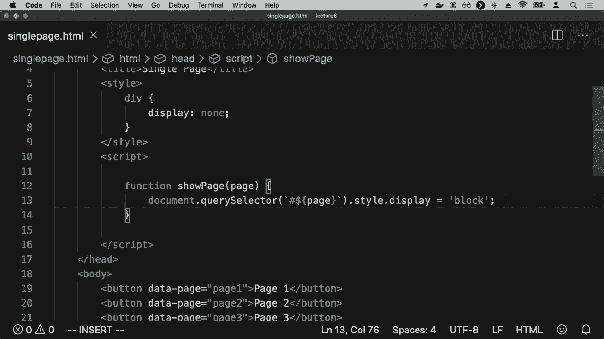

函数，我可以在浏览器中刷新页面进行测试。现在我看到三个按钮，这些按钮暂时没有任何作用。但是我可以在控制台中运行这个函数，像是运行显示页面函数，举个例子，显示页面一。

按下回车，现在页面一，然后页面二，那么页面二将变得可见。好的，这完成了我想要的一半，页面二现在可见，但页面一也可见。因此我可能想要这样，如果我显示一个页面，首先隐藏其他页面，像是隐藏。

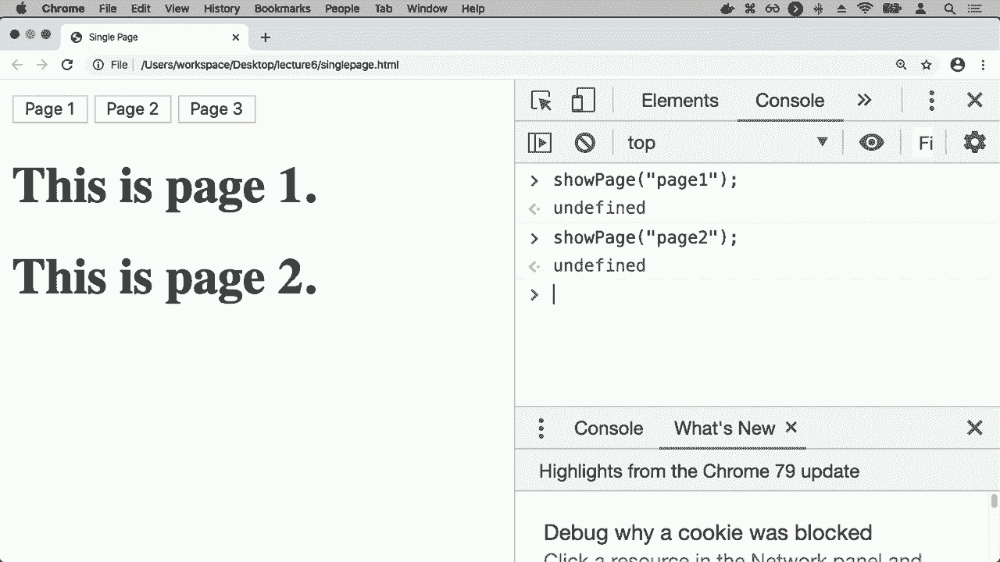

所有页面，然后显示页面二，或者隐藏所有页面，然后显示页面三。那么我该如何进行呢？首先，当我显示一个页面时，我想先隐藏所有其他页面，隐藏所有页面。为了获取所有页面，我会用document.querySelectorAll获取所有的div，这是我用来封装页面的。

现在对于每一个，再次有效地创建一个循环，我在遍历每个div，对于每个div，我们就这样设置。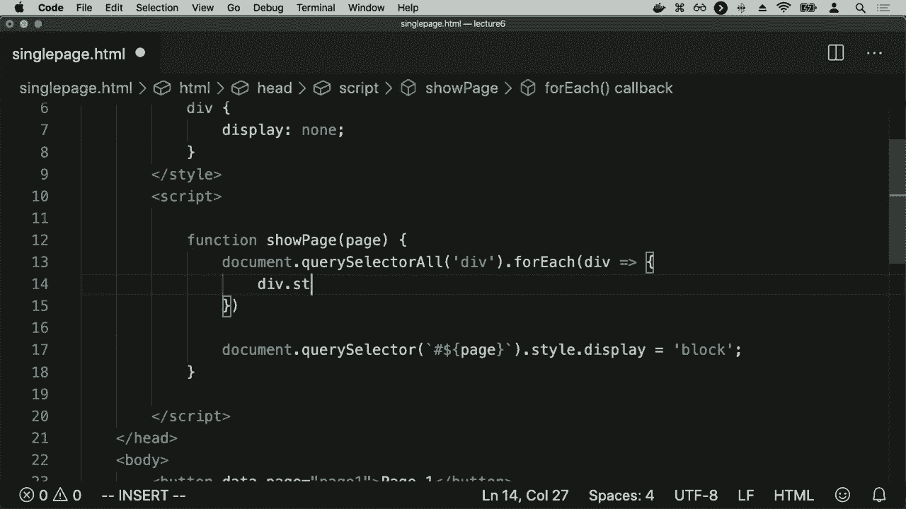

div的样式属性设置为none。所以这个显示页面的函数现在首先查询所有的div，它们模拟着我的单页面应用中的页面，对于每一个div，我们将其作为输入传递给这个函数。

每个使用这个箭头函数的语法，这只是一种简写方式，用于表达一个函数。在这里，我说对于每个div，我们将修改它的样式属性，将显示设置为none，意味着不显示任何div，然后只显示被请求的div，现在这应该解决这个问题。

同时出现多个页面，如果我回到这个页面并点击或输入显示页面一，那么页面一会出现，但如果我运行显示页面二，那么页面二会出现，但页面一。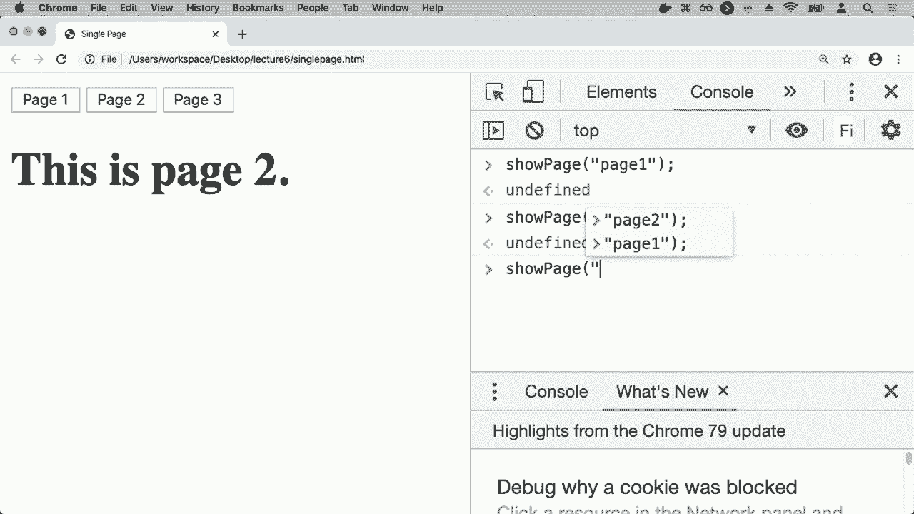

消失，同样，当我显示页面三时，它显示页面三而不显示其他两个，所以我可以通过控制台操控哪个页面是可见的。但现在我希望这些按钮能够真正起作用，当我点击其中一个按钮时，它能实际显示请求的页面。因此，为了做到这一点，我想要。

我需要为这些按钮附加一些事件监听器，这意味着我需要等待这些按钮加载到页面上，所以我们将使用document.addEventListener。等待直到页面上所有内容加载完成，然后我才会说让我们查询选择器所有。

对于所有按钮及每一个按钮，让我们为每个按钮附加一个事件监听器，因此我正在查询所有按钮，并说对每个按钮我想这样做，我想要做的是在按钮被点击时执行这个函数。

要显示页面，我想显示哪个页面呢？我想显示按钮数据集中页面部分的内容，而要获取当前按钮，即被点击的按钮，请记住，当我们在事件处理程序内时，我们可以利用javascript关键字this。

该关键字指的是接收到点击事件的元素，因此我可以说this.dataset。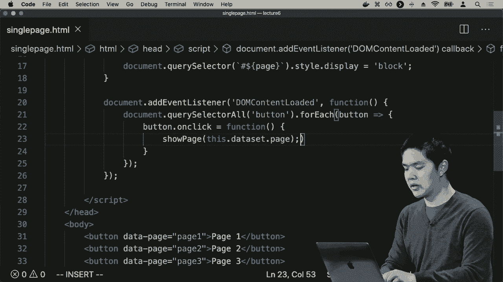

点页面意味着，对于每个按钮，当按钮被点击时，我们会为每个按钮运行这个函数。当按钮被点击时，我们想要显示哪个页面，我们将取这个按钮，即接收到事件的按钮，访问它的数据属性。

页面属性，这里有页面一、页面二或页面三。然后我们就可以调用我们刚才写的show page函数。所以现在我们已经完成了，为按钮附加了这些事件处理程序，所以现在如果我刷新页面。

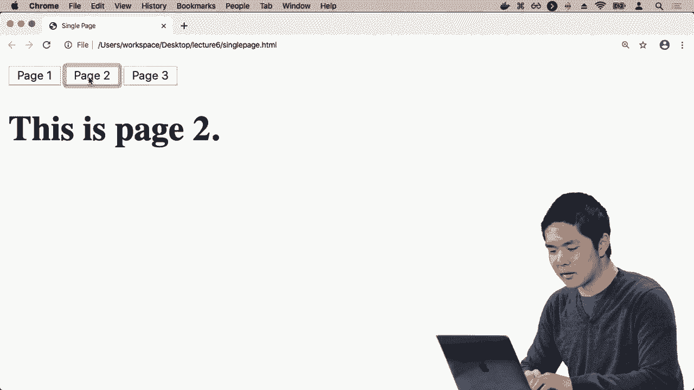

页面上我可以点击这些按钮，切换到任意三个页面之间。现在有趣的是，我们现在可以在一个单一页面中模拟多个页面的概念，所有内容都封装在一个html文件中，但不需要持续向服务器发出额外请求来获取访问权限。

然而，有时当你需要一个页面的新信息时，联系服务器可能是合理的。例如，你可能想象每个页面包含大量文本，如果我们立即将所有数据加载到html中并显示和隐藏，那将是低效的。

需要这样做，因为我们可能加载的信息超过了用户实际上关心的内容，尤其是如果他们从不查看第2页或第3页。所以我们可能想象的一个做法是动态加载这些数据，上次我们讨论的javascript中，我们看到如何使用fetch来请求一些额外的信息。

上一次是来自一个网络服务器，货币兑换率，但我们利用返回的数据填充了我们页面上的内容，同样，我们可以在这里做类似的事情，如果我们有一个单页面的总体结构，并且希望加载新内容，而不是完全加载新的HTML内容并重新加载整个页面。

我们可以询问自己的网络服务器，页面的哪个部分需要更改，然后替换页面的那部分，这就是我们现在要看的内容，现在结合Django作为我们的网络服务器，以及JavaScript用于编写客户端代码，以生成单页面应用。

我们将进入一个我提前准备的示例，叫做单页面一，里面只是一个Django应用程序，包含一个叫做单页面的应用。我们会注意到，首先要查看URLs，里面有两个URLs，一个是默认URL，仅加载索引函数，另一个是加载不同内容的URL。

就像是我可能想动态加载的页面部分，例如，我有 `/section/` 加上某个特定数字，如果我们看看这些URL的视图，实际上索引函数只是返回 `index.html`，然后部分函数做的是，它首先确保数字在1到3之间，如果是的话。

响应的是这些字符串之一。

那么这实际上是如何工作的呢？如果我进入。

如果我访问这个URL `/section/one`，我得到的是这一段文本，如果我去 `/section/two`，我得到的是另一段文本，而 `/section/three` 则是完全不同的文本，所以只是不同的文本。

我想将这段文本纳入一个现有的`index.html`模板中，该模板在我访问默认路由时加载，而在`index.html`中，我们会看到我有一个显示部分的函数，其行为与我们刚才看到的显示页面函数非常相似，但不同的是，显示部分将要做的事情。

它将从我的网络服务器获取我应该在页面上显示的文本，我从 `/sections/` 获取数据，填入一个数字，比如一、二或三，当我收到响应时，过去我们已经看到如何将该响应转换为JSON数据，如果它是一些结构化数据，我们也可以直接转换响应。

转换成纯文本后，我将获取该文本并在控制台中记录它，以便我们在日志输出中看到，但接着会查询选择页面内容，某个ID为content的元素，更新其innerHTML并将其设置为该文本，所以现在这个整个函数正在做的是，它将联系我的服务器，弄清楚哪些文本内容应该在。

新部分将填充页面相应的部分，并根据来自该 HTTP 请求的文本进行填充，然后在页面的下方，我们会看到我有一个“你好”标题和三个按钮，它们在不同的部分之间切换，每个按钮都有一个 data-section 属性。

用于确定应该加载哪个部分，然后是一个最初为空的 div。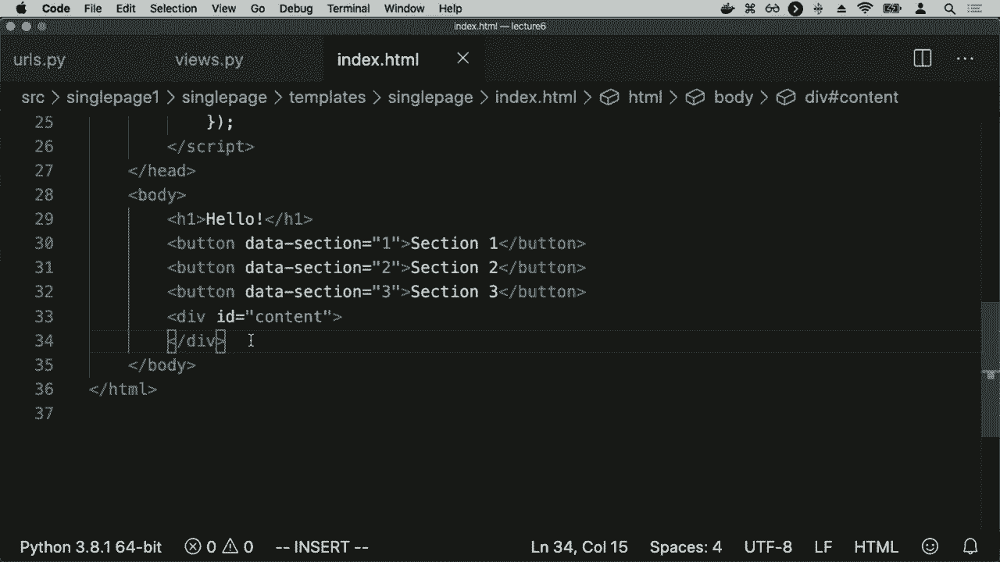

现在把这一切放在一起，如果我访问默认路由，我会看到“你好”，加上三个按钮，给我提供在三个不同部分之间选择的机会，如果我点击第一部分，发生的事情是 JavaScript 将请求 `section/1` 的文本，它会返回文本。

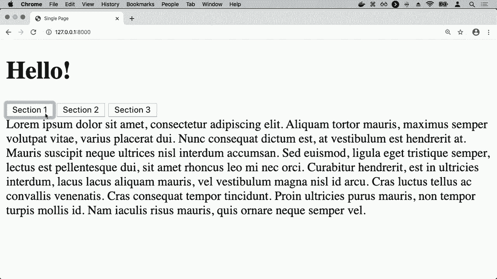

它将填充到页面的第一部分、第二部分和第三部分，所以与之前非常相似，但不同于之前我们所有文本一次性加载到 HTML 页面中，现在我们使用异步 JavaScript 仅在需要时动态加载信息，当我们点击某个部分时，它将发出请求。

请求需要填充的内容，它将进行填充，并生成标题。你可能想象，在一个更复杂的网站中，网页边缘的内容要多得多，所有这些内容保持不变，我们不需要重新加载任何这些信息，我们仅重新加载实际改变的页面部分。

当我们在这些不同的部分标题之间切换时，这在某些方面似乎是一种优势，也许我们可以更高效地运行这样的单页应用。但是，我们似乎失去了在 URL 中保持状态的概念，通常 URL 会给你指示当前页面的信息。

如果你在第一部分，你的 URL 是 `/1`，如果你在第二部分，URL 是 `/2`，第三部分是 `/3`，但当然在所有这些示例中，我们都停留在同一页面，每当我点击一个按钮，无论是第一、第二还是第三部分，URL 永远不会改变，URL 始终保持不变，结果是 JavaScript 中有一种方法。

以更新 URL 的方式操控该 URL，利用所谓的 JavaScript 历史 API，我可以将某些内容推送到历史中，这意味着更新 URL 并实际将其保存到用户的浏览器历史中，这样用户稍后可以潜在地返回到那个位置。为此，我将在类似的单页应用中展示另一个例子。

除了在 `index.html` 内部，我还添加了一些额外的东西。一个是当我点击一个按钮时，也就是说当我点击第一部分、第二部分或第三部分时，我在这里添加了这一行 `history.pushState`，`history.pushState` 的作用是，基本上会向我的浏览历史中添加一个新元素。

我首先指定任何与状态相关的数据，特别是。我存储了一个表示这里所表示的部分编号的javascript对象，下一个是一个标题参数，大多数网页浏览器实际上会忽略，因此通常可以是空字符串。但这里的第三个参数是应该放在url中的内容，我希望放在这个url中。

情况是类似于部分，后跟部分编号，例如我可以输入二。或斜杠部分三，例如，当我点击不同的页面时，这些内容将出现在url栏中，然后我希望能够支持的是，当我回顾我的历史时，如果我在网页浏览器中点击后退按钮。

如果我是之前访问的页面，我想从第3部分返回到第2部分。而且确实有一个事件处理程序，window.onpopstate，这意味着当我从历史记录中弹出某个内容时，比如返回我的历史记录。我们可以将一些事件作为参数，如果你查看事件.state。

我在控制台上运行的部分。日志记录，以便我们可以在稍后查看它。我们将看到存储的状态。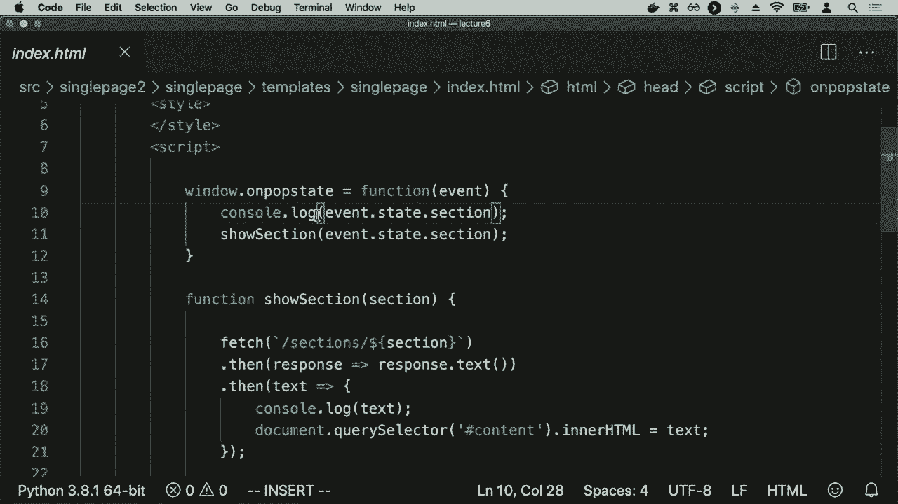

与用户历史的那部分相关联，我可以继续显示该部分。因此，总的来说，当我运行这个网页应用时。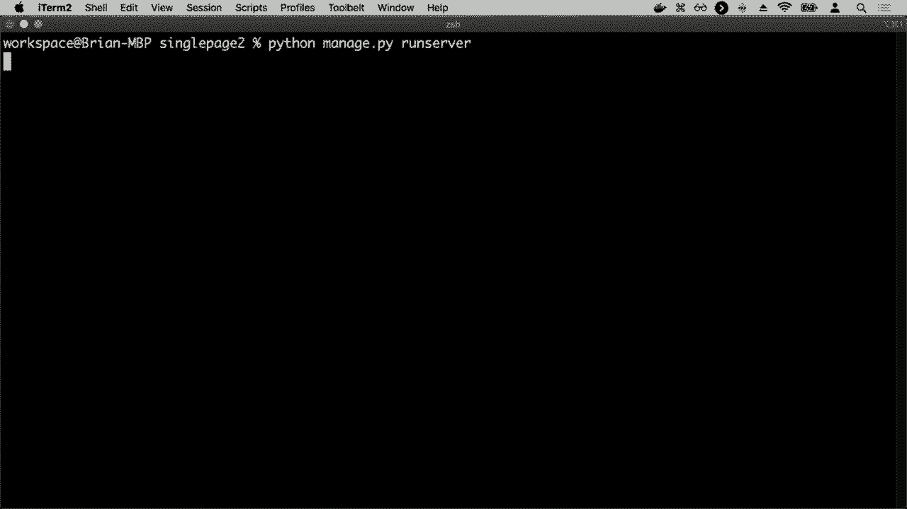

我看到三个部分的按钮，当我点击其中一个按钮时。我不仅看到文本，而且在url栏中也看到我现在在斜杠部分一，这已经被推入我的历史中，我也更新了url以反映这一点。我点击第二部分，更新了url，第三部分也更新了url，当我将内容推入我的部分时。

这样我就可以在需要时返回，事实上，如果我现在打开javascript控制台。如果我返回，例如返回到。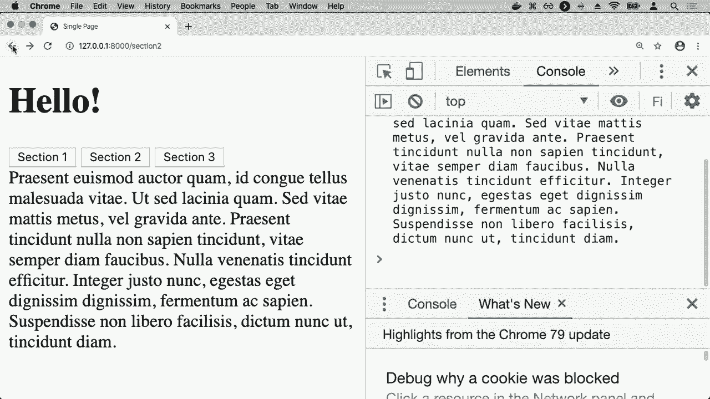

第二部分你会看到的是记录的内容是数字。二当我打印出当前与这个url相关的部分时。它保存了我应该加载第二部分的状态。因此，它确实加载了第二部分，这里当然没有任何问题。

原始范式是仅仅动态加载不同的页面。使用django进行请求并获取响应，但通常当你开始想象许多内容在同一页面上同时变化的应用程序时。你可能会想象社交网络网站，其中许多内容保持不变，你可能会。

查看同一页面的不同部分，能够动态加载信息，请求额外的信息，然后在页面上显示，这实际上可以是一种非常强大的方式，使你的网页更加互动。因此，这就是我们可能构建单页应用程序的方式，利用javascript来。

异步加载新数据，然后利用这个历史 API，让我们可以向 URL 添加内容，增加用户的浏览历史，以便我们可以稍后通过监听窗口的 `onpopstate` 事件回到它们。而且，事实证明，在 JavaScript 中我们访问到的窗口对象。

功能非常强大，它表示计算机屏幕上显示所有网页内容的物理窗口，还有一些窗口的属性可以查看，这使我们能够启用一些有趣的功能。例如，窗口的高度确实由用户的。

实际上看到的是他们在 Google Chrome、Safari 或任何他们使用的网页浏览器中的窗口，还有一些可能有用的属性，比如 `window.innerWidth`，它表示窗口的宽度，比如用户屏幕的大小，以了解窗口的宽度是多少像素。

窗口的内宽就像有一个 `window.innerHeight`，它表示窗口的高度。现在窗口表示的是他们实际上看到的物理部分，我们还看到另一个变量，JavaScript 让我们访问的，就是这个文档对象。那么它们之间有什么区别呢？

窗口和文档，文档通常代表整个网页。但是如果网页很长，网页可能不会完全适合窗口，你通常需要滚动整个网页，窗口在任何给定时刻只显示页面的一部分。

可以表示文档，像是这个大垂直部分，超出了窗口，文档中可能有一部分在窗口上方，还有一部分在窗口下方，所以 `window.scrollY` 是你可以访问的另一个变量，`window.scrolly` 表示滚动了多少。

滚动了多少像素，所以如果你在页面顶部，`window.scrolly` 为零，你根本没有滚动，但当你开始滚动时，如果你想知道用户在页面上滚动了多少，你可以查看 `window.scrolly` 来计算用户在 y 方向上滚动的像素数量。

整个页面的高度在 `document.body.offsetHeight` 中表示，表示文档的整体高度，我们谈论所有这些内容，此外还有 `window.innerHeight` 和 `window.innerWidth` 等，因为结合使用所有这些值，你可以开始进行一些有趣的计算。

所以你可能想检测的一件事情，例如，用户是否滚动到页面底部，这可能是你想知道的事情，结果是没有自动执行这个的事件监听器，但我们可以计算来尝试弄清楚，如果 `innerHeight` 是窗口的高度，而 `scrollY`。

这是用户垂直滚动的距离，而 `document.body.offsetHeight` 是文档的整个高度。你可以问自己，如果用户滚动到页面底部，什么情况需要为真？如果用户已滚动到底部，那么 `scrollY` 加上 `innerHeight`（也就是他们已滚动的量）。

加上窗口的高度，必须至少等于 `document.body.offsetHeight`，也就是说已滚动的量加上窗口的高度，将你带到页面底部，直到文档的高度，利用这个数学比较。

页面底部，我们实际上可以尝试将其付诸实践。所以我将打开一个示例，叫做 `scroll.html`，现在 `scroll.html` 中只有 100 个段落，位于 body 标签内，我有一个 p 标签，表示段落一、段落二，以此类推。

我在这个 HTML 页面的 body 内有 100 个段落，这就是全部内容。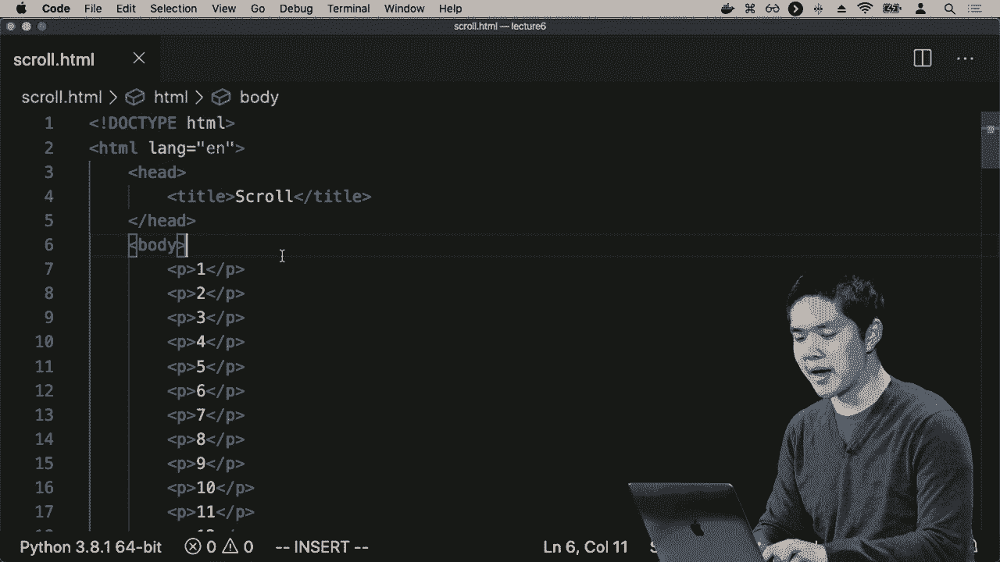

现在真的在这里。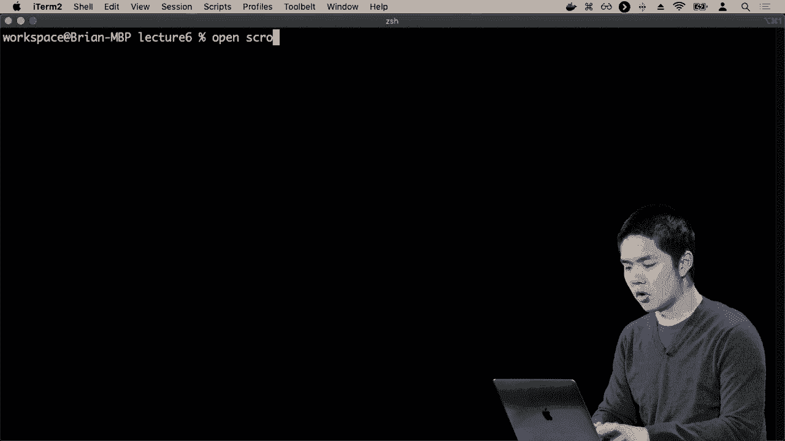

这样，如果我打开 `scroll.html`，我看到有 100 个段落可以滚动，而我想做的就是检测我何时到达页面底部，或许在那时做点什么，比如改变颜色。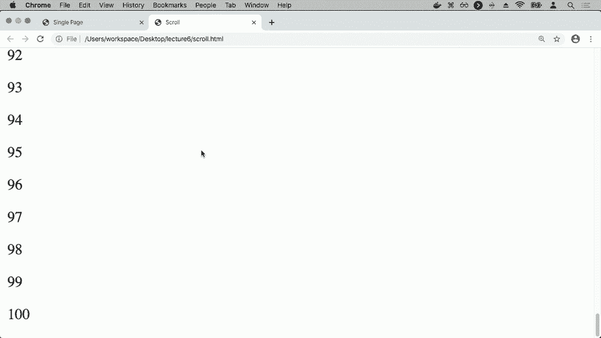

例如，我该如何做到这一点呢？我将需要一些 JavaScript，因此我将添加一些 JavaScript，并为 `window.onscroll` 添加一个事件监听器。滚动是一个监听我在窗口中滚动的事件，当我在窗口中滚动时，我们将运行这个函数。

我将使用箭头函数作为简写，我想计算什么呢？我想计算如果 `window.innerHeight`（窗口本身的高度）加上 `window.scrollY`（我已滚动的量）是否至少等于 `document.body.offsetHeight`。如果是，那么我必须已经滚动到页面底部，或者可能更远。

如果有一点点余地可以滚动到页面底部，那么如果这是真的，我就已经到达页面底部。接着我们会执行 `document.querySelector`，选择 body，并改变它的样式，特别是改变它的背景颜色，改为绿色，否则如果我们还没有到达底部。

页面，并将其背景颜色改为白色。因此我们现在做的事情是利用我们对窗口对象的了解，说明当我们滚动窗口时，检查加起来是否至少等于整个文档的高度，如果到达了页面底部，就改变页面的样式。

根据情况更改背景为主体，否则将背景更改为白色，如果它已经是白色的话，所以现在如果我看看这个实际的。

HTML页面重新加载scroll.html，我们将看到背景最初是白色，但当我向下滚动，直到我到达底部时，页面将变成绿色。

在我到达底部之前是白色，但一旦我到达页面底部。

它变成绿色，原因是窗口的高度，加上我从页面顶部滚动到现在的高度，这两者之和等于文档的整个高度。这意味着我们能够检测到我已经到达页面的底部。

作为结果，我们可以将背景颜色更改为绿色。现在这本身并不是一个特别实用的用途，因为我们通常并不关心在到达页面底部时更改背景颜色，但实际上是有真实的应用场景，你可能会想象到。

在允许无限滚动的网站的背景下，如果你在一个社交网站上，有很多帖子，你滚动到帖子列表的底部，然后它会生成一组新的帖子，或者你在查看新闻文章时滚动浏览新闻文章。

一旦你到达底部，它会加载一整套新的新闻文章，而无需你去另一个页面，它是如何做到的呢？这结合了两个要素，首先是使用JavaScript检测你已到达页面底部的能力，第二。

能够异步加载内容，使用JavaScript加载额外的内容，获取一些有附加内容的页面，一些额外的新闻文章、帖子等等，然后利用这些信息来操作DOM，将这些信息添加到现有网页上。

这最终赋予我们支持无限滚动的能力，所以现在我们来尝试一下实现无限滚动的样子。我已经开始创建一个名为scroll的示例应用，在这个应用中有一个名为posts的应用。

帖子应用的功能是，它有几个网址，它有一个默认网址，可以加载一个索引行，然后是一个帖子路由，加载这个帖子视图，所以让我们来看看这些是做什么的。索引的作用就是加载一个名为index.html的文件，这个模板。如果我向/posts发送请求，我需要提供两个参数。

我需要提供一个开始的帖子编号和一个结束的帖子编号，然后它将生成一些示例帖子，比如帖子编号一、帖子编号二，依此类推。在实际操作中你可以。

实际上可以使用社交网络帖子来代替这个，但这只是为了演示目的。那么，如果我进入这个。

如果我访问/posts并说开始等于1，结束等于10，比如这样，我会得到一个看起来像这样的javascript对象。回想一下，javascript对象只是一个方便的格式，用于在json格式中来回传递信息。我们这里有一个json对象，带有一个名为posts的键，给了我所有的帖子。

从第一帖子到第二帖子，一直到第十个帖子，它给了我这些帖子，因为我说从一开始，到十结束，但如果我说什么，比如从20开始到28结束，它会给我。

我可以指定我想要的帖子范围，从帖子编号20到帖子编号28。所以现在这是一个我有效实施的api，允许某人通过访问这个特定的url，传递参数，获取多种不同的帖子，从哪个帖子开始。

他们希望以什么帖子结束，然后他们将所有这些数据以json格式返回给他们，而这点非常好。现在，当我们加载帖子时，不必仅仅猜测需要加载多少个帖子，然后要求某人去另一个页面，我们可以直接加载前20个帖子。

现在我们想做的是，如果他们到达页面底部，继续通过访问这个api端点来加载接下来的20个帖子，获取接下来的20个帖子，然后将其填充到html页面中。让我们看看在实际操作中这是如何工作的，看看index.html中的模板。

html中有相当多的javascript，但首先看一下主体。主体中有一个用于所有帖子的div，最初将是空的。接下来，javascript将如何执行，我们将逐步解析它。我们从第一帖子开始，所以计数器将跟踪我们需要加载的下一个帖子。

默认情况下，我们将从加载帖子编号一开始，我们有一个变量叫做数量，它将告诉我们每次要加载多少个帖子。我们就说每次加载20个帖子，所以从1到20，然后21到40，41到60，依此类推。当dom内容加载完成时，就调用这个函数。

这称为加载，而加载函数的作用是确定开始和结束应该是什么，它获取所有新的帖子，然后对于每个返回的帖子，我们异步请求新帖子，而添加帖子函数则负责。

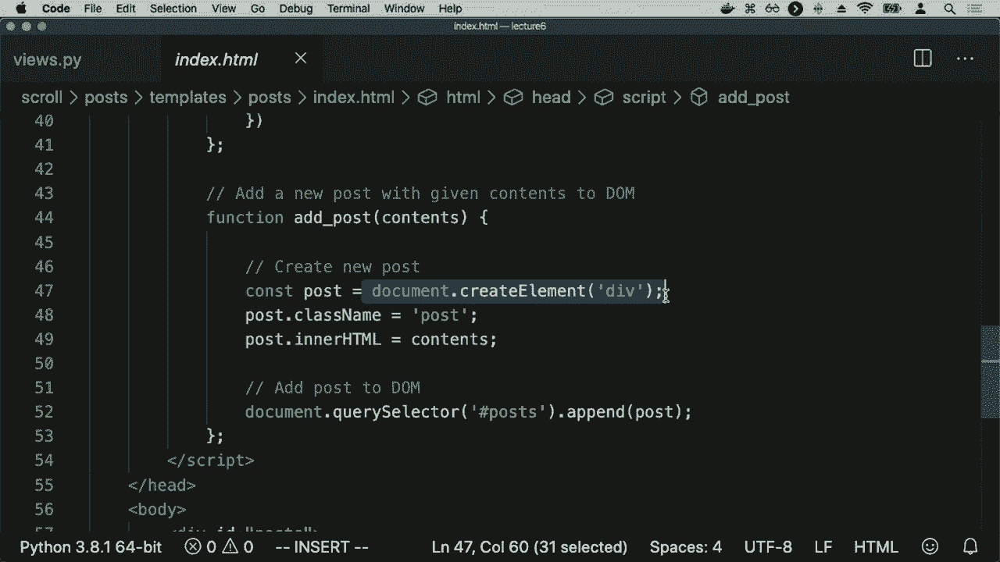

创建一个新的div，填充其中的帖子并将其添加到dom中。因此，现在我们有了这些部分，能够通过获取来加载新帖子。

我们能够动态加载所有这些帖子，所以如果我不去斜杠帖子而只是去这个默认路由，我会看到大约20个帖子全都显示出来，但只有20个帖子。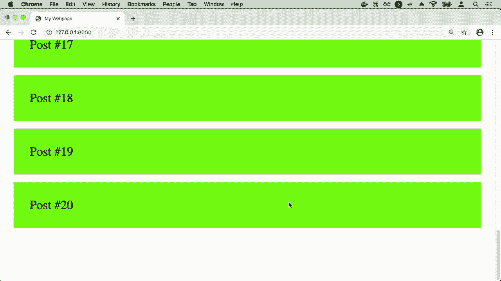

因为每次我调用加载函数时。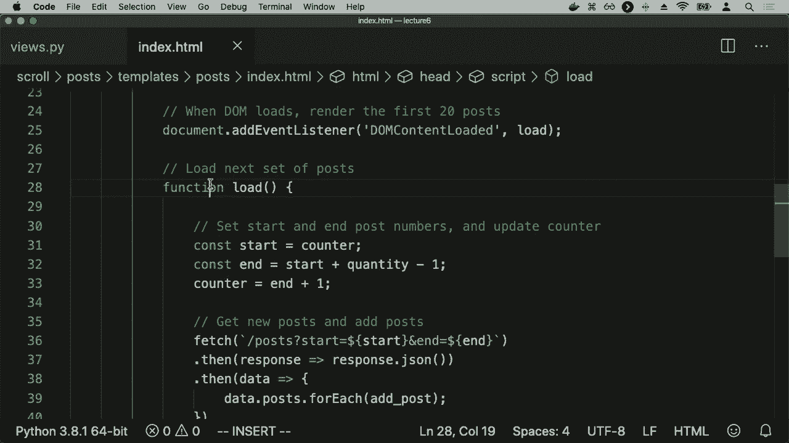

这将加载下一组帖子，例如，我可以在控制台中，如果我试着通过自己调用加载函数，按回车，过了一秒钟左右，下一组帖子出现了21，一直到40。我再调用加载，下一组帖子出现了41到60，每次20个帖子。

全部使用异步JavaScript，但现在我想要发生的事情。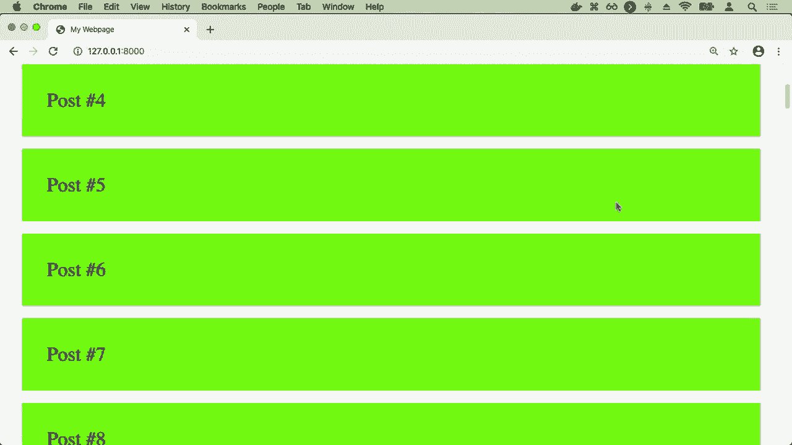

所以这一切都能自行发生，而不需要我干预和手动编写JavaScript调用，我只想说与之前相同的逻辑。窗口在滚动时，让我们说，如果窗口的内高度加上窗口的滚动y至少是文档的主体偏移高度，意味着我已经滚动到了页面的底部。

然后我们就继续调用加载函数，这些行每次我滚动时都在做的就是检查我们是否滚动到页面底部，如果是，那就去加载。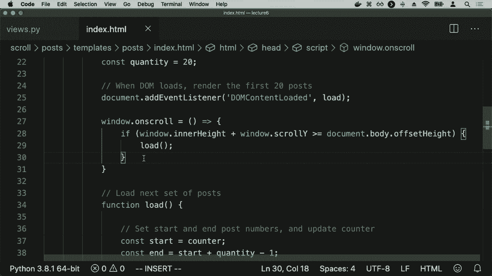

下一组帖子，现在我刷新页面时看到帖子1，一直到帖子20。现在，当我到达帖子20时，注意发生了什么，如果我滚动到底部，过了一秒钟，下一组帖子出现了，我再滚动到底部，我已经到了40。然后过了一秒钟，下一组再次出现。

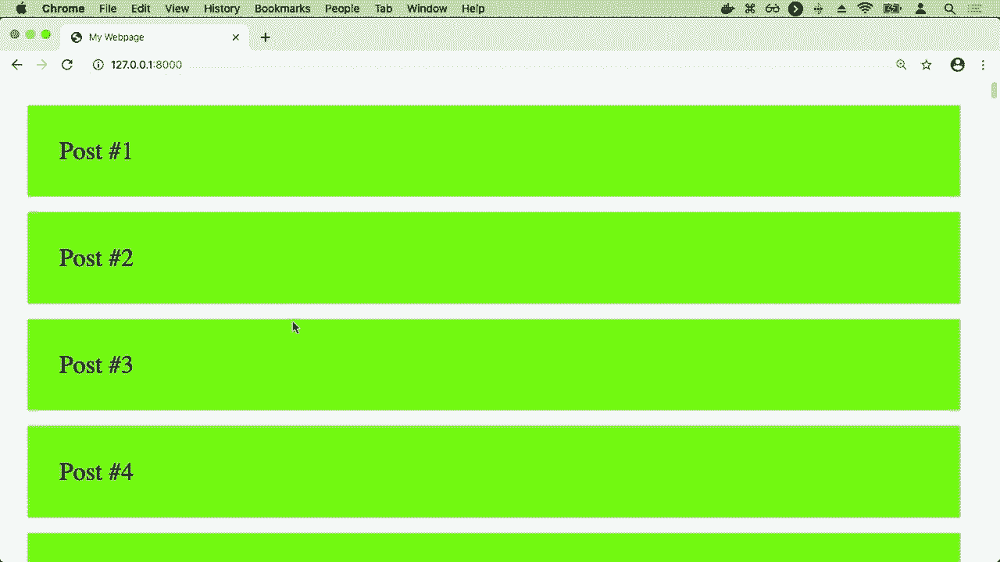

更多帖子将在之后加载，使我能够有效地实现无限滚动的想法，通过利用一些JavaScript技术，在我到达页面底部时检查，然后动态执行某些操作，比如加载额外的页面到屏幕上，这里也有很多的力量。

在JavaScript内部，用户界面与用户的互动以及页面如何互动，这里有很多力量，类似于用户滚动到页面底部。
