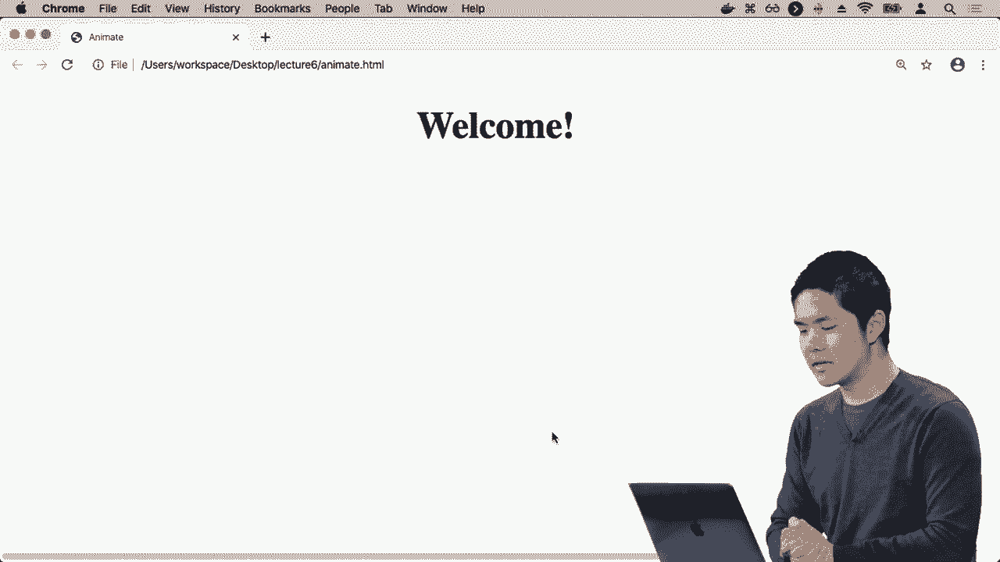
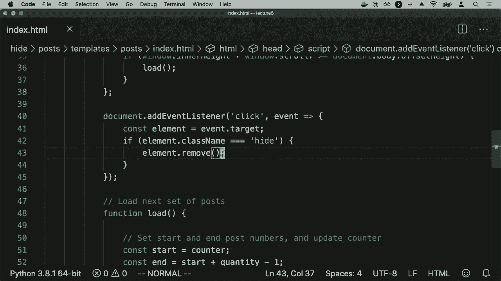

# 哈佛 CS50-WEB ｜ 基于Python ／ JavaScript的Web编程(2020·完整版) - P19：L6- web用户接口与交互 2 (动画与交互) - ShowMeAI - BV1gL411x7NY

为了让事物在某种方式下移动并改变其属性，结果显示CSS已经支持动画。CSS已经为我们提供了支持，允许我们为元素设置样式，比如我们希望这个元素是什么颜色，以及多大，例如，但它也赋予我们动画这些属性的能力。

改变某物的大小或在某段时间内改变某物的位置。那么现在我们来看看一个实际的例子，我将创建一个新文件，命名为animate.html。在animate.html中，我想添加一点动画。

将CSS应用到这个特定页面，我将从一个标题开始，一个像“欢迎”这样的标题，它将显示一个欢迎消息，因此现在如果我打开animate.html，我看到的只是一个消息。

说欢迎，但现在让我们为它添加一些CSS。让我们。

放入样式标签中，对于这个标题h1，我想要。

为其应用特定的动画，我首先需要指定动画的名称，我可以为动画选择一个名字，比如说“增长”。我会将动画的持续时间设置为两秒，然后动画填充模式就像动画应该朝哪个方向移动，应该向前还是向后。

向前还是向后，我们通常希望我们的动画向前进行，以便根据我们将要指定的一些规则取得某种前进的进展。所以在这里我说我们将使用一个叫做“增长”的动画来为所有标题动画，现在我实际上做到了这一点，并且在样式上方。

我会说，在关键帧“增长”，这将允许我为这个特定元素指定一些关键帧，这意味着元素应该从哪里开始，样式属性应该是什么，然后在最后样式属性应该是什么。CSS将负责确定需要什么。

发生在所有那些中间的几分之一秒内。例如，我可以说像“开始增长”，这意味着它的初始属性应该是什么，可能一开始我想让它的字体大小为20像素，然后我们说字体大小为100像素。所以总体来说，这表明我。

我想将名为“增长”的动画应用于我所有的标题，这个动画应该持续两秒并向前进行。

而“增长”动画将会做什么呢？嗯，它意味着在开始时，任何遵循“增长”动画的东西将以20像素的字体大小开始，而在结束时将增长到100像素的字体大小，我现在已经定义了这个动画的含义，所以如果我继续刷新这个页面 animate.html。

你会看到“欢迎”在两秒钟内改变大小，它从小变大，遵循那些我告诉它遵循的关键帧，这个特定步骤是一组指令，它从一个特定的字体大小变为另一个字体大小，因此我们。

在页面上查看效果，结果你可以做的不止是操控大小，你可以操控几乎任何你想要的CSS属性。所以如果我告诉标题它应该有一个相对的定位，这意味着它的位置应该相对于其他元素或其父元素中的其他事物，我可以说你应该将你的位置从。

从屏幕左侧的零百分比，移动到距离左侧50%的位置。在这一点上，“增长”可能不是这个动画的最佳名称，我会称它为“移动”，所以动画名称是“移动”，现在这个动画将会做的是。当你运行动画时，它将从紧靠屏幕左侧的地方开始。

调整为距离屏幕左侧大约50个像素，我们看到的就是动画的过程，它从左边开始。

一直刷新到屏幕大约一半的地方，刷新页面，它就会执行完全相同的操作，结果我们不仅需要指定动画的开始点和结束点，我们还可以指定各种不同的关键。

在动画的不同点设置帧，我们希望捕捉到一些东西。例如，在动画开始时，具有这组CSS属性，可能在动画进行到一半时有一组不同的CSS属性，然后在最后再有一组CSS属性。

所以我可以说，如果我想让标题不仅向左移动到右边，还要再移动回来，我可以说在开始时，在零百分比的时候，当你完成零百分比的动画时，你应该距离左侧零百分比。

在动画进行到一半时，你应该距离左侧50个像素。当你完成动画时，100%到达左侧，让我们回到。嗯，距离左侧为零百分比，我现在有三个关键帧，动画的开始，动画的中间回到。

动画的开始，再次刷新页面时，我们会向右移动，然后再回来，我们能够向一个方向移动，然后再移动回来。

还有其他属性，我可以设置动画的迭代次数。

例如，设置为2，这意味着动画不是只运行一次然后停止，而是运行两次然后停止。因此，当我刷新时，它向右移动，然后向左移动，然后再重复一次。如果你真的想的话。

可以将其设置为无限，这意味着从不停止执行这个动画，它始终在进行。

要将这个标题移动到右侧，然后再移动到左侧，依据我指定的关键帧。因此，如果你看到页面上有东西以某种方式互动地移动，有很多方法可以实现这一点，但仅使用CSS也能很好地创建这类动画。

而现在这个动画只是无限循环。我们可以使用JavaScript来控制这个动画，所以让我们看看效果。我要回到页面的主体，除了一个写着“欢迎”的标题，我还会添加一个按钮，上面写着“做”，接下来就是添加一点JavaScript。

我将添加一些JavaScript，以便按钮现在可以控制动画，决定动画何时开始和停止。因此我们在这个脚本内部的操作是，首先说，document.addEventListener，DOMContentLoaded，这意味着等到DOM加载完成，如同我们之前所做的，现在让我获取那个h1元素。

我最初会将它的样式。animationPlayState设置为paused。所以，动画播放状态是样式的一个属性，让我决定动画是正在播放还是暂停，我可以使用JavaScript来控制它。与其说无限运行，我可以说动画的播放状态应该从。

通过首先获取h1元素，然后修改该元素的动画播放状态属性来实现暂停。但是我希望的情况是，每当有人点击按钮时，我想要改变动画的播放状态。所以我要说，document.querySelector按钮。意味着获取那个按钮，当有人点击按钮时，让我们运行这个函数。

当前的动画播放状态是paused，我们将继续设置动画播放状态为running，否则如果它已经在运行，那么我们就将动画播放状态设置为paused。因此，整体来看，这个函数将做的是，它将获取标题，初始暂停每次。

如果按钮被点击，运行这个函数。

函数会判断如果我们暂停，就开始运行动画；否则通过修改标题的动画播放状态来暂停动画。所以现在如果我刷新这个页面，我们有欢迎信息加上一个按钮，上面写着“点击这里”，最初一切都是暂停的，没有动画发生。

但我点击这里，这开始了动画，它将无限进行，直到我决定停止它，此时我再次点击它，动画暂停。我可以控制何时开始和何时暂停动画，这在你想创建更互动的东西时特别有帮助。

页面上的动画，但这尤其有帮助，因为。！

这意味着你可以逐渐地改变 CSS 属性，而不是立即改变。你有能力去动画化某些东西，让它更好地工作。那么，让我们看一个例子，如何将这个想法付诸实践，回到我们的帖子示例，我们有一个无限滚动的帖子列表，但。

现在想象一下，我们希望在完成后能够隐藏帖子，所以我准备了一个名为隐藏的示例，它与之前的非常相似。！

但这次我只添加了一个额外的按钮，按钮上写着“隐藏”。！

div，现在点击隐藏按钮什么也不做，我们稍后将实现这一点。！

但首先要查看这是如何工作的，如果你进入隐藏，进入。！

index.html 模板中唯一的变化是当我添加一个新帖子时会发生什么。它从服务器加载帖子，然后在获取到那些帖子时，它会遍历每个单独的帖子，这只是一个字符串文本。并且它将那个字符串文本添加到页面的一个元素中，通过这个 add post 函数。

ad post 函数是创建一个 div 来存储那个帖子。给它一个类名，因为我们将通过这个类名来动画化它。然后将其内部 HTML 设置为帖子的内容，比如“帖子编号一”、“帖子编号二”、“帖子编号三”，再添加一个只写着“隐藏”的按钮。

然后我们将把它添加到 DOM 中。这就是 adpost 现在要做的，我们通过这段 JavaScript 代码生成一些 HTML，然后将这些 HTML 添加到页面上。现在我们添加的是一个 div，包含文本，同时还会给我们访问一个按钮的权限。

我们最终希望能够隐藏那篇帖子。那么我们如何让帖子隐藏功能正常工作呢？我们想要做的是以某种方式检测用户何时点击这些隐藏按钮，有多种方法可以做到这一点，但一种方法是监听任何点击事件。

每当有人点击文档时，我可能会想问他们到底点击了什么。结果是，对于大多数事件监听器，事件监听函数可以将事件信息作为可选参数传入。

比如说点击事件、滚动事件、按下键事件或抬起键事件。你可以访问的一个属性是event.target，它代表事件的目标，在这种情况下就是实际被点击的东西。我会把event.target保存在一个名为element的变量中，现在的想法是无论发生什么。

被点击的目标是事件的目标，我们将其保存在element中。我想知道element是否是隐藏按钮，我也可以为每个隐藏按钮附加事件监听器，这只是另一种实现方式。

为了演示，我们说当我们在任何地方点击时，将其保存在这个变量中，如果它是一个隐藏按钮，那么它将具有类名hide，因为我给每个隐藏按钮都赋予了类名hide。所以我可以说，如果element.className等于hide。

这意味着被点击的对象是具有类名hide的元素，我们可以假设它实际上是一个隐藏按钮。接下来，我想做的是调用element.remove来去掉那个元素。那么如果我刷新页面，这会有什么效果呢？让我们试试帖子一，如果我隐藏它，我想隐藏帖子一。

好吧，这并没有完全成功，虽然接近，它去掉了隐藏按钮。

但我并不想去掉隐藏按钮，我想去掉整个帖子。所以这里发生了什么似乎是，如果元素的类名是hide，意味着我点击了一个隐藏按钮。

element.remove只会去掉那个元素，它去掉了隐藏按钮，但并不去掉包含它的帖子。如果从DOM的角度考虑，帖子是一个div，而它的子元素是这个隐藏按钮，所以去掉按钮并不会同时去掉帖子。如果你也想去掉帖子。

你需要去掉的不是元素，而是元素的父级。结果在JavaScript中也有方法可以做到这一点，element.parentElement.remove。也就是说获取这个元素的父级并去掉它，我想隐藏它，隐藏帖子一，好的，现在我看到帖子二。

如果我想隐藏帖子三，我就隐藏帖子三。现在帖子三消失了，现在我直接从帖子二跳到帖子四，这样是有效的，但也不是，因为所有的帖子都是完全相同的。

三，看起来并不明显，因为帖子二和四几乎看起来一模一样，你真的要注意才能知道隐藏成功了。因此，这可能是动画实际上非常有帮助的时候。我可以说些类似的话，让我们给这个帖子。

每个帖子都有一个关联的动画，我们将给它一个动画名称，叫做隐藏，动画持续时间为两秒，我们将说需要两秒才能隐藏，并且设置动画填充模式为前进。我想向前进行动画，最初我将给帖子设置一个动画播放状态。

初始时，我不想让动画运行，因为我不想立即隐藏所有帖子，暂停这个动画。稍后我们会继续运行动画，以便实际隐藏帖子，然后我需要定义隐藏帖子到底意味着什么，我会说好吧，在0的状态下。

百分比标记，这意味着什么，让我们给自己一个不透明度为1。不透明度是一个CSS属性，它控制HTML元素的透明度，而在动画结束时将不透明度设置为0。因此，最初我们可以完全看到这个元素。

这个元素是完全透明的，现在我需要做的实际上是触发这个事件。某种方式下，这可能会在我的事件监听器内发生。在不立即移除元素的情况下，让我先获取父元素并将其动画播放状态设置为运行，例如，意味着当我点击隐藏按钮时就开始运行动画。

动画将会在几秒钟内将不透明度从1变为0。如果我真的想要的话，可以添加另一个事件监听器，表示获取父元素，添加事件监听器。有一个事件叫做动画结束，当动画结束时会触发。

然后我可以说，好的，当动画结束后，我们将继续移除这个元素。因此，总的来说，而不是在我点击隐藏按钮时立即移除元素。

我想做的是，如果你点击一个按钮，而这个按钮是隐藏的，那么就获取父元素，而不是隐藏按钮，而是帖子本身。将其动画播放状态设置为运行，意味着运行隐藏动画，然后为整个帖子添加一个事件监听器。

当动画结束时，去掉整个帖子，从DOM中完全移除。那么现在这一切的效果是什么，进行这个动画后，如果我刷新页面，就会看到所有这些帖子。如果我试图隐藏第二个帖子，比如说，您会看到透明度变化。

然后它慢慢消失，直到完全透明时，帖子才会完全消失。所以我可以说隐藏第四个帖子，它消失了，第五个帖子跳起来填补它的位置，我可以对这些帖子做任何事，点击隐藏按钮时触发动画。

这就是动画能做的一部分价值，它能让我们的用户界面更友好，而不是立即删除一个帖子，而是通过优雅的淡出效果让它消失。即使这样做也并不完美，动画上可能会注意到的一件事是，它在帖子消失时会跳起来。

如果我隐藏第三个帖子，它就消失了，第五个帖子会突然跳起来以填补它的位置。我希望能更聪明一点，在帖子消失后稍微缩小它的大小，这样帖子不会猛地跳入位置，而是更自然地滑入。

这里我可以玩玩，也许我想说，让我将这个动画变成多部分动画。

所以在这里，我不只是从零到百分之百设置透明度从1到0，也许在动画的前75%中，会处理透明度从1降到0，但在动画的最后25%中仍然以透明度为0结束，但任何会产生垂直空间的东西我。

我希望减少到零，所以高度应该是零像素，行高，也就是文本的高度，应该也是零像素，任何内边距我希望消失，实际上我已经在帖子底部添加了一些外边距，我也想去掉它。所以我希望将所有这些设置为零，从它们的初始值开始。

最初的高度恰好是高度的百分之百，对于行高也是如此，父元素的高度最初有大约20像素的内边距和10像素的底部外边距，我希望在动画的75%处这些仍然成立，但只有在动画的最后25%中。

我希望将所有这些垂直高度属性设置为零，移除所有高度，移除行高，移除所有内边距。这样效果就是，我会有一个动画，在动画的前75%中，唯一变化的是透明度，透明度从1变为0。

完全可见到完全透明，这条帖子已经透明了，你看不见它，但它仍然占据页面上的物理空间。现在我们将减少这条帖子的高度，这样你就完全看不见它了，所以如果我刷新这个页面，这里又出现了所有帖子，但如果我点击隐藏某一特定帖子。

我们会看到它首先渐渐消失。

然后它的高度缩小，以便下一个帖子能够很顺畅地滑入位置，我可以再这样做。隐藏帖子，它是透明的，然后滑入位置。这再次只是应用了css动画的这个理念，使用动画属性使我们的界面更好用，视觉上更清晰。

有一条帖子消失了，其他帖子现在已经向上滚动，以便占据它的位置，因此我们现在能够使用javascript创建许多漂亮的用户界面，我们能够创建单页面应用程序，创造无限滚动，甚至可以创建一些动画。

但你可能意识到的一件事是，我们的应用程序开始变得相当复杂，需要很多javascript代码来操作我们不同部分的内容。
