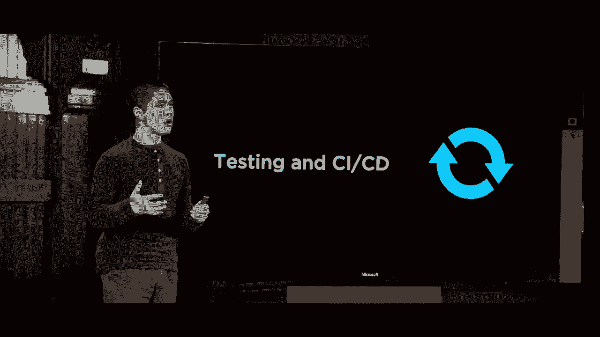
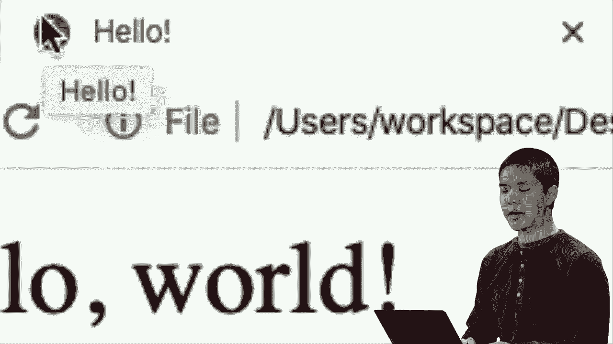
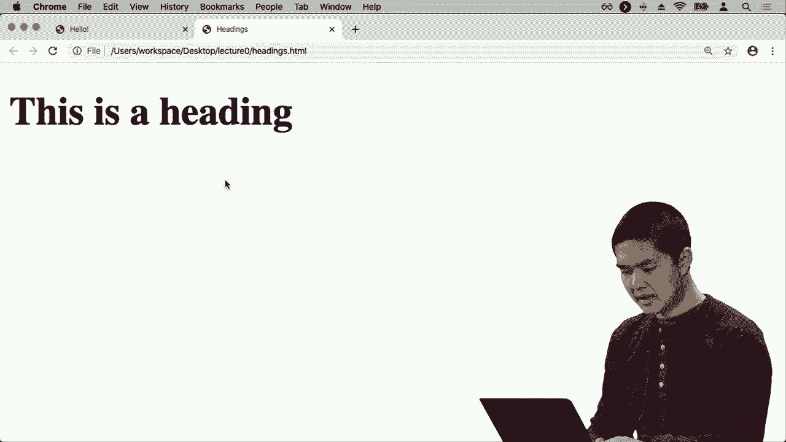
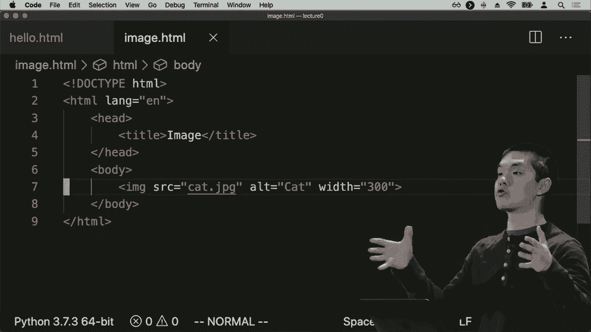
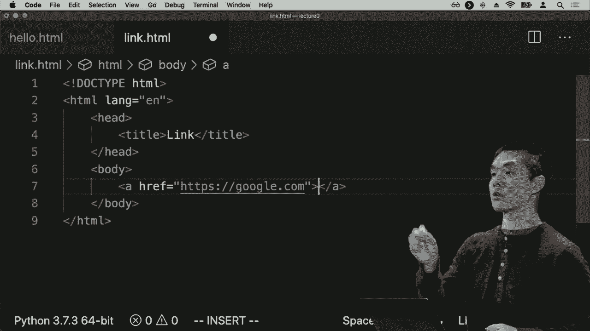
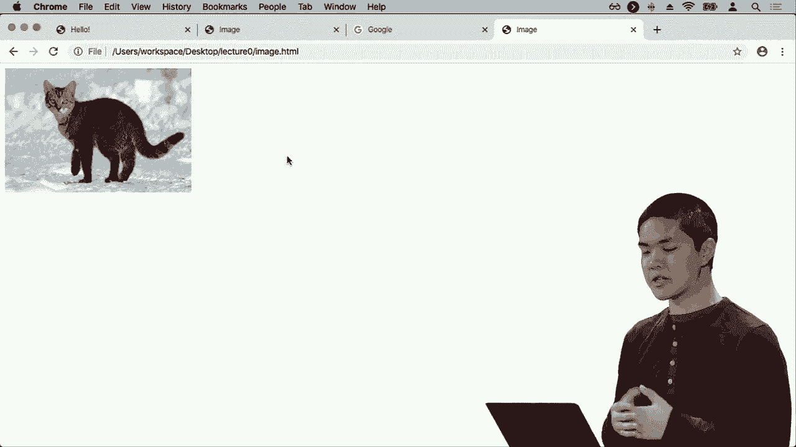
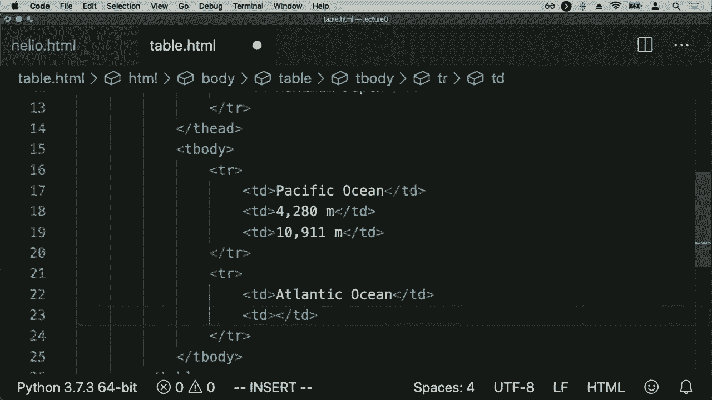
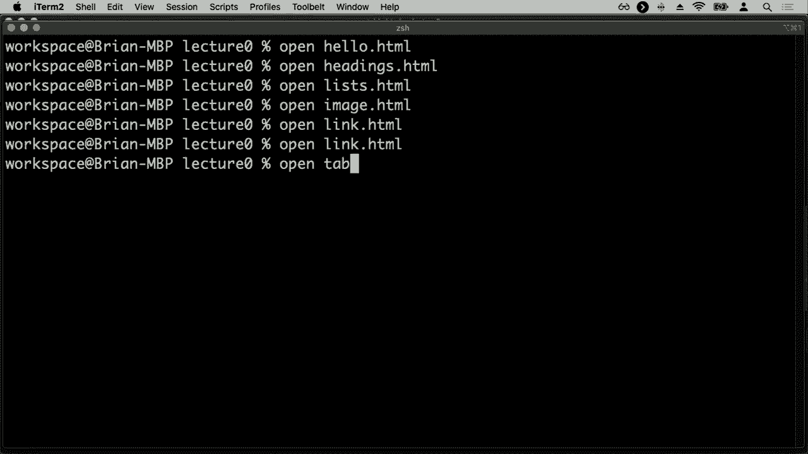
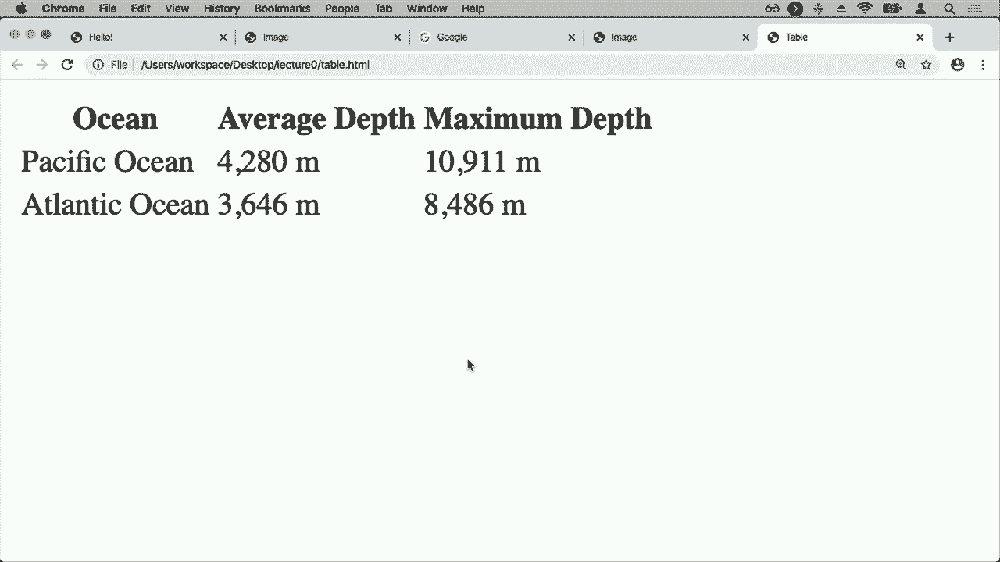
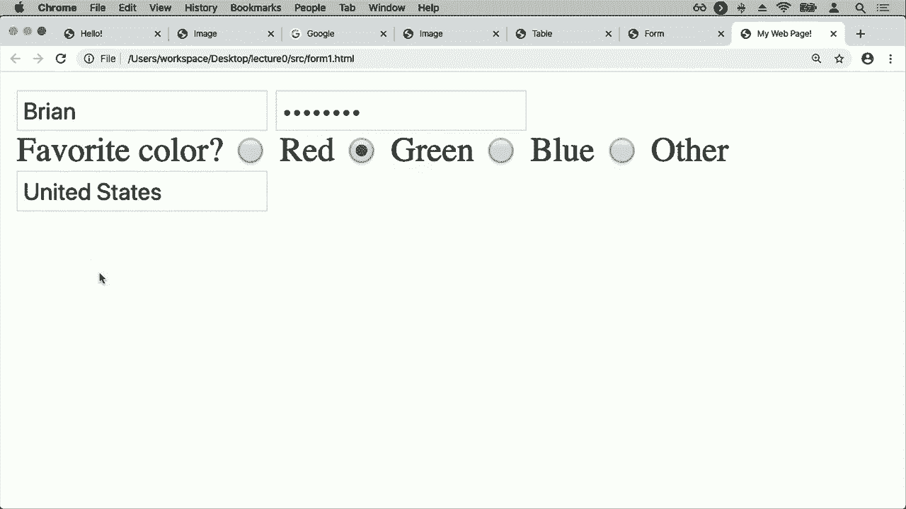

# 哈佛 CS50-WEB ｜ 基于Python ／ JavaScript的Web编程(2020·完整版) - P2：L0- HTML与CSS语法 1 (web编程与HTML) - ShowMeAI - BV1gL411x7NY

[音乐]。

好的，欢迎大家来到使用Python和JavaScript的网页编程。我叫Brian U，在这个课程中，我们将深入研究网页应用的设计和实现。在讲座中，我们将有机会讨论和探索许多核心的想法、工具和语言。

对于现代网页编程，通过动手项目，你将有机会将这些想法付诸实践，设计多个你自己的网页应用，最终以一个你自己选择的项目作为结尾。在整个学期中，我们将涵盖网页编程领域的多个主题，从这里开始。

html5和css3是理解网页的两种核心语言。HTML是一种我们用来描述网页结构的语言，CSS是一种我们用来描述网页样式的语言，包括颜色、字体、布局和使网页看起来的间距。

完成这些之后，我们将关注获取一个工具，这个工具并不是特定于网页编程，但我们可以用它来进行版本控制，跟踪我们对网页程序所做的不同更改，并使我们能够在多个不同项目上工作。

同时也将网页应用的各个部分整合在一起。之后，我们将关注Python，这是我们将要探索的第一种主要语言，这是一种我们将用来构建网页应用的语言，具体来说我们将使用。

Python使用一个叫django的框架，django是用Python编程语言编写的网页编程框架，我们将用它来简化网页应用的设计和开发。特别是django使得设计与数据交互的网页应用变得简单，因此在这之后我们将继续。

接着我们将关注sequel，这是一种我们可以用来与数据库互动的语言，特别是研究django如何允许我们使用模型和迁移来与数据交互，以及如何让用户更方便地与数据互动。接下来，我们将关注主要内容的第二部分。

我们将在这门课上探索的编程语言是JavaScript，看看如何使用JavaScript在用户的网页浏览器中运行，使网页变得更加互动，特别是在用户界面的背景下研究现代用户界面。

接下来，我们将关注测试，看看持续集成（ICD）和持续交付，这些是我们可以使用的软件最佳实践工具，以确保我们能够设计和开发。

更有效地编写代码，特别是在测试中，确保我们在进行更改时， 

对我们的代码进行更改时，确保我们没有破坏现有的网络应用程序部分，确保我们有一整套测试，可以用来确保我们的网络应用程序始终如预期那样运行，最后我们将关注可扩展性和互联网安全性。

随着我们的网络应用程序变得越来越大，越来越多的不同用户开始使用我们的网络应用程序，我们该如何在这些人之间进行负载均衡，以及我们需要对数据库做出哪些更改，以确保大量用户能够同时连接到我们的网络应用程序？

我们将探讨设计网络应用程序的安全隐患。如果我们不小心，敌对者可能会做些什么，我们应该如何主动设计我们的网络应用程序，以确保其安全，但今天我们将以HTML和CSS开始我们的讨论，这两种语言是基础。

理解网页以及网页浏览器如何显示这些网页，我们将从HTML（超文本标记语言）开始，这是一个我们可以用来描述网页结构的语言，网页中的所有按钮、文本、表单以及其他部分。

用户最终看到并与之交互的我们第一个HTML页面将类似于这个，它将是我们编写的基于文本的代码，然后像Safari、Chrome或Firefox这样的网页浏览器能够查看、解析、理解并显示给用户，所以让我们来看一下这个页面。

一次一行，逐步理解其工作原理，即使你不完全理解语法的所有细微差别，也许会有几件事情引起你的注意，你可能会注意到“标题”这个词，这可能反映了网页的标题，例如，在这个例子中。

似乎是“你好”这个词，然后进一步往下，我们看到网页主体似乎包含“你好，世界”这几个字。那么这个网页实际上会是什么样子呢？我们来看一下，打开一个文本编辑器，你可以使用任何你想要的文本编辑器。

在这门课程中，我将使用微软的Visual Studio Code，并打开一个新文件，我将称之为hello.html，在hello.html中，我将编写刚刚看到的相同HTML，并将在适当的时候解释这些行，但请记住，我们有一个标题为。

类似于hello的内容，以及页面的主体，我们在这里说了类似hello world的内容，所以这是我们的第一个HTML页面，如果我继续进行。

打开HTML页面，例如打开hello HTML，在网页浏览器中，我会看到页面主体中有hello world的字样，如果你注意到我网页浏览器顶部的标题栏，我看到有我们页面内容的标题。

这个页面在这种情况下仅包含单词hello，所以这是我们能够开发的第一个网页，仅使用HTML，现在让我们更详细地探索这个程序是如何工作的。这里再次是我们刚刚查看的网页，这一行doctype HTML是。

我们可以称之为文档类型声明，这是一种告诉网页浏览器我们在这个特定网页上使用哪个版本的HTML，因为根据HTML的版本，网页浏览器可能会想要显示不同的信息，或者可能需要以不同的方式解析页面。

HTML的不同版本略有不同的方式来指示该版本，但这一行doctype HTML是我们表示该HTML页面是用HTML5编写的方式，这是HTML的最新版本，之后我们的HTML页面结构是由一系列嵌套的HTML元素构成的，每个HTML元素描述。

页面上的某些内容可能会有嵌套在其他元素中的元素，每个元素都由我们所称的HTML标签表示，这些标签用尖括号括起来，这里我们看到HTML标签的开始，这意味着这是HTML的开始。

下方的这条slash HTML意味着这是页面HTML内容的结束，而中间则是页面的实际HTML内容，这可能包括HTML元素。你可能还会注意到在这个HTML标签中，我们指定了一个HTML属性。

我们在这里提供了一些关于这个标签的附加信息。我们为其提供了一个Lang或语言属性，该属性等于en或英语，这只是告诉网页浏览器或任何查看此页面HTML的人，这个页面是用一种语言编写的。

它是英语，这对搜索引擎来说是有帮助的，例如，当它们在浏览许多不同的网页时，试图弄清楚每个网页使用的是什么语言，我们可以告诉搜索引擎或任何其他查看页面的人，这个页面是用英语编写的。

在页面的 HTML 主体中，我们有许多不同的元素来描述我们希望在此页面上展示的内容，从网页的头部分开始，它描述的是不在网页主体中的内容，用户所看到的网页部分，以及关于网页的其他信息。

这对于网页浏览器来说是有用的信息，例如，网页浏览器需要知道的一个重要信息是网页的标题。在这里我们再次看到一个标题标签，用词“title”表示，包围在尖括号中，接着是以斜杠结束的标题标签，表明标题标签的结束。

在两个标题标签之间是“hello”这个词，这意味着这个页面的标题应该是“hello”，这就是我们在页面头部所需的全部信息，之后我们会添加更多的信息，但现在网页所需知道的仅仅是它有一个标题。

标题是“hello”这个词，接下来是页面的主体，再次通过主体标签来表示，并以带有斜杠的主体标签结束，表示这是页面主体的结束。而页面的主体部分就是用户可以看到的可见部分，我们希望在 HTML 页面主体内放置什么呢？

目前页面的主体中我们只想要文本“hello world”，而这是当有人访问这个网页时要显示的信息，这就是这个 HTML 页面所包含的全部内容，我们在头部指定了页面的标题为“hello”，而在主体内我们说明。

页面应该显示“hello world”这几个字。如果你想在视觉上考虑所有这些 HTML 元素的结构，有时可以帮助思考 HTML 页面在树状结构中的形式，这就是我们称之为文档对象模型（DOM）。例如，这里就是这个网页的 DOM。

页面可能实际看起来像这里左边是我们刚才看到的 HTML 内容，右边是 DOM，即文档对象模型，树状结构描述了所有这些 HTML 元素是如何彼此关联的，因此我们从 HTML 元素开始。

所谓的父元素有两个子元素，其中包含一个头元素和一个主体元素。正如我们在这里看到的，我们处于 HTML 结构中，拥有一个头部分和一个主体部分，而我们在 HTML 文本中包含的缩进并不是严格必要的，网页浏览器并不关心这些。

这个缩进虽然不是必需的，但对于阅读页面的人来说，看到缩进可以帮助他们视觉上理解头部是在 HTML 元素内部，主体也在 HTML 元素内部。因此在头元素内我们有一个标题元素，标题元素内部仅包含。

文本“hello”，同样在body元素内我们也有一些文本，文本“hello world”。因此，从这种结构来思考HTML和HTML文档，有助于理解哪些HTML元素包含在其他HTML元素内，这将使我们更容易。

稍后对这些页面进行推理，尤其是当我们过渡到JavaScript的世界时，JavaScript将使其变得更强大，并让我们能够实际修改部分内容。但我们会在适当的时候深入探讨这一点，现在先看看一些。

其他常见的HTML标签和我们可能在网页中交互的HTML元素，我们将首先考虑HTML标题，例如页面顶部的大横幅，一些描述页面内容的标题。因此，我会在文本编辑器中创建一个新的文件。

我将其命名为headings.html，这个页面的结构与我们之前看到的页面非常相似，所以我将开始使用hello HTML文本并将其粘贴在这里，我会将页面标题改为head，而在这个页面的body内现在我。

想要稍微不同一些的东西，我将在页面的body内部使用h1元素，说明这是一个标题。例如，h1是一个我可以用来创建大标题的标签。！

我页面顶部的标题，例如，如果我打开！。

headings.html 可能会看到类似这样的内容：页面顶部有一个大标题，写着“这是一个”，h1，其中H代表标题，1代表最大的可能标题，实际上HTML提供了许多不同的标签，我们可以用来创建不同大小的标题。

所以例如，我也可以说h2，里面我说这是一个较小的标题，如果h1是！。

最大的标题h2是第二大的标题，因此如果我加载这个页面，例如，我现在看到最顶部的h1，这是大标题，然后在下面我看到“这是一个较小的标题”。！

h2，结果发现还有h3、h4。！

h5一直到h6是最小的标题，因此如果我加载！。

现在我有一个大标题，一个较小的标题，还有一个最小的标题。因此，我们通常可以使用这些h1、h2、h3标签来视觉上组织页面内的文本，如果我想要页面的标题，但同时也希望为各种不同的部分和子部分提供标题。

该页面中的内容也是如此，所以那些是。标题，现在我们也来看看一些我们可能想要添加到网页上的其他元素。我们看到的不仅仅是标题，不仅是文本，还有。可能也会看到列表，例如，如果你曾经在网页上使用待办事项列表程序，你可能会看到一个。

需要做的事情或其他网页可能会显示信息列表。事实证明，HTML有两种基本类型的列表，我们有。用于特定顺序的有序列表，比如项目编号一。项目编号二，项目编号三，而我们则有无序列表。

没有任何特定顺序，所以只是项目符号项目符号项目符号。作为例子，两者都非常容易使用。我将创建一个新文件。我们称之为lists dot html，再次在HTML列表中，我将复制来自hello dot HTML的相同。结构，我们将再次使用doctype HTML。

表示HTML的版本大部分，标题是一样的，我只是要。将标题从hello更改为lists，然后我们将替换页面的主体。以显示一些不同的信息，所以让我先展示。一个有序列表可能是什么样子，带有数字1 2 3。

有序列表作为HTML标签就是哦，L o L代表有序列表，所以我可以添加一个。标签说o L，现在在我的哦 L元素内部，我需要为每个列表项添加一个新元素。我们将列表项缩写为。Li，所以HTML中的Li标签是我们。用来指定项目的标签。

在HTML列表内部，所以在这里，例如我可以说Li，然后第一个。项目，然后我可以做同样的事情。

Li第二个项目，然后再次Li第三个项目，所以我在这里有一些。元素，然后元素嵌套在其他元素内，我有一个有序列表。元素，其中有三个其他的HTML元素，三个列表项，分别指示每一个。单独的项目，这些项目都在我的HTML列表内。

可以通过打开lists HTML来打开它，这就是我所看到的，我看到一个有序。列表，其中有项目编号一，第一个项目，第二个项目，第三个项目，注意到我。实际上不需要在HTML中指定数字一、数字二和数字三，当我的。网页浏览器读取时，应该是一个。

在我的网页浏览器Chrome中，这个例子只是为我添加了那些数字。因为它知道有序列表意味着什么，也知道如何处理HTML。

我写的内容并以我意图的方式展示给用户。现在除了所有有数字1 2 3的有序列表，我们还有。无序列表，只是项目符号的信息，所以我可以在上面。再添加一些内容到这个HTML页面，我可以说这是一个无序列表。

正如我们使用`O`标签表示有序列表一样，`O`表示有序列表，我们同样可以在HTML中使用`UL`标签创建无序列表。所以这里我们将添加一个`UL`标签，我的文本编辑器这里会自动添加关闭标签`/UL`，表示结束。

无序列表，许多文本编辑器现在会这样做，只是为了让你这个程序员记得添加，现在在这个无序列表中，我们又将有一些列表项，也使用`li`标签，这里是一个项目，这里是另一个项目，这里还有一个。

另一个项目，如果我继续刷新。

现在我仍然在`list.html`中，我现在看到在我的有序列表顶部，有一个无序列表，其中每个项目不是编号1、2、3，而是仅用项目符号标记，项目符号、项目符号、项目符号，其中每个这些项目符号以及这些编号项目都是一个列表项元素。

在Li中，希望现在我们可以看到，当我们开始探索这些不同的HTML标签，以及将HTML标签嵌套在彼此内部时，我们能够创建越来越多有趣的网页。因此，让我们现在探索一下我们可以使用其他HTML元素创建的其他类型网页。

列表中你可能想象的事情之一是，网页上重要的事情不仅是显示文本，还包括显示其他类型的媒体，比如图像。那么，我们该如何做到这一点呢？我可以，例如，回到我的文本编辑器，创建一个新的文件，我将称之为。

`image.html`将包含一些显示图像的代码。我将进入`hello.html`，并将这段文本复制到页面中，再次将标题改为图像，现在在正文中，我将添加一个新的标签，称为图像，图像标签有几个必需属性，请记住。

属性就是我们之前看到的内容，比如在页面顶部添加`Lang equals en`以指示该网页是用英语编写的。例如，图片标签有几个我需要添加的必需属性，尤其是在我页面上显示图像时，我需要指定。

实际上我想显示的图像，例如，我可能会指定图像`SRC`，它是`source`的缩写，将等于我实际想在此页面上显示的图像。碰巧的是，在我的文件夹中，包含`image.html`，我有一张名为`cat.jpg`的图像，所以我将指定`cat.jpg`作为。

我想显示的图像的文件名，结果是图像除了文件名或我想显示的任何图像的链接外，还需要提供一些替代文本，即图像的文本表示，因为。

在某些情况下，一些网页浏览器可能无法正确呈现图像。你可以想象，如果图像呈现时出错，或者某人使用较慢的互联网连接，或某人正在使用屏幕阅读器，因此无法实际看到图像，我们希望有一些基于文本的表示。

图像也是如此，因此我会提供一些替代文本，以便在某种情况下无法显示图像时，可以用来替代图像，而我在这种情况下使用的替代文本仅仅是“cat”这个词，这就是我需要的全部。请特别注意这里有。

这个图像标签与我们之前看到的其他标签有一点不同，因为它没有关闭标签，意思是主体有开始和结束，顺序列表有开始和结束。

列表中有列表项之间，这对于图像来说并没有真正意义。例如，图像的开始和结束以及一些内容在中间，因为图像只是一个单独的HTML元素，里面并不能有任何东西，所以从这个意义上说我们不需要。

实际上不需要关闭图像标签，图像标签是自闭合的，它是自己的开始和结束，因此我们可以说我们想要在这里放一个图像，那就是cat jpg，替代文本仅仅是“cat”这个词。因此现在如果我打开image.html，会看到加载的是一张相当大的猫的照片。

我可以滚动查看整个图像，当然这张猫的照片可能比我想要的要大，我在用户的业务网页上，可能不希望他们需要向右滚动才能看到整只猫，因此我实际上可以添加额外的HTML属性。

修改我正在显示的图像的大小，稍后我们将看到我们也可以使用CSS来做类似的事情，但现在我可以添加一个额外的属性，并说让我给这个图像标签另一个属性，但在这种情况下我只会称之为宽度，并且我会说宽度是。

将等于300，因为我会。

例如，现在如果我刷新这个页面，我会看到同一只猫的图像出现，除了现在它的显示为！。

宽度正好是300像素，所以我可以添加额外的属性，额外的信息来控制HTML元素在这种情况下的显示方式。我想控制它的宽度，并且它会自动缩小高度，以确保图像的比例也合适。现在在互联网上，我希望这个图像的宽度是300像素。

不仅仅是在单一页面上展示信息，页面链接到其他页面也是很常见的。实际上，这是互联网的一个主要价值之一，即通过这些链接从一个页面跳转到另一个页面。因此，我们可能合理地想在我们的页面上添加一些链接，这样如果。

你点击某个东西时，你会被带到另一个页面。因此，让我们看一个例子，我将基于 hello.dot HTML 创建一个新文件，并且我将添加 Lang 等于 English，以确保万无一失，并将这个新文件命名为 link.dot HTML。在这里，我们将练习构建一些链接。

在我们的 HTML 页面中，我将再次复制 hello.dot HTML 的内容，调用这个链接。为了创建一个链接，我将使用一个叫做 a 标签的标签，它是锚点标签的缩写，而 a 标签有一个重要属性，称为 H.ref，即超链接引用，它将指定我想要的页面。

链接到的地方，例如，如果我希望当用户点击这个链接时去 Google.com，那么我会将这个标签的 href 属性设置为 HTTP://google.com。例如，然后在 a 标签内部，我会指定我想要显示的文本，用户应该看到什么文本。

这样，当用户点击那个文本时，他们会被带到网页。在这种情况下，我只是说，比如点击这里！

现在如果我打开 link.html，这就是用户所看到的，他们看到一个蓝色链接，上面写着点击这里，当用户点击那个链接时，他们会被带到 HTTP://Google.com。事实证明，我们不仅可以使用这个 href 属性链接到不同的。

整个网站我们可以链接到同一网站上的不同页面。例如，如果我想链接到我刚刚设计的那个猫页面，而不是链接到 Google.com。

只是链接到 image.dot HTML，现在如果我保存并刷新，或者再次打开 link.html，现在我看到一个点击这里的链接，当我点击这里时，我就被带到了那个页面。

cat image.dot HTML 恰好有之前那只猫的图片。通过使用这些锚点标签和 href 属性，我们能够连接多个页面，以便如果我们有一个有许多不同网页的网站，我们可以通过使用这些不同的组合将它们全部连接起来。

不同的链接，现在我们已经看到了图像、链接和列表，我们还可以在网页上添加哪些 HTML 元素呢？我们可能想要添加的一个东西是表格，就是以其他方式展示信息，所以让我们去创建一个表格，看看我们可以使用哪些 HTML 元素。

所以我将回到我的文本编辑器，创建一个名为table。dot HTML的新文件，使用相同的起始HTML，我们将这页面标题定为我们的表格。在这个页面的主体内部，现在有许多不同的HTML元素。我们需要创建一个表格，因为你可能想象得到。

表格实际上是由多个部分组成，我们有一个大表格，但每个。表格实际上只是一个独立表格行的序列，而每一行。实际上只是一个独立数据单元的序列，在那个。表格中，这就是我们想象的一个由个别行组成的表格。

每一行由个别单元组成，这正是我们将用来在。表格标签中表示这个表格的方式，它将代表整个表格，但在。表格内部我们可能有不同的部分，我们。可能有表格的标题，还有表格的主体，因此在。

为了表示这一点，我将添加T头，代表表格的标题，表格顶部的部分。可能指示每列的意义，例如，我想要什么列。好吧，让我们添加一些表格标题，我可以用。

th标签代表标题，也许我想在。这个网页上展示关于各种不同海洋的信息。比如我有一列用于海洋，另一列是关于。那个海洋的平均深度的表格标题，还有一个表格标题是。那个海洋的最大深度。

这将是该表格的第一行，表格的标题，但除了。表格的标题，我们还有表格的主体。因此在茶头下面，我将包括茶主体，作为表格的主要部分，所有数据将在这里。

由表格的个别行组成，因此我可能有一个TR，这里代表。表格行，在这个表格行内部，我们将添加一些。独立的数据点。所以在我的表格行中，我将有一个表格数据点或TD，表示太平洋。

例如，另一个表格数据是四千二百八十米，还有一个是。太平洋的最大深度，即一万九千一百一十米。实际上，这三个表头也在页面顶部，海洋的平均深度在。

最大深度时，这些部分也应该可能在各自的行中。因为表格的第一部分也是一行，所以我将。添加一个TR，代表表格行，里面放这些标题。我将再添加一行，这样我们可以看看这看起来是什么样的。

然后我们将查看页面，然后回到这段代码，我将添加。

大西洋的平均深度为三千六百四十六米，最大深度为八十米。

米，所以当我打开'table，dot html'时，现在我会看到一个表格，这个数据的表现形式不再是。一个接一个的，而是以表格的形式结构化了。可以说，现在没有任何边框，我可能还可以添加一些颜色。

空间布局使其看起来更美观，但我看到有三列。海洋的平均深度和最大深度，其中第一行被称为表头，表格的顶部，定义了表中所有列的含义，表头中有一个单一的表格行。

三个表格数据单元格：海洋的平均深度和最大深度，然后在。这个以粗体表示的表头下，是表格的主体或者说是茶主体元素。里面有两行，一行代表太平洋，一行代表大西洋，然后每一行中都有数据单元格。

行中代表每一个单独的单元格，这些单元格位于。这个表格中，因此，这就是那个页面，最终的样子。让我们再看一眼HTML，以便了解这些标签是如何相互作用的，不需要记住所有这些标签。

随着你慢慢开始设计HTML页面，你会变得越来越熟悉。可供你使用的HTML标签，当然，这些HTML标签都很容易查找，如果你需要查找的话，查找如何在HTML中创建表格非常有用。

你将能够看到生成所需表格的各种不同标签是什么。但再次回顾一下，我们有一个表格元素，里面有两个子元素：茶头和茶。主体，每个里面都有一个或多个表格行，使用TR表示。

在每个表格中都有三个数据单元格，使用TD表示。因此，利用这些嵌套标签，元素嵌套在其他元素内部。我们能够构建出比简单的项目符号列表更复杂的内容，构建出一个包含信息的完整表格。

最终，我们的网页应该不仅仅是展示。信息，而是让用户以某种方式与这些信息进行互动。举例来说，你可能想象，在谷歌的主页上，它并不是一成不变的，而是有一个可以输入内容的字段，任何时候用户都可以。

用户向网页提供输入，我们通常称之为论坛或某个用户可以填写表单以向网页提供信息的地方。那么现在我们来看看，如何使用 HTML 来创建一个将显示某些信息的表单。我将继续创建。

再创建一个新的页面，叫做表单 HTML，使用之前相同的 HTML，命名该页面为表单。在这个页面的主体内部，现在假设我想创建一个表单，给用户提供填写全名的机会。例如，我该怎么做呢？首先我需要一个表单元素，也就是某种方式。

这里所说的将是一种表单，而现在在这个表单内部，表单的不同部分是什么呢？实际上，你可以想象这个表单有两个部分，一个是供用户实际输入他们的名字的地方，他们可能还需要某种方式来提交表单，比如一个按钮。

说到提交，这样他们就可以点击那个按钮来提交表单。那么我们该怎么做呢？为了创建一个输入字段，我们将使用一个输入标签，在这种情况下，它的类型将是文本。用户可能会以多种方式向论坛提供输入，他们可能会输入文本。

用户可能会从下拉菜单中选择，或者可能会选择单选按钮选项，或者他们可能会通过点击按钮提供输入。例如在这种情况下，我们特别使用类型属性来说明，当用户以这种方式提供输入时，他们提供的输入类型将是。

可能是某种文本，我们可以提供一个占位符，即用户第一次查看页面时，输入字段内的默认文本。例如，占位符可以是全名，这样用户就知道他们应该在这个地方，也就是占位符中输入什么。

他们的全名，最后我们将给这个输入字段命名。虽然用户在访问页面时看不到这个名字，但每当你提交一个表单，我们在网络应用程序中接收到该表单时，这就是我们稍后会探讨的内容，我们需要某种方式。

知道哪个输入字段对应哪个值，因此我们将为每个输入字段命名，这样稍后我们就能引用它们。现在由于用户在这里输入他们的全名，我们可以简单地命名为全名，或者更简洁地说成名字。

这个输入字段的名称之后，我们有一个输入字段，用户可以在其中输入他们的名字，现在我们需要某种方式让用户能够提交这个表单，所以我们可能会说一些类似于！

输入类型等于提交，表示这是用户提交表单的一种方式。类型等于提交意味着这是他们提交表单的方式，当！

他们现在完成了，如果我打开HTML，这就是我们最终在加载这个HTML时会看到的页面，这整页只包含一个单独的HTML表单，但这个HTML表单包含两个部分，第一部分是这个输入元素，允许用户输入。

他们的全名，他们在这个输入字段中输入他们的全名，当他们完成时，可以点击提交按钮以表示他们希望提交这个表单，当然，现在这个表单在我们输入名字并点击提交时并不会做任何事情，因为我们还没有添加。

处理这个表单的逻辑，但稍后当我们过渡到使用Python构建网页应用程序的世界时，我们将看到如何设计一个表单，以便在用户提交后，我们将信息保存到数据库或向用户显示某种结果，所有这些都是通过构建的力量实现的。

这些网页应用程序并将它们连接到这些HTML表单，HTML表单实际上可以变得相当复杂，我们将查看另一个例子，例如让我打开forms1.html，这是我提前构建的一个表单，展示用户的其他多种输入方式。

可以作为输入提供信息的HTML表单，这里我们看到一个输入，其类型为文本，意味着我们希望用户以文本形式输入他们的名字，但你可能还想象到，如果用户登录一个网站，他们可能除了输入基于文本的名字、用户名或电子邮件外，还会提供一个。

密码，通常如果你在一个网站上输入过密码，密码字符不会全部以实际字符显示。出于安全原因，它们通常只会以小点的形式出现在屏幕上，隐藏它们所代表的实际字符，在HTML中我们可以。

我们可以非常简单地做到这一点，只需将这个输入的类型设为密码，如果他们正在输入密码，我们的网页浏览器会知道不实际显示这些字符，除了基于文本的输入，我们还有单选按钮输入，正如我刚才提到的，这里我们有。

多个不同的单选输入，用户可以从多个选项中选择，例如选择他们喜欢的颜色，最后，再来看一个HTML5的其他附加功能，实际上，HTML5的新功能是我们。

可能会称之为数据列表，用户可以从多个不同的选项中选择，但我们希望能很快地根据这些选项进行筛选或自动完成，因此如果用户需要选择他们来自哪个国家，例如，我们可能会有一个输入字段，并指定它是。

这将与一个称为国家的列表关联，然后在下面，我有一个数据列表元素，其思想是这里我要指定的都是我们可以选择的国家选项，每一个都在一个选项元素内部，其值是他们可以选择的国家。

而我们有所有的国家。

列出在这些选项元素中的世界，因此这里的输入将允许我从所有这些可能的选项中选择一个选项，现在如果我打开 form1.html，这就是这个表单的最终样子，我可以在名称字段内部再次看到那个单词名称，因为它是占位符。

我可以在这里输入我的名字，而在密码字段中，我输入的任何内容都将显示为小点，而不是实际字符，因为该输入字段的类型是密码，而不是文本类型。在最爱颜色中，我现在可以选择不同的选项。

最爱颜色选项以单选按钮格式，我可以从多个选项中选择，最后在这个国家下拉菜单中，当我点击它时，我现在能够看到所有的国家，但当我开始输入字母时，比如说你，它会过滤到我实际关心的选项，所以如果我输入。

最终我看到足够的字母。

美国，我也可以点击那个选项，因此 HTML5 内置了这些额外的功能，使得实现像文本字段这样的东西变得容易，它会根据你提供的文本进行自动补全，你只需指定它在这个数据列表内部，然后提供所有的。

可能的值，然后 HTML 以及你的网页浏览器将处理将这些信息渲染为你期望显示的方式，因此这些只是我们最终可以通过使用这些各种不同元素来创建的一些可能的 HTML 元素，它们彼此嵌套。

还有其他 HTML 元素也存在。你可以开始探索，但它们都遵循非常相似的模式，我们将有一些标签可能需要一些属性以及有关 HTML 的附加信息，以便为网页浏览器提供上下文。

元素应该被显示，也许那个元素需要有一个特定的图像来源，或者它需要一个链接以便连接到某个地方或其他信息，然后在那个元素内部，你可能会嵌套其他元素，这样你的表格就有行，而在这些行内部。

行，我们还有其他单元格，你可能会。
