# 哈佛 CS50-WEB ｜ 基于Python ／ JavaScript的Web编程(2020·完整版) - P20：L6- web用户接口与交互 3 (React) - ShowMeAI - BV1gL411x7NY

应用程序同时运行，你可以想象，随着网页变得更加复杂，以及你希望使其更互动和动态，必然会需要大量的JavaScript代码，以保持一切同步，确保所有元素在适当的时候被更新。

以此类推，正因如此，近年来许多JavaScript都转向了一些JavaScript库或框架，这些库或框架允许更高效、更有效地创建更互动、更反应迅速的用户界面。

其中一个流行的框架是React，React是一个JavaScript库，它使我们能够设计非常互动的用户界面，其中网页内容会根据某种基础状态自动更新。现在我们来简单了解一下React，以便感受一下。

这样的框架实际上可以发挥作用，并且可以帮助我们设计一些互动性强且对用户有用的界面。React最终基于声明式编程的理念，这是一种不同于你可能熟悉的编程类型的特定编程风格。

更经典的编程风格，如命令式编程。在命令式编程中，你通常会给计算机发出命令，告诉计算机该做什么。例如，如果我们之前有那个计数器程序，并且想要在视图中将计数器从一个数字更新到另一个数字，比如用户的HTML。

看到我们可能会包括类似的内容，比如一个仅包含数字零的标题。在其中，命令式编程的逻辑会采取这样的形式：好吧，首先，使用`document.querySelector`来获取那个h1标签。获取它的innerHTML，`parseInt`将字符串转换为整数。

我们可以将其保存在一个名为num的变量中，之后如果我想增加它，我只需取这个变量num并加1。`num += 1`，然后如果我想更新这个标题，以便将零替换为一，例如，那么我需要说，`document`。

`querySelector`获取h1，将innerHTML设置为那个数字，例如为了表示好吧，num现在是1，继续在视图中替换它，但这是一段相当多的代码，仅仅为了做一些简单的事情，比如将数字增加1。原因是我们必须非常明确地说明指令。

我们给浏览器的指令是，首先抓取 h1，找出里面的数字，给这个数字加一，然后替换这个标签中的内容。声明式编程将允许我们只是描述页面上应该显示的状态及其形式。

在声明式编程中，我们认为，类似于我们将要编写的 HTML 代码。我们只需要说一些像 h1 的东西，然后用大括号包起来。num 表示在这里填写数字，这就是 React 语法的样子。如果我们想让这个数字加一，那么就加一。

我们只需要说 num 加等于一，将数字加一。这样做的效果是，因为我们在这个标题中声明了它应该是数字的值，所以当我们增加数字的值时，React 实际上会更新视图，以便数字更新。

这也是 React 赋予我们的某些功能，React 允许我们将应用程序分割成许多不同的组件，其中一个组件就像是跟踪某种计数的东西，以及一个可能操控它的按钮，然后基于此创建组件。

一些基础状态，一些表示应用程序状态的变量。像当前数字这样的东西，然后我们可以操作这个状态。当我们操纵状态时，这将影响用户实际看到的内容，React 将处理这个过程。

更新用户界面的方式有很多，但最简单的可能就是在我们的网页中包含这三个 JavaScript 包。因此，我们首先将包含 React 本身，这是一个允许我们...

定义这些组件及其行为，React DOM 是一个特殊的包。它将允许我们将 React 组件插入到 DOM 中，文档对象模型表示整个页面的结构，最后 Babel 是我们将要使用的一个包。

我们将使用它来将代码从一种语言翻译成另一种语言。结果表明，当我们编写 React 代码时，我们实际上并不是在写 JavaScript，而是在写一个被称为 JSX 的 JavaScript 扩展，JSX 看起来很像 JavaScript。

但它还有一些额外的功能，特别是它能够有效地。允许我们在 JavaScript 代码中表示 HTML，以一种更易读的方式。这对我们来说是方便的，另一方面，浏览器并不能自动理解 JSX，因此我们将使用一个工具，比如 Babel 来转换。

了解这种情况的最好方法就是看看它的实际运行效果。所以我将继续创建几个 React 应用程序，以便感受一下你如何在自己的应用程序中使用 React。所以让我们先来看看 react.html。

这里是一个 HTML 页面的开始，在 head 部分你会注意到我已经包含了这三个 script 标签，而这些 script 标签的作用就是引入我们刚才提到的三种 JavaScript 库。我给页面设置了一个标题，简单称为 react，现在让我们开始填充主体部分。

在这个网页中，我将首先添加一个 div，我会给它一个 ID，叫它 app。但我可以叫它任何名字，这就是我们的应用程序将要放置的地方。现在我只会让它保持为空，由 React 来填充这个 div，包含我们的用户界面内容。现在在这个 div 下，我将开始写一些 JavaScript。

但请记住，我不是在写 JavaScript，而是在写 JSX，这是 JavaScript 的一种扩展。因此，在这种情况下，我需要添加一个额外的属性 type 等于 text/babel，这一切只是告诉我的浏览器，它需要将这个 JSX 代码转换成浏览器实际上能够理解的 JavaScript 代码。

要理解这一点，首先在实际开发一个真正的应用程序之前，你需要提前进行这种翻译，在部署应用程序之前，但这里我们只是实时进行翻译。所以我们所有的 React 应用程序都将由组件组成。

组件只是我网络应用程序用户界面的一部分。为了描述一个组件，我可以写一个 JavaScript 函数，所以我将创建一个名为 app 的函数，它将代表这个 app 组件，app 组件内部将返回某些内容。

它将返回的内容是应该出现在该组件内部的内容，这个 app 组件实际上可以是一个简单的 div，上面写着“你好”。这就是 JSX 的强大之处，我可以在我的 JavaScript 代码中写 HTML 类似的语法，而 JSX 能够理解它。因此，这个函数会将 JSX 代码转换成我们网络浏览器最终能够理解的普通 JavaScript。

这里有一个名为 app 的函数，代表一个 React 组件。当这个组件渲染到我的网页上时，它将显示“你好”。所以我在我的 JavaScript 中需要的最后一行，就是实际将这个组件渲染到页面中，为此我将使用 react dom.dot render。

这个函数的第一个参数是`reactdom.render`，我想渲染哪个组件。组件是我刚创建的应用组件，所以我会再次使用这种类似HTML的语法，然后第二个参数是我希望在页面的哪个位置渲染这个组件，我想在第10行渲染这个组件。

我有一个id为app的div，所以找到那个特定的div，为此我可以只说`document.hash app`，表示找到一个id为app的元素，这就是我想渲染这个应用组件的地方，所以我首先创建了这个空div。然后我定义了这个表示React组件的函数，之后我们将要。

将该组件渲染到HTML页面本身，所以现在如果我们打开浏览器，查看这个页面的实际样子，我会把文本稍微放大一些。你会看到我们确实看到了“你好”这个词，如果我做出更改。

组件，刷新页面，它也会改变页面。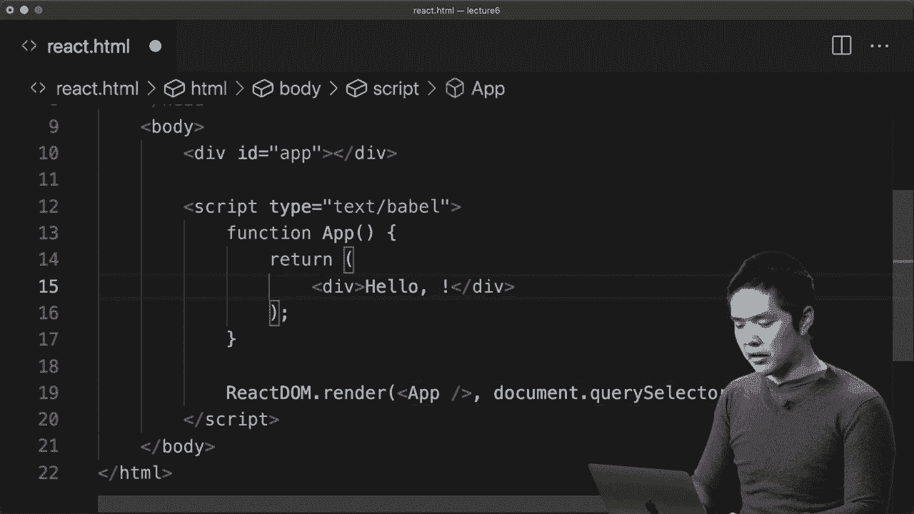

所以如果组件改为显示“你好，世界”，那么我刷新页面。

现在页面也显示“你好，世界”，因为这是JavaScript，我可以向函数中添加JavaScript代码，就像我可以对JavaScript中的任何函数做的那样，假设我有一些变量，比如我们创建一个变量`x`，它等于1，还有一个变量`y`，它等于2。在这个div中，而不是仅仅渲染一些文本，我可以使用花括号。

要插入某个JavaScript表达式的值，我可以插入`x + y`的值。例如，现在通过在这些花括号中包含`x + y`，JavaScript会计算出结果。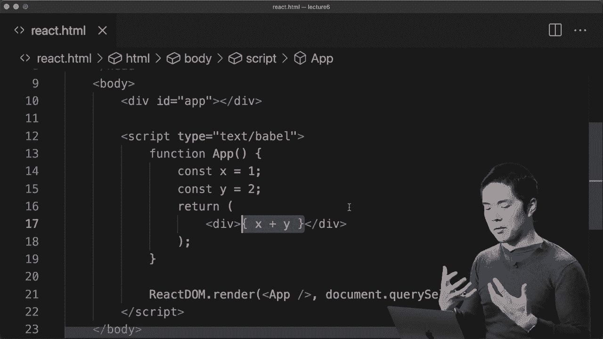

`x + y`并将其显示在div内部，所以现在。

当我刷新页面时，你会看到页面上只显示三个，例如。所以这就是React的基础，我们创建这些组件，然后利用JavaScript的力量渲染这些组件，但React开始变得更强大的地方在于我们可以重用组件，组件的整体概念就是这样。

表示用户界面的某个部分，我可以在界面的多个部分重用同一个组件。例如，假设在我的应用组件内部，我要渲染一个包含三个标题的div，每个标题都说“你好”，所以有一个标题，还有另一个，我们也会添加第三个标题。

所以我有一个包含三个标题的 div，在其中，我们可以看到每个标题的样子。它们都说“你好”，但这里有些重复，我不得不使用这个 h1 标签三次。全部都是为了在页面上创建完全相同的 UI 元素，这是一个我可以创建一个单独组件并重复使用该组件，而不是必须重复自己的情况。

多次，我该如何做到这一点呢？好吧，记住在 JavaScript 中我们可以写一个函数来表示一个 React 组件，所以我将在这里添加另一个函数，我称这个函数为 hello，因为它将表示这个 hello 组件，而这个 hello 函数也将返回某些东西，它将返回一个只是说 hello 的 h1 标题。

因此，现在在我的应用组件中，而不是渲染三个单独的 h1，我可以稍微简化一下，只说，hello，这里我说继续渲染一个 hello 组件，我们将渲染第二个和第三个组件。每次我渲染一个 hello 组件，它都会显示。

这个标题只是说“你好”，所以我刷新页面，什么都没有。

更改后我仍然看到三个标题，每个都说“你好”，因为在我的应用组件内部，我渲染这个 hello 组件三次，每次都会显示这个 h1。但是当组件变得更强大时，并不是总是每次，而是当我们可以用属性参数化这些组件时。

或者正如 React 简化它们的 props 简称，表示属性，那么这意味着什么呢？我们看到 HTML 元素可以接受属性，同样，React 组件也可以接受属性。也许我不仅仅想说“你好”，而是想对某人说“你好”，比如对哈利或罗恩或赫敏，所以我可以说 hello name 等于哈利。

使用类似 HTML 属性的语法，那么在这里说 hello name 等于罗恩。最后 hello name 等于赫敏，现在我的 hello 组件正在接受这个属性，这个名为 name 的属性对于这三个组件都是不同的。因此在这个 hello 函数内部，我希望 hello 函数能够利用这些属性。

利用这些属性的优势，所以我将给 hello 函数添加一个参数，这个参数通常称为 props。现在我不再只是说 hello，而是要说 hello，逗号，并且记得插入一个 JavaScript 值，我使用花括号，在这些花括号内部，我可以说 props。

点，然后无论属性的名称是什么，在这个案例中，属性的名称就是 name，所以我可以说 props.dot name，表示无论 name 属性是什么，请继续将其插入到 hello 组件内部。因此，hello 组件将会说 hello，逗号。

然后是某人的名字，这样我就可以保存，刷新页面，现在我看到“你好”。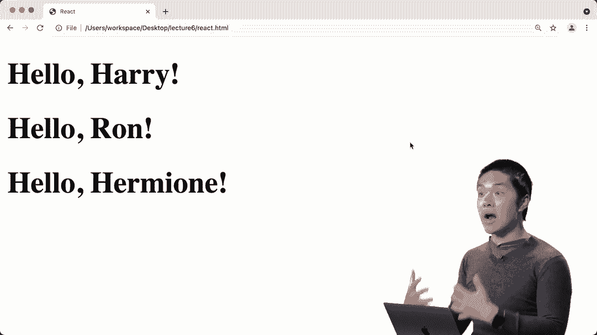

“哈利，您好，罗恩，您好，赫敏”，这三个不同的组件，每个组件仍然只是这个问候组件，但我们用不同的`props`进行渲染，一次是哈利的名字，一次是罗恩的名字，还有一次是赫敏的名字。因此，在这里组件可以通过传递不同的`props`开始变得有些不同。

我们可以决定这个组件最终将如何渲染。但让我们对此进行一些添加，开始在我们的`react`组件中添加状态。状态意味着我们想要存储在组件内部的任何数据。为了这个目的，让我们尝试重新创建我们首次介绍时创建的计数器应用程序。

JavaScript中，我们实际上只是在计数，从0到1，2，3，4等。因此，为了实现这个功能，让我们创建一个新文件，我将新文件命名为`counter.html`。我们可以通过将`react.html`的内容复制到我们的`counter.html`文件中开始，我们仍然会使用相同的`script`标签，并且我们仍然可以有一个`app`组件。

但是这个应用程序内部会有什么不同，我将把页面的标题改为“计数”，而不是“react”，那么应用组件内部应该放什么呢？如果我们要进行计数，我们需要一个`div`来显示，比如一开始是零。我们还需要一个按钮，这个按钮将只是“计数”，这将是它的标签。

按钮。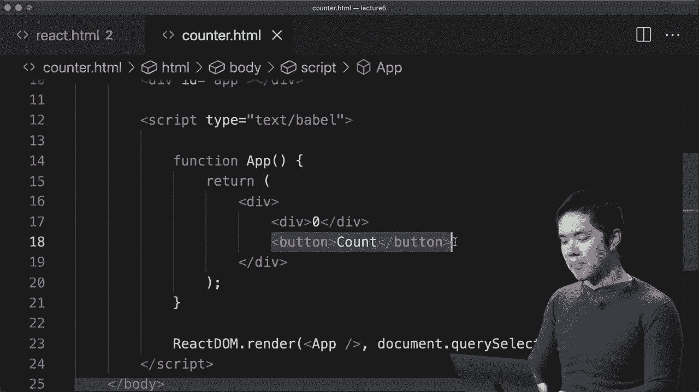

因此，一个仅显示零的`div`和一个显示“计数”的按钮，现在如果我打开`counter.html`，我会放大一点，你可以看到我这里有一个数字零和一个按钮，上面写着“计数”，当然，现在点击这个按钮没有任何反应，因为我还没有写任何JavaScript代码来说明应该发生什么。

当这个按钮被点击时，但在我们到达那一步之前，让我们稍微修改一下这个程序，现在我已经将数字零直接写入了`div`本身，但它不总是会是零，最终当我开始通过按计数按钮来计数时，这个数字将会改变。

我现在要做的是将这个零分解为我在我的`react`组件内部所称的状态。创建状态的一个方法是在`react`内部使用一个特殊的函数，称为`use state`。这是一个`react hook`的例子，它允许我为我的`react`组件添加一些额外的功能，而`react`的参数是。

这将是那个状态的初始值，我将开始计数，我希望从数字零开始，所以我将把数字零包含作为这个use state函数的参数，这样我们就可以从零开始计数。这个u state函数返回的实际上是一个包含两个元素的数组。

这将是一个我可以命名的变量，我会称之为count，还有一个函数，我将称之为setcount，这个函数将允许我在将来需要更改状态时设置状态的值。所以这个u-state函数接受零，作为其参数的初始状态。

然后我得到了两个返回值，我得到了状态变量本身，叫做count，还有一个用于在需要时更改该状态的函数。所以现在不再是通过在div中写数字零来渲染零，而是要在花括号中渲染这个值，零，但最终这个数字可能会改变。

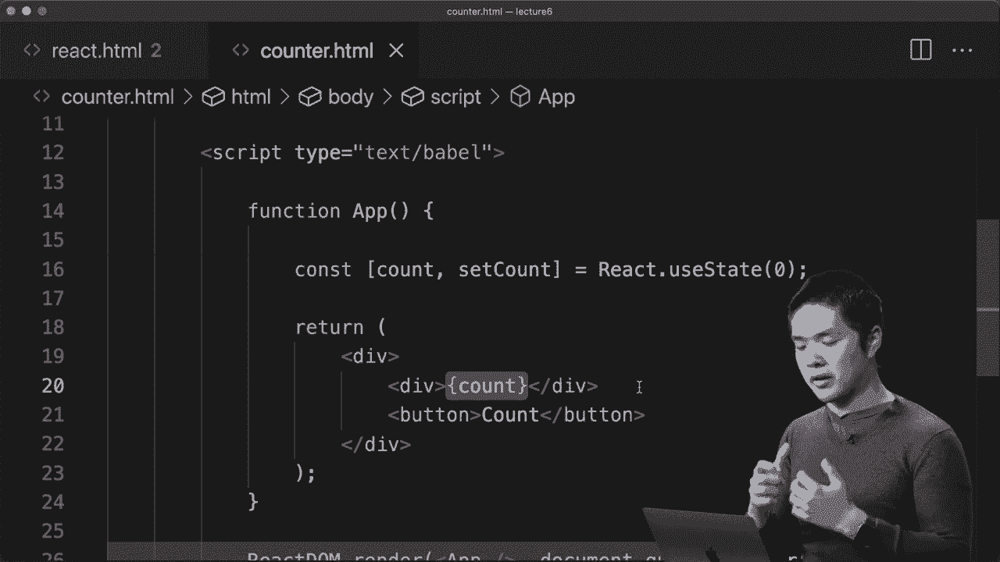

我希望我的UI能反映底层状态的变化，所以现在如果我刷新页面。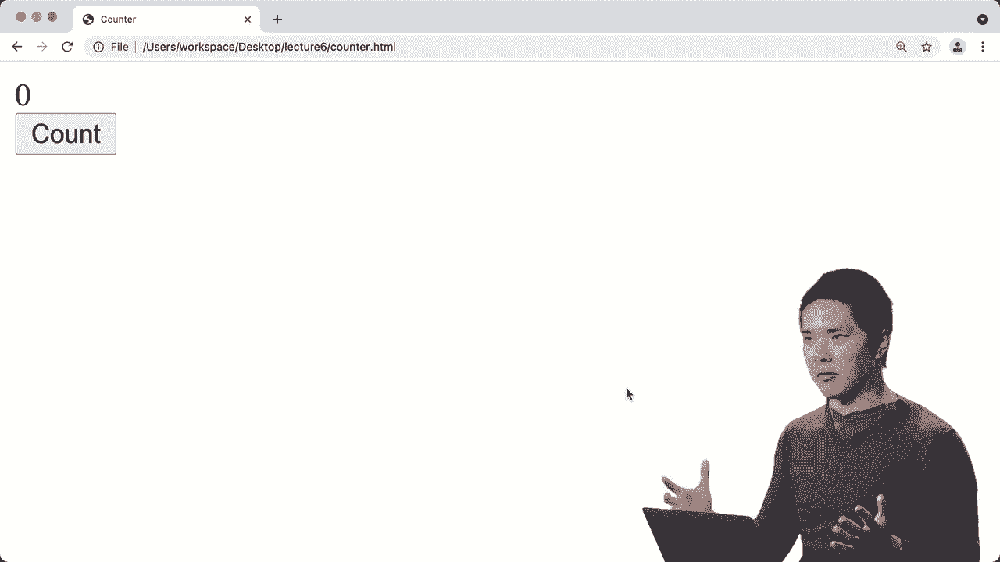

它仍然显示零，因为初始状态被设置为0，但如果我最初可以改变它。

如果这个初始状态是其他值，我可以刷新页面并看到。

不同的值出现在count上，而无论这个count变量在状态中是什么值，这将是用户在查看我的用户界面时看到的内容，当他们看到我的组件时。所以现在让我们让这个按钮实际上做点什么，因为现在数字从未变化。

为此，我可以添加一个点击处理程序，并注意到onclick和React之间的一个区别，以及我们在JavaScript中传统使用的onclick。我使用了这个大写的C，这只是一个常见的React约定。当我们定义事件处理程序时，在这里我要说on click，然后用花括号。

这是一个函数的名称，我希望在点击这个按钮时运行的函数，我可以随意命名这个函数，我会称它为update count，例如。现在我需要做的是定义一个名为update count的函数，我将在这个React组件中定义该函数，在我的app函数内部。

在JavaScript中，事实证明你可以有在其他函数内部定义的函数。所以我会定义这个函数，叫做update count，我希望这个update count函数做什么呢？我想做的就是让count增加1，你可能会想，我可以通过说count等于count加1来做到，但事实并非如此。

在React中，你不能直接做到这一点，每当我使用这个use state时，如果我想改变状态，我必须使用这个use state为我提供的函数来设置新状态的值，而不是count等于count加一，我必须使用这个set count函数，并且set count的参数是count。

这是一个将改变我组件内部底层状态的函数，参数是新的状态应该是什么，在这个例子中，它只是count加一，比count多一。

在此之前，我可以保存它，然后刷新页面。它从零开始，但每次我点击这个计数按钮时。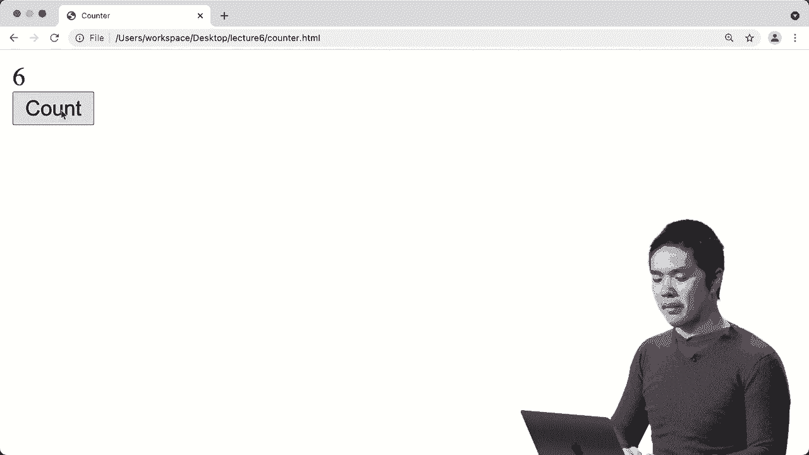

你会注意到计数增加了一次，而我没有任何代码在说，进入div并改变div内部的内容，我在这个div里面的，只有对这个状态变量count的引用，每当状态变化时，JavaScript，反过来，React知道，React需要做的。

是重新创建这个组件，重新渲染，显示这个状态变量的新值，当按钮被点击时，我们可以运行这个函数来改变，底层状态的值。因此，通过获取状态，我们可以开始在组件内表示信息，然后定义我们的组件将展示的内容。

通过根据底层状态来表示HTML，决定我们应该如何使用该状态以呈现用户最终将看到的界面，所以让我们现在尝试将这些部分组合在一起，创建一个使用React定义状态的Web应用程序。

并操作该状态，进而更新用户界面。基于正在发生的底层状态变化，我们将创建一个应用程序。它将向用户展示一些简单的数学问题，并对用户进行一些基本加法的测验，比如说，让我们创建这个应用程序。

创建一个新文件，命名为addition.html，在addition.html内部，我将开始。再次通过复制这个counter.html文件的内容，因为这个页面的框架结构将是类似的，但我会清除我的app组件里面的内容，至少现在是这样，所以，来渲染吧，让我们渲染一个div。

如果我想创建一个应用程序，向用户询问一些数学问题，然后提示用户输入答案，至少有两个部分的用户界面，我需要，我需要一个地方来展示加法的答案，比如说，一加二等于多少。

然后我需要一个输入框，让用户可以输入他们对那个问题的回答。接着查看他们的回答是对还是错，所以在这个div里我会开始创建一个显示问题本身的div。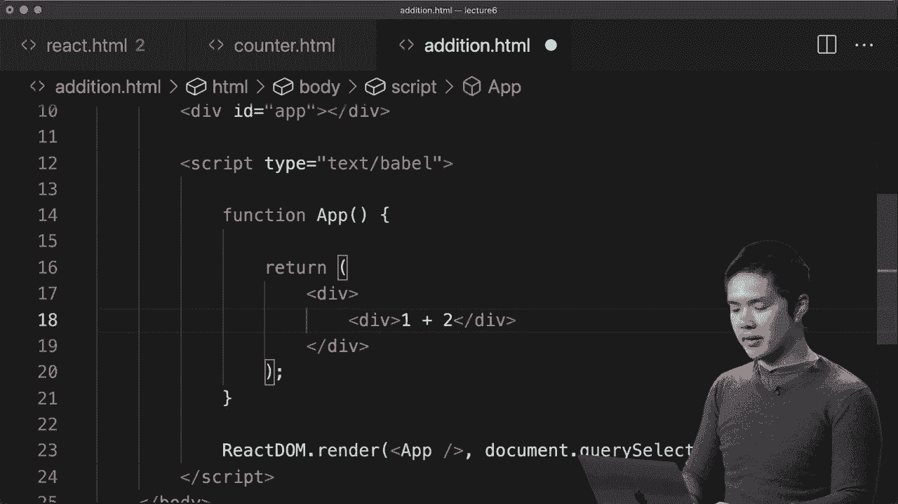

类似一加二，然后在下面，我会添加一个输入框。最终我们会在这个用户界面上添加更多内容，但现在我们真正需要的只是一个显示数学问题的div，以及一个供用户输入他们的响应的输入框。所以现在如果我继续去addition.html，这里是我看到的，我会把它稍微调整一下。

稍微大一点，我看到的是一加二，然后是一个输入框，用户可以开始输入他们的。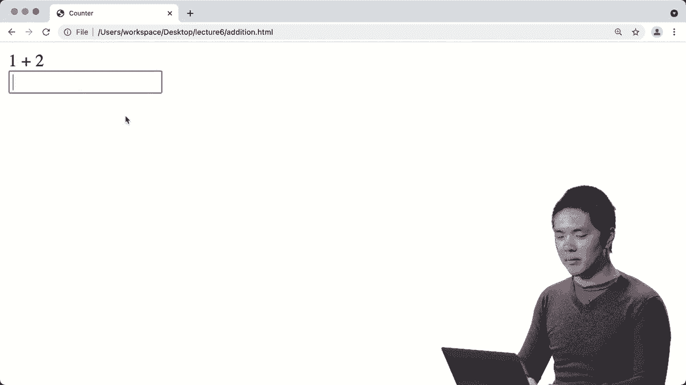

响应，但就像我们之前做的那样，我不想在返回的内容中逐字写出数字1和2，而是希望这1和2基于我的应用程序内部的一些基础状态。应用程序将维护有关要相加的两个数字的状态，然后根据该状态显示用户界面。

那么我可以在这里做什么呢？我可以再次使用react的useState。将这个数字设为一，可能命名为num1，然后是一个设置数字一的函数。接着我可以再做一次，创建num2并将其设为react的ustate2，这样我就有两个不同的状态num1和num2，每个都有不同的函数，set num1和set num2。

每个代表我想要相加的两个不同的数字。但这已经开始变得有些杂乱，随着时间的推移，我添加更多不同的状态，状态可能会变得越来越复杂，有更多不同的函数和变量，所以通常将多个状态合并是有帮助的，也是常见的做法。

在react中练习将多个状态组合成一个JavaScript对象，以维护这个特定组件的所有不同状态部分。为了做到这一点，我将再次使用react的ustate，但不是将状态最初设置为一个数字，例如一或二，而是将其设置为一个JavaScript对象。

这有键和值，我可以说让num1是数字一，让num2是数字二，就像Python中的字典一样。例如，在同一个对象中，我有多个不同的值num1和num2，我可以调用这个状态，拥有一个变量，并有一个名为setstate的函数。

这个将更新那个状态的值，因此我可以将所有这些不同的变量简化为状态和一个设置状态的函数，而现在状态有这两个不同的部分：数字一和数字二，所以现在不需要逐字渲染数字一。

使用花括号，我可以说`state.num1`，而不是直接渲染数字2，我可以说`state.num2`，利用状态来决定它将在用户界面中显示什么。 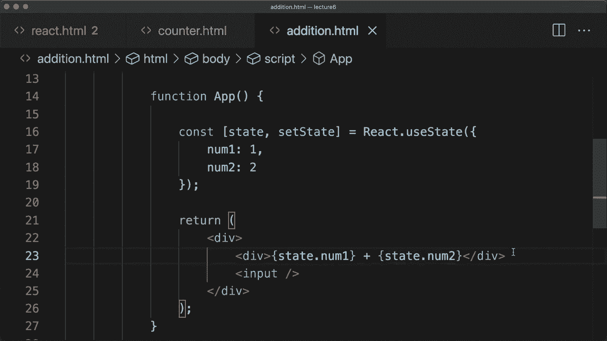

决定它在用户界面中将出现什么，因此现在页面看起来没有什么不同。 

但是如果我更改状态的初始值，可能将其设置为2和4，然后刷新页面，那么现在它将显示为2加4。因此这很有帮助，我们现在有一个用户界面，数字基于状态。但现在我想做的是添加跟踪用户输入内容的能力。

所以我们可以判断用户是否正确输入了这个数学问题的答案，以及如何做到这一点。好吧，状态代表这个组件内部的任何内容，除了在状态中存储两个数字，我可能还需要跟踪第三个信息，即用户输入的响应是什么。

我会在状态中添加第三部分，称为响应，最初将只是一个空字符串，也就是没有任何内容。然后，我要给这个输入框一个值，这个值将是状态中的`response`，无论用户作为响应输入了什么，都会存储在状态中。

这将是输入框中显示的值，因此无论输入框中有什么内容，都会有。 

通过这个`state.response`变量访问它，但存在一个问题。这个问题是，我尝试刷新页面，进入这个文本框，假设我知道答案，我知道2加4等于6。现在我将按下键盘上的6，但当我按下6时，什么也没有发生，6没有出现。

即使我在键盘上按下按键，文本框内部也没有任何变化，那为什么呢？ 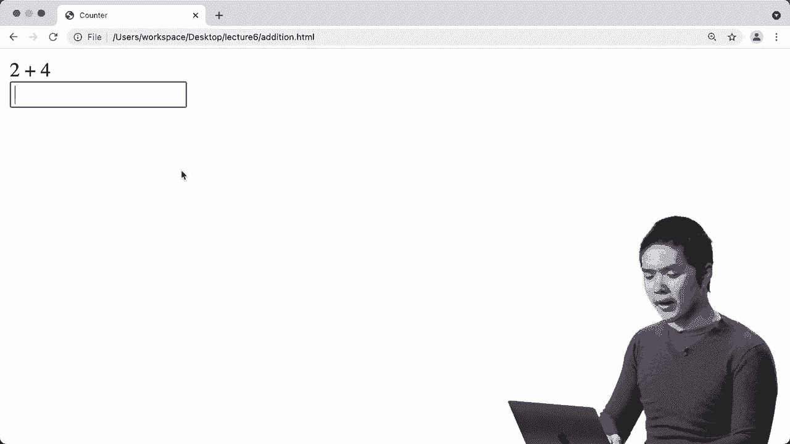

文本框没有更新，原因在于输入框中的值，无论输入框中出现什么，都是这个值`state.response`，而这个字符串从未改变`state.response`的值。因此我需要稍微更改一下，我需要将一个属性添加到这个输入框上，表示在输入框发生变化时。

我需要进行一些更改，我将调用一个可以调用的函数，称为`update response`。但我可以根据需要调用这个更新函数，只要它在输入框中的内容发生更改时运行。让我现在定义这个更新响应函数，我将定义一个名为`update response`的函数，因为这是。

事件处理程序可以接受一个参数，即事件本身，实际上是输入字段中的某些内容发生了变化。当我访问这个事件时，结果表明，如果我想找出用户在输入字段中输入的内容，我可以通过事件。目标。值来获取这个值，而我只有通过查看它才能知道。

在文档中，我希望事件。目标。值成为这个响应的新值，因此我想做的是像这样设置状态，新的状态值应该是什么呢？我希望响应不再是空字符串，而是事件。事件。目标。值。

这将成为响应的新值，但我还没有完全完成，因为状态不仅包含响应作为状态的一部分，状态还包含num1和num2，而这两个部分并没有真正改变，因此我可以说好吧，num1将保持为原来的状态。num1，这没有改变，num2将是，用户输入的内容。

num2没有改变，唯一改变的是响应。但这开始变得有些冗长，尤其是如果我开始添加状态，就会变得难以管理，因为我必须不断重复自己。为了所有的状态部分，只需指定将要改变的状态部分。

忽略其他所有内容，因此在JavaScript中有一种简便的方法称为扩展运算符，看起来像这样：省略号，然后是状态，这表示仅使用状态的现有值作为其他内容，如num1和num2，唯一要覆盖的是新的值。

这是我更新状态的一种方式，所有内容应该保持不变，除了响应，现在将是事件。目标。值，换句话说。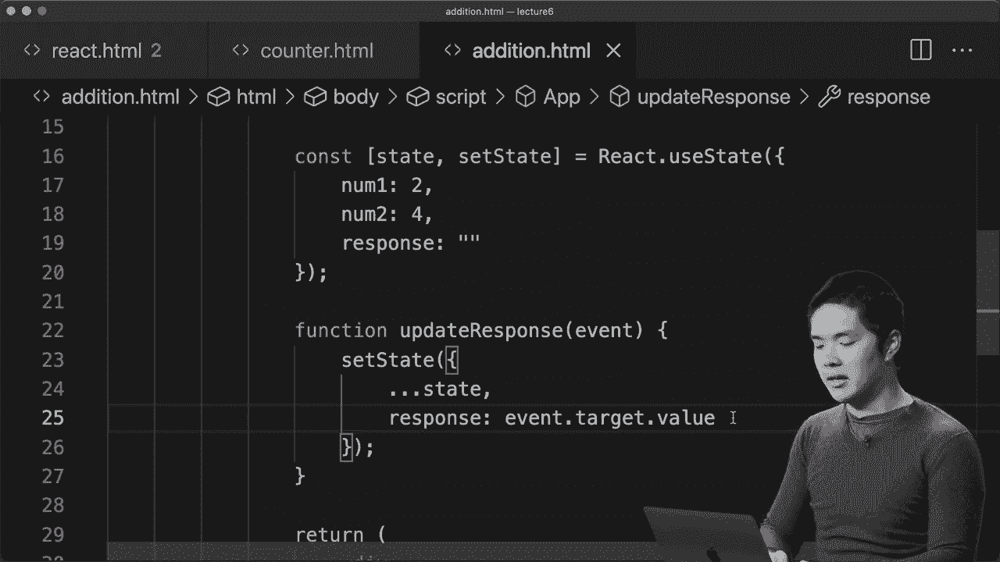

用户在那个输入字段中输入的任何内容，因此我将继续刷新页面。现在如果我输入一个数字，例如六，你实际上会看到这个数字出现在输入字段中，因此这很好，我们现在展示了一个问题状态，用户可以在其中输入响应，而该响应也存储在状态中。

用户按下键盘上的回车键时，我们检查他们的答案是否正确。或者他们的答案是否错误，我该怎么做呢？第一件我需要做的事情是，在这个输入字段中以某种方式检测，当按下一个键时，如果按下的是回车键，那么我们就可以进行检查。

实际的两个数字之和是多少，并查看用户是否回答正确，所以让我们添加一个事件处理程序，键按下时将等于某个值。我可以随意命名这个函数，我称之为 input keypress，但我可以给它任何名字，现在让我们定义这个 input keypress 函数。

定义一个名为 input keypress 的函数，它在任何键被按下时触发，无论是字母、数字还是回车键，因此我想检查确保按下的键实际上是回车键，只有在这种情况下我才想检查他们是否答对了。

所以我在这里添加一个条件，这只是 JavaScript，所以我可以说如果事件的键等于回车，那么我们就继续检查，否则我们不需要做任何事情，这里不需要 else，因为除非实际按下的是回车键，否则什么都不应该发生。

用户是否答对了，内部状态中 num1 是第一个数字，num2 是第二个数字，因此我可以有一个条件检查，如果 state.num1 加上 state.num2 等于 state.response，也就是用户在输入框中输入的内容，但这并不完全奏效，因为 state.response 是一个字符串，用户不一定需要。

用户输入数字时，可能会输入一些字母或其他字符，因此我首先要做的是将响应转换为整数，如果我们能够做到这一点，我会定义一个变量叫做 answer，使用 JavaScript 函数 parseInt，该函数接受一个字符串并尝试将其转换为整数。

我们将解析 end.state.response，现在我们可以检查 number one 加上 number two 是否等于答案，如果是，这意味着用户回答正确，如果和不等于答案，则意味着用户回答错误，现在我可以处理这两种不同的情况。

在某种情况下，用户回答正确，我们应该做一些事情，而在错误时，我们应该做其他事情，我们通过查看应用程序的状态以及我们应该添加的两个数字来做出这个决定，看看用户输入的响应，所以当用户回答时我们应该怎么做。

如何检查问题是否正确，或者用户是否答错了，可能这个游戏会通过维护一个数字来记录用户回答正确的题目数量，每次用户回答正确时，我们可以将分数增加一，而每当用户答错时，我们可以减少分数。

例如，增加一，那么我们怎么做呢？分数是应用程序中的一部分状态，所以我们现在需要将其添加到状态中。目前在状态中，我们存储一个数字一、一个数字二和一个响应，我将添加一个分数，分数将从零开始。

我们可以在页面上渲染这个分数，如果我向下滚动到我们返回的 div，来渲染，让我们添加另一个 div，上面写着分数是，然后使用花括号插入。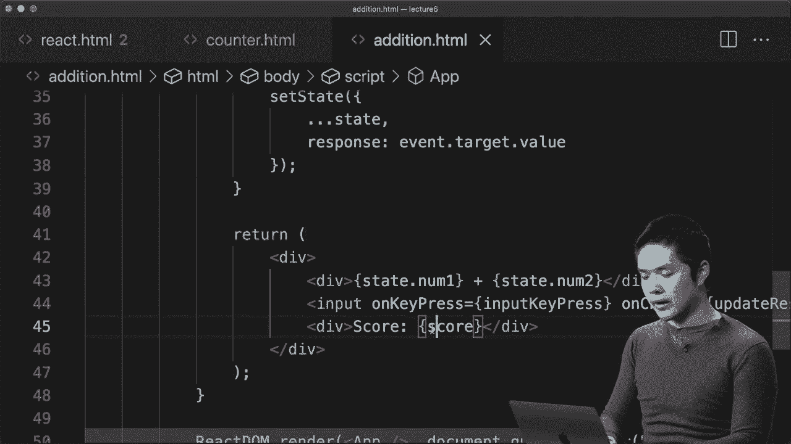

无论状态。分数的值是什么，分数是什么，让我们从状态中找出这个，并在用户界面中显示出来，所以现在这个用户界面显示的不仅是一个问题和一个输入框，还有一个分数。

分数开始时，所以现在回到这个函数，当按下一个键时，如果是回车键，我们就检查他们的答案对错，我们检查用户是否真的答对了问题，如果答对了，我们应该做什么呢？我们应该增加分数。那我们怎么做呢？我们通过调用设置状态函数来做到这一点。

所有状态都将保持不变，所以使用点点状态扩展运算符。唯一不同的是分数将是状态。分数加一，因此我们更新状态以将分数增加一。如果用户答错了，我们将状态设置为点点状态，然后分数将是状态。

点数减去一，所以如果用户答对了问题。

我们分数增加一，否则我们减少分数一。让我们测试一下，看看当我们在用户界面中尝试这个时实际效果如何。我将刷新页面，两个加四，如果我输入正确答案六，按回车，分数增加一；如果我输入错误答案，比如说八，按回车。

分数减去一，因此这似乎取决于我是否答对了问题。分数能够根据结果更新，增加或减少。现在这个游戏很容易获得高分，因为我可以不停地按回车，问题从未改变，我的回答是。

已经存在，因此分数会不断上升。那么我们来让游戏更有趣一点，每当用户答对问题时，我们就显示一个新问题让他们回答，我们该怎么做呢？显示的问题是。

用户基于两个底层组件的状态，它基于状态。num1 和状态。num2，所以如果我想更改问题，我所要做的就是在用户答对问题时更新状态。除了更新分数外，我们还要更新 num1 和 num2，我可以将它们设置为。

具体的值可能像5和10，但让我们更有趣，每次显示一个随机数，我们将生成一个随机数，所以用户每次会把两个随机数相加，他们每次都会得到一个新问题。对吗？我们如何生成随机数呢？well math。random是一个生成0到1之间随机数的javascript函数。

我们可以将其乘以10，现在我们得到的是一个介于0到10之间的数字。但我们不想让数字中出现小数，所以我会取这个数字的上限，math。seal，如果数字是5.8，我们就将其四舍五入到6，举个例子，我们对第二个数字做同样的事情。

我们将取math。random乘以10的上限。所以每次用户正确回答一个问题时，我们将更新num1和num2为新的。

随机数就这样生成，所以让我们回去再试一次，我们看到2加4。我输入正确答案6，问题变化为8加5，我输入正确答案并按回车，分数增加，问题再次变化。这次如果我答错，我输入10作为例子。

看着我的分数下降，从二变成了一，问题没有改变，现在我又有了。一次回答问题的机会，当我正确回答时，分数。再次增加，从一到二，所以这个游戏开始了，我的，分数显示着不同的问题，现在至少有一个用户界面的小问题。

目前的情况是，当我正确回答一个问题并按回车时，我输入6并按回车，6仍然保留在那里。理想情况下，我想得到一个新问题，我希望清空响应，以便用户可以直接输入新的答案，而不是必须删除之前输入的内容再输入新内容。

那么，如何重置输入框中的内容呢？输入框中输入的内容存储在我组件的状态中，存储在，state.dot response中。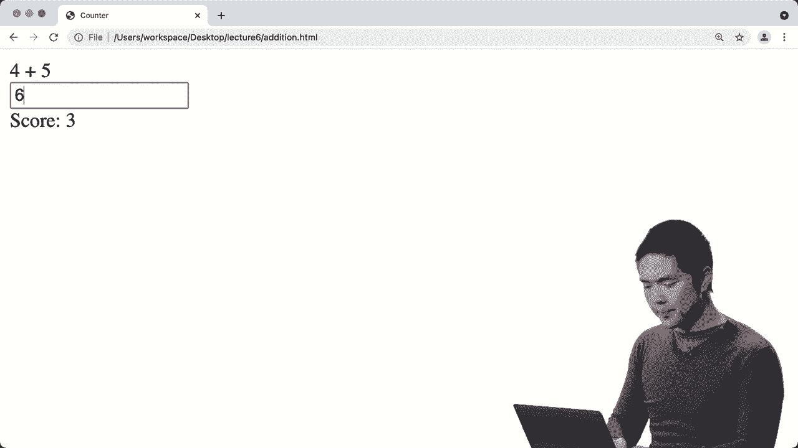

所以如果我想改变这一切，我需要做的就是，当用户正确回答问题时，将响应清空为一个空字符串，我们将更新这两个数字，增加分数，同时也清空响应，使其仅为一个空字符串。如果用户回答错误，我也可以做同样的事情，分数减少一。

但也将那个响应清空为一个空字符串，这样就没有任何内容。现在我们得到一个问题，我输入答案，按回车，输入框清空，我得到一个新问题，分数增加了一，四个独立的状态同时改变，这反映在用户界面中。

现在我能够看到，所以我输入另一个值，分数增加了，一切都更新了。再次确认，这绝对是进步。我注意到的另一个用户界面小问题是，输入框默认并没有自动选中，我必须手动点击。

在输入框上，为了突出显示它，以便我可以开始输入我的响应，使用自动聚焦属性并将其设置为true，以便输入框自动。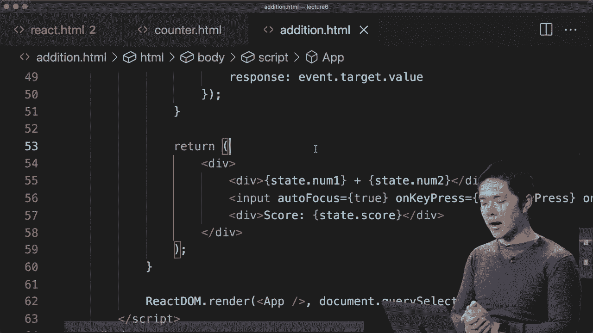

当我第一次加载页面时，它会聚焦，所以现在我刷新了页面。

输入框已经被高亮显示，我立即可以开始尝试玩这个游戏。所以现在我们有了这个应用程序的基本功能，让我们尝试改进CSS，使游戏看起来更好一点。我会滚动到页面顶部，并在我的HTML页面的头部添加一个样式标签，我希望这个整个应用程序。

使其居中，所以我会说文本对齐将是居中，成为。

因为我喜欢这种字体，所以在这个特定游戏中，我刷新了页面，现在一切都居中，字体与默认字体不同。还有什么我希望改变的呢？这个问题“二加四”，也许我希望它能更大，我希望这个问题能够更突出。

而且下面的分数可以保持原样。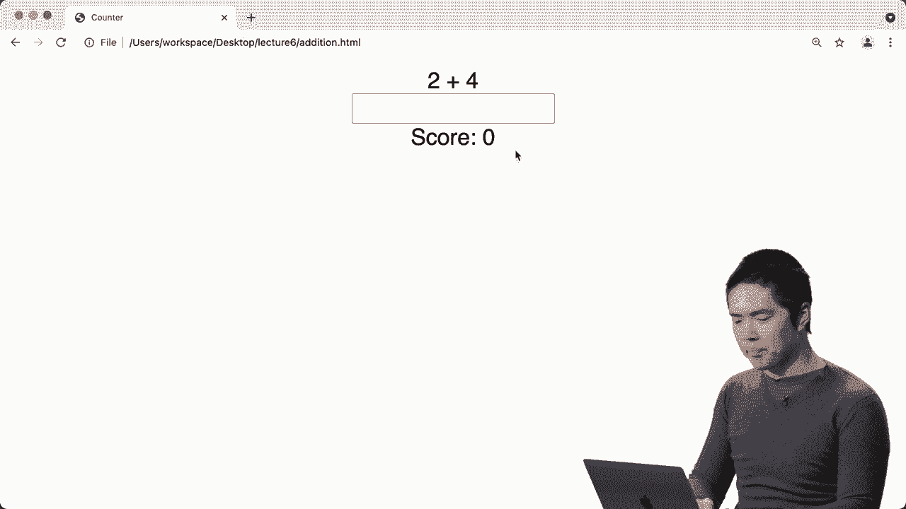

保持目前的大小，那我该怎么做呢？如果我回到这里的HTML。我将为显示问题的div设置一个ID，问题是数字一加数字二。然后如果我向上滚动，我会说，对于ID为问题的元素，让我们。

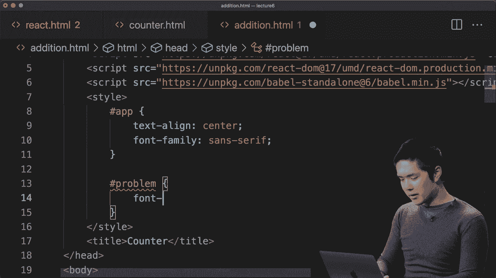

我继续设置字体大小更大，所以现在我看到一个大的数学方程式“2加4”，例如，输入框和下面较小的分数。所以这是一个不错的用户界面增强，稍微好一点，现在我可以玩这个游戏，答对一个问题，分数增加，答错一个问题，我可以再试一次。

但也许我希望提供更多的视觉指示，当用户答错问题时，也许每当用户答错问题，我希望将这个文本的颜色从黑色改为红色，当用户答错问题时，我该如何做到这一点。

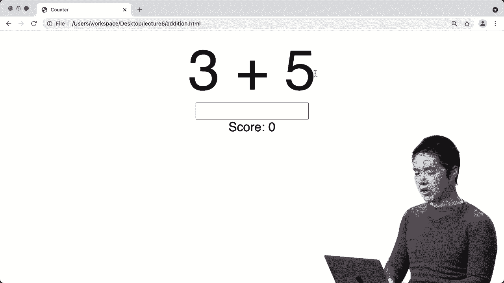

好吧，我们可以通过使用CSS来更改某些事物的颜色，比如说如果我们有一个名为“incorrect”的类。例如，如果我在这里向下滚动，并给这个div一个类名，这就是在React中添加类的方式为“incorrect”，那么我可以使用这个类名来将它的样式设置为红色或不是红色，所以我可以说，任何带有“incorrect”类的东西。

我们继续给它。

一种红色，因此现在因为我将这个问题归为错误的类别。我说将所有错误文本变为红色，我们现在看到这个文本出现为红色，但这并不是我想要的，我并不希望它一直是红色。我只希望在用户刚刚答错问题时变为红色。

他们刚刚在回答一个数学问题时是错误的，那么我该如何表示那条信息呢？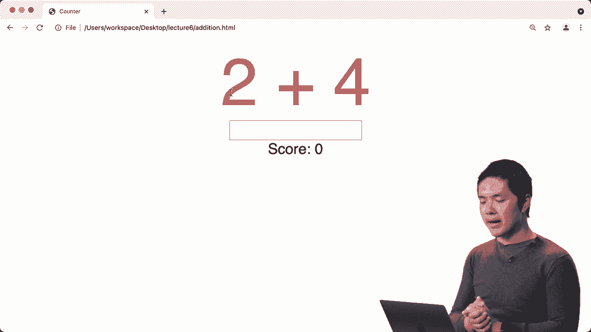

在我的应用程序内部，我需要一些额外的状态。状态再次是我需要在组件内部跟踪的任何信息，现在看来，除了响应、分数和数字外，我还想跟踪用户是否刚刚错误回答了一个问题，所以我会在状态中添加另一部分。

我将其命名为`incorrect`，起初它是`false`，他们并没有刚刚答错什么。现在，如果我向下滚动到这个类名，而不是让它一直是错误的，让我在花括号中添加一个表达式，我会说如果`state.incorrect`为`true`。使用三元运算符和问号，那么类应该是`incorrect`，但是。

否则，它不应该有`incorrect`类，它将只是一个空字符串。因此这个表达式允许我根据底层状态更改HTML元素的类。如果`state.incorrect`为`true`，那么这个`div`将有一个`incorrect`类，否则。

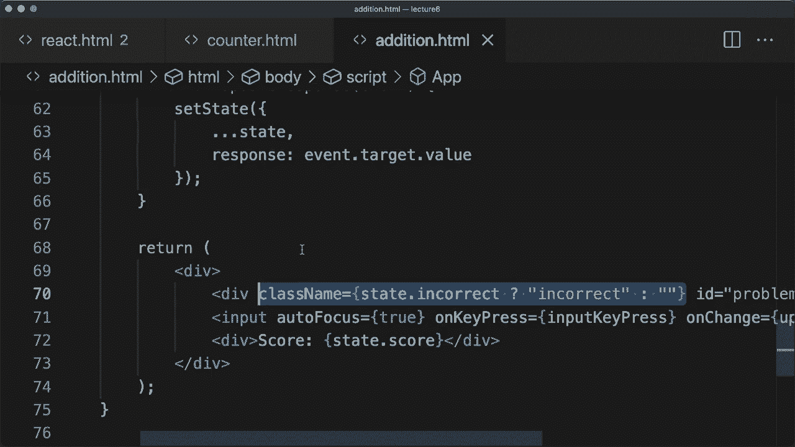

它不会，因此现在当我第一次加载页面时，文本呈现为黑色，我需要做的是当用户答错一个问题时，我。

需要更改状态以表明他们刚刚答错了一个问题，我该怎么做呢？这里是当用户答错问题时的设置状态调用，在这种情况下，我将`incorrect`设为`true`，当用户答对一个问题时，我们将`incorrect`设为`false`，我们正在根据。

无论用户是答对还是答错问题，现在，如果我加载页面，正确回答一个问题，分数增加，我得到了一个新问题，但如果我错误回答一个问题并按返回键，你会注意到分数减少，输入字段清空，文本颜色改变，因为我更改了那个错误部分的值。

基于底层状态，我们能够看到文本颜色的变化。如果我现在答对一个问题，按返回键，文本颜色又变回黑色，分数增加，现在让我们为这个应用程序添加最后一个状态或最终的界面更改，让我有办法赢得这个游戏，也许一旦我的分数达到10。

通过正确回答10个问题，我们就会赢得比赛。我该如何做到呢？记住，每个React组件都可以只是一个JavaScript函数，这个函数立即返回这个div。但这是一个函数，所以我可以在其中添加额外的逻辑，我可以说，如果状态得分。

如果等于10，例如，那么与其渲染旧的div，不如返回一个新的div。类似于u1，所以我可以为它设置样式，我会给它一个id，id将是winner。如果id是winner，我们就继续把字体大小设为72像素。如果我赢了，就让颜色变成绿色，所以我添加了一些CSS来设置样式。

但实际上唯一的新逻辑是在下面进一步的地方，我在这里说检查状态。如果得分是10，那就意味着我们获胜，所以不返回新问题。

只需返回一个显示你赢得了比赛的div，每次我回答一个问题时，你会注意到得分会增加1，而每次我们生成新的随机数以显示在用户界面上。一旦我回答到第10个问题，如果我答对了，按下返回键，整个用户界面就会改变。

而不是问题和输入。

在字段和得分方面，我只看到绿色的大字显示我赢了，而我能够做到这一点是通过查看这个条件，我们在关注状态的值。如果状态是10，我们正在决定什么是视网膜，而这又是React的一个伟大功能，能够使用这个基础状态，并根据基础状态的值来进行判断。

状态决定用户应该看到的内容。

在他们的用户界面中，React只是众多执行这种类型操作的库之一，其他流行的库包括Angular和Vue，所有这些都是使创建能够响应一些基础状态的应用程序变得简单的Web框架，这样你作为程序员就不必担心不断。

必须操作页面的不同部分，尤其是当你想象像Facebook或Twitter这样的网站时，页面上同时发生很多事情。每当有新推文进来时，你可能会收到通知，并在你的新闻源主区域看到新帖子。

这些都是你可能希望应用程序更轻松处理的类型的事情，你描述状态是什么，描述页面应该基于那个基础状态看起来像什么，让库（无论是React还是其他库）开始为你处理这个过程，在用户界面的世界里。

正在快速变化的是用户界面的很多变化，涉及到的技术和工具相当流行，但它们实际上是基于同一组基本思想。这个思想是我们可以使用`javascript`来操控用户在页面上看到的内容，以便检测基于特定事件的发生。

比如滚动到页面底部或在输入框中输入内容，然后通过提供某种函数来响应这些特定事件，该函数会在特定事件发生时被调用，并与其他功能混合，例如异步请求外部服务器的信息。

或者基于状态值进行计算，就像我们在`react`中看到的那样。我们有能力非常快速地创建非常有趣和引人入胜的动态用户界面，这全靠将`python`和`javascript`结合的力量，这就是用`python`进行网页编程。
