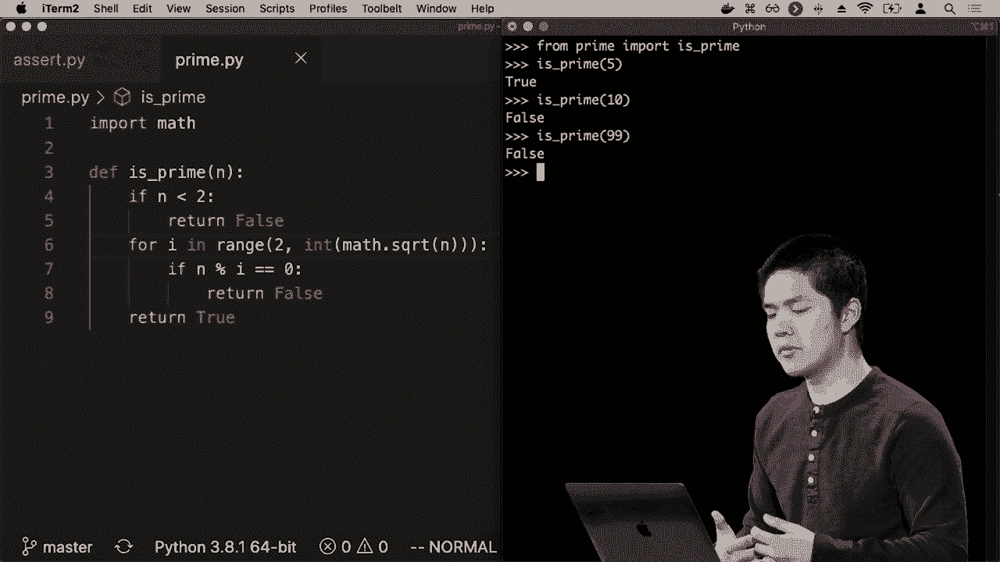

# 哈佛 CS50-WEB ｜ 基于Python ／ JavaScript的Web编程(2020·完整版) - P21：L7- 测试与前端CI／CD 1 (测试与断言，单测) - ShowMeAI - BV1gL411x7NY

[音乐]。

好的，欢迎大家回来参加Python和JavaScript的网页编程，现在我们已经看到了一些不同的技术和工具，可以用来设计网页应用程序，HTML和CSS用于描述我们的页面外观，像Python这样的编程语言则用于实际编程。

像Django这样的框架可以监听请求，处理它们并提供某种响应，最近我们还查看了JavaScript，另一种可以特别用于客户端的编程语言，在用户的网页浏览器中运行，以使我们的网页更加生动。

交互性和用户友好性，现在我们将过渡到今天讨论软件最佳实践，一些开发人员在处理网页应用程序时实际使用的工具和技术，尤其是当这些网页应用程序开始变得越来越复杂时，我们将从中开始。

讨论测试，这种验证我们代码是否正确的想法，然后过渡到ICD，即持续集成和持续交付，以及一些其他最佳实践，确保软件开发人员的工作可以方便地进行测试和部署。

非常迅速，因此我们将以测试开始讨论，测试实际上是关于验证和确保软件开发人员编写的代码确实是正确的，以确保函数按预期工作，网页按预期表现。

理想情况下，我们希望有一种高效有效地测试代码的方法，随着程序变得越来越复杂，确保我们的程序按我们想要的方式运行，因此我们会从简单开始，考虑我们正在进行的基本方法。

我们可能会以一个用Python编写的函数为例进行测试和验证，以确保其按预期工作。为此，我们可以从一个在Python中称为assert的命令开始，assert的作用是断言或声明某事应为真，如果某事不是。

如果不正确，那么断言将抛出某种错误异常，以便运行程序或命令的人知道发生了什么问题。这是利用Python能力来测试函数并验证该函数行为的一种非常基本的方法。

我希望这样做，所以让我们先尝试一个简单的例子，编写一个Python函数，然后进行测试，以确保这个函数按我们希望的方式工作。我们将创建一个新文件，我将其命名为search PI，并让我定义一个新的Python函数，例如，它将接受一个整数。

平方函数，我只想接受一个数字并返回它的平方，所以我将定义一个叫做平方的函数，输入一个数字像X，我想返回x乘以X，这是一个相当简单的函数，但我想验证这个函数是否按我预期的方式工作。

有很多方法可以做到这一点，一种方式就是。

让我们打印出10的平方，例如，看看结果是什么。

等于，那么你可以运行一个程序，类似于Python assert PI，然后直接说，好的，答案是100，我可以对自己说，好吧，这就是我所期待的，但我现在必须进行心理计算，确保10的平方的答案是我预期的值。

如果我能自动化这个过程就太好了，我可以做的事情之一就是打印出10的平方是否等于100。我知道我想要10的平方。

等于100，所以我可以直接打印出这个值，打印出10的平方是否等于100。我将继续运行程序，这次我得到的结果是正确的，例如，因为这两个。

事物彼此相等，如果我另一方面尝试检查。

如果说10的平方等于101那是不正确的，你运行程序，好的，现在它将会是。

这并不是什么新鲜事，也不是我们没见过的，但现在我可以做的是，替代这个，我可以直接说，让我断言10的平方等于100。这里我只是断言这一点。

10的平方等于100的表达式将是正确的，现在我可以运行程序，你会注意到没有任何反应，没有输出，完全没有，因为当某个语句运行时，它检查的表达式如果是正确的，10的平方确实等于100。

它有效地忽略了这个语句，完全继续到下一个内容，没有输出，没有任何副作用，这很有帮助，因为这意味着如果我想要断言某件事情是正确的，我可以断言它，然后继续写我的代码，就好像我没有写过那一行。

只要我断言的事情实际上是，真的。但如果我的代码中有一个错误，例如某种错误，假设我意外地说返回X加X，来计算平方，这就是一个错误。

当我尝试运行Python时，assert PI，我得到的是一个。

异常，而我得到的异常类型是一个叫做断言错误的东西，我在这里看到，有一个断言错误，然后我看到，断言错误发生的原因，发生在第4行，就是我说的，我想断言平方。

10等于100，所以我们可以想象测试我们的代码，就是包括许多不同的断言语句，如果我想验证我的代码是正确的，我可以写，几种不同的断言语句，对于像这个平方函数这样相当简单的函数，可能并不太复杂。

我需要写很多测试，但你可以想象，对于更复杂的函数，具有多个不同的条件分支，能够断言无论程序选择哪个条件分支，代码实际上都是正确的，这将是非常有价值的。

比如说，这在处理较大项目时可能会很有帮助，你想解决项目中可能出现的错误。这涉及到测试驱动开发的理念，在开发时保持测试的概念，其中一项最佳实践是，如果出现问题。

你正在做自己的程序，遇到了一些错误。在程序中，你首先想修复这个错误，之后你会想写一个测试，来验证新行为是否按预期工作，一旦你写完这些测试，这些测试可以，随着时间的推移而增长。

当你继续进行项目时，你可以，始终运行这些现有的测试集，确保你所做的任何新更改，不会破坏之前的任何内容，特别是在你添加的新特性或可能做的更改中，这一点尤其宝贵。

随着程序变得越来越复杂，手动测试一切将变得非常繁琐，因此能够自动化这个过程，运行一大堆我希望程序执行的测试，并确保，这很有帮助，因此断言是一种基本的方法。

说我想这样做，确实，可以继续抛出一个异常。而使用Python，我们知道我们也必须，捕获这些异常以确保我们能够，适当地处理它们，这样我们就可以显示，漂亮的错误信息，例如如果我们，想这样做，但现在让我们继续。

尝试写一个更复杂的函数，比仅仅对一个数字进行平方更复杂，这里有更多不同的情况我可能想要测试，还有更多的空间让我作为程序员可能出错。例如，让我们设想编写一个新的。

文件但我打算称之为**prime PI**，在这里我会说我希望**prime.dot.pi**实现一个名为**is prime**的函数。这个**is prime**函数应该做的是检查一个数字是否为素数，素数只有1和它本身的因子，我想写一个函数。

验证这一事实。那么我该如何着手呢？如果n小于2，那么它肯定不是素数，因为我们认为0和1不是素数，我们只处理0或更大的数字。现在先处理这些，但让我们从其他数字开始，能被100整除的数字。

2或更大的数字。那么我想做什么呢？我真的想检查每一个可能的因子，比如如果我想检查100是否为素数，我想循环遍历所有可能的因子，如2、3、4、5、6，当我到达一个像2或5的数字时。

那么我就知道这个数字不是素数，因此我可以说对于范围从2到n的每个i，举个例子，让我说如果n模i等于0，那么返回false。那么我在这里说的是什么？我在说继续向上遍历，但不包括n。

例如，如果我在检查10是否为素数，我将检查2、3、4、5、6、7、8、9，对于这些数字中的每一个，检查n（我传入这个函数的输入）模i，想要检查的因子是否等于0。这个模运算符（%）如果你不记得了，给我们的是当你将一个数字除以另一个数字时的余数。

所以如果n模i等于0，那意味着当你将n除以i时余数为零，意味着i整除n，没有余数。这意味着它不是素数，因为它确实有一个因子，无论i是什么因子。如果我到达这个for循环的末尾，那么我可以继续。

并且仅仅在找不到除了1和这个数字本身的因子时返回true。那么我们可以说这个数字将是素数，因此这个例如可以是一个检查数字是否为素数的函数，但如果我试图优化，我正试图。

为了使我的函数更高效，我可能意识到你真的不需要检查从2到数字n本身的每一个数字，我实际上可以只检查到该数字的平方根。例如，对于25，我想检查2、3、4、5，因为5的平方就是25。

但是在5之后，我不需要检查任何更大的数字，超过某个数字后，这个数字的**平方根**乘以自身，永远不会有一个比这个更大的数字可能是一个因子，而我不会已经知道它，所以我只是想。

从数学角度稍微考虑一下，我们可能能够进行一些优化，而不是从2一直到n，我可以只到N的**平方根**，如果**平方根**恰好不是一个整数，我想这样是有效的，我至少让自己相信了这一点。

思考这是一种可能检查数字是否为**质数**的函数，那么如果我想要做什么呢？

验证这一点，我可以写一些**assert**语句，另一件我可以做的事情是直接使用**Python**解释器，我可以说，好的，让我输入**Python**，我在**Python**解释器中，可以说从**prime**导入**is prime**，**prime**是那个文件的名称，**is prime**是我想测试的文件中的函数。

那我们就试试吧。像是**is prime 5**，这是一个质数，希望它会说它是**true**，好的，它确实这样说了，我们试试**is prime 10**，看看这是否有效，好的，**is prime 10**是**false**因为10不是质数，这很好，这似乎也在正常工作，让我们试试。

**prime 99**，这不是质数，因为例如3是它的一个倍数，好的，**false**，这很好，这似乎在正常工作，我可以在解释器中测试这个函数，以确保它有效。

这是我希望它工作的方式，但现在让我们看看其他一些我可能用来测试它的方法，嗯，有一种方法是我可以写一个文件，比如**tests zero pi**，而**zero dot pi**将做的事情是，不再使用**assert**，而是像我们之前那样做布尔检查，我将导入。

**is prime**函数，我定义了一个新的函数叫**test prime**，这个函数将用于测试，以确保当你**平方**某个数字或检查某个数字n是否为质数时，你得到的期望值是**true**或**false**。

如果它不是质数，那么这个函数在做什么呢？这个函数正在检查我们调用**is prime**函数在这个数字n上，并查看它是否等于我们期望的值，期望的值要么是**true**，要么是**false**，如果我们在N上运行**is prime**，而它不是。

是否等于我们期望的值，那么我们打印出来，好的，这里有一个错误，我们期望的某个值是**true**或**false**但它。

结果并不是这样，所以现在我有了这个测试素数函数，我可以说，好的，让我回到Python解释器，从test0导入testPrime，现在我可以说，好的，让我测试素数，确保5是素数，所以我传入我的第一个输入，数字n。

我想检查，我想检查5是否是素数，而我提供的第二个输入是我期望的结果，要么是真，要么是假，这里什么也没有发生，这是件好事，如果有错误，它会打印出一些东西，而我看到什么都没有打印，意味着一切都很好。如果我测试。

现在是素数，像是确保10不是素数，确保当你把10传入是素数时，它将给我们假，再次没有任何事情发生，似乎工作得很好，让我现在尝试更多的例子。也许我试试测试素数25，我想确保25不是素数，25不是一个。

素数没问题，我们得到了某种错误，在是素数25上有一个错误，我原本预期输出为假，但由于某种原因，它看起来像是素数。除了假以外的某些东西可能返回了真，并且可能指示我的程序中某种错误，我不认为25应该是素数。

一个素数，但我的程序认为25是一个素数，这个错误可以给我一个线索，告诉我该怎么做，但最终，尤其是当程序开始变得更长时，尤其是我开始添加越来越多的功能，手动测试每一个功能将开始变得繁琐。

我可以做的事情是写一个脚本，让我能够自动运行所有这些测试，所以这里我有一个test0.sh文件。

shell脚本，一个我可以在终端中运行的脚本，这样做是运行Python 3，对于python版本3 - C，这意味着我将给它一个命令，它将运行该命令，所以我可以运行这些，每一行都执行什么，从test0中导入。

我的测试素数函数，这个函数将测试以确保素数函数生成我预期的输出，每次我都在测试一个不同的数字，确保1不是素数，确保2是素数，8不是素数，依此类推，我可以这样写一个。

这一系列测试，然后，与其一个一个地运行每个测试，我可以直接运行测试0，我可以说我想运行`./test0.sh`，好吧，我看到我有两个错误，我在是素数8上得到一个错误，我原本预期它不是素数，但由于某种原因。

理由是它似乎是素数，然后，关于是素数25的例外，我原本预期它不是素数，但由于某种原因，我的程序认为它是素数。真是对我很有帮助的一种方式。

立即知道这里发生了一些错误。但最终，除了让我自己编写所有这些框架来测试我的代码外，还有库可以帮助我们，其中一个在Python中最流行的库称为单元测试。

而单元测试是一个旨在快速编写能够检查某物是否等于其他东西的测试的库，并且单元测试内置了一个自动测试运行器，可以为我运行所有测试，并验证输出，单元测试得到了。

许多其他库中内置了，可以将这种想法应用于我们的Django应用程序，但现在让我们翻译一下我们自己编写的这些测试，只需编写一个函数来测试素数是否如我们所期望的那样，现在将其翻译为使用这个。

Python单元测试库，所以，为了了解这是什么样的，我现在将打开tests one dot pi，第一件事是我导入单元测试，这是我们在Python中免费获得的，我还导入了我想要测试的函数，现在我定义一个类。

将包含我所有的测试，这是一个继承或派生自单元测试测试用例的类，这意味着这是一个定义一大堆函数的类，每个函数都是我想要测试的。因此，例如在这个非常第一个测试中，这是。

一个测试检查确保一不是素数，因此我做的方法是调用self这个测试对象，它恰好有一个内置的方法或函数叫做assert false，还有一个等效的assert true，但我想断言false，我想要断言的是。

假设一是素数，因此无论一是什么，应该是错误的，我想仅仅断言它是错误的，同样对数字二，我现在想检查数字二是否是素数，我的方法是调用self.dot assert true，我想断言，当我在上面运行is prime函数时。

数字二，我得到的输出将是一个true值self dot a third true，我可以将其余的测试翻译成这些self dot assert true或self dot assert false，然后我说如果你继续运行程序就好了。

并调用单元测试主程序，它将运行。

所有这些单元测试，所以现在当我运行Python test one pi时，这就是我得到的。我看到了一些很好的输出，顶部每次测试都有点。

而一个 F 的字母用于一个失败的测试，它表明运行了六个测试，底部我看到有两个失败，所以它会立即告诉我到底是什么失败了，并且会给我一些理由，说明这些测试失败的原因，所以我们可以看到。

好吧，这里有一个测试，这里有另一个测试，这些测试失败了，检查 25 不是质数的测试，而这句话是我在 Python 文档字符串中提供的，位于函数声明下的三个引号之内，这三个引号也被称为。

文档字符串有多种用途，它们可以作为描述函数所做内容的注释，但它们是特殊的注释，因为查看函数的人可以访问该文档字符串，通常用于记录函数的功能。

并且它们也可以在其他地方使用，因此单元测试所做的是，对于每个函数，它使用文档字符串作为测试的描述，因此如果测试失败，我可以确切看到失败的测试名称，以及它测试的内容，描述清楚。

现在发生的情况是，在这个案例中，我正在测试一个函数，测试一堆不同的数字，这似乎并不是很有用，但再次说，如果想象一下越来越复杂的项目，当你运行测试时能够立即知道程序的哪些部分或者。

你的网站应用程序的某些部分没有按预期工作，这实际上可能是相当有帮助的，因此测试 25，这是在这种情况下触发断言失败的函数，而导致失败的行是 self.dot.a_cert。false 是质数 25，失败的原因是 true，显然成功了。

这个函数的输出不是 false，而我期望它是 false，因此有多种不同方式尝试运行我们的测试，这恰好是其中一种非常流行的方法，但这个提示告诉我，我应该回去修复我的 is prime 函数，我可以回到 prime.dot.Piatt 并说。

好吧，我想弄清楚为什么会出错，如果你仔细查看，也许进行一点测试，你可能会发现有一个稍微偏差的错误，我可能需要检查一个额外的数字，实际上我在检查 25 是否是质数时。

可能需要检查到包括数字 5，以知道 5 是 25 的因数，但之前我只检查到了数字 5，但没有包括数字 5，因此我还需要检查一下。

还有一个数字，现在要验证这一点，我可以自己手动测试这个函数，或者我可以再运行这些测试。我找到测试1 pi，这次所有这些点意味着所有这些测试都成功了。我们运行了六个测试，一切都正常。

所以，这对我来说是一个有帮助的方式，可以立即知道事情似乎运作良好。从这里的要点是，这些测试肯定会帮助你在开始对程序进行新更改时，尤其是在你开始优化函数时，可能会使函数更有效。

高效，但随后运行你的测试，以确保在进行这些改进时，你没有破坏任何东西，你没有改变程序本应如何运行的行为，而现在却不再以那种方式运行。你能够以更大的信心验证这一点。

当然，这只有在你的测试覆盖了你希望函数执行的所有内容时才有效，而且你已适当地覆盖了函数应该如何行为的各种不同情况，因为只有当测试全面时，它们才会对你有用，并指示出失败。

你所做的更改不会破坏任何东西，只有这样才行。
