# 哈佛 CS50-WEB ｜ 基于Python ／ JavaScript的Web编程(2020·完整版) - P22：L7- 测试与前端CI／CD 2 (selenium，CI／CD) - ShowMeAI - BV1gL411x7NY

你是否能够对这些更改本身感到自信，所以现在让我们采取这个想法，使用单元测试来编写这些测试，验证一个。函数是否有效，并将其应用于像Jango这样的网站应用程序。我们现在希望使用它来进行。

能够测试我们Jango网络应用程序中各种不同功能是否正常工作，所以我打算实际查看一下。我们在第一次讨论Jango时写的航空公司程序，讨论存储数据在数据库中的方式，我将打开。

模型pi，你会看到我对我们定义的航班做了一些补充，回想一下之前我们首次介绍这个定义航班模型的想法。我们在航空公司中给这个模型三个属性，一个出发地和一个目的地，出发地和目的地都是。

目的地引用了一个机场对象，机场对象是我们单独定义的对象，而航班有一个出发机场和一个目的机场。此外，每个航班都有一个持续时间，以分钟为单位，表示航班将持续的时间，我可能希望有某种方式来验证。

验证航班是否有效，确保数据录入到数据库时没有错误。我想一般确保给定一个航班，我可以检查确保。它是一个有效航班，那么航班有效意味着什么呢？ 

一般来说，对于这些特定字段，我会说，有两件事情需要为航班有效。条件一，出发地和目的地不应该是同一个机场。条件二，航班的持续时间需要大于零。

如果持续时间为零或持续时间为负数，那可能表示数据录入时有某种错误，或者这些航班的配置出现了问题。所以我想确保持续时间大于零，这就是我的两个条件。

有效航班的条件，我实际上在这里写了一个函数。叫做is valid flight，它在这个航班类上工作，简单地检查。给定一个航班，确保它在，事实上是有效的，而它的检查方式。是通过检查这两个条件，我刚刚描述的内容。

确保出发地不等于目的地，它正在检查。确保航班的持续时间大于或等于零。也许我应该把这个改为，确保它完全为正数，但这就是我对什么是有效航班的定义。

有效的航班，以及我现在想要做的是测试我应用程序的这些不同部分。我有这个有效的航班功能，可能也想测试一下，但我们还有其他所有属性，我想测试这些关系，航班有一个出发地和一个。

目的地，我们有乘客可以与航班关联，所以我的数据之间有很多关系，我想测试和验证，以确保它们按照我们期望的方式工作。因此，每当我们创建像这样的Django应用程序时，例如这个航班应用程序。

还提供了这个test.py文件，我们还没有使用test pilot v phone文件进行任何操作，但它的用途是编写这类测试，以验证我们的应用程序按我们希望的方式运行。那么现在让我们打开test.py。

看看这里有什么，我们可以做的是定义一个测试用例的子类，它的行为与基于相同思想的单元测试非常相似。我将定义一个新类，叫做航班，测试我想在我的航班应用程序上运行的测试，首先我可能要知道的是。

需要进行一些初始设置，以确保有一些数据可以让我实际操作和测试，而当我继续运行这些单元测试时，Django会为我创建一个完全独立的数据库，仅用于测试目的，我们有一个包含所有数据的数据库。

这些信息实际上与我网站服务器上存在的航班有关，但我们也可能希望用一些虚拟航班和一些虚拟机场进行测试，以确保一切正常，然后一旦我们对事情的运行感到放心，就可以部署我们的Web应用程序。

让实际用户开始使用我们为Web应用程序添加的任何新功能。例如，在这个数据库中，我可能需要进行一些初始设置，我可以通过在我的测试用例类中定义一个设置函数来实现，这是一个特殊的函数，Django知道。

运行这些测试时，它应该首先执行我们需要的任何设置步骤。那么我们是如何做到这一点的呢？我们在设置中将添加一些示例数据到测试数据库中，这不会触及用户实际看到和互动的数据库。

仅用于测试目的的测试版本，我们将开始创建一些机场，因此创建机场对象，然后指定这些字段的值，城市A的代码是AAA，城市B的代码是BBB，这些只是虚拟机场名称，它们并不是真实的机场，而是使用。

出于测试目的，我将把这些机场对象保存在这些值 a1 和 a2 中，接下来我将创建一些航班，我使用航班对象创建，不创建三种不同的航班，一个从 a1 到 a2，持续时间为 100 分钟，一个从 a1。

从 a1 出发，持续时间为 200 分钟，从 a1 到 a2，持续时间为负 100 分钟，所以我现在有一大堆这些航班，我想测试这些航班，确保以某种预定或预期的方式工作，现在如果我向下滚动，我们可以看到我有一大堆。

这些不同的测试中，有一个测试只是测试 departures count，因此每个机场都有一个名为 departures 的字段，理想情况下应该像是有多少航班从该机场出发，我想确保 departures count 按照我预期的方式工作，因此我在这里获取。

代码为 AAA 的机场，现在使用单元测试类似的语法，我想说 self dot assert equal，因此 assert true 验证某件事情为真，assert false 验证某件事情为假，assert equal 验证两个数字相等，在这里我想验证 a。

departure is dot count 如果我拿机场 a 并计算有多少航班从该机场出发，这应该是三，所以只是验证它的工作情况，然后如果这个测试通过，我可以自信地说在我程序的其他地方，如果我获取一个机场并调用那个机场的 dot。

departures dot count 我可以非常自信地感觉到这会按照我预期的方式工作。我可以对 arrivals 做同样的事情，获取机场并断言完成的到达数量，如果只有一班航班到达机场 A，那么这将等于一，例如，这就是测试这些。

关系，现在我也可以测试 is valid flight 函数。我得到我的两个机场 a1 和 a2，这个是代码是 a a a，这个人的代码是 BBB。我将获取起点为 a1，目的地为 a2，持续时间为 100 的航班。

让我断言这个航班将是一个有效的航班，因为这个航班是有效的，起点与目的地不同，持续时间是某个正数分钟，所以我应该感觉相当自信，这将是一个有效的航班，我可以通过验证。

调用 self dot a third true 我也可以对无效航班进行测试，测试一个无效航班，因为目的地是错误的。我可以获取航班机场 a1，并获取起点和终点都是 a1 的航班，现在让我 self dot assert false，说这个不应该是。

一个有效的航班，因为出发地和目的地是相同的，航班的另一种无效情况是什么呢？嗯，如果航班的情况是这样的！

持续时间，所以我可以说八，给我出发地是A，目的地是B，但持续时间是负的100分钟，这是其中一个航班，嗯，这不应该是一个有效的航班。所以我会说**self.assertFalse(is valid flight)**，因为当我调用它时，确保这个函数是正确的。

在这个航班上，它不应该有效，因为持续时间使它成为无效航班，所以现在我定义了一整堆测试，下面还有更多，我们稍后会看看，但我现在定义了一堆这样的航班，或者说是这些测试。

我想运行它们，在Gengo中运行测试的方法是通过**manage.py**命令。**manage.py**有一堆不同的命令可以运行，我们见过像**makemigrations**、**migrate**和**runserver**，但其中一个是如果我进入**airline**，我可以说**python manage.py test**。

我将运行我所有的测试，好的，似乎我们运行了十个测试，但其中两个失败了，所以让我们看看这两个测试为什么失败。读取方式是每当测试失败时我们会得到这个标题，因此我们失败了测试无效航班目的地函数。

测试无效的航班持续时间函数，文档字符串本可以帮助我了解这些测试究竟在做什么，但似乎**true**并不是**false**，我想要断言这不应该是一个有效的航班，应该是**false**，但出于某种原因，这些看起来是有效的航班。

有关**is valid flight**似乎有问题，它在应该返回**false**时返回了**true**，所以这给了我一个开始查找的地方。我可以说，好的，让我去看一下**is valid**。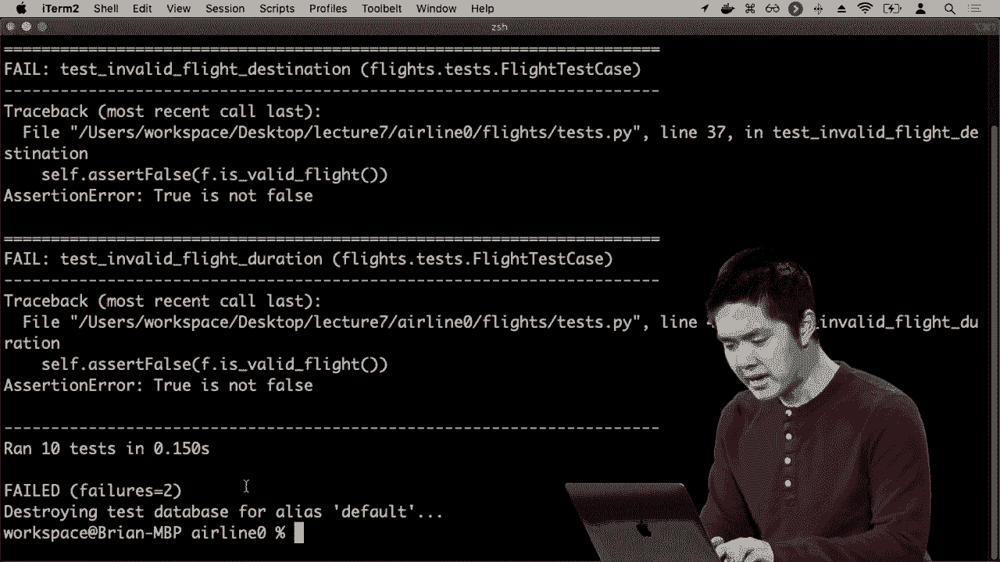

航班，确保这个函数是正确的，所以我回到**models.py**，再看一下**is valid flight**，也许我会再思考一下逻辑，好的，我想检查一下**self.origin**是否不等于**self.destination**，我想检查一下持续时间是否大于或等于。

零，我可以把这个改为大于，但我认为这不是问题，因为我的持续时间是负的，所以这应该已经是无效的。但我可能意识到的另一件事是，我所用的逻辑连接词不对，我想检查一下。

要使其成为有效航班，它需要满足两个条件：出发地和目的地需要不同，航班的持续时间需要大于零。例如，这里我用了**or**而不是**and**，所以我可以简单地更改它，希望这样能修复问题。

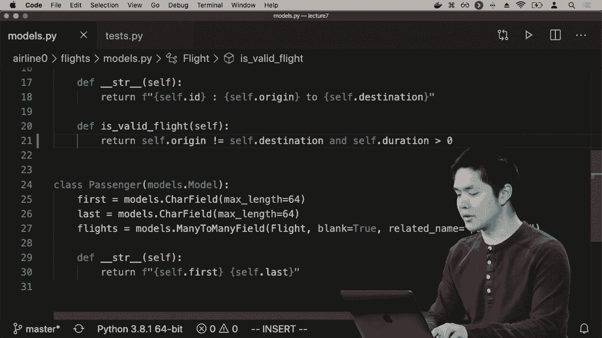

一些事情并尽可能多地验证。我重新运行了Python的管理测试，继续按回车键，它将检查已运行的十个测试，一切正常。看起来现在我已经通过了所有这些测试，并且注意到在顶部它创建了一个测试数据库，因此它刚为我创建了一个测试数据库。

为了完成所有这些测试工作，然后在最后销毁那个测试数据库，因此我的测试中添加或删除数据都不会触及Web应用程序数据库中的任何实际数据，Django将处理将所有这些保持分开的过程。

通过首先调用setup函数以确保我的新测试。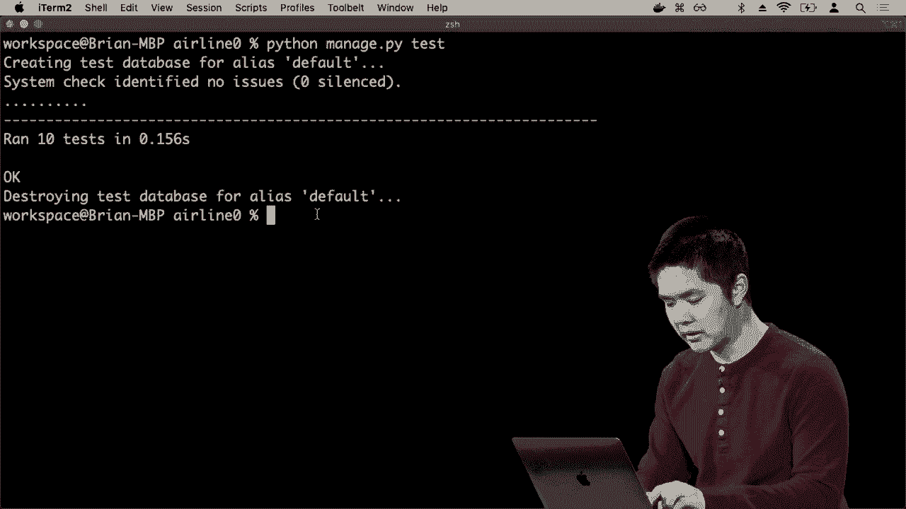

数据库拥有所需的一切，所以好吧，我们现在通过使用单元测试能够测试Web应用程序内部的各种不同函数。我们首先看到我们可以测试一个函数，比如is prime函数，这只是我们编写的一个Python函数，但我们也可以测试诸如。

我们模型上的函数，例如检查航班是否有效，确保我们可以接受一个航班并访问所有到达和出发的机场，但我希望做的不止这些，尤其是对于一个Web应用程序，我希望检查。

特定的网页按我希望的方式工作，因此为了做到这一点，Gengo让我们模拟尝试向Web应用程序发出请求并获取响应。因此，让我们继续看看其他一些测试。这里我们有一个名为test index的函数，test index的作用是。

要做的就是测试我的默认航班页面，以确保它正常工作。因此我们首先创建一个客户端，一个将要以请求和响应的方式进行交互的客户端，然后我要调用客户端的`get /flights`，这就是获取索引页面的路由。

所有航班，我将其保存在一个名为响应的变量中。无论我从尝试获取该页面中得到什么响应，我都希望将其保存在这个名为响应的变量中，现在我可以在同一个测试中有多个断言语句，如果我愿意，有时你可能希望。

以便将它们分开，但在这里我想确认索引页面的工作情况，这意味着几件事，首先是响应的状态码应该等于二百，也就是表示正常。我想确保无论我收到什么响应，这将是二百。

如果出现某种错误，比如404因为页面未找到，或500因为内部服务器错误，我想知道这一点。因此让我首先断言状态码应该等于二百，但Django也让我访问上下文。

响应以及上下文将再次提到，在 Django 中，当我们渲染模板时，例如我们调用像返回渲染，然后提供请求以及我们要渲染的页面，但我们也可以提供一些上下文，即描述我们希望传递的所有值的 Python 字典。

该模板和 Django 的测试框架使我们能够访问该上下文，以便我们可以测试确保它包含我们希望它包含的内容，在我所有航班的索引页面上，我希望看到它包含所有航班的列表，而我们创建了三条示例航班。

在这个测试数据库内部，我应该能够进行验证。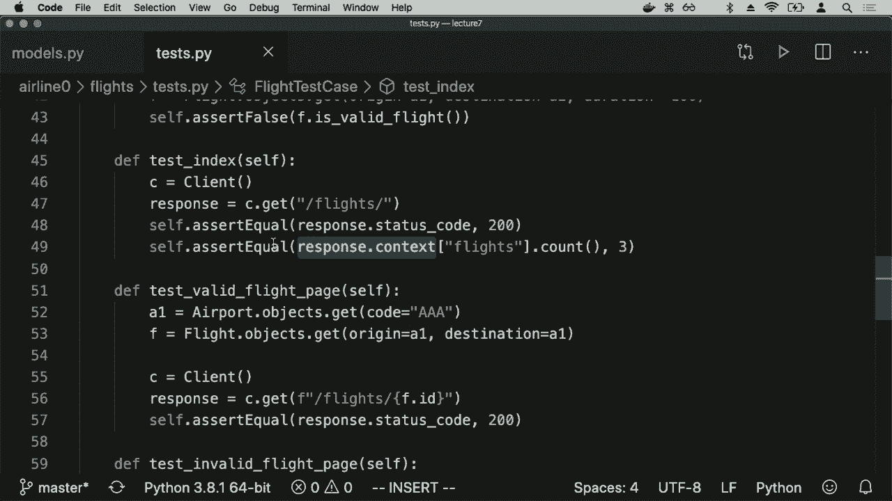

能够断言这两者是相等的响应而不是上下文航班，这将给我在上下文中传递的航班 dot count，那么它最好是 3，因为我想确保当我查看上下文并访问任何发生的内容时，结果确实是三条。

对于那个航班键，我还可以运行其他测试，所以在这种情况下，我已经获取了一个特定航班，这个航班在这个情况下的起点是 a1，终点也是 a1，这并不是一个有效的航班，但我们还是会获取它，因为它在数据库中存在，现在我可以。

获取斜杠航班斜杠那个航班 ID，因为在我的航班页面上，我希望能够访问斜杠航班，斜杠一个，以获取航班号码一，并访问斜杠航班斜杠二，以获取航班号码二，所以如果我带上一些有效的 ID，即某个实际航班 F，并访问斜杠航班斜杠那个 ID。

好吧，这应该有效，它应该有一个状态码 200，然而，如果我测试一个无效的航班页面，这是一个 Django 命令，将获取 ID 的最大值，这个 ID ＿ ＿ max，给我获取所有存在于数据库中的航班的最大 ID，如果我继续并。

尝试获取斜杠航班斜杠最大 ID，加一，所以一个比我数据库中已有的航班都要大一的数字，这应该不行，因为不应该存在一个不存在的航班页面，所以在这里我可以断言等于返回的状态码。

等于 404，因为我希望该页面返回 404，最后我还可以检查有关乘客页面的各种不同上下文，因此在这种情况下，我已向数据库添加了一些示例乘客，因此在我的测试中，我可以操纵数据库，添加数据到数据库中。

确保当你计算航班页面上的乘客数量时，这个数量将是，比如说 1，因此我们可以编写多种不同的测试，以验证我们网络应用程序的不同部分，我希望验证的不仅仅是我们的。

数据库按我们预期的方式工作，数据库在我们的模型功能方面是如何工作的，涉及到模型之间的关系，例如航班与机场之间的关系，但我们也可以模拟一个 GET 请求，模拟对页面的请求，并验证状态代码。

返回的内容应该是我们预期的，验证页面的内容是否包含正确的内容，验证传递给模板的上下文是否正确，然后所有这些都可以通过执行类似 Python managed PI test 的命令来验证，然后运行它，我们会看到在这种情况下所有测试都通过了，这意味着。

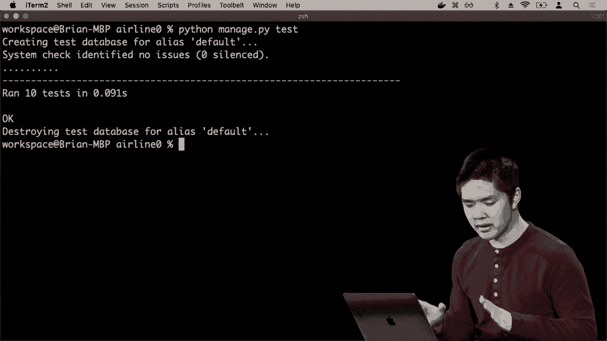

一切似乎都很好，至少目前是这样，因此，这在我们的网站程序变得越来越复杂时非常有用，因为我们有多个不同的模型和多个不同的路由，能够测试以确保如果我们在程序的一个部分进行更改，不会破坏另一部分的内容。

这部分也非常有用，但我们还没有能够测试的部分是任何完全在浏览器中发生的交互。我已经能够测试很多在服务器端发生的事情，并且要记住，Django 完全是为了编写这个作为 Web 的 Python 应用程序的 Web 服务器。

服务器监听来自用户的请求，使用这些不同的视图和模型处理这些请求，然后提供某种响应，我们可以测试该响应的内容，例如状态代码是否与我们预期的相符，内容是否匹配。

我们期望它的表现，但有时我们确实希望模拟用户点击按钮和尝试在页面上做事情，并确保该页面的行为符合我们的期望，即使我们没有使用 Django，或者即使我们仅仅处理前端。

创建一个我们可能想要测试的示例 JavaScript 网页，使用这些想法，自动化测试我们应用程序各个部分的过程，以验证它们确实正常工作。现在我将退出航空公司目录。

我将创建一个新文件，称为 counter HTML，并回忆一下之前我们使用 JavaScript 创建了一个计数器应用程序，计数器应用程序的功能是让我点击一个按钮，例如增加或计数按钮，它会将数字从 0 增加到 1，再到 2，3，4 等等。

接下来我将在这里做同样的事情，我们将增加一点复杂性。并给自己添加一个增加按钮和一个减少按钮，以便将数字减少一，所以我将继续从我们通常的 doctype HTML 和 HTML 标签开始，我将为这个页面命名为计数器。

现在在这个页面的主体内部，我将开始添加一个大的标题，显示0，然后在其下方创建两个按钮，一个按钮是加号，另一个按钮是。

减号符号，所以现在没有JavaScript，但这实际上不会工作，但我可以。

我会继续打开counter.html。

我现在看到我有0，还有加号和减号按钮，尽管这些加号和减号按钮现在并不实际执行任何操作，所以我们来让它们做些事情，给这个按钮一个ID叫increase，以便我可以稍后引用它，并给这个按钮一个ID叫decrease，以便我可以在点击时引用它。

在我的JavaScript中，现在在网页的头部，我将添加一个script标签，我希望在页面加载完成后开始运行一些JavaScript。为此，你会记得我可以说，文档添加事件监听器DOM内容加载，表示一旦DOM加载完成就运行这个函数。

这页面的内容已加载，以我预期的方式，接下来我该怎么做呢，我首先需要一个变量，比如let counter等于零，然后我可以说，好吧，文档查询选择器增加获取ID为increased的元素，那是加号按钮，当你在工作时。

让我们添加一个事件处理程序，以回调函数的形式，当点击增加按钮时将调用这个函数，我想做什么呢，我想增加计数器，继续说counter加加，然后我将更新这个h1。

当前包含零文档查询，选择器h1获取h1元素。我将继续更新它的内部HTML，并将其设置为任意值，计数器的值就是这样，然后我会对减少按钮的文档查询选择器做同样的事，获取ID为decreased的元素。

那就是减号按钮，点击后将运行这个回调函数，做同样的事，首先将计数器减一，然后获取h1元素，将其内部HTML设置为计数器，我想这应该有效。

我可以通过打开counter.html来验证这一点，我会刷新页面，我可以测试这些按钮，测试加号按钮，好吧，这似乎有效，值增加了一，测试减号按钮，确保那会减少值，这一切似乎运作良好，但当然。

这需要我与这个页面互动，我必须打开页面，我必须点击这些按钮，这不是我模拟像get请求或post请求的方式，没有服务器接收请求并返回一二三四的响应，这一切都发生在浏览器中。

所以我想要的能力是某种浏览器测试，有很多不同的框架可以做到这一点，其中最受欢迎的是selenium，这将让我可以定义一个测试文件，使用单元测试或类似的。

这个库可以有效地模拟一个网页浏览器，可以模拟一个网页浏览器，并模拟用户与该网页浏览器的互动，使用我们称之为的webdriver，这将允许我通过代码控制浏览器正在做什么以及它是如何进行的。

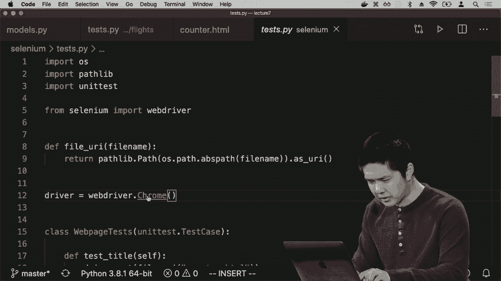

用户正在与这个程序互动，那么这将如何顺利进行呢？我将继续进行测试，打开Python解释器并让。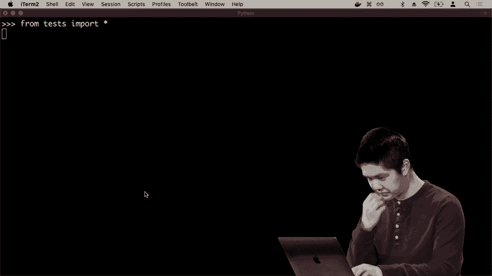

从tests导入star，这将让我访问几种不同的东西，但你会注意到，首先，它正在做的事情是。因为我正在使用这个webdriver，它将给我一个网页浏览器，我在这里使用Chrome，但你可以使用其他浏览器，请注意这里。

Chrome告诉我，Chrome正在被自动化测试软件控制。Chrome有能力允许我使用自动化测试软件，比如Python代码，控制网页浏览器正在做的事情。所以我在这里能做的第一件事是告诉Chrome打开我的网页。

结果是，为了做到这一点，我需要获取那个页面的URI或统一资源标识符，只是一些字符串，可以识别该页面。我定义了一个名为file URI的函数，它可以获取这个目录中特定文件的URI，所以我将说我想打开counter dot HTML，我需要。

获取它的URI，但现在我可以说driver dot get URI，意味着像告诉这个webdriver，这部分Python程序正在控制网页浏览器，我想获取这个网页，仿佛用户已访问该网页并在输入URL后按下回车。所以我说。

driver Doug get URI，我继续按下那个，你会注意到右侧，Chrome已经加载了这个页面，我实际上是在用我的Python程序控制这个网页浏览器窗口。我说driver Doug get URI，意味着继续打开counter to the HTML页面。

然后在这个测试窗口中，Chrome被打开，在我的Python程序中，使用这个网页驱动程序，我有能力看到用户在打开页面时看到的相同内容。那么用户在打开页面时看到什么呢？他们会看到，例如，页面的标题，所以我可以说。

类似于driver.title，可以看到，这个页面的标题是counter，这实际上是页面的标题，但我可以在我的Python程序中通过检查driver标题来验证这一点，通过获取我的网页驱动程序，查看当前页面的标题。

那就是counter，如果我查看driver.page source并按回车键，我看到的内容以字符串格式呈现，所以有点杂乱，是这个页面的HTML内容，你会注意到像DOM内容加载在这里，我自己的点击处理程序，这是我的h1标签，上面写着0，真的很杂乱。

因为它被表示为一个Python字符串，而这些反斜杠结束符则表示像换行符这样的行断开，但这就是内容，这实际上就是浏览器所获得的全部信息，浏览器接收这些信息并知道如何以更美观的图形化表示来渲染它，这更易于理解。

这对于用户查看是有帮助的，因此能够理解，但这基本上是我的网页浏览器在加载网页时实际上获得的所有内容。那么我可以从这里做什么呢？我想在这个页面上模拟用户的行为，当然我可以获取页面并查看标题，但我。

想要模拟点击增加按钮，例如，所以首先我需要做的事情就是获取增加按钮，为此我可以说driver.get或通过ID查找元素，我可以尝试找到HTML元素的多种方法，但我想。

通过ID查找HTML元素，我知道增加按钮的ID是increase，例如，如果我通过ID找到元素，那么让我找到ID为increase的元素，好的，看起来我为我的网页驱动程序得到了一个网页元素对象，我会继续保存。

这个元素被表示为一个名为increase的变量，因此我现在有一个名为increase的变量，代表我的网页驱动程序在网页上找到的增加按钮，这实际上和你作为人类浏览网页寻找增加按钮是一样的。

驱动程序执行相同的操作，不过它不是根据按钮的外观寻找按钮，而是根据其ID寻找按钮，因此这是另一个理由，为什么给你的HTML元素分配ID是有帮助的，以便在你需要找到该元素时，这非常有用，可以进行引用。

通过它的名称获取该元素，但现在我，有一个按钮，我可以模拟用户与该按钮的交互。我可以说，比如增加点点击，表示我希望模拟用户点击该按钮，以查看用户获得的任何返回结果。

点击那个按钮，所以增加点击，我按回车，你会注意到。发生的是数字增加，从0到1，就像我按下了，按钮。其实我所做的只是说增加，点击，去按增加按钮，让浏览器进行，正常的响应。

我们的响应是获取JavaScript事件处理程序，当点击时。处理程序并运行回调函数，这样可以增加计数器的值并。更新h1，所以我可以说增加点，点击以模拟增加该变量的值。实际上这只是一个，函数调用，这意味着我可以包括。

在任何我想要的其他Python结构中，如果我想重复某个操作，比如说25次并按下，按钮25次，我可以说for I in。range 25，去按增加按钮，很快它将快速点击增加，按钮，我将看到结果。

所有这些交互，所以我可以，仅通过使用Python解释器来模拟用户交互。同样，如果不是增加一个或，两个，而是减少，那么我将执行。相同的操作，我会说减少，等于驱动程序点查找元素通过ID，让。我们获取减少元素，该元素的ID为减少，然后说减少点点击。

将模拟我按下减少按钮，再按一次，我每按一次，都会减少一个。如果我想将其减少到零，那么我只需执行20次for I in range 20，去减少点，点击，这将继续进行。

将此帐户减少到，零，通过模拟用户按下一个。按钮20次，你会注意到，发生的速度非常快。我可以通过说for I in range，100增加点击来模拟100次增加按钮的按下，且你会很快，看到这个数字被增加一百次。

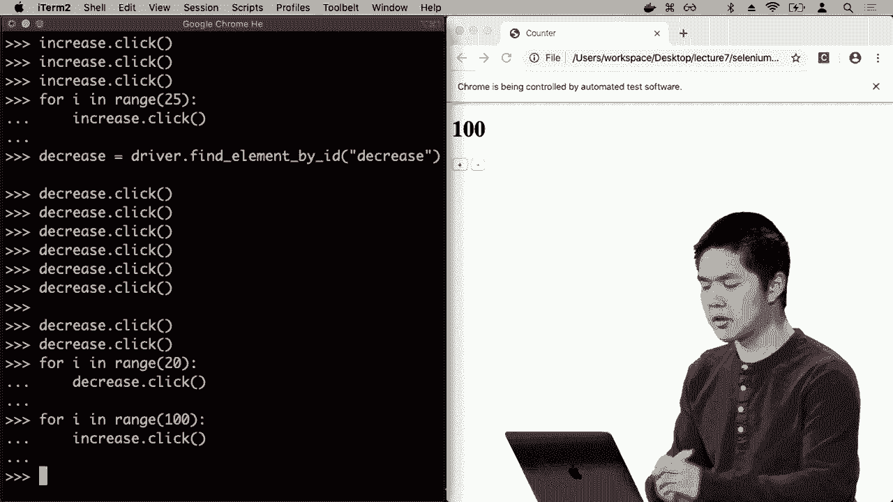

可以比人类快速地点击那个加号按钮，这些，测试不仅可以自动化，而且可以比任何人类都要快，以便测试这种行为。那么我们如何将这个想法，融入我们编写的实际测试中呢？

类似于单元测试框架，允许我定义各种不同的函数，以测试我Web应用程序行为的不同部分。为此，让我们再看看tests PI内部的测试。这里再次是那个文件URI，函数，该函数包含。

唯一目的是获取文件并获取其 URI，我们需要 URI 才能打开它，然后我们继续获取 Chrome 网页驱动程序，它将允许我们在 Chrome 中模拟交互。为了获取 Chrome 的网页驱动程序，你确实需要获取 Chrome 驱动程序。

它与 Google Chrome 本身是分开的，但 Google 确实提供了它，并且其他网页浏览器也提供了等效的网页驱动程序。如果你想测试其他浏览器中的效果，因为不同的浏览器可能表现不同，这可能很有用。

确保所有内容不仅在 Google Chrome 中有效，而且在其他你可能期望用户使用的浏览器中也能正常工作。因此，我在这里定义了一个类，它再次继承自单元测试，一个将定义我希望在此上运行的所有测试的测试用例。

在这里我有一个名为 test title 的函数，它将首先在 HTML 中获取计数器，它将打开该页面，然后仅仅断言相等。让我们确保页面的标题实际上是计数器的值，这正是我所期望的，因此我可以编写一个测试来测试这个情况。

我通过查找 ID 为 increase 的元素来测试增加按钮，并点击该按钮以模拟用户按下加号按钮来增加计数器的值。那么我想检查什么呢？我想检查当你通过标签名 h1 查找元素时，所以通过标签查找元素。

名称类似于通过 ID 查找元素，除了它不是通过 ID 查找，而是查看标签，并且只是一种元素不是 h1。所以在这里我说继续，获取 h1 元素并访问它的文本属性，这意味着它包含在这两个 h1 中的内容。

标签我希望是数字 1，因此我将断言这等于 1。同样，我也可以对减少按钮执行相同的操作，找到 ID 为 decrease 的元素，点击该按钮，然后断言相等，找到 h1 元素，并确保其内容。

等于负1的数量为。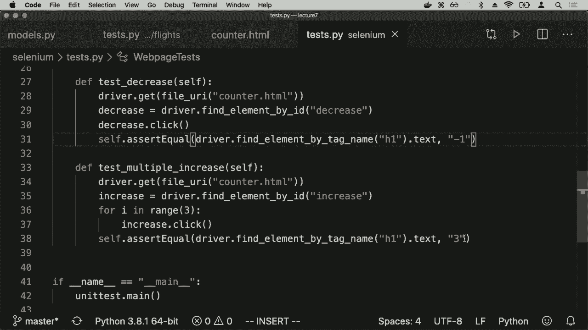

这个最终测试只是测试多次，三次。我将按下增加按钮，并确保在我按下增加按钮三次后，当我检查 h1 并查看其文本内容时，答案确实应该是三。

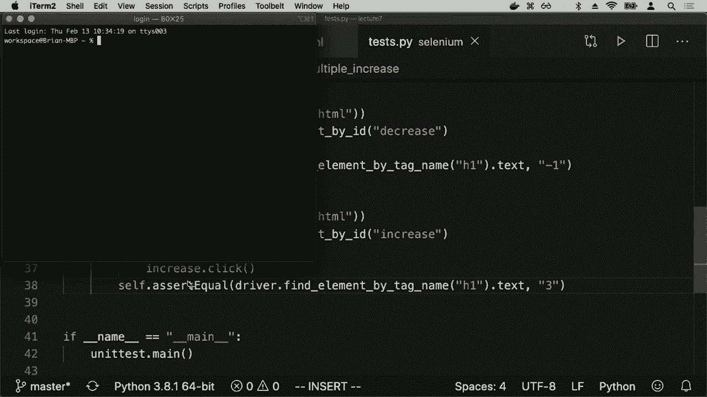

现在我应该能够通过运行 Python tests.py 来测试这段代码，而这将打开一个网页浏览器，你很快会看到在我屏幕上闪过的所有测试。我们测试增加 1，我们测试减少 1，然后我们测试类似的内容。

在确认标题正确后，我们的数量增加了三倍，然后我们可以看到这是我们在这段时间内运行的四个测试的输出，一切都很好，没有测试失败，但如果其中一个测试失败了，我们将看到不同的输出，所以让我们。

想象一下，如果我的减少函数有一个bug，比如说减少函数实际上没有工作，那这个bug可能是什么样子？也许我忘了说counter--，或者更可能的情况是，我已经写了增加函数，决定。

快速添加减少函数，我想我只是复制粘贴一下，像是复制增加事件处理器，减少事件处理器基本上是一样的，只是我需要查询减少，而我可能只是做了这个，忘记将加加改为减减，这是一个bug。

如果你在从一个地方复制粘贴代码时不够小心，可能会发生一些问题。现在当我运行这些Python测试时，我会看到模拟结果一大堆被模拟，当我回去检查测试的输出，看看实际发生了什么时，我发现我们似乎有。

这里出现了一个断言错误，断言失败是在测试减少函数时发生的，当我尝试断言h1元素中的值为-1时，因为1不等于-1，所以这是这个断言错误的值。这在某种程度上是有帮助的，相比于仅仅断言，它告诉你。

你知道有一个断言错误，但在单元测试中，我们实际上可以看到如果我断言两个事物相等，它会告诉我这两个事物是什么。它告诉我h1的实际输出是1，但我期望的是-1，所以它准确地告诉我差异在哪里，我知道。

出于某种原因，它是1而不是-1，这可能是我解决问题的线索。我可以通过查看我的减少事件处理器来解决这个问题，发现哦，这实际上是在增加计数器，而不是减少，改为加。

加改为减 - 现在重新运行我的测试，查看我在chromedriver内部的所有测试，我们运行了四个测试，这次一切都很好，所以这次我的所有测试似乎都通过了，这些是一些可能性，能够测试我们的代码，特别是利用单元测试，这个库我们可以使用。

Python可以进行各种类型的断言，关于我们希望代码的某些条件是否为真或假，单元测试包含了许多有用的方法，以便执行这些断言，我们可以说，比如我想断言两个事物相等。

对彼此的比较，我们看到有一个对应的概念，用于确保两个事物不相等。我们也看到`assert true`和`false`，但还有其他一些，例如`assert in`或`assert not in`，如果我想要验证。

某个元素在某个列表中，或者某个元素不在某个列表中。我们还有其他断言方法，可以用来验证我们程序的某个部分或我们网络应用的某个部分确实按照我们希望的方式运行，我们可以将这种想法整合到。

我们看到多种不同类型的测试将其整合到Django中，使用Django的单元测试来验证我们的数据库是否按预期工作，以及我们的视图是否按预期工作，并在用户发出请求后提供正确的上下文。

我们的网络应用程序中还有单元测试的应用。不论是否使用框架——当我想进行基于浏览器的测试时，我会测试用户的网络浏览器内部，当用户点击这个按钮时，JavaScript是否按我期望的那样运行。

我期望它按预期工作，我不需要，特别是使用JavaScript来进行这些测试。我没有使用Python编写这些测试，而是使用单元测试来验证点击这个按钮的想法，以及验证我们得到的结果是否是我们期望的。

我们将继续查看CI/CD，持续集成和持续交付，这两个概念在软件开发领域被视为最佳实践，涉及代码如何编写，尤其是由团队或小组编写的代码如何协同工作，以及最终如何将代码整合在一起。

交付和部署给那些使用这些应用程序的用户，因此CI指的是持续集成，即频繁合并到某个代码库的主分支，例如git代码库。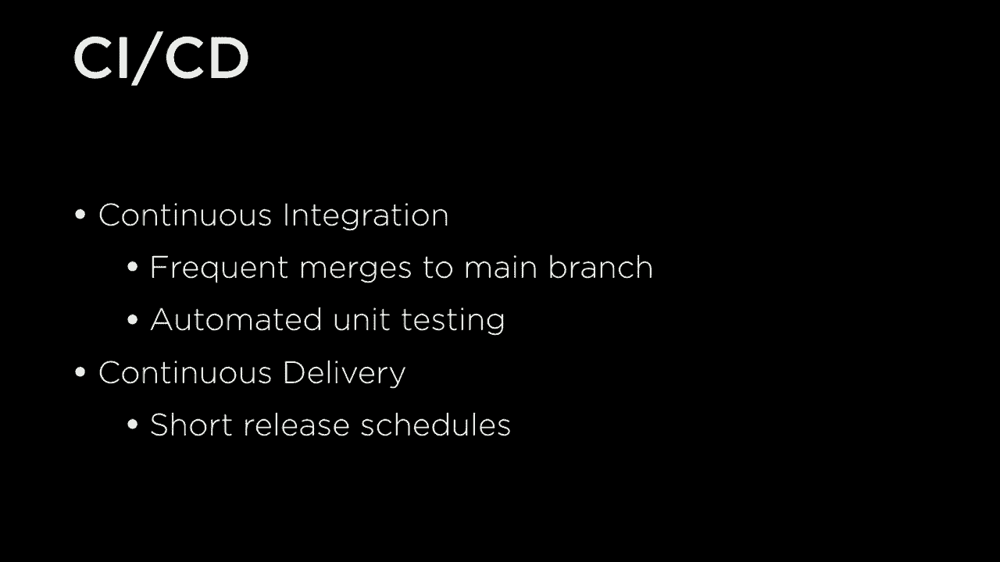

然后在代码被推送时自动运行单元测试。那么，这通常意味着什么呢？过去，你可能会想象，如果多个人同时在某个项目上工作，而每个人又在处理该项目的不同功能或不同部分。

在每个人完成这些功能后，我们准备发布一个新的网络应用版本或软件产品的新版本，那么每个人都必须将这些不同的功能结合在一起，并最终弄清楚如何将它们整合。

尝试将该程序交付给用户，这往往会导致问题，特别是如果人们同时在进行不同的大改动，它们可能不互相兼容，各种不同的更改之间可能会存在冲突。

等待每个人完成工作后再将功能合并在一起，并交付并不一定是最佳实践，这就是为什么越来越多的团队开始采用持续集成系统，因为有一个在线的存储库。

保持代码的官方版本，每个人都在自己的版本上工作，例如，可能在自己的分支上，但这些更改经常合并回同一个分支，以确保这些增量更改能够进行，从而降低出现问题的可能性。

程序经历了两个非常不同的路径，因此更难将这两条路径合并在一起，除了经常合并到某个主分支外，持续集成的另一个关键思想是自动化单元测试，在此情况下再次进行单元测试。

这涉及到我们程序的想法，我们运行一系列测试来验证我们程序的每个小部分，以确保网络应用程序按预期运行，而单元测试通常指测试我们程序的特定部分，以确保每个组件按预期工作。

还有更大规模的测试，例如集成测试，确保从用户请求到响应的整个路径在某个管道中正常工作，但测试有各种不同类型，重要的是确保每次有新的更改。

在合并到主分支或有人想要将更改合并到主分支时，这些测试会被运行，以确保没有人对程序的某一部分做出更改，而破坏程序的其他部分，在足够大的代码库中，任何一个人都无法准确知道某一特定更改对程序其他部分的影响。

他们会遇到一些不可预见的后果，而该程序员可能知道或不知道，因此，假设单元测试是全面的，并涵盖程序的各种不同组件，这就是单元测试的优势。

程序的好处在于，无论何时有人进行更改并尝试将该更改合并到主分支中，根据持续集成的实践，如果它未通过测试，我们会立即知道，因此该程序员可以回去修复，而不是等待。

直到所有内容合并在一起，然后运行测试，意识到某些东西无法正常工作，并且不确定从哪里开始。我们不知道错误在哪里，哪个更改导致了错误，如果一切以更增量的方式合并，那么发现这些错误会更容易，假设。

有良好的测试覆盖率，以确保我们考虑到这些不同的可能性，持续集成指的就是这个理念，频繁且增量地更新主分支，并确保测试确实通过，这与一个相关理念密切相关。

持续交付涉及软件实际如何发布给用户，网络应用如何部署。有几种模型可以思考，关于某个程序或网络应用如何被部署。

你可能会想象发布周期可能相当长，人们在某个软件开发团队上花费几个月时间进行各种不同的功能开发，当他们对所有新更改感到满意时，他们就会发布网络应用的新版本，但特别是对于正在进行中的网络应用。

不断变化的情况，有大量用户在迅速变化。一个相当受欢迎的概念是，持续交付，指的是有更短的发布周期，而不是在某个漫长周期结束时立即发布某些东西，你可以在短周期内每天发布。

每周进行一次，以便说，继续逐步进行这些更改，无论新的更改是什么，合并到主分支。我们可以立即发布这些，而不是等待更长时间来进行发布，这又促使某些。

好处是能够逐步进行更改，例如，如果出现问题，你可以更快了解出了什么问题，而不是一次性进行大量更改，这样如果出问题就不一定清楚出在哪里，并且这也允许新功能迅速推出给用户。

用户可以更快地获得服务，尤其是在一个竞争激烈的市场中，许多不同的网络应用相互竞争，能够快速发布新功能是相当有帮助的，因此持续交付就是关于短发布周期的理念，而不是等待很长时间。

新版本发布，增量发布，随着新功能的引入，这与持续部署的理念密切相关，CD有时也代表持续部署。持续部署在精神上与持续交付相似，但部署是自动发生的。

这意味着人不必说，好吧，我们做了几处更改。我们可以继续部署这些更改，在持续部署中，只要这些更改被做出，应用程序向用户部署的流程就会自动进行，从而减少人类需要做的事情。

思考并允许这些部署更快地发生。问题是，哪些工具可以让我们实现持续的集成和持续交付。
