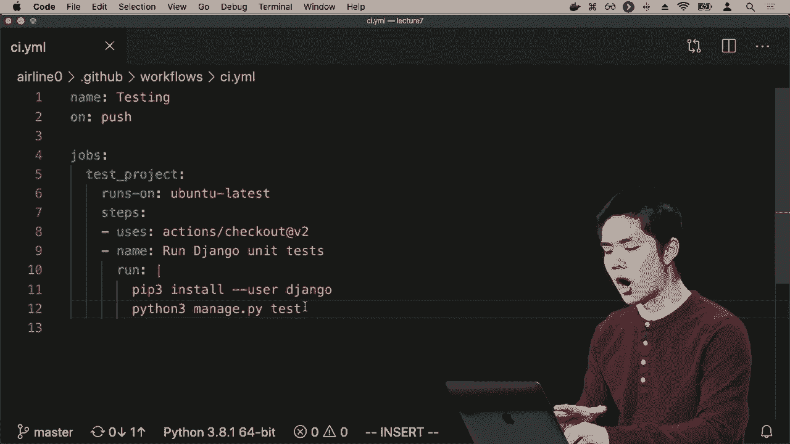
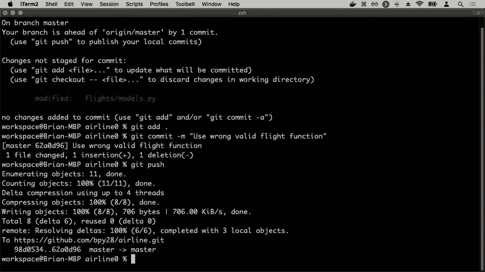
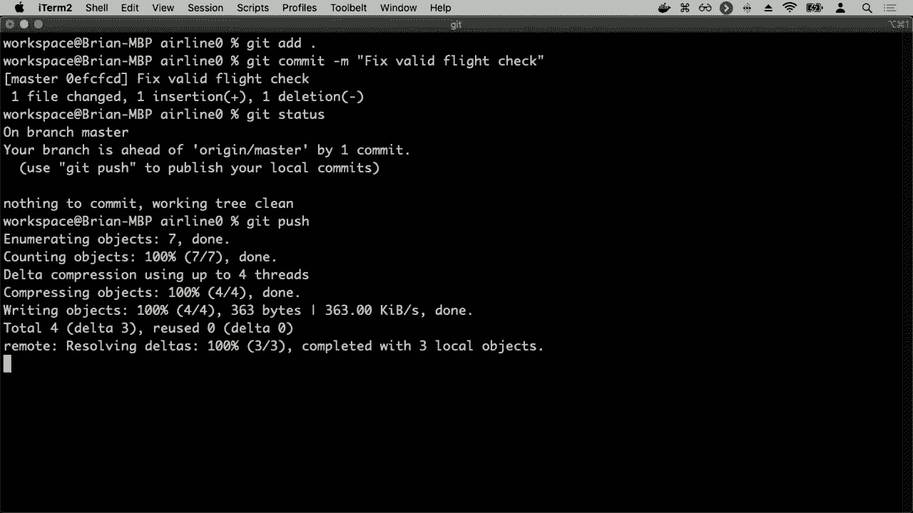
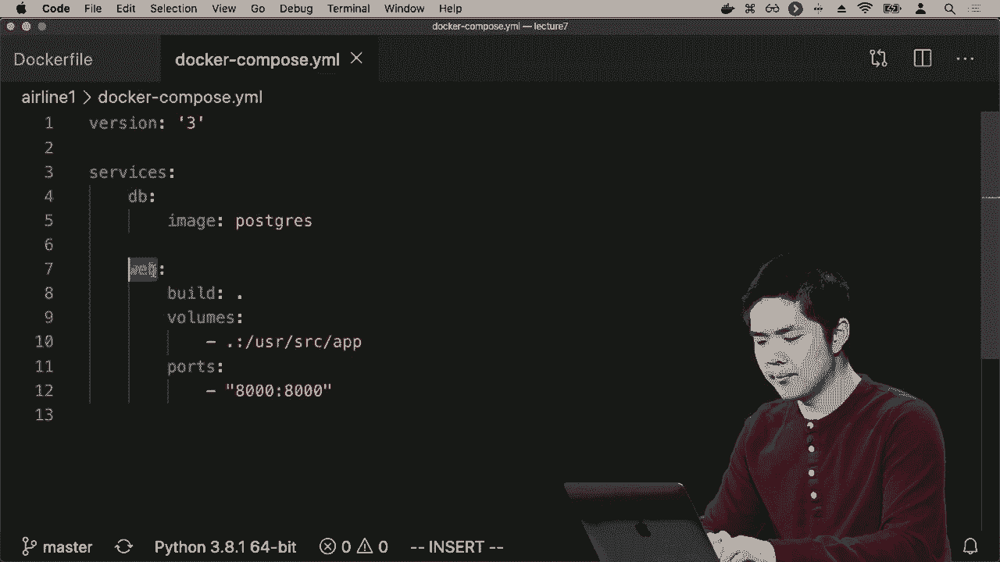
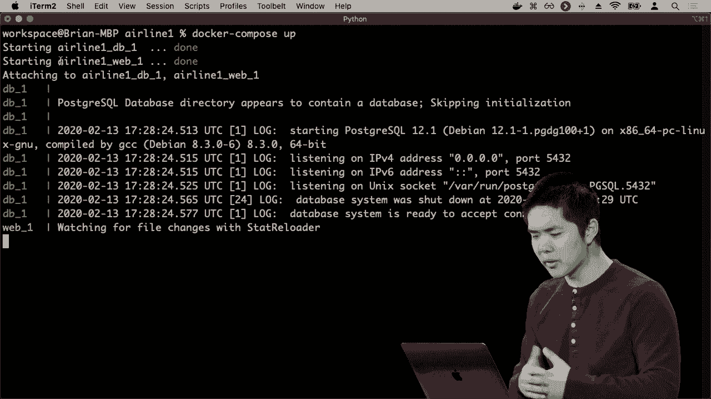
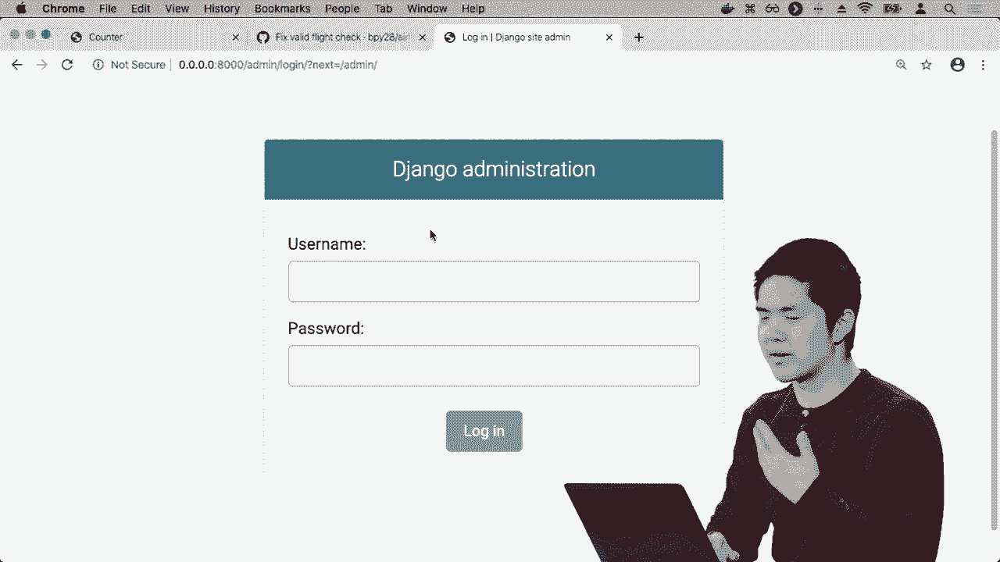
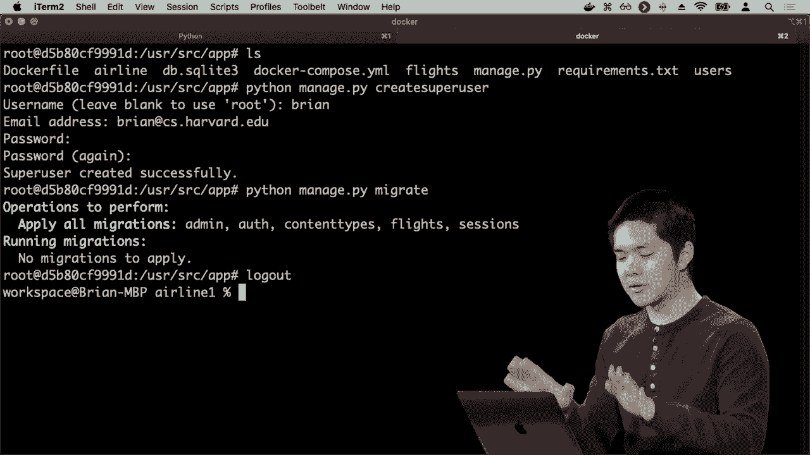

# 哈佛 CS50-WEB ｜ 基于Python ／ JavaScript的Web编程(2020·完整版) - P23：L7- 测试与前端CI／CD 3 (github与docker应用) - ShowMeAI - BV1gL411x7NY

为了使其更简单，我们可以使用一些技术，市面上有多种持续集成工具，但其中之一是github最近推出的github actions。github actions允许我们创建这些工作流，例如我们可以说每当有人推送到一个github仓库时，我们会自动运行希望在该代码库上执行的任何测试。

在git仓库中，我希望某些步骤能够进行，例如检查代码格式是否良好，如果公司有期望所有程序员遵循的样式指南，你可以设置一个github action。

每当有人推送到一个仓库时，你会有一个自动检查代码是否符合样式指南的动作，以确保代码格式良好、注释完整等。此外，你可能还会有一个github action来测试我们的代码，以确保每当有人推送代码时。

github actions可以通过定义某些工作流来实现这一点，所以我们稍后将使用github actions来自动化这一过程。

运行测试的目的是为了让程序员在编写完代码后，能够测试自己的代码并确保其正常工作，我们可以通过确保每次有人推送到github仓库时，自动运行一些github操作来强制执行这一点。

这将处理在该程序上运行测试的过程，我们会立即通过github可能发送给你的电子邮件知道某个特定测试失败了，而你在每次推送到该仓库时都会知道。那么，这些工作流是如何结构化的，它们的语法是什么？

它们使用一种称为llamo的特定语法，这是一种配置语言，可以用于描述各种不同工具和软件的配置，github actions恰好使用它，其他技术也在使用。

Mille是一种文件格式，其数据结构类似于键值对，类似于JSON对象或Python字典，格式是键的名称后跟冒号，然后是其值，键的名称后跟冒号，再后跟一个值。

值不一定只是一个单一的值，它可以是一个值的序列，比如值的列表，这些用“-”表示，指示列表项1、项2、项3，除了单个值和列表项之外，这些思想和列表也适用。

这些值可以相互嵌套，你可能会有一个键指向另一组与值关联的键，导致其他与值关联的键集合，这与JSON对象的键值对表示方式非常相似。

在JSON对象中也可以有嵌套的JSON对象，同样，我们可以有嵌套的键值对，作为某个键的值 - 所以我们将看看在创建一些将运行一些GitHub Action的GitHub工作流时，这实际上是什么样子的。

比如，让我们回到airline zero，我在一个`.github`目录中定义了一个名为workflows的目录，在其中有一个CI.yml文件，文件名可以是任何名称，`.yml`或`.yaml`是YAML文件的传统扩展名。现在我将打开CI.yml，这就是如何。

这个工作流应该如何工作，我给工作流命名为testing，因为我想让工作流做的就是测试我的航空应用程序。然后我指定一个on键，表示这个工作流何时运行，我说在push时，意味着每当有人将代码推送到GitHub时，我们希望。

每次工作流运行时，包含一些作业，那么这些作业是什么？在我尝试推送到这个`repository`时，应该发生哪些任务。我定义了一个名为test的作业，这是我为自己选择的名称，你可以为作业选择任何名称，现在我需要。

指定两个事项，关于作业应该发生什么。第一件事是需要指定它将在什么机器上运行，GitHub有自己的虚拟机（VMs），我想在其中一台虚拟机上运行这个作业，它们支持不同的操作。

系统，这里我只是说继续在最新版本的Ubuntu上运行，这是我希望这个测试运行的最新Linux版本。接下来，我为作业指定应该发生的步骤，现在我可以指定当有人尝试测试项目时应该发生哪些操作。

当我尝试运行这个作业时，我在这里使用一个特定的GitHub Action，这是一个由GitHub编写的GitHub Action，名为actions/checkout。这将检出我在`repository`中的代码，并允许我运行在该代码上操作的程序。

如果你愿意，可以编写自己的GitHub Actions，但我们现在需要做的就是检出代码，查看我刚刚推送到的分支，然后我将运行Django单元测试，这只是我知道在这一特定步骤中发生了什么的描述。

我想运行的内容是，我将首先安装**Django**，因为我需要安装Django来运行所有这些测试，但如果有其他需求，我可能还需要安装那些需求，不过航空程序相对简单。

我们运行测试所需的只是Django，所以我将安装Django，然后运行`Python 3 Manish PI test`，我想测试所有测试，我可以通过提供这个`managed up high`命令来运行所有测试。

这个特定应用的配置文件将指定一个工作流程，该工作流程表示每次我推送到GitHub仓库时，我希望的结果是检查我的代码。

系统将检查我的代码，并运行这些命令，安装Django，然后测试我的代码，并在执行后将响应反馈给我，所以让我们测试一下，特别是让它在一个测试将失败的程序上运行。

我可能会说，例如，让我们进入`flights`和`model stop pie`，回到我之前的`is valid flight`函数，并将其更改回之前不起作用的版本。

如果目的地或持续时间大于零，我们将其视为有效，但我们知道这是错误的，不应该这样。看看我会怎么做，我会先说`get status`，看看有什么改变，似乎我已经修改了`models pi`，这很合理。

我将添加所有可能修改的文件，使用`add dot`，然后提交我的更改，我将使用错误的`valid flight function`进行提交，现在我要将我的代码推送到GitHub上。我已添加、提交并推送我的代码。

如果我进入GitHub，查看我的航空公司合成器II，您会注意到我们大多在处理这个代码标签，但GitHub还给我们其他标签，当你开始考虑在较大团队中工作时，这非常有用。

问题是人们报告某些东西不太对劲或对该代码库的功能请求的方式，问题可能会维护该特定仓库所有待处理事项的列表，即我们仍需处理的事项。

这些问题已经解决，可以关闭，所以我这边没有问题。拉取请求是人们试图将代码的一部分从一个分支合并到另一个分支，因此在一个较大的项目上，你可能不希望每个人都同时将东西合并到主分支。

人们在各自独立的分支上工作，当他们对自己的代码感到自信和满意时，他们可以提出拉取请求以将他们的代码合并到主分支，这样就可以实现各种其他功能，例如某人提供代码审核的能力。

代码撰写评论并提出对特定代码部分应进行的更改建议，在它被合并到主分支之前，这是与GitHub仓库或任何其他大型项目合作时的另一个常见做法。

源代码控制中有这样一个代码审核的概念，通常你不希望只有一个人进行更改而没有任何人查看这段代码，而是希望有第二双眼睛能够审查，确保代码是正确的，确保它是高效的，并且符合实践。

应用程序正在使用，因此拉取请求对此非常有帮助。然后这个第四个选项卡代表GitHub Actions，这些是我可能想在这个特定仓库上运行的各种不同的动作或工作流程。我们在这里看到的是，如果我进入动作选项卡。

现在我看到的是我最近的测试动作，所以每次我推送时，我都会得到一个新的测试动作，这个是29秒前的，我会点击它，看看里面的内容，好的，这是我运行的测试项目的作业，你会注意到左侧有一个大红色X。

工作流程意味着出现了问题，因此我想知道是什么出了问题。我会点击测试项目，在这里，这些都是我们实际运行这个特定作业时发生的所有步骤。首先作业设置，然后检出动作继续检出我的代码，因为我们需要。

访问我的代码以便能够运行它，这里是我定义运行Django的步骤。单元测试将要安装Django并运行这些测试，它旁边有一个X，表示出了问题，我在下面的注释中看到一个失败，所以到处都是，github试图告诉我这一点。

出现了问题，它在两分钟前失败了，我会打开这个，我所看到的第一件事是我们安装了Django，似乎运行得还不错，但在下面你会看到运行这些单元测试的输出，显示失败，现在我可以看到。

这里是失败的单元测试，我们失败了无效的航班目的地测试，我们失败了无效的航班持续时间测试，正如之前我在GitHub用户界面中看到的那些断言错误，我可以看到它们是真的。

我尝试运行这个特定的测试套件，现在其他也在这个库上工作的人员也可以看到这些测试的结果，并可以提供建议，给出我可能修复代码的方式，但现在我知道这个特定的测试失败了，如果我继续。

回到这个GitHub库的主代码页面，我会看到下方的情况。  

这个提交旁边有一个小X符号，这个小X符号告诉我，我上次尝试提交时出了问题，他们在出现错误时运行了工作流，因此我会立即看到这个提交的情况，并且可以回头查看历史记录。

我会查看提交，看看哪些是正常的，哪些有导致某种问题的倾向，所以这个显然造成了问题，我们知道为什么，因为这个条件或者其他什么原因，所以我可以修复它。我会改变顺序并且添加提交。

我会修复有效航班检查，如果我获取状态来检查现在发生了什么，我的主分支领先一个提交，这正是我所期望的，现在我会推送代码到GitHub。

推送这个更新，希望我们能够通过工作流，现在我回到报告。我刷新页面，这里是我的最新提交“修复有效航班检查”，你会注意到这里有一个橙点，而不是之前的红色X，这个点意味着测试当前在等待中，工作流正在进行中。

因为GitHub需要一些时间来启动虚拟机，初始化工作以检出我的代码并运行所有测试，但如果我回到Actions标签，我会看到这次测试时获得了绿色勾号，一切似乎都正常。

我去项目中查看，现在我注意到“运行Django单元测试”旁边的绿色勾号意味着单元测试也通过了，如果我打开它们，现在我看到底部有与我之前在自己的机器上运行单元测试时相同的输出，我们运行了十个测试，一切正常，这告诉我这些测试通过了。

GitHub Actions能够允许某些工作在你推送代码、提交拉取请求或在GitHub库上发生的各种不同操作时进行，这对实施持续集成的想法非常有帮助。

集成意味着当你将某个开发者分支的代码合并到主分支时，可以确保每个人的代码合并时都能通过测试。你可以添加规则来阻止任何人将未通过测试的代码合并到主分支。

确保合并的任何代码都能通过所有测试，这确实有助于开发周期，使得快速更改变得更加容易，但在快速进行这些更改时，我们不会失去。

在我们的代码中保持准确性和有效性，使我们能够确保代码通过这些测试的方法就是自动化地运行所有测试。因此，除了持续集成之外，我们现在谈论这个持续交付的理念，这种短暂的应用周期。

我们希望能够快速将应用程序部署到某种网络服务器。当我们将应用程序部署到网络服务器时，需要考虑的事项包括确保在我们的计算机上运行良好的程序也能在网络服务器上正常工作。

这可能会引发头疼和各种配置问题，因为你可能想象，所使用的计算机并不一定与云端的计算机相同，托管你网络应用程序的服务器上的计算机可能运行着不同的操作系统。

系统可能安装了不同版本的Python，如果你在自己计算机上运行某些包，那么在服务器上这些包可能并未安装，因此我们会遇到各种配置问题，你可能正在开发代码并意识到。

如果在服务器上不工作，这可能是由于你计算机上发生的事情和服务器上发生的事情之间的某种差异。如果你在一个更大的团队中工作，这种情况会变得更加棘手，你和其他多位开发者一起工作在一个软件项目上。

你们每个人都有不同版本的各种包或库安装，这些不同的版本具有不同的特性，可能并不能彼此兼容，因此我们需要某种方式来高效有效地部署应用程序。

需要对环境的版本进行标准化，确保每位开发者在相同环境下工作。一旦我们部署应用程序，它将在相同的环境中运行，解决方案在于一个。

有很多可能的选项，但一个选择是利用像 Docker 这样的工具，这是一种容器化软件，通过容器化软件，我们所讨论的是，当我们运行一个应用程序时，不是仅仅在你的计算机上运行，而是。

我们将在你的计算机上的一个容器内运行它，每个容器将包含其自己的配置，安装某些软件包，包含某些特定版本的软件，配置方式完全相同，并通过利用一个工具。

像 Docker 这样的工具可以确保，只要你提供了正确的启动和设置这些容器的指令，那么如果你正在开发应用程序，而你的一位同事也在同一项目上工作，只要你们使用相同的指令。

关于如何设置 Docker 容器，你将会在相同的环境中工作，如果一个软件包在你的计算机上安装，那么它也会在你同事的容器中安装。这种工作方式的好处与持续交付的理念相结合，当你。

如果你想将你的应用程序交付和部署到互联网上，你可以在完全相同的容器设置内运行你的应用程序，使用完全相同的一组指令，这样你就不必担心确保所有正确的软件包和版本的问题。

事实上安装在服务器上的 dock 哦，没错可能会让你想起虚拟机的概念，或者说 VM，如果你对这个概念熟悉的话，GitHub 使用。例如，VM 在运行其 GitHub actions 时，实际上是不同的 VM。一个 VM 实际上是在运行一个完整的虚拟计算机，拥有自己的虚拟操作系统。

系统中的库和应用程序运行在你的计算机上，所以虚拟机最终会占用很多内存，占用很多空间，而 Docker 容器则稍微轻量一些，它们没有自己的操作系统，仍然是在上面运行的。

主机操作系统，但在这之间有一个 Docker 层，跟踪所有这些不同的容器，并为每个容器跟踪，以便每个容器可以拥有自己独立的一组库，运行在其上的一组二进制文件和应用程序。

容器化的优势在于这些容器比完整的虚拟机更轻量，但仍然可以保持自己的环境一致，这样你就可以放心，如果应用程序在 Docker 容器中运行，你可以拥有那个 Docker。

在你的计算机上运行的容器，在别人的计算机上，或者在服务器上，以确保应用程序将以你实际预期的方式工作。那么我们如何配置这些不同的 docker 容器呢？为了做到这一点，我们将编写一个所谓的。

docker 文件，所以为了做到这一点，我将继续进入 airline 1，并打开这个 docker 文件。这个 docker 文件描述了创建 docker 镜像的指令。docker 镜像代表了我们可能希望在容器和 Sanon 中包含的所有库和其他已安装项。

基于那个镜像，我们能够创建一堆不同的容器，这些容器都基于同一个镜像，每个容器都有自己的文件，并且可以在其中运行 web 应用程序，所以这个 docker 文件例如描述了我如何创建一个容器，这个容器将运行我的 Django web。

应用程序，所以我首先说 from Python ：three，这恰好是我将基于这些指令的另一个 docker 镜像，这将是一个已经包含安装 Python 3 的指令的 docker 镜像，安装其他相关包，这在许多情况下是有帮助的。

编写 docker 文件时，你会基于一些已存在的 docker 文件，所以这里我说继续使用 Python 3。现在我想做什么来设置这个容器呢？我想把我当前目录中的所有内容复制到容器中，我必须决定复制到容器中的位置。

容器我将存储在哪里呢？我可以选择在任何地方存储，但我将其存储在 /user/source/app，只是一个我选择的特定路径，它将带我到一个我将存储应用的目录，但你可以完全选择其他东西。

所以我复制我当前目录中的所有当前文件，这将包括我的 requirements 文件、我的 manage type I 文件、我的应用文件以及我所有的设置文件，目录中的所有内容我都想复制到容器中。然后我说 work der 意味着改变我的工作目录。

和在你的终端中使用 CD 移动到某个目录是一样的，我希望将我的工作目录设置为相同的应用目录。容器内部的应用目录现在包含我应用的所有文件，因为我已经将所有这些文件复制到。

现在一旦我进入这个目录，我需要安装我的所有要求，所以假设我把所有的需求，比如 Django 和我需要的任何其他包，放在一个名为 requirements text 的文件中，我只需运行命令 pip install requirement text，然后最后在 docker 文件内。

我指定了一个命令，这就是当我启动容器时应该运行的命令。所有其他的事情将在我们设置这个 Docker 镜像时发生，但当我启动容器并实际想要运行我的 Web 应用程序时，这里是应该运行的命令，我提供了。

实际上就像一个 Python 列表，每个命令中的单词都用逗号分隔。在这里，我指定了当你启动这个容器时要运行的命令是 Python manage.py runserver，我希望它运行在 8000 端口，但我可以选择其他端口。

我希望运行的端口，所以，当我启动这个 Docker 容器时，如果需要，它会按照这些指令执行，确保根据这些指令设置容器，确保我们已安装所有必要的。

确保我们使用的是 Python 3，任何使用相同 Docker 文件的人都可以生成具有相同配置的容器。我们不必担心我与其他人之间的配置差异，他们可能没有与我完全相同的计算机设置。

这点很好，因为它可以在 Mac、Windows 和 Linux 上运行，即使是不同操作系统的人也可以使用配置相同的容器，所有容器的工作方式都相同，以加速这一过程。到目前为止，在构建 Django 应用程序时，我们一直在。

使用 SQLite 数据库，SQLite 数据库只是一个存储在我们应用程序内部的文件，这个基于文件的数据库允许我们创建表、插入行、从中删除行。在大多数生产环境和真实 Web 应用程序中，处理很多数据。

对于用户来说，SQLite 实际上并不是使用的数据库。当有很多用户同时访问时，它的扩展性远不如其他数据库。在这些情况下，通常你希望将数据库托管在其他地方，在某个独立的服务器上，以便能够处理自己的请求。

我们讨论了一些可以使用的数据库连接，比如说除了 SQLite，还有 MySQL、Postgres 等各种不同的基于 SQL 的数据库。所以想象一下，现在我想部署我的应用程序，但我希望使用 Postgres，而不是 SQLite。

例如，作为我想要运行的数据库服务器，这对我来说似乎很复杂，因为除了在一台服务器上运行我的 Web 应用程序外，我实际上还需要另一台服务器在运行 Postgres，以便我可以与其通信。

使用Postgres数据库，这对其他人来说会更加困难，他们可能无法进行有效的工作，另外，可能会很难让服务器以那种方式运行，但Docker的好处在于，我可以在不同的容器中运行这些进程。

我可以有一个容器运行我的网页应用程序，使用这个Docker文件，同时还有另一个容器运行Postgres，只要其他人也能访问同一个用于运行Postgres的容器，他们就可以在与我相同的环境中工作。

还有一个Docker的功能叫做Docker Compose，它允许我们组合多个不同的服务。我希望在一个容器中运行我的网页应用程序，而在另一个容器中运行Postgres数据库。

我希望这些容器能够相互通信，协同工作，因此当我启动应用程序时，如果我想这样做以便在我的计算机上运行这个应用程序，并安装网页应用程序和Postgres，我可以创建一个Docker Compose文件。

文件看起来是这样的，我在这里指定使用版本3的Docker Compose，这里我再次指定，使用YAML文件，就像我的GitHub工作流格式化在YAML中一样，Docker Compose.yml是一个描述我想要的所有不同服务的配置文件。

每个服务都将是自己的容器，可以基于不同的Docker镜像。在这里，我声明我有两个服务，一个叫DB（数据库），一个叫web（网页应用程序），数据库将基于Postgres Docker镜像。

对于Postgres，我不必担心其他人已经为启动Postgres容器编写了Docker文件，而网页应用程序将基于我当前目录中的Docker文件构建，这个Docker文件是我自己编写的，然后在下面我只是。

指定我的当前目录应对应于应用目录，然后我指定在我自己的计算机上运行时，我希望容器的8000端口与我自己的计算机的8000端口对应，以便我可以通过浏览器访问8000端口，并访问我正在工作的端口8000。

容器让我的计算机能够与容器实际交互，因此我可以在我的网页浏览器中打开网页应用程序，并看到所有这些的结果。于是我创建了两个服务，一个是数据库，一个是网页应用程序。

现在让我们实际尝试启动这些容器，我将首先进入我的航空公司目录，然后输入 docker compose up，意味着继续启动这些服务。我按下回车，你会看到我们正在启动两个服务，我正在启动数据库。

服务，我正在启动 Web。

服务，现在由于这一切，我已经启动了应用程序，并在 8000 端口上启动了它。所以如果我访问 0.0.0.0:8000 或者 :8000/flights，这将带我到航班页面，现在这个应用程序不仅在我自己的电脑上运行，还在 Docker 容器内运行。

现在这个页面内没有航班，因为我还没有实际添加任何内容到数据库中。如果我想这样做，我需要进入 /admin 来登录，并继续创建一些样本航班。

但是我还没有登录，因为我需要创建一个超级用户帐户。我不能像在我的航空公司目录中那样使用 Python 管理的命令创建超级用户，因为这是在我电脑的终端上运行的。而我真正想做的是进入 Docker 容器并运行这个。

我该如何做到这一点呢？有多种不同的 Docker 命令可以使用，docker ps 会显示当前正在运行的所有 Docker 容器。我将这一视图缩小一点，看到两行，每行对应一个容器，一行是我的 Postgres 容器。

这正在运行数据库，仅用于我的 Web 应用程序，每个服务都有一个容器 ID，所以我想进入我的 Web 应用程序容器，以便在该容器内运行一些命令，所以我将复制其容器 ID，并输入 docker exec，意味着在容器内执行一个命令。

在容器上执行命令 - 它将使这个交互式，这里是我想执行命令的容器。我想执行的命令是 - 传递 -L 标志，使用 bash 说我想运行一个 bash 提示符。我希望能够与 shell 交互，以便我可以在这个容器内运行命令。

所以我按下回车，现在你会注意到我在用户源应用程序的目录中。这一目录包含了关于这个 Web 应用程序的所有信息。我输入 LS，会看到这个容器内的所有文件，现在我可以说。

像 Python 管理命令一样，我创建超级用户，现在它将让我创建一个超级用户，所以我将在我的 Web 应用程序中创建一个名为 Brian 的用户。我会提供我的电子邮件地址，输入一个密码，现在我们已经创建了一个超级用户，如果你想迁移，这里还可以运行其他命令。

所有迁移我可以说`python manage.py migrate`，结果发现我已经做过了，因此我实际上不需要再做一次，但你可以在你的计算机上运行的任何命令，现在可以在Docker容器内运行。我将按下Control D。

现在我已创建了超级用户，可以登录到Django的管理界面，现在我可以开始操作这个数据库，它是一个在单独容器中运行的Postgres数据库，好的地方在于我可以同时启动它们。

通过运行像`docker compose up`这样的命令将它们组合在一起，Docker可以成为一个强大的工具，帮助我们快速确保应用程序在我们预期的环境中运行，确保所有正确的库都已安装。

确保所有正确的软件包已安装，以及我的开发环境与服务器上运行的环境配置相同。这些都是关于如何开发程序的一些最佳实践。现在我们有了工具去做这一切。

我们有很多工具来开发这些网络应用程序。但随着我们的程序变得越来越复杂，测试它们将变得越来越重要，以确保我们网络应用程序的每个不同组件都按预期方式运行。

特别是在较大团队中，CI/CD（持续集成和持续交付）可以利用这种优势，进行增量更改，并确保每个增量更改在网络应用程序上实际有效，然后是CD（持续交付），以便不必等待一次性全部部署。

让我们在Chrome中部署内容，让用户更快地获取最新功能，并更快地发现问题。如果我们逐步部署内容，而不是等待很长时间再去做，我们可以更好地识别出现了什么问题。

这些是在现代软件应用程序开发中的一些最佳实践，不仅适用于网络应用程序，也适用于软件更广泛的领域。下次我们将考虑在尝试开发越来越多用户使用的网络应用程序时可能会出现的其他挑战。

随着程序变大，扩展性和安全性会面临的挑战，以及我们开始使用Python和JavaScript设计网络应用程序时会出现的安全漏洞。
