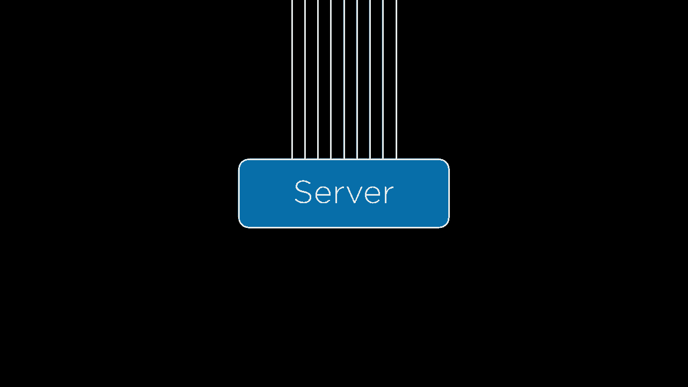
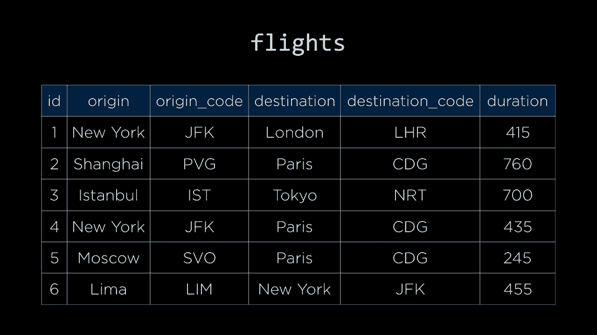

# 哈佛 CS50-WEB ｜ 基于Python ／ JavaScript的Web编程(2020·完整版) - P24：L8- 拓展性与安全 1 (可扩展性，负载均衡，自动伸缩) - ShowMeAI - BV1gL411x7NY

[音乐]，欢迎大家回来，继续学习Python和JavaScript的Web编程。对于我们的最后一个主题，我们将探索可扩展性和安全性。到目前为止，在课堂上我们一直在构建Web应用程序，这些应用程序在我们自己的计算机上运行，但如果我们想把这些。

Web应用程序部署到全世界，让互联网上的人们都可以使用它们，那么我们需要在某种Web服务器上托管我们的Web应用程序，这是一种专用的硬件，能够监听Web请求并用我们想要的响应来回应它们。

Web应用程序需要提供服务，当我们这样做时，这会引入一系列有趣的可扩展性和安全性问题，因此今天我们将讨论这些问题，首先从可扩展性相关的问题开始。这些问题是什么，我们该如何解决它们。

我们通过将Web应用程序部署到Web服务器上来部署它们。我这里用这个矩形代表这个服务器，但服务器只是一些专用计算机，是一块监听传入请求的硬件，因此我们将画一条线来表示来自一个。

服务器接收该请求并做出响应，但最终我们的Web应用程序不仅仅会服务于一个用户，如果它变得受欢迎，可能会有许多用户同时使用它们。

尝试同时连接到该服务器的用户。随着多个用户开始同时连接到该服务器，我们就开始处理可扩展性的问题，一台计算机，一台服务器在任何给定时间只能为有限的用户提供服务，因此我们需要提前考虑如何。

我们将解决这些规模问题，但在此之前，首先的问题是这些服务器实际上存在于何处。如今，这些服务器主要有两种选择。

这些服务可以存在于云中，也可以是本地服务器。本地服务器可以想象成公司在其内部墙内运行自己的Web应用程序，或公司拥有的物理服务器，可能在一些服务器机架上。

这些服务器位于一个房间内，因此它们对所有服务器都有非常直接的控制，确切知道这些服务器是什么类型，正在运行什么软件。他们可以物理上查看服务器并进行调试，如果有需要，以确保解决任何问题。

我们正逐渐进入一个云计算日益普及的世界，我们在云计算中，而不是拥有专用的本地服务器，我们拥有一些在云端的服务器，那里的云计算公司，如亚马逊、谷歌或微软，能够运行。

我们可以使用那些由第三方提供的服务器，比如亚马逊、谷歌或微软等，这里在云计算中存在一些权衡，我们对机器本身的控制不再那么直接，因为它们不在本地，我们无法。

我们在物理上操作那些计算机，但我们有一个优势，那就是不需要担心处理公司内部的物理对象，这些公司是我们想要在云端运行代码的服务器。当它在云端时，一切都由其他公司外部管理，我们可以简单地。

我们需要使用那些服务器，随着我们开始获得更多复杂的网络应用程序，这些应用程序需要更多的用户，这些云计算公司可以让我们创建能够扩展的网络应用程序。

随着用户的增多，我们将跨越多个不同的服务器，但我们将在适当的时候讨论这些规模问题。 

我们需要问的问题是，在我们拥有这些服务器后，无论它们是本地服务器还是在云端运行的服务器，用户可以使用多少，服务器在任何给定时间实际上可以服务多少用户，这将因资源的大小而异。

服务器的计算能力将取决于处理特定用户请求所需的时间，如果用户请求非常复杂，可能意味着在任何给定时间可以服务的用户会更少，因此有一个有用的工具是。

我们需要进行某种基准测试，分析服务器在特定时间可以处理多少用户，有许多不同的工具可以让我们进行这种基准测试，Apache Bench（也称为A/B）是一个流行的工具。

进行这种基准测试是非常有用的，这样我们就知道一个特定的服务器可以处理多少用户，可能它可以处理50个用户，也可能处理100个用户，甚至更多，但最终会有一个有限的上限，每台计算机都有其有限的。

资源和服务器也不例外，会有一些用户的数量，超过这个数量，服务器就无法处理。那么在这种情况下我们该怎么办呢？如果我们的服务器在任何给定时间只能处理100个用户，但有101个用户同时尝试使用我们的网络应用程序。

需要进行一些改变，我们需要处理某种扩展，以确保我们的网络应用程序可以扩展。我们可以尝试几种不同类型的扩展。一种方法是垂直扩展，这可能是想象中最简单的扩展方式，如果这台服务器。

这对于处理我们需要处理的用户数量来说还不够好。我们可以选择垂直扩展，直接使用更大更强大的服务器，这样就能处理更多用户。尽管这会增加成本，但如果我们需要处理更多用户，就得这样做。

更多用户会带来更大的问题，这种方法相对简单，只需将一台服务器替换为另一台可以同时处理更多用户的服务器。但这也有缺点，毕竟物理服务器的大小是有限制的，能够服务的用户数量也会受到限制。

处理的能力受到物理限制，无法获得更大、更快或更强大的服务器，因此当垂直扩展不足时，另一种替代方案就是水平扩展。水平扩展的理念在于，当一台服务器无法满足需求时。

单台服务器无法服务所有可能同时使用网络应用程序的用户，因此我们可以采取另一种方法，而不是仅仅使用一台服务器。我们可以将其拆分为两台不同的服务器，现在我们有两台服务器。

运行这个网络应用程序时，我们有效地将这个应用程序能处理的用户数量翻倍。原本单台服务器只能服务100个用户，现在如果我们有两台服务器，就能同时服务200个用户。如果你想象一下，100个用户在使用A服务器。

例如，这里有100个用户在使用B服务器，但这也引发了一些我们必须回答的其他问题，那就是这些服务器是如何获得用户的。例如，当用户请求一个网页时，用户是如何被引导到A服务器还是B服务器的，似乎他们需要某种决定。

无论是选择一个方向还是另一个方向，这就是我们可能引入另一块硬件的原因，而这块额外的硬件就是我们所称的负载均衡器。负载均衡器只是另一块硬件，它将位于这些服务器的前面。

换句话说，当用户请求一个网页时，而不是立即将请求发送给这些网页服务器中的一台，请求会首先通过负载均衡器。在负载均衡器中，请求首先进入，然后负载均衡器决定是否发送。

将该请求发送到服务器A或发送到服务器B，这个过程可能比实际处理该请求的成本要低。因此，负载均衡器实际上只是充当调度员，它等待请求的到来，当请求到来时，负载均衡器。

将这些请求导向某台服务器或另一台服务器，你可能会想象一个场景，我们有的不止两台服务器，也许有很多台，负载均衡器将平衡所有这些不同的服务器，而决定将请求发送到哪台服务器的过程。

这被称为负载均衡，而负载均衡器最终就是在执行这个操作。你可能会使用各种不同的方法来执行负载均衡，因此可以直观地想象，负载均衡器如何决定在某个请求到来时，是否应该将请求发送给。

到这台路由器或服务器，还是应该将请求发送到其他服务器？我们的负载均衡器可能采取许多不同的方式，这里只是几个随机选择可能是最简单的选项。假设有一个用户出现并试图向我们的web服务器发起请求。

负载均衡器首先查看用户，并随机将他们分配到处理该请求的不同服务器之一。如果有10台不同的服务器，它会在这10台服务器中随机选择一台，决定哪一台将处理该请求，这有一个优点。

这个过程非常简单，计算机可以快速生成随机数，基于这个随机数，计算机可以将用户分派到一台或另一台服务器，但这可能不是最佳选择，因为如果我们运气不好，可能会导致许多。

在一台服务器上的用户比另一台多，或者可能会导致某些服务器完全未被使用，如果刚好我们没有随机选择到那台服务器。在实际情况中，许多用户都在使用这种负载均衡，概率很高，最终所有的。

这些服务器将被使用，但分配可能不是完全均匀的，因此，另一个你可以采取的方法是轮询方法，在这种方法中，第一位用户会被分配到服务器一，接下来的用户则被分配到服务器二。

比如，如果有五台服务器，你可以说第三个用户去服务器三，第四个用户去服务器四，第五个用户去服务器五，然后第六个用户又回到服务器一，基本上是循环选择1到5的服务器，一旦你为每台服务器分配了一个用户，就会回到起点。

这也是一个相对容易实现的事情，因为你可以在负载均衡器中简单地进行计数，记录我最近分配给用户的服务器是什么，下次请求到来时就将其分配给下一个服务器，然后是下一个服务器。

采用循环方式的方法，在这种方法中，你会遍历所有服务器一次，然后再遍历这些服务器。现在，这可能看起来比随机选择更好，因为它更公平地决定是否将任何特定请求分配给任何特定服务器，但它也存在某些缺陷。

问题在于，轮询可能很好，但如果某些请求比其他请求耗时更长，我们可能也会遇到不幸的情况，耗时更长的请求可能会全部转到某一台服务器，而不是其他服务器，因此我们可能还想尝试其他方法，例如。

比如说连接数最少的情况，这种方法是，当用户发出请求时，负载均衡器应该选择当前连接数最少的服务器，即其他用户和请求中与之连接的活动连接数最少的服务器。

通过选择连接数最少的服务器，你可能更好地平衡各种可能在你的网络应用中发生的请求。虽然这可能在某种程度上表现得更好，但仍然存在一些问题。

这里也有权衡，但计算哪个服务器连接数最少可能会更昂贵，而仅仅说随机选择一台服务器或采用轮询方法，即一二三四五，一二三四五，重复进行，这要简单得多。

然而，所有这些方法天真地还有另一个问题，与会话有关。你会记得，我们在想要存储有关用户当前与网络应用互动的信息时使用会话。当你登录一个网站，比如登录你的电子邮件或。

例如进入亚马逊，然后返回到那个网站或访问该网站上的另一个页面，发出另一个请求。例如，情况并非你必须再次登录，而是当我回到我的邮件账户或再次访问亚马逊时，网页浏览器并没有完全忘记你是谁。

第二次访问亚马逊时，我的邮件账户或亚马逊记住了我上次访问的记录，我有某种会话在跟踪谁登录了，也许还有我在页面上所做的事情的信息，并允许我继续与网络应用互动，即使我正在进行。

多次请求，你可以想象这对这种类型的负载均衡可能会造成问题，但如果我有多台不同的服务器，想象一下如果我尝试登录一个网站，第一次请求时我被指向第一台服务器，我现在在第一台服务器上登录，但随后我又发出另一个请求。

我被重新指向负载均衡器，也许这次负载均衡器决定把我发送到第二台服务器，但如果会话存储在第一台服务器上，第一台服务器会记得我是谁以及我在做什么，那么第二台服务器就不知道我是谁，因此也不会记住我。

我已经登录了这个网络应用，结果可能会提示我再次登录，如果我们再发出另一个请求，我可能会进入另一台服务器，这样我可能会再次被注销，并需要第三次登录。因此，当我们的负载均衡发生但我们没有这样做时，问题就出现了。

负载均衡器并不关心用户在访问同一网络应用的某一页面后又访问另一页面的情况，因为我们希望记住用户上次在这里时的信息。那么我们如何解决这个问题呢？我们如何确保在下一次请求时能够记住我上次被发送到哪个服务器，并再次将我发送到那里？

这种在多台不同服务器之间的负载均衡我们是在会话中进行的，而这里有多种不同的会话感知负载均衡的方法，其中一种方法是这种被称为粘性会话的一般理念。其想法是，当我再次回到负载均衡器时，负载均衡器会记住我是谁，不会让我再次登录同一个网站。

例如，如果我登录到一个网站一次，并被指向第二台服务器，那么下次我访问这个网络应用时，即使我应该根据随机选择或最少负载被指向第三或第四台服务器。

在使用这些其他负载均衡方法时，负载均衡器应该记住上次我访问这个网站时被指向了第二台服务器，因此这次负载均衡器将再次把我指向第二台服务器，这样第二台服务器就会再次包含信息。

因此，粘性会话是解决这个问题的一种方式，但与所有这些方法一样，这将是我们在谈论可扩展性和安全性时反复出现的主题。

在这里存在权衡，粘性会话的权衡是，其中一台服务器可能会比另一台承受更多的负载。如果某台服务器恰好有很多用户不断返回该网站并请求额外页面，而其他页面则以会话感知的方式进行处理。

服务器可能有一些用户决定不再回来。例如，因此在利用率上存在差异，我们的一些服务器可能比其他服务器更繁忙，而我们在它们之间的平衡做得不太好。因此，一种方法是将会话存储在。

数据库而不是在服务器内部存储关于会话的信息，这样如果我被指向另一台服务器，那台服务器就不会记得我是谁，也不会记得我与这个网站的互动信息。如果我们选择在。

在特定内部的数据库中，所有服务器都有能力良好地访问该数据库。那么，无论我被指向哪个服务器，以及负载均衡器决定将我发送到哪个服务器都没有关系。因为无论我最终被发送到哪个服务器，session。

数据库中存储信息，每台服务器可以连接到数据库以查找我是谁，找出我是否已登录该网站，进行识别。因此，这可能是一种方法，另一种方法是将会话存储在客户端。我们稍微谈到了这个关于可以存储的cookie的想法。

网页浏览器可以设置一个cookie，以便在下一次向同一网页应用程序发出请求时，您的网页浏览器能够呈现该cookie。在这个cookie中，您可以存储大量信息，包括关于会话的信息，您可能在cookie中存储。

当前登录的用户信息，例如或其他与会话相关的信息，但如果不小心，这里会有缺陷。有人可能会操纵这个cookie，假装成其他身份。因此，出于这个原因，您可能想要进行某种加密或某种形式的签到。

确保您无法伪造一件事，您不是，但另一个关注点是，随着您开始在这些cookie中存储越来越多的信息，这些cookie在每次请求时都会在服务器和客户端之间来回发送，这可能会变得越来越昂贵。

在客户端和服务器之间来回传递，因此有很多可能的方法，没有一种方法在任何情况下都是唯一正确或最佳的，但有一些事情需要注意和思考，因为我们开始处理这些规模问题，以确保我们有。

有多个可供使用的服务器，以防我们需要它，但同时确保在这样做时不破坏用户体验，不会导致用户登录后突然无法登录。因此，水平扩展给我们提供了这种容量。

拥有多台不同的服务器，这些服务器都可以处理用户请求并作出响应，但合理的问题是，我们现在需要多少台服务器。我们可以使用基准测试来尝试估计这一点，如果我们估计有多少用户。

我们可以基准测试并查看在任何给定时间，单台服务器可以处理多少用户，并根据这些信息推断出我们可能需要多少台服务器来服务所有这些不同的用户，但这可能是。

我们的web应用程序并不总是有相同数量的用户，有时用户可能会比其他时候多得多。例如，你可以想象在新闻机构的网站上，例如报纸应用程序，在发生突发新闻或重大事件时，会有更多用户。

在某些时候，试图同时访问网站的人数会比其他时候多得多，因此一种方法可能是考虑最大值，最大用户数量是多少，可能会在任何给定时刻尝试使用我们的web应用程序，并根据此选择服务器数量。

无论用户数量如何，我们都会有足够的服务器来服务所有这些用户，但如果在绝大多数情况下，用户数量要少得多，这可能不是一个经济实惠的选择，在这种情况下，你会有很多闲置的服务器。

在不需要那么多服务器的情况下，你却仍在支付所有这些服务器的电费，这可能不是一个理想的选择。因此，一个相当流行的解决方案，特别是在云计算的世界中，就是自动扩展的概念，或者你可以使用自动扩展器。

可以说，我们从两个服务器开始，但如果网站的流量足够，如果有足够的人向网站发起请求，也许在高峰期，人们正在使用网站，那么可以扩展，添加第三台服务器，负载均衡器可以处理。

在这三台服务器之间进行负载平衡，如果更多的流量进入网站，更多用户试图同时使用此应用程序，那么我们可以继续添加第四台服务器，并且我们可以继续这样做，大多数自动扩展器将允许你进行配置。

例如，最少和最多的服务器数量取决于在任何给定时间使用你的web应用程序的用户数量，自动扩展器可以根据用户的增减来扩展或缩减，添加新服务器，或者在用户减少时移除服务器。

这样可以为扩展问题提供一个不错的解决方案，你不必担心有多少服务器，它会自动完全扩展。不过，这个自动扩展过程可能需要时间，如果大量用户同时访问你的网站。

同时添加所有这些额外服务器需要时间，因此可能会出现一些权衡，可能无法立即服务所有用户，另一个需要考虑的问题是，随着你添加越来越多的这些服务器。

引入多个服务器就带来了失败的机会，但这总比只有一台服务器好。如果那台服务器失败，那么整个web应用就会完全失效，这就是我们通常所说的单点故障，若此处失败，整个系统就会崩溃。

拥有多个服务器的一个优势是，我们不再有一台作为故障点的服务器，如果其中一台服务器宕机，理想情况下，负载均衡器应该能够根据这些信息知道不再向该特定服务器发送请求，而是平衡负载。

在其余三台服务器之间，现在有一个有趣的问题，即负载均衡器如何知道该服务器不再响应，可能因为某种原因发生了错误，无法适当地处理请求，确实存在多种情况。

你可以通过多种方式实现这一点，但最常见的一种是简单称为**心跳**，有效地说，每隔一段时间，负载均衡器就会对所有服务器进行ping操作，快速发送请求到所有服务器，并且所有服务器应该能够响应。

根据这些信息，负载均衡器对每个服务器的延迟有了一定了解，即服务器响应请求所需的时间。此外，它还可以获取有关服务器是否正常工作的信息，如果其中一个服务器未能响应ping，那么。

负载均衡器知道服务器可能出现了问题，因此我们可能根本不应该将更多用户指向该服务器。这样可以通过允许多个服务器来解决单点故障的问题，如果其中任何一个服务器失败，负载均衡器可以重新分配负载。

负载均衡器通过心跳了解情况，然后根据这些信息开始将流量重定向到其他服务器。你可能注意到，即使在这个图中，负载均衡器似乎也是一个单点故障，如果负载均衡器发生故障，那么。

没有什么会正常工作，因为负载均衡器负责将流量引导到所有这些不同的服务器，因此即使没有单个服务器存在故障点，这个负载均衡器也似乎是一个单点故障，这绝对是正确的。

你可以想象，如果有多个负载均衡器，而如果一个负载均衡器宕机，另一个负载均衡器可以迅速介入，充当热备份，接管所有原本指向第一个负载均衡器的流量；如果它宕机，第二个负载均衡器就准备好接替它。

执行这种心跳过程，检查第一个负载均衡器，如果一切正常，第二个负载均衡器就不需要做任何事情，但如果第一个负载均衡器出现故障，那么第二个负载均衡器可以介入并开始处理那些请求，将它们引导到所有这些。

单个服务器也是如此，因此，- 这是一个思考单点故障在哪里的另一个机会，并思考我们如何解决这些单点故障，以确保我们的网络应用程序是可扩展的，这样就能处理关于我们可能如何进行的各种问题。

扩展这些服务器，但最终服务器并不是整个故事，实际上在我们的应用程序中，我们大多在编写与数据以某种方式交互和处理的网络应用程序，我们讨论过的多个不同数据库，其中 SQLite 一直是默认选择。

Django 提供给我们的一个解决方案，它仅将数据存储在文件中，但当我们开始扩展我们的应用程序时，通常会将数据库完全分开，拥有一个单独的数据库服务器在其他地方运行，所有服务器都与之相连。

与那个数据库通信，无论是运行 MySQL 还是 Postgres 或其他数据库系统，以及所有有权访问那个数据库的服务器，因此我们需要考虑的问题是如何扩展这些数据库。

这张图片举个例子，你可以想象一个负载均衡器正在与两个服务器通信，但这两个服务器例如都需要与这个数据库进行通信，而任何服务器在任何给定时间只能处理一定数量的请求和用户，数据库也是如此。

可能只处理一定数量的请求和同时连接，因此我们需要开始考虑如何扩展这些数据库的问题，以能够处理越来越多的用户。现在，一个方法是我们可能会尝试的第一件事被称为。

数据库分区，实际上是将大型数据集拆分成多个不同的部分，我们已经看到了数据库分区的一些示例，例如，当我们谈论 SQL 时，我们查看了一张航班表，每个航班都有。

一个出发城市、出发城市的机场代码、目的城市、目的城市的机场代码以及一些。

表示该航班的持续时间的分钟数，我们决定将所有这些数据存储在一个单一表中可能不是最佳主意，因此我们想要将数据拆分成一种分区类型，我们说，好吧，我们只需有一个表，包含所有的机场。

因此，每个机场在这个机场表中都有自己的行，我们还有另一个仅包含航班的表，它不存储所有这些列，而是将两个机场相互映射，对于任何给定的航班，它有一个来源 ID，意味着哪个对象、哪个行在来源中。

airports 表由航班表示，而机场表的哪一行将代表该航班的目的地，因此我们将一个表有效地拆分成多个表，每个表的列数更少，这可能是我们所称的。

数据库的垂直分区，其中我们不仅仅有单一的大长表，而是将它们拆分成多个列数较少的表，这样可以以更关系化的方式表示数据，这也是我们以前见过的，但除了垂直分区外，我们还可以。

我们还可以进行水平分区，理念是我们将一个表拆分成多个存储同样数据的表，因此相同类型的数据但在不同的表中，我们可能原本有一个航班表。

然后我们将其拆分为国内航班表和国际航班表，这些表仍然具有完全相同的列，它们仍然有目的地列、出发列，它们仍然有持续时间列，例如，但我们现在只是将。

原本在一个表中的数据拆分到两个或更多不同的表中，一个用于所有国内航班，一个用于所有国际航班，其优势在于，如果我们只在寻找一个国内航班，我们无需在整个数据集中搜索。

例如，如果你知道你在找的航班是国内航班，那么搜索国内航班表可能更高效，而不必去搜索国际航班表，因此在选择将一个表拆分成多个表时，我们要聪明一点。

不同的表，这样的效果是我们可以经常提高搜索的效率，我们的操作效率，因为我们处理的是多个较小的表，这些操作可以更快。一个缺点是，随着我们开始将数据分散到多个不同的表中。

如果我们需要将这些数据重新连接在一起，并连接所有国内和国际航班，运行单独的查询，这样就变得更加昂贵，因此在这种情况下，我们需要考虑尝试以这样的方式分离数据，以便通常我们只需要。

在任何给定时间，只处理一个表，因此国内和国际可能是拆分航班表的合理方式，因为我们的大部分时间机场只关心搜索国内航班，如果我们知道我们在寻找某种航班或仅仅是。

如果有不同的人或不同的计算机处理这些不同类型的系统，那么对搜索国际航班的关心就很重要，因此分区数据库有时可以帮助解决规模问题，使搜索大量数据变得更快，并能够。

更清晰地表示数据，但这仍然似乎表示了一个单点故障，因为现在我们有多个服务器都连接到同一个数据库，如果数据库因某种原因失败，那么我们的网络应用将无法。

工作是因为所有这些服务器都连接到同一个**数据库**，因此我们可能会尝试增加更多服务器，以解决单点故障的问题，同时我们也可以尝试数据库复制，而不是。

在我们的网络应用中只需一个单一的数据库，以防潜在的故障，我们可能会将我们的数据库复制成多个不同的数据库，从而降低我们的应用完全失败的可能性，关于数据库我们可以使用几种方法。

两种最常见的复制方法是称为单主复制和多主复制，在单主数据库复制中，我们有多个不同的数据库，但其中一个数据库被认为是主数据库，这就是我们所指的。

主数据库是一个我们可以读取数据的数据库，这意味着可以从表中选择行，同时也可以写入数据，这意味着插入行或更新行或删除这些表中的行，因此在单主复制中，我们有一个单一的数据库可以进行读写操作。

还有其他多个数据库，在这种情况下，有两个其他数据库，我们只能从中读取数据，因此我们可以从这些数据库获取数据，但不能更新、插入或删除这些数据库中的数据。现在我们需要一些机制来确保所有这些数据库保持同步，最终。

这意味着每当数据库发生变化时，所有数据库都会被通知。现在唯一能够改变的是我们的主数据库，这是唯一一个可以写入的数据库，也是唯一允许数据发生变化的数据库。其他数据库是只读的，因此每当这个主数据库更新或发生变化时。

以某种方式，它需要通知其他数据库该更新，因此它会通知其他数据库该更新，现在所有数据库都保持同步，如果你尝试在这些数据库中运行查询以选择和获取一些信息，你会从所有这些数据库中获得相同的结果。

各种不同的数据库，现在单一主数据库的方法有一些缺点，它的缺点是只有其中一个数据库可以进行写入，因此如果有很多用户同时尝试向数据库写入数据，可能会出现一些问题。

这个数据库将承担所有可能尝试更新和更改该数据库的人的负载，它还存在稍小版本的相同问题，即单点故障的问题。对于从数据中读取而言，不再存在单点故障，如果你想要。

从数据中读取时，如果其中一个数据库出现故障，你可以从其他任何数据库读取数据，它们工作得很好，但它确实有一个缺点，如果这个数据库失败，如果我们的主数据库失败，那么我们将不再能够写入数据，如果我们想要更新数据。

数据库这个数据库不再可用，其他数据库也不允许我们进行新的更改，因此我们可以尝试几种方法来解决这个问题。不过一种方法是，不再拥有一个单一的主数据库，也就是一个可以读写的单一数据库。

采用多主数据库的方法，在多主数据库的方法中，我们有多个数据库，所有数据库都可以进行读写，我们可以从所有数据库中选择行，也可以向所有这些数据库插入、更新和删除行，但现在同步过程变得有些复杂。

这是权衡，现在我们通过拥有多个可以读取和写入数据的数据库，复制了可以进行的读取和写入的数量，但每当这些数据库中的任何一个发生变化时，每个数据库都需要通知其他所有数据库这些更新，这肯定会。

需要花费一定时间，它为我们的系统引入了一些复杂性。同时，它也引入了可能的冲突，想象一下，如果两个人同时编辑相似的数据，可能会遇到多种不同类型的冲突。

冲突的一个例子是更新冲突，如果我在一个数据库中尝试编辑一行，而另一个人在另一个数据库中也尝试编辑同一行。当它们通过此更新过程进行同步时，我们的数据库系统需要某种方式来决定如何解决这些不同的冲突。

另一个冲突可能是唯一性冲突，我们在设计数据库表时看到的情况。我可以指定这个特定字段应该是一个唯一字段，常见的例子是ID字段，其中每一行都会有自己的唯一ID。

如果两个人同时尝试将数据插入到两个不同的数据库中会发生什么？他们各自会被分配一个唯一的ID，但在两个数据库中ID是相同的，因为没有一个数据库知道另一个数据库已经添加了新行。因此，当它们重新同步时，我们可能会遇到唯一性冲突。

两个不同的数据库为多个不同的条目分配了完全相同的ID，因此我们需要某种方式来解决这些冲突。此外，还有许多其他冲突，比如删除冲突，一个人尝试删除数据时。

如果一个人删除一行，另一个人尝试更新那一行，那么哪个应该优先？我们应该更新行，还是删除行？我们需要某种方式来做出这些决策，因为在对数据库进行更改和该数据库能够进行通信之间存在一些延迟。

随着我们开始处理与越来越多此类数据交互的程序，这些规模问题和同步问题总是会出现。因此，我们需要设计越来越复杂的系统，能够应对这些情况。

现在处理这些规模的问题，最终我们理想的目标是减少不同的数据库服务器数量，因为每增加一个数据库服务器都会消耗时间、资源和资金来维持所有这些服务器的运行，因此理想情况下。

如果不需要与这个数据库进行交互，我们希望不必与其通信。你可以想象，例如新闻组织的网站，类似于《纽约时报》的首页。如果你访问《纽约时报》网站的主页，它会显示当天的所有头条新闻及其图片。

有关每个故事的具体信息，例如，你可能会想象，他们的做法是，他们有某种数据库，存储所有这些新闻文章，当你访问《纽约时报》的首页时，它会进行某种。

数据库查询，选择所有最近的头条新闻，并将所有这些信息呈现在你可以看到的HTML页面上，这当然可行，但如果很多人同时请求首页，那可能。

每次网络应用都在进行数据库查询以获取最新文章并将这些信息展示给所有用户，这样做似乎没有太大意义，因为。
