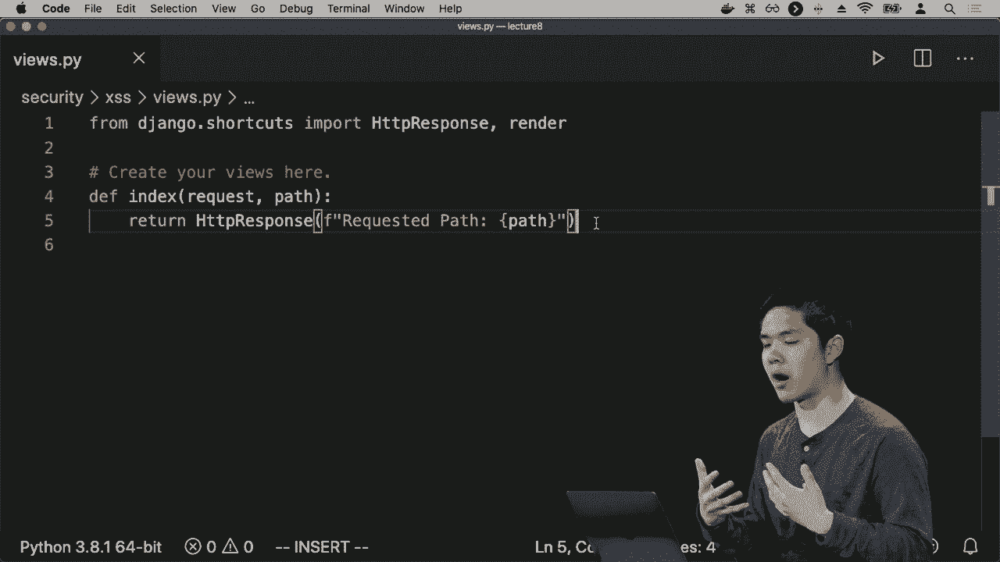

# 哈佛 CS50-WEB ｜ 基于Python ／ JavaScript的Web编程(2020·完整版) - P26：L8- 拓展性与安全 3 (数据库，JS) - ShowMeAI - BV1gL411x7NY

举个例子，用户和密码的相关信息可以用一个这样的表来表示：每个用户都有一个ID，一个用户名和一个密码，但这被证明是非常不安全的存储方式。

将密码存储为所谓的明文，字面上就是将密码存储在数据库中，这种做法在实践中应当避免，因为存在安全漏洞，如果有人未经授权获取。

如果他们访问这个数据库，就能够看到所有用户的密码，所以如果这个数据库因为某种原因泄露，所有这些密码将会被公开，这种情况确实会发生，如果公司不小心处理用户名和密码。

在他们的数据库中，如果发生某种数据库泄露，突然会有一大堆密码可能会被泄露。因此，推荐的方法是存储密码的哈希版本，而不是实际的密码。

哈希函数在这个上下文中是一个将密码作为输入并输出某个哈希、一系列字符和数字的函数，这个哈希代表特定的密码。

是因为它是一个单向哈希函数，从密码可以得到一系列字母和数字，但要反向推导原密码是非常非常困难的。因此，这意味着公司实际上不会知道任何密码的真实内容。

对于特定用户的密码，当用户尝试登录时，我们会取他们的密码并进行哈希处理，然后将这个哈希与我们在数据库中存储的哈希进行比较，如果哈希匹配，那么这意味着用户可能正确输入了他们的密码。

我们可以让用户登录，反之则意味着用户没有正确输入密码，因此这就是为什么公司如果遵循这些最佳实践，通常无法告诉你你的密码是什么。如果你忘记了密码。

公司会让你重置密码，他们可以更新表中的数据，但公司无法告诉你你的密码实际上是什么，因为公司并不知道你的密码，只知道某个哈希版本。

一个哈希函数的存在使得他们能够知道你是否成功登录，使用的是正确的凭证，而实际上并不知道你的密码是什么。因此，如果不小心存储这些数据，这将是另一个需要注意的领域。

如果你的程序内部存在安全漏洞，无论数据在哪里泄露，密码都会突然变得可知，并且还有其他更微妙的方式，网络应用可能会泄露信息，而你作为网页开发者需要决定是否能接受。

比如说，如果你有一个可以让你重置密码的地方，你可以想象如果你输入你的电子邮件地址并点击重置密码，可能会发送给你一个链接。

你可能会收到一条消息，比如“好的，密码重置邮件已发送”，但你也可能想象输入一个电子邮件地址后收到“没有该电子邮件地址的用户”之类的错误消息，这同样是一个潜在的安全漏洞，泄露了信息。

如果你忘记密码，发送给你一封电子邮件现在泄露了关于哪些用户在你的网站上拥有账户的信息，以及哪些用户没有，因为任何人只需输入一个电子邮件地址，看看是否会导致错误，以了解某用户是否存在。

不论你是否在网站上拥有账户，如果你不在意保护这些信息，那么这可能不是大问题，但如果你在乎确保某人是否有账户，或者没有账户，这些信息应该保持私密和安全，只对用户开放。

除非他们想分享，否则这种类型的页面和数据库接口可能会泄露这类信息，信息可以通过各种不同的方式泄露，甚至仅仅基于数据库响应所需的时间。

假设你发出一个特定请求，你可能会想象，如果你针对一个用户发出请求并且响应时间较长，这可能会告诉你需要运行的数据库查询数量或关于该用户存储的信息量，而如果请求时间较短则不会如此。

类似于一个网络服务器响应请求所需的毫秒数，可以揭示或泄露关于存储在数据库中的数据的信息，已经有研究者尝试仅通过观察这些信息获取相关数据的例子。

信息看似不会泄露，但实际上可能会揭示信息。处理 SQL 和数据库时，另一个关注点是 SQL 注入的背景，这种威胁在于如果你不小心运行 SQL 代码。

可能不小心执行你不希望执行的代码。就像在用户名和密码字段的情况一样，我们以前见过这个例子，或者如果用户尝试登录，你可以想象这样的查询正在运行，从用户表中选择，用户名等于用户输入的内容。

当用户名和密码等于用户输入的密码时，我们看到，对于普通用户，输入如 Harry 和一二三四五作为用户名和密码的查询可以正常工作。但如果黑客尝试登录网站，可能会包含一个。

例如，双引号和两个连字符，其中两个连字符表示 SQL 中的注释。如果我们将这些值字面替换到 SQL 查询中，你可能会不小心替换成黑客————，创建一个注释，从而有效忽略查询的其余部分。

我们可能希望我们的 Web 应用程序进行的密码检查类型。因此，这是一种在处理数据库中执行 SQL 代码时可能出现的另一种脆弱性。为了解决这个问题，我们要确保对这些潜在危险的内容进行转义。

在我们的 SQL 查询和 Django 的模型中，可能会出现这些字符。当我们使用 Django 进行这些查询时，比如使用 `dot objects dot filter` 来过滤特定版本的模型时，它将处理确保的过程。

这不会受到这类 SQL 注入攻击的影响，但如果你正在编写一个直接执行 SQL 代码的 Web 应用程序，你可能会想象到这一点。在这方面，你需要小心，以确保你的应用程序不易受到这些威胁的影响。

当我们讨论服务器上发生的事情时，潜在威胁就会出现。但我们也可以考虑与其他服务器交互时可能发生的情况，比如与 API 的交互。因此，我们讨论了 JavaScript，以及如何使用 JavaScript。

对于 API 或其他能够返回特定类型信息的服务的额外请求，存在一些潜在的威胁。

我们可以在 API 中使用的一些技术可以使它们更具可扩展性和安全性。其中一种是速率限制的概念，我们可能希望确保没有用户能够在特定时间内向 API 发送超过一定数量的请求。

响应与系统的可扩展性相关的安全威胁。这被称为拒绝服务攻击，如果您。多次向单个服务器发出大量请求，您可能会潜在地关闭。该系统，因为您发出如此多的请求。

许多请求，它无法同时处理这么多请求，出于这个原因，因为。发出API请求是如此简单，您可以仅使用一行。像Python或JavaScript等语言。例如，api通常会实施某种速率限制，以限制数量。

要求您可以提出，以便您不会压倒服务器或。压倒需要被查询的数据库，以回应这些。请求，因此这种限制可能有效，api也可能希望。添加某种路由身份验证，您可能不希望每个人都能访问。

通过API访问相同的数据，也许有某种权限模型，只有。特定用户能够访问API中的特定。数据，因此您可能想象用户需要一个API。密钥，例如有效地像一个。密码，他们需要在每次发出API请求时传递。

您的API，这样您就可以查看该密钥并验证。它们是否如其所称。现在，随着API密钥的存在，还有其他潜在的。安全漏洞需要注意，其一是您绝对不应该。将密码放入您的源代码中，包括您的git。

例如，您通常也不应将API。密钥放入您的Web应用程序中，作为。那些Web应用程序的源代码，因为这样任何拥有。Web应用程序源代码访问权限的人都可以看到您的API。密钥，可能会使用API密钥来。

假装是您，因此访问潜在的API路由，这些路由您。无法访问。一个常见的解决方案是使用所谓的环境变量，实际上您和您的程序声明。您的API密钥不会是某个预定义的字符串，而是。

您程序中的文本，而是从环境中提取。在程序运行的环境中，您在服务器上运行。Web应用程序时，首先确保服务器已正确设置所有。环境变量，以便而不是拥有API密钥。

实际上在程序的源代码中，API密钥只是存储在。运行Web应用程序的服务器环境中，服务器。可以从环境中提取该信息，以便它知道。API密钥应该是什么，而不需要API。密钥实际出现在。

网页应用的源代码本身，当我们开始处理API时，你可能会注意到许多API会要求你拥有一个API密钥，这通常是为了确保我们能够有效地验证用户，并限制用户的请求。

确保他们在任何特定时间没有向服务器或数据库发送过多请求，但这开始引出其他潜在的漏洞，尤其是与JavaScript相关的漏洞。JavaScript是一种编程语言，用于编写运行在我们网页浏览器中的代码。

代码在我们的网页浏览器内运行，比如Chrome或Safari，因此，JavaScript具有强大的能力来操作页面上的内容，它可以模拟按钮点击，可以改变页面上内容的显示，因此。

处理JavaScript时会出现许多漏洞，其中一个漏洞是跨站脚本的概念，通常在你的网页应用中，你只希望JavaScript在你自己编写时运行。跨站脚本是一个潜在的威胁，其他人可能会在你的网页上运行JavaScript代码，而这段代码不是你自己写的。

这是一个潜在的漏洞，因为如果其他人可以编写JavaScript代码，他们就可以操控你网页上发生的内容，故意造成改变。

操作用户体验以获得实际上并不期望的结果，所以我们来看看一个跨站脚本的例子。好吧，我提前准备了一个网页应用，它叫做`security`，里面有一个名为`XS`的单一Django应用，用于跨站脚本。

我们首先查看URL，只有一个URL允许我们提供任何路径，然后它将加载索引视图，在索引视图中，我们将展示一个HTTP响应，表明刚才请求的路径是什么，所以你可以想象这是一个简化的示例。

你在其他网站上可能看到的内容版本，例如，网站可能在特定页面上显示你正在访问的路径，以指示如何到达该页面的一些标识。

在这个网页应用中，我将进入`security`并运行服务器Python。

我已经运行了服务器，现在我将进入我的网页应用，例如`/hello`，我看到的是请求路径`hello`，这正是我所期望的，我可以把它改成其他的，比如`hi`，所以请求路径现在是`hi`。

- 例如，无论我访问哪个页面，它都会给我一个显示请求路径的页面，然后是我正在访问的路径，但注意当我尝试访问这个 URL 时会发生什么，我将访问 URL /script alert hi 然后 end script，所以我执行它，结果突然在我的页面上出现一个显示 hi 的警告。

然后按确定，系统显示我。

请求的路径那个警告是一个 JavaScript 警告，它是在我的网络应用程序上运行的 JavaScript 代码，但并不是我应用程序内部的代码，而是基于 URL 运行的特定 JavaScript 代码，是其他人写的，所以有人链接到了我的网页。

应用程序并在 URL 中作为部分传递这个脚本标签，点击该链接的人可能会被带到我的网络应用程序，但最终运行了由其他人创建的 JavaScript，这最终是潜在危险的，它留下了其他人可以在我的网页上运行 JavaScript 代码的可能性。

页面可能不仅仅是你想象中的某个脚本，不只是显示一个警告，而是修改 DOM 内部的内容，改变网页的内容，进行 API 请求，执行其他你可以用 JavaScript 在网页浏览器中完成的任务，这最终。

让我页面面临潜在的安全漏洞，这些都是在设计这些页面时需要谨慎考虑的情况。如果有可能有人能以某种方式将自己的 JavaScript 注入到你的页面中，你需要检测到这一点或以某种方式转义它。

采取其他预防措施，确保这种跨站脚本攻击不会发生。你可以想象，在一个消息应用程序中，如果你互相发送消息，你不希望当你向其他人发送一些 JavaScript 代码时，接收者会执行它。

这段代码实际上作为某个 JavaScript 在你想要的特定页面上运行，你需要确保转义这些信息，以便他们只看到 JavaScript 代码的文本，但代码并不会真正执行，这与 SQL 注入的威胁类似，一切又回到了。

不希望允许其他人将自己的代码注入到你的程序中，你不希望其他人能够将 SQL 代码注入到你在数据库上运行的查询中，也不希望有人能够将 JavaScript 代码注入到你的网页中，因为这留下了。

潜在的安全漏洞，其中一种安全漏洞 Django 在防御上相当有效，这种情况我们之前见过，但我们会更详细地探讨它，跨站请求伪造，在你并不打算向网站发起请求时伪造一个请求。

您可以想象，如果您的银行有一个允许您从一个人转账到另一个人的网址。我们稍微讨论过这个想法，但想象一下如果这真的是一个可以访问的URL，比如/transfer，并说作为获取。

参数我正在将钱转给谁，以及我转账的金额。那么其他网站上的某个人可以在其页面的主体中有一个链接，链接文本为“点击这里”，并链接到您的银行，或者无论您的银行是什么，像是给我转账。

金额，如果某个用户在不知情的情况下点击了那个链接，而不知道它将带他们去哪里，这个网站可能能够伪造对银行的请求，让它看起来像用户已经访问了银行并尝试启动某种转账，最终尝试转账，而这甚至没有。

不一定需要在链接中，您可能想象一下，虽然将其放在图像中可能有些奇怪，图像源是这个特定URL，银行的转账页面现在看起来似乎没有任何意义。

转账页面不是图像，但这没关系，所有图像标签将尝试请求这个源URL以获取该图像，然后尝试在用户的网络浏览器中显示它，但第一部分是重要的，事实是这个源最终被浏览器请求。

用户无需点击或做任何事情即可请求。来自您银行的快速转账，这个特定请求可能会发起某种银行转账，用户甚至没有意识到。这就是我们通常建议的原因，任何时候您重建一个网站时。

将允许某种状态的操作，以便发生一些变化，比如转账。您不希望通过GET请求来实现此操作，您可以通过加载图像或点击一个链接来实现，您不希望那样。

这样就很容易让其他人伪造请求，只需创建一个图像或以某种方式链接到一个网站，如从一个用户转账到另一个用户。因此，解决方案如我们所讨论的，通常我们只希望POST请求能操作某些内容。

数据库能够实际从一个用户发起转账到另一个用户。但即便如此，这也不是完全安全的，您仍可能被欺骗提交一个POST请求，想象一下一个对抗性的网站，具有这样的表单，表单的操作是您的银行comm/transfer。

方法是 POST，这里有两个输入字段，其类型为隐藏，意味着当用户查看页面时，实际上看不到这些输入字段，只有在检查这个特定 HTML 页面源代码时，才会知道这里有一个名为 - 的隐藏输入。

我想转移资金给的人，这里是我想转移的金额，用户将看到的只是一个写着“点击这里”的按钮，他们不会看到任何输入字段，因为它们是隐藏的按钮。好吧，突然间，他们将会向银行提交一个 POST 请求。

当他们没有意图时启动了一些转移，可能这看起来没什么大不了，因为用户仍然需要点击一个按钮，而用户不应该在不知道按钮将会做什么的情况下点击按钮。首先，合理的想法是。

对手可能会将这个按钮嵌入到一个看起来非常安全的页面中，以便能够点击按钮，但更重要的是，用户甚至不需要点击它就能提交表单，我们只需添加一点 JavaScript，你可以想象一个对手可能会这样做。

为页面的 body 添加一个 onload 属性，表示当页面的 body 加载完成时，转到文档表单，意味着这个网页的所有表单获取第一个并提交它，提交表单，这将会导致即使用户什么都不做，甚至不点击，也会提交请求。

在这个页面加载后，按钮一出现，这个表单就会提交。提交一个 POST 请求到银行，并尝试将资金从一个用户转移到另一个用户，这就是我们可能称之为跨站请求伪造的情况，其中某个对立网站伪造了对我们网站的请求。

理想情况下，我们不希望这种情况发生，那么我们是如何防范的呢？好吧，Django 允许我们做的一种非常常见的方法是添加一个 CSRF 令牌，跨站请求伪造令牌，该令牌将在每个会话中重新生成，只有在该令牌存在时，转移才会被执行。

能够通过，因此在我们的网站上，我们可以在这个 HTML 表单中包含 CSRF 令牌，因此确保只有在 CSRF 令牌存在时才能转移资金，但如果其他网站尝试伪造请求，他们不知道 CSRF 令牌应该是什么，因为它会变化。

每个会话，因此他们实际上无法伪造从一个用户到另一个用户的请求。所以在我们使用的各种不同工具和技术中，我们用 Python、HTTP、Django、HTML 来创建这些网络应用，使用 JavaScript 和 API，因此我们可能会进行交互。

安全性考虑贯穿始终，我们这里只触及了其中几个，但这显示了在考虑网络编程实践时，关注你将要添加到网页应用中的内容以及你的网页应用的功能是多么重要。

支持思考潜在的脆弱性，以及有人可能如何利用你的网页应用做一些他们可能不应该做的事情。当你将网页应用从仅在你本地计算机上运行的应用转变为可公开访问的应用时。

这些正在某些网络服务器上运行的应用程序，许多人开始使用。这些都是开始询问的类型问题：你如何确保你的网页应用是可扩展的？你如何确保你的网页应用是安全的？所以，现在我们已经探讨了很多网页编程，接下来会是什么呢？

在本课程中，我们探讨了多种不同的工具、技术和语言，但还有许多其他的网页框架和构建网页应用的方法。我们大部分时间都在研究用Python编写的Django网页框架，但你也可以使用其他编程语言来构建网页应用。

例如，Express.js是一个非常流行的JavaScript框架，用于构建网页应用，而Ruby on Rails是一个流行的服务器端网页框架，使用Ruby构建，还有许多其他框架，以及主要与JavaScript一起使用的客户端框架，以构建用户界面。

我们已经看到了如何使用React构建动态和交互式用户界面，其他一些流行的客户端框架包括AngularJS和Vue.js，以及其他一些框架。一旦你使用任何这些服务器端框架和客户端框架构建了这些网页应用。

框架方面，你可能会想要将这些应用部署到网络上，为此，我们可以通过多种方式来实现，也包括像亚马逊网络服务（Amazon Web Services）、谷歌云（Google Cloud）和微软Azure等多种不同的服务。

这些网页应用程序使用Heroku，这是一个利用AWS的服务，试图简化部署网页应用的过程。如果你的网页应用仅仅是静态的，只有HTML、CSS和JavaScript，那么你可以使用像GitHub Pages这样的服务。

在GitHub的Zone服务器上可以免费托管网页应用，还有许多其他方式可以想象部署网页应用，使用不同的服务来处理你已经构建或可能构建的网页应用。

未来并将其在互联网上提供给其他人使用。回顾我们探索的网页编程各种主题，我们看到许多工具和技术可以利用，以构建有趣的网络应用程序。我们开始时简单入手。

更深入地了解HTML和CSS，探讨我们如何利用它来描述页面的结构，然后利用像Sass这样的工具，生成更复杂的CSS样式。仅用CSS实现这一点会更加困难。

构建更大型的网页应用，我们查看了可以使用的Git版本控制工具，以确保跟踪我们对代码所做的版本和更改，允许多个人同时协作在一个项目中。然后我们研究了Python，关注不同的方面。

语言提供的功能、条件和循环，正如我们在许多其他编程语言中看到的，还有面向对象编程，能够表示对象、方法以及作用于特定对象的函数，这一点非常重要。

特别是在处理数据的上下文中，Django是一个用Python编写的网页框架的例子，使我们能够快速启动一个能够监听请求并作出响应的网页应用。Django内置了许多功能，确实使得开发更加便捷。

轻松开始构建网页应用，尤其是便于编写处理数据的网页应用。Django让我们能够构建与SQL交互的模型，而无需编写任何SQL代码，Django可以为我们生成SQL。

使用这些模型和迁移，允许我们不断应用对数据库的更改。随着我们添加新表以及添加和修改现有字段，Django可以处理所有这些。正如你所记得的，我们将注意力转向了主要的第二个。

编程语言的过程中，JavaScript有很多用途，非常流行，但我们主要在客户端使用，以构建有趣的用户界面，利用JavaScript操控DOM结构，改变用户看到的内容。

还可以添加事件处理，以便当用户点击按钮、鼠标悬停或以某种方式与页面互动时，我们的代码能够响应。我们看到了React，这是一个客户端框架，使用JavaScript来帮助我们。

创建非常有趣和互动的用户界面，所需代码并不多，而在最后几节课中，我们也在探讨一些最佳实践，如何设计测试来测试服务器和客户端，以确保我们的代码正常工作。

以及一些行业实践，如持续集成和持续交付，这有助于确保我们在对代码进行更改时，能够快速有效地部署和交付，并确保我们能够对代码库进行增量更改，而不是。

需要等待更长的发布周期，然后今天我们终于讨论了可扩展性和安全性的问题，特别是在我们开始将应用程序移至网络时，我们希望确保这些应用程序是可扩展的，能够处理多个。

不同的用户，并确保它们是安全的，我们不想让自己暴露于潜在的漏洞中，比如有人可能会将SQL注入或JavaScript代码注入到我们的页面中，或试图访问一些他们无权访问的数据，我们希望确保当。

在设计这些网络应用时，我们能够以可扩展且最终安全的方式进行设计，因此希望你喜欢这次对Python和JavaScript网络编程世界的探索，祝你在使用这些工具构建网络程序时好运。

今天我们在这里看到的，以及其他一些工具，它们受到启发或使用了与我们最终在这里讨论的内容相似的工具、技术和想法，特别感谢课程教学人员和制作团队，使整个课程成为可能，我期待看到。

你可能创建的网络应用。
