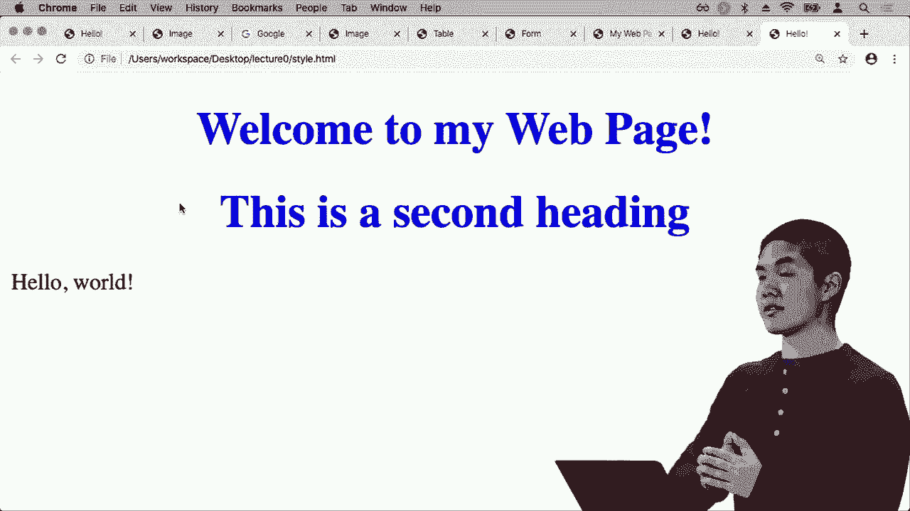

# 哈佛 CS50-WEB ｜ 基于 Python ／ JavaScript 的 Web 编程（2020·完整版） - P3：L0- HTML 与 CSS 语法 2 (CSS 语法) - ShowMeAI - BV1gL411x7NY

目前为止，所有的网页都相对简单。我们只是描述了页面的结构，并说明我们希望在这里列出、在那形成的内容。我们可能真的希望有某种方式来指定我们希望以某种方式对网页进行样式设置。

希望添加颜色，添加间距，还希望为我们的页面添加其他布局。为此，我们将使用一种称为 CSS 的第二种语言，它是级联样式表的缩写，特别是我们将使用最新版本。

CSS 3 让我们能够将 HTML 页面告诉网页浏览器，我们希望它以何种方式进行样式处理，而不仅仅是在白色背景上显示黑色文本。我们可以开始指定特定的 CSS 属性，以便确保页面的外观。

使其看起来符合我们的期望，因此让我们现在看一个简单的例子，将一些 CSS 代码添加到我们的页面。我将创建一个新文件，命名为 style.dot HTML，以演示一些为页面添加样式的基本想法，并将之前的 hello 代码复制到其中。

也许除了 hello world 之外，我还希望在 h1 中显示一个大标题。！

顶部显示例如“欢迎来到我的网页”。所以现在如果我打开 style.dot HTML，这就是我看到的：顶部有一个大标题，上面写着“欢迎来到我的网页”，下面是“hello world”文本。现在想象一下，我想为页面顶部的标题添加一些样式。

也许我希望它不再是左对齐的。！

我希望它居中，也许除了黑色文本，我想改变颜色。为此，正如我们过去使用属性来向特定 HTML 页面添加额外信息一样，我们可以用非常类似的方法使用 CSS。我们可以指定要给这个 h1 元素。

有一个样式属性，它将等于，然后用引号括起来。我们将提供所有希望添加到特定元素的 CSS 属性。CSS 样式的工作方式是，我们可以为元素赋予各自的 CSS 属性，其中属性就像颜色一样。

元素的样式或元素的对齐方式，每个属性都有一个默认值，但我们可以将其值更改为其他值。例如，如果我想改变这个标题的颜色，使其从黑色标题变为蓝色标题，我可以说，我希望这个 h1。

给它一个颜色属性，然后赋值，我说颜色为 Cohen，然后我想给它的值，所以颜色：蓝色，例如后面跟一个分号，将把这个 h1 元素的颜色改变为蓝色，而我的文本编辑器自动给我显示一个小方块。

这让我看到这个蓝色的实际效果，这不是文本的一部分，只是我的文本编辑器在帮忙，让我可以看到。

在我写这段代码之前，就可以知道颜色实际会是什么样子的。

所以现在如果我打开 style.html，这里是我看到的，顶部不再是黑色的标题，我们将颜色改为蓝色，还有许多其他内置的颜色。

存在于 HTML 中的，可以用来将颜色改变为任何颜色。

如果我说我想要颜色为红色，例如，我可以刷新页面，现在标题是红色，还有许多其他颜色，我可以把颜色改为像春天绿色这样的颜色，这将显示出这种特定的绿色阴影。

我可以为单个元素添加各种不同的样式属性，我可以说拿这个标题，改变它的样式，使颜色不再是黑色，而是显示为蓝色，如果我想为同一个 HTML 元素添加多个 CSS 属性，我也可以做到这一点。

在样式属性中，我可以说，除了颜色是蓝色外，我还想给这个元素一个第二个 CSS 属性，我想说文本对齐属性应该是居中，例如，文本对齐属性控制如你所想象的那样，特定 HTML 元素的。

文本对齐是完全在左边，完全在右边，还是居中的，如果我将文本对齐属性更改为具有某个值。

中心对齐，好的，现在当我刷新这个页面时，我看到“欢迎来到我的网页”现在是蓝色并且居中，我已改变了这个特定元素的颜色和对齐方式。

HTML 元素不仅可以直接样式化，它们还可以从父元素获取样式信息，因此如果你再次回忆 DOM 结构，我们有一个 HTML 元素，其中包含这个 body 元素，而 body 元素内部是这个 h1 元素以及这个文本，你可以想象。

我们希望这个样式不仅适用于这个标题，还要适用于“你好，世界”文本。我可以移动样式信息，将这个样式属性从h1移动到正文，如果我把样式移到正文中，那么正文内部的所有内容都会以这种方式进行样式化。

现在让我们来看一个例子，看看这如何运作。如果我将样式信息移动，而不是将其与h1关联。

如果我将其与正文关联，那么当我刷新页面时，我会看到正文的两个部分，即顶部的大标题“欢迎来到我的网页”和文本“你好，世界”，都应用了这些CSS属性。我已将它们的颜色更改为蓝色。

还将它们的文本对齐方式更改为居中，而不是左对齐，但如果我希望它只是那个标题，我可以将其移出，并说我只想将样式应用于那个单独的标题。我们可能想象，随着时间的推移，这可能会变成一个问题。

想象一下，如果我有多个标题，我想用相同的方式进行样式化，例如，假设我有一个第二个标题，这是第二个标题。

但我也想让它们的样式变成蓝色并居中。我可以刷新这个页面，现在可以看到这并不是。

我不想让整个页面都变成蓝色并居中，我只想让这些Q标题变成蓝色并居中，所以我可以从h1中提取样式代码，并将其应用于这个h1，这样我的两个h1都可以。

这些元素现在具有完全相同的样式代码，我将继续刷新，现在我们看到这是预期的行为，我有两个标题，它们都是居中的。

蓝色，但我们想要开始思考的是，当我们开始构建网页应用程序，尤其是当我们的网页应用程序变得更复杂时，设计我们如何构建网页和网页应用程序的方式，特别是在任何时候。

我们发现自己从一个地方复制大量相同的信息，这可能不是最佳设计，因此你应该开始考虑如何可以更好地设计，虽然这里有一些冗余，可能并不需要。

这也使得页面变得更难以更改和更新，如果我想把这两个标题的颜色改为红色而不是蓝色，那么我突然需要在两个地方更改我的代码，我需要更改上面这个标题的样式属性。

我还需要更改第二个标题的样式属性，我想要做的是能够只编写一次样式代码，然后将其应用于这两个标题，实际上有一种方法可以做到这一点，我们可以做的是，而不是进行所谓的内联样式。

如果我们将CSS代码直接作为HTML元素的属性放置，我们可以将样式代码移动到网页的完全不同部分。请再次回忆，我们的HTML页面顶部有这个head部分，只包含关于网页的有用信息，但并不是。

实际上，网页的主体部分是用户看到的内容，而头部部分是一个很好的地方，我们可以开始放置一些样式信息，关于我们希望这个网页如何被样式化，所以我可以在这里做的是，而不是将这些样式属性直接放在行内。

在我网页的head部分，我可以添加一个样式元素，在打开的样式标签和关闭的样式标签之间，我可以添加我想要的任何样式信息，这里是语法的样子，我首先需要指定我要样式化的元素类型。

我想要样式化所有的H1，所以我可以。

只需说h1，然后所有的样式代码将放在一对大括号内，在这里我可以说我希望颜色为蓝色，文本对齐属性为居中，所以现在我所做的是，我已经将以前位于页面主体内的CSS代码拿出来了。

实际上，作为这些h1元素的一个属性，我已将样式相关代码移动到页面的不同部分，现在样式信息位于页面的头部的样式元素内部，指明了每个h1元素的样式。

在这里的打开和关闭大括号之间，我已经指定每个h1应该有蓝色，并且每个h1的文本对齐属性应该是居中，这将应用于我的网页中所有h1元素，优势一是我们。

刚才提到的，我不需要在这两个h1元素中重复相同的代码，我可以一次性编写，并指定将这种样式应用于页面上显示的所有H1，优势二是我们能够将样式代码抽取到其他地方，以便稍微简化。

更干净一点，因此与其有一行非常长的代码，你可以想象，如果我们不仅有两个，而是五个、六个或七个不同的CSS属性，那将在一行中占用大量空间，我可以以更可读和更有组织的方式将样式相关代码移动到样式元素中。

在页面的开头这样做是为了使其更易于阅读，更容易理解视觉效果，并且为了清理网页的主体。这将是本课程中反复出现的另一个关键主题，即将事物分开，使得每个部分。

每个部分可以相对独立。网页主体的结构与样式是分开的，当我们开始尝试良好地设计网络应用程序时，这种理念会反复出现。所以现在，如果我取这个完全相同的页面并刷新style.html。

我们会看到完全相同的效果，两个标题都居中显示，且都显示为蓝色，但现在我们有了只写样式代码一次的优势。

不需要以相同的方式多次编写完全相同的样式代码，但事实证明我们甚至可以做到更好。因为你可能会想象，如果我有一个具有多个不同网页的网络应用程序或网站，那它很可能会。

每个网页可能需要以类似的方式进行样式设置，如果我在一个网页的顶部有一个大横幅，那么在与该网页相关的其他页面上，我可能希望使用类似的样式信息以相同的方式对其进行样式设置。而现在我们的CSS代码是特定于某个页面的。

如果我想将相同的样式应用到另一个页面，就不容易。我需要复制完全相同的CSS代码并将其放入另一个页面，但这样我们又会遇到重复的问题，即我不得不在多个不同页面上重复自己，放入完全相同的。

在所有不同页面中共享CSS代码，因此我们可以进行改进，我们能做的改进是将这些CSS代码移动到一个完全不同的文件中，因此不再将样式代码放在这个HTML页面的样式元素内，而是创建一个新文件。

调用styles.css，其中包含我关心的所有CSS。我想改变每个h1的颜色为蓝色，现在我想将其文本对齐属性更改为居中，现在在我的HTML页面中，我不再需要包含任何CSS，而是完全不需要这个样式元素。

我可以将我的CSS代码链接到这个特定的HTML页面中的styles.css文件。我该如何链接styles.css文件呢？我可以在网页的头部部分使用链接标签来实现，在那里我可以说我希望这个链接的关系是，它将是一个样式表，意味着我即将。

链接将成为这个页面的样式表，它将描述我希望这个页面上的元素如何呈现。

样式文件，然后就像链接到另一个页面的情况一样，我使用 href 指定一个超链接引用，我想要链接到的内容，现在我要使用 href 属性指定我想链接的 CSS 文件，在这种情况下，我将链接的 CSS 文件是 Styles.dot CSS。

恰好包含了我想应用于这个特定文件的所有 CSS，现在如果我刷新页面，我再次看到最后两个修订没有任何变化，页面依然保持与之前完全相同的样子。

用户关心的是，他们仍然看到两个标题，它们都居中且都是蓝色的，但现在的好处是，我的 HTML 比之前更简洁，特别是这个 HTML 文件中没有任何嵌入的 CSS，所有样式都被提取到这个单独的 styles CSS 文件中。

现在如果我有多个 HTML 文件，它们都使用相同的样式，我可以将它们全部链接到同一个 Styles.dot CSS 文件，这样它们都使用相同的样式信息，我无需重复自己，如果我需要对所有页面进行更改，我只需更改一次样式。

CSS 文件的样式，然后所有链接到该样式表的网页也将更新，以反映这些更改，因此再次，我们能够将一些样式信息提取到一个单独的文件中，以便让我们的生活变得更加轻松。好的，到目前为止，我们已经。

看到我们可以用多种不同的方式使用 CSS 来添加一些基本的样式，我们看到我们可以获取一个元素并更改它的颜色，我们看到我们可以获取一个元素并改变其对齐方式，将其从左对齐移动到右对齐或居中。例如，实际上有很多。

我们可以添加到 HTML 元素的不同 CSS 属性，以便以各种不同的方式对其进行样式设置，远比我们在这次讲座中有时间讨论的要多，但现在让我们看看几种最流行的、最常见的 CSS 属性，以便使我们的网页看起来更好。

我们希望的方式，而 CSS 最强大的工具之一是控制各种不同元素的大小，默认情况下 HTML 对页面上的所有内容使用默认大小，但如果我想更精确地控制任何特定元素的大小，我可以使用 CSS 来实现，所以现在让我创建一个。

新文件我将称为 size.dot HTML，我们将从相同的 HTML 代码开始，并称页面为 size，现在在我页面的主体部分，让我只创建一个垂直部分，页面中的某个部分将包含一些内容，我将把这些内容放在一个 div 标签内。

第一次看到HTML中的div时，可以将div视为页面的一部分，即将包含一些内容的某个部分。我们使用它是因为它便于引用特定的div或将信息嵌套在其他信息中，或仅仅是为了分隔。

并将我们的页面分成多个不同的部分，在主体内部，我将有一个单一的div，显示“hello world”，现在我将为这个页面添加一些样式，以控制这个div的大小，控制这一部分的大小。

在我的网页中，我可以使用内联样式，我可以将一些内容提取到另一个文件中，但由于我现在只处理一个文件，我将为我的网页顶部添加一个样式部分，以便您更清楚地看到页面的样式将如何映射到我们修改这些HTML。

我希望以几种方式为这个div添加样式，其中一件事是颜色。让我将其背景颜色更改为蓝色，然后我可以说好吧，我想给这个div一个宽度和高度的一些大小信息，我可以说继续给这个div一个100像素的宽度，也许。

高度为400像素，所以现在当我去！

打开大小HTML，这就是我看到的，我看到的是一个100x400像素的垂直或矩形区域，我看到“hello world”这几个字，因此，您可能想象一下，如果您的页面上有多个不同的元素，随着您的网页变得越来越复杂，您可能希望有一些。

对于任何特定元素的宽度或高度有更精确的控制，这些宽度和高度属性可以！

非常有帮助，因为我可以很容易地将宽度改为例如500像素，现在当我刷新页面时，我看到这个div的宽度，页面的这一部分实际上变得更宽了，因此我们能够控制。

使用CSS去控制大小，继续关闭一些我不再需要的页面，现在看看我们可以做的一些其他事情，除了控制大小，还让我更改。！

将这个颜色变得稍微浅一点，比如橙色，这样可以！

现在如果我打开这个尺寸，它看起来像这样，我会将其缩小一点。！

让我们试试200乘200像素，现在看起来是这样的，你可能会想要做一些其他的更改，比如这个“你好，世界”就非常接近这特定的边框，紧贴着这个区域的左上角，我可能想通过添加一些东西来改变它。

我们可能会给这个特定的HTML元素添加一些填充，留一些空间，以便元素的内容不会太靠近元素的边框。

例如，我可以在这个div内添加。

一些填充，假设我想要在元素内部添加20像素的填充，这样当我刷新页面时，我们看到在元素外侧有一些填充，所以“你好，世界”现在显示的不再是紧贴元素的边缘，而是稍微有一点距离。如果我们。

如果有特定的HTML元素，可能距离屏幕边缘太近，或者离屏幕顶部太近，我们也可以添加空间。

通过向元素添加我们称之为边距的空间。

我可以说在这个div内给它20像素的边距，然后刷新页面，现在我们看到这个div与屏幕左上角的边缘之间的距离变成了20像素！

所以它在四周都有一些空白，这样我们就可以使用边距和填充，让页面看起来对用户更加友好。这样对象不会太过靠近或距离过远，填充又是在元素边框的内部，例如我可以添加20像素的填充。

以确保元素内部的内容，在这个例子中是“你好，世界”，与边框之间有一点空间，这就是填充。与此同时，边距是在元素的外部，我们在边框的外侧添加一些边距，以便给元素周围留出空间。

让元素与其他可能在附近的元素分开，确保元素边框与屏幕顶部、左侧、底部和右侧之间有足够的空间，尽管目前我们没有在这些地方创建空间。

宽度、高度、边距和填充，现在我们可以利用CSS确保页面布局如我们所愿，元素之间有适当的间距，并且尺寸合适。那么现在我们来看看CSS将提供的一些其他功能。

除了仅仅更改特定元素的位置，例如居中文本或添加大小、边距和填充，我们还可以使用CSS来更改元素的实际外观。我们已经看到它可以更改文本颜色，从黑色变成蓝色，但我们也可以。

使用CSS可以更改我们用来显示文本的字体。现代网页并不总是以相同的字体显示所有内容，通常是设计师为特定网页选择字体，所以让我们尝试一下这些可能性，我现在将创建一个新文件。

调用font.html，里面是一个名为font的HTML页面。在body中，我将再次有一个显示“hello world”的div，和之前一样，但现在在我的网页的head部分的style标签中，我想为这个div添加一些字体信息，特别是有很多。

可以添加不同的与字体相关的CSS属性，以控制任何特定HTML元素的字体。我可以指定我想使用的字体族。

为了显示这段文本，也许我想以Arial显示，例如，这是一种在互联网上常用的字体，现在如果我打开font.html，我看到的字是“hello world”，字体为Arial。

这与我之前使用的文本不同，你还可以指定多个。

不同的字体并不是所有计算机都支持所有字体，因此我可以指定以防Arial不被支持，可以回退到任何无衬线字体，任何没有小图标的字体。因此，现在如果我刷新页面，因为我的网页浏览器支持Arial，我。

你可能不会注意到有什么不同，但如果你使用更复杂的字体而不是所有网页浏览器都有或支持，你可能需要添加一些备用字体，以防你想要的字体实际上不可用。此外，我还可以指定字体大小，即我希望字体多大。

在这个div内部，我可以指定这个div的字体大小，例如28像素！

现在我刷新它，这个div出现了更大的文本，我还可以像文本编辑器一样，让你指定是否希望它是正常文本或粗体文本。我可以为这个div指定字体粗细，并说明除了使用字体：

arial字体大小。

28我还希望字体是粗体，因此现在我刷新它，现在字体显示为粗体，使用这些CSS样式表，我们能够。

有选择地将样式应用于网页的特定部分。如果在这个 div 下面还有其他文本，例如。

这个 div 之外的额外文本不会受到 CSS 样式的影响，因此现在如果我刷新这个页面，会出现更多文本，这些文本使用的是我网页浏览器提供的相同标准默认字体，而不是我指定的仅应用于 HTML 特定部分的自定义字体。

页面现在有能力为我们的页面添加字体——我们可能想做的另一件事是能够为我们的 HTML 元素添加某种边框，所以也许我想要一条线来分隔这一整部分。

从页面的另一部分，我可以通过转到这个 div 并说让我给这个 div 加一个边框，也许我想要的边框是 3 像素的实线黑色边框，例如，我可以指定边框的大小。

我可以指定边框是实线、虚线还是点线，并且可以指定我想要的边框颜色。所以现在当我刷新这个页面时，我看到这个整个区域周围都有一个边框，围绕着我的网页中的这个 div，你可以想象这些边框。

对于我页面中各种不同部分的样式设置是非常有帮助的，因此，例如，如果我们回到刚才查看的那个表格，当我们处理海洋时，我有一个海洋，太平洋和大西洋，这个表格是以行和列的格式结构化的。

现在看起来并不太好，我可能想添加一些样式来改善这个表格的外观。

例如，让我们尝试一下，我将继续回到之前使用的 `table.html` 文件中，在那里我有这个表格，现在让我为这个表格添加一些样式信息。

我可能会说对于这个表格，我希望给它一个大约 1 像素的实线黑色边框，这样当我刷新页面时，整个表格周围都会有一个 1 像素的实线黑色边框，好的，这很好，但是我也真的想要在行和列之间有一个边框。

对于每个表格数据项，我可能希望给这两个添加一些额外的 CSS，因此我可能会说，对于每个表格数据单元格，TD 代表表格数据，这些是我表格中的单独单元格。

我可能会指定希望它们也有一个 1 像素实心黑色的边框，这样现在我刷新页面，看到我的每个表格数据单元格周围都有一个边框。现在这应用于页面中的表格数据单元格。

我页面的主体，但尚未应用到这些标题单元格上，这是因为那些是 TH 元素表头，因此我们有几个选择，我可以再指定一次表头的样式。

给一个 1 像素实心黑色的边框。

但当我这么做时，你会看到它确实在那些表头周围创建了一个边框，但现在你应该想到的一件事是，这里有相当多的冗余，一些重复的样式代码在多个不同的地方出现，表格数据单元格在我页面的主体中。

我希望能以一种非常相似的方式对表头单元格进行样式设置，如果我能将这两种不同的 CSS 选择器整合在一起，那就太好了。这是我对表格数据样式和表头样式的表述，我希望将它们合并为一个，实际上在 CSS 中是可以做到的，这里有多种不同的 CSS。

选择器是选择元素的方式，其中一种叫做多个元素选择器，如果我想选择表格数据单元格和表头，可以通过说 TD，逗号 TH 来做到这一点，然后删除下面的这三行。现在这三行所说的是我希望。

以相同的方式为所有表格数据单元格和表头设置样式，如果我愿意的话，我甚至可以结合表格以便更好地衡量，但我想给它们所有的。

一个 1 像素实心边框，这样现在我刷新页面后看到它们都有这个边框了。现在，互联网上大多数表格都没有表格的边框，或者表格中每个单元格的边框。

单元格通常只是被压缩成一行，结果表明，CSS 为你提供了简单的方法。好吧，我可以添加一个 CSS 属性到。

一个称为边框合并的表格，并且说我希望合并表格中的所有边框，我将向你展示，实际上有许多不同的 CSS 属性，远远超过我们今天所要看的，但它们都是容易引用的，因此你可以轻松查找如何合并表格中的边框。

然后找到像这样的 CSS 属性，你可以用它应用到你的网页上，所以现在我刷新一下，看到我有一个单一的边框围绕所有这些单元格。接下来我可能想做的是在这里添加一些空间，因为看起来这些。

这些文本紧贴着表格的边框，因此为了做到这一点，我想添加一些间距，再次回顾，我想要边距还是内边距？边距是特定 HTML 元素边框外部的间距，而内边距是在边框内部，所以如果我想在边框内部留出一些空间。

只是为了将文本与边框本身分开，然后我想要的是。

在所有表格单元格内的内边距。

所以我可以说，让我在所有表格数据单元格和表格头单元格内添加五个像素的内边距。

刷新页面，现在结果表格看起来就是这样，只需添加一点 CSS 来指定我想要的边框，围绕页面的边缘，指定每个单元格内的一点内边距，我的表格现在看起来比几行代码之前好得多。

当我只有页面的 HTML 结构而没有 CSS 来描述我实际上想要的样式时，再次注意，在这样做时，我们能够使用这些 CSS 选择器，我可以说我想使用多个元素选择器，就是这个逗号。

为了指定我希望将这个样式应用于不仅是 TDs，而也是 THs，我们将稍后再看看一些额外的 CSS 选择器示例，但接下来，让我们将注意力转向一些更棘手的情况，在这些情况下，我们可能想要将样式应用于多个元素。

现在让我们想象一下，回到 style dot HTML。在那里，我有一些样式代码，我将其称为标题一。让我们给自己两个其他标题，标题 2 和标题 3，现在这些都是 h1 元素，将以相同的方式显示，如果我进行样式设置。

并说我希望所有的 h1 显示为蓝色，那么当我打开这个页面时，会看到三个 h1。

每个标签都有蓝色，当我打开 style HTML 时，我看到的将是这样的三个标题，每个标题恰好都有蓝色，但如果我只想为第一个标题设置样式，想让标题 1 是蓝色，但我不想为标题 2 和。

标题 3 设置样式，我该怎么做呢？好吧，我们可以回到刚才的内联样式，在每个标题内，我说样式颜色为蓝色，这样就会让这个第一个标题是蓝色，但不影响其他元素，但这又是我们。

决定这不是最佳设计，内联样式将HTML和CSS混合在一起会变得有些混乱，能够将我们所有的样式代码分离到页面的其他部分会很好，那么我们该如何做到呢？我们需要某种方法来唯一引用这个特定的HTML元素。

为此，我们可以为HTML元素赋予一个ID，ID只是我们为HTML元素指定的某个唯一名称，以便我们能够更轻松地引用它。让我直接为这个元素赋予ID为foo，您可以使用任何您想要的ID，但这里foo只是一个通用名称，现在我们已经为这个标题赋予了。

命名，以便在我们页面的其他部分或其他代码中可以引用并找到这个特定的HTML元素，特别是在我的网页的样式部分，而不是样式化所有h1元素，我只想样式化具有ID为foo的元素，ID按定义是唯一的。

页面中只能有一个ID为foo的元素，否则它不是有效的HTML，因此为了做到这一点，我们将使用#，井号符号只是CSS选择特定ID的方式。因此，如果我想选择，而不是仅仅选择所有h1标签。

通过它的ID来选择某个元素，我说#foo。

只需样式化具有ID为foo的元素，并将其颜色设为蓝色。例如，这段样式代码现在将找到一个特定的ID，并为其对应的样式提供支持，因此现在如果我重新加载此页面，只有标题1被样式化，而标题2和标题3则没有，我已经能够命名。

标题1赋予名称foo和ID为foo，然后在我的样式代码中只样式化HTML的那个特定部分。

页面当然，如果我想要样式化多个但不是所有的标题呢？比如我想要同时样式化标题1和标题2，现在我可以使用第二个ID，也许将其命名为bar，然后同时样式化ID为foo的元素和ID为bar的元素，但现在我们开始不必要地添加ID，我有。

名称太多会导致混乱，尤其是当我的网页开始变得更大时，因此，虽然ID是一种为HTML元素赋予唯一名称的方法，但有时我想为一个不是唯一的HTML元素命名，某些名称可以应用于多个。

不同的HTML元素，当我们这样做时，我们称之为类，ID是一种为HTML元素赋予唯一名称的方法，而类是一种为可能不唯一的HTML元素赋予名称的方法，它可能适用于0个、1个、2个或更多不同的HTML元素，那么这可能看起来像这样。

给这些h1元素每个一个不同的ID，我可以给每个元素一个类，给这个类一个Baz的名字，再次是我们选择的另一个任意名称，我还会给这个h1一个Baz的类，它们都属于同一个名为Baz的类。

我喜欢说只为类为Baz的元素进行样式设置，就像我们有一个用于样式设置的特殊符号哈希标签，仅用于样式设置具有特定ID的内容。我可以使用一个点来样式化所有具有特定类的元素，所以在这种情况下，点Baz将仅样式化具有Baz类的元素。

这里我现在可以说，取所有类为Baz的元素并进行样式设置。

继续给那些元素一个蓝色，所以现在我有两个属于类bass的h1，而另一个h1则没有，我只样式化了属于该类的元素，现在当我返回时。

刷新页面后，我的前两个标题的确被样式化为蓝色，但第三个标题没有，因为它应用了一个类到这两个元素，而这个类没有应用到第三个元素。因此，通常在设计更大网页时，这会非常有帮助。

在你有多个不同元素的情况下，其中一些可能以某种方式被样式化，而其他元素可能以相似的方式被样式化，你可以为你的HTML元素添加ID和类，以清理你的CSS书写方式，以能够非常具体地指向某个元素。

现在你想要为整个类的元素应用样式。现在你可能会想象一件棘手的事情，就是现在我们有多种方式来引用完全相同的元素。例如，如果我只想象有一个h1，它的ID是foo，那么我该怎么做？

如果例如我说所有的h1我希望它们是红色的，所有ID为foo的元素，或者唯一的ID为foo的元素，我希望它是蓝色的，那么可能会发生什么？这些似乎是冲突的，现在我们突然在h1中有了。

样式标签说明我应该以这种方式样式化每个h1，但我应该以另一种方式样式化ID为foo的元素。如果我有一个ID为foo的h1会发生什么呢？

我该如何选择样式化该元素？为了处理这个问题，我们必须开始处理CSS的特异性问题，即当我有多个不同的CSS选择器可以应用于同一个元素时，会发生什么。

相同的HTML元素，这通常发生在我们开始为元素添加ID和类时，所以当我们处理特异性时，特异性按照特定顺序进行，有一个优先顺序，我们可以遵循，以确定应该最终应用于任何特定元素的样式。

引用元素的第一种、最强大、最具体的方式是内联样式，字面上将style属性添加到我们的HTML元素，就像我们开始学习CSS时那样。如果我们将内联样式与HTML元素关联，它将优先。

在我们网页头部的style部分或单独的.dot CSS文件中，任何样式都无法覆盖，因为原因在于如果你将样式代码直接附加到元素本身，那么我们可能想要在特定性之后将其应用到该元素。

识别元素的准确顺序，ID是唯一识别元素的方式，只有一个元素具有特定的ID，因此如果我给特定ID添加了样式，这在特异性方面将会非常有价值。接下来我们看类，如果没有ID。

我们查看的选择器是，我们是否通过类引用了元素，如果是的话，那么这将优先于其他情况，否则我们将退回到HTML元素的类型，是否为h1，有序列表或表格，简而言之，类型的特异性最低，类稍微更具体，ID则更高。

我们能提供的最具体的方式就是将CSS与HTML元素本身内联，所以让我们来看一个例子。

让我们来看这个代码的例子，例如我有一个ID为foo的div，里面只说了“hello”，而我在这里包含的CSS代码是，我想给所有的div设置蓝色，显然在这种情况下，没有冲突。

我们将看到“hello”这个词，并且它将以蓝色显示，但如果我们添加任何带有ID的内容，你应该看到它呈红色，因为ID的特异性高于单个标签，所以接下来我们会说这个“hello”将以红色显示，ID更为重要。

因此，这个元素将显示为红色，而且这些样式的顺序并不重要，不是说后面的优先，如果我将这些顺序颠倒，比如ID foo颜色红色，div颜色蓝色的顺序，仍然会显示为红色，因为这个ID选择器更为重要。

比仅仅是div的名称更具体，而div是那里存在的HTML元素名称，因此当你开始开发更复杂的样式表时，你可能会发现一些CSS代码会相互冲突，这时要牢记这些特异性规则是很重要的。

了解当你为元素添加样式时，它们实际会如何呈现。现在我们已经看到了几种 CSS 选择器，用于选择单个元素、选择 ID、选择类以及选择多个元素。结果是，还有其他许多 CSS 选择器。

也可以使用，所以我们看到了多个元素选择器，比如 TD 逗号 th 用于选择表格数据和表格标题，但还有其他一些选择器，这里只是一些样本，比如后代或子项，所以如果我只想样式化在表格内部的 div 或者我只。

想要样式化在。

某些类我可以使用这些后代和子选择器来以特定方式添加样式，还有许多其他 CSS 选择器，我们也可以添加，并且我们将探索其中的几个，以给你一个示例，展示这些 CSS 选择器如何实际工作。

我们将开始查看后代选择器，它用于选择某个元素的所有后代元素。例如，让我们创建一个新文件，我将称之为 descendant.html，然后再次从相同的代码开始，并在此文件的主体中。

页面上我想要一个有序列表，或许是某个项目，结果是，在 HTML 中的列表可以嵌套其他列表，也许你见过子项目，在其他项目里面有嵌套的子弹点，我可以在这里做到。我可以添加一个无序列表并创建一个子列表，比如子列表项一和子。

列表项二，或许在这里。

这是另一个列表项，现在我有几个项目，其中一些在无序子列表内部。让我们打开后代 HTML，看看那是什么样子，所以这是我们得到的，我们有列表项一，列表项二。另一个列表项，实际上可能是列表项三，所以我们有三个。

列表项，但在列表项二里面我有一个无序列表，让我们想象一下，比如说我只想样式化。

这些子列表项作为一个特定的颜色，也许我想让它们变成蓝色。例如，如果在我的网页的样式部分，我说我想要。

所有列表项样式化为蓝色，那么不是样式化为蓝色，而是当我刷新时，我将看到的内容。

页面上的所有项目都将变成蓝色，而不仅仅是两个子列表项，但我可以说，我只想要无序列表的子项，使用这个大于符号来表示，只有当有一个 ul 直接包含时。

在它内部的一个 Li，我希望它的颜色是蓝色的，现在如果我刷新，你会看到有序项目列表项目 1 2 3 并没有着色，只有无序列表中的项目才会着色。

那些直接是无序列表的子元素实际上会应用 CSS 样式，这个大于号指定了直接子元素，我可以像这样去掉 ul Li，这样也可以，你仍然能看到子列表项目 1 和 2，但这是一个更一般的选择器，称为后代选择器。

选择所有后代元素的选择器，它们可能不是子元素，而可能是孙子元素，如果那些子元素有其他附加的子元素，对于这一切来说，有助于开始考虑文档对象模型（DOM）的相关内容。

结构的树表示了我们各种不同 HTML 元素之间的关系，接下来我们可以开始查看一些我们可以使用的其他选择器，其中一个选择器可能是修改特定 HTML 元素的特定属性。

特定 HTML 元素的属性选择器，因此我将创建一个名为 attribute.html 的新文件，在这里让我们创建一个无序列表，将包含多个不同网站的链接，这里是一个将链接到 Google 的列表项。

我会链接到 Google，并称之为 Google，然后我会继续添加一个链接到 facebook.com，称之为 Facebook，我想象一下，如果我只想为 Facebook 链接添加样式，真的想强调 Facebook 链接告诉人们。

点击那个链接，因为通过将其颜色更改为完全不同的颜色来突出显示它。通常为了样式链接，我会说链接应该是蓝色，例如，它们默认是蓝色，但我可以明确说，链接的颜色应该是蓝色。

这样现在当我打开属性时。

HTML 中所有的链接都是蓝色的，但我也可以说，我希望 href 属性为 facebook.com 的链接，那些链接的颜色应该是红色。因此这个方括号表示法可以用来指定 HTML 元素的特定属性，只有那些 href 等于 facebook.com 的锚标签。

这些应该是唯一的红色链接，所以现在当我刷新时，我看到 Facebook 是一个链接，现在是红色的，而不是蓝色的，因为我很具体地选择了一个我想要使用的属性，以便引用那个特定的。

HTML元素，我们可以以更强大的方式使用CSS选择器，也许不仅仅是为了样式化特定元素，而是仅在特定条件下或仅当元素处于特定状态时样式化元素，这通常是在悬停时完成的。

当你悬停在某个按钮上时，会有东西弹出，或者你悬停在某物上，它的颜色会稍微改变。我们可以通过给CSS选择器添加所谓的伪类来开始实现这一点，让我们来看一个例子，看看如何在用户悬停光标时修改元素。

例如，我将打开一个新的文件hover HTML，在这里我将在页面的主体内给自己一个按钮，这个按钮是！

要说点击我，我们来为按钮默认按钮添加一些样式。

显示为相当简单的按钮，外观类似于这个。我想为这个按钮增加一点，告诉你我们来给按钮添加一些样式，宽度200像素，高度50像素，字体大小24像素，背景色可能是绿色。

例子中，我指定了一些大小信息，比如我希望字体的大小和按钮的背景色，现在这个按钮看起来是这样的，缩小一点，它显示“点击我”，但许多按钮，尤其是现在的按钮，有点意思，它们给你一点。

当你悬停在它们上面时，它们的颜色会稍微改变，怎么做到的呢？通常是使用CSS伪类，我可以这样说：按钮：

悬停的感觉，当我悬停在按钮上时，我希望你把背景色改为橙色，例如其他颜色。所以我指定了默认情况下，按钮的背景色应该是绿色，但当按钮被悬停时。

现在将背景色改为橙色，这样当我打开这个页面并点击时，如果我悬停在按钮上，按钮的颜色通常是绿色，改为橙色，这是一项非常强大的功能！

也可以访问，好吧，所以现在我们已经看到如何使用各种不同的CSS选择器。
