# 哈佛 CS50-WEB ｜ 基于Python ／ JavaScript的Web编程(2020·完整版) - P4：L0- HTML与CSS语法 3 (响应设计，Booststrap) - ShowMeAI - BV1gL411x7NY

我们可以精确地定义我们希望网页的样式，但我们可以使用CSS的另一项功能，这非常强大，那就是响应式设计，响应式设计的关键在于确保我们的。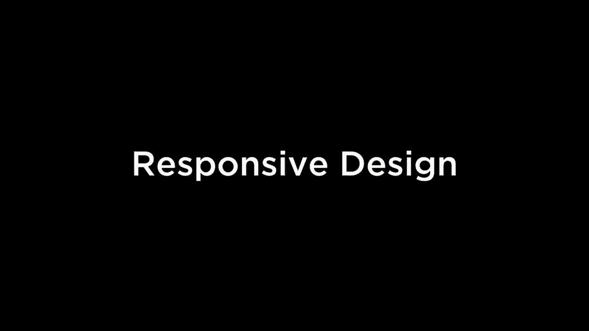

无论你如何查看网页，网页看起来都很好，如今人们并不总是在他们的电脑上查看网页，而是在他们的手机或平板电脑上查看网页，因此在我们开始设计网页时，重要的是要以响应式的方式设计我们的网页。

因此，我们将探讨多种不同的方法，在网页中实现响应式设计，从讨论视口开始，视口是用户实际可以看到的屏幕的视觉部分，因此视口就是整个网页区域。

向用户显示内容，所以你可能会问，当你将这个页面转换到移动屏幕时会发生什么呢？许多移动设备默认情况下会将其视口视为与电脑屏幕相同的宽度，因为并不是所有网页。

页面是针对旧设备和移动设备优化的，你要确保在移动设备上可以看到所有内容，因此许多手机会将这样的网页缩小到适应移动屏幕，可能看起来有点像那样，现在当然这可能不是很好。

我们理想中希望的样子是，我们希望页面能够适应不同尺寸的屏幕，也许我们希望标题、图像和文本（如果它们就是这些）稍微增大，以填满整个屏幕，因此我们可以做的一个简单的事情就是在HTML的头部部分添加一小行代码。

我们控制视口的页面，这行代码提供了一些元数据给我们的HTML页面，并且表示我希望你将视口更改为设备的宽度，默认情况下，许多手机会使用一个实际上比设备宽度更宽的视口。

在电脑上加载一个页面，然后将其缩小到移动设备的大小，如果你和你的网页指定希望视口仅为设备宽度，那么页面在移动设备上看起来会好得多，但除了仅添加这一行代码之外。

我们可以对页面进行其他实际更改，以使其在不同屏幕上看起来更好，其中一项涉及媒体查询，媒体查询主要是关于控制我们的页面将如何显示，具体取决于我们如何渲染特定页面或屏幕的大小。

渲染页面，那么我们来看一个例子，看看我们如何使用媒体查询来控制页面的实际外观，这取决于我们使用的页面类型或浏览器类型。因此，我将打开一个新文件，称之为响应式HTML，因为我们。

现在我要尝试构建一个响应式网页，我将在页面的主体内包含一个大标题，写着“欢迎来到我的网页”，例如。为了展示现在响应式设计可以做什么，我可以说，让我添加一个样式标签。

这里我想说的是，如果屏幕的大小是某个特定宽度，那么我想以一种方式来设置页面样式；如果页面的大小是不同的宽度，那么我可能想以另一种方式来设置页面样式。你可以想象，当你缩小屏幕时，想要移动元素的位置。

为了重新排列它们，使页面在移动屏幕上看起来更好。因此，我们将做一个非常简单的例子，仅根据屏幕大小来改变颜色。现在让我在媒体查询中指定一下，媒体查询的语法看起来像这样，我将使用@符号和。

说媒体，然后指定我希望应用此查询的媒体类型。我可以说，页面的最小宽度为600像素，换句话说，如果页面的宽度为600像素或更大，那么就继续将主体的背景颜色设为。

红色，但我也可以添加另一个媒体查询，并说你知道吗，对于这个媒体查询，我希望最大宽度为599像素，这意味着如果屏幕的大小为599像素或更小，那么我可能希望将主体的背景颜色设为蓝色。

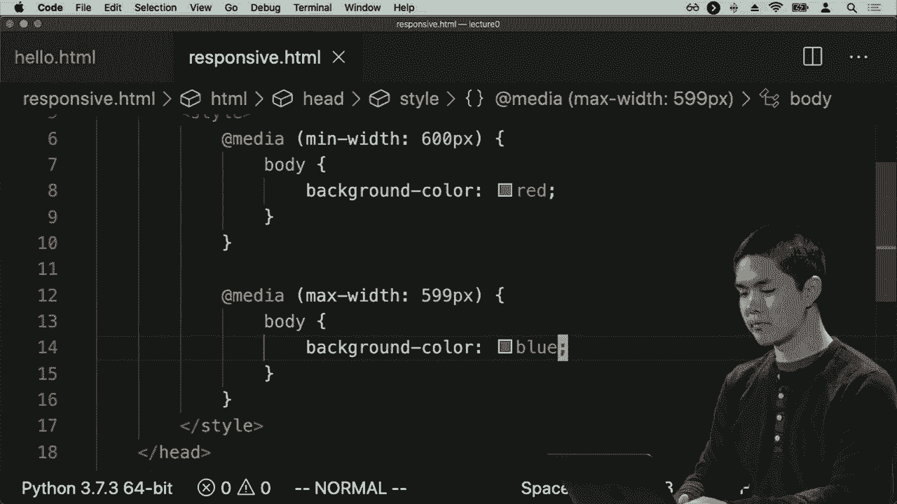

例如，现在让我们看看当我将这个页面拿出来时会发生什么。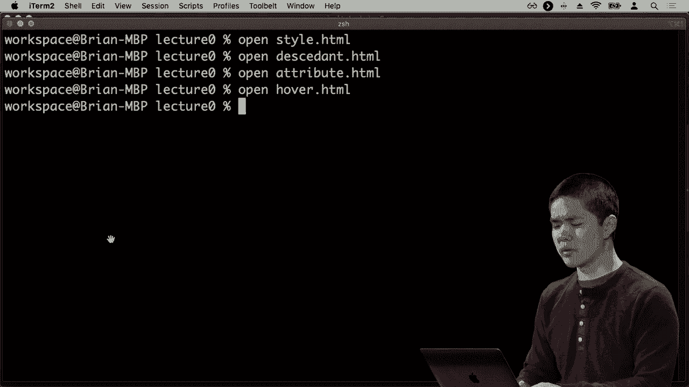

实际上打开它，看看发生了什么，我会打开responsive.html，正常情况下我看到一个红色网页，因为我的屏幕更长。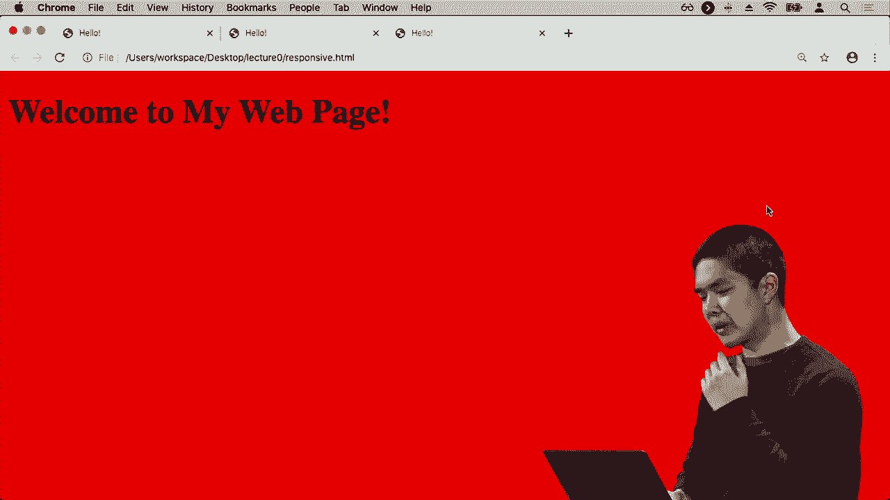

宽度小于600像素，但请注意，当我缩小这个网页时会发生什么。如果我继续缩小它。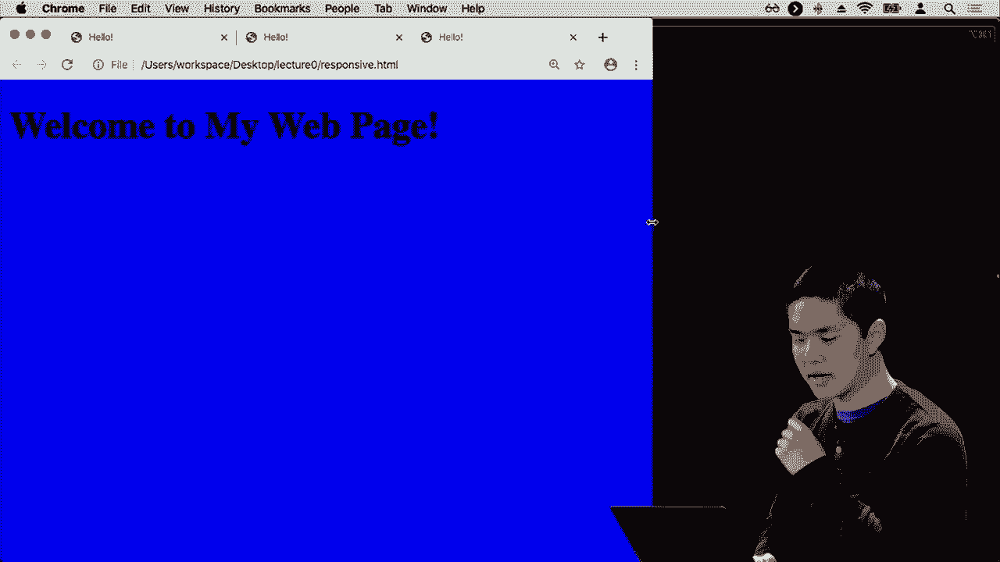

当屏幕变小时，如果宽度超过600像素，它将变为红色；如果低于600像素，则会变为蓝色。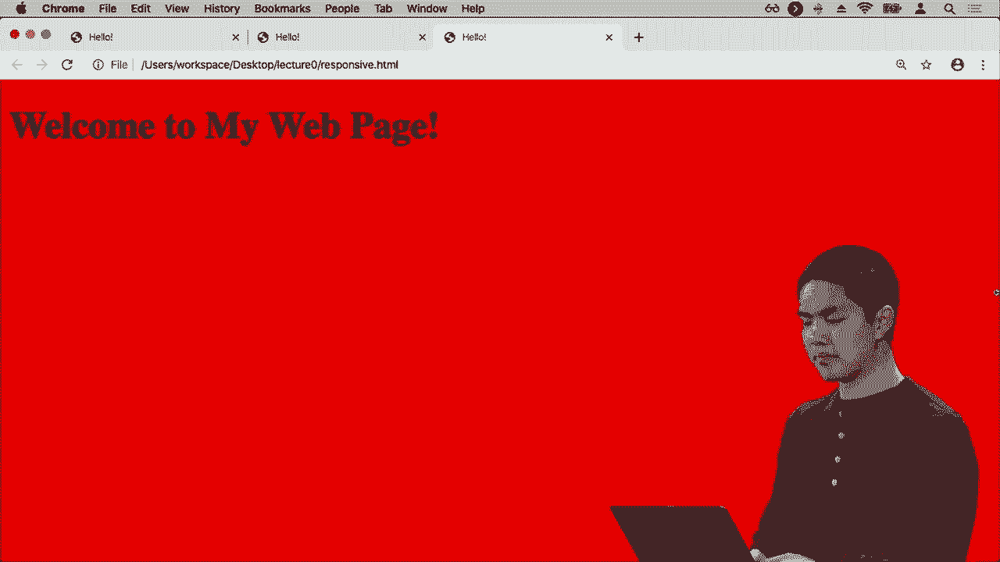

宽度为像素时，颜色变为蓝色，因此我们现在能够使用这些媒体查询来真正微调如何在各种不同类型的设备上显示页面。如果是在大屏幕上，可能希望元素看起来某种方式；如果是在小屏幕上，可能它们看起来就会不同。

你不仅需要控制背景颜色，还可以通过使用这些媒体查询来控制你想要的任何CSS属性。你可以说在大屏幕上希望有一定的间距或填充，甚至可以在小屏幕上隐藏元素，前提是使用特定的CSS属性。

这个称为显示属性，它控制元素是否可见，最终组合在一起，这可以帮助让你的页面更加响应式。我们还可以应用多种不同的媒体查询到我们的页面，以检查移动设备的状态。

在竖屏或横屏的情况下，我们可以检查用户是通过电脑屏幕查看页面，还是尝试打印出页面内容。因此，我们有许多不同的选项来真正控制页面的外观，还有一些工具可以帮助我们处理移动响应。

我们的工具箱中也有一些工具来处理移动响应，最新版本CSS中内置的工具之一是称为Flexbox的东西。如果我们有多个元素，同时在同一页面上显示，而不溢出，Flexbox非常有用。

在进行响应式设计时要小心，如果我们不小心，想象一下我在电脑显示器上显示六个元素，当你将其转到移动屏幕时，你可以想象它们都缩小到几乎不可见的状态，这可能不是我们想要的效果。

如果我们试图设计一个移动响应页面，例如，你可能会想，我们该如何稍微调整一下呢？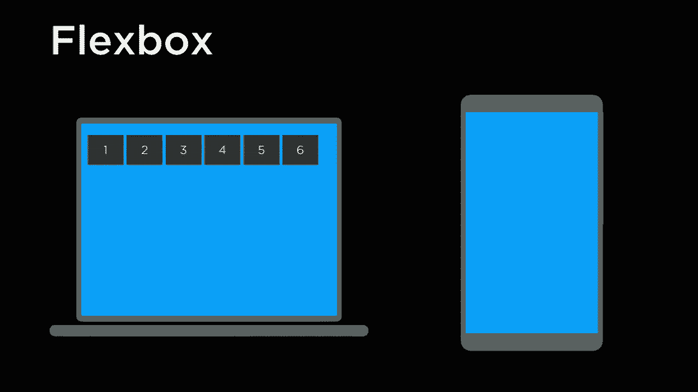

我们可以做的另一件事是，将这些元素保持相同大小，但需要你进行滚动，这不是稍微更好。元素至少仍然可见，且在屏幕上足够大，但如果不必滚动那就更好了。

而且考虑到我们有这么多额外空间，如果没有足够的空间，我希望能够将元素包裹起来。这样，如果我将这六个元素转到移动屏幕，它们会转化为两行，例如顶部三行。

Flexbox是一个简单的方法，可以在我们的网页中实现类似的功能，所以让我们看看添加Flexbox到页面的实际效果。我将创建一个新文件，命名为flexbox HTML，我们将从相同的HTML代码开始。

我将首先创建一个名为container的div。我们创建一个容器是因为我们将明确指定，容器内的所有内容我希望添加Flexbox，以便能够包裹元素，使其能够换行。

现在让我添加一些示例文本，这是一段在 div 内的示例文本。用来演示 flexbox，我将重复这个文本大约 12 次。它会给每个编号，这里是一个，二，三，四，其余的我也会编号，这只是为了展示这些元素实际上可能是什么样子的。

理想情况下，这些应该是不同的内容部分，所以现在在我的 style 标签内，我将说，为了演示，我会说获取 ID 为 container 的元素，哈希标签指定获取某个特定 ID 的内容，我希望使用 flexbox 显示它，特别是我想使用。

Flex wrap 属性来指定如果行末没有足够的空间容纳所有元素，就将这些元素换到下一行。现在我可以为容器内的 div 指定一些额外的 CSS 属性，所以我可以说，对于容器内的所有 div。

通过这个子选择器再次获取容器内的所有 div，我可以给它们添加一些 CSS。我可以说让它们的背景色是某种绿色的阴影，给它们设置特定的字体，可能是 20 像素的字体，并添加一些边距和内边距。

空间可能每个都是。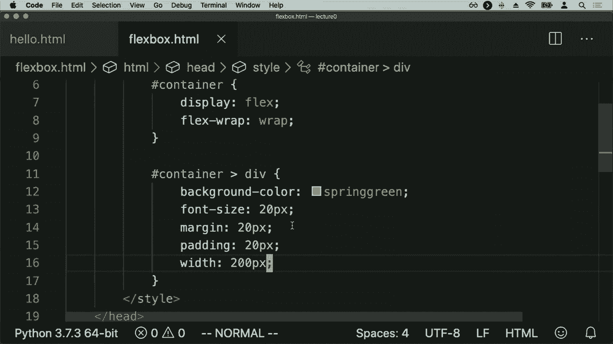

宽度为 200 像素，所以只是为这些单独的 div 添加一些间距。重要的是我在这里说这个整个容器将是一个 flexbox 容器，如果你到达末尾，我希望换行。现在打开 flexbox HTML，我现在看到 12 个元素。

这些元素有多行，但请注意，当我缩小页面时，如果没有足够的空间容纳它们，会发生什么。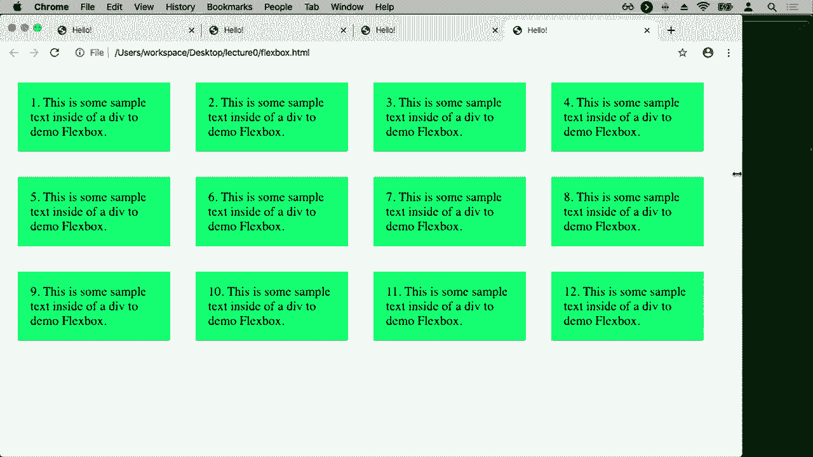

元素移动到其他行，现在每行只有三个元素。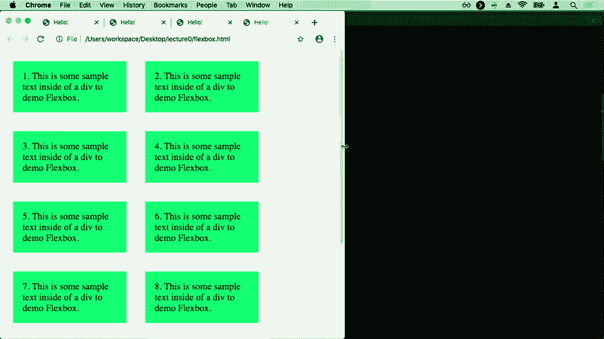

特定行上，现在每行只有两个元素。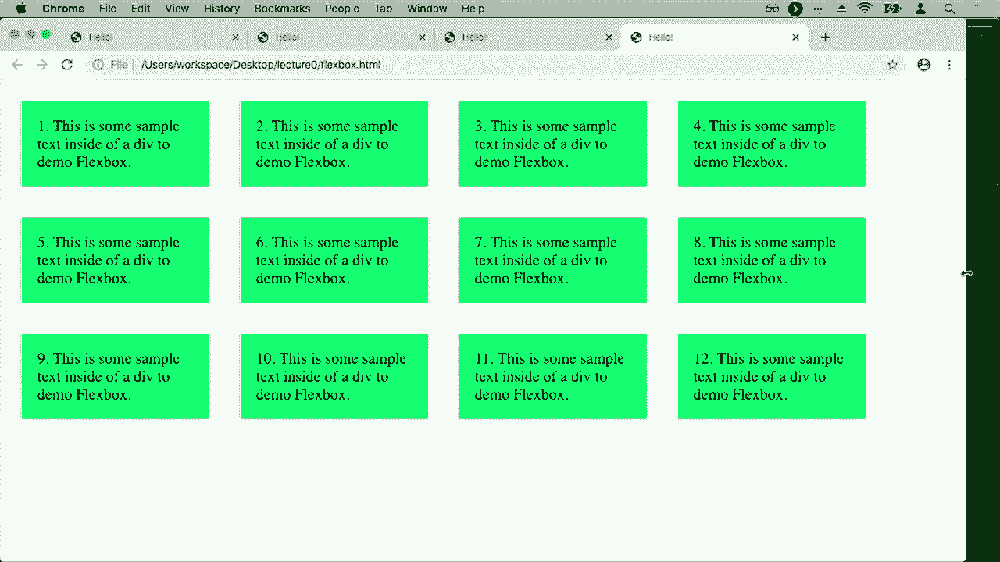

我可以很好地使用 flexbox 适应不同大小的屏幕，无论你是在大屏幕还是小屏幕上查看，这些内容仍然会看起来不错，因为我能够响应式地适应任何可能发生的情况，这是一种存在的布局范式。

在 CSS 中，这种 flexbox 布局还存在其他布局。一个常见的就是网格布局，适用于任何想要在特定网格中排列的东西，或者某些列需要是特定的宽度，而其他的可能会更灵活，我将展示一个示例。

这也是为了给你展示网格布局可能是什么样子的。所以这里是网格 HTML，我将在页面的主体内创建一个 div，给它一个 ID 为 grid，然后我将添加 div class ＝ grid item，同样是一个类，因为可能会有多个项目。

继续创建一堆很棒的项目，并为每个项目编号，比如2 3 4 5 6 7 8 9 10 11 12，所以我有一堆很棒的项目在一个ID为grid的div中，现在我想在这里添加一些样式，我会说对于grid，给它一个背景颜色，也许会是某种背景色。

应该是绿色，显示为grid，我希望它作为一个网格显示，现在有几个属性，我将要指定，也许我想在网格周围添加一些内边距，但重要的网格属性是网格列间距，决定列之间的空间。

每列可能我会说大约20像素，同样还有一个网格行间距，决定网格中每行之间的空间，我可能会说这里是10像素，最后网格模板列是我用来指定将会有多少列，以及每列的宽度。

列的宽度，因此如果我想要三个列，我可以指定第一列应为200像素，第二列也应为200像素，第三列可以自动调整大小，正好填满屏幕，我会说为自动，所以第一列200像素，第二列200像素。

第三列自动处理，现在对于所有的网格项目，我可以为它们添加一些样式，我会给它们一个白色的背景色，以便区分它们，并且还会设置一些字体大小和内边距，也许还会让它们居中，所以只是添加一些额外的CSS。

属性以便于按照我想要的方式显示，但这里需要关注的重要属性是显示为grid，然后我正在指定网格的布局方式，列之间的空间有多少，行之间的空间有多少。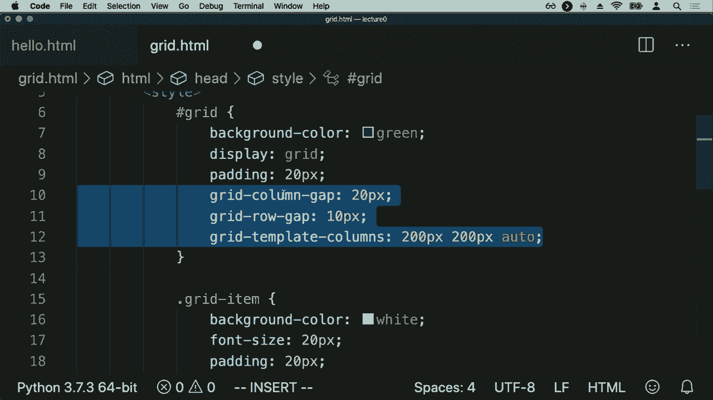

行和每一行的宽度，现在如果我打开grid.html，这就是那个网格的样子，我现在有一个宽200像素的第一列，一个宽200像素的第二列，还有一列将会自动调整大小。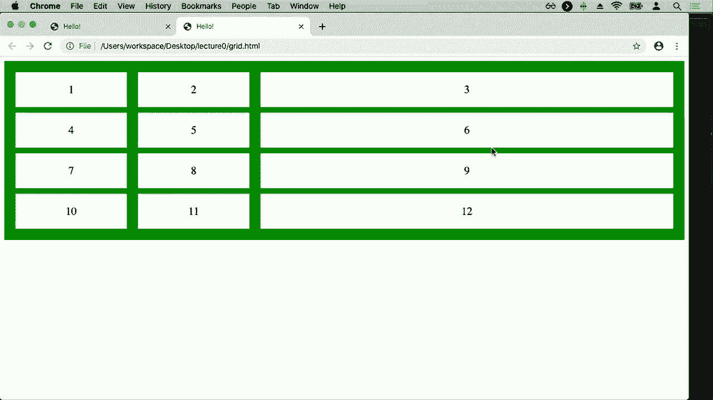

动态地基于我的屏幕有多宽或多窄，因此当我。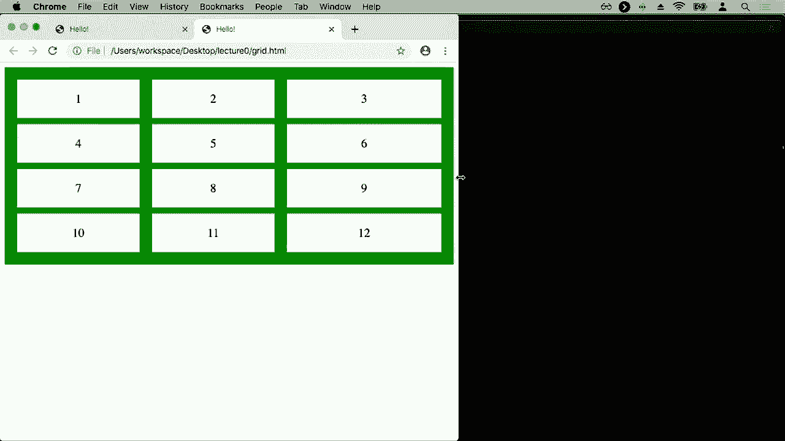

当屏幕缩小时，第三列也随之缩小，而当我扩大屏幕时，它。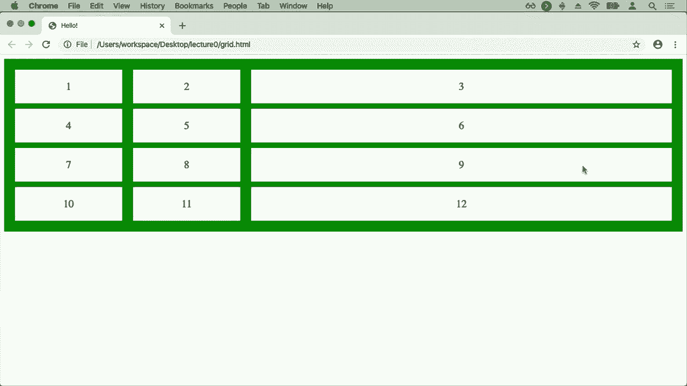

也随之增长，取决于这个。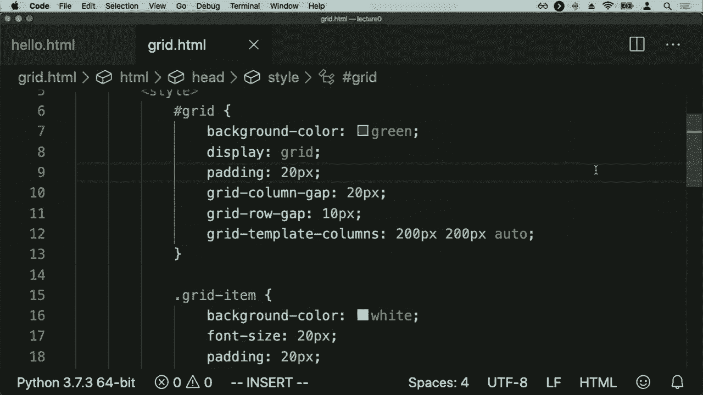

窗口的情况，所以flexbox和grid是我们可以使用的一些非常强大的工具，可以让我们更轻松地实现这些功能。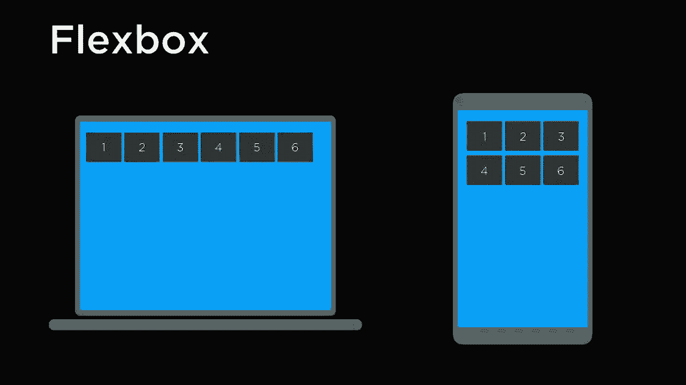

为了能够使用移动响应设计，确保我们的页面在任何浏览器或设备上都能美观展示，但事实证明，存在许多库可以为我们处理很多这些问题，有些人可能会。

已经写好的 CSS 代码让我们的文本看起来不错，让我们的按钮看起来不错，以确保东西。具有移动响应性，其中一个叫做 bootstrap，bootstrap 是一个非常流行的 CSS 库，我们可以用它来。使用他们已经写好的样式，这样我们就不需要写。

所有样式从头开始，所以这是 bootstrap 网站的样子。我会继续给你展示，现在只是给你一个在像 bootstrap 这样的库中可用的样本。如果我去 get bootstrap calm，这里是 bootstrap 的网站，如果我去他们的。文档，在这个第一个链接里，我。

可以查看所有给我访问的 bootstrap 组件。这些东西，比如警报，例如，这里有一个以非常特定的方式样式化的警报，它有特定的字体，有一定的。填充和某些颜色，如果我想。复制这个警报，使用后。

bootstrap 的代码，我可以简单地对一个 div 应用某些。类，bootstrap 会为我处理应用正确的。样式的过程，我不需要从头开始编写所有。的这些样式，bootstrap 已经写了很多样式。那如何实际使用 bootstrap 呢？要开始使用。

bootstrap，你需要做的就是复制。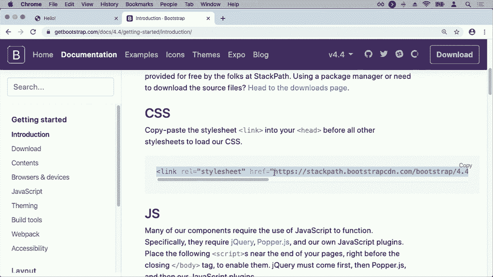

CSS 链接，bootstrap 提供的链接，放在你文件的顶部，所以如果我拿这个 CSS。链接，然后返回到像。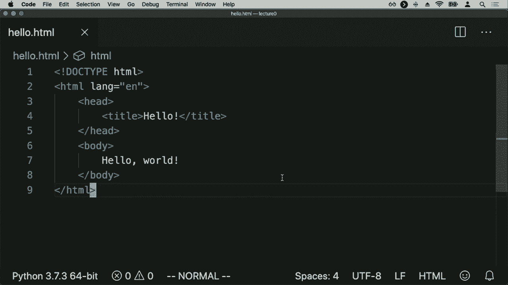

hello dot HTML，你会记得，它最初看起来像这样。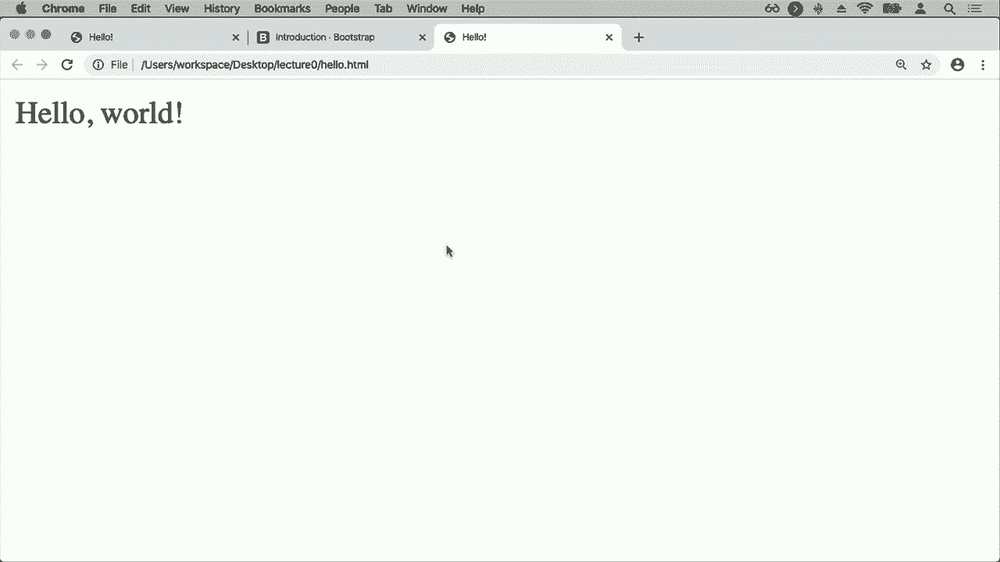

就是 hello world，我可以加一些 bootstrap 使其更好看。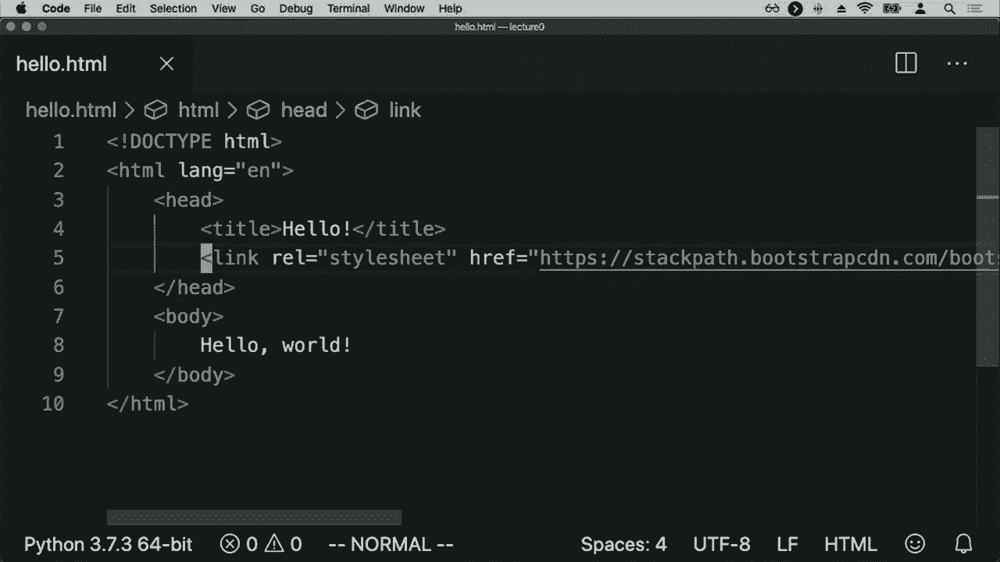

好吧，我想把这个 HTML 文件应用 bootstrap 样式，让它看起来更好看，所以我刷新页面，现在你会。注意到 bootstrap 为我选择了一个自定义字体。让事情在 bootstrap 自己眼里看起来更好，如果我想添加 bootstrap 元素，我可以。

说好吧，让我去他们的组件，我想添加一个警报，我可以直接复制他们的警报代码，这里是。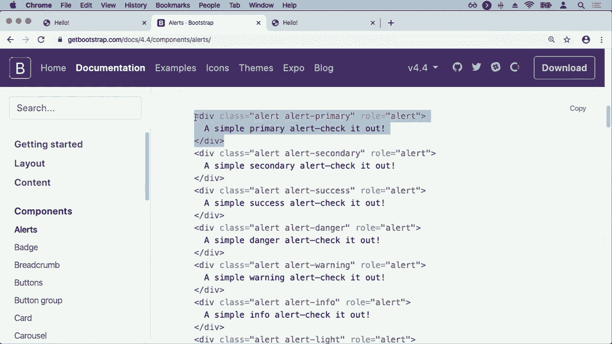

他们的主要警报代码是一个，看起来是蓝色的警报，我可以。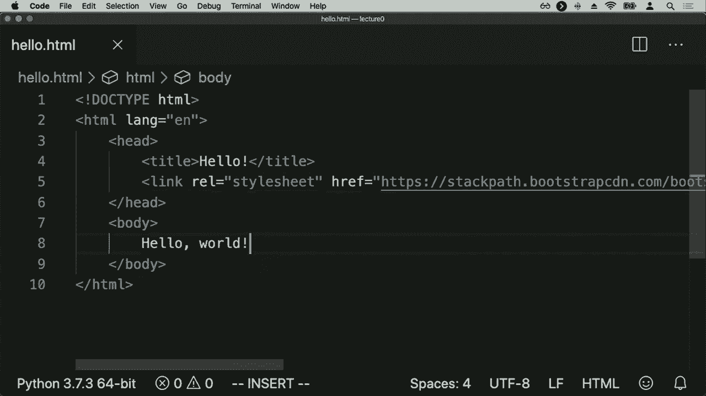

在我页面的主体内继续添加一个警报，也许改变文本。这里是我的警报，例如现在当我重新加载 hello dot HTML，我看到一个根据 bootstrap 样式显示的警报。再次，我可以通过更改这些。类来改变那个样式，所以一个主要的警报显示为。

成功警报显示为绿色。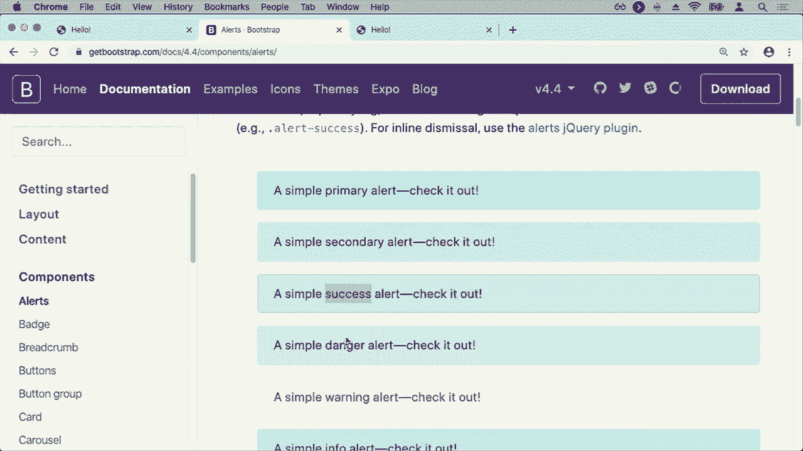

危险警报是红色的，如果我想给用户一个危险警报，告诉他们在网页上做错了什么，我可以把警报改为主要的。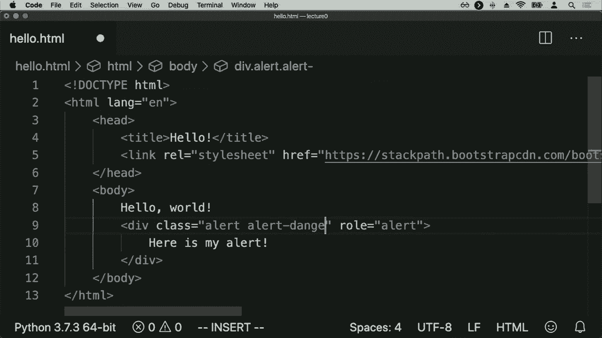

将我的HTML中的内容改为警报危险，然后在刷新时。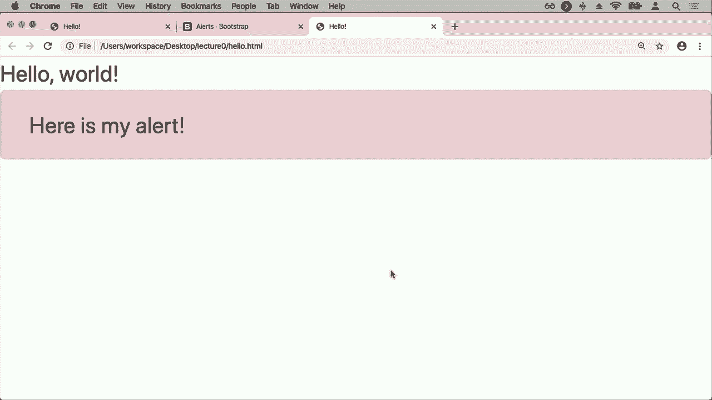

现在我看到警报显示为红色而不是蓝色，所以bootstrap让我们可以使用许多不同类型的组件、不同方式添加面包屑、警报、轮播以及其他元素到我们的页面上，便于快速美化页面。

而无需过多担心自己编写CSS，因为bootstrap为我们编写了很多内容，bootstrap甚至包括了一种确保网页在移动设备上响应式的方法，使用称为bootstrap列模型的东西。我现在给你展示一个例子，bootstrap将其页面分成十二个单位。

明确的列，所以我可以做的一件事是，我在一个名为列零的HTML示例中拉出了这个，注意在我的页面主体中，现在我有一个类为container的div，还有一个类为row的div，bootstrap将每行分成十二个单位的列。

例如，这里我有一大堆每个宽度为三的div。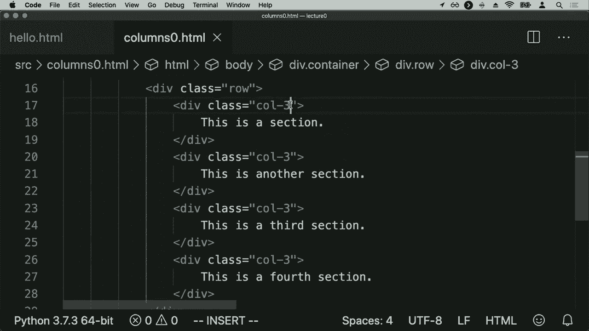

所以如果我有四个三单位的列，它们将占用总计为12的空间，也就是填满整个页面。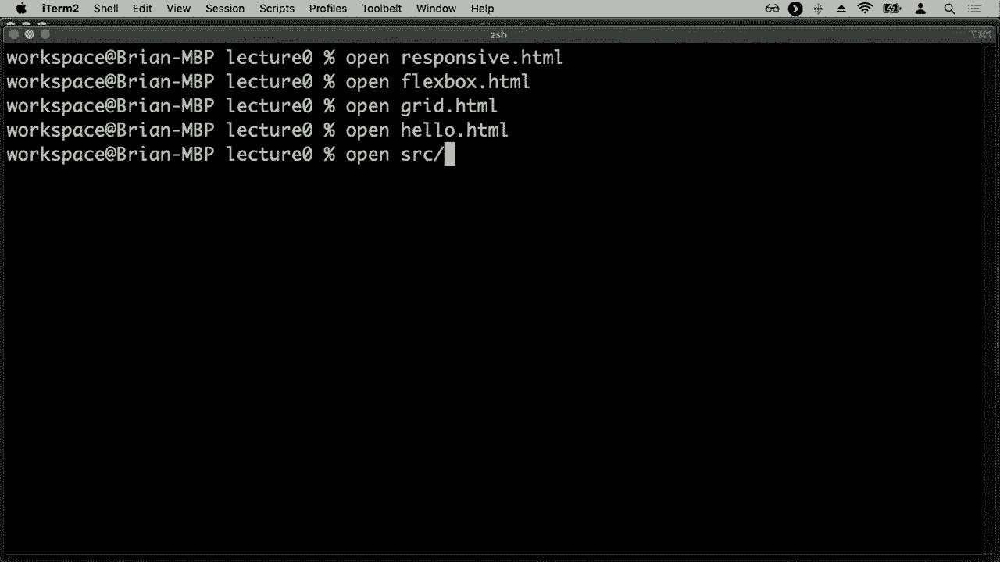

屏幕，所以如果我现在打开源代码，columns zero dot HTML，看看这个。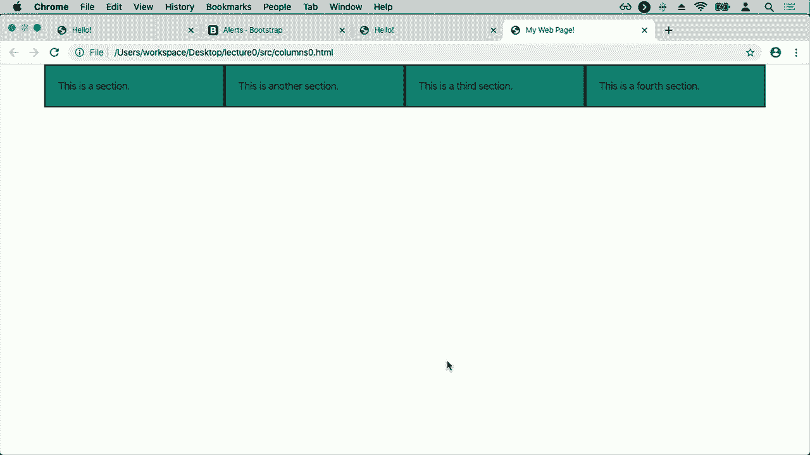

看起来我有四列，每列宽度为三，因此。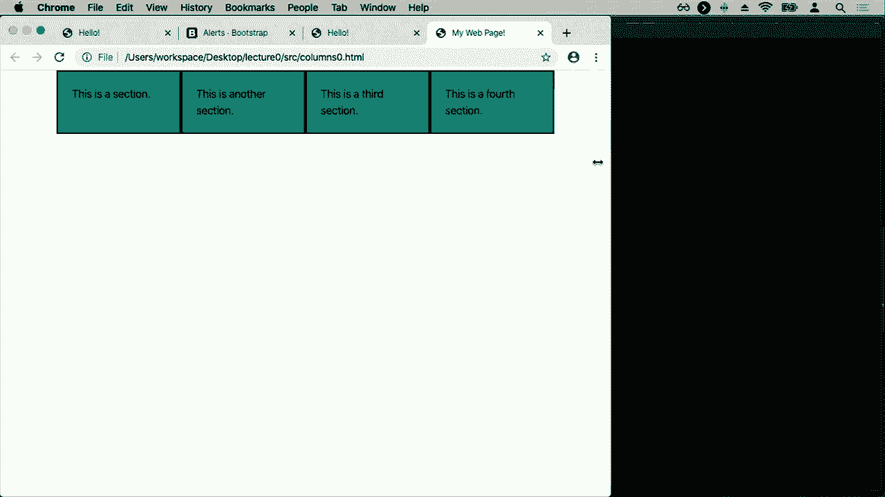

当我缩小时，这些列将自动调整大小，以确保。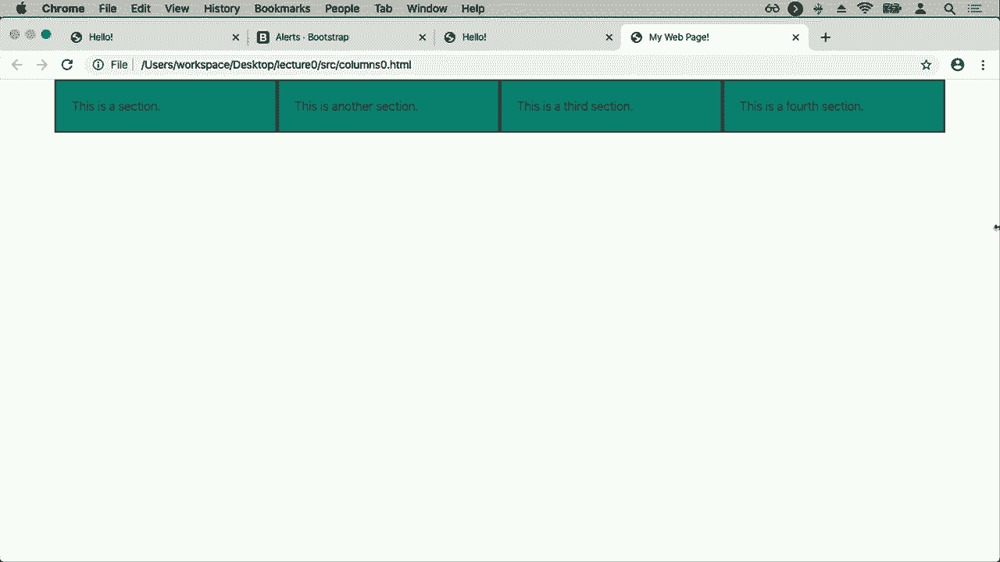

现在它们的大小总是合适的，只要加起来是12，它们不需要都是相同的大小。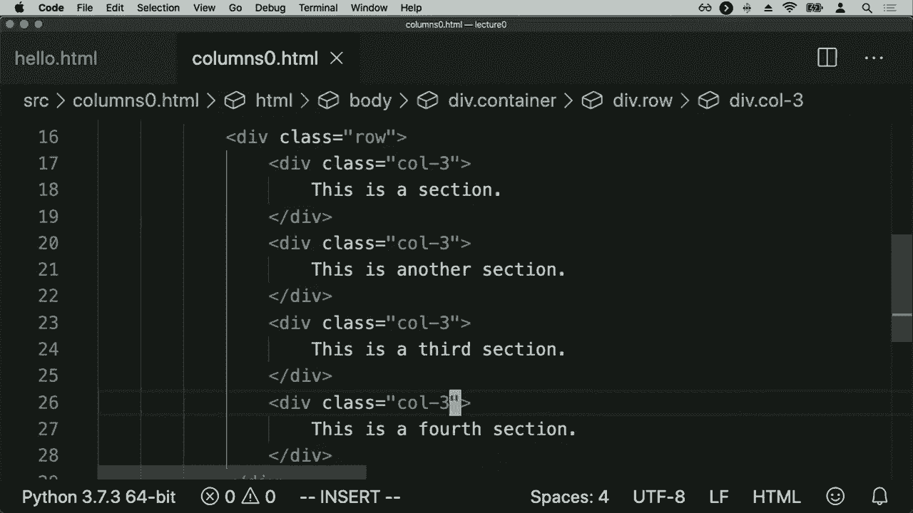

例如，如果我只想要三列而不是四列，我可以通过删除那些行来去掉第四列，或许将第二列的大小改为三，改为大小六的列。现在如果我刷新页面，突然我就得到了。

我看到三个列，中间的列是两边列的两倍大，随着我缩小这个页面，我也能看到它随之缩小。使用bootstrap列的一个优点是它们也可以是移动响应的，也可以换行。

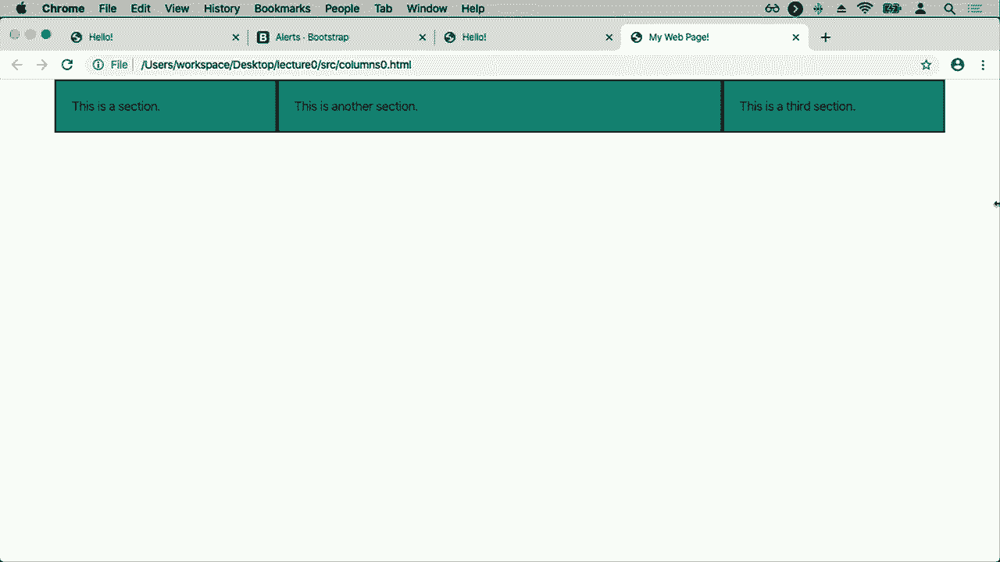

如果需要的话，可以转到其他行，例如让我拉出列。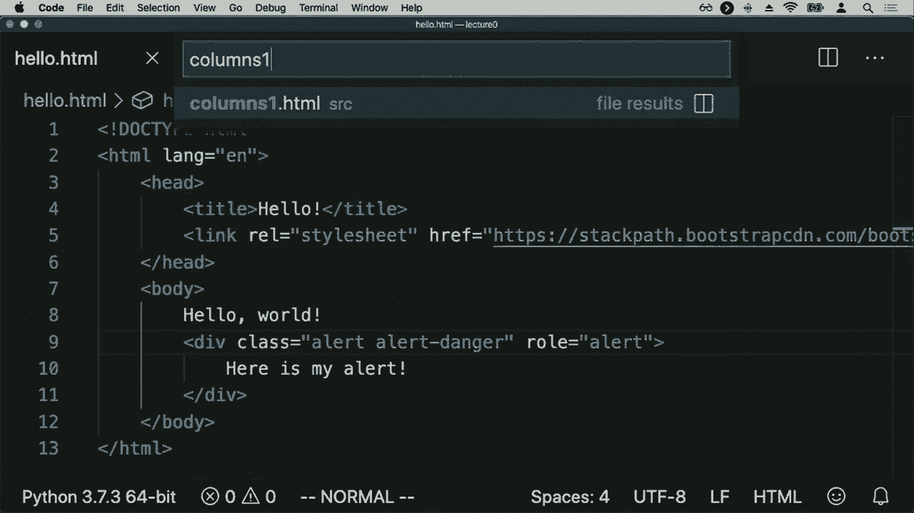

在一个HTML示例中，我有一行，让我们看看里面发生了什么。请记住，每行在bootstrap中被分成十二个列单位，但bootstrap除了让我指定列应该占多少单位外，还允许我指定该列的单位。

这应该取决于屏幕的大小。因此，如果我在大屏幕上，如LG所示，这表示在大屏幕上，这个div应该占三个单位的空间，而这个div也应该占三个单位的空间。这四个div在大屏幕上每个都占三个单位。

总共有十二个单位的空间，因此它们都会显示在同一行上。但是在小屏幕上会发生什么呢？这里叫做SM，每列在小屏幕上我说每列应该只占六个单位的空间，即总共十二个中的一半。

所以这里用掉六个，那里也用掉六个，总共十二个，意味着接下来的两个六个需要放到第二行，而bootstrap是***********。确切地说，这些元素应该最终如何布局。因此，现在如果我打开columns one.dot HTML，看看大屏幕上有什么。

四个列全部在同一行，但随着。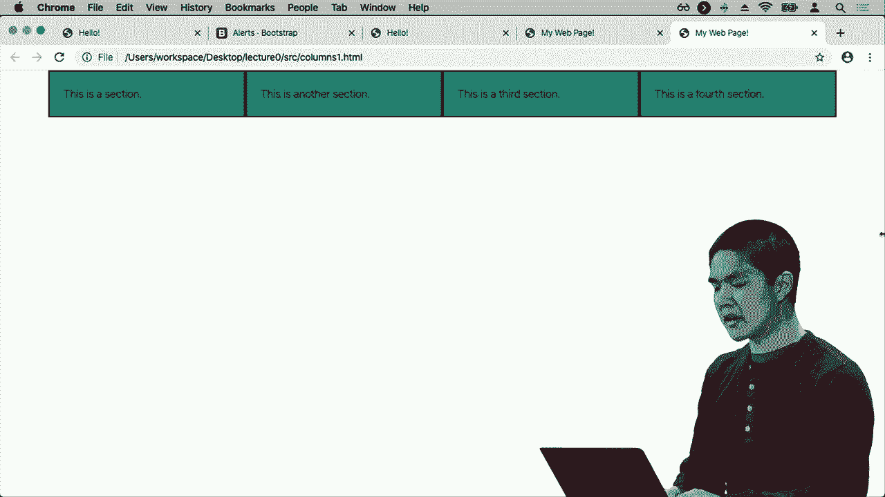

当我找到一个更小的屏幕时，最终我们会看到一些变化。我现在看到第三和第四部分移动到第二行，因为在小屏幕上，窗口变小时，我只有。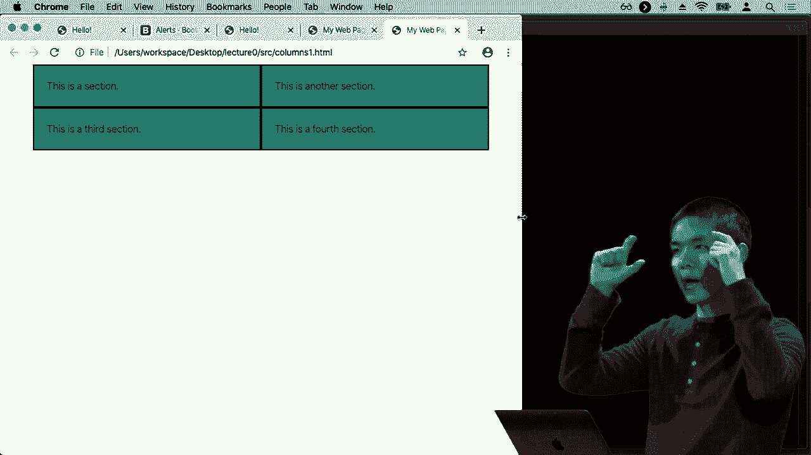

我有能力在第一行显示两个元素，然后在下面的行显示两个元素。总之，有很多不同的方法可以使用CSS，以确保我们的页面在移动设备上是响应式的。我们可以使用bootstrap的列模型来确保列在屏幕大小变化时会移动。

当窗口缩小或扩大时，我们也可以使用像flexbox和网格模型这样的东西，编写自己的CSS，以确保我们的页面是响应式的。这取决于用户正在使用的屏幕大小，以便访问我们的网站。因此，这些是我们仅使用CSS即可获得的一些非常强大的功能。

你可能会想象，随着我们开始编写越来越多的CSS，会有更多的重复内容不断出现，我们已经在某种程度上看到了如何最小化CSS中的冗余。我们已经看到如何将CSS移动到网页的样式部分。

我们甚至看到如何将CSS移动到一个完全不同的文件。然而，我们尚未看到如何处理其他类型的冗余。因此，让我们现在来看一个例子，假设我想以不同的方式为多个不同的元素设置样式，但使用一些共同的属性。

例如，让我创建一个新文件，这里称为variables HTML，你马上就会明白为什么。我会继续复制hello.dot HTML，但我会去掉里面的所有bootstrap。假设这里我有两个列表，一个有序列表和一个无序列表。

列表中我的无序列表有可能是三个无序项。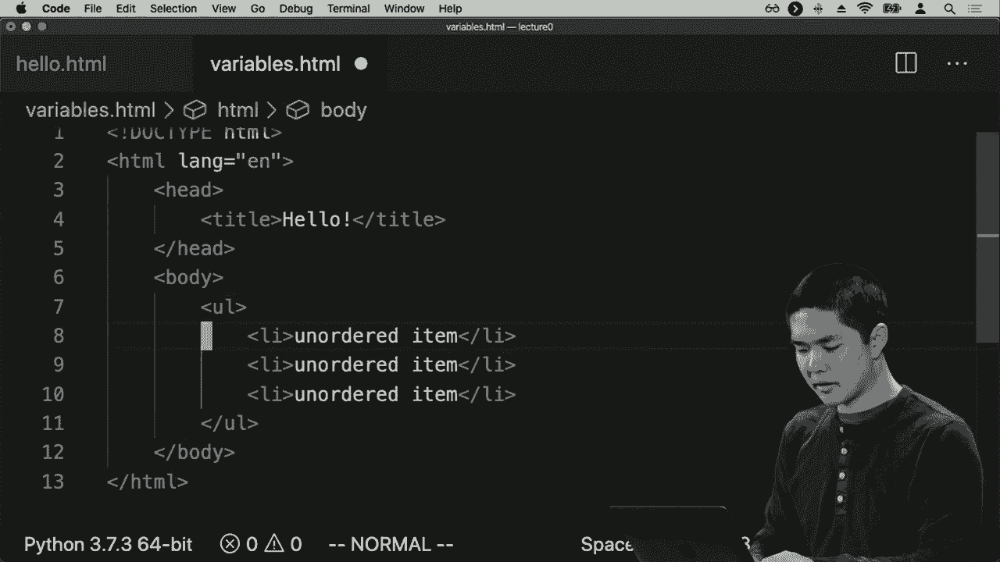

项目，我的有序列表也有三个有序项，再次只是为了演示，我展示了我们有。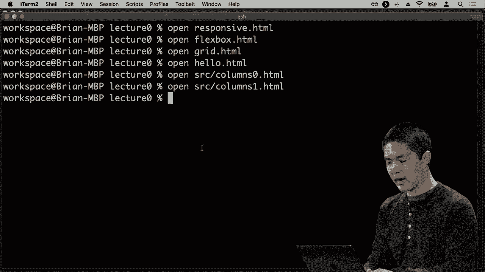

这两个列表现在我将打开variables.html给你一个关于它可能看起来的感觉，我们有三个无序项在无序列表中。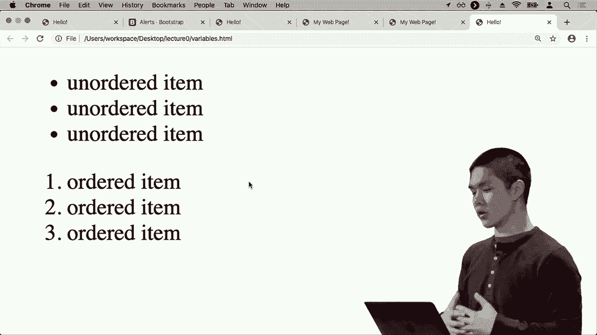

在有序列表中列出三个有序项，假设我想稍微以不同的方式来为这些项添加样式，也许在页面的样式部分，我想将无序列表的字体大小设置为14像素，并可能将颜色设置为红色。而我的有序列表我希望它的字体大小也许设置为更大的18。

像素和红色的颜色，我想保持所有文本的颜色相同，但我希望字体大小有所不同。现在如果我刷新这个页面，我看到它们确实是不同的大小，有序列表项的大小大于无序列表项，并且它们都是红色，但有一些冗余。

在我写CSS代码时引入了重复。当我写CSS代码时，我重复使用了红色。如果我想将颜色从红色更改为蓝色，我就得在两个不同的地方修改我的代码，最终我希望我的CSS能够。

变得更强大，因此这引出了我们今天的最后一个主题，一个叫做sass的语言，sass本质上是CSS的扩展，它为CSS提供了额外的功能，只是为了让我们能够更强大地使用和操控。

以一种更快的方式来使用CSS，并消除我们在以前的CSS中可能存在的一些重复，而sass的一个关键特性是能够拥有变量。因此，让我们来看一个示例，现在我要创建一个新文件，通常我们创建CSS文件时会称它们为。

像variables.dot CSS这样的命名来表示CSS文件，然而sass是另一种语言，所以它需要不同的扩展名。我们通常使用.dot s CSS来表示这是一个sass文件，因此现在这是variables.dot s CSS，现在我可以在sass中实际。

以我们在像Python这样的编程语言中创建变量的方式来创建变量，尽管CSS通常不支持变量，但sass将赋予我们这种能力。在sass中，所有变量都以美元符号开头，所以我可以创建一个变量$dollar sign color来创建一个变量。

创建一个叫做color的变量，我可以说这个变量color的值将是红色。所以这一行，即第一行，是我告诉sass我想创建一个叫做color的变量，并希望它的值为红色，现在我可以添加之前的样式，我只需使用普通的CSS，并说对于一个。

无序列表中，我希望字体大小为 14 像素，但颜色不说红色，我可以使用变量的名称，可以说美元符号 color，意味着使用变量 color 的值作为这个无序列表的颜色。然后对于有序列表，我也会说字体大小为 18 像素，并且。

颜色也应该是这个叫做 color 的变量。通过使用变量，我消除了重复，而不是在多个地方出现红色这个词，如果我需要更改它，我只需要更改一次，现在我只需定义一次变量。

如果我需要对这个特定文件进行修改，可以在一个地方进行更改。现在，让我们尝试链接这个文件，而不是返回到变量 HTML，而是放置样式代码。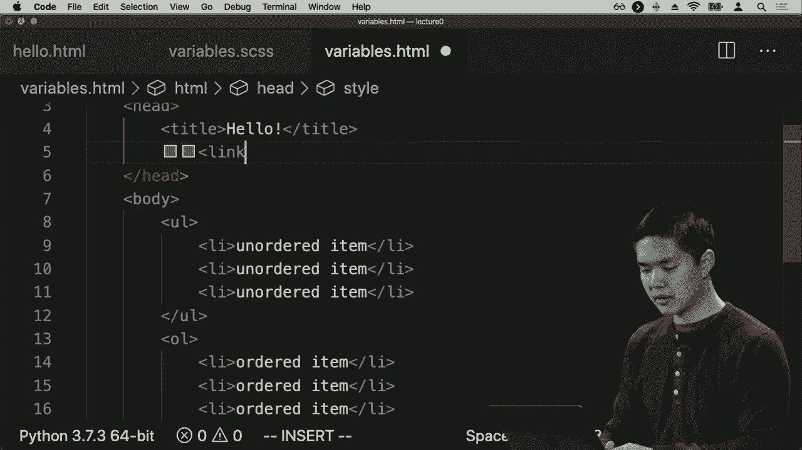

这里我将继续链接样式表，并说 href 应该是 variables s CSS，因为这是我的样式所在的文件。现在让我尝试打开链接后的变量 HTML。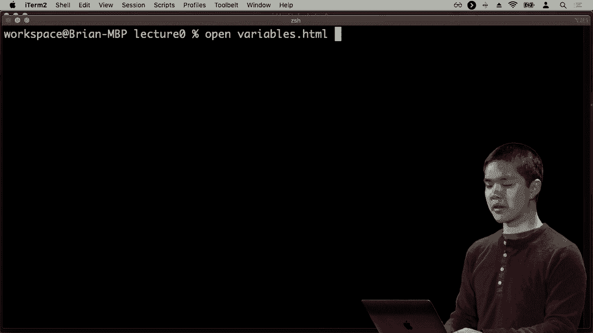

CSS 和所有的东西似乎没什么问题，但我指定的字体大小。 我指定了一切应该是可读的，但它并没有显示出所有内容。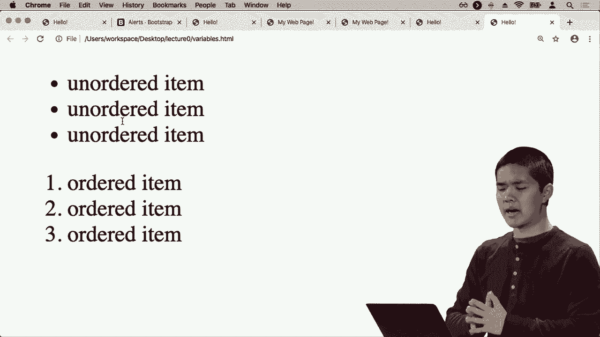

显示的是黑色，我没有看到任何大小的差异。原因是，尽管网页浏览器如 Chrome、Safari 和 Firefox 可以理解 CSS，但它们默认无法理解 s CSS 或 sass。sass 是。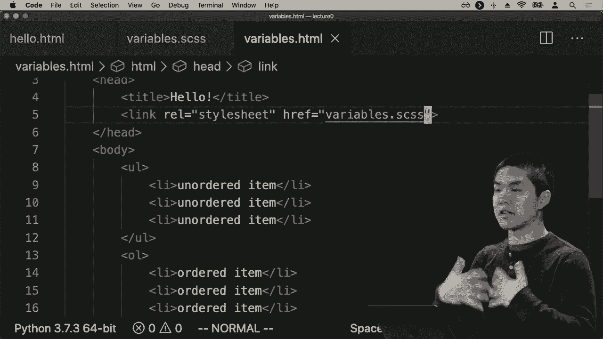

一个浏览器默认不理解的 CSS 扩展。因此，为了解决这个问题，一旦我们有了它，我们需要将其链式转换，也就是将 sass 翻译成纯老式的 CSS，以便我们的浏览器能够理解。为了做到这一点，您需要安装一个程序。

叫做 sass 的程序可以安装在您的电脑上，无论是 Mac、PC 还是 Linux。现在在终端中，为了进行这个编译，我将输入 sass。variables dot s CSS，这是我想编译的文件：colon variables dot CSS。因此，variables dot SCSS 是我想编译的文件。

我希望生成的是 variables dot CSS，我想把我的 sass 文件转化为一个。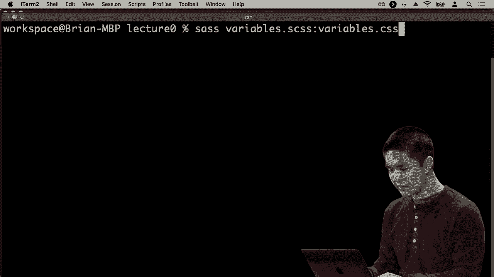

纯老式的 CSS 文件，我将继续按回车并写下。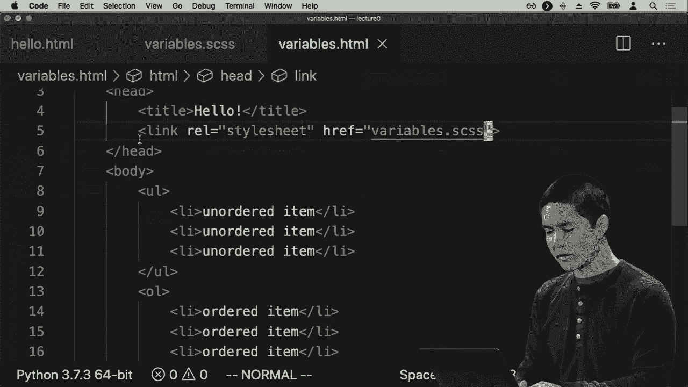

编译过程现在完成了，所以，现在在变量数据 HTML 中。不是代表 CSS 文件，我将要将 CSS 文件作为样式表引用。因为我的网页浏览器只理解 CSS，它不理解 sass。现在，当我加载页面时，我看到了预期的结果，一切都显示出来了。

还是红色，字体大小不同，因此最终这是一个两步的过程。我首先需要将我的Sass代码编译成CSS，然后我可以将CSS链接到这个特定的页面，但现在的好处是，如果我想进行某种更改，我想更改颜色而不是。

在两个地方进行更改，或者你可以想象在一个更复杂的页面中，可能有十几个或几十个地方。我只需去CSS文件，将颜色从红色更改为蓝色。现在，如果我刷新页面，一切仍然是红色的，这因为我忘记了一个步骤。我更改了Sass文件，但这不会自动更改CSS文件，我需要。

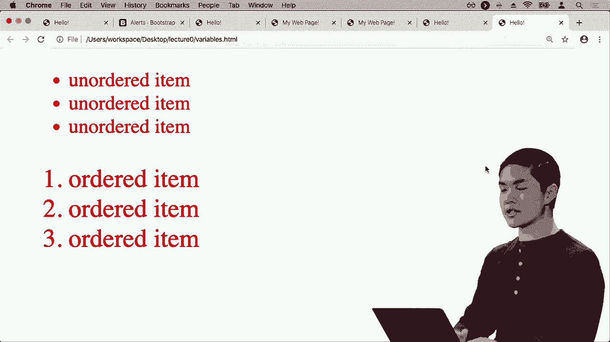

通过说 `sass variables.des CSS variables.dot CSS` 重新编译CSS文件。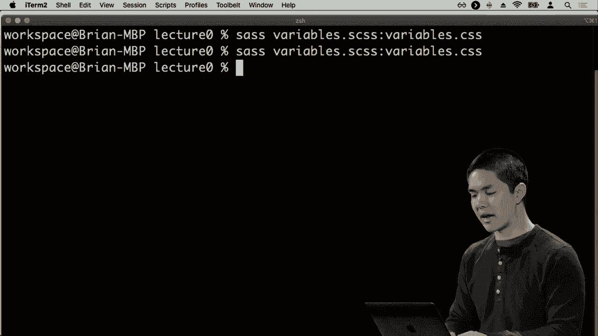

更新后的Sass文件，现在我看到了更新的变化。如果你想知道更新后的文件看起来怎么样，我其实可以查看变量.dot CSS文件，看看那里有什么代码，虽然它的样式有点奇怪，但你可以看到我有一个ul，字体大小为14，颜色为。

蓝色，因此他们用这个变量替代了蓝色这个词，并且他们对有序列表也做了同样的事情。现在在实践中，如果我在构建网页，使用Sass时，如果我每次都需要回去重新编译我的Sass为CSS，这将相当烦人。我希望能够。 

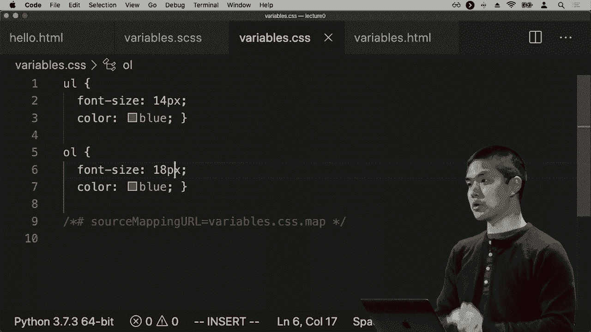

我所要做的就是自动化这个过程，而Sass使得这一切变得简单。我可以直接说 `sass --watch variables.s CSS variables.dot CSS`，这样你就会看到Sass正在监视变化，Sass会监控variables.dot CSS文件。如果我改变了我的Sass文件，Sass会知道。

它会自动重新编译对应的CSS文件。现在你可以仅使用单个文件来做到这一点，但。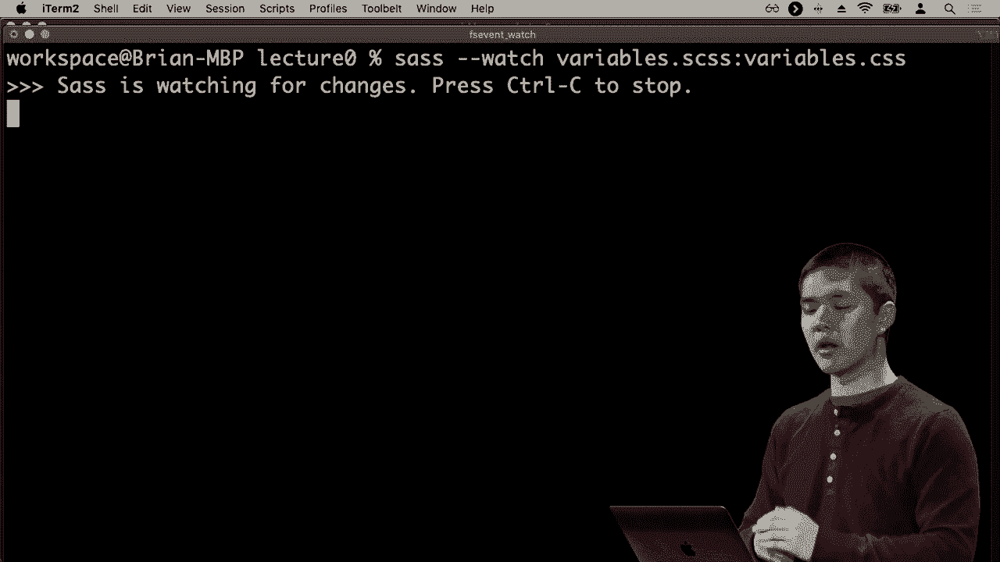

如果你有多个不同的Sass文件，也可以对整个目录进行处理。那么现在我可以做的是，如果在变量的CSS文件中更改颜色，而不是。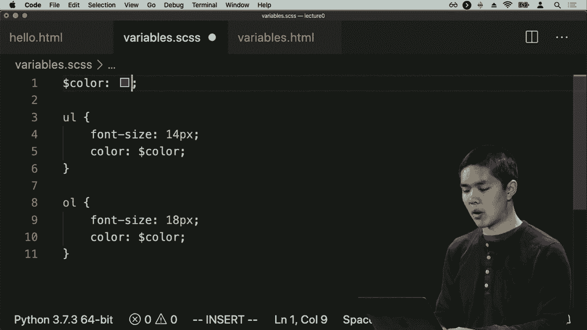

蓝色，我现在想要将其更改为绿色。例如，我现在保存了variables.s CSS文件，现在在没有做任何事情的情况下，看看我的终端，Sass检测到了对variables.s CSS的更改，因此它给。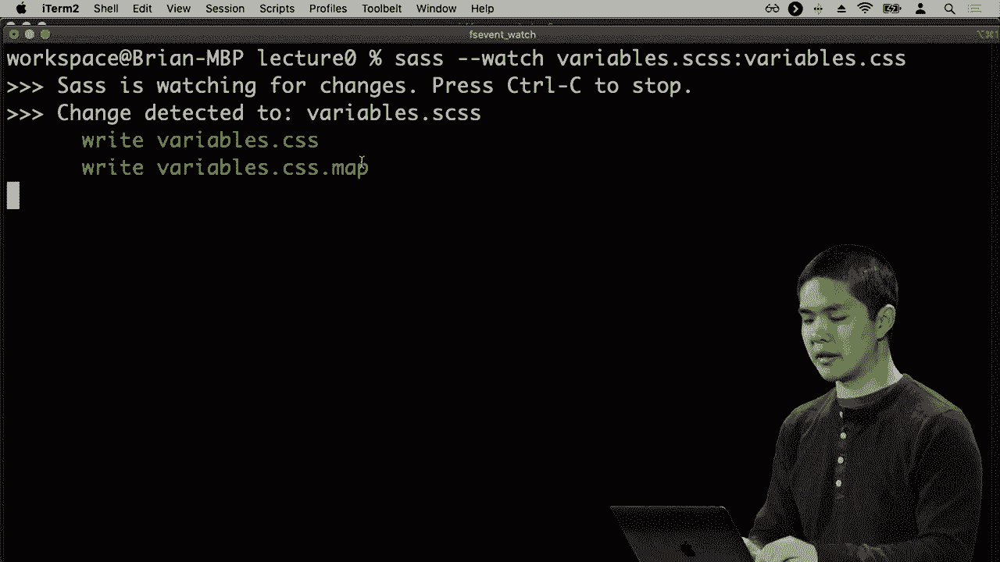

给我一个我原始CSS文件的新版本，如果我现在回到我的网页浏览器。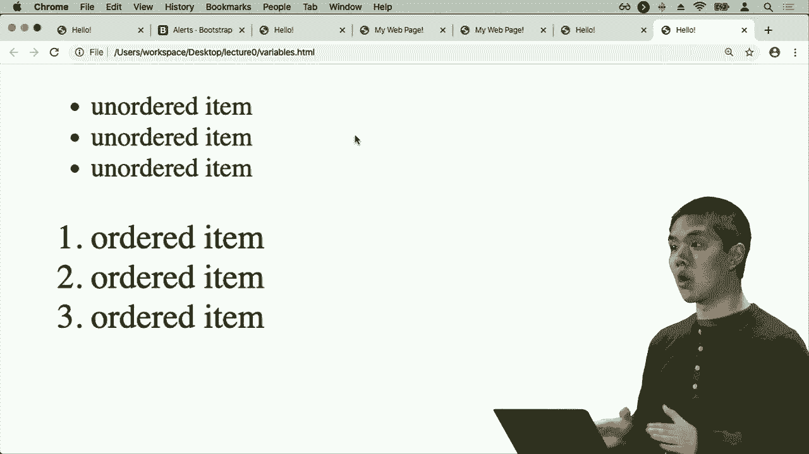

现在刷新页面，所有文本都是绿色的，这正是我所期望的。这是**Sass**给我们带来的一个非常强大的特性，它让我们能够将变量添加到我们的CSS代码中，以提取共同点。如果有重复的字体、常用的颜色、常见的边框或样式，我可以。

想要应用于很多不同的东西，使用sass变得更简单，最后，我们将看看sass给我们能力的其他几个特性，其中之一是能够嵌套。CSS选择器在其他CSS选择器内部，所以你已经看到的一件事是。

例如，如果在CSS中，我想样式化所有在div内部的无序列表，我可以说像div箭头无序列表，以便样式化在div内部的无序列表。sass会给我们一种更好的语法。

特别做这种事情，通过允许我们在其他CSS片段内部嵌套CSS，作为一个示例，我会打开一个我已经带来的文件，叫做，嵌套HTML，所以这是我们可能会在嵌套HTML中看到的，页面的主体在主体内部。

页面中我有一个div，里面是一个段落和一个，列表（无序列表或ul）也在这个div内部，我们还有一个段落在div外部，还有一个列表在div外部。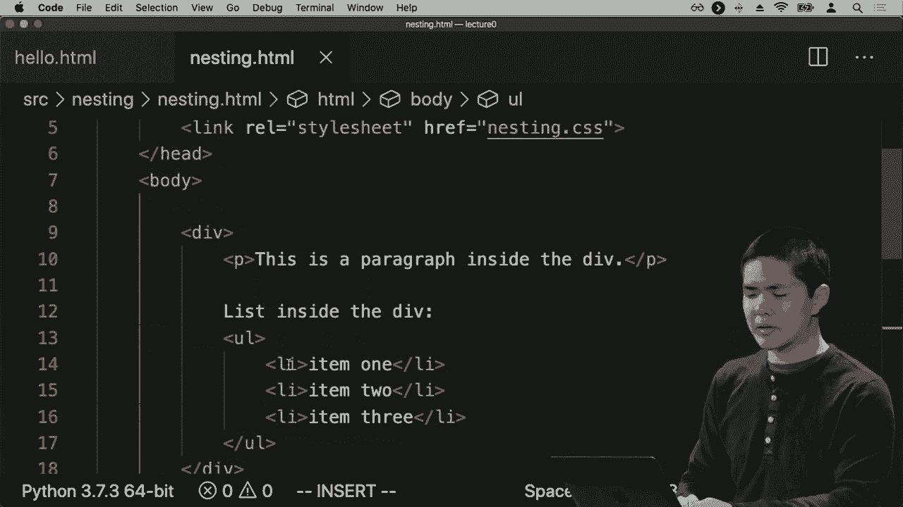

除此之外，还有许多不同的元素，其中一些位于其他元素内部，我想做的是非常精确地样式化这些页面，sass将允许我们编写一个看起来像这样的sass文件。

让我们看看它在做什么，它说对于整个div，我想给这个div一个18像素的字体大小，然后CSS通常不允许我们做的，但我们现在可以用sass的力量做到的是，对于在该div内部的任何段落，继续给这些段落一个。

蓝色的颜色，对于任何在div内部的无序列表，给这些无序列表一个绿色的颜色，通过将这些CSS选择器嵌套在其他选择器内部，我们能够表达出，我只想样式化段落，如果它在一个div内部，这只是一种更好的方式。

进行一些更复杂的样式任务的更干净的语法，可能会出现，那么如果我像这样把这个CSS文件，转换为普通CSS，结果会是什么呢？让我们来看看，我们可以尝试一下，让我进入，我的嵌套文件夹，里面有所有这些文件。

位于的位置，如果我运行sass嵌套。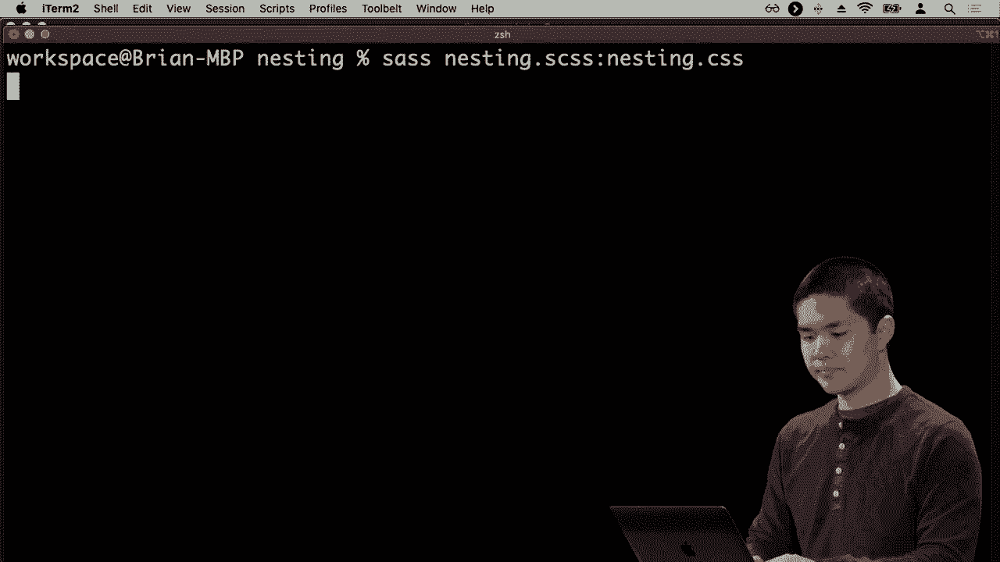

数据CSS将其转换为嵌套的点CSS，现在让我们打开嵌套CSS，看看。它在这里的样子，变成了，给所有div一个18像素的字体大小，然后我们，使用之前看到的相同后代选择器。表示法，所有在Dizz内的段落应该是。

所有未排序列表的颜色应为绿色，并且这确实有效，我们可以从一开始就写这个 CSS，但使用 sass 可以更干净，更易于阅读，真正表达段落应在。

以这种方式结构化，未排序列表以其他方式进行样式，使用这种嵌套方法通常使我们更容易查看这个 CSS 页面，并且。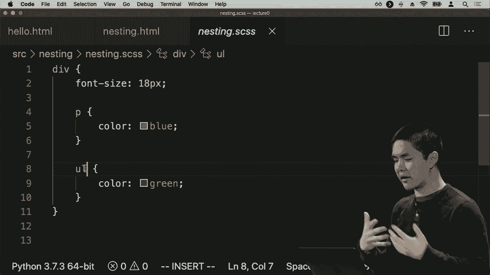

不同样式代码彼此之间的交互，所以经过这一切，如果我打开。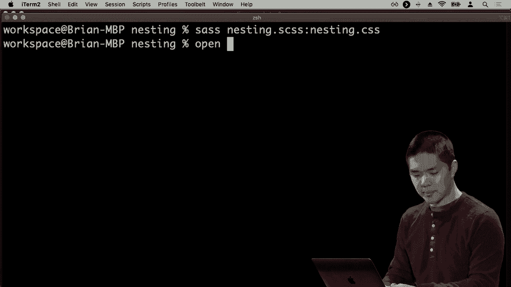

在嵌套 HTML 时，我们可能会看到像这样的东西。段落位于 div 内部，列表也在 div 内部，这两者的样式都发生了变化，但与之不同的是，这些段落位于 David 外部，列表也位于 div 外部，它们的样式。

样式有所不同，所以现在我们在 sass 中看到的两个功能。我们首先看到了拥有变量的能力，以确保我们在代码的许多地方不重复自己，现在我们看到了将 CSS 选择器嵌套的能力。

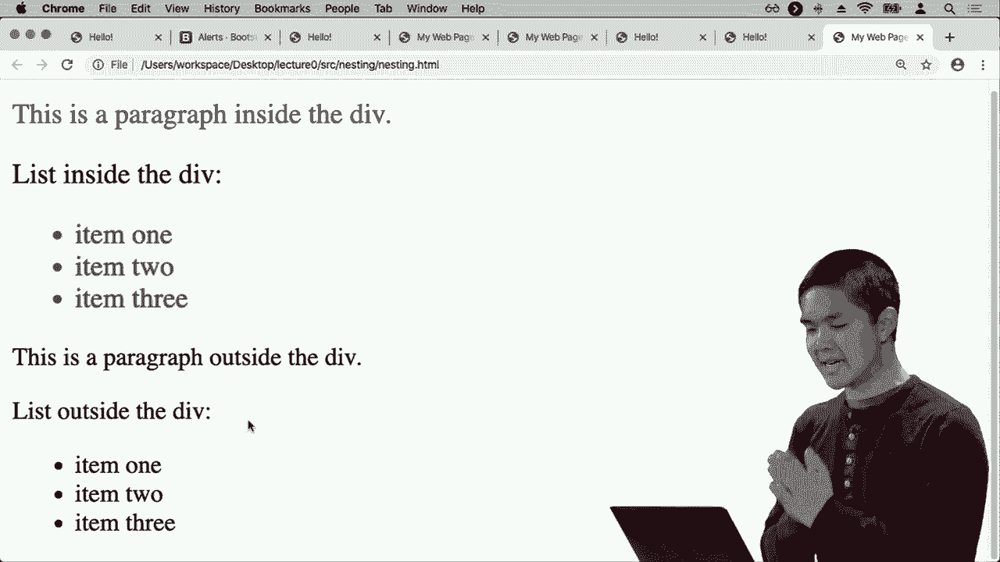

通过利用 sass 之间的关系，最后我们将看一下 sass 将给我们的最后一个功能，这被称为继承。如果我们有某些 CSS 选择器与其他 CSS 选择器相关，但它们可能添加了一些额外的信息，在这种情况下。

我实际上要向你展示。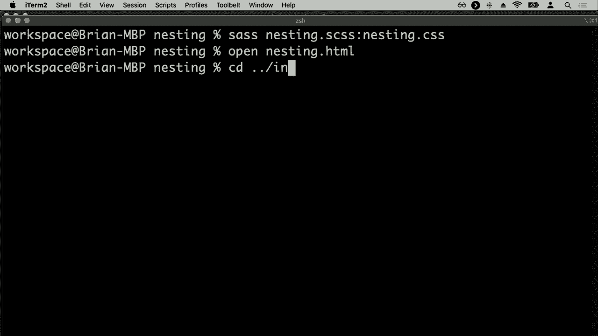

首先完成产品，让我们进入继承，并打开 inheritance.html。在这里你可以看到，我几乎尝试实现了 bootstrap。样式警报消息在 HTML 中，我有一个位于顶部的成功消息，一个警告消息，然后是每条消息中的错误消息，你会注意到我们的。

以不同的方式进行样式，尤其是它们。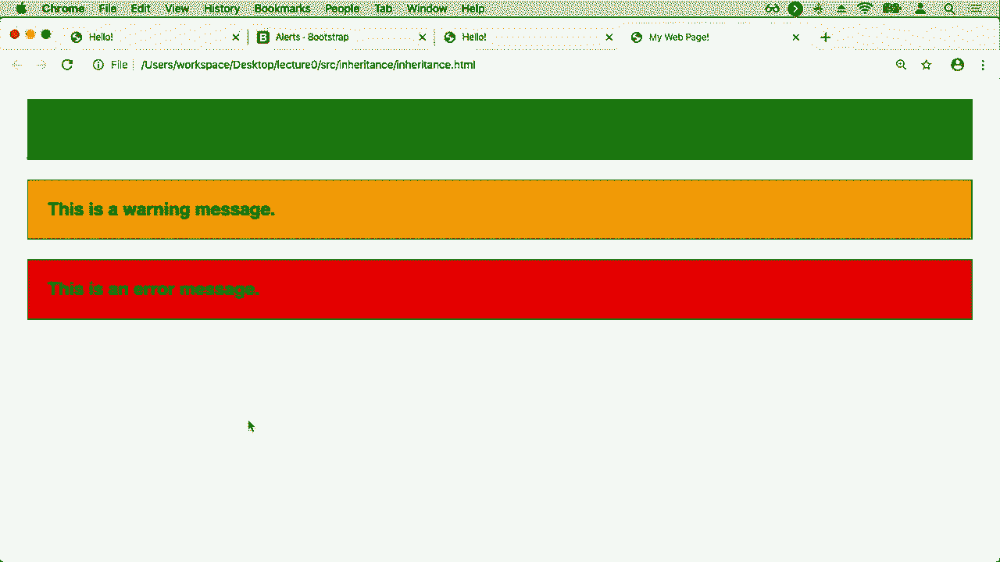

每个颜色不同，但尽管如此，它们有很多共同点，它们共享一个公共边框，共享一个公共字体，共享一个共同的大小，以及许多其他属性都在这些元素之间共享，只是它们之间有一些不同的地方，我本可以写三种不同的 CSS。

选择器处理所有这些情况，但可能会有一些重复。所以我可以利用 sass 提供的功能，让我们看看 inheritance 的 CSS，查看代码。虽然一开始看起来有点晦涩，但这就是我所做的。

我在这里定义了一个%，这就是通用消息将是什么，我可以稍后扩展以添加额外信息到所有消息，无论是成功消息、危险消息还是警告消息。它们都会有相同的边框。

在它周围添加填充和边距，但每个特定消息会略有不同。它们有什么不同呢？让我们来看这里。任何具有成功类的内容，我将说它扩展了这个消息，通过扩展这个消息，我的意思是，任何具有成功类的内容。

将会继承所有这些CSS属性，包括字体、边框、填充和边距，但它会添加额外的信息。特别是，我们将添加一个颜色，成功消息的背景颜色将是绿色，我扩展了。

消息是什么，但特别说这个消息有一些额外的样式，我们也将分配给它，其他两个消息的行为非常相似，我的警告消息扩展了消息，但背景颜色应该是橙色，最后错误消息。

这也扩展了消息，但这次，给我们一个红色的背景颜色。因此，现在当你将所有这些编译到 inheritance.dot CSS 中时，预先编译的就是这个，最终会看起来像这样。它将我写的内容翻译为成功、警告和错误。

应该有所有这些属性，但成功还应该有这个背景颜色，警告应该有这个。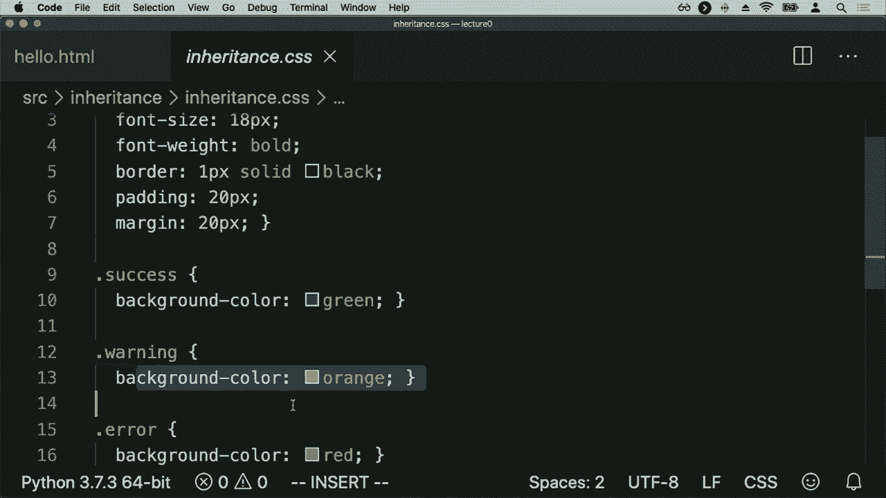

背景颜色错误应该有这个，背景颜色所以我们又可以。我们可以写这段CSS，SAS没有做我们自己用CSS不能做到的。SAS只会让我们更容易做很多相同的事情，所以我们可以用更好的语法写东西。

通过说成功消息从消息中继承，但添加了背景颜色，警告和错误消息也是如此，但使用更简单、更好的语法，这样我们就可以让计算机将SAS代码编译成CSS。

这就是我们在使用HTML和CSS构建网页程序时所见的一些基本知识。我们看到如何使用HTML描述网页的结构，决定页面上要显示什么，然后我们看了CSS，如何用不同的方式来美化我们的页面。

自定义样式，比如颜色和布局，但也考虑响应式设计，比如在手机屏幕或平板上的表现，确保我们的网页在这些屏幕上看起来也不错，最后我们看了一下Sass，作为CSS的扩展，增加了许多额外的功能。

具有变量、嵌套和继承等特性的功能，使我们更容易编写可以应用于网页的样式。

接下来我们将过渡到如何在更大的网络应用中使用HTML和CSS，同时开始整合其他工具，如Python、JavaScript和其他语言及框架。这就是使用Python和JavaScript的网络编程。
