# 哈佛CS50-WEB ｜ 基于Python / JavaScript的Web编程（2020·完整版） - P5：L1- github操作 1（Git与GitHub基本操作） - ShowMeAI - BV1gL411x7NY

[音乐]。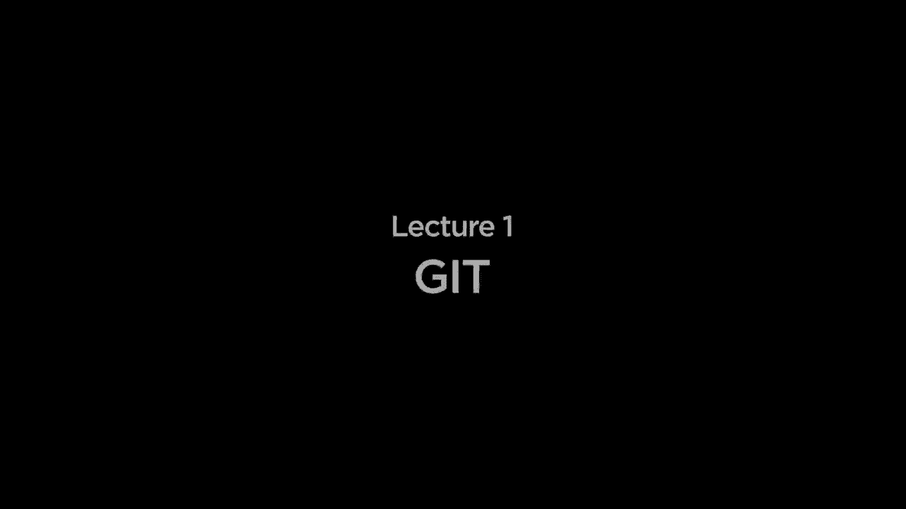

好的，欢迎大家回到Python和JavaScript的网页编程课程中。所以下次我们看了两种语言，HTML和CSS，这两者都可以用来设计网页。HTML用来描述网页的结构，以决定我们希望在页面布局中包含什么内容，然后是CSS。

我们用来描述页面的样式，想要什么颜色以及周围的空间，今天我们将关注一个工具，随着我们开始开发这些网页应用，特别是我们将要查看一个叫做Git的工具，Git的作用是什么。

作为一个版本控制工具，虽然不一定仅限于网页程序，但我们将用它来开始开发更大、更复杂的网页应用，随着本学期的进展，Git将使我们能够做到的事情有几项。

首先，Git是什么，它是一个命令行工具，可以让我们跟踪代码的更改。曾经在我第一次开始开发网页应用时，我记得我在一个文件上工作，当我想进行更改时，我可能想要保存那个版本。

旧版本，所以我会复制文件，然后只对复制件进行更改，但这很快就会变得混乱，特别是当你在不同阶段有很多不同版本的代码时，跟踪它们就会变成一场噩梦，因此，Git将使我们能够做到。

跟踪我们对代码所做的更改，所以我们可能最初会创建一个文件，保存那个版本，但随着时间的推移，当我们进行更改、添加或删除内容时，我们可以保存各种不同部分代码在不同时间点的快照。

并且轻松引用我们对代码所做的所有更改。此外，Git将使我们在较大规模的网页应用中方便地同步代码，因为通常并不只是一个人工作在整个应用上，通常你是和同事一起工作的。

以及多个同事在同一应用程序上同时工作，这个过程的一个确实棘手的部分是找出如何在不同人之间同步工作。如果我在网页应用的部分做了更改，我希望确保我的同事也能看到。

这些更改，并获取我所做的最新更改，然后我想能够获取我正在合作的人的最新更改，所以我们需要。

一种同步所有内容的方法，而这将使我们能够做到这一点。我们将拥有一个版本的代码存储在我们所称的在线**repository**中，而我和我的合作伙伴（例如）都能够访问同一个。

**repository**中的相同文件处于相同状态。如果我和另一个人对这些文件进行更改，我们都可以进行更改，然后。

将它们同步回去，也就是说将更改推送到服务器上，以便服务器拥有最新的，最及时的代码版本。之后，在我们都将更改推送到服务器后，我们可以从服务器拉取更改，以便获取访问权限。

最新的代码版本，因此无论如何，只要我与我的合作伙伴在同一个项目上工作，我们可以使用**Git**来同步我们的工作，以便我能够访问同事的最新更改，反之亦然。**Git**还使我们能够执行许多。

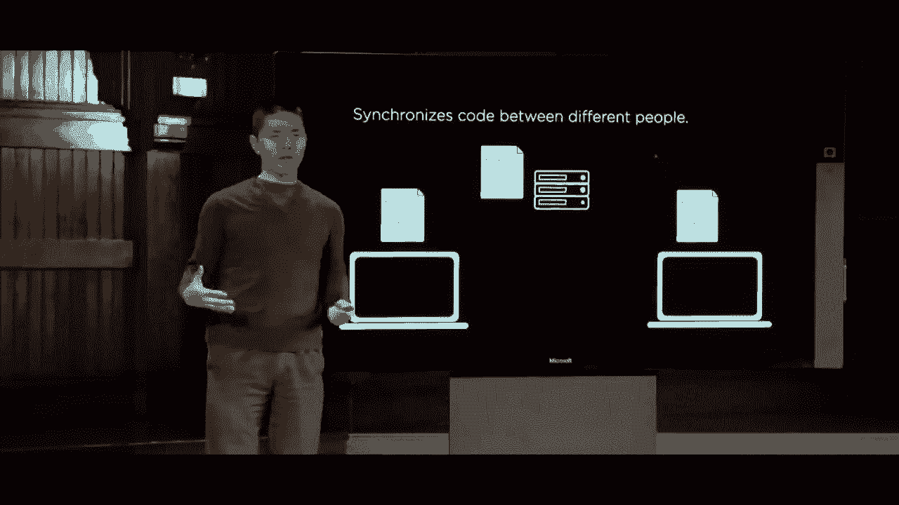

例如，**Git**允许我们测试代码的更改而无需。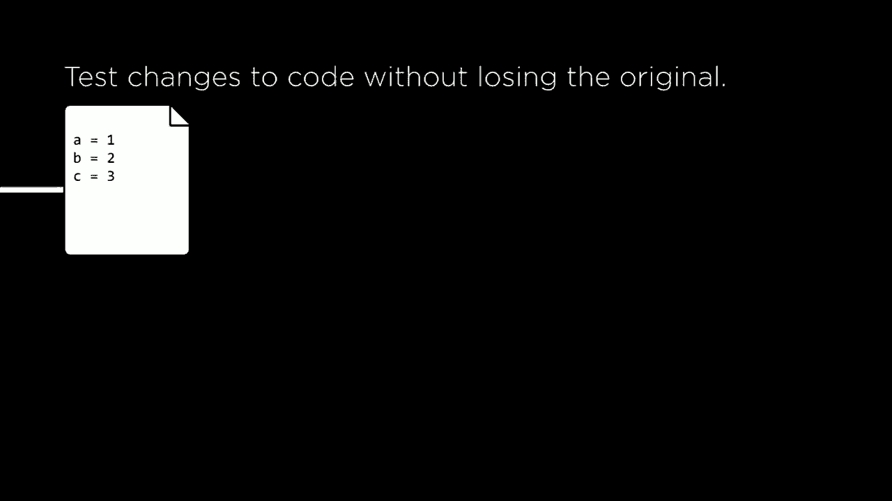

例如，想象一下，当我在编写程序时，可能会尝试做一些更改，但不确定这些更改是否有效，所以我想测试这些更改，但又不想失去对程序原始工作版本的访问。

如果出现问题，那么**Git**让我们能够这样做，它允许我们进行操作。

让我们在一个独立的分支上对代码进行更改，以便在我们满意之后，可以将这些更改合并回代码的原始版本，在我们确信这些更改是我们想要的之前能够测试这些更改。

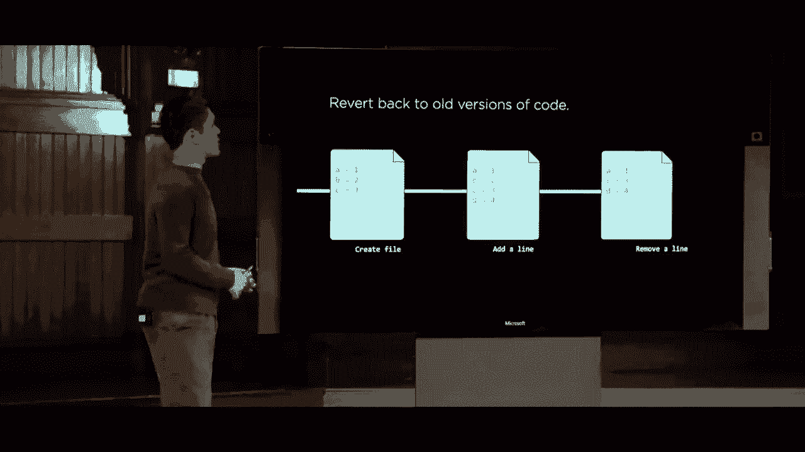

**Git**提供给我们的一个强大功能是能够回退。

回到我们代码的旧版本，因此可以想象这样一种情况：我一直在处理一些代码，意识到目前的做法并不是我想要的。**Git**让我们能够说，最近的更改并不是我想要的，我想回到代码的先前版本。

**Git**使我们很容易回到之前的版本，因此今天的目标是学习如何使用这个工具，了解各种流行且常见的**Git**命令，以便在开发网页应用或其他与代码相关的项目时使用，因为版本控制。

控制确实提供了许多有用的功能，这些功能在你开始处理越来越大项目时非常实用，但最终，当我们开始处理这些 git 项目时，它们需要存储在某个地方，以便我们能够从任何地方下载，这样我和我的伙伴都能访问。

在同一个代码中一起处理同样的文件，因此为了做到这一点，我们需要将我们的 git 代码托管在某个地方，有许多不同的网站可以做到这一点，但其中一个最受欢迎的网站是 github。

一个存储 git 仓库的网站，所有的仓库就像是一个文件夹，里面保存了与我们的代码相关的许多代码和文件。所以我们将在一个叫做 github 的网站上托管这些代码，然后在我们的电脑上可以访问这些 github 仓库。

通过更改仓库内的文件来操纵这些仓库。所以我们先来看一下 github，看看我们该如何继续。

创建我们第一个 github 仓库，如果你还没有 github 账户，可以通过访问 github.com 免费注册一个账户。我现在就去 github.com/new。github.com/new 是我创建新 github 仓库时需要访问的页面。

让我们来看看我需要做什么来创建一个仓库。第一件事是给我的仓库命名，所以在这种情况下，我将这个仓库叫做 hello。你可以给它任何你想要的名字，只要这个名字不与你已有的其他仓库名称冲突。

github 选项让我为这个仓库提供一个描述，我就说使用 Python 和 JavaScript 的网页编程。然后 github 给我选择，我是否希望这个仓库是公开的，这样任何人都可以看到这个仓库。并不是每个人都能做出更改，但它是公开的。

如果有人想下载我的代码并试用，它是公开的，这意味着任何人都可以访问，或者是私有的，这意味着默认情况下只有我能看到这个仓库，但我可以选择是否让其他人也能看到，并且可以选择具体的个人。现在我就去做这个。

使这个仓库公开，然后我会向下滚动，点击绿色的创建仓库按钮，以便创建这个新仓库。所以我点击了创建仓库按钮，这就是 github 仓库页面。现在你会注意到这里有很多说明，但没有文件，因为目前我还没有。

我第一次创建 git 仓库时得到了一个空的仓库，里面没有任何内容。所以我现在想要做的是将这个仓库下载到我的电脑上，以便我可以添加一个包含我想要的 HTML 的 HTML 文件。

使用git来跟踪，所以我将如何做到这一点呢？为了做到这一点，我们将查看第一个与git相关的命令，它被称为`git clone`，这是一个我们可以运行的命令，以从互联网获取一个代码库并下载到本地。 

在我们自己的计算机上，所以你需要在计算机上安装git。

在任何Mac、PC或Linux机器上安装它，一旦你这样做，你要做的是在计算机的终端中运行`git clone`。

由你尝试下载的git代码库的URL来标识，所以你可以想象，这里是你的计算机，而上面是某个服务器，那里有一个git代码库，GitHub就是这样的服务器之一，但还有其他服务器，上面是包含你关心的文件或其他文件夹的代码库。 

如果我运行`git clone`，后面跟着我想要的代码库的URL，效果就是代码库及其所有内容将下载到我的计算机上，以便我现在在我的计算机上有一个副本。

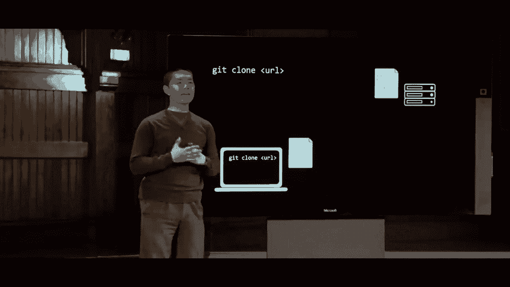

原本在那个git代码库内的所有内容，所以现在我们。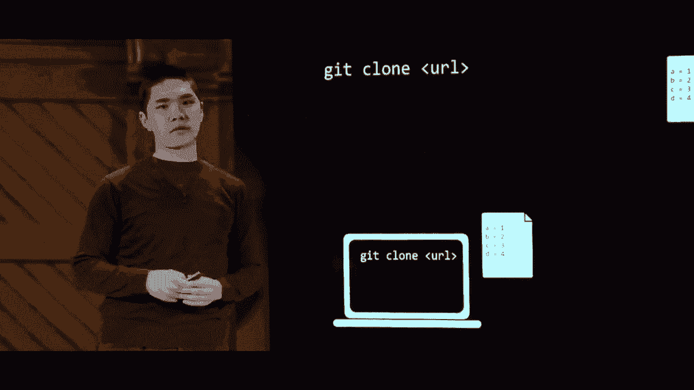

你需要知道如何克隆一个代码库，让我们实际尝试一下，我们刚刚使用GitHub创建了一个代码库，现在让我进入我的终端，实际尝试克隆这个代码库，这样我就可以在计算机上有一个副本，并可以开始进行一些更改。 

我的lecture 1目录和第一个。

我需要的事情是git代码库的URL，所以如果我返回GitHub，你会注意到它给了我一个HTTP链接来下载我的git代码库，所以我有几种不同的方法可以用来克隆。 

包括像用户名和密码这样的内容，我必须输入以证明这是我的GitHub凭证，或者如果你熟悉SSH，这是一种身份验证的另一种方法，你可以将公钥提供给GitHub以进行身份验证，但不需要。 

如果你对这种技术不太熟悉，不用担心，关键是这个URL是对应我代码库的GitHub URL，所以我。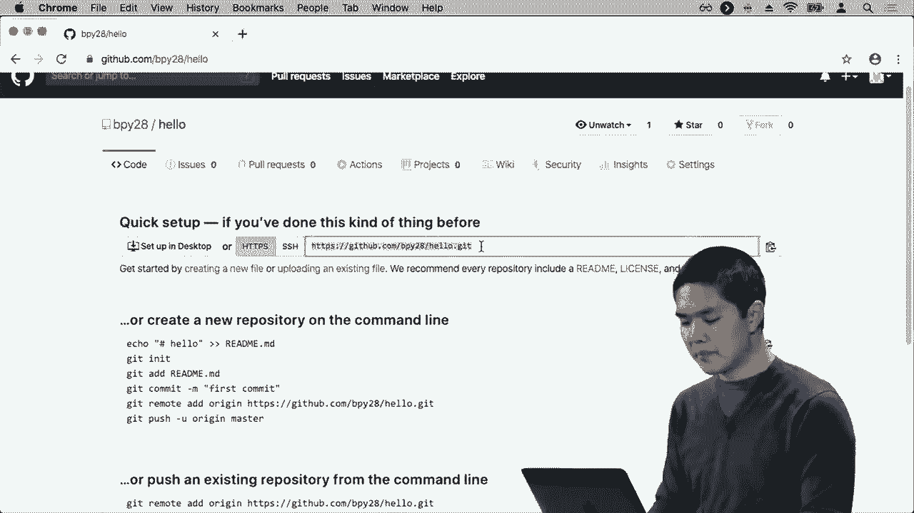

我将复制那个URL，然后在我的终端中输入`git clone`，然后我会粘贴我想要克隆的包含该代码库的URL，然后按下回车，它显示我正在克隆到一个名为hello的目录，然后它说你似乎克隆了一个。 

空仓库，它说这是一个警告，但没关系，因为我知道我克隆了一个空仓库，因为这个仓库是全新的。现在我可以在终端中输入 LS 命令，终端中的 LS 命令表示列表，实际上它会列出所有的。

当前在这个目录下的所有文件，所有在我的 lecture one 目录下的文件和文件夹，其中目录只是一个华丽的名称。现在我在 lecture one 目录下有一个名为 hello 的文件夹，而之前是没有的。我将进入这个 hello 目录。

要进入一个目录或文件夹，可以使用 CD 命令，CD 代表更改目录。如果我输入 CD hello，我现在就会进入 hello 目录。如果我输入 ls，你会看到这个 hello 目录现在是空的，因为这个仓库是空的，我克隆了它。

现在这个仓库里什么都没有，所以我想在这里实际添加一些内容。这个仓库只有在我跟踪我的代码以及我对代码所做的更改时才有用，所以我现在就来试着向这个仓库添加一些代码，第一件我做的事是。

创建一个新文件，我们可以通过打开文本编辑器来创建一个新文件，但在终端中实际上有一个用于创建新文件的命令，叫做 touch。所以在终端中，我可以输入 touch hello.html，这样会创建一个名为 hello.html 的新文件。如果我输入 ls。

我可以看到确实有一个文件，叫做 hello.html，现在在我的 hello 文件夹里。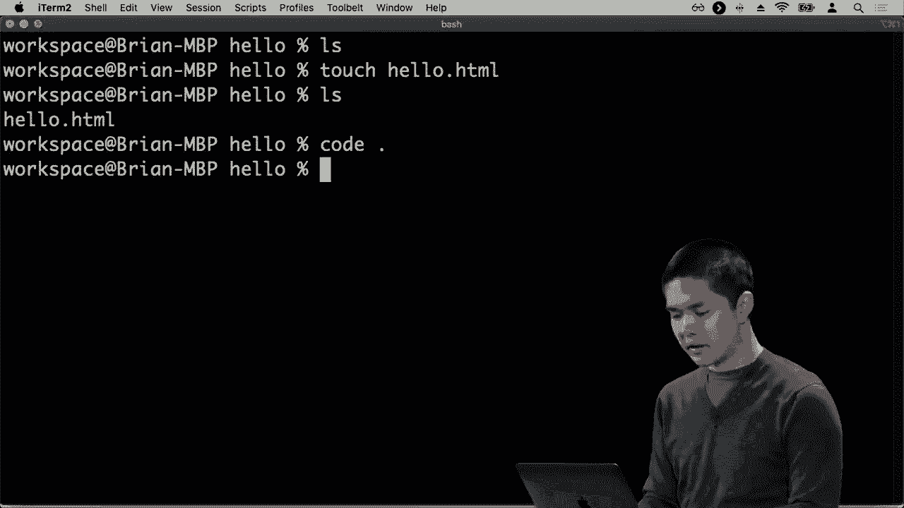

让我现在在文本编辑器中打开这个 hello.html 文件。我再次使用 VS Code，现在让我给 hello.html 添加一些文本。我将添加一个简单的 HTML 页面，和我们之前看到的相同，其中我会给它一个标题，标题将是 hello，页面的主体部分将是。

hello world 同样的 HTML 页面我们已经看到好几次了，现在就在这个仓库里，当然我还没有对这个仓库进行任何保存，我还没有说我想要将这些更改保存到仓库中，并且仓库并没有跟踪我写的每一个字符，我需要告诉。

git 这是我当前文件的状态，我想要跟踪的内容。想要保存的内容，在 git 的世界里，我们称这些保存点为提交。当我说我要进行提交时，我的意思是我想保存所有文件、文件夹和其他资源的当前状态。

在仓库内部，基本上拍摄它们当前的快照。

位置，以便稍后我可以引用它们，但为了做到这一点，实际上有几个步骤，所以我们需要遵循的第一步是一个额外的命令。我们看到 git clone 是我们可以用来克隆仓库的命令，将一个仓库下载到我们的本地。

计算机接下来的命令将是一个叫做 git add 的命令，而 git add 将让我们告诉 git，我想添加一个文件，以便下次我保存时，下次我提交时，我想对所有这些文件拍摄快照。

以便我能够稍后引用它们，为此我需要告诉 git 需要跟踪哪些文件，所以例如我继续处理这个文件，我想告诉 git 我想跟踪它，我可以运行一个像 git add 的命令，后面跟着文件的名称，比如 food pie 或 dot HTML 或者其他的。

文件恰好是，然后会显示一条消息，说好的，现在我们已经添加了 food，这现在是一个下次我提交时会被保存的文件。那么这两个步骤为什么是分开的呢？一个原因可能是，如果我正在处理很多不同的文件，比如说我正在处理 10 个。

不同的文件，只有三个我满意，三个我想保存的文件。我不想只是说保存，并且让所有内容都被保存到一次提交中，我可能想说，这三个文件是我现在真正想保存的，而其他的文件我还在继续工作，所以 git 给我们这样的能力。

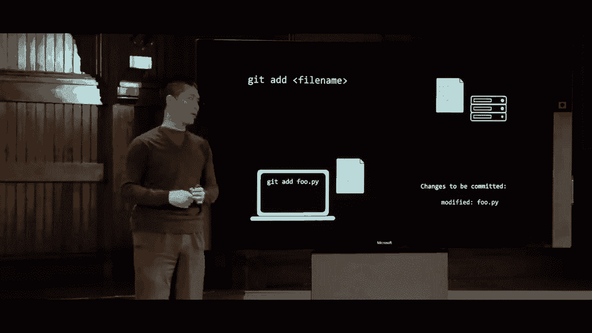

这种分离意味着让我明确表示我想跟踪这个文件，下次我保存，下次我提交时，而不是所有的文件。例如，尽管我们可以使用快捷方式，如果我们确实想添加所有文件，我们稍后会看到这些，所以让我们继续尝试一下。

我们回到我的仓库，我在这里创建了这个 hello dot HTML 文件，现在我想做的是说，我想将 hello dot HTML 添加到我的终端。我现在会再次说我这里有一个 hello dot HTML 文件，我会说 git add，后面跟着 hello dot HTML，你会注意到，到目前为止似乎没有发生什么。

因为到目前为止我还没有保存我刚才说的任何内容，我想添加 hello dot HTML 作为一个文件，这样下次我说保存时，我提交我的仓库时，它会跟踪我现在的更改。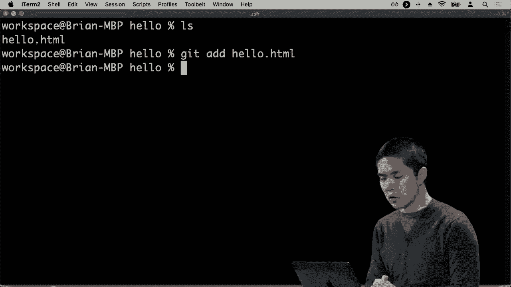

制作 - hello HTML 那么我实际上是如何进行提交的，我如何说保存这些文件的状态呢？这将是一个更多的 git 命令，被称为 git commit。当我说 git commit 时，我会告诉我的 git 仓库我想保存当前状态的快照。

仓库跟踪对文件所做的任何更改。

我已经使用`git add`添加了该文件，我们的运行方式是执行`git commit`，后接`-M`，然后用引号括起来的信息，这个信息被称为提交信息，它是对你在最近提交中所做更改的英文描述，或者使用你的语言。

随着时间推移，当你在一个大型项目上工作时，你可能会做很多提交，因为在对程序进行大量更改时，你会一次又一次地提交，每次对项目的新版本进行更改后，你可能想要参考之前的提交，但只有在你能识别出在哪个提交中进行了特定更改时，这样做才有价值。

在这种情况下，它告诉我已经对一个文件进行了九次插入，因为之前该文件并不存在，现在一个包含九行的文件存在了，现在我已经保存了hello。

例如，通过提供一些英文信息，给自己做一些备注，以便以后能回顾所有提交信息，并知道在这个提交时我做了什么更改，这样可以更容易地跟踪你对特定git仓库所做的所有更改。因此，当你输入`git commit`后加上`-M`时，你可能会包含类似“我添加了一行新内容”的信息，当你这样做时，git会保存你代码的一个新快照。

此时，保持旧版本或曾经存在的旧版本记录在仓库中。所以让我们尝试实际提交一次，看看这将如何工作。我们已经通过运行`git add`添加了hello HTML文件作为一个需要跟踪的文件，但现在当我们满意时。

我们可以对文件进行额外的更改，如果我们想的话。我可以回到终端，输入`git commit`，然后加上`-M`，接着可以指定提交信息，一些英文描述我在这次最新提交中所做的事情。我所做的就是添加了hello.dot HTML文件。

我会说我添加了hello到HTML文件，这是我在最近提交中所做的更改。我会继续按下回车，这里告诉我有一个文件已更改，进行了九次插入，所以它在跟踪添加或插入的行数。

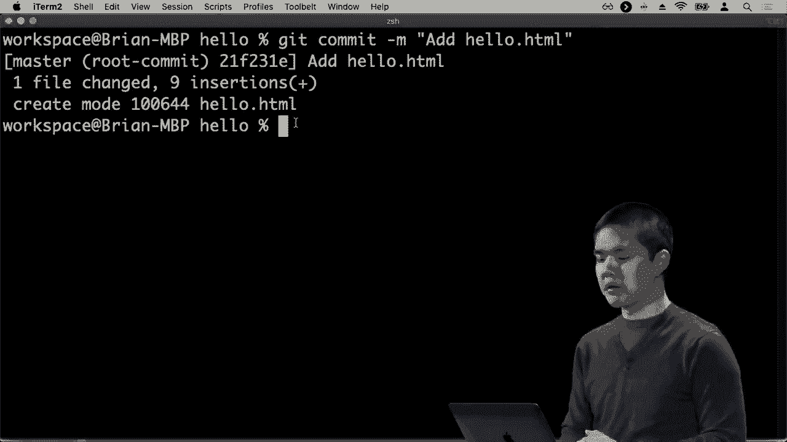

现在你可以想象，如果我返回到我的git仓库，在github网站上刷新，或许我会看到hello.dot HTML文件，刷新后，结果是，没什么变化，我没有看到我的hello.dot HTML文件。

因为在我的更改反映在线之前，我缺少最后一步，请记住，当我运行 git clone 步骤来克隆 GitHub 上的仓库时，GitHub 有一个版本的仓库，而我运行 `git clone` 来将该仓库的副本下载到我自己的电脑上。

我运行 `git add` 来添加 hello dot HTML 文件，或者我运行 `git commit` 来表示我想保存这些更改，我一直在对本地版本的仓库进行这些更改，实际上并没有影响到已经在 GitHub 上的内容，我所做的更改仅发生在我自己的电脑上。

如果我想将这些更改推送到 GitHub，那么我需要一些额外的命令，实际上我们可以使用一个名为 `git status` 的命令来查看我仓库当前发生的情况，`git status` 会告诉我们当前在我的仓库里发生了什么。

如果我在当前状态下运行 `git status` 命令，Git 会向我报告并告诉我我当前在分支 master 上，稍后再说分支的事情，但它说我的分支比 origin master 超前一个提交，因此这是一种啰嗦的说法，表明我的本地版本。

我电脑上的仓库版本比 GitHub 上的原始版本超前一个提交，也就是我拥有的一个提交是 origin GitHub 没有的，并且它友好地告诉我可以使用 `git push` 命令来发布本地。

`git push` 是我可以使用的一个命令，表示我想将更改实际推送到服务器，推送到 GitHub，以便它们在那里被反映。因此，在检查了当前状态之后，我们可以使用命令 `git`。

推送时表示现在我所做的任何更改，在我运行 `git push` 时，这些更改会被推送到 GitHub，因此 GitHub 可以访问我现在所做的所有提交。所以让我们试试这两个命令，`git status` 查看我仓库当前的情况，然后 `git push` 表示我。

我想现在将这些更改推送到 GitHub，以便在线版的仓库与我自己电脑上的本地版本内容相同。好的，现在在我的终端中我可以运行 `git status`，我看到我在分支 master 上，与之前相同，只是消息稍有不同，因为。

当前仓库里没有任何内容，但关键在于现在我可以运行 `git push` 命令，告诉系统将我对仓库所做的所有更改推送到 GitHub。因此，我会输入 `git push`，接下来会发生的是，它会压缩所有信息。

要将其推送到 GitHub。

到这个网址，现在如果我返回到，github 网站 github.com 斜杠我的。仓库并刷新页面，我会看到，实际上我现在看到一些。不同的东西，这就是 github x 的样子！

用户界面实际上看起来像，它给我几条信息。

例如，它告诉我，目前在这个。仓库中有一次提交，就是我刚刚做的，那是在一个分支上，所以如果我只创建了一个分支，默认分支，但我们稍后会看到如何创建更多分支，特别是下面，你会看到当前的文件。

在这个仓库中存在的，当前我有这个 hello HTML 文件。就是我推送的那个，特别是旁边是提交。信息，最近一次我修改这个文件的，信息特别告诉我我添加了，hello HTML 文件。

提交影响 hello dot HTML 的内容，如果我现在不点击 hello。dot HTML 实际查看其内容，我会看到之前写入的相同内容，我看到，doctype HTML，然后是我们看到过几次的 hello world。页面，因此我在自己的文件上进行了更改。

计算机上，我现在已将它们推送到，github 所以它们现在在这个。仓库中，现在是公开的，以便，任何其他人如果他们想要。协作这个项目可以获取，这个 URL 克隆到他们自己的计算机。并在本地进行更改，因此现在我们可以探索我们。

也许我能对这个网页进行额外的更改，所以如果例如我想给，网页添加一个标题，比如我可能在。主体的顶部说些像。

在一个 h1 标签中，欢迎来到我的网站，现在如果我你知道，出于良好的措施。打开 hello dead HTML 看看是什么。

看起来这不是我网页的样子，而我已经对我的 hello dot HTML 文件进行了更改，这些更改还没有保存。我可以通过运行 git status 来判断，git status 是告诉你当前你在，仓库内发生了什么的去处，所以在这里我们看到有更改未。

已暂存以便提交，这是一个华丽的说法，指的是已更改的文件，但我还没有说我想要在下一次提交中跟踪它们，它告诉我我修改了 hello dot，HTML，但这不是 git 目前将要跟踪的东西。下次我保存时，所以如果我想保存 hello。

dot HTML 当我下一次提交时，首先需要运行 git add hello。HTML 然后我可以运行 git commit，但其实这里有一个简写，如果你想同时添加所有已经。更改的文件并提交，简写是 git commit - am 记得之前我们刚才。

使用 -M 来指定一个消息，-a.m意味着git提交所有已经更改的文件，a代表所有，并且还提供一个消息，因此你可以将git add步骤和git commit步骤合并成一个步骤，说明我想提交所有更改的文件，然后我会提供一个。

消息，我到底改变了什么，我添加了一个标题，我将按回车键，它记录了我现在更改了一个文件，并插入了一行，所有我做的只是向该文件添加了一新行，现在如果我运行git status，它会告诉我我在master分支上，并且我领先于origin/master。

origin master是github上的版本，增加了我这一提交。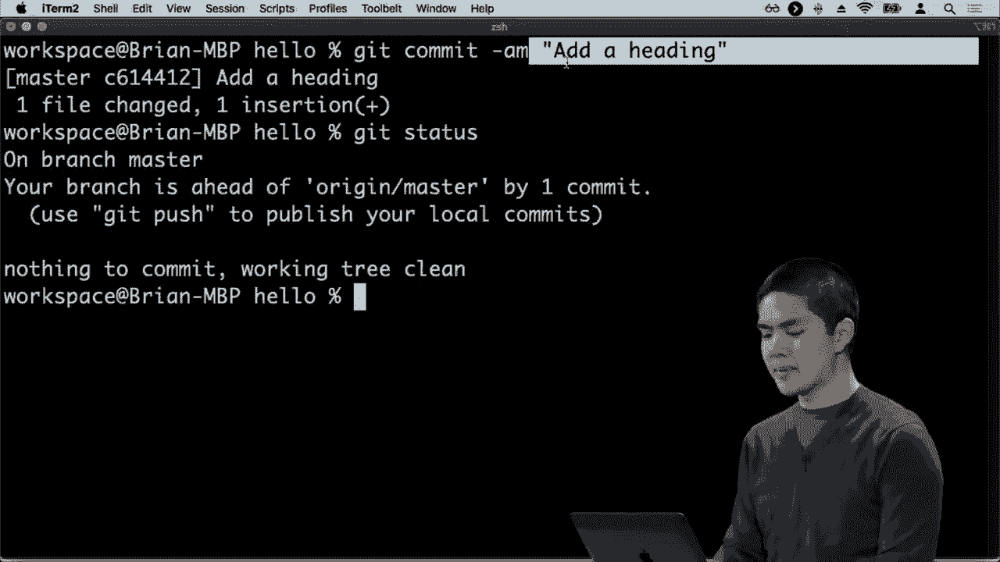

添加一个标题提交，但现在在github上，如果我刷新这个页面，它仍然显示的是那个页面的旧版本，为了让我的更改生效。

在我的电脑上，确保它们在github上是最新的，我可以直接运行git。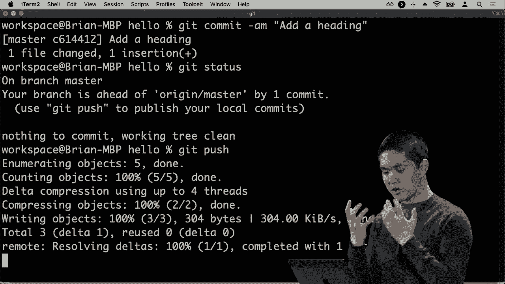

推送，将这些更改推送到github，一旦完成，我现在可以刷新github上的页面，我会看到github现在拥有我的程序的最新版本，它现在有。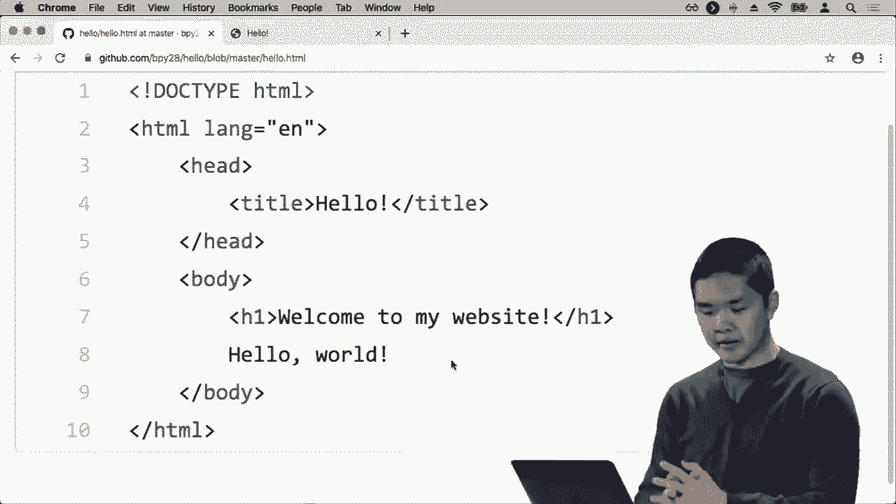

这个h1说“欢迎来到我的网站”，所以这就是git push，现在我可以说我想将我对Myatt仓库所做的更改推送到某个远程服务器，例如github上的远程服务器，但我们也可以反向操作，你可能会想象。

也许在github上的版本比我拥有的版本更新。

在我的电脑上，在这种情况下，我想下载当前存在于的最新版本的仓库。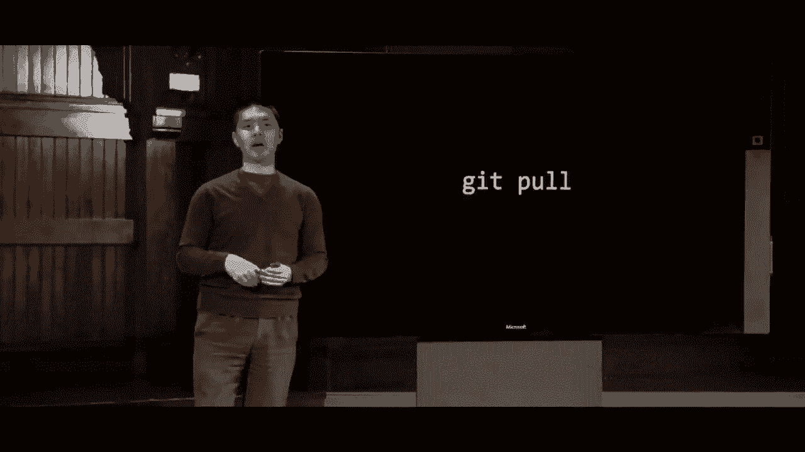

github，为了做到这一点，我们可以使用一个叫做get pole的命令，怎么做呢？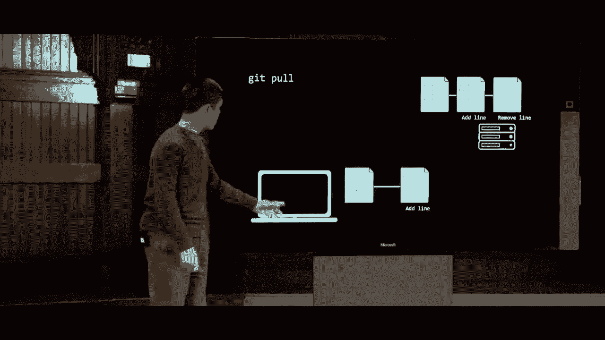

当我运行git pull时，发生的事情是与git push相反。git push将我在电脑上的更改推送到github。git pull会说取回当前在github上存在的更改，并拉取最新的更改到本地，这样我和我本地的版本。

仓库可以获取当前在github上的所有代码的最新版本，我们可以举例演示，比如我回去看看github网站本身，因为在github上，我实际上有能力使用github界面编辑文件，所以我将模拟一下。

例如，其他人在这个项目上工作，也许其他人添加了一个第二个标题，他们添加一个h2，内容是“你好”，然后他们可以提供一个提交消息，这大致上是-dash M的图形等效物，以及我们之前提供的消息，他们可以说添加了h2。

然后提交，这是一种编辑 Git 仓库的方式，实际上是在 GitHub 界面内部进行添加和编辑。这使你可以直接编辑文件，添加或修改任何行，因此现在 GitHub 上的版本实际上与我们电脑上的版本不同。

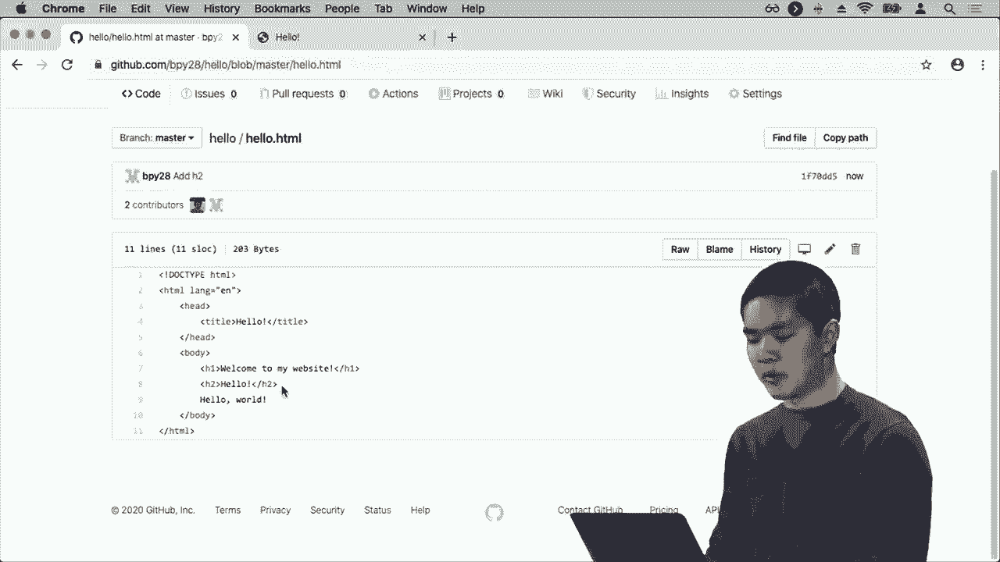

如果我们查看 hello.html，我只看到 h1，而没有看到刚添加的 h2，因为这是一个我尚未拥有的更近期的提交。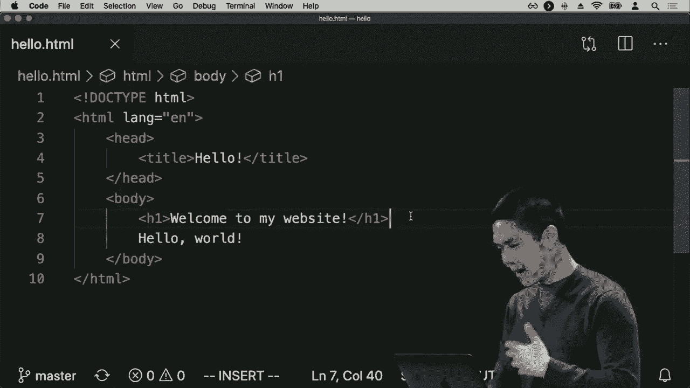

访问，但是如果我想下载那个提交，我可以在我的终端中输入 git pull 来实现。

下载并更新了一个文件，进行了些修改，所以现在如果我回到文件，你会注意到我现在自动获得了最新版本的文件，现在有了这个说 hello 的 h2，因为我从中拉取了最新版本的文件。

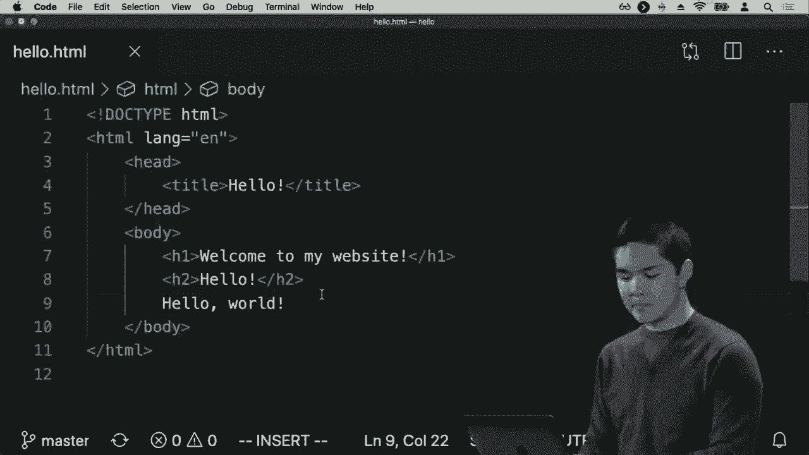

通过组合 git push 和 git pull，我可以对我的代码进行更改，将其推送到 GitHub，并获得已在 GitHub 上的最新版本代码。但是在这个过程中，你可能会想象我们可能会遇到某种问题，特别是如果我一直在。

对我的代码进行更改，而其他人在我的同一个项目上工作。
