# 哈佛 CS50-WEB ｜ 基于Python ／ JavaScript的Web编程(2020·完整版) - P6：L1- github操作 2 (github冲突处理与分支) - ShowMeAI - BV1gL411x7NY

如果我们都对代码的同一部分进行了更改，然后尝试同步我们的工作，会发生什么呢？我们将会遇到某种冲突，因为我对同一行进行了更改，而我的同事也对其进行了更改。

这种类型的冲突称为合并冲突，当试图将我的更改与其他人的更改合并时。

其他情况让我遇到了一个情形，突然之间 git 不知道该怎么做，因为有两个不同的更改集，我们需要弄清楚如何解决这些冲突，以及在遇到这种冲突时该怎么做，所以如果我们真的遇到这种合并冲突，会发生什么。

如果我试图从其他地方合并或拉取一些更改时，通常会发生这样的情况。假设我运行 git PO，但有一些冲突的提交。

有一些在线内容与我当前版本的仓库冲突，我会收到一条消息，像这样，有一些冲突，表示某些文件的合并冲突失败，你需要解决这些冲突，然后提交结果。那么这些冲突可能是什么样的呢？通常是这样的。

git 会自动在文件中添加一些元数据，以描述它无法完全理解的内容，虽然信息看起来非常晦涩，但我们可以将其提炼为几个关键部分。所有内容在。

在这些箭头顶部和这里的等号之间是你的更改。

我在仓库的版本中所做的更改与其他一些更改发生了冲突，这些等号和下面的箭头之间的内容是远程更改，即我试图拉取的来自 github 的更改，这些更改以某种方式发生了冲突。

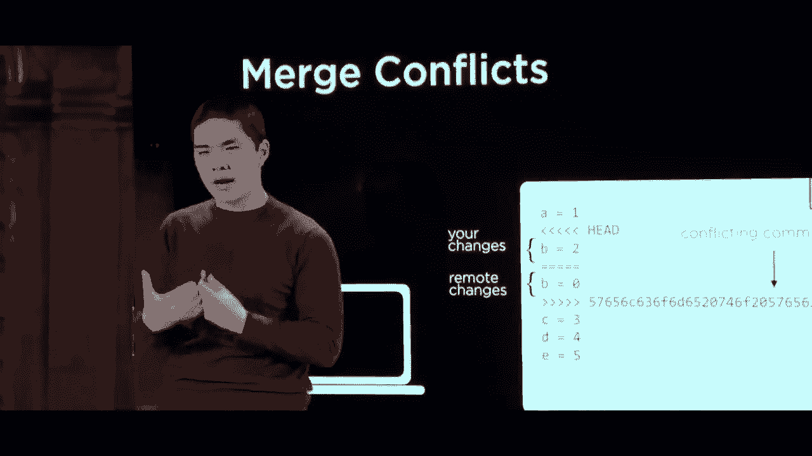

我目前正在处理的内容，以及这一串数字和。

这里的字符是冲突提交的哈希值，因此每个提交都有一个哈希值，它是一串数字和字符，可能是唯一的，有助于识别任何特定的提交，并且每次你进行提交时，git 会自动生成一个哈希。

提交，稍后我们将看到你如何查看所有可能的提交，但这里 git 只是很有帮助地告诉我们，这是导致冲突的提交，仅供我们参考。为了解决这个合并冲突，我们首先需要删除所有这些合并文件。

并决定我们想要的冲突解决方案，因此也许我想保留我的版本的更改，或者我想保留远程版本的更改，已经在GitHub上的更改，或者我想以某种智能的方式将它们结合起来。我作为程序员可以做出这样的决定。

我决定查看我的版本和冲突版本，并决定如何处理我。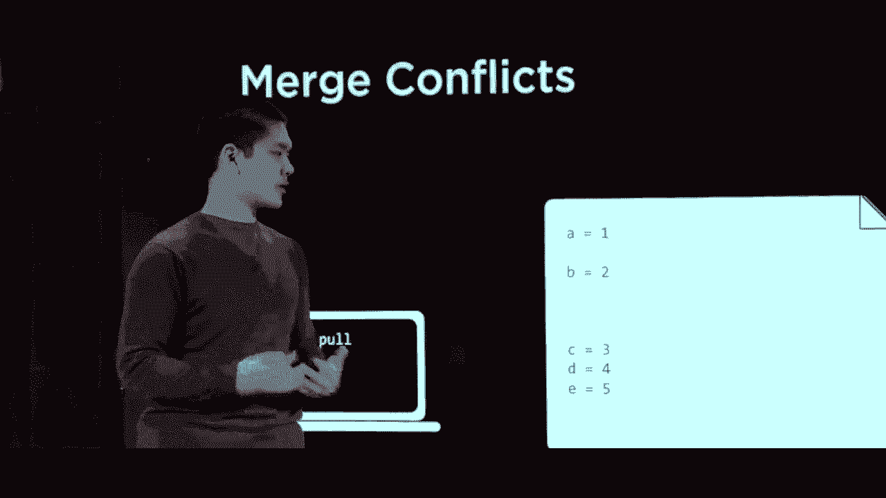

为了解决这个冲突，我将删除任何空白行，然后提交更改，说明这是我。

我希望这个程序的合并版本看起来是这样的，现在让我们看一个合并冲突的例子，看看它是如何产生的，以及我们如何处理合并冲突。现在我在我的电脑上，打算对这个页面进行更改。

说到添加第二个感叹号，一个感叹号不够，我会。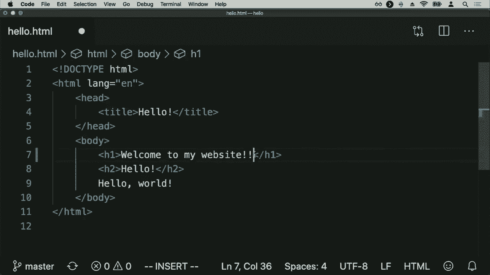

在这个h1中添加第二个感叹号，我将继续提交这些更改，我会说`git commit -am "add exclamation point"`，然后继续提交这些更改，我保存了这个程序的新版本，但我并没有。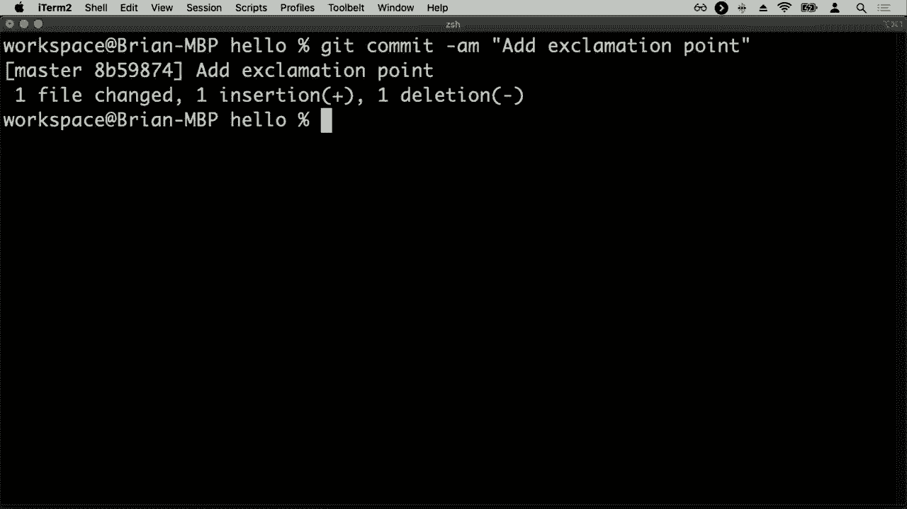

我还不会推送代码，而是要模拟其他人在同一个文件上工作，也许GitHub上的其他人决定，你知道吗，对于这个h1，我们真的想做的是通过添加一些内联样式来给它添加样式，例如，将它的颜色设置为蓝色。

他们添加了一些CSS，我们将继续写一个提交消息，他们做了什么，他们添加了一些样式，我们将提交这些更改，现在我们创建的将是一个合并冲突，其他人在GitHub上已经。

在这一行进行了更改，将这个特定的h1标签的颜色更改为蓝色。例如，我同时也在同一行进行了更改，添加了一个感叹号，并且在添加行和删除行方面完全操作，因为我们都。

在同一行上进行更改的情况下，git会很难确定该如何处理。因此在我的终端中，我将运行`git pull`，因为我想获取这些更改。当我这样做时，我会看到，好的，我收到这个消息，冲突，在hello.html中发生了合并冲突。

自动合并失败，因为通常情况下，git会尝试自动合并文件，但有时会。

现在我需要修复冲突，然后提交结果，所以让我们继续查看hello.html里面的内容，你会注意到里面有很多这些标记，而我的文本编辑器正好为我高亮显示它们，以便我能更清晰地看到，但这只是。

文本编辑器提供的高亮显示实际上并不是文本本身的一部分，但你会注意到所有这些箭头和等号。在这里是我的这行代码，代码行末尾带有额外的感叹号，下面是远程的。

相同代码的冲突版本，修改后的版本在GitHub上，而我现在正试图拉入的版本是，这个版本表明我们希望在这个特定h1元素的内联样式中使用蓝色。现在我需要做的是以某种方式弄清楚，如何将这两个合并在一起，我该怎么做。

想要解决这个冲突，在这个特定案例中，我可能会喜欢通过同时采纳两者的优点来解决这个冲突。如果在GitHub上，有人想要为这个h1元素添加一个样式属性，而我想要额外的感叹号，我可以做到两者，我可以继续添加一个额外的感叹号，然后。

摆脱我的版本，然后也去掉这些提交标记，所以继续。去掉它们，我基本上修改这个文件，直到我对它满意，直到我觉得好的，这就是我想要的解决冲突的方式。一个人添加了颜色，一个人添加了标点符号，解决它的方法是。

这个案例是同时使用它们，但这里就需要一些人类直觉。程序员并不是要查看这个文件并弄清楚，究竟我们想如何解决这个冲突，如何弄清楚如何将这些不同的更改合并在一起，但一旦我们。

满意之后，我们可以继续提交结果，我可以说git commit -m "fix merge conflict"，好的，我们修复了合并冲突，现在如果我将这些结果推送回去。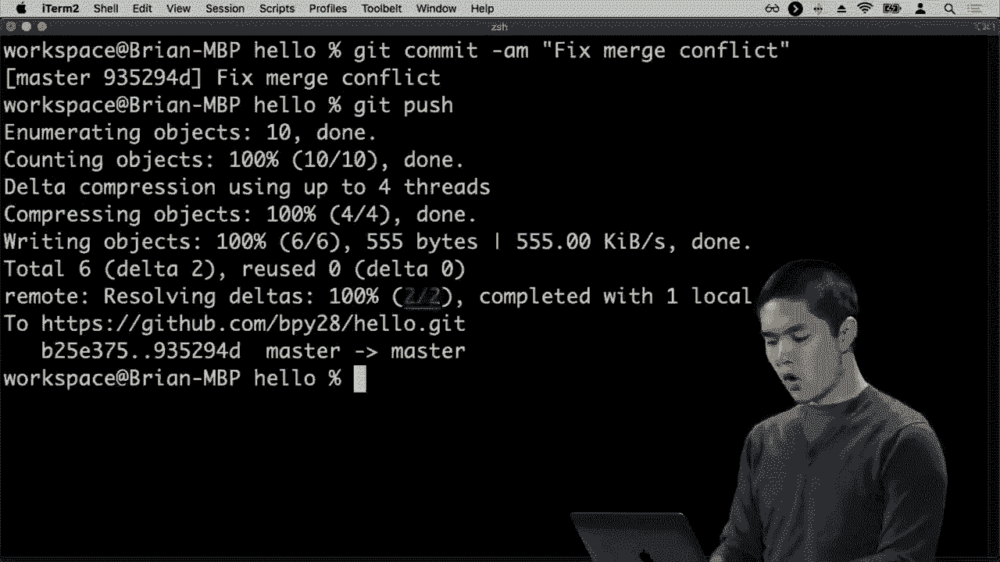

当在GitHub上完成时，刷新页面，我现在在GitHub上看到的更新代码行带有内联样式的h1，和。

额外的标点符号因为我已经解决了合并冲突，然后我把这些信息也推送回了GitHub，还有其他一些git命令是非常有用的，我的意思是有很多，但我们现在会谈论几个，第一个是git log，如果。

如果你需要跟踪你对代码所做的所有更改，想要跟踪在这个特定库中所有的提交，你只需。

运行命令 `git log`，它会输出一堆看起来像这样的信息。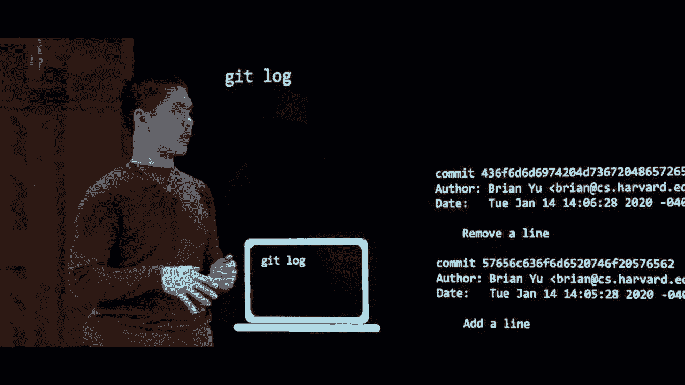

就像这样，描述每一个提交，对于每个提交，它会告诉你提交哈希，以便你可以更轻松地引用，它会告诉你是谁进行了提交，也会告诉你该提交的日期，并且还会告诉你提交信息，这样如果你需要快速查看。

回顾一下，看看这个功能是在什么日期添加的，或者谁将这一部分添加到网页上，你可以通过查看 `git log`，找到相关的提交，然后你就会知道是哪次提交。此外，如果你意识到自己进行了不想要的更改，并想回到之前的状态，这也会很有帮助。

对于上一个提交，如果是这种情况，你可以使用一个名为 `git reset` 的命令，它有许多不同的用法，但 `git reset` 实际上会。

获取当前状态的代码库，并将其恢复到一个较早的状态。

比如这个代码库，有几种方法可以使用它，像这样，你可以执行 `git reset --hard`，这意味着硬重置，将一切重置回去，然后你可以插入一个提交哈希，所以 `git log`，如你之前可能记得的那样，为你提供了每个不同提交的提交哈希，如果我想。

如果我想回到某个特定的提交，我可以说 `git reset --hard`，然后是我想要的提交信息或提交哈希，之后我将返回到该提交。或者，我可以说类似 `git reset --hard origin/master`，并回想一下，`origin/master` 是我的代码库的版本。

这是目前在 GitHub 上的代码库，因此如果我想将当前版本的代码库重置回 GitHub 上的版本，我可以使用类似这样的命令来实现，所以你运行 `git reset`，后面跟一个提交哈希，这将把你代码库的当前状态重置回它之前的状态。

还有许多其他的 Git 命令也非常有用，特别是当你开始处理更大项目时，但这些是一些最有帮助的，也是你最常使用的命令，比如添加你想跟踪的文件并使用 `git commit`。

我想保存当前所有文件的状态，推送和拉取以便能够上传和下载已更改的内容，以及一些有用的命令，如 `reset`、`log` 和 `status`，只是为了给你关于你的信息。

如果需要的话，可以让你回到一个较早的状态，但随着我们开始处理越来越多的项目，尤其是更复杂的项目时，你可能会发现，仅仅追踪一次次更改并没有你想象的那么强大。

所以我们可以探讨在一个假设的情况下可能发生的事情，比如你开始对我们的代码库进行一些更改。比如说，让我们想象你进行了第一次提交，做了一些更改，做了一些额外的更改，可能你意识到你想开始工作一个新特性。

你一直在工作的应用程序，所以你开始工作一个新特性。然后你继续在那个新特性上工作，但突然你意识到，原始代码中有一个错误，你想返回去修复那个错误，但现在我们处于一个棘手的境地。

我们想修复这个错误，但我们正在工作一个新特性。那么我们该怎么办？我们可以返回去尝试修复这个错误，但新特性又会发生什么？问题是，这个结构只是简单地变化，变化之后又变化，非常线性，只能一个接一个地进行。

一次又一次，通常在你工作一个项目时，它不会以非常线性的方式进行，你并不总是工作在一个紧接着前面的事情上，你可能在修复多个错误的同时工作在多个新特性上，你希望有某种方式来处理这些事情。

能够同时处理所有这些事情。

同时能够轻松地在它们之间切换，这就是分支派上用场的地方。分支是同时处理代码库不同部分的好方法。

所以你可能想象一个这样的情况，逐渐展开。

你进行第一次提交，开始做一些更改，做更多的更改，当你决定想要开始。

例如，针对一个新特性，而不是在同一个分支上一个接一个地进行更改，我可以创建一个新的。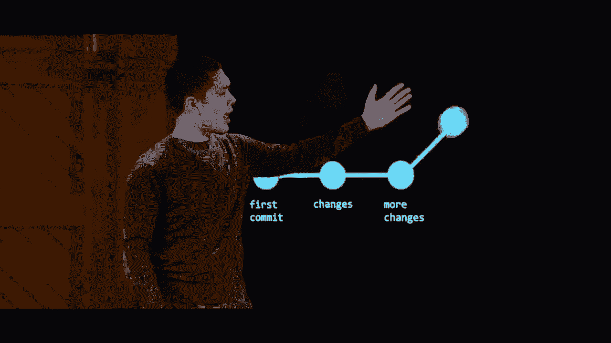

分支，我可以分支出去，说“你知道吗，我们来创建一个新分支，开始在那里工作我们的新特性。”

然后继续在那个新特性上工作，如果我稍后意识到。

你知道吗，那里有一个错误，回到这个提交，我可以返回这个提交并创建一个新分支，在那里修复那个错误。现在我有两个不同的分支。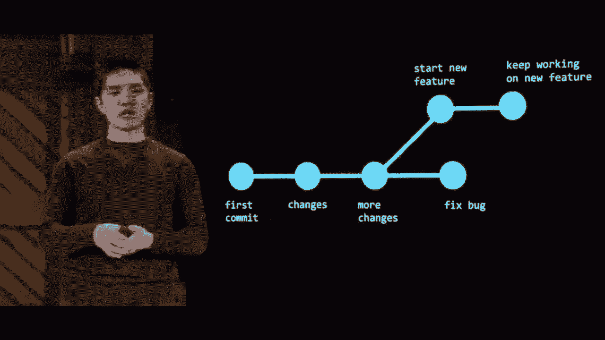

每一个可能有不同的代码，其中一个我在修复一个错误，另一个我在工作一个新特性。

新功能例如，通常每个分支都会有一个名字，所以主分支是你的默认分支，通常会包含最新稳定版本的代码，而当你在工作新的事情时，可能会有一些功能分支。

你在处理其他功能，例如，在任何时候，你的关注点只在这两个分支中的一个，关注点是你仓库的当前状态。

由我们称之为head的东西来指定，所以如果head指向master，那意味着你的仓库现在在这个修复bug的分支上，但你可以更改head，你可以。

切换你想查看的分支，你可以查看功能分支。说让我们看看那个分支，并开始在上面工作，你可以通过切换你的思维，开始在这些不同的分支上工作。切换从一个分支到另一个分支，然后再回来，只有当你。

确保你知道这个bug已被修复，并且这个功能处于令人满意的状态。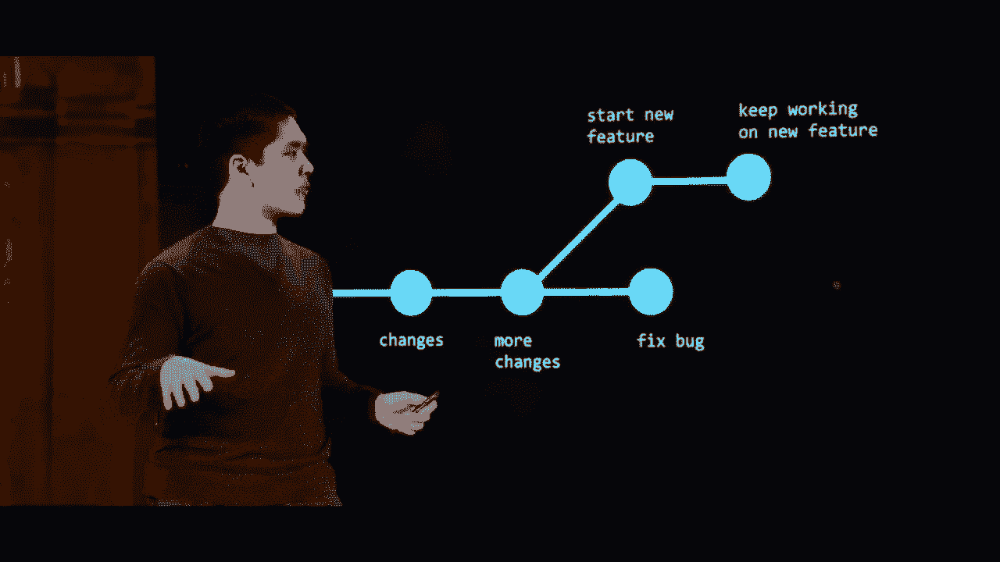

这样我们可以把这些变化合并回来，确保一切恢复正常。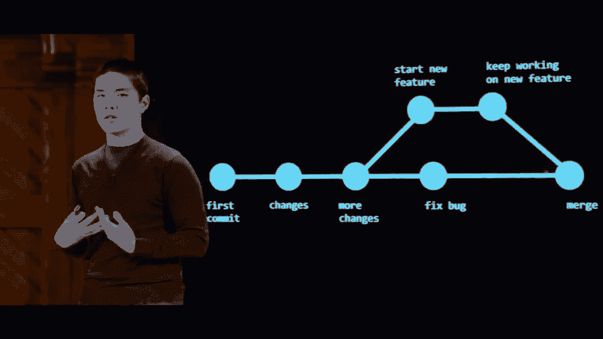

合并到这个统一的主分支，这个主分支现在包含所有最新的代码。这就是git分支的真正力量，能够同时处理多个事情，并在不干扰主分支的情况下工作于某个功能。

代码的版本，所以现在让我们来看一个如何做到这一点的例子。在我的hello.html文件中，我在这个h1上添加了一些样式，添加了蓝色的颜色。假设我想做一些更改，我想。

因为我们之前决定，这对于这样的网页来说是稍微更好的设计，我可以立即进行这些更改，但如果我预期我可能会在多个更改上工作，我可以切换到另一个分支，分支出去做一些。

为了处理这些新变化，这里有一些关键命令需要了解，如果我输入`git branch`，这将告诉我当前所在的分支以及在我的仓库中存在哪些分支。所以这里例如我输入`git branch`，我看到我只有一个叫。

主分支和左侧的星号告诉我这是我当前所在的分支，如果我想查看新分支，我可以输入 git checkout，如果是新分支，我会输入 git checkout -b，然后是新分支的名称，我会称这个新分支为。

样式，因为我要对网页进行一些样式更改。例如，我输入 git checkout -b style，git 给我发了个消息，我已经切换到名为 style 的新分支，现在如果我再输入 git branch，你会看到我现在有两个分支，我有主分支，这是我最初所在的分支，现在我有样式分支，这是我现在所在的新分支，左侧的星号指示了这一点。

现在我在这个新分支上，我可以自由地进行任何我想要的更改，我所做的任何事情都不会搞砸什么。 

在主分支上，只要我待在这个分支上，我就可以说好吧。让我们尝试删除这个样式，并在顶部添加一个样式标签，我可以说我希望我的 h1 颜色为蓝色。例如，我做了很多更改。

我现在想提交这些更改，我会说 git commit move style.properties，这是我所做的更改，但我只对样式分支进行了这些更改。如果我运行 git。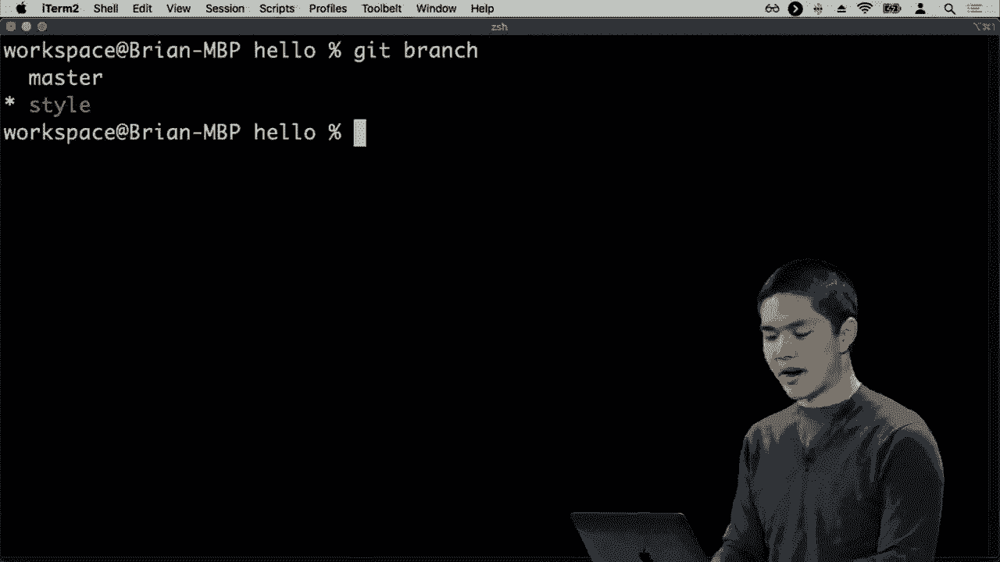

你会看到我当前所在的分支是样式分支，在这里我已移动。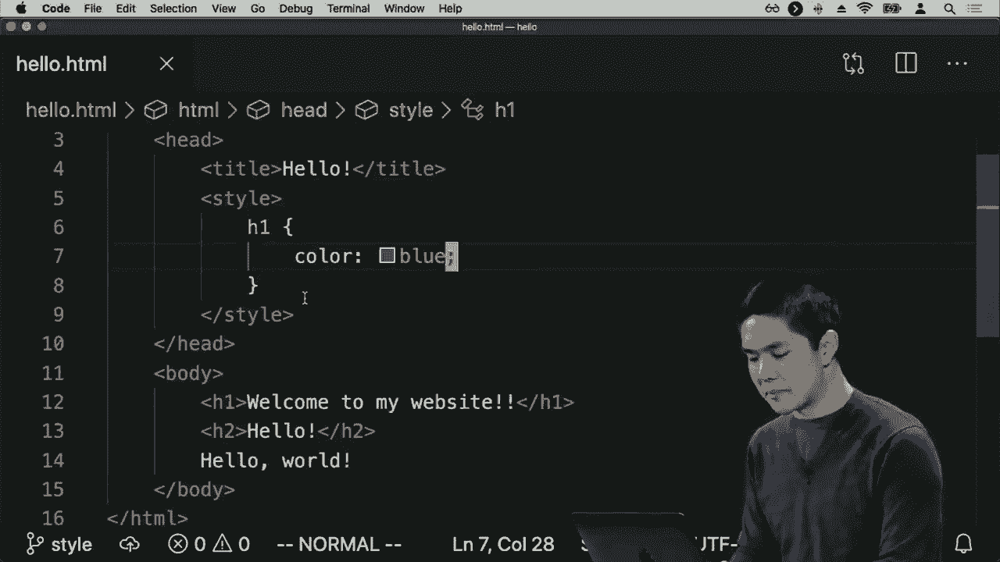

将样式信息放到我页面的顶部，但我可以通过使用 git checkout 切换分支。git checkout 允许我在分支之间切换，我们用 git checkout -b 创建一个新分支，但如果你要切换到已存在的分支，我可以说 git checkout master，例如，来切换我的当前分支。

从样式分支到。

主分支，所以我运行 git checkout master，现在我在主分支上。如果我回到文件，你会看到我现在回到了内联样式。

如果我查看页面的头部样式部分，那里没有样式。

样式分支再次，文件立即回到，现在我在页面的样式部分有了样式代码，而不是内联样式，所以这些更改只在一个部分进行了。

页面，所以现在我会检查主分支。

再次，或许我想在主分支上做一些其他更改，也许我意识到我想删除这个。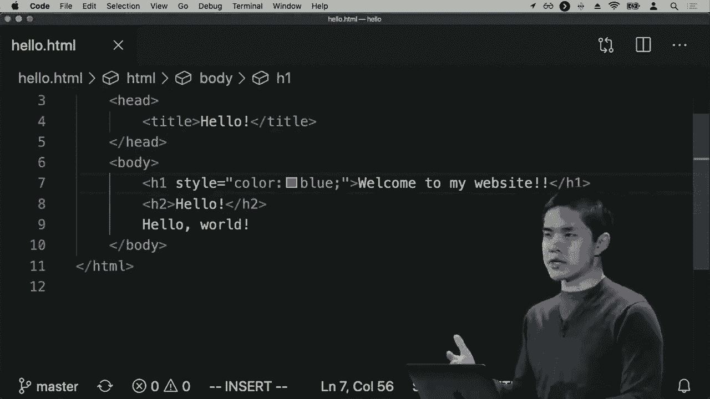

额外的标点符号，你知道吗，两个感叹号太多了。我们现在只保留一个，我将提交这些更改，我会说git commit并去掉标点符号，现在我已经。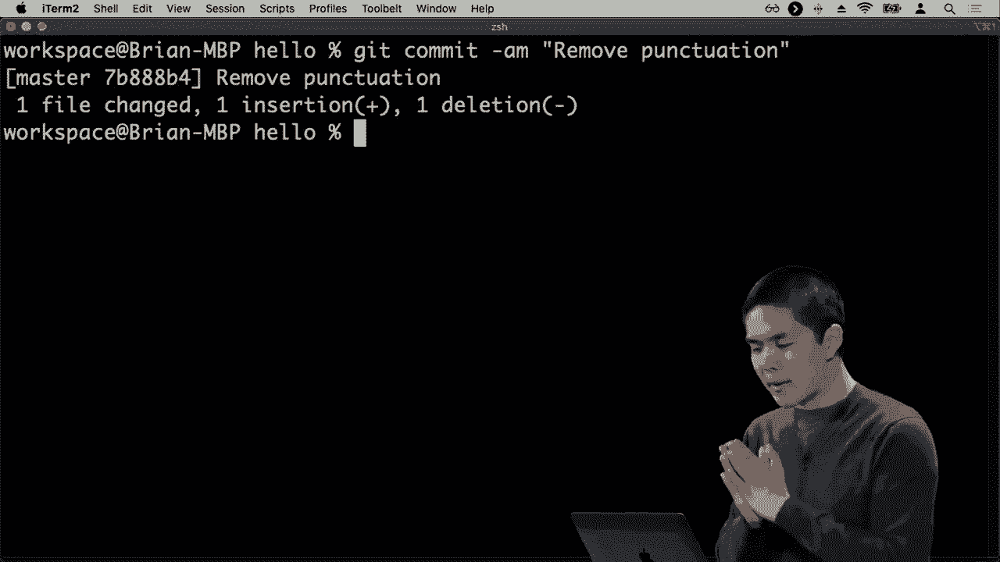

只从主分支移除了标点符号，因此这个主分支现在只有一个感叹号，但仍然保留了内联样式。因此，我现在想做的是合并我在另一个分支上所做的更改，我想取回我在样式分支上工作的内容。

将其合并到当前版本中。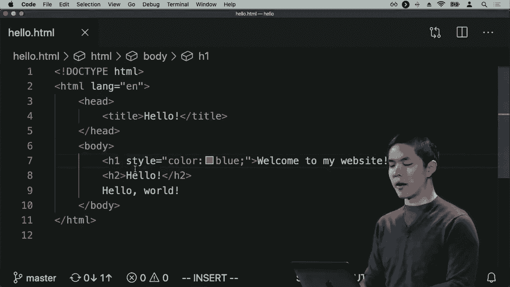

在我的主分支上的仓库中，为此我们将使用的命令叫做git merge，因此git merge，注意我当前在主分支上，但如果我运行git merge，然后是样式，这将把样式分支上的内容合并到我当前的分支中，我们将。

我们发现几乎完成了，但现在出现了合并冲突。这并不总是会发生，在合并时，有时git会足够聪明，知道如果文件的一个部分有一个更改，而另一个部分有另一个更改，合并这些更改时就不会出现冲突。

git会自动解决这些合并冲突，但在这个案例中并非如此，因为我的样式分支和主分支都有更改。

对同一行代码的更改，我们稍后会看到原因。如果我在这里回溯，你会注意到在合并后的版本中，页面头部确实有这个样式标签，没有问题，没有冲突，因为只是添加了新行，所以没有冲突，冲突出现在这里。

在我的主分支版本中，我移除了这个标点符号，而在样式分支的版本中，我们可以通过“样式”这个词看到这一点。我们移除了内联样式，因此需要以某种方式解决这个问题。我最终的做法是去掉这些样式标记或冲突标记。

并且说，我希望更新版本中也没有。

不要有内联样式，也不要有额外的标点符号。因此，我现在已经做了这些更改，解决了合并冲突，现在我。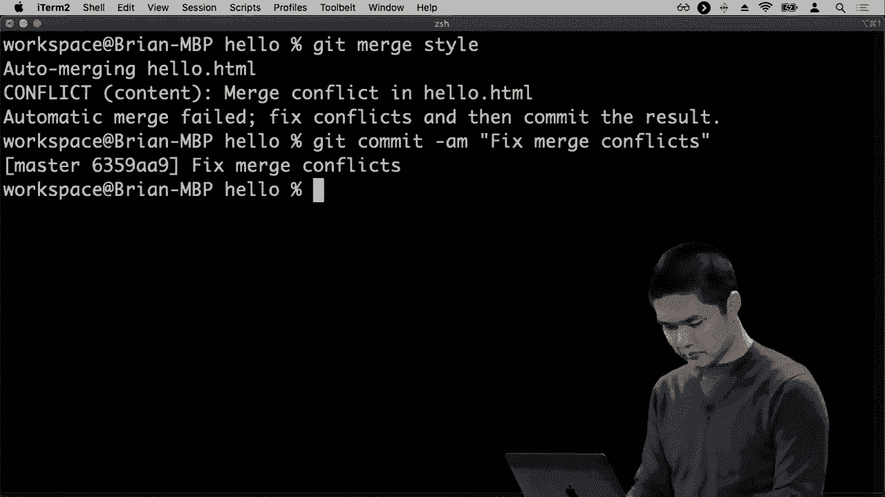

可以提交，我修复了合并冲突，这就是现在git分支的整体工作流程。当你在处理新事物时，可能会分支，以便说你想在这个网页应用程序的不同部分上工作，你会进行更改，进行提交，将更改添加到其中。

创建一个新分支，当你对这些更改感到满意并且它们处于你想要的状态时，你可以将它们合并回原始版本的仓库，有时你需要处理合并冲突，因此并不是总会发生，如果你在进行更改时小心翼翼，。

在进行更改时，尽量避免在两个不同地方对同一行代码进行修改，你可以降低实际发生合并冲突的可能性，因为 Git 最终在处理这些问题时相当智能，最后我们将查看一个。

GitHub 的几个功能在你开始进行更大项目时非常有用，这些项目往往涉及许多不同的部分。第一个功能是分叉（fork）一个 GitHub 仓库，所以让我们去一个 GitHub 仓库，例如查看 Bootstrap 的 GitHub 仓库。

Bootstrap 是我们上次查看的 CSS 库，它是一个让我们轻松访问各种不同 CSS 特性的库。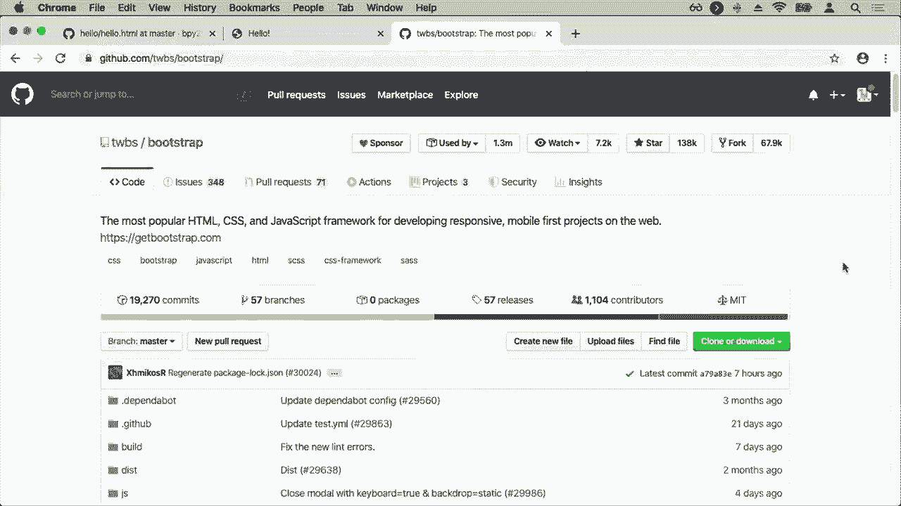

整个项目是开源的，这意味着 Bootstrap 的所有代码都是公开的，任何人都可以查阅，更重要的是，任何人都可以为其做出贡献。并不是只有一个人一直在维护 Bootstrap，而是一个社区驱动的仓库，许多人可以参与。

进行新功能的添加和对 Bootstrap 代码的修复，并利用 Git 的功能进行协作。因此，如果你发现一个希望贡献的 Git 仓库，或者如果你希望其他人能够为你的仓库做出贡献，有一件事情是。

你可以对该仓库进行分叉，分叉的意思是制作原始仓库的副本，所以在 GitHub 页面右上角有一个叫做“fork”的按钮，我们可以看到，目前大约有 68,000 人已经分叉了 Bootstrap 的仓库，制作了该仓库的副本。

登录自己的 GitHub 账户后，我们可以通过点击一个叫做“fork”的按钮，自己进行复制，从而获得该仓库的一个版本。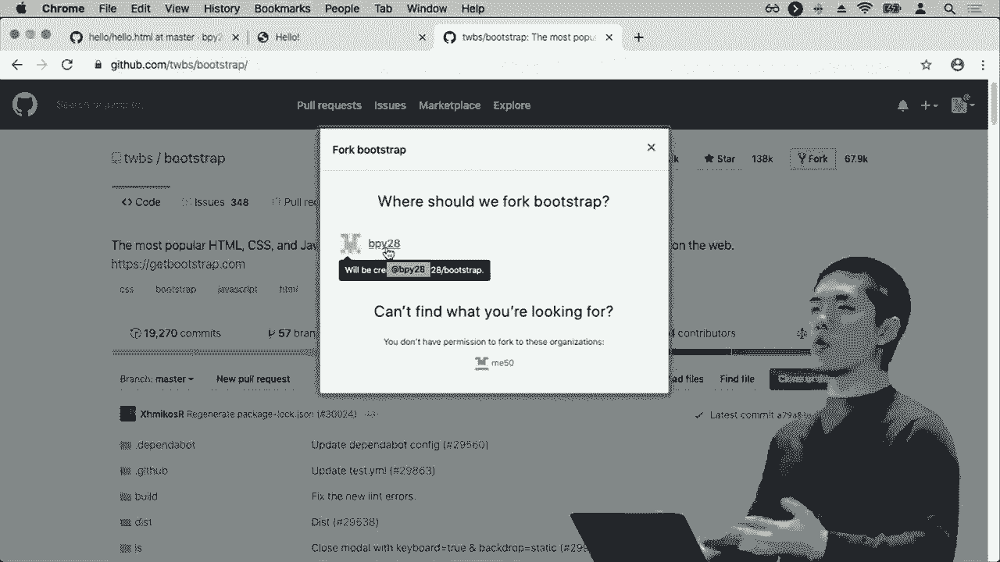

这样我们就可以克隆、推送和拉取，原因是 Bootstrap 的仓库虽然是公开的，但并不允许任何人直接推送，这可能不安全，因为如果世界上任何人都可以更新 Bootstrap 的主代码，那将是非常危险的。不过你可以复制代码并进行分叉。

你可以在自己的副本上进行更改，推送和拉取，当你觉得自己做出了可以贡献给 Bootstrap 的更改时，你可以打开一个叫做拉取请求（pull request），请求将你的代码合并到 Bootstrap 的代码中，我们可以看看 Bootstrap 的拉取请求示例。

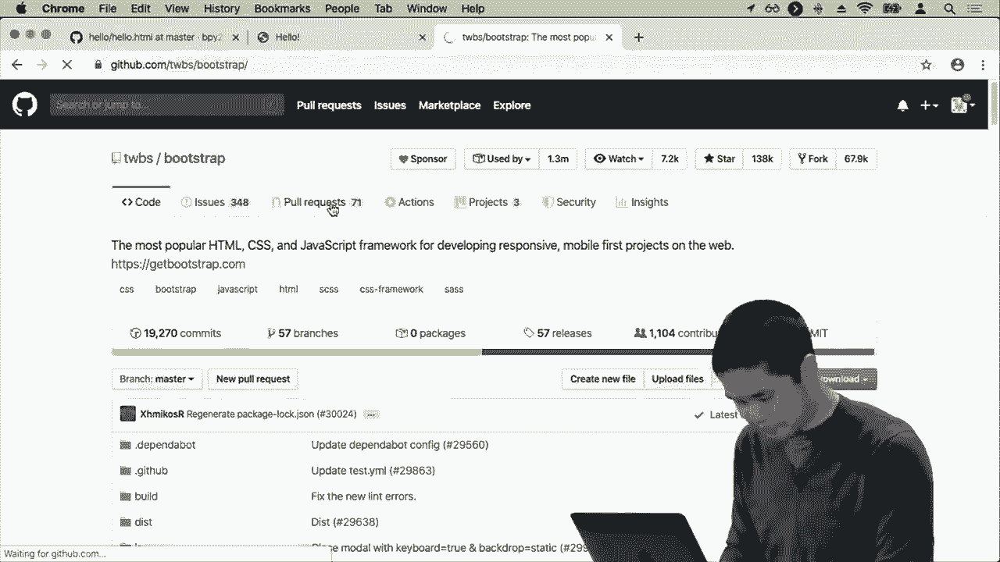

请求选项卡现在看起来有 71 个打开的拉取请求。有 71 个人对 Bootstrap 的代码进行了修复或更改，你可以提交一个拉取请求，表示你希望将这些更改合并到 Bootstrap 的实际代码中。

在这个特定的代码库中维护 Bootstrap 代码的人可以审核这些拉取请求，提供反馈，要求进行额外的更改，然后当每个人满意时，他们可以将这些更改合并到 Bootstrap 的实际代码中。这是开源软件的一个关键优势，即有能力。

多个人可以在同一段代码上工作，社区能够合作寻找错误，搞清楚需要做出哪些更改，探讨如何改进现有代码库并使其在未来更好。值得注意的关于 GitHub 的最后一件事是一个。

被称为 GitHub Pages 的额外功能，GitHub Pages 是 GitHub 提供的一种免费方式，能够快速创建一个带有 HTML 和 CSS，甚至可能还有一些 JavaScript 的网站，并将其部署到互联网上供任何人查看。

任何拥有 GitHub 账户的人都可以免费创建 GitHub Pages 网站，为了演示这一点，我们现在来做。你在 GitHub 中需要做的就是创建一个新的代码库，通常我们称之为你的用户名.github，.是 GitHub 的约定名称。

页面网站尽管可以有其他名称，你只需手动启用。GitHub Pages，我们现在就来创建这个代码库。如果你创建一个名为你的用户名，github io的 GitHub 代码库，它将自动支持 GitHub Pages。

这意味着我可以拿这个网址并克隆它，我可以说 git clone，后面跟这个网址。我已克隆一个。

这是一个空的代码库，但我可以进入这个代码库并添加一些文件。我可以说，默认添加一个名为 index.html 的文件，我将创建一个 HTML 文件作为我的网站，正文将说这是我的 GitHub Pages 网站，像这样。

简单的东西，但如果你想让它更复杂，它当然可以。在我的终端中，我将添加这个 index study HTML 文件，然后我会进行一次提交，并在第一次提交中，你只需在提交信息中写上第一次提交即可。但我们知道这是第一次提交，然后我将把这些更改推送到 GitHub。

现在，如果你将更改提交到名为你的用户名的代码库，并且如果你查看设置并向下滚动，你会看到 GitHub Pages 默认是准备发布的。如果我点击这个网址，我的用户名 github do，你会看到。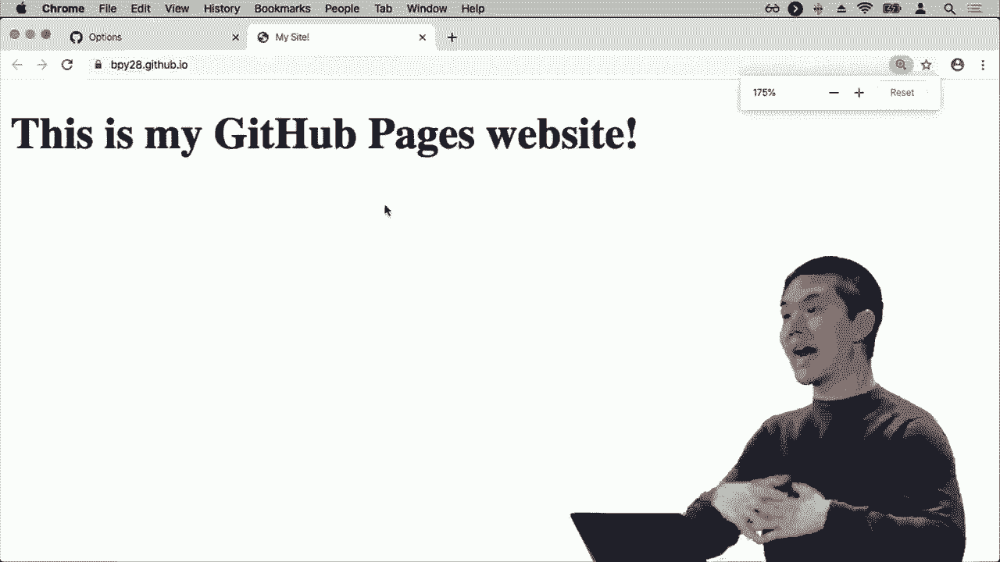

部署到互联网，使任何人都可以访问这个URL并查看它。他们会看到一个大标题，上面写着“这是我的GitHub页面网站”，因为这是浏览器渲染我推送到GitHub页面仓库的HTML的方式，做这件事的好处是，现在非常容易。

能够快速更新我的网站，我只需在做出新更改时，可以提交该更改并将其推送到GitHub，当GitHub检测到我已推送到我的GitHub页面仓库时，它会更新我的网站，任何人都可以通过访问我的用户名GitHub来访问。

点和这让你能够利用所有这些功能，获得能力去分支，在不同时间处理网页的不同功能，并且能恢复代码的不同版本。所以，总的来说，Git给我们提供了许多强大的工具，赋予了我们能力。

现在能够非常快速且轻松地跟踪我们对代码所做的任何更改，跟踪代码何时更新，并迅速恢复并查看旧版本的代码（如有需要），尤其是它赋予了我们与其他人合作处理代码的能力。

这样我们可以在同一个项目的多个部分上工作，而其他人也可以在不同分支上在同一个项目上处理多个部分，并且很容易将我们的更改同步以便一起协作，因此Git是一个非常受欢迎的工具。

不仅在网页编程的世界中，特别是当处理任何较大项目时，多个可能同时在同一事物上工作的人，Git将使我们能够。

为了更轻松地开发我们的Web应用程序，在这个学期的下一次我们将看看Python，它是我们继续迈向构建更复杂Web的第一个编程语言之一。
