# 哈佛 CS50-WEB ｜ 基于Python ／ JavaScript的Web编程(2020·完整版) - P7：L2- Python编程语言全解 1 (变量，字符串格式化，条件与循环) - ShowMeAI - BV1gL411x7NY

[音乐]。！

好的，欢迎大家回到用 Python 和 JavaScript 进行网页编程的课程。今天我们将关注这门课程中我们将要学习的两种主要语言之一，特别是 Python。Python 是一种非常强大的语言，使构建应用程序变得非常简单。

今天的目标之一是向你介绍 Python 编程语言，如果你以前没有见过，即使你见过，也要让你更熟悉它。 

给你一个对这门语言的体验，探索一些更高级的特性和我们可以使用 Python 开发应用程序的技术，让开发变得更有效。因此我们将从我们的第一个 Python 程序开始，只是一个简单的程序，输出 hello world，我们将要快速进行，因为语言中内置了许多功能，使得快速和高效的开发变得方便。

在文本文件中编写它，和。！

程序看起来就像这一行，如果你以前使用过其他编程语言，比如 C 或 Java 或其他语言，这可能在语法上看起来很熟悉，但为了简单说明，我们有一个内置的 print 函数在 Python 编程语言中。

在许多其他编程语言中，Python 的函数在括号内接收参数，因此在这些括号内是传递给 print 函数的参数或输入，在这种情况下就是单词 hello world，后面跟着一个感叹号，所以这就是我们实际可以采用的方式。

我将进入我的文本编辑器，创建一个新的文件。这个文件我将命名为 hello dot P Y dot py，或者 dot pi 是 Python 程序的常规扩展名，因此我将创建一个名为 hello dot PI 的文件，里面将包含我们刚才看到的 Python 代码，我们会调用 print 函数，并作为参数或输入传递给 print 函数的内容是 hello world。感叹号。

现在，为了运行这个程序，我们将使用一个！

在我们的终端中这个程序恰好也叫 Python。Python 可以被称为一种解释型语言，这意味着我们将运行一个名为 Python 的程序，这是一个解释器，它将逐行读取我们的 dot PI 文件，执行每一行并解释其内容。

这意味着以计算机实际上能够理解的方式，因此我们将运行 Python，在这种情况下我们将解释 hello depay，当我们运行这个程序时，我们看到单词 hello world 被打印到终端，这就是全部，这就是程序的结束。！

这是我们使用 Python 编程语言编写的第一个程序，因此我们已经看到了 Python 的几个特性，能够解释 Python，无需先将其编译成二进制文件才能运行 Python 程序，我们已经看到了函数。

我们也见过字符串，字符串就是我们可以用引号提供的文本，作为输入提供给其他函数或以其他方式进行操作。稍后我们会看到一些字符串操作的示例。像许多其他编程语言一样，Python 也支持变量。

为变量赋值的语法看起来像这样，如果我有一行 a 等于 28，这意味着取值 28 并将其赋值，存储在名为 a 的变量中。与 C 或 Java 等其他语言不同，在这些语言中你必须明确声明。

定义每个变量的类型时，你需要像 int a 这样说明 a 是一个整数，而 Python 不要求你告诉它这些变量的实际类型。因此，我们可以直接说 a 等于 28，Python 知道这个数字是一个 int，它将代表。

将变量 a 定义为 int 类型，并且它能够推断这些值的类型，所以所有的值确实都有类型。你只需不明确地声明它们，例如这里的数字 28 是 int 类型，它是一个整数，而像 1.5 这样的数字则带有小数。

浮点数在 Python 中我们可能称之为 float 类型，任何文本类型，例如用双引号或单引号括起来的单词 hello，Python 支持两者，这种类型我们称之为字符串（string）类型。我们也有布尔类型。

在 Python 中，有很多不同的值可以是真或假，这些值用大写的 T（true）和大写的 F（false）表示，类型为 bool。我们在 Python 中还有一种特殊类型称为 none 类型，它只有一个可能的值，即大写的 n（none），当我们想表示 none 作为一个值时会使用它。

表示没有值的情况，因此如果我们有一个函数，如果不返回任何内容，它实际上返回的是 none。因此你可能会想象，当你想让一个变量表示某事的缺失时，none 是很有用的。

类型还有更多，这里只是一些可能存在于该语言中的变量和类型的示例。现在，让我们尝试在程序中实际使用一个变量，以便做一些更有趣的事情，我们将编写一个能够执行的程序。

从用户那里获取输入以便向他们说hello，例如，我会创建一个新文件，我们将其命名为name.py，输入，我想提示用户例如输入他们的名字，那么我们该怎么做呢？就像Python内置的print函数，它只是打印出任何参数。

恰好Python还有一个内置函数叫做input，它提示用户输入并要求他们输入一些内容，所以让我们提供一些输入并要求用户输入他们的名字，例如，然后我们可以将该函数的结果保存到一个变量中，在这种情况下。

我会将其保存在一个变量中，这在这种情况下也正好是。

叫做name，现在我们可以运行程序，我可以通过进入终端并输入python name.py来运行程序，我会按回车，然后我们会看到程序提示我输入我的名字，我看到name，冒号空格，这就是我提供给输入函数的字符串，现在这会提示我输入我的名字，所以我会。

之后似乎什么都没有发生，到目前为止，所以现在我想做点什么。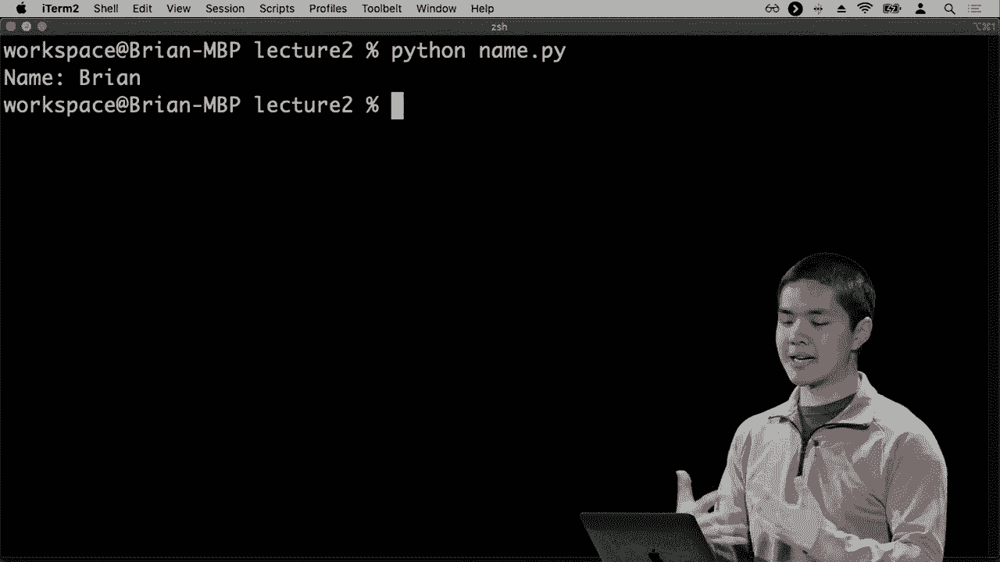

用我输入的名字，我想对自己说hello，例如，所以我会回到这个程序中，现在我可以说print，hello，逗号，然后我可以说plus name，这个plus运算符在Python中有很多不同的功能，如果我有两个数字，它会将这两个数字相加。

一起但用两个字符串，plus实际上可以连接或组合两个字符串，所以我可以将hello，逗号空格与无论是什么值的结合。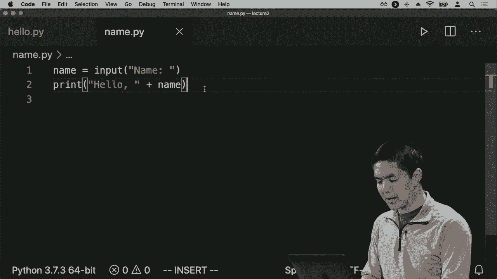

name恰好就是这样，所以现在我会重新运行这个程序，Python命名为PI，输入我的名字，然后。

我们看到hello Brian作为程序的输出，所以这是在Python中操作字符串的一种方式，另一种在后来的Python 3版本中相当流行的方法被称为使用f字符串，f是格式化字符串的缩写。为了在Python中使用f字符串，方法会类似但略有不同。

不同的语法而不仅仅是将字符串放在双引号中，我们会在字符串前加上字母F，并且在字符串内部我现在可以说hello，逗号，然后如果在格式化字符串中，如果我想插入一个变量的值，我可以通过在花括号中指定它来做到这一点，所以我在这里要说的是。

在花括号内的name，因此，这里发生的事情是我在告诉。

这个格式化字符串用来替换变量的值，所以我提示用户输入他们的名字，我们将他们的名字保存到一个名为name的变量中，现在在这条打印语句的第二行中，我打印出一个格式化字符串，它是hello，逗号，然后在。

这里的花括号表示插入变量name的值，因此这将产生将输入的名字打印出来的效果，这是一种稍微更有效的方式，能够快速创建字符串，通过将值插入这些字符串中。

如果我运行Python命名为pi，然后提示输入我的名字，我输入“Brian”，然后我保存。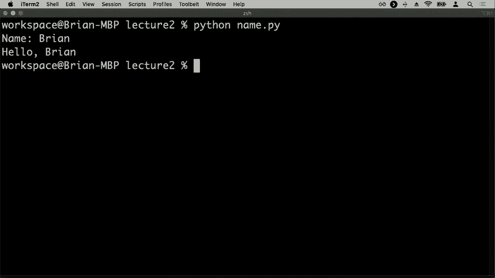

结果是“你好，Brian”，例如，所以这些是我们处理字符串的一些方法，操作字符串和组合字符串，使用这种技巧。此外，Python也支持许多过程式编程语言的核心特性。

例如，让我们现在来看一个例子，看看一个数字是正数、负数还是零。所以我将创建一个新的文件，称为conditions.py，接下来在conditions.py内部，我会首先提示用户输入一些内容，我会说“输入一个数字”。

我们将把这个输入保存在一个我将称之为n的变量中，现在我可以问问题，比如说“如果n大于零，则打印出‘n是正数’”。在这里发生的事情是我有一个Python条件，而Python条件的工作方式是以这个关键字开头。

关键字“if”后跟一个布尔表达式，某个将评估为真或假的表达式，或者有点像真或假的表达式，我们可以对这一点稍微放松一下，然后冒号表示好，这里是if语句主体的开始。

Python中，我们知道自己在if语句的主体内或任何其他代码块的主体内，是通过缩进来区分的。在一些语言中，比如C语言或HTML，这些语言在几节课前提到过，缩进不是计算机解析所严格要求的。

在Python中理解程序内部的内容是不同的，缩进是必需的，因为缩进是程序知道什么代码在if语句内，什么代码在if语句外的方式，所以我们有“如果n大于0，冒号”，然后所有缩进在if下面的内容都是。

所有遗产的主体是“人”，如果这个布尔表达式和大于零的条件为真，则会执行这些代码行。所以如果n大于0，我们将打印出“n是正数”，然后我们可以添加一个额外的条件，我可以说，比如说“否则打印n不是”。

积极的，但我可以更具体一些，这里大致有两个分支，一个是当 n 大于 0 时，另一个是处理其他所有可能情况的 else 分支。但我真正想做的是执行第二次检查。在其他语言中，这可能被称为 else if，比如如果这个条件不满足。

但另一个条件是成立的，Python 将此缩写为 just lf-ii。LIF 是 else if 的缩写。所以我可以说，如果 n 小于 0，那么我们就继续打印 n 是负数，else 打印 n 是零。因此，现在的想法是，如果 n 大于零，我们执行某些任务，L 如果在其他条件下。

如果它不大于零，那么我们检查它是否小于零。在这种情况下，我们打印出 n 是负数。否则，如果这两个条件都不成立，那它既不是正数也不是负数，唯一剩下的可能性是 n 等于零，所以我们可以打印出 n 是零，我们可能希望这个程序能正常工作。

但是注意如果我现在尝试运行条件，即使在我们脑海中逻辑上看起来可能很合理，如果我运行 Python 条件并输入一个数字，我将输入数字五来看看会发生什么。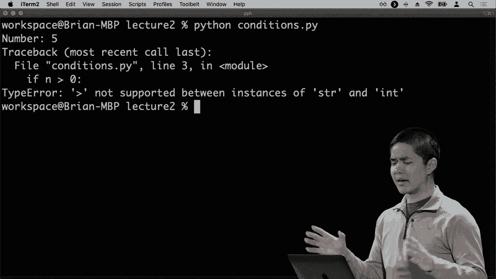

好吧，发生了一些奇怪的事情，这是我们第一次遇到 Python 异常，错误发生是因为我们的 Python 程序内部出现了问题。随着时间的推移，你将开始学习如何解析这个异常，理解它的含义，以及从哪里开始调试，但学习。

如何读取这些异常并弄清楚如何处理它们，绝对是你成为 Python 开发者过程中一个非常宝贵的技能。那么我们来看看能否搞清楚这个异常在说什么。通常我先看底部，我看到那里有一个类型错误，即类型错误。

发生的异常有很多，Python 中有很多事情可能出错，我们可以做的事情会导致错误。在这种情况下是类型错误，通常意味着存在某种类型不匹配，Python 预期某个东西是某种类型，但它实际上是另一种类型。

类型，所以让我们尝试理解这可能是什么，我们说大于符号不支持在字符串和整数实例之间进行比较。那么这意味着什么呢？我想这意味着大于符号在检查一个东西是否大于另一个东西时，如果你在比较字符串和整数时就不成立。

整数，这大概是合理的。说一个字符串大于或小于一个整数并不合逻辑。当我们谈论大于或小于时，通常是在谈论数字，因此它们都应该是整数。例如，为什么我们认为大于在比较时是成立的。

一个字符串和一个整数，现在我们可以，再往上看一下追踪，它将显示哪些部分。代码导致这个问题，在这种情况下，追踪相当短，只是。指向一行单个文件，说明在文件conditions，PI的第3行这是那一行。

触发了异常，如果n更大。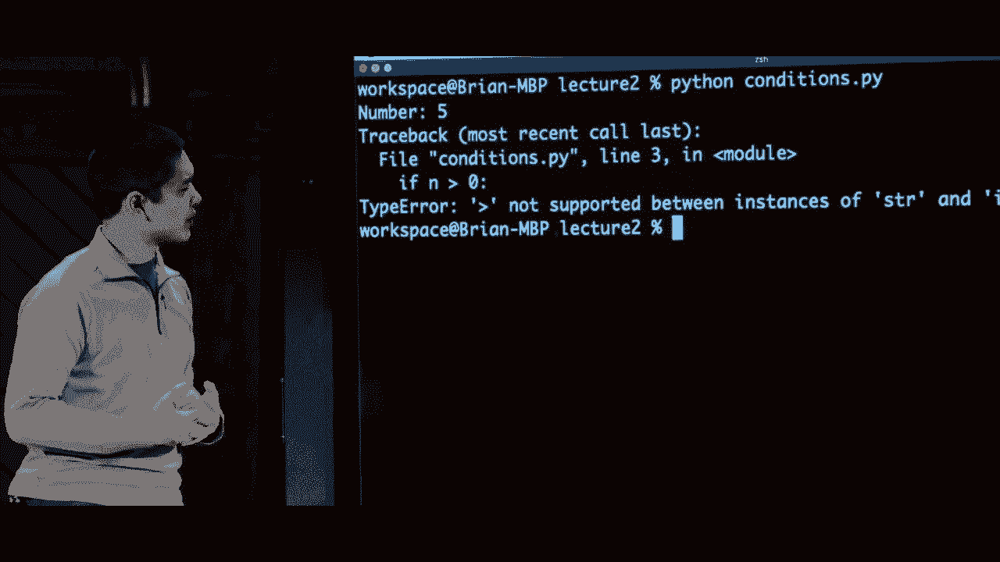

比0那么这里的例外是什么呢，0显然是一个整数，因为那。就是一个整数，因此如果更大，则认为它是在比较一个字符串。和一个整数，那么n某种程度上必须是一个。

字符串即使我输入了数字，5，你仍然必须认为它是一个字符串。那为什么会这样呢？让我们再看看代码，看看能否。弄清楚发生了什么，似乎这个输入函数不在乎。你输入了什么，它总是会，返回一个字符串，并且某种程度上是。

最终成为一个字符串，这是相当合理的，因为输入函数。并不知道我是否输入了数字，或者我是否输入了字母，或者我。输入了完全不同的字符，某些输入不知道以什么形式返回其。数据，无论是以int的形式，float的形式，还是以任何其他形式。

默认情况下，它只是返回一个，字符串用户输入了什么字符。作为他们的输入，所以我现在想要做的是，为了让这个程序按。我的意愿工作，将其转换为一个整数，或者可以说转换为一个整数，方法是使用一个。

在Python中有一个函数叫做int，它接受，任何内容并将其转换为整数。因此在这里我可以说int，然后作为，int函数的参数输入。nth函数，我只需包括这个完整的表达式input。number，所以我要请求用户，输入一个数字，他们输入一些文本。

输入函数返回给我一个，字符串，而该字符串将作为int函数的输入，然后被保存到这个变量中。

被称为n，因此现在我们知道n确实是一个整数，让我们再试一次。运行这个程序，我回到终端，运行Python conditions PI。系统让我输入一个数字，我输入一个，像5这样的数字，好的，这仍然。似乎没有工作，它没有工作是因为我没有保存。 

文件，所以我去保存文件，再试一次，输入一个数字，。我们看到确实n是正数，我们没有更多的异常，我们成功运行了。代码，并看到n的值是正的，我可以再试一次，测试其他两个。条件分支，输入负数。 

例如，看n是，负数，否则如果它不是。

正或负，那么我们知道 n 是零，因此这里是我们第一次接触 Python 中的条件，能够有多个不同的分支，根据我们要评估的某些表达式执行不同的代码，这些表达式要么是真实的，要么是假的。好吧，让我们。

看一下 Python 语言中将会出现的一些其他**特性**，其中一个最强大的特性是它各种不同类型的**序列**，这些数据类型以某种**顺序**或某些值的**集合**存储值，所以我继续。

创建一个新的文件，我们称之为 sequences pi，并且有许多不同类型的序列都遵循类似的属性，但其中一种类型的序列是我们已经看到过的一种类型，比如一个字符串。例如，如果我有一个名字，名字是哈利之类的。

这个序列让我可以访问序列中的单个元素，为了做到这一点，它很像其他语言中的**数组**，如果你之前有接触过它们，但我可以打印出 name[squ*re bracket 0]，这个**方括号**表示法获取一个序列，一些有序的元素。

让我访问该序列中的一个特定元素，因此如果我有一个字符串，例如 name，我说 name[squ*re bracket 0]，那么这个效果就是获取这个长序列中的零个元素。在许多编程语言中，以及更一般的编程中，我们通常从 0 开始计数。

在 0 处，所以序列中的第一个元素是项 0，第二个元素是项 1，所以很容易出现轻微的**越界**错误，但只需知道。

那么 name 的项 0 应该是名字中的第一个字符，如果我运行 Python，我可以确定这一点，我会保存这个文件，运行 Python sequences PI。我得到的只是哈利名字的第一个字符，正是这个。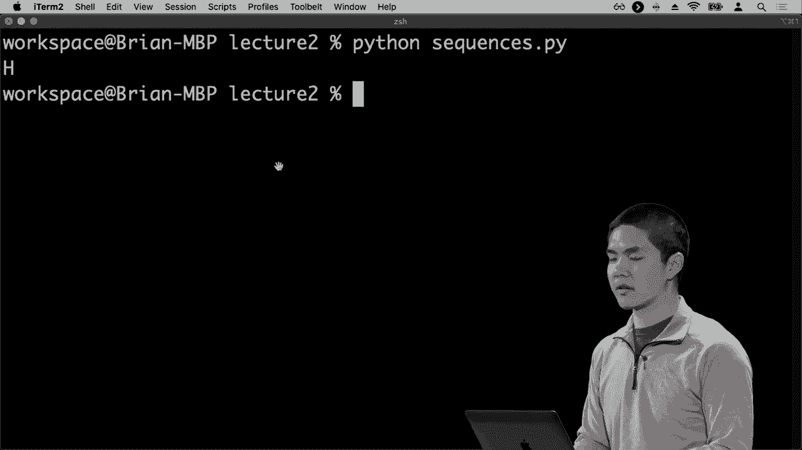

情况是字母 H，如果我请求打印出。

字符 1 是名字中的第二个字符，如果我现在重新运行程序，我会得到字母 A，这种索引类型适用于许多不同类型的序列，而不仅仅是一个。

字符串恰好是一个字符的序列，但还有其他类型。Python 例如有一个用于数据列表的类型，因此如果我有一个我想存储的任何类型数据的序列，我可以将该信息存储在 Python 的列表中。所以也许我不是存储一个名字，而是有多个名字。

我想存储一些名字，比如哈利、罗恩和赫敏。例如，现在我有三个名字，都存储在一个 Python 列表的序列中，我可以打印出所有的名字，举个例子。

看一下变量名称的值是什么，我们会看到当我这样做时，我得到了内容的打印输出。

那个列表是哈利、罗恩和赫敏按特定顺序排列的，但你也可以像索引字符串那样索引列表，以获取特定的内容。

这个名称列表中的第一个项目，当我运行程序时将会是哈利，因此，有许多不同的序列类型可以用来表示。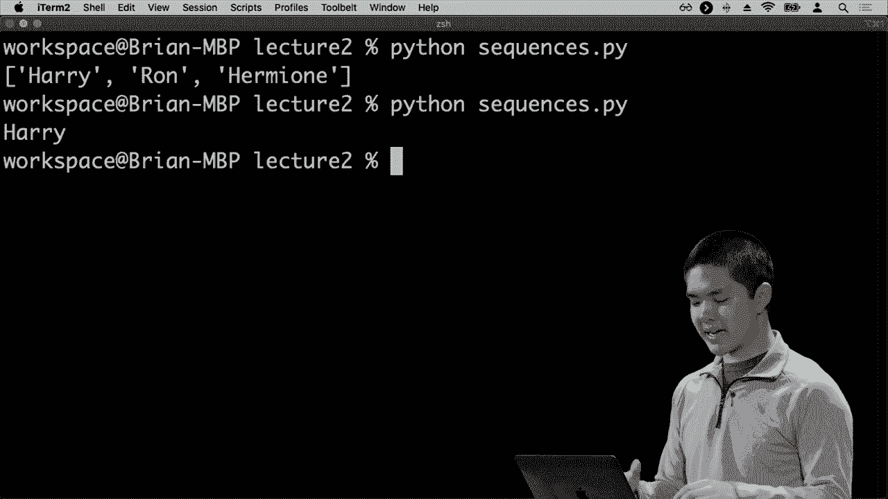

另一个数据结构叫做元组，通常用于存储一对不变的值，比如两个值在一起或三个值在一起，想象一下，如果你在编写一个程序来处理实际上是一个单位的情况，它恰好有两个部分。

例如，在二维图形中，你可能想将一个点表示为X值和Y值，你可以为此创建两个变量，我可以说，坐标X将等于十点零，坐标Y将等于二十点零，但现在我为此创建了两个变量。

为了表示这个，我们可以在Python中使用元组，像这样说：坐标等于十点零，二十点零。而在列表中，我们使用方括号来表示列表的开始和结束。

在元组中，我们只需使用括号，表示我们正在将多个值组合在一起，组合一个值十点零和第二个值二十点零，现在我们可以将这两个值作为一个单元传递，只需用一个单一的名称来引用它们，这里是坐标。

有许多不同类型的这些各种序列，我们将查看的一些序列是这些数据结构。例如，列表是可变值的序列，我们已经看过，而可变值意味着我们可以改变列表中的元素。

在列表中，我可以在列表的末尾添加某个元素，可以从列表中删除某个元素，可以修改列表中的值，而元组则是一系列不可变值，这些值不能更改，你不能向现有的元组添加另一个元素，你必须创建一个新的元组。

还有其他数据结构存在，我们将在稍后查看的一些包括集合，这是一组唯一值的集合，因此如果你熟悉数学中的集合，这个概念非常相似。而列表和元组则保持内容的特定顺序。

集合不会保持任何特定顺序，它只是一个集合，所有的值需要是唯一的，在列表或元组中，你可能会有相同的值多次出现，而在集合中，每个值只出现一次，这给集合带来了一些优势以及你可以使用的一些方式。

如果你知道只需要一个集合，而不在乎顺序，如果某个元素最多只会出现一次，那么通过使用集合可以使你的程序更高效，更优雅。

设计的最后一种数据结构是相当强大的，在本课程中会多次出现的字典，在 Python 中简称为 dict，它是我们所称的键值对的集合，我喜欢用一个实际的物理例子来思考这个。

字典就像你在图书馆找到的那样，将单词映射到它们在纸质字典中的定义，你打开字典，查找一个单词，得到它的定义，而在 Python 中，字典的工作方式非常相似，它将是一个数据结构，我可以查找某些东西。

通过一个关键词或一个值来获取另一个值，我们称我正在查找的东西为键，称我查找时得到的结果为值，因此我们在实际字典的情况下保留键和值的配对，在现实世界中，键是我们想要查找的单词。

值是它的定义，但我们可以在 Python 中更一般地使用它，每当我们想要将某些东西映射到另一个值时，这样我们就可以很容易地在这个数据结构中查找该值，因此我们将看到字典的例子，所以现在让我们探索这些数据中的第一个。

这些结构是我们通过利用 Python 列表所提供的特性来探索我们可以做的事情，例如，我们将创建一个新程序，我将其命名为 lists.py，在这里我只是创建一个名称列表，所以 names = Harry Ron Hermione 和 Ginny。

举个例子，当我开始写多行代码，特别是当我的 Python 程序变得越来越长时，记录我所做的事情可能是个好主意，所以我可以说让我为这一行代码添加一个注释，这样我就知道在这行代码中做了什么，而在 Python 中。

创建注释有几种不同的方法，但最简单的方法就是使用井号或哈希标签，只要你包含它，之后该行的其余部分都会被解释器忽略，这些注释你可以随意写，这更多是为了你自己。

程序员，以及阅读你的程序的人能够查看程序，理解它所表达的内容，并弄清楚他们需要对其采取的行动。因此，我可以说定义一个名字的列表，例如，仅仅为了让我清楚我在这行代码中做了什么，以便我可以打印出来。

名字列表，就像我们之前做的那样。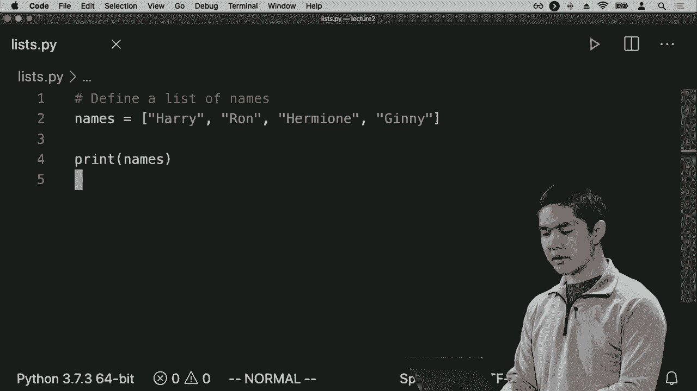

我们会看到，当我打印出这个名字的列表时，我得到的是，让我运行这个列表，我得到的是这个列表哈利。

罗恩、赫敏和金妮，但我也可以像之前看到的那样，打印出其中第一个，妈妈说，你知道的，只打印出名字方括号零，这样我将只得到哈利，例如，但现在请回忆一下，列表是可变的，我可以修改这个列表中存在的元素。

所以我可以说 names.dot.append 一个新名字，例如，Rico，因此列表有许多内置的方法或函数，这些是我可以在现有列表上运行的函数，以访问特定的元素或以特定的方式修改列表，在列表的情况下，append 方法是一个。

方法或函数，我可以运行，它只是将一个值添加到现有列表的末尾，所以我已经将德拉科添加到列表中，还有许多其他方法可以在列表上使用，其中之一，例如，排序一个列表，没必要编写自己的排序算法，以对一系列对象进行排序。

在 Python 中，有一个内置的 sort 方法，适用于列表，我可以简单地说 names.dot.sort，这将自动对列表中的所有内容进行排序，现在如果我打印出所有这些名字，去打印它们并去掉。

这个旧的打印语句，现在我们看到打印出了五个名字，因为我在这个列表中原本有四个元素，但我添加了第五个，并且注意到它们实际上是按字母顺序排列的，从德拉科开始，到罗恩结束，因为我能够通过修改顺序来对列表进行排序。

这些元素实际出现的顺序，因此列表在任何需要存储的情况下绝对可以非常强大。

按顺序的元素，列表绝对是 Python 提供的一个有用工具，如果你不在意元素的顺序，而且如果你知道所有的元素都是唯一的，那么你可以使用集合，这是一种另一种 Python 数据结构，工作方式类似，语法稍有不同。

不同，所以让我们做一个例子，创建一个新文件，命名为。集合 pi，让我首先创建一个空的集合，我们可以通过简单地说 s 来实现。s 将是一个变量，它将存储我的集合，我会说 set，然后是括号，这样就会创建一个空的集合，正好是。

现在集合里是空的，我们来添加一些元素，可以说`s.add`，让我们把数字一、二、三和四添加到集合中，然后我们可以打印。

打印集合，查看现在里面有什么元素，当我运行这个程序时，我们看到集合中有四个值，一、二、三和四。

集合没有自然的顺序，它们不会总是保持特定的顺序，但我可以添加，比如如果我再次将三添加到集合中。

我两次将三添加到集合中，添加了1、2、3、4，然后又添加了3。当我打印集合的内容时，它仍然只包含元素1、2、3和4，集合中从不出现重复的元素，这遵循集合的数学定义。

集合中的元素不会出现多次，你也可以从集合中移除元素。如果我想要移除数字二，比如可以说`s.remove(2)`，然后打印`s`来查看当前的集合状态。

现在集合中包含的所有元素，当我重新运行这个程序时。

在程序中我只得到了1、3和4，因为我从集合中移除了2，所以集合允许你向其中添加、移除元素，所有序列，无论是字符串、列表还是集合，都可以通过Python内置的函数`len`来获取集合中有多少元素。

一个序列的长度，即列表中的项目数量、字符串中的字符数量或集合中的元素数量。如果我想打印集合中有多少个元素，我可以在格式化字符串中这样做，比如说这个集合有几个元素。

元素数量，我怎么知道有多少个元素呢？在这些花括号内，我可以包含任何我想在Python中替换进这个字符串的表达式，那么集合中有多少个元素，我可以得到。

通过计算`s`的`len`，我这里做的是我希望计算集合`s`的长度，换句话说，实际包含在这个集合中的元素数量，然后使用这个花括号表示法，我说把这个数字插入到这个字符串中，这样我们可以看到集合。

包含了一些元素，比如如果我运行这个程序，Python 会告诉我集合中现在有三个元素，即一、三和四，并且它会告诉我这个集合有三个元素。

现在我们看到集合中元素的数量。所以现在我们已经看到Python中的一些不同语言特性，我们看到变量，看到条件，以便我们可以额外执行某些操作，如果某事为真，如果其他事也为真，我们还看到了一些数据结构。

Python的核心工作方式涉及列表、集合、元组和其他数据结构，这也很有帮助。现在，让我们看看Python编程语言的另一个特性，这是许多编程语言共有的，循环的概念。如果我想多次做某件事，现在可以继续。

创建一个名为loops pi的新文件，让我们创建一个简单的循环。我们可以在Python中创建的最简单的循环就是数一些数字，因此，为此我可以说像这样：for I in 1 2 3 4 5，或者也许我想从0 1 2 3 4 5开始计数。

从0开始打印I，所以这是Python循环的基本语法，这里发生的事情似乎在第一行，我有一个由方括号表示的Python列表，包含6个数字0 1 2 3 4 5，现在我有一个for循环for I in这个列表，Python的解释方式是说。

如果我逐个遍历这个列表，对每个元素调用该元素I，我们可以把它叫做任何名字，但在这种情况下，I只是一个约定的选择，用于表示一个不断递增的数字。我们将打印出每次循环迭代中I的值，所以我们可以尝试。

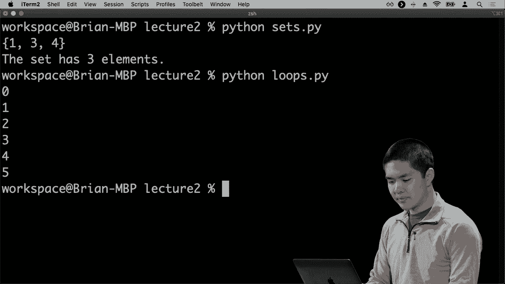

现在试一下并运行Python循环pi，我们看到1 0 1 2 3 4 5，太好了，它逐个打印出了从0到5的所有数字。在实际操作中，如果我们想要数到5，或者打印六个数字，这样做是可以的，但如果我们想打印像一百个数字或一千个数字。

这开始变得有些乏味了，所以，Python有一个内置函数叫做。

range，我可以说for I in range 6，以实现完全相同的效果。六意味着让我得到六个数字的范围，所以如果我们从零开始，它会从零一直到五，然后我们可以打印出该序列中的每个元素。

重新运行Python循环top I，我们得到0 1 2 3，4 5，因此循环使我们能够遍历任何类型的序列，所以如果序列是一个列表，我可以说如果我有一个名字列表，比如哈利、罗恩和赫敏，这就是我的名字列表。我可以有一个循环说对于我名字列表中的每个名字，让我们打印出。

这个名字，例如，我们有一个名为names的列表，我们正在循环。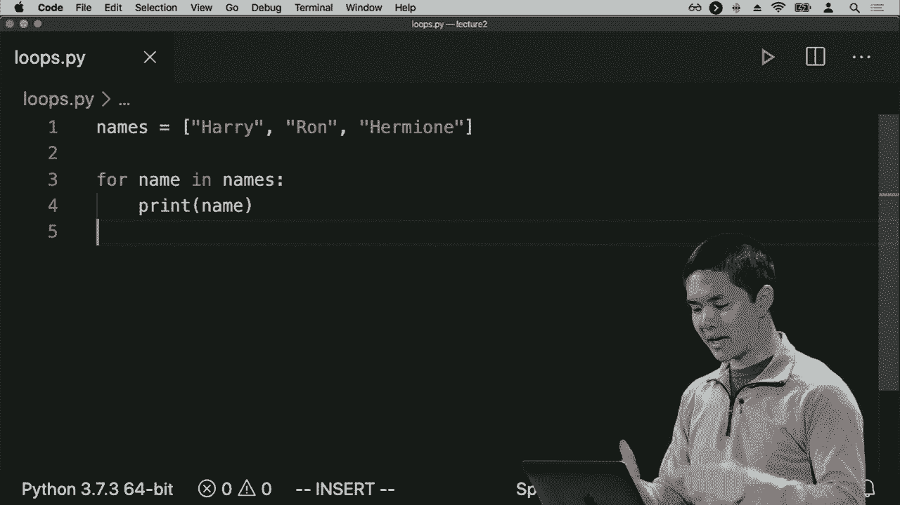

一次遍历一个元素，并打印出来，现在如果我运行程序。看到三个人名打印出来，每行一个。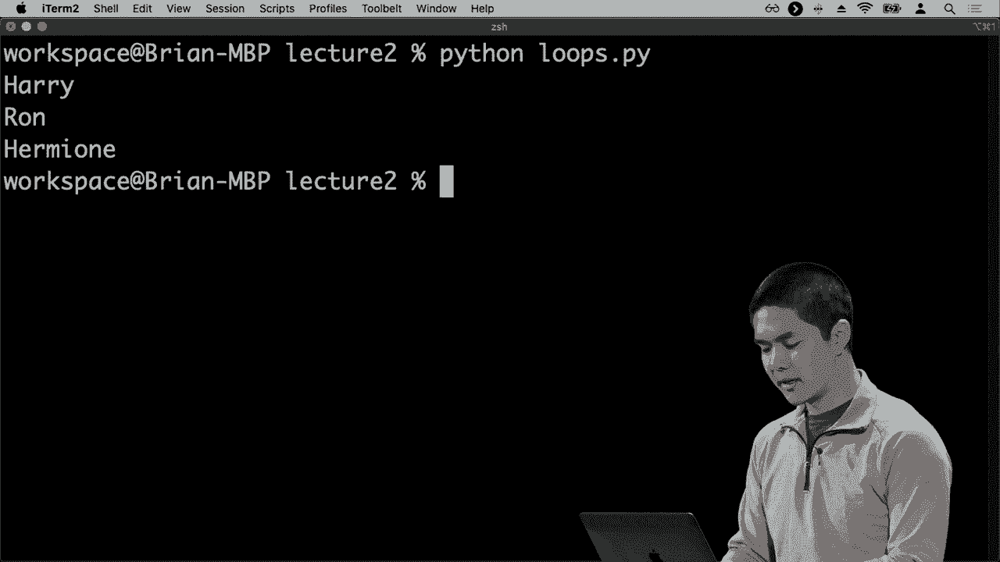

这条线，你也可以对其他序列执行此操作，也许我只有一个名叫哈利的。单一名称，现在，我可以有一行代码说，对于这个名称中的每个字符，打印出该字符，如果名称是这样的，序列就是一个个体字符的序列，因为它是一个字符串。

当我遍历那个字符串时，我会。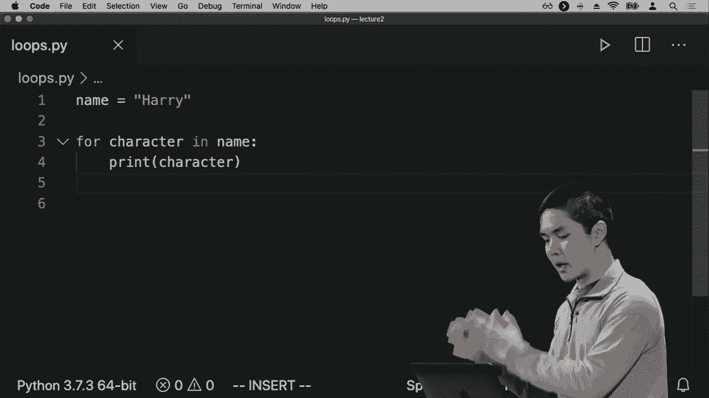

在这个字符串中逐个循环每个字符，所以我可以运行程序。看到每一行打印出每个字母，恰好是。

在哈利的名字中，现在我们已经看到了条件，看到循环，并且看到多种不同的数据结构，我们看到了列表和集合，还有元组，最后一个重要的数据结构我们将要查看的是Python字典，正如你会记得的，它们是一种映射。

如果我想查找某些东西，我可以使用Python字典作为一种数据结构，来存储这些值。所以我会创建一个新的文件，叫做dictionary.py，也许我想创建一个字典，用来跟踪每个。

在霍格沃茨的学生恰好在，所以我可能会有一个叫做houses的字典。我们定义字典的方式是，通过指定一个键：一个值，当我们第一次定义字典时，所以我可能会说哈利：格兰芬多，然后德拉科：斯莱特林。例如，这行代码的作用是创建一个新的。

这个字典叫做houses，在这个字典中我有两个键，两个我可以查找的东西，我可以查找哈利或德拉科。当我查找这些键时，我会得到后面的值：例如，当我查找哈利时，我得到格兰芬多，当我查找德拉科时，我得到。

例如斯莱特林，现在如果我想打印出哈利所在的房子，我可以打印出houses的*方括号*，哈利。所以我在这里可以说我想打印出取出houses字典，*方括号*表示法是我如何查找字典中的内容，这类似于我们使用*方括号*。

使用括号查找列表中的特定元素，例如获取元素0或元素1，在这种情况下，我们使用Python字典来说明。取出houses字典并查找。

哈利的价值希望能得到，格兰芬多，如果我们观察一下就会发现。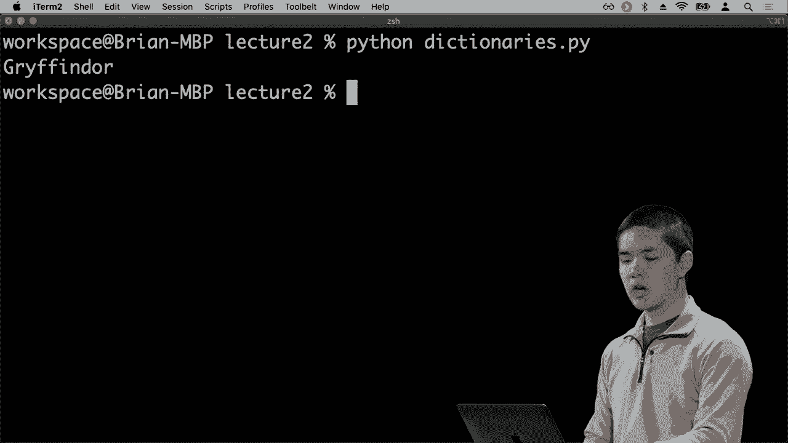

设置一个 Python 字典，我们确实得到了，格兰芬多作为哈利的学院的值。我们可以使用相同的语法以同样的方式向这个字典添加内容，就像我使用*方括号*访问字典中的值一样。如果我想要改变字典中的值，或添加新的内容，我可以说。

例如，*学院*和赫敏，并且说赫敏也在格兰芬多，所以这行代码表示取出学院字典，并在学院字典中查找赫敏，当你这样做时，应该将其设置为这里的值格兰芬多，所以我们取了那个值并将其赋值。

在字典中添加赫敏，以至于现在如果我们想的话，我们可以。

打印出赫敏的学院，运行程序并查看。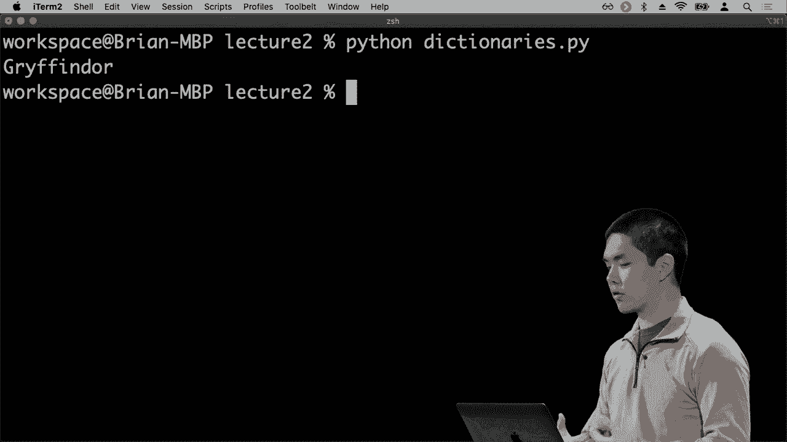

赫敏也在格兰芬多，因此每当我们想将某个值映射到另一个值时，无论我们是将人映射到他们所在的学院，还是将用户映射到有关这些用户的信息时，在我们的网络应用程序中，字典将成为非常非常强大的工具。
