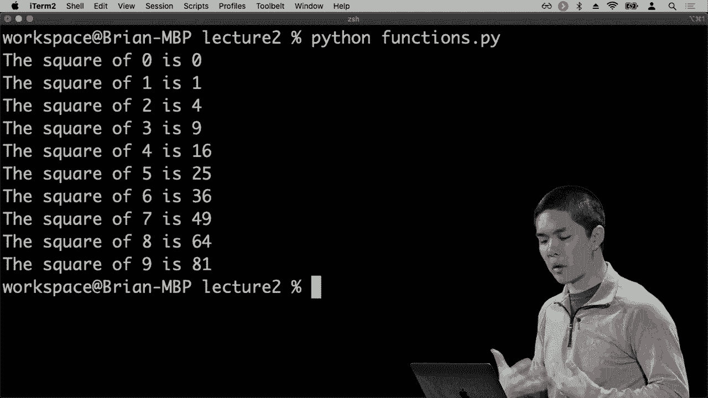
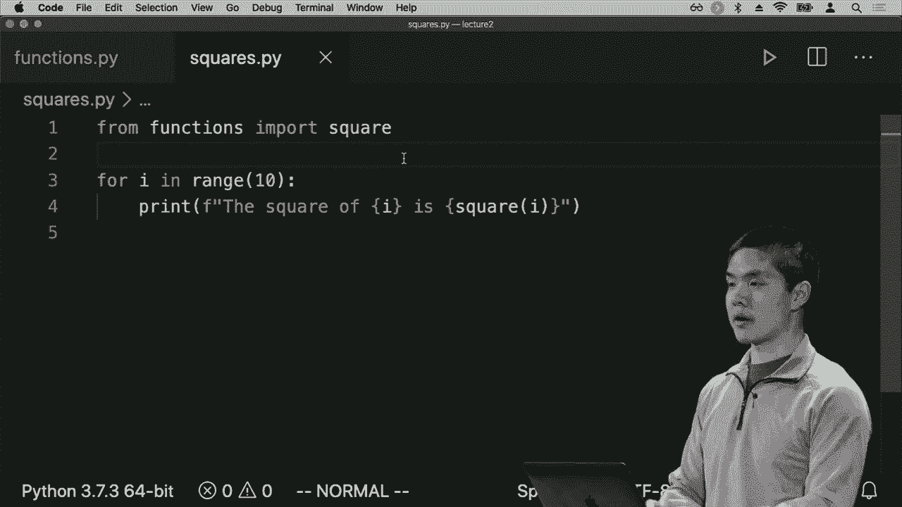
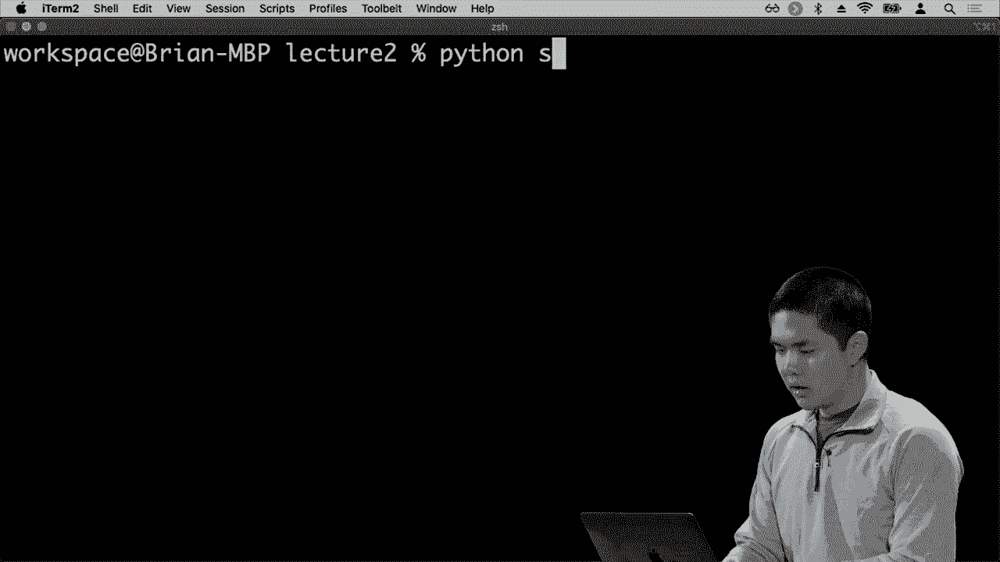
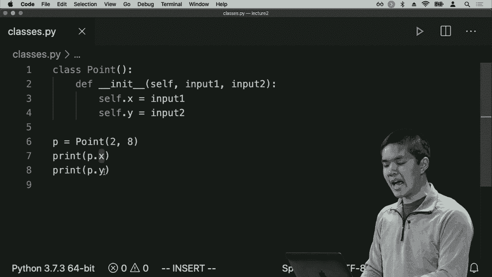
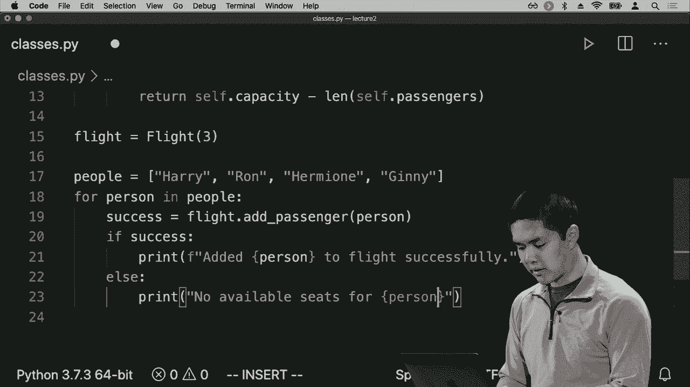
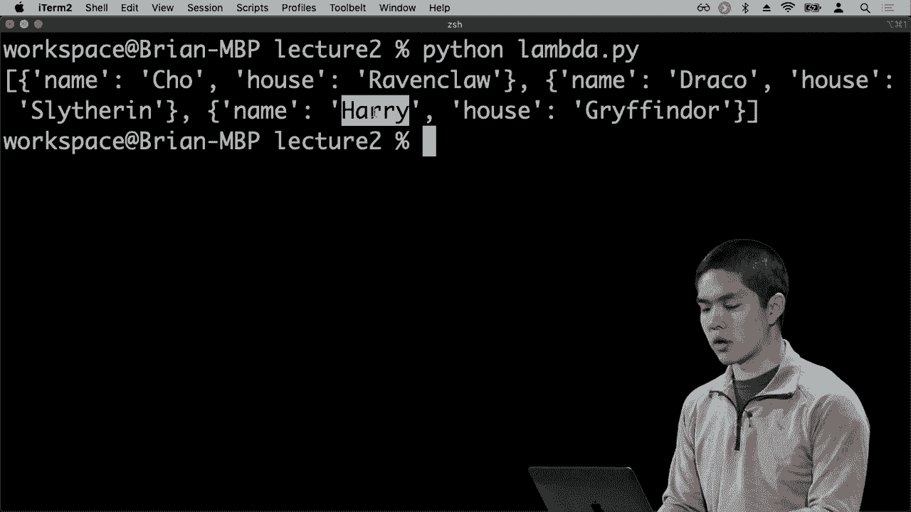
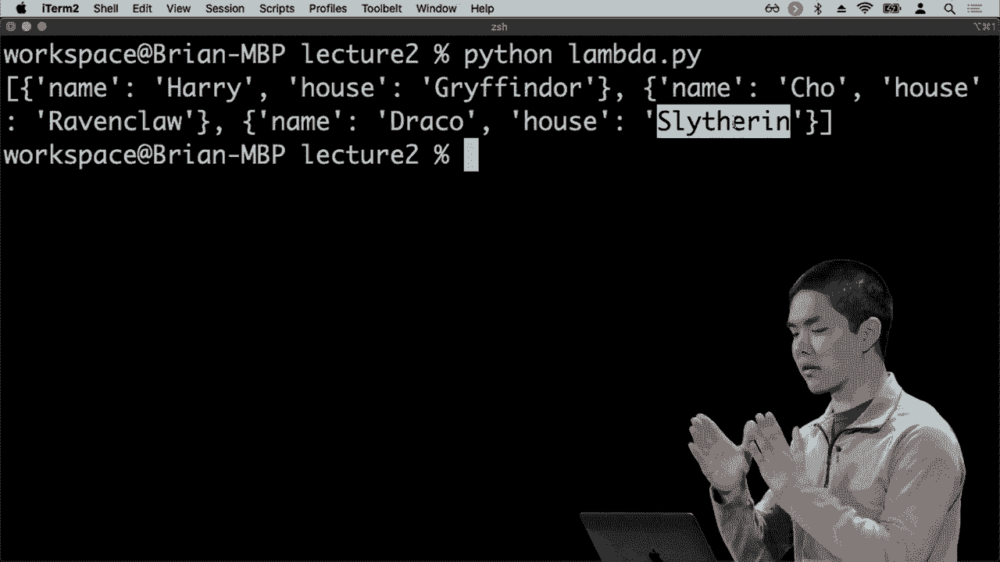
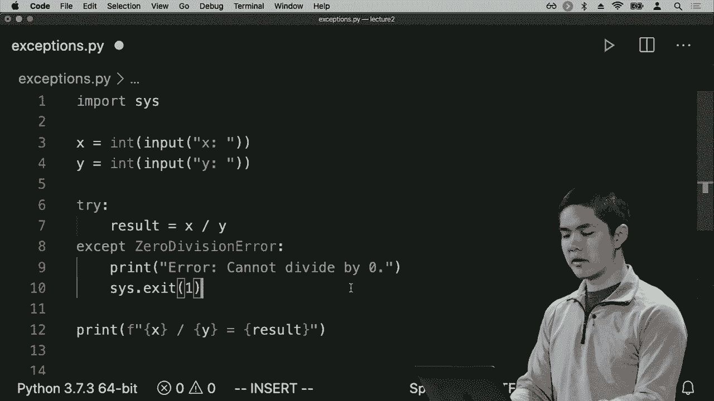
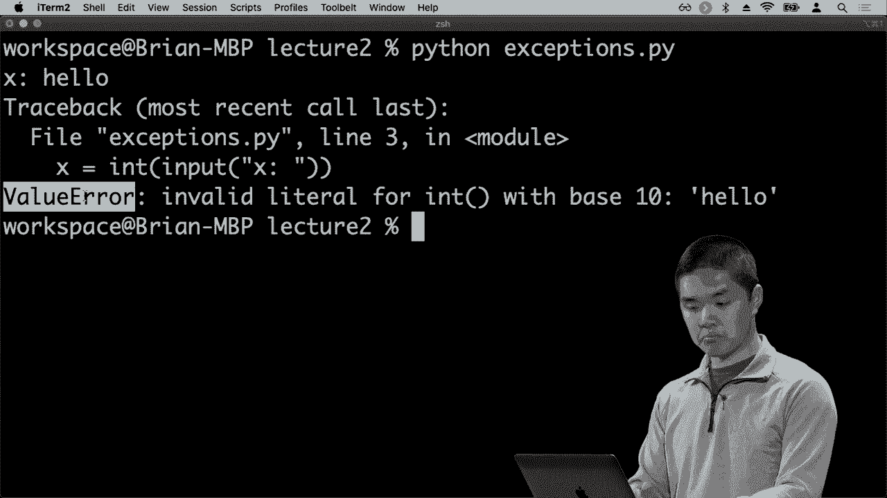
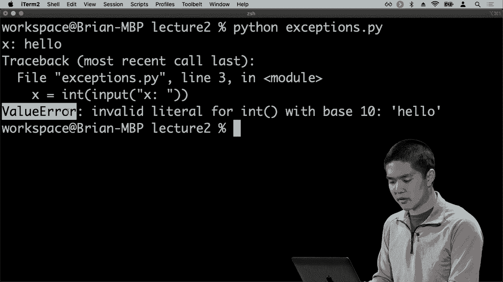

# 哈佛 CS50-WEB ｜ 基于Python ／ JavaScript的Web编程(2020·完整版) - P8：L2- Python编程语言全解 2 (函数，面向对象，异常处理) - ShowMeAI - BV1gL411x7NY

我们将看看我们在Python中的函数，这些函数将为我们提供编写自己的函数的方法，这些函数接收输入并产生输出。我们已经看到了Python中存在的许多不同函数。我们看到过接收用户输入的输入函数。

打印函数接收一些文本或其他信息并将其打印到屏幕上，但如果我们想定义自己的函数，我们也可以这样做。所以在这里，我将继续编写一个名为function stop PI的新程序。让我们编写一个接收数字并计算平方的函数。

10是10乘以10，或者100。我想要一个非常简单的函数，接收一个数字并返回它的平方。我在Python中定义函数的方式是使用DEF关键字，def是define的缩写。在这里我可以说让我定义一个名为平方的函数，然后在括号中指定它接收的输入，这里只是平方。

接收一个输入，我称之为X，但如果有多个输入，我可以用逗号分隔它们，例如X Y Z，用于接收三个输入的函数。但在这种情况下，只有一个输入X，平方函数可以有任何逻辑，缩进在平方函数下面。

但最终这个函数相当简单，它将返回x乘以x，即x的平方。如果我想打印出很多数字的平方，我可以这样做。我可以说，假设I在范围内，让我们打印。

第4行表示对于I在范围10内，执行一个循环十次，从0循环到9。每次循环时，我们将打印一些内容。我们将打印出I的平方值。

调用我们的平方函数，使用I作为输入，因此这将会是运行这个循环十次并打印这一行十次，每次的I值不同。我可以运行Python函数pi，这里我看到0的平方是0平方。

一个是一个，两个是四，以此类推，一直到9的平方是81，所以我们现在已经编写了一个函数，并能够使用它，但理想情况下，当我们编写函数时，我们希望不仅能够在同一文件中使用它们，还希望其他人也能使用它们，那么我们该如何做到呢？

你可以从其他Python模块或文件中导入函数。让我创建一个名为squ*res PI的新文件。例如，这样我们就不再在这里运行这个循环，而是改为在squ*res PI中运行这个循环，再次将我的代码不同部分分开，我有一个定义平方的文件。

在functions pi内部的函数中，然后。

另一个名为squ*res pi的文件，我现在实际上在调用squ*re函数。

如果我尝试运行Python squ*res pi，你会注意到我会遇到一个错误。这里是另一个你会经常看到的错误，它是一个名称错误，另一种异常类型，这里说的是名称 squ*re 未定义，意味着我正在尝试使用一个未定义的变量、函数名称或其他东西。

实际上我并没有定义squ*re是什么，这就是因为默认情况下Python文件互不了解。如果我想使用另一个文件中定义的函数，我需要从该文件导入它。我可以这样做，我可以说从functions导入squ*re函数。

这个文件的名称是function stop PI，我在说我希望从该Python模块导入squ*re函数。

作为一个我想要使用的函数。

现在我可以运行Python squ*res da PI，我们得到了预期的输出，没有更多的异常。我现在能够从另一个模块导入某些东西并以这种方式访问它，这是一种导入方式，字面意思是从functions导入squ*re函数，导入一个在function stop中定义的特定名称。

另一种做法是直接说导入functions，导入整个模块，但那样我就需要说从Shin的.squ*re来表示进入functions模块并获取squ*re函数并运行该函数，这样操作也会完全一样。

有几种不同的选择，或者导入整个模块，在这种情况下我使用这个点表示法来访问模块的特定部分，或者我说从functions导入squ*re，以便仅将名称squ*re导入到这个文件中，这样我就可以随时使用squ*re这个词，这样是有效的。

这不仅适用于我们自己编写的模块，Python还附带了许多内置模块。如果你想编写与CSV文件交互的程序，而CSV是一种电子表格文件格式，我可以导入Python内置的CSV模块，以获取与CSV相关的一系列功能。

一堆与数学相关的功能可以通过导入数学模块等方式获得。此外，还有其他人编写的额外Python模块和包，你可以安装。当时机来临，下次我们看Django时，这是我们要关注的技巧之一。

使用由其他人编写的函数，因此现在是模块，以及我们如何使用模块来导入函数，以便允许某种行为，这是一种使用Python编程语言编程的方式，但另一种关键技巧是Python。

这一点也被许多其他编程语言所支持。对象导向编程的概念是一种特殊类型的编程或编程范式，从某种意义上说，它是一种思考我们如何编写程序的方式。在面向对象编程中，我们以对象的方式思考世界。

在对象可能存储信息的地方，存储一些数据并且也支持执行某些类型的操作、某种行为或方法，或者我们可能称之为可以对这些对象进行操作的函数。因此，现在我们将深入了解一些面向对象的能力。

Python编程语言将为我们提供能力，以便有这些类型。它有列表类型，它有集合类型等等。假设我们想在Python中创建一个新类型，一种表示其他数据类型的方式，例如二维点。

我们之前谈到的事情是有一个x值和y值。正如我们已经讨论过的，你可以通过使用元组来做到这一点，使用一个数字和另一个数字，但我们可以创建一个完整的对象类来表示这个数据结构，所以这就是我们将要进行的。

现在我们来看如何在Python中创建一个类，所以创建一个名为classes.py的新文件。类可以被视为我们要定义的某种对象的模板，我们将定义一个名为point的新类，然后在定义完point是什么之后，我们将能够创建其他点。

能够创建点以存储x和y值，例如。那么我们需要什么来创建一个类呢？我们需要某种方式来说明当我创建一个点时应该发生什么，在Python中，这通过被称为魔法方法的__init__来定义。

这是一个方法或函数，每次我尝试创建一个新点时都会自动调用。这个函数接受几个参数，所有操作对象本身的函数，通常称为方法，都会接受第一个参数self，这个参数。

self表示相关的对象，这一点非常重要。因为我们不想仅仅有一个名为X的单一变量来存储点的x坐标，或一个名为Y的单一变量来存储y坐标，因为两个不同的点可能有不同的X和不同的Y值，而我们希望能够。

能够分别存储这些点，并且我们将把它们存储在对象本身内部，因此这个变量self引用了我们当前处理的对象，并且可能会根据我们在任何给定时刻与之交互的点而改变。点还需要哪些输入？点还需要一个x值和一个y值。

值，因此当我们创建一个点时，我们将为该点提供一个x值和一个y值。现在，我们需要做什么才能将所有这些数据存储在点内部？好吧，记住self表示点本身，因此如果我们想在该点内部存储数据，让点存储它自己的x和y。

然后我们需要将数据存储在单元格中，可以这么说。为了做到这一点，我们可以使用这个点符号来表示self的X等于这个输入X，而self的Y等于这个参数Y，而这些值x和y可以被称为。

任何东西都可以被称为，例如，输入1和输入2。然后，你只需在这里反映它们，重要的是这两个输入值被存储在点本身的属性中，我们将称之为x和y。好的，这有点抽象，但现在让我们。

看看我们实际上如何使用它，如果我想创建一个叫P的新点。我可以说P等于点，然后自我参数会自动提供。我不需要担心这一点，但我确实需要提供输入1和输入2，x值和y值，所以我将继续提供一个。

x值为2，y值为8，例如，所以现在我创建了这个点。现在我有了一个点，我可以打印出关于该点的信息。我可以打印出点的x值，也可以打印出点的Y值。再一次，我使用这个点符号来访问数据。

存储在那个点内部访问。

它的x值和超额Y值，因此现在，当我运行这个程序Python类时。我得到的是第一行的2。

这就是x值，第二行是8，或者说这是Y值。所以我们这里有一个叫init的函数，通过将两个输入存储在对象内部的属性中，创建一个点，称为X和Y，以便稍后我可以创建一个点。

隐式调用这个init函数，创建点后，我可以访问其中的数据。我可以说，打印出P的x等于多少，打印出P的y等于多少，这样也是可以的。这是创建一个类的一个相当简单的例子，只是创建一个表示x和y的点的类。

让我们看一个更有趣的例子，假设我们正在为一家航空公司编写一个程序，该航空公司需要跟踪航班上的乘客预订，并确保没有航班被超额预订。我们不希望航班上的乘客超过其容量。

所以让我们定义一个新的类，我们将称之为flight，这次init方法将只接受一个参数，除了self之外，就是容量。每个航班需要某种容量来知道可以容纳多少人，因此我会将其存储在一个名为容量的值中。

self.capacity等于容量，那么我们还需要存储关于航班的其他信息吗？航班有一个容量，并且它还有所有乘客，所以我们可以用多种方式表示这一点，但我们知道列表可以用来存储一系列值。

继续创建一个将存储在self.passengers中的列表，该列表将等于空列表，因此我们从空乘客列表开始。现在如果我想创建一个航班，我可以说flight = 大写F flight，这是类的名称，然后提供一个容量。

说容量为三意味着可以有三个人上飞机，但不能超过三人。这是因为这是在init函数中指定的参数，当我这样做时，我会自动获得一个空的乘客列表。现在，让我们考虑一下可能出现的问题或方法。

当涉及到航班时，我们可能关心的一些函数，所以一个合理的函数是添加一个乘客的函数。如果我想让某个新乘客上这趟航班，我该如何进行呢？那么让我们定义一个新的方法，也称为。

这个航班类中有一个名为add的方法，可以调用乘客。因为这是一个将作用于单个对象的方法，我们需要某种方式来引用该对象本身，所以我们会再次使用关键字self，当我们添加乘客时，需要添加一个路径。

通过他们的名字，所以我需要指定他们的名字，这样现在我想将这个名字添加到乘客列表中，我该如何访问乘客列表呢？我会访问self，即对象本身，而我将乘客存储在self中，在self.passenger这个属性中。

self.passengers是一个最初为空的列表，但如果我想将某些内容添加到列表的末尾，我们已经看到，为此我可以说self.passengers.append(name)，这样就可以将新乘客添加到这个乘客列表的末尾。现在有什么好处呢？

每次调用这个add passenger函数时，将会发生的事情是，我们将把这个名字追加到乘客列表的末尾，但我们没有考虑到航班的容量。理想情况下，我们的add passengers函数不应该让某人被添加到航班中。

如果航班已经达到容量，有很多事情我们可以做。我们可以在这个函数内部检查，但为了确保万无一失，让我们创建一个新函数，叫做开放座位，它将返回飞机上剩余的开放座位数量。

除了自我，我们不需要其他输入来计算有多少开放座位。计算开放座位所需知道的唯一事情是容量减去乘客数量。记住，自我乘客是我们的所有乘客列表，而任何时候。

我们有一个序列来获取该序列的长度，我可以说长度或该序列的长度，以获取乘客数量。所以现在我们有这个叫做开放座位的函数，它将返回容量减去乘客数量，并告诉我们还有多少开放座位。

在乘客函数中，我可以添加一些额外的逻辑。我可以说，如果没有自我开放座位，这等同于我在这种情况下说，如果自我没有开放座位等于零，意味着没有开放座位，换句话说，更为 Pythonic 的表达方式是说，如果没有自我开放座位。

如果没有更多的开放座位，我们应该怎么做？我们应该返回。也许你可以想象这个添加乘客函数如果成功添加乘客将返回真，否则返回假。所以在这种情况下，我可以返回假，表示没有足够的开放座位。

从这个函数返回假以指示出现某种错误，但如果有开放座位，我们可以添加乘客并返回真，表示一切正常，我们能够成功添加乘客。所以现在我们有这三个函数，它创建了一个新的。

航班添加乘客，该函数将新乘客添加到该航班上，以及开放座位，告诉我们有多少开放座位。现在让我们使用这些函数，实际上为这个航班添加一些乘客，让我获取一组人，比如哈利、罗恩、赫敏和金妮，然后让我循环遍历所有这些人。

列表中的每一个人，让我们尝试在航班上添加乘客，并将结果保存到一个变量中，称为成功。例如，我可以说如果成功，那么让我们打印出成功将这个人添加到航班上，但否则打印出没有。

有效的座位给那个人。那么这里发生了什么？我们有一组人，对于每一个人，我们将尝试将乘客添加到航班上，调用航班添加乘客，传入该人的名字，并将结果（真或假）保存到这里。

变量称为 success，如果 success 为 true，我们打印出“我们已成功添加他们”。否则，我们打印出“该人员没有可用座位”。现在我们可以尝试运行这个程序，我将运行 Python 类 Piatt，现在我们看到我们已成功将哈利、罗恩和赫敏添加到航班中。

航班的容量为三，这意味着对金妮来说没有可用座位，这在第四行显示为错误消息。如果你真的想进行优化，你可能会注意到，你其实不需要这个变量。我可以将整个表达式 flight add passenger person 拿掉。

在条件语句中，我可以尝试添加一个乘客，添加乘客将返回 true 或 false，如果返回 true，这意味着成功。然后我可以打印出“我们已成功将该人员添加到航班中”，这是对 Python 中面向对象编程的一次简要介绍。

以及其他编程语言，以表示像这个特定航班的对象，然后使用方法（如添加乘客的方法）来操作这些对象，该方法接收航班并将人员添加到航班中，只要该航班有可用容量，因此这是许多强大的功能之一。

Python 的一些特性将会在后期深入探讨，并在我们构建这些网页应用时使用。现在有几个最终示例，值得一看，以便让你接触到 Python 中其他可用的特性。

很快就会出现的一个概念是装饰器，就像我们可以在 Python 中获取一个值（比如数字）并修改它一样，装饰器是在 Python 中修改函数的一种方式，为该函数添加一些额外的行为。因此，我将创建一个名为 decorators 的新文件。

仅用来演示我们可以用装饰器做什么，装饰器的概念是，装饰器是一个接受函数作为输入并返回该函数的修改版本的函数。因此，与其他编程语言不同，函数独立存在，无法直接。

函数可以作为输入或输出传递给 Python 中的其他函数，函数就像任何其他值一样，可以作为输入传递给另一个函数，也可以作为另一个函数的输出，这被称为函数式编程范式，其中函数本身就是值。因此，让我们创建一个。

修改另一个函数的函数，通过声明该函数即将运行，以及该函数完成运行，来进行演示。因此，这个声明函数将接收一个函数 f 作为输入，并返回一个新函数。通常，这个函数会用一些额外的行为包装函数 f。

因此，通常称为包装函数，我们可能称这个。包装器，来说明我的包装函数将要做什么，它将首先打印即将运行函数的信息，以便宣布我们即将运行该函数，这就是我想让我的，宣布装饰器做的。

实际上运行函数f，然后，打印完成该函数。所以我所做的宣布装饰器是，接收函数f，并创建一个新函数，通过打印语句在函数执行前后进行宣布，最后我们将返回这个。

新函数即包装函数，所以这就是我们，可能称之为装饰器的地方，它是一个接收函数、通过添加一些额外功能来修改它，并最终返回一些输出的函数。现在，我可以定义一个名为hello的函数，它只是打印hello world。

这是一个例子，然后添加装饰器我使用@符号，可以说@announce，来添加宣布装饰器到这个函数上，然后我只需运行。

发生的事情是，我将运行Python decorators dot Pi，我看到即将运行这个函数，然后是hello。

在这个函数完成后，为什么会这样工作呢？是因为我们的。hello函数只是打印了hello，world，被这个。宣布装饰器所包裹，而这个，宣布装饰器所做的就是接收我们的。hello函数作为输入，并返回一个，新的函数，首先打印一个警告。

警告我们即将运行的函数实际上会运行这个函数，然后打印另一条消息，这是一个简单的示例，但装饰器在能够快速地对函数添加功能方面有很大的潜力。在一个网页应用中，如果你只想要某些。

如果用户已登录，则能够运行它，你可以想象编写一个装饰器，确保用户已登录。然后在你想确保的所有函数上使用该装饰器，这些函数只有在用户恰好已登录时才有效，所以装饰器是一个非常。

强大的工具，像Django这样的网页应用框架可以利用它。只是为了让网页应用开发过程变得更简单一点。我们再来看一下Python中存在的其他几种，技术，其中一种是我们可能如何，更高效地表示函数。

假设我现在有一个，我将称之为lambda PI，稍后你会明白原因。假设我有一个名字或人的列表，举个例子，在这个人的列表中，每个人不是一个简单的字符串，而是一个字典，包含一个名字，比如Harry和一个房子，比如Gryffindor。

让我再添加一个名字，比如 Cho 和，一个像 Ravenclaw 的学院，然后再加上一个。名字像 Draco 和一个学院像，Slytherin，所以这里我们有一个列表，其中每个。元素都是一个字典，一个键值对的映射。这在 Python 中是完全可以的，我们有能力嵌套数据结构。

我们可以在彼此内部拥有列表，嵌套在其他列表中或字典中的列表，或者在这种情况下，字典在列表中，事实上，这种数据结构的嵌套是，Python 能够表示的原因之一，结构化数据，比如一个人的列表。

每个人都有各种不同的，属性，现在我可能想做的是像对所有这些，进行排序然后打印出来，所以我。可能想说 people.dot sort，然后打印所有人，但如果我尝试。

运行这个我会遇到异常，我遇到，异常类型错误，字典和深度之间不。支持小于，这有点奇怪，因为我根本没有在任何地方使用。小于符号，但在回溯中你会看到。捕捉到的代码行是 people.dot sort，某种程度上 people.dot。

排序导致类型错误，因为，它试图使用小于进行比较。

对字典的比较，这似乎意味着 Python 不知道如何。对这些字典进行排序，它不知道哈利是在，Cho 之前还是之后，因为它不知道如何。比较这两个元素，因此如果我。想这样做，我需要告诉排序函数如何。

排序这些人，因此为了做到这一点，我可以通过。定义一个函数来告诉排序，函数如何进行排序，排序时看什么，因此如果我想要，按人名排序，让我定义一个。函数，我将其称为 f，它接受一个人作为输入并返回该。

通过查找该字典中的名字字段来获取某人的名字，现在我可以通过，使用 sort key 等于 F 来按姓名排序，这意味着。是对所有人进行排序，而排序的方式是通过运行这个函数，函数接受一个人并。

给我们返回他们的名字，现在如果我运行，Python lambda PI 你会看到我首先，得到的是 show 然后是 Drako。

然后按名字的字母顺序排列哈利，而如果我试图排序。

通过更改我使用的排序函数来按他们的学院对人进行排序，然后。重新运行这个，现在我看到的是首先，哈利在格兰芬多，然后是拉文克劳。接着是斯莱特林，例如，我们得到。

按字母顺序排列的房屋，而我之所以展示这个是因为这个函数非常简单，仅在一个地方使用，Python 实际上提供了一种更简单的方式来表示一个非常短的一行函数，使用一种称为 lambda 表达式的方式，这是一种将函数包含为单个表达式的方法。

在一行中，我可以说，不必定义一个名为 F 的函数，我可以去掉这些，只需说按这个键排序，一个 lambda 函数，它接受一个人并返回这个人的名字，所以我们说人是输入：

输出的名字作为结果，这是一种简化的表达方式，和我们刚刚看到的定义一个函数、赋予它一个名字然后在这里使用这个名字是相同的。这里就是一个完整的函数，它接受一个输入。

以人作为输入并返回他们的名称。

名称，所以 Python lambda 其实是按名称对人进行排序。

Cho、Draco 和 Harry，但如果我完全省略了这个键。

然后尝试排序时，我们得到这个类型错误，因为我们无法比较这两个字典。现在我们已经看到了许多不同的异常，这些都是 Python 中的异常。最后一个例子是关于如何处理这些异常的示例，例如当事情出错时该怎么做。

我们希望我们的程序能够处理这些可能的异常情况，情况可能真的出错，所以让我们尝试一个例子，我将创建一个新文件，叫做 exception stop PI，而这个 PI 将会获取一些输入，告诉我们：

获取一个名为 X 的整数输入，再获取一个名为 Y 的整数输入，然后让我们继续打印 X 除以 Y 的结果，所以结果等于 X 除以 Y，然后让我们打印出像 "X 除以 Y 等于结果" 这样的内容，我们可以字面上打印出 X 和 Y 的值，这就是一个。

一个简单的程序，仅仅是执行一些除法，获取一个 X 的值，获取一个 Y 的值，将它们相除并打印出结果。

我们可以尝试运行这个程序，运行 Python exception stop I，如果我输入 5 然后 10，5 除以 10 正好是 0.5，这是我可能期待的结果，但现在可能出现什么问题呢？你还记得数学中的除法吗？可能出错的情况是，如果我输入 5 然后 0，尝试 5 除以 0。

发生什么情况呢？当我这样做时，我会得到一个异常，出现一个 0 除法错误，这是在尝试除以 0 时发生的错误。不过，我希望发生的情况是，不是让我的程序显示这样的混乱错误和回溯，而是处理这个异常。

优雅地处理它，能够捕获用户做错事的情况。

并报告一个更好看的消息。那么，我该如何进行呢？我能做的一件事是，不仅仅说结果等于 X 除以 Y，而是尝试这样做，尝试将结果设为 X 除以 Y，然后说，如果发生 0 除法错误，那我们就做点别的，打印出来。

我无法除以零，然后退出程序。如何退出程序呢？结果发现，Python 中有一个模块，叫做 sis，如果我导入 Syst 模块，我可以说 sis.dot exit 1，意味着以状态代码退出程序。状态代码 1 通常意味着出了一些问题。

这个程序，现在我试图将 X 除以 Y，除了我有一个异常处理器。这是一个 try except 表达式，我在说，尝试这样做。除非发生这个异常，否则就不要让程序崩溃，只需打印出这个错误消息，无法除以。

零，然后退出程序。现在，让我们试试，python 异常停止 PI，再试 5 和 10。完全正常，得到了 0.5 的值，但现在如果我尝试 5 和 0。按回车，我得到了一个错误，无法除以 0。这个长异常对用户来说看起来复杂，不再混乱，我已经能够处理。

优雅地处理异常。现在另一个可能出现的异常是，如果我输入的不是数字的单词，比如 hello，而是 X 为 5，现在我得到了另一种类型的异常，一个值错误，这发生在我尝试将某个东西转换为整数时，因为整数，你无法将不是数字的文本。

并将其转换为整数，因此，

我在这里遇到了这个值错误，我该如何处理呢？我可以用与我获取输入 X 和 Y 时几乎相同的方式来处理。我可以说，不仅仅是获取输入，而是尝试获取。

输入，除非发生值错误，这就是我们得到的错误。

刚才的值错误，然后打印错误，无效输入，并继续执行，而不是退出 1。所以现在我已经能够。

处理这个错误，我可以说，Python 异常停止，我可以说。你好，我只是得到了错误，无效输入，我无法除以零，得到了错误，无法除以零。但是如果我输入一个有效的 X 和 Y 值，我就得到了。

将一个数字除以另一个数字，因此，异常处理通常是一个有用的工具，如果你预计某些代码行可能会遇到某种问题，无论是值错误、零除法错误还是其他错误，都能够处理这些错误。

优雅地处理错误可能正是你所想要的，如果你打算使用Python构建一个Web应用程序的话，也就是说如果发生错误，我们希望优雅地处理它，向用户显示一个友好的错误信息，告诉他们出错的原因，而不是让程序完全崩溃。

这些是Python编程语言的一些关键特性，这种语言让我们能够定义函数、循环和条件，并以非常方便的方式创建类，以便我们开始构建能够执行各种任务的对象。

下次使用Python时，我们将能够设计Web应用程序，使得用户能够向我们的Web应用程序发出请求并获得某种响应，所以我们下次见！
