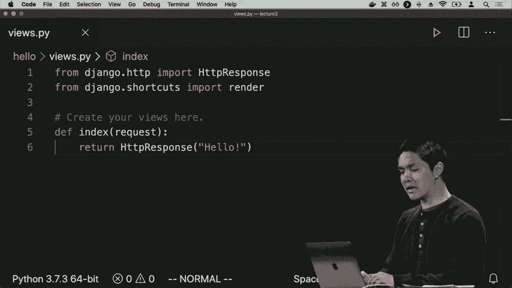

# 哈佛CS50-WEB｜基于Python／JavaScript的Web编程（2020·完整版）- P9：L3- Django网络编程 1（web应用，http，路由）- ShowMeAI - BV1gL411x7NY

[音乐]，欢迎大家回到使用Python和JavaScript的网页编程课程。在这门课程中，我们已经看了一些不同的技术，我们查看了HTML和CSS，这些语言可以用来描述网页的结构，并适当地进行样式设置。

我们还查看了Python，这是一种可以用来获取编程特性的编程语言，如循环、条件、变量和函数等。今天我们要介绍Django，它将结合这两者。Django是一个Python网络框架，可以让我们编写能够动态生成HTML和CSS的Python代码，最终构建动态网络应用。

这将使我们能够做一些以前仅用HTML和CSS无法做到的事情。使用HTML和CSS时，我们创建的网页是静态的。

每当你访问网页时，页面是相同的，但如果你考虑一下日常使用的网站，比如纽约时报，这种情况并不是每次你访问纽约时报主页时都是相同的。

看到的正是相同的HTML，第二天你可能会看到新的日期，你可能会看到第二天的文章，无论何时有人对文章发表评论，你都可以看到这些评论，并看到有多少人对某篇文章发表评论，而这种情况可能并不是有人在那儿。

每次有变化时，他们并不会更新纽约时报网站的HTML，而更可能是有某个程序（可能用Python或其他语言编写）动态生成HTML和CSS，使得网络应用能够根据用户的互动进行响应。

与其互动，这就是我们最终要通过这个Django网络框架创建的。我们将创建在网络服务器上运行的软件，使得运行在浏览器中的客户端可以向我们的网络服务器发出请求。

要进行某种回应，这个过程实际上是如何发生的，最终归结于这个协议HTTP，通常被称为超文本传输协议，这就是在互联网上消息如何来回发送的协议。你可以这样理解。

这可以看作是计算机中某个用户（我们称之为客户端）和我们的服务器（它将包含我们的网络应用）之间的关系。我们将编写一个在该服务器上运行的网络应用，客户端将向该服务器发出请求。

将处理该请求，并返回某种响应，该请求可能看起来像这样，从内部来看，可能以“get”一词开始，get只是请求方法的一种示例，是你可能尝试获取页面的一种方式，get仅意味着我想获取特定的。

在这种情况下，我试图获取的是根页面，仅表示网站的根目录，通常是默认的。

网站的页面HTTP 1.1只是我们正在使用的HTTP版本，主机是我们试图访问的网页的URL，比如example.com或其他我可能试图请求的网站，所以这个请求最终会由我的网络浏览器在我输入URL时发送。

按回车键，例如，服务器处理该请求，然后返回某种响应，响应通常看起来会像这样，以HTTP版本1.1或在某些情况下，版本2开头，然后是某种响应码，200是表示正常的响应码。

一切正常，页面成功返回，例如，在第二行我们看到内容类型为text/html，这仅意味着返回的响应数据格式为HTML数据，用户的web浏览器在客户端应将其呈现为HTML。

例如，还有其他类型的内容以及其他信息会在响应中返回，但关键思想是将网页视为请求和响应的关系，用户发起请求以获取特定的网页，而他们收到的则是这样的响应，希望能够。

包括状态码200，意味着正常，但还有许多其他状态码，比较常见的有200，表示正常，可能你见过404，表示未找到，如果你尝试请求一个不存在的网页，比如说，其他你可能见到的状态码还有301，表示永久移动。

如果你从一个网站重定向到另一个网站，这种情况经常发生，例如，我们将很快看看一个例子，403通常意味着禁止，你试图访问一个不该访问的页面，而500通常指的是某种内部服务器错误，通常意味着。

编写服务器的人，也许我们的Django网络应用程序存在一些bug，我们可能需要回过头去找出这个bug所在，以便修复它，同样，还有其他状态码，但这些是我们将会看到的一些最常见的状态码。

在我们使用Django构建web应用程序时进行交互，Django是一个web框架，它为我们预先构建了一系列工具，这将使我们能够通过编写Python代码来轻松入门，以设计一个功能齐全的web应用程序，并处理一些事情。

大多数网页都有的一些东西，这样我们可以专注于构建我们自己网络应用程序的有趣逻辑。因此，您在使用Django之前需要做的第一步是安装它。如果您使用的是Python，您可能对pip（Python包管理器）很熟悉。

它使得安装新包变得简单，我们可能想做的第一件事就是安装Django，在这里我们将使用Python 3，因此您可能需要指定`pip 3`并安装Django，以在您的系统上安装Django。在您完成后，我们可以运行一个命令。

创建一个Django项目，该命令看起来像这样。`Django - admin start project`，后面跟着我们想创建的项目名称。当我们运行这个命令时，Django将自动为我们创建一些入门文件，以便开始构建过程。

网络应用程序，所以现在让我们尝试创建一个项目。我将进入我的终端窗口，接下来我会输入那个命令，我将输入`Django admin`，然后`start project`，接着我需要给这个项目命名，我将这个项目命名为“lecture 3”。

您可以将项目命名为您喜欢的任何名称，当那发生时，如果我输入`ls`，我看到的是Django为我创建了一个名为“lecture 3”的目录或文件夹。！

如果我继续打开它，在我的文本编辑器中，我们可以看一下。！

看看这个“lecture 3”目录中有哪些文件，所以实际上我会。！

接下来进入“lecture 3”并打开它，我们在“lecture 3”中看到的内容是！

一些文件供我们入门，所以有几个文件，目前对我们来说并不是所有的文件都很有趣，但最重要的是`manage.py`是Django将为我们创建的一个文件。我们通常不需要修改该文件，但我们将使用它。

一个可以在此Django项目上执行命令的文件，我们将看到一些示例，现在以及未来的讲座中也会有一些示例，然后我们将要查看的另一个重要文件是`settings.py`，它包含了我们Django应用程序的重要配置设置。

`settings.py`预加载了一些默认设置，但我们可能想更改这些设置，以便为我们的应用程序添加功能，或者对应用程序的行为进行一些修改。另一个为我们预创建的重要文件是`urls.py`。

可以将 URLs PI 视为我们网页应用的内容目录。在任何给定的网页应用上，有许多不同的 URL 或路由可供访问。例如在 Google 上，你可以访问 /search 或 /images，而 URLs PI 就是一个内容目录。

我可以最终访问的所有 URL，因此如果我想尝试运行这个网页应用，只是想看看它在终端中是什么样子。我会运行 `Python manage.py`，后面跟一个命令，这个命令叫做 runserver，这通常是我们使用 manage.py 的方式。

`manage.py` 后面跟一个参数，指定我们想要运行什么命令。`python manage.py runserver` 的意思是开始实际运行这个网页服务器。如果我这样做，我现在就在本地运行这个网页服务器，并看到一堆调试输出，但对我来说有趣的是它在下面说。

在 HTTP://127.0.0.1:8000 启动开发服务器。所以这就是我的网页应用当前运行的地方，127.0.0.1 是一个 IP 地址，指向我的本地计算机。我现在看到的计算机，只有我可以访问，而其他人无法在互联网上访问。

000 是我们所称的端口号，它指的是正在运行的服务类型。你可能在不同的端口上运行多个不同的互联网服务。在这种情况下，我们的 Django 应用正在 8000 端口上运行，所以。

如果我复制这个 URL，然后直接进入我的网页浏览器并粘贴那个 URL，我看到的就是 Django 的默认页面，表明我们的 Django 安装正常工作。这现在是 Django 将提供给我们的默认页面，说明 Django 已经为这个网页应用加载完毕。

实际上开始构建这个网页应用，添加我们想要的功能。因此，我们在这里创建的是一个 Django 项目，就项目的结构而言，每个 Django 项目通常由一个或多个 Django 应用组成，所以一个项目可能包含。

在它内部有多个应用，之所以有这样的划分，是因为如果你考虑大型网站，往往一个大网站或项目有多个不同的应用，分别作为独立的服务在其中运行。例如，Google 有 Google 搜索、Google 图片和 Google 新闻。

可以把每一个独立的服务看作是一个单独的应用，归属于一个更大的项目，比如 Google，或者像亚马逊的网站。举个例子，可能是一个大型项目，其中包含几个不同的应用，一个用于购物，另一个用于亚马逊的视频。

Django 自带了将项目划分为多个独立应用程序的功能，也许对于简单的应用程序，我们只会有一个包含一个应用程序的项目，而不是多个，但它具有允许我们创建这些独立应用程序的能力。

我们有不同的功能，因此如果我们想开始使用 Django，在创建项目之后，我们首先需要创建一个 Django 应用程序，因此在终端中，我会通过按 ctrl C 退出这个服务器，表示我想退出并停止运行服务器，所以现在如果我返回那个 URL 并刷新。

它不会工作，因为 jenga 服务器不再运行，但我会运行命令 Python managed up I start，应用程序名称是我想创建的，作为我们第一个应用程序，我将其称为 hello。例如，所以我现在创建了一个名为 lecture 3 的 Django 项目。

我创建的服务示例是这样的。

我现在称为 hello 的第一个应用程序，因此如果我们现在查看我们的文件，你会看到除了之前存在的 lecture 3 目录外，我们现在还有一个 Django 为我们创建的 hello 目录，它将包含 hello 应用程序运行所需的信息，并且有很多。

默认生成的文件，我们今天不会查看所有这些文件，我们将主要关注 views.py，稍后会说明原因，它将是让我们描述用户在访问特定路由时看到的内容的文件，例如。

可以决定渲染到的内容，以及其他文件，我们将在本学期的过程中查看。看看 Django 还提供了哪些额外功能。因此，我们现在已经创建了这个 hello 应用程序，我们希望将其安装到这个项目中，为了安装它，我们需要进入这个项目的设置。

特定的 Django 项目，所以如果我进入 lecture 3 目录并打开 settings.py，我在这里看到的是一个由 Django 为我创建的大文件。我没有写任何代码，这只是 Django 项目的默认配置，如果你向下滚动到某个地方，你会看到。

有一个叫做 installed apps 的变量，这是 Django 配置在这个项目中安装了哪些应用程序的地方，还有很多由 Django 默认安装的单独应用程序，例如，其中一个管理会话，我们稍后会查看，但如果我想要。

添加我刚刚创建的新应用程序，称为 hello 到这些已安装的应用程序中。我会继续将 hello 添加到这个已安装应用程序变量的字符串列表中。因此，现在 Hello 将成为这个特定 Django 项目中的一个已安装应用程序，所以我现在想做的是，实际上让这个 hello 应用程序工作。

比如，当我尝试访问特定路由时显示一些内容。我该如何去做呢？好吧，让我们进入Hello目录，看看我hello应用中的views.py。这里是我得到的默认文件，四个views.py，我看到有一个注释给了我。

默认情况下，这个文件上写着“在这里创建你的视图”，你可以将每个视图视为用户可能想要看到的内容。因此，让我们创建一个默认视图，为了在Django中创建一个视图，我们将定义一个函数，这个函数我将称为index，这个函数按惯例接受。

作为参数一个请求参数，这将是一个代表用户为访问我们的网页服务器而发出的HTTP请求的参数。如果我们想获取关于该请求的信息，可以查看这个请求对象，以访问一些其他数据，我们也会稍后看看。

但我希望这个请求做什么呢？我现在想做的事情是简单地返回一个“hello world”的HTTP响应。HTTP响应是Django创建的一个特殊类，因此如果我想使用它，通常需要导入它。Django将提供。

我们有很多可能想要在网页应用中使用的功能，但如果我们想使用它们，通常需要先导入它们。我只知道这一点是因为阅读了Django的文档，可以通过这一行代码`from django.http import HttpResponse`来表示我想要。

导入提供HTTP响应的能力，现在我有一个表示我的视图的函数，这个函数叫做index。index函数所做的只是返回一个“hello world”的HTTP响应。因此，这是一个响应，但现在我们需要告诉应用何时。

实际上返回这个响应时，用户将访问哪个URL。这是我们开始创建一些URL配置的地方，一种设置，告诉Django在访问特定URL时应运行哪个函数，以返回该特定的HTTP响应。那么它是如何做到的呢？

为此，我们需要为这个特定应用创建一个URL配置文件。Django为整个项目有一个URL配置文件，但通常每个应用会有自己的urls.py文件，以便在两个不同的地方分隔内容。

如果我们有多个不同的应用，每个应用都在独立做某事，我们可以让每个单独的应用拥有自己的URL配置文件，以控制该特定应用可用的URL。所以我将进入hello目录，创建一个新的文件。

将URLs命名为PI，那么PI需要的是定义一个变量。称为URL模式，这将是一个列表，包含所有允许的URL，可以为这个特定的应用程序访问，创建URL的方式是首先。导入Django URLs导入路径，让我们创建第一个URL，我会说。

路径，然后第一个参数，这里我将传递一个空字符串。意味着没有额外的参数，我们很快就会看到这意味着什么。末尾的意思是没有东西，路由，然后第二个参数。路径是当访问此URL时应该渲染的视图，所以如果我。

渲染我的索引视图，回想一下在views.py中，我有这个索引函数，那么当有人访问这个。URL时，我想渲染的内容是views.index，视图代表的是views.py文件，我在其中定义了所有的视图，而索引恰好就是。

当有人访问这个URL时，我想调用的函数名称，例如，然后你可以选择性地提供一个带字符串名称的路径来表示这个URL，我将给这个名称命名为index，我们稍后会看到这会有用，但想法是给特定的URL模式命名使得。

让它更容易从应用程序的其他部分引用，因此稍后当我们。可能想链接两个东西或有，表单提交到Web应用程序的不同部分时，给路径命名可以是一个有用的工具。为了使用视图，我需要在URLs.py中添加从点导入。

换句话说，从当前目录中，继续导入视图，每当我使用一个变量名像视图时，我使用那个名字，我需要从某处导入它，正好views.py和urls.py位于同一目录，所以我可以说，从点导入视图来导入所有。

这个特定文件的URLs.py文件，所以现在这是这个应用程序的URLs.py文件，但为使这一切第一次正常工作，最后一步是返回到讲座3目录并打开URLs.py。这里是整个项目的URLs.py文件，包含所有的应用程序。

可能包含在这个项目中，碰巧有一个路径是默认提供的，称为admin，它运行一个名为admin的默认Django应用程序，我们将在下一次讲座中看到更多关于它的内容，但现在我想在这里添加自己的路由，说明我希望。

特定路径的目的是不是指向管理应用，而是我刚刚创建的hello应用，所以我会给这个路径命名为hello，我想说的是，在你包含路径hello之后，继续包含来自我的hello应用的所有URLs.py。

将这两种URL配置风格结合在一起，因此这样做的命令是将include hello.urls包含在Hello模块内获取URLs文件，并且这就是我想作为URL模式添加的，现在为此我还需要导入include，因为我在URL中使用include。

这些模式，所以这有很多步骤，只是为了开始，但为了获取一个高层次的概述，这一切是如何运作的，我有一个叫做lecture 3的Django项目，里面有一个决定我可以访问哪些URL的URLs文件，我可以访问/admin，这将我带到管理员界面。

由Django创建的应用程序，我们现在不必担心，但我刚刚添加了你可以去/hello访问hello应用程序，当你这样做时，我告诉Django查看hello目录内的URLs.py，以找出我可以访问哪些额外的URL。

所以这是一个主URLs.py文件，它可能连接到多个不同的其他URL配置，然后在我应用的hello应用的URLs.py中，我说当有人访问这个默认路由时。

特定应用程序，继续运行索引函数，这是我的一个视图，所以所有这些都已决定，现在完成后，我应该能够返回到我的终端并运行Python manage.py runserver，实际上启动。

这个网络服务器，现在我可以回到这个URL，但不是仅仅访问那个默认URL，我将前往这个URL/hello，当我去。

/hello，我看到的是你好世界。那么，发生了什么事情是我输入了这个URL，它转到Django，Django查看了这个URL，并查看了我的URLs.py文件，并说，你知道的，任何以/hello开头的东西属于hello应用程序，而在我们的hello配置中我们。

他说，当我们访问默认路由时，我们应该运行索引函数，而索引函数返回这个你好世界的响应，现在我们可以开始更改那个响应，我们可以开始调整视图实际在做什么，现在它显示你好世界，但如果我想要。

将其更改为仅显示你好。

例如，我可以现在编辑它，索引函数仅返回一个HTTP。

例如的你好响应，现在我刷新了这个页面，现在它只是说你好，所以我可以编辑我的文件，当我这样做时，Django会注意到有变化并且会以我最新的代码重新出现，这样我现在可以访问/hello，我可以看到的HTTP响应的你好是最终的。

回到我这儿，所以现在让我们看看这个想法，除了在我们内部只有一个视图，我可以有任意多个视图。我可以创建额外的函数，每个函数返回不同的响应，也许我想要一个说 hello 的路由。例如，让我定义一个新函数。

然后我将调用 Brian，它接受请求参数，这个函数将返回 HTTP 响应 hello，Brian 作为例子，现在我需要将这个新视图与一个 URL 关联起来。所以我将回到我 hello 目录中的 URL PI。因此，我有一个默认路由。

由空字符串表示，它加载索引函数，但我可以在此基础上添加。只需在此列表中添加一个新的路径，如果我在 URL 中输入 Brian，这将加载 Brian 函数，我将继续给它。

现在，如果我刷新页面，我仍然在一个斜杠的 hello 路由上，它只显示 hello。

但是如果我访问斜杠 Brian，现在我看到 hello Brian，我有两个不同的 URL，一个是单纯的斜杠 hello，后面什么也没有，这是那个空字符串，另一个是斜杠 hello 后跟 Brian，它加载一个不同的视图函数，返回不同的 HTTP 响应，因此。

我们可以想象继续这样做，我可能想要一个具有多个不同 URL 的网络应用程序，我可以访问。因此，我可以添加一个像 david 函数这样的例子，它返回一个 HTTP 响应 hello David，然后在我的 URL 配置中，我将说继续给我另一个。

路由称为 David，它加载 david 函数，每次我给它一个 URL 时，所以什么。

在斜杠 hello 之后，我给它一个运行 David 函数的功能，给它一个名称，以便稍后更容易引用。所以现在我有了斜杠 hello / Brian，现在我有了斜杠 hello。

/ David 每个都显示不同的 HTTP 响应，所以你可以想象开始使用这个功能来构建一个具有多个不同路由的网络应用程序，这些路由执行不同的操作，许多网络应用程序都是通过它所具有的参数化。

实际上在 URL 中，例如在 Twitter 上，你可以访问 twitter.com/某人的用户名来查看该用户的所有推文，或者是我们现在查看的 GitHub 服务。你可以访问 github.com/你的 GitHub 用户名，以查看特定用户的所有仓库。

例如，如果你考虑一下如何实现这两个服务中的任意一个，如果我们使用Django，它们可能会有一个URL配置文件或类似的东西，定义一整堆URL，并说明当有人访问该页面时应该关联哪个路由，但你可以想象最终。

如果我想向任何人打招呼，如果我不仅要支持/hello/Brian和/hello/David，还想支持任意名字，比如/hello/Harry或/hello/wrong或/hello/Hermione，那么看来我需要创建一整堆。

每个不同的功能都会向不同的人说“你好”，然后创建一整堆不同的URL，以便能够做到这一点。但事实证明，我可以创建带有占位符的URL模式，从而实现通过某些路径来参数化路径。

所谓的转换器，那么这实际上意味着什么呢？好吧，让我们不再创建仅仅说“你好Brian”和“你好David”的函数，而是创建一个叫greet的新函数，它也接受一个请求，但还需要一个额外的参数，例如某个人的名字。

greet函数将返回一个。

HTTP响应为“你好”，然后我继续在这里插入名字。我不需要在字符串中添加F来表示它是一个格式化字符串，这只是Python语法，表示我想说“你好”。不仅仅是对任何人，而是对name变量的值。

我想把name变量替换到greet函数中，然后我可以在URLs.py中添加另一个路径，但我不会像Brian或David或Harry那样在这里说名字，而是要在尖括号中说冒号name，当有人访问该路由时，让我们去。

这个视图的greet函数，路由的名字将是greet。那么这里发生的事情是，我们有一种根本不同的路径，而不是严格规定URL应该是什么样子，比如在路由末尾后没有任何内容，或Brian在路由末尾，或David在路由末尾。

这个路由在第7行表示，这个路由可以是我们给定的任何字符串，并将其变量命名为name，但你可以用完全不同的东西替换name，这可以是任何字符串，比如Brian或David，或者其他任何名字。当发生这种情况时，我们会调用。

greet函数，当这个函数被调用时，它会将这个参数作为参数传递给那个函数，所以现在能够创建一个自定义路由，允许我指定任何字符串，并找出如何妥善处理它。所以现在如果我访问/hello/Harry，例如。

这不是我明确创建的路线，而是一个字符串，哈利是一个字符串。我按回车键，它会说“你好，哈利”，我可以去斜杠“你好，罗恩”，并说“你好，罗恩”，再去斜杠“赫敏”看看，“你好，赫敏”，你知道吗？也许为了好的度量，我想要。

将这个名字大写，比如赫敏，做法是我可以添加任意的 Python 逻辑，事实证明，对于任何 Python 字符串，有一个函数或方法叫做 capitalized，我可以说“点大写”，如果我能在 Python 中做到这一点，那么 Django 也允许我这样做。

将它融入到我所回馈的响应中，因此我现在使用 Python。

取这个名字大写并在返回给用户的响应中使用它，所以现在/剩余返回，“你好，赫敏”，首字母大写 H，同样的，“你好”。

同样，对于“你好，哈利”，我现在已经能够添加一个路由，它接受 HTTP 请求以及参数名称，返回的 HTTP 响应只对那个人说“你好”。所以这些 HTTP 响应可以是任何 HTML 内容，现在我们只是使用文本，但你可以想象添加。

也可以将列表或表格包含在内，但你可能想象一下，如果我必须将整个 HTML 页面包含在这些双引号内，那会很麻烦。很快我们会发现，有很多 HTML 只是放在 Python 程序中的一个字符串里，如果我们回想一下。

本课程到目前为止我们所观察的原则和理念，我们通常尝试分离我们应用程序的不同部分，尽可能做到这一点，这样做有很多价值，保持整洁，并确保人们能够协作。

我希望一个人专注于 Python 逻辑，而另一个人专注于 HTML。你希望他们在工作时不要互相干扰。因此，在 Django 中，我们可以将响应的 HTML 与实际的 Python 代码分开，做法是。

返回 HTTP 响应时，我可以说，对于这个默认路由，我不返回“你好”的 HTTP 响应，让我继续渲染，当我渲染某个东西时，我需要传入 HTTP 请求，但我还会传入模板的名称，我将这个模板称为“你好/索引”。

HTML 所以如果我不想渲染，只是一个字符串，但我想渲染整个 HTML 文件，我可以调用这个渲染。

函数传入请求，但还要传入模板的名称。
