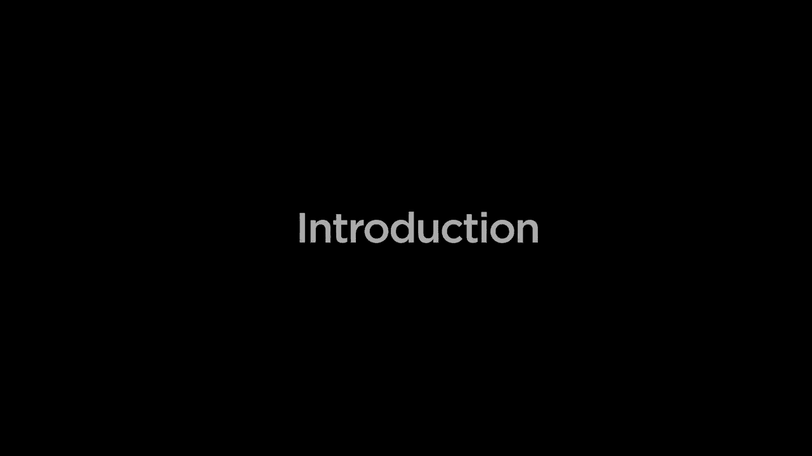

# 哈佛CS50-AI ｜ Python人工智能入门(2020·完整版) - P1：课程内容介绍 - ShowMeAI - BV1AQ4y1y7wy

你好，世界，这是CS 15，这是一门关于使用Python进行人工智能的介绍，来自CS50的Brian。自我将在这里结束，探索现代人工智能基础的概念，我们将从人工智能如何搜索问题解决方案开始。

学习如何玩游戏或尝试找到到目的地的行车路线。那么我们将看看人工智能如何用知识来表示信息。Rai对某些信息是确定的，但也对可能不确定的信息和事件进行学习，并学习如何表示它们。而更重要的是，如何利用这些信息进行推理和得出结论。

将探讨人工智能如何解决各种类型的优化问题，尝试最大化利润、最小化成本或满足其他一些约束。在转向快速发展的机器学习领域之前，我们不会告诉她如何确切地解决一个问题。

而是让Rai访问数据和经验，以便Rai可以自主学习如何执行这些任务。特别是我们将关注神经网络，这是现代机器学习中最受欢迎的工具之一，灵感来自人类大脑学习和推理的方式，然后最终看看世界。自然语言处理不仅是我们人类在学习，人工智能也能够交流。

但也包括人工智能学习如何理解和解释人类语言。我们将探讨这些想法和算法，并在此过程中给你机会构建自己的人工智能程序来实现这一切，这就是CS50。
