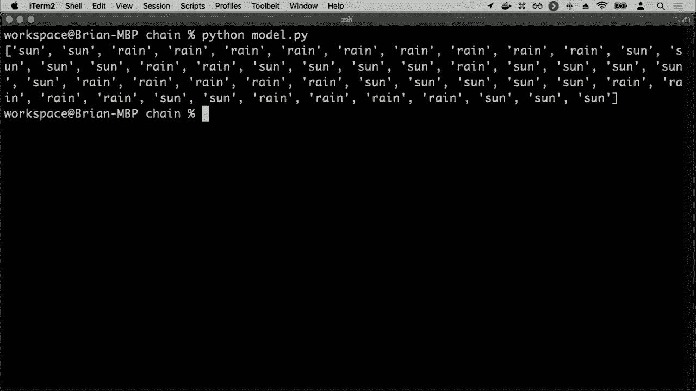
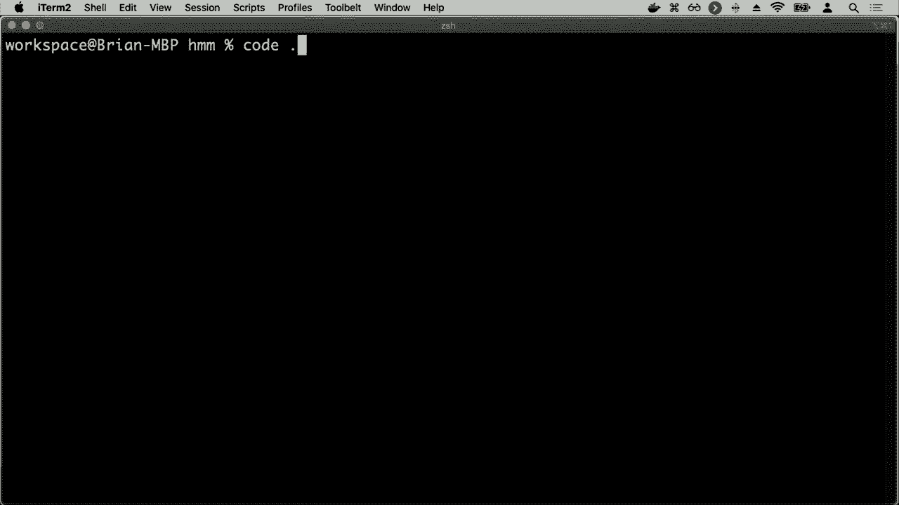
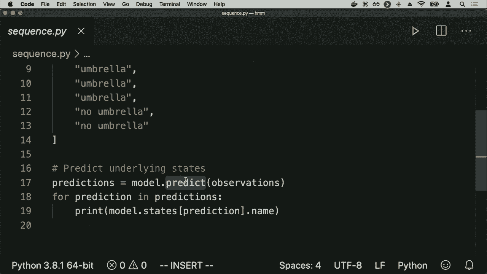
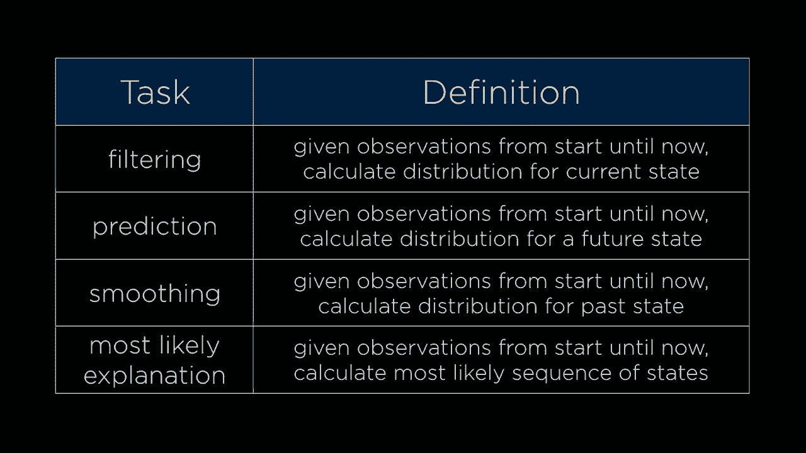

# 哈佛CS50-AI ｜ Python人工智能入门(2020·完整版) - P10：L2- 不确定性 3 (采样，马尔可夫，HMM) - ShowMeAI - BV1AQ4y1y7wy

通过一种称为抽样的过程，在抽样过程中，我将对这个贝叶斯网络中的所有变量进行抽样。我将从每个节点中按照它们的概率分布抽取一个值，所以我可能会怎样。

对所有这些节点进行抽样，我们都从根开始，我将从雨开始，这里是雨的分布，我将使用随机数生成器或类似的东西，随机选择这三个值中的一个。我将以概率0.7选择无雨，以概率0.2选择小雨，以概率0.1选择大雨。

所以我将随机根据这个分布选择其中一个，或许在这种情况下我选择了无雨，然后我对另一个变量维护做同样的事情。维护也有一个概率分布，我将现在进行抽样，这里有三个概率分布，但我只会从第一行进行抽样。

这里因为我已经在我的样本中观察到，雨的值是无，所以鉴于没有雨，我将从这个分布中进行抽样，看看维护的值应该是多少，在这种情况下，维护的值就设为“是”，这是在没有雨的情况下发生的40%。

举个例子，我会以这种方式对其余节点进行抽样。我想从火车的分布中抽样，我将从这一行中抽样，这里没有雨，但有轨道维护，我会抽样80%的时间说火车准时，20%的时间我会。

假设火车延误，最后我们也会对我是否按时到达预约进行相同的操作，我是否出席或错过了预约。好吧，基于这个分布进行抽样，或许说在这种情况下我出席了预约，当火车准时到达时，这发生的概率是90%。

通过遍历这些节点，我可以非常快速地进行一些抽样。

从这个完整的贝叶斯网络中获取可能值的样本，依据这些概率分布。而这变得强大的是，如果我不是一次而是成千上万次地进行，并生成大量样本，全部使用这个。

分布我得到不同的样本，也许其中一些是相同的，但得到。每个可能出现的变量的值，然后，如果我面临一个问题，比如火车准时的概率是什么，你可以进行，精确的推断程序这没有。

与我们之前的推断问题不同，我可以仅仅通过边缘化，查看所有可能的其他值作为变量，并通过枚举进行推断计算，以准确找出这个**概率**，但如果我不关心这个。

精确的**概率**只是对其进行采样，近似它以便接近，这在AI中是一个**强大的工具**，我们不需要每次都**完全正确**。或者我们不需要完全正确，如果我们只需要在某种概率下是对的，我们通常可以做到这样，更**有效**，更**高效**，所以在这里。

现在所有这些可能的样本，我将突出显示那些火车准时的样本，忽略那些火车延误的样本，你知道在这种情况下，八个样本中大约有六个火车准时到达，因此也许在这种情况下我可以说，在六个中。

八个案例的**可能性**是火车准时到达。 

可能不是一个很好的**预测**的样本，但如果我有成千上万的样本，那么这可能会是一个**更好的推断程序**，能够进行这些计算，所以这是一种直接的采样方法，来做一堆样本，然后，找出某些的**概率**。

事件现在是之前的一个**无条件概率**，即火车准时的概率，我通过查看所有样本来做这个，并弄清楚，好的，这里是火车准时的样本。但有时我想计算的不是**无条件概率**而是。

而是一个**条件概率**，像是给定火车准时的情况下，有小雨的概率，做那种计算，我可能会这样做，这里是我所有的样本，我想计算一个**概率**。

在我知道火车准时的情况下的**分布**，所以为了能够做到这一点，我可以查看火车延误的两种情况，并忽略或拒绝它们，从我正在考虑的可能样本中排除它们，现在我想查看这些**剩余案例**，火车。

在这里是**准时**的案例，其中有小雨，我说好的，这两个是六个可能案例中的两个，可以给我一个关于**小雨**的概率的近似，考虑到我知道火车准时到达，我几乎是以同样的方式做的，只是通过增加一个额外的步骤。

说好了，当我取每个样本时，让我拒绝所有不符合我证据的样本，仅考虑那些与我证据相符的样本，我想对其进行某种计算，而结果是使用我们为贝叶斯准备的**库**。

我们可以开始实现这种相同的想法，比如实现拒绝采样，这就是这种方法的名称，以便能够通过抽样来计算某些概率，而不是直接推断。因此，我在这里有一个名为sample.py的程序，导入了完全相同的模型。

我首先定义的是一个生成样本的程序，我生成样本的方式是循环所有状态。这些状态需要按照某种顺序排列，以确保我以正确的顺序循环。但实际上，如果这是一个条件分布，我将基于父节点进行采样。

否则，我将直接对没有父节点的变量进行采样，比如雨。这只是一个无条件分布，跟踪所有这些父样本，并返回最终样本。这个确切的语法再次并不是特别重要，它只是实现的一部分。

关于这个特定库的细节，下面有有趣的逻辑。如果我想知道约会随机变量的分布，我有能力生成样本。

变量在火车延误的情况下，那么我就可以开始进行这样的计算。让我取10,000个样本，并把所有结果汇总在一个名为数据的列表中。接下来，我将在这个案例中循环10000次，生成一个样本，我想知道分布情况。

考虑到火车延误的情况下的约会，因此根据拒绝采样，我只考虑火车延误的样本。如果火车没有延误，我根本不会考虑这些值。因此，我会说，好吧，如果我取样，看看火车的值。

如果火车延误，这是一个随机变量，那么让我继续添加到我正在收集的数据中。这个数据是关于在这个特定样本中，约会随机变量所取的值。因此，我只考虑火车延误的样本。

考虑一下约会的值，然后最后我使用一个名为计数器的Python类，它能快速计算数据集中的所有值。这样我就可以拿到这个数据列表，弄清楚我的约会有多少次被安排，又有多少次被错过。

所以这里的几行代码实现了拒绝采样。我可以通过运行Python sample.py来运行它。当我这样做时，我得到的结果是计数器的结果，1251次我能够参加会议，856次我能够缺席。

这意味着你可以想象，通过做更多的样本，我将能够得到更好、更准确的结果。这是一个随机化的过程，它将是概率的一个近似值。如果我在不同的时间运行，你会注意到数字是相似的，1272和905，但它们并不完全相同。

因为有一些随机性，某些事情可能更高或更低的可能性。这就是为什么我们通常想尝试使用更多样本，以便对我们的结果有更大的信心，更确信我们得到的结果是否准确反映了。

代表着这个分布内部固有的实际基础概率。因此，这样就有了拒绝采样的实例。事实证明，还有许多其他的样本方法可以用来开始尝试。拒绝采样面临的问题是，如果你寻找的证据。

是一个相当不太可能的事件，那么你将会拒绝很多样本。比如说如果我在寻找某些证据下的X的概率，如果E发生的可能性非常小，比如每一千次才会发生一次，那么我只能考虑每一千个样本中的一个。

我进行的样本，这是一种相当低效的方法来尝试进行这种计算。我丢弃了很多样本，这需要计算工作来生成这些样本，因此我希望不必做这样的事情，所以还有其他采样方法。

可以尝试解决这个问题，一种叫做可能性的方法。

在可能性加权中，我们遵循稍微不同的程序，目标是避免需要丢弃不匹配证据的样本。因此，我们将首先固定证据变量的值，而不是采样所有内容，我们将固定这些值。

我们将不对证据变量进行采样，然后以相同的方式采样所有其他非证据变量，只需使用贝叶斯网络查看概率分布，采样所有非证据变量。但是我们需要做的是根据每个样本的可能性来加权。

证据的出现几乎不太可能，我们想确保已经考虑了这一点。如果我有一个样本，证据在该样本中出现的可能性要高于另一个样本，那么我想给更可能出现的样本更高的权重，所以我们将根据每个样本的。

可能性定义为所有证据在我们拥有的所有证据下，发生的概率。在这个特定样本中，这样的事件发生的概率是多少？因此，在我们的所有样本中，它们的权重是相等的，当我们计算整体时，它们的权重都是1。

在这种情况下，我们将对每个样本进行加权，乘以每个样本的可能性，以获得更准确的分布。那么这看起来是什么样的呢？如果我问同样的问题，给定火车准时，轻微降雨的概率是多少，当我进行采样程序时。

我将开始尝试抽样，我将先固定证据变量，我将已经在我的样本中知道的东西，知道任何我只抽样那些我知道变量的值的证据是我期望的，所以我们将从雨中抽样，也许这次抽样是轻雨。

因此，我将从轨道维护中抽样，并说也许是的，确实有轨道维护，至于火车，我已经将其固定在这里。火车是一个证据变量，所以我不会再去抽样了，我将继续进行，接下来我会去预约并进行抽样。

也来自于预约，因此现在我已经生成了一个样本，我通过固定这个证据变量并抽样其他三个变量生成了一个样本，最后一步就是为这个样本赋权重，权重是基于火车准时的**概率**。

实际上，证据发生在这个时间点，考虑到这些其他变量的值，轻雨和确实有轨道维护。那么为了做到这一点，我可以回到火车变量，假设如果有轻雨和轨道维护，我的证据的可能性，火车准时的可能性是0.6。

因此，这列火车，这个特定的样本将具有0.6的权重，我可以重复抽样过程，一次又一次，每个样本将根据与之相关的证据的**概率**赋予权重，还有其他抽样方法存在，但它们都是。

旨在尝试获取相同的思想，以近似推理程序，来确定一个变量的值，因此我们现在已经处理了与特定变量相关的**概率**，这些变量具有离散值，但我们还没有真正考虑的是，值如何可能随着时间的推移而变化。

考虑一个类似于**雨**的变量，其中雨可以取值为无雨、轻雨或大雨，但实际上，通常当我们考虑像雨这样的变量的值时，我们希望考虑的是随着时间的推移，这些变量的值是如何变化的，我们该如何处理。

在一段时间内的不确定性，这在天气的背景下可能会出现。例如，如果我有阳光明媚的日子和下雨的日子，我想知道的不仅仅是**雨**的概率，而是雨和不雨的概率。

现在正在下雨，但明天或后天，甚至再后天下雨的**概率**是什么？为了解决这个问题，我们将引入一种稍微不同的**模型**，在这里我们将有一个随机变量，不仅仅是天气，还包括每一个可能的时间步骤。

可以根据自己的喜好定义时间步长，一种简单的方法是将天数作为时间步长，因此我们可以定义一个变量叫做X sub T，这将是时间T的天气，因此X sub 0可能是第0天的天气，X sub 1可能是第1天的天气，依此类推，X sub 2是第2天的天气。

但正如你所想象的，如果我们开始在更长的时间段内进行这个过程，可能会涉及到大量的数据。如果你正在记录一年的天气数据，那么突然间你可能在试图预测明天的天气，基于365天之前的数据。

这将会是大量需要处理、操作和计算的证据，可能没有人知道所有这些变量组合的确切条件概率分布是什么，因此当我们试图在计算机中进行推理时，我们会面临挑战。

为了合理地进行这种分析，做一些简化假设是有帮助的，我们可以假设一些关于问题的假设是真实的，以使我们的生活稍微轻松一点，尽管它们可能并不完全准确。如果这些假设接近准确或大致正确，它们通常是相当好的。

好的，我们要做的假设称为马尔可夫假设，即当前状态仅依赖于有限固定数量的前几天。因此，当前一天的天气并不依赖于所有前几天的天气，而是只依赖于昨天的天气，或者仅依赖于过去两天或三天的天气。

但很多时候，我们会处理的只是一个前一个状态，这有助于预测当前状态，并通过将大量这些随机变量放在一起使用。

通过这个马尔可夫假设，我们可以创建一个称为马尔可夫链的东西。马尔可夫链只是一系列随机变量的序列，每个变量的分布都遵循马尔可夫假设，因此我们会做一个例子，在这个例子中，马尔可夫假设是我可以预测天气。

是晴天还是下雨，我们暂时只考虑这两种可能性，尽管还有其他类型的天气，但我可以仅根据前一天的天气来预测每天的天气。利用今天的天气，我可以为明天的天气提供一个概率分布。

这是以矩阵的形式表示的，我们可以将其描述为值的行和列。在左侧，我用变量X sub T表示今天的天气，而在这里的列中，我用变量X sub t plus 1表示明天的天气，T加1的天气而不是其他的。

矩阵所表达的是，如果今天是晴天，那么明天也是晴天的可能性更大。通常天气在连续几天内保持一致。例如，假设今天是晴天，我们的模型说，明天晴天的概率是0.8。

如果今天在下雨，那么明天也是下雨的可能性大于不大，概率为0.7，而晴天的概率为0.3。因此，这个矩阵，这种从一个状态转移到下一个状态的描述就是我们所称的转移模型。

使用转移模型，你可以开始构建这个马尔可夫链，只需预测今天的天气，明天的天气发生的可能性。你可以想象做一个更简单的抽样过程，使用这个方法。

你可以抽样明天的天气，使用这个方法来抽样第二天的天气，结果是你可以形成这样的马尔可夫链：在时刻X零，第一天是晴天，第二天也是晴天，接下来可能变为下雨，然后又是下雨，这种模式就出现了。

这个马尔可夫链遵循的分布是我们可以访问的。当天气晴朗时，它往往会保持晴朗，接下来的几天也会是晴天；而下雨时，它也往往会继续下雨，因此你得到的马尔可夫链看起来是这样的。

你可以对这个进行分析，比如说今天在下雨。那么明天也在下雨的概率是多少？或者你可以开始问概率问题，比如这一系列五个值的概率：晴天、晴天、雨天、雨天、雨天，并回答这类问题。

确实有很多Python库用于与概率模型交互，这些模型具有基于之前变量的分布和随机变量。根据这个马尔可夫假设，Pomegranate 2提供了处理这些类型变量的方法，所以我将继续深入马尔可夫模型。

我将继续深入链条。

目录中有一些关于马尔可夫链的信息，我在这里定义了一个名为model pi的文件，使用了非常相似的语法。再说一次，确切的语法并不那么重要，关键是我在将这些信息编码进一个Python程序，以便程序可以访问。

对于这些分布，我听说过，找到一些起始分布。因此，每个马尔可夫模型都从某个时间点开始，我需要给它一个起始分布。我们就假设一开始你可以选择晴天和雨天各50%。我们说晴天的概率是50%，雨天也是50%。

在下面，我定义了转移模型，即我如何从一天转移到下一天，并且我编码了今天是晴天的确切概率。然后，明天是晴天的概率为0.8，而明天是雨天的概率为0.2。同样，如果今天是雨天，我也有另一种分布。

仅凭这一点就定义了马尔可夫模型，你可以开始使用该模型回答问题，但我所做的一件事是从马尔可夫链中抽样。结果发现，这个马尔可夫链库内置了一个方法，可以让我从链中抽样50个状态。

这就像模拟50个天气实例。因此，我要运行这个Python模型。当我运行它时，我得到的结果是，它将从这个马尔可夫链中抽样50个状态，50天。

天气的样本是随机的，你可以想象多次抽样以获得更多数据，从而进行更多分析。但在这里，例如，今天是晴天，连续几天都是晴天，然后下了好几天的雨，才又变回晴天，因此你会得到这种。

遵循我们最初描述的分布，遵循晴天往往会导致更多晴天，雨天往往会导致更多雨天，这就是马尔可夫模型。马尔可夫模型依赖于我们知道这些个体状态的值。我知道今天是。

无论今天是晴天还是下雨，利用这些信息，我可以对明天的天气做出某种推断，但实际上，这种情况往往并非如此。很多时候我并不知道世界的确切状态，而世界的状态往往是未知的，但我能够。

在某种程度上，有一些关于状态的信息，机器人或人工智能并不对周围的世界有确切的知识，但它有某种传感器，无论是摄像头、测距传感器，还是感应音频的麦克风，例如它在感知数据并利用。

那些数据与世界的状态在某种程度上是相关的，即使它并不真正知道。我们的人工智能并不知道世界的真实状态是什么，因此我们需要进入传感器模型的领域，描述我们如何将隐藏状态转化为可观测状态。

世界的真实状态是什么，以及观察结果是什么，即人工智能所知的实际上是访问的内容。例如，隐藏状态可能是机器人的位置。如果一个机器人正在探索未知的领土，机器人可能并不确切知道自己在哪里，但它。

具有观察能力的机器人拥有传感器数据，可以感知周围可能的障碍物有多远，利用这些信息，基于它所观察到的信息，它可以推断一些关于隐藏状态的事情，因为真实的隐藏状态会影响这些。

不论机器人的真实位置是什么，都会影响机器人能够收集的传感器数据，即使机器人并不确切知道它的真实位置。如果你考虑一个语音识别或语音识别程序，它在监听时。

它能够响应你，类似于 Alexa 或你在 Apple 和 Google 的语音识别中所做的，你可能会想象这个隐藏状态，即底层状态是实际说出的单词，世界的真实本质包括你说的特定内容。

一系列单词，但你的手机或智能家居设备并不确切知道你说了什么，AI 仅能接收到的观察是一些音频波形，而这些音频波形当然依赖于这个隐藏状态，你可以推断。

基于这些音频波形，可以推测出说出的单词，但你可能无法百分之百确定这个隐藏状态到底是什么，预测这个观察下的隐藏状态可能是一项任务。根据这些音频波形，你能否弄清楚实际说出的单词是什么。

同样，你可以想象在一个网站上，真实的用户参与可能是你无法直接访问的信息，你可以观察一些数据，比如网站或应用分析，关于这个按钮被点击的频率或人们以特定方式与页面互动的频率，你可以利用这些数据。

也可以推断用户的信息，所以这种类型的问题在我们处理 AI 时经常出现，试图推测关于世界的事情，而 AI 往往并不真正知道世界的隐藏真实状态，所有 AI 能访问的只是与隐藏真实状态相关的一些观察。

但这并不是直接的，可能会有一些噪音，音频波形可能会有一些额外的噪音，解析传感器数据可能并不完全正确，存在一些噪音可能会使你无法确定隐藏状态，但可以让你推断出。

可能是这样，所以我们在这里看的简单例子是想象一下。

隐藏状态就像天气，无论是晴天还是雨天，你可以想象。你正在一个建筑物内部编程一个 AI，而这个建筑物可能只有一个摄像头可以观察内部，而你能访问的只是一个关于员工是否带伞进入建筑物的观察。

可以检测到是否是伞，因此你可能会有一个观察。结果，看看是否有伞被带进建筑物，使用这些信息你想。预测是晴天还是雨天，即使你不知道潜在的。天气是什么，因此潜在的天气。

可能是晴天或雨天，如果下雨，显然人们更有可能。带伞。因此，无论人们是否带伞，你的观察会告诉你一些关于。隐藏状态的事情，当然，这个例子有点牵强，但这里的想法是更广泛地考虑。

更一般地说，每当你观察某事时，都会与某个潜在的。隐藏状态有关。因此，尝试建模这种想法，我们有这些。隐藏状态和观察，而不是仅仅使用马尔可夫模型，该模型有。状态、状态、状态、状态，每个状态通过那个转换矩阵连接。

如前所述，我们将使用我们称之为隐藏马尔可夫模型，非常。类似于马尔可夫模型，但这将允许我们建模一个系统。具有我们无法直接观察的隐藏状态，以及一些观察事件。我们确实可以看到，因此，除了转换模型。

我们仍然需要说明你知道的，世界的潜在状态。如果是晴天还是雨天，明天的天气概率是什么，我们。还需要另一个模型，给定某种状态，能够给我们一个观察结果。比如说，绿色是有人带了伞进办公室，红色则是没有。

如果没人带伞进办公室，那么观察可能是，如果。是晴天，那么没人会带伞进办公室，但。也许有些人只是比较谨慎，仍然带伞。进办公室。如果下雨，那么概率就高得多。

概率然后人们会带伞进办公室，但也许如果。下雨是意外，人们没有带伞，因此他们可能会有。其他概率。因此，通过使用观察，你可以开始。合理地预测潜在状态，即使你。

如果你看不到潜在状态，也就是说。你无法看到隐藏状态的实际值，这里我们通常称之为传感器。模型，它也常常被称为。

发射概率因为潜在状态发出某种。发射，然后你观察到，因此，这可以是描述。相同想法的另一种方式，而我们将使用的传感器马尔可夫假设是。这是一个假设，证据变量，也就是我们观察到的事物。

产生的发射仅依赖于相应的状态，这意味着它。可以预测人们是否会带伞，完全。依赖于今天是晴天还是雨天，当然，这个假设在实践中可能不成立。

人们是否带伞可能不仅取决于今天的天气，还可能取决于昨天和前天的天气，但为了简化，假设这可以帮助我们更容易地推理这些概率。

如果我们能够近似它，我们仍然可以得到一个非常好的答案。因此，这些隐马尔可夫模型最终看起来有点像一连串的状态，如晴天、晴天、下雨、下雨，我们反而有一个上层，代表世界的潜在状态，是晴天还是下雨。

这些状态通过我们之前描述的转移矩阵连接，但每个状态产生的观察结果我看到的是，这一天是晴天而人们没有带伞，而那一天是晴天但人们带了伞，还有这一天在下雨。

人们确实带了伞等等，这些潜在状态由 X_sub T 表示，如 X_sub 0, 1, 2 等等，产生某种观察或发射，e 代表的就是这些，e_sub 0, e_sub 1, Y_sub 2 等等，这也是一种尝试。

要表示这个理念，你需要考虑的是，这些潜在状态是真实世界的本质，机器人在时间中移动时的位置，从而产生某种可能被观察到的传感器数据，或人们实际说的话，以及关于音频的发射数据。

在这种信息下，你可能想要完成的任务有很多，其中最简单的之一是尝试推断未来或过去，或者这些可能隐藏的状态。

存在的任务往往是你会看到的，我们不打算深入探讨这些任务的数学，但它们都基于条件概率的相同理念，并使用我们拥有的概率分布来得出这些结论。其中一个任务叫做过滤，涉及到你检测到的波形，以处理这些数据并试图弄清楚。

从开始到现在的观察结果，计算当前状态的分布，这意味着根据从时间开始到现在的信息，哪些日子人们带伞或不带伞，我能否计算出当前状态的概率，也就是今天是晴天。

另一个可能的任务是预测，这意味着在观察到人们从开始到现在带伞的情况下，向未来看，我能否推测明天是晴天还是下雨。

你也可以向后推断，通过平滑处理，我可以说，从开始到现在的观察结果，某个过去状态的分布，例如，我知道今天人们带了伞，明天人们也带了伞，因此基于两天的数据，带伞的人数是多少。

昨天下雨的概率，以及我知道今天人们带了伞，这也可能影响这个决定，并可能影响这些概率。此外，还有一个最可能的解释任务，除了可能存在的其他任务，这涉及到组合。

这些观察结果从一开始到现在，找出这些。

最可能的状态序列，这就是我们现在要关注的内容。这个想法是，如果我有所有这些观察结果，伞与不伞，伞与不伞，我能否计算出最可能的太阳和雨的状态。

这些观察结果是相当常见的，特别是在你尝试做一些像语音识别的事情时，你会有这些音频波形的发射结果，并且你希望根据你所拥有的所有观察结果来计算出最可能的实际单词序列。

用户在与这个特定设备或其他可能出现的任务交谈时所发出的音节或声音，因此我们可以通过进入hmm目录来尝试这个。

hmm代表隐马尔可夫模型，这里我定义了一个模型，这个模型首先定义了我可能的状态，太阳和雨，以及它们的发射概率，观察模型或发射模型，在这里考虑到我知道是晴天，我看到人们的概率。

带伞的概率为0.2，而不带伞的概率为0.8。如果下雨，那么人们更可能带伞，带伞的概率为0.9，不带伞的概率为0.1，因此实际的潜在隐含状态是太阳和雨，但我观察到的事情就是我能看到的观察结果。

我观察到的结果要么是带伞，要么是不带伞，因此我还需要为此添加一个转移矩阵，和之前一样，说明如果今天是晴天，那么明天更可能是晴天；如果今天是雨天，那么明天更可能是下雨。和之前一样，我给它一些起始值。

概率一开始你知道，无论是晴天还是雨天，都是50-50的机会，然后我可以根据这些信息创建模型。这个语法的确切形式并不是那么重要，重要的是我现在正在编码的数据，以便我现在可以开始进行一些推断。

给我的程序一个观察列表，比如伞、伞、没伞、伞、伞，等等，没伞、没伞，我想计算，找出这些观察的最可能解释，最有可能的是否是下雨，或者说下雨。

可能更有可能的是实际上是晴天，然后又变成下雨，这是个有趣的问题，我们可能不太确定，因为可能只是恰好在这一天人们决定不带伞，或者可能是从下雨变成晴天再变回。

下雨的情况似乎不太可能，但确实可能发生，利用我们提供给隐马尔可夫模型的数据，我们的模型可以开始预测这些答案，逐步找出，所以我们将继续预测这些观察结果，然后对每个预测进行打印。

预测是什么，这个库恰好有一个函数。

被称为预测，它为我执行这个预测过程，我将运行Python序列，得到的结果是这个！

基于观察的预测，关于所有这些状态可能是什么，最有可能的是下雨，在这种情况下，它认为最有可能发生的是，先是晴天一天，然后又变成下雨，但在不同的情况下，如果下雨的时间更长，也许。

概率稍有不同，你可能想象更可能的是一直下雨，只是在某个雨天人们决定不带伞，所以这里有两个Python库可以开始进行推断程序。

利用我们所知道的，并将其转换为这些已经存在的任务，这些与隐马尔可夫模型协作的通用任务，那么每当我们能够将一个想法表述为隐马尔可夫模型，将其表述为具有隐状态和由此产生的观察发射的东西。

状态，然后我们可以利用这些已知存在的算法。

尝试做这种朋友，所以现在我们已经看到几种方式，我可以开始处理不确定性，我们查看了概率，以及如何使用概率来定量描述那些可能或更可能或不太可能发生的事情。

或其他变量，利用这些信息，我们可以开始构建这些标准类型的模型，比如贝叶斯网络、马尔可夫链和隐马尔可夫模型，这些都允许我们描述特定事件与其他事件之间的关系，或者特定变量的值与。

其他变量虽然不确定，但具有某种概率分布。通过将事物表述为这些已有模型，我们可以利用已经实现这些模型的Python库。

这样，我们的AI就能够开始处理这些不确定的问题，而不需要确切知道事情，但可以根据未知信息进行推断。下次我们将看看可以利用AI解决的其他类型的问题。

相关算法甚至超越了我们已经讨论过的问题类型的领域。
