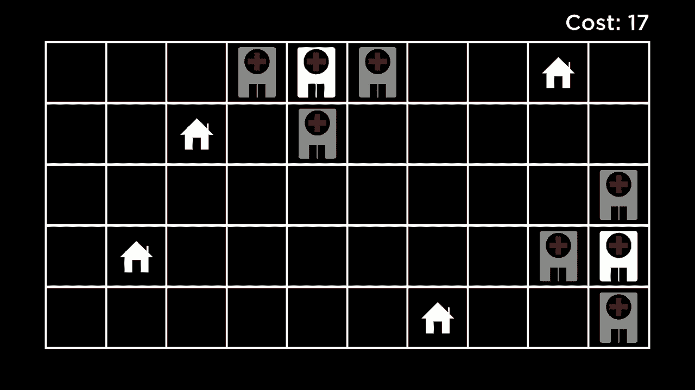
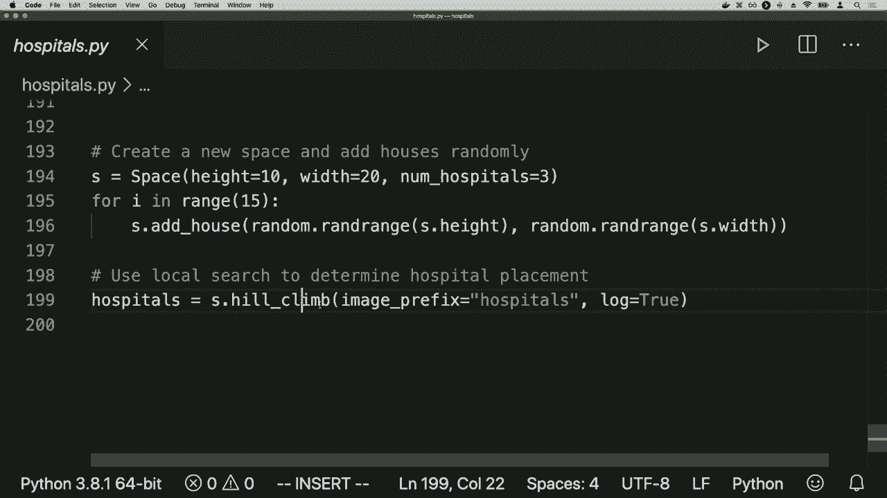
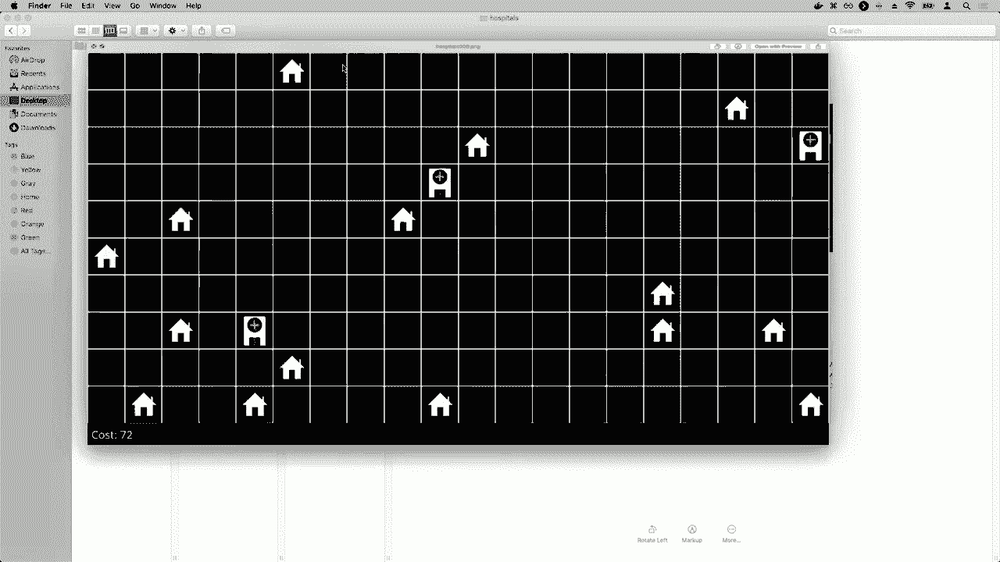
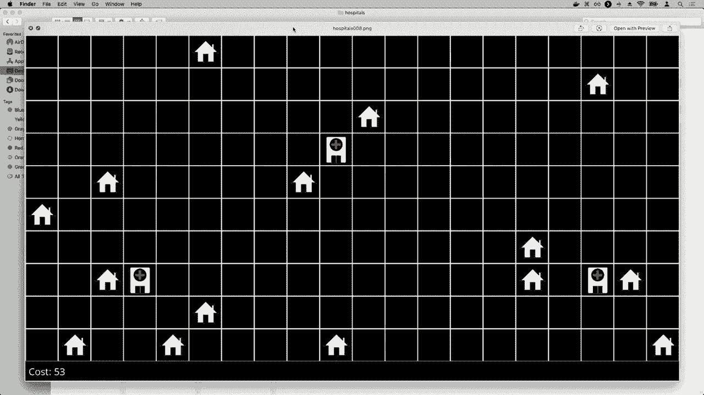
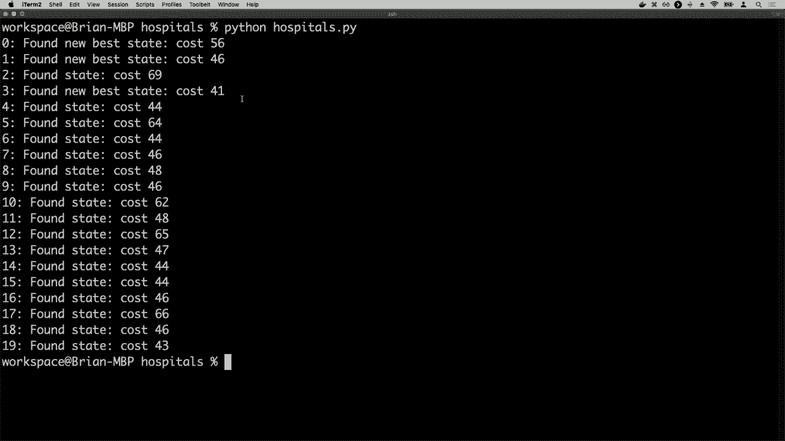

# 哈佛CS50-AI ｜ Python人工智能入门(2020·完整版) - P11：L3- 优化算法 1 (优化，局部搜索，爬山算法) - ShowMeAI - BV1AQ4y1y7wy

[音乐]，欢迎大家回到关于人工智能的介绍，使用Python。目前为止，我们已经看过几种不同类型的问题，我们看到经典的搜索问题，在这些问题中，我们试图从初始状态到达目标，通过找出一些最佳路径。

在对抗性搜索中，我们有一个游戏代理，它试图做出最佳移动。我们已经看到基于知识的问题，当我们试图使用逻辑和推理来弄清楚并得出一些额外结论时，我们也看过一些概率模型。

我们可能没有关于世界的某些信息，但我们希望利用我们拥有的概率知识来得出一些结论。今天我们将把注意力转向另一类问题，通常被称为优化问题，优化实际上是关于。

从一组可能的选项中选择最佳选项，我们已经在某些上下文中看到了一些优化，比如游戏玩法，我们试图创建一个选择最佳移动的人工智能，在一组可能的移动中。但今天我们要看的是一类问题和算法。

解决这些问题的算法可以用于处理更广泛的潜在优化问题，而我们将要看看的第一个算法是。

被称为局部搜索，局部搜索与我们之前看到的搜索算法不同，因为到目前为止，我们看到的搜索算法，比如广度优先搜索或A*搜索，通常会维持一大堆不同的路径，同时。

在探索时，我们同时查看一堆不同的路径，试图找到解决方案。另一方面，在局部搜索中，这将是一个搜索算法，实际上只会维持一个单一节点，查看一个单一状态，并通常通过运行此算法。

维持那个单一节点，然后在整个搜索过程中将自己移动到邻近的节点，这在上下文中通常是有用的，不像我们之前看到的那些问题，比如迷宫求解情况，我们试图从初始状态找到目标。

我们已经查看了通过某些路径来进行搜索，但局部搜索最适用于我们根本不在乎路径的情况，我们关心的只是解决方案。在解决迷宫的情况下，解决方案总是显而易见的，你可以指向解决方案，你确切知道目标是什么，真正的问题是。

到达那里需要什么路径？但是局部搜索在这种情况下会出现，其中准确找出解决方案的目标是什么正是挑战的核心。为了举一个这样的例子的例子，我们将考虑一个场景，其中有两种类型的建筑。

例如，我们有房屋和医院，我们的目标可能是在这样一个网格格式的世界中，其中有很多房屋，一个房屋在这里，一个房屋在这里，两个房屋在那边，可能我们想要找到一种方法在这张地图上放置两个医院。

现在的问题是我们想在地图上放置两个医院，但我们希望有某种目标，而我们在这种情况下的目标是尽量减少任何房屋到医院的距离。因此，你可能想知道，从每个房屋到最近医院的距离是多少。

在医院之间，我们可以有多种方式来计算距离，但一种方法是使用我们之前提到的启发式，即曼哈顿距离。这种方法是计算在这个网格布局中，你需要移动多少行和列才能到达医院，例如，如果。

你可以拿这四个房屋，看看它们离最近的医院有多近，你会得到这样的结果：这所房屋离医院三单位，这所房屋离医院六单位，而这两所房屋各离医院四单位。如果将这些数字加起来，你会得到一个总成本。

以17为例，所以在这个特定的医院配置中，一个医院在这里，另一个医院在那，这种状态我们可以说其成本为17。现在我们希望应用搜索算法来解决这个问题，找出如何最小化这个成本。

如果将所有房屋到最近医院的距离加起来，总体量如何最小化？如果我们稍微抽象化一下这个问题，从这个具体问题中抽离，考虑更普遍的类似问题。

通常通过将这些问题视为状态空间来构造这些问题。正如科林在这个状态空间景观的图示中所展示的那样，每个垂直条代表我们世界中可能的一个特定状态。

两个医院的配置，垂直条的高度通常表示那个状态的一些函数，某个值。因此，也许在这种情况下，垂直条的高度代表这个特定医院配置的成本。

从所有房屋到其最近医院的距离，通常而言，当我们有一个状态空间时，我们想做两件事情之一：我们可能试图最大化这个函数的值，试图找到一个全球最大值，可以说这个状态空间的单个。

状态的值高于我们可能选择的所有其他状态，通常在这种情况下，我们将称之为最大值，我们要优化的函数称为某个目标函数，这是一个衡量给定状态的好坏的函数，以便我们可以传递任何状态。

输入到目标函数中，并获得该状态的好坏值，最终我们的目标是找到这些状态中的一个，使其在该目标函数下具有最高的可能值。而等价但反向的问题是寻找全局最小值的问题，即找到某个状态，其具有。

在你将其传递到这个函数后，得到的值低于我们可能选择的所有其他值，一般而言，当我们试图寻找全局最小值时，我们称之为正在计算的函数为成本函数，通常每个状态都有某种成本，无论该成本是。

货币成本或时间成本，或者在我们刚才看的房屋和医院的情况下，是距离成本，衡量每个房屋距离医院的远近，我们要尽量减少成本，找到具有最低可能成本值的状态，这些是一般情况。

我们可能在状态空间中尝试的一些想法，试图找到全局最大值或全局最小值，我们到底是如何做到的，将会回忆起，在局部搜索中，我们通常通过维持一个单一状态来操作这个算法，也就是某个当前状态。

在某个节点内部表示的状态可能是在一个数据结构中，我们在其中跟踪当前的位置，最终我们要做的就是从该状态移动到它的一个邻居状态，在这种情况下，这个状态在一维空间中由紧邻的状态表示。

向左或向右移动，但对于任何不同的问题，你可能会定义某个状态的邻居的含义，例如在我们刚才查看的医院案例中，邻居可能是将一个医院移动一个空间到左边或右边，或者上下移动某个状态。

接近我们当前的状态，但略有不同，因此在其目标函数或成本函数上可能有略微不同的值，所以这将是我们在局部搜索中的一般策略，以便能够保持一个状态，维持某个当前节点并移动到我们。

在状态空间的景观中，试图找到一个全局最大值或全局最小值。也许我们可以用来实现这个局部搜索理念的最简单算法是一个称为爬山算法的算法，爬山算法的基本思路是，假设我在尝试。

最大化我的状态值，我试图弄清楚全局最大值在哪里。我将从某个状态开始，通常爬山算法将考虑那个状态的邻居，从这个状态出发，我知道我可以向左或向右走。

如果邻居的值较高而另一个邻居的值较低，在爬山算法中，如果我试图最大化值，我通常会选择我能找到的最高值，在我左边和右边的状态中，较高的状态是这个。所以我们会前进，考虑这个状态。

不断重复这个过程，查看我的所有邻居，选择邻居中值最高的，做同样的事情，查看我的邻居，选择邻居中值最高的，直到我达到像这里的某个点，在那里我考虑了我的两个邻居，而这两个邻居的值都低于我。

当前状态的值高于其任何邻居的值，且在此处！

此时算法终止，我可以说，好吧，我现在找到了这个解决方案，反过来同样的过程适用于寻找全局最小值，但算法的基本原理是相同的。如果我试图寻找全局最小值，假设我当前的状态从这里开始，我会。

不断查看我的邻居，选择我能找到的最低值。直到我最终希望找到全局最小值，这个点在我查看两个邻居时，它们的值都更高，而我试图最小化总分或成本或结果值。

计算某种成本函数，所以我们可以用伪代码将这个图形概念公式化，爬山算法的伪代码可能看起来像这样：我们定义一个名为hill climb的函数，它接受我们试图解决的问题作为输入，通常我们会从某个地方开始。

一种初始状态，所以我将从一个名为current的变量开始。这个变量用于跟踪我的初始状态，就像医院的初始配置一样。也许有些问题适合于某个初始状态，在那里你可以开始，而在其他情况下则不一定，在这种情况下，我们可能会随机生成。

一些初始状态，举例来说，可以随机选择两个地点，四个医院，然后从那里开始考虑如何改善，但我们要存储的初始状态将放在current里面。现在我们进入循环，这个重复的过程我们会不断进行，直到算法。

终止，我们要做的是，首先说，让我们弄清楚当前状态的所有邻居，从我的状态，所有的邻居状态是什么，基于某种定义的邻居的意思，我将选择所有邻居中价值最高的，并保存它。

在这个名为邻居的变量中，跟踪最高价值的邻居，这是我试图最大化价值的情况。在我试图最小化价值的情况下，你可以想象你会选择具有最低可能值的邻居，但这些想法在根本上。

这些是可以互换的，在某些情况下，可能有多个邻居具有同样高或同样低的值。在最小化的情况下，我们可以随机选择其中一个，选择其中一个并将其保存在这个变量邻居中。

那么要问的关键问题是，这个邻居是否比我当前的状态更好。如果我能找到的最佳邻居不比我当前的状态更好，那么算法就结束了，我将返回当前状态，如果没有一个邻居比我更好，我可能。

好吧，停留在我所在的位置是爬山算法的一般逻辑，但如果邻居更好，我就可以移动到那个邻居。你可以想象将当前状态设置为邻居，基本思路是，如果我处于一个当前状态，并且看到一个比我更好的邻居。

我将继续移动到那里，然后不断重复这个过程，移动到更好的邻居，直到我达到一个点，此时没有一个邻居比我更好，在那个点我们可以说算法就可以终止了。那么我们来看一个实际的例子。

这些房子和医院，所以我们现在已经看到，如果我们将医院放在这两个位置，总成本为17，现在我们需要定义，如果我们要实现这个爬山算法，这意味着要取这个特定配置的医院，这个特定状态并获得。

这个状态的一个邻居，邻居的简单定义可能是，选择一个医院，并将其移动一个方块，向左、向右、向上或向下，例如，这意味着我们从这个特定配置中有六个可能的邻居。

这个医院可以移动到这三个可能的方块中的任何一个，或者我们将这个医院移动到那些三个可能的方块，每一个都会生成一个邻居。我可能会说，好吧，这里是位置和每个房子到最近医院的距离。

让我考虑所有邻居，看看是否有任何一个能够使成本低于17。结果发现，有几种方式可以做到这一点，随机选择其中任何一种最佳方式都没关系，但其中一种可能的方法是看看这里的这家医院。

考虑到如果我们保持这家医院不变，它可能会朝哪个方向移动。如果我们将这家医院向上移动一个单位，例如，这实际上并没有帮助它更靠近上面的房子，但却离下面的房子更远，并且对整体并没有改变什么。

但是如果我们将右侧的这家医院向下移动一个单位，问题就正好相反，它会离上面的房子更远，但却更靠近下面的房子。因此，目标应该是能够将这家医院移动一个单位。

向左移动一个单位，我们使它更接近右侧的这两栋房子，而不改变左侧房子的情况。对他们而言，这家医院仍然是更近的一个，因此他们并没有受到影响，因此我们能够通过选择一个邻居来改善情况。

这将导致我们总成本的减少，因此我们可能会自己将状态从当前状态移动到一个邻居，只需将这家医院移动一下。在这一点上，这家医院实际上能做的事情并不多，但我们仍然可以进行其他优化，移动到其他邻居。

如果我们考虑这家医院，我们可能想象现在它的位置稍微高于这两栋房子，因此我们可能通过将这家医院向下移动一个单位来做得更好。

这样一来，成本从15降到了13，对于这种特定配置来说，我们甚至可以更好地将医院向左移动一个单位，这样成本从13降到了11，因为这栋房子离医院只有1个单位，这栋房子离4个单位，这栋房子离3个单位，而这栋房子也是离3个单位。

我们已经能够在使用初始配置的情况下，做到比最初的成本好得多，仅仅通过询问自己一个问题：通过做小的增量变化，移动到一个邻居，移动到另一个邻居，我们能否做得更好？现在在这个。

此时我们可以看到，算法可能会终止，因为实际上没有邻居可以移动到并改善情况，使我们的成本低于11。如果我们将这家医院向上或向右移动，那将使它距离左侧的两栋房子更远。

我们把它移动到下方，这并没有真正改变情况，它离这栋房子更远，但离那栋房子更近。同样，这个医院的情况也是如此，我们无论移动到上、左、下还是右的任何邻居，都会使其离房子更远，并增加。

成本上，或者它根本不会对成本产生任何影响。因此，我们现在可能会问，这是我们能做到的最好的吗？这是我们能够拥有的医院的最佳位置吗？结果答案是否定的，因为有更好的方法可以放置这些医院。

这里有许多方法可以做到这一点，但其中一种方法是把这个医院移动到这个方格，例如对角线移动一个方格，这并不是我们邻居定义的一部分，我们只能向左、右、上或下移动，但实际上这更好，它有一个。

总成本为九，它离这两栋房子都没有更近，因此，总成本较低，但我们无法找到它，因为要到达那里，我们必须经过一个状态，而那个状态实际上并不比我们之前所处的当前状态更好，因此这似乎是一个。

在尝试实施爬山算法时，可能会有一个限制或顾虑，即它可能并不总是给你最优解。如果我们试图最大化任何特定状态的值，试图找到全局最大值，可能会担心我们会卡在某个。

这里用蓝色突出显示的局部最大值，局部最大值是指任何状态，其值高于任何邻居。如果我们发现自己处于这两个状态中的任何一个，当我们试图最大化状态值时，我们不会做出任何改变，我们不会向左或。

我们不会在这里向左移动，因为那些状态更糟，但我们还没有找到全局最优解，我们没有做到最好。同样，在医院的案例中，我们最终想要做的是找到一个全局最小值，找到一个低于其他所有值的值，但我们。

可能会在局部最小值之一的状态中卡住，这些状态的值低于所有邻居，但仍然不如局部最小值低。因此，这里要记住的是，当我们运行这个简单的爬山算法时，并不总是能够找到最优解。

解决方案。如果我们从这里开始，尽可能地尝试最大化我们的价值，可能会出错，我们可能会移动到最高的邻居，移动到最高的邻居，再移动到最高的邻居，然后停下来，永远不会意识到实际上有一个更好的。

如果你查看这个状态空间景观，可能会想象到各种不同类型的**平坦区**，例如，这里的局部最大值，其中六个状态的值完全相同。

在之前展示的算法中，没有任何邻居更好，所以我们可能会卡在这个平坦的局部最大值，甚至如果允许自己移动到一个邻居，也不清楚最终会移动到哪个邻居，可能会在这里卡住。

这里有一个变体称为**随机爬山**，另一个则称为**肩部**，这并不是真正的局部最大值，因为我们仍然可以走向更高的地方，也不是局部最小值，因为我们可以下降，因此仍然可以取得进展，但这仍然是一个平坦区域。

在这里迷失，无法向上或向下取得进展，具体取决于我们是在最大化还是最小化，因此我们可能无法找到实际上不是最佳解的解决方案。

攀登并不总是能为我们找到**最佳结果**，实际上有许多不同的种类和变体的爬山算法，可以帮助根据上下文和特定问题类型更好地解决问题。

迄今为止我们所考虑的更适用的是一种通常称为**最陡上升爬山**的版本，最陡上升爬山的想法是我们将选择在试图最大化时值最高的邻居，或者在试图最小化时值最低的邻居。

通常来说，如果我有五个邻居，而他们都比我当前的状态好，我会选择这五个邻居中最好的一个。有时这可能效果很好，这是一种贪婪的方法，试图在任何特定时间步骤中采取最佳操作，但也可能不行。

这些变体并不总是有效，可能会出现我想选择一个稍微好一点的选项，而不一定是最好的选项，因为这可能会导致最终更好的结果。

因此，选择所有更高值邻居中的一个是另一种可能性，所以如果我在当前状态，并且有五个邻居都比我好，那么与选择最佳的最陡上升相比，随机选择将从其中一个中随机选择。

认为如果它更好，那就更好，并且或许有可能向前推进，即使它不是我可能选择的局部最佳选项。首选爬山最终只是选择第一个最高价值的邻居，类似于这种想法，而不是考虑。

一旦我们找到一个比当前状态更好的邻居，我们就会去那里，也许能在这里提高一些效率，或许能找到其他策略无法找到的解决方案，尽管所有这些变体我们仍然。

面临着相同的潜在风险，即我们可能会陷入局部最小值或局部最大值，我们可以通过多次重复该过程来降低这种风险。因此，爬山的一种变体是随机重启爬山，其中一般思路是如果。

应用其最陡上升爬山，例如将从某个随机状态开始，尝试找出如何解决问题，并确定我们到达的局部最大值或局部最小值，然后我们将随机重启并重试，选择新的起始配置并尝试找出。

找出局部最大值或最小值，并进行一定次数的重复，然后在我们查看过的所有选项中选择最佳的一个，所以我们还有另一个选择可以访问。虽然我提到一般的局部搜索通常只会保持。

追踪一个单一节点，然后移动到其邻居之一。存在一种称为局部束搜索的爬山变体，其中我们不仅跟踪一个当前最佳状态，而是跟踪 K 个最高价值的邻居，因此我们不会仅从一个随机初始配置开始。

我可能从三个、四个或五个随机生成所有邻居，然后选择我找到的所有邻居中最好的三、四或五个，并不断重复这个过程，想法是我现在考虑了更多选项，有更多的方式我可以潜在地导航。

最终找到某个特定问题的最优解，所以现在让我们看看一些可以实现这些想法的实际代码，比如最陡上升爬山，以解决这个医院问题，因此我将。

继续进入我医院的目录，在这里我实际上建立了一个解决这类问题的基本框架。接下来，我将进入医院的 PI，我们来看看我们在这里创建的代码。我定义了一个类，用于表示状态空间，因此该空间具有高度。

这里是一个宽度，还有一些医院数量，所以你可以配置你的地图有多大，应该有多少医院。这里我们有一个添加新医院到状态空间的函数，然后一些函数将为我获取所有可用的空间，如果我想随机放置医院的话。

这里是爬山算法。那么我们在爬山算法中要做什么呢？我们将开始随机初始化医院的位置，我们不知道医院实际应该在哪里，所以我们就随机放置它们。

对于我没有的每个医院运行循环，我会随机在某个位置添加一所新医院，所以我基本上获得所有可用空间，并随机选择其中一个作为我希望添加这所特定医院的位置。我有一些日志输出和生成。

图片，我们稍后会看一下，但这里是关键想法，我会一直重复这个算法。我可以指定一个最大运行次数，或者我可以一直运行直到达到局部最大值或局部最小值，现在我们基本上会考虑所有当前的情况。

考虑这两所医院以及更多医院（如果有的话），并考虑该医院可以移动到的一些地方，即该医院的邻居，我们可以将邻居移动到的地方，然后看看这是否会比特定位置更好。

如果这会更好，那么我们就更新最佳邻居，跟踪我们找到的新最佳邻居，然后之后我们可以问自己，如果最佳邻居的成本大于或等于当前医院集合的成本。

这意味着如果我们最佳邻居的成本大于当前成本，意味着我们最佳邻居比当前状态更差，那么我们就不应该做任何更改，我们应该直接返回当前的医院集合。否则，如果我们可以更新医院以改变。

将它们连接到最佳邻居之一，如果有多个都是等效的，我这里使用随机选择，如果他们随机选择一个。那么这实际上只是一个Python实现，我们刚才讨论的这个想法，采用当前状态的一些当前医院集合。

生成所有邻居，查看我们可以将一所医院向左、向右、向上或向下移动一个单位的所有方式，然后根据所有这些信息找出哪个是最佳邻居，或者所有最佳邻居的集合，并从中选择一个。

每次我们生成一个图像以实现这一点。因此，现在如果我们看看底部，我将随机生成一个高度为10、宽度为20的空间，并说去随机放置三个医院在这个空间中，我将随机生成15栋房子。

我将随机位置添加进去，现在我要运行这个程序。

使用爬山算法来尝试确定我们应该将医院放置在哪里，因此我们将运行这个程序，通过运行Python来处理医院。我们看到初始状态的成本为72，但我们能够不断找到能够降低成本的邻居。

距离降到了69、66、63，依此类推，最终降到53，成为最佳方案。

邻居，最终我们能够找到的，我们可以看看那个。

通过打开这些文件可以看到，例如，最初的配置是我们随机选择了这15栋不同房子的一个位置，然后随机选择了一个、两个、三个医院的位置，这些医院就位于这个状态空间的某个地方。如果将所有的距离加起来...

从每栋房子到最近医院的距离总共约为72，现在的问题是我们能移动到哪些邻居来改善情况，算法首先找到的一个邻居是将那栋位于右侧的房子向左移动。

这可能是有道理的，因为如果你看看那个地区的房子，这五栋房子看起来相对密集，它们可能是离这家医院最近的，向左移动会减少大部分房子的总距离，尽管这会增加...

其中一个的距离，因此我们能够对情况进行这些改进，但不断寻找能够移动医院的方法，直到我们最终在这个特定状态上稳定下来，其成本为53，或者我们找到了每个医院的位置，而现在没有...

我们可以移动到的邻居是。

实际上要改善这种情况，我们可以拿这家医院和另一家医院进行比较，看看每个邻居，结果没有任何一个邻居比这个特定的配置更好。再说一次，这并不是说这是最佳方案，我们可能还有其他选择。

医院的配置是一个全局最小值，而这可能只是一个局部最小值，是所有邻居中最好的，但在整个可能的状态空间中可能不是最佳的。你可以通过考虑所有可能的医院配置来搜索整个状态空间。

但从根本上来说，这将非常耗时，尤其是当我们的状态空间变得更大时，可能会有越来越多的可能状态，查看所有状态将需要相当长的时间，因此能够使用这些局部搜索算法通常是非常有效的。

尝试找到我们能做到的最佳解决方案，尤其是如果我们不在乎做到最好，而只关心找到一个不错的医院布局，那么这些方法可能特别强大，但当然我们可以尝试通过使用其他方法来缓解一些担忧。

而不是使用爬山算法，而是随机重启这个想法，意思是我们可以进行多次爬山，而不是仅仅一次，在完全相同的地图上尝试爬山，找出我们能找到的最佳结果，因此我在这里实现了一个随机重启的函数。

随机重启一些最大次数，我们将重复这个过程，我刚刚运行爬山算法，计算从所有房屋到医院的费用，然后确定这是否比我们迄今为止的结果更好。

因此，我可以尝试这个相同的想法，而不是运行爬山算法，我将运行随机重启，并且！

我将随机重启大约20次，例如，现在我将移除所有图像，然后重新运行程序，最初运行爬山时我们找到的最佳成本是56。每次迭代都是爬山算法的不同迭代。

我们并不是运行爬山算法一次，而是在这里进行20次，每次都寻找局部最小值，看看每次是否比我们迄今为止的最佳时间更好，从56到46，这一次更高，所以我们忽略了，而41更低，所以我们继续保持。

我们尝试实施爬山算法的16次中，最后一次却没有做到比41更好，或许有更好的方法我们没有找到，但看来这条路最终成为了一个相当不错的解决方案。

问题是这是尝试的第三次，从零开始计数，我们可以看看打开第三次，这就是发生的状态。！

经过对一些特定随机初始医院配置运行爬山算法后，费用为41，这就是我们找到的局部最小值，试图最小化成本，看起来我们做得相当不错，这家医院距离这个区域很近。

离这些房子相当近的这家医院，看起来是我们能做的，尽量捕捉到那边的房子，所以这类算法对于解决这些问题相当有用，但是许多不同类型的爬山算法的真正问题在于。

陡峭上升、随机选择等算法，从不做出会让我们情况更糟的移动，对吧？它们总是会查看当前状态的邻居，考虑我们是否能比当前状态做得更好，并移动到那些邻居中的一个。

我们选择的邻居可能会因这些不同类型的算法而有所不同，但我们从不会从当前位置移动到一个比当前更糟的位置，最终，如果我们想找到一个全局最大值或全局最小值，这正是我们需要做到的。

因为有时候如果我们遇到瓶颈，我们想找到一些方法来摆脱我们在局部最大值或局部最小值的困境，以便找到。
