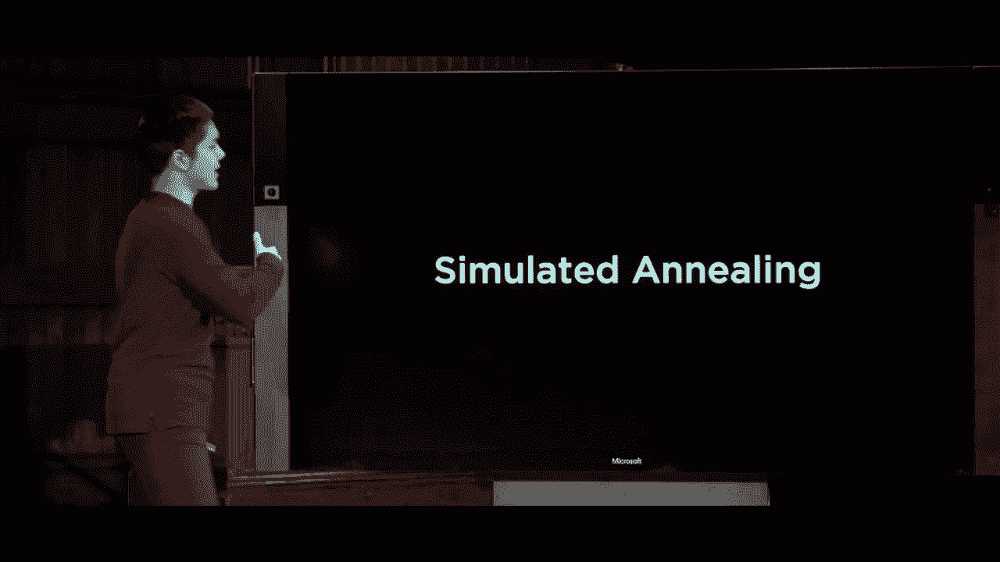
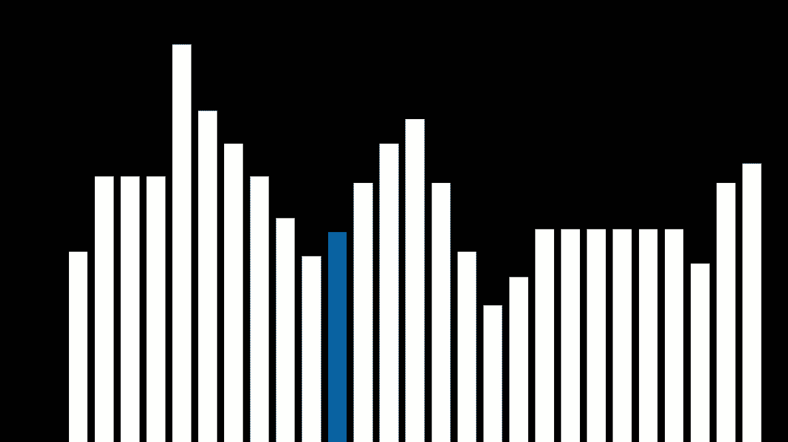
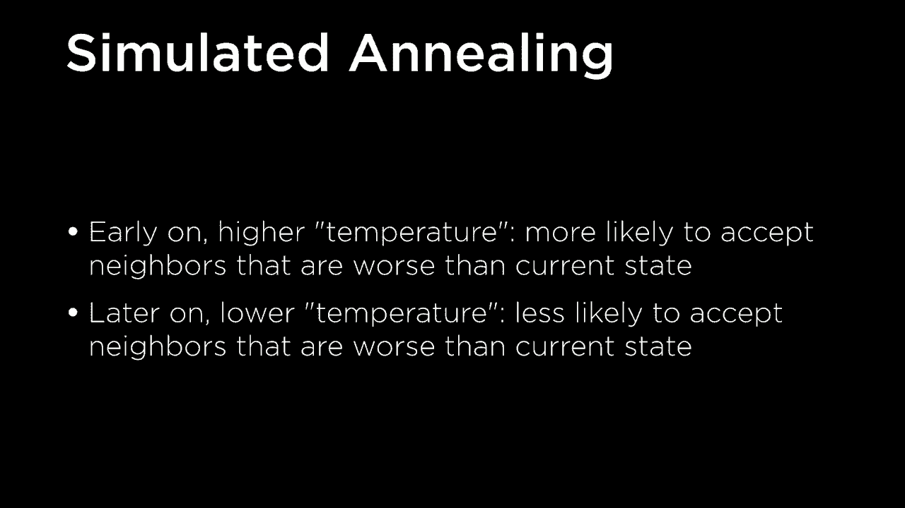
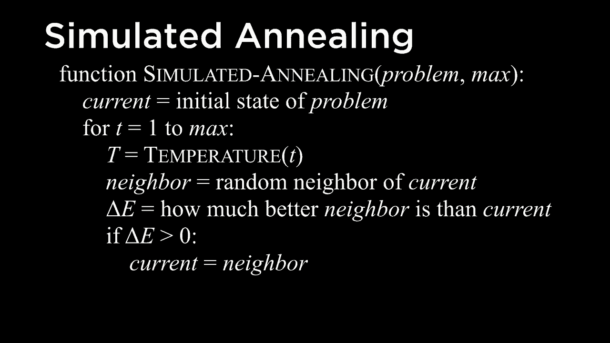
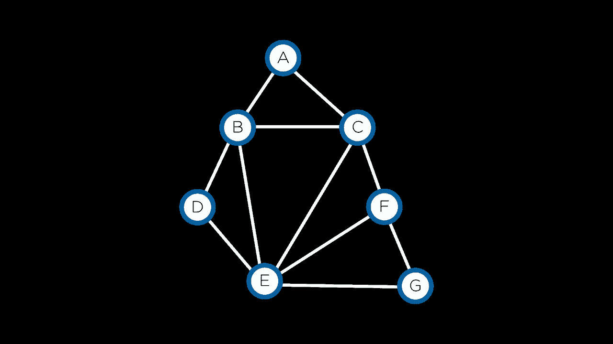
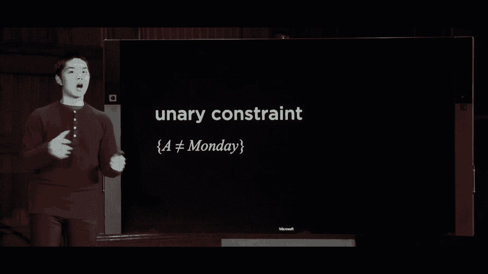
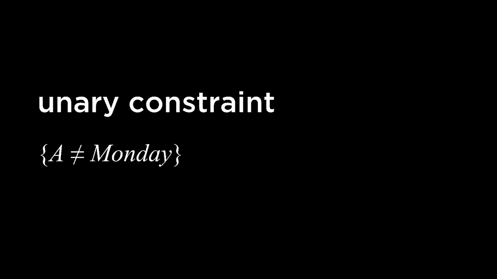
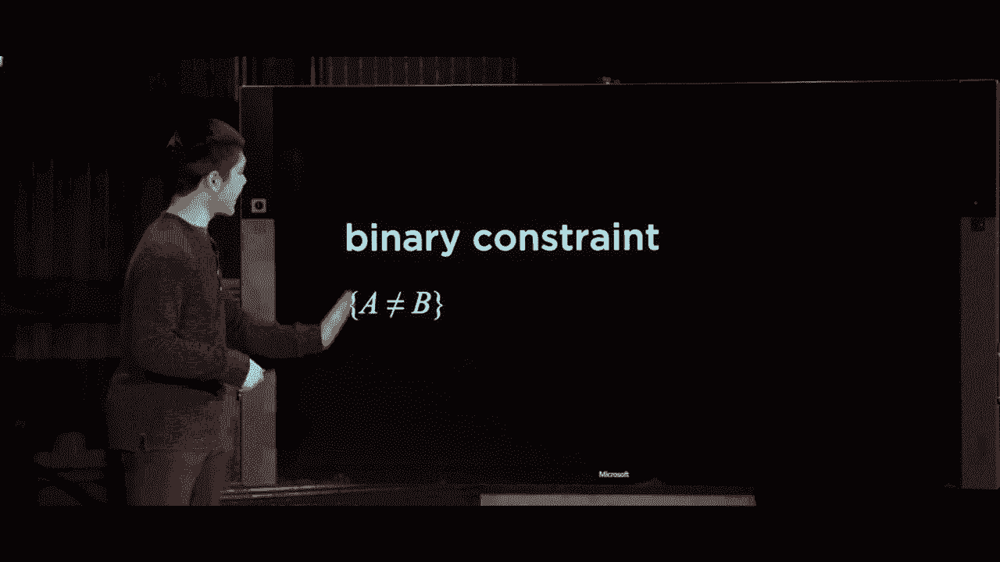
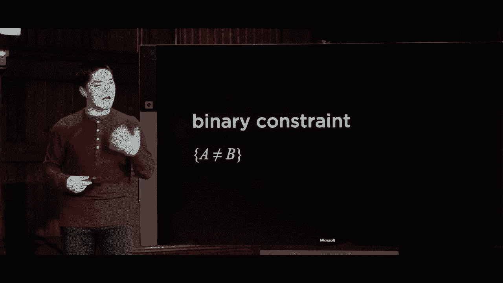

# 哈佛CS50-AI ｜ Python人工智能入门（2020·完整版）- P12：L3- 优化算法 2（线性搜索，节点一致性）- ShowMeAI - BV1AQ4y1y7wy

增加我们找到它的概率，因此最流行的技术是从这个问题入手。

角度是一种称为模拟退火的技术，之所以称为模拟是因为它模拟了一个真实的物理过程，即退火过程，你可以将其视为物理中的一种情况，涉及一些粒子系统，并且你可能会想象，当你加热某个特定的物理。

系统中有很多能量，事物随机移动得相当频繁，但随着时间的推移，随着系统降温，它最终稳定在某个最终位置，这就是模拟退火的一般思路。我们将模拟某个高温系统的过程，其中。

事物会随机移动得相当频繁，但随着时间的推移，降低这个温度。

直到我们最终稳定在我们的最终解决方案，想法是如果我们有一些状态空间，景观看起来像这样，我们从初始状态开始，如果我们在寻找全局最大值并且我们。想要最大化状态的值，我们的传统爬山。

算法只会获取这个状态，并查看两个相邻的状态和。

总是选择一个能够增加状态值的，但如果我们想有机会找到全局最大值，我们不能总是做出好的移动，有时我们必须做出糟糕的移动，允许自己朝着一个方向移动，这在目前看来似乎会让我们的情况。

更糟，这样之后我们可以找到通往全局最大值的路径，以解决该问题。当然，一旦我们达到这个全局最大值，经过大量搜索后，我们可能不想移动到比当前状态更糟的状态，因此。

这就是退火隐喻开始发挥作用的地方，我们想开始进行更多随机的移动，并随着时间的推移，基于特定的温度计划，逐渐减少这些随机移动，因此基本轮廓看起来像这样：在模拟退火的早期，我们有一个较高的温度。

状态，以及我们所指的较高温度状态是，我们更可能接受比当前状态更糟的邻居，但我们可能会查看我们的邻居，如果其中一个邻居比当前状态更糟，尤其是如果它并没有太糟，只是稍微糟一点。

那么我们可能更愿意接受，并继续移动到那个邻居那里，但随着我们运行模拟退火，稍后我们将降低温度，而在较低的温度下，我们将不太可能接受邻居。

那些比我们当前状态更差的状态，现在为了使这个更正式，下面是一些伪代码！

这个算法可能看起来像我们有一个叫做模拟退火的函数，它以我们试图解决的问题为输入，并可能还包括我们希望运行模拟退火过程的最大次数，以及我们将尝试查找多少个不同的邻居。

将根据你要解决的问题而变化，再次从某个当前状态开始，这将等于问题的初始状态，但现在我们需要重复这个过程多次，最多重复某个过程的次数。

计算一个温度，这个温度函数接受当前时间T，从1开始，一直到最大值，然后给我们一个可以在计算中使用的温度，其想法是这个温度在早期会较高，而后来会较低。

因此，这个温度函数可以有多种工作方式。最简单的方法之一就是它像剩余时间的比例，从最大时间单位中我们还剩多少时间，你一开始剩下很多时间，随着时间的推移。

温度将会下降，因为你剩下的时间越来越少。因此，我们计算当前时间的温度，然后随机选择一个当前状态的邻居，而不再选择我们可能能选择的最佳邻居。

我们能选择的较好的邻居之一，我们会随机选择一个邻居，它可能更好也可能更差，但我们会计算，计算能量的Δe，这只是邻居比当前状态好多少，因此如果Δe为正，这意味着状态。

如果Δe为负，这意味着邻居比我们当前状态更差，因此我们可以有一个条件，像这样，如果Δe大于0，这意味着邻居状态比我们当前状态更好，如果这种情况出现，我们将更新当前状态。

邻居和之前一样，移动到我们当前的邻居，因为这个邻居比我们当前状态更好，我们将接受这个选择。但现在的不同之处在于，以前我们绝对不想采取使情况变糟的移动，而现在我们有时想要采取这种“奇迹”般的移动。

移动实际上会使我们的情况变得更糟，因为有时我们需要摆脱局部最小值或局部最大值，以提高找到全局最小值或全局最大值的概率。那么我们该如何做到呢？我们如何决定有时。

接受一些实际上可能更糟的状态。我们将以某种概率接受一个更糟的状态，而这个概率需要基于几个因素，部分基于温度，如果温度更高，我们更有可能移动到更糟的邻居。

温度降低时，我们不太可能移动到更差的邻居，但也应该在某种程度上基于Delta e。如果邻居比当前状态差得多，我们可能会更不愿意选择这个邻居，而不是当邻居仅比当前状态稍差时。所以再次说，这里有一个。

有几种方法可以计算这个，但事实证明最流行的方法之一是计算e的幂，Delta e除以T，其中e只是一个常数。Delta e除以T是基于Delta e和T，在这里我们计算这个值，这个值将在0到1之间，这是概率。

我们应该说，好吧，继续移动到那个邻居。事实证明，当Delta e的值使得邻居与当前状态没有那么差时，我们更可能继续移动到那个状态，同样当。

当温度降低时，我们也不太可能移动到那个邻居状态。所以现在这是模拟退火的全局视角。这个过程涉及将问题进行处理，并生成随机邻居，如果邻居比当前状态更好，我们将始终移动到邻居。

但即使邻居比我们当前的状态更糟，有时我们仍会移动到那里，这取决于有多糟，也取决于温度。因此，这整个过程的希望和目标是，当我们开始寻找局部或全局最大值或全局最小值时，我们可以。

如果我们在局部最大值或局部最小值卡住了，我们需要摆脱这种情况，以最终探索状态空间中最佳的部分。随着温度的降低，我们最终会在我们发现的状态附近稳定下来，而不会移动太多。

到目前为止，我们可以做的最好事情。因此，在最后我们只需返回当前状态，这就是这个算法的结论，我们已经能够找出解决方案。这些类型的算法有很多不同的应用场景。

我们可以将一个问题表述为某种形式，探索一个特定的配置，然后问，是否有任何邻居比当前配置更好，并且有某种测量方法，那么对于这些爬山算法、模拟退火类型的算法就有适用的案例。

有时候这可以用于设施选址问题，比如在规划一个城市时，确定医院应该在哪里，但也确实有其他应用，计算机科学中最著名的问题之一就是旅行商问题。

销售员问题通常被表述为，我这里有一大堆城市，用这些点表示，而我想做的是找到一条经过所有城市并最终返回起点的路线。也就是说，一条从这里出发，经过所有这些城市，最后回到起点的路线。

回到我最初开始的地方，我可能想做的是最小化我必须旅行的总距离，或者说是整个路径的总成本。你可以想象这是一个在交付公司试图将物品送到许多不同房屋时非常适用的问题。

一堆不同的房子，他们想知道如何从仓库到达这些不同的房子，并且再返回，所有这些都尽可能使用最少的时间、距离和能量，所以你可能想尝试解决这些类型的问题，但事实证明，解决这个特定的销售员问题通常是这样的。

这种问题在计算上非常困难，解决它是一个非常消耗计算资源的任务，这属于被称为 NP 完全问题的类别，这些问题没有已知的高效解决方法。因此，我们...

我最终必须做的是提出某种近似方法，尝试找到一个好的解决方案，即使我们不能找到可能的全局最佳解决方案，至少在可行或可处理的时间内不能找到。因此，我们可以拿旅行商问题来尝试解决。

使用局部搜索来进行表述，问一个问题，比如，我可以选择某个状态、某个配置或节点之间的某条路线，并且我可以测量这个状态的成本，算出距离，然后我可能想尽可能地最小化这个成本。

现在的问题是，拥有这个状态的邻居意味着什么？走这条特定路线意味着什么？以及是否存在一条与之接近但略有不同的邻近路线，这可能会导致总距离的不同，而对于这类问题有许多不同的定义。

旅行推销员的邻居，配置可能看起来像，但只是一个。方法是邻居就是我们，如果选择这两个边。之间的节点并切换它们，实际上例如我可能选择。这两个边，这两个恰好交叉，这个节点就到这里。

节点到那里并切换它们，这个过程通常会看起来像是从图中移除这两个边，将这个节点连接到它原本没有连接的节点，所以在这里连接起来。我们需要将这些原本朝这个方向的箭头。

反向移动它们，朝另一个方向移动，然后填补最后一个剩余的空白，添加一个朝那个方向的箭头。因此通过取两个边并切换它们，我能够考虑这个特定配置的一个可能邻居，它看起来像这样。

邻居实际上更好，看起来像这条路线可能走更短的距离，以便经过所有城市，而不是当前状态，因此你可以想象在一个爬山或模拟退火算法中实现这个想法，在这里我们重复这个过程。

尝试取一个旅行推销员问题的状态，查看所有邻居，然后移动到邻居，如果它们更好，或者甚至移动到邻居，如果它们更糟，直到我们最终确定一些我们能够找到的最佳解决方案，结果发现这些。

即使这些近似算法并不总是找到最佳解决方案，通常也能很好地找到一些有用的解决方案。所以这是对局部搜索的一个了解，特定类别的算法可以用来解决特定类型的问题，我们并不真的。

我关心的是解决方案的路径，我并不在乎我采取了哪些步骤来决定医院应该去哪里，我只关心解决方案本身。我只关心医院应该在哪里，或者旅行推销员之旅的路线到底应该是什么，另一种类型的算法。

可能出现的被称为这些，线性规划类型的问题的类别，线性规划经常出现在我们试图优化某个数学函数的上下文中，但很多时候线性规划会出现当我们可能有实际的实数值时。

不仅仅是我们可能拥有的离散固定值，而是我们可能想要的任何小数值。！

进行计算，因此线性规划是一类问题类型，在这种情况下，线性规划的目标是最小化一个成本函数，你可以反转数字，尝试最大化它，但我们通常会将其框架为尝试最小化一个。

成本函数有一些变量X1、X2、X3，一直到Xn，只是一些涉及的变量，我想知道这些变量的值，而这个成本函数可能在这些变量前面有系数，这就是我们所称的线性方程。

我们只是有所有这些变量，可能会被一个系数相乘，然后相加，我们不会对任何东西进行平方或立方，因为那会给我们不同类型的方程式，在线性规划中我们只是处理线性方程，加上线性约束。

约束条件看起来可能是这样的，如果我们将这个特定的方程式相加，这只是所有这些变量的某种线性组合，并且小于或等于某个界限B，可能会有许多不同的约束条件，我们可能会施加在我们的线性模型上。

编程练习，同样地，我们可以有约束，表示这个线性方程小于或等于某个界限B，它也可能等于某个值，但如果你想要某个变量组合的和等于某个值，你可以指定这一点。

指定每个变量具有下限和上限，例如，它需要是一个正数，或者它需要是小于2的数字，还有其他一些选择，我们可以在这里进行，以定义变量的平衡，但事实证明，如果你能。

我们也可以将一个问题用这些术语进行公式化，公式化这个问题为你的目标是最小化一个成本函数，并且你在特定约束下最小化该成本函数，约束的方程形式像这样，一些变量的序列小于某个界限或等于某个值。

我们想要做的就是这样，但我们需要做到这一点，以等于某个特定值，然后已经存在一些算法来解决这些类型的问题，所以让我们来看一个例子，这里是一个可能在线性规划领域出现的问题的例子，通常在我们试图解决时会出现。

优化某个东西，我们想能够进行一些计算，并且我们对我们正在尝试的内容有约束！

优化它们，所以在工厂的背景下，它可能像这样，我们有两台机器x1和x2，x1的运行成本为每小时50美元，x2的运行成本为每小时80美元，我们的目标是最小化总成本。

受某些约束的影响，可能会有一个劳动约束，x1每小时需要5单位的劳动，x2每小时需要2单位的劳动，而我们总共有20单位的劳动可以使用，所以这是一个约束，我们最多只能花费20单位的劳动。

在x1和x2之间进行分配，每个都需要不同数量的劳动，并且我们可能还有一个约束条件，告诉我们x1每小时产生10单位的产出，x2每小时产生12单位的产出，而公司需要90单位的产出，因此我们有一些目标。

我们需要实现90单位的产出，但有一些限制，x1每小时只能产生10单位的产出，x2每小时产生12单位的产出，这类问题相当常见，您会开始注意到这些类型问题中的模式。

我正在尝试优化的问题，目标是最小化成本或最大化输出、利润等，并且有一些限制条件。现在我们需要将这个问题表述为，涉及这两台机器x1和x2，x1每小时成本50美元，x2每小时成本80美元。

我们可以提出一个目标函数，可能看起来像这样：这是我们的成本函数，实际上是50乘以x1加上80乘以x2，其中x1是一个变量，表示我们运行机器x1的小时数，x2是一个变量，表示我们运行机器x2的小时数。

我们要最小化的就是这个成本函数，即每小时运行这些机器的成本总和，这是一个线性方程，仅仅是这些变量加上前面的系数的某种组合，我希望最小化这个总值，但我需要。

在这些约束条件下，x1每小时需要50单位的劳动，而我们总共有20单位的劳动可以使用，这样就给了我们一个这样的约束：5乘以x1加上2乘以x2小于或等于20，20是我们可以使用的劳动总量。

这个总量分配在x1和x2之间，每个每小时需要不同数量的劳动单位，最后我们还有这个约束，x1每小时产生10单位的产出，x2产生12单位，而我们需要90单位的产出，因此这可能看起来像这样：10乘以x1加上12乘以x2——这就是。

每小时的产出数量需要至少为90，如果我们能做得更好，那很好，但至少需要达到90。如果您还记得我之前的表述，我说在一般的线性规划中，我们处理的是等式约束或小于等于约束，所以我们有一个大于或等于的约束。

这里的等于号并不是问题，当我们有一个大于或等于的符号时，我们可以将方程乘以-1，这样就会翻转成小于或等于，比如说小于或等于-90，而不是大于或等于90，这将是一个等效的表达式。

我们可以用来表示这个问题，现在我们有这个成本函数和这些约束条件，它们受到一些限制，结果是有多个算法可以用来解决这些类型的问题。

所以我们可以举个例子来看看！我们将深入探讨，但这些类型算法中最受欢迎的是单纯形法，它是最早被发现用来尝试解决线性规划的算法之一，后来还有一类内点算法也可以用来解决这种类型的问题，关键并不是理解。

这些问题涉及的几何和线性代数的内容可能会多一点，而不是确切了解这些算法是如何工作的，但要意识到这些算法存在是为了高效地找到解决方案，每当我们遇到这种特定形式的问题时。

这里的生产目录，我有一个名为 production PI 的文件，在这里我使用 scifi，这是 Python 中许多与科学相关的函数库，我可以继续运行这个优化函数来运行一个线性程序，dot Lin prog 在这里将会。

尝试为我解决这个线性程序，我提供给这个表达式给这个函数调用所有有关我的线性程序的数据，所以它需要以特定格式提供，最初可能有点困惑，但这个 scifi 优化线性编程的第一个参数是成本函数。

在这种情况下，它只是一个数组或列表，包含 50 和 80，因为我的原始成本函数是 50 乘以 X1 加 80 乘以 X2，所以我告诉 Python 50 和 80，这些是我现在试图优化的系数，然后我提供所有的约束条件，约束条件我在上面写了。

并且约束条件一是 5X1 加 2X2 小于或等于 20，约束条件二是负 10X1 加负 12X2 小于或等于负 90，所以 Syfy 期望这些约束以特定格式提供，它首先期望我提供所有的上界系数。

界限方程 ub 只是 4 4 上界，其中第一方程的系数是 5 和 2，因为我们有 5X1 + 2X2，而第二方程的系数是负 10 和负 12，因为我有负 10X1 加负 12X2，然后这里我们将其作为一个单独的。

参数仅仅是为了保持事物的分隔，实际的界限是什么，每个约束的上界是什么，第一个约束是数字一，然后对于约束！。

第二个，上界是一个 ID，所以有点神秘的表示方式，并不像简单地写下数学方程那么简单，真正期望的是所有的系数和这些方程中所有的数字，首先提供成本。

函数提供所有不等式约束的系数，然后提供所有这些不等式约束的上界。一旦所有这些信息都在，我们就可以运行任何这些内部点算法或单纯形算法，即使你不。

了解它的工作原理，你可以直接运行该函数，找出结果应该是什么。我说如果成功的结果是我们能够解决这个问题，继续打印出x1和x2的值，否则打印出没有解决方案，因此如果我运行这个。

通过运行Python程序来进行计算，计算需要一秒钟，但随后我们看到这是最佳解决方案。

x1应该运行1.5小时，x2应该运行6.25小时，我们。

我们能够通过将问题表述为线性方程来实现这一点，我们试图优化一些成本，我们想要最小化的，然后是施加在这些问题上的一些约束，许多问题都属于这种你可以解决的类别，只要你能找出如何。

使用方程和这些约束来表达那个总体想法，因此。雅典娜今天会出现几次，我们希望能够。将某个问题简化为我们知道如何解决的某个问题。以便开始寻找解决方案，并利用我们可以使用的现有方法。

为了更有效或更高效地找到解决方案，事实证明，这些类型的问题，带有约束的出现还有其他方式，并且有一整类问题更普遍地被称为约束满足问题，现在我们将进行一个。

看看你可能如何制定一个约束满足问题，以及你可能如何解决一个约束满足问题，但基本思路是。

约束满足问题的关键在于我们有一些变量需要取某些值，我们需要确定每个变量的值受特定约束的限制，这些约束会限制变量实际上可以取的值，因此，让我们看看一个现实世界的例子。

例如，让我们看看我为学生安排的考试安排。

学生1、2、3每个人都在修一些不同的课程。这里的课程将用字母ISM表示，因此学生1注册了课程a、b和c，学生2注册了课程b、d和e，以此类推，现在假设某大学正在尝试为。

所有这些课程中，周一、周二和周三只有三个考试时段，我们必须为每一门课程安排一次考试，但我们面临的约束是希望任何人都不要在同一天参加两场考试。

我们尽量最小化或消除它，如果可能的话。那么我们如何开始表示这个概念？我们如何将其结构化，以便计算机与AI算法能够开始解决这个问题呢？让我们特别关注我们可能会选修的课程，并将每门课程表示为变量。

在图中某个节点内部，如果这两个节点之间存在约束，我们将创建一条边。因此，这意味着我们可以从选修课程A、B和C的学生1开始，这意味着A和B不能同时考试。

C不能与A同时考试，B和C也不能同时考试，我可以通过在图中画边来表示这一点。A和B之间一条边，B和C之间一条边，再加上一条连接C的边。这现在编码了在这些节点之间存在约束的概念。

具体来说，约束可能是其他类型的，尽管根据你试图解决的问题类型，可能还有其他约束。我们可以对其他学生做同样的事情，对于选修课程B、D和E的学生2，这意味着B、D和E之间都需要有连接边。

学生3选修课程C、E和F，我们将继续连接C、E和F，并在它们之间画边。最后，学生4选修课程E、F和G，我们可以通过在它们之间画边来表示这一点。

尽管E和F之间已经有一条边，但我们不需要再画一条，因为这个约束只是编码了课程I和课程F不能在同一天考试的概念。所以，这就是我们可能称之为的约束图，是对我所有课程的某种图形表示。

在这种情况下，每个约束代表一个不等式约束，而B和D之间的边意味着变量B所取的任何值不能与变量D所取的值相同。

那么，什么是约束满足问题呢？约束满足问题就是一组变量x1到xn，每个变量都有一组领域。每个变量需要取某些值，也许每个变量有相同的领域，但也可能每个变量都有不同的领域。

变量有略微不同的范围，然后有一组约束，我们将称之为C，即施加在这些变量上的一些约束，例如X1不等于X2，或者X1等于X2加1，如果这些变量在它们的范围内取数值的话。

约束将根据问题的类型变化，约束满足在任何我们有特定约束的变量的情况下都随处可见，一个流行的游戏是数独，例如这个9x9的网格，你需要在其中填入数字。

每个单元格的类型，但你不想确保在任何行、任何列或3x3的单元格网格中有重复的数字，例如，这个约束满足问题可能是什么样子呢？我的变量是所有的空方格。

这里表示的谜题就像是X，Y坐标，例如所有我需要填入值的方格，而我不知道该填什么值，范围只是从1到9的所有数字，任何我可以填入这些单元格的值。

每个变量的范围，然后约束将是这样的形式：不能等于这个单元格，不能等于那个单元格，所有这些需要是不同的，例如对于所有的行和列，以及3x3的方格也是如此，因此这些约束将强制执行什么。

值实际上是允许的，我们可以在这个考试安排问题中制定相同的想法，其中我们拥有的变量是不同的课程，G的范围对于这些变量的每一个都将是周一、周二和周三，这些是每个变量的可能值。

变量可以在这个案例中取值，代表的是该课程的考试时间，然后约束的形式是A不等于B，A不等于C，这意味着A和B不能在同一天考试，A和C不能在同一天考试，或者更正式地说，这两个变量不能取相同的值。

同一值在它们的范围内，所以这就是我们可以开始使用的约束满足问题的一个公式化，约束可以以多种不同形式出现，有硬约束，必须为正确解决方案满足的约束。

在数独谜题中，像这样的情况是，你不能让同一行中的这个单元格和那个单元格取相同的值，这是一个硬约束，但问题也可以有软约束，这些约束表达某种偏好，例如A和B不能在同一天考试。

但也许有人希望 A 的考试比 B 的考试更早，这并不一定是事实，但有一些表达式表明某个解决方案优于另一个解决方案。在这种情况下，你可能会将问题表述为试图优化以最大化人们的偏好，你希望满足人们的。

尽可能满足偏好，但在这种情况下，我们将主要处理硬约束，必须满足的约束，以便问题有一个正确的解决方案，因此我们希望找出这些变量到其特定值的某种分配，这最终会给。

为我们提供解决问题的方案，通过允许我们为每门课程分配某一天，以确保我们没有任何。

类之间的冲突，因此我们可以将约束满足问题中的约束分类为多个不同的类别。其中第一个类别，也许是最简单的类型，被称为单元约束，单元约束是。

仅涉及单一变量的约束，例如单元约束可能是像 a 不等于星期一，这意味着课程 a。

如果由于某种原因课程的讲师在星期一不可用，则该课程不能在星期一进行考试。你可能在你的问题中有一个看起来像这样的约束，它只涉及一个单一变量 a，并且可能说 a 不等于星期一，或者 a 等于某个值，或者在这种情况下。

大于或小于的数字。

约束中只有一个变量的情况，我们认为这是一个单元约束，这与涉及两个变量的二元约束形成对比。例如，这将是我们所研究的那种约束。

在类似于 a 不等于 B 的情况下，这是一个二元约束，因为这是一个涉及两个变量 A 和 B 的约束，我们用一些弧或边表示这一点，K'NEX 变量 a，两个变量 B，并利用这一知识，好的，单元约束是什么。

什么是二元约束？我们可以对特定约束说出不同类型的事情。

满意度问题，我们可以说的是，我们可以尝试使问题节点一致。那么什么是“一致性”呢？节点一致性意味着变量域中的所有值都满足该变量的单元约束，因此对于我们所有变量中的每一个。

在约束满足问题中，如果所有值都满足该特定变量的一元约束，我们可以说整个问题是节点一致的，或者我们甚至可以说特定变量是节点一致的，如果我们只想让一个节点在其自身内部保持一致。

现在让我们来看一个简化的例子，而不是拥有一大堆不同的类，我们只有两个类 a 和 B，每个类在星期一、星期二或星期三都有考试。所以这是变量 a 的域，这是变量 B 的域。

现在让我们想象一下，我们有这些约束：a 不等于星期一，B 不等于星期二，B 不等于星期一，a 不等于 B。所以这些是我们在这个特定问题上的约束。现在我们可以尝试做的是强制节点一致性。节点一致性意味着我们确保所有节点都一致。

任何变量的域的值是否满足其一元约束？我们可以从尝试让节点 a 节点一致开始，检查它是否一致，a 的域内的每个值是否满足其一元约束。最初，我们会发现星期一并不满足 a 的一元约束，因为有一个约束 a 不等于星期一，但星期一仍然在 a 的域中，因此这不是节点一致的。

因为我们在域中有星期一，但这个值对于这个特定节点来说并不有效。那么我们如何让这个节点一致呢？为了使其与 B 不等于星期二的一元约束一致，我们将去掉 B 域中的星期二，现在 B 的域只包含星期一和星期三。

对于每一个值，a 可以在星期二和星期三之间取值，这样我们就会确保 a 是节点一致的。

没有任何与这一想法相冲突的一元约束。没有约束说 a 不能在星期二，没有一元约束说 a 不能在星期三。因此，现在我们可以把注意力转向 B。B 的域也有星期一、星期二和星期三。

我们开始看看这些变量是否也满足一元约束。这里有一个一元约束，B 不等于星期二，而这个约束在这个包含星期一、星期二和星期三的域中似乎并不满足。因为星期二是变量 B 可能取的值之一。

但事实证明，针对变量 B 我们还施加了另一个一元约束，即 B。

不等于星期一，这意味着B的领域中这个值星期一与B的一元约束不一致，因为我们有一个约束表示B不能是星期一，因此我们可以将星期一从B的领域中移除，现在我们已经通过了所有的一元约束，但还没有。

考虑了这个约束，它是一个二元约束，但我们已考虑了所有的一元约束，所有仅涉及单个变量的约束，我们确保每个节点都与这些一元约束一致，因此我们可以说现在我们已强制执行节点一致性，对于这些每个节点。

我们可以选择这些可能的节点，领域中的值不会。因为作为结果的一个一元约束并未被违反，所以节点一致性相对容易强制执行，我们只需考虑每一个。
