# 哈佛CS50-AI ｜ Python人工智能入门(2020·完整版) - P13：L3- 优化算法 3 (回溯搜索等) - ShowMeAI - BV1AQ4y1y7wy

域满足一元约束，当我们考虑不同类型的一致性时，事情变得有趣，比如弧一致性。弧一致性指的是当变量域中的所有值满足变量的二元约束时。

我们正在努力使一个一致性，我们不再只是考虑涉及 a 的一元约束，而是尝试考虑所有涉及 a 的二元约束。因此，任何连接 a 与约束图中另一个变量的边。

更正式地说，弧一致性其实是连接约束图中两个节点的边。我们可以更准确地定义我们的一致性，以便使某个变量 X 与其他变量一致。

关于某个其他变量 Y，我们需要从 X 的域中移除任何元素，以确保 X 的每一个选择，在 X 的域中都有一个可能的 Y 的选择。换句话说，如果我有一个变量 X，想让 X 和 Y 一致，那么我要查看所有可能的值。

X 可以接受所有可能的值，并确保对于 Y 仍然存在一些选择，如果 x 和 y 之间存在某个弧，以确保 Y 也有我可以选择的可能选项，所以让我们看一个例子，回到我们强制节点的这个例子。

一致性已经通过说 A 只能是星期二或星期三来确定，因为我们知道 A 不能是星期一，而且我们也说 B 的域只包含星期三，因为我们知道 B 不等于星期二，且 B 也不等于星期一。那么现在让我们开始考虑我们的相容性。

使 A 对 B 一致，这意味着对于 A 的域中的任何选择，B 的域中都有某个选择可以保持一致。我们可以选择星期二作为 A 的一个可能值。

如果 A 选择星期二，那么是否存在满足二元约束的 B 的值？是的，B 为星期三可以满足 A 不等于 B 的约束，因为星期二不等于星期三。然而，如果我们选择星期三作为 A 的值，那么在 B 的域中没有满足此二元约束的选择。

如果我无法为 B 选择一个满足 a 不等于 B 的选项，因为我知道 B 必须是星期三，因此如果我遇到这样的情况，看到 a 有一个可能的值，而 B 的值没有满足二元约束的选择，那么这就不是一致性。

为了使其一致，并使其保持一致，我需要将星期三移出A的领域，因为星期三对A来说不是一个可能的选择，因为它与这个二元约束不一致，我无法选择星期三作为A的选择。

仍然可以通过为B选择某种东西来找到可用的解决方案，所以在这里。我已经能够执行弧一致性，通过这样做，我实际上解决了整个问题，考虑到这些约束，A和B可以在星期一、星期二或星期三考试，唯一的解决方案。

看起来A的考试必须在星期二，B的考试必须在星期三，这是唯一的选择。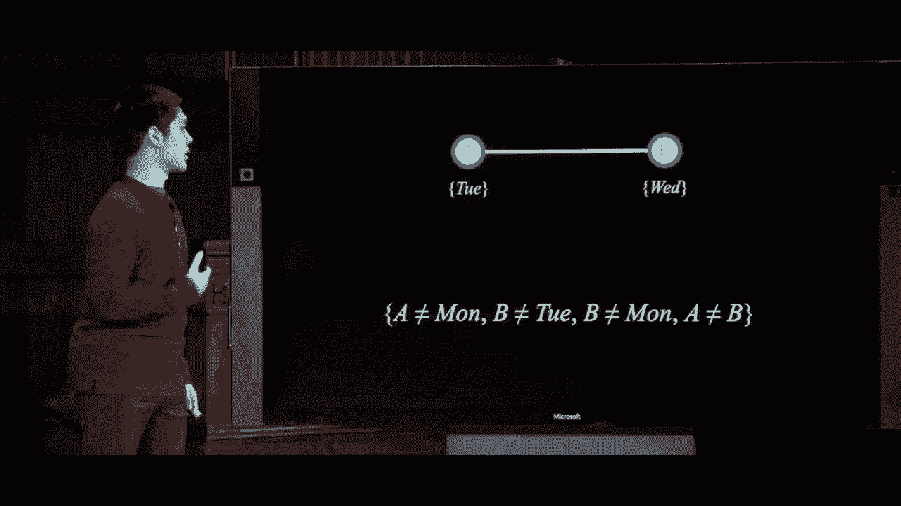

如果我们想将一致性应用于一个更大的图，不仅仅关注一对变量，也有其他方法可以实现这一点，我们可以开始正式化伪代码，以尝试编写一个强制我们一致性的算法。

通过定义一个名为revise的函数。

revise函数将作为输入一个CSP（约束满足问题）以及两个变量x和y，revise的作用是使X对Y的弧一致，意味着从X的领域中移除不允许Y的可能选项的任何东西。

这是否有效，我们会首先跟踪是否进行了修订，revise最终将返回true或false。如果我们对X的领域进行了修订，它将返回true，如果没有对X的领域进行任何更改，它将返回false，我们将在一个。

此时我们开始了解这将如何有帮助，但我们先说revise等于。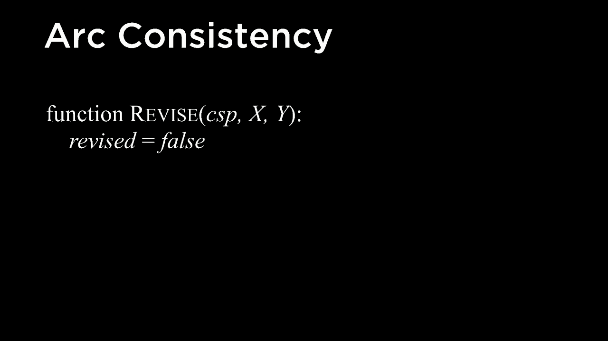

如果我们没有进行任何更改，那么我们会说好的，继续。

并循环遍历X的领域中的所有可能值，因此遍历X的领域。对于X领域中的每个小X，我想确保对于每个选择，我在Y中有一些可用的选择，满足定义在我的CSP中的二元约束。

如果在Y的领域中没有值满足X和Y的约束，那就意味着这个值X不应该在X的领域中，我们将会去。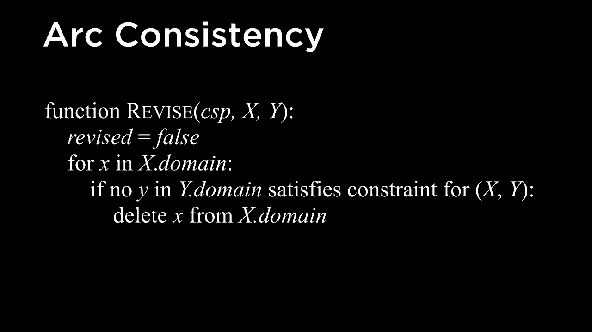

接着从X的领域中删除X，并将revise设为true，因为我确实更改了X的领域，移除了小X，因为它不一致，无法为Y选择一个满足XY约束的值，所以在这种情况下我们将。

接下来，我们将修订设置为真，我们将对X的领域中的每个值反复执行这个过程，有时这可能是可以的，但在其他情况下，它可能不允许Y的可能选择，在这种情况下，我们需要从X的领域中移除这个值，最后我们只需返回修订以指示是否。

实际上，我们进行了更改，所以这个函数，修订函数，实际上是你刚才看到的图形实现，它使得一个变量X与另一个变量Y保持一致，但一般来说，当我们希望强制一致性时。

我们通常想要强制一致性，不仅仅是为了一个单一的弧，而是为了整个约束满足问题，事实证明，还有一个算法可以做到这一点，这个算法被称为ac3，ac3处理一个约束满足问题，并在整个问题上强制弧的一致性。

它是如何做到这一点的呢？它基本上会维护一个队列，或者说是一条需要保持一致的所有弧的线，随着时间推移，我们可能会从那个队列中移除一些东西，因为我们开始处理弧的一致性，也可能需要向那个队列中添加一些东西，如果有更多的东西。

我们需要让它们保持一致，所以我们将开始一个包含约束满足问题中所有弧的队列，所有连接到具有某种二元约束的节点的边。

只要队列不为空，就还有工作要做。队列中的所有内容都是我们需要保持一致的东西，所以只要队列不为空，我们还有事情要做。我们需要做什么呢？我们将首先从队列中去掉一个元素，移除队列中的某个东西。

队列，严格来说，它不需要是一个队列，但队列是一个传统的做法，好的，从队列中去掉（DQ），这将给我们一个弧x和y，这两个变量我希望让X与Y保持一致。那么我们如何让X与Y保持一致呢？我们可以继续使用刚才提到的修订函数。

我们称之为修订函数，输入是约束满足问题，以及这些变量x和y。因为我希望让X与Y保持一致，换句话说，去掉X的领域中不留下Y可用选项的值，回想一下。

修订返回什么呢？如果我们实际上进行了更改，它返回真，如果我们从X的领域中移除了一些东西，因为没有Y的可用选项，例如，它返回假，如果我们没有对X的领域进行任何更改，结果是如果修订返回假，我们就没有进行任何。

变化不大，那么这里不需要做太多的工作，我们可以直接进入队列中的下一个弧线，但如果我们确实做了变化，减少了X的域，移除了X域中的值，那么我们可能意识到这会造成潜在的问题。

后来这可能意味着某个与X的节点一致的弧线可能不再与X一致，因为我们曾经有一个选项可以选择X，现在可能没有，因为我们可能移除了X的一些内容，这对某些其他弧线的艺术保持是必要的。

所以如果我们确实修订了X的域，我们需要向队列中添加一些额外的内容，首先我们想检查的是确保X的域不为0，如果X的域为0，意味着X没有可用的选项，这意味着无法解决。

如果我们从X的域中移除了所有元素，我们将返回false，表示没有办法解决问题，因为X的域中没有剩余的内容，但如果X的域中还有东西，但比之前少，那么我们将。

我们要做的是遍历每个变量Z，这些变量在所有X及其邻居中，除了我们已经处理过的y，我们将把X视为其他邻居，并问自己，"好吧，从这些Z到X的弧线可能不再是**一致的**，因为对于每个Z"。

可能有一个选项，我们可以选择让X对应于每个可能的值，但现在可能没有，因为我们从X的域中移除了某些元素，因此我们在这里要做的是继续向Q添加一些内容，这条弧Z到X，对于所有这些邻居Z。

为了将一些弧线添加回Q，以继续保持一致性，最后如果我们顺利完成了这个过程，我们就可以返回true。但这现在是一个c3算法，用于在约束满足问题上强制执行弧线一致性，主要思想就是**跟踪**一致性。

我们骑士可能需要使所有的弧线保持一致，以便将其称为艺术，通过调用修订功能，如果我们进行了修订，那么可能有一些新的弧线需要添加到队列中，以确保即使在删除了一些之后，一切仍然是**一致的**。

从某个特定变量的域中的元素，如果我们尝试在这样的图上强制执行弧线一致性，即每个变量的域是星期一、星期二和星期三，结果发现，通过在这个图上强制执行弧线一致性。

解决某些类型的问题这里实际上没有任何变化，对于任何特定的约束，只要考虑两个变量，我总有一种方法可以为我做出的选择之一做出另一种选择，因为有三种选择，我只需要确保两个是不同的。

彼此之间实际上很容易只需取一个弧并声明它不一致，因为如果我选择星期一作为D，然后为B选择一个不是星期一的东西，在弧一致性中我们只考虑两个节点之间的二元约束的一致性。

我们实际上还没有考虑所有其他节点，所以仅使用C3约束的一致性执行有时会产生缩小域的效果，从而使得找到解决方案更容易，但并不总能解决问题，我们可能仍然需要以某种方式搜索以尝试满足条件。

你会记得，搜索问题通常由这些部分组成：一些初始状态，一些行动，一个过渡模型将我从一个状态转移到另一个状态，一个目标测试来告诉我是否满足我的要求。

目标正确，然后某些路径、成本函数因为在这种情况下。像迷宫求解，我试图尽快到达我的目标，所以你可以将一个约束满足问题（CSP）或约束满足问题表述为这些搜索问题之一，初始状态将只是一个空的赋值。

赋值只是我将任何特定变量分配给任何特定值的一种方式，因此如果一个空的赋值没有变量被分配给任何值，那么我可以采取的行动是向该赋值中添加一些新的变量等于值的对，表示对于这个赋值，让我添加一个新值。

对于这个变量，过渡模型只是定义了当你采取该行动时会发生什么，你会得到一个新的赋值，该赋值中包含该变量等于那个值，目标测试只是检查确保所有变量都已被赋值，并确保所有约束已被满足。

路径成本函数我有点无关紧要，我并不在意路径的具体形式，我只关心找到一个实际上满足所有约束的赋值，因此实际上所有路径的成本都是相同的，我并不关心。

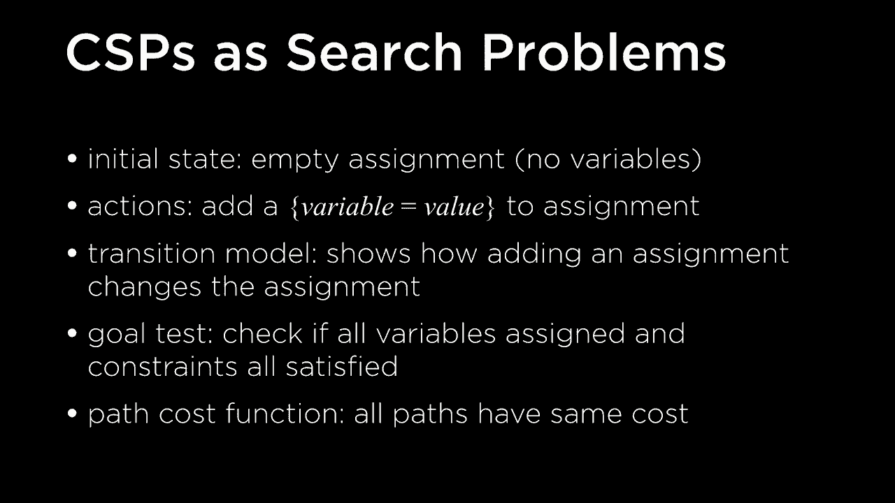

我只关心到达目标的路径，实际上我们之前谈过的问题是，如果我们仅仅通过实现简单的搜索算法，如广度优先搜索或深度优先搜索来实现，这将是非常非常低效的，还有其他方法我们可以找到解决方案，并可以使用经典的传统搜索算法来尝试实现。

利用约束满足问题本身结构中的效率，而一个关键理念是我们真的可以对这些变量进行排序，且赋值的顺序并不重要。赋值a等于2，然后B等于8与B的赋值是相同的。

等式为8，然后a等于2的切换，顺序并不会改变任何东西。关于这一基本性质，赋值存在一些方式。我们可以尝试修订这个想法，运用搜索算法来专门应用于像约束满足问题这样的一个问题。

事实证明，谈到约束满足问题时，搜索算法通常会使用称为回溯搜索的东西。回溯搜索的核心理念是，我们将继续对变量与其值进行赋值，如果我们遇到阻碍，就会到达一个地方。

在我们无法取得任何进展的情况下，同时仍然保持需要强制执行的约束，我们将继续回溯并尝试。

另一种东西，因此回溯搜索的基本草图是这样的，类似于一个叫回溯的函数，接受赋值和约束满足问题作为输入。因此最初我们没有任何分配的变量，某人将开始进行回溯搜索，这个赋值是。

将会是空的赋值，里面没有变量，但我们稍后会看到这是一个递归函数，因此回溯函数的输入是赋值和问题。如果赋值已完成，意味着所有变量都已被分配，我们只需返回该赋值。

起初这并不成立，因为我们以空的赋值开始，但随着时间的推移，我们可能会向该赋值中添加内容。因此，如果赋值实际上已完成，那么我们就完成了，接下来只需返回该赋值；否则，还有一些工作要做，我说我们需要。

要做的是选择一个未分配的变量，针对这个特定问题。需要查看已经被分配的变量，并选择一个尚未被分配的变量，然后我会继续使用该变量，接下来我需要考虑该变量的所有值。

变量的领域，因此我们将继续调用这个领域值函数，稍后我们会详细讨论，它接受一个变量并返回其领域中所有值的有序列表。所以我选择了一个随机的未选择变量，将循环遍历所有可能的值。

这个想法是让我尝试所有这些值作为变量的可能值，因此如果该值与到目前为止的赋值一致，不违反任何约束，那么我们就继续将变量等于值添加到赋值中，因为到目前为止是一致的，现在让我们递归进行。

回调回溯以尝试使其余的分配也保持一致。所以我们将继续对我添加的新分配调用回溯，这个新变量等于值2，现在我递归地调用回溯，看看结果是什么，如果结果不是失败，那么让我返回。

那个结果，否则还有什么可能发生呢？如果结果是失败，那就意味着这个值可能是这个特定变量的一个糟糕选择，因为当我将这个变量等于那个值时，最终我遇到了一个情况。

违反约束条件，它没有什么更多的意义，只是注定失败。因此，现在我将从分配中移除变量等于值，有效地进行回溯，说明，好的，这个值不行，让我们尝试另一个值，然后在最后，如果我们从未能够返回完整的分配，我们就继续。

返回失败，因为这意味着没有任何值适用于这个特定变量，这是回溯搜索的理念，尝试每个变量的值并递归地尝试回溯搜索，看看我们能否取得进展，如果我们遇到死胡同。

最终，我们遇到了一个情况，即没有可能的值可以选择，满足约束条件，我们返回失败，并且这个失败向上传播，最终我们通过回退尝试其他选择。因此，让我们将这个算法付诸实践，实际上就是尝试使用回溯。

现在，我需要解决这个问题，我需要弄清楚如何将这些课程分配到周一、周二或周三的考试时段，以满足这些约束条件，这些边意味着这两门课程不能在同一天考试，所以我可以开始。

就像从某个节点开始并不重要我选择哪个，但在这种情况下，我们将从A开始，并且我会问一个问题，比如，好吧，让我循环遍历域中的值，也许在这种情况下，我将从周一开始，并说，好的，让我们将A分配给周一。

现在，按照顺序考虑节点B，所以我已经对A进行了分配，我递归调用回溯并查看这个新的分配部分，现在我希望选择另一个未分配的变量，比如B，我会说，好吧，也许我从周一开始。

这是B的域中的第一个值，我问，好吧，周一是否违反任何约束条件，结果是，是的，它确实违反了这个约束，因为A和B现在都在周一，这不行，因为B不能和A在同一天。

我们可能尝试周二，尝试B的下一个值，这与目前的赋值一致吗？嗯，是的，周二与周一一致，因为它们不在同一天，这很好。现在我们可以递归调用回溯，再次尝试，选择另一个未分配的变量。

类似于D，我说好的，让我们看看它的可能值，周一与这个赋值一致吗？嗯，是的，B和D在不同的日子，周一对比周二，A和B也在不同的日子，周一对比周二，所以这也很好。接下来我们可以再试一下，也许我们会去。

这个变量e说，我们能使其一致吗？让我们看看可能的值，我们已经递归调用了回溯，我们可以从周一开始，好的，这不一致，因为D和E现在在同一天有考试，所以我们可能尝试周二，继续下一个，问这是否。

一致性，不，这不是，因为B和E在同一天有考试。所以我们尝试，好的，周三一致吗？结果显示，好的，是的，周三一致，因为D和E现在在不同的日子，B和E现在在不同的日子，一切似乎都很好。

到目前为止，我递归调用回溯，选择另一个未分配的变量，我们可以尝试si可能取的值，从周一开始，结果显示这不一致，因为现在A和C都有考试在同一天，所以我尝试了z'，说这也不一致，因为B和C现在在同一天有考试。

同一天，然后我说好的，继续尝试周三，但这也不一致，因为C和eee也在同一天有考试。所以现在我们已经遍历了C的所有可能值，周一、周二和周三，但没有一个一致，我们无法有一个。

一致性赋值回溯在这种情况下，我们将返回失败，因此我们会说，好的，我们必须在这里回溯。现在对于e，我们已经尝试过周一、周二和周三，但没有一个有效，因为周三看似有效，结果却是失败，这意味着没有。

是我们可以给e赋值的可能方式，这也是一个失败，我们必须回到D，这意味着对D的周一赋值一定是错误的，我们必须尝试别的东西。那么我们可以尝试，假设D是2，如果我们尝试下一个值周二，结果显示这也不一致，因为B和D现在有。

同一天的考试，但结果周三有效，现在我们可以开始进行前向推进。我们回到E，说好的，哪一个值有效，周一结果有效，没有违反任何约束。然后我们回到C，周一不行，因为它违反了约束，实际上违反了两个。

星期二也不行，违反了约束，但星期三可行。那么我们可以查看下一个变量F，问星期一是否可行。我们会知道哪个违反了约束，但星期二是可行的，然后最终我们可以查看最后一个变量G，再次递归调用回溯。

时间星期一是不一致的，这违反了约束条件；星期二也违反了一个约束，但星期三则没有违反约束，因此现在我们可以说。在这一点上，我们递归调用，最后一次回溯，我们现在有了一个令人满意的所有变量的分配。

我们现在完成了，我们已经能够成功为每个变量分配一个值，以一种不违反任何约束的方式，我们将继续进行类A和E的考试在星期一，类B和F可以在星期二考试，类C和D则是。

哇，学生们可以在星期三进行考试，没有违反的约束可能会出现，因此这是一个图形化的方式来看这可能如何运作。现在让我们看一些可以实际用来解决这个问题的代码，所以我会继续。

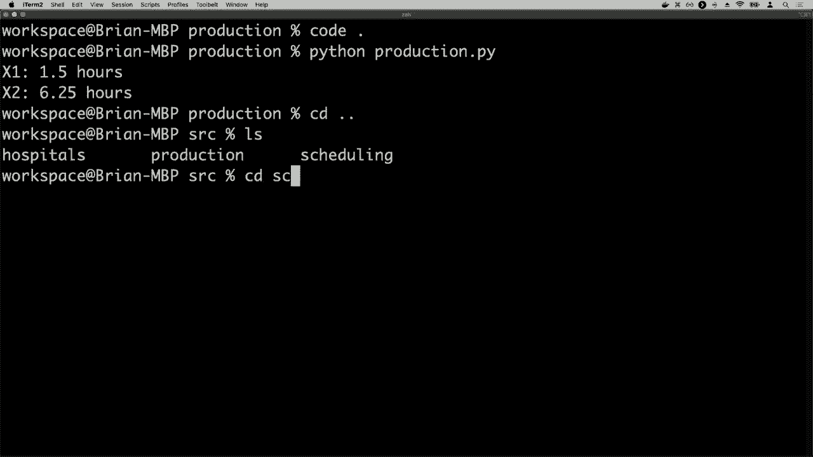

进入调度目录，我们现在在这里，我们将开始查看schedule 0 PI。我定义了一组变量，A、B、C、D、E、F、G，这些是所有不同的班级。然后在下面，我定义了我的约束列表，比如约束A和B，因为它们不能在同一天，类似地A和C，B和C等等，强制执行这些相同的约束。

这里是回溯函数的样子，首先如果分配已完成，如果我已将每个变量分配给一个值，就继续返回该分配，然后选择一个未分配的变量。

从那个分配开始，对于星期一、星期二、星期三领域中的每一个可能值，让我们创建一个新的分配，将变量分配给该值。我会称之为一致性函数，稍后我会向你展示，这个函数只会检查这个新的分配是否一致。

但如果它是一致的，我们将继续调用回溯，继续尝试运行回溯搜索，只要结果不是None，意味着不是失败，我们就可以返回该结果。但如果我们遍历了所有值，没有任何效果，那就是失败。

没有解决方案，我们继续返回None。这些函数做什么？选择未分配的变量，它只是选择一个尚未分配的变量，所以它会遍历所有变量，如果它尚未分配，我们将返回该变量。

一致性函数运行良好，一致性函数会遍历所有约束，如果我们在分配了这两个变量的值但它们相同的情况下，那么这就是对约束的违反，在这种情况下我们将返回 false，但如果没有。

一致的情况下，该分配是一致的，我们将返回 true，然后程序所做的就是调用一个空字典，该字典没有变量被赋值。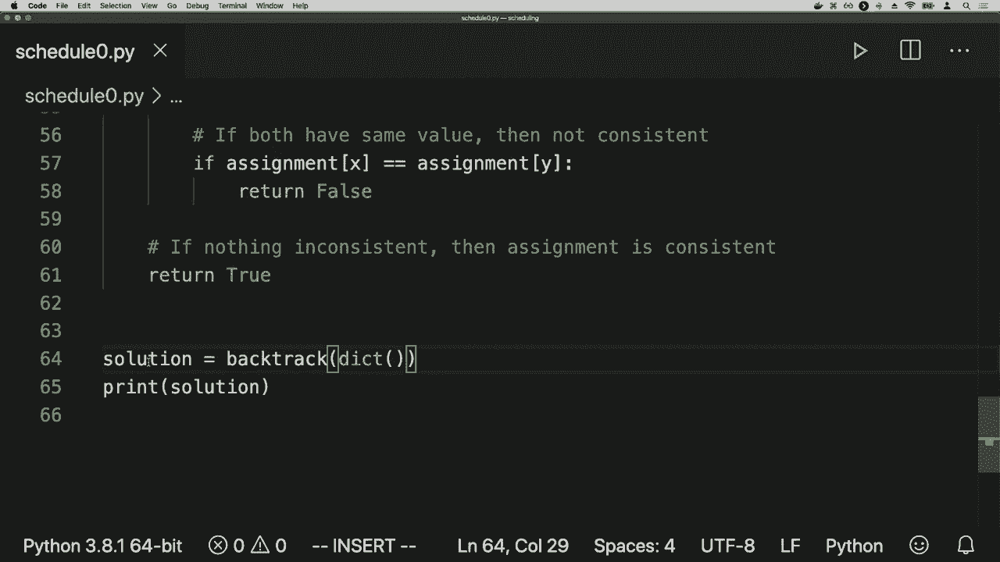

目前还没有值，将其保存在解决方案中，然后打印出 dot 解决方案。因此通过现在运行这个，我可以运行 Python，调度 0 PI，而我得到的结果是所有这些变量到值的分配，结果我们分配给星期一的是我们预期的星期二，C 分配给星期三，正好。

我们之前讨论过的相同类型的东西，每个这些变量到值的赋值都不会。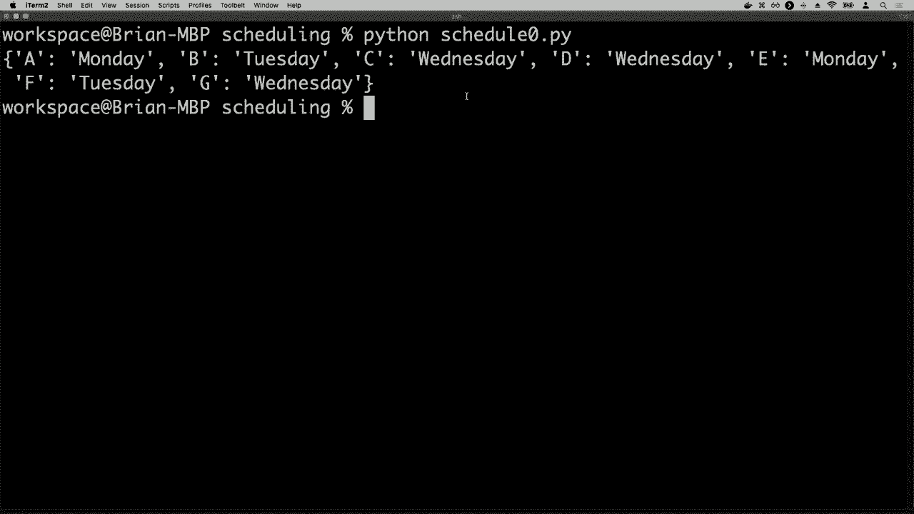

违反任何约束，我必须做相当多的工作来实现这个想法，我必须编写 BACtrack 函数，它会递归地进行回溯搜索，但事实证明，约束满足问题是如此。

这种想法非常流行，已经存在许多库实现了这种类型的想法。同样，像之前一样，特定的库并不重要，重要的是库确实存在，这只是一个 Python 约束库的例子，现在不必从头开始完成所有工作。

1 dot pi 我只是利用一个已经实现了很多这些想法的库，因此我在这里创建了一个新问题，并添加了特定领域的变量，我添加了一整堆这些单独的约束，我称之为添加约束，并传入描述约束的函数。

约束基本上是说，这个函数接受两个变量 x 和 y，并确保 X 不等于 Y，强制这两个班级不能在同一天进行考试，然后对于任何约束满足问题，我可以调用获取解决方案来获得所有解决方案。

那个问题，然后对于每一个！

解决方案打印出该解决方案是什么，如果我运行 Python。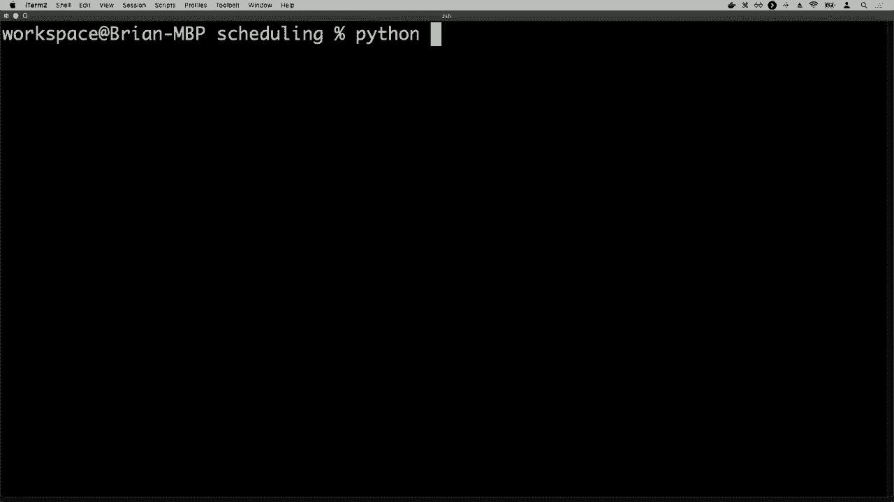

调度 1 dot PI，我看到实际上有许多不同的解决方案。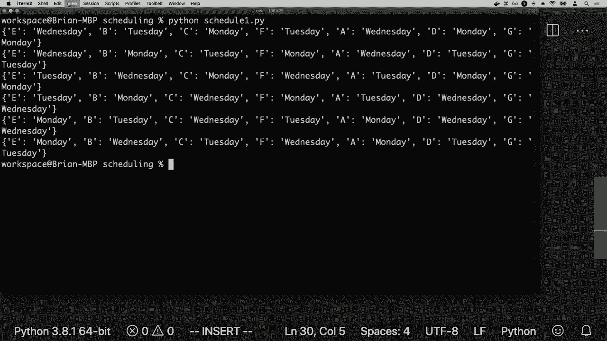

这可以用来解决问题，实际上有 6 种不同的变量赋值方案，可以给我一个令人满意的答案。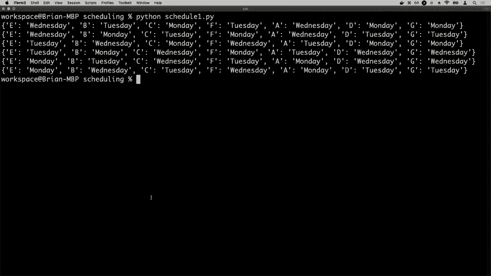

这是一个约束满足问题的实现，实际上这是一个非常基本的回溯搜索方法，我们只需逐个变量，选择一个未分配的，尝试该变量可以取的可能值，然后判断如果成功，若不成功则回溯。

如果违反任何约束条件，我们会继续尝试其他变量，如果遇到死胡同，我们就得回溯，但**最终**我们可能会更聪明地解决这些问题，从而提高解决这类问题的效率。

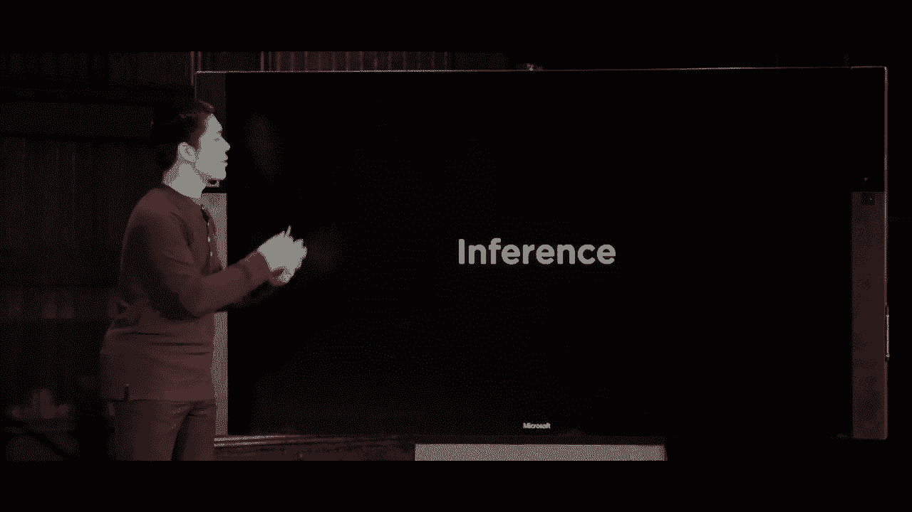

想象一下我们要回到推理的想法，利用我们已知的知识来得出结论，以便让后续的问题解决过程更容易。现在让我们回到第一次遇到困难的地方，即在解决这个约束时。

我们解决了B的满足问题，然后转向D，并将D分配给星期一，因为这似乎与之前的分配一致。到目前为止并没有违反任何约束，但后来发现这个选择实际上是错误的。

这里我们可以采用其余的值，问题是我们能否避免陷入这样的境地，避免走上一条**最终**不会通往任何地方的路径，通过利用我们已有的知识，结果证明我们确实拥有这些知识。

我们可以查看这个图的结构，目前C的范围包含星期一、星期二和星期三。基于这些值，我们可以说这个图不是弧一致的。回想一下，弧一致性是确保每个可能的情况都能满足。

对于特定节点的值，确实还有其他值可以选择。从这里我们可以看到，星期一和星期二并不是C可以选择的可能值，它们与B这样的节点不一致，因为B等于星期二，这意味着C不能是星期二。

因为a等于星期一，所以C也不能是星期一。通过保持C与a和B的一致性，我们可以将星期一和星期二从C的范围中移除，只留下例如星期三。如果我们继续强制保持一致性，就会发现有些值可以被选取。

我们可以得出其他结论，我们看到B的唯一选项是星期二，而C的唯一选项是星期三。因此，如果我们希望使Yi保持一致，那么II不能是星期二，因为这与B不一致；E不能是星期三，因为这与C不一致。

比如，我们可以直接说e等于星期一，然后我们可以开始再次执行这个过程。为了使d与b和e保持一致，d必须是星期三，这是唯一的选项，同样，我们也可以对F和G做出相同的判断。

结果表明，实际上我们能够在不进行任何额外搜索的情况下，通过强制保持一致性，找出所有变量的分配，而无需回溯。我们这样做的方法是通过交错的搜索过程和推理步骤。

强制我们**一致性**的步骤，通常称为维护我们一致性的算法，它每次我们向现有变量分配一个新值时，都会强制我们的**一致性**。有时我们可以使用那个ac3来强制我们的**一致性**。

这个算法在问题的开始阶段，即在我们开始搜索之前，就会被调用，以限制变量的域，从而使搜索更容易。我们还可以利用强制我们的**一致性**与搜索的交错，使得在搜索过程中每当我们进行新的分配时。

我们继续强制我们的**一致性**，以确保每当可能时，我们只是从域中消除可能的值。我们是怎么做到的呢？实际上，这相当于每次我们对变量X做出新的分配时，我们都会调用我们的ac3算法。

这个算法在约束满足问题上强制我们的**一致性**。我们开始时使用的不是所有的弧，而只是我们希望与我们刚刚分配的X保持一致的所有弧。

X的邻居是与X共享约束的某个东西，通过在回溯搜索过程中保持我们的**一致性**，我们最终可以使我们的搜索过程更加高效。这是这个回溯函数的修订版，和之前一样，只是这里有所变化。

每次我们向我们的分配中添加一个新的变量等于值时，我们都会运行这个推理过程。这个过程可能会做很多不同的事情，但它可能会调用维护我们一致性的算法，以确保我们能够强制我们的**一致性**。

可能会引入新的推论，并由此产生新的保证，例如这个变量必须等于那个值。这可能一次发生，也可能发生多次，只要这些推论没有失败，只要它们不导致某种情况。

在没有可能的前进进展的情况下，那么我们可以继续添加那些推理，有新的知识，我知道关于哪些变量应该分配给什么值的新知识，我可以将这些添加到分配中，以便更快地前进。

利用我所能获取的信息，我知道的信息是基于约束满足问题的其余结构，唯一需要做的变化是，如果发现这个值效果不好，那么我在这里需要去除的不仅仅是变量。

变量等于值，但我做出的任何推理也会从分配中去除，因此在这里，我们通常能够通过更少的回溯来解决问题，可能我们最初需要的只是利用每次进行新分配的事实。

可能将一个值降低其他变量的域。我们可以利用这些信息开始更快地得出结论，以更高效地解决问题，结果发现我们还有其他启发式方法可以用来提高我们的效率。

搜索过程也一样，实际上归结为我谈到的几个函数，但我们还没有真正讨论它们是如何工作的，其中一个是这个函数，选择未分配变量，我们在约束满足问题中选择某个变量。

到目前为止，我只是随机选择变量，就像挑选一个变量，然后决定好，这是我们将要分配的变量，然后从那里出发，但事实证明，通过稍微聪明一点，跟随。

某些启发式方法可以通过仔细选择下一个要探索的变量，使搜索过程变得更加高效，其中一些启发式方法包括最小剩余值（MRV）启发式，它通常表示如果我在选择变量时。

我应该选择具有最小域的变量，也就是剩余值最少的变量，想法是如果只剩下两个值，那我也许应该很快剪掉一个以便得到另一个，因为其中一个。

如果存在解决方案，两个必须是解决方案，有时最小剩余值可能。不会给出一个明确的结果，例如，当所有节点的剩余值相同，在这种情况下，另一个可以有帮助的启发式方法是度启发式，节点的度是节点的数量。

考虑到与该节点相连的节点数，如果你想象一下，我应该选择哪个变量，是选择一个连接许多事物的高连接度变量，还是选择一个连接较少事物的低连接度变量。

选择与最多其他节点连接的变量通常是有意义的，作为你首先搜索的对象，为什么会这样呢？因为选择一个高连接度的变量将立即限制其他变量的选择。

那这实际上可能是什么样子，让我们回到这个搜索问题，在这个特定情况下，我在这里做了一个赋值。

这里的问题是我接下来应该看什么，根据最小剩余值启发式，我应该选择剩余可能值最少的变量，在这种情况下，就是这个节点C，它在这个域中只剩下一个变量，即星期三。

这是一个非常合理的下一个赋值选择，因为我知道这是唯一的选项，例如我知道C的唯一可能选项是星期三，因此我不妨做这个赋值，然后可能探索其余空间，但与此同时在变量的数量更多的情况下，更有可能消除你根本不需要搜索的大部分状态空间。

在问题开始时，我对哪些节点应该拥有哪些值并没有任何知识，但我仍然必须选择第一个我尝试赋值的节点，我任意选择了一个在更多信息之上的节点。

尽管相同大小域的大小为3的最小剩余值并没有帮助，但我们可能注意到节点E具有最高的连接度，它与最多的事物相连，因此或许从节点E开始搜索比从最顶端的节点A开始更有意义。

从具有最高连接度的节点开始，首先从节点E进行搜索，因为从那里更容易施加约束，消除我可能不需要搜索的大部分搜索空间，实际上从E开始，我们可以立即。

我们可以实际分配其余的变量，而不需要进行任何回溯，即使我不使用这个推理过程，只需从一个度数较高的节点开始，这将很快限制其他可能值的选择。

这就是我们如何选择一个未分配变量的特定顺序，而不是随机选择一个变量。如果我们聪明地选择变量，我们可以通过确保不需要搜索来使搜索过程更高效。

穿越搜索空间的部分，最终不会影响我们尚未真正讨论的其他变量，这个领域值函数是针对一个变量，返回该变量所有值的序列。

从领域来看，天真的方法是我们之前所做的，按顺序进行，周一、周二再到周三，但问题是，这种顺序可能不是搜索的最有效顺序，有时选择更有可能有效的值会更高效。

解决方案优先，然后再考虑其他值。现在，你如何评估一个值更可能导致解决方案，或不太可能导致解决方案呢？你可以观察添加了多少约束，在你为变量赋予新值时，从领域中去除了多少东西。

针对这个特定值，我们可以使用的启发式方法是**最少约束值启发式**，即我们应该根据相邻值排除的选择数量，以顺序返回变量。

价值排除最少可能选项的想法是，如果我关心的仅仅是找到一个解决方案，如果我从一个排除很多其他选择的值开始，我就排除了很多可能性，这可能使得该特定节点能够采取的情况变得更不可能。

选择会导致一个解决方案，而另一方面，如果我有一个变量，并且我开始选择一个不会排除太多的值，那么我仍然有很大的空间，可能会有一个我最终可以找到的解决方案。

这与我们之前所谈论的相悖，我提到当你选择一个变量时，应该选择剩余可能值最少的变量，但在这里，我想选择那个最少约束的变量的值，基本思想是当我在选择一个变量时。

我希望通过选择一个变量来修剪搜索空间的大部分，从而快速消除可能的选项，而在考虑该变量可能取值时，我只想找到解决方案。

我想要做的，**最终**是选择一个仍然保留开放可能性的值。以便我找到解决方案的可能性尽可能高，**不**排除许多选项。我保留开放的可能性，仍然可以找到解决方案，而不需要在**后来**回溯，因此一个例子是。

如果我试图为节点C选择一个值，这里C可以是星期二或星期三，我们知道它不能是星期一，因为它与这里的领域发生冲突，我们已经知道A是星期一，所以C必须是星期二或星期三。

问题是我应该先尝试星期X还是先尝试星期三。如果我尝试星期X，会排除什么呢？这里会排除一个选项，第二个选项会被排除，第三个选项也会被排除。因此选择星期二会排除三个可能的选项，那可能的选项又会如何呢？

选择星期三，这会排除这里的一个选项，同时排除那里一个选项，因此我有两个选择，我可以选择星期二，这会排除三个选项，或者选择星期三，这会排除两个选项。根据最不约束值启发式，我应该选择那个排除最少选项的。

留下尽可能多的机会让我最终在状态空间中找到解决方案，**最终**如果你继续这个过程，我们将找到一个解决方案，一个变量与值的赋值，使我们能够给每一门考试、每一门课程设定考试日期。

不与任何同时注册两门课程的人发生冲突，因此现在的主要收获是，我们可以用多种不同的方式来表述一个问题。我们今天看过的方式是，我们可以将问题表述为局部搜索问题。

在我们观察当前节点并根据该邻居是否比我们正在观察的当前节点更好或更糟的情况下，移动到邻居。我们看到了将问题表述为线性程序，通过将事物以方程和约束的形式表达，我们能够解决。

让问题解决得更高效一点，我们看到将问题表述为约束满足问题，创建一个所有约束的图，这些约束与有某种关系的变量相连。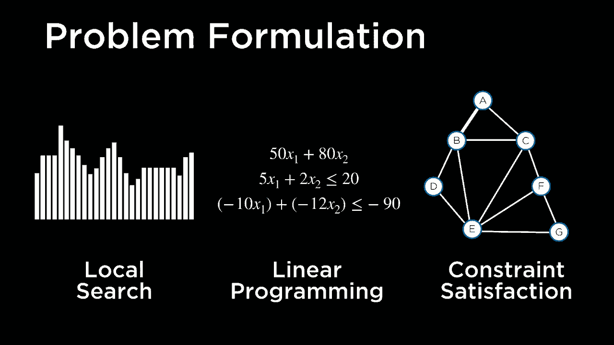

约束之间，并利用这些信息来确定解决方案应该是什么。因此现在的收获是，如果我们在人工智能中遇到一些问题，如果我们希望使用人工智能来解决它们，不论是试图找出医院的位置。

应该是或者试图解决旅行推销员问题，试图优化生产和成本，以及其他问题，或者试图找出如何满足某些约束，无论是数独难题还是如何安排大学的考试等。

各种类型问题的数量，如果我们能够将这个问题表述为这些类型的问题之一，那么我们就可以使用这些已知的算法，这些算法用于强制艺术一致性和回溯搜索，以及这些爬山算法和模拟退火算法。

单纯形算法和内点算法可以用来解决线性规划，我们可以利用这些技术开始解决各种各样的问题，这一切都在人工智能的优化领域内，这是一段关于人工智能的介绍。

今天我们将使用Python来看看你们好！
