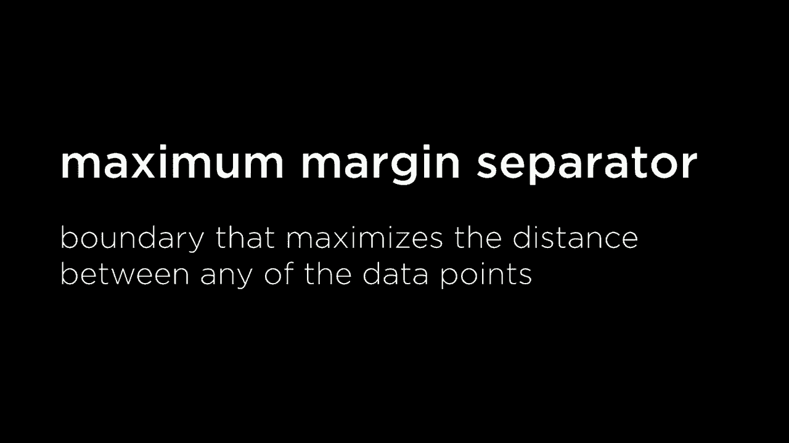

# 哈佛CS50-AI ｜ Python人工智能入门(2020·完整版) - P14：L4- 模型学习 1 (机器学习，监督学习，感知器，svm) - ShowMeAI - BV1AQ4y1y7wy

[音乐]，欢迎大家回到Python人工智能入门课程，到目前为止，我们已经利用AI解决了许多不同的问题，给出了如何寻找解决方案或如何满足某些约束条件的指示。

从某个输入点到某个输出点，以解决某种问题，今天我们将转向学习的世界，特别是机器学习的概念，它通常指的是我们不打算给计算机明确的执行任务的指示。

但是我们并不是给计算机提供关于如何执行任务的明确指示，而是让计算机访问以数据或模式的形式存在的信息，让它尝试找出这些模式，理解这些数据，以便能够独立执行任务，机器学习有许多不同的形式。

这个领域非常广泛，今天我们将深入探讨一些基础算法和概念，这些概念在机器学习的不同领域中都起着重要作用，而其中一个最受欢迎的想法是监督学习。

这种特定类型的任务是指，我们让计算机访问一个数据集，该数据集由输入/输出对组成，而我们希望计算机能够找出一些将输入映射到输出的函数，因此我们有一整套数据。

这通常由某种输入、证据或信息组成，计算机将能够访问这些信息，我们希望计算机根据这些输入信息预测某个输出将会是什么，我们将提供一些数据，以便计算机能够训练其模型，开始理解。

这些信息是如何工作的，输入和输出之间是如何关联的，但最终我们希望我们的计算机能够找出一个函数，给定这些输入，能够得到这些输出，在监督学习中有几种不同的任务，我们将重点关注其中之一。

我们将首先讨论的是分类，分类问题是，如果我给你一堆输入，你需要找出将这些输入映射到离散类别的方法，而你可以决定这些类别是什么，计算机的工作是预测。

这些类别将如何定义，例如，我给你关于某张钞票的信息，比如一美元钞票，我在询问你预测它是否属于真实钞票的类别，还是属于假钞的类别，你需要对输入进行分类。

训练计算机来找出一些函数来进行这个计算，另一个例子可能是我们在这门课上稍微提到的情况，我们想预测在某一天，知道那一天是否会下雨，以及是否会多云。

那一天，之前我们看到如果我们真的给计算机所有的确切概率，比如如果这些是条件，降雨的概率是什么，但通常我们没有访问到那些信息，不过我们确实拥有大量数据，所以如果。

我们希望能够预测一些事情，比如会不会下雨，我们会给计算机提供关于下雨和不下雨的历史信息，并让计算机寻找这些数据中的模式。那么这些数据可能是什么样的呢？我们。

我们可以像这样将数据结构化到一个表格中，这可能是我们表格的样子。对于任何特定的日子，我们有关于那天的湿度、空气压力的信息，重要的是我们有一个标签，某个人曾说过在这一天是下雨的或者是。

不下雨，所以你可以用很多数据填充这个表格，而这之所以被称为监督学习的练习，是因为有人为每一个数据点标注了标签，说明在湿度和气压为这些值的那天是一个。

下雨的日子和这一天是一个不下雨的日子，我们希望计算机能够根据这些输入，比如湿度和气压，来预测应该与那一天关联的标签。那一天看起来更像是会是一个。

这是否意味着会下雨，或者看起来更像是一个不会下雨的日子。从数学上讲，可以把这看作是一个接受两个输入的函数，这些输入是我们计算机可以获取的数据点，比如湿度和气压，因此我们可以写一个函数 f。

它以湿度和气压作为输入，输出将是我们为这些特定输入点所归类的类别，即我们会将什么标签与该输入关联。因此，我们在这里看到了一些示例数据点，给出了这个湿度值和这个气压值。

预测是会下雨还是不会下雨，我们从世界上刚收集的信息，在不同的日子里测量湿度和气压，观察在特定那天是否下雨，这个函数 f 是我们希望近似的现在。

计算机和我们人类并不确切知道这个函数f是如何工作的，它可能是一个相当复杂的函数，因此我们将尝试估计它。我们希望提出一个假设函数H，试图近似f的功能，我们想要提出一些。

函数H也会接受相同的输入，并产生一个输出：有雨或没有雨，理想情况下，我们希望这两个函数尽可能一致，因此监督学习分类任务的目标是弄清楚函数H是什么样的，我们该如何。

那么，如何开始做这件事呢？在这种情况下，我有两个数值，合理的做法是尝试将其绘制在图上。

在一个有两个轴的图表上，x轴和y轴，在这种情况下，我们将使用两个数值作为输入，但这些相同的想法在增加更多输入时也同样适用，我们将在二维中绘制事物，但如我们所见，可以添加更多输入。

想象事物在多个维度中，而我们人类在视觉上至少在三维之外的概念化方面存在困难，但计算机在尝试想象许多更多维度时没有问题，对计算机来说，每个维度只是一个独立的数字。

计算机在十维或百维中思考并不是不合理的，这样能够尝试解决问题，但现在我们只有两个输入，因此我们将在x轴上绘制事物，这里代表湿度，y轴在这里。

表示压力，我们可能会说，取所有下雨的天数，尝试在这个图表上绘制它们，看看它们在图表上的位置，你知道这里可能是所有的下雨天，每个下雨天用一个蓝点表示，代表一个特定的值。

针对湿度和特定压力值，然后我可能会对不下雨的天做同样的事情，比如取所有不下雨的日子，弄清楚这两个输入的值，并继续在这个图表上绘制它们，上面用红色绘制，而这里的蓝色则代表。

下雨天和红色在这里代表的是一个不下雨的日子，这就是我的计算机能够访问的所有输入。我希望计算机能够训练一个模型，使得如果我遇到一个没有标签的新输入时，能够开始估计基于所有这些信息和数据，应该将什么类别或标签分配给特定的数据点。

这里的白点，我想预测根据这两个输入的值，我们应该将其分类为蓝点（下雨天），还是将其分类为红点（不下雨的日子）。如果你仅仅从图像上看，试图说好吧，这个白点看起来像什么。

它属于蓝色类别还是看起来属于红色类别？我想大多数人会同意它可能属于蓝色类别。为什么呢？因为它看起来接近其他蓝点。这不是一个很正式的概念，但我们会在后面进行形式化。

稍等一下，因为它似乎接近这个蓝点，周围没有其他点比它更近，因此我们可能会说它应该被分类为蓝色。我认为这一天将会是雨天，基于这个输入，可能不是完全准确，但这是一个。

在这种算法中，做出相当不错的猜测实际上是一个非常流行的常见机器学习算法，称为最近邻分类。这是解决这些分类类型问题的算法。在最近邻分类中，它将执行这个算法。

所做的是给定一个输入，它将选择与该输入最近的数据点的类别。这里的类别我们只指雨天或非雨天、假冒或非假冒，我们根据最近的数据点选择类别或类别。

最近的数据点是蓝点还是红点？根据这个问题的答案，我们能够做出某种判断，可以说我们认为它会是蓝色的，或者我们认为它会是红色的。同样，我们可以将此应用于我们遇到的其他数据点。

如果突然出现这个数据点，它最近的数据是红色的，所以我们将其分类为红点，不下雨。但当你看看这里，问同样的问题时，事情会变得有点复杂。它应该属于蓝点（下雨天）类别，还是应该。

属于红点类别，而不是不下雨的日子。最近邻分类会说，解决这个问题的方法是看哪个点离那个点最近。你看这个最近的点，发现它是红色的，是个不下雨的日子，因此，根据最近邻。

对于这个未标记的点，我会说它也应该是红色的，它也应该被分类为不下雨的日子，但你的直觉可能会认为这是一个合理的判断，认为它最接近的东西是一个不下雨的日子，所以可以猜测它不下雨。

这一天，但从更大的角度看事情也是合理的，因为可以说，最近的点确实是一个红点，但它被许多其他蓝点包围，因此从更大的角度来看，可以认为这个点。

实际上应该是蓝色的，而仅凭这些数据我们实际上并不确定，我们给出一些输入，试图预测的内容，而我们不一定知道输出将是什么，因此在这种情况下，哪一个是正确的很难说，但通常考虑的不仅仅是一个。

考虑多个邻居有时可以给我们更好的结果，因此存在一种称为K最近邻分类算法的变体，其中K是我们选择的一个参数，即我们希望查看多少个邻居。

我们要看的一个最近邻分类是我们之前看到的，选择最近的一个邻居并使用该类别，但在K最近邻分类中，K可能是三、五或七，表示查看三个、五个或七个与该点最近的数据点。

这个点的工作方式略有不同，该算法会在给定输入的情况下，从K个最近的数据点中选择最常见的类别，因此如果我们查看五个最近的点，知道其中三个说下雨，两个说没下雨，我们将选择三个。

而不是两个，因为每个点实际上都会对他们认为类别应是什么投票，最终你选择票数最多的类别，因此K最近邻分类是一个相对简单易懂的算法，你只需查看邻居并找出。

答案可能是什么，事实证明这对于解决各种不同类型的分类问题非常有效，但并不是每个模型在每种情况下都能有效，因此今天我们特别要关注的一个方面是监督机器学习的背景。

有许多不同的方法来进行机器学习，也有许多不同的算法可以应用，所有这些算法都在解决同一种类型的问题，都是一些分类问题，我们希望将输入数据组织成不同的类别，而没有任何一个算法一定会比其他算法更好。

每种算法都有其权衡，可能根据数据的不同，一种类型的算法会更适合对该信息进行建模，而这正是许多机器学习研究的终点。

当你尝试应用机器学习技术时，往往不仅仅关注一个特定的算法，而是尝试多种不同的算法，看看哪个能够给你最好的结果，以预测将输入映射到输出的某个函数。那么，是什么呢？

K 最近邻分类的缺点，有几个。一个可能是，在一种天真的方法下，它可能会比较慢，因为必须遍历并测量一个点与这里每一个点之间的距离，现在有一些方法可以尝试解决这个问题。

有数据结构可以帮助更快速地找到这些邻居，还有一些技术可以用来尝试修剪一些数据或删除一些数据点，以便仅保留相关数据点，从而使其更容易，但。

最终，我们可能想要做的是想出另一种方法来进行分类，一种尝试分类的方法是查看邻近的点，但另一种方法可能是尝试查看所有数据，看看我们能否想出一些决策。

边界将雨天与非雨天分开，在二维的情况下，我们可以通过绘制一条线来做到这一点。例如，我们可能想尝试找到某条线，找到某个分隔符，将雨天（这里的蓝点）与非雨天分开。

雨天的红点在那边，我们现在正在尝试一种不同的方法。与仅查看输入数据点周围的局部数据的最近邻方法相对，现在我们所做的是尝试使用一种称为线性回归的技术来寻找某种。

将两部分分开的线现在有时实际上可能会得出一条完美分隔所有雨天和非雨天的线，但实际上这可能比许多数据集要干净得多，通常数据会更混乱。

存在离群值和特定系统中发生的随机噪声，我们希望仍然能够弄清楚一条线可能是什么样子。因此，实际上数据并不总是线性可分的，线性可分指的是我可以绘制一条线的一些数据集。

为了完美地分开这两个部分，而是可能会出现这样的情况：某些雨天点在这条线的一侧，而某些非雨天点在那条线的另一侧，并且可能没有一条线能够完美地分开输入的路径。

另一半完美地区分了所有雨天和非雨天，但我们仍然可以说这条线做得相当不错，我们稍后会试图正式化一下，当我们说这样的线在尝试进行预测时做得相当不错的意思。但现在让我们。

仅仅说我们正在寻找一条线，尽可能有效地将一类事物与另一类事物分开。那么现在我们试着在数学上更正式地表达这一点，我们想要想出某种函数，某种定义这条线的方法。

输入是像湿度和压力这样的东西，因此我们的输入可能称为x1，代表湿度，x2则代表压力。这些是我们将提供给机器学习算法的输入，基于这些输入，我们希望我们的模型能够。

能够预测某种输出，我们将使用我们的假设函数来进行预测，我们称之为H，假设函数将以x1和x2（湿度和压力）作为输入。在这种情况下，你可以想象如果我们不仅有两个输入，而是有三个、四个、五个或更多输入，我们可以。

让这个假设函数将所有这些作为输入，我们稍后也会看到一些例子。现在问题是，这个假设函数做什么呢？它实际上是在边界的一侧还是在另一侧？我们如何正式化这个边界呢？

边界通常将是这些输入变量的线性组合，至少在这个特定的案例中。那么我们所说的线性组合就是取每个输入并将其乘以一个我们需要弄明白的数字，我们通常称之为。

数字表示这些变量在试图确定答案时应该有多重要，因此我们将对这些变量加权，我们可能会再加上一个常数，以试图使这个函数有些不同，结果我们只需比较，看看它是大于。

零还是小于零，以说它不属于一侧的线或另一侧的线。那么，这个数学表达式可能看起来像这样：我们将取每个变量X1和X2，将它们乘以一些权重，我现在还不知道那个权重是什么，但它将是一些。

权重1，也许我们只想加上一些其他权重，因为函数可能要求我们将整个值上移或下移某个量，然后我们只需比较，如果我们做所有这些映射，是否大于或等于0，如果是，我们可能将这个数据点分类为雨天。

否则我们可能会说没有雨，因此关键在于这个表达式是我们将如何计算是否是雨天，我们将进行一系列数学运算，将每个变量乘以一个权重，也许再加一个额外的权重，看看结果是否大于或等于0。

并且利用这个表达式的结果，我们能够确定是否下雨，这个表达式在这里的情况将仅指代某条线，如果你绘制图表，它将只是一些线，而这条线的实际样子取决于这些权重x1和。

x2是输入，但这些权重实际上决定了那条线的形状、斜率以及那条线的实际样子，因此我们想要弄清楚这些权重应该是什么，我们可以选择任何权重，但我们希望以这样的方式选择权重：如果你传入。

在雨天的湿度和压力下，你最终得到的结果是大于或等于0的，我们希望这样，如果我们输入到我们的假设函数中不是雨天，那么我们得到的输出应该是不下雨，因此在到达那里之前，让我们尝试把这更正式化一些。

从数学上讲，这样你就可以理解，如果你进一步深入监督学习并探索这个概念，你会经常看到这个。一件事是，通常对于这些类别，有时只会使用类别的名称，比如“下雨”和“不下雨”，通常在数学上如果我们。

在这些事物之间进行比较时，处理数字世界更容易，所以我们可以说1和0，1代表下雨，0代表不下雨，因此我们做所有这些数学运算，如果结果大于或等于0，我们将继续说我们的假设函数输出1，意味着下雨。

否则，输出为零，意味着不下雨，通常这类表达会用向量数学来表示，而向量如果你不熟悉这个术语，是指数值序列，你可以在Python中用数值列表表示。

值或带有数值的元组，在这里我们有几个数值序列，我们的一个向量，数值序列之一是所有这些单独的权重w0、w1和w2，因此我们可以构造一个我们称之为权重向量的东西，我们稍后将看到这有什么用，称为W。

通常用加粗的W表示，这只是这三个权重的序列：权重0、权重1和权重2，为了能够基于这些权重计算我们认为一天是下雨还是不下雨，我们将把每个权重与我们的输入变量之一相乘。

权重将会乘以输入变量X2，W1将会乘以输入变量X1，而W0，嗯，它并没有被任何东西乘以，但为了确保向量长度一致，我们稍后会看到这为什么有用，我们只是说W0被乘以。

因为你可以乘以某个数，乘以1后最终得到的就是确切的相同数字，所以除了权重之外，向量W还会有一个输入向量，我们称之为X，它有三个值，再一次，因为我们只是在将W零乘以1，最终然后是X1和X2，所以这里我们已经表示出来。

两个不同的向量，即我们需要以某种方式学习的权重，机器学习算法的目标是学习这个权重向量应该是什么，我们可以选择任何任意的数字集，它将产生一个尝试预测是否下雨的函数，但它可能不会很有效。

这可能不是很好，我们想要做的是提出这些权重的良好选择，以便我们能够进行准确的预测，然后这个输入向量表示某个特定输入到函数中，即我们希望估计的一个数据点，看看那天是雨天还是非雨天。

而且这将根据提供给我们函数的输入而有所不同，我们正在尝试估计什么，然后为了进行计算，我们想要计算这个表达式，结果表明这个表达式就是我们所说的这两个向量的点积。

两个向量的乘积仅意味着将向量中的每一项相乘，W0乘以X1，W1乘以X1，W2乘以X2，这就是为什么这些向量需要相同长度的原因，然后我们将所有结果相加，所以W和X的点积。

权重向量和我们的输入向量，只会是W0乘以1或者说是W0加上W1乘以X1，将这两个项相乘，再加上W2乘以X2，将这些项相乘，所以我们有我们的权重向量，我们需要搞清楚我们需要我们的机器学习算法来弄明白什么。

权重应该是，我们有代表我们尝试预测的类别的数据点的输入向量，预测标签，我们能够通过计算这个点积来做到这一点，这在向量形式中经常被表示，但如果你之前没有见过向量，你可以。

可以把它想象成与这个数学表达式完全相同，只是进行乘法运算，将结果相加，然后查看结果是否大于或等于0，这里的表达式与我们计算的表达式是完全相同的，以查看那个答案是否成立。

因此，你通常会看到假设函数写成像这样一个更简单的表示，其中假设以某些输入向量X（某天的湿度和压力）作为输入。我们想要预测一个输出，比如下雨或不下雨，或者选择1或0。

数字表示事物的方式是通过计算权重和输入的点积。如果结果大于或等于零，我们将说输出为1；否则，输出为0。这个假设被认为是由权重参数化的，具体取决于我们选择的权重。

如果我们随机选择权重，最终得到的假设可能会有所不同，可能不会得到一个非常好的假设函数。我们会得到1或0，但这可能不会准确反映我们认为某一天是否会下雨，但如果我们正确选择权重。

我们通常可以很好地估计函数的输出应该是1还是0。那么问题是如何确定这些权重应该是什么，如何调整这些参数。有很多方法可以做到这一点，其中一种最常见的方法称为感知机学习规则，我们稍后会详细介绍。

感知机学习规则的思想是，对于我们希望从中学习的数据点来说，不会深入数学，我们主要是以概念性介绍，假设给定一些数据点。

有一个输入X和一个输出Y，其中Y为1表示下雨，0表示不下雨。然后我们将更新权重，稍后我们将看看公式，但大体思路是，我们可以从随机权重开始，然后像从数据中学习一样，逐个数据点处理。

在所有数据点中找出好吧，我们需要在权重中更改哪些参数，以更好地匹配该输入点。因此，拥有大量数据在监督学习算法中的价值在于，你逐个处理每个数据点，也许会查看。

我们会多次尝试并不断确定是否需要调整权重，以便更好地创建一个能够正确或更准确地估计输出的权重向量。无论我们认为要下雨还是不下雨。

要下雨了，那么在不深入数学的情况下，权重更新看起来像什么呢？我们将更新每个权重，使其成为原始权重加上一些附加表达式，而要理解这个表达式，为什么呢？因为实际输出大于或等于0。

是输入 X 的假设，这将是我们认为的输入，所以我可以用实际值减去我们的估计来替代，并根据实际值和估计值之间的差异，我们可能想要改变我们的假设，改变我们。

进行这种估计的方式，如果实际值和估计值是相同的，那么意味着我们能够正确预测这个数据点属于哪个类别。那么实际值减去估计值，这将是零，这意味着右边的整个项将变为零，权重。

不会改变权重，我在这里的权重是指，权重保持不变，如果我们能够正确预测输入属于哪个类别，但如果我们的假设没有正确预测输入属于哪个类别，那么也许。

我们需要做一些调整，以便更好地预测未来这种数据点，而我们可能的方式是，如果实际值大于估计值，那么现在我们就假设这些 X 是正值。

如果实际值大于估计值，那就意味着我们需要增加权重，以使输出更大，因此我们更有可能达到正确的实际值，所以如果实际值大于估计值，那么实际值减去估计值将是一个正数。

所以你可以想象，我们只是给权重增加一个正数，以稍微增加它，同样反向的情况也是如此，如果实际值小于估计值，实际值是零，但我们估计为一，意味着实际并没有下雨，但我们预测为下雨。

如果预判为下雨，那么我们想要减少权重的值，因为在这种情况下，我们想尽量降低计算该点积的总值，以使我们预测实际会下雨的可能性更小，所以不需要深入到数学。

总的思路是，每次遇到数据点时，我们可以相应地调整这些权重，以便更好地与我们所获得的实际数据对齐，你可以重复这个过程，逐个数据点，直到最终希望你的算法。

收敛到一些权重，这些权重相当好地尝试去判断一天是否会下雨，或者不会下雨，最后一点关于这个特定方程的值 alpha，这通常被称为**学习率**，它只是我们选择的一个参数，用来决定变化的速度。

我们实际上要更新这些权重值，因此如果 alpha 较大，我们将大幅更新这些权重值；如果 alpha 较小，我们将较少地更新权重值，你可以根据问题选择一个 alpha 的值，不同的值可能更适合。

情况，与其他情况相比是更好还是更差，所以在经历了这些之后，在我们完成了这个训练过程，利用所有这些数据并使用这个学习规则，查看所有的数据，并用每一条数据作为我们是否应该保持权重不变、增加权重或减少权重的指示。

如果是的话，那究竟是多少呢？你最终得到的实际上是一个阈值函数，我们可以看看阈值函数的样子。在 x 轴上，我们有这个函数的输出，它取权重并与输入进行点积；在 y 轴上，我们有输出的结果。

其中一个结果是零，这在这里表示不下雨，而另一个结果是1，这在这里表示下雨。我们的假设函数的工作方式是计算这个值，如果它大于零或大于某个阈值值，我们就声明今天是下雨天；否则我们就声明今天不下雨。

从图形上看，这个函数的样子是这样的：最初，当这个点积的值较小时，它是不下雨的；但一旦它超过了那个阈值，我们突然说，好吧，现在是下雨了，现在是下雨，不是的。

它是下雨的，解读这种表示的方法是，这条线这一侧的任何东西都会被视为数据点的类别，我们会说“是的，下雨了”；而落在这条线另一侧的数据点则是我们会说“没下雨”。我们希望在两者之间进行选择。

对于权重的一些值，结果是一个相当不错的函数，试图进行这种估计。但这种硬阈值有一个棘手的地方，就是它只留下两种可能的结果。没错，我们输入一些数据，输出的结果就是下雨或不下雨，根本没有其他可能。

也许这就是你想要的，或许你只想根据一些数据点，能够将其分类为这几个不同的类别之一或多个，但也可能你关心的是知道这个预测的强度，例如，如果我们回到这个。

这是一个例子，我们在这条线的这一侧有下雨的日子，而在那一侧则是非下雨的日子。你可能想象，现在来看看这两个白色的数据点。这个数据点是我们希望预测标签或类别的；而这个数据点我们也希望进行预测。

一个标签或类别似乎很可能你可以相当自信地说，这个数据点应该是一个雨天，似乎靠近其他雨天，如果我们依据最近邻策略，它在这条线的这一侧，如果我们根据仅仅是说你知道哪个。

这条线的哪一侧，它应该落在哪一侧，通过弄清楚这些权重应该是什么。如果我们使用线性策略，仅仅判断它落在哪一侧，哪个是这个决策边界的侧面，我们还可以说，这个点也是一个雨天，因为它在这条线的一侧。

这与雨天相对应，但即使在这种情况下，我们也可能知道，我们对左侧的这个数据点的信心远没有右侧的这个数据点高，因此我们对右侧的这个数据点可以非常有信心，“是的，这是一个雨天”，而这个你。

如果我们仅通过距离来判断，它距离线非常近，因此你可能不太确定，但我们的阈值函数不允许对于某事物有“更不确定”或“更确定”的概念，这就是我们所称的硬阈值。一旦你跨越了这条线，我们就立刻说“是的，这将会下雨”。

这是一个雨天，在线的前面我们将说它不是一个雨天，这在许多情况下可能没有帮助。首先，这不是一个特别容易处理的函数，如果你深入了解机器学习，并试图做一些像求导这样的事情。

这种类型的函数使事情变得复杂，但另一个挑战是，我们对事物之间的渐变没有真正的概念。我们没有“是的，这是一个非常强烈的，只有强烈的信念它会下雨”，与“可能比不下雨要更可能”相对。

可能会下雨，但也许对此并不完全确定。因此，我们可以利用一种称为逻辑回归的技术，取而代之的是使用这种硬阈值类型的函数，我们可以使用一个逻辑函数，我们可以称之为软阈值，这样就可以了。

将这个转换成更像这样的东西，使其更平滑，因此可能的输出值不再仅仅是零和一：

04 不下雨的情况，虽然下雨，但你实际上可以得到任何在零和一之间的真实数值。如果你在这边，那么你得到的值是零，好的，它不会下雨，我们对此非常确定。如果你在这边，你得到的值是一个，像是“是的，我们非常确定会下雨”。

下雨，但在两者之间，你可以得到一些真实的数值，其中一个值，比如0.7，可能意味着我们认为会下雨，基于数据它下雨的可能性比不下雨要高，但我们对某些其他数据点可能没有那么自信。因此，软阈值的一个优势。

它允许我们有一个输出，可能是某个实数，反映某种概率，即我们认为这个特定数据点属于那个特定类别的可能性。此外，还有一些其他不错的数学属性。

有两种不同的方法来解决这种分类问题，一种是最近邻的方法，你只需取一个数据点，查看附近的数据点，以估计它属于哪个类别，另一种方法则是通过。

好吧，让我们尝试使用线性回归，调整权重以确定最能分隔这两类的决策边界。结果表明，另一种非常流行的方法是，当你有一个穿过数据集的对角线。

设置并开始尝试进行一些学习，这就是我们所称的支持向量机。我们不会过多讨论支持向量机的数学，但至少会从图形上探讨它的样子以及支持向量机背后的动机。

比如说，我在这里有红数据点，而蓝数据点在这里，我可以画出这样的一条线，这条线将红点与蓝点分开。

它能够完美地将红点与蓝点分开，所有红点都在直线的一侧，所有蓝点都在另一侧。但如果你得出了一个看起来像这样的模型，可能会让你有些紧张。

我担心的是，它在其他不一定在我们拥有数据集中的数据点上的泛化能力。例如，如果有一个点正好位于直线的右侧。

我想猜测这实际上是一个红点，但它落在了线的一侧，而我们估计它是一个蓝点。因此，这条线可能不是一个很好的选择，因为它与这些数据点太接近。

这条线也成功地将所有红点从所有蓝点中分开。从某种角度来看，实际上有很多不同的决策边界可以画出，以分隔两组数据。

一些权重设置，让我们能够预测正确的输出，这条线将每次都为这组数据预测正确的输出，因为红点在一侧，蓝点在另一侧，但你应该再稍微谨慎一点。

我们会感到紧张，因为这条线与这些红点如此接近，即使我们能够正确预测输入数据。如果有一个点落在这个一般区域，我们的算法模型会说是的，我们认为它是蓝点，而实际上它可能属于红色。

分类仅仅因为它看起来接近其他红点。我们真正想说的是，给定这些数据，如何尽可能好地概括它，就是想出这样一条看似直观的线，而之所以直观，是因为它。

看起来尽可能远离红色数据，因此，如果我们稍微概括一下，假设我们有一些与输入不同的点，但仍然稍微远离，我们仍然可以说这一侧的东西可能是红色的，而那一侧的东西可能是蓝色的，我们可以做出这些。

这样进行判断，这正是支持向量机设计的目的。它们旨在寻找我们所称的最大边际分隔器，最大边际分隔器仅仅是最大化的某种边界。

在点组之间的距离，而不是想出其他某种边界。在之前的情况下，我们不会在意，只要我们能很好地对输入进行分类，这似乎就是我们需要做的一切，支持向量机会尝试找到这个最大边际分隔器，试图找出。

最大化特定的距离，它通过找到我们称之为支持向量的向量来实现，这些向量与线最近，并试图最大化线与这些特定点之间的距离。在二维中是这样，在更高维度中也是如此。

我们并不是在寻找某条将两个数据点分开的线，而是在寻找我们通常称之为超平面的东西，即有效地将一组数据与另一组数据分开的决策边界，而支持向量机在更高维度中工作的能力实际上有很多。

还有其他应用，但其中之一是它很好地处理数据可能不是线性可分的情况，因此我们之前讨论了线性可分性。这个想法是，你可以取数据，画一条线或某种输入的线性组合，这使我们能够完美地将两组分开。

彼此之间有一些数据集是不可线性分开的，有些情况下你甚至无法找到一条好的线来进行这种分离，比如像这样，或者如果你想象这里有红点和周围的蓝点，如果你试图找到一条线将其划分开来。

将红点与蓝点区分开来实际上是困难的，并不是不可能。如果你选择在这里画一条线，那么你就忽略了这些本该是蓝色而不是红色的点。无论你在哪里画线，都会有很多错误。

误差很多，这将很快称为损失，你将有很多点被错误分类。我们真正想要的是能够找到更好的决策边界，它可能不仅仅是通过这个二维空间的一条直线。

向量机所能做的是，它们可以开始在更高维度中操作，并能够找到一些其他的决策边界，比如在这种情况下的圆，实际上能够更好地区分这些数据集。

可分离的支持向量机通过在更高维度中工作，实际上可以找到有效解决这类问题的方法。因此，我们可以看到三种不同的方法来尝试解决这些问题，我们看到支持向量机，并且我们尝试使用线性回归。

感知器学习规则旨在找出如何对输入和输出进行分类，我们在最近邻方法中看到，没有一种方法一定比其他方法更好。这又要取决于你所访问的数据集和信息，以及你要处理的函数的形状。

最终的目标是进行预测，这也是很多研究和实验涉及的地方，试图找出如何最佳执行这种估计，但分类只是你可能在监督学习中遇到的任务之一。

分类我们要预测的是某个离散类别，我们试图预测红色或蓝色的雨。
