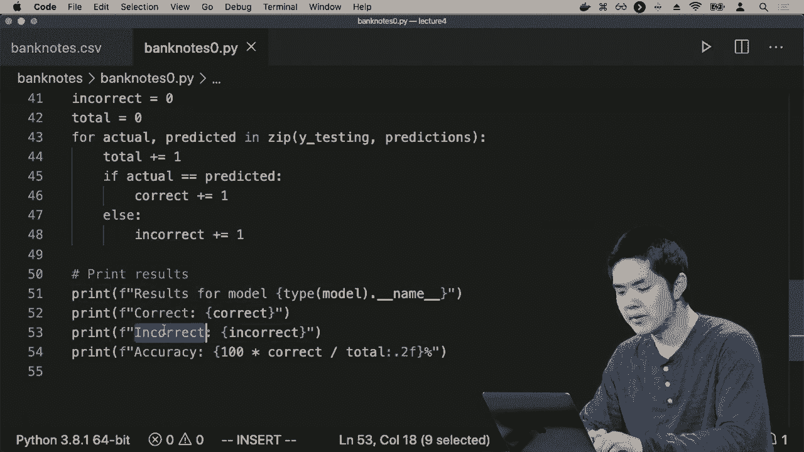
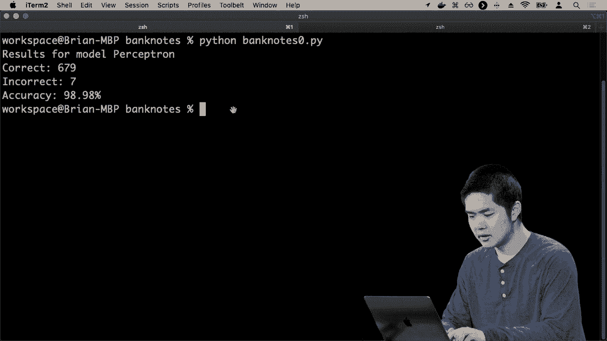
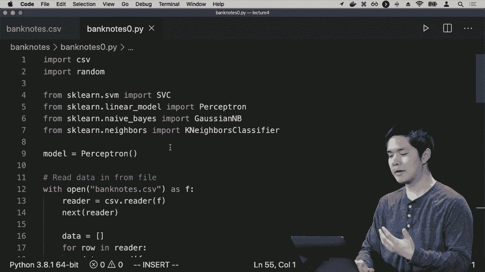

# 哈佛CS50-AI ｜ Python人工智能入门(2020·完整版) - P15：L4- 模型学习 2 (回归，损失函数，过拟合，正则化，强化学习，sklearn) - ShowMeAI - BV1AQ4y1y7wy

并不是降雨的真实与否，而有时我们要预测的是一个实数值，对此我们有一个相关问题，不是分类，而是称为回归，回归是监督学习问题，我们尝试学习一个将输入映射到输出的函数。

但不同的是，输出不再是离散类别，如降雨或不降雨，而在回归问题中，输出值通常是连续值，一些我们希望预测的实数，这种情况时常发生，你可能想象公司会采取这种方法。

例如，试图弄清楚广告的有效性。广告支出如何转化为公司产品的销售。例如，他们可能想尝试预测一个函数，该函数将广告支出的金额作为输入。

在这里我们只使用一个输入，但你可以扩大到多个输入，如果你拥有多种不同类型的数据，目标是学习一个函数，给定这笔广告支出，我们将获得这个销售额。

你可能会根据过去每个月的数据来判断，这里是我们花在广告上的金额，这里是销售额，我们想预测某种假设函数，再次给定广告支出的金额，可以预测在这种情况下某个实数，预计的销售额。

这个公司本月或这个季度或其他时间单位要做的事情。我们选择的衡量方式，因此再次解决这个类型问题的方法。我们可以尝试使用线性回归的方法，在x轴上绘制这些数据，广告支出如前所述。

在y轴上是销售额，我们可能只是想画一条线，尽可能准确地估计广告与销售之间的关系，在这种情况下，与之前不同的是，我们不是尝试将数据点分为离散类别。

我们只是试图找出一条线，近似广告与销售之间的关系，这样如果我们想要弄清楚特定广告预算的预计销售额，你只需在这条线中查找，确定对于这个广告支出，我们会有这个销售额。

而是试图以这种方式进行估计，如果你可以试图画出一条线，再次弄清楚如何使用各种技术修改权重，以使这条线尽可能贴合。因此，所有这些方法都是为了尝试解决机器学习风格的问题。

问题变成了我们如何评估这些方法，如何评估我们可能提出的各种不同假设，因为这些算法会给我们某种假设，一个将输入映射到输出的函数，我们想知道这个函数的效果如何。

可以将评估这些假设并尝试得到更好假设的过程看作是一个优化问题，在优化问题中，我们以前提到过，我们要么试图通过寻找全局最大值来最大化某个目标函数，要么试图最小化某些成本。

通过尝试找到某个全局最小值，在评估这些假设的情况下，我们可以说这个成本函数是我们试图最小化的东西，我们可能试图最小化我们所称之为损失函数的东西，而损失函数是一个。

为我们估计我们的函数表现不佳的程度，更正式地说，这就像是效用损失，每当我们预测错误时，都会增加我们的损失函数的输出，而你可以提出任何你想要的损失函数，只要是某种数学方式。

对于每一个数据点，考虑到实际输出以及我们预测的输出，我们可以计算某种数值损失，但有几个流行的损失函数值得讨论，以便你之前见过它们。

当涉及到离散类别时，比如下雨或不下雨，假币或真币，我们接近于0，1损失函数，其工作方式是对每一个数据点，我们的损失函数以实际输出为输入，比如它是否真的在下雨。

考虑到预测，我们是否预测了在这个数据点下是下雨还是不下雨，如果实际值等于预测值，那么0，1损失函数就会说损失为0，因为我们能够正确预测，没有效用损失。

如果实际值与我们预测的值不相同，那么在这种情况下我们的损失为1，我们失去了一些效用，因为我们预测的函数输出并不是实际的值，那么在这种情况下的目标就是提出一个最小化损失的假设。

总的经验损失是我们损失的总量，如果将所有这些数据点的实际输出和我们的假设预测相加，就可以得到。在这种情况下，例如，如果我们回到将天分类为下雨或不下雨，我们得出了这个决策边界。

我们如何评估这个决策边界，它比在这里画线或在那里画线好多少呢？我们可以获取每个输入数据点，每个输入数据点都有一个标签，表明是否下雨，我们可以将其与预测进行比较。

我们预测它会下雨或不下雨，并为其分配一个数值。例如，这些点都是雨天，我们预测它们会下雨，因为它们位于线的下方，因此它们的损失为零，没有损失。

对于这些点来说，确实如此，例如在这里没有下雨，而我们预测也不会下雨，然而我们确实有损失，例如这里和那里这两个点，我们预测不会下雨，但实际上是一个蓝点，它在下雨，或者在这里。

预测它会下雨，但实际上是一个红点，它没有下雨，因此我们错误分类了这些我们试图训练的数据点，因此这里有一些损失，例如这里一个，那里一个，总损失为四，例如在这种情况下。

我们如何估计或说这条线比另一条线更好，或者在更远处的对齐，因为这条线可能最小化损失，所以如果你只是通过我们的空间画一条直线，无法比这四个损失点做得更好。

1 损失函数检查我们是否做对了，如果做对了，损失为零，没有损失；如果做错了，那么我们的损失函数对该数据点的值为1，我们将所有数据点的损失相加，得到某种经验损失，表示我们损失了多少。

在所有这些原始数据点中，我们的算法可以访问到其他形式的损失，当我们处理更多实值案例时，尤其有效，例如广告预算与销售额之间的映射，因为在这种情况下，你不仅关心。

你可能并不在乎数字完全准确，而是关心你离实际值有多近。如果实际销售额是$2,800，而你预测的是$2,900，或许这还不错；这比你预测$1,000的销售额要好得多。

例如，我们希望我们的损失函数能够考虑到这一点，不仅考虑实际值与预期值是否完全相同，还要考虑它们之间的差距，因此对于这个，我们采用我们所称的L1。

l1损失不仅仅看实际值和预测值是否相等，而是取实际值减去预测值的绝对值，换句话说，我们只是在问实际值和预测值之间的距离有多远，并将所有数据点的损失加起来。

这样我们就能得出最终的答案。那么，对于我们的数据集，这可能是什么样子呢？如果我们回到这个表示，其中x轴是广告支出，y轴是销售额，我们的线是我们对于给定广告支出量的预测。

我们的l1损失就是在销售轴上，预测值与每个数据点之间的垂直距离。这样我们就可以准确地计算出预测值与每个数据点之间的距离，并因此得出这个特定假设的总体损失。

通过将所有这些不同的数据点的个别损失加起来，我们的目标是尽量最小化这些损失，试图找到一条线，使得通过判断我们预测的销售额与实际销售额的差距来最小化效用损失。

结果表明还有其他损失函数，其中一种非常流行的是l2损失。l2损失不仅仅使用绝对值来衡量实际值与预测值之间的距离，而是使用实际值减去预测值的平方，即实际值和预测值之间的差距。

它有效地平方了该值，严厉惩罚任何更差的预测。想象一下，如果你有两个数据点，你预测的值与它们的实际值相差很远，而不是一个数据点与其实际值相差不远。

l2损失函数会更严厉地惩罚与实际值相差较远的预测，因为它会平方实际值和预测值之间的差异，根据具体情况，你可能想选择某个损失函数，这取决于你最关心的最小化目标。

如果你真的想在更多异常值的情况下最小化误差，你可能想考虑类似的情况，但如果你有很多异常值，并且并不一定关心对它们建模，那么l1损失函数可能更可取，但在这里有一些权衡，你需要根据具体情况做出决定。

针对特定数据集，你确实面临的风险是任何这些损失函数都可能导致一个叫做过拟合的问题，过拟合是机器学习中的一个重大问题，每当模型过于复杂以至于无法泛化到新数据时就会发生。

该边界与数据集的拟合不太紧密，因此可能无法很好地进行推广。我们希望我们的模型能够准确预测数据及输入输出对。我们想这么做的原因是希望我们的模型能够很好地推广到我们未见过的数据。

我想利用过去一年是否下雨的数据来进行训练，并利用这些数据进行未来的推断，以判断将来是否会下雨。或者如果我有大量关于假币和真币的样本数据的话。

我希望训练一台计算机，使其在未来能够推广到我可能看到的其他钞票上。而过拟合的问题在于，如果你过于紧密地绑定于训练数据集，你最终可能无法很好地进行推广。那么这又是什么意思呢？

看起来我们可以想象一个下雨天和非下雨天的例子。从这里，蓝点表示下雨天，而红点表示非下雨天。我们决定感到相当舒适，可以画一条这样的线作为下雨天和非下雨天之间的决策边界。

对于非下雨天，我们可以相当自信地说，位于这一侧的点更可能是下雨天，而位于另一侧的点则更可能是非下雨天。但在这种情况下，经验损失并不是零，因为我们没有完美地对所有情况进行分类，这其中有一个异常值。

尽管那天并没有下雨，但我们的模型仍然预测会下雨。但这并不一定意味着我们的模型很差，只是意味着模型并不是100%准确。如果你真的想找到一个能最小化损失的假设，你可以提出一个不同的决策边界。

这可能是一条线，但它看起来会像这样。这条决策边界确实将所有红点与所有蓝点分开，因为红点位于这条决策边界的一侧，而蓝点则位于决策边界的另一侧，但我们可能会这样认为。

尽管基于我们训练这个机器学习模型所拥有的所有可用训练数据，它的预测似乎更准确，但它的预测效果却不如人意。我们可能会说，它可能无法很好地推广。如果还有其他数据点，比如在这里或那里，我们可能仍然想考虑这些点为下雨天，因为我们认为这可能只是一个异常值。

因此，如果你关心的唯一事情是最小化你拥有的数据上的损失，你就会面临过拟合的风险。这种情况可能发生在分类问题中，也可能发生在回归问题中。

我们预测了我们认为广告与销售之间有一个相当不错的关系，试图预测给定广告量的销售情况，但我可以得出一条更好地预测训练数据的线，它可能看起来像这样。

只是，你知道，连接所有不同的数据点，现在根本没有损失。现在我已完美预测了在任何广告下的销售情况，并且对于我所有可用的数据，它会是准确的，但它可能不太会很好泛化。我已经对训练数据过拟合了我的模型。

我可用的数据，因此一般来说，我们希望避免过拟合，我们希望有策略确保我们没有将模型过拟合到特定数据集。有几种方法可以尝试做到这一点，其中一种方法是检查我们在优化中所优化的内容。

问题是我们只是说，存在某种成本，我想要最小化该成本，到目前为止我们已定义了该成本函数，即假设的成本等于该假设的经验损失，即实际数据点的输出与我预测的输出之间的距离。

要基于该特定假设，如果你所做的只是最小化成本，也就是说在这种情况下最小化损失，那么结果可能是你可能会过拟合，为了最小化成本，你会尝试找到一种方法来完美匹配所有输入数据，这可能会发生。

由于在特定输入数据上过拟合，因此为了解决这个问题，你可以在成本函数中添加一些内容，什么算作成本，不仅仅是损失，还有假设复杂性的某种衡量标准。假设的复杂性是我们在考虑整体成本时需要考虑的内容。

需要定义你知道我们的线看起来多复杂，这是一种奥卡姆剃刀风格的方法，我们希望优先考虑更简单的决策边界，比如一条直线，举个例子，某些更简单的曲线，而不是某些更复杂的东西。

训练数据可能更好，但我们通常会说它可能不够泛化。一个更简单的解决方案可能是更好的解决方案，更有可能在其他输入上良好泛化，所以我们衡量损失是什么，但我们也衡量复杂性，现在这一切都被考虑进来了。

是的，某些东西可能在更好地预测训练数据时具有更少的损失，但如果它复杂得多，它仍然可能不是我们拥有的最佳选项，我们需要在损失和复杂性之间找到一些平衡，因此你会发现。

通常将其表示为，将复杂性乘以某个我们必须选择的参数。在这种情况下的参数 lambda，我们说如果 lambda 的值更大，我们确实想要对更复杂的假设施加更多惩罚。相反，如果 lambda 较小，我们将对更复杂的假设施加较少惩罚。

这有点取决于机器学习程序员决定他们希望在哪里设置 lambda 的值，以便决定我想对一个可能更好地拟合数据的更复杂假设施加多少惩罚。再一次，这些问题没有一个正确的答案，这取决于数据集。

根据你可用的数据和你要解决的问题，这些参数的选择可能会有所不同，你可能需要稍微实验一下，以找出最终合适的选择。这一过程不仅考虑损失，还考虑某种复杂性的衡量。

复杂性被称为正则化，正则化是对更复杂的假设施加惩罚的过程，以偏向于更简单的假设，后者更可能很好地进行泛化，更有可能应用于处理其他输入点的其他情况，而不是我们已知的。

通常没有见过，所以我们常常会在我们试图最小化的内容中添加一些正则化项，以避免过拟合的问题。确保不发生过拟合的另一种方法是进行一些实验，以查看我们是否能够对我们的模型进行泛化。

我们创建的模型在其他数据集上的表现，因此，当你进行机器学习实验时，通常你有一些数据，并且你想尝试创建一个函数，根据某些输入预测输出时，你不一定希望在。

你可用的所有数据可以使用一种称为留出交叉验证的方法。在留出交叉验证中，我们将数据分为训练集和测试集。训练集是我们将用于训练机器的数据集。

学习模型，而测试集是我们将用于测试我们机器学习模型实际表现的数据集。因此，学习发生在训练集上，我们确定参数应该是什么，找出正确的模型，然后我们看看。

现在我们已经训练了模型，看看它在预测事物方面的表现如何，并且在测试集中，某些数据集是我们之前没有见过的。希望是，我们能够很好地预测测试集，如果我们能够基于训练数据进行泛化。

如果我们对训练数据过拟合而无法很好地泛化，当我们查看测试集时，通常情况是我们在测试集上无法有效预测，因此这是验证模型泛化能力的一种交叉验证方法。

确保我们所做的工作能够推广到其他数据集上，还有其他统计技术可以使用。其中一个缺点是，如果你仅仅将数据以50/50分割，使用50%的数据进行训练，而使用另一半进行测试。

50% 或者你也可以选择其他百分比，因为有相当多的数据我现在没有用来训练，可能因此能够得到一个更好的模型。例如，一种方法被称为k折交叉验证。在k折交叉验证中，与其将数据仅分为两组并运行其中一个...

实验中我们将数据分为K个不同的集合，可能我将数据分为10个不同的集合，然后运行十个不同的实验。如果我将数据分成十个不同的数据集合，那么我每次在十个实验中将保留其中一个数据集合。

说让我训练我的模型和这9个集合，然后测试它对第10个的预测效果如何，再选择另一组9个集合进行训练，然后在我保留的那个集合上测试，每次我都在所有数据上训练模型——我保留的那一组，然后测试效果如何。

我们的模型在我保留的测试集上的表现如何，最终得到的是十个不同的结果，十个不同的答案，显示我们的模型的准确性，通常你可以取这十个结果的平均值来估算我们认为模型整体表现如何。

关键思想是将训练数据与测试数据分开。因为你希望在与训练模型的数据不同的数据上测试你的模型，以避免过拟合。你希望能够泛化，而测试你是否能够做到这一点的方法是...

泛化的一个方法是查看一些你之前未见过的数据，看看我们实际能够达到的效果。如果我们想在像Python这样的编程语言中实现任何这些技术，有很多方法可以做到。我们可以自己从头开始编写，但...

有一些库允许我们利用现有算法的实现，以便在很多不同的情况下使用相同类型的算法。因此，有一个非常流行的库叫做scikit-learn，它让我们在Python中能够非常快速地获得。

设置许多不同的机器学习模型，这个库已经为**最近邻分类**、**感知机学习**以及许多其他我们尚未讨论的推理和监督学习类型编写了算法，但使用它我们可以开始尝试。

了解这些方法是如何工作的，以及它们的准确性表现如何，所以我们来看一种尝试解决这类问题的方法。好的，我首先会打开**bank_notes.csv**，这是由**加州大学尔湾分校**提供的一整套数据，关于各种银行票据的信息。

不同的银行票据，因此人们拍摄了各种不同的银行票据，并测量了这些银行票据的不同属性，特别是有一些人将每一张银行票据分类为伪钞或非伪钞。所以你正在查看的就是这些。

这里每一行代表一张**银行票据**，这个数据被格式化为**CSV**电子表格，我们只是用逗号分隔这些不同的字段。我们为每一个数据点有四个不同的输入值，都是一些对银行票据所做测量的信息。

这些测量值并不是那么重要，重要的是我们确实能够访问这些数据，更重要的是，我们可以为每个数据点访问一个标签，其中0表示这不是一张伪钞，意味着它是一张**真实钞票**，而标记为1的数据点则表示它是一张伪钞。

至少根据给这组特定数据贴标签的人类研究者的说法，我们有一整套数据，代表着大量不同的数据点，每个数据点都有这些不同的测量，且每个数据点都有一个输出值0或1，0表示它。

这是一个真实的钞票1，意味着它是一张**伪钞**，我们希望做的是使用**监督学习**，开始预测或建模某种函数，该函数可以将这四个值作为输入并预测输出是什么。我们希望我们的学习算法能够找到某种模式。

基于这些测量能够预测的东西，比如说你只需拍一张钞票的照片，就可以预测那张钞票是否真实，或者是否为伪钞。那么我们该如何做到这一点呢？首先我要打开**bank_notes_0.py**，看看我们该如何实现这一点。我首先导入许多东西。

使用scikit-learn，但重要的是我将把我的模型设为**感知机模型**，这是我们之前讨论过的模型之一。我们将尝试找出一些权重设置，以便将数据划分为两个不同的组，然后我会继续读取数据。

对于我的银行票据CSV文件，我基本上会将每一行分开为前四个值，这一行的证据，然后是标签。如果这一行的最后一列是零，标签为真品，否则为假冒品。

我实际上是从CSV文件中读取数据，将其划分为许多行，每一行都有一些证据，这四个输入值将作为我的假设函数的输入，然后是标签，输出是否是真品或假冒品，这是我试图预测的内容。

所以下一步是我想将我的数据集划分为训练集和测试集，一些数据用于训练我的机器学习模型，一些数据用于测试该模型，看看它的表现如何。所以我会先确定。

数据的长度有多少数据点，我将取一半。这个数字叫做**保留集**，这是我将为测试阶段保留的数据项数量。我会随机打乱数据，使其顺序随机，然后我会说我的测试集将是。

所有数据都到保留集为止，我将取出许多数据项，这将是我的测试集，而我的训练数据将是其他所有信息，我将用来训练我的模型，然后我会说我需要将我的训练数据划分为两个不同的集合。

我的X值，X在这里代表输入，因此我要训练的X值基本上是每一行的证据，这四个值构成一个四维向量，这是所有输入，然后我需要Y。

我想从每个输入点的标签中学习的输出值是什么？对于训练数据中的每一行也是一样，但这次我会取这一行并获取它的标签，看它是**真品**还是**假冒品**，所以我最终得到了。

使用一组所有输入数据的向量列表和一组按相同顺序排列的标签列表，然后训练我的模型，这里使用的是**Sep Tron**模型，我只是调用`model.fit`，传入训练数据。

这些训练数据的标签是什么，`scikit-learn`将处理模型拟合，整个算法将为我完成，然后当它完成后，我可以测试模型的表现，所以我可以说让我获取所有输入向量，用于我想要测试的内容，每一行在我的测试数据集中。

继续获取证据和y值，那些是每一行的实际值，以及测试数据集中，实际标签是什么，但接下来我要生成一些预测，我将使用这个模型，尝试预测基于测试，输出是什么，我的目标是现在比较原因。

测试与预测，我想看看我的预测基于模型，实际上与Y值的反映如何，输出是什么，这些实际上是标记的，因为我现在有这个标签数据，我可以评估算法的效果，所以现在我可以计算我们做得多好，我要。

这个zip函数基本上让我同时查看两个不同的列表，因此对于每个实际值和每个预测值，如果实际值与我预测的相同，我将递增计数器，否则我将递增我的错误计数。

计数器加一，所以到最后可以打印出结果。这是我正确预测的数量。

我犯了多少错误，这里是我的总体准确率，例如，所以我可以继续进行。我可以运行Python banknote 0，dot pi，它将对一半的数据集进行训练，然后对另一半的数据集进行测试，这里是我在这个案例中，感知器模型的结果，它能正确分类679张票据。

作为正确的，眼睛是正品或伪造，并错误分类七张，整体准确率接近99%。因此，在这个特定数据集上，使用这个感知器模型，我们能够很好地预测。

预期输出是什么，我们可以尝试不同的模型，scikit-learn使得这非常简单。

替换一个模型为另一个模型，因此，不是感知器模型，我可以使用支持向量机，使用SVC，也就是支持向量类。利用支持向量机将事物分类为两个不同的组，现在看看，表现如何，这次我们。

能够正确预测682个，并且，错误预测准确率为99.4%。我们甚至可以尝试K邻居分类器作为模型。这需要一个参数，邻居的数量，你想查看多少邻居。我们就看一个，最近邻居。

使用这个来进行预测，继续运行这个，看来基于K邻居的设置，仅查看一个邻居，我们能够正确分类685个数据点，错误分类一个，也许我们试试三个邻居，而不是仅使用一个邻居做更多的K。

最近邻居方法，我查看三个最近邻居，看看。

在这个案例中，它似乎准确地将所有预测的百分之百描述为**真实的**纸币或**伪造的**纸币，我们可以多次进行这些实验，因为我每次都在随机重组测试组中的一半数据。

在训练过程中，我们实际上是在稍微不同的数据集上进行训练，因此你可能想运行多个实验，看看它们的表现如何，但简而言之，它们的表现都很好，尽管其中一些的表现略好于其他，但这并不总是适用。

但是你现在可以开始测试，通过快速组装这些机器学习模型，使用scikit-learn在一些训练集上进行训练，然后在一些测试集上进行测试，分成训练组和测试组，测试如此频繁。

scikit-learn内置了尝试实现的功能，我刚才都是手动完成的，但如果我们看一下纸币案例，就可以利用一些。

scikit-learn中还有其他功能，可以简化我们的逻辑，内置了一个函数，称为train test split，它会自动将数据分成训练组和测试组，我只需指定测试组的比例，比如0.5。

然后我可以在训练数据上拟合模型，对测试数据进行预测，然后进行统计，scikit-learn有一些很好的方法来统计我们的数据与预测的匹配次数，以及测试数据未匹配的次数。

因此，你可以非常快速地编写程序，只需不多的代码行，可能只需40行代码就能完成所有预测，然后根据结果查看我们的表现，这些类型的库使我们能够在不真正了解这些算法的实现细节的情况下，以非常实用的方式使用这些算法来解决这些问题。

那么这就是监督学习的任务，给定一整套数据一些输入-输出对，我们希望学习一个函数，将这些输入映射到这些输出，但结果是。

还有其他形式的学习，另一个流行的机器学习类型，尤其是现在被称为**强化学习**，强化学习的思想不是一开始就给定一整套输入-输出对，强化学习全在于从经验中学习。

强化学习我们的代理无论是，像一个试图在世界中进行动作的物理机器人，还是某个在某处运行的虚拟程序代理。我们的代理将会获得一系列奖励或惩罚，形式是数值，但你可以把它们视为奖励或。

惩罚，基于此它学习未来该采取什么动作。我们的代理，我们的AI将被放置在某种环境中，它将进行一些动作，基于它所做的动作，它学习一些东西。当它做得好时，它会获得奖励，而当它做得不好的时候，它会受到惩罚。

学习如何做或者在未来不该做什么，基于这些个体经验。这通常的样子是，它往往会从某个代理开始，某个AI，可能再次是一个物理机器人。如果你想象的是一个四处移动的物理机器人，但它也可以仅仅是一个。

我们的代理位于他们的环境中，环境就是他们将进行动作的地方，也是给予他们各种动作奖励或惩罚的地方。例如，环境将开始将我们的代理放置在一个状态中。

代理在游戏中的某个状态，可能是代理正在玩的游戏状态，代理正在探索的世界可能是某个在网格中表示的，状态中的位置，并且在该状态中，代理需要选择采取一个动作。代理可能有多个。

可以选择的动作，但它们，选择一个动作，所以它们可能在某个特定状态下采取一个动作，作为结果，代理通常会得到两个响应，我们将其建模为，代理在采取一个动作后会找到一个新的状态。

其他状态，它们也会获得某种数值奖励，正面，负面通常意味着它们做了某些不好的事情，收到了某种惩罚。这就是代理所拥有的所有信息，它被告知自己处于哪个状态，它做出某种行动，基于此它最终会处于。

另一个状态，然后它最终获得某种特定的奖励，基于这些信息，它需要学习未来该采取什么动作。因此，你可以想象将其推广到很多不同的情况。这通常就是你训练的方式，如果你见过那些机器人，它们是。

现在能够像人类一样走动，这将非常困难，要准确编程机器人让它像人类那样走动。你可以通过强化学习来训练它，每次它做得好时给予它某种数值奖励。

采取积极的措施，每次它做错事，比如摔倒时就惩罚它。然后让AI根据这个奖励的序列进行学习，基于尝试采取各种不同的行动，你就可以开始让代理进行学习。
