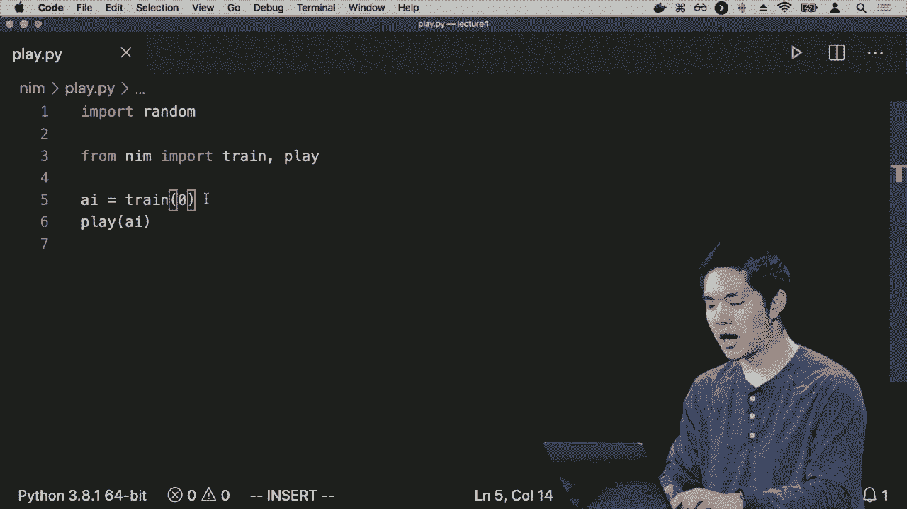
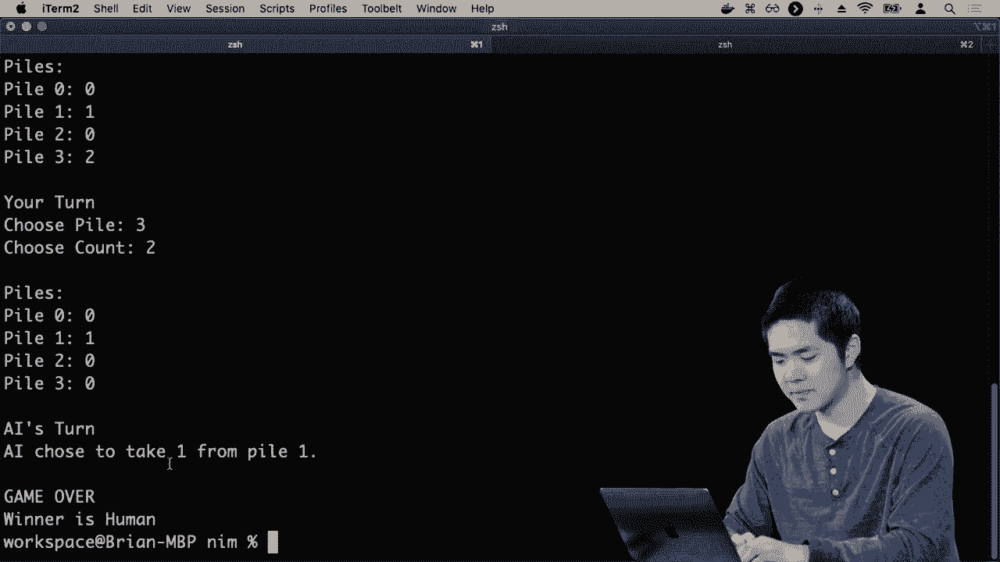
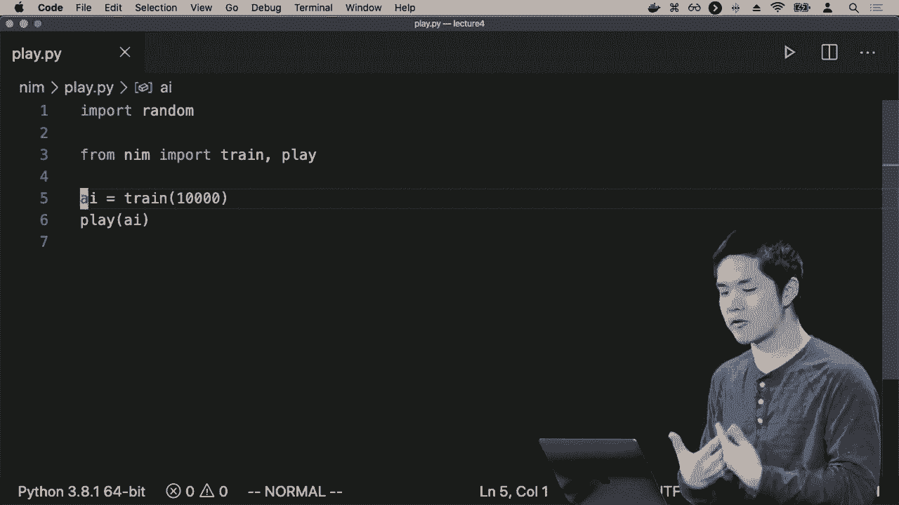
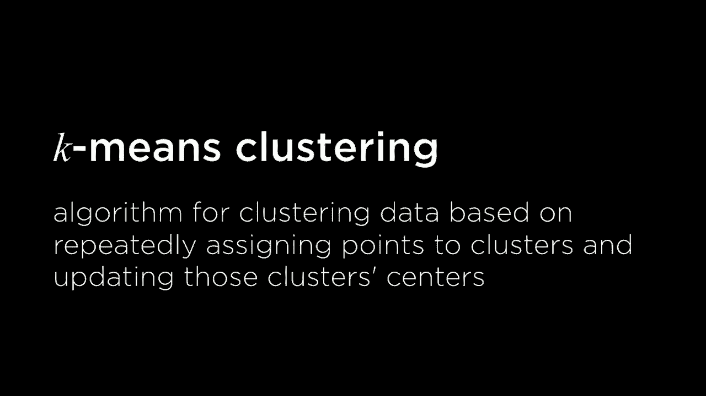
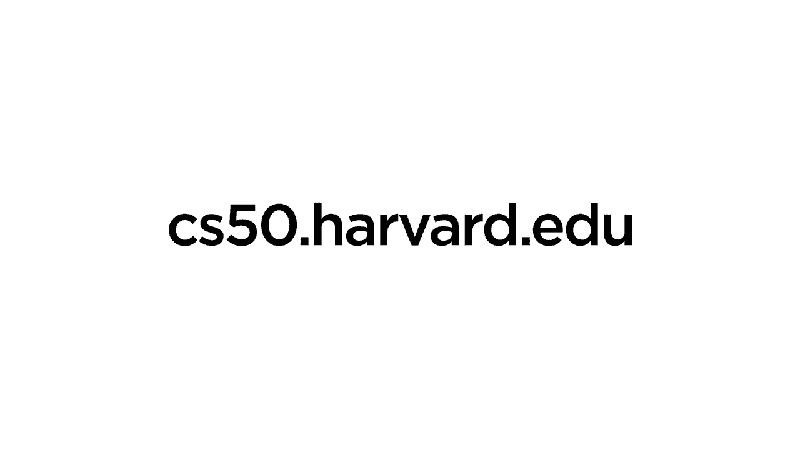

# 哈佛CS50-AI ｜ Python人工智能入门(2020·完整版) - P16：L4- 模型学习 3 (马尔可夫决策过程，Q学习，无监督，聚类) - ShowMeAI - BV1AQ4y1y7wy

学习未来该做什么和不该做什么，因此为了开始正式化这一点，我们首先需要正式化我们所说的状态和行动的概念，像往常一样，我们将这种世界形式化为一个被称为马尔可夫决策过程的东西，与。

你可能记得之前的马尔可夫链，但马尔可夫决策过程是一个我们可以用来为代理在其环境中做决策的模型，这是一个允许我们表示代理可以处于的各种不同状态的模型。

他们可以采取的行动以及采取一种行动与采取另一种行动的奖励是什么，那么这实际上是什么样子呢？如果你还记得马尔可夫链，从之前的马尔可夫链看起来有点像这样，我们有一大堆这些个体状态，每个状态立即过渡到。

另一个基于某些概率的状态，分布我们在之前天气的上下文中看到过。如果天气是晴朗的，我们说在某种概率下，第二天也只有在某种其他概率下才会是雨天。例如，我们也可以想象不再下雨，我们只有这些状态，其中一个状态。

根据某些概率分布会导致另一个状态，但在这个原始模型中，没有代理可以控制这个过程，完全是基于概率的，在某种概率下我们移动到这个下一个状态，但也许它会是某种其他状态。

概率现在我们将拥有的是代理在这个状态下选择一组行动的能力，可能与仅有一条前进路径不同，他们有三种不同的行动选择，每种选择都通向不同的路径。即便这也有些过于简化，因为在每个状态下，

在这些状态中，你可以想象更多的分支点，那里有更多的决策可以被采取，因此我们扩展了马尔可夫链，表示从一个状态你现在有可用的行动选择，而每个这些行动可能与其自身的概率分布相关联，去。

各种不同的状态，然后我们还会添加另一个扩展，每当你从一个状态采取行动进入另一个状态时，我们可以将奖励与这个结果相关联，表明R是正值，意味着某种正奖励，或者R是负值，意味着有某种形式的。

惩罚，这就是我们将考虑的马尔可夫决策过程。马尔可夫决策过程有一些初始状态的集合，我们可以处于这些状态中，我们有一些行动的集合，给定一个状态，我可以说在那个状态下有哪些可用的行动。

然后我们有一些转移模型。转移模型之前提到，给定我当前的状态，我到达下一个状态或另一个状态的概率是什么？转移模型现在有效地有两个条件：我们在说，给定我处于这个状态，并且我采取这个行动，我到达下一个状态的概率是什么。

也许我们生活在一个非常确定的神秘世界中，在这个马尔可夫决策过程中，给定一个状态和一个行动，我们可以确定会到达哪个下一个状态，但也许世界中存在一些随机性，当你采取行动并意识到受到惩罚和经历时。

当你处于一个状态并采取行动时，你可能不会总是回到完全相同的状态，可能还涉及一些概率。马尔可夫决策过程可以处理这两种可能情况，最后我们有一个通常称为R的奖励函数，它在这种情况下说明了什么。

在这个状态中，采取这个行动然后到达s'这个下一个状态的奖励，因此我在这个原始状态中，采取这个行动，我到达这个下一个状态，这个过程的奖励是什么？你可以在每次采取行动时将这些奖励加起来，得到总奖励。

代理可能从与特定环境的交互中获得的奖励，可以使用这个马尔可夫决策过程进行建模。那么这在实践中可能是什么样子呢？好吧，让我们在这里创建一个小模拟世界，我有这个试图导航的代理，这个代理是这个黄色点。

这里像一个在世界中试图穿越这个网格的机器人，最终它试图找到通往目标的路，如果它到达绿色目标，它就会得到某种奖励，但我们也可能会有一些红色方块，那是会受到惩罚的地方。

在某个我们不想要的地方，如果我们的代理到达了方块，它将会受到某种惩罚，但代理最初并不知道所有这些细节，它不知道这些状态与惩罚相关。但是也许它知道这个状态与奖励相关。

这并不意味着它必须与环境进行交互，以尝试弄清楚该做什么和不该做什么，因此，代理可能首先会在没有额外信息的情况下采取行动。如果它不知道惩罚是什么，也不知道奖励在哪里，它可能只是尝试采取某种行动。

那么它可能会学到，当你在将来处于这个状态时，不要采取这个向右移动的行动，这是一个错误的行动。在将来，如果你再次回到这个状态，就不要采取去奖励的行动。

当你处于这个特定状态时，因为那会导致惩罚。这可能是直觉，至少可以这么说，因此你可以尝试进行其他行动，你向上移动，好吧，那没有导致任何立即的奖励，也许可以尝试其他事情。然后也许再尝试其他事情，好的，现在你发现你得到了。

另一种惩罚，因此你从那次经历中学到了一些东西，所以下次你进行这个完整的过程时，你知道如果你最终处于这个状态，你不应该采取这种行动，因为处于这个状态并采取那个行动最终会导致某种惩罚，负面的结果。

换句话说，这个过程会重复，你可以想象让我们的代理探索世界，随着时间的推移学习哪些状态往往对应于糟糕的行动，并随着时间的推移学习哪些状态对应于糟糕的行动，直到最终如果它随机尝试足够多的事情，它可能最终会发现。

当你处于这个状态时，如果你采取向上的行动，可能会发现你实际上从中得到了奖励，而从中可以学到的是，如果你在这个状态下，你应该采取向上的行动，因为那会导致奖励，随着时间的推移，你还可以学到如果你在这个状态下。

应该采取左侧的行动，因为那会导致这个状态，这也让你最终得到奖励，因此你随着时间的推移开始学习，不仅哪些行动在特定状态下是好的，还学习哪些行动是不好的，这样一来，一旦你知道一系列好的行动会引导你走向某种结果。

我们的代理可以遵循这些指令，遵循它所学到的经验，我们没有告诉代理目标是什么，也没有告诉代理惩罚在哪里，但代理可以开始从这个经验中学习，并开始更好地执行这些任务。

未来，所以现在让我们尝试形式化这个想法，形式化这个我们想要能够在这个状态下学习的想法，采取这种行动是好事还是坏事。强化学习有很多不同的模型，今天我们只看其中一个模型，而我们要看的那个。

我们要看的方法称为 Q 学习，Q 学习的核心在于学习一个函数 Q，这个函数以状态 s 和行动 a 为输入，其中 s 是状态，a 是你在该状态下采取的行动，而这个 Q 函数将做的就是估算出奖励的值。

我在这个状态下采取这种行动能得到什么奖励，起初我们不知道这个 Q 函数应该是什么，但随着时间的推移，基于经验，基于尝试和观察结果，我想尝试学习任意特定状态 Si 和我可能采取的任意特定行动的 Q 值。

那么方法是什么呢？最初的方法是，我们将对所有状态s和所有动作a的Q的si设定为零。在我开始任何事情之前，或者在我拥有任何经验之前，我不知道在任何给定状态下采取任何行动的价值，所以我将假设所有价值都是零。

但是当我与世界互动时，当我经历奖励或惩罚，或者我去一个既没有奖励也没有惩罚的状态时，我希望以某种方式更新我对Q的si的估计。我希望不断更新我对Q的si的估计。

基于我所获得的经验、奖励和惩罚，使我在未来对什么动作是好的、什么状态会更好有了了解。当我们采取一个动作并获得某种奖励时，我想估计Q的si的新值，而这个估计是基于几个不同的因素。

我根据从这个动作中获得的奖励以及进入下一个状态时的奖励来进行估计，但假设情况并没有结束，假设我可能还会采取未来的其他动作，我还需要考虑预期的未来奖励。

与环境互动，有时你会采取行动并获得奖励。但随后你可以继续采取更多行动，并获得比这些更多的奖励。这两者都与当前我从这一步获得的奖励相关，也与我未来可能想采取的步骤相关。

可能会有这样的情况，我会想采取一个不立即导致奖励的步骤，因为我知道在未来这将导致更多的奖励。因此，代理体验的当前奖励和未来奖励之间需要找到一个平衡。

Q的si的值基于当前的奖励和预期的未来奖励。然后我们需要更新这个q函数，以考虑这个新的估计。现在在我们经过这个过程时，我们已经有了一个我们认为的价值的估计，现在我们有了一个新的估计。

我们需要将这两种估计结合起来，我们将查看更正式的方法来实际开始这样做。为了向你展示这个公式的样子，这里是我们将采用的q-learning方法。我们将再次从Q的SN开始，a在所有状态下都等于0。

然后每次我们在状态s下采取一个动作a并观察到奖励R时，我们将更新我们的价值估计，Q的Si。这个想法是，我们将弄清楚新的价值估计减去我们现有的价值估计。

在这个状态下采取这个动作的期望也许是我们当前认为的价值是 10，但我们现在将估计我们认为的价值，也许新的价值估计是像 20 这样的东西，因此我们的新价值估计比我们。

当前的值估计恰好在这里，我们需要决定我们想要调整我们当前的期望，这个动作在这个特定状态下的价值是什么，这个差异是我们增加或减少多少我们对预期价值的看法。

依赖于这个参数 alpha，也叫学习率，alpha 实际上表示我们对新信息的重视程度与我们对旧信息的重视程度之间的关系。alpha 值为 1 意味着我们真的重视新信息，但如果我们有一个新的估计，那么旧的估计就无关紧要。

我们只考虑我们的新估计，因为我们总是只想这样做。不能考虑我们的新信息，所以这工作的方式是。如果你想象 alpha 为 1，那么我们就取 Q 的旧值，然后加上 1 乘以新值减去旧值，这样就只剩下。

所以当 alpha 为 1 时，我们只考虑我们的新估计是什么，但随着时间的推移，随着我们经历很多经历，我们已经有一些现有信息，我们可能已经尝试过这个动作九次，而现在我们只是在第十次尝试，而且我们不想。

考虑这个帐篷体验，我还想考虑我之前九次体验的事实，这对我来说是有意义的，而这些数据我不一定想丢失。因此，alpha 控制这个决策，控制新信息的重要性，零则意味着忽略所有新信息。

信息只是保持这个 Q 值不变，这意味着完全用新信息替换旧信息，而在这两者之间保持某种平衡。我们可以更正式地将这个方程表达为，旧值估计是我们对。

在特定状态下采取这个动作的价值，这就是 Q 的意思。所以我们在这里有一次，我们要增加一些东西，我们将添加 alpha 乘以新价值估计减去旧价值估计，但旧价值估计我们只需通过调用这个 Q 函数来查找。

基于我们刚刚采取的这个经验的新价值估计是什么，在这个特定状态下采取这个动作的价值的新估计将由两个部分组成。它将由我在这个状态下采取这个动作获得的奖励组成，然后它将。

我可以从这一点开始期望未来的奖励是什么。因此，这将是我现在获得的总奖励，加上未来我将获得的*奖励*，我怎么估计将来会获得什么呢？这有点像对这个Q函数的另一次调用。

我将从所有可能的下一步行动中选取最大值，看看在所有这些可能的行动中，哪一个会有最高的奖励。因此这看起来有点复杂，这将是我们进行这种更新的概念。

然后我有一些旧的估计，估计采取这一行动在该状态下的价值。我将根据我经历的新信息更新它。我预测我将获得的未来奖励是什么，并且利用这一点更新我对采取此行动的*奖励*的估计。

在这个特定状态下，您可能还会对这个算法进行其他补充，有时候可能并不是所有的未来奖励都与当前奖励同等重要，也许你想要一个代理，重视现在的奖励而不是稍后的奖励。因此，有时您甚至可以在这里添加另一个项。

一个参数是折现未来的奖励，认为未来的奖励没有当前奖励那么有价值。在当前时间步获得奖励比等待一年后再获得奖励要好，但这要由程序员决定这个参数应该是什么。

这个公式的总体思路是说，每当我们经历一些新的奖励时，我们会考虑这一点，更新我们对这一行动有多好的估计。然后在未来，我们可以基于该算法做出决策，一旦我们对每个状态和每个行动都有了较好的估计。

如果我们知道采取这一行动的价值，那么我们可以做一些事情，比如实施一个贪婪决策政策。如果我处于某个状态，想知道在这个状态下应该采取什么行动，那么我会考虑所有可能的行动，看看Q(s, a)的价值是什么。

在该状态下采取这一行动，我将只选择在评估那个表达式后具有最高值的行动。所以我选择了具有最高值的行动，这告诉我在我处于的任何给定状态下，我应该采取什么行动，我可以贪婪地说在我所有的行动中。

这个行动给我带来最高的期望值，因此我会选择这个行动作为我采取的行动。但这种方法有一个缺点，缺点出现在这样的情况下：我们知道存在某种解决方案可以带我到达奖励。

但这不一定是最佳方式或最快方式，如果代理允许多探索一点，可能会发现通过某条其他路线获得奖励的速度更快，而不是通过这条特定的路径，这是更快到达最终目标的方式，或许我们想要。

代理也能找出这一点，但如果代理总是采取它知道的最佳动作，当它到达这个特定方格时，它并不知道这是一个好动作，因为它从未真正尝试过，但它知道向下走最终会引导它。

这个奖励，因此将来可能学到的就是它应该总是选择这条路线，而不会探索并走这条路线。因此在强化学习中，探索与利用之间存在这种紧张关系，而利用通常指的是使用AI所掌握的知识。

AI已经知道这是一个导致奖励的动作，因此我们会使用该动作，探索就是关于探索其他可能我们之前没有充分探索的动作，因为这些动作中的一个，即使我对此一无所知，也可能导致更好的结果。

更快地获得奖励或未来获得更多奖励，因此一个仅仅利用信息而不进行探索的代理可能能够获得奖励，但它可能无法最大化其未来，因为它不知道还有其他可能性，这些可能性只能通过利用探索来了解。

那么我们如何尝试解决这个问题呢？一个可能的解决方案称为epsilon贪婪算法，我们设定epsilon为我们希望多频繁随机选择一次，有时我们会随机选择一次，以便说“让我们尝试探索，看看会发生什么”，然后。

算法的逻辑将是以概率1减去Epsilon选择估计的最佳动作，在贪婪情况下，我们总是选择最佳动作，但在epsilon贪婪中，我们大多数时间会选择最佳动作，或者有时会以概率Epsilon选择最佳动作。

所以我们将选择一个随机动作，因此每次面临采取行动的能力时，有时我们会选择最佳动作，有时我们只会选择一个随机动作，因此这种类型的算法在强化学习背景下可能非常强大，而不仅仅是。

选择现在可能的最佳动作，但有时，尤其是在早期，允许自己进行随机移动，让你探索各种不同的可能状态和动作，随着时间的推移，你可能会逐渐减少Epsilon的值，更频繁地选择最佳动作。

你更有信心已经探索了所有可能性，所以我们可以将其付诸实践，强化学习的一个非常常见的应用是在游戏中，如果你想教一个代理如何玩一个游戏，你只需让代理玩这个游戏很多次，然后奖励信号会在游戏结束时发生。

当游戏结束时，如果我们的 AI 赢得了游戏，它会获得像 1 这样的奖励，例如，如果它输了游戏，它会得到负 1 的奖励，基于此，它开始学习哪些行动是好的，哪些行动是坏的，你不必告诉 AI 什么是好，什么是坏。

不好的结果，但是 AI 会根据这个奖励来判断，赢得游戏是某种信号，输掉游戏也是某种信号，基于所有这些信息，它开始弄清楚应该做出什么决策。一个你可能玩过的非常简单的游戏是 NIM，在 NIM 游戏中。

你有一堆物体和许多不同的堆，这里我将每个堆表示为一个独立的行，所以你在第一堆有一个物体，在第二堆有三个物体，在第三堆有五个物体，在第四堆有七个物体，NIM 游戏是一个双人游戏，玩家轮流进行。

从堆中移除物体的规则是，在任何给定的回合，你可以从这些堆中的任意一个移除任意数量的物体，任意一行你必须至少移除一个物体，但你可以从其中一个堆中移除任意数量的物体，而谁移走最后一个物体。

所以玩家一可能会从这个堆中移除四个物体，玩家二可能会从这个堆中移除四个物体，现在我们还有四堆，分别是三、一个和三，玩家一可能会从第二堆中移除全部物体，玩家二如果策略得当，可能会移除全部，或者只移除部分。

从第三堆中移除两个，现在我们还有三堆，每堆剩下一个物体，玩家一可能从一堆中移除一个物体，玩家二从另一堆中移除一个物体，现在玩家一剩下的选择是从最后一堆中选择这个物体，玩家一在此时输掉了游戏，所以这是一个相当简单的游戏。

物体的堆，每次轮到你选择从一个堆中移除多少个物体，移除最后一个物体的人会输掉，这是一种你可以相对容易地编码成 AI 的游戏，因为状态实际上只是四个数字。每个状态就是四个堆中每个堆的物体数量。

行动是指我将从每一个个别堆中移除多少个物体，而奖励则发生在最后，如果你是那个必须移除最后一个物体的玩家，那么你会受到某种惩罚，但如果你不是，另一个玩家必须移除最后一个物体，那么你就会获得奖励。

一种奖励，因此我们实际上可以展示这一点。我已经实现了一个AI来玩NIM游戏。好吧，所以我们要做的是创建一个AI，通过训练该AI进行一些场次的游戏，让AI与自己对战，想法是AI将会。

在与自己对战的游戏中学习，从每一次经历中学习，了解未来该怎么做，然后我作为人类将与AI对战。所以最开始我们说训练零次。

这意味着我们不会让AI与自己进行任何练习游戏，以便从它的经验中学习，我们只会看看它表现得多好。看起来有四堆，我可以选择从其中任何一堆中移走多少物品。所以，也许我会从三堆中移走五个物品。

例如，我选择从零堆中拿走一个物品，所以我现在留下这些堆。在这里，我可能会选择从二堆中移除所有五个物品。AI选择从一堆中移走两个，现在我剩下的有一堆只有一个物品。

一堆有两个物品的堆，所以从三堆中我将移走两个物品，现在我让AI没有选择，只能拿走最后一个。

直到游戏结束，我才能赢，但这是因为AI实际上是在随机玩，它没有任何先前的经验来进行这些判断。现在让我让AI自己训练，大约进行一万场游戏，我会让AI玩一万场游戏。

在每次NIMH对战中，无论是赢还是输，它都会从中学习。

从这个经验中学习，未来该怎么做，未来不该做什么。接下来我将再次运行这个程序，现在你看到AI正在进行大量的训练游戏，大约一万场与自己对战的训练游戏。现在它将让我做这些决定，所以现在我准备好玩。

在与AI对战时，也许我会从三堆中移走一个物品，AI则从三堆中移走所有物品，因此我剩下三堆。然后我会继续从二堆中移走三个物品，而AI从零堆中移走一个物品，留下两堆，每堆各有两个物品。我会从中移走一个物品。

我想是从一堆中，AI从二堆中拿走两个，留下我没有选择，只能从一堆中移走一个物品。因此，看起来在玩了一万场NIMH游戏之后，AI已经学会了一些关于哪些状态和哪些动作是好的，并开始学习一些预测模式。

行为在任何给定状态下会是什么好的，什么行为会是坏的。因此，强化学习可以是一种非常强大的技术，用于实现这些类型的游戏代理，这些代理能够通过学习经验玩得很好，无论是对抗其他人还是。

通过与自己对弈并从那些经验中学习，现在NIM是一个相对简单的游戏，适合用于强化学习，因为状态太少，只有状态数等于这些不同堆中对象的数量。你可能想象。

如果你想到像棋类游戏这样的游戏，或者有很多状态和许多你可以想象的动作，那将会更难。对于每个状态和每个动作学习其值并不容易。因此，通常在这种情况下，我们无法。

不一定要准确学习每个状态和每个动作的值。但我们可以近似，就像我们在极小化中看到的那样，我们可以使用深度限制的方法在某个时间点停止计算。我们可以做一种称为函数近似的类似类型的近似，在强化学习上下文中，而不是。

学习每个状态和每个动作的Q值，我们只是有一些函数来估计在这个特定状态下采取这个动作的值，这可能基于该状态的各种不同特征。代理所处的环境，你可能必须。

选择这些特征究竟是什么，但你可以开始学习一些模式，这些模式超越一个特定的状态和一个特定的动作。你可以开始学习某些特征是否倾向于是好的事情或坏的事情。强化学习允许你，使用非常，类似的机制来超越。

某个特定状态并说如果这个，其他状态看起来有点像这样。那么，可能在一个状态下有效的，类似类型的行为也会在另一个状态下。随着你开始处理存在于的强化学习，这种方法可能会非常有帮助。

较大且越来越大的状态空间，其中探索所有可能存在的状态并不可行。因此，强化学习的两个主要类别是，有监督学习，即你有标记的输入和输出对，以及强化学习，即一个代理。

从奖励或惩罚中学习，它接收的机器学习的第三个主要类别，我们将简要触及，称为无监督学习。无监督学习发生在我们有数据而没有任何额外反馈，没有标签的情况下，在有监督学习的情况下则是。

我们的数据有标签，我们对数据进行标记，标记是否为下雨天。或者不是下雨天，使用这些标签，我们能够推断出模式，钞票。并且利用这些标签，我们能够，推导出推论和模式，以判断钞票的样子，与非钞票在无监督学习中的区别。

我没有访问任何这些标签的权限，但我们仍然希望学习一些模式。在无监督学习中，你可能想要执行的任务之一就是聚类，聚类只是一个任务，如果给定一组对象，将其组织成不同的簇。

一组相似的对象，有很多聚类的应用，它出现在基因研究中，你可能有许多不同的基因，而你想将它们聚类为相似的基因。如果你尝试分析整个种群或跨物种，它。

在图像中，如果你想将，图像的所有像素进行聚类，并且在图像的不同部分，会出现很多市场研究。如果你想将消费者，分成不同的组，以便知道哪些，组应该以某些类型的产品广告为目标。

在其他许多上下文中，聚类也非常适用。一种聚类技术是，称为K均值聚类的算法。K均值聚类将会，做的是将我们的所有数据点划分为K个不同的簇，并通过重复来实现。

将点分配给的过程。

然后在这些簇的中心移动，我们将通过中心来定义一个簇，簇的中间，然后根据哪个中心离该点最近，将点分配给该簇，我现在给你一个示例，例如我有一大堆。

无标签数据只是各种在某种图形空间中的数据点。我想将它们分组为不同的簇，但我最初不知道如何做到这一点，假设我想给这个组分配三个簇，你必须选择你想要的簇的数量。

K均值聚类可以尝试多次，查看这些值的表现，但我将先随机选择一些位置，来放置这些簇的中心，可能我有一个，蓝色簇，一个红色簇和一个绿色簇，我将从这三个位置开始，作为这些簇的中心。

K均值聚类告诉我们做的是，一旦我有了簇的中心，就要根据哪个簇的中心离每个点最近，来将每个点分配给一个簇，因此我们最终得到类似这样的结果，所有这些点都更靠近，蓝色簇的中心，而不是其他。

聚类中心，这里所有的点距离绿色聚类中心比任何其他聚类中心都更近，然后这两个点加上这边的这些点都是离红色聚类中心最近的。因此，这里是将所有这些点分配到三个不同聚类的一种可能方式。

这并不是很好，因为在这个红色聚类中，这些点似乎有点分散，而在这个绿色聚类中，这些点也有点分散，这可能不是我理想的聚类方式来处理这些不同的数据点，但k均值聚类是一个迭代过程，完成这一步之后。

还有下一步，那就是在我将所有点分配到离它最近的聚类中心后，我们将重新确定聚类，意味着将这些菱形的聚类中心移动到该聚类中所有点的中间或平均值。

所以我们将这个蓝点和蓝色中心移动到分配给蓝色聚类的所有点的中心，稍微向右移动，在这种情况下，我们对红色做同样的事情，将聚类中心移动到这些点的中间，按数量加权。

这里有更多的点，所以红色中心会向那边移动一点，同样，绿色中心在这边的点也更多，因此绿色中心会稍微向这个方向移动，因此我们重新确定所有聚类的中心。

然后我们重复这个过程，现在重新分配所有点到它们最近的聚类中心，现在因为我们已经移动了聚类中心，这些聚类分配可能会改变，原本这个点是离红色聚类中心最近的，但现在。

它实际上离蓝色聚类中心更近，这个点也是如此，而这三个最初离绿色聚类中心更近的点，现在则离红色聚类中心更近，因此我们可以重新分配这些数据点属于哪个聚类。

再次重复这个过程，将每个聚类的均值从聚类的中心移动到所有其他点的均值，并再次重复这个过程，继续将每个点分配到离它们最近的聚类，因此一旦我们达到一个点。

将所有点分配到离它们最近的聚类，并且没有变化，我们达到了某种平衡状态，在这种情况下没有点改变其归属，因此我们可以宣布这个算法现在结束，我们现在有了每个点的分配。

将数据分为三个不同的集群，看起来我们在识别哪些点彼此更相似而不是与其他组的点相似方面做得相当不错。因此我们有了下方的绿色集群、这里的蓝色集群，以及那边的红色集群，我们在没有。

我们并没有任何标签来告诉我们这些不同的集群是什么，而是以无监督的方式使用算法，来确定哪些点属于哪些类别，再次强调，这种聚类技术有很多应用，且还有更多。

在机器学习的不同领域中，**D'Andrea**、**Foresman**所提到的监督与非监督算法是许多基础性大局观念的组成部分，这些理念支撑着我们要解决的许多问题。

使用多种不同的方法尝试从数据中学习模式，无论是寻找相似的邻近数据点，还是试图最小化某种损失函数，或其他许多技术，这些都使我们开始尝试解决这些问题。

然后我们看看一些现代机器学习的基础原则，这种能力是从数据中学习，以便计算机可以执行任务，即使没有明确的指令来做到这一点，下次我们将继续这个主题。

关于机器学习的对话，探索我们可以使用的其他技术。
