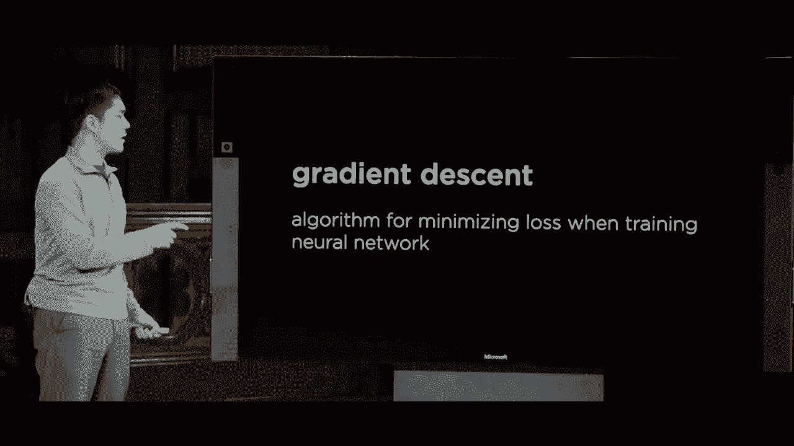

# 哈佛CS50-AI ｜ Python人工智能入门(2020·完整版) - P17：L5- 神经网络 1 (神经网络，激活函数，梯度下降，多层网络) - ShowMeAI - BV1AQ4y1y7wy

[音乐] 好的，欢迎大家回到《Python人工智能导论》。上次我们看到了机器学习，这是一组计算机可以用来处理数据并学习数据内模式的技术，学习如何执行任务，即使我们程序员并没有。

给计算机明确的指令，说明如何执行这个任务，今天我们转向机器学习中最流行的技术和工具之一——神经网络，神经网络早在1940年代就受到研究人员的启发，他们思考人类是如何学习的。

学习人类神经科学的大脑，并尝试看看我们是否可以将这些相同的思想应用于计算机，模拟计算机学习以人类学习为基础。那么，大脑是如何结构的呢？简单来说，大脑由许多神经元组成，这些神经元相互连接。

这些神经元以某种方式相互交流，特别是如果你考虑生物神经网络的结构，科学家们观察到了一些关键特性。其中之一是这些神经元彼此连接，并接收来自其他神经元的电信号。

一个神经元可以将电信号传播给另一个神经元，另一个要点是神经元处理这些输入信号，然后可以被激活，神经元在某个时刻被激活，随后可以向其他神经元传播进一步的信号。

问题随之而来，我们能否将这种人类如何用大脑和神经元学习的生物学理念应用于机器，设计出一个人工神经网络（ANN），这将是一个受到这些生物神经网络启发的学习数学模型。

网络以及人工神经网络将允许我们做的事情是，它们首先能够模拟某种数学函数。每次你查看神经网络时，我们今天稍后会看到，它们实际上只是将某些输入映射到特定输出的数学函数。

基于网络的结构输出，取决于我们在神经元内部放置的特定单元的位置。

网络将决定网络如何功能，特别是人工神经网络将让我们学习网络参数应该是什么，我们稍后将深入探讨，但实际上我们想要模拟的是网络结构。

使我们能够容易地得到一些代码，以便网络能够确定如何建模给定特定输入数据的正确数学函数，因此为了创建我们的人工神经网络，不使用生物神经元，我们将使用我们要使用的。

在神经网络内部称为单位的单元，我们可以把它表示为图中的一个节点，这里用一个蓝色圆圈来表示。像这样，这些人工单元，这些人工神经元可以彼此连接，因此这里，例如，我们有两个单元。

通过这个边连接在这个。

有效地表示图形，所以我们现在要做的是将这个想法视为某种从输入到输出的映射，因此我们有一个单元，它连接到另一个单元，我们可以把这边看作输入，那边看作输出，我们试图做的是弄清楚如何解决。

一个问题是如何建模某种数学函数，这可能以我们之前看到的形式出现。

时间上，输入有变量x1和x2，给定这些输入，我们想要执行某种任务，比如预测是否会下雨，理想情况下，我们希望有某种方式，基于这些输入x1和x2，它们代表与之相关的某种变量。

天气，我们希望能够预测，在这种情况下是布尔分类，它会下雨还是不会下雨，我们上次通过一种数学函数来完成这一点，我们为我们的假设函数定义了某个函数H，它以x1和x2作为输入，这两个输入我们。

关注处理，以确定我们是否认为会下雨，或者我们认为不会下雨，问题变成了这个假设函数如何做出这个判断，我们上次决定使用这些的线性组合。

输入变量，以确定输出应该是什么，因此我们的假设函数等于像这样的东西，权重0加权重1乘以x1，加权重2乘以x2，因此这里发生的事情是x1和x2。这些是输入变量，输入到这个假设函数中。

这些输入变量正在被某些权重相乘，这些权重只是一些数字，因此x1被乘以权重1，x2被乘以权重2，而我们有这个，等等，零并没有被输入变量相乘。它只是用来移动函数的值。

向下看，你可以把它视为一个权重，它只是与某个虚拟值相乘，比如数字1，它乘以1，因此没有被乘以任何东西，或者有时在文献中，人们称这个变量权重0为偏差，因此你可以将这些变量视为。

略有不同的是，我们有权重乘以输入，然后单独将某些偏差加到结果中，你会听到在谈论神经网络和机器学习时使用这两种术语，因此实际上我们在这里做的就是为了定义一个。

对于假设函数，我们只需要决定和计算这些权重应该是什么，以确定将哪些值乘以我们的输入，从而得到某种结果，当然在这一切的最后，我们需要进行某种分类，比如**下雨或不下雨**，为此我们使用某种方法。

这定义了一种阈值，我们看到例如**阶跃函数**的定义是，如果将权重与输入相乘的结果至少为零，则定义为 1，否则为零，你可以将这条中间的线看作是一条虚线。

它在达到一个点之前保持在零，然后函数在达到某个阈值后跳跃到 1，因此在到达某个阈值之前为零，然后在达到特定阈值后为 1。

因此，这是一种我们可以定义**激活函数**的方法，激活函数决定何时其输出变为活跃，变为 z1 而不是零，但我们也看到，如果我们不想要纯粹的二元分类，不希望只是 0 或 1，而是想要。

为了允许一些介于真实、编号值之间的值，我们可以使用不同的函数，有很多选择，但我们关注的是**逻辑 sigmoid 函数**，它呈现一种 S 形曲线，我们可以将其表示为一个概率，也许在这之间的某个地方。

比如雨的概率为 0.5，也许稍后雨的概率是 0.8，因此与其仅有 0 或 1 的二元分类，我们可以允许介于这之间的数值，结果显示有许多不同类型的激活函数，激活函数仅仅是输出某种函数。

将权重相乘，加上偏差，然后确定实际输出，另一个流行的函数是**整流线性单元**，也称为 relu，运作方式是它取其输入与 0 的最大值，因此如果它是正值，它保持。

依然保持不变，但如果它为 0 或负值，则将其平滑到零，还有其他激活函数可供选择，但简而言之，每个激活函数可以看作是应用于所有计算结果的函数，我们取某个函数 G。

并将其应用于所有计算的结果，这就是我们上次看到的定义某些假设函数的方法，该函数接收输入，计算这些输入的某种线性组合，然后通过某种激活函数得到输出，这实际上。

事实证明，这是最简单的神经网络模型，我们将用这样的结构来图形化表示这个数学概念，作为一个有两个输入的神经网络，我们可以把这看作是 x1 和 x2，然后有一个输出，你可以认为。

例如，判断我们是否认为会下雨，在这个特定实例中。那么这个模型到底是如何工作的呢？这两个输入代表我们的输入变量 x1 和 x2，注意这些输入通过这些边连接到这个输出。

将通过他们的权重来定义这些边，每条边都有一个权重，权重 1 和权重 - ，然后这个输出单元将根据这些输入和权重计算输出，这个输出单元将所有输入相乘。

他们的权重中添加这个偏置项，你可以把它看作是一个额外的 w0 项，然后我们通过激活函数传递它。因此，这只是一个图形化表示上次我们看到的同样想法的数学形式，我们将称之为一个非常简单的神经网络。

我们希望这个神经网络能够学习如何计算我们想要的某个函数，而神经网络将学习 w0、w1 和 w2 的值应该是什么。激活函数应该是什么，以获得我们想要的结果。

我们可以看看这个示例，实际上是一个非常简单的函数，我们可能会计算，如果我们回顾一下在命题逻辑中，我们看到的最简单的函数之一就是类似于或函数的，它接受两个输入 X 和 y 并输出一个。

当任一输入或两个输入都是 1 时，这被称为真；而当两个输入都是 0 时，输出为 0，即假。因此，这就是或函数，而这是或函数的真值表，只要任一输入为 1，函数的输出就是 1，唯一的情况是输出。

当两个输入都是 0 时，输出为 0。那么问题是，我们如何能够训练一个神经网络以学习这个特定的函数？那些权重会是什么样子呢？我们可以这样做，这是我们的神经网络，我提议为了计算或函数。

我们将为每个权重使用值 1，并将使用负 1 作为偏置，然后我们将使用这个阶跃函数作为我们的激活函数。那么这如何运作呢？如果我想计算 0 或 0，显然结果是 0，因为假或假为假，那么我们该怎么做呢？

我们的输出单元将计算这个输入乘以权重，0 乘以 1 是 0，同样，这里 0 乘以 1 也是 0，我们还会加上偏置负 1，所以我们得到的结果是负 1，如果我们将其绘制在激活函数上，负 1 在这里，处于阈值之前。

这意味着要么是 0，要么是 1，只有在阈值之后，因为负 1 在阈值之前，这个单元提供的输出将是 0，这就是我们期望的，0 或 0 应该为 0。如果我们改为 1 或 0，这个数字是 1，那么在这种情况下，为了计算超出阈值的值，输出将是 1。

输出将是我们再次需要做加权和，1 乘以 1 是 1，0 乘以 1 是 0，到目前为止的总和是 1，加上负 1，那么输出为 0，如果我们将 0 在阶跃函数上绘制，0 就在这里，正好在阈值上，输出将在这里为 1。

因为输出为 0 或 1，这就是我们所期望的结果，再举一个例子，如果我有 1 或 1，结果会是什么呢？嗯，1 乘以 1 等于 1，1 乘以 1 也是 1，加起来是 2，我再加上偏置项，得到的数是 1，1 在这个图表上的位置非常远。

输出总是 0 或 1，取决于我们是否超过了阈值，因此这个神经网络建模了或函数，虽然是一个非常简单的函数，但仍能正确建模，如果我给它输入。

将告诉我 x1 或 x2 的值是什么，你可以想象尝试对其他函数做同样的事情，例如与函数，它接受两个输入并计算是否 x 和 y 都为真，所以如果 X 为 1 且 Y 为 1，则 X 和 Y 的输出为 1，但在所有其他情况下，输出为 0。

我们如何在神经网络中建模这一点呢？事实证明，我们可以以相同的方式进行，除了将偏置从负 1 改为负 2。那么结果看起来会是什么呢？如果我有 1 和 1，应该为 1，因为真和真等于真。

取 1 乘以 1 是 1，1 乘以 1 是 1，到目前为止总和为 2，现在我加上偏置负 2，得到的值是 0，而 0 在激活函数上绘制时正好超过那个阈值，因此输出为 1。但如果我添加其他输入，例如 1 和 0，权重会是什么？

这些和是1加0，它将是1减2，结果为负1，而负1未通过阈值，因此输出将是0。因此，这些是我们可以使用具有两个输入和一个输出的神经网络来建模的一些非常简单的函数，我们的目标是。

为了确定这些权重应该是什么，以便确定输出应该是什么，你可以想象将其推广到计算更复杂的函数，比如给定湿度和压力，我们想计算下雨的概率。

例如，我们可能想做一个俄罗斯风格的问题，给定一些广告量和当前的月份，也许我们想预测该月份的预期销售额，因此你可以想象这些输入和输出也是不同的，结果表明。

在某些问题中，我们不仅会有两个输入，而这些神经网络的好处在于，我们可以将多个单元组合在一起，使我们的网络更复杂，仅通过向这个特定的神经网络添加更多单元。因此，我们正在查看的网络有两个输入和一个输出。

但我们同样可以轻松地说，继续添加三个输入，或有更多输入，我们可以任意决定有多少个输入到我们的问题中，所有这些都将计算我们关心的某种输出，如何进行数学运算。

输出方式与两个输入的情况非常相似，我们有两个权重，通过这些边表示，并将权重与数字相乘，添加这个偏差项，在其他情况下我们也会做同样的事情，如果我有三个输入，你可以想象将每个输入相乘。

对这三个输入的每个权重进行运算，如果我有五个输入，我们会在这里做同样的事情，我说从1到5求和，将每个输入变量乘以其对应的权重，然后将偏差添加到结果中，这就是一个情况。

例如，这个内部网络有五个输入，但我们可以在这个神经网络中有任意多个节点，每次我们只需将所有输入变量乘以它们的权重求和，然后在最后添加偏差项。

这使我们能够表示具有更多输入的问题，只需通过增大神经网络的规模。接下来我们可能会问一个关于如何训练这些神经网络的问题，在“与”函数和“或”函数的情况下，它们都简单得多。

我可以告诉你一些函数，比如这里的权重应该是什么，而你自己。权重应该如何设置，以便计算你想要的输出，但一般来说，像预测销售或预测是否会下雨这样的函数，都是更棘手的函数。

我们希望计算机有某种机制来计算权重应该如何设置，以便我们的神经网络能够准确建模我们关心的函数。结果证明，进行这项工作的策略受到了微积分领域的启发。

这是一种称为梯度下降的技术。

梯度下降是一种用于最小化损失的算法，尤其是在训练神经网络时。

回想一下，损失是指我们的假设函数有多糟糕。我们可以定义某些损失函数，之前我们看到了一些损失函数的例子，它们给我们一个数字，表示任何特定假设模型数据的效果如何，有多少例子被错误分类，它们的表现如何。

与我们可能定义的其他假设函数相比，它更差或稍微好一点，这个损失函数只是一个数学函数。当你在微积分中有一个数学函数时，你可以计算一些被称为梯度的东西，你可以把它想象成斜率。

在任何特定点，损失函数的方向在移动，告诉我们应该如何调整这些权重，以最小化损失量。一般来说，我们不会深入讨论微积分，但梯度下降的高层次思想看起来是这样的。

如果我们想要训练一个神经网络，我们将先随机选择权重，为神经网络中的所有权重随机选取，然后我们将使用我们可以访问的输入数据来训练网络，以便找出什么。

权重实际应该是什么，因此我们将一遍又一遍地重复这个过程。第一步是根据所有数据点计算梯度，我们将查看所有数据并找出当前权重设置下的梯度。

这意味着我们应该朝哪个方向移动权重，以最小化总的损失，使我们的解决方案更好。一旦我们计算出梯度，确定应该朝哪个方向移动损失函数，我们就可以根据梯度更新权重，采取一个小的步骤。

向这些权重的方向迈出一步，以试图使我们的解决方案稍微更好，而我们迈出的步伐大小会有所不同。你可以在训练特定神经网络时选择这个步伐，但简而言之，这个想法是基于所有数据点进行确定。

这些数据点中权重应该朝哪个方向移动，然后在那个方向上小步移动权重。如果你不断重复这个过程，逐渐调整权重，最终你应该能得到一个相当好的解决方案。

至少这是我们希望发生的事情，现在如果你看看这个算法，任何时候分析一个算法都要问一个好问题：进行计算时最昂贵的部分是什么？什么需要大量工作来搞清楚，什么将会很昂贵。

特别是在梯度下降的情况下，真正昂贵的部分是所有数据点的部分。在这里，需要使用所有的数据点来确定在所有权重的特定设置下梯度的值，因为在大数据集中这种情况的概率很高。

在机器学习问题中，当你试图解决一个有大量数据的大问题时，你有很多数据点。在计算和确定基于所有这些数据点的梯度时将是昂贵的，而且你需要多次进行这个过程。

一遍又一遍地查看所有数据点，反复进行小步伐，试图找出那些权重的**最佳设置**是什么。事实证明，我们理想情况下希望能够更快地训练我们的神经网络，以便更快地收敛到某种解决方案。

这将是一个良好的解决方案，因此在这种情况下，有比标准**梯度下降**更好的选择，后者一次性查看所有数据点。我们可以采用像**随机梯度下降**这样的方法，它将随机选择一个数据点来计算梯度。

基于所有数据点的计算，因此这里的想法是我们有一些权重设置，我们选择一个数据点，并基于那个数据点确定应该如何调整所有权重，并在那个小方向上移动权重，然后再选择另一个数据点并这样做。

再次重复这个过程，可能多次查看每个数据点，但每次只使用一个数据点来计算梯度，以确定我们应该朝哪个方向移动。现在，仅使用一个数据点而不是所有数据点，可能会使我们得出的结论不够准确。

这是对梯度的估计，但从好的一面来看，基于一个数据点计算梯度将会更快，而不是基于所有数据点进行计算，并且一次又一次地进行所有计算工作。

在查看所有数据点与仅查看一个数据点之间存在权衡，结果表明，一个也相当流行的中间选择是称为小批量梯度下降的技术，其中的理念是与查看所有数据相比，仅查看一个数据点。

我们将数据集分成小批量的数据点组。你可以决定每个批次的大小，但简而言之，你只是会在任何给定时间查看少量的数据点，希望能够更准确地估计梯度，同时也不需要所有的计算。

计算每一个数据点所需的计算量是巨大的。因此，梯度下降是一种我们可以用来训练神经网络的技术，以便确定所有权重的设置，如果我们想要某种方式来获得准确的概念。

这个函数应该如何工作，以及如何建模将输入转换为特定输出的方式。目前我们查看的网络结构都类似，我们有一些输入，可能是两个、三个、五个或更多，然后我们有一个输出。

但在机器学习问题中，我们通常不仅关心一个输出，而是可能关心一个与多个不同值相关的输出。因此，正如我们可以取一个神经网络并添加单元一样。

输入层，我们同样可以在输出层添加输入或输出。除了一个输出外，你可以想象我们有两个输出，或者我们可能有四个输出，例如，在每种情况下，随着输入或输出的增加，如果我们希望保持这个网络的完全连接。

这两个层我们只需要添加更多的权重，现在每个输入节点都有四个权重与四个输出相关联，并且对这些不同的输入节点都是如此，因此随着节点的增加，我们添加更多的权重，以确保每个输入都能以某种方式。

与每个输出相连接，以便每个输出值可以根据输入的值进行计算。我提到过，为什么我们想要多个不同的输出值的情况，比如天气预测。例如，我们可能不仅仅是在预测雨或不雨，或者只是预测一个特定的值。

无论是下雨还是不下雨，可能会有多种不同的天气类别，我们希望将天气分类为单一的输出变量，我们可以进行二元分类，例如下雨或不下雨（1或0），但这并不能让我们做到更多。

对于多个输出变量，我可能能够使用每一个来预测一些略有不同的内容，可能我想将天气分类为四个不同的类别，比如说，它会是下雨、晴天、多云还是下雪，现在我有4个可以用来预测的输出变量。

这些输入可能代表下雨的概率，与晴天、多云或下雪相对，那么这个神经网络是如何工作的呢？我们有一些输入变量，这些变量代表我们收集到的天气数据。

这些不同的权重，我们还有更多的乘法运算要做，但这些都是相当快速的数学运算，然后我们得到的结果是在通过某种激活函数后，在输出中得到的某种数字，你可以想象这个数字。

可以将其解释为概率，就像一个类别的概率与另一个类别的概率相比，所以在这里，我们根据输入认为下雨的概率是10%，晴天的概率是60%，多云的概率是20%，下雪的概率是10%，如果给定这个输出。

这些表示概率分布，那么你可以选择值最高的那个，在这种情况下是晴天，并且说我们最可能认为这些输入的分类意味着输出应该是下雪的，或者应该是晴天，这就是我们要的结果。

期望天气在这个特定的实例中是怎样的，这使我们能够进行这种多类别分类，而不仅仅是二元分类（1或0），我们可以有任意多的类别，并且我们的神经网络可以输出这些概率。

哪些类别比其他类别更可能，并利用这种推断来决定我们应该做什么，这就是监督机器学习的想法。我可以给神经网络提供大量数据以及与某些标签对应的输入数据。

我们知道这一天是下雨的，那一天是晴天，利用所有这些数据，算法可以使用梯度下降来计算所有权重，以创建某种模型，希望能够让我们预测我们认为天气会怎样，但神经网络还有很多其他。

同样的应用，你可以想象将这种思想应用于强化学习的例子，记住在强化学习中我们想要做的是训练某种代理来学习根据其当前所处的状态采取什么行动。

根据世界的当前状态，我们希望代理从可用的可采取的行动中选择一个，你可能会通过让每个输入变量代表一些关于状态的信息来进行建模，关于我们代理当前所处状态的一些数据，然后。

输出例如可以是我们代理可以采取的各种不同动作，动作一、二、三和四，你可能想象这个网络的工作方式是，根据这些特定的输入，我们继续计算每个输出的值，而这些输出可能。

模型评估哪个动作优于其他动作，我们可以仅仅根据查看这些输出来选择应该采取的行动，因此这些神经网络具有广泛的适用性，它们所做的实际上就是建模某种数学函数，所以任何我们能框定为一个。

数学函数类似于将输入分类为各种不同类别，或者基于某些输入状态来确定我们应该采取的行动，这些都是我们可以通过利用神经网络结构进行建模的数学函数，特别是。

利用这种技术，梯度下降，我们可以用来确定权重应该是什么，以便进行这种计算，那么你将如何训练一个有多个输出的神经网络，而不仅仅是一个呢？对于单个输出，我们可以。

查看该值的输出应该是什么，然后更新与其对应的所有权重，当我们在这个特定情况下有多个输出时，我们可以将其真正视为四个独立的神经网络，实际上我们这里只有一个网络，有这三个。

输入与这三个权重对应，这些权重对应于这个单一输出值，同样的事情也适用于这个输出值，这个输出值实际上定义了另一个神经网络，该网络具有这三个相同的输入，但对应于这个输出的权重集不同。

这个输出也有自己的权重集，第四个输出也是如此，因此如果你想训练一个有四个输出的神经网络，而不是仅仅一个，在这种情况下输入直接连接到输出，你可以真的把它看作是为独立的神经。

我们知道这些四个输出应基于我们的输入数据，并利用这些数据，我们可以开始确定这些个别权重应是什么，也许在最后还有一个额外步骤，以确保我们将这些值转化为概率分布。

这样我们可以解释哪个类别比另一个更好或更可能，因此这似乎在处理输入并试图预测输出时表现得相当不错，我们将很快看到一些实际例子，但这。

仅仅是取某些输入的线性组合，并将其传递到某种激活函数中。结果发现，当我们在二元分类的情况下进行此操作时，试图预测某个点是否属于某个类别。

是某个类别或另一个类别，我们只能预测线性可分的事物，因为我们正在取输入的线性组合并用它来定义某个决策边界或阈值，因此我们得到的情况是，如果我们有这组数据，我们可以预测像一条线那样。

它线性分隔红点与蓝点，但一个进行二元分类的单元，即感知器，无法处理这种情况，我们曾见过这种情况，其中没有一条直线可以直接穿过数据。

将红点与蓝点分开，这是一个更复杂的决策边界，决策边界必须捕捉圆圈内部的事物，而实际上并没有一条线能让我们处理这个问题。因此，这就是感知器的局限性，这些单元仅根据输入做出二元决策，单个感知器只能学习线性可分的决策边界，它所能做的只是定义一条线。

当然，它可以根据我们距离该决策边界的远近给出概率，但它只能真正基于线性决策做出判断。

边界，因此这似乎不太可能推广到涉及真实世界数据的情况，因为真实世界数据通常不是线性可分的，往往不能仅仅通过一条线将数据划分成多个组。那么重要的是要考虑这种方法的局限性。

这个问题的解决方案是提出了多层神经网络的概念，到目前为止，我们看到的所有神经网络都有一组输入和一组输出，而输入与这些输出连接，但在多层神经网络中，这将是一个。

人工神经网络，仍然有一个输入层，还有一个输出层，但中间还有一个或多个隐藏层，其他层的人工神经元或单元也将计算它们自己的值。因此，神经网络看起来并不是像这样有三个输入和一个。

输出时，你可能会想象在中间，注入一个隐藏层，像这样，这是一个有四个节点的隐藏层。你可以选择进入隐藏层的节点或单元的数量，你也可以有多个。隐藏层，因此现在每个输入并不是直接连接到。

输出的，每个输入都连接到这个隐藏层，然后隐藏层中的所有节点，都连接到一个输出。这只是我们可以迈向计算更复杂函数的又一步，这些隐藏单元将计算它的输出值。

也被称为其激活值，基于所有输入的线性组合。一旦我们对所有这些节点有了值，而不是这仅仅是输出，我们再次做同样的事情，根据将这些单元的值与它们的权重相乘来计算这个节点的输出。

因此，实际上它的工作方式是我们从输入开始，这些输入乘以权重。计算隐藏节点的值，这些值再次乘以权重，以确定最终输出将是什么，像这样分层的优点是它让我们能够建模更复杂的。

函数，但不是仅仅有一个单一的决策边界，一条线。将红点与蓝点分开，每个隐藏节点都可以。学习一个不同的决策边界，我们可以将这些决策边界结合起来。来确定最终的输出将会是什么，随着我们开始。

想象更复杂的情况，你可以想象这些节点学习某种有用的属性或，学习所有输入的某种有用特征，而我们以某种方式学习如何将这些特征结合在一起，以获得我们实际上想要的输出，现在自然会问。

你开始查看这个问题，现在是要问，如何训练一个内部有隐藏层的神经网络。这最初是一个有点棘手的问题，因为我们给定的输入数据是，我们得到了所有输入的值，以及输出的值。

例如，输入数据并没有告诉我们这些节点的值应该是什么，因此我们不知道这些节点实际上离目标有多远，因为我们仅仅得到了输入和输出的数据。这就是为什么这被称为隐藏层。

提供给我们的数据，并没有告诉我们所有这些中间节点的值应该是什么。
