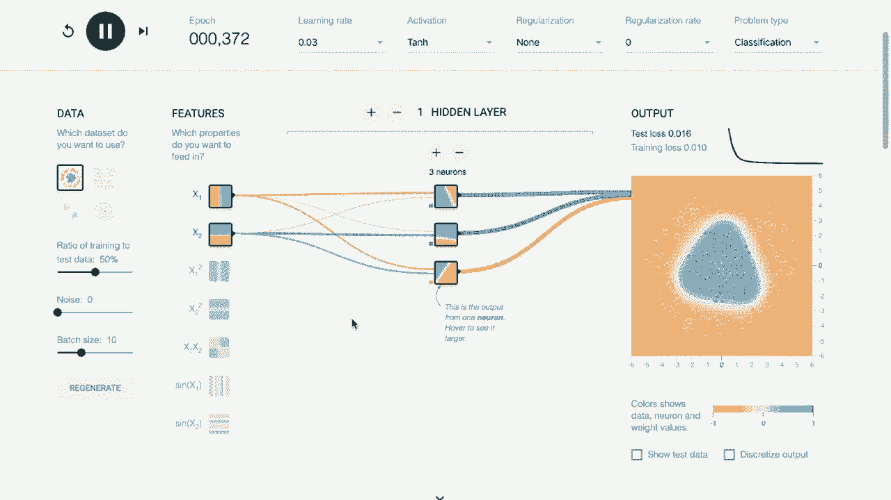
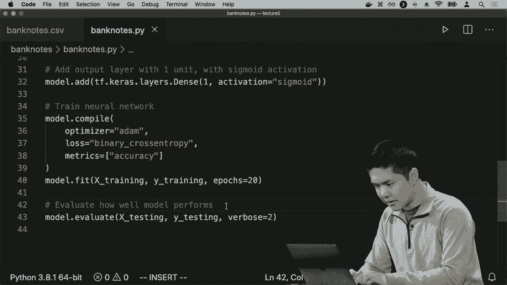
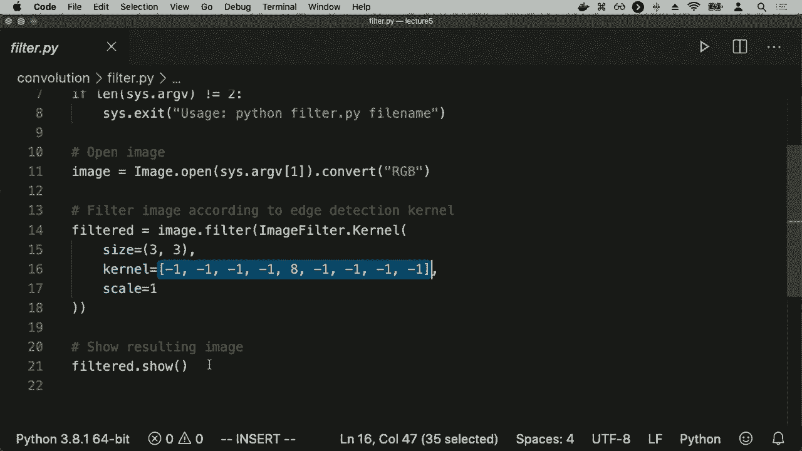
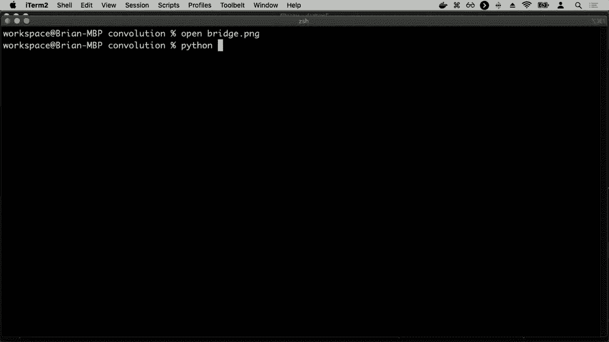

# 哈佛CS50-AI ｜ Python人工智能入门(2020·完整版) - P18：L5- 神经网络 2 (反向传播，过拟合，tensorflow，计算机视觉) - ShowMeAI - BV1AQ4y1y7wy

实际上，人们提出的策略是，如果你知道输出节点上的错误或损失是什么，那么基于这些权重，如果其中一个权重比另一个高，你可以计算出这个节点的错误在多大程度上是由于这个。

隐藏节点的部分，或者隐藏层的这一部分，或者隐藏层的这一部分，基于这些权重的值，实际上是在说，根据输出的错误，我可以反向传播错误，并弄清楚每个隐藏层节点的错误估计是什么。

这里还有一些微积分，我们不会详细讨论。这个算法的思想被称为反向传播，它是一个用于训练神经网络的算法，具有多个不同的隐藏层。对于这个算法的伪代码，如果我们想要运行。

使用带有反向传播的梯度下降，我们将从随机选择的权重开始，正如我们之前所做的，现在我们将继续重复训练过程。一次又一次，但每次我们要做的是现在我们将会。首先计算输出层的错误，我们知道输出是什么。

应该是什么，我们知道我们计算了什么，因此我们可以弄清楚有什么错误。然后我们会对每一层进行重复，从输出层开始，向回移动到隐藏层，然后是之前的隐藏层。如果有多个隐藏层，将一直向回到最初的。

隐藏层假设它们是多个，我们将会把错误向回传播。每一层，无论输出的错误是什么，弄清楚在那之前一层的错误应该是什么，基于这些权重的值。然后我们可以更新这些权重，所以，从图形上来看，你可能会想。

关于这一点，我们首先从输出开始，我们知道输出应该是什么，我们知道计算出的输出是什么，基于此我们可以。弄清楚我们需要如何更新这些权重，将错误反向传播到这些节点，并利用它，我们可以弄清楚我们应该如何更新。

这些权重，你可能想象一下，如果有多个层，我们可以。重复这个过程一次又一次，以开始弄清楚所有这些。权重在这个反向传播算法中应该如何更新，这确实是关键。算法使得神经网络成为可能，它使得我们能够进行。

这些多层结构，能够训练这些结构，具体取决于这些权重的值，以弄清楚我们应该如何更新这些权重，从而创建一个能够最小化总损失的函数，找出一些好的设置。

权重将输入转换为我们期望的输出，正如我们所说，这不仅适用于单个隐藏层，您可以想象多个隐藏层，在每个隐藏层中定义所需的节点数量，每个节点都可以连接到下一个层的节点。

定义越来越复杂的网络，能够建模越来越复杂类型的函数，因此这种类型的网络可以称为深度神经网络，属于深度学习算法的大家族，如果您听说过这个术语，所有深度学习关注的就是。

它利用多个层来预测并建模输入中的高级特征，以确定输出应该是什么，因此深度神经网络就是一个具有多个隐藏层的神经网络，从输入开始计算。

对于这一层的值，然后是这一层，然后是这一层，最终得到输出，这使我们能够建模越来越复杂的函数，每一层可以计算一些略有不同的内容，我们可以结合这些信息来确定输出应该是什么。

当然，在任何机器学习的情况下，随着我们开始使模型变得越来越复杂，以建模越来越复杂的函数，我们面临的风险是过拟合，上次我们在过拟合的上下文中讨论了这一点。

我们在训练模型时，试图学习某种决策边界，过拟合发生在我们对训练数据拟合得过于紧密，因此我们对其他情况的泛化效果较差，而我们在一个复杂的神经网络中面临的风险是。

不同的节点可能会因为输入数据而导致过拟合，我们可能过于依赖某些节点，仅仅基于输入数据进行计算，这不允许我们很好地泛化到输出，并且有很多策略可以应对过拟合。

在神经网络的背景下，最流行的技术被称为 dropout，dropout 的作用是在训练神经网络时，暂时移除某些单元，随机选择这些人工神经元，从而达到目的。

防止对某些单元的过度依赖，过拟合通常发生在我们开始过于依赖神经网络内部的某些单元，以告诉我们如何解读输入数据。dropout 的作用是随机移除一些单元，以减少。

我们可能过度依赖某些单元，以使我们的神经网络更加健壮，以便能够处理情况，即使我们完全丢弃特定神经元。所以，这样的工作方式是我们有一个这样的网络，当我们训练它时，当我们更新权重时。

第一次我们将随机选择一些百分比的节点从网络中丢弃，就好像那些节点的权重根本不存在一样，然后以这种方式进行训练，接下来当我们更新权重时，我们将选择另一组节点并继续训练。

随机选择并训练与其他被丢弃的节点一起，目标是，在训练过程中，如果通过随机丢弃网络内部的节点进行训练，希望最终得到一个更健壮的网络，不会过于依赖。

任何特定节点，但更普遍地说是学习如何近似一个函数，所以这就是我们可以使用的一些技术，以实现一个神经网络，从而理解将这个输入通过这些不同的层进行处理的思路。

生成某种输出，现在我们想做的是将这些想法付诸于代码，为此，有许多不同的机器学习库和神经网络库可以使用，这些库允许我们访问某些人的反向传播实现和所有这些隐藏层。

最受欢迎的由谷歌开发的库被称为**tensorflow**，这是一个我们可以用来快速创建神经网络并对其进行建模和在一些样本数据上运行的库，以查看结果。

输出将是什么，在我们实际上开始编写代码之前，我们将先查看张量流的**游乐场**，这将为我们提供一个机会，让我们玩一玩神经网络和不同层次的概念，以便更好地理解我们可以利用什么。

神经网络，所以我们继续进入张量流的**游乐场**，你可以通过访问之前的URL来进入，我们现在要做的是尝试学习。

对于这个特定输出的**决策边界**，我想学习如何分离这些。

从蓝点到橙点，我想要学习一种神经网络内部的权重设置，这将能够将它们彼此分离。我们可以访问的输入数据特征是x值和y值，即两个轴上的两个值，现在我将进行的操作是。

我可以设置特定的参数，比如我想使用什么激活函数，然后我会按下播放，看看会发生什么。发生的事情是，你会看到仅通过使用这两个输入特征，x值和y值，没有隐藏层，只是根据这些输入预测x和y坐标的输出。

我们的神经网络很快学会了，为了将这两个点分开，我们应该使用这条线。这条线作为决策边界，将这一组点与另一组点分开，并且做得很好。你可以在这里看到损失是多少。

训练损失为零，意味着我们能够完美地建模，将这两个点从我们的训练数据中分离开来。所以这是一个相对简单的案例，尝试应用神经网络，因为数据非常干净，线性可分性很好，我们可以画一条线来分开。

现在让我们考虑一个更复杂的案例，先将模拟暂停，我们来看一下这个数据集，这个数据集稍微复杂一点。在这个数据集中，我们仍然有蓝色和橙色的点，我们希望将它们分开。

但是没有一条线能够将蓝色与橙色分开，因为蓝色位于这两个象限，而橙色位于这里和这里。这是一个更复杂的函数需要学习，所以让我们看看如果我们尝试一下这些点会发生什么。

我会按下播放，你会注意到我们似乎无法得出很清晰的结论，无法非常清楚地看到我们应该如何将橙色点与蓝色点分开，你没有看到一个非常。

这样看起来，我们的网络没有足够的复杂性来建模如此复杂的情况。我们需要一个更好的中心网络模型，我会通过添加一个隐藏层来实现这一点，现在我有一个包含两个神经元的隐藏层。

我有两个输入，然后传递给隐藏层中的两个神经元，再到我们的输出。现在我会按下播放，你会注意到我们能够做得稍微更好，我们能够说这些点绝对是蓝色的，这些点绝对是橙色的，但我们仍然在努力。

我们可以看到每个隐藏神经元到底在做什么。每个隐藏神经元都在学习自己的决策边界，我们可以看到这个边界。第一个神经元正在学习这条线，这似乎将一些y值分开。

这个隐藏神经元正在学习另一条线，似乎正在将右下角的橙点与其他点分开，这就是我们能够确定底部区域这两个区域的原因，但我们仍然无法。

好吧，使用两个神经元和一个隐藏层，我们能够完美地对所有点进行分类，所以让我们继续添加另一个神经元，现在我们的隐藏层中有三个神经元，看看我们现在能够学习到什么，好吧，现在我们似乎通过学习三个不同的决策边界做得更好，每个神经元都有各自的决策边界。

在我们的隐藏层中，我们能够更好地找出如何将这些蓝点与橙点分开，你可以看到每个隐藏神经元正在学习什么，每个神经元都在学习一个略微不同的决策边界，然后我们将这些决策边界组合在一起，以确定什么。

整体输出应该是，我的意思是我们可以再试一次，添加一个第四个神经元，并尝试学习，现在我们似乎能更好地尝试将蓝点与橙点分开，但我们只有通过添加一个隐藏层来实现这一点。

正在学习一些其他的边界，并结合这些边界来确定输出，线条的大小和厚度表示这些权重的高低，以及每个输入对进行这种计算的重要性，我们也许可以再做一次模拟。

继续尝试在一个看起来像这样的数据集上，去掉这里的隐藏层，现在我们尝试将蓝点与橙点分开，所有蓝点都有效地位于一个圆内，所以我们无法学习一条直线，注意我按下播放。

现在使用三个不同的决策边界，每个神经元都学习到了，而我们真的无法绘制任何分类，因为没有一条线可以干净地将蓝点与橙点分开，所以让我们尝试通过引入一个隐藏层来解决这个问题，我按下播放。

做得稍微好一些，因为我们有效地学习了两个不同的决策边界，我们在这里学习了这条线，并在右侧学习了这条线，现在我们只是说，好吧，如果它在中间，我们就称之为蓝点，如果在外面，我们就称之为橙点，所以不是很好，但肯定能分开蓝点与其他点。

比之前好，我们学习了一个决策边界和另一个，基于这些我们可以弄清楚输出应该是什么，但现在我们继续添加第三个神经元，看看会发生什么，我现在去训练它。

我们能够处理这些隐藏的神经元。

更准确地对蓝点和橙点之间的区别建模，我们能够通过这三个决策边界的组合来推测，想象一下输出应该是什么，以及如何进行这种分类，因此这里的目标是。

只是为了让我们对这些隐藏层中的更多神经元有个概念，这让我们能学习到数据中的更多结构，找出相关和重要的决策边界，然后通过反向传播算法，我们能够确定这些权重的值。

以训练这个网络能够将一个类别的点与另一个类别的点区分开来，这正是我们在训练神经网络时最终要尝试做的事情，所以让我们实际上来看一个例子，你会记得。

上次我们讨论的内容涉及到包含关于伪钞与真钞信息的钞票文件。我有四种不同面值的钞票，并且对每种钞票进行了分类，判断其是被认为是**真钞**还是**伪钞**。

我想做的是根据输入信息推导出一个函数，该函数能够基于输入信息计算它属于哪个类别。我在钞票顶部写的神经网络就是为了学习这一点，它会根据所有输入来判断。

我们应该将钞票分类为**真钞**或**伪钞**，第一步与上次看到的相同，我实际上只是将数据读入并将其转换为适当的格式。这是编写Python代码的地方。

操作statum，调整数据格式以便机器学习库如scikit-learn或tensorflow能理解，因此我将其分为训练集和测试集，现在我正在使用的网络是TF，代表tensor flow。上面我提到导入tensor flow为tftf。

我们常用的一个缩写，我们不需要每次都写出tensorflow。我在使用TF. Charis。Charis是一个API，一组函数，用于在tensorflow中操作神经网络，结果表明还有其他机器。

学习库也使用Charis API，但我在这里说，好的，给我一个**顺序模型**，即一个层层相叠的**神经网络**，接下来我要在我的神经网络中添加我想要的层。

继续添加一个密集层，当我们说密集层时，我们指的是该层中的每个节点都将与前一层中的每个节点相连，所以我们有一个密集连接的层，这一层将有八个单位在里面，因此它将是一个。

在我们的神经网络中，有一个隐藏层，里面有八个不同的单位，八个人工神经元，每个神经元可能学习不同的东西，我只是随意选择了八个，你可以选择不同数量的隐藏层节点，如果我们之前看到的。

根据隐藏层中单位的数量，更多的单位意味着你可以学习更复杂的函数，因此你可能可以更准确地建模训练数据，但这也带来了成本，更多的单位意味着你需要弄清楚如何更新更多的权重，所以可能会更复杂。

进行这样的计算是昂贵的，如果你有太多的单位，可能会导致对数据的过拟合，如果你学习只是过度拟合训练数据，那也不好，所以这之间存在一个平衡，通常会有一个测试过程，在某些数据上进行训练，并可能验证你做得有多好。

在一组单独的数据上，通常称为验证集，以查看哪种参数设置，应该有多少层，每层应该有多少单位，哪一个在验证集上表现最好，因此你可以进行一些测试来弄清楚这些超参数。

应该等于接下来我指定输入形状，这意味着我的输入是什么样的，我的输入有四个值，因此输入形状就是四，因为我们有四个输入，然后我指定激活函数是什么，激活函数，我们可以选择，有很多种。

不同的激活函数，在这里我使用的是relu，可能你之前听说过。然后我将添加一个输出层，因此我现在有了我的隐藏层，再添加一层，这一层将只有一个单位，因为我想预测的只是像假钞或真实钞票这样的东西，所以我只需要一个。

单位和激活函数，我将使用的激活函数是sigmoid激活函数，它是那个S形曲线，它给了我们一个概率，表示这是一张假钞的概率，与真实钞票相比，因此这就是我的神经网络的结构。

这是一个顺序神经网络，包含一个有八个单位的隐藏层和一个仅有一个单位的输出层，我可以选择有多少个单位，可以选择激活函数，然后我要编译这个模型，tensorflow让你选择如何。

我希望优化权重，有多种不同的算法可以做到这一点，想要使用什么样的损失函数也有很多选项，接下来我希望如何评估我的模型，我关心准确性，我关心我能分类多少个点。

正确与不正确的分类，即伪钞与真钞。我希望它能告诉我我的模型表现得有多准确。现在我已经定义了模型，我调用model.dot fit来训练模型，使用所有训练数据以及所有训练标签。

我为每一部分训练数据设置标签，并且我说运行20个周期，意味着对每一个训练点进行20次有效的遍历，并且不断尝试更新权重。如果我多做一些，我可以训练更长时间，或许会得到一个更好的结果。

更准确的结果，但在我将其应用于所有数据后，我将继续进行测试。我会使用内置于TensorFlow的模型评估来评估我的模型，它会告诉我在测试数据上的表现如何。所以，**最终**这只是会给我一些数字，告诉我我们的表现如何。

在这种情况下我将进入银行票据，继续运行银行票据的顶级PI。接下来会发生的是，它将读取所有训练数据，并生成一个神经网络，包含我所有的输入和8个隐藏层的单位。

有一层，然后是一个输出单元，现在它正在进行训练，每次训练20次。你可以看到我的数据，第一次的时候并不是很准确，胜过随机的情况，大约有79%的时间能够准确区分一张钞票与另一张，但随着训练的进行。

注意到他的准确率不断提高，直到在经过多次训练后，我的准确率在训练数据上超过了99%。在这里，我在一堆测试数据上测试，结果显示我在这种情况下的准确率也是99.8%，所以仅凭这些。

我能够生成一个神经网络，可以根据这个检测伪钞与真实钞票的能力。！

输入数据在至少99.8%的时间内能够准确分类，基于这组特定的测试数据，我可能还想用更多的数据进行测试，以增强信心，但这确实是使用像TensorFlow这样的机器学习库的价值，**还有其他可用于Python的库**。

还有其他语言，但我所需要做的就是定义网络的结构，并定义要输入到网络中的数据，然后 TensorFlow 会运行反向传播算法，以学习这些权重应该是什么，从而训练这个神经网络。

尽可能准确地确定输出值应该是什么，因此，这就是我们查看神经网络可以做什么的方式，利用一层一层的序列，你可以开始想象将这些应用于更一般的问题。

计算和人工智能中的一个问题，尤其是计算机视觉的问题。计算机视觉涉及对图像进行分析和理解的计算方法。你可能有一些图片，希望计算机能够理解如何处理这些图像。

并找出如何从中产生某种有用的结果。你已经在社交媒体的上下文中见过这一点，社交媒体网站能够查看包含大量人脸的照片，并能够识别出每张照片中的人，并为他们贴上标签。

随着我们开始讨论自动驾驶汽车，这变得越来越相关。这些汽车现在配备了摄像头，我们希望计算机能够有某种算法，查看图像并判断例如交通灯的颜色、周围的汽车以及它们的方向。计算机视觉在这里就是关键。

所有这些都是关于获取图像并确定我们可以对图像进行何种计算，这在手写识别的上下文中也是相关的。这是你所看到的 EM NIST 数据集的一个例子，它是一个仅包含手写数字的大型数据集。

我们可以使用数字，理想情况下试图预测给定某人的手写或他们绘制的数字照片时，能否预测它是 0、1、2、3、4、5、6、7、8 或 9。例如，这种手写识别是我们可能想要使用计算机视觉的另一项任务。

计算机视觉任务和工具可能是我们关心的任务。那么，我们如何使用神经网络来解决这样的问题呢？神经网络依赖某种输入，该输入只是数值数据，我们有一堆单元。

它们每一个都表示某种数字，因此在手写识别或图像的上下文中，你可以想象图像实际上只是一个像素网格，每个点都有某种颜色。

在手写识别中，你可以想象，如果你以某种特定的方式填充这些点，你可以生成像2或8这样的数字，具体取决于哪些点被填充，哪些点没有。我们可以用数字来表示每个像素值。

例如，像素0可能表示完全黑色，具体取决于你如何表示颜色。通常，颜色值被表示在0到255的范围内，这样你就可以使用8位表示特定值，比如图像中白色的多少。因此，0可能表示全黑，255可能表示全白。

在这之间的某个值可能表示某种灰色的阴影。你可以想象，不仅仅有一个滑块来决定图像中白色的多少，如果你有一张彩色图像，你可以想象有三个不同的数值：红色、绿色和蓝色。

红色值控制图像中红色的多少，我们有一个值控制像素中绿色的多少，还有一个值控制像素中蓝色的多少。根据你设置红、绿、蓝这些值的方式，你可以获得不同的颜色。

像素实际上可以用三个数值来表示：红色值、绿色值和蓝色值。如果你把一堆这样的像素组合在一起，放在一个像素网格中，你就有了一大堆数值，可以用来进行操作。

对于某种预测任务，你可能会想象使用之前讨论过的相同技术，设计一个有很多输入的神经网络，对于每个像素来说，我们可能在彩色图像的情况下有一个或三个不同的输入。

比如说，把这些输入传递给一个深度神经网络，这个深度神经网络可能会处理图像中的所有像素，比如一个人画的数字，输出可能是十个神经元，它将其分类为0、1、2或3，或者以某种方式告诉我们这个数字是什么。

这种方法有几个缺点，第一个缺点是输入数组的大小。如果我们有一个大图像，就会有很多不同的通道，我们要查看很多输入，因此需要计算很多权重。

问题在于，通过将所有内容压缩成这种像素结构，我们失去了许多关于图像结构的信息，这些信息是相关的。但实际上，当一个人查看图像时，他们是在观察图像的特定特征。

观察曲线或形状，看看你能在图像的不同区域识别出什么，可能将这些东西组合在一起，以便更好地了解整体图像的含义。通过将其转换为每个像素的像素值，你可以。

可能能够学习到这种结构，但这可能会很具挑战性。为了做到这一点，利用图像本身的特性可能会很有帮助，事实上，它以特定方式结构化，以便改善我们基于该图像的学习方式——所以为了。

为了弄清楚如何训练我们的神经网络更好地处理图像，我们将引入几个想法和算法，这些算法可以应用于让我们从图像中提取一些有用的信息。我们将介绍的第一个概念是图像的。

图像卷积的演变是关于过滤图像，提取图像中有用或相关特征的。我们这样做的方法是通过应用一个特定的滤镜，基本上是将每个像素的值与所有邻近像素的值相加。

根据某种卷积核矩阵对其进行处理，稍后我们将看到，这将允许我们以各种不同的方式对这些像素进行加权。因此，图像卷积的目标是从图像中提取一些有趣或有用的特征，以便能够根据其。

邻近像素可能预测某种有价值的信息，比如取一个像素并查看其邻近像素，你可能能够预测图像内部是否存在某种曲线，或者它是否在形成特定线条或形状的轮廓，例如。

如果你试图使用所有这些不同的特性，结合它们来对整个图像做出有意义的陈述，这可能会很有用。那么，图像卷积是如何工作的呢？我们从一个卷积核矩阵开始，卷积核矩阵看起来像这样，基本理念是给定。

中间像素将是一个像素，我们将通过这些值对每个邻近像素进行乘法运算，以便通过将所有数字加在一起得到某种结果。因此，如果我取这个卷积核，你可以将其视为我将应用于图像的滤镜。假设我。

以这个图像为例，这是一个四乘四的图像，可以将其视为仅包含单个像素值的黑白图像，例如在0到255之间。所以我们有一大堆单独的像素值，我想做的是应用这个卷积核这个滤镜。

讲述这个图像，我将这样做，卷积核是 3x3。你可以想象一个 5x5 的卷积核或更大的卷积核，我会先将其应用于图像的第一个 3x3 部分，我将做的是将这些像素值与其对应的值相乘。

在过滤矩阵中，将所有结果加在一起。因此，在这里举个例子，我会说 10 乘以 0 加 20 乘以负 1 加 30 乘以 0，以此类推。完成所有这些计算后，最后如果我将这些值相加，对于这组特定的九个像素，我得到。

例如，值为 10，然后我会将这个三乘三的网格有效地滑动，滑动卷积核一单位以查看下一个三乘三的部分。在这里，我只是在滑动一个像素，但你可以想象不同的步长，或者可能一次跳过多个像素。

如果你真的想要，你可以在这里有不同的选择，但我只是在滑动，查看下一个 3x3 部分，我会做同样的数学，20 乘以 0 加 30 乘以负 1 加 40 乘以 0 加 20 乘以负 1，以此类推，加上 30 乘以 5，然后我。

最后得到的是数字二十，然后你可以想象把这个值移到这里。做同样的事情，计算比如数字四十，然后再做一次。现在我们得到的就是我们所称的特征图，我们将这个卷积核应用于这些不同区域，我们。

得到的是像图像的过滤版本的一些表示。因此，为了给出一个更具体的例子，说明为什么这种事情可能有用，我们以这个卷积核矩阵为例，这是一个非常著名的例子，它在中间加了八，然后所有相邻的像素得到负值。

一的值。让我们想象一下，我们想把这个应用于图像的一个三乘三部分，图像看起来像这样，所有的值都是相同的，都是 xx。比如在这种情况下，如果你做 20 乘以 8，然后减去 20，减去 20，再减去每个八个邻居的 20。

那样的结果就是你得到的表达式为零。你乘以 20 和 8，但然后你减去了 20 乘以 8，根据那个特定的卷积核，所有这些结果就是零。因此，关键在于，当很多像素的值相同时，我们最终得到。

如果我们加上类似这个 20s 的东西，得到的值接近零。第一行是 50s，第二行和第三行也是 50s。当你这样做时，因为同样的数学，二十乘以负一，二十乘以负一，以此类推，那么我会得到一个更高的值。

在这种特定情况下大约是90，因此这里更一般的想法是，通过应用这个内核，负值、八在中间，然后是负值。当这个中间值与邻近值（比如50大于这些20）差异很大时，你最终会得到一个更高的值。

如果这个数字大于零，假如这个数字高于其邻居，你最终会得到一个更大的输出，但如果这个邻居的值与所有邻居相同，那么你会得到一个较低的输出，比如零。结果是，这种过滤器可以用于某些东西。

检测图像中的边缘，或者我想检测图像中不同对象之间的边界，我可能会使用这样的过滤器，它能够判断这个像素的值是否与邻近像素的值不同，如果它大于邻近像素的值。

像素周围的情况，所以我们可以在图像过滤方面使用它。我会给你展示一个例子，我这里有一个在filter.dot PI文件中使用Python的图像库或PIL进行图像过滤的代码。我打开一张图像，然后我所要做的就是应用一个。

对于那张图像的内核，它将是一个三乘三的内核，和之前看到的那种内核相同。这是内核的列表表示，和我刚刚给你展示的矩阵相同，它是负一、负一、负一，第二行是负一、八、负一。

第三行全是负值和。

然后最后我要展示过滤后的图像，所以如果我进入卷积目录，打开一张像Bridge.png这样的图像，这就是输入图像的样子，只是一张桥在河上的图像，现在我将继续运行。

在桥上的这个过滤器程序，我得到的就是这张图像，只需通过将原始图像应用该过滤器到每个三乘三的网格。我提取了图像中分隔不同部分的所有边界和边缘。

图像的特定部分，你可以想象如果一个机器学习算法试图学习图像是什么样的，这样的过滤器可能非常有用，因为也许这个机器学习算法不在乎图像的所有细节，它只关心某些有用的特征。

它关心的特征，特定形状能够帮助它基于图像确定，这将是一个桥，例如，因此这种图像卷积的想法可以让我们将过滤器应用于图像，从而提取出有用的结果。

例如，它的边缘，你可能会想象许多其他可以应用于图像的滤镜，它们能够提取特定的值，一个滤镜可能会有单独的卷积核，针对红色值、绿色值和蓝色值，最后将这些值相加，这样你就可以得到。

特定滤镜在寻找图像的某部分是否有红色，其他部分是否有绿色，你可以开始组合这些相关和有用的滤镜，能够进行这些计算。因此，这就是图像卷积的概念，将某种滤镜应用于图像。

能够从图像中提取一些有用特征，但这些图像仍然相当大，图像中涉及很多像素。实际上，如果你有一个非常大的图像，这会带来几个问题，一个是输入到神经网络中的数据量很大，另一个是。

这也意味着我们确实需要关注每个特定像素的内容。而实际上，我们通常并不在意，比如当你查看图像时，你并不关心某个东西是否在一个特定像素中，而是在它旁边的像素中，它们距离很近，你实际上只是在乎。

关注某个区域是否存在特定特征，也许你并不关心具体是哪一个像素。所以这是一种我们可以使用的技术，称为池化，池化意味着减少。

通过从输入中的区域进行采样来减小输入的大小，因此我们将把一张大图像变成一张小图像，使用池化，特别是最流行的池化类型之一被称为最大池化。最大池化的作用是通过选择某个区域的最大值来进行池化。

例如，假设我有这个4x4的图像，但我想减少它的维度，想将其变为一张较小的图像，以便我有更少的输入可以使用，那么我可以应用2x2的最大池化，想法是，我首先查看这个。

在一个2x2区域中，如果我们查看该区域的最大值，那就是数字50，所以我们将使用数字50，然后我们将查看这个2x2区域，最大值是110，所以这将是我的值，同样，这里的最大值看起来是20，我们就放。

在最后的区域，最大值是40，所以我们将使用这个值，而现在我有的是同一原始图像的一个较小表示，这个表示是通过从这些区域中选择最大值获得的。因此，这里的优势在于现在我只需。

处理一个二乘二的输入，而不是四乘四的输入，你可以想象。进一步缩小图像的大小，但除此之外，我现在能够。使我的分析独立于是否，某个特定的值在这个像素或。这个像素中，我不在乎50是在这里还是在那里，只要它存在。

通常在这个区域，我仍然可以获取到那个值，这使得我们的。算法变得更加健壮，因此这就是池化，减少图像的。大小，通过从特定位置进行采样，稍微减少一点。
