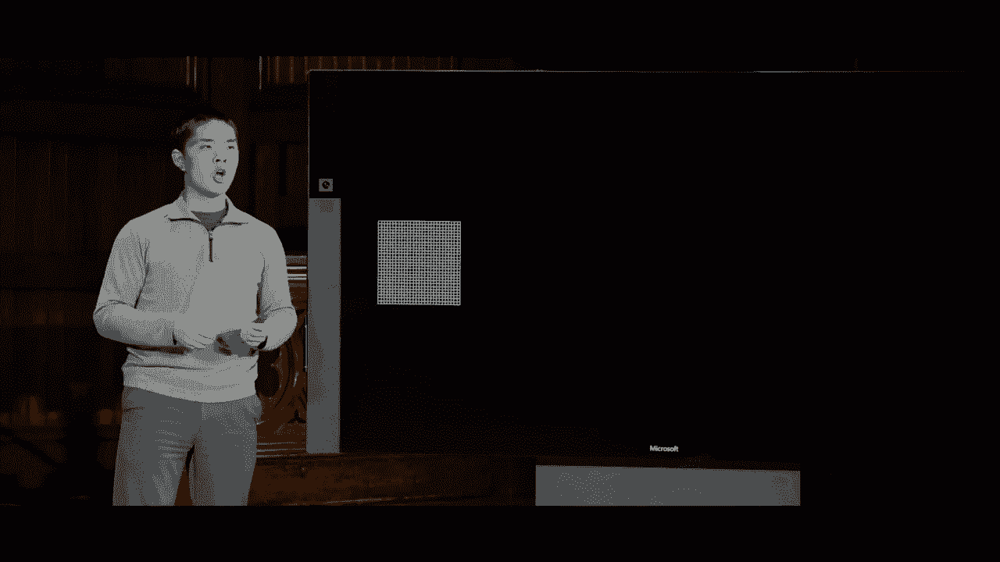
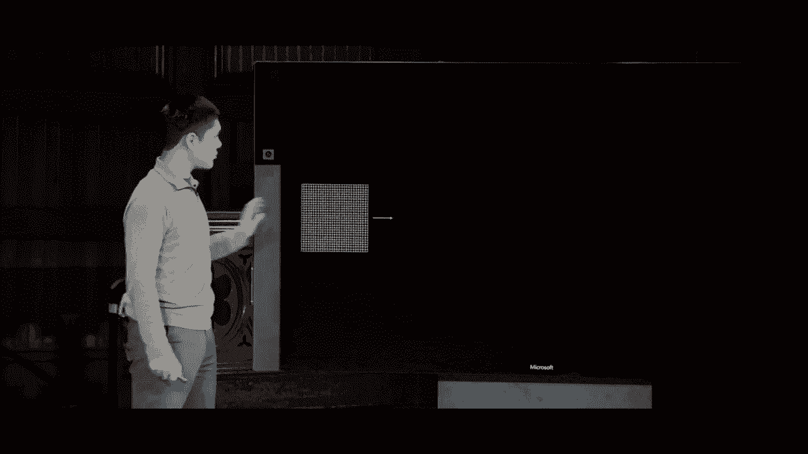
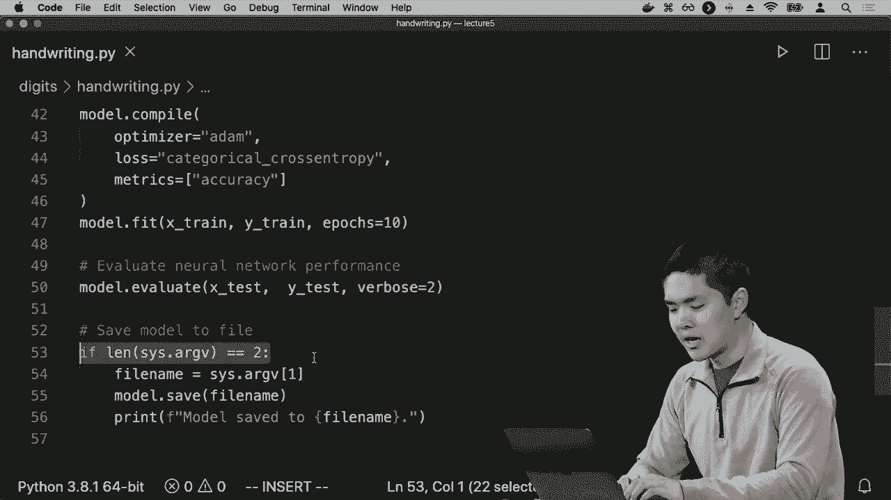
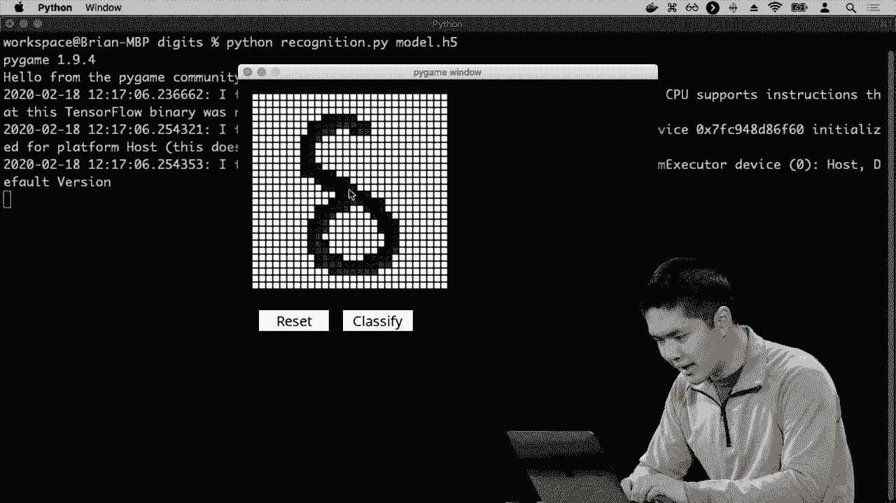

# 哈佛CS50-AI ｜ Python人工智能入门(2020·完整版) - P19：L5- 神经网络 3 (卷积神经网络，循环神经网络) - ShowMeAI - BV1AQ4y1y7wy

图像内部的区域，现在我们可以将所有这些概念结合在一起。将图像池化、卷积和神经网络结合成另一种神经网络，称为卷积神经网络或CNN，这是一个使用卷积步骤的神经网络，通常是在上下文中。

例如，分析一张图像的方式是，卷积神经网络的工作原理是从某种输入图像开始，某个像素网格。

但不是立即放置我们之前看到的，我们将首先应用一个卷积步骤，其中卷积步骤涉及。

将一些不同的图像滤波器应用于我们的原始图像，以获取我们称之为特征图的结果，即将某个滤波器应用于图像的结果，我们可以做一次，但通常会做多次，得到一堆不同的特征图，每个特征图可能提取。

从图像中提取一些不同的相关特征，图像的一些不同重要特征，我们可能会关心这些特征，以计算结果应该是什么，和我们训练神经网络时一样，我们可以训练神经网络，学习特定之间的权重。

在神经网络内部，我们还可以训练神经网络以学习这些滤波器应该是什么，滤波器的值应该是什么，以便从原始图像中提取出最有用、最相关的信息，仅通过找出这些滤波器值的设置。

这个核的结果是最小化损失函数，最小化我们的假设在识别特定图像分类时表现的多差。例如，我们首先应用这个卷积步骤，得到一堆不同的特征图，但这些特征图相当大。

这里有很多像素值，因此接下来的逻辑步骤是池化步骤，我们通过使用最大池化等方法减少这些图像的大小，从特定区域提取最大值，还有其他存在的池化方法。

根据情况，你可以使用像平均池化这样的东西，取一个区域的平均值，而不是取最大值，这也有其用处，但实际上，池化会将这些特征图的维度降低，最终我们得到了。

更小的网格，像素更少，这样我们处理起来就更容易了，意味着我们要担心的输入会更少，也意味着我们对特定值潜在的移动会更有韧性、更强健，即使只是一个像素的变化，而最终我们并不真的。

关注原始图像中可能出现的一像素差异。在我们完成池化步骤后，我们现在拥有一堆值。然后我们可以将这些值展平，并放入一个更传统的神经网络中，因此我们继续展平它，然后得到一个传统的。

神经网络对每一个这些值有一个输入，这些值来自每个结果特征图，经过卷积和池化步骤后，这就是卷积网络的一般结构。我们从图像开始，应用卷积，应用池化，展平结果。

然后将其放入一个更传统的神经网络，该网络本身可能有隐藏层。你可以拥有深度卷积网络，在这个展平层和最终输出之间有隐藏层，以便能够计算这些值的各种不同特征，但这可以帮助我们能够使用。

使用卷积和池化利用我们对图像结构的知识，以便获得更好的结果，从而能更快地训练我们的网络，以更好地捕捉图像的特定部分。并且没有理由一定只能使用这些步骤一次，实际上在实践中你会。

多次在多个不同的步骤中使用卷积和池化，看看你可能想做什么。

首先从图像开始，应用卷积以获得一堆映射。然后应用池化，再次应用卷积，因为这些映射仍然相当大。你可以应用卷积来尝试提取相关特征，然后将这些结果应用池化。

减少它们的维度，然后将其输入到一个神经网络中。这个网络可能有更少的输入，因此我这里有两个不同的卷积和池化步骤。我先进行一次卷积和池化，然后再进行第二次卷积和池化，每次都从中提取有用的特征。

每次在前一层使用池化来减少你最终查看的内容的维度，现在这种模型的目标是，在每个步骤中，你可以开始学习原始图像的不同类型特征，在第一步中你学习非常低级的特征。

只学习并寻找特征，比如边缘、曲线和形状，因为基于像素及其邻近值，你可以弄清楚哪些是边缘，哪些是曲线，哪些是可能存在的各种不同形状。但是一旦你有一个映射，表示在哪里。

边缘、曲线和形状可以想象为，你可以想象再次应用相同的过程来开始寻找更高层次的特征，寻找物体，可能寻找人的眼睛和面部识别，例如，也许寻找更复杂的形状，比如特定数字上的曲线。

在手写识别的场景中识别一个数字，然后在拥有这些表示更高层次特征的结果后，你可以将它们传入一个神经网络，这实际上是一个深度神经网络。

二分类或多类别分类，进行各种不同的任务，卷积神经网络在这类模型中可以非常强大且受欢迎，尤其在分析时。

我们之前见过，但这些卷积神经网络在特别情况下非常有用，因为它们模拟了人类看图像的方式，而不是人类同时查看每一个像素并试图将其结合起来。

卷积真正做的就是查看图像的不同区域，并提取相关信息和特征，就像人类的视觉感受器一样，查看他们所见的特定部分并将其组合起来。

为了找出从这些不同输入中可以提取的意义，你可以想象将其应用于手写识别的情境，现在我们就来看看一个例子，我会再次打开handwriting.py，我们在这里首先导入。

TensorFlow中内置了一些数据集，你可以立即访问，其中一个最著名的机器学习数据集是EM NIST数据集，这是一个包含大量人们手写数字样本的数据集。

我之前给你展示了这个数据集的幻灯片，我们可以立即访问这个内置数据集，这样如果我想在大量手写数字上进行训练，我可以使用提供给我的数据集，当然，如果我有自己的数据集。

对于一组手写图像，我可以应用同样的思路，首先需要将这些图像转换为像素数组，因为这就是它们的格式，它们将有效地格式化为单个像素的数组，现在需要进行一些重塑。

需要将数据转换为可以输入到卷积神经网络中的格式，这包括将所有值除以255，如果你记得，这些颜色值通常在0到255之间，所以我可以将它们除以255，把它们转换为0到1的范围。

这可能会更容易训练，然后对数据进行各种其他修改，以使其变得更加可用，但这里有一个有趣且重要的部分，就是我创建卷积神经网络（CNN），在这里我说继续使用一个顺序模型。

在我能够使用模型添加之前，我需要说，添加一层再添加一层。另一种定义它的方法是，通过将我想要的所有层作为输入传递给这个顺序的神经网络。在我的模型中，第一层是一个卷积层，我将首先应用。

对我的图像进行卷积，我将使用13个不同的滤波器，因此我的模型将学习32种不同的滤波器，我希望在输入图像上学习，每个滤波器将是一个3x3的核，我们之前看到过这些3x3的核，我们可以对3x3网格中的每个值进行乘法运算。

通过一个值相乘并将所有结果加在一起，所以这里我将学习32种不同的3x3滤波器，我可以再次指定我的激活函数，并指定我的输入形状，我的输入形状在钞票的情况下是。只有4，我有4个输入，我的输入形状将在这里是28，28，1。

因为对于这些手写数字，NS数据集组织了它们的数据，每个图像是28x28像素的网格，所以我们将有一个28x28的像素网格，并且每个图像只有一个通道值。这些手写数字只有黑色和白色，所以它只是一个单一的颜色。

表示有多少黑色或多少白色，你可以想象在彩色图像中，如果你进行这种操作，你可能会有三个不同的通道，红色、绿色和蓝色通道，例如，但在仅进行手写识别，识别数字的情况下，我们只会使用一个。

像是有阴影还是没有阴影的值，它可能会有变化，但它只是一个单一的颜色值，这就是我们神经网络的第一层，一个卷积层，它将接受输入并学习许多不同的滤波器，我们可以应用这些滤波器来提取有意义的特征。

下一步将是一个最大池化层，这也直接构建在TensorFlow中，这将是一个层，使用2x2的池化大小，意味着我们将查看图像内部的2x2区域，并提取最大值，我们已经看到这可以如何有帮助。

一旦我们完成了这一步，就会减少输入的大小，我们将把所有的单元压平，变成一个单层，然后我们可以将其传递给其余的神经网络，现在这是其余的神经网络，在这里我说让我们给我的神经网络添加一个隐藏层。

一百二十八个单元，所以有一整堆隐藏单元在隐藏层里面。为了防止过拟合，我可以添加一个 dropout。比如说，你知道，在训练时随机丢弃这隐藏层中的一半节点，以确保我们不对任何特定节点过于依赖。

我们开始真正地泛化，并阻止自己过拟合。所以，TensorFlow 允许我们通过添加一行代码将 dropout 加入我们的模型，这样在训练时，它会执行这个 dropout 步骤，以帮助确保我们不会对这特定数据过拟合。

最后我添加一个输出层，输出层将有十个单元，分别对应我想将数字分类到的每个类别，从零到九，共十个不同类别，激活函数将使用 softmax 激活函数。

softmax 激活函数的作用是将输出转换为概率分布，所以最终它会告诉我，比如说我们估计这个是二与三或四的概率是多少，因此它将其转化为那个概率。

接下来我将编译我的模型，并在所有训练数据上进行拟合，然后我可以评估神经网络的表现。如果我在 Python 程序中提供了命令行参数，比如某个文件名。

我将模型保存到文件中，这在训练步骤完成后非常有用，这可能需要一些时间，涉及到通过数据进行反向传播和梯度下降，来调整权重分布。

对于这个特定模型，你最终会计算这些权重的值，计算这些过滤器的值，你希望记住这些信息，以便稍后使用。因此，TensorFlow 允许我们将模型保存到文件中，这样如果我们想使用已经学习的模型。

我们可以使用已经学到的权重进行一些新的预测，因此这里的做法是，在完成所有计算后，将模型保存到文件中，以便稍后使用。例如，如果我进入数字识别。

我将运行手写数字识别，这次不保存，只是运行并看看会发生什么。我们需要遍历模型，以训练 MS 数据集提供的所有手写数字样本，成千上万的样本。

手写数字以相同的格式，我们可以用来进行训练。因此，现在你看到的是这个训练过程，与银行票据的案例不同，数据点要少得多，数据非常简单。这里的数据更复杂，因此这个训练过程需要时间。

这是另一个案例，当训练神经网络时，这就是为什么计算能力如此重要，你经常看到人们想要使用**复杂的GPU**，以便更有效地进行这种神经网络训练。这也说明了为什么更多的数据可以。

拥有更多的样本数据点会更加有帮助，你的训练会做得更好。所以这里我们正在处理60,000个不同的手写数字样本，我说我们要遍历十次，所以我们将训练这个数据集十次。

我们每次运行这个数据集时，都在改进我们的权重。我们可以看到右侧显示了每次运行模型时的准确率，第一次看起来我们在这个训练集上约有92%的数字正确率，我们将其提升到96%或97%。

每次运行这个模型时，我们希望准确率能够提高，随着我们继续使用梯度下降的方法，尽量运行算法以最小化损失，从而更准确地预测输出应该是什么。

这个过程不仅在学习权重，还在学习特征，使用**核矩阵**在执行卷积步骤时，因为这是一个卷积神经网络，我首先执行卷积，然后进行更传统的神经网络操作。

这个网络结构将学习所有这些个体步骤，因此这里我们看到**TensorFlow**为我提供了一些非常好的输出，告诉我每次训练运行剩余的秒数，让我看到我们的表现如何，所以我们继续观察。

这个网络的表现看起来，我们已经遍历了数据集七次，现在正在进行第八次，此时准确率相当高，我们看到准确率从92%提升到97%，现在看起来是98%，此时似乎事情开始趋于平稳。

可能存在一个限制，关于我们能最终达到的准确率，而不冒过拟合的风险，当然，足够的节点可能会使你仅仅记住输入并导致过拟合，但我们希望避免这样，**dropout**将帮助我们，但现在我们看到快要完成了。

在我们的训练步骤中，我们达到了五万五千，好的，我们完成了训练。现在它将继续为我们在一万个样本上进行测试，似乎在测试集中我们的准确率是九十八点八百分之，所以在这个测试上，我们表现得相当不错。

测试集以查看我们能够多准确地预测这些手写数字。因此，我们可以测试一下，我写了一个程序叫做 recognition.dot pi，使用 PI game，如果你传入一个经过训练的模型，而我使用这些输入数据预训练了一个示例模型。

我们可以看看是否能够训练这个卷积神经网络，以预测手写。例如，我可以尝试像画一个手写数字一样，我将绘制数字二。比如说，这是我的数字二，再次看起来有点凌乱。

尝试想象如何用仅仅是 if 语句和 x' 来编写程序，以进行这样的计算，这会很棘手。但是在这里我会进行分类，似乎它能够正确地分类我画的数字是二，我将重置它并再试一次。

再次画一个八的样子。

例如，这里是一个八的分类，它预测我画的数字是八，关键在于这开始展示了神经网络的强大，它以某种方式观察这些不同像素的各种特征，找出这些特征。

相关特征并找出如何组合它们以获得分类，这将是一个困难的任务，因为需要向计算机提供明确的指令，如何处理大量的 if 语句以处理所有这些像素值，找出手写数字。

每个人画的八都会有所不同，如果我再次画八，它看起来会有所不同，而理想情况下，我们希望训练网络足够稳健，以便它开始自行学习这些模式。我所说的就是，这里是网络的结构。

这是用于训练网络的数据，而网络学习算法只是试图找出什么是最优的权重集合，什么是最优的过滤器，以便能够准确地将数字分类到一个类别或另一个类别，这将展示出强大的能力。

这些卷积神经网络的种类以及我们如何利用卷积神经网络开始解决与计算机视觉相关的问题，例如能够分析图像，这就是你可以想象的分析类型。

这种情况在自动驾驶汽车中发生，它们能够判断应用什么过滤器来理解计算机正在查看的图像，或者相同的想法也可以应用于社交媒体中的面部识别，以确定如何在图像中识别面孔。

想象一个神经网络，它不是将输入分类为十个不同的数字，而是能够判断这个人是A还是B，试图仅仅基于卷积将这些人区分开。因此，现在我们将看的是另一种类型的神经网络。

对于某些类型的任务，可能相当受欢迎，但这样做会尝试进行泛化，并更抽象地思考我们的神经网络。这里我们有一个样本深度神经网络，输入层有一整堆不同的隐藏层，执行某些类型的操作。

进行计算，然后是输出层，生成我们关心的某种输出，但我们可以想象将其表示得更简单一点，这里是我们神经网络的更抽象表示，输入可能像是一个向量。

一堆不同的值作为输入传递到网络中，以执行某种计算或运算，该网络产生某种输出。这个输出可能是一个单一值，也可能是一整堆不同的值，但这就是神经网络的一般结构。

我们看到有某种输入被输入到网络中，并且使用该输入计算输出应该是什么，这种口头网络模型我们可能称之为前馈神经网络。前馈神经网络的连接仅在一个方向上，它们从一个层移动到下一个层。

从一层传递到下一层，再到之后的层，使得输入通过不同的隐藏层，最终产生某种输出。因此，前馈神经网络在解决这些我们之前看到的分类问题时非常有帮助，我们有一整堆的案例。

我们想学习什么权重设置将有效地计算输出，但前馈神经网络有一些限制，我们稍后会看到，特别是输入需要像固定形状一样，比如输入层中的神经元数量是固定的。

输出有固定形状，比如输出层中的固定神经元数量，这也有其自身的限制，而一个可能的解决方案，我们稍后会看到可以解决的这类问题的示例，而不是仅仅是一个前馈神经网络。

在网络中，连接仅在一个方向上，从左到右有效。我们还可以想象一个递归神经网络，其中递归神经网络生成的输出会反馈到自身，作为未来运行该网络的输入，而在传统神经网络中则不是这样。

我们有输入传入网络，最终得出输出。决定输出的唯一因素是基于原始输入和我们在网络内部进行的计算。这与递归神经网络形成对比，在递归神经网络中。

你可以想象网络的输出会反馈到自身，再作为输入供下次计算使用。在网络内部，这使得网络能够维持某种状态，存储一些可以在未来使用的信息。

网络的运行以往只是找到一些权重，我们将输入传递给网络，生成输出，但网络并没有根据这些输入保存任何信息，以便在未来的迭代或运行中记住。递归神经网络让我们能够做到这一点。

它让网络存储信息，这些信息将在下次我们尝试执行某种操作时作为输入再次传入网络。这在处理数据序列时特别有用，所以我们实际上会看到，微软开发了一种被称为caption bot的AI。

caption bot的功能是我可以理解任何照片的内容。我会尽量描述得和任何人一样好，我会分析你的照片，但我不会存储或分享它。因此，微软的caption bot似乎声称它可以处理一张图片，并弄清楚图片中的内容。

只给我们一个描述的标题，所以我们来试试，比如这是哈佛广场的一张图片，前面有一些人在建筑前走。我会拿这个图像的URL，然后把它粘贴到caption bot中，按下GO，caption bot就是这样。

分析图像后，它表示我认为这是在建筑前走动的一群人，这似乎令人惊叹，AI能够查看这个图像并弄清楚图像中的内容，重要的是要认识到这不再只是一个分类任务。

使用卷积神经网络对图像进行分类，其工作是接收图像，然后判断它是0、1还是2，或者是这个人的脸还是那个人的脸。这里似乎发生的事情是，输入是一个图像，我们知道如何让网络接收图像输入，但。

输出是文本，就像是“在建筑物前走动的人群”的句子，这似乎对我们更传统的前馈神经网络构成挑战，因为在传统神经网络中，我们只有固定大小的输入和固定大小的。

输出中输入到神经网络的神经元数量是一定的，而输出的数量也是固定的，接下来在两者之间进行一些计算，但输入的大小和输入值的数量，以及输出值的数量始终是。

将会固定在神经网络的结构基础上，这让我们很难想象神经网络如何处理这样的图像，并说这是一个在建筑物前走动的人群，因为输出是文本，像是一系列单词，现在这可能对我们的。

神经网络的输出是一个单词，一个单词可以表示为一组值的向量，我们可以想象，下一次我们将更多地探讨与语言及语言处理相关的人工智能，但一系列单词要挑战得多，因为这取决于。

图像，你可以想象输出可能有不同数量的单词，我们可以有不同长度的序列，并且我们仍然希望能够生成适当的输出，因此这里的策略是使用递归神经网络，一种能够将自己的输出反馈回自己的神经网络。

下一次的输入，这使我们能够实现输入到输出的所谓一对多关系，而在传统的简单神经网络中，我们可能会认为这些是“一对一”的神经网络，你输入一组值，就得到一组值作为。

输出，但在这种情况下，我们希望将一个值作为输入（图像），并希望获得多个值的序列作为输出，每个值像是这个特定算法生成的一个单词，因此我们可能会想象。

从提供图像作为输入开始，神经网络将生成输出，但输出不会是整个单词序列，因为我们不能仅用固定数量的神经元来表示整个单词序列，而输出只会是。

我们将训练网络输出标题的第一个单词，你可以想象，微软通过运行大量训练样本来训练这一点，将大量图片与相应的标题进行匹配。

AI开始从中学习，但现在，由于网络生成的输出可以反馈回自己，你可以想象网络的输出被反馈回同一个网络，这里看起来像是一个独立的网络，但实际上是同一个网络，只是获取了不同的输入。

网络的输出会反馈回自己，但它会生成另一个输出，而那个输出就像是标题中的第二个单词，这个递归神经网络将会生成可以反馈回自己的其他输出，从而生成另一个输出。

单词被反馈回自己以生成另一个单词，因此递归神经网络允许我们表示这种一对多的结构，你提供一个图像作为输入，神经网络可以将数据传递到网络的下一次运行中，然后一次又一次地，这样你可以多次运行网络。

每次生成不同的输出，仍然基于原始输入，而这正是递归神经网络在处理输入或输出序列时特别有用的地方，我的输出是一个单词序列，由于我无法很容易地，表示整个序列的输出。

单词的输出将是逐个输出，而不是一次性输出，通过允许我的网络传递关于照片的，信息到下一阶段的运行，从而可以多次运行相同的网络。

这个输入每次首先从图像获取，然后作为关于特定标题需要额外提供的信息从网络本身获取，所以这是递归神经网络内部的一种一对多关系，但它转变。

还有其他模型我们可以使用，其他方式可以尝试使用递归神经网络来表示可能以其他形式存储的数据，我们看到我们如何使用神经网络分析图像，尤其是在卷积神经网络的背景下处理图像。

确定图像的各种不同属性，并能够基于此得出某种结论，但你可能想象像YouTube这样的东西，他们需要能够基于视频进行大量学习，他们需要查看视频，以检测是否存在版权侵犯或他们需要。

通过查看视频来识别视频中的特定项目，例如，视频你可能想象将其作为输入放入神经网络要困难得多，因为与图像相比，你可以将每个像素视为不同的值，而视频或序列则。

图像序列，每个序列可能长度不同，因此将整个视频表示为一个单一的值向量可能会很具挑战性，你可以传入神经网络，这里两个递归神经网络可能是解决这类问题的宝贵方案。

在这个问题中，我们不是仅仅将单一输入传入神经网络，而是可以一次传入一个帧的输入，想象一下，首先获取视频的第一帧，传入网络，然后可能不让网络输出任何结果，而是让它接收。

另一个输入，这次将其传入网络，但网络会获取我们上次提供输入的信息，然后我们传入第三个输入，再传入第四个输入，每次网络获得的是最近的输入，比如视频的每一帧，但它也获得信息。

网络处理来自所有先前迭代的信息，因此在第四帧时，你会获得第四帧的输入，加上网络从前三帧计算得到的信息，利用所有这些数据，结合递归神经网络可以开始学习如何提取。

从数据序列中提取模式，你可能会想象如果你想把视频分类为多个不同的类型，比如教育视频或音乐视频，或者其他类型的视频，这是一项分类任务，你希望将每一帧视频作为输入。

想要输出一些像它是什么，或者它属于哪个类别的东西，你可以想象这种多对一学习的事情，任何时候你的输入都是一个序列，在视频的上下文中也可能是这样的，如果有人输入了一条消息。

你希望能够对该消息进行分类，比如如果你想对电影评论进行分类，是正面评论还是负面评论，输入是一系列单词，输出是正面或负面的分类，对于递归神经网络可能是。

对于分析单词序列非常有帮助，而且在处理语言时它们相当受欢迎，甚至可以用于口语语言，口语语言是你知道的音频波形，可以分段成不同的块，而每一个块都可以作为输入传入。

递归神经网络能够对某个人的声音进行分类，例如，如果你想进行声音识别，判断这是一个人还是另一个人，这里还有许多情况下，你可能想要这种多对一的结构来进行递归神经网络的运用。

想象一下我们可以用这些类型的网络做些什么，类似于谷歌的那种！

Google Translate正在做的就是将某种语言写的文本转换成另一种语言的文本。例如，现在这个输入是一个数据序列，是一个单词序列，输出也是一个单词序列。

在序列中，这里我们实际上想要实现一种多对多的关系，我们的输入是一个序列，输出也是一个序列。仅仅将输入中的每个词翻译为输出中的一个词是不够的，因为不同的语言排列词语的顺序是不同的。

可能一种语言用两个词表示某个意思，而另一种语言只用一个词，因此我们确实需要某种方式来编码这个信息输入，并使用该编码生成最终的输出。这是自动化领域的一个重大进展。

翻译技术的关键在于使用神经网络，而不是旧的传统方法，这大大提高了准确性。你可以想象，使用一个具有多个输入和多个输出的循环神经网络来进行此操作，我们开始时。

所有输入都被传入网络，另一个输入（如另一个词）也进入网络，我们重复这个过程，比如对输入中的每个词进行一次翻译，只有在所有这些完成后，网络才开始生成输出，比如第一个词。

翻译后的句子和翻译句子的下一个词之间存在联系，每次网络通过允许某种状态在网络的不同运行之间传递信息，从而将信息汇总关于所有输入，然后传递一个。

通过对输出的不同部分的信息进行处理，以生成下一个输出。这类循环神经网络有多种不同类型，其中最受欢迎的一种被称为长短期记忆神经网络（LSTM），但一般来说，这些类型的网络可以非常有效。

当我们处理序列时，无论是图像序列还是特别是单词序列，这种能力都是强大的。

自然语言是我们可以用来进行各种不同计算的神经网络类型之一，这些都是极其多功能的工具，可以应用于多个不同领域，我们只看了一些最流行的。

神经网络的类型包括传统的前馈神经网络、卷积神经网络和循环神经网络，但还有其他类型，比如对抗网络，其中网络之间相互竞争，尝试生成新的数据类型以及其他网络。

可以根据它们的结构和适应性解决其他任务。这些是机器学习中非常强大的工具，能够基于一组输入数据非常轻松地学习，因此能够计算输入到输出的某些函数，无论是输入到。

一种分类方法，比如分析图像并得到一个数字，或者机器翻译，其中输入是某种语言，输出是另一种语言。这些工具在机器学习中有很多应用。下次我们将特别探讨机器学习和人工智能。

在自然语言的背景下，我们今天对此谈了一些，但看我们的人工智能如何开始理解自然语言，并能够分析和执行与人类语言相关的有用任务，这被证明是一个具有挑战性且有趣的任务。

