# 哈佛CS50-AI ｜ Python人工智能入门(2020·完整版) - P2：L0- 搜索算法 1  (搜索问题，深度优先搜索) - ShowMeAI - BV1AQ4y1y7wy

[音乐]。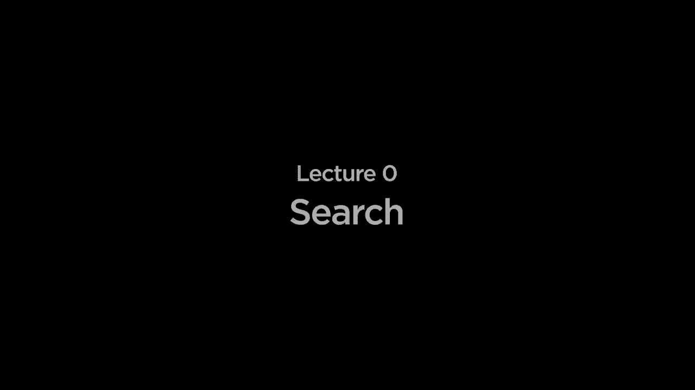

好的，欢迎大家来到人工智能与Python的介绍课程，我的名字是布赖恩，在这节课中，我们将探索一些人工智能基础的思想、技术和算法。人工智能涵盖了多种类型。

每当你看到计算机做出某种看似智能或理性的事情，比如在照片中识别某人的脸，或能够比人类更好地玩游戏，或能够理解我们与手机对话时的语言，这些都是技术的表现。

回应我们，这些都是人工智能或人工智能的例子，在这节课中，我们将探讨使得这些人工智能成为可能的一些思想，因此我们将开始我们的讨论，搜索问题，即我们有一个人工智能，我们希望它能够搜索解决某种问题的方案，无论那是什么。

问题可能是无论它试图从A点到哪里获取行驶方向。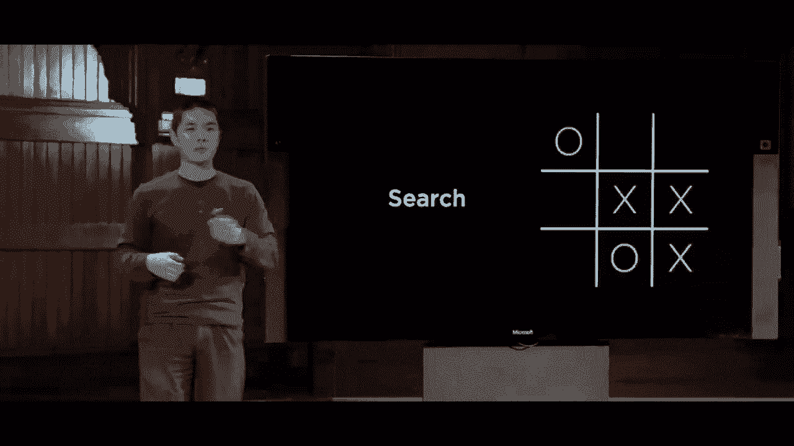

点B或尝试弄清楚如何在给定的井字游戏中进行游戏。

例如，弄清楚它应该做什么移动，然后我们将看一看。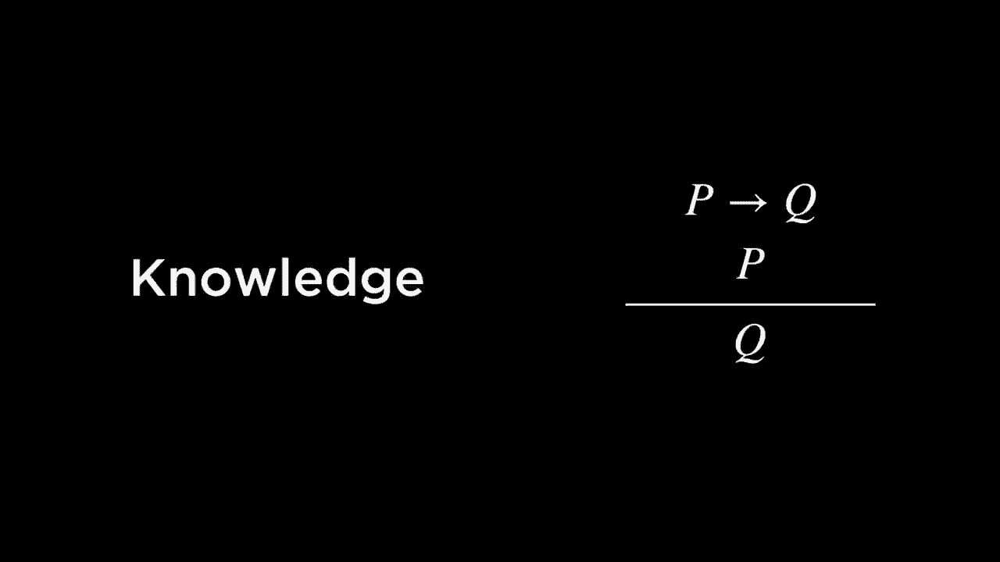

知识理想情况下，我们希望我们的人工智能能够知道信息，能够表示该信息，更重要的是，能够从这些信息中得出推论，能够利用它所知道的信息并得出额外的结论，因此我们将讨论如何对人工智能进行编程。

为了做到这一点，我们将探讨不确定性的话题，讨论当计算机对某个事实不确定时会发生什么，也许它只对某个概率有把握，因此我们将讨论一些概率背后的思想，以及计算机如何开始处理不确定事件。

为了在这一意义上更加智能。之后我们将把注意力转向优化问题，当计算机试图优化某个目标时，尤其是在可能有多种方式解决问题的情况下。

我们在寻找一种更好的方法，或者说潜在的最佳方法。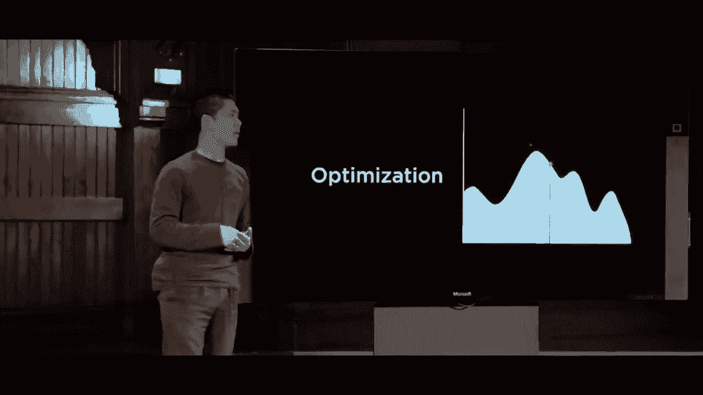

如果一切都是可能的，那么我们将看看机器学习，或更一般的学习，以及当我们可以访问数据时，计算机如何能够通过从数据中学习和从经验中学习，被编程得非常智能，能够越来越好地执行任务。

基于更大的数据访问，因此，例如您的电子邮件，您的电子邮件收件箱以某种方式知道哪些电子邮件是好的，哪些电子邮件是垃圾邮件，这些都是计算机能够从过去的经验和数据中学习的示例，我们也将看看计算机如何能够。

从人类智能中汲取灵感，观察人脑的结构，以及神经网络如何成为计算机的类似物，如何利用某种类型的计算机程序结构，我们可以编写能够执行非常非常任务的神经网络。

有效地，最后我们将关注语言，不是编程语言，而是我们每天使用的人类语言，并观察计算机理解自然语言时所面临的挑战，以及自然语言的一些。

现代人工智能中发生的处理实际上可以。

但是今天我们将以搜索开始我们的对话，这个问题是试图弄清楚在某种环境中计算机处于什么情况，所谓的代理，希望该代理能够以某种方式寻找解决方案。

现在，这些问题可以有多种不同的格式。一个例子可能是经典的15拼图，您可能见过，它带有滑动的瓦片，您试图滑动。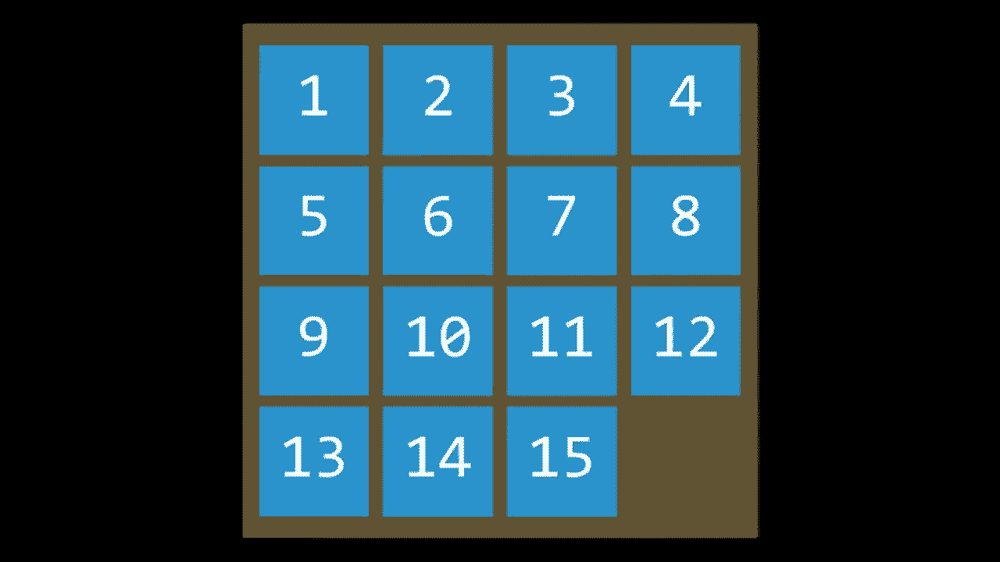

瓦片的排列顺序，以确保所有数字都按顺序排列，这就是一个您可能称之为搜索问题的示例，15拼图从一个最初混乱的状态开始，我们需要某种方法找到移动的方式，以便将拼图恢复到已解决的状态，但还有类似的。

这些问题可以用其他方式表述，试图找到穿越迷宫的道路，例如，是搜索问题的另一个示例，您从一个地方开始，目标是您想要到达的地方，您需要找出正确的行动顺序，使您从初始状态到达。

目标，尽管这有点抽象，每当我们在这门课中讨论迷宫解决时，您可以将其转换为更现实的东西，比如驾驶方向，如果您曾想知道谷歌地图如何能够找出您从A点到B点的最佳路径。

取决于交通的时间，例如，它通常是某种搜索算法，您有一个人工智能，试图从初始位置到达某种目标，通过采取一系列动作，因此今天我们的对话将从思考这些类型的搜索问题开始，就像这样。

为了使AI能够找到好的解决方案，做到这一点。

我们需要引入一些术语，其中一些我已经使用过，但我们需要考虑的第一个术语是代理，代理只是一个感知其环境的实体，它能够以某种方式感知周围的事物并对环境采取行动。

在驾车导航的情况下，代理可能是汽车的一种表示，它试图弄清楚采取什么行动才能到达目的地；在15拼图中，移动瓷砖的代理可能是试图解决这个难题的AI或人。

找出要移动哪些瓷砖，以便达到解决方案，接下来我们引入状态的概念，状态只是代理在其环境中的某种配置。比如在15拼图中，任何状态可能是这三种之一，状态仅仅是瓷砖的某种配置。

这些状态各不相同，并且每个状态都需要稍微不同的解决方案，每个状态所需的动作序列也会不同，以便从初始状态到达目标。

代理开始的位置是其中一个状态，我们将从这里开始，这将是我们搜索算法的起点，可以这么说，我们将从此开始。

初始状态之后，我们开始对其进行推理，思考对初始状态可能应用哪些动作，以便弄清楚如何从起始位置到达我们的目标，并且我们如何从初始位置走向目标。

最终，通过采取动作，我们可以做出在任何给定状态下的选择，在AI中，我们总是会尝试更精确地形式化这些思想，以便能够更数学化地编程。因此，这将是一个反复出现的主题。

更精确地定义动作作为一个函数，我们将有效地定义一个称为动作的函数，它接受一个输入s，其中s将在我们的环境中存在某种状态，actions of s将接受状态输入并返回所有可以执行的动作集合作为输出。

在某些状态下，某些动作是有效的，而在其他状态下则不是，我们很快会看到这方面的例子。在这种情况下，

以15拼图为例，通常会有四种可能的动作可以执行。大多数情况下，我们可以将一个方块滑到右边、滑到左边、向上滑动或向下滑动。例如，这些将是可用的动作，因此我们的AI或程序需要某种。

状态的编码通常是这样的。

将以某种数值格式呈现，并且对这些动作进行某种编码，但它也需要对这些事物之间的关系进行编码。状态与动作之间是如何相互关联的，为此我们将向我们的AI引入一个转换模型，这将描述什么。

我们在执行某个可用动作后的状态，以及在其他状态中。我们可以更准确地定义这个转换模型，再稍微正式一些，再次定义为一个函数。这个函数将是一个名为result的函数，这次接受两个输入，输入数字一是某个状态s。

输入数字二是某个动作，结果函数的输出将给我们在状态s中执行动作a后得到的状态。那么让我们看看一个例子，更精确地了解这实际上意味着什么。这是一个15拼图的状态示例，以下是一个例子。

当一个动作将一个方块滑到右边时，如果我们将这些作为输入传递给结果函数，结果函数将这个棋盘状态作为第一个输入，并将一个动作作为第二个输入，当然在这里我以视觉方式描述事物，以便你可以清楚地看到状态是什么。

在计算机中，动作ISM可能代表这些动作之一。只是一些表示动作的数字，或者如果你熟悉枚举（enums），它可以让你枚举多个可能性，可能会是像这样的状态，这个状态可能只会被表示为一个数组或二维数组。

存在的数字，但在这里我们要以视觉方式展示它，这样你就能看到。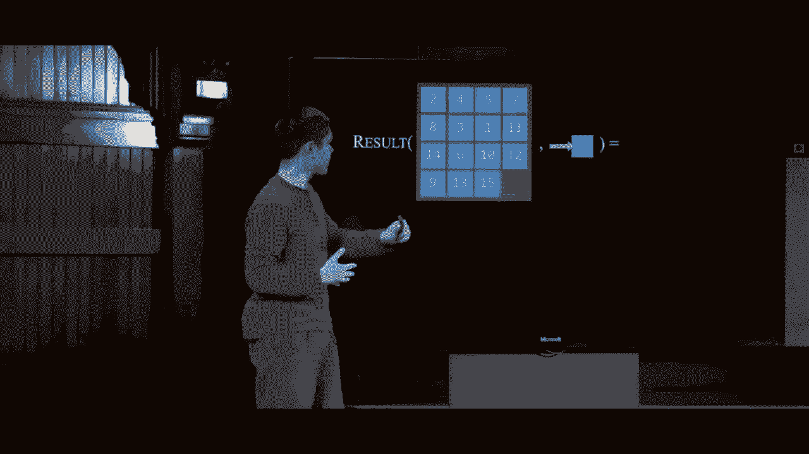

但是当我们将这个状态和这个动作传递给结果函数时，输出是一个新的状态，我们在将一个方块滑到右边后得到的状态。如果我们有一个不同的动作和不同的状态，并将其传递给结果函数，我们将。

得到一个完全不同的答案，所以结果函数需要处理如何获取一个状态并采取一个动作来得到结果。这将是我们的转换模型，描述状态与动作之间是如何相互关联的。如果我们考虑这个转换。

模型，想得更一般一些，跨越整个问题，我们可以形成一个我们称之为状态空间的集合。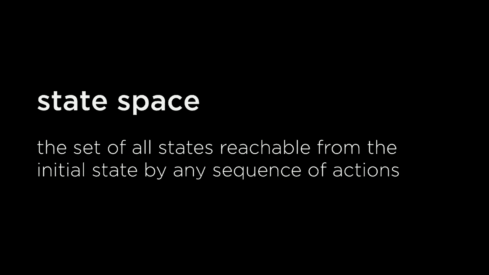

我们可以从初始状态通过任何序列获得的所有状态。

通过采取零个、一个、两个或更多的动作来实现的动作。因此，我们可以绘制一个类似这样的图表，其中每个状态通过一个游戏板表示，并且有箭头连接每个状态到所有其他状态。我们可以从那个状态到达的状态空间远比你在这里看到的要大得多。

这只是状态空间可能实际样子的一个示例，通常在许多搜索问题中，无论是这个特定的15拼图、驾驶方向还是其他东西，状态空间大致上都会像这样。我们有单独的状态和从一个状态到另一个状态的箭头，以及一个转移模型，定义了在我们采取特定动作后会发生什么。

将它们连接起来，通常为了简化，我们会将整个表示简化为图形，一系列连接节点的节点和边。但你可以将这种更抽象的表示视为完全相同的概念，每一个小圆圈或节点将代表。

这是我们问题中的一个状态，这里的箭头表示我们在任何特定状态下可以采取的动作，将我们从一个特定状态转移到另一个状态。例如，现在我们有了表示这些状态的节点的概念，以及可以使我们达到特定目标的动作。

所以，我们需要弄清楚的下一步是，如何知道人工智能何时完成解决问题。人工智能需要某种方式来知道它到达了目标，找到了目标。

接下来我们需要在人工智能中编码的是一个目标测试。某种方式来确定给定状态是否为目标状态。以驾驶方向为例，如果你处于与用户输入的预期目标状态相对应的状态，可能就相当简单。

在15拼图中，可能需要检查数字，以确保它们都是按升序排列的。但AG是某种方式来编码是否处于任何状态的目标，某些问题可能只有一个目标，比如迷宫，其中有一个初始位置和一个结束位置，那就是目标。

在复杂的问题中，你可能会想象有多个可能的目标，并且有多种方法来解决一个问题。我们可能不在乎计算机找到哪个目标，只要它能找到即可。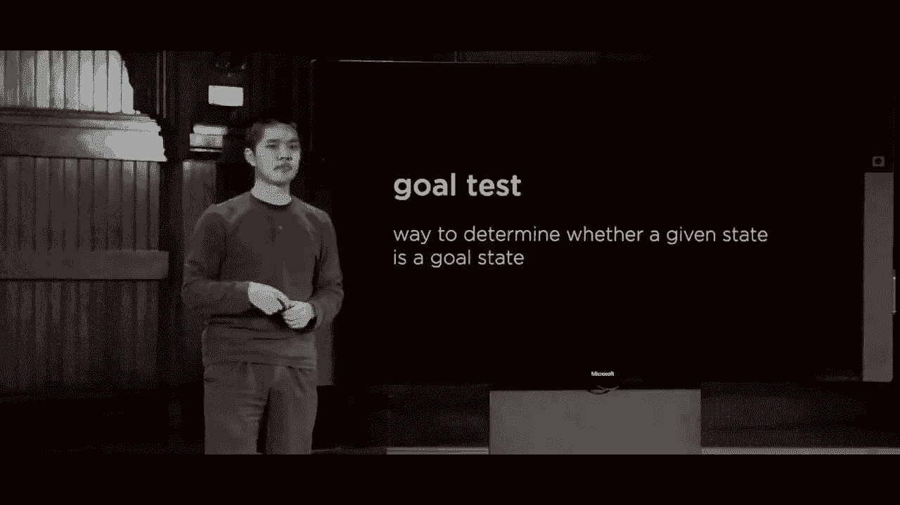

然而，有时计算机并不仅仅关心找到一个目标，而是要找到一个好的目标，或者说是一个成本较低的目标。因此，我们将用来定义这些搜索问题的最后一个术语是“路径成本”，你可以想象。

在驾驶方向的情况下，如果我说我想要从A点到B点的路线，而谷歌地图给我的路线是一个冗长的、有很多不必要绕路的路线，这会非常烦人，这样花费的时间比我到达目的地所需的时间要长。

因为在制定搜索问题时，我们通常会给每一个。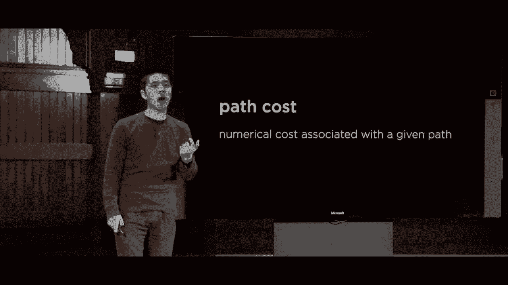

路径有某种数值成本，告诉我们采取这个特定选项的代价，然后告诉我们的人工智能，我们不仅要找到从初始状态到目标的解决方案，我们确实希望找到一个能最小化路径成本的解决方案。

如果我们想要的结果是用更少的时间或最小化某些其他数值，我们可以通过图形表示这一点，如果我们再次查看这个图，想象这些箭头，每个我们可以从一个状态到另一个状态的动作都有一个与之相关的数字，这个数字是路径成本。

这个特定动作的情况是，任何特定动作的成本可能比其他某些动作的成本更高，例如。尽管这只会在某些问题中发生，在其他问题中，我们可以简化图示，假设任何特定动作的成本。

这在15拼图之类的情况下可能是相同的，例如，移动向右或移动向左并没有太大区别，唯一重要的是从A点到B点所需的总步数，每一步的成本是相等的。

我们可以假设它的成本是某种常量，比如1，这就形成了我们可能考虑的搜索问题的基础，搜索问题有某种初始状态，我们开始的地方，有一些我们可以采取的动作或多种动作。

过渡模型是定义从一个状态到另一个状态时采取某一动作后会发生什么，我们最终会处于什么状态。此外，我们需要一个目标测试，以了解我们是否已达到目标，然后我们需要一个路径成本函数，告诉我们通过任何特定路径的成本。

一些动作序列的路径有多昂贵，这条路径的成本在金钱、时间或其他资源方面是多少。

我们试图最小化用户的工作，而最终的目标是找到一个解决方案，这里解决方案只是一些动作序列，将我们从初始状态带到目标状态，理想情况下，我们希望找到的不仅仅是任何解决方案，而是最优解决方案，即成本最低的解决方案。

在所有可能的解决方案中，路径成本有时可能会存在多个最佳解决方案，但最佳解决方案仅意味着没有更好的方法来找到该解决方案。

现在我们已经定义了问题，现在需要开始弄清楚我们将如何解决这种搜索问题。为此，你可能会想象我们的计算机需要表示与此相关的一整堆数据。

对于特定问题，我们需要表示关于我们在问题中位置的数据，我们可能需要同时考虑多种不同的选项。通常，当我们试图将与某个状态相关的大量数据打包在一起时，我们将使用我们将称之为的数据结构。

节点是一个数据结构，它将跟踪各种不同的值，特别是在这个情况下。

在搜索问题的情况下，它将特别跟踪这四个值，每个节点将跟踪一个状态，即我们当前所在的状态，每个节点还将跟踪一个父节点，父节点是我们到达当前状态之前的状态，或者是我们用来到达这个状态的节点。

当前状态，这一点很重要，因为最终一旦我们到达目标节点，一旦我们到达终点，我们想知道我们为了到达该目标所采用的动作序列，而我们知道这一点的方法是查看这些父节点，以跟踪是什么引导我们到达目标，以及是什么引导。

引导我们到该状态，以及让我们到达之前状态的路径，以此类推，回溯到开始，这样我们就知道从开始到结束所需的整个动作序列。节点还将跟踪我们采取了什么动作，以便从。

当前状态的父节点，同时节点还将跟踪路径成本，换句话说，它将跟踪一个数字，该数字表示从初始状态到我们当前所在状态所花费的时间，随着我们开始讨论这个问题的相关性，我们将看到这一点。

我们可以在这些搜索问题上进行的一些优化。更一般地说，这就是我们将要使用的数据结构，以解决问题。现在让我们谈谈方法，我们可能如何开始解决这个问题，正如你所想象的那样。

我们将从一个特定状态开始，只是从那里进行探索，直觉上，从给定的状态出发，我们有多个选择可供我们采取，我们将探索这些选项，一旦我们探索了这些选项，就会发现会有更多的选项。

可用的节点，我们将考虑所有可用选项，将其存储在一个名为前沿的单一数据结构中。前沿将代表我们可以探索的所有事情，这些事情我们尚未探索或访问。

在我们的方法中，我们将通过一个仅包含一个状态的前沿开始搜索算法，前沿将包含初始状态，因为在开始时，这就是我们知道的唯一状态，也是唯一存在的状态，然后我们的搜索算法实际上是。

我们将遵循一个循环，不断重复某个过程。首先，如果前沿是空的，那么就没有解决方案，我们可以报告没有办法到达目标，这当然是可能的，某些类型的问题可能是AI尝试解决的。

需要探索并意识到没有办法解决该问题，这对人类了解也是有用的信息，因此如果前沿为空，这意味着没有剩下的探索，我们尚未找到解决方案，因此没有解决方案，没有剩下的可探索内容，否则我们。

我们将从前沿中移除一个节点，现在在开始时，前沿仅包含一个代表初始状态的节点，但随着时间推移，前沿可能会增长，可能包含多个状态，因此在这里我们只会从该前沿中移除一个节点。

如果该节点恰好是目标，那么我们找到了一个解决方案，因此我们从前沿中移除一个节点，并问自己这是目标吗，我们通过应用之前谈到的目标测试来实现，问我们是否到达了目的地，或者问15拼图的所有数字是否按顺序排列。

目标是找到解决方案，太好了，我们完成了。否则，我们需要做的是扩展节点，这在人工智能中是一个专业术语，扩展节点意味着查看该节点的所有邻居，换句话说，考虑所有可能的行动。

我可以从这个节点所代表的状态采取的所有行动，以及我可以从那里到达哪些节点。我们将获取所有这些节点，即从当前节点可以到达的下一个节点，并将其添加到前沿，然后重复这一过程。总体来说，这个想法是。

从一个包含初始状态的前沿开始，不断从前沿中移除一个节点，查看我们可以到达的下一个节点，并将这些节点添加到前沿，重复这个过程，直到我们从前沿中移除一个节点并且它包含目标。

意味着我们已经解决了问题，或者我们遇到了一种情况，边界为空，此时我们就没有解决方案，所以让我们实际上尝试将伪代码付诸实践，看看一个示例搜索问题。因此，在这里我有一个示例图，a 通过。

这个动作 B 连接到节点 C，D 连接到 E，而 E 连接到 F，我希望我的 AI 找到从 A 到 E 的路径，我们想要从这个初始状态到达这个目标状态，那么我们将如何做到这一点呢？我们将从包含初始状态的边界开始。

代表我们的边界，所以我们的边界最初只包含 a 这个初始状态，我们将开始，现在我们将重复这个过程，如果边界为空，没有解决方案，那不是问题，因为边界不为空，所以我们将从边界中移除一个节点，作为下一个考虑的节点。

边界中只有一个节点，所以我们将其从边界中移除，但现在 a 是初始节点，这就是我们当前考虑的节点。我们按照下一步进行，问自己这个节点是否是目标，不，它不是，a 不是目标，而 e 是目标，所以我们不返回解决方案，因此我们转到最后一步。

展开节点并将结果节点添加到边界，这意味着什么呢？好吧，这意味着取这个状态 a 并考虑我们下一个可以到达的地方，a 后我们能到达的地方只有 B，因此这就是我们展开 a 时得到的结果，我们找到 B，并将 B 添加到边界，现在 B 在边界中。

我们再次重复这个过程，我们说，好吧，边界不为空，所以让我们从边界中移除 B，B 现在是我们正在考虑的节点。我们问自己，B 是目标吗？不，不是，所以我们继续展开 B 并将其结果节点添加到边界。展开 B 会发生什么，换句话说。

我们可以从 B 到达哪些节点呢？我们可以到达 C 和 D，因此我们将继续从边界添加 C 和 D，现在边界中有两个节点 C 和 D。我们再次重复这个过程，从边界中移除一个节点，暂时我会任意选择 C，稍后我们会看到选择哪个节点。

你从边界移除的节点实际上是算法中一个相当重要的部分，但现在我会任意移除它，因为说它不是目标，因此我们将下一个节点添加到边界，然后假设我从边界移除你，现在我检查一下，当前我正在查看的状态 e 是否是目标状态。

这是因为我正在尝试找到从 A 到 E 的路径，因此我将返回目标，现在这将是我能够返回的解决方案，我找到了从 A 到 E 的路径。因此，这是这个搜索算法的总体思路，遵循这些步骤，不断从边界中移除节点。

前沿，直到我们能够找到一个解决方案，所以下一个你可能合理问的问题是，这里可能出什么问题，采用这种方法的潜在问题是什么。

一个可能出现的问题的例子是，想象一下这个与之前相同的图表，唯一的变化是现在而不是。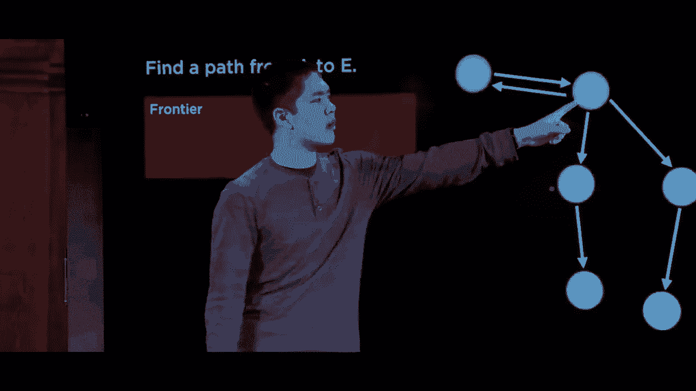

从A到B有一条箭头，我们也有从B到A的箭头，意味着我们可以双向移动，这在类似于15个可能的情况下是正确的，当我将一个拼图块向右滑动时，我可以然后向左滑动一个拼图块回到原来的位置，我可以在A和B之间来回移动。

这就是这些双箭头所象征的，从一个状态我可以到达另一个状态，然后我可以再回去，这在许多搜索问题中都是正确的，如果我尝试。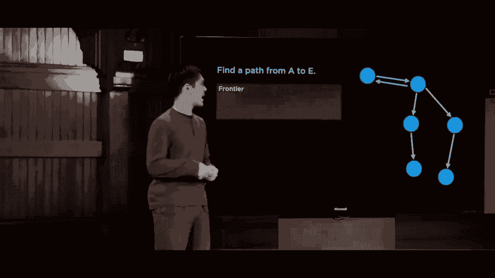

现在我们将应用相同的方法，我们都将以之前的方式开始，我会。

从前沿中移除A，然后我会考虑从A可以到达哪里，A之后我唯一可以到达的地方是B，因此B进入前沿，然后我会说，好吧，让我们看看B，这是前沿中剩下的唯一一项，我可以从B到达哪里，之前只是C和D，但现在。

由于那个反向箭头，我可以到达A、C或D，因此A、C和D这三者都进入前沿，我可以从B到达的地方，现在我从前沿移除一个，可能我运气不好，选择了A，现在我再次看着A，考虑我可以从A到哪里。

从A到B我可以到达，现在我们开始看到问题，但如果我不小心，我从A到B然后。

回到A，然后再次到B，我可能会陷入这个无限循环中，永远无法取得进展，因为我一直在两个我已经见过的状态之间来回移动。那么这个问题的解决方案是什么？我们需要某种方法来处理这个问题，我们可以处理这个问题的方式是。

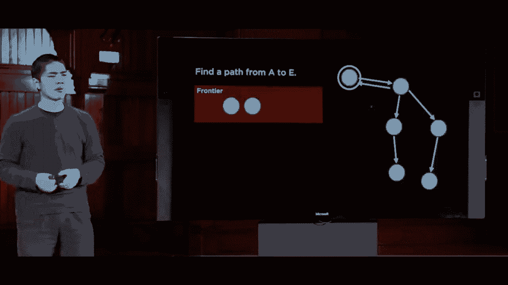

通过某种方式跟踪我们已经探索过的内容，逻辑是，如果我们已经探索过该状态，就没有理由再回去，一旦我们探索了一个状态，就不要再回去，不要再将其添加到前沿。

不需要这样，所以这将是我们修订的方法，一个更好的解决此类搜索问题的方法，虽然看起来非常相似，只是进行了几处修改，我们将从一个包含初始状态的前沿开始，与之前相同，但现在我们将使用另一种数据结构。

这将只是我们已经探索过的一组节点，那么我们最初探索过的状态是什么呢？它是空的，我们有一个空的已探索集合。现在我们重复，如果边界为空，则没有解决方案，和之前一样，我们从边界中移除一个节点，检查它是否是目标状态，返回。

解决方案到目前为止没有任何不同，但现在我们要做的是将节点添加到已探索状态中，因此如果它恰好在边界中并且不是目标，我们将其添加到已探索集合中，这样我们就知道我们已经探索过它，不需要再返回。

然后最后一步是扩展节点，并将结果节点添加到边界，但在我们之前总是将结果节点添加到边界时，这次我们会聪明一点，仅当节点不在边界中时才添加它们。

它们还不在已探索集合中，所以我们会检查边界和已探索集合，确保节点不在这两者中，只要不在，我们就可以将其添加到边界，否则就不添加。因此，这种修订后的方法是**最终**能帮助我们。

确保我们不在两个节点之间来回移动，现在我这里有一点我到目前为止略过了，那就是在移除节点之前的这一步。我之前随意选择了一个节点进行移除，但事实证明，我们如何决定构建我们的结构实际上是相当重要的。

边界是一个数据结构，我们需要选择我们将以什么顺序移除元素，而添加和移除元素的最简单数据结构之一是栈，栈是一种数据结构。

这是一种后进先出的数据类型，这意味着我最后添加到边界的东西将是我从边界中移除的第一个东西。因此，在这种情况下，最后进入栈或边界的东西是！

这将是我探索的节点，所以让我们看看如果我将这种基于栈的方法应用到这样的一个问题上，即从A到E寻找路径，会发生什么。我们将从A开始，并说好，让我们先看A，然后注意到这次我们添加了A。

已探索集合A是我们现在已经探索过的东西，我们有这个数据结构在跟踪。然后我们说从A可以到达B，好的，从B我们可以做什么呢？从B我们可以探索B，并到达C和D，因此我们添加了C和D。所以现在当我们探索一个节点时，我们将边界视为一个。

栈是后进先出，D是最后被探索的节点，接下来我们说，好吧，我们能从D到达哪里？我们可以到达F，没问题，我们会探索它，把F放入前沿，现在因为前沿是一个栈，F是最近进入栈的元素，所以F是我们接下来要探索的节点。

现在我们说，好吧，我们能从F到达哪里？我们什么地方也去不了，所以前沿没有新元素被添加。那么现在最近添加到前沿的元素是什么？现在是C，前沿中唯一剩下的元素，我们将从C进行探索，从中可以看到，从C我们可以到达E，所以E被放入。

在前沿中，我们说，好吧，E看起来是个选项，E现在是解决方案，我们已经解决了问题。因此，当我们把前沿视为一个栈，一个后进先出的数据结构时，得到的结果是从A到B再到D再到F，然后我们稍微退回，去探索C。

E，重要的是要对这个算法的工作方式有一个直观的理解。我们在这个搜索树中走得非常深，直到底部，遇到了死胡同，然后我们有效地退回，探索另一条之前未尝试的路径，这种方式在搜索中深入很重要。

搜索树的理念是这样的，算法在我们使用栈时能够工作。我们称这种算法的版本为**深度优先搜索**。深度优先搜索是一种搜索算法，我们始终探索前沿中最深的节点。

我们在搜索树中不断深入，如果遇到一个...
