# 哈佛CS50-AI ｜ Python人工智能入门(2020·完整版) - P20：L6- 自然语言处理 1 (语言，语法与语义，nltk，n-grams) - ShowMeAI - BV1AQ4y1y7wy

[音乐]。

好的，欢迎大家回来，进入我们关于人工智能与Python的最终主题，今天的主题是语言。在课程中，我们已经看到与AI交互的多种方式，但大部分是我们构建的方式。

以AI能够理解的方式解决问题，学习用AI的语言来表达，尝试将一个问题转化为搜索问题，或将其转化为约束满足问题，这是我们今天的目标。

想出算法和理念，允许我们的AI与我们达成某种共识，能够理解、解释并获取人类语言中的某种含义。

口语中的语言类型，如英语或其他我们自然使用的语言，这对AI来说是一个非常具有挑战性的任务，确实涵盖了多种类型。

所有任务都在自然语言处理的广泛范畴下，提出算法使我们的AI能够处理和理解自然语言。这些任务在我们希望AI执行的任务类型和我们可能使用的算法类型上各不相同。

一些常见任务包括自动摘要，你给AI一个长文档，希望AI能够总结出来，形成同一思想的简短表达，但仍然使用某种自然语言，如英语。

在给定大量信息的文档或互联网内容时，我们希望我们的AI能够提取一些有意义的语义信息，能够阅读并进行语言识别，任务是识别某一页面所用的语言。

确定文档所写的语言类型，这种情况在你使用网页浏览器时可能会出现，比如当你打开一个其他语言的页面时，浏览器可能会询问你，哦，我认为它是这种语言，你要我帮你翻译成英语吗。

识别过程是RAI需要能够完成的任务，这与机器翻译相关，即将一种语言的文本翻译成另一种语言，这方面在过去几年里有很多研究和发展，依然在持续进行。

在人工智能领域，改善如何将一种语言的文本转换为另一种语言是一个重要话题。此外，我们还有命名实体识别的主题，给定一段文本，你能识别出命名实体吗？这些实体通常是公司名称或。

人名或地点名，例如，它们常常是特定文档中的相关或重要部分。语音识别作为一个相关任务，不是处理书面文本，而是处理口语文本，能够处理音频并确定所说的实际单词。

如果你想想像Siri或Alexa这样的智能家居设备，这些设备现在能够在我们说话时倾听，弄清楚我们说了什么，并从中提取某种意义。我们讨论过如何将一些东西构想成。

隐马尔可夫模型能够得出这些结论和文本。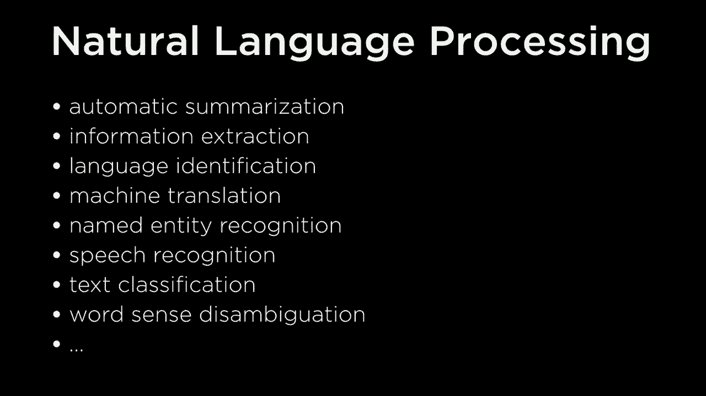

分类通常是一个广泛的类别，每当我们想将某种文本放入某种类别时，我们就会看到这些分类问题，以及如何利用统计机器学习方法来解决它们。

在自然语言中，我们可能需要做一些调整，我们将很快看到，像词义消歧这样的概念，与数字语言不同，AI在所有事物的表示上是非常精确的，而单词在意义上则有些模糊。

意义和单词可以有多重不同的含义，自然语言本质上是模糊的，今天我们将探讨一些这些模糊之处，但如果你希望AI理解自然语言，一个具有挑战性的任务是能够消歧或区分。

如果我说“我去银行”，你需要弄清楚我指的是存取款的银行，还是河岸。不同的词可以有不同的含义，我们可能想要基于上下文来弄清楚这些。

一个词出现的范围，包括句子、段落或论文，可能有助于我们了解如何在不同的含义之间进行消歧。

为了解决这些问题而设计的算法，今天我们将仅仅触及表面，看看一些基本概念，这些概念在自然语言处理和试图提出AI算法时会发现许多。

我们能够用我们每天说的语言做一些有意义的事情。因此，当我们考虑语言时，通常可以从几个不同的部分进行思考。第一部分涉及语言的句法，这更多的是与语言的结构有关。

这个结构是如何工作的。

如果你考虑自然语言，句法就是这样一种东西。如果你是某种语言的母语者，它会很自然地浮现出来，你不需要过多思考。如果我给你一个来自阿瑟·柯南·道尔的福尔摩斯的句子，比如在这之前的句子。

九点钟，福尔摩斯快步走进房间。我想我们都可以同意这是一个结构良好的语法句子。从句法上讲，它在这个特定句子的结构方面是有意义的，句法不仅适用于自然语言，也适用于编程语言。

如果你见过自己编写程序中的语法错误，那很可能是因为你写了一种不符合句法规则的程序。它的结构并不是一个有效的程序。以同样的方式，我们也可以看待英语。

在任何自然语言中句子或句子可以进行相同类型的判断。我可以说这个句子在句法上是结构良好的，当所有组成这些词的部分按照这个顺序组合时，它构造了一个语法正确的句子，或者说大多数人会同意这是一个语法正确的句子。

但也有语法上不良构造的句子，比如“九点钟福尔摩斯”。

快步走进房间。我想我们都会同意这不是一个结构良好的句子，从句法上讲它没有意义。这正是如果我们希望我们的 AI 生成自然语言，例如像聊天机器人那样与我们交流时，所需要解决的问题。

例如，我们的 AI 将需要能够识别这种区别。它需要能够知道哪些句子是语法正确的，哪些句子不是，我们可能会提出规则或方法来统计学习这些概念，我们将讨论一些这些方法。

句法也可能是模棱两可的，有些句子是这样的。

结构良好与结构不良之间存在某种方式，你可以对一个句子进行不同结构的多种构造。

比如，我在山上用望远镜看到了那个人。这是一个语法结构良好的句子，从句法上讲是有意义的。

但是这个句子的结构是什么？是“在山上的男人有望远镜”，还是“我看到山上的男人，我正在使用望远镜来观察山上的男人”？这里有一些有趣的模棱两可的地方，可能有两种不同的理解。

结构，这也是我们将在处理自然语言时，思考如何与AI打交道时会回到的一个概念，因为自然语言本质上是模棱两可的。因此，语法是语言的结构，理解单词的顺序和位置如何影响我们的理解。

提出了不同的语言结构，但除了语言有结构之外，语言还有意义，现在我们进入了。

语义是指一个单词、一组单词、一个句子或整篇文章实际上意味着什么，所以像“在九点钟前，福尔摩斯精神抖擞地走进了房间”这样的句子，与“福尔摩斯精神抖擞地走进了房间”是不同的句子。

在九点钟前的房间，然而它们实际上有相同的意义。它们是不同的句子，因此当AI读取它们时会将其识别为不同，但我们人类可以看这两个句子并说，是的，它们基本上是相同的意思，也许在这个情况下谁穿着。

因为我改变了单词的顺序，原本“九点钟”在句子的开头，现在“九点钟”在句子的末尾。你可能会想，我可以想出一个完全不同的句子，比如“在九点钟前几分钟，福尔摩斯快速走进了房间”。

房间，这也有一个非常相似的意思，但我使用不同的词来表达这个想法，理想情况下，AI应该能够识别这两个句子，这些不同的词组合相似的意思，并能够理解这个想法。

语法上正确的句子也可能根本没有任何意义，一个著名的例子来自于。

语言学家诺姆·乔姆斯基的这句话是“无色的绿色思想疯狂地睡觉”，从语法上看，这个句子完全没问题，“无色”和“绿色”是修饰名词“思想”的形容词，“睡觉”是一个动词，某种程度上作为副词。

旧词的句子，但事实证明这个句子在某种程度上是没有意义的，如果你试图给这个句子赋予意义，那它意味着什么并不容易确定。语义本身也可能是模棱两可的，因为不同的结构可以有不同类型的。

不同单词可以具有不同类型的含义，所以相同结构的句子可能最终意味着不同类型的东西。我最喜欢的例子来自洛杉矶时报，标题曾经出现在《洛杉矶时报》上。

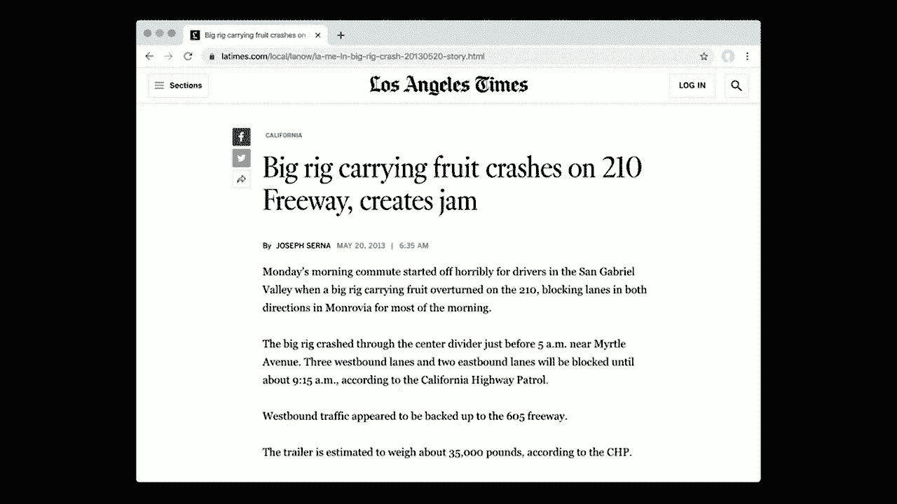

标题说“大卡车运送水果，在210号高速公路上发生碰撞，造成堵塞”，所以根据你如何看待这个句子，以及如何解释它，它可能有多种不同的含义，因此在自然语言处理领域，有两个挑战：能够理解句法。

语言和语言的语义，今天我们将一起探讨这两个概念，我们将首先谈论句法，了解语言是如何构造的，我们可以通过制定一些规则来告诉我们的计算机，告诉我们的人工智能什么类型的。

有效句子是什么，哪些类型的东西不是有效句子，最终我们希望利用这些信息，让我们的人工智能得出有意义的结论，能够对语言进行操作。因此，我们将通过引入形式语法的概念来开始。

形式语法的全部内容是，形式语法是一种生成语言中句子的规则系统，我想知道有效的英语句子是什么，不是从它们的含义上，而是从它们的结构上来看。英语的句法结构中，哪些结构是有效且正确的。

英语的句子结构是什么，并不有效，它将以非常类似的方式应用于其他自然语言，因为语言遵循某些类型的结构，我们直观地知道这些结构的含义，但尝试正式定义这些结构的含义将是有帮助的。

结构的定义有许多不同类型的形式语法，这些语法被称为乔姆斯基语法层次结构，如果你曾经使用过正则表达式，可能会见过其中一些，它们属于正则语言的类别。

正则语言对应于一种特定类型的语言，但在这个层次上还有一种被称为上下文无关语法的语法，今天我们将主要关注它，上下文无关语法是通过所谓的重写规则生成语言中的句子的一种方法。

替换一个符号与其他符号的规则，我们稍后将看看这是什么意思，假设一个简单的英语句子，比如“她看到了城市”。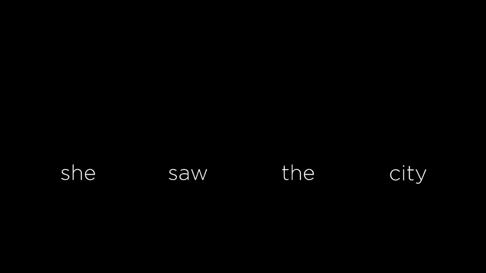

这是一个有效的语法上良好的英语句子，但我们希望AI能够以某种方式查看这个句子，并弄清楚句子的结构，因为为了回答一个问题，如果想象AI处于问答模式，想问AI一个。

问题是她看到了什么，那么AI希望能够查看这个句子并识别她所看到的是城市，能够弄清楚这一点，这需要一些理解，即这个句子的结构实际上是什么样子的。

我们将要称之为终结符的城市，语言中有这些单词，每个单词都是一个符号，这最终是我们关心生成的内容。

关于生成这些单词，但每个单词我们也会关联一个我们称之为的。

非终结符号最初看起来像词类，如果你回忆一下英语语法，“she”是一个名词，“saw”是V动词，“the”是D，D代表限定词，这些词如“the”、“a”和“an”。

例子是city，city也是一个名词，所以n在这里，所以每个。

这些NV和D是我们可能称之为非终结符号，它们实际上不是语言中的单词，“she saw the city”才是语言中的单词，但我们使用这些非终结符号来生成终结符号，终结符号如“she saw the city”这些实际的单词。

在像英语这样的语言中，为了将这些非终结符号翻译成终结符号，我们有称为重写规则的东西，这些规则看起来像这样，左边有一个n的箭头，箭头表示如果我有一个N的非终结符号，我就可以将其转换。

进入这些不同的可能性中。

这些是用垂直线分隔开的，因此一个名词可以翻译成单词she，名词也可以翻译成单词city、car或Harry等许多其他东西，这些都是名词的例子，另一方面，限定词D可以翻译成the、a或an，动词v4可以翻译成任何的。

这些动词P作为介词可以翻译成任何这些介词，比如to、on、over等，而形容词DJ则无法翻译成任何可能的形容词，因此这些在我们的上下文无关文法中就是规则。

英语语言或任何其他语言的结构是什么，我们给它这些类型的规则，表明一个名词可以是这些。可能性中的任何一个，一个动词可以是那些可能性中的任何一个，但事实证明，我们可以开始构建其他规则，那里不仅仅是一个非终结符。

转换为一个终结符号，我们总是会在箭头的左侧有一个非终结符，在箭头的右侧我们可以有其他东西，我们甚至可以有其他非终结符号。那么我想说的是什么呢？我们有名词的概念，比如“她”“城市”。

例如“车哈利”，但还有名词短语，像可以作为名词的短语，不只是单个，词，而是多个词对吧。“城市”是两个词，结合在一起，作为我们可能称之为名词短语，它是多个词，但它们，结合在一起作为名词，或者如果你。

想想更复杂的表达，像“大城市”三个词作为一个单一的名词运作，或“街上的车”多个词，现在，但那整个词组作为，像一个名词，替代名词短语。所以为此我们将引入，一个新的非终结符号的概念。

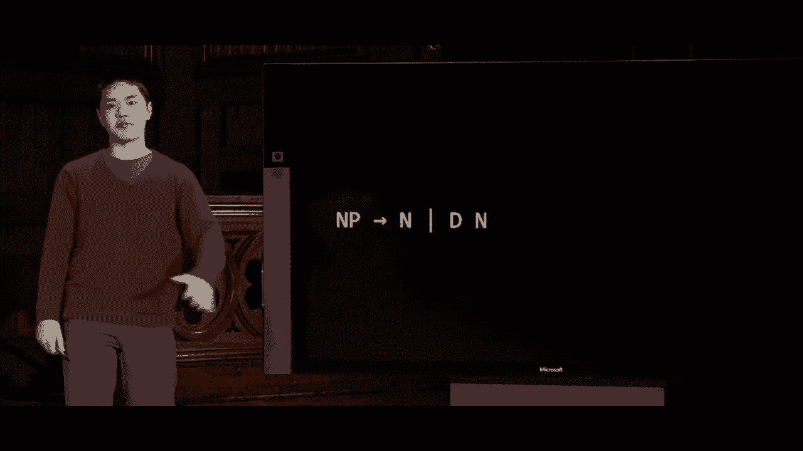

称为NP，代表名词短语，这个重写规则表明，名词短语可以是名词，因此，像“她”这样的东西是名词，因此它也可以是名词短语，但名词短语也可以是一个。

限定词D后面跟着一个名词，因此在这个非常简单的语法中，我们有两种方式可以形成名词短语。当然英语。

语言比这更复杂，但名词短语是我，著名的，或它是一个限定词，后面跟着一个名词。所以对于第一个，例子，一个名词短语仅仅是一个。

名词使我们能够生成，像“她”这样的名词短语，因为名词短语仅仅是一个名词，而一个名词，可以是“她”这个词。例如。与此同时，如果我们想查看其中一个，蜜蜂的例子，其中一个名词短语。

变成一个限定词和名词，那么我们就得到这样的结构，现在我们开始看到，语言的结构从这些规则中出现，形成一个语法树，我们称这种树状，结构为我们的自然语言的语法。在这里，我们有一个名词短语，而这个名词短语由。

一个限定词和一个名词组成，其中，限定词是“the”这个词，根据。那个规则，名词是“城市”这个词。那么，这里就是一个名词短语，由多个词组成，位于结构内部，并利用这种用一个符号，重写它的方法，使用其他，可能是终结符号的符号。

类似于“和”城市，但也可能是，像D这样的非终结符号代表限定词，或n代表名词，那么我们可以。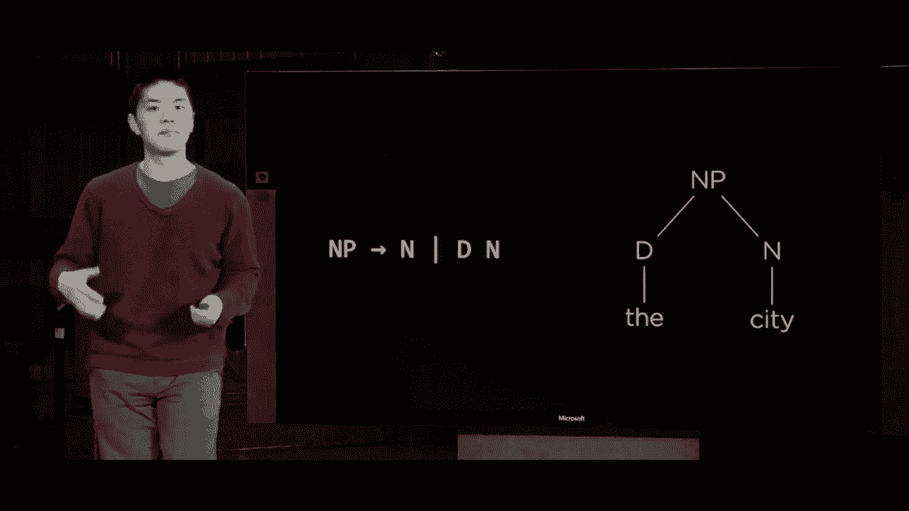

开始构建越来越复杂的结构，除了名词短语外。我们也可以考虑动词短语。

动词短语可能是什么样子呢，动词短语可能只是一个句子中的单个动词，比如我走了，走是动词，在这个句子中充当动词短语，但也有更复杂的动词短语，不仅仅是一个单词，而是多个单词。

句子像她看到了城市，例如看到了城市实际上是这样的。整个动词短语占据了类似于她在做什么的内容，例如。我们的动词短语可能有一个规则。

像这样的动词短语要么只是一个简单的动词，要么是一个动词后面跟着一个名词短语，我们之前看到过。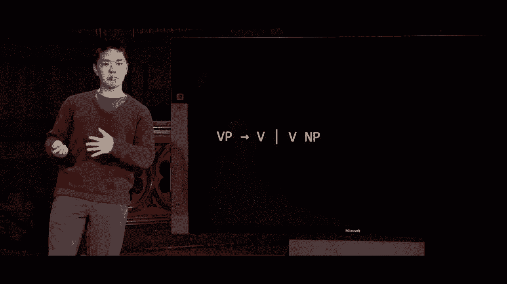

名词短语可以是一个名词，或者是一个限定词后跟一个名词，因此动词短语可能是简单的，比如动词短语只是一个动词，那个动词可能是“走”这个词，但它也可以是更复杂的东西，例如，现在我们开始看到更大的。

语法树，阅读这个语法树的方法是，动词短语是一个动词和一个短语，其中那个动词可以是像“诗篇”这样的东西，而这是我们之前见过的名词短语，“城市”是一个名词短语。

由限定词“the”和名词“city”组成，所有这些结合在一起构成这个更大的动词短语。然后再给一个规则的示例，我们可以。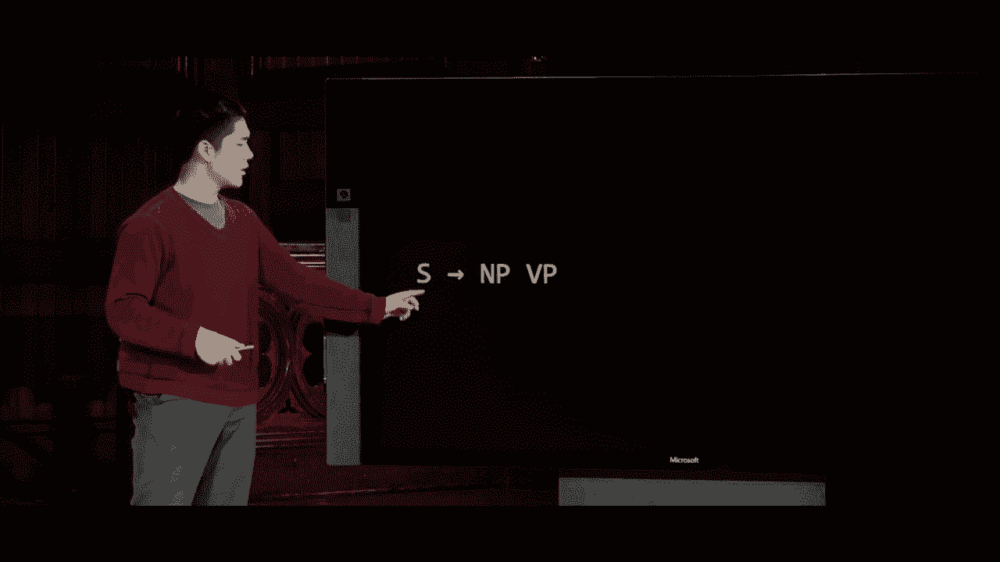

也有这样的规则，句子s由名词短语和动词短语组成。句子的基本结构是。

这是一个名词短语后面跟着一个动词短语，这是一个形式语法。

表达你可能在学习英语语法时学到的概念的方式，当你阅读到一个子句时，句子就像一个主语和动词。主语在行动，某件事发生在特定的名词短语上。因此，利用这个结构，我们可以构造一个看起来像这样的句子。

这是一个句子由名词短语和动词短语组成，名词短语可以只是一个名词，比如单词“她”，动词短语可以是一个动词和一个名词短语，这是我们之前见过的，动词是“看”，名词短语是“城市”。现在看看我们在这里做了什么。

完成的方法是定义一组规则，有一些算法可以运行，处理这些单词。因此，Eyk算法是一个示例，如果你想了解它，你可以从一组终端符号开始，比如她看到了城市，然后使用这些规则，你能够弄清楚如何。

你可以从一个句子“她看到了城市”开始，然后通过这些重写规则，句子由名词短语和动词短语构成，动词短语可以是一个动词和一个名词短语，依此类推，你可以想象取这个结构，并找出如何。

生成一个解析树，一个语法树，为那组终结符和那组单词。如果你试图为一个不合语法的句子这样做，比如“看到了城市她好”，那就行不通，因为没有办法使用这些规则来生成那个句子。

这不在那个语言中，因此这种模型在规则足够表达所有自然语言中你想表达的想法时，可以非常有帮助。当然，使用我们这里的简单规则，有许多句子是我们无法生成的。

有些句子我们可能认为是语法和句法上良好的，但我们无法用这些规则构造。在这种情况下，我们可能需要更复杂的规则来处理这些情况，因此这种方法在你需要时是强大的。

处理一个有限的规则和单词集，这些是你真正关心的。我们可以通过使用一个名为NLTK的Python库来与之交互，今天我们会看到几次。

它有多种不同的功能和类，我们可以利用它，都是为了处理自然语言。其中一个算法是解析上下文无关文法，能够取一些单词并根据某个上下文无关文法来分析。

那么你如何构建这个语法树呢？让我们来看看NLTK。现在通过研究如何构建一些上下文无关文法，来实现这一点。在CFG零CFG中，我有一个示例上下文无关文法，包含我们之前见过的规则。

它会转向名词短语后跟动词短语，名词短语可以是一个限定词和一个名词，或名词动词短语，动词短语可以是一个动词或动词和名词短语，这些的顺序并不重要，限定词可以是“那个”或“一个”，名词可以是“她”、“城市”或“车”，动词可以是某个词。

“看”或者“走”这个词，现在使用我在顶部导入的NLTK，我将解析这个语法并将其保存在一个名为parser的变量中。接下来，我的程序将要求用户输入，像是输入一个句子，然后用split将其按空格分开。

所以我最终获得了每个单独的词，我们将把它们保存在一个叫做句子ISM的列表中，然后我们将尝试解析这个句子，对于我们解析的每个句子，我们将以漂亮的格式输出到屏幕上，以便在我的终端中显示，同时我们还会绘制它。

结果显示NLTK有一些图形能力，因此我们可以真正可视化这个树的样子，并且句子可能被解析的方式有多种，这就是为什么我们将其放入这个。

循环，我们稍后也会看到这有多么有用。所以好吧，现在我会进入CFG目录，我们将运行CFG 0，然后它会提示我输入一个句子，让我输入一个非常简单的句子，比如“她走了”，按回车，我得到的是在左侧你可以。

看一下基于文本的语法树表示，右侧这里让我放大一些，我们看到同一语法树的视觉表示，这就是我的计算机如何解析句子“她走了”的，句子由名词短语和动词短语组成。

每个短语只是一个单独的名词或动词“她”，然后是“走了”，结构与我们之前见过的相同，但这现在是我们的计算机能够理解句子的结构，以便能够获得某种结构。

理解句子的部分是如何相互关联的。让我再给它另一个句子，我可以尝试“她看到了城市”这样。

示例我们刚才处理的词，然后我们最终得到这个语法树，它是一个包含名词短语和动词短语的句子，名词短语相对简单，就是“她”，但动词短语则更复杂，它并没有“看到”。

比如城市，让我们再做一个。

使用这个语法，让我们做一些像“她看到了一辆车”的句子，这看起来会很相似，我们得到的是“她”，但我们的动词短语现在不同，它是“看到了一辆车”，因为在我们的语言中有多个可能的限定词和名词。我没有给这个语法太多词汇，但如果有的话。

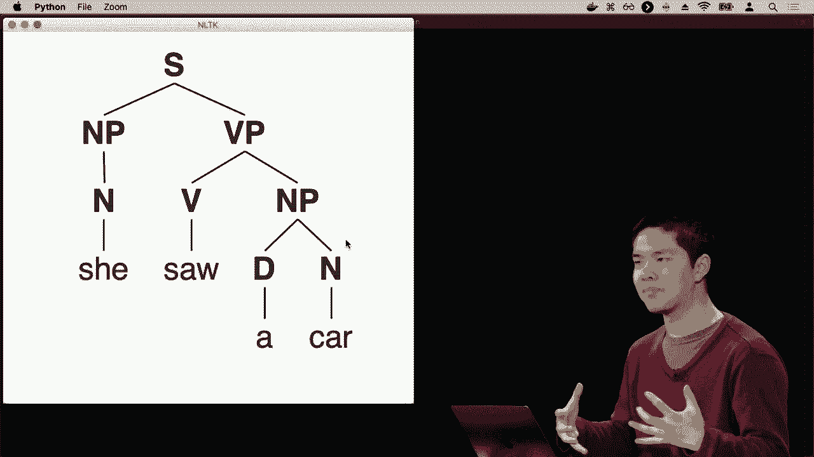

我给它提供了更大的词汇量，它就能理解越来越多的内容。

不同类型的句子，给你增加一些复杂度的感觉，我们可以在这里添加更多的复杂性，我们的语法越复杂，规则越多，我们将能够生成更多不同类型的句子。所以让我们看一下CFG一个例子，我添加了一个完整的。

我添加了一些其他不同类型的规则，比如形容词短语，我们可以在名词短语中有多个形容词，因此名词短语可以像形容词短语后面跟着名词短语，如果我想说像“大城市”，那是一个形容词短语，后面跟着。

可以是一个名词短语，或者我们也可以有一个名词和一个介词短语，例如“街上的车”，其中“在街上”是一个介词短语，我们可能想将这两个想法结合在一起，因为“街上的车”仍然可以作为一种名词短语，因此无需理解。

如果详细讲解所有这些规则，它就开始涉及到英语的本质。

语法，但现在我们有了一种更复杂的方式来理解这些类型的句子，因此如果我运行Python CFG 1，我可以尝试输入一些像“她看到了宽街”的句子，例如一个更。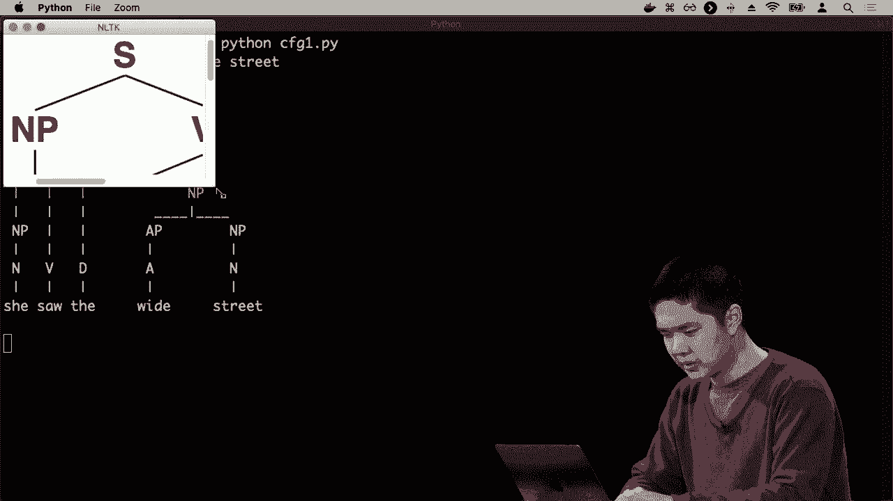

复杂的句子，如果我们让它变大，你可以看到这个句子是什么样的。我会把它缩小一点，所以现在我们有了这样一个句子：她看到了宽街，宽街是一个完整的名词短语。

“看到了宽街”是一个完整的动词短语，而“她看到了宽街”最终形成整个句子。让我们再看一个例子，介绍这种模糊性的概念，所以我可以运行Python CFG 1，让我输入一个像“她看到了带望远镜的狗”的句子，所以这是我们的句子。

这里是一个可能的语法树，表示这个想法：她看到了名词短语“狗”，然后是带有望远镜的介词短语，句子的解释是她看到的是一只狗，而她是如何看到的，她是用望远镜看到的，因此这是一个。

解释她是如何使用单目望远镜的，使用那些望远镜她看到了狗，但另一个。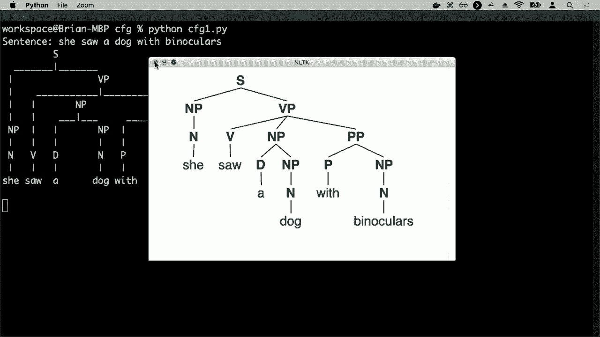

解析该句子的一个可能方式是这里的树。

你可以说她看到了一只带望远镜的狗，其中“带望远镜的狗”形成了一个完整的名词短语，使用相同的词，顺序也相同。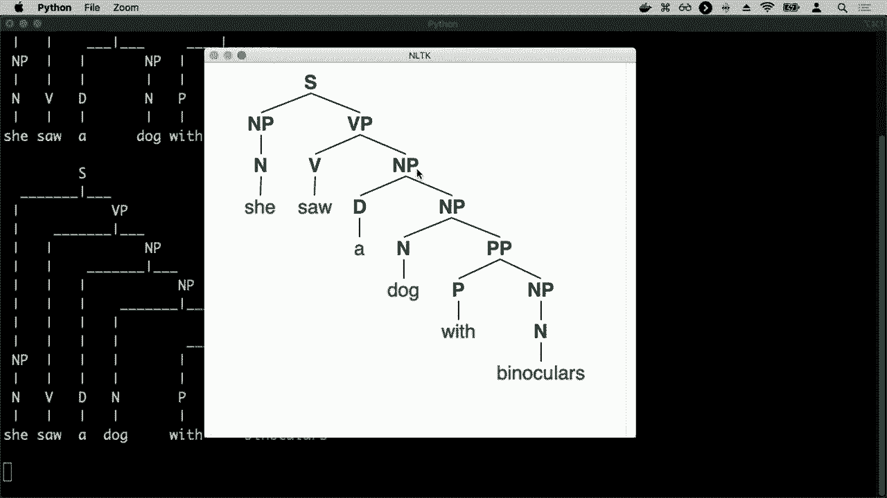

但不同的语法结构，现在我们有一个带着望远镜的狗。所有这些名词短语意味着她看到了什么，她看到的是一只狗，而那只狗恰好有望远镜，因此解析这个句子的不同方式，即便给定相同的可能顺序。

单词和NLTK的算法在这个特定的算法中具有能力，能够找到所有这些，以理解不同的解析句子的方式，并能够提取出一些有用的含义。因此，这就是对的简要概述。

我们可以通过使用这些上下文无关的语法规则来获取语言的结构，以描述语言的结构。但我们可能还关心的是理解这些单词序列在实际中是如何相互关联的。

单词本身的语法使我们之前看到的，能够生成一个句子，比如“我吃了一个香蕉”，其中“我”是名词短语，而“吃了一个香蕉”是动词短语，但它也允许生成像“我吃了一辆蓝色的车”这样的句子，这在语法上也是符合规则的。

这可能是一个人不太可能说的句子，我们可能希望我们的AI能够封装某些单词序列比其他序列更可能或更不可能的概念。因此，为了处理这一点，我们将引入Engram的概念。

更普遍地说，Engram指的是我们文本中的某些n个项目的序列，这些项目可能采取不同的形式。我们可以有字符Engrams，它只是n个字符的连续序列，例如，三个连续的字符或四个连续的字符。

有单词Engrams，它们是连续的。

从特定文本样本中提取的n个连续单词序列，这证明非常有用，你可以选择n来决定我们的序列会有多少。当n为1时，我们只是在查看一个单词或一个字符，这就是我们可能称之为单元组（unigram）的东西，仅一个项目。

这通常被称为二元组，所以一个Engram当n等于二时，查看两个连续的单词。如果有三个项目，你可能想象称之为三元组，所以是三个连续的字符或三个恰好在一个连续序列中的单词。如果我们取一个句子。

例如，这里有一句来自《福尔摩斯探案集》的句子：“我多久说过你，当你排除了不可能的事情，剩下的无论多么不可能的都必须是真相。”如果我们查看三个单词的序列，可以提取出哪些三元组。

第一个三元组将是这三个单词的序列出现的频率，然后我们可以查看下一个三元组，通常是“我”，下一个三元组是“我说”，接着是“我说了”，这都是三元组，显示在文本中的三个连续单词序列。

提取这些图表和三元组或更一般的n-gram，结果证明是非常有帮助的，因为当我们分析大量文本时，一次性分析整个文本并不特别有意义，而是我们希望对文本进行分段。

将其拆分成我们可以开始进行一些分析的片段，尽管我们的AI可能从未见过这整个句子，但它可能见过“对你来说”这个三元组，因为“对你来说”是可能在Rai之前见过的其他文档中出现的，因此它知道一些。

关于那个特定的三个单词的序列，或者像我提到的另一个三个单词的序列，这在英语中是相当常见的，因此我们希望能够提取这些类型的n-gram，我们该如何做到这一点？

我们如何提取三个单词的序列？我们需要将输入以某种方式拆分为所有单独的单词，这个过程通常被称为标记化。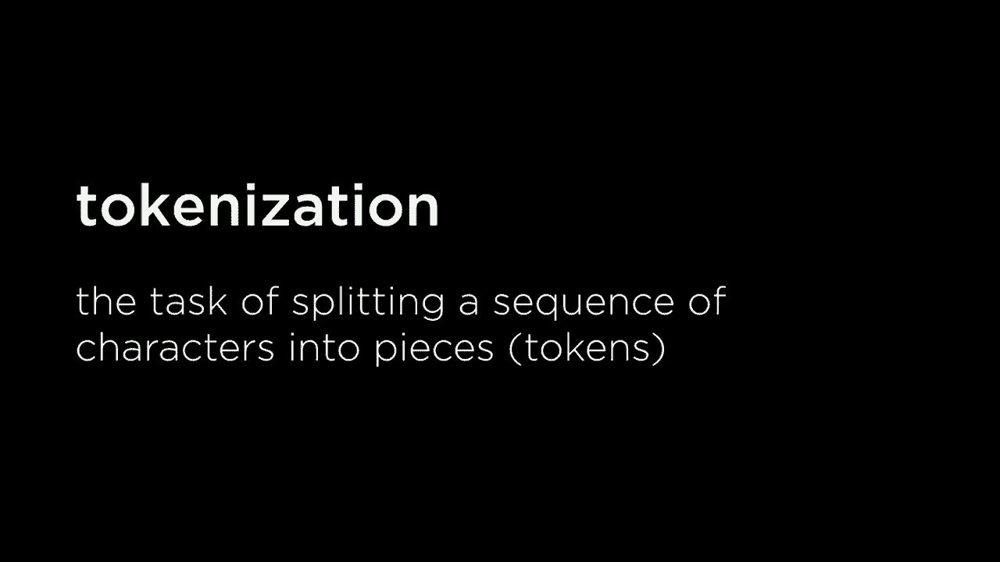

将某个序列拆分成独特的片段，我们称这些片段为标记，最常见的是指单词标记化。我有一些文本序列，我想将其拆分为该文本中出现的所有单词，但这也可能出现在诸如句子标记化的上下文中。

我有一长串文本，我想将其拆分为句子。例如，单词标记化如何运作？ 

将我们的字符序列拆分成单词的任务，我们已经看到了这个想法。在单词标记化中，刚才我对输入序列调用了Python的拆分方法，或者说拆分方法根据空格的出现将那个单词序列分开。如果我有一句话。

像“无论剩下什么，尽管不太可能”。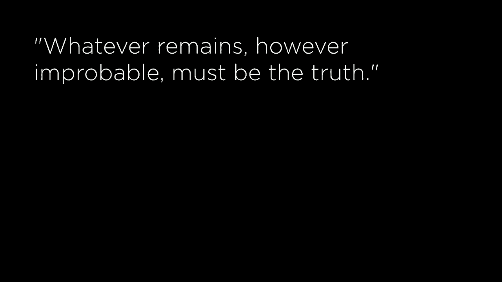

“必定是真理”，我该如何标记化这个？简单的方法是说，每当你看到一个空格，就去拆分它。我们将拆分这个。

仅通过查找特定字符串和空格，我们得到的结果是一句话，诸如“无论剩下什么，尽管不太可能，必定是真理”。但你会注意到，如果我们仅仅根据空格的位置来拆分，我们会保留标点符号，比如有一个逗号。

在“剩下的”之后有一个逗号，在“不太可能”之后有一个句号，在“真理”之后有一个句号。当我们考虑将内容标记化为单独的单词时，这会带来一些挑战，因为如果你将单词彼此进行比较，这个带句号的“真理”如果仅进行字符串比较。

这将与没有句号的“truth”一词有所不同，因此这个标点有时会给我们带来问题，所以我们可能希望以某种方式处理它，要么将标点视为一个完全独立的标记，要么也许完全从我们的序列中移除该标点。

还有，这可能是我们想要做的事情，但在其他情况下，它变得有些不清晰，点钟，福尔摩斯先生迅速走进房间，嗯，这个在9点钟后的撇号，好的，在9点钟的O后面，这是否是我们应该去掉的？我们应该基于这个来分开吗？

好吧，哦，时钟那里也有一些有趣的问题，如果你开始考虑像连字符单词这样的东西，那就更棘手了，像这样，我们有一堆连字符的词，然后你需要做出判断，这是一个分开的地方吗。

将内容拆分为独立单词，还是要把frock-coat、well-cut和pearl-grey视为独立的词，所以这些往往会带来我们需要处理的挑战，这也是我们在尝试执行这种分析时需要做出的决定，类似的挑战。

在句子标记化的世界中会出现，当涉及到这段句子的序列时，想象一下这个句子序列，例如，如果你看看这个特定的句子序列，你可能会想象你可以相当容易地提取句子，这里是一个句子，这里是第二个句子，所以我们有两个。

这个特定段落中的不同句子，其区分特征似乎是句号，句号将一个句子与另一个句子分开，也许还有其他类型的标点符号，比如感叹号或问号，但这就是这些类型。

我们知道的标点符号通常出现在句子的末尾，但如果你看看像这样的句子，那就更棘手了，不仅仅是与福尔摩斯对话，而是与霍尔姆斯先生对话，现在，我们在霍尔姆斯先生后面有一个句号，所以如果你只是基于。

句号你可能会想象这将是一个句子，然后霍尔姆斯会是一个句子，接着我们会有第三个句子，事情确实变得有些棘手，当你开始想象这些情况时，以及对话会使这变得更加复杂，如果你有这些。

里面的行分开，比如说他所说的，这个特定的词序列，以及这个特定的词序列。它们提出了有趣的挑战，涉及到我们如何将句子分开成独立的句子。

这些都是我们的算法在实际中需要决定的内容，通常我们可以使用一些启发式方法，我们知道某些句点的出现，例如Mr.之后的句点，作为其他例子，我们知道这不是新句子的开始，因此我们可以对其进行编码。

将规则融入我们的AI，以使其能够以我们想要的方式进行标记化，因此一旦我们具备了标记特定段落的能力，就可以将段落拆分成单个单词，从而开始提取实际的ngrams，我们可以真正看看这些内容。

通过进入一个Python程序来提取这些ngrams，我们可以使用NLTK，自然语言工具包来帮助我们，因此我们将进入ngrams，查看Engram spy，我们将使用一些文本语料库。

一些文档的序列，使用所有这些文档，并提取最流行的ngrams，因此为了实现这一点，我们将加载从一个我们指定的目录的数据，这个命令行参数还将接受一个数字n。

关于我们应该在多少序列单词中查看，那么我们就会计算所有的NLTK点ngrams，因此我们将查看整个语料库中的所有ngrams，并将其保存在变量ngrams中，然后我们将查看这些内容。

最常见的那些，并打印出来，因此为了做到这一点，我不仅在使用NLTK，还在使用内置于Python中的Counter，我可以计算这些不同ngrams出现的次数。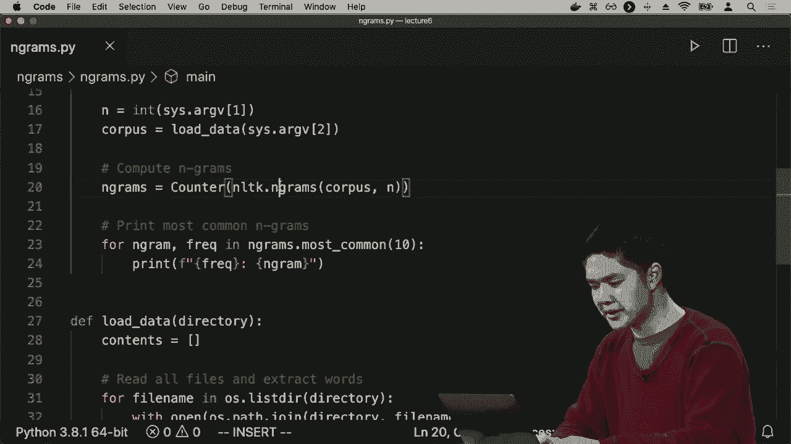

因此我们将进入ngrams，我会说一些类似于python ngrams的内容，我们先来看unigram。

在一个语料库中，单个词的序列，而我准备的语料库是I。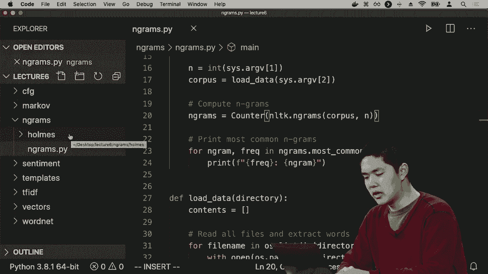

我有所有这些故事，来自福尔摩斯的故事，每一个都是福尔摩斯故事中的一部分，所以我在这个语料库中有很多文本，我将作为命令行参数提供这个语料库。

它将把所有福尔摩斯的故事加载到内存中，或者至少加载我在这个语料库中提供的那些内容，它将查找最流行的unigram，这些流行的单词序列，似乎最流行的就是那个词，使用了9700次。

接下来我用了五千次，使用了大约五千次你可能预期的单词。那么现在，让我们检查一下买grams，例如**福尔摩斯**的二元组，现在再次出现的两个单词序列。

这些是出现频率较高的**bye，Gramps**类型，通常出现在**福尔摩斯**故事的语料库中，这在其他语料库中也可能是真的，但我们只有在实际测试后才能确认。为了保险起见，我们再试一次。

尝试寻找三元组，这些三元组可能会出现，现在我们看到它们像是出现了其中之一，我认为在这些中！

是由三个单词组成的序列，现在它们在多个地方出现。
