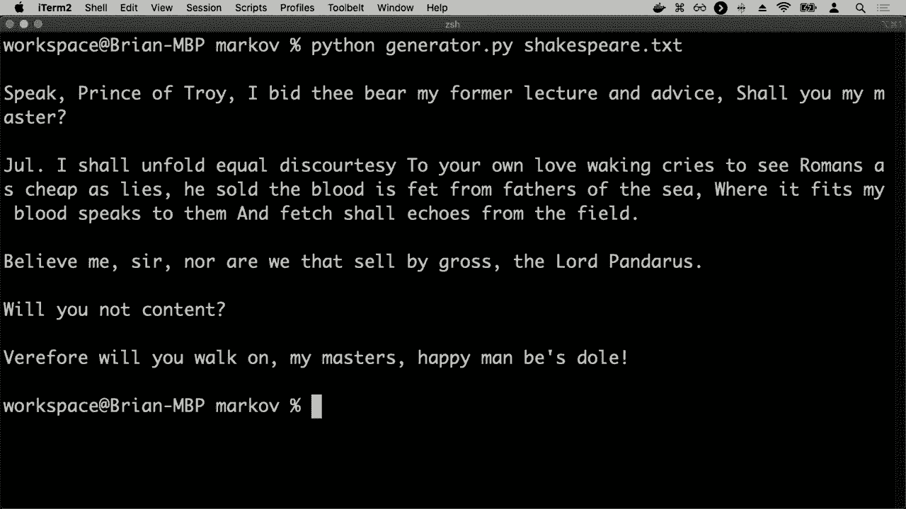
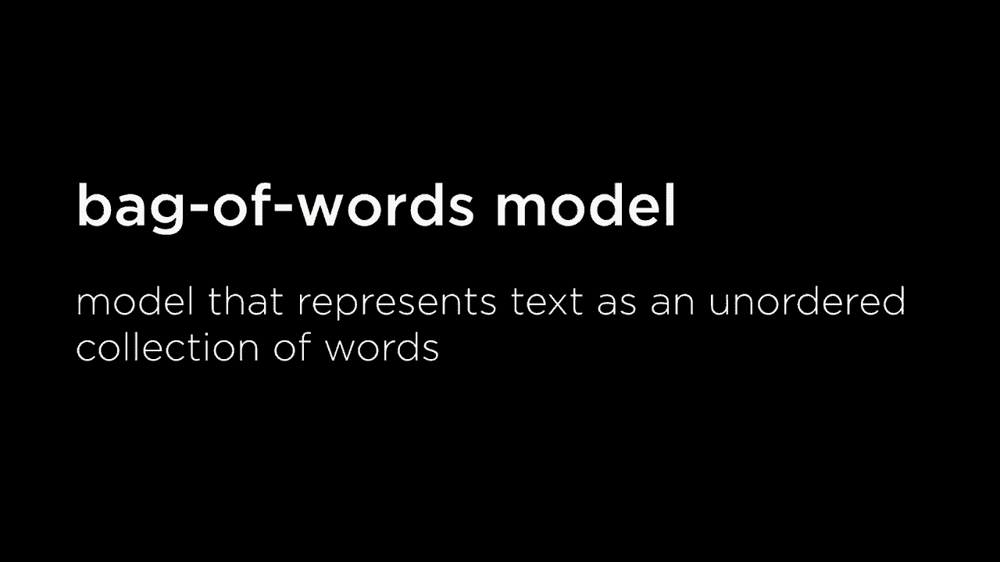
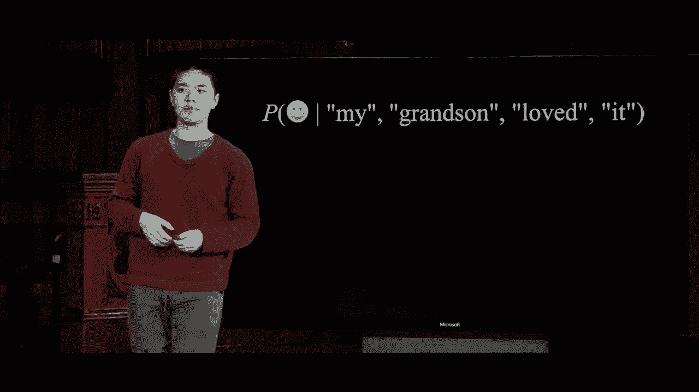
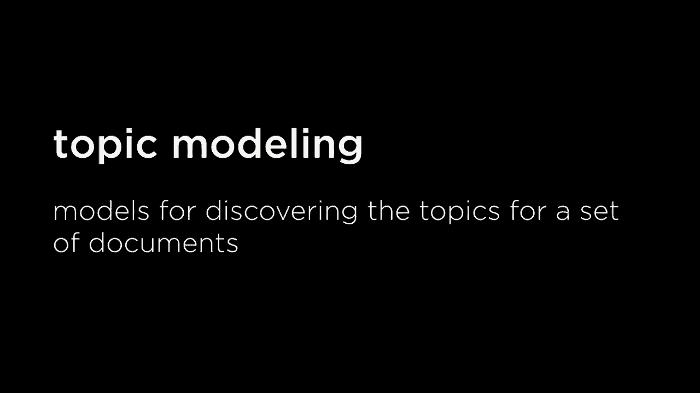
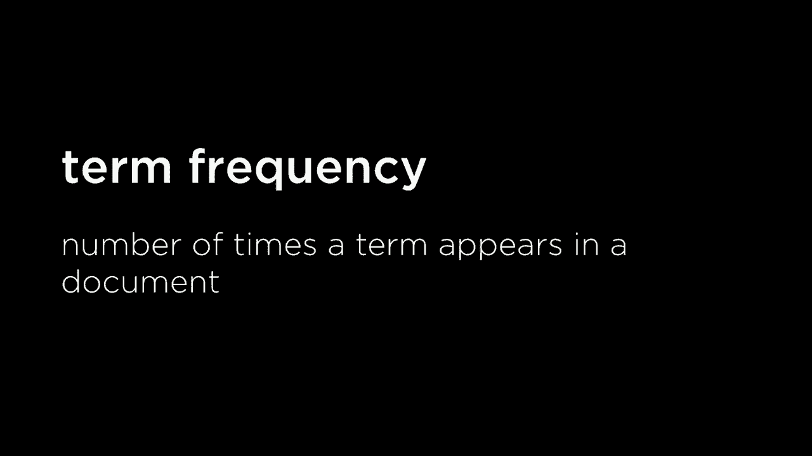
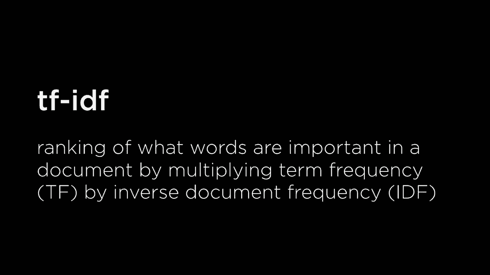
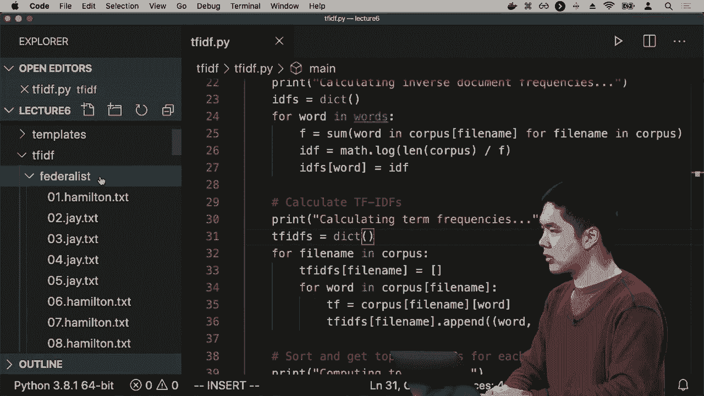
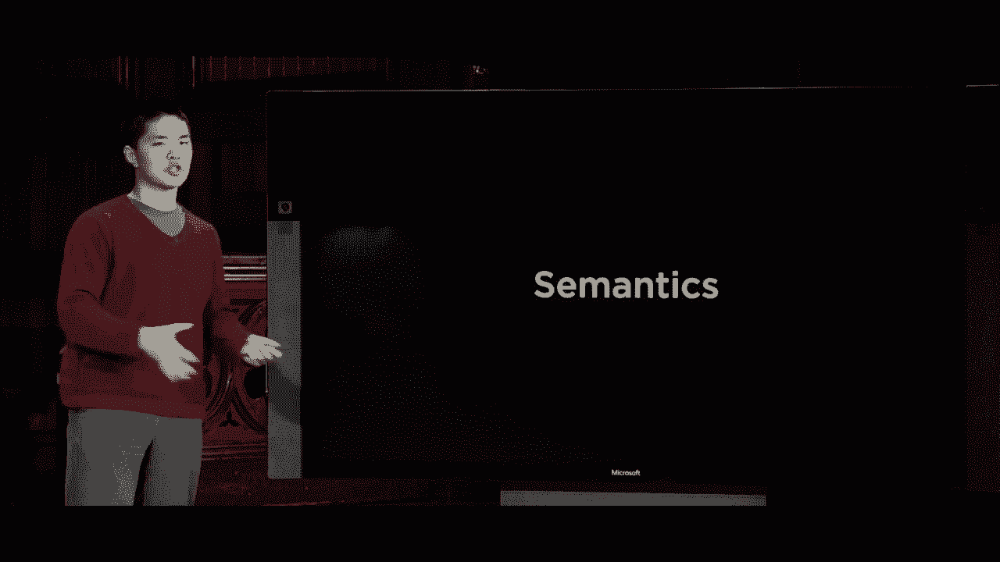

# 哈佛CS50-AI ｜ Python人工智能入门(2020·完整版) - P21：L6- 自然语言处理 2 (马尔可夫，词袋，朴素贝叶斯，信息检索，tf-idf) - ShowMeAI - BV1AQ4y1y7wy

偶尔会多次出现。

这个特定的语料库，那么这里的潜在使用案例是什么？现在我们有一些数据，我们有关于特定单词序列出现的频率，按特定顺序排列，并利用这些数据，我们可以开始做一些预测。我们可能会说，如果你看到这些单词，它是。

有合理的机会，后面跟着的单词应该是单词“a”，如果我看到单词“one of”，可以合理地想象下一个单词可能是单词“the”，例如，因为我们有关于三元组序列的数据，以及它们出现的频率。现在基于两个单词，你可能会。

能够预测第三个单词是什么，而我们可以用来实现这一点的模型是我们之前见过的模型，它是马尔可夫模型。再次回想，马尔可夫模型实际上只指某种事件序列。

发生在一个时间步之后，每个单位都有某种能力来预测下一个单位会是什么，或者可能是过去两个单位预测下一个单位会是什么，或者过去三个单位预测下一个单位会是什么。我们可以使用马尔可夫模型并将其应用于语言。

一种非常幼稚且简单的方法来尝试生成自然语言，让我们的AI能够像英语文本一样说话，它的工作方式是，我们将说一些内容，比如在给定这两个单词的情况下，得到一些概率分布，这个概率分布是什么。

根据所有的数据，第三个单词可能是什么，如果你看到它，可能的第三个单词有哪些，它们出现的频率如何。利用这些信息，我们可以尝试构建我们期望的第三个单词是什么。如果你不断这样做，效果就是我们的马尔可夫模型可以。

有效地开始生成文本并。

能够生成不在原始语料库中的文本，但听起来有点像原始语料库，使用相同的规则。那么我们也来看看一个例子。我们现在在这里，我还有另一个语料库，这是我手上的语料库。

威廉·莎士比亚的所有作品，所以我有一整堆故事。来自莎士比亚，所有的故事都在这个大的文本文件中。因此，我想做的是看看，所有的语言图式，也许看看莎士比亚文本中的所有三元组，然后弄清楚给定两个单词的情况下。

我能预测第三个单词，可能是什么，然后继续。重复这个过程，我有两个单词，预测第三个单词，然后从第二和第三个单词预测，第四个单词，从第三和。第四个单词预测第五个单词，最终生成随机句子。

听起来像莎士比亚的句子，使用莎士比亚所使用的相似单词模式，但实际上从未在莎士比亚中出现过。为了做到这一点，我将展示 generator.py，这将从特定文件读取数据。我使用的一个，Python库叫做 Markova Phi。

将为我完成这个过程，所以这里有一些库，可以。训练一堆文本，并基于该文本生成马尔可夫模型。我将继续并且。

生成五个随机生成的句子，所以我们接下来将深入探讨。马尔可夫，我将对莎士比亚的文本运行生成器，我们看到的是它。会加载这些数据，然后这是，我们得到的五个。不同的句子，这些是，句子在任何地方都没有出现过。

莎士比亚的戏剧，但设计成，听起来像莎士比亚，旨在仅仅取两个单词，并且，预测给定这两个单词莎士比亚可能会选择的第三个单词，跟随他，你知道这些句子可能没有，任何意义，不是说人工智能。

尝试表达任何潜在的，含义，这只是试图。理解基于单词的顺序，接下来可能会出现什么。作为下一个单词，例如，这些是，它能够生成的句子类型。如果你多次运行这个，你会。

最终会得到不同的结果，我，可能再次运行这个，然后得到一个。完全不同的一组五个不同，句子也应该是。

听起来有点像，莎士比亚的句子声音一样。因此，这就是我们如何使用马尔可夫模型，简单地尝试生成语言，语言目前并没有太多意义。你不想在这个当前形式下使用，系统来做。

像机器翻译这样的事情，因为它无法，封装任何意义，但我们。现在开始看到我们的人工智能，逐渐变得更好，尝试。说我们的语言或以某种方式处理自然语言，具有一定的意义。因此我们现在将看一下几项，其他任务，我们可能希望我们的人工智能。

能够执行的任务之一是，文本分类，这实际上就是。

一种分类问题，我们已经，讨论过分类问题。这些问题是，我们希望将某个对象分类。到多个不同类别。

这种文本的表现方式是，无论何时你有一些文本样本，并且想把它归入某个类别，比如说，给定一封邮件，它是否属于收件箱，还是属于垃圾邮件？这两个类别中它属于哪个，你是通过查看文本来实现的。

能够对这些文本进行某种分析，以得出结论，比如说根据出现在邮件中的词汇，我认为这可能属于收件箱，或者我认为它可能属于垃圾邮件，你可能会想象为多种不同类型的。

这种分类问题，你可能想象另一个常见的例子是情感分析，我想分析给定的文本样本，是否有正面情感，还是有负面情感，这可能出现在例如。

例如，网站上的产品评论，或是你有的反馈！

一堆由网站用户提供的数据样本，你想能够快速分析这些评论是正面的还是负面的，人们在说什么，以便了解他们在说什么，以便将文本分类为其中之一。

这两种不同的类别，所以怎么。

我们可以如何处理这个问题呢？让我们看看一些示例产品评论，这里有一些可能出现的产品评论：“我孙子非常喜欢这个，有趣的产品”，**几天后坏了**，这是我很久以来玩过的**最好的**游戏，“有点**廉价和脆弱**，不值得买”。

你可能在亚马逊或易贝或其他某些人们销售产品的网站上看到的不同产品评论，我们人类可以相对容易地将其分类为正面情感或负面情感。我们可能会说第一条和第三条是正面的。

正面情感的信息，第二和第四条可能是负面情感的信息，但我们如何尝试评估这些评论呢？你知道它们是正面还是负面，这最终取决于这些特定评论中的词汇。

在这些特定句子中，现在我们将忽略结构，以及词汇之间的关系，我们只关注词汇本身，所以这里可能有一些关键词，例如**喜欢**、**有趣**和**最好**，这些词可能在更多的正面评论中出现。

而像**破碎**、**廉价**和**脆弱**这样的词，可能更容易出现在负面评论中，而非正面评论。因此，一种处理这种文本分析的方法是，暂时忽略这些句子的结构，也就是说我们不。

我们关心的是单词之间的关系，我们不会尝试解析这些句子以构建它们的语法结构，就像我们刚才看到的那样，但我们可能只依赖于实际使用的单词，依赖于积极评价更有可能的事实。

拥有“最好”、“喜爱”和“有趣”等单词，负面评论更可能包含我们在这种模型中突出显示的负面词汇，这种思考语言的方法通常被称为词袋模型，我们将对其进行建模。

文本样本，不关心它的。

结构，但仅仅关注样本中出现的无序单词集合，我们关心的只是文本中的单词，而不关心这些单词的顺序，也不关心单词的结构，我们不在意什么名词与什么形容词搭配。

事物之间如何相互关联，我们只关心单词，结果证明这种方法在进行分类时，比如积极情感或消极情感，效果相当不错，你可以想象用我们讨论过的多种方式来实现。

分类样式的问题，但在自然语言中，最流行的方法之一是朴素贝叶斯方法，这是分析某事物是否是积极情感或消极情感的一种方法，或者只是试图将一些文本进行分类。

可能的类别，它不仅适用于文本，也适用于其他类型的概念，但在分析文本和自然语言的领域中相当流行，朴素贝叶斯方法基于贝叶斯规则，你可能还记得我们讨论概率时提到的贝叶斯。

规则看起来是这样的，给定某事件A的事件B的概率可以用这个表达式来表示，给定A的B的概率等于给定B的A的概率乘以B的概率除以A的概率，我们看到这只是因为。

条件独立性的定义，以及两个事件一起发生的意义，这就是我们的贝叶斯规则的公式，结果证明它非常有用，我们能够通过翻转这些事件的顺序在这个概率计算中预测一个事件。

这种方法将非常有帮助，我们稍后会看到原因。它能够进行情感分析，因为我想说，消息是积极的概率是多少，或消息是消极的概率是多少，我会简化这个。

使用表情符号只是为了简单，比如积极的概率、消极的概率，这就是我想计算的，但我想在给定一些信息的情况下计算，比如这里是一个文本样本，我的孙子喜欢它，我想知道的不仅仅是什么。

任何消息是积极的概率是什么，但在给定我的孙子喜欢它作为样本文本的情况下，消息是积极的概率是什么？那么，在给定这个信息，即样本中包含单词“我的孙子喜欢它”的情况下，这个是积极消息的概率又是多少呢？

根据词袋模型，我们将真正忽略单词的顺序，而不是将其视为有某种结构的单个句子，而是将其视为一堆不同的单词，我们将要说的是，这个是积极的概率是多少。

给定单词“我的”在消息中的情况下，给定单词“孙子”在消息中的情况下，给定单词“喜欢”在消息中的情况下，以及给定单词在消息中的情况下，词袋模型在这里我们将整个样本视为一堆不同的单词。

这就是我想计算的概率，给定这些单词，这个是积极消息的概率是多少，现在我们可以应用贝叶斯定理，这实际上是某个事件给定某个事件的概率，这正是我想要的。

根据贝叶斯定理，这整个表达式等于……好吧，是我交换了它们的顺序，是所有这些单词在它是积极消息的情况下的概率，乘以它是积极消息的概率，除以所有单词的概率。

所以这只是贝叶斯定理的一个应用，我们已经看到我想要将给定单词的积极概率表示为与积极消息的单词概率相关，结果是你可能会记得我们讨论过的。

关于概率，这个分母无论我们看积极还是消极消息都是相同的，这些单词的概率并没有变化，因为我们下面没有积极或消极的东西，所以我们可以说，rather than just say that this expression up。

这里等于下面这个表达式，它实际上只是与分子成比例，我们可以暂时忽略分母，使用分母会得到一个确切的概率，但实际上我们要做的就是弄清楚概率与什么成比例。

最后，我们必须归一化概率分布，确保概率分布最终的总和为一。所以现在我已经能够形成这个概率，这是我关心的，与这两件事相乘成比例，即单词的概率。

给定正面消息，乘以正面消息的概率，但再次如果你回想我们的概率规则，我们实际上可以将其计算为所有这些事情发生的联合概率，即正面消息的概率乘以这些概率。

给定正面消息的词，实际上就是这些事情的联合概率。这与它是正面消息的概率，以及 my 在句子或消息中，grandson 在样本中，love 在样本中，以及 it 在样本中是一样的。所以，利用这个规则来定义。

联合概率我能够说，这整个表达式现在是与这序列成比例的，这些词的联合概率以及其中的正面内容。所以，现在有趣的问题就是如何计算这个联合概率，我如何弄清楚概率。

给定某个任意消息，它是正面的，并且其中包含单词 my，单词 grandson，单词 loved 和单词 it。你会记得，我们可以通过将所有这些条件概率相乘来计算联合概率。

我想知道 A、B 和 C 的概率，我可以将其计算为 A 的概率乘以给定 A 的 B 的概率乘以给定 A 和 B 的 C 的概率。我可以将这些条件概率相乘，以获得我关心的总体联合概率。

我可以在这里做同样的事情，我可以说，让我们将正面的概率与单词 my 在消息中出现的概率相乘，前提是它是正面的，乘以给定单词 my 在那里且它是正面的情况下，grandson 出现在消息中的概率。

乘以给定这三样东西的 loved 的概率，乘以给定这四样东西的 it 的概率，而这将是一个相当复杂的计算，我们可能没有好的方法去知道答案，比如，孙子出现的概率是多少。

在消息中，前提是它是正面的，且单词 my 在消息中。这并不是我们会有一个容易回答的事情，这就是朴素贝叶斯的朴素之处。我们将简化这个概念，而不是精确计算这个概率分布。

我们假设这些词在已知是积极信息的情况下彼此独立。如果这是一个积极的信息，那么“grandson”在消息中出现的概率并不会因为我知道“loved”不是消息而改变。

在实际情况中，这可能并不一定成立，现实世界中这些词可能并不独立，但我们假设它们独立，以简化我们的模型。事实证明，这种简化仍然让我们获得相当不错的结果，所以我们要做的假设是。

所有这些词出现的概率仅仅取决于消息是积极还是消极。我仍然可以说，“loved”在积极信息中出现的可能性高于在消极信息中出现的可能性，这可能是对的，但我们也会说这不会改变“loved”出现的可能性。

如果我知道“my”这个词出现在消息中，那么它出现的可能性不会因为这是一个积极的信息而变得更可能或不太可能。这些是我们要做的假设，所以虽然上面的表达式与下面的表达式成正比，我们将简单地说它与这个表达式的概率成正比。

积极的信息，然后对于样本中出现的每个单词，我将乘以在已知这是积极的情况下，给定的不是消息的概率，乘以在已知这是积极的情况下，“grandson”出现在消息中的概率，然后依此类推，对其他出现的单词进行同样的处理。

这些数据会包含在样本中，结果是这些数字我们可以计算。我们之所以做这些数学运算，是为了能够计算我们关心的概率分布，基于这些我们实际上可以计算的项。

基于我们可用的一些数据，这就是如今许多自然语言处理的内容，它涉及分析数据。如果我给你一堆标记为积极或消极的评论数据，那么你就可以开始计算这些特定的项。

我可以仅通过查看我的数据来计算一条消息是积极的概率，看看有多少个正样本，然后将其除以总样本数，这就是我认为一条消息是积极的概率，以及“loved”这个词出现在消息中的概率。

这肯定是积极的，我可以根据我的数据来计算。让我看看样本中有多少个包含“love”这个词的正样本，并将其除以我的正样本总数，这将给我一个关于“love”在评论中出现的概率的近似值。

鉴于我们知道评论是正面的，因此这使我们能够计算这些概率。那么我们不妨进行这项计算，计算“我孙子喜欢它”这句话，是正面还是负面的评论。我们如何能够得出这些概率呢？再次上面的数据是。

我们要计算的表达式，以及在这种情况下可用的数据。解读这些数据的方式是，在所有消息中，49%的消息是正面的，51%的消息是负面的，或许在线评论往往会稍微偏向负面。

他们是正面的，至少基于这个特定的数据样本。这就是我所拥有的，然后我有各种不同词的分布，假设这是一个正面消息，那么有多少正面消息包含“我”这个词呢？你知道，大约是30%，而对于负面消息。

消息中有多少条包含“我”的词，大约是20%。所以似乎“我”这个词在正面消息中出现得更频繁，至少在这个分析中稍微多一些。以“孙子”为例，可能在1%的所有正面消息中出现，而在2%的所有负面消息中出现。

“孙子”这个词出现在32%的所有正面消息中，8%的所有负面消息中，例如，“它”这个词在30%的正面消息中出现，而在40%的负面消息中再次出现，这里是一些任意的数据，仅供参考，但现在我们有了可以开始计算的数据。

那么这个表达式，我该如何计算呢？将所有这些值相乘。这实际上是正面概率乘以我所给定的正面概率，再乘以孙子在正面消息中的概率，依此类推，针对其他每个单词，如果你这样做的话。

将所有这些值相乘，你会得到这个0.00014112，单独看这个数字并没有什么特别的意义，但如果你将这个表达式与我知道它是正面的概率相乘，再乘以给定的所有词的概率。

消息是正面的，并且将其与负面情感消息进行比较。我想知道它是负面消息的概率，乘以给定的所有这些词的概率，得出这是一个负面消息的概率。那么我该如何做到这一点呢？为了做到这一点，你只需将负面概率与所有这些条件概率相乘。

如果我将这五个值相乘，那么我得到的值是负面0.00006528，再次强调，这个数值在孤立状态下并没有特别的意义，真正有意义的是处理这两个值。

作为一种概率分布，并且，通过归一化它们，使得这两个值的总和为1，这就是概率分布应有的方式。我们通过将这两个值相加，然后将每个值除以它们的总和来实现归一化——以便能够做到这一点。

当归一化这个概率分布时，你最终得到的结果大概是这样的：正面0.6837，负面0.3163。这似乎让我们能够得出结论，我们对这个消息的正面概率大约有68%的信心。

“我孙子喜欢这个”，为什么我们有68%的信心呢？似乎我们比不更有信心，因为“喜欢”这个词在32%的正面消息中出现，但在8%的负面消息中仅出现，因此这是一个相当强的指标。而对于其他词来说，确实像是这个词出现。

在负面消息中更常出现，无法抵消那种爱在积极消息中远远更常出现，因此这种类型的分析就是我们如何应用朴素贝叶斯，我们刚刚进行了这个计算，最终不仅得到了正面或负面的分类。

但我获得了一种信心，比如我认为它是正面的概率是什么。我可以说，我认为它是正面的概率是这样，因此朴素贝叶斯在尝试实现这一点时可以非常强大，只需使用这个词袋模型。

通过查看样本中出现的单词，我能够得出这些结论。现在一个潜在的缺点是，如果你开始严格按照这个规则应用，你会很快注意到的事情是，数据中如果包含零的话会发生什么，假设例如这个情况。

相同的句子“我孙子喜欢这个”，但我们假设这里的值不是0.01，而是在我们的数据集中，从未发生过在正面消息中出现“孙子”这个词，这确实是可能的，如果我有一个相对较小的。

数据集可能并不一定所有消息都会包含“孙子”这个词，也许在我的数据集中没有任何正面消息包含“孙子”这个词，但如果有2%的负面消息仍然包含“孙子”这个词，那我们就会遇到一个问题。

有趣的挑战在于，当我将所有正数相乘并将所有负数相乘以计算这两种概率时，最终得到的是一个值为零的正值。我得到的是纯零，因为当我将所有的。

当我将某个数乘以零时，无论其他数字是什么，结果都会是零，负数也是如此，因此这似乎是一个问题，因为“孙子”从未出现在任何正面消息中。

在我们的符号内部，我们似乎得出的结论是，信息是正面的概率为零，因此它必须是负面的，因为我们看到“孙子”这个词的唯一情况是在负面消息中。

正面消息更可能包含“爱”这个词，因为我们乘以零，这意味着其他概率完全无关紧要，因此这是我们需要面对的挑战，这意味着我们可能不会每个值在我们的分布中，以便稍微平滑数据。

如果我们纯粹使用这种方法，就能够获得正确的结果，正因为如此，有很多方法可以确保我们不会将某个东西乘以零，将某个东西乘以一个小数字是可以的，因为它可以被其他更大的数字抵消。

但将数字乘以零似乎意味着故事结束了，你将一个数字乘以零，输出将是零，无论其他任何数字有多大，因此，在朴素贝叶斯中，一个相对常见的方法是这种加法平滑的想法，给其他概率加上一个值α。

一种这样的方式称为拉普拉斯平滑。 

这基本上意味着对我们分布中的每个值加一，所以如果我有100个样本，且其中0个包含“孙子”这个词，我可能会说，不如假设我看到了一个额外的样本，其中出现了“孙子”这个词。

“孙子”没有出现，所以我会说，现在我有102个样本中有1个样本包含“孙子”这个词，我基本上创造了两个之前不存在的样本，但通过这样做，我已经能够稍微平滑分布，以确保我从未乘以数字。

通过假设每个类别中都有一个额外的值，我实际上没有的，这让我们得出了一个结果，那就是不必担心将数字乘以零，因此这是我们可以使用的方法，以便在处理的情况下应用朴素贝叶斯。

现在让我们看看如何在实践中应用它，事实证明，MLT不仅具有提取n-gram和将内容标记为单词的能力，还能够在某些样本中应用朴素贝叶斯。

例如文本，所以让我们继续进行，我在 sentiment 中准备了一个语料库，包含我生成的评论，但你可以想象使用真实评论，或者我只有几条正面评论，比如“太棒了”，“非常有趣”，“会推荐给我孙子，他喜欢这些”。

各种消息，我有一堆负面评论，真的不值得，便宜得让人失望，没有按预期工作。每一行都是一堆正面评论和负面评论，我现在想做的是以某种方式分析它们，所以这里是 sentiment.dot.pi。

我们要做的第一件事是提取所有正面和负面的句子，创建一个使用过的所有单词的集合，然后我们将继续训练 NLTK 的朴素贝叶斯分类器，使用所有这些训练数据，而训练数据的有效性。

如果我将所有正面的消息标记为正面，将所有负面的消息标记为负面，然后。我会继续将这个分类器应用于它，我会说我希望将所有的训练数据分类为正面或负面。

然后我会从用户那里获取一些输入，他们可以输入一串单词，然后我想将该序列分类为正面或负面，然后我将打印出每个分类的概率，并且这里有一些辅助函数来组织这些内容。

以ltk所期望的方式呈现，但关键思想是我正在将正面消息标记，将负面消息标记，然后放入分类器中，现在尝试进行分类。

分类一些新文本，所以让我们继续尝试，我将进入情感分析，并运行 Python sentiment，将包含所有正面和负面消息的语料库作为输入，因为根据语料库的不同，这将影响概率。

我们分类的有效性完全依赖于我们的数据有多好，以及我们拥有多少数据，以及这些数据标记得有多好。所以我现在可以尝试一下，像是尝试这样的评论：“太棒了”，就像我可能会留下的评论，似乎有 96% 的机会。

估计这是一个正面消息，4% 的机会是负面的，可能是因为“葡萄”这个词出现在正面消息中，但不出现在负面消息中，这可能是我们的 AI 能够利用的一个方面，实际上它会寻找的是。

区分性的词汇，如果这些词的概率在正面和负面词汇之间相似，那么朴素贝叶斯分类器就不会使用这些值，因为它们在两边是相同的，因此不会在算法中具有某种重要性。

对于正面和负面的值进行相乘，最终得到的结果差不多。最终，影响朴素贝叶斯分类器的区别在于，当你为一个类别乘以一个远大于另一个类别的值时，当一个词如"好"在某一种类型中出现的可能性远高于其他类型时。

一种消息与另一种消息之间的差别，这是朴素贝叶斯分类器的一个好处，尽管我没有告诉它，"好"比"坏"更重要，但朴素贝叶斯可以根据数据来判断，它可以发现这两者出现的频率大致相同，但。

"好"是一个区分器，可以在这两种消息类型之间有所不同，因此我可以再试一次，输入一个句子，比如"非常有趣"，例如，这个句子就有点不那么确定，62%的概率是正面，37%的概率是负面，可能是因为不够明确。

在状态内部的区分器或区分因素，我再尝试一次，比如说"价格过高"，现在95%到96%肯定这是一个负面情绪，可能是因为"价格过高"这个词之前在负面情绪表达中出现过，因此你知道这是什么。

这很可能是一个负面句子，因此现在朴素贝叶斯给了我们能力来分类文本，给定足够的训练数据和示例，我们可以训练我们的AI来分析自然语言中的人类词汇，找出哪些词更可能出现在正面而非。

负面情绪消息中，并据此进行分类，你可以想象在任何时候想要将文本分组为类别时做同样的事情。如果我想将一封电子邮件分类为邮件、好邮件或垃圾邮件，你可以应用类似的想法，尝试查看。

针对具有区分性的词汇，这些词使得一封邮件更有可能被判定为垃圾邮件或不是垃圾邮件，并且仅仅训练一个朴素贝叶斯分类器，以便能够判断这种分布是什么，并能够判断如何将一封邮件分类为好邮件或垃圾邮件。当然，它不会给我们一个。

它给出的不是确定的答案，而是一个概率分布，比如63%为正面，37%为负面，这可能是我们垃圾邮件过滤器和电子邮件有时出错的原因，有时会认为一封好的邮件实际上是垃圾邮件，反之亦然。因为最终，它能做的只是计算概率。

自然语言的分布是模糊的，我们通常可以在概率的世界中处理，试图得到一个合理的答案，即使我们不能确保这确实是我们所期望的数字，因此，我们可以看看如何开始处理这个问题。

处理一些文本，并能够分析这些文本，将其归类为某些类别，但最终除了能够分析文本和分类之外，我们还希望能够，获取文本的信息，从文本中提炼出某种意义，这开始让我们深入思考。

在信息世界中，能够尝试以文本形式获取数据并从中检索信息，因此，一类问题被称为信息检索（IR），即在响应查询时寻找相关文档的任务。这就像你在某处输入查询。

像谷歌这样的搜索引擎，或者你在某个系统中输入某些内容，这将会在图书馆目录中查找，例如，这将会寻找对查询的响应，我想寻找关于美国宪法的文档，或者其他类似的东西。

与匹配该查询的文档相联系，你可以想象我真正想要做的是，为了有效解决这个任务，我需要能够处理文档，找出这些文档的内容。我想知道这些特定文档到底在讲什么。

是关于那些文档的主题之一，这样我就能更有效地从这些特定文档中检索信息，这涉及到一组通常被称为主题建模的任务。

我希望探索一组文档的主题，这正是人类可以做到的，人类可以阅读文档并告诉你，好的，这个文档是关于什么的，并给出几个主题，比如文档中重要的人物和重要的对象。

文档可以告诉你那类事情，但我们希望人工智能也能做到这一点，比如给定某个文档，你能告诉我这个文档中的重要词汇是什么吗？哪些词汇使得股票单位显得特别，如果我根据这些文档进行查找。

例如关键词，因此一种本能和直观的想法是。

可能比较合理的是，我们就用术语频率，术语频率被定义为特定术语在文档中出现的次数，如果我有一份包含一百个单词的文档。

你知道某个特定的词出现了十次，它的词频就是十，没错，它出现得相当频繁，也许这将是一个重要的词。有时你还会看到这个框架，就像是总词数的一个比例，十个词中有100个，可能它的词频是0.1。

意味着所有词中有10%是我关心的这个特定词，最终这并不会相对改变它们在任何特定文档中的重要性，但它们的理念是寻找出现频率较高的词，因为这些词更可能是。

霍顿词在一个语料库中的分布。

文档，所以让我们试试看，比如我想找出福尔摩斯的故事是关于什么的，我有一堆福尔摩斯的故事，我想大致了解它们是关于什么的，重要角色是谁，重要的是什么物品。

这个故事的重要部分是什么，仅仅从词的角度来看，我希望AI能够自己弄清楚这点，它将通过查看词频来实现，找出出现得最频繁的词。因此我们将继续，我将进入tf-idf目录。

你会很快明白为什么叫这个名字，但让我们先打开TF 0。pi，它将计算文档语料库中前10个词频，或者也许是前5个词频，文档是来自福尔摩斯的故事，我们将加载所有数据。

进入你的语料库，我们将弄清楚，所有出现在该语料库中的词是什么，我们基本上只需汇总所有的词频，计算每个词在文档中出现的频率，然后打印出前。

因此，有一些数据结构可以查看，如果你愿意，吉姆，确切的代码并不是那么重要，重要的是我们正在做的事情，我们将这些文档提取出来，首先进行排序，我们说像是取出所有出现的词并按。

每个词出现的频率，让我们为每个文档保存出现在这些文档中的前5个词。因此，一些辅助函数你可以查看。

如果你感兴趣可以查看，但这里的关键思想是我们要做的就是在福尔摩斯的故事上运行T 0，我希望从这个过程中弄清楚福尔摩斯中重要的词是什么，例如，我们将运行这个，看看结果。

数据正在加载，这就是我们为这个特定故事得到的结果。重要的词是“the”、“and”、“an”、“i”、“ii”，这些词在这个故事中出现得最频繁，得出的词是“the”、“and”、“an”、“i”、“a”、“of”。

我们关注的是哪些词在这些不同文档中出现得最频繁，但我们自然获得的只是英语中出现频率很高的词，比如“the”、“of”和“and”，因此它们在这些文档中也很常见。

对于不同的文档来说，这对我们分析重要词汇并没有特别大的帮助，因为这些词只是英语语法结构的一部分。事实证明，我们可以将词汇分为几类，而这些词正好符合。

这些词被称为功能词，它们本身几乎没有意义，但用于在句子中语法性地连接不同部分。这些词包括“am”、“buy”、“do”、“when”等等。

像“which”、“with”和“yet”这样的词单独来看，它们的意思难以界定，它们的意义来自于它们如何连接句子的不同部分，而这些功能词也是如此。

在英语等语言中，我们可以称之为一个封闭的词类，实际上只是一些固定的功能词列表，它们很少变化。这些词是常用来连接语言中其他语法结构的，与我们所称之的内容词形成对比。

这对我们并没有特别大的帮助，我们所使用的术语可能被称为内容词，这些词独立承载意义，例如。

算法类别的计算机词汇实际上有某种意义，而这些通常是我们关心的词。

关于这些词，我们想弄清楚在文档中哪些是重要的词汇。我们可能更关心内容词，而不是功能词，因此一种策略是忽略所有的功能词。在TF one dot pi中，我已经完成了这个。

完全相同的事情，除了我将从一个名为functions words dot text的文件中加载一大堆词，这些词是按字母顺序排列的功能词。这些只是一些用于连接英语中其他词的功能词。

有人编制了这个特定的列表，这些词是我想要忽略的。如果这些词中的任何一个出现，我们就把它当作顶级术语来忽略，因为如果我想分析文档中的重要术语，这些词可能并不重要。

在TF-IDF中，我们实际上做的是，如果这个词在我的功能词集中，我会跳过它，忽略任何功能词，继续下一个词，并计算那些词的频率。因此，我将假装。

功能词不在这里，现在我能更好地理解每个不同福尔摩斯故事中哪些词是重要的。现在让我们在福尔摩斯语料库上运行TF-IDF，看看我们能得到什么，让我们看看每个故事中最重要的词是什么。

故事ISM，好吧，似乎每个故事中最重要的词是“福尔摩斯”。我想这是我们所期望的，因为它们都是福尔摩斯的故事，而“福尔摩斯”不是一个功能词，它不是“the”或“a”或“an”，所以没有被忽略，但“福尔摩斯”这些词可能不是我所指的。

我想知道哪些词是重要的，尽管“福尔摩斯”出现得最频繁，但这并没有给我提供很多关于不同福尔摩斯故事实际内容的信息，原因是“福尔摩斯”出现在所有故事中，因此它没有意义。

如果我说这个故事是关于福尔摩斯的，我想知道在文档中出现的单词，与其他文档中出现的频率较低的单词是什么。因此，我真正想知道的是，哪些词在这篇文档中出现，而在其他文档中出现的频率较低。

在这个概念下，我们引入逆文档频率的概念。逆文档频率是衡量一个单词在整个语料库中出现的普遍性或稀有性的指标，数学上通常是这样计算的：总数的对数。

文档的数量除以包含该词的文档数量。如果像“福尔摩斯”这样的词出现在所有文档中，那么总文档数量就是文档总数，而包含“福尔摩斯”的文档数量也是一样。因此，当你将这两个数相除时，你会得到1。

1的对数就是0，因此，如果福尔摩斯出现在所有文档中，它的逆文档频率就是0。你可以把逆文档频率看作是一个度量，说明在这篇特定文档中，单词出现的稀有程度。如果一个单词没有出现在任何文档中。

如果很多文档都出现，这个数字会高得多，这将导致我们得到一个称为TF-IDF的模型，这是一种通过将这两个概念结合在一起来对文档中的重要词进行排名的方法。将词频（TF）相乘。

逆文档频率（IDF），这里的想法是，一个词的重要性取决于两个因素，它取决于在文档中出现的频率，使用启发式方法：如果一个词出现得越频繁，它可能就越重要，我们将其乘以逆文档频率IDF。

因为如果一个词比较稀有，但出现在文档中，它可能比在大多数或所有文档中出现的词更重要，因为它可能在不同文档中话题的不同重要性较低。

让我们在福尔摩斯语料库上应用这个算法，这就是tf-idf，现在我正在计算每个文档中每个单词的TF分数（词频），乘以该词的逆文档频率，而不仅仅是看单个值，而是进行乘法运算。

将这两个值结合起来，以计算总体值，现在如果我在福尔摩斯语料库上运行tf-idf，这将帮助我们更好地近似每个故事中的重要内容，似乎正在提取角色的名字。

在故事中重要的角色，会在这个故事中出现，而不会在其他故事中出现，并且优先考虑那些出现频率更高的角色，这可能是一个更好的分析，关于话题的类型。

不管重要性如何，我还有另一个语料库，其中包含所有的语料。

如果我对美国历史上的《联邦党人文集》运行tf-idf，我们可以开始看到各个《联邦党人文集》中重要的单词是什么，而在第61篇中，似乎是关于这一组内容。

对于弹劾，你可以通过观察在多个文档中出现的关键词，提取出重要的术语和单词，它们在某些文档中出现得足够频繁，而在其他文档中则不出现，这可以成为帮助工具。

理解这种主题建模，弄清楚特定文档的主题，这使我们开始进入语义的世界，即在讨论语言时事物的实际含义，我们不会仅仅考虑词袋。

当我们只是处理一段文本时，我们处理的是一大堆单词。
